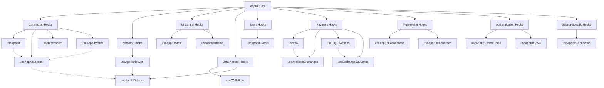

```mermaid theme={null}
graph TD
  AppKit[AppKit Core] --> ConnHooks[Connection Hooks]
  AppKit --> NetworkHooks[Network Hooks]
  AppKit --> UIHooks[UI Control Hooks]
  AppKit --> DataHooks[Data Access Hooks]
  AppKit --> EventHooks[Event Hooks]
  AppKit --> PaymentHooks[Payment Hooks]
  AppKit --> MultiWalletHooks[Multi-Wallet Hooks]
  AppKit --> AuthHooks[Authentication Hooks]
  AppKit --> SolanaHooks[Solana-Specific Hooks]
  
  ConnHooks --> useAppKit
  ConnHooks --> useAppKitAccount
  ConnHooks --> useAppKitProvider
  ConnHooks --> useDisconnect
  ConnHooks --> useAppKitWallet
  
  NetworkHooks --> useAppKitNetwork
  
  UIHooks --> useAppKitState
  UIHooks --> useAppKitTheme
  
  DataHooks --> useWalletInfo
  DataHooks --> useAppKitBalance
  
  EventHooks --> useAppKitEvents
  
  PaymentHooks --> usePay
  PaymentHooks --> useAvailableExchanges
  PaymentHooks --> usePayUrlActions
  PaymentHooks --> useExchangeBuyStatus
  
  MultiWalletHooks --> useAppKitConnections
  MultiWalletHooks --> useAppKitConnection
  
  AuthHooks --> useAppKitUpdateEmail
  AuthHooks --> useAppKitSIWX
  
  SolanaHooks --> useAppKitConnectionSolana[useAppKitConnection]
  
  useAppKit -.-> useAppKitAccount
  useAppKitAccount -.-> useAppKitBalance
  useAppKitNetwork -.-> useAppKitBalance
  useAppKitWallet -.-> useAppKitAccount
  usePay -.-> useAvailableExchanges
  usePayUrlActions -.-> useExchangeBuyStatus
```

# llms-full.txt
**URL:** https://docs.reown.com/llms-full.txt
**Page Title:** 
--------------------

### (Raw Extraction Fallback)

# Pairing API
Source: https://docs.reown.com/advanced/api/core/pairing

The Pairing API is a lightweight API for establishing an encrypted, protocol-agnostic communication layer between peers.
Its purpose is to provide a secure channel for proposing protocols or sending requests between dapp and wallet.

<Card title="Don't have a project ID?" icon="circle-info" href="https://dashboard.reown.com/?utm_source=cloud_banner&utm_medium=docs&utm_campaign=backlinks">
  Head over to Reown Dashboard and create a new project.
</Card>

## Installation

<Tabs>
  <Tab title="Web">
    WalletConnect currently offers Sign and Auth SDKs.
    To allow a reusable communication channel between peers,
    the Pairing API exposes a standard interface and allows for sending and receiving multi-protocol requests over a single pairing.

    Each SDK uses the same implementation of `core/pairing` (via `@walletconnect/core`) to manage pairings.
    To run multiple SDKs side-by-side (e.g. Sign and Auth), please refer to the \[Sharing a Core instance] guide.
  </Tab>

  <Tab title="iOS">
    #### Add SDK for your project.

    You can add a WalletConnect Core SDKs to your project with Swift Package Manager. In order to do that:

    1. Open XCode
    2. Go to File -> Add Packages
    3. Paste the repo GitHub URL: [https://github.com/reown-com/reown-swift](https://github.com/reown-com/reown-swift)
    4. Tap Add Package
    5. Select WalletConnectPairing check mark
  </Tab>

  <Tab title="Android">
    Kotlin implementation of Android CoreClient for all WalletConnect SDKs. This SDK is developed in Kotlin and usable in both Java and Kotlin files.

    

    #### Requirements

    * Android min SDK 23
    * Java 11

    #### Installation

    root/build.gradle.kts:

    ```gradle theme={null}
    allprojects {
     repositories {
        mavenCentral()
        maven { url "https://jitpack.io" }
     }
    }
    ```

    app/build.gradle

    ```gradle theme={null}
    implementation("com.walletconnect:android-core:release_version")
    ```

    #### Project set up

    To use initialize RelayClient properly you will need a projectId. Go to [https://dashboard.reown.com/app](https://dashboard.reown.com/app), register your project and get projectId.

    #### CoreClient initialization

    Before using any of the WalletConnect Kotlin SDKs, it is necessary to initialize the CoreClient. The initialization of CoreClient must always happen in the Android Application class. Provide the projectId generated in the Reown Dashboard, the WebSocket URL, choose the connection type, and pass the application class. You can also pass your own Relay instance using the `RelayConnectionInterface`.

    ```kotlin theme={null}
    val projectId = "" //Get Project ID at https://dashboard.reown.com/
    val connectionType = ConnectionType.AUTOMATIC or ConnectionType.MANUAL
    val application = //Android Application level class
    [Optional] val optionalRelay: RelayConnectionInterface? = /*implement interface*/

    CoreClient.initialize(projectId = projectId, connectionType = connectionType, application = application, relay = optionalRelay)
    ```

    #### Using your own Relay instance

    The CoreClient offers the ability to use a custom Relay client. Just creating an instance of `RelayConnectionInterface` and passing it to `CoreClient.initialize`.

    ```kotlin theme={null}
    ...
    val optionalRelay: RelayConnectionInterface = /*implement interface*/

    CoreClient.initialize(projectId = projectId, connectionType = connectionType, application = application, relay = optionalRelay)
    ```
  </Tab>

  <Tab title="React Native">
    WalletConnect currently offers Sign and Auth SDKs.
    To allow a reusable communication channel between peers,
    the Pairing API exposes a standard interface and allows for sending and receiving multi-protocol requests over a single pairing.

    Each SDK uses the same implementation of `core/pairing` (via `@walletconnect/core`) to manage pairings.
    To run multiple SDKs side-by-side (e.g. Sign and Auth), please refer to the \[Sharing a Core instance] guide.
  </Tab>

  <Tab title=".NET">
    Install the `WalletConnect.Core` nuget package, which implements the Pairing API

    ```shell theme={null}
    dotnet add package WalletConnect.Core
    ```

    Once the `WalletConnect.Core` library is installed, create a Metadata object. It will describe your application and define its appearance in a web browser. Then configure the Pair instance with a metadata object you have instantiated.

    ```csharp theme={null}
    var metadata = new Metadata()
    {
        Name = "my-app",
        Description = "My app description",
        Icons = new[] { "https://walletconnect.com/meta/favicon.ico" },
        Url = "https://walletconnect.com",
    }

    var options = new CoreOptions()
    {
        ProjectId = "...",
        Name = "my-app",
    }

    var core = new WalletConnectCore(options);
    core.Pairing.Configure(metadata);
    ```
  </Tab>

  <Tab title="Unity">
    <Tip>
      Since `WalletConnectUnity` is a wrapper around `WalletConnectSharp`, usage of the pairing API is identical to `.NET`. Please refer to .NET documentation on how to use Pairing inside `WalletConnectUnity`.
    </Tip>

    #### Package Installation

    <Tabs>
      <Tab title="OpenUPM CLI">
        To install packages via OpenUPM, you need to have [Node.js](https://nodejs.org/en/) and [openupm-cli](https://openupm.com/docs/getting-started.html#installing-openupm-cli) installed. Once you have them installed, you can run the following commands:

        ```bash theme={null}
        openupm add com.walletconnect.core
        ```
      </Tab>

      <Tab title="Package Manager with OpenUPM">
        1. Open `Advanced Project Settings` from the gear ⚙ menu located at the top right of the Package Manager’s toolbar
        2. Add a new scoped registry with the following details:
           * Name: `OpenUPM`
           * URL: `https://package.openupm.com`
           * Scope(s): `com.walletconnect`
        3. Press plus ➕ and then `Save` buttons
        4. In the Package Manager windows open the add ➕ menu from the toolbar
        5. Select `Add package by name...`
        6. Enter the package name:
           * `com.walletconnect.core`
        7. Press `Add` button
      </Tab>

      <Tab title="Package Manager with Git URL">
        1. Open the add ➕ menu in the Package Manager’s toolbar
        2. Select `Add package from git URL...`
        3. Enter the package URL:

        **WalletConnectUnity Core**

        ```
        https://github.com/WalletConnect/WalletConnectUnity.git?path=Packages/com.walletconnect.core
        ```

        4. Press `Add` button

        It's possible to lock the version of the package by adding `#{version}` at the end of the git URL, where `#{version}` is the git tag of the version you want to use.
        For example, to install version `1.0.1` of WalletConnectUnity Modal, use the following URL:

        ```
        https://github.com/WalletConnect/WalletConnectUnity.git?path=Packages/com.walletconnect.core#core/1.0.1
        ```
      </Tab>
    </Tabs>

    #### WebGL

    Due to WebGL's single-threaded nature, certain asynchronous operations like `Task.Run`, `Task.ContinueWith`, `Task.Delay`, and `ConfigureAwait(false)` are not natively supported.

    To enable these operations in WebGL builds, an additional third-party package, [WebGLThreadingPatcher](https://github.com/VolodymyrBS/WebGLThreadingPatcher), is required. This package modifies the Unity WebGL build to delegate work to the `SynchronizationContext`, allowing these operations to be executed on the same thread without blocking the main application. Please note that all tasks are still executed on a single thread, and any blocking calls will freeze the entire application.

    The [WebGLThreadingPatcher](https://github.com/VolodymyrBS/WebGLThreadingPatcher) package can be added via git URL:

    ```
    https://github.com/VolodymyrBS/WebGLThreadingPatcher.git
    ```

    #### Initialization

    1. Fill in the Project ID and Metadata fields in the `Assets/WalletConnectUnity/Resources/WalletConnectProjectConfig` asset.
       * If you don't have a Project ID, you can create one at [Reown Dashboard](https://dashboard.reown.com).).
       * The `Redirect` fields are optional. They are used to redirect the user back to your app after they approve or reject the session.
    2. Initialize `WalletConnect` and get reference to the instance of `Core`:

    ```csharp theme={null}
    // Initialize singleton
    await WalletConnect.Instance.InitializeAsync();

    // Or handle instancing manually
    var walletConnectUnity = new WalletConnect();
    await walletConnectUnity.InitializeAsync();

    var core = WalletConnect.Instance.SignClient.Core;
    ```
  </Tab>
</Tabs>

## Usage

<Tabs>
  <Tab title="Web">
    The methods listed below are limited to only the public methods of the Pairing API that we recommend you interact with directly.
    For an exhaustive list, please refer to the spec and/or implementation linked under [Useful Links](https://specs.walletconnect.com/2.0/specs/clients/core/pairing/pairing-methods) above.

    The keyword `sdkClient` is used here as a placeholder for any WalletConnect SDK that implements the Pairing API (e.g. `signClient`, `authClient`, etc).

    ```ts theme={null}
     // Creates a new (inactive) pairing. Returns the URI for a peer to consume via `pair`, as well as the pairing topic.
    const {topic, uri} = await sdkClient.core.pairing.create()

    // Pair with a peer's proposed pairing, extracted from the provided `uri` parameter.
    await sdkClient.core.pairing.pair({ uri: "wc:1b3eda3f4..." })

    // Activate a previously created pairing (e.g. after the peer has paired), by providing the pairing topic.
    await sdkClient.core.pairing.activate({ topic: "1b3eda3f4..." })

    // Updates the expiry of an existing pairing, by providing the pairing topic and an `expiry` in seconds (e.g. `60` for one minute from now)
    await sdkClient.core.pairing.updateExpiry({ topic: "1b3eda3f4...", expiry: 60 })

    // Updates a pairing's metadata, by providing the pairing topic and the desired metadata.
    await sdkClient.core.pairing.updateMetadata({ topic: "1b3eda3f4...", metadata: { name: "MyDapp", ... } })

    // Returns an array of all existing pairings.
    const pairings = sdkClient.core.pairing.getPairings()

    // Pings a pairing's peer, by providing the pairing topic.
    await sdkClient.core.pairing.ping({ topic: "1b3eda3f4..." })

    // Disconnects/Removes a pairing, by providing the pairing topic.
    await sdkClient.core.pairing.disconnect({ topic: "1b3eda3f4..." })
    ```

    #### Listeners for pairing-related events

    The Pairing API currently emits the following events:

    * `pairing_ping`
    * `pairing_delete`
    * `pairing_expire`

    Any of these events can be listened for via the standard Node [`EventEmitter` interface](https://nodejs.org/api/events.html#class-eventemitter):

    ```ts theme={null}
    sdkClient.core.pairing.events.on("pairing_delete", ({ id, topic }) => {
      // clean up after the pairing for `topic` was deleted.
    });
    ```
  </Tab>

  <Tab title="iOS">
    Create an AppMetadata object. It will describe your application and define its appearance in a web browser.

    Starting from WalletConnect SDK version 1.9.5, the `redirect` field in the `AppMetadata` object is mandatory. Ensure that the provided value matches your app's URL scheme to prevent redirection-related issues.

    Then configure the Pair instance with a metadata object you have instantiated.

    ```swift theme={null}
    let metadata = AppMetadata(name: <String>,
                               description: <String>,
                               url: <String>,
                               icons: <[String]>,
                               redirect: AppMetadata.Redirect(native: "example://", universal: nil))

    Pair.configure(metadata: metadata)
    ```

    #### Pairing Wallet Usage

    In pair wallet with dapp, the user needs to scan a QR code or open a deep link generated by dapp, then instantiate `WalletConnectURI` from the scanned QR code string and call the `pair()` function as follows.

    ```swift theme={null}
    let uri WalletConnectURI(string: <String>)
    try! await Pair.instance.pair(uri: uri)
    ```

    Now wallet and a dapp have a secure communication channel that will be used by top level APIs.

    #### Pairing Dapp Usage

    In order to pair dapp and a wallet, dapp needs to generate and share a uri with wallet.
    To generate a uri call `create()` function on Pair instance as follows.

    ```swift theme={null}
    let uri = try await Pair.instance.create()
    ```

    Now you can share the uri with the wallet.
  </Tab>

  <Tab title="Android">
    #### **Create Pairing**

    ```kotlin theme={null}
    val pairing: Pairing? = CoreClient.Pairing.create() { error -> }
    ```

    When first establishing a pairing with a Peer, call `CoreClient.Pairing.create`. This will try and generate a new pairing with a URI parameter that can be used to establish a connection with the other Peer as well as other meta data related to the pairing.

    #

    #### **Pair Clients**

    ```kotlin theme={null}
    val pairingParams = Core.Params.Pair(pairingUri)
    CoreClient.Pairing.pair(pairingParams) { error -> }
    ```

    To pair the wallet with the Dapp, call the CoreClient.Pairing's pair function which needs a `Core.Params.Pair` parameter. `Core.Params.Pair` is where the WC Uri will be passed.

    #

    #### **Get List of Active Pairings**

    ```kotlin theme={null}
    val listOfActivePairings: List<Core.Model.Pairing> = CoreClient.Pairing.getPairings()
    ```

    To get a list of the most current active pairings, call `CoreClient.Pairing.getPairings()` which will return a list of type `Core.Model.Pairing`.

    #

    #### **Disconnect a Pairing**

    ```kotlin theme={null}
    CoreClient.Pairing.disconnect(topic = /*Pairing topic*/") { error -> }
    ```

    To disconnect from a pairing, just pass the topic of the pairing to disconnect from (use `getPairings()` to get a list of all active pairings and their topics).
  </Tab>

  <Tab title="React Native">
    The methods listed below are limited to only the public methods of the Pairing API that we recommend you interact with directly.
    For an exhaustive list, please refer to the spec and/or implementation linked under [Useful Links](https://specs.walletconnect.com/2.0/specs/clients/core/pairing/pairing-methods) above.

    The keyword `sdkClient` is used here as a placeholder for any WalletConnect SDK that implements the Pairing API (e.g. `signClient`, `authClient`, etc).

    ```ts theme={null}
     // Creates a new (inactive) pairing. Returns the URI for a peer to consume via `pair`, as well as the pairing topic.
    const {topic, uri} = await sdkClient.core.pairing.create()

    // Pair with a peer's proposed pairing, extracted from the provided `uri` parameter.
    await sdkClient.core.pairing.pair({ uri: "wc:1b3eda3f4..." })

    // Activate a previously created pairing (e.g. after the peer has paired), by providing the pairing topic.
    await sdkClient.core.pairing.activate({ topic: "1b3eda3f4..." })

    // Updates the expiry of an existing pairing, by providing the pairing topic and an `expiry` in seconds (e.g. `60` for one minute from now)
    await sdkClient.core.pairing.updateExpiry({ topic: "1b3eda3f4...", expiry: 60 })

    // Updates a pairing's metadata, by providing the pairing topic and the desired metadata.
    await sdkClient.core.pairing.updateMetadata({ topic: "1b3eda3f4...", metadata: { name: "MyDapp", ... } })

    // Returns an array of all existing pairings.
    const pairings = sdkClient.core.pairing.getPairings()

    // Pings a pairing's peer, by providing the pairing topic.
    await sdkClient.core.pairing.ping({ topic: "1b3eda3f4..." })

    // Disconnects/Removes a pairing, by providing the pairing topic.
    await sdkClient.core.pairing.disconnect({ topic: "1b3eda3f4..." })
    ```

    #### Listeners for pairing-related events

    The Pairing API currently emits the following events:

    * `pairing_ping`
    * `pairing_delete`
    * `pairing_expire`

    Any of these events can be listened for via the standard Node [`EventEmitter` interface](https://nodejs.org/api/events.html#class-eventemitter):

    ```ts theme={null}
    sdkClient.core.pairing.events.on("pairing_delete", ({ id, topic }) => {
      // clean up after the pairing for `topic` was deleted.
    });
    ```
  </Tab>

  <Tab title=".NET">
    #### Pairing Wallet Usage

    When paring a wallet with a dapp, the user needs to scan a QR code or open a deep link generated by the dapp. Grab the string from the scanned QR code string or from the deep link and call the `Pair()` function as follows.

    ```csharp theme={null}
    var uri = "...";
    PairingStruct pairingData = await core.Pairing.Pair(uri);
    ```

    Now the wallet and a dapp have a secure communication channel that will be used by top level APIs.

    #### Pairing Dapp Usage

    In order to pair dapp and a wallet, dapp needs to generate and share a uri with wallet. To generate a uri call `create()` function on Pair instance as follows.

    ```csharp theme={null}

    var pairData = await core.Pairing.Create();
    string topic = pairData.Topic;
    string uri = pairData.Uri;
    ```

    Now you can share the uri with the wallet either through a QR Code or by using a deep link.

    #### Message Sending / Handling

    Once a wallet and dapp has been paired, they can send messages securely to the pairing topic.

    Requests can be received from the dapp by handling the message callback in the `MessageHandler` module.

    ```csharp theme={null}
    core.MessageHandler.MessageEventHandler<MyRequest, MyResponse>()
        .FilterRequests(r => r.Topic == pairingData.Topic)
        .OnRequest +=
    		async delegate(RequestEventArgs<MyRequest, MyResponse> eventArgs)
    		{
    		    Console.WriteLine(eventArgs.Request);
    		    eventArgs.Response = new MyResponse()
    		    {
    		        // ...
    		    };
    		};
    ```

    A response can be sent for any request by setting the `Response` field in the `eventArgs` parameter.

    Receiving responses is handled the same way, but instead of the `OnRequest` event you would use the `OnResponse` event.

    Request, Responses and Errors can be sent using the `SendRequest` , `SendResult` and `SendError` functions in the `MessageHandler` module.

    ```csharp theme={null}
    long id = await core.MessageHandler.SendRequest<MyRequest, MyResponse>(pairingTopic, data);
    ```
  </Tab>
</Tabs>

# Relay Client
Source: https://docs.reown.com/advanced/api/core/relay

Relay client provides transport layer for Sign, Auth and Chat SDKs.
You can configure it once and every SDK will transport protocol messages via the same instance of a relay client with only one opened WebSocket connection.
The Relay API can be accessed through the Core Client

<Tabs>
  <Tab title="iOS">
    Before using Sign or Auth SDK, it is necessary to configure a shared Networking Client instance. Set a project ID generated when starting a project on Reown Dashboard and SocketFactory instance.

    WalletConnect Swift SDK does not depend on any WebSocket library. SocketFactory parameter allows you to pass your own implementation of WebSocket connection.

    Here's an example of WebSocketFactory implementation using Starscream v3

    ```swift theme={null}
    import Starscream

    extension WebSocket: WebSocketConnecting { }

    struct SocketFactory: WebSocketFactory {
        func create(with url: URL) -> WebSocketConnecting {
            return WebSocket(url: url)
        }
    }
    ```

    Please note that if you have made changes to the list of **Allowed Domains** in the **Reown Dashboard**, then you may encounter an error with the connection if you use **Starscream** or any other socket client. For example, the native implementation of **Starscream** will use the `relay.walletconnect.com` as an `Origin` parameter if not provided, which will be missing from the list of **Allowed Domains**. The solution to this could be the inclusion of the `relay.walletconnect.com` in the **Allowed Domains**, corresponding changes in the socket client implementation, or following changes in the `WebSocketFactory`.

    Create and register App Group Identifier in [Apple Developer Center](https://developer.apple.com/account/resources/identifiers/list/applicationGroup) if needed and provide it during Networking client configuration.

    ```swift theme={null}
    import Starscream

    extension WebSocket: WebSocketConnecting { }

    struct DefaultSocketFactory: WebSocketFactory {
        func create(with url: URL) -> WebSocketConnecting {
            var urlRequest = URLRequest(url: url)
            urlRequest.addValue("allowed.domain.com", forHTTPHeaderField: "Origin")
            return WebSocket(request: urlRequest)
        }
    }
    ```

    #### Networking client configuration

    ```swift theme={null}
    Networking.configure(groupIdentifier: <String>, projectId: <String>, socketFactory: SocketFactory())
    ```

    `groupIdentifier` - App group identifier, created on [Apple Developer Center](https://developer.apple.com/account/resources/identifiers/list/applicationGroup). Enables to share keychain items between the Notify SDK and a UNNotificationServiceExtension to receive and decrypt push notifications.

    #### WebSocket Connection

    By default WebSocket connection is handled internally by the SDK. That means that WebSocket will be safely disconnected when apps go to background and it will connect back when app reaches foreground. But if it is not expected for your app and you want to handle socket connection manually you can do it as follows:

    1. set socketConnectionType for manual

    ```swift theme={null}
    Networking.configure(projectId: <String>, socketFactory: SocketFactory(), socketConnectionType: .manual)
    ```

    2. control socket connection:

    ```swift theme={null}
    try Networking.instance.connect()
    ```

    ```swift theme={null}
    try Networking.instance.disconnect()
    ```
  </Tab>

  <Tab title="Android">
    #### WebSocket connection control

    There are two connection types, Automatic and Manual.

    Automatic connection type enables SDK to control WebSocket connection internally. Meaning, WebSocket connection is closed when app goes to the background and is opened when app goes to the foreground.

    Manual connection type enables developers to control WebSocket connection.

    ```kotlin theme={null}
    CoreClient.initialize(projectId = projectId, connectionType = ConnectionType.MANUAL, application = application)

    CoreClient.Relay.connect() { error -> /*Error when wrong connection type is in use*/ }

    CoreClient.Relay.disconnect() { error -> /*Error when wrong connection type is in use*/ }
    ```
  </Tab>
</Tabs>

# Shared Core Instance
Source: https://docs.reown.com/advanced/api/core/shared-core

<Info>
  The following content are only available for JavaScript.
</Info>

WalletConnect's SDKs are designed to share common logic and resources via the `@walletconnect/core` package.

**If you intend to leverage multiple SDKs together (e.g. Sign + Auth), it is highly recommended to instantiate
a single `Core` instance and pass it to the relevant SDKs.** This avoids each SDK creating its own `Core` instance,
and thus duplicating computation, memory allocation, event listeners etc.

In the following example, we first instantiate a `Core` instance, and then proceed to instantiate both the Sign
and Auth SDK with this shared `Core`:

```ts theme={null}
import { Core } from "@walletconnect/core";
import SignClient from "@walletconnect/sign-client";
import { AuthClient } from "@walletconnect/auth-client";

// First instantiate a separate `Core` instance.
const core = new Core({
  projectId: "<YOUR_PROJECT_ID>",
});

const metadata = {
  name: "Example Dapp",
  description: "Example Dapp",
  url: "#",
  icons: ["https://walletconnect.com/walletconnect-logo.png"],
};

// Pass `core` to the SignClient on init.
const signClient = await SignClient.init({ core, metadata });

// Pass `core` to the AuthClient on init.
const authClient = await AuthClient.init({ core, metadata });
```

# Dapp Usage
Source: https://docs.reown.com/advanced/api/sign/dapp-usage

## Implementation

<Tabs>
  <Tab title="Web">
    This library is compatible with Node.js, browsers and React Native applications (Node.js modules require polyfills for React Native).

    <Note>
      `@walletconnect/modal` is now deprecated. Please use `@reown/appkit` instead. For migration guidance, see the [WalletConnect Modal to Reown AppKit Core migration guide](/appkit/upgrade/wcm).
    </Note>

    <Note>
      For an example implementation, please refer to our `react-dapp-v2`
      [example](https://github.com/WalletConnect/web-examples/tree/main/advanced/dapps/react-dapp-v2).
    </Note>

    #### Install Packages

    <CodeGroup>
      ```bash npm theme={null}
      npm install @walletconnect/sign-client
      ```

      ```bash Yarn theme={null}
      yarn add @walletconnect/sign-client
      ```

      ```bash Bun theme={null}
      bun add @walletconnect/sign-client
      ```

      ```bash pnpm theme={null}
      pnpm add @walletconnect/sign-client
      ```
    </CodeGroup>

    Dapps will also need to install Reown AppKit for the UI.

    <CodeGroup>
      ```bash npm theme={null}
      npm install @reown/appkit
      ```

      ```bash Yarn theme={null}
      yarn add @reown/appkit
      ```

      ```bash Bun theme={null}
      bun add @reown/appkit
      ```

      ```bash pnpm theme={null}
      pnpm add @reown/appkit
      ```
    </CodeGroup>

    #### Create a Session

    **1. Initiate your WalletConnect client with the relay server, using [your Project ID](/cloud/relay).**

    ```javascript theme={null}
    import SignClient from "@walletconnect/sign-client";

    const signClient = await SignClient.init({
      projectId: "<YOUR_PROJECT_ID>",
      // optional parameters
      relayUrl: "<YOUR RELAY URL>",
      metadata: {
        name: "Example Dapp",
        description: "Example Dapp",
        url: "#",
        icons: ["https://walletconnect.com/walletconnect-logo.png"],
      },
    });
    ```

    **2. Add listeners for desired `SignClient` events.**

    <Note>
      To listen to pairing-related events, please follow the guidance for [Pairing
      API event
      listeners](https://specs.walletconnect.com/2.0/specs/clients/core/pairing/pairing-api).
    </Note>

    ```javascript theme={null}
    signClient.on("session_event", ({ event }) => {
      // Handle session events, such as "chainChanged", "accountsChanged", etc.
    });

    signClient.on("session_update", ({ topic, params }) => {
      const { namespaces } = params;
      const _session = signClient.session.get(topic);
      // Overwrite the `namespaces` of the existing session with the incoming one.
      const updatedSession = { ..._session, namespaces };
      // Integrate the updated session state into your dapp state.
      onSessionUpdate(updatedSession);
    });

    signClient.on("session_delete", () => {
      // Session was deleted -> reset the dapp state, clean up from user session, etc.
    });
    ```

    **3. Create a new AppKit instance.**

    ```javascript theme={null}
    import { createAppKit } from "@reown/appkit/core";
    import { mainnet } from "@reown/appkit/networks";

    const modal = createAppKit({
      projectId: "<YOUR_PROJECT_ID>",
      networks: [mainnet],
      manualWCControl: true
    });
    ```

    **4. Connect the application and specify session permissions.**

    ```javascript theme={null}
    try {
      const { uri, approval } = await signClient.connect({
        // Optionally: pass a known prior pairing (e.g. from `signClient.core.pairing.getPairings()`) to skip the `uri` step.
        pairingTopic: pairing?.topic,
        // Provide the namespaces and chains (e.g. `eip155` for EVM-based chains) we want to use in this session.
        requiredNamespaces: {
          eip155: {
            methods: [
              "eth_sendTransaction",
              "eth_signTransaction",
              "eth_sign",
              "personal_sign",
              "eth_signTypedData",
            ],
            chains: ["eip155:1"],
            events: ["chainChanged", "accountsChanged"],
          },
        },
      });

      // Open QRCode modal if a URI was returned (i.e. we're not connecting an existing pairing).
      if (uri) {
        modal.open({ uri });
        // Await session approval from the wallet.
        const session = await approval();
        // Handle the returned session (e.g. update UI to "connected" state).
        // * You will need to create this function *
        onSessionConnect(session);
        // Close the QRCode modal in case it was open.
        modal.close();
      }
    } catch (e) {
      console.error(e);
    }
    ```

    #### Session Authenticate with ReCaps

    The authenticate() method enhances the WalletConnect protocol, offering EVM dApps a sophisticated mechanism to request wallet authentication and simultaneously establish a session. This innovative approach not only authenticates the user but also facilitates a seamless session creation, integrating the capabilities defined by ERC-5573, also known as ReCaps.

    ReCaps extend the SIWE protocol, enabling users to give informed consent for dApps to exercise scoped capabilities on their behalf. This consent mechanism is crucial for authorizing a dApp to perform actions or access resources, thus ensuring security and trust in dApp interactions. These scoped capabilities are specified through ReCap URIs in the resources field of the AuthRequestParams, which translate to human-readable consent in the SIWE message, detailing the actions a dApp is authorized to undertake.

    To initiate an authentication and authorization request, a dApp invokes the authenticate() method, passing in parameters that include desired capabilities as outlined in EIP-5573. The method generates a pairing URI for user interaction, facilitating a streamlined authentication and consent process.

    Example of initiating an authentication request with ReCaps:

    ```typescript theme={null}
    const { uri, response } = await signClient.authenticate({
      chains: ['eip155:1', 'eip155:2'], // chains your dapp requests authentication for
      domain: 'localhost', // your domain
      uri: 'http://localhost/login', // uri
      nonce: '1239812982', // random nonce
      methods: ['personal_sign', 'eth_chainId', 'eth_signTypedData_v4'], // the methods you wish to use
      resources: ['https://example.com'] // any resources relevant to the connection
    })

    // Present the URI to users as QR code to be able to connect with a wallet
    ...

    // wait for response
    const result = await response()

    // after a Wallet establishes a connection response will resolve with auths ( authentication objects ) & the established session
    const { auths, session } = result;

    // now you can send requests to that session
    ```

    #### Making Requests

    Once the session has been established successfully, you can start making JSON-RPC requests to be approved and signed by the wallet:

    ```javascript theme={null}
    const result = await signClient.request({
      topic: session.topic,
      chainId: "eip155:1",
      request: {
        method: "personal_sign",
        params: [
          "0x7468697320697320612074657374206d65737361676520746f206265207369676e6564",
          "0x1d85568eEAbad713fBB5293B45ea066e552A90De",
        ],
      },
    });
    ```

    > For more information on available JSON-RPC requests, see the [JSON-RPC reference](/advanced/multichain/rpc-reference/ethereum-rpc).

    ### Restoring a Session

    Sessions are saved to localstorage, meaning that even if the web page is reloaded, the session can still be retrieved, as demonstrated in the following code:

    ```ts theme={null}
    const lastKeyIndex = signClient.session.getAll().length - 1;
    const lastSession = signClient.session.getAll()[lastKeyIndex];
    ```

    #### Finding a Specific Session

    If you need to find a specific session, you can do so by passing in a known `requiredNamespace` and calling `find`.

    ```ts theme={null}
    const specificSession = _client.find({
      requiredNamespaces: {
        eip155: {
          methods: [
            "eth_sendTransaction",
            "eth_signTransaction",
            "eth_sign",
            "personal_sign",
            "eth_signTypedData",
          ],
          chains: ["eip155:5"],
          events: ["chainChanged", "accountsChanged"],
        },
      },
    });
    ```
  </Tab>

  <Tab title="iOS">
    #### Configure Networking and Pair clients

    Make sure that you properly configure Networking and Pair Clients first.

    * [Networking](/advanced/api/core/relay)
    * [Pairing](/advanced/api/core/pairing)

    #### Configure Sign Client

    In order to initialize a client, call a `configure` method on the Sign instance

    ```swift theme={null}
    Sign.configure(crypto: CryptoProvider)
    ```

    #### Subscribe for Sign publishers

    When your `Sign` instance receives requests from a peer it will publish related event. So you should set subscription to handle them.

    To track sessions subscribe to `sessionsPublisher` publisher

    ```swift theme={null}
    Sign.instance.sessionsPublisher
        .receive(on: DispatchQueue.main)
        .sink { [unowned self] (sessions: [Session]) in
            // reload UI
        }.store(in: &publishers)
    ```

    Following publishers are available to subscribe:

    ```swift theme={null}
        public var sessionsPublisher: AnyPublisher<[Session], Never>
        public var sessionProposalPublisher: AnyPublisher<Session.Proposal, Never>
        public var sessionRequestPublisher: AnyPublisher<Request, Never>
        public var socketConnectionStatusPublisher: AnyPublisher<SocketConnectionStatus, Never>
        public var sessionSettlePublisher: AnyPublisher<Session, Never>
        public var sessionDeletePublisher: AnyPublisher<(String, Reason), Never>
        public var sessionResponsePublisher: AnyPublisher<Response, Never>
        public var sessionRejectionPublisher: AnyPublisher<(Session.Proposal, Reason), Never>
        public var sessionUpdatePublisher: AnyPublisher<(sessionTopic: String, namespaces: [String : SessionNamespace]), Never>
        public var sessionEventPublisher: AnyPublisher<(event: Session.Event, sessionTopic: String, chainId: Blockchain?), Never>
        public var sessionUpdateExpiryPublisher: AnyPublisher<(sessionTopic: String, expiry: Date), Never>
    ```

    #### Connect Clients

    1. Prepare namespaces that constraints minimal requirements for your dApp:

    ```Swift theme={null}
    let methods: Set<String> = ["eth_sendTransaction", "personal_sign", "eth_signTypedData"]
    let blockchains: Set<Blockchain> = [Blockchain("eip155:1")!, Blockchain("eip155:137")!]
    let namespaces: [String: ProposalNamespace] = ["eip155": ProposalNamespace(chains: blockchains, methods: methods, events: []]
    ```

    To learn more on namespaces, check out our [specs](https://specs.walletconnect.com/2.0/specs/clients/sign/namespaces).

    2. Your App should generate a pairing URI and share it with a wallet. Uri can be presented as a QR code or sent via a universal link. Wallet begins subscribing for session proposals after receiving URI. In order to create a pairing and send a session proposal, you need to call the following:

    ```Swift theme={null}
    let uri = try await Sign.instance.connect(requiredNamespaces: namespaces, topic: uri.topic)
    ```

    #### Session Authenticate with ReCaps

    The authenticate() method enhances the WalletConnect protocol, offering EVM dApps a sophisticated mechanism to request wallet authentication and simultaneously establish a session. This innovative approach not only authenticates the user but also facilitates a seamless session creation, integrating the capabilities defined by ERC-5573, also known as ReCaps.

    ReCaps extend the SIWE protocol, enabling users to give informed consent for dApps to exercise scoped capabilities on their behalf. This consent mechanism is crucial for authorizing a dApp to perform actions or access resources, thus ensuring security and trust in dApp interactions. These scoped capabilities are specified through ReCap URIs in the resources field of the AuthRequestParams, which translate to human-readable consent in the SIWE message, detailing the actions a dApp is authorized to undertake.

    To initiate an authentication and authorization request, a dApp invokes the authenticate() method, passing in parameters that include desired capabilities as outlined in EIP-5573. The method generates a pairing URI for user interaction, facilitating a streamlined authentication and consent process.

    Example of initiating an authentication request with ReCaps:

    ```swift theme={null}
    func initiateAuthentication() {
        Task {
            do {
                let authParams = AuthRequestParams.stub() // Customize your AuthRequestParams as needed
                let uri = try await Sign.instance.authenticate(authParams)
                // Present the URI to the user, e.g., show a QR code or send a deep link
                presentAuthenticationURI(uri)
            } catch {
                print("Failed to initiate authentication request: \(error)")
            }
        }
    }
    ```

    ##### Subscribe to Authentication Responses

    Once you have initiated an authentication request, you need to listen for responses from wallets. Responses will indicate whether the authentication request was approved or rejected. Use the authResponsePublisher to subscribe to these events.

    Example subscription to authentication responses:

    ```swift theme={null}
    Sign.instance.authResponsePublisher
        .receive(on: DispatchQueue.main)
        .sink { response in
            switch response.result {
            case .success(let (session, _)):
                if let session = session {
                    // Authentication successful, session established
                    handleSuccessfulAuthentication(session)
                } else {
                    // Authentication successful, but no session created (SIWE-only flow)
                    handleSuccessfulAuthenticationWithoutSession()
                }
            case .failure(let error):
                // Authentication request was rejected or failed
                handleAuthenticationFailure(error)
            }
        }
        .store(in: &subscriptions)
    ```

    In this setup, the authResponsePublisher notifies your dApp of the outcome of the authentication request. Your dApp can then proceed based on whether the authentication was successful, rejected, or failed due to an error.

    Example of AuthRequestParams:

    ```swift theme={null}
    extension AuthRequestParams {
        static func stub(
            domain: String = "yourDappDomain.com",
            chains: [String] = ["eip155:1", "eip155:137"],
            nonce: String = "uniqueNonce",
            uri: String = "https://yourDappDomain.com/login",
            statement: String? = "I accept the Terms of Service: https://yourDappDomain.com/tos",
            resources: [String]? = nil, // here your dapp may request authorization with recaps
            methods: [String]? = ["personal_sign", "eth_sendTransaction"]
        ) -> AuthRequestParams {
            return try! AuthRequestParams(
                domain: domain,
                chains: chains,
                nonce: nonce,
                uri: uri,
                statement: statement,
                resources: resources,
                methods: methods
            )
        }
    }
    ```

    #### Send Request to the Wallet

    Once the session has been established `sessionSettlePublisher` will publish an event. Your dApp can start requesting wallet now.

    ```Swift theme={null}
    let method = "personal_sign"
    let walletAddress = "0x9b2055d370f73ec7d8a03e965129118dc8f5bf83" // This should match the connected address
    let requestParams = AnyCodable(["0x4d7920656d61696c206973206a6f686e40646f652e636f6d202d2031363533333933373535313531", walletAddress])
    let request = Request(topic: session.topic, method: method, params: requestParams, chainId: Blockchain(chainId)!)
    try await Sign.instance.request(params: request)
    ```

    When wallet respond `sessionResponsePublisher` will publish an event so you can verify the response.

    #### Extending a Session

    By default, session lifetime is set for 7 days and after that time user's session will expire. But if you consider that a session should be extended you can call:

    ```Swift theme={null}
    try await Sign.instance.extend(topic: session.topic)
    ```

    Above method will extend a user's session to a week.

    #### Where to go from here

    * Try our [Example dApp](https://github.com/reown-com/reown-swift/tree/main/Example) that is part of [WalletConnectSwiftV2 repository](https://github.com/reown-com/reown-swift).
    * Build API documentation in XCode: go to Product -> Build Documentation
  </Tab>

  <Tab title="Android">
    #### **Initialization**

    ```kotlin theme={null}
    val projectId = "" // Get Project ID at https://dashboard.reown.com/
    val connectionType = ConnectionType.AUTOMATIC or ConnectionType.MANUAL
    val appMetaData = Core.Model.AppMetaData(
        name = "Dapp Name",
        description = "Dapp Description",
        url = "Dapp URL",
        icons = /*list of icon url strings*/,
        redirect = "kotlin-dapp-wc:/request" // Custom Redirect URI
    )

    CoreClient.initialize(projectId = projectId, connectionType = connectionType, application = this, metaData = appMetaData)

    val init = Sign.Params.Init(core = CoreClient)

    SignClient.initialize(init) { error ->
        // Error will be thrown if there's an issue during initialization
    }
    ```

    The Dapp client is responsible for initiating the connection with wallets and defining the required namespaces (CAIP-2) from the Wallet and is also in charge of sending requests. To initialize the Sign client, create a `Sign.Params.Init` object in the Android Application class with the Core Client. The `Sign.Params.Init` object will then be passed to the `SignClient` initialize function.

    #

    # **Dapp**

    #### **SignClient.DappDelegate**

    ```kotlin theme={null}
    val dappDelegate = object : SignClient.DappDelegate {
        override fun onSessionApproved(approvedSession: Sign.Model.ApprovedSession) {
            // Triggered when Dapp receives the session approval from wallet
        }

        override fun onSessionRejected(rejectedSession: Sign.Model.RejectedSession) {
            // Triggered when Dapp receives the session rejection from wallet
        }

        fun onSessionAuthenticateResponse(sessionAuthenticateResponse: Sign.Model.SessionAuthenticateResponse) {
            // Triggered when Dapp receives the session authenticate response from wallet
        }

        override fun onSessionUpdate(updatedSession: Sign.Model.UpdatedSession) {
            // Triggered when Dapp receives the session update from wallet
        }

        override fun onSessionExtend(session: Sign.Model.Session) {
            // Triggered when Dapp receives the session extend from wallet
        }

        override fun onSessionEvent(sessionEvent: Sign.Model.SessionEvent) {
            // Triggered when the peer emits events that match the list of events agreed upon session settlement
        }

        override fun onSessionDelete(deletedSession: Sign.Model.DeletedSession) {
            // Triggered when Dapp receives the session delete from wallet
        }

        override fun onSessionRequestResponse(response: Sign.Model.SessionRequestResponse) {
            // Triggered when Dapp receives the session request response from wallet
        }

        override fun onProposalExpired(proposal: Modal.Model.ExpiredProposal) {
            // Triggered when a proposal becomes expired
        }

        override fun onRequestExpired(request: Modal.Model.ExpiredRequest) {
            // Triggered when a request becomes expired
        }

        override fun onConnectionStateChange(state: Sign.Model.ConnectionState) {
            //Triggered whenever the connection state is changed
        }

        override fun onError(error: Sign.Model.Error) {
            // Triggered whenever there is an issue inside the SDK
        }
    }

    SignClient.setDappDelegate(dappDelegate)
    ```

    The SignClient needs a `SignClient.DappDelegate` passed to it for it to be able to expose asynchronously updates sent from the Wallet.

    #

    #### **Connect**

    ```kotlin theme={null}
    val namespace: String = /*Namespace identifier, see for reference: https://github.com/ChainAgnostic/CAIPs/blob/master/CAIPs/caip-2.md#syntax*/
    val chains: List<String> = /*List of chains that wallet will be requested for*/
    val methods: List<String> = /*List of methods that wallet will be requested for*/
    val events: List<String> = /*List of events that wallet will be requested for*/
    val requiredNamespaces: Map<String, Sign.Model.Namespaces.Proposal> = mapOf(namespace, Sign.Model.Namespaces.Proposal(accounts, methods, events)) /*Required namespaces to setup a session*/
    val optionalNamespaces: Map<String, Sign.Model.Namespaces.Proposal> = mapOf(namespace, Sign.Model.Namespaces.Proposal(accounts, methods, events)) /*Optional namespaces to setup a session*/
    val pairing: Core.Model.Pairing = /*Either an active or inactive pairing*/
    val connectParams = Sign.Params.Connect(requiredNamespaces, optionalNamespaces, pairing)

    fun SignClient.connect(connectParams,
        { onSuccess ->
            /*callback that returns letting you know that you have successfully initiated connecting*/
        },
        { error ->
            /*callback for error while trying to initiate a connection with a peer*/
        }
    )
    ```

    More about optional and required namespaces can be found [here](https://github.com/ChainAgnostic/CAIPs/blob/master/CAIPs/caip-25.md)

    #

    #### **Authenticate**

    The authenticate() method enhances the WalletConnect protocol, offering EVM dApps a sophisticated mechanism to request wallet authentication and simultaneously establish a session. This innovative approach not only authenticates the user but also facilitates a seamless session creation, integrating the capabilities defined by ERC-5573, also known as ReCaps.

    Capabilities are specified through ReCap URIs in the resources field of the Sign.Params.Authenticate, which translate to human-readable consent in the SIWE message, detailing the actions a dApp is authorized to undertake.

    To initiate an authentication and authorization request, a dApp invokes the authenticate() method, passing in parameters that include desired capabilities as outlined in EIP-5573. The method generates a pairing URI for user interaction, facilitating a streamlined authentication and consent process.

    Example of initiating an authentication request with ReCaps:

    ```kotlin theme={null}
     val authenticateParams = Sign.Params.Authenticate(
                domain = "your.domain",
                chains = listof("eip155:1", "eip155:137"),
                methods = listOf("personal_sign", "eth_signTypedData"),
                uri = "https://yourDappDomain.com/login",
                nonce = randomNonce,
                statement = "Sign in with wallet.",
                resources = null, // here your dapp may request authorization with recaps
            )

    SignClient.authenticate(authenticateParams,
        onSuccess = { url ->
            //Handle authentication URI. Show as a QR code a send via deeplink
        },
        onError = { error ->
            //Handle error
        }
    )
    ```

    Once you have sent an authentication request, await for responses from wallets. Responses will indicate whether the authentication request was approved or rejected. Use the onSessionAuthenticateResponse callback to receive a response:

    ```kotlin theme={null}
     fun onSessionAuthenticateResponse(sessionAuthenticateResponse: Sign.Model.SessionAuthenticateResponse) {
            // Triggered when Dapp receives the session authenticate response from wallet

            if (sessionAuthenticateResponse is Sign.Model.SessionAuthenticateResponse.Result) {
                if (sessionAuthenticateResponse.session != null) {
                    // Authentication successful, session established
                } else {
                    // Authentication successful, but no session created (SIWE-only flow)
                }
            } else {
                // Authentication request was rejected or failed
            }

    }
    ```

    #

    #### **Get List of Settled Sessions**

    ```kotlin theme={null}
    SignClient.getListOfSettledSessions()
    ```

    To get a list of the most current settled sessions, call `SignClient.getListOfSettledSessions()` which will return a list of type `Session`.

    #

    #### **Get list of pending session requests for a topic**

    ```kotlin theme={null}
    SignClient.getPendingRequests(topic: String)
    ```

    To get a list of pending session requests for a topic, call `SignClient.getPendingRequests()` and pass a topic which will return
    a `PendingRequest` object containing requestId, method, chainIs and params for pending request.
  </Tab>

  <Tab title="Flutter">
    #### Initialization

    To create an instance of `SignClient`, you need to pass in the core and metadata parameters.

    ```dart theme={null}
    SignClient signClient = await SignClient.createInstance(
        relayUrl: 'wss://relay.walletconnect.com', // The relay websocket URL, leave blank to use the default
        projectId: '123',
        metadata: PairingMetadata(
            name: 'dapp (Requester)',
            description: 'A dapp that can request that transactions be signed',
            url: 'https://walletconnect.com',
            icons: ['https://avatars.githubusercontent.com/u/37784886'],
        ),
    );
    ```

    #### Connection

    To connect with specific parameters and display the returned URI, use `connect` with the required namespaces.

    ```dart theme={null}
    ConnectResponse response = await signClient.connect(
        requiredNamespaces: {
            'eip155': RequiredNamespace(
                chains: ['eip155:1'], // Ethereum chain
                methods: ['eth_signTransaction'], // Requestable Methods
            ),
            'kadena': RequiredNamespace(
                chains: ['kadena:mainnet01'], // Kadena chain
                methods: ['kadena_quicksign_v1'], // Requestable Methods
            ),
        }
    );

    Uri? uri = response.uri;
    ```

    You will use that URI to display a QR code or handle a deep link.

    We recommend not handling deep linking yourself. If you want to deep link, then use the [walletconnect\_modal\_flutter](https://pub.dev/packages/walletconnect_modal_flutter) package.

    #### Session Data

    Once you've displayed the URI you can wait for the future and hide the QR code once you've received session data.

    ```dart theme={null}
    final SessionData session = await response.session.future;
    ```

    #### Request Signatures

    Once the session had been created, you can request signatures.

    ```dart theme={null}
    final signature = await signClient.request(
        topic: session.topic,
        chainId: 'eip155:1',
        request: SessionRequestParams(
            method: 'eth_signTransaction',
            params: 'json serializable parameters',
        ),
    );
    ```

    #### Respond to Events

    You can also respond to events from the wallet, like chain changed, using `onSessionEvent` and `registerEventHandler`.

    ```dart theme={null}
    signClient.onSessionEvent.subscribe((SessionEvent? session) {
        // Do something with the event
    });

    signClient.registerEventHandler(
        namespace: 'kadena',
        event: 'kadena_transaction_updated',
    );
    ```

    # To Test

    Run tests using `flutter test`.
    Expected flutter version is: >`3.3.10`

    # Useful Commands

    * `flutter pub run build_runner build --delete-conflicting-outputs` - Regenerates JSON Generators
    * `flutter doctor -v` - get paths of everything installed.
    * `flutter pub get`
    * `flutter upgrade`
    * `flutter clean`
    * `flutter pub cache clean`
    * `flutter pub deps`
    * `flutter pub run dependency_validator` - show unused dependencies and more
    * `dart format lib/* -l 120`
    * `flutter analyze`
  </Tab>

  <Tab title=".NET">
    #### Setup

    First you must setup `SignClientOptions` which stores both the `ProjectId` and `Metadata`. You may also optionally specify the storage module to use. By default, the `FileSystemStorage` module is used if none is specified.

    ```csharp theme={null}
    var dappOptions = new SignClientOptions()
    {
        ProjectId = "39f3dc0a2c604ec9885799f9fc5feb7c",
        Metadata = new Metadata()
        {
            Description = "An example dapp to showcase WalletConnectSharpv2",
            Icons = new[] { "https://walletconnect.com/meta/favicon.ico" },
            Name = "WalletConnectSharpv2 Dapp Example",
            Url = "https://walletconnect.com"
        },
        // Uncomment to disable persistent storage
        // Storage = new InMemoryStorage()
    };
    ```

    Then, you must setup the `ConnectOptions` which define what blockchain, RPC methods and events your dapp will use.

    *C# Constructor*

    ```csharp theme={null}
    var dappConnectOptions = new ConnectOptions()
    {
        RequiredNamespaces = new RequiredNamespaces()
        {
            {
                "eip155", new RequiredNamespace()
                {
                    Methods = new[]
                    {
                        "eth_sendTransaction",
                        "eth_signTransaction",
                        "eth_sign",
                        "personal_sign",
                        "eth_signTypedData",
                    },
                    Chains = new[]
                    {
                        "eip155:1"
                    },
                    Events = new[]
                    {
                        "chainChanged",
                        "accountsChanged",
                    }
                }
            }
        }
    };
    ```

    *Builder Functions Style*

    ```csharp theme={null}
    var dappConnectOptions1 = new ConnectOptions()
        .RequireNamespace("eip155", new RequiredNamespace()
            .WithMethod("eth_sendTransaction")
            .WithMethod("eth_signTransaction")
            .WithMethod("eth_sign")
            .WithMethod("personal_sign")
            .WithMethod("eth_signTypedData")
            .WithChain("eip155:1")
            .WithEvent("chainChanged")
            .WithEvent("accountsChanged")
        );
    ```

    With both options defined, you can initialize and connect the SDK.

    ```csharp theme={null}
    var dappClient = await WalletConnectSignClient.Init(dappOptions);
    var connectData = await dappClient.Connect(dappConnectOptions);
    ```

    You can grab the `Uri` for the connection request from `connectData`.

    ```csharp theme={null}
    ExampleShowQRCode(connectData.Uri);
    ```

    Then await connection approval using the `Approval` Task object.

    ```csharp theme={null}
    Task<SessionStruct> sessionConnectTask = connectData.Approval;
    SessionStruct sessionData = await sessionConnectTask;

    // or
    // SessionStruct sessionData = await connectData.Approval;
    ```

    This `Task` will return the `SessionStruct` when the session was approved, or throw an exception when the session request has either

    * Timed out
    * Been Rejected

    #### Connected Address

    To get the currently connected address, use the following function

    ```csharp theme={null}
    public class Caip25Address
    {
        public string Address;
        public string ChainId;
    }

    public Caip25Address GetCurrentAddress(string chain)
    {
        if (string.IsNullOrWhiteSpace(chain))
            return null;

        var defaultNamespace = currentSession.Namespaces[chain];

        if (defaultNamespace.Accounts.Length == 0)
            return null;

        var fullAddress = defaultNamespace.Accounts[0];
        var addressParts = fullAddress.Split(":");

        var address = addressParts[2];
        var chainId = string.Join(':', addressParts.Take(2));

        return new Caip25Address()
        {
            Address = address,
            ChainId = chainId,
        };
    }

    public Caip25Address GetCurrentAddress()
    {
        var currentSession = dappClient.Session.Get(dappClient.Session.Keys[0]);

        var defaultChain = currentSession.Namespaces.Keys.FirstOrDefault();

        if (string.IsNullOrWhiteSpace(defaultChain))
            return null;

        return GetCurrentAddress(defaultChain);
    }
    ```

    #### WalletConnect Methods

    All sign methods require the `topic` of the session to be given. This can be found in the `SessionStruct` object given when a session has been given approval by the user.

    ```csharp theme={null}
    var sessionTopic = sessionData.Topic;
    ```

    ##### Update Session

    Update a session, adding/removing additional namespaces in the given topic.

    ```csharp theme={null}
    var newNamespaces = new Namespaces(...);
    var request = await dappClient.UpdateSession(sessionTopic, newNamespaces);
    await request.Acknowledged();
    ```

    ##### Extend Session

    Extend a session's expiry time so the session remains open

    ```csharp theme={null}
    var request = await dappClient.Extend(sessionTopic);
    await request.Acknowledged();
    ```

    ##### Ping

    Send a ping to the session

    ```csharp theme={null}
    var request = await dappClient.Ping(sessionTopic);
    await request.Acknowledged();
    ```

    #### Session Requests

    Sending session requests as a dapp requires to build the request **and** response classes that the session request `params` will be structured. C# is a statically typed language, so these types must be given whenever you do a session request (or do any querying for session requests).

    Currently, **WalletConnectSharp does not automatically assume the object type for `params` is an array**. This is very important, since most EVM RPC requests have `params` as an array type. **Use `List<T>` to workaround this**. For example, for `eth_sendTransaction`, use `List<Transaction>` instead of `Transaction`.

    Newtonsoft.Json is used for JSON serialization/deserialization, therefore you can use Newtonsoft.Json attributes when defining fields in your request/response classes.

    ##### Building a Request type

    Create a class for the request and populate it with the JSON properties the request object has. For this example, we will use `eth_sendTransaction`

    The `params` field for `eth_sendTransaction` has the object type

    ```csharp theme={null}
    using Newtonsoft.Json;

    public class Transaction
    {
        public string from;

        // Newtonsoft.Json attributes can be used
        [JsonProperty("to")]
        public string To;

        [JsonProperty("gas", NullValueHandling = NullValueHandling.Ignore)]
        public string Gas;

        // Properties have limited support
        [JsonProperty("gasPrice", NullValueHandling = NullValueHandling.Ignore)]
        public string GasPrice { get; set; }

        [JsonProperty("value")]
        public string Value { get; set; }

        [JsonProperty("data", NullValueHandling = NullValueHandling.Ignore)]
        public string Data { get; set; } = "0x";
    }
    ```

    <Info>
      [the `params` field is an array of this object](https://ethereum.org/en/developers/docs/apis/json-rpc/#eth_sendtransaction)
    </Info>

    ```json theme={null}
    params: [
      {
        from: "0xb60e8dd61c5d32be8058bb8eb970870f07233155",
        to: "0xd46e8dd67c5d32be8058bb8eb970870f07244567",
        gas: "0x76c0", // 30400
        gasPrice: "0x9184e72a000", // 10000000000000
        value: "0x9184e72a", // 2441406250
        data: "0xd46e8dd67c5d32be8d46e8dd67c5d32be8058bb8eb970870f072445675058bb8eb970870f072445675",
      },
    ]
    ```

    Now, let's define the actual request class we'll use in `dappClient.Request`

    ```csharp theme={null}
    [RpcMethod("eth_sendTransaction"), RpcRequestOptions(Clock.ONE_MINUTE, 99997)]
    public class EthSendTransaction : List<Transaction>
    {
        public EthSendTransaction(params Transaction[] transactions) : base(transactions)
        {
        }
    }
    ```

    The `RpcMethod` class attributes defines the rpc method this request uses. The `RpcRequestOptions` class attributes define the expiry time and tag attached to the request. **Both of these attributes are required**

    We use `List<Transaction>` since the `params` field for `eth_sendTransaction` is actually sent as an object array. If the `params` field was a normal object, then we could use `Transaction` or define the fields directly into this class.

    ##### Sending a request

    The response type for `eth_sendTransaction` is a `string`, so no response type is required to be made. You only need to create a response type if the response type is a custom object.

    ```csharp theme={null}
    var wallet = GetCurrentAddress();
    var result = new EthSendTransaction(new Transaction()
    {
        From = wallet.Address,
        To = wallet.Address,
        Value = "0"
    });

    // Returns the transaction hash or throws an error
    string result = await dappClient.Request<EthSendTransaction, string>(sessionTopic, request, wallet.ChainId);
    ```

    #### Disconnecting

    To disconnect a session, use the `Disconnect` function. You may optional provide a reason for the disconnect

    ```csharp theme={null}
    await dappClient.Disconnect(sessionTopic);

    // or

    await dappClient.Disconnect(sessionTopic, Error.FromErrorType(ErrorType.USER_DISCONNECTED));
    ```

    #### Subscribe to session events

    ```csharp theme={null}
    dappClient.SubscribeToSessionEvent("chainChanged", OnChainChanged);
    ```
  </Tab>

  <Tab title="Unity">
    WalletConnectUnity is a wrapper for WalletConnectSharp. It simplifies managing a single active session, addressing a common challenge with the original library.

    #### Features of WalletConnectUnity

    1. **Simplified Session Management**: WalletConnectSharp is designed to support multiple sessions, requiring developers to manually track and restore the active session. WalletConnectUnity simplifies this process by focusing on a single session, making it easier to manage session restoration.

    2. **Session Restoration**: WalletConnectUnity includes methods to easily access and restore the active session from storage.

    3. **Deep Linking Support**: WalletConnectUnity automatically handles deep linking for mobile and desktop wallets.

    4. **QR Code Generation**: WalletConnectUnity provides a utility for generating QR codes.

    #### Usage

    To use WalletConnectUnity in your project:

    1. Fill in the Project ID and Metadata fields in the `Assets/WalletConnectUnity/Resources/WalletConnectProjectConfig` asset.
       * If you don't have a Project ID, you can create one at [Reown Dashboard](https://dashboard.reown.com).
       * The `Redirect` fields are optional. They are used to redirect the user back to your app after they approve or reject the session.
    2. Initialize `WalletConnect` and connect the wallet:

    ```csharp theme={null}
    // Initialize singleton
    await WalletConnect.Instance.InitializeAsync();

    // Or handle instancing manually
    var walletConnectUnity = new WalletConnect();
    await walletConnectUnity.InitializeAsync();

    // Try to resume the last session
    var sessionResumed = await WalletConnect.Instance.TryResumeSessionAsync();
    if (!sessionResumed)
    {
        var connectedData = await WalletConnect.Instance.ConnectAsync(connectOptions);

        // Create QR code texture
        var texture = WalletConnectUnity.Core.Utils.QRCode.EncodeTexture(connectedData.Uri);

        // ... Display QR code texture

        // Wait for wallet approval
        await connectedData.Approval;
    }
    ```

    All features of WalletConnectSharp are accessible in WalletConnectUnity.
    For complex scenarios, the `SignClient` can be accessed directly through `WalletConnect.SignClient`.

    Refer to the `.NET` documentation for details on using the Sign API within WalletConnectUnity.
    The usage of the WalletConnectSharp.Sign API remains consistent with `.NET`.
  </Tab>
</Tabs>

# Introduction
Source: https://docs.reown.com/advanced/api/sign/overview

WalletConnect Sign is a remote signer protocol to communicate securely between web3 wallets and dapps. The protocol establishes a remote pairing between two apps and/or devices using a Relay server to relay payloads. These payloads are symmetrically encrypted through a shared key between the two peers. The pairing is initiated by one peer displaying a QR Code or deep link with a standard WalletConnect URI and is established when the counter-party approves this pairing request.

<Card title="Don't have a project ID?" icon="circle-info" href="https://dashboard.reown.com/?utm_source=cloud_banner&utm_medium=docs&utm_campaign=backlinks">
  Head over to Reown Dashboard and create a new project.
</Card>

## Installation

<Tabs>
  <Tab title="Web">
    <CodeGroup>
      ```bash npm theme={null}
      npm install @walletconnect/sign-client
      ```

      ```bash yarn theme={null}
      yarn add @walletconnect/sign-client
      ```

      ```bash bun theme={null}
      bun add @walletconnect/sign-client
      ```

      ```bash pnpm theme={null}
      pnpm add @walletconnect/sign-client
      ```
    </CodeGroup>

    <Note>
      For Node.js, the WalletConnect SignClient additionally requires `lokijs` to manage storage internally.
    </Note>

    <CodeGroup>
      ```bash npm theme={null}
      npm install --save @walletconnect/sign-client lokijs@1.x
      ```

      ```bash yarn theme={null}
      yarn add @walletconnect/sign-client lokijs@1.x
      ```

      ```bash bun theme={null}
      bun add --save @walletconnect/sign-client lokijs@1.x
      ```

      ```bash pnpm theme={null}
      pnpm add @walletconnect/sign-client lokijs@1.x
      ```
    </CodeGroup>
  </Tab>

  <Tab title="iOS">
    <Tabs>
      <Tab title="SwiftPackageManager">
        You can add a WalletConnect SDK to your project with Swift Package Manager. In order to do that:

        1. Open XCode
        2. Go to File -> Add Packages
        3. Paste the repo GitHub URL: [https://github.com/reown-com/reown-swift](https://github.com/reown-com/reown-swift)
        4. Tap Add Package
        5. Select WalletConnect check mark
      </Tab>

      <Tab title="Cocoapods">
        1. Update Cocoapods spec repos. Type in terminal `pod repo update`
        2. Initialize Podfile if needed with `pod init`
        3. Add pod to your Podfile:

        ```ruby theme={null}
        pod 'WalletConnectSwiftV2'
        ```

        4. Install pods with `pod install`

        If you encounter any problems during package installation, you can specify the exact path to the repository

        ```ruby theme={null}
        pod 'WalletConnectSwiftV2', :git => 'https://github.com/reown-com/reown-swift.git', :tag => '1.0.5'
        ```
      </Tab>
    </Tabs>
  </Tab>

  <Tab title="Android">
    Kotlin implementation of WalletConnect v2 Sign protocol for Android applications. This SDK is developed in Kotlin and usable in both Java and Kotlin files.

    * Android Core 
    * Sign 

    #### Requirements

    * Android min SDK 23
    * Java 11

    #### Installation

    root/build.gradle.kts:

    ```gradle theme={null}
    allprojects {
      repositories {
        mavenCentral()
        maven { url "https://jitpack.io" }
      }
    }
    ```

    app/build.gradle.kts

    ```gradle theme={null}
    implementation("com.walletconnect:android-core:release_version")
    implementation("com.walletconnect:sign:release_version")
    ```
  </Tab>

  <Tab title="Flutter">
    Install the WalletConnect client package.

    ```dart theme={null}
    flutter pub add walletconnect_flutter_v2
    ```

    #### Platform Specific Setup

    Depending on your platform, you will have to add different permissions to get the package to work.

    #### MacOS

    Add the following to your `DebugProfile.entitlements` and `Release.entitlements` files so that it can connect to the WebSocket server.

    ```xml theme={null}
    <key>com.apple.security.network.client</key>
    <true/>
    ```
  </Tab>

  <Tab title=".NET">
    #### Install via Packages

    Install the WalletConnect Sign Client package via Nuget.

    ```shell theme={null}
    dotnet add package WalletConnect.Sign
    ```
  </Tab>

  <Tab title="Unity">
    WalletConnectUnity.Core is a Unity package that provides a client implementation of the WalletConnect v2 protocol. It is built on top of the [WalletConnectSharp.Sign](https://github.com/WalletConnect/WalletConnectSharp) library, which provides the core functionality for the WalletConnect protocol.

    #### Prerequisites

    * Unity 2021.3 or above
    * IL2CPP code stripping level: Minimal (or lower)

    #### Package Installation

    <Tabs>
      <Tab title="OpenUPM CLI">
        To install packages via OpenUPM, you need to have [Node.js](https://nodejs.org/en/) and [openupm-cli](https://openupm.com/docs/getting-started.html#installing-openupm-cli) installed. Once you have them installed, you can run the following commands:

        ```bash theme={null}
        openupm add com.walletconnect.core
        ```
      </Tab>

      <Tab title="Package Manager with OpenUPM">
        1. Open `Advanced Project Settings` from the gear ⚙ menu located at the top right of the Package Manager's toolbar
        2. Add a new scoped registry with the following details:
           * Name: `OpenUPM`
           * URL: `https://package.openupm.com`
           * Scope(s): `com.walletconnect`
        3. Press plus ➕ and then `Save` buttons
        4. In the Package Manager windows open the add ➕ menu from the toolbar
        5. Select `Add package by name...`
        6. Enter the package name:
           * `com.walletconnect.core`
        7. Press `Add` button
      </Tab>

      <Tab title="Package Manager with Git URL">
        1. Open the add ➕ menu in the Package Manager's toolbar
        2. Select `Add package from git URL...`
        3. Enter the package URL:

        **WalletConnectUnity Core**

        ```
        https://github.com/WalletConnect/WalletConnectUnity.git?path=Packages/com.walletconnect.core
        ```

        4. Press `Add` button

        It's possible to lock the version of the package by adding `#{version}` at the end of the git URL, where `#{version}` is the git tag of the version you want to use.
        For example, to install version `1.0.1` of WalletConnectUnity Modal, use the following URL:

        ```
        https://github.com/WalletConnect/WalletConnectUnity.git?path=Packages/com.walletconnect.core#core/1.0.1
        ```
      </Tab>
    </Tabs>

    #### WebGL

    Due to WebGL's single-threaded nature, certain asynchronous operations like `Task.Run`, `Task.ContinueWith`, `Task.Delay`, and `ConfigureAwait(false)` are not natively supported.

    To enable these operations in WebGL builds, an additional third-party package, [WebGLThreadingPatcher](https://github.com/VolodymyrBS/WebGLThreadingPatcher), is required. This package modifies the Unity WebGL build to delegate work to the `SynchronizationContext`, allowing these operations to be executed on the same thread without blocking the main application. Please note that all tasks are still executed on a single thread, and any blocking calls will freeze the entire application.

    The [WebGLThreadingPatcher](https://github.com/VolodymyrBS/WebGLThreadingPatcher) package can be added via git URL:

    ```
    https://github.com/VolodymyrBS/WebGLThreadingPatcher.git
    ```
  </Tab>
</Tabs>

# Smart Contract Wallet Usage
Source: https://docs.reown.com/advanced/api/sign/smart-contract-wallet-usage

<Note>
  This section is limited to just for Web/JavaScript at the present moment
</Note>

Smart Contract wallets like [Argent](https://argent.gitbook.io/argent/wallet-connect-and-argent) are fully supported by the WalletConnect protocol.

However, there are some considerations to be taken when integrating WalletConnect in your dapp for Smart Contract wallets, regarding how the accounts are exposed in the session, message signatures are returned, and transactions are broadcasted.

<Tabs>
  <Tab title="Web">
    ### Accounts

    <Tip>
      When you connect your dapp to a smart contract wallet, you will receive the
      **smart account address** for the wallet. This is not to be confused with the
      **delegate keys** that are used to sign messages and transactions.
    </Tip>

    You can detect smart contract wallets by verifying on-chain if the exposed account address has any associated code deployed.

    <Tabs>
      <Tab title="ethers.js">
        ```javascript theme={null}
        import { providers, utils } from "ethers";

        const provider = new providers.JsonRpcProvider(rpcUrl);

        const bytecode = await provider.getCode(address);

        const isSmartContract = bytecode && utils.hexStripZeros(bytecode) !== "0x";
        ```
      </Tab>

      <Tab title="web3.js">
        ```javascript theme={null}
        import Web3 from "web3";

        const web3 = new Web3(rpcUrl);

        const bytecode = await web3.eth.getCode(address);

        const isSmartContract = bytecode && utils.hexStripZeros(bytecode) !== "0x";
        ```
      </Tab>
    </Tabs>

    Smart contract wallets are essentially multi-signature wallets that use multiple keys to authorize operations on behalf of these smart contract accounts, so you will have to take into consideration how messages and transactions are handled by your dapp.

    ## Messages

    Normally, when verifying signatures from "normal" accounts, which are Externally Owned Accounts (EOAs), you would use an ECDSA method called `ecrecover()` to retrieve the corresponding public key, which will then map to an address.

    In the case of Smart Contract Wallets, you are not able to sign a message with the smart contract account. Therefore, the standard [EIP-1271](https://eips.ethereum.org/EIPS/eip-1271) was defined to outline a validation method which can be called on-chain, labeled `isValidSignature()`.

    ```text theme={null}
    contract ERC1271 {
      bytes4 constant internal MAGICVALUE = 0x1626ba7e;

      function isValidSignature(
        bytes32 _hash,
        bytes memory _signature
      )
        public
        view
        returns (bytes4 magicValue);
    }
    ```

    This method has a single parameter `_hash` which should be [EIP-191](https://eips.ethereum.org/EIPS/eip-191) compliant and can be computed using:

    <Tabs>
      <Tab title="ethers.js">
        ```javascript theme={null}
        import { utils } from "ethers";

        const hash = utils.hashMessage(message);
        ```
      </Tab>

      <Tab title="web3.js">
        ```javascript theme={null}
        import Web3 from "web3";

        const web3 = new Web3(rpcUrl);

        const hash = web3.eth.accounts.hashMessage(message);
        ```
      </Tab>
    </Tabs>

    ## Transactions

    Smart Contract wallets, like [Argent](https://argent.gitbook.io/argent/wallet-connect-and-argent), commonly use the concept of meta transactions. These are a specific type of transaction that is signed by one or more key pairs but is submitted to the Ethereum network by a relayer.

    The relayer pays the gas fee (in ETH), and the wallet will refund the relayer (in ETH or ERC20 tokens) up to an amount signed by the wallet's owner.

    From your dapp's perspective, this is managed by the mobile wallet application. Your dapp will submit a regular `{ to, value, data }` transaction to the web3 provider. This transaction will be transmitted to the mobile wallet application through WalletConnect.

    The mobile wallet will transform the data into a meta transaction:

    * `to` will be the `RelayerManager` contract address
    * `data` will be the encoded data of the call to the `execute()` method with the relevant parameters

    Your dapp will receive the transaction hash in order to monitor the status of the transaction, and events will be emitted as usual.

    The relayer has the ability to replay a transaction with a higher gas price due to fluctuating network conditions. The transaction hash is modified, and the dapp will not be aware of the new transaction hash.

    One solution could be for your dapp to observe a specific event being emitted instead of the transaction status. There is currently work on standardizing events for transactions replies that has been recently proposed via [EIP-2831](https://eips.ethereum.org/EIPS/eip-2831). We hope to improve our SDKs in the future to take this standard into account.
  </Tab>
</Tabs>

# Wallet Usage
Source: https://docs.reown.com/advanced/api/sign/wallet-usage

Sign API establishes a session between a wallet and a dapp in order to expose a set of blockchain accounts that can sign transactions or messages using a secure remote JSON-RPC transport with methods and events.

<Card title="Don't have a project ID?" icon="circle-info" href="https://dashboard.reown.com/?utm_source=cloud_banner&utm_medium=docs&utm_campaign=backlinks">
  Head over to Reown Dashboard and create a new project.
</Card>

<Tabs>
  <Tab title="Web">
    <Note>
      This library is compatible with Node.js, browsers and React Native
      applications (Node.js modules require polyfills for React Native).
    </Note>

    #### Migrating from v1.x

    **We recommend you install v1 and v2 together for maximum compatibility.** If your wallet already uses `@walletconnect/client@1.x.x`,
    you should be able to add `@walletconnect/sign-client@2.x.x` without any issues.

    If you experience dependency clashes or you require both `@walletconnect/types@1.x.x` and `@walletconnect/types@2.x.x` in parallel
    in your wallet's top-level dependencies, please refer to the [`legacy` packages](https://github.com/WalletConnect/walletconnect-legacy/tree/main/packages) which were published explicitly for this purpose.

    In the above scenario, you would replace `@walletconnect/types@1.x.x` with `@walletconnect/legacy-types` and then install `@walletconnect/types@2.x.x`.

    #### Initializing the client

    Initialize client as a controller using [your Project ID](/cloud/relay).

    ```js theme={null}
    const signClient = await SignClient.init({
      projectId: "<YOUR PROJECT ID>",
      // optional parameters
      relayUrl: "<YOUR RELAY URL>",
      metadata: {
        name: "Wallet name",
        description: "A short description for your wallet",
        url: "<YOUR WALLET'S URL>",
        icons: ["<URL TO WALLET'S LOGO/ICON>"],
      },
    });
    ```

    #### Setting up event listeners

    WalletConnect v2.0 emits events related to the current session. The listeners listed in the following code snippet represent typical
    events in a session's lifecycle that you can listen for to synchronise your application accordingly.

    Example: when a `session_delete` event is emitted, it makes sense to change the UI from an active session state to
    an inactive/disconnected state.

    **1. Add listeners for desired `SignClient` events.**

    <Note>
      To listen to pairing-related events, please follow the guidance for [Pairing
      API event listeners.](../core/pairing)
    </Note>

    ```ts theme={null}
    signClient.on("session_proposal", (event) => {
      // Show session proposal data to the user i.e. in a modal with options to approve / reject it

      interface Event {
        id: number;
        params: {
          id: number;
          expiry: number;
          relays: Array<{
            protocol: string;
            data?: string;
          }>;
          proposer: {
            publicKey: string;
            metadata: {
              name: string;
              description: string;
              url: string;
              icons: string[];
            };
          };
          requiredNamespaces: Record<
            string,
            {
              chains: string[];
              methods: string[];
              events: string[];
            }
          >;
          pairingTopic?: string;
        };
      }
    });

    signClient.on("session_event", (event) => {
      // Handle session events, such as "chainChanged", "accountsChanged", etc.

      interface Event {
        id: number;
        topic: string;
        params: {
          event: {
            name: string;
            data: any;
          };
          chainId: string;
        };
      }
    });

    signClient.on("session_request", (event) => {
      // Handle session method requests, such as "eth_sign", "eth_sendTransaction", etc.

      interface Event {
        id: number;
        topic: string;
        params: {
          request: {
            method: string;
            params: any;
          };
          chainId: string;
        };
      }
    });

    signClient.on("session_ping", (event) => {
      // React to session ping event

      interface Event {
        id: number;
        topic: string;
      }
    });

    signClient.on("session_delete", (event) => {
      // React to session delete event

      interface Event {
        id: number;
        topic: string;
      }
    });
    ```

    # Pairing and session permissions

    #### URI

    The pairing proposal between a wallet and a dapp is made using an [URI](https://specs.walletconnect.com/2.0/specs/clients/core/pairing/). In WalletConnect v2.0 the session and pairing are decoupled from each other. This means that a URI is shared to construct a pairing proposal, and only after settling the pairing the dapp can propose a session using that pairing. In simpler words, the dapp generates an URI that can be used by the wallet for pairing.

    #### Namespaces

    The `namespaces` parameter is used to specify the namespaces and chains that are intended to be used in the session. The following is an example:

    ```js theme={null}
    namespaces: {
      eip155: {
        accounts: ["eip155:1:0x0000000000..., eip155:2:0x0000000000..."],
        methods: ["personal_sign", "eth_sendTransaction"],
        events: ["accountsChanged"]
      },
    };
    ```

    #### Pairing with `uri`

    To create a pairing proposal, simply pass the `uri` received from the dapp into the `signClient.core.pairing.pair()` function.

    <Warning>
      As of 2.0.0 (stable), calling pairing-specific methods (such as `signClient.pair()`) directly on `signClient` will continue to work, but is considered deprecated and will be removed in a future major version.

      It is recommended to instead call these methods directly via the [Pairing API.](../core//pairing), e.g.: `signClient.core.pairing.pair()`.
    </Warning>

    ```js theme={null}
    // This will trigger the `session_proposal` event
    await signClient.core.pairing.pair({ uri });

    // Approve session proposal, use id from session proposal event and respond with namespace(s) that satisfy dapps request and contain approved accounts
    const { topic, acknowledged } = await signClient.approve({
      id: 123,
      namespaces: {
        eip155: {
          accounts: ["eip155:1:0x0000000000..."],
          methods: ["personal_sign", "eth_sendTransaction"],
          events: ["accountsChanged"],
        },
      },
    });

    // Optionally await acknowledgement from dapp
    const session = await acknowledged();

    // Or reject session proposal
    await signClient.reject({
      id: 123,
      reason: {
        code: 1,
        message: "rejected",
      },
    });
    ```

    #### Pairing with QR Codes

    To facilitate better user experience, it is possible to pair wallets with dapps by scanning QR codes. This can be implemented by using any QR code scanning library (example, [react-qr-reader](https://www.npmjs.com/package/react-qr-reader)). After scanning the QR code, pass the obtained `uri` into the `signClient.pair()` function. A useful reference for implementing QR codes for pairing is the [react wallet example](https://github.com/WalletConnect/web-examples/blob/main/advanced/wallets/react-wallet-v2/).

    ## Authenticated Session

    This section outlines an innovative protocol method that facilitates the initiation of a Sign session and the authentication of a wallet through a Sign-In with Ethereum (SIWE) message, enhanced by ReCaps (ReCap Capabilities). This enhancement not only offers immediate authentication for dApps, paving the way for prompt user logins, but also integrates informed consent for authorization. Through this mechanism, dApps can request the delegation of specific capabilities to perform actions on behalf of the wallet user. These capabilities, encapsulated within SIWE messages as ReCap URIs, detail the scope of actions authorized by the user in an explicit and human-readable form.

    By incorporating ReCaps, this method extends the utility of SIWE messages, allowing dApps to combine authentication with a nuanced authorization model. This model specifies the actions a dApp is authorized to execute on the user's behalf, enhancing security and user autonomy by providing clear consent for each delegated capability. As a result, dApps can utilize these consent-backed messages to perform predetermined actions, significantly enriching the interaction between dApps, wallets, and users within the Ethereum ecosystem.

    #### Handling Authentication Requests

    To handle incoming authentication requests, subscribe to the `session_authenticate` event. This will notify you of any authentication requests that need to be processed, allowing you to either approve or reject them based on your application logic.

    ```typescript theme={null}
    walletKit.on("session_authenticate", async (payload) => {
      // Process the authentication request here.
      // Steps include:
      // 1. Populate the authentication payload with the supported chains and methods
      // 2. Format the authentication message using the payload and the user's account
      // 3. Present the authentication message to the user
      // 4. Sign the authentication message(s) to create a verifiable authentication object(s)
      // 5. Approve the authentication request with the authentication object(s)
    });
    ```

    #### Populate Authentication Payload

    ```typescript theme={null}
    import { populateAuthPayload } from "@walletconnect/utils";

    // EVM chains that your wallet supports
    const supportedChains = ["eip155:1", "eip155:2", 'eip155:137'];
    // EVM methods that your wallet supports
    const supportedMethods = ["personal_sign", "eth_sendTransaction", "eth_signTypedData"];
    // Populate the authentication payload with the supported chains and methods
    const authPayload = populateAuthPayload({
      authPayload: payload.params.authPayload,
      chains: supportedChains,
      methods: supportedMethods,
    });
    // Prepare the user's address in CAIP10(https://github.com/ChainAgnostic/CAIPs/blob/main/CAIPs/caip-10.md) format
    const iss = `eip155:1:0x0Df6d2a56F90e8592B4FfEd587dB3D5F5ED9d6ef`;
    // Now you can use the authPayload to format the authentication message
    const message = walletKit.formatAuthMessage({
      request: authPayload,
      iss
    });

    // Present the authentication message to the user
    ...
    ```

    #### Approving Authentication Requests

    <Note>
      **Note**

      1. The recommended approach for secure authentication across multiple chains involves signing a SIWE (Sign-In with Ethereum) message for each chain and account. However, at a minimum, one SIWE message must be signed to establish a session. It is possible to create a session for multiple chains with just one issued authentication object.
      2. Sometimes a dapp may want to only authenticate the user without creating a session, not every approval will result with a new session.
    </Note>

    ```typescript theme={null}
    // Approach 1
    // Sign the authentication message(s) to create a verifiable authentication object(s)
    const signature = await cryptoWallet.signMessage(message, privateKey);
    // Build the authentication object(s)
    const auth = buildAuthObject(
      authPayload,
      {
        t: "eip191",
        s: signature,
      },
      iss
    );

    // Approve
    await walletKit.approveSessionAuthenticate({
      id: payload.id,
      auths: [auth],
    });

    // Approach 2
    // Note that you can also sign multiple messages for every requested chain/address pair
    const auths = [];
    authPayload.chains.forEach(async (chain) => {
      const message = walletKit.formatAuthMessage({
        request: authPayload,
        iss: `${chain}:${cryptoWallet.address}`,
      });
      const signature = await cryptoWallet.signMessage(message);
      const auth = buildAuthObject(
        authPayload,
        {
          t: "eip191", // signature type
          s: signature,
        },
        `${chain}:${cryptoWallet.address}`
      );
      auths.push(auth);
    });

    // Approve
    await walletKit.approveSessionAuthenticate({
      id: payload.id,
      auths,
    });
    ```

    #### Rejecting Authentication Requests

    If the authentication request cannot be approved or if the user chooses to reject it, use the rejectSession method.

    ```typescript theme={null}
    import { getSdkError } from "@walletconnect/utils";

    await walletKit.rejectSessionAuthenticate({
      id: payload.id,
      reason: getSdkError("USER_REJECTED"), // or choose a different reason if applicable
    });
    ```
  </Tab>

  <Tab title="iOS">
    #### Configure Networking and Pair Clients

    Confirm you have configured the Network and Pair Client first

    * [Networking](/advanced/api/core/relay)
    * [Pairing](/advanced/api/core/pairing)

    #### Configure Sign Client

    In order to initialize a client, call a `configure` method on the Sign instance

    ```swift theme={null}
    Sign.configure(crypto: CryptoProvider)
    ```

    #### Subscribe for Sign Publishers

    The following publishers are available to subscribe:

    ```swift theme={null}
    public var sessionsPublisher: AnyPublisher<[Session], Never>
    public var sessionProposalPublisher: AnyPublisher<(proposal: Session.Proposal, context: VerifyContext?), Never>
    public var sessionRequestPublisher: AnyPublisher<(request: Request, context: VerifyContext?), Never>
    public var socketConnectionStatusPublisher: AnyPublisher<SocketConnectionStatus, Never>
    public var sessionSettlePublisher: AnyPublisher<Session, Never>
    public var sessionDeletePublisher: AnyPublisher<(String, Reason), Never>
    public var sessionResponsePublisher: AnyPublisher<Response, Never>
    public var sessionRejectionPublisher: AnyPublisher<(Session.Proposal, Reason), Never>
    public var sessionUpdatePublisher: AnyPublisher<(sessionTopic: String, namespaces: [String : SessionNamespace]), Never>
    public var sessionEventPublisher: AnyPublisher<(event: Session.Event, sessionTopic: String, chainId: Blockchain?), Never>
    public var sessionUpdateExpiryPublisher: AnyPublisher<(sessionTopic: String, expiry: Date), Never>
    ```

    #### Connect Clients

    Your Wallet should allow users to scan a QR code generated by dapps. You are responsible for implementing it on your own.
    For testing, you can use our test dapp at: [https://react-app.walletconnect.com/](https://react-app.walletconnect.com/), which is v2 protocol compliant.
    Once you derive a URI from the QR code call `pair` method:

    ```swift theme={null}
    try await Pair.instance.pair(uri: uri)
    ```

    if everything goes well, you should handle following event:

    ```swift theme={null}
    Sign.instance.sessionProposalPublisher
        .receive(on: DispatchQueue.main)
        .sink { [weak self] session in
            self?.verifyDapp(session.context)
            self?.showSessionProposal(session.proposal)
        }.store(in: &publishers)
    ```

    Session proposal is a handshake sent by a dapp and it's purpose is to define a session rules. Handshake procedure is defined by [CAIP-25](https://github.com/ChainAgnostic/CAIPs/blob/master/CAIPs/caip-25.md).
    `Session.Proposal` object conveys set of required `ProposalNamespaces` that contains required blockchains methods and events. Dapp requests with methods and wallet will emit events defined in namespaces.

    `VerifyContext` provides a domain verification information about `Session.Proposal` and `Request`. It consists of origin of a Dapp from where the request has been sent, validation enum that says whether origin is **unknown**, **valid** or **invalid** and verify URL server.

    To enable or disable verification find the **Verify SDK** toggle in your project [dashboard](https://dashboard.reown.com).

    ```swift theme={null}
    public struct VerifyContext: Equatable, Hashable {
       public enum ValidationStatus {
           case unknown
           case valid
           case invalid
       }

       public let origin: String?
       public let validation: ValidationStatus
       public let verifyUrl: String
    }
    ```

    The user will either approve the session proposal (with session namespaces) or reject it. Session namespaces must at least contain requested methods, events and accounts associated with proposed blockchains.

    Accounts must be provided according to [CAIP10](https://github.com/ChainAgnostic/CAIPs/blob/master/CAIPs/caip-10.md) specification and be prefixed with a chain identifier. chain\_id + : + account\_address. You can find more on blockchain identifiers in [CAIP2](https://github.com/ChainAgnostic/CAIPs/blob/master/CAIPs/caip-2.md). Our `Account` type meets the criteria.

    ```
    let account = Account("eip155:1:0xab16a96d359ec26a11e2c2b3d8f8b8942d5bfcdb")!
    ```

    Accounts sent in session approval must at least match all requested blockchains.

    Example proposal namespaces request:

    ```json theme={null}
    {
      "eip155": {
        "chains": ["eip155:137", "eip155:1"],
        "methods": ["eth_sign"],
        "events": ["accountsChanged"]
      },
      "cosmos": {
        "chains": ["cosmos:cosmoshub-4"],
        "methods": ["cosmos_signDirect"],
        "events": ["someCosmosEvent"]
      }
    }
    ```

    Example session namespaces response:

    ```json theme={null}
    {
      "eip155": {
        "accounts": [
          "eip155:137:0xab16a96d359ec26a11e2c2b3d8f8b8942d5bfcdb",
          "eip155:1:0xab16a96d359ec26a11e2c2b3d8f8b8942d5bfcdb"
        ],
        "methods": ["eth_sign"],
        "events": ["accountsChanged"]
      },
      "cosmos": {
        "accounts": [
          "cosmos:cosmoshub-4:cosmos1t2uflqwqe0fsj0shcfkrvpukewcw40yjj6hdc0"
        ],
        "methods": ["cosmos_signDirect", "personal_sign"],
        "events": ["someCosmosEvent", "proofFinalized"]
      }
    }
    ```

    #### 💡 AutoNamespaces Builder Utility

    `AutoNamespaces` is a helper utility that greatly reduces the complexity of parsing the required and optional namespaces. It accepts as parameters a session proposal along with your user's chains/methods/events/accounts and returns ready-to-use `SessionNamespace` object.

    ```swift theme={null}
    public static func build(
        sessionProposal: Session.Proposal,
        chains: [Blockchain],
        methods: [String],
        events: [String],
        accounts: [Account]
    ) throws -> [String: SessionNamespace]
    ```

    Example usage

    ```swift theme={null}
    do {
        let sessionNamespaces = try AutoNamespaces.build(
            sessionProposal: proposal,
            chains: [Blockchain("eip155:1")!, Blockchain("eip155:137")!],
            methods: ["eth_sendTransaction", "personal_sign"],
            events: ["accountsChanged", "chainChanged"],
            accounts: [
                Account(blockchain: Blockchain("eip155:1")!, address: "0xab16a96d359ec26a11e2c2b3d8f8b8942d5bfcdb")!,
                Account(blockchain: Blockchain("eip155:137")!, address: "0xab16a96d359ec26a11e2c2b3d8f8b8942d5bfcdb")!
            ]
        )
        try await Sign.instance.approve(proposalId: proposal.id, namespaces: sessionNamespaces)
    } catch {
        print(error)
    }
    ```

    #### Approve Session

    ```swift theme={null}
     Sign.instance.approve(
        proposalId: "proposal_id",
        namespaces: sessionNamespaces
    )
    ```

    #### Reject Session

    ```swift theme={null}
    Sign.instance.reject(
        proposalId: "proposal_id",
        reason: .userRejected
    )
    ```

    When session is successfully approved `sessionSettlePublisher` will publish a `Session`

    ```swift theme={null}
    Sign.instance.sessionSettlePublisher
        .receive(on: DispatchQueue.main)
        .sink { [weak self] _ in
            self?.reloadSessions()
        }.store(in: &publishers)
    ```

    `Session` object represents an active session connection with a dapp. It contains dapp’s metadata (that you may want to use for displaying an active session to the user), namespaces, and expiry date. There is also a topic property that you will use for linking requests with related sessions.

    You can always query settled sessions from the client later with:

    ```swift theme={null}
    Sign.instance.getSessions()
    ```

    #### Track Sessions

    When your `Sign` instance receives requests from a peer it will publish a related event. Set a subscription to handle them.

    To track sessions subscribe to `sessionsPublisher` publisher

    ```swift theme={null}
    Sign.instance.sessionsPublisher
        .receive(on: DispatchQueue.main)
        .sink { [self self] (sessions: [Session]) in
            // Reload UI
        }.store(in: &publishers)
    ```

    #### Handle Requests from Dapp

    After the session is established, a dapp will request your wallet's users to sign a transaction or a message. Requests will be delivered by the following publisher.

    ```swift theme={null}
    Sign.instance.sessionRequestPublisher
        .receive(on: DispatchQueue.main)
        .sink { [weak self] session in
            self?.verifyDapp(session.context)
            self?.showSessionRequest(session.request)
        }.store(in: &publishers)
    ```

    When a wallet receives a session request, you probably want to show it to the user. It’s method will be in scope of session namespaces. And it’s params are represented by `AnyCodable` type. An expected object can be derived as follows:

    ```swift theme={null}
    if sessionRequest.method == "personal_sign" {
        let params = try! sessionRequest.params.get([String].self)
    } else if method == "eth_signTypedData" {
        let params = try! sessionRequest.params.get([String].self)
    } else if method == "eth_sendTransaction" {
        let params = try! sessionRequest.params.get([EthereumTransaction].self)
    }
    ```

    Now, your wallet (as it owns your user’s private keys) is responsible for signing the transaction. After doing it, you can send a response to a dapp.

    ```swift theme={null}
    let response: AnyCodable = sign(request: sessionRequest) // Implement your signing method
    try await Sign.instance.respond(topic: request.topic, requestId: request.id, response: .response(response))
    ```

    #### Update Session

    If you want to update user session's chains, accounts, methods or events you can use session update method.

    ```swift theme={null}
    try await Sign.instance.update(topic: session.topic, namespaces: newNamespaces)
    ```

    #### Extend Session

    By default, session lifetime is set for 7 days and after that time user's session will expire. But if you consider that a session should be extended you can call:

    ```swift theme={null}
    try await Sign.instance.extend(topic: session.topic)
    ```

    above method will extend a user's session to a week.

    #### Disconnect Session

    For good user experience your wallet should allow users to disconnect unwanted sessions. In order to terminate a session use `disconnect` method.

    ```swift theme={null}
    try await Sign.instance.disconnect(topic: session.topic)
    ```

    ### Authenticated Session

    An authenticated session represents a secure connection established between a wallet and a dApp after successful authentication.

    #### Handling Authentication Requests

    To handle incoming authentication requests, subscribe to the authenticateRequestPublisher. This will notify you of any authentication requests that need to be processed, allowing you to either approve or reject them based on your application logic.

    ```swift theme={null}
    Sign.instance.authenticateRequestPublisher
        .receive(on: DispatchQueue.main)
        .sink { result in
            // Process the authentication request here.
            // This involves displaying UI to the user.
        }
        .store(in: &subscriptions) // Assuming `subscriptions` is where you store your Combine subscriptions.
    ```

    #### Building Authentication Objects

    To interact with authentication requests, first build authentication objects (AuthObject). These objects are crucial for approving authentication requests. This involves:

    **Creating an Authentication Payload** - Generate an authentication payload that matches your application's supported chains and methods.
    **Formatting Authentication Messages** - Format the authentication message using the payload and the user's account.
    **Signing the Authentication Message** - Sign the formatted message to create a verifiable authentication object.

    Example Implementation:

    ```swift theme={null}
    func buildAuthObjects(request: AuthenticationRequest, account: Account, privateKey: String) throws -> [AuthObject] {
        let requestedChains = Set(request.payload.chains.compactMap { Blockchain($0) })
        let supportedChains: Set<Blockchain> = [Blockchain("eip155:1")!, Blockchain("eip155:137")!, Blockchain("eip155:69")!]
        let commonChains = requestedChains.intersection(supportedChains)
        let supportedMethods = ["personal_sign", "eth_sendTransaction"]

        var authObjects = [AuthObject]()
        for chain in commonChains {
            let accountForChain = Account(blockchain: chain, address: account.address)!
            let supportedAuthPayload = try Sign.instance.buildAuthPayload(
                payload: request.payload,
                supportedEVMChains: Array(commonChains),
                supportedMethods: supportedMethods
            )
            let formattedMessage = try Sign.instance.formatAuthMessage(payload: supportedAuthPayload, account: accountForChain)
            let signature = // Assume `signMessage` is a function you've implemented to sign messages.
                signMessage(message: formattedMessage, privateKey: privateKey)

            let authObject = try Sign.instance.buildSignedAuthObject(
                authPayload: supportedAuthPayload,
                signature: signature,
                account: accountForChain
            )
            authObjects.append(authObject)
        }
        return authObjects
    }

    ```

    #### Approving Authentication Requests

    To approve an authentication request, construct AuthObject instances for each supported blockchain, sign the authentication messages, build AuthObjects and call approveSessionAuthenticate with the request ID and the authentication objects.

    ```swift theme={null}
    let session = try await Sign.instance.approveSessionAuthenticate(requestId: requestId, auths: authObjects)
    ```

    <Note>
      **Note**

      1. The recommended approach for secure authentication across multiple chains involves signing a SIWE (Sign-In with Ethereum) message for each chain and account. However, at a minimum, one SIWE message must be signed to establish a session. It is possible to create a session for multiple chains with just one issued authentication object.
      2. Sometimes a dapp may want to only authenticate the user without creating a session, not every approval will result with a new session.
    </Note>

    #### Rejecting Authentication Requests

    If the authentication request cannot be approved or if the user chooses to reject it, use the rejectSession method.

    ```swift theme={null}
    try await Sign.instance.rejectSession(requestId: requestId)
    ```

    #### Where to go from here

    * Try our example wallet implementation [here](https://github.com/reown-com/reown-swift/tree/main/Example/WalletApp).
    * Build API documentation in XCode: go to Product -> Build Documentation
  </Tab>

  <Tab title="Android">
    #### **Initialization**

    ```kotlin theme={null}
    val projectId = "" // Get Project ID at https://dashboard.reown.com/
    val connectionType = ConnectionType.AUTOMATIC or ConnectionType.MANUAL
    val appMetaData = Core.Model.AppMetaData(
        name = "Wallet Name",
        description = "Wallet Description",
        url = "Wallet URL",
        icons = /*list of icon url strings*/,
        redirect = "kotlin-wallet-wc:/request" // Custom Redirect URI
    )

    CoreClient.initialize(projectId = projectId, connectionType = connectionType, application = this, metaData = appMetaData)

    val init = Sign.Params.Init(core = CoreClient)

    SignClient.initialize(init) { error ->
        // Error will be thrown if there's an issue during initialization
    }
    ```

    The wallet client will always be responsible for exposing accounts (CAPI10 compatible) to a Dapp and therefore is also in charge of signing.
    To initialize the Sign client, create a `Sign.Params.Init` object in the Android Application class with the Core Client. The `Sign.Params.Init` object will then be passed to the `SignClient`initialize function.

    # **Wallet**

    #### **SignClient.WalletDelegate**

    ```kotlin theme={null}
    val walletDelegate = object : SignClient.WalletDelegate {
        override fun onSessionProposal(sessionProposal: Sign.Model.SessionProposal, verifyContext: Sign.Model.VerifyContext) {
            // Triggered when wallet receives the session proposal sent by a Dapp
        }

        val onSessionAuthenticate: ((Sign.Model.SessionAuthenticate, Sign.Model.VerifyContext) -> Unit)? get() = null
        // Triggered when wallet receives the session authenticate sent by a Dapp

        override fun onSessionRequest(sessionRequest: Sign.Model.SessionRequest, verifyContext: Sign.Model.VerifyContext) {
            // Triggered when a Dapp sends SessionRequest to sign a transaction or a message
        }

        override fun onSessionDelete(deletedSession: Sign.Model.DeletedSession) {
            // Triggered when the session is deleted by the peer
        }

        override fun onSessionSettleResponse(settleSessionResponse: Sign.Model.SettledSessionResponse) {
            // Triggered when wallet receives the session settlement response from Dapp
        }

        override fun onSessionUpdateResponse(sessionUpdateResponse: Sign.Model.SessionUpdateResponse) {
            // Triggered when wallet receives the session update response from Dapp
        }

        override fun onConnectionStateChange(state: Sign.Model.ConnectionState) {
            //Triggered whenever the connection state is changed
        }

        override fun onError(error: Sign.Model.Error) {
            // Triggered whenever there is an issue inside the SDK
        }
    }
    SignClient.setWalletDelegate(walletDelegate)
    ```

    `Sign.Model.VerifyContext` provides a domain verification information about SessionProposal and SessionRequest. It consists of origin of a Dapp from where the request has been sent, validation Enum that says whether origin is VALID, INVALID or UNKNOWN and verify url server.

    ```kotlin theme={null}
    data class VerifyContext(
        val id: Long,
        val origin: String,
        val validation: Model.Validation,
        val verifyUrl: String
    )

    enum class Validation {
        VALID, INVALID, UNKNOWN
    }
    ```

    The SignClient needs a `SignClient.WalletDelegate` passed to it for it to be able to expose asynchronous updates sent from the Dapp.

    #

    #### **Session Approval**

    NOTE: addresses provided in `accounts` array should follow [CAPI10](https://github.com/ChainAgnostic/CAIPs/blob/master/CAIPs/caip-10.md)
    semantics.

    ```kotlin theme={null}
    val proposerPublicKey: String = /*Proposer publicKey from SessionProposal object*/
    val namespace: String = /*Namespace identifier, see for reference: https://github.com/ChainAgnostic/CAIPs/blob/master/CAIPs/caip-2.md#syntax*/
    val accounts: List<String> = /*List of accounts on chains*/
    val methods: List<String> = /*List of methods that wallet approves*/
    val events: List<String> = /*List of events that wallet approves*/
    val namespaces: Map<String, Sign.Model.Namespaces.Session> = mapOf(namespace, Sign.Model.Namespaces.Session(accounts, methods, events))

    val approveParams: Sign.Params.Approve = Sign.Params.Approve(proposerPublicKey, namespaces)
    SignClient.approveSession(approveParams) { error -> /*callback for error while approving a session*/ }
    ```

    To send an approval, pass a Proposer's Public Key along with the map of namespaces to the `SignClient.approveSession` function.

    #

    #### **Session Rejection**

    ```kotlin theme={null}
    val proposerPublicKey: String = /*Proposer publicKey from SessionProposal object*/
    val rejectionReason: String = /*The reason for rejecting the Session Proposal*/
    val rejectionCode: String = /*The code for rejecting the Session Proposal*/
    For reference use CAIP-25: https://github.com/ChainAgnostic/CAIPs/blob/master/CAIPs/caip-25.md

    val rejectParams: Sign.Params.Reject = Reject(proposerPublicKey, rejectionReason, rejectionCode)
    SignClient.rejectSession(rejectParams) { error -> /*callback for error while rejecting a session*/ }
    ```

    To send a rejection for the Session Proposal, pass a proposerPublicKey, rejection reason and rejection code to
    the `SignClient.rejectSession` function.

    #

    #### **Session Disconnect**

    ```kotlin theme={null}
    val disconnectionReason: String = /*The reason for disconnecting the Session*/
    val disconnectionCode: String = /*The code for disconnecting the Session*/
    val sessionTopic: String = /*Topic from the Session*/
    For reference use CAIP-25: https://github.com/ChainAgnostic/CAIPs/blob/master/CAIPs/caip-25.md
    val disconnectParams = Sign.Params.Disconnect(sessionTopic, disconnectionReason, disconnectionCode)

    SignClient.disconnect(disconnectParams) { error -> /*callback for error while disconnecting a session*/ }
    ```

    To disconnect from a settled session, pass a disconnection reason with code and the Session topic to the `SignClient.disconnect`
    function.

    #

    #### **Respond Request**

    ```kotlin theme={null}
    val sessionTopic: String = /*Topic of Session*/
    val jsonRpcResponse: Sign.Model.JsonRpcResponse.JsonRpcResult = /*Settled Session Request ID along with request data*/
    val result = Sign.Params.Response(sessionTopic = sessionTopic, jsonRpcResponse = jsonRpcResponse)

    SignClient.respond(result) { error -> /*callback for error while responding session request*/ }
    ```

    To respond to JSON-RPC method that were sent from Dapps for a session, submit a `Sign.Params.Response` with the session's topic and request
    ID along with the respond data to the `SignClient.respond` function.

    #### **Reject Request**

    ```kotlin theme={null}
    val sessionTopic: String = /*Topic of Session*/
    val jsonRpcResponseError: Sign.Model.JsonRpcResponse.JsonRpcError = /*Session Request ID along with error code and message*/
    val result = Sign.Params.Response(sessionTopic = sessionTopic, jsonRpcResponse = jsonRpcResponseError)

    SignClient.respond(result) { error -> /*callback for error while responding session request*/ }
    ```

    To reject a JSON-RPC method that was sent from a Dapps for a session, submit a `Sign.Params.Response` with the settled session's topic and
    request ID along with the rejection data to the `SignClient.respond` function.

    #

    #### **Session Update**

    NOTE: addresses provided in `accounts` array should follow [CAIP10](https://github.com/ChainAgnostic/CAIPs/blob/master/CAIPs/caip-10.md)
    semantics and syntax.

    ```kotlin theme={null}
    val sessionTopic: String = /*Topic of Session*/
    val namespace: String = /*Namespace identifier, see for reference: https://github.com/ChainAgnostic/CAIPs/blob/master/CAIPs/caip-2.md#syntax*/
    val accounts: List<String> = /*List of accounts on authorized chains*/
    val methods: List<String> = /*List of methods that wallet approves*/
    val events: List<String> = /*List of events that wallet approves*/
    val namespaces: Map<String, Sign.Model.Namespaces.Session> = mapOf(namespace, Sign.Model.Namespaces.Session(accounts, methods, events))
    val updateParams = Sign.Params.Update(sessionTopic, namespaces)

    SignClient.update(updateParams) { error -> /*callback for error while sending session update*/ }
    ```

    To update a session with namespaces, use `SignClient.Update` to submit a `Sign.Params.Update` object with the session's topic and updated namespace objects (i.e. adding requesting new methods or events, new accounts on authorized chains, or authorizing new chainIds within a multi-chain namespace).

    #

    #### **Session Extend**

    ```kotlin theme={null}
    val sessionTopic: String = /*Topic of Session*/
    val extendParams = Sign.Params.Extend(sessionTopic = sessionTopic)

    SignClient.extend(extendParams) { error -> /*callback for error while extending a session*/ }
    ```

    To extend a session, create a `Sign.Params.Extend` object with the session's topic to update the session with to `Sign.Extend`. Session is
    extended by 7 days.

    #### **Session Ping**

    ```kotlin theme={null}
    val sessionTopic: String = /*Topic of Session*/
    val pingParams = Sign.Params.Ping(sessionTopic)
    val listener = object : Sign.Listeners.SessionPing {
        override fun onSuccess(pingSuccess: Model.Ping.Success) {
            // Topic being pinged
        }

        override fun onError(pingError: Model.Ping.Error) {
            // Error
        }
    }

    SignClient.ping(pingParams, listener)
    ```

    To ping a peer with a session, call `SignClient.ping` with the `Sign.Params.Ping` with a session's topic. If ping is successful, topic is
    echo'd in listener.

    #

    #### **Authenticated Session**

    An authenticated session represents a secure connection established between a wallet and a dApp after successful authentication.

    ### Authentication Requests

    To handle incoming authentication requests, set up SignClient.WalletDelegate. The onSessionAuthenticate callback will notify you of any authentication requests that need to be processed, allowing you to either approve or reject them based on your application logic.

    ```kotlin theme={null}
    override val onSessionAuthenticate: ((Wallet.Model.SessionAuthenticate, Wallet.Model.VerifyContext) -> Unit)
      get() = { sessionAuthenticate, verifyContext ->
          // Triggered when wallet receives the session authenticate sent by a Dapp
          // Process the authentication request here
          // This involves displaying UI to the user
    }
    ```

    ### Responding Authentication Request

    To interact with authentication requests, build authentication objects (Sign.Model.Cacao). It involves the following steps:

    **Creating an Authentication Payload Params** - Generate an authentication payload params that matches your application's supported chains and methods.
    **Formatting Authentication Messages** - Format the authentication message using the payload and the user's account.
    **Signing the Authentication Message** - Sign the formatted message to create a verifiable authentication object.

    Example:

    ```kotlin theme={null}
    override val onSessionAuthenticate: ((Wallet.Model.SessionAuthenticate, Wallet.Model.VerifyContext) -> Unit)
      get() = { sessionAuthenticate, verifyContext ->
      val auths = mutableListOf<Sign.Model.Cacao>()

      val authPayloadParams =
        generateAuthPayloadParams(
          sessionAuthenticate.payloadParams,
          supportedChains = listOf("eip155:1", "eip155:137", "eip155:56"), // Note: Only EVM chains are supported
          supportedMethods = listOf("personal_sign", "eth_signTypedData", "eth_sign")
      )

      authPayloadParams.chains.forEach { chain ->
        val issuer = "did:pkh:$chain:$address"
        val formattedMessage = formatAuthMessage(Sign.Params.FormatMessage(authPayloadParams, issuer))

        val signature = signMessage(message: formattedMessage, privateKey: privateKey) //Note: Assume `signMessage` is a function you've implemented to sign messages.
        val auth = generateAuthObject(authPayloadParams, issuer, signature)
        auths.add(auth)
      }
    }
    ```

    ### Approving Authentication Requests

    To approve an authentication request, construct Sign.Model.Cacao instances for each supported chain, sign the authentication messages, build AuthObjects and call approveAuthenticate with the request ID and the authentication objects.

    ```kotlin theme={null}
     val approveAuthenticate = Sign.Params.ApproveAuthenticate(id = sessionAuthenticate.id, auths = auths)
    SignClient.approveAuthenticate(approveProposal,
      onSuccess = {
        //Redirect back to the dapp if redirect is set: sessionAuthenticate.participant.metadata?.redirect
      },
      onError = { error ->
          //Handle error
      }
    )
    ```

    <Note>
      **Note**

      1. The recommended approach for secure authentication across multiple chains involves signing a SIWE (Sign-In with Ethereum) message for each chain and account. However, at a minimum, one SIWE message must be signed to establish a session. It is possible to create a session for multiple chains with just one issued authentication object.
      2. Sometimes a dapp may want to only authenticate the user without creating a session, not every approval will result with a new session.
    </Note>

    ### Rejecting Authentication Requests

    If the authentication request cannot be approved or if the user chooses to reject it, use the rejectAuthenticate method.

    ```kotlin theme={null}
    val rejectParams = Sign.Params.RejectAuthenticate(
        id = sessionAuthenticate.id,
        reason = "Reason"
    )

    SignClient.rejectAuthenticate(rejectParams,
      onSuccess = {
            //Success
      },
      onError = { error ->
          //Handle error
      }
    )
    ```
  </Tab>

  <Tab title=".NET">
    #### Setup

    First you must setup `SignClientOptions` which stores both the `ProjectId` and `Metadata`. You may also optionally specify the storage module to use. By default, the `FileSystemStorage` module is used if none is specified.

    ```csharp theme={null}
    var walletOptions = new SignClientOptions()
    {
        ProjectId = "39f3dc0a2c604ec9885799f9fc5feb7c",
        Metadata = new Metadata()
        {
            Description = "An example wallet to showcase WalletConnectSharpv2",
            Icons = new[] { "https://walletconnect.com/meta/favicon.ico" },
            Name = "WalletConnectSharpv2 Wallet Example",
            Url = "https://walletconnect.com"
        },
        // Uncomment to disable persistent storage
        // Storage = new InMemoryStorage()
    };
    ```

    Once you have the options defined, you can initialize the SDK.

    ```csharp theme={null}
    var walletClient = await WalletConnectSignClient.Init(walletOptions);
    ```

    Wallets can pair an incoming session using the session's Uri. Pairing a session lets the Wallet obtain the connection proposal which can then be approved or denied.

    ```csharp theme={null}
    ProposalStruct proposal = await walletClient.Pair(connectData.Uri);
    ```

    The wallet can then approve or reject the proposal using either of the following:

    ```csharp theme={null}
    string addressToConnect = ...;
    var approveData = await walletClient.Approve(proposal, addressToConnect);
    await approveData.Acknowledged();
    ```

    ```csharp theme={null}
    string[] addressesToConnect = ...;
    var approveData = await walletClient.Approve(proposal, addressesToConnect);
    await approveData.Acknowledged();
    ```

    ```csharp theme={null}
    await walletClient.Reject(proposal, "User rejected");
    ```

    #### WalletConnect Methods

    All sign methods require the `topic` of the session to be given. This can be found in the `SessionStruct` object given when a session has been given approval by the user.

    ```csharp theme={null}
    var sessionTopic = sessionData.Topic;
    ```

    ##### Update Session

    Update a session, adding/removing additional namespaces in the given topic.

    ```csharp theme={null}
    var newNamespaces = new Namespaces(...);
    var request = await walletClient.UpdateSession(sessionTopic, newNamespaces);
    await request.Acknowledged();
    ```

    ##### Extend Session

    Extend a session's expiry time so the session remains open

    ```csharp theme={null}
    var request = await walletClient.Extend(sessionTopic);
    await request.Acknowledged();
    ```

    ##### Ping

    Send a ping to the session

    ```csharp theme={null}
    var request = await walletClient.Ping(sessionTopic);
    await request.Acknowledged();
    ```

    #### Responding to Session Requests

    Responding to session requests is very similar to sending session requests. See dApp usage on how sending session requests works. All custom session requests requires a request class **and** response class to be created that matches the `params` field type in the custom session request. C# is a statically typed language, so these types must be given whenever you do a session request (or do any querying for session requests).

    Currently, **WalletConnectSharp does not automatically assume the object type for `params` is an array**. This is very important, since most EVM RPC requests have `params` as an array type. **Use `List<T>` to workaround this**. For example, for `eth_sendTransaction`, use `List<Transaction>` instead of `Transaction`.

    Newtonsoft.Json is used for JSON serialization/deserialization, therefore you can use Newtonsoft.Json attributes when defining fields in your request/response classes.

    ##### Building a Response type

    Create a class for the response and populate it with the JSON properties the response object has. For this example, we will use `eth_getTransactionReceipt`

    The `params` field for `eth_getTransactionReceipt` has the object type

    ```csharp theme={null}
    using Newtonsoft.Json;
    using System.Numerics;

    [RpcMethod("eth_getTransactionReceipt"), RpcRequestOptions(Clock.ONE_MINUTE, 99995)]
    public class TransactionReceipt
    {
        [JsonProperty("transactionHash")]
        public string TransactionHash;

        [JsonProperty("transactionIndex")]
        public BigInteger TransactionIndex;

        [JsonProperty("blockHash")]
        public string BlockHash;

        [JsonProperty("blockNumber")]
        public BigInteger BlockNumber;

        [JsonProperty("from")]
        public string From;

        [JsonProperty("to")]
        public string To;

        [JsonProperty("cumulativeGasUsed")]
        public BigInteger CumulativeGasUsed;

        [JsonProperty("effectiveGasPrice ")]
        public BigInteger EffectiveGasPrice ;

        [JsonProperty("gasUsed")]
        public BigInteger GasUsed;

        [JsonProperty("contractAddress")]
        public string ContractAddress;

        [JsonProperty("logs")]
        public object[] Logs;

        [JsonProperty("logsBloom")]
        public string LogBloom;

        [JsonProperty("type")]
        public BigInteger Type;

        [JsonProperty("status")]
        public BigInteger Status;
    }
    ```

    The `RpcMethod` class attributes defines the rpc method this response uses, this is optional. The `RpcResponseOptions` class attributes define the expiry time and tag attached to the response, **this is required**.

    ##### Sending a response

    To respond to requests from a dApp, you must define the class representing the request object type. The request type for `eth_getTransactionReceipt` is the following:

    ```csharp theme={null}
    [RpcMethod("eth_getTransactionReceipt"), RpcRequestOptions(Clock.ONE_MINUTE, 99994)]
    public class EthGetTransactionReceipt : List<string>
    {
        public EthGetTransactionReceipt(params string[] hashes) : base(hashes)
        {
        }
    }
    ```

    We can handle the `eth_getTransactionReceipt` session request by doing the following:

    ```csharp theme={null}
    walletClient.Engine.SessionRequestEvents<EthGetTransactionReceipt, TransactionReceipt>().OnRequest += OnEthTransactionReceiptRequest;

    private Task OnEthTransactionReceiptRequest(RequestEventArgs<EthGetTransactionReceipt, TransactionReceipt> e)
    {
        // logic for request goes here
        // set e.Response to return a response
    }
    ```

    The callback function gets invoked whenever the wallet receives the `eth_getTransactionReceipt` request from a connected dApp. You may optionally filter further which requests are handled using the `FilterRequests` function

    ```csharp theme={null}
    walletClient.Engine.SessionRequestEvents<EthGetTransactionReceipt, TransactionReceipt>()
        .FilterRequests(r => r.Topic == sessionTopic)
        .OnRequest += OnEthTransactionReceiptRequest;
    ```

    The callback returns a `Task`, so the callback can be made async. To return a response, **you must** set the `Response` field in `RequestEventArgs<T, TR>` with the desired response.

    ```csharp theme={null}
    private async Task OnEthTransactionReceiptRequest(RequestEventArgs<EthGetTransactionReceipt, TransactionReceipt> e)
    {
        var txHash = e.Request.Params[0];
        var receipt = await EthGetTransactionReceipt(txHash);
        e.Response = receipt;
    }
    ```

    #### Disconnecting

    To disconnect a session, use the `Disconnect` function. You may optional provide a reason for the disconnect

    ```csharp theme={null}
    await walletClient.Disconnect(sessionTopic);

    // or

    await walletClient.Disconnect(sessionTopic, Error.FromErrorType(ErrorType.USER_DISCONNECTED));
    ```
  </Tab>
</Tabs>

# FAQs
Source: https://docs.reown.com/advanced/faq

## What chains does WalletConnect support?

WalletConnect operates as a chain-agnostic protocol, adhering to the [CAIP-25](https://github.com/ChainAgnostic/CAIPs/blob/master/CAIPs/caip-25.md) standard. While the WalletConnect protocol supports various chains, you can refer to the [list](../cloud/chains/chain-list) for the known compatible blockchains. However, please note that our SDKs have certain limitations on the chains they support.

If you intend to extend support for non-EVM chains in your wallet or dapp, it is recommended to review the cross-chain primitives supported by the WalletConnect protocol through the Chain Agnostic Standards Alliance's [Namespaces](https://namespaces.chainagnostic.org/) project. Additionally, feel free to reach out to our community team for further guidance. In the event that the desired chain lacks documentation in the Namespaces project, you can collaborate with an expert in the respective chain's tooling and submit a [namespaces PR](https://github.com/ChainAgnostic/namespaces/?tab=readme-ov-file#namespaces).

## Will the relay server `bridge.walletconnect.org` still work in v2?

No, the bridge servers are v1 only.

## How can I reconnect to the same pairing if my browser was restarted?

The `signClient` will restore & reconnect its pairings automatically after the page is reloaded. All pairings are stored on the page's `localStorage`.

For more context, feel free to check our [web examples](https://github.com/WalletConnect/web-examples).

## The default relay endpoint is blocked. How can I get around this?

When initializing `signClient`, you can set `relayUrl` to `wss://relay.walletconnect.org`.

```js theme={null}
const signClient = await SignClient.init({
  projectId: "<YOUR PROJECT ID>",
  relayUrl: "wss://relay.walletconnect.org",
  metadata: {},
});
```

## How can we use a custom relay for our bridge without a WC URI parameter as the host?

You are more than welcome to utilize a custom URI parameter during testing. However, it is currently not recommended for use in a production environment.

## Why is self-hosting not an option at this time? Are there plans to make this possible in the future?

We understand the desire for developers to self-host their own relay. We share this vision, and have embarked on a decentralization roadmap in order to achieve this. By the end of this summer, we will launch a permissioned network and invite a select group of partners to participate in this crucial first phase. Our objective is to make self-hosting relay a reality with the creation of the decentralized WalletConnect Network, and we appreciate your patience as we progress in this enormous mission.

## How do I report a security issue?

Please consult our [security.txt](https://reown.com/.well-known/security.txt)

# Dapp Integration Guide
Source: https://docs.reown.com/advanced/multichain/polkadot/dapp-integration-guide

## Dapp Guide Section Topics

* WalletConnect Code/Component Setup
* Constructing unsigned transactions
* Sending unsigned transactions for signing using WalletConnect
* Adding the signature to the ExtrinsicPayload
* Signing and sending the transaction to the node

***

# WalletConnect Code/Component Setup

1. **One time step**: Generate a unique `projectId` by visiting and creating your project’s profile on WalletConnect’s project dashboard at: [https://dashboard.reown.com/](https://dashboard.reown.com/).

2. Import `UniversalProvider` and `{ WalletConnectModal }` from `@walletconnect/universal-provider` and `@walletconnect/modal` respectively.

```js theme={null}
import UniversalProvider from "@walletconnect/universal-provider";
import { WalletConnectModal } from "@walletconnect/modal";
```

3. Instantiate a universal provider using the `projectId` created for your app.

```js theme={null}
const provider = await UniversalProvider.init({
  projectId: "2ea3f3ghubh32b8ie2f2",
  relayUrl: "wss://relay.walletconnect.com",
});
```

4. On user action (e.g. user clicks connect for WalletConnect), call the connect method on the providers sign client passing in preferred params.

WalletConnect uses chain ids based on the CAIP standard (CAIP-13 for Polkadot Namespace): [Polkadot WalletConnect CAIP-13](https://github.com/ChainAgnostic/CAIPs/blob/master/CAIPs/caip-13.md)

* polkadot CAIP id = `91b171bb158e2d3848fa23a9f1c25182`

* kusama CAIP id = `b0a8d493285c2df73290dfb7e61f870f`

* westend CAIP id = `e143f23803ac50e8f6f8e62695d1ce9e`

* statemint CAIP id = `68d56f15f85d3136970ec16946040bc1`

* hydradx CAIP id = `afdc188f45c71dacbaa0b62e16a91f72`

* phala network CAIP id = `1bb969d85965e4bb5a651abbedf21a54`

* astar network CAIP id = `9eb76c5184c4ab8679d2d5d819fdf90b`

* crust shadow CAIP id = `d4c0c08ca49dc7c680c3dac71a7c0703`

* mangata kusama mainnet CAIP id = `d611f22d291c5b7b69f1e105cca03352`

* turing network CAIP id = `0f62b701fb12d02237a33b84818c11f6`

* Chain ids correspond to the genesis hash for each respective chain

### Example Namespace and Sign Client connect call:

**Note**: this serves as an example where a dapp requires 3 different chain namespaces (polkadot, hydradx and turing network). The supported methods, chains, and events can all be defined by the dapp team based on the requirements of the dapp.

```js theme={null}
const params = {
  requiredNamespaces: {
    polkadot: {
      methods: ["polkadot_signTransaction", "polkadot_signMessage"],
      chains: [
        "polkadot:91b171bb158e2d3848fa23a9f1c25182", // polkadot
        "polkadot:afdc188f45c71dacbaa0b62e16a91f72", // hydradx
        "polkadot:0f62b701fb12d02237a33b84818c11f6", // turing network
      ],
      events: ['chainChanged", "accountsChanged'],
    },
  },
};

const { uri, approval } = await provider.client.connect(params);
```

5. Create a standalone modal using your dapps WalletConnect projectId.

```js theme={null}
const walletConnectModal = new WalletConnectModal({
  projectId: "2ea3f3ghubh32b8ie2f2",
});
```

6. Open the modal prompting the user to scan the QR code with their wallet app or copy the URI from the modal and paste into their wallet app to begin the session creation process.

```js theme={null}
// if there is a URI from the client connect step open the modal
if (uri) {
  walletConnectModal.openModal({ uri });
}
// await session approval from the wallet app
const walletConnectSession = await approval();
```

7. Get the accounts from the session for use in constructing transactions.

```js theme={null}
const walletConnectAccount = Object.values(walletConnectSession.namespaces)
  .map((namespace) => namespace.accounts)
  .flat();

// grab account addresses from CAIP account formatted accounts
const accounts = wcAccounts.map((wcAccount) => {
  const address = wcAccount.split(":")[2];
  return address;
});
```

# Constructing Unsigned Transactions

One thing the dapp must do is properly construct the unsigned transaction. This consists of constructing an object with the intended chain’s metadata including the `specVersion`, `transactionVersion`, etc. In addition to these, you must provide the transaction data (`method`, `address` etc). Below is an example of what this general structure looks like using polkadotjs but this can be done in any valid way:

```js theme={null}
const unsignedTransaction = {
  specVersion: api.runtimeVersion.specVersion.toHex(),
  transactionVersion: api.runtimeVersion.transactionVersion.toHex(),
  address: selectedWalletConnectAccountAddress,
  blockHash: lastHeader.hash.toHex(),
  blockNumber: blockNumber.toHex(),
  era: era.toHex(),
  genesisHash: api.genesisHash.toHex(),
  method: method.toHex(),
  nonce: nonce.toHex(),
  signedExtensions: [
    "CheckNonZeroSender",
    "CheckSpecVersion",
    "CheckTxVersion",
    "CheckGenesis",
    "CheckMortality",
    "CheckNonce",
    "CheckWeight",
    "ChargeTransactionPayment",
  ],
  tip: api.registry.createType("Compact<Balance>", 0).toHex(),
  version: tx.version,
};
```

8. A specific example of constructing an unsigned transaction using polkadotjs api to retrieve the chains metadata.

```js theme={null}
// import api and wsprovider
import { ApiPromise, WsProvider } from "@polkadot/api";

//instantiate wsProvider and api
const wsProvider = new WsProvider("wss://rpc.polkadot.io");
const api = await ApiPromise.create({ provider: wsProvider });

const lastHeader = await api.rpc.chain.getHeader();
const blockNumber = api.registry.createType(
  "BlockNumber",
  lastHeader.number.toNumber()
);
const tx = api.tx.balances.transfer(keyring.bob.publicKey, 100);

const method = api.createType("Call", tx);
const era = api.registry.createType("ExtrinsicEra", {
  current: lastHeader.number.toNumber(),
  period: 64,
});

const accountNonce = getBalanceAccount(submitAddress)?.nonce || 0;
const nonce = api.registry.createType("Compact<Index>", accountNonce);

const unsignedTransaction = {
  specVersion: api.runtimeVersion.specVersion.toHex(),
  transactionVersion: api.runtimeVersion.transactionVersion.toHex(),
  address: selectedWalletConnectAccountAddress,
  blockHash: lastHeader.hash.toHex(),
  blockNumber: blockNumber.toHex(),
  era: era.toHex(),
  genesisHash: api.genesisHash.toHex(),
  method: method.toHex(),
  nonce: nonce.toHex(),
  signedExtensions: [
    "CheckNonZeroSender",
    "CheckSpecVersion",
    "CheckTxVersion",
    "CheckGenesis",
    "CheckMortality",
    "CheckNonce",
    "CheckWeight",
    "ChargeTransactionPayment",
  ],
  tip: api.registry.createType("Compact<Balance>", 0).toHex(),
  version: tx.version,
};
```

# Sending unsigned transactions to the wallet for signing using WalletConnect

9. Send the unsigned transaction to the paired wallet for signing using the providers sign client. This triggers a `session_request` event which must be handled by the paired wallet.

### Polkadot Example

```js theme={null}
const result = await client.request({
  chainId: "polkadot:91b171bb158e2d3848fa23a9f1c25182",
  topic: walletConnectSession.topic,
  request: {
    method: "polkadot_signTransaction",
    params: {
      address: selectedWalletConnectAddress,
      transactionPayload: unsignedTransaction,
    },
  },
});
```

### Parachain Example (HydraDX)

```js theme={null}
const result = await client.request({
  chainId: "polkadot:afdc188f45c71dacbaa0b62e16a91f72",
  topic: walletConnectSession.topic,
  request: {
    method: "polkadot_signTransaction",
    params: {
      address: selectedWalletConnectAddress,
      transactionPayload: unsignedTransaction,
    },
  },
});
```

Once the request is resolved, the expected response should be a result object which contains a signature

```js theme={null}
{
  signature: "0x09u03f0h3nf34f0m3mn0fn34fn3f"; // an example result
}
```

## Adding the signature to the ExtrinsicPayload

Using this signature, we can now create an `ExtrinsicPayload` and add the signature. Below is an example of this general step:

```js theme={null}
// create the extrinsic payload using the unsigned transaction
const rawUnsignedTransaction = api.registry.createType(
  "ExtrinsicPayload",
  unsignedTransaction,
  {
    version: unsignedTransaction.version,
  }
);

// add the signature to the extrinsic payload
tx.addSignature(
  selectedWalletConnectAddress,
  result.signature,
  rawUnsignedTransaction
);
```

# Signing and sending the transaction to the node

Now, it is just about attaching the returned signature to the transaction and submitting it as specified by the dApp. Below is a specific example showing this process:

```js theme={null}
const rawUnsignedTransaction = api.registry.createType(
  "ExtrinsicPayload",
  unsignedTransaction,
  {
    version: unsignedTransaction.version,
  }
);

tx.addSignature(
  selectedWalletConnectAddress,
  result.signature,
  rawUnsignedTransaction
);

// send the signed transaction to the node
const unsub = await tx.send(({ status, events }) => {
  // optionally handle ready status, notify user of submission
  if (status.isReady) {
    // ...
  }

  // optionally handle in block status, notify user of in block
  if (status.isInBlock) {
    // ...
  }

  // let user know outcome of transaction
  if (status.isFinalized) {
    events.forEach(({ event: { method } }) => {
      // if success optionally notify/update state
      if (method === "ExtrinsicSuccess") {
        // ...
        unsub(); // unsubscribe from extrinsic
      } else if (method === "ExtrinsicFailed") {
        // on failure optionally notify/update state
        // ...
        unsub(); // unsubscribe from extrinsic
      }
    });
  }
});
```

# Namespaces Guide
Source: https://docs.reown.com/advanced/multichain/polkadot/namespaces-guide

## Guide Section Topics

* [Understanding Namespaces](#understanding-namespaces)
* [Proposal Namespaces](#proposal-namespaces)
* [Proposal Namespace Example](#proposal-namespace-example)
* [Session Namespaces](#session-namespaces)
* [Session Namespace Example](#session-namespace-example)
* [Chains](#chains), [Methods](#methods) and [Events](#events)
* [Using Namespaces with the Universal Provider](#dapps-universal-provider-and-namespaces)
* [Using Namespaces with the WalletKit](#wallets-walletkit-and-namespaces)

### Understanding Namespaces

* Pairing sessions use specific methods, events and chains during their lifetimes. These arguments constitute what is known as a `namespace`.
* Namespaces are used to specify the chains, methods and events that are intended to be used in a particular session.
* They establish the minimal requirement for a wallet and a dapp to get paired. There are two types of namespaces, `proposal namespaces` and `session namespaces`.

### Proposal Namespaces

* A dapp sends a proposal namespace to the wallet for pairing. The proposal namespace contains the list of `chains`, `methods` and `events` that the dapp intends to make use of.
* The wallet validates if the received proposal namespaces are valid and returns a session with its approved namespaces as a response if it is valid along with the approved accounts for each chain in the namespace.
* If the requested proposal namespaces are not valid based on the wallets rules, the session cannot be established and the wallet rejects it with an error code that tells the dapp if the proposal namespaces have invalid chains, methods, events or if it was simply rejected by the user.

### Proposal Namespace Example

An example Proposal Namespace for a dapp which supports connecting to Polkadot, Ethereum, Polygon and Cosmos:

```js theme={null}
{
  "polkadot": {
    "chains": [
        "polkadot:91b171bb158e2d3848fa23a9f1c25182", // Polkadot
        "polkadot:b0a8d493285c2df73290dfb7e61f870f", // Kusama
        ],
    "methods": ["polkadot_signMessage"],
    "events": ["accountsChanged"]
  },
  "eip155": {
    "chains": [
        "eip155:1",   // Ethereum
        "eip155:137"  // Polygon
        ],
    "methods": ["eth_sign"],
    "events": ["accountsChanged"]
  },
  "cosmos": {
    "chains": ["cosmos:cosmoshub-4"], // Cosmos
    "methods": ["cosmos_signDirect"],
    "events": ["someCosmosEvent"]
  }
}
```

### Session Namespaces

* The wallet validates if the received proposal namespaces match with the session namespaces it supports. If they match, a session is established successfully and pairing is completed. If not, the session is not established.
* The wallet session can also choose to provide access to more chains, methods or events that were not a part of the proposal namespaces. This means a dapp could send a proposal namespace with only Polkadot `['polkadot:91b171bb158e2d3848fa23a9f1c25182']` in its requiredNamespaces `chains` field but a wallet could return a session namespace with both Polkadot and Kusama `['polkadot:91b171bb158e2d3848fa23a9f1c25182','polkadot:b0a8d493285c2df73290dfb7e61f870f']` as part of the sessions namespaces.

### Session Namespace Example

```js theme={null}
{
  "polkadot": {
    "accounts": [
        "polkadot:91b171bb158e2d3848fa23a9f1c25182:AZBEwbZhYeiofodZnM2iAoshP3pXRPNSJEKFqEPDmvv1mY7"
    ]
    "methods": ["polkadot_signMessage", "polkadot_signTransaction"],
    "events": ["accountsChanged"]
  },
  "eip155": {
    "accounts": [
      "eip155:137:0xab16a96d359ec26a11e2c2b3d8f8b8942d5bfcdb",
      "eip155:1:0xab16a96d359ec26a11e2c2b3d8f8b8942d5bfcdb"
    ],
    "methods": ["eth_sign"],
    "events": ["accountsChanged"]
  },
  "cosmos": {
    "accounts": [
      "cosmos:cosmoshub-4:cosmos1t2uflqwqe0fsj0shcfkrvpukewcw40yjj6hdc0"
    ],
    "methods": ["cosmos_signDirect", "personal_sign"],
    "events": ["someCosmosEvent", "proofFinalized"]
  }
}
```

### Chains

* `chains` is an array of chain ids which represent the chains the session will be using during its lifetime. For Polkadot, the format for each chain id is the chain agnostic namespace (e.g. `eip155`, `polkadot`, `cosmos` etc) followed by a colon and the genesis hash for the chain (e.g. `91b171bb158e2d3848fa23a9f1c25182` for Polkadot).
* A dapp or wallet can make as many or as few chain ids a part of its namespace as desired.

### Methods

* `methods` is represented as an array of wallet defined methods that a session supports.
* These are not pre-defined or centrally implemented and can be modified/extended as needed by a wallet.
* In the above Polkadot session namespace example there are two given methods `polkadot_signMessage` and `polkadot_signTransaction`. The idea for the functionality of these methods is to sign the relevant data (either a message or unsigned transaction) and return the signature. [An example for each method](https://github.com/WalletConnect/web-examples/blob/main/advanced/wallets/react-wallet-v2/src/lib/PolkadotLib.ts).
* If a dapp required additional method support such as receiving the signed hex for a transaction in order to submit it rather than the signature, a wallet only needs to define and add support for the method so that any dapp that requires that functionality can use it when making requests.
* An example would be adding a method named `polkadot_getSignedHex` and creating an implementation that signs, and returns the hash of the signed transaction.

```js theme={null}
// Example Session Namespace
{
  "polkadot": {
    "accounts": [
        "polkadot:91b171bb158e2d3848fa23a9f1c25182:AZBEwbZhYeiofodZnM2iAoshP3pXRPNSJEKFqEPDmvv1mY7"
    ],
    "methods": [
        "polkadot_signMessage",
        "polkadot_signTransaction"
        "polkadot_getSignedHex",
    ],
    "events": ["accountsChanged"],
  }
 }

// In the wallets codebase, you'd add functionality to be called when this new method is called from a WalletConnect session
// Specific Example Implementation:

public async getSignedHex(payload: SignerPayloadJSON) {
    this.registry.setSignedExtensions(payload.signedExtensions)
    const txPayload = this.registry.createType('ExtrinsicPayload', payload, {
      version: payload.version
    });

    const { signature } = txPayload.sign(this.keypair)

    const extrinsic = registry.createType(
        'Extrinsic',
        { method: payload.method },
        { version: payload.version }
    );

    extrinsic.addSignature(unsigned.address, signature, unsigned);

    const hex = extrinsic.toHex();

    return { hex };
  }
```

* Wallets and dapps can define an agreed upon interface based on a particular chain or ecosystems needs.

### Events

* `events` represent specific changes in a sessions state that a dapp or wallet may want to take some action on.
* For example, a dapp or a wallet might want to perform some action if the user changes the selected session accounts. An example of emitting this event can be found below:

```js theme={null}
await signClient.emit({
  topic,
  event: {
    name: "accountsChanged",
    data: ["AZBEwbZhYeiofodZnM2iAoshP3pXRPNSJEKFqEPDmvv1mY7"],
  },
  chainId: "polkadot:91b171bb158e2d3848fa23a9f1c25182",
});
```

This can be useful in a wallet if a user is adding additional accounts to a session so that the wallet or dapp can respond and update their respective states using events such as `session_update` to update the accounts, chains, methods or events for the session or `session_delete` to end a session. [(More on events)](https://docs.walletconnect.com/specs/clients/sign/session-events#session_request).

### Using Namespaces

In order to create a session proposal, call the connect method on the universal provider's sign client. The sign clients `connect` method accepts an object based on the following interface:

```js theme={null}
interface ConnectParams {
  requiredNamespaces?: ProposalTypes.RequiredNamespaces;
  optionalNamespaces?: ProposalTypes.OptionalNamespaces;
  sessionProperties?: ProposalTypes.SessionProperties;
  pairingTopic?: string;
  relays?: RelayerTypes.ProtocolOptions[];
}
```

### Dapps: Universal Provider and Namespaces:

The connect method on the universal provider expects an object that matches the above `ConnectParams` interface. All fields are optional and in the below example we use only the `requiredNamespaces` field in our proposal namespace:

```js theme={null}
const proposalNamespace = {
  requiredNamespaces: {
    polkadot: {
      methods: ["polkadot_signTransaction", "polkadot_signMessage"],
      chains: ["polkadot:91b171bb158e2d3848fa23a9f1c25182"],
      events: ["chainChanged", "accountsChanged"],
    },
  },
};

// call connect on the universal provider passing the proposal namespace

const { uri, approval } = await provider.client.connect(proposalNamespace);
```

### Wallets: WalletKit and Namespaces:

When the WalletKit approves and creates a session, it must provide the session proposal `id` as well as the session `namespaces` which are approved for use in the session. An example of what this looks like is below.

```js theme={null}
const session = await walletKit.approveSession({
  id: proposal.id,
  namespaces: {
    polkadot: {
      accounts: [
        "polkadot:91b171bb158e2d3848fa23a9f1c25182:AZBEwbZhYeiofodZnM2iAoshP3pXRPNSJEKFqEPDmvv1mY7",
      ],
      methods: ["polkadot_signTransaction", "polkadot_signMessage"],
      chains: ["polkadot:91b171bb158e2d3848fa23a9f1c25182"],
      events: ["chainChanged", "accountsChanged"],
    },
  },
});
```

More information on namespaces can be found [here](https://docs.walletconnect.com/specs/clients/sign/namespaces#controller-side-validation-of-incoming-proposal-namespaces-wallet).

# Wallet Integration Guide
Source: https://docs.reown.com/advanced/multichain/polkadot/wallet-integration-guide

## Wallet Guide Section Topics

* WalletConnect Code/Component Setup
* Approving a Session Proposal
* Rejecting a Session Proposal
* Handling Session Request Events
* Session Persistence/Management

***

1. **Getting Started:** Generate a unique `projectId` by visiting and creating your project's profile on WalletConnect's project dashboard at:
   * `https://dashboard.reown.com/`

# WalletConnect Code/Component Setup

2. Import Core and WalletKit from WalletConnect.

```js theme={null}
import { Core } from "@walletconnect/core";
import { WalletKit } from "@walletconnect/wallekit";
```

3. Instantiate and add Core and WalletKit to the state of the wallet.

```js theme={null}
const core = new Core({ projectId: "fgu234234njbhvhv23525bj" });
const walletKit = await WalletKit.init({
  core: core,
  metadata: {
    name: "Example WalletConnect Wallet",
    description: "Example WalletConnect Integration",
    url: "myexamplewallet.com",
    icons: [],
  },
});
```

4. Create a function to accept a session `uri` which will be passed from a dapp when a user either scans the dapp's WalletConnect qrcode modal or manually copies and pastes the uri from the modal into the wallet's UI.

```js theme={null}
const onConnect = async (uri: string) => {
  // call walletKit.core.pairing.pair( { uri: uri })
  // with the uri received from the dapp in order to emit the
  // `session_proposal` event
  const result = await walletKit.core.pairing.pair({ uri });
};
```

5. Handle the `session_proposal` event on the `walletKit`. This event is triggered when the `pair` method is called on `walletKit.core.pairing` to create a pairing session.

# Approving a Session Proposal (Example)

When approving a session proposal, the wallet can perform any necessary checks such as ensuring that the proposal includes all required namespaces and any optional namespaces. The approval response also contains the approved accounts as part of the namespace. Below is an example showing the format for wallet accounts and how to include them in a session proposal approval.

```js theme={null}
// example account addresses in wallet state
const substrateAccounts = [
  "5CK8D1sKNwF473wbuBP6NuhQfPaWUetNsWUNAAzVwTfxqjfr",
  "5F3sa2TJAWMqDhXG6jhV4N8ko9SxwGy8TpaNS1repo5EYjQX",
];

// format the accounts to match the chain:chain_id:address format
const walletConnectAccounts = accounts.map(
  (account) => `polkadot:91b171bb158e2d3848fa23a9f1c25182:${account.address}`
);

walletKit.on("session_proposal", async (proposal) => {
  // optionally show user a modal or way to reject or approve session
  showWalletConnectModal();

  // handle user approval case

  // create the approved session with selected accounts, supported methods, chains and events for your wallet
  const session = await walletKit.approveSession({
    id: proposal.id,
    namespaces: {
      polkadot: {
        accounts: walletConnectAccounts,
        methods: ["polkadot_signTransaction", "polkadot_signMessage"],
        chains: ["polkadot:91b171bb158e2d3848fa23a9f1c25182"],
        events: ['chainChanged", "accountsChanged'],
      },
    },
  });

  // create response object
  const response = {
    id: proposal.id,
    result: "session approved",
    jsonrpc: "2.0",
  };

  // respond to the dapp request with the approved session's topic and response
  await walletKit.respondSessionRequest({ topic: session.topic, response });
});
```

# Rejecting a Session Proposal (Example)

If the user does not approve the requested chains, methods, or accounts, or if the wallet does not support the requested chains or methods, the response should not be considered a success. Below is an example of rejecting a session proposal.

```js theme={null}
// Note: session_request is emitted when the client on the dapp end calls the request method
// import getSdkError to create predefined ErrorResponse types
import { getSdkError } from "@walletconnect/utils";

walletKit.on("session_proposal", async (proposal) => {
  // optionally show user a modal or way to reject or approve session
  showWalletConnectModal();

  // handle user reject action
  await walletKit.rejectSession({
    id: proposal.id,
    reason: getSdkError("USER_REJECTED"),
  });
});
```

# Handling Session Request Event

A dapp triggers an event when it requires the wallet to carry out a specific action, such as signing a transaction. The event includes a topic and a request object, which will differ based on the requested action. As seen in the [WalletConnect Web Examples](https://github.com/WalletConnect/web-examples/blob/main/advanced/wallets/react-wallet-v2/src/lib/PolkadotLib.ts), two common use cases in polkadot are signing messages and signing transactions. These methods are represented here as `polkadot_signMessage` and `polkadot_signTransaction` respectively and each simply signs the respective payload and returns the signature to the dapp. An example of a `session_request` event handler containing both can be found below.

```js theme={null}
walletKit.on("session_request", async (requestEvent) => {
  const { params, id } = requestEvent;
  const { request } = params;
  const address = request.params?.address;

  // check that the request address is in your users list of wallets
  // Example:
  const wallet = getPolkadotWallet(address); //

  if (!wallet) {
    throw new Error("Polkadot wallet does not exist");
  }

  // handle supported methods (polkadot_signMessage, polkadot_signTransaction)
  switch (request.method) {
    case "polkadot_signMessage":
      // call function used by wallet to sign message and return the signature
      const signature = await yourwallet.signMessage(request.params.message);

      // create the response containing the signature in the result
      const response = { id, result: { signature: signature }, jsonrpc: "2.0" };

      // respond to the dapp request with the response and topic
      await walletKit.respondSessionRequest({ topic, response });

    case "polkadot_signTransaction":
      // call function used by wallet to sign transactions and return the signature
      const signature = await yourwallet.signTransaction(
        request.params.transactionPayload
      );

      // create the response containing the signature in the result
      const response = { id, result: { signature: signature }, jsonrpc: "2.0" };

      // respond to the dapp request with the response and topic
      await walletKit.respondSessionRequest({ topic, response });

    // throw error for methods your wallet doesn't support
    default:
      throw new Error(getSdkError("INVALID_METHOD").message);
  }
});
```

# Sessions Persistence/Management

* sessions can be saved/stored so users don't have to pair repeatedly
* sessions can be disconnected from using `await walletKit.disconnectSession({ topic: topic });` passing the session topic.
* sessions can be extended using `await walletKit.extendSession({ topic: topic });` passing the session topic.
* Default session lifetime is 7 days for WalletConnect v2.0.

# Further Documentation for WalletConnect 2.0

* [https://docs.walletconnect.com/](https://docs.walletconnect.com/)

# Bitcoin
Source: https://docs.reown.com/advanced/multichain/rpc-reference/bitcoin-rpc

Bitcoin JSON-RPC Methods

We define an account as the group of addresses derived using the same account value in their [derivation paths](https://github.com/bitcoin/bips/blob/master/bip-0044.mediawiki#user-content-Path_levels). We use the first address of the [external chain](https://github.com/bitcoin/bips/blob/master/bip-0044.mediawiki#examples) ("first external address"), as the identifier for an account. An account's total balance is defined as the sum of all unspent transaction outputs (UTXOs) belonging to its entire group of addresses.

1. Dapps **must** only display the first external address as a connected account.
2. Wallets **must** only offer to connect the first external address(es).

#### Account Definition

The derivation path levels in the [BIP44](https://github.com/bitcoin/bips/blob/master/bip-0044.mediawiki#path-levels), [BIP49](https://github.com/bitcoin/bips/blob/master/bip-0049.mediawiki#user-content-Public_key_derivation), [BIP84](https://github.com/bitcoin/bips/blob/master/bip-0084.mediawiki#public-key-derivation), [BIP86](https://github.com/bitcoin/bips/blob/master/bip-0086.mediawiki#user-content-Public_key_derivation) standards are:

```
m / purpose' / coin_type' / account' / change / address_index
```

Addresses with different `purpose`, `change` and `address_index` values are considered to belong to the same account. Valid `purpose` values are 44, 49, 84 and 86. We use the first external Native SegWit (purpose = 84) address as the default account identifier.

For a specific seed phrase and path `m/84'/0'/0'/0/0` we get account 0 with identifier `bc1qcr8te4kr609gcawutmrza0j4xv80jy8z306fyu`. Its total balance is the sum of all UTXO balances on all addresses with derivation paths:

* `m/44'/0'/0'/change/address_index`
* `m/49'/0'/0'/change/address_index`
* `m/84'/0'/0'/change/address_index`
* `m/86'/0'/0'/change/address_index`

If the wallet user changes to account 1 we get path `m/84'/0'/1'/0/0` with identifier `bc1qku0qh0mc00y8tk0n65x2tqw4trlspak0fnjmfz`. Its total balance is the sum of all UTXO balances on all addresses with derivation paths:

* `m/44'/0'/1'/change/address_index`
* `m/49'/0'/1'/change/address_index`
* `m/84'/0'/1'/change/address_index`
* `m/86'/0'/1'/change/address_index`

## sendTransfer

This method is used to sign and submit a transfer of any `amount` of Bitcoin to a single `recipientAddress`, optionally including a `changeAddress` for the change amount and `memo` set as an OP\_RETURN output by supporting wallets. The transaction will be signed and broadcast upon user approval.

### Parameters

* `Object`
  * `account` : `String` - *(Required)* The connected account's first external address.
  * `recipientAddress` : `String` - *(Required)* The recipient's public address.
  * `amount` : `String` - *(Required)* The amount of Bitcoin to send, denominated in satoshis (Bitcoin base unit).
  * `changeAddress` : `String` - *(Optional)* The sender's public address to receive change.
  * `memo` : `String` - *(Optional)* The OP\_RETURN value as a hex string without 0x prefix, maximum 80 bytes.

### Returns

* `Object`
  * `txid` : `String` - *(Required)* The transaction id as a hex string without 0x prefix.

### Example

The example below specifies a simple transfer of 1.23 BTC (123000000 Satoshi).

```javascript theme={null}
// Request
{
    "id": 1,
    "jsonrpc": "2.0",
    "method": "sendTransfer",
    "params": {
        "account": "bc1qcr8te4kr609gcawutmrza0j4xv80jy8z306fyu",
        "recipientAddress": "bc1pmzfrwwndsqmk5yh69yjr5lfgfg4ev8c0tsc06e",
        "amount": "123000000",
        "memo": "636861726c6579206c6f766573206865"
    }
}

// Result
{
    "id": 1,
    "jsonrpc": "2.0",
    "result": {
        "txid": "f007551f169722ce74104d6673bd46ce193c624b8550889526d1b93820d725f7"
    }
}
```

## getAccountAddresses

This method returns all current addresses needed for a dapp to fetch all UTXOs, calculate the total balance and prepare transactions. Dapps will typically use an indexing service to query for balances and UTXOs for all addresses returned by this method, such as:

* [Blockbook API](https://github.com/trezor/blockbook/blob/master/docs/api.md#get-address)
* [Bitcore API](https://github.com/bitpay/bitcore/blob/master/packages/bitcore-node/docs/api-documentation.md#address)

We recognize that there are two broad classes of wallets in use today:

1. Wallets that generate a new change or receive address for every transaction ("dynamic wallet").
2. Wallets that reuse the first external address for every transaction ("static wallet").

#### Implementation Details

* All wallets **should** include the first external address and all addresses with one or more UTXOs, unless they're filtered by `intentions`.
* Dynamic wallets **should** include minimum 2 unused change and receive addresses. Otherwise dapps may have to request [getAccountAddresses](#getAccountAddresses) after every transaction to discover the new addresses and keep track of the user's total balance.
* All wallets **must** return fewer than 20 unused change and receive addresses to avoid breaking the [gap limit](https://github.com/bitcoin/bips/blob/master/bip-0044.mediawiki#address-gap-limit).

### Parameters

* `Object`
  * `account` : `String` - *(Required)* The connected account's first external address.
  * `intentions` : `String[]` - *(Optional)* Filter what addresses to return, e.g. "payment" or "ordinal".

### Returns

* `Array`
  * `Object`
    * `address` : `String` - *(Required)* Public address belonging to the account.
    * `publicKey` : `String` - *(Optional)* Public key for the derivation path in hex, without 0x prefix.
    * `path` : `String` - *(Optional)* Derivation path of the address e.g. "m/84'/0'/0'/0/0".
    * `intention` : `String` - *(Optional)* Intention of the address, e.g. "payment" or "ordinal".

### Session Properties

In a connection request, it is recommended to serialize the response to `getAccountAddresses` in `session.sessionProperties.bip122_getAccountAddresses`. This allows dapps to consume an active session without requiring a context switch to re-request all addresses and associated public keys from the wallet.

### Example: Dynamic Wallet

The example below specifies a result from a dynamic wallet. For the sake of this example, receive and change addresses with index 3-4 are considered unused and addresses with paths `m/49'/0'/0'/0/7` and `m/84'/0'/0'/0/2` are considered to have UTXOs.

Assuming the dapp monitors all returned addresses for balance changes, a new request to `getAccountAddresses` is only needed when all UTXOs in provided addresses have been spent, or when all provided `receive` addresses or `change` addresses have been used.

```javascript theme={null}
// Request
{
    "id": 1,
    "jsonrpc": "2.0",
    "method": "getAccountAddresses",
    "params": {
        "account": "bc1qcr8te4kr609gcawutmrza0j4xv80jy8z306fyu"
    }
}

// Result
{
    "id": 1,
    "jsonrpc": "2.0",
    "result": [
        {
            "address": "bc1qcr8te4kr609gcawutmrza0j4xv80jy8z306fyu",
            "publicKey": "0330d54fd0dd420a6e5f8d3624f5f3482cae350f79d5f0753bf5beef9c2d91af3c",
            "path": "m/84'/0'/0'/0/0"
        },
        {
            "address": "3KHhcgwPgYF9hE77zaKy2G36dpkcNtvQ33",
            "publicKey": "03b90230ca20150142bc2849a3df4517073978f32466214a0ebc00cac52f996989",
            "path": "m/49'/0'/0'/0/7"
        },
        {
            "address": "bc1qp59yckz4ae5c4efgw2s5wfyvrz0ala7rgvuz8z",
            "publicKey": "038ffea936b2df76bf31220ebd56a34b30c6b86f40d3bd92664e2f5f98488dddfa",
            "path": "m/84'/0'/0'/0/2"
        },
        {
            "address": "bc1qgl5vlg0zdl7yvprgxj9fevsc6q6x5dmcyk3cn3",
            "publicKey": "03de7490bcca92a2fb57d782c3fd60548ce3a842cad6f3a8d4e76d1f2ff7fcdb89",
            "path": "m/84'/0'/0'/0/3"
        },
        {
            "address": "bc1qm97vqzgj934vnaq9s53ynkyf9dgr05rargr04n",
            "publicKey": "03995137c8eb3b223c904259e9b571a8939a0ec99b0717684c3936407ca8538c1b",
            "path": "m/84'/0'/0'/0/4"
        },
        {
            "address": "bc1qv6vaedpeke2lxr3q0wek8dd7nzhut9w0eqkz9z",
            "publicKey": "03d0d243b6a3176fa20fa95cd7fb0e8e0829b83fc2b52053633d088c1a4ba91edf",
            "path": "m/84'/0'/0'/1/3"
        },
        {
            "address": "bc1qetrkzfslk0d4kqjnu29fdh04tkav9vj3k36vuh",
            "publicKey": "02a8dee7573bcc7d3c1e9b9e267dbf0cd717343c31d322c5b074a3a97090a0d952",
            "path": "m/84'/0'/0'/1/4"
        }
    ]
}
```

### Example: Static Wallet

The example below specifies a response from a static wallet. The returned address is used for both change and payments. It's the only address with UTXOs.

<Note>
  Hardware wallets utilizing `bip32` are also supported.
</Note>

```javascript theme={null}
// Request
{
    "id": 1,
    "jsonrpc": "2.0",
    "method": "getAccountAddresses",
    "params": {
        "account": "bc1qcr8te4kr609gcawutmrza0j4xv80jy8z306fyu"
    }
}

// Result
{
    "id": 1,
    "jsonrpc": "2.0",
    "result": [
        {
            "address": "bc1qcr8te4kr609gcawutmrza0j4xv80jy8z306fyu",
            "publicKey": "0330d54fd0dd420a6e5f8d3624f5f3482cae350f79d5f0753bf5beef9c2d91af3c",
            "path": "m/84'/0'/0'/0/0"
        }
    ]
}
```

## signPsbt

This method can be used to request the signature of a Partially Signed Bitcoin Transaction (PSBT) and covers use-cases e.g. involving multiple-recipient transactions, requiring granular control over which UTXOs to spend or how to route change.

### Parameters

* `Object`
  * `account` : `String` - *(Required)* The connected account's first external address.
  * `psbt` : `String` - *(Required)* Base64 encoded string of the PSBT to sign.
  * `signInputs` : `Array`
    * `Object`
      * `address` : `String` - *(Required)* The address whose private key to use for signing.
      * `index` : `Integer` - *(Required)* Specifies which input to sign.
      * `sighashTypes` : `Integer[]` - *(Optional)* Specifies which part(s) of the transaction the signature commits to. Default is `[1]`.
  * `broadcast` : `Boolean` - *(Optional)* Whether to finalize and broadcast the transaction after signing it. Default is `false`.

### Returns

* `Object`
  * `psbt` : `String` - *(Required)* The base64 encoded signed PSBT.
  * `txid` : `String` - *(Optional)* The transaction ID as a hex-encoded string, without 0x prefix. This must be returned if the transaction was broadcasted.

## signMessage

This method is used to sign a message with one of the connected account's addresses.

### Parameters

* `Object`
  * `account` : `String` - *(Required)* The connected account's first external address.
  * `message` : `String` - *(Required)* The message to be signed by the wallet.
  * `address` : `String` - *(Optional)* The address whose private key to use for signing the message.
  * `protocol` : `"ecdsa" | "bip322"` - *(Optional)* Preferred signature type. Default is `"ecdsa"`.

### Returns

* `Object`
  * `address` : `String` - *(Required)* The Bitcoin address used to sign the message.
  * `signature` : `String` - *(Required)* Hex encoded bytes of the signature, without 0x prefix.
  * `messageHash` : `String` - *(Optional)* Hex encoded bytes of the message hash, without 0x prefix.

## Events

### bip122\_addressesChanged

This event is used by wallets to notify dapps about connected accounts' current addresses, for example all addresses with a UTXO and a few unused addresses. The event data has the same format as the [getAccountAddresses](#getaccountaddresses) result.

#### Implementation Details

* Wallets **should** emit a `bip122_addressesChanged` event immediately after connection approval of a BIP122 chain.
* Wallets **should** emit a `bip122_addressesChanged` event whenever a UTXO is spent or created for a connected account's addresses.
* Dapps **should** listen for `bip122_addressesChanged` events, collect and monitor all addresses for UTXO and balance changes.

Example [session\_event](https://specs.walletconnect.com/2.0/specs/clients/sign/session-events#session_event) payload as received by a dapp:

```
{
  "id": 1675759795769537,
  "topic": "95d6aca451b8e3c6d9d176761bf786f1cc0a6d38dffd31ed896306bb37f6ae8d",
  "params": {
    "event": {
      "name": "bip122_addressesChanged",
      "data": [
        {
          "address": "bc1qcr8te4kr609gcawutmrza0j4xv80jy8z306fyu",
          "publicKey": "0330d54fd0dd420a6e5f8d3624f5f3482cae350f79d5f0753bf5beef9c2d91af3c",
          "path": "m/84'/0'/0'/0/0"
        },
        {
          "address": "3KHhcgwPgYF9hE77zaKy2G36dpkcNtvQ33",
          "publicKey": "03b90230ca20150142bc2849a3df4517073978f32466214a0ebc00cac52f996989",
          "path": "m/49'/0'/0'/0/7"
        },
        {
          "address": "bc1qp59yckz4ae5c4efgw2s5wfyvrz0ala7rgvuz8z",
          "publicKey": "038ffea936b2df76bf31220ebd56a34b30c6b86f40d3bd92664e2f5f98488dddfa",
          "path": "m/84'/0'/0'/0/2"
        },
        {
          "address": "bc1qgl5vlg0zdl7yvprgxj9fevsc6q6x5dmcyk3cn3",
          "publicKey": "03de7490bcca92a2fb57d782c3fd60548ce3a842cad6f3a8d4e76d1f2ff7fcdb89",
          "path": "m/84'/0'/0'/0/3"
        },
        {
          "address": "bc1qm97vqzgj934vnaq9s53ynkyf9dgr05rargr04n",
          "publicKey": "03995137c8eb3b223c904259e9b571a8939a0ec99b0717684c3936407ca8538c1b",
          "path": "m/84'/0'/0'/0/4"
        },
        {
          "address": "bc1qv6vaedpeke2lxr3q0wek8dd7nzhut9w0eqkz9z",
          "publicKey": "03d0d243b6a3176fa20fa95cd7fb0e8e0829b83fc2b52053633d088c1a4ba91edf",
          "path": "m/84'/0'/0'/1/3"
        },
        {
          "address": "bc1qetrkzfslk0d4kqjnu29fdh04tkav9vj3k36vuh",
          "publicKey": "02a8dee7573bcc7d3c1e9b9e267dbf0cd717343c31d322c5b074a3a97090a0d952",
          "path": "m/84'/0'/0'/1/4"
        }
      ]
    },
    "chainId": "bip122:000000000019d6689c085ae165831e93"
  }
}
```

# Casper
Source: https://docs.reown.com/advanced/multichain/rpc-reference/casper-rpc

<Note type="warning">
  **Please note:** The Casper RPC standard is still under review and specifications may change. Implementation details and method signatures are subject to updates.
</Note>

## Methods

### casper\_sign\_deploy

Use the `casper_sign_deploy` method to request the user to approve or reject the signature of a transaction (aka deploy). The wallet should validate the received deploy object and present the details to the user for his review.

#### Parameters

* `address`. Type: `string`. The chain namespace and the public key corresponding to the key pair that signs the transaction are separated with a colon character.
* `deploy`. Type: `object`. A Deploy object as per the Casper protocol specification.

#### Returns

* `deploy`. Type: `object`. The Deploy object including the newly generated approval item as per the Casper protocol specification.

If the user rejects the signature, the wallet returns the WalletConnect SDK error `USER_REJECTED`.

#### Example

Request:

```json theme={null}
{
  "id": 1,
  "jsonrpc": "2.0",
  "method": "casper_sign_deploy",
  "params": {
    "deploy": {
      "hash": "a3301c9da7f0183f1c8904bed7fc72cf563454509462cada378b3f42a92f7b4f",
      "header": {
        "account": "02032E126170e5f28443775330B5B5Fe29dCE1a1dD3269910349525935ccbaf352EA",
        "timestamp": "2024-02-01T08:41:59.207Z",
        "ttl": "30m",
        "gas_price": 1,
        "body_hash": "188d88eedd3dc64b4ac3f8ca9b74be2b2fa588e2d537875d22b7e1a68658d19e",
        "dependencies": [],
        "chain_name": "casper-test"
      },
      "payment": {
        "ModuleBytes": {
          "module_bytes": "",
          "args": [["amount", { "bytes": "0400e1f505", "cl_type": "U512" }]]
        }
      },
      "session": {
        "Transfer": {
          "args": [
            ["amount", { "bytes": "0500f2052a01", "cl_type": "U512" }],
            [
              "target",
              {
                "bytes": "0202e99759649fa63a72c685b72e696b30c90f1deabb02d0d9b1de45eb371a73e5bb",
                "cl_type": "PublicKey"
              }
            ],
            [
              "id",
              { "bytes": "01d204000000000000", "cl_type": { "Option": "U64" } }
            ]
          ]
        }
      },
      "approvals": []
    },
    "address": "casper:casper-test:02032E126170e5f28443775330B5B5Fe29dCE1a1dD3269910349525935ccbaf352EA"
  }
}
```

Response:

```json theme={null}
{
  "id": 1,
  "jsonrpc": "2.0",
  "result": {
    "deploy": {
      "hash": "a3301c9da7f0183f1c8904bed7fc72cf563454509462cada378b3f42a92f7b4f",
      "header": {
        "account": "02032E126170e5f28443775330B5B5Fe29dCE1a1dD3269910349525935ccbaf352EA",
        "timestamp": "2024-02-01T08:41:59.207Z",
        "ttl": "30m",
        "gas_price": 1,
        "body_hash": "188d88eedd3dc64b4ac3f8ca9b74be2b2fa588e2d537875d22b7e1a68658d19e",
        "dependencies": [],
        "chain_name": "casper-test"
      },
      "payment": {
        "ModuleBytes": {
          "module_bytes": "",
          "args": [["amount", { "bytes": "0400e1f505", "cl_type": "U512" }]]
        }
      },
      "session": {
        "Transfer": {
          "args": [
            ["amount", { "bytes": "0500f2052a01", "cl_type": "U512" }],
            [
              "target",
              {
                "bytes": "0202e99759649fa63a72c685b72e696b30c90f1deabb02d0d9b1de45eb371a73e5bb",
                "cl_type": "PublicKey"
              }
            ],
            [
              "id",
              { "bytes": "01d204000000000000", "cl_type": { "Option": "U64" } }
            ]
          ]
        }
      },
      "approvals": [
        {
          "signer": "02032E126170e5f28443775330B5B5Fe29dCE1a1dD3269910349525935ccbaf352EA",
          "signature": "02ad07c25d7cef27598f67c7bafce3e07e4198de7884f0e48041965c0f0be2690956d25bae0510bec9463da4aa6a5e591fb3cb88c8f31df85bc0b6f857b80f64e2"
        }
      ]
    }
  }
}
```

### casper\_sign\_message

Use `casper_sign_message` to request the user to sign a message. It's recommended to use this method with human-readable text messages. Upon user approval, the wallet must generate a signature for the prefixed message `"Casper Message:\n" + message`. The prefix protects the user against misuse of this method, preventing a malicious actor from trying to trick the user into signing arbitrary data, like a network transaction.

#### Parameters

* `address`. Type: `string`. The chain namespace and the public key corresponding to the key pair that signs the transaction separated with a colon character.
* `message`. Type: `string`. The message to be signed.

#### Returns

* `signature`. Type: `string`. The signature of the message.

If the user rejects the signature, the wallet returns the WalletConnect SDK error `USER_REJECTED`.

#### Example

Request:

```json theme={null}
{
  "id": 1,
  "jsonrpc": "2.0",
  "method": "casper_sign_message",
  "params": {
    "message": "CSPR.studio wants you to sign in with your Casper account:\n0x01953...808f3 \n\nIssued At: 07/21/2023 10:07:25\nnonce: 428b62e4",
    "address": "casper:casper-test:0202a8e3e5E32800792F37F738d95BF2610d86E97922D13ab97945bb062824ed9E8A"
  }
}
```

Response:

```json theme={null}
{
  "id": 1,
  "jsonrpc": "2.0",
  "method": "casper_sign_message",
  "result": {
    "signature": "b52482afd2392b715cc43d9ad9f1f7067752a10ba5b49b89bc61b398e478841e6d8a4a224aeb944a34f23d98a232cdab6e5a60a5e886e8b0719d7b84277c405f"
  }
}
```

## Events

Currently, this specification doesn't define any required events for wallets.

# Cosmos
Source: https://docs.reown.com/advanced/multichain/rpc-reference/cosmos-rpc

Cosmos JSON-RPC Methods

<Note type="warning">
  **Please note:** The Cosmos RPC standard is still under review and specifications may change. Implementation details and method signatures are subject to updates.
</Note>

## cosmos\_getAccounts

This method returns an array of key pairs available to sign from the wallet mapped with an associated algorithm and address on the blockchain.

### Parameters

none

### Returns

1.`Array` - Array of accounts:
1.1. `Object` - Account Data object with parameters:
1.1.1. `algo` : `STRING` - algorithm used for signing
1.1.2. `address` : `STRING` - corresponding address for keypair
1.1.3. `pubkey` : `STRING` - base64 encoded public key for keypair

### Example

```javascript theme={null}
// Request
{
    "id": 1,
    "jsonrpc": "2.0",
    "method": "cosmos_getAccounts",
    "params": {}
}

// Result
{
    "id": 1,
    "jsonrpc": "2.0",
    "result":  [
        {
            "algo": "secp256k1",
            "address": "cosmos1sguafvgmel6f880ryvq8efh9522p8zvmrzlcrq",
            "pubkey": "AgSEjOuOr991QlHCORRmdE5ahVKeyBrmtgoYepCpQGOW"
        }
    ]
}
```

## cosmos\_signDirect

This method returns a signature for the provided document to be signed targeting the requested signer address corresponding to the keypair returned by the account data.

### Parameters

1. `Object` - Signing parameters:
   1.1. `signerAddress` : `STRING` -  corresponding address for keypair
   1.2. `signDoc` : `Object` - Document to be signed:
   1.2.2. `chainId` : `STRING` - identifier of blockchain
   1.2.1. `accountNumber` : `STRING` - blockchain account number
   1.2.3. `authInfoBytes` : `DATA` - encoded authentication information
   1.2.4. `bodyBytes` : `DATA` - encoded body of message to sign

### Returns

1. `Object` - Signing parameters:
   1.1. `signature` : `Object` -  corresponding signature for signed documented
   1.1.1. `pub_key` : `Object` - public key for keypair
   1.1.1.1: `type` : `STRING` - type of public key
   1.1.1.2: `value` : `STRING` - value of public key
   1.1.2. `signature`: `STRING` - corresponding signature for signed documented
   1.2. `signed` : `Object` - Signed document:
   1.2.2. `chainId` : `STRING` - identifier of blockchain
   1.2.1. `accountNumber` : `STRING` - blockchain account number
   1.2.3. `authInfoBytes` : `DATA` - encoded authentication information
   1.2.4. `bodyBytes` : `DATA` - encoded body of message to sign

### Example

```javascript theme={null}
// Request
{
    "id": 1,
    "jsonrpc": "2.0",
    "method": "cosmos_signDirect",
    "params": {
        "signerAddress": "cosmos1sguafvgmel6f880ryvq8efh9522p8zvmrzlcrq",
        "signDoc":  {
            "chainId": "cosmoshub-4",
            "accountNumber": "1"
            "authInfoBytes": "CgoKABIECgIIARgBEhMKDQoFdWNvc20SBDIwMDAQwJoM",
            "bodyBytes": "CpABChwvY29zbW9zLmJhbmsudjFiZXRhMS5Nc2dTZW5kEnAKLWNvc21vczFwa3B0cmU3ZmRrbDZnZnJ6bGVzamp2aHhobGMzcjRnbW1rOHJzNhItY29zbW9zMXF5cHF4cHE5cWNyc3N6ZzJwdnhxNnJzMHpxZzN5eWM1bHp2N3h1GhAKBXVjb3NtEgcxMjM0NTY3"
        }
    }
}

// Result
{
    "id": 1,
    "jsonrpc": "2.0",
    "result":  {
        "signature": {
            "pub_key": {
                "type": "tendermint/PubKeySecp256k1",
                "value": "AgSEjOuOr991QlHCORRmdE5ahVKeyBrmtgoYepCpQGOW"
            },
            "signature": "AnTrXtS2lr9CBwhTpRa8ZlKcVR9PeIXGaTpvodyJU05QvRKVjIkQfOZl5JhdkfxCY+a6rhwCOYVcbKQTJlMw4w=="
        },
        "signed": {
            "chainId": "cosmoshub-4",
            "accountNumber": "1"
            "authInfoBytes": "CgoKABIECgIIARgBEhMKDQoFdWNvc20SBDIwMDAQwJoM",
            "bodyBytes": "CpABChwvY29zbW9zLmJhbmsudjFiZXRhMS5Nc2dTZW5kEnAKLWNvc21vczFwa3B0cmU3ZmRrbDZnZnJ6bGVzamp2aHhobGMzcjRnbW1rOHJzNhItY29zbW9zMXF5cHF4cHE5cWNyc3N6ZzJwdnhxNnJzMHpxZzN5eWM1bHp2N3h1GhAKBXVjb3NtEgcxMjM0NTY3"
        }
    }
}
```

## cosmos\_signAmino

This method returns a signature for the provided document to be signed targeting the requested signer address corresponding to the keypair returned by the account data.

### Parameters

1. `Object` - Signing parameters:
   1.1. `signerAddress` : `STRING` -  corresponding address for keypair
   1.2. `signDoc` : `Object` - Document to be signed:
   1.2.2. `chain_id` : `STRING` - identifier of blockchain
   1.2.1. `account_number` : `STRING` - blockchain account number
   1.2.3. `sequence` : `STRING` - blockchain account sequence
   1.2.4. `memo` : `STRING` - amino message memo
   1.2.5. `msgs` : `Array` - array of amino messages to be signed:
   1.2.5.1. `Object` - amino message object:
   1.2.5.1.1. - `type` : `STRING` - amino message type
   1.2.5.1.2. - `value` : `STRING` - amino message value
   1.2.6. `fee` : `Object` - fee description object
   1.2.6.1. `amount` : `Array` - array of currency fees:
   1.2.6.1.1. `Object` - currency fee description object:
   1.2.6.1.1.1. `denom` : `STRING` - currency denomination
   1.2.6.1.1.2. `amount` : `STRING` - currency amount
   1.2.6.2. `gas` : `STRING` - gas limit for execution

### Returns

1. `Object` - Signing parameters:
   1.1. `signature` : `Object` -  corresponding signature for signed documented
   1.1.1. `pub_key` : `Object` - public key for keypair
   1.1.1.1: `type` : `STRING` - type of public key
   1.1.1.2: `value` : `STRING` - value of public key
   1.1.2. `signature`: `STRING` - corresponding signature for signed documented
   1.2. `signed` : `Object` - Signed document:
   1.2.2. `chain_id` : `STRING` - identifier of blockchain
   1.2.1. `account_number` : `STRING` - blockchain account number
   1.2.3. `sequence` : `STRING` - blockchain account sequence
   1.2.4. `memo` : `STRING` - amino message memo
   1.2.5. `msgs` : `Array` - array of amino messages to be signed:
   1.2.5.1. `Object` - amino message object:
   1.2.5.1.1. - `type` : `STRING` - amino message type
   1.2.5.1.2. - `value` : `STRING` - amino message value
   1.2.6. `fee` : `Object` - fee description object
   1.2.6.1. `amount` : `Array` - array of currency fees:
   1.2.6.1.1. `Object` - currency fee description object:
   1.2.6.1.1.1. `denom` : `STRING` - currency denomination
   1.2.6.1.1.2. `amount` : `STRING` - currency amount
   1.2.6.2. `gas` : `STRING` - gas limit for execution

### Example

```javascript theme={null}
// Request
{
    "id": 1,
    "jsonrpc": "2.0",
    "method": "cosmos_signAmino",
    "params": {
        "signerAddress": "cosmos1sguafvgmel6f880ryvq8efh9522p8zvmrzlcrq",
        "signDoc": {
            "chain_id": "foochain",
            "account_number": "7",
            "sequence": "54"
            "memo": "hello, world",
            "msgs": [],
            "fee": { "amount": [], "gas": "23" }
        }
    }
}

// Result
{
    "id": 1,
    "jsonrpc": "2.0",
    "result":  {
        "signature": {
            "pub_key": {
                "type": "tendermint/PubKeySecp256k1",
                "value": "AgSEjOuOr991QlHCORRmdE5ahVKeyBrmtgoYepCpQGOW"
            },
            "signature": "AnTrXtS2lr9CBwhTpRa8ZlKcVR9PeIXGaTpvodyJU05QvRKVjIkQfOZl5JhdkfxCY+a6rhwCOYVcbKQTJlMw4w=="
        },
        "signed": {
            "chain_id": "foochain",
            "account_number": "7",
            "sequence": "54"
            "memo": "hello, world",
            "msgs": [],
            "fee": { "amount": [{"denom": "ufoo", "amount": "10000"}], "gas": "23" }
        }
    }
}
```

# Dogecoin
Source: https://docs.reown.com/advanced/multichain/rpc-reference/dogecoin-rpc

Dogecoin JSON-RPC Methods

<Note type="warning">
  **Please note:** The Dogecoin RPC standard is still under review and specifications may change. Implementation details and method signatures are subject to updates.
</Note>

We define an account as the group of addresses derived using the same account value in their [derivation paths](https://github.com/bitcoin/bips/blob/master/bip-0044.mediawiki#user-content-Path_levels).We use the first address of the [external chain](https://github.com/bitcoin/bips/blob/master/bip-0044.mediawiki#examples) ("first external address"), as the identifier for an account. An account's total balance is defined as the sum of all unspent transaction outputs (UTXOs) belonging to its entire group of addresses.

1. Dapps **must** only display the first external address as a connected account.
2. Wallets **must** only offer to connect the first external address(es).

#### Account Definition

The derivation path levels in the [BIP44](https://github.com/bitcoin/bips/blob/master/bip-0044.mediawiki#path-levels) standard is:

```
m / purpose' / coin_type' / account' / change / address_index
```

Addresses with different `purpose`, `change` and `address_index` values are considered to belong to the same account. We use the first external P2PKH (purpose = 44) address as the default account identifier.

For a specific seed phrase and path `m/44'/3'/0'/0/0` we get account 0 with identifier `DTyt9wHTgizR8CwK8HAsWDaoMMxcaRuLWJ`. Its total balance is the sum of all UTXO balances on all addresses with derivation paths:

* `m/44'/3'/0'/change/address_index`

If the wallet user changes to account 1 we get path `m/44'/3'/1'/0/0` with identifier `DBcZSePDaMMduBMLymWHXhkE5ArFEvkagU`. Its total balance is the sum of all UTXO balances on all addresses with derivation paths:

* `m/44'/3'/1'/change/address_index`

## sendTransfer

This method is used to sign and submit a transfer of any `amount` of Dogecoin to a single `recipientAddress`, optionally including a `changeAddress` for the change amount and `memo` set as the OP\_RETURN value by supporting wallets. The transaction will be signed and broadcast upon user approval.

### Parameters

* `Object`
  * `account` : `String` - *(Required)* The connected account's first external address.
  * `recipientAddress` : `String` - *(Required)* The recipient's public address.
  * `amount` : `String` - *(Required)* The amount of Dogecoin to send, denominated in satoshis (Dogecoin base unit).
  * `changeAddress` : `String` - *(Optional)* The sender's public address to receive change.
  * `memo` : `String` - *(Optional)* The OP\_RETURN value as a hex string without 0x prefix, maximum 80 bytes.

### Returns

* `Object`
  * `txid` : `String` - The transaction id as a hex string without 0x prefix.

### Example

The example below specifies a simple transfer of 1.23 DOGE (123000000 Satoshi).

```javascript theme={null}
// Request
{
    "id": 1,
    "jsonrpc": "2.0",
    "method": "sendTransfer",
    "params": {
        "account": "DTyt9wHTgizR8CwK8HAsWDaoMMxcaRuLWJ",
        "recipient": "DBcZSePDaMMduBMLymWHXhkE5ArFEvkagU",
        "amount": "123000000",
        "memo": "636861726c6579206c6f766573206865"
    }
}

// Result
{
    "id": 1,
    "jsonrpc": "2.0",
    "result": {
        "txid": "f007551f169722ce74104d6673bd46ce193c624b8550889526d1b93820d725f7"
    }
}
```

## getAccountAddresses

This method returns all current addresses needed for a dapp to fetch all UTXOs, calculate the total balance and prepare transactions. Dapps will typically use an indexing service to query for balances and UTXOs for all addresses returned by this method, such as:

* [Blockbook API](https://github.com/trezor/blockbook/blob/master/docs/api.md#get-address)
* [Bitcore API](https://github.com/bitpay/bitcore/blob/master/packages/bitcore-node/docs/api-documentation.md#address)

We recognize that there are two broad classes of wallets in use today:

1. Wallets that generate a new change or receive address for every transaction ("dynamic wallet").
2. Wallets that reuse the first external address for every transaction ("static wallet").

#### Implementation Details

* All wallets **should** include the first external address and all addresses with one or more UTXOs, unless they're filtered by `intentions`.
* Dynamic wallets **should** include minimum 2 unused change and receive addresses. Otherwise dapps may have to request [getAccountAddresses](#getAccountAddresses) after every transaction to discover the new addresses and keep track of the user's total balance.
* All wallets **must** return fewer than 20 unused change and receive addresses to avoid breaking the [gap limit](https://github.com/bitcoin/bips/blob/master/bip-0044.mediawiki#address-gap-limit).

### Parameters

* `Object`
  * `account` : `String` - *(Required)* The connected account's first external address.
  * `intentions` : `String[]` - *(Optional)* Filter what addresses to return, e.g. "payment" or "ordinal".

### Returns

* `Array`
  * `Object`
    * `address` : `String` - *(Required)* Public address belonging to the account.
    * `publicKey` : `String` - *(Optional)* Public key for the derivation path in hex, without 0x prefix.
    * `path` : `String` - *(Optional)* Derivation path of the address e.g. "m/44'/3'/0'/0/0".
    * `intention` : `String` - *(Optional)* Intention of the address, e.g. "payment" or "ordinal".

### Example: Dynamic Wallet

The example below specifies a result from a dynamic wallet. For the sake of this example, receive and change addresses with index 3-4 are considered unused and address with path `m/44'/3'/0'/0/2` is considered to have UTXOs.

Assuming the dapp monitors all returned addresses for balance changes, a new request to `getAccountAddresses` is only needed when all UTXOs in provided addresses have been spent, or when all provided `receive` addresses or `change` addresses have been used.

```javascript theme={null}
// Request
{
    "id": 1,
    "jsonrpc": "2.0",
    "method": "getAccountAddresses",
    "params": {
        "account": "DTyt9wHTgizR8CwK8HAsWDaoMMxcaRuLWJ"
    }
}

// Result
{
    "id": 1,
    "jsonrpc": "2.0",
    "result": [
        {
            "address": "DTyt9wHTgizR8CwK8HAsWDaoMMxcaRuLWJ",
            "path": "m/44'/3'/0'/0/0"
        },
        {
            "address": "DA6rZ9aV3mkz9uxNvddzzbXEEcSPN8SCUS",
            "path": "m/44'/3'/0'/0/2"
        },
        {
            "address": "DDtQfA541GQU2KDrY3ofF5F5hsKxkFiUuG",
            "path": "m/44'/3'/0'/0/3"
        },
        {
            "address": "D5A6wPFhCNChUiQHGXftD8DiNgc2G7yT1L",
            "path": "m/44'/3'/0'/0/4"
        },
        {
            "address": "DFG9R8ENG4mK5gUiU1VRr3FBT13LfWJ4Fb",
            "path": "m/44'/3'/0'/1/3"
        },
        {
            "address": "D7rakaGgZvaBH1vGTxnsQ3ZdV7ejX57hRy",
            "path": "m/44'/3'/0'/1/4"
        }
    ]
}
```

### Example: Static Wallet

The example below specifies a response from a static wallet. The returned address is used for both change and payments. It's the only address with UTXOs.

```javascript theme={null}
// Request
{
    "id": 1,
    "jsonrpc": "2.0",
    "method": "getAccountAddresses",
    "params": {
        "account": "DTyt9wHTgizR8CwK8HAsWDaoMMxcaRuLWJ"
    }
}

// Result
{
    "id": 1,
    "jsonrpc": "2.0",
    "result": [
        {
            "address": "DTyt9wHTgizR8CwK8HAsWDaoMMxcaRuLWJ",
            "path": "m/44'/3'/0'/0/0"
        }
    ]
}
```

## signPsbt

This method can be used to request the signature of a Partially Signed Bitcoin Transaction (PSBT) and covers use-cases e.g. involving multiple-recipient transactions, requiring granular control over which UTXOs to spend or how to route change.

### Parameters

* `Object`
  * `account` : `String` - *(Required)* The connected account's first external address.
  * `psbt` : `String` - *(Required)* Base64 encoded string of the PSBT to sign.
  * `signInputs` : `Array`
    * `Object`
      * `address` : `String` - *(Required)* The address whose private key to use for signing.
      * `index` : `Integer` - *(Required)* Specifies which input to sign.
      * `sighashTypes` : `Integer[]` - *(Optional)* Specifies which part(s) of the transaction the signature commits to. Default is `[1]`.
  * `broadcast` : `Boolean` - *(Optional)* Whether to finalize and broadcast the transaction after signing it. Default is `false`.

### Returns

* `Object`
  * `psbt` : `String` - *(Required)* The base64 encoded signed PSBT.
  * `txid` : `String` - *(Optional)* The transaction ID as a hex-encoded string, without 0x prefix. This must be returned if the transaction was broadcasted.

## signMessage

This method is used to sign a message with one of the connected account's addresses.

### Parameters

* `Object`
  * `account` : `String` - *(Required)* The connected account's first external address.
  * `message` : `String` - *(Required)* The message to be signed by the wallet.
  * `address` : `String` - *(Optional)* The address whose private key to use for signing the message.
  * `protocol` : `"ecdsa" | "bip322"` - *(Optional)* Preferred signature type. Default is `"ecdsa"`.

### Returns

* `Object`
  * `address` : `String` - *(Required)* The Dogecoin address used to sign the message.
  * `signature` : `String` - *(Required)* Hex encoded bytes of the signature, without 0x prefix.
  * `messageHash` : `String` - *(Optional)* Hex encoded bytes of the message hash, without 0x prefix.

## Events

### bip122\_addressesChanged

This event is used by wallets to notify dapps about connected accounts' current addresses, for example all addresses with a UTXO and a few unused addresses. The event data has the same format as the [getAccountAddresses](#getaccountaddresses) result.

#### Implementation Details

* Wallets **should** emit a `bip122_addressesChanged` event immediately after connection approval of a BIP122 chain.
* Wallets **should** emit a `bip122_addressesChanged` event whenever a UTXO is spent or created for a connected account's addresses.
* Dapps **should** listen for `bip122_addressesChanged` events, collect and monitor all addresses for UTXO and balance changes.

Example [session\_event](https://specs.walletconnect.com/2.0/specs/clients/sign/session-events#session_event) payload as received by a dapp:

```
{
  "id": 1675759795769537,
  "topic": "95d6aca451b8e3c6d9d176761bf786f1cc0a6d38dffd31ed896306bb37f6ae8d",
  "params": {
    "event": {
      "name": "bip122_addressesChanged",
      "data": [
        {
            "address": "DTyt9wHTgizR8CwK8HAsWDaoMMxcaRuLWJ",
            "path": "m/44'/3'/0'/0/0"
        },
        {
            "address": "DA6rZ9aV3mkz9uxNvddzzbXEEcSPN8SCUS",
            "path": "m/44'/3'/0'/0/2"
        },
        {
            "address": "DDtQfA541GQU2KDrY3ofF5F5hsKxkFiUuG",
            "path": "m/44'/3'/0'/0/3"
        },
        {
            "address": "D5A6wPFhCNChUiQHGXftD8DiNgc2G7yT1L",
            "path": "m/44'/3'/0'/0/4"
        },
        {
            "address": "DFG9R8ENG4mK5gUiU1VRr3FBT13LfWJ4Fb",
            "path": "m/44'/3'/0'/1/3"
        },
        {
            "address": "D7rakaGgZvaBH1vGTxnsQ3ZdV7ejX57hRy",
            "path": "m/44'/3'/0'/1/4"
        }
      ]
    },
    "chainId": "bip122:1a91e3dace36e2be3bf030a65679fe821"
  }
}
```

# Ethereum
Source: https://docs.reown.com/advanced/multichain/rpc-reference/ethereum-rpc

Ethereum JSON-RPC Methods

## personal\_sign

The sign method calculates an Ethereum specific signature with:`sign(keccak256("\x19Ethereum Signed Message:\n" + len(message) + message)))`.

By adding a prefix to the message makes the calculated signature recognizable as an Ethereum specific signature. This prevents misuse where a malicious DApp can sign arbitrary data (e.g. transaction) and use the signature to impersonate the victim.

**Note** See ecRecover to verify the signature.

### Parameters

message, account

1. `DATA`, N Bytes - message to sign.
2. `DATA`, 20 Bytes - address.

### Returns

`DATA`: Signature

### Example

```javascript theme={null}
// Request
{
  "id": 1,
  "jsonrpc": "2.0",
  "method": "personal_sign",
  "params":["0xdeadbeaf","0x9b2055d370f73ec7d8a03e965129118dc8f5bf83"],
}

// Result
{
  "id": 1,
  "jsonrpc": "2.0",
  "result": "0xa3f20717a250c2b0b729b7e5becbff67fdaef7e0699da4de7ca5895b02a170a12d887fd3b17bfdce3481f10bea41f45ba9f709d39ce8325427b57afcfc994cee1b"
}
```

## eth\_sign

The sign method calculates an Ethereum specific signature with: `sign(keccak256("\x19Ethereum Signed Message:\n" + len(message) + message)))`.

By adding a prefix to the message makes the calculated signature recognizable as an Ethereum specific signature. This prevents misuse where a malicious DApp can sign arbitrary data (e.g. transaction) and use the signature to impersonate the victim.

**Note** the address to sign with must be unlocked.

### Parameters

account, message

1. `DATA`, 20 Bytes - address.
2. `DATA`, N Bytes - message to sign.

### Returns

`DATA`: Signature

### Example

```javascript theme={null}
// Request
{
  "id": 1,
  "jsonrpc": "2.0",
  "method": "eth_sign",
  "params": ["0x9b2055d370f73ec7d8a03e965129118dc8f5bf83", "0xdeadbeaf"],
}

// Result
{
  "id": 1,
  "jsonrpc": "2.0",
  "result": "0xa3f20717a250c2b0b729b7e5becbff67fdaef7e0699da4de7ca5895b02a170a12d887fd3b17bfdce3481f10bea41f45ba9f709d39ce8325427b57afcfc994cee1b"
}
```

An example how to use solidity ecrecover to verify the signature calculated with `eth_sign` can be found [here](https://gist.github.com/bas-vk/d46d83da2b2b4721efb0907aecdb7ebd). The contract is deployed on the testnet Ropsten and Rinkeby.

## eth\_signTypedData

Calculates an Ethereum-specific signature in the form of `keccak256("\x19Ethereum Signed Message:\n" + len(message) + message))`

By adding a prefix to the message makes the calculated signature recognizable as an Ethereum specific signature. This prevents misuse where a malicious DApp can sign arbitrary data (e.g. transaction) and use the signature to impersonate the victim.

**Note** the address to sign with must be unlocked.

### Parameters

account, message

1. `DATA`, 20 Bytes - address.
2. `DATA`, N Bytes - message to sign containing type information, a domain separator, and data

### Example Parameters

```javascript theme={null}
[
  "0xCD2a3d9F938E13CD947Ec05AbC7FE734Df8DD826",
  {
    types: {
      EIP712Domain: [
        {
          name: "name",
          type: "string",
        },
        {
          name: "version",
          type: "string",
        },
        {
          name: "chainId",
          type: "uint256",
        },
        {
          name: "verifyingContract",
          type: "address",
        },
      ],
      Person: [
        {
          name: "name",
          type: "string",
        },
        {
          name: "wallet",
          type: "address",
        },
      ],
      Mail: [
        {
          name: "from",
          type: "Person",
        },
        {
          name: "to",
          type: "Person",
        },
        {
          name: "contents",
          type: "string",
        },
      ],
    },
    primaryType: "Mail",
    domain: {
      name: "Ether Mail",
      version: "1",
      chainId: 1,
      verifyingContract: "0xCcCCccccCCCCcCCCCCCcCcCccCcCCCcCcccccccC",
    },
    message: {
      from: {
        name: "Cow",
        wallet: "0xCD2a3d9F938E13CD947Ec05AbC7FE734Df8DD826",
      },
      to: {
        name: "Bob",
        wallet: "0xbBbBBBBbbBBBbbbBbbBbbbbBBbBbbbbBbBbbBBbB",
      },
      contents: "Hello, Bob!",
    },
  },
];
```

### Returns

`DATA`: Signature

### Example

```javascript theme={null}
// Request
{
  "id": 1,
  "jsonrpc": "2.0",
  "method": "eth_signTypedData",
  "params": ["0x9b2055d370f73ec7d8a03e965129118dc8f5bf83", {see above}],
}
'

// Result
{
  "id": 1,
  "jsonrpc": "2.0",
  "result": "0x4355c47d63924e8a72e509b65029052eb6c299d53a04e167c5775fd466751c9d07299936d304c153f6443dfa05f40ff007d72911b6f72307f996231605b915621c"
}
```

## eth\_sendTransaction

Creates new message call transaction or a contract creation, if the data field contains code.

### Parameters

1. `Object` - The transaction object
2. `from`: `DATA`, 20 Bytes - The address the transaction is send from.
3. `to`: `DATA`, 20 Bytes - (optional when creating new contract) The address the transaction is directed to.
4. `data`: `DATA` - The compiled code of a contract OR the hash of the invoked method signature and encoded parameters. For details see [Ethereum Contract ABI](https://github.com/ethereum/wiki/wiki/Ethereum-Contract-ABI)
5. `gas`: `QUANTITY` - (optional, default: 90000) Integer of the gas provided for the transaction execution. It will return unused gas.
6. `gasPrice`: `QUANTITY` - (optional, default: To-Be-Determined) Integer of the gasPrice used for each paid gas
7. `value`: `QUANTITY` - (optional) Integer of the value sent with this transaction
8. `nonce`: `QUANTITY` - (optional) Integer of a nonce. This allows to overwrite your own pending transactions that use the same nonce.

### Example Parameters

```javascript theme={null}
[
  {
    from: "0xb60e8dd61c5d32be8058bb8eb970870f07233155",
    to: "0xBDE1EAE59cE082505bB73fedBa56252b1b9C60Ce",
    data: "0x",
    gasPrice: "0x029104e28c",
    gas: "0x5208",
    value: "0x00",
  },
];
```

### Returns

`DATA`, 32 Bytes - the transaction hash, or the zero hash if the transaction is not yet available.

Use [eth\_getTransactionReceipt](https://github.com/ethereum/wiki/wiki/JSON-RPC#eth_gettransactionreceipt) to get the contract address, after the transaction was mined, when you created a contract.

### Example

```javascript theme={null}
// Request
{
  "id": 1,
  "jsonrpc": "2.0",
  "method": "eth_sendTransaction",
  "params":[{see above}],
}

// Result
{
  "id": 1,
  "jsonrpc": "2.0",
  "result": "0xe670ec64341771606e55d6b4ca35a1a6b75ee3d5145a99d05921026d1527331"
}
```

## eth\_signTransaction

Signs a transaction that can be submitted to the network at a later time using with `eth_sendRawTransaction`

### Parameters

1. `Object` - The transaction object
2. `from`: `DATA`, 20 Bytes - The address the transaction is send from.
3. `to`: `DATA`, 20 Bytes - (optional when creating new contract) The address the transaction is directed to.
4. `data`: `DATA` - The compiled code of a contract OR the hash of the invoked method signature and encoded parameters. For details see [Ethereum Contract ABI](https://github.com/ethereum/wiki/wiki/Ethereum-Contract-ABI)
5. `gas`: `QUANTITY` - (optional, default: 90000) Integer of the gas provided for the transaction execution. It will return unused gas.
6. `gasPrice`: `QUANTITY` - (optional, default: To-Be-Determined) Integer of the gasPrice used for each paid gas
7. `value`: `QUANTITY` - (optional) Integer of the value sent with this transaction
8. `nonce`: `QUANTITY` - (optional) Integer of a nonce. This allows to overwrite your own pending transactions that use the same nonce.

### Example Parameters

```javascript theme={null}
[
  {
    from: "0xb60e8dd61c5d32be8058bb8eb970870f07233155",
    to: "0xd46e8dd67c5d32be8058bb8eb970870f07244567",
    data: "0xd46e8dd67c5d32be8d46e8dd67c5d32be8058bb8eb970870f072445675058bb8eb970870f072445675",
    gas: "0x76c0", // 30400
    gasPrice: "0x9184e72a000", // 10000000000000
    value: "0x9184e72a", // 2441406250
    nonce: "0x117", // 279
  },
];
```

### Returns

`DATA` - the signed transaction data

### Example

```javascript theme={null}
// Request
{
  "id": 1,
  "jsonrpc": "2.0",
  "method": "eth_signTransaction",
  "params":[{see above}],
}

// Result
{
  "id": 1,
  "jsonrpc": "2.0",
  "result": "0xe670ec64341771606e55d6b4ca35a1a6b75ee3d5145a99d05921026d1527331"
}
```

## eth\_sendRawTransaction

Creates new message call transaction or a contract creation for signed transactions.

### Parameters

1. `DATA`, the signed transaction data.

### Returns

`DATA`, 32 Bytes - the transaction hash, or the zero hash if the transaction is not yet available.

Use [eth\_getTransactionReceipt](https://github.com/ethereum/wiki/wiki/JSON-RPC#eth_gettransactionreceipt) to get the contract address, after the transaction was mined, when you created a contract.

### Example

```javascript theme={null}
// Request
{
  "id": 1,
  "jsonrpc": "2.0",
  "method": "eth_sendRawTransaction",
  "params":[
    "0xd46e8dd67c5d32be8d46e8dd67c5d32be8058bb8eb970870f072445675058bb8eb970870f07244567"
  ],
}

// Result
{
  "id": 1,
  "jsonrpc": "2.0",
  "result": "0xe670ec64341771606e55d6b4ca35a1a6b75ee3d5145a99d05921026d1527331"
}
```

# WC JSON-RPC for Everscale
Source: https://docs.reown.com/advanced/multichain/rpc-reference/everscale-rpc

Everscale JSON-RPC Methods

<Note type="warning">
  **Please note:** The Everscale RPC standard is still under review and specifications may change. Implementation details and method signatures are subject to updates.
</Note>

### ever\_sign

Signature of a random message for authentication.

##### Parameters:

1. message - some message in base64;
2. withSignatureId - bool or number
3. hashData - bool

##### Returns:

1. signature - string signature in base64;
2. pubkey - public key of the wallet's address;

##### Example:

```
// Request
{
  "id": 1,
  "jsonrpc": "2.0",
  "method": "ever_sign",
  "params": {
        "message": "some message in base64",
        "withSignatureId": true,
        "hashData": true
    }
}

// Result
{
  "id": 1,
  "jsonrpc": "2.0",
  "result":  {
        "signature": "0xa3f207... in base64",
        "pubkey": "0x07bf94e...37e3"
    }
}
```

### ever\_sendMessage

Creates message, sends it to the network, monitors its processing and returns transaction's id.

##### Parameters:

1. value - amount of coins attached to the message;
2. bounce - should the answer message be generated in case of an error;
3. destAddress - message destination address;
4. destPayload - message destination payload;
   4.1. abi - destination contract ABI;
   4.2. method - destination contract method;
   4.3. params - destination contract method params

##### Returns:

1. txId - transaction's id in blockchain;

##### Example:

```
// Request
{
  "id": 1,
  "jsonrpc": "2.0",
  "method": "ever_sendMessage",
  "params": {
        "source_address": "0:695e42...b8d",
        "value": 1000000000,
        "bounce": False,
        "destAddress": "0:b38d96...708",
        "destPayload": {
            "abi": "",
            "method": "",
            "params": {}
        },
    }
}

// Result
{
  "id": 1,
  "jsonrpc": "2.0",
  "result":  {
        "txId": "743e1c0046b82a48a2cf8cbe9a2059ce6f3862cfae377c77d9f1b4efd88d7acb"
    }
}
```

### ever\_signMessage

Message that can then be sent to the blockchain.

##### Parameters:

1. value - amount of coins attached to the message;
2. bounce - should the answer message be generated in case of an error;
3. destAddress - message destination address;
4. destPayload - message destination payload;
   4.1. abi - destination contract ABI;
   4.2. method - destination contract method;
   4.3. params - destination contract method params

##### Returns:

1. signedExtMessage - signed external message;
2. expireAt - message expiration timestamp

##### Example:

```
// Request
{
  "id": 1,
  "jsonrpc": "2.0",
  "method": "ever_processMessage",
  "params": {
        "source_address": "0:695e42...b8d",
        "value": 1000000000,
        "bounce": False,
        "destAddress": "0:b38d96...708",
        "destPayload": {
            "abi": "",
            "method": "",
            "params": {}
        },
    }
}

// Result
{
  "id": 1,
  "jsonrpc": "2.0",
  "result":  {
        "signedExtMessage": "c0b0996a9f0ea8e472041857ff2da9cf8086a78603f823a7170891f43a217ff1",
        "expireAt": 1685594678
    }
}
```

### ever\_sendExternalMessage

Sends an external message to the contract.

##### Parameters:

1. destAddress - message destination address;
2. destPayload - message destination payload;
   2.1. abi - destination contract ABI;
   2.2. method - destination contract method;
   2.3. params - destination contract method params

##### Returns:

1. txId - transaction's id in blockchain;

##### Example:

```
// Request
{
  "id": 1,
  "jsonrpc": "2.0",
  "method": "ever_sendExternalMessage",
  "params": {
        "sourceAddress": "0:695e42...b8d",
        "destAddress": "0:b38d96...708",
        "destPayload": {
            "abi": "",
            "method": "",
            "params": {}
        },
    }
}

// Result
{
  "id": 1,
  "jsonrpc": "2.0",
  "result":  {
        "txId": "743e1c0046b82a48a2cf8cbe9a2059ce6f3862cfae377c77d9f1b4efd88d7acb"
    }
};
```

### ever\_broadcastMessage

Sends an internal message from the user account without waiting for the transaction.

##### Parameters:

1. value - amount of coins attached to the message;
2. bounce - should the answer message be generated in case of an error;
3. destAddress - message destination address;
4. destPayload - message destination payload;
   4.1. abi - destination contract ABI;
   4.2. method - destination contract method;
   4.3. params - destination contract method params

##### Returns:

1. hash: string - external message hash;
2. account: string - destination account address (equals to source\_address);
3. expireAt: number - message expiration timestamp

##### Example:

```
// Request
{
  "id": 1,
  "jsonrpc": "2.0",
  "method": "ever_broadcastMessage",
  "params": {
        "sourceAddress": "0:695e42...b8d",
        "value": 1000000000,
        "bounce": False,
        "destAddress": "0:b38d96...708",
        "destPayload": {
            "abi": "",
            "method": "",
            "params": {}
        },
    }
}

// Result
{
  "id": 1,
  "jsonrpc": "2.0",
  "result":  {
        "hash": "743e1c0046b82a48a2cf8cbe9a2059ce6f3862cfae377c77d9f1b4efd88d7acb",
        "account": "0:695e42...b8d",
        "expireAt": 1684327417543
    }
};
```

### ever\_broadcastExternalMessage

Sends an external message to the contract without waiting for the transaction.

##### Parameters:

1. destAddress - message destination address;
2. destPayload - message destination payload;
   2.1. abi - destination contract ABI;
   2.2. method - destination contract method;
   2.3. params - destination contract method params

##### Returns:

1. hash: string - external message hash;
2. account: string - destination account address (equals to source\_address);
3. expireAt: number - message expiration timestamp

##### Example:

```
// Request
{
  "id": 1,
  "jsonrpc": "2.0",
  "method": "ever_broadcastExternalMessage",
  "params": {
        "sourceAddress": "0:695e42...b8d",
        "destAddress": "0:b38d96...708",
        "destPayload": {
            "abi": "",
            "method": "",
            "params": {}
        },
    }
}

// Result
{
  "id": 1,
  "jsonrpc": "2.0",
  "result":  {
        "hash": "743e1c0046b82a48a2cf8cbe9a2059ce6f3862cfae377c77d9f1b4efd88d7acb",
        "account": "0:b38d96...708",
        "expireAt": 1684327417543
    }
}
```

### ever\_addTokenAsset

Adds asset (TIP-3 or native tokens) to the selected account.

##### Parameters:

1. rootContract - asset root address. Note: you can add native coin by leaving this field empty

##### Returns:

1. newAsset: bool - returns true if the account did not have this asset before

##### Example:

```
// Request
{
  "id": 1,
  "jsonrpc": "2.0",
  "method": "ever_addTokenAsset",
  "params": {
        "sourceAddress": "0:695e42...b8d",
        "rootContract": "0:b38d96...708"
    }
}

// Result
{
  "id": 1,
  "jsonrpc": "2.0",
  "result":  {
        "newAsset": true
    }
}
```

### ever\_encryptData

Encrypts arbitrary data with specified algorithm for each specified recipient.

##### Parameters:

1. recipientPublicKeys - public keys of recipients. Hex encoded;
2. algorithm - encryption algorithm. Currently supports only “ChaCha20Poly1305”
3. data - base64 encoded data;

##### Returns:

1. encryptedData - encrypted data for each recipient
   1.1. algorithm - encryption algorithm
   1.2. sourcePublicKey - hex encoded encryptor's public key
   1.3. recipientPublicKey - hex encoded recipient public key
   1.4. data - base64 encoded data
   1.5. nonce - base64 encoded nonce

##### Example:

```
// Request
{
  "id": 1,
  "jsonrpc": "2.0",
  "method": "ever_encryptData",
  "params": {
       "sourceAddress": "0:695e42...b8d",
       "recipientPublicKeys": ["0x6e74...4e95", "0x9532...403f"],
       "algorithm": "ChaCha20Poly1305",
       "data": "ZGF0YQ=="
  }
}

// Result
{
  "id": 1,
  "jsonrpc": "2.0",
  "result":  {
        "encryptedData": [
           {
            "algorithm": "ChaCha20Poly1305",
            "sourcePublicKey": "0x209f...d08f",
	      "recipientPublicKey": "0x6e74...4e95",
            "data": "ZW5jRGF0YTE=",
            "nonce": "bm9uY2Ux"
           },
           {
            "algorithm": "ChaCha20Poly1305",
            "sourcePublicKey": "0x209f...d08f",
            "recipientPublicKey": "0x6e74...4e95",
            "data":"ZW5jRGF0YTI=",
            "nonce":"bm9uY2Uy"
           }
        ]
    }
};
```

### ever\_decryptData

Decrypts encrypted data.

##### Parameters:

1. algorithm - encryption algorithm. Currently supports only “ChaCha20Poly1305”
2. recipientPublicKey - hex encoded recipient public key
3. data - base64 encoded data
4. nonce - base64 encoded nonce

##### Returns:

1. data - base64 encoded decrypted data

##### Example:

```
// Request
{
  "id": 1,
  "jsonrpc": "2.0",
  "method": "ever_decryptData",
  "params": {
       "sourceAddress": "0:695e42...b8d",
       "algorithm": "ChaCha20Poly1305",
       "recipientPublicKey": "0x6e74...4e95",
       "data": "ZW5jRGF0YTE=",
       "nonce": "bm9uY2Ux"
  }
}

// Result
{
  "id": 1,
  "jsonrpc": "2.0",
  "result": {
       "data": "ZGF0YQ=="
   }
};
```

# Hedera
Source: https://docs.reown.com/advanced/multichain/rpc-reference/hedera-rpc

Hedera JSON-RPC Methods

<Note type="warning">
  **Please note:** The Hedera RPC standard is still under review and specifications may change. Implementation details and method signatures are subject to updates.
</Note>

The following JSON-RPC methods offer native integration into Hedera utilizing the [Hedera APIs](https://hashgraph.github.io/hedera-protobufs/) and the [Hedera SDKs](https://docs.hedera.com/hedera/sdks-and-apis/sdks).

Hedera documentation can be found at [docs.hedera.com](https://docs.hedera.com/hedera/).

The following resources provide specific information referenced in the methods below.

* The Hedera network structure is summarized by [Mainnet Nodes](https://docs.hedera.com/hedera/networks/mainnet/mainnet-nodes)
* The full list of Hedera functionality is described by the protobuf definitions: [Hedera Functionality](https://hashgraph.github.io/hedera-protobufs/#proto.HederaFunctionality)
* Further details about these methods can be found in the accompanying Hedera Improvement Proposal: [HIP-820](https://hips.hedera.com/hip/hip-820)
* The `signerAccountId` utilized in the methods below is specified by [HIP-30](https://hips.hedera.com/hip/hip-30)
* A Hedera Transaction ID is composed of the account id that pays for a transaction and the valid start timestamp in nanoseconds: [Hedera Transaction ID](https://docs.hedera.com/hedera/sdks-and-apis/sdks/transactions/transaction-id)
* There are pre-processing validation response codes returned by the network: [ResponseCodeEnum](https://github.com/hashgraph/hedera-protobufs/blob/f36e05bd6bf3f572707ca9bb338f5ad6421a4241/services/response_code.proto#L32)

*Hedera has a separate open-source project implementing parts of the [Ethereum JSON-RPC standard](https://docs.hedera.com/hedera/core-concepts/smart-contracts/json-rpc-relay) which is not covered in this documentation.*

## Methods

* [`hedera_signAndExecuteTransaction`](#hedera_signandexecutetransaction)
* [`hedera_signTransaction`](#hedera_signtransaction)
* [`hedera_executeTransaction`](#hedera_executetransaction)
* [`hedera_signAndExecuteQuery`](#hedera_signandexecutequery)
* [`hedera_signMessage`](#hedera_signmessage)
* [`hedera_getNodeAddresses`](#hedera_getnodeaddresses)

## hedera\_signAndExecuteTransaction

The `hedera_signAndExecuteTransaction` method is a generic method for executing a transaction on the Hedera network. A dApp can begin by constructing a transaction with one of the Hedera SDKs or by constructing the raw protobuf messages and may select one or more consensus nodes that are authorized to execute the transaction.

The dApp then constructs a list of valid transaction bytes that differ only in the node account id and serializes the list, for example by using the `toBytes()` method of an SDK. Finally, the dApp base64 encodes the resulting bytes. This final base64 encoded string of bytes is sent as a method param titled `transactionList` to the wallet.

Wallets and SDKs must take special care to deserialize the list of transactions and validate that each transaction in the list differs only in the node authorized to receive the transaction and does NOT differ in intent before submitting to an end user for approval and ultimately signing.

### Parameters

1. `Object` - signAndExecuteTransaction parameters
   1.1. `signerAccountId` : `String` - Hedera account id in the format `<network>:<shard>.<realm>.<num><-optional-checksum>`
   1.2. `transactionList` : `String` - Base64 encoded string of TransactionList bytes

### Returns

1. `Object` - Result of transaction submission to Hedera network
   1.1. `nodeId` : `String` - The Hedera node the transaction was submitted to
   1.2. `transactionHash` : `String` - The hash of the transaction
   1.3. `transactionId` : `String` - Transaction ID, which includes the payer account id and the valid start timestamp

### Error

In certain conditions, the Hedera network will return a response that signifies a pre-processing validation error, for example, when the transaction has expired. In these cases, wallets will return an error with the following format:

1. `Object` - Result of transaction submission to Hedera network
   1.1. `code` : 9000 - The reserved WalletConnect error code for unknown errors or errors not related to the WalletConnect protocol
   1.2. `message` : `String` - A human readable string describing the nature of the failure
   1.3. `data` : `Number` - An integer representing the ResponseCodeEnum value returned from the Hedera Node, which indicates the reason for the failure

### Example

#### Request

```json theme={null}
{
  "id": 1,
  "jsonrpc": "2.0",
  "method": "hedera_signAndExecuteTransaction",
  "params": {
    "signerAccountId": "hedera:testnet:0.0.12345",
    "transactionList": "Co8BKowBCocBChoKDAjchKWmBhDW..."
  }
}
```

#### Result

```json theme={null}
{
  "id": 1,
  "jsonrpc": "2.0",
  "result": {
    "nodeId": "0.0.3",
    "transactionHash": "252b8fd...",
    "transactionId": "0.0.12345678@1689281510.675369303"
  }
}
```

#### Error

```json theme={null}
{
  "id": 1,
  "jsonrpc": "2.0",
  "error": {
    "code": 9000,
    "message": "The transaction failed with precheck code...",
    "data": 6
  }
}
```

## hedera\_signTransaction

The `hedera_signTransaction` signs a `TransactionBody` and returns a `SignatureMap` to the caller.

### Parameters

1. `Object` - signTransaction parameters
   1.1 `signerAccountId` : `String` - Hedera account id in the format `<network>:<shard>.<realm>.<num><-optional-checksum>`
   1.2 `transactionBody` : `String` - Base64 encoded string representation of TransactionBody

### Returns

1. `Object` - SignatureMap of related signed TransactionBody
   1.1 `signatureMap` : `String` - Base64 encoded string of SignatureMap

### Example

#### Request

```json theme={null}
{
  "id": 1,
  "jsonrpc": "2.0",
  "method": "hedera_signTransaction",
  "params": {
    "signerAccountId": "hedera:testnet:0.0.12345",
    "transactionBody": "Co8BKowBCocBChoKDAjchKWmBhDW..."
  }
}
```

#### Result

```json theme={null}
{
  "id": 1,
  "jsonrpc": "2.0",
  "result": {
    "signatureMap": "VGhpcyBpcyBqdXN0IHNvbWUgc3R1..."
  }
}
```

## hedera\_executeTransaction

When a dApp only requires the services of the controller to act as a relay to the Hedera network for submitting an already signed transaction, it can use the `hedera_executeTransaction` method.

### Parameters

1. `Object` - executeTransaction parameters
   1.1 `transactionList` : `String` Base64 encoded TransactionList

### Returns

1. `Object` - Result of transaction submission to the Hedera network
   1.1. `nodeId` : `String` - The Hedera node the transaction was submitted to
   1.1. `transactionHash` : `String` - The hash of the transaction
   1.1. `transactionId` : `String` - Transaction ID, which includes the payer account id and the valid start timestamp

### Error

In certain conditions, the Hedera network with return a response that signifies a pre-processing validation error, for example, when the transaction has expired. In these cases, wallets will return an error with the following format:

1. `Object` - Result of transaction submission to the Hedera network
   1.1. `code` : 9000 - The reserved WalletConnect error code for unknown errors or errors not related to the WalletConnect protocol
   1.1. `message` : `String` - A human readable string describing the nature of the failure
   1.1. `data` : `Number` - An integer representing the ResponseCodeEnum value returned from the Hedera Node, which indicates the reason for the failure

### Example

#### Request

```json theme={null}
{
  "id": 1,
  "jsonrpc": "2.0",
  "method": "hedera_executeTransaction",
  "params": {
    "transactionList": "Co8BKowBCocBChoKDAjchKWmBhDW..."
  }
}
```

#### Result

```json theme={null}
{
  "id": 1,
  "jsonrpc": "2.0",
  "result": {
    "nodeId": "0.0.3",
    "transactionHash": "252b8fd...",
    "transactionId": "0.0.12345678@1689281510.675369303"
  }
}
```

#### Error

```json theme={null}
{
  "id": 1,
  "jsonrpc": "2.0",
  "error": {
    "code": 9000,
    "message": "The transaction failed with precheck code...",
    "data": 6
  }
}
```

## hedera\_signAndExecuteQuery

This method provides functionality to perform a query on a Hedera consensus node. Many Queries against consensus nodes have a transaction fee [Learn more about Queries](https://docs.hedera.com/hedera/sdks-and-apis/sdks/queries).

Most requests that do not change network state can be performed against a [Mirror Node](https://docs.hedera.com/hedera/core-concepts/mirror-nodes) and for many use cases calling a mirror node endpoint is the recommended approach.

### Parameters

1. `Object` - signAndExecuteQuery parameters
   1.1 `signerAccountId` : `String` - Hedera account id in the format `<network>:<shard>.<realm>.<num><-optional-checksum>`
   1.2 `query` : `String` - base64 encoded Query

### Returns

1. `Object` - Result of the Query submitted to a Hedera consensus node
   1.1. `response` : `String` - Base64 encoding of the Hedera API response

## hedera\_signMessage

This method accepts a plain text string value as input. If approved by the user, the controller UTF-8 encodes this message prepended with "\x19Hedera Signed Message:\n" plus the length of the message and signs the resulting bytes in the same manner as HAPI transactions are signed. The resulting signature(s) are transmitted back to the user encoded in a SignatureMap structure. The pseudo code for computing the signature is as follows:

```javascript theme={null}
<Ed25519 or ECDSA Key>.sign("\x19Hedera Signed Message:\n" + len(message) + message)
```

### Parameters

1. `Object` - signMessage parameters
   1.1 `signerAccountId` : `String` - Hedera account id in the format `<network>:<shard>.<realm>.<num><-optional-checksum>`
   1.2 `message` : `String`

### Returns

1. `Object` - signMessage result
   1.1 `signatureMap` : `String` - Base64 encoded SignatureMap

### Example

#### Request

```json theme={null}
{
  "id": 1,
  "jsonrpc": "2.0",
  "method": "hedera_signMessage",
  "params": {
    "signerAccountId": "hedera:testnet:0.0.12345"
    "message": "Co8BKowBCocBChoKDAjchKWmBhDW..."
  }
}
```

#### Result

```json theme={null}
{
  "id": 1,
  "jsonrpc": "2.0",
  "result": {
    "signatureMap": "CAAQABjMrxoYABIGCAAQABgHGIDIr..."
  }
}
```

## hedera\_getNodeAddresses

While constructing a transaction for transmission to a controller, a dApp needs to choose which Hedera Network node shall receive the transaction prior to signing (this is a requirement of the Hedera API Protocol). While a dApp can easily obtain a list of potential Hedera Nodes, a controller may not have an all-inclusive list nor a path to the node’s gRPC endpoint. The `hedera_getNodeAddresses` method allows a dApp to request a list of node wallet addresses known to the controller. The controller should only include nodes in this list that it is willing and able to submit transactions to at the time of the request.

### Returns

1. `Object` - signMessage result
   1.1 `nodes` : `Array` - an array of strings in `<shard>.<realm>.<num><-optional-checksum>` format, each identifying a node by its Hedera Address

### Example

#### Request

```json theme={null}
{
  "id": 1,
  "jsonrpc": "2.0",
  "method": "hedera_getNodeAddresses"
}
```

#### Result

```json theme={null}
{
  "id": 1,
  "jsonrpc": "2.0",
  "result": {
    "nodes": ["0.0.3", "0.0.4"]
  }
}
```

# Litecoin
Source: https://docs.reown.com/advanced/multichain/rpc-reference/litecoin-rpc

Litecoin JSON-RPC Methods

<Note type="warning">
  **Please note:** The Litecoin RPC standard is still under review and specifications may change. Implementation details and method signatures are subject to updates.
</Note>

We define an account as the group of addresses derived using the same account value in their [derivation paths](https://github.com/bitcoin/bips/blob/master/bip-0044.mediawiki#user-content-Path_levels).We use the first address of the [external chain](https://github.com/bitcoin/bips/blob/master/bip-0044.mediawiki#examples) ("first external address"), as the identifier for an account. An account's total balance is defined as the sum of all unspent transaction outputs (UTXOs) belonging to its entire group of addresses.

1. Dapps **must** only display the first external address as a connected account.
2. Wallets **must** only offer to connect the first external address(es).

#### Account Definition

The derivation path levels in the [BIP44](https://github.com/bitcoin/bips/blob/master/bip-0044.mediawiki#path-levels), [BIP49](https://github.com/bitcoin/bips/blob/master/bip-0049.mediawiki#user-content-Public_key_derivation), [BIP84](https://github.com/bitcoin/bips/blob/master/bip-0084.mediawiki#public-key-derivation), [BIP86](https://github.com/bitcoin/bips/blob/master/bip-0086.mediawiki#user-content-Public_key_derivation) standards are:

```
m / purpose' / coin_type' / account' / change / address_index
```

Addresses with different `purpose`, `change` and `address_index` values are considered to belong to the same account. Valid `purpose` values are 44, 49, 84 and 86. We use the first external Native SegWit (purpose = 84) address as the default account identifier.

For a specific seed phrase and path `m/84'/2'/0'/0/0` we get account 0 with identifier `ltc1q8c6fshw2dlwun7ekn9qwf37cu2rn755u9ym7p0`. Its total balance is the sum of all UTXO balances on all addresses with derivation paths:

* `m/44'/2'/0'/change/address_index`
* `m/49'/2'/0'/change/address_index`
* `m/84'/2'/0'/change/address_index`
* `m/86'/2'/0'/change/address_index`

If the wallet user changes to account 1 we get path `m/84'/2'/1'/0/0` with identifier `ltc1qn9h77dt0s6ar78ptxq58t2ne7tyhvfnruc3e7d`. Its total balance is the sum of all UTXO balances on all addresses with derivation paths:

* `m/44'/2'/1'/change/address_index`
* `m/49'/2'/1'/change/address_index`
* `m/84'/2'/1'/change/address_index`
* `m/86'/2'/1'/change/address_index`

## sendTransfer

This method is used to sign and submit a transfer of any `amount` of Litecoin to a single `recipientAddress`, optionally including a `changeAddress` for the change amount and `memo` set as the OP\_RETURN value by supporting wallets. The transaction will be signed and broadcast upon user approval.

### Parameters

* `Object`
  * `account` : `String` - *(Required)* The connected account's first external address.
  * `recipientAddress` : `String` - *(Required)* The recipient's public address.
  * `amount` : `String` - *(Required)* The amount of Litecoin to send, denominated in litoshis (Litecoin base unit).
  * `changeAddress` : `String` - *(Optional)* The sender's public address to receive change.
  * `memo` : `String` - *(Optional)* The OP\_RETURN value as a hex string without 0x prefix, maximum 80 bytes.

### Returns

* `Object`
  * `txid` : `String` - The transaction id as a hex string without 0x prefix.

### Example

The example below specifies a simple transfer of 1.23 LTC (123000000 Litoshi).

```javascript theme={null}
// Request
{
    "id": 1,
    "jsonrpc": "2.0",
    "method": "sendTransfer",
    "params": {
        "account": "ltc1q8c6fshw2dlwun7ekn9qwf37cu2rn755u9ym7p0",
        "recipient": "ltc1qn9h77dt0s6ar78ptxq58t2ne7tyhvfnruc3e7d",
        "amount": "123000000",
        "memo": "636861726c6579206c6f766573206865"
    }
}

// Result
{
    "id": 1,
    "jsonrpc": "2.0",
    "result": {
        "txid": "f007551f169722ce74104d6673bd46ce193c624b8550889526d1b93820d725f7"
    }
}
```

## getAccountAddresses

This method returns all current addresses needed for a dapp to fetch all UTXOs, calculate the total balance and prepare transactions. Dapps will typically use an indexing service to query for balances and UTXOs for all addresses returned by this method, such as:

* [Blockbook API](https://github.com/trezor/blockbook/blob/master/docs/api.md#get-address)
* [Bitcore API](https://github.com/bitpay/bitcore/blob/master/packages/bitcore-node/docs/api-documentation.md#address)

We recognize that there are two broad classes of wallets in use today:

1. Wallets that generate a new change or receive address for every transaction ("dynamic wallet").
2. Wallets that reuse the first external address for every transaction ("static wallet").

#### Implementation Details

* All wallets **should** include the first external address and all addresses with one or more UTXOs, unless they're filtered by `intentions`.
* Dynamic wallets **should** include minimum 2 unused change and receive addresses. Otherwise dapps may have to request [getAccountAddresses](#getAccountAddresses) after every transaction to discover the new addresses and keep track of the user's total balance.
* All wallets **must** return fewer than 20 unused change and receive addresses to avoid breaking the [gap limit](https://github.com/bitcoin/bips/blob/master/bip-0044.mediawiki#address-gap-limit).

### Parameters

* `Object`
  * `account` : `String` - *(Required)* The connected account's first external address.
  * `intentions` : `String[]` - *(Optional)* Filter what addresses to return, e.g. "payment" or "ordinal".

### Returns

* `Array`
  * `Object`
    * `address` : `String` - *(Required)* Public address belonging to the account.
    * `publicKey` : `String` - *(Optional)* Public key for the derivation path in hex, without 0x prefix.
    * `path` : `String` - *(Optional)* Derivation path of the address e.g. "m/84'/2'/0'/0/0".
    * `intention` : `String` - *(Optional)* Intention of the address, e.g. "payment" or "ordinal".

### Example: Dynamic Wallet

The example below specifies a result from a dynamic wallet. For the sake of this example, receive and change addresses with index 3-4 are considered unused and addresses with paths `m/49'/2'/0'/0/7` and `m/84'/2'/0'/0/2` are considered to have UTXOs.

Assuming the dapp monitors all returned addresses for balance changes, a new request to `getAccountAddresses` is only needed when all UTXOs in provided addresses have been spent, or when all provided `receive` addresses or `change` addresses have been used.

```javascript theme={null}
// Request
{
    "id": 1,
    "jsonrpc": "2.0",
    "method": "getAccountAddresses",
    "params": {
        "account": "ltc1q8c6fshw2dlwun7ekn9qwf37cu2rn755u9ym7p0"
    }
}

// Result
{
    "id": 1,
    "jsonrpc": "2.0",
    "result": [
        {
            "address": "ltc1q8c6fshw2dlwun7ekn9qwf37cu2rn755u9ym7p0",
            "path": "m/84'/2'/0'/0/0"
        },
        {
            "address": "LXkGhTKmZpviAtYdDaxWbiJsdg4tA6EzrU",
            "path": "m/49'/2'/0'/0/7"
        },
        {
            "address": "ltc1qj4plcuyhuzw0sycf99gcayzhhcddfj6xkcke5g",
            "path": "m/84'/2'/0'/0/2"
        },
        {
            "address": "ltc1qsdxa6pseqekqg5d3uksaxnwrey2s2ujcx03alc",
            "path": "m/84'/2'/0'/0/3"
        },
        {
            "address": "ltc1qhuvt3sq8xmx9ktzdfznkzvjl5zup7mg9zpwllw",
            "path": "m/84'/2'/0'/0/4"
        },
        {
            "address": "ltc1qtjd3y5a2axpwzfjcj4y9zy50qfjuxwzm0vu5fq",
            "path": "m/84'/2'/0'/1/3"
        },
        {
            "address": "ltc1qp7ujtprgl0quvcg0dj335p37r2mc2cxdc8xumq",
            "path": "m/84'/2'/0'/1/4"
        }
    ]
}
```

### Example: Static Wallet

The example below specifies a response from a static wallet. The returned address is used for both change and payments. It's the only address with UTXOs.

```javascript theme={null}
// Request
{
    "id": 1,
    "jsonrpc": "2.0",
    "method": "getAccountAddresses",
    "params": {
        "account": "ltc1q8c6fshw2dlwun7ekn9qwf37cu2rn755u9ym7p0"
    }
}

// Result
{
    "id": 1,
    "jsonrpc": "2.0",
    "result": [
        {
            "address": "ltc1q8c6fshw2dlwun7ekn9qwf37cu2rn755u9ym7p0",
            "path": "m/84'/2'/0'/0/0"
        }
    ]
}
```

## signPsbt

This method can be used to request the signature of a Partially Signed Bitcoin Transaction (PSBT) and covers use-cases e.g. involving multiple-recipient transactions, requiring granular control over which UTXOs to spend or how to route change.

### Parameters

* `Object`
  * `account` : `String` - *(Required)* The connected account's first external address.
  * `psbt` : `String` - *(Required)* Base64 encoded string of the PSBT to sign.
  * `signInputs` : `Array`
    * `Object`
      * `address` : `String` - *(Required)* The address whose private key to use for signing.
      * `index` : `Integer` - *(Required)* Specifies which input to sign.
      * `sighashTypes` : `Integer[]` - *(Optional)* Specifies which part(s) of the transaction the signature commits to. Default is `[1]`.
  * `broadcast` : `Boolean` - *(Optional)* Whether to finalize and broadcast the transaction after signing it. Default is `false`.

### Returns

* `Object`
  * `psbt` : `String` - *(Required)* The base64 encoded signed PSBT.
  * `txid` : `String` - *(Optional)* The transaction ID as a hex-encoded string, without 0x prefix. This must be returned if the transaction was broadcasted.

## signMessage

This method is used to sign a message with one of the connected account's addresses.

### Parameters

* `Object`
  * `account` : `String` - *(Required)* The connected account's first external address.
  * `message` : `String` - *(Required)* The message to be signed by the wallet.
  * `address` : `String` - *(Optional)* The address whose private key to use for signing the message.
  * `protocol` : `"ecdsa" | "bip322"` - *(Optional)* Preferred signature type. Default is `"ecdsa"`.

### Returns

* `Object`
  * `address` : `String` - *(Required)* The Litecoin address used to sign the message.
  * `signature` : `String` - *(Required)* Hex encoded bytes of the signature, without 0x prefix.
  * `messageHash` : `String` - *(Optional)* Hex encoded bytes of the message hash, without 0x prefix.

## Events

### bip122\_addressesChanged

This event is used by wallets to notify dapps about connected accounts' current addresses, for example all addresses with a UTXO and a few unused addresses. The event data has the same format as the [getAccountAddresses](#getaccountaddresses) result.

#### Implementation Details

* Wallets **should** emit a `bip122_addressesChanged` event immediately after connection approval of a BIP122 chain.
* Wallets **should** emit a `bip122_addressesChanged` event whenever a UTXO is spent or created for a connected account's addresses.
* Dapps **should** listen for `bip122_addressesChanged` events, collect and monitor all addresses for UTXO and balance changes.

Example [session\_event](https://specs.walletconnect.com/2.0/specs/clients/sign/session-events#session_event) payload as received by a dapp:

```
{
  "id": 1675759795769537,
  "topic": "95d6aca451b8e3c6d9d176761bf786f1cc0a6d38dffd31ed896306bb37f6ae8d",
  "params": {
    "event": {
      "name": "bip122_addressesChanged",
      "data": [
        {
            "address": "ltc1q8c6fshw2dlwun7ekn9qwf37cu2rn755u9ym7p0",
            "path": "m/84'/2'/0'/0/0"
        },
        {
            "address": "LXkGhTKmZpviAtYdDaxWbiJsdg4tA6EzrU",
            "path": "m/49'/2'/0'/0/7"
        },
        {
            "address": "ltc1qj4plcuyhuzw0sycf99gcayzhhcddfj6xkcke5g",
            "path": "m/84'/2'/0'/0/2"
        },
        {
            "address": "ltc1qsdxa6pseqekqg5d3uksaxnwrey2s2ujcx03alc",
            "path": "m/84'/2'/0'/0/3"
        },
        {
            "address": "ltc1qhuvt3sq8xmx9ktzdfznkzvjl5zup7mg9zpwllw",
            "path": "m/84'/2'/0'/0/4"
        },
        {
            "address": "ltc1qtjd3y5a2axpwzfjcj4y9zy50qfjuxwzm0vu5fq",
            "path": "m/84'/2'/0'/1/3"
        },
        {
            "address": "ltc1qp7ujtprgl0quvcg0dj335p37r2mc2cxdc8xumq",
            "path": "m/84'/2'/0'/1/4"
        }
      ]
    },
    "chainId": "bip122:12a765e31ffd4059bada1e25190f6e98"
  }
}
```

# NEAR
Source: https://docs.reown.com/advanced/multichain/rpc-reference/near-rpc

NEAR JSON-RPC Methods

<Note type="warning">
  **Please note:** The NEAR RPC standard is still under review and specifications may change. Implementation details and method signatures are subject to updates.
</Note>

The method names below are based on the [Bridge Wallets](https://github.com/near/NEPs/blob/master/specs/Standards/Wallets/BridgeWallets.md#) Standard for NEAR.

## near\_getAccounts

Retrieve all accounts visible to the session. `publicKey` references the underlying `FullAccess` key linked to each account.

### Parameters

none

### Returns

1.`Array` - Array of accounts:
1.1. `Object`
1.1.1. `accountId` : `String` - The account name to which the publicKey corresponds as plain text
1.1.2. `publicKey` : `String` - The public counterpart of the key used to sign, expressed as a string with format `<key-type>:<base58-key-bytes>`

### Example

```javascript theme={null}
// Request
{
  "id": 1,
  "jsonrpc": "2.0",
  "method": "near_getAccounts",
  "params": {}
}

// Result
{
  "id": 1,
  "jsonrpc": "2.0",
  "result": [{
    "accountId": "alice.near",
    "publicKey": "ed25519:DmnRVNb89cLKZY1cH1Zcr3rxMVD9r1cVfnDac7RFwM94"
  }]
}
```

## near\_signIn

For dApps that often sign gas-only transactions, `FunctionCall` access keys can be created for one or more accounts to greatly improve the UX. While this could be achieved with `signTransactions`, it suggests a direct intention that a user wishes to sign in to a dApp's smart contract.

### Parameters

1. `Object` - Sign In parameters:
   1.1. `permission` : `Object` -  Function call key permission parameters
   1.1.1. `receiverId` : `String` - smart contract for which the function call access key will be created
   1.1.2. `methodNames` : `Array<String>` - list of methods that can be called on the smart contract
   1.2. `accounts` : `Array` - list of accounts for which a FunctionCall access key will be added:
   1.2.1. `Object` - Account
   1.2.1.1. `accountId` : `String` - The account name to which the publicKey corresponds as plain text
   1.2.1.2. `publicKey` : `String` - The public counterpart of the key used to sign, expressed as a string with format `<key-type>:<base58-key-bytes>`

### Returns

void

### Example

```javascript theme={null}
// Request
{
  "id": 1,
  "jsonrpc": "2.0",
  "method": "near_signIn",
  "params": {
    "permission": {
      "receiverId": "guest-book.testnet",
      "methodNames": []
    },
    "accounts": [{
        "accountId": "alice.near",
        "publicKey": "ed25519:DmnRVNb89cLKZY1cH1Zcr3rxMVD9r1cVfnDac7RFwM94"
    }]
  }
}

```

## near\_signOut

Delete one or more `FunctionCall` access keys created with `signIn`. While this could be achieved with `signTransactions`, it suggests a direct intention that a user wishes to sign out from a dApp's smart contract.

### Parameters

1.`Array` - Array of accounts:
1.1. `Object`
1.1.1. `accountId` : `String` - The account name to which the publicKey corresponds as plain text
1.1.2. `publicKey` : `String` - The public counterpart of the key used to sign, expressed as a string with format `<key-type>:<base58-key-bytes>`

### Returns

void

### Example

```javascript theme={null}
// Request
{
  "id": 1,
  "jsonrpc": "2.0",
  "method": "near_signOut",
  "params": {
    "accounts": [{
      "accountId": "alice.near",
      "publicKey": "ed25519:DmnRVNb89cLKZY1cH1Zcr3rxMVD9r1cVfnDac7RFwM94"
    }]
  }
}
```

## near\_signTransaction

Sign a transaction. It makes use of [near-api-js](https://github.com/near/near-api-js) to enable interoperability with dApps that will already use it for constructing transactions and communicating with RPC endpoints.

[Transaction](https://nomicon.io/RuntimeSpec/Transactions) passed to `signTransaction` must be encoded.

### Parameters

1. `Object` - Signing parameters:
   1.1. `transaction` : `Uint8Array` - Encoded Transaction via transactions.Transaction.encode()

### Returns

The result of `signTransaction` and is encoded [SignedTransaction](https://nomicon.io/RuntimeSpec/Transactions#signed-transaction) model.

1. `Uint8Array` - Encoded SignedTransaction via transactions.SignedTransaction.encode()

### Example

```javascript theme={null}
// Request
{
  "id": 1,
  "jsonrpc": "2.0",
  "method": "near_signTransaction",
  "params": {
    "transaction": {
      "type": "Buffer",
      "data": [32, 0, 0, 0, 100, 101, 118, 45, 49, 54, 55, 49, 51, 56, 55, 51, 57, 56 ...]
    }
  }
}

// Result
{
  "id": 1,
  "jsonrpc": "2.0",
  "result": {
    "type": "Buffer",
    "data": [32, 0, 0, 0, 100, 101, 118, 45, 49, 54, 55, 49, 51, 56, 55, 51, 57, 56 ...]
  }
}
```

## near\_signTransactions

Sign a list of transactions. It makes use of [near-api-js](https://github.com/near/near-api-js) to enable interoperability with dApps that will already use it for constructing transactions and communicating with RPC endpoints.

[Transactions](https://nomicon.io/RuntimeSpec/Transactions) passed to `signTransactions` must be encoded.

### Parameters

1. `Array<Object>` - Signing parameters:
   1.1. `transactions` : `Array<Uint8Array>` - Array of Encoded Transaction via transactions.Transaction.encode()

### Returns

The result of `signTransactions` and are encoded [SignedTransaction](https://nomicon.io/RuntimeSpec/Transactions#signed-transaction) models.

1. `Array<Uint8Array>` - Array of Encoded SignedTransaction via transactions.SignedTransaction.encode()

### Example

```javascript theme={null}
// Request
{
  "id": 1,
  "jsonrpc": "2.0",
  "method": "near_signTransactions",
  "params": {
  "transactions": [
      { "type": "Buffer", "data": [32, 0, 0, 0, 100, 101, 118, 45, 49, 54, 55, 49, 53, 52, 49, 55, 56, 57, 51, 50 ...] },
      { "type": "Buffer", "data": [32, 0, 0, 0, 100, 101, 118, 45, 49, 54, 55, 49, 53, 52, 49, 55, 56, 57, 51, 50 ...] }
    ]
  }
}

// Result
{
  "id": 1,
  "jsonrpc": "2.0",
  "result": [
    { "type": "Buffer", "data": [32, 0, 0, 0, 100, 101, 118, 45, 49, 54, 55, 49, 53, 52, 49, 55, 56, 57, 51, 50 ...] },
    { "type": "Buffer", "data": [32, 0, 0, 0, 100, 101, 118, 45, 49, 54, 55, 49, 53, 52, 49, 55, 56, 57, 51, 50 ...] }
  ]
}

```

# Polkadot
Source: https://docs.reown.com/advanced/multichain/rpc-reference/polkadot-rpc

Polkadot SDK JSON-RPC Methods

<Note type="warning">
  **Please note:** The Polkadot RPC standard is still under review and specifications may change.
  Implementation details and method signatures are subject to updates.
</Note>

## polkadot\_signTransaction

This method returns a signature for the provided transaction payload. It will be signed by a keypair corresponding to the requested signer address.

### Parameters

1. `Object` - Request parameters:
   * `address`: `string` - SS58 encoded address of the signer
   * `transactionPayload`: `Object` - As per Polkadot type `SignerPayloadJSON` containing:
     * `address`: `string` - The SS58 encoded address (must match outer address)
     * `assetId`: `HexString | null` - (optional) The id of the asset used to pay fees
     * `blockHash`: `HexString` - The checkpoint hash of the block, 32 bytes
     * `blockNumber`: `HexString` - The checkpoint block number (hex encoded)
     * `era`: `HexString` - The mortality period of this transaction
     * `genesisHash`: `HexString` - The genesis hash of the chain, 32 bytes
     * `metadataHash`: `HexString | null` - (optional) The hash of the metadata for verification
     * `method`: `string` - The SCALE encoded method data (hex encoded)
     * `mode`: `number` - (optional) The mode for metadata verification (0=none, 1=exact, 2=partial)
     * `nonce`: `HexString` - The nonce for this transaction (hex encoded)
     * `specVersion`: `HexString` - The current specification version (hex encoded)
     * `tip`: `HexString` - The tip for this transaction (hex encoded amount)
     * `transactionVersion`: `HexString` - The current transaction version (hex encoded)
     * `signedExtensions`: `string[]` - The array of signed extension identifiers
     * `version`: `number` - The extrinsic version number
     * `withSignedTransaction`: `boolean` - (optional) Request signed transaction bytes

### Returns

1. `Object` - Signature result:
   * `signature`: `string` - Hex-encoded signature

### Example

```javascript theme={null}
// Request
{
    "id": 1,
    "jsonrpc": "2.0",
    "method": "polkadot_signTransaction",
    "params": {
        "address": "15UyNqZ7NB1QQVpY9xv7VGwkxtvXePKihFHx8kH4VgEcS1gU",
        "transactionPayload": {
            "address": "15UyNqZ7NB1QQVpY9xv7VGwkxtvXePKihFHx8kH4VgEcS1gU",
            "assetId": null,
            "blockHash": "0x1b1c32a33c3622044a3be1b7753ff9b24695c327fc9254f97c...",
            "blockNumber": "0x00000393",
            "era": "0x0500",
            "genesisHash": "0x91b171bb158e2d3848fa23a9f1c25182fb8e20313b2c1eb49219da7a70ce90c3",
            "metadataHash": null,
            "method": "0x0400....",
            "mode": 0,
            "nonce": "0x00000000",
            "specVersion": "0x00000000",
            "tip": "0x00000000000000000000000000000000",
            "transactionVersion": "0x00000004",
            "signedExtensions": [
                "CheckNonZeroSender",
                "CheckSpecVersion",
                "CheckTxVersion",
                "CheckGenesis",
                "CheckMortality",
                "CheckNonce",
                "CheckWeight",
                "ChargeTransactionPayment"
            ],
            "version": 4
        }
    }
}

// Result
{
    "id": 1,
    "jsonrpc": "2.0",
    "result": {
        "signature": "0x01234567..."
    }
}
```

<Note>
  The `method` field in the transaction payload contains the SCALE encoded call data specific to the
  transaction being signed. This typically includes the pallet name, function name and any
  parameters required for that specific transaction.
</Note>

## polkadot\_signMessage

This method returns a signature for the provided message payload. It will be signed by a keypair corresponding to the requested signer address.

### Parameters

1. `Object` - As per Polkadot type `SignerPayloadRaw` containing:
   * `address`: `string` - SS58 encoded address
   * `data`: `string` - The hex-encoded data for this request
   * `type`: `'bytes' | 'payload'` - (optional) Identifies if the message is arbitrary bytes or a transaction payload

<Note type="warning">
  `polkadot_signMessage` can potentially be used to sign arbitrary transactions blindly. To mitigate this security risk:

  1. Always wrap messages in `<Bytes>message</Bytes>` tags before hex encoding when message `type` is `'bytes'` or not specified
  2. If the type is not `'payload'`, signers MUST verify that messages are properly wrapped
  3. Use `type: 'payload'` only when signing transaction-like data that should be possible to decrypt

  This convention helps prevent malicious applications from using `polkadot_signMessage` for blind transaction signing while maintaining compatibility with widely-used Polkadot signing implementations.
</Note>

### Returns

1. `Object` - Signature result:
   * `signature`: `string` - Hex-encoded signature

### Example

```javascript theme={null}
// Request
{
    "id": 1,
    "jsonrpc": "2.0",
    "method": "polkadot_signMessage",
    "params": {
        "address": "15UyNqZ7NB1QQVpY9xv7VGwkxtvXePKihFHx8kH4VgEcS1gU",
        "data": "0x3c42797465733e68656c6c6f20776f726c643c2f42797465733e", // "<Bytes>hello world</Bytes>" hex encoded
        "type": "bytes"
    }
}

// Result
{
    "id": 1,
    "jsonrpc": "2.0",
    "result": {
        "signature": "0x6a98517e159dcaef1855cda5f5e5a61387ac3b63212b0f82642f5599502fc9eb1ea134e2db5dfbe0ec4530c6e7e576b177ad0618f68eaec37a3ac6dce819a30a"
    }
}
```

## Additional Resources

For more information about Polkadot RPC methods and integration details, please refer to:

* [Polkadot Transaction Construction](https://docs.polkadot.com/develop/toolkit/integrations/transaction-construction/)
* [Polkadot.js Extrinsic Types](https://github.com/polkadot-js/api/blob/master/packages/types/src/types/extrinsic.ts#L32)

# Solana
Source: https://docs.reown.com/advanced/multichain/rpc-reference/solana-rpc

Solana JSON-RPC Methods

## solana\_getAccounts

This method returns an Array of public keys available to sign from the wallet.

### Parameters

none

### Returns

`Array` - Array of accounts:

* `Object` :
  * `pubkey` : `String` - public key for keypair

### Example

```typescript theme={null}
// Request
{
  "id": 1,
  "jsonrpc": "2.0",
  "method": "solana_getAccounts",
  "params": {}
}

// Result
{
  "id": 1,
  "jsonrpc": "2.0",
  "result": [{ "pubkey": "722RdWmHC5TGXBjTejzNjbc8xEiduVDLqZvoUGz6Xzbp" }]
}
```

## solana\_requestAccounts

This method returns an Array of public keys available to sign from the wallet.

### Parameters

none

### Returns

`Array` - Array of accounts:

* `Object` :
  * `pubkey` : `String` - public key for keypair

### Example

```typescript theme={null}
// Request
{
  "id": 1,
  "jsonrpc": "2.0",
  "method": "solana_getAccounts",
  "params": {}
}

// Result
{
  "id": 1,
  "jsonrpc": "2.0",
  "result": [{ "pubkey": "722RdWmHC5TGXBjTejzNjbc8xEiduVDLqZvoUGz6Xzbp" }]
}
```

## solana\_signMessage

This method returns a signature for the provided message from the requested signer address.

### Parameters

`Object` - Signing parameters:

* `message` : `String` - the message to be signed (base58 encoded)
* `pubkey` : `String` - public key of the signer

### Returns

`Object`:

* `signature` : `String` - corresponding signature for signed message

### Example

```javascript theme={null}
// Request
{
	"id": 1,
	"jsonrpc": "2.0",
	"method": "solana_signMessage",
	"params": {
		"message": "37u9WtQpcm6ULa3VtWDFAWoQc1hUvybPrA3dtx99tgHvvcE7pKRZjuGmn7VX2tC3JmYDYGG7",
		"pubkey": "AqP3MyNwDP4L1GJKYhzmaAUdrjzpqJUZjahM7kHpgavm"
	}
}

// Result
{
	"id": 1,
	"jsonrpc": "2.0",
	"result":  { signature: "2Lb1KQHWfbV3pWMqXZveFWqneSyhH95YsgCENRWnArSkLydjN1M42oB82zSd6BBdGkM9pE6sQLQf1gyBh8KWM2c4" }
}
```

## solana\_signTransaction

This method returns a signature over the provided instructions by the targeted public key.

<Warning>
  **WARNING**:

  Refer always to `transaction` param.
  The deprecated parameters are not compatible with versioned transactions.
</Warning>

### Parameters

`Object` - Signing parameters:<br />

* `transaction` : `String` - base64-encoded serialized transaction<br />
* **\[deprecated]** `feePayer` : `String | undefined` - public key of the transaction fee payer<br />
* **\[deprecated]** `instructions` : `Array` of `Object` or `undefined` - instructions to be atomically executed:<br />
   - `Object` - instruction<br />
   - `programId` : `String` - public key of the on chain program<br />
   - `data` : `String | undefined` - encoded calldata for instruction<br />
   - `keys` : `Array` of `Object` - account metadata used to define instructions<br />
    - `Object` - key<br />
     - `isSigner` : `Boolean` - true if an instruction requires a transaction signature matching `pubkey`<br />
     - `isWritable` : `Boolean` - true if the `pubkey` can be loaded as a read-write account<br />
     - `pubkey` : `String` - public key of authorized program<br />
* **\[deprecated]** `recentBlockhash` : `String | undefined` - a recent blockhash<br />
* **\[deprecated]** `signatures` : `Array` of `Object` or `undefined` - (optional) previous partial signatures for this instruction set<br />
   - `Object` - partial signature<br />
   - `pubkey` : `String` - pubkey of the signer<br />
   - `signature` : `String` - signature matching `pubkey`<br />

### Returns

`Object`:

* `signature`: `String` - corresponding signature for signed instructions
* `transaction`?: `String | undefined` - optional: base64-encoded serialized transaction

### Example

```typescript theme={null}
// Request
{
	"id": 1,
	"jsonrpc": "2.0",
	"method": "solana_signTransaction",
	"params": {
		"feePayer": "AqP3MyNwDP4L1GJKYhzmaAUdrjzpqJUZjahM7kHpgavm",
		"instructions": [{
			"programId": "Vote111111111111111111111111111111111111111",
			"data": "37u9WtQpcm6ULa3VtWDFAWoQc1hUvybPrA3dtx99tgHvvcE7pKRZjuGmn7VX2tC3JmYDYGG7",
			"keys": [{
				"isSigner": true,
				"isWritable": true,
				"pubkey": "AqP3MyNwDP4L1GJKYhzmaAUdrjzpqJUZjahM7kHpgavm"
			}]
		}],
		"recentBlockhash": "2bUz6wu3axM8cDDncLB5chWuZaoscSjnoMD2nVvC1swe",
		"signatures": [{
			"pubkey": "AqP3MyNwDP4L1GJKYhzmaAUdrjzpqJUZjahM7kHpgavm",
			"signature": "2Lb1KQHWfbV3pWMqXZveFWqneSyhH95YsgCENRWnArSkLydjN1M42oB82zSd6BBdGkM9pE6sQLQf1gyBh8KWM2c4"
		}],
    "transaction": "r32f2..FD33r"
	}
}

// Result
{
	"id": 1,
	"jsonrpc": "2.0",
	"result":  { signature: "2Lb1KQHWfbV3pWMqXZveFWqneSyhH95YsgCENRWnArSkLydjN1M42oB82zSd6BBdGkM9pE6sQLQf1gyBh8KWM2c4" }
}
```

## solana\_signAllTransactions

This method is responsible for signing a list of transactions. The wallet must sign all transactions and return the signed transactions in the same order as received. Wallets must sign all transactions or return an error if it is not possible to sign any of them.

### Parameters

`Object` - Signing parameters:

* `transactions` : `String[]` - base64-encoded serialized list of transactions<br />

### Returns

`Object`:

* `transactions` : `String[]` - base64-encoded serialized list of signed transactions in the same order as received<br />

### Example

```typescript theme={null}
// Request
{
	"id": 1,
	"jsonrpc": "2.0",
	"method": "solana_signAllTransactions",
	"params": {
    "transactions": string[]
	}
}

// Response
{
	"id": 1,
	"jsonrpc": "2.0",
	"result":  {
	  "transactions": string[]
	}
}
```

## solana\_signAndSendTransaction

This method is responsible for signing and sending a transaction to the Solana network. The wallet must sent the transaction and return the signature that can be used as a transaction id.

### Parameters

`Object` - transaction and options:<br />

* `transaction` : `String` - the whole transaction serialized and encoded with base64<br />
* `sendOptions` : `Object` - options for sending the transaction<br />
  * `skipPreflight` : `Boolean` - skip preflight checks<br />
  * `preflightCommitment` : `'processed' | 'confirmed' | 'finalized' | 'recent' | 'single' | 'singleGossip' | 'root' | 'max'` - preflight commitment level<br />
  * `maxRetries` : `Number` - maximum number of retries<br />
  * `minContextSlot` : `Number` - minimum context slot<br />

### Returns

`Object`:

* `signature` : `String`, - the signature of the transaction encoded with base58 used as transaction id<br />

### Example

```typescript theme={null}
// Request
{
	"id": 1,
	"jsonrpc": "2.0",
	"method": "solana_signAndSendTransaction",
	"params": {
    "transaction": string,
    "sendOptions": {
	    "skipPreflight"?: boolean,
	    "preflightCommitment"?: 'processed' | 'confirmed' | 'finalized' | 'recent' | 'single' | 'singleGossip' | 'root' | 'max',
	    "maxRetries"?: number,
	    "minContextSlot"?: number,
    }
	}
}

// Response
{
	"id": 1,
	"jsonrpc": "2.0",
	"result":  {
	  "signature": string
	}
}
```

# Stacks
Source: https://docs.reown.com/advanced/multichain/rpc-reference/stacks-rpc

Stacks JSON-RPC Methods

These are the methods that wallets should implement to handle Stacks transfers and messages via WalletConnect.

## Core Methods (common)

### stx\_getAddresses

Retrieve active account addresses; primarily Stacks-focused.

#### Request

```json theme={null}
{
  "id": 1,
  "jsonrpc": "2.0",
  "method": "stx_getAddresses",
  "params": {}
}
```

#### Response

```json theme={null}
{
  "jsonrpc": "2.0",
  "id": 1,
  "result": {
    "addresses": [
      {
        "symbol": "STX",
        "address": "SP…"
      }
    ]
  }
}
```

**Notes:**

* Use this first to select the wallet's active address.
* Filter on `symbol: "STX"` or by address prefix (SP for mainnet, ST for testnet).

## Stacks Methods

### stx\_transferStx

Transfer STX.

#### Request

```json theme={null}
{
  "id": 1,
  "jsonrpc": "2.0",
  "method": "stx_transferStx",
  "params": {
    "sender": "SP3F7GQ48JY59521DZEE6KABHBF4Q33PEYJ823ZXQ",
    "recipient": "SP3F7GQ48JY59521DZEE6KABHBF4Q33PEYJ823ZXQ",
    "amount": "100000000000",
    "memo": "",
    "network": "mainnet"
  }
}
```

#### Parameters

| Parameter   | Required? | Data Type | Description                                                         |
| ----------- | --------- | --------- | ------------------------------------------------------------------- |
| `sender`    | Required  | `string`  | The stacks address of sender (required for multi-account scenarios) |
| `recipient` | Required  | `string`  | Stacks address                                                      |
| `amount`    | Required  | `string`  | micro-STX (uSTX)                                                    |
| `memo`      | Optional  | `string`  | Memo string to be included with the transfer transaction            |
| `network`   | Optional  | `string`  | "mainnet" \| "testnet" \| "devnet"                                  |

#### Response

```json theme={null}
{
  "jsonrpc": "2.0",
  "id": 1,
  "result": {
    "txid": "1234567890abcdef1234567890abcdef12345678",
    "transaction": "0x…"
  }
}
```

### stx\_signTransaction

Sign a Stacks transaction. Optional broadcast.

#### Request

```json theme={null}
{
  "id": 1,
  "jsonrpc": "2.0",
  "method": "stx_signTransaction",
  "params": {
    "transaction": "0x…",
    "broadcast": false,
    "network": "mainnet"
  }
}
```

#### Parameters

| Parameter     | Required? | Data Type | Description                        |
| ------------- | --------- | --------- | ---------------------------------- |
| `transaction` | Required  | `string`  | hex transaction                    |
| `broadcast`   | Optional  | `boolean` | default false                      |
| `network`     | Optional  | `string`  | "mainnet" \| "testnet" \| "devnet" |

#### Response

```json theme={null}
{
  "jsonrpc": "2.0",
  "id": 1,
  "result": {
    "signature": "0x…",
    "transaction": "0x…",
    "txid": "1234567890abcdef1234567890abcdef12345678"
  }
}
```

**Note:** `txid` is present if broadcast=true

### stx\_signMessage

Sign arbitrary message; supports structured (SIP-018).

#### Request

```json theme={null}
{
  "id": 1,
  "jsonrpc": "2.0",
  "method": "stx_signMessage",
  "params": {
    "address": "SP3F7GQ48JY59521DZEE6KABHBF4Q33PEYJ823ZXQ",
    "message": "message",
    "messageType": "utf8",
    "network": "mainnet",
    "domain": "example.com"
  }
}
```

#### Parameters

| Parameter     | Required? | Data Type | Description                                                                                               |
| ------------- | --------- | --------- | --------------------------------------------------------------------------------------------------------- |
| `address`     | Required  | `string`  | The stacks address of sender                                                                              |
| `message`     | Required  | `string`  | Utf-8 string representing the message to be signed by the wallet                                          |
| `messageType` | Optional  | `string`  | Type of message for signing: `utf8` for basic string or `structured` for structured data                  |
| `network`     | Optional  | `string`  | Network for signing: `mainnet`, `testnet`, `signet`, `devnet` (note: redundant since chainId is provided) |
| `domain`      | Optional  | `string`  | Domain tuple per SIP-018 (for structured messages only)                                                   |

#### Response

```json theme={null}
{
  "jsonrpc": "2.0",
  "id": 1,
  "result": {
    "signature": "0x…"
  }
}
```

### stx\_signStructuredMessage

Domain-bound structured signing (SIP-018).

#### Request

```json theme={null}
{
  "id": 1,
  "jsonrpc": "2.0",
  "method": "stx_signStructuredMessage",
  "params": {
    "message": "message",
    "domain": "domain"
  }
}
```

#### Parameters

| Parameter | Required? | Data Type          | Description                   |
| --------- | --------- | ------------------ | ----------------------------- |
| `message` | Required  | `string \| object` | message to be signed          |
| `domain`  | Required  | `string \| object` | domain for structured signing |

#### Response

```json theme={null}
{
  "jsonrpc": "2.0",
  "id": 1,
  "result": {
    "signature": "0x…",
    "publicKey": "0x04…"
  }
}
```

**Note:** `publicKey` is optional

### stx\_callContract

Wrapper method for `stx_signTransaction` that calls a Stacks contract.

#### Request

```json theme={null}
{
  "id": 1,
  "jsonrpc": "2.0",
  "method": "stx_callContract",
  "params": {
    "contract": "SP3F7GQ48JY59521DZEE6KABHBF4Q33PEYJ823ZXQ.my-contract",
    "functionName": "get-balance",
    "functionArgs": []
  }
}
```

#### Parameters

| Parameter      | Required? | Data Type  | Description                                                                     |
| -------------- | --------- | ---------- | ------------------------------------------------------------------------------- |
| `contract`     | Required  | `string`   | Fully qualified contract identifier, including Stacks address and contract name |
| `functionName` | Required  | `string`   | Name of the function to call                                                    |
| `functionArgs` | Required  | `string[]` | Arguments to pass to the contract function, encoded as strings                  |

#### Response

```json theme={null}
{
  "jsonrpc": "2.0",
  "id": 1,
  "result": {
    "txid": "stack_tx_id",
    "transaction": "raw_tx_hex"
  }
}
```

* `txid` - is used to identify the transaction on the explorer
* `transaction` - hex-encoded raw transaction

## Session Properties

In a connection request, it is recommended to serialize the response to `stx_getAddresses` in `session.sessionProperties.stacks_getAddresses`. This allows dapps to consume an active session without requiring a context switch to re-request all addresses and associated public keys from the wallet.

# Starknet
Source: https://docs.reown.com/advanced/multichain/rpc-reference/starknet-rpc

Starknet JSON-RPC Methods

<Note type="warning">
  **Please note:** The Starknet RPC standard is still under review and specifications may change. Implementation details and method signatures are subject to updates.
</Note>

We define new types for starknet:

* `FELT`, a number represented by a hex string. Prefixed with 0x. It can be left padded with zeroes or not. It follows the [Cairo Field Element spec](https://www.cairo-lang.org/docs/how_cairo_works/cairo_intro.html#field-elements)
* `ABI`, a representation of a Starknet contract’s interface. As [Starknet ABI Spec](https://docs.starknet.io/documentation/architecture_and_concepts/Contracts/contract-abi/)

## starknet\_requestAddInvokeTransaction

Requests the wallet to sign and submit a [INVOKE transaction](https://docs.starknet.io/documentation/architecture_and_concepts/Blocks/transactions/#invoke_transaction)

This request might be processed before the account is deployed. In that scenario the wallet will ask the user to do the deployment and the requested transaction.

### Parameters

```
1. `FELT`, `accountAddress` : Account that is being requested to send a transaction
2. `Object`, `executionRequest` : Transaction requested
    2.1. `calls` : `Object[]` array of calls to perform
        2.1.1. `contractAddress` : `Felt`
        2.1.2. `entrypoint` : `Felt`
        2.1.3. `calldata` : `Felt[]` (Optional)
    2.2. `abis` : `ABI[]` (Optional) one or more contract abis which can be used to display the calls
```

### Example Parameters

```javascript theme={null}
{
      "accountAddress": "0x003a8278a26f32452f156260d81b93efb0eca126b44df7b005a5b27e2bbc4a64",
      "executionRequest" : {
            "calls" : [
                {
                  "contractAddress": "0x003a8278a26f32452f156260d81b93efb0eca126b44df7b005a5b27e2bbc4a64",
                  "entrypoint": "0x555278a26f32452f156260d81b93efb0eca126b44df7b005a5b27e2bbc4a64",
                  "calldata": ["0x003", "0xa82705a5b27e2bbc4a64"]
                },
                {
                    "contractAddress": "0x00111178a26f32452f156260d81b93efb0eca126b44df7b005a5b27e2bbc4a64",
                    "entrypoint": "0x0022228a26f32452f156260d81b93efb0eca126b44df7b005a5b27e2bbc4a64"
                }
            ],
            "abis" : [{
                "inputs": [{ "name": "amount", "type": "felt" }],
                "name": "set_balance",
                "outputs": [],
                "type": "function"
            }]
      }
}
```

### Returns

1. `FELT`, `transaction_hash` : The hash of the transaction submitted by the wallet

### Example

```javascript theme={null}
// Request
{
  "id": 1,
  "jsonrpc": "2.0",
  "method": "starknet_requestAddInvokeTransaction",
  "params":{see above}
}

// Result
{
  "id": 1,
  "jsonrpc": "2.0",
  "result": { "transaction_hash" : "0x01d666de4dc4d7e888190475ea6381a862e7d77cc3cb425e72ebf85e1d5144fa" }
}
```

## starknet\_signTypedData

Request the wallet to sign an *Off-chain message* as defined here [Starknet Off-chain message spec](https://community.starknet.io/t/signing-transactions-and-off-chain-messages/66). This is similar to Ethereum's EIP-712

This request might be processed before the account is deployed. In that scenario the wallet will ask the user to do the deployment and sign the data

### Parameters

account, message

```
1. `FELT`, `accountAddress` : account address used for signing.
2. `Object`, `typedData` : typed data to sign containing type information, a domain separator, and data. It follows the Starknet Off-chain message spec
```

### Example Parameters

```javascript theme={null}
{
    "accountAddress" : "0x003a8278a26f32452f156260d81b93efb0eca126b44df7b005a5b27e2bbc4a64",
    "typedData" : {
          "types" : {
              "StarkNetDomain ": [
                  { "name" : "name", "type" : "felt" },
                  { "name" : "version", "type" : "felt" },
                  { "name" : "chainId", "type" : "felt" }
              ],
              "Person" : [
                  { "name": "name", "type" : "felt" },
                  { "name": "wallet", "type" : "felt" }
              ],
              "Mail": [
                  { "name": "from", "type": "Person" },
                  { "name": "to", "type": "Person" },
                  { "name": "contents", "type": "felt" }
              ]
          },
          "primaryType" : "Mail",
          "domain" : {
              "name" : "StarkNet Mail",
              "version" : "1",
              "chainId" : 1
          },
          "message" : {
              "from" : {
                  "name" : "Cow",
                  "wallet" : "0xCD2a3d9F938E13CD947Ec05AbC7FE734Df8DD826"
              },
              "to": {
                  "name" : "Bob",
                  "wallet" : "0xbBbBBBBbbBBBbbbBbbBbbbbBBbBbbbbBbBbbBBbB"
              },
              "contents" : "Hello, Bob!"
          }
  }
}
```

### Returns

1. `FELT[]`, `signature` : Signature as an array of Felts

### Example

```javascript theme={null}
// Request
{
  "id": 1,
  "jsonrpc": "2.0",
  "method": "starknet_signTypedData",
  "params": ["0x003a8278a26f32452f156260d81b93efb0eca126b44df7b005a5b27e2bbc4a64", {see above}]
}

// Result
{
  "id": 1,
  "jsonrpc": "2.0",
  "result": { "signature" : ["0x3a8278a26f32452f156260d81b93efb0eca126b44df7b005a5b27e2bbc4a64", "0x072e509b6502e2bbc4a649052eb6c299d53a04e16605b915621c", "0x07897a1b93efb0eca126b44df4646", "0x072e509b6502e2bbc4a649052eb6c299d53a04e16605b915621c"] }
}
```

# Stellar
Source: https://docs.reown.com/advanced/multichain/rpc-reference/stellar-rpc

Stellar JSON-RPC Methods

<Note type="warning">
  **Please note:** The Stellar RPC standard is still under review and specifications may change. Implementation details and method signatures are subject to updates.
</Note>

## stellar\_signAndSubmitXDR

This method sends the Stellar transaction encoded as [XDR](https://developers.stellar.org/api/introduction/xdr/) to the wallet. The wallet is expected to sign the transaction and submit it to the Stellar network. For accounts protected with [multisig](https://developers.stellar.org/docs/glossary/multisig/), the wallet should also handle the collection of signatures and submission of the transaction at a later time.
The method returns the transaction status: `success` - if the transaction was successfully confirmed in the Stellar network, `pending` - if the transaction requires additional signatures

### Parameters

1. `Object` - Signing parameters:
   1.1. `xdr` : `STRING` -  stellar transaction encoded as XDR

### Returns

1. `Object` - Signing parameters:
   1.1. `status` : `success` or `pending`

### Example

```javascript theme={null}
// Request
{
  "id": 1,
  "jsonrpc": "2.0",
  "method": "stellar_signAndSubmitXDR",
  "params": {
    "xdr": "AAAAAPewD+/6X8o0bx3bp49Wf+mUhG3o+TUrcjcst717DWJVAAAAyAFvzscADTkNAAAAAAAAAAAAAAACAAAAAAAAAAYAAAACWE1BVEsAAAAAAAAAAAAAAAPvNOuztX4IjvV8pztsEc1/ZnTz0G3p5Cx4vcf04+xUAAONfqTGgAAAAAAAAAAABQAAAAAAAAAAAAAAAAAAAAAAAAAAAAAAAAAAAAAAAAABAAAAD2NyeXB0b21hcmluZS5ldQAAAAAAAAAAAAAAAAF7DWJVAAAAQK3vfUCZ8mbjW3ssMd0n1tJTF9Fv6EbuJ6cWKkYXBqG5itqanPbFzIQoZEHbPS8nr2vo4dROvKI0uQzNcfExKwM="
  }
}

// Result
{
  "id": 1,
  "jsonrpc": "2.0",
  "result": {
    "status": "success"
  }
}
```

## stellar\_signXDR

This method sends the Stellar transaction encoded as [XDR](https://developers.stellar.org/api/introduction/xdr/) to the wallet. The wallet is expected to sign the transaction and return the signed transaction.

### Parameters

1. `Object` - Signing parameters:
   1.1. `xdr` : `STRING` -  stellar transaction encoded as XDR

### Returns

1. `Object` - Signing parameters:
   1.1. `signedXDR` : `STRING` -  stellar transaction encoded as XDR

### Example

```javascript theme={null}
// Request
{
  "id": 1,
  "jsonrpc": "2.0",
  "method": "stellar_signXDR",
  "params": {
    "xdr": "AAAAAPewD+/6X8o0bx3bp49Wf+mUhG3o+TUrcjcst717DWJVAAAAyAFvzscADTkNAAAAAAAAAAAAAAACAAAAAAAAAAYAAAACWE1BVEsAAAAAAAAAAAAAAAPvNOuztX4IjvV8pztsEc1/ZnTz0G3p5Cx4vcf04+xUAAONfqTGgAAAAAAAAAAABQAAAAAAAAAAAAAAAAAAAAAAAAAAAAAAAAAAAAAAAAABAAAAD2NyeXB0b21hcmluZS5ldQAAAAAAAAAAAAAAAAF7DWJVAAAAQK3vfUCZ8mbjW3ssMd0n1tJTF9Fv6EbuJ6cWKkYXBqG5itqanPbFzIQoZEHbPS8nr2vo4dROvKI0uQzNcfExKwM="
  }
}

// Result
{
  "id": 1,
  "jsonrpc": "2.0",
  "result": {
    "signedXDR": "AAAAAPewD+/6X8o0bx3bp49Wf+mUhG3o+TUrcjcst717DWJVAAAAyAFvzscADTkNAAAAAAAAAAAAAAACAAAAAAAAAAYAAAACWE1BVEsAAAAAAAAAAAAAAAPvNOuztX4IjvV8pztsEc1/ZnTz0G3p5Cx4vcf04+xUAAONfqTGgAAAAAAAAAAABQAAAAAAAAAAAAAAAAAAAAAAAAAAAAAAAAAAAAAAAAABAAAAD2NyeXB0b21hcmluZS5ldQAAAAAAAAAAAAAAAAF7DWJVAAAAQK3vfUCZ8mbjW3ssMd0n1tJTF9Fv6EbuJ6cWKkYXBqG5itqanPbFzIQoZEHbPS8nr2vo4dROvKI0uQzNcfExKwM="
  }
}
```

# Sui
Source: https://docs.reown.com/advanced/multichain/rpc-reference/sui-rpc

Sui JSON-RPC Methods

These are the methods that wallets should implement to handle Sui transactions and messages via WalletConnect.

## sui\_getAccounts

This method returns an Array of public keys and addresses available to sign from the wallet.

### Parameters

none

### Returns

`Array` - Array of accounts:

* `Object` :
  * `pubkey` : `String` - public key for keypair
  * `address` : `String` - the Sui address

### Example

```typescript theme={null}
// Request
{
  "id": 1,
  "jsonrpc": "2.0",
  "method": "sui_getAccounts",
  "params": {}
}

// Result
{
  "id": 1,
  "jsonrpc": "2.0",
  "result": [{ "pubkey": "AC68P56WCCTF0nUEX31/V5b1wqiD1pvfc8Fql8dPIPDA",  "address":"0x3cd077f41680eebca0176baad3915b2ea26dbbdfd10161865234732bb1f2ac50" }]
}
```

### Session Properties

In a connection request, it is recommended to serialize the response to `getAccounts` in `session.sessionProperties.sui_getAccounts`. This allows dapps to consume an active session without requiring a context switch to re-request all addresses and associated public keys from the wallet.

:::warning
This method is **required** for all wallets to implement in order to connect to applications using Sui Dappkit. Wallets that do not implement `sui_getAccounts` will not be able to establish connections with dapps using the Sui Dappkit SDK.
:::

## sui\_signTransaction

Sign a Sui transaction without executing it.

#### Parameters

1. `transaction` (object) - The transaction to sign:
   * `transaction` (string) - The base64 encoded, BCS encoded, transaction data
   * `address` (string) - The sender's Sui address

#### Returns

`object` - The signed transaction:

* `signature` (string) - The base64 encoded signature
* `transactionBytes` (string) - The base64 encoded signed transaction bytes

#### Example

```javascript theme={null}
// Request
{
  "jsonrpc": "2.0",
  "id": 1,
  "method": "sui_signTransaction",
  "params": {
    "transaction": "AAACAAhkAAAAAAAAAAAgcfGPMPqXhXLvgkjSYSgtJoBBfJN4xPm3bwZGapDhVIICAgABAQAAAQEDAAAAAAEBAHHxjzD6l4Vy74JI0mEoLSaAQXyTeMT5t28GRmqQ4VSCAq3fqx8mNL6p13BcS9bG74Gbh1dowEtQ",
    "address": "0xd5f647edb77d4fda31d0304506447fb3c92e55aaf77bc5ed4b77c332dd4605fa"
  }
}

// Response
{
  "jsonrpc": "2.0",
  "result": {
    "signature": "ACRvdr3yI2mdpeOK+NsJIimdNGcE9R//jjT3HALZ17fFyu818op4jZi/64lPBjpKMDX6ZtxnCFZExTOFdpi3MwEZXLv/ORduxMYX0fw8dbHlnWC8WG0ymrlAmARpEibbhw==",
    "transactionBytes": "AAACAAhkAAAAAAAAAAAg1fZH7bd9T9ox0DBFBkR/s8kuVar3e8XtS3fDMt1GBfoCAgABAQAAAQEDAAAAAAEBANX2R+23fU/aMdAwRQZEf7PJLlWq93vF7Ut3wzLdRgX6At/pRJzj2VpZgqXpSvEtd3GzPvt99hR8e/yOCGz/8nbRmA7QFAAAAAAgBy5vStJizn76LmJTBlDiONdR/2rSuzzS4L+Tp/Zs4hZ8cBxYkcSlxBD6QXvgS11E6d+DNek8LiA/beba6iH3l5gO0BQAAAAAIMpdmZjiqJ5GG9di1MAgD4S3uRr2gaMC7S1WsaeBwNIx1fZH7bd9T9ox0DBFBkR/s8kuVar3e8XtS3fDMt1GBfroAwAAAAAAAECrPAAAAAAAAA=="
  },
  "id": 1
}
```

### sui\_signAndExecuteTransaction

Sign and execute a Sui transaction.

#### Parameters

1. `transaction` (object) - The transaction to sign and execute:
   * `transaction` (string) - The base64 encoded, BCS encoded, transaction data
   * `address` (string) - The sender's Sui address

#### Returns

`object` - The transaction result:

* `digest` (string) - The transaction digest that can be used to look up the transaction in the explorer

#### Example

```javascript theme={null}
// Request
{
  "jsonrpc": "2.0",
  "id": 1,
  "method": "sui_signAndExecuteTransaction",
  "params": {
    "transaction": "AAACAAhkAAAAAAAAAAAgcfGPMPqXhXLvgkjSYSgtJoBBfJN4xPm3bwZGapDhVIICAgABAQAAAQEDAAAAAAEBAHHxjzD6l4Vy74JI0mEoLSaAQXyTeMT5t28GRmqQ4VSCAq3fqx8mNL6p13BcS9bG74Gbh1dowEtQ",
    "address": "0xd5f647edb77d4fda31d0304506447fb3c92e55aaf77bc5ed4b77c332dd4605fa"
  }
}

// Response
{
  "jsonrpc": "2.0",
  "result": {
    "digest": "GBqPRFR9sYfWA8rt2wCkcgZrctyYMj8Ufunxkjg5G8zt"
  },
  "id": 1
}
```

### sui\_signPersonalMessage

Sign a personal message.

#### Parameters

1. `message` (object) - The message to sign:
   * `message` (string) - The message to sign (plain text)
   * `address` (string) - The account address to sign with

#### Returns

`object` - The signed message:

* `signature` (string) - The base64 encoded signature

#### Example

```javascript theme={null}
// Request
{
  "jsonrpc": "2.0",
  "id": 1,
  "method": "sui_signPersonalMessage",
  "params": {
    "message": "This is a message to be signed for SUI",
    "address": "0xd5f647edb77d4fda31d0304506447fb3c92e55aaf77bc5ed4b77c332dd4605fa"
  }
}

// Response
{
  "jsonrpc": "2.0",
  "result": {
    "signature": "APsZ7PvuAynXYxxfeo0Py4DWOnrUpwqHhJJ1F8aGB2nmS5Wv9dvVo8Gr7DKaXwPMqFaFNKsHb0Hej07R0L0NpQsZXLv/ORduxMYX0fw8dbHlnWC8WG0ymrlAmARpEibbhw=="
  },
  "id": 1
}
```

## Additional Resources

For more information about Sui RPC methods and implementation details, please refer to the [official Sui documentation](https://docs.sui.io/sui-api-ref).

# Tezos
Source: https://docs.reown.com/advanced/multichain/rpc-reference/tezos-rpc

Tezos JSON-RPC Methods

<Note type="warning">
  **Please note:** The Tezos RPC standard is still under review and specifications may change. Implementation details and method signatures are subject to updates.
</Note>

## tezos\_getAccounts

This method returns an array of public keys, which correspond to keypairs available in the wallet for signing.

### Parameters

none

### Returns

1.`Array` - Array of accounts:
1.1. `Object` - Account Data object with parameters:
1.1.1. `algo` : `STRING` - algorithm used for signing
1.1.2. `address` : `STRING` - corresponding address for keypair
1.1.3. `pubkey` : `STRING` - public key for keypair

### Example

```javascript theme={null}
// Request
{
    "id": 1,
    "jsonrpc": "2.0",
    "method": "tezos_getAccounts",
    "params": {}
}

// Result
{
    "id": 1,
    "jsonrpc": "2.0",
    "result":  [
        {
            "algo": "ed25519",
            "address": "tz1VQA4RP4fLjEEMW2FR4pE9kAg5abb5h5GL",
            "pubkey": "edpku4US3ZykcZifjzSGFCmFr3zRgCKndE82estE4irj4d5oqDNDvf"
        }
    ]
}
```

## tezos\_send

This method returns a hash for the provided operations. They will be signed by the keypair corresponding to the requested signer address and sent to the blockchain.

### Parameters

1. `Object` - Signing parameters:
   1.1. `account` : `STRING` - corresponding address for keypair
   1.2. `operations` : `Array` - operations to be signed:
   1.2.1. `Object` - identifier of blockchain
   1.2.1.1. `kind` : `STRING` - type of the operation
   1.2.1.2. `destination` : `STRING` - recipient of the operation
   1.2.1.3. `amount` : `STRING` - mutez amount
   1.2.1.4. `fee` : `STRING` - (optional) operation fee - NOTE: Not all wallets will respect this value because it's usually set by the wallet depending on network usage
   1.2.1.5. `gas_limit` : `STRING` - (optional) integer of the gas\_limit
   1.2.1.6. `storage_limit` : `STRING` - (optional) integer of the storage\_limit
   1.2.1.7. `parameters` : `Object` - (optional) contract call data

Note: All [RPC Operations](https://github.com/ecadlabs/taquito/blob/4dc6c391047b977b11eb92c7f5a5bc508ca32f01/packages/taquito/src/operations/types.ts#L553C13-L567) are valid. The above definition describes only the most common operation type.

### Returns

1. `Object` - Signing parameters:
   1.1. `operationHash` : `STRING` - hash of the operation

### Example

```javascript theme={null}
// Request
{
    "id": 1,
    "jsonrpc": "2.0",
    "method": "tezos_send",
    "params": {
        "account": "tz1VQA4RP4fLjEEMW2FR4pE9kAg5abb5h5GL",
        "operations": [
            {
                "kind": "transaction";
                "amount": "1";
                "destination": "tz1VQA4RP4fLjEEMW2FR4pE9kAg5abb5h5GL";
            }
        ]
    }
}

// Result
{
    "id": 1,
    "jsonrpc": "2.0",
    "result":  {
        "operationHash": "op..."
    }
}
```

## tezos\_sign

This method returns a signature for the provided payload. It will be signed by the keypair corresponding to the requested signer address.

### Parameters

1. `Object` - Signing parameters:
   1.1. `account` : `STRING` - corresponding address for keypair
   1.2. `payload` : `STRING` - payload to be signed

### Returns

1. `Object` - Signing parameters:
   1.1. `signature` : `STRING` -  signature for signed payload

### Example

```javascript theme={null}
// Request
{
    "id": 1,
    "jsonrpc": "2.0",
    "method": "tezos_sign",
    "params": {
        "account": "tz1VQA4RP4fLjEEMW2FR4pE9kAg5abb5h5GL",
        "payload": "05010000004254",
    }
}

// Result
{
    "id": 1,
    "jsonrpc": "2.0",
    "result":  {
        "signature": "edsig..."
    }
}
```

# TON
Source: https://docs.reown.com/advanced/multichain/rpc-reference/ton-rpc

TON JSON-RPC Methods

## Network / Chain Information

| CAIP-2     | Chain ID | Name        | RPC Endpoint                                   | Namespace |
| ---------- | -------- | ----------- | ---------------------------------------------- | --------- |
| `ton:-239` | `-239`   | TON Mainnet | `https://toncenter.com/api/v2/jsonRPC`         | `ton`     |
| `ton:-3`   | `-3`     | TON Testnet | `https://testnet.toncenter.com/api/v2/jsonRPC` | `ton`     |

## RPC Methods

Wallets must support the following JSON-RPC methods over WalletConnect sessions. No events are required.

## ton\_sendMessage

Submit one or more transaction messages to the TON network.

### Request

```typescript theme={null}
interface TonSendMessageRequest {
  method: 'ton_sendMessage';
  params: TonSendTransactionParams[];
}

interface TonSendTransactionParams {
  valid_until?: number;        // optional UNIX timestamp
  from?: string;               // optional sender address (TEP-123 format)
  messages: TonTransactionMessage[];
}

interface TonTransactionMessage {
  address: string;             // recipient in TEP-123 format
  amount: number | string;     // value in nanotons
  payload?: string;            // optional base64 BoC
  stateInit?: string;          // optional base64 BoC
}
```

### Example Request

```json theme={null}
{
  "id": 123,
  "jsonrpc": "2.0",
  "params": {
    "chainId": "ton:-239",
    "request": {
      "method": "ton_sendMessage",
      "params": [
        {
          "valid_until": 1658253458,
          "from": "EQDmnxDMhId6v1Ofg_h5KR5coWlFG6e86Ro3pc7Tq4CA0-Jn",
          "messages": [
            {
              "address": "EQBBJBB3HagsujBqVfqeDUPJ0kXjgTPLWPFFffuNXNiJL0aA",
              "amount": "20000000",
              "stateInit": "base64boc..."
            },
            {
              "address": "EQDmnxDMhId6v1Ofg_h5KR5coWlFG6e86Ro3pc7Tq4CA0-Jn",
              "amount": "60000000",
              "payload": "base64boc..."
            }
          ]
        }
      ]
    }
  }
}
```

### Success Response

```json theme={null}
{
  "jsonrpc": "2.0",
  "id": 123,
  "result": "base64bocEncodedTransaction"
}
```

<Note>
  The `base64bocEncodedTransaction` in the result is a base64 encoded BOC (Bag of Cells) of an external message.
</Note>

#### Example: Building an External-In Message

```typescript theme={null}
// Build external-in message for the result
const message: Message = {
  info: {
    type: 'external-in',
    src: null,
    dest: Address.parse("<the sender address>"),
    importFee: BigInt(0)
  },
  init: null,
  body: transfer
}

const externalMessageCell = beginCell()
  .store(storeMessage(message, { forceRef: true }))
  .endCell()

return externalMessageCell.toBoc().toString('base64')
```

### Error Response

```json theme={null}
{
  "jsonrpc": "2.0",
  "id": 123,
  "error": {
    "code": <number>,
    "message": "<error message>"
  }
}
```

## ton\_signData

Sign an off-chain payload (text, binary, or cell) for authentication or verification by dApps.

### Request

```typescript theme={null}
interface TonSignDataRequest {
  method: 'ton_signData';
  params: TonSignDataParams[];
}

type TonSignDataParams =
  | { type: 'text'; text: string; from?: string }
  | { type: 'binary'; bytes: string; from?: string }
  | { type: 'cell'; schema: string; cell: string; from?: string };
```

### Example Request

```json theme={null}
{
  "id": 123,
  "jsonrpc": "2.0",
  "params": {
    "chainId": "ton:-239",
    "request": {
      "method": "ton_signData",
      "params": [
        {
          "type": "text",
          "text": "Confirm new 2FA number:\\n+1 234 567 8901",
          "from": "EQDmnxDMhId6v1Ofg_h5KR5coWlFG6e86Ro3pc7Tq4CA0-Jn"
        }
      ]
    }
  }
}
```

### Success Response

```json theme={null}
{
  "jsonrpc": "2.0",
  "id": 123,
  "result": {
    "signature": "base64_signature",
    "publicKey": "base64_encoded_publicKey",
    "timestamp": 1658253458,
    "domain": "yourapp.com",
    "payload": {
      "type": "text",
      "text": "Confirm new 2FA number:\\n+1 234 567 8901"
    }
  }
}
```

### Error Response

```json theme={null}
{
  "jsonrpc": "2.0",
  "id": 123,
  "error": {
    "code": <number>,
    "message": "<error message>"
  }
}
```

## Notes & Considerations

* If `from` is omitted, the wallet should prompt the user to select an address.
* All requests and responses must comply with JSON-RPC structure (`id`, `jsonrpc`, etc.).
* Signature verification can be done using `ed25519.verify` on the original bytes.
* `stateInit` support is needed when your wallet supports contract deployment flows.
* The `domain` field in responses indicates the originating application (dApp) domain.

# Tron
Source: https://docs.reown.com/advanced/multichain/rpc-reference/tron-rpc

Tron JSON-RPC Methods

These are the methods that wallets should implement to handle Tron transactions and messages via WalletConnect.

## Session Properties

To enable the new simplified transaction structure, wallets should include `tron_method_version: "v1"` in their `sessionProperties` during the connection handshake:

```json theme={null}
{
  "sessionProperties": {
    "tron_method_version": "v1"
  }
}
```

When `tron_method_version` is set to `"v1"`, the transaction structure is simplified to remove the nested `transaction.transaction` format. If not set, the legacy nested format is used for backward compatibility.

### tron\_signTransaction

Sign a Tron transaction without executing it.

#### Parameters

* The transaction to sign:
  * `address` (string) - The sender's Tron address
  * `transaction` (object) - The transaction object to sign

#### Returns

* The signed transaction:
  * `txID` (string) - The transaction ID (deterministically derived from raw transaction)
  * `signature` (array) - Array of signature strings
  * `raw_data` (object) - The raw transaction data
  * `raw_data_hex` (string) - The hex-encoded raw transaction data
  * `visible` (boolean) - Whether addresses are in visible format

<AccordionGroup>
  <Accordion title="Legacy Format">
    #### Example (Legacy Format)

    * Request with the nested `transaction.transaction` format

    ```javascript theme={null}
    {
      "jsonrpc": "2.0",
      "id": 1,
      "method": "tron_signTransaction",
      "params": {
        "address": "TLyqzVGLV1srkB7dToTAEqgDSfPtXRJZYH",
        "transaction": {
          "transaction": {
            "raw_data": {
              "contract": [
                {
                  "parameter": {
                    "value": {
                      "data": "095ea7b30000000000000000000000001cb0b7348eded93b8d0816bbeb819fc1d7a51f310000000000000000000000000000000000000000000000000000000000000000",
                      "owner_address": "411cb0b7348eded93b8d0816bbeb819fc1d7a51f31",
                      "contract_address": "41a614f803b6fd780986a42c78ec9c7f77e6ded13c"
                    },
                    "type_url": "type.googleapis.com/protocol.TriggerSmartContract"
                  },
                  "type": "TriggerSmartContract"
                }
              ],
              "ref_block_bytes": "885b",
              "ref_block_hash": "baa1c278fd0a309f",
              "expiration": 1745849082000,
              "fee_limit": 200000000,
              "timestamp": 1745849022978
            }
          }
        }
      }
    }
    ```

    * Response:

    ```javascript theme={null}
    {
      "jsonrpc": "2.0",
      "result": {
        "txID": "66e79c6993f29b02725da54ab146ffb0453ee6a43b4083568ad9585da305374a",
        "signature": [
          "7e760cef94bc82a7533bc1e8d4ab88508c6e13224cd50cc8da62d3f4d4e19b99514f..."
        ],
        "raw_data": {
          "expiration": 1745849082000,
          "contract": [
            {
              "parameter": {
                "type_url": "type.googleapis.com/protocol.TriggerSmartContract",
                "value": {
                  "data": "095ea7b30000000000000000000000001cb0b7348eded93b8d0816bbeb819fc1d7a51f310000000000000000000000000000000000000000000000000000000000000000",
                  "contract_address": "41a614f803b6fd780986a42c78ec9c7f77e6ded13c",
                  "owner_address": "411cb0b7348eded93b8d0816bbeb819fc1d7a51f31"
                }
              },
              "type": "TriggerSmartContract"
            }
          ],
          "ref_block_hash": "baa1c278fd0a309f",
          "fee_limit": 200000000,
          "timestamp": 1745849022978,
          "ref_block_bytes": "885b"
        },
        "visible": false,
        "raw_data_hex": "0a02885b2208baa1c278fd0a309f4090c1dbe5e7325aae01081f12a9010a31747970652e676f6f676c65617069732e636f6d2f70726f746f636f6c2e54726967676572536d617274436f6e747261637412740a15411cb0b7348eded93b8d0816bbeb819fc1d7a51f31121541a614f803b6fd780986a42c78ec9c7f77e6ded13c2244095ea7b30000000000000000000000001cb0b7348eded93b8d0816bbeb819fc1d7a51f3100000000000000000000000000000000000000000000000000000000000000007082f4d7e5e73290018084af5f"
      },
      "id": 1
    }
    ```
  </Accordion>
</AccordionGroup>

#### Example (New Format with tron\_method\_version: "v1")

Request with the simplified format:

```javascript theme={null}
{
  "request": {
    "method": "tron_signTransaction",
    "params": {
      "address": "TKZRPqoV7WLFvjhT4cEyBLv27Rvv1RNWGj",
      "transaction": {
        "visible": false,
        "txID": "539f218871fdd87e94eb03a0dd617107ba722005f37a5ddb82cb65aa4f3b73b0",
        "raw_data": {
          "contract": [
            {
              "parameter": {
                "value": {
                  "data": "095ea7b300000000000000000000000069319ea845b1c35a1f7b0e1429f4f303e8f791330000000000000000000000000000000000000000000000000000000000000000",
                  "owner_address": "4169319ea845b1c35a1f7b0e1429f4f303e8f79133",
                  "contract_address": "41eca9bc828a3005b9a3b909f2cc5c2a54794de05f"
                },
                "type_url": "type.googleapis.com/protocol.TriggerSmartContract"
              },
              "type": "TriggerSmartContract"
            }
          ],
          "ref_block_bytes": "7803",
          "ref_block_hash": "16138f9255a1db91",
          "expiration": 1756201572000,
          "fee_limit": 200000000,
          "timestamp": 1756201512720
        },
        "raw_data_hex": "0a027803220816138f9255a1db9140a0ad95ae8e335aae01081f12a9010a31747970652e676f6f676c65617069732e636f6d2f70726f746f636f6c2e54726967676572536d617274436f6e747261637412740a154169319ea845b1c35a1f7b0e1429f4f303e8f79133121541eca9bc828a3005b9a3b909f2cc5c2a54794de05f2244095ea7b300000000000000000000000069319ea845b1c35a1f7b0e1429f4f303e8f79133000000000000000000000000000000000000000000000000000000000000000007090de91ae8e3390018084af5f"
      }
    },
    "expiryTimestamp": 1756201811
  },
  "chainId": "tron:0xcd8690dc"
}
```

* Response:

```javascript theme={null}
{
  "visible": false,
  "txID": "539f218871fdd87e94eb03a0dd617107ba722005f37a5ddb82cb65aa4f3b73b0",
  "raw_data": {
    "contract": [
      {
        "parameter": {
          "value": {
            "data": "095ea7b300000000000000000000000069319ea845b1c35a1f7b0e1429f4f303e8f791330000000000000000000000000000000000000000000000000000000000000000",
            "owner_address": "4169319ea845b1c35a1f7b0e1429f4f303e8f79133",
            "contract_address": "41eca9bc828a3005b9a3b909f2cc5c2a54794de05f"
          },
          "type_url": "type.googleapis.com/protocol.TriggerSmartContract"
        },
        "type": "TriggerSmartContract"
      }
    ],
    "ref_block_bytes": "7803",
    "ref_block_hash": "16138f9255a1db91",
    "expiration": 1756201572000,
    "fee_limit": 200000000,
    "timestamp": 1756201512720
  },
  "raw_data_hex": "0a027803220816138f9255a1db9140a0ad95ae8e335aae01081f12a9010a31747970652e676f6f676c65617069732e636f6d2f70726f746f636f6c2e54726967676572536d617274436f6e747261637412740a154169319ea845b1c35a1f7b0e1429f4f303e8f79133121541eca9bc828a3005b9a3b909f2cc5c2a54794de05f2244095ea7b300000000000000000000000069319ea845b1c35a1f7b0e1429f4f303e8f79133000000000000000000000000000000000000000000000000000000000000000007090de91ae8e3390018084af5f",
  "signature": [
    "1c2dd921c15fd83ca1dec4fd999b801f08c8bb073702f4bfafa4132a6e129421ed6267ec81c7dd2e4ef04ce077b101186ec2cda86d69f9f44255c216398cc9c601"
  ]
}
```

### tron\_signMessage

Sign a personal message.

#### Parameters

The message to sign:

* `message` (string) - The message to sign (plain text)
* `address` (string) - The account address to sign with

#### Returns

The signed message:

* `signature` (string) - The signature string

#### Example

* Request:

```javascript theme={null}
{
  "request": {
    "method": "tron_signMessage",
    "params": {
      "address": "TXUEmLr...",
      "message": "This is a message to be signed for Tron"
    },
    "expiryTimestamp": 1758269816
  },
  "chainId": "tron:0xcd8690dc"
}
```

* dApp result (what client.request(...) resolves to):

```javascript theme={null}
{ "signature": "0x1ec623ee6e4716f5a116d0a2755b158ac05dfbc3e9118cca..." }
```

<Note>
  The methods below are not part of the required wallet surface in the Reown official Tron Wallet example.
  dApps may perform these directly against a Tron node or gateway. Wallets may implement them for convenience, but they’re not required.
</Note>

### tron\_sendTransaction (optional)

Broadcast a signed transaction to the Tron network.

#### Parameters

The signed transaction object:

* `txID` (string) - The transaction ID
* `signature` (array) - Array of signature strings
* `raw_data` (object) - The raw transaction data
* `raw_data_hex` (string) - The hex-encoded raw transaction data

#### Returns

The transaction result:

* `result` (boolean) - Whether the transaction was successfully broadcast
* `txid` (string) - The transaction ID that can be used to look up the transaction

#### Example

* Request:

```javascript theme={null}

{
  "jsonrpc": "2.0",
  "id": 1,
  "method": "tron_sendTransaction",
  "params": {
    "signedTransaction": {
      "txID": "66e79c6993f29b02725da54ab146ffb0453ee6a43b4083568ad9585da305374a",
      "signature": [
        "7e760cef94bc82a7533bc1e8d4ab88508c6e13224cd50cc8da62d3f4d4e19b99514f..."
      ],
      "raw_data_hex": "0a02885b2208baa1c278fd0a309f4090c1dbe5e7325aae01081f12a9010a31747970652e676f6f676c65617069732e636f6d2f70726f746f636f6c2e54726967676572536d617274436f6e747261637412740a15411cb0b7348eded93b8d0816bbeb819fc1d7a51f31121541a614f803b6fd780986a42c78ec9c7f77e6ded13c2244095ea7b30000000000000000000000001cb0b7348eded93b8d0816bbeb819fc1d7a51f3100000000000000000000000000000000000000000000000000000000000000007082f4d7e5e73290018084af5f"
    }
  }
}
```

* Response:

```javascript theme={null}
{
  "jsonrpc": "2.0",
  "result": {
    "result": true,
    "txid": "66e79c6993f29b02725da54ab146ffb0453ee6a43b4083568ad9585da305374a"
  },
  "id": 1
}
```

### tron\_getBalance (optional)

Get the TRX balance of a Tron address.

#### Parameters

1. `address` (string) - The Tron address to query

#### Returns

`number` - The balance in SUN (1 TRX = 1,000,000 SUN)

#### Example

```javascript theme={null}
- Request:
{
  "jsonrpc": "2.0",
  "id": 1,
  "method": "tron_getBalance",
  "params": {
    "address": "TLyqzVGLV1srkB7dToTAEqgDSfPtXRJZYH"
  }
}
```

* Response:

```javascript theme={null}
{
  "jsonrpc": "2.0",
  "result": 1000000000,
  "id": 1
}
```

## Additional Resources

For more information about Tron RPC methods and implementation details, please refer to the [official Tron documentation](https://developers.tron.network/).

# XRPL
Source: https://docs.reown.com/advanced/multichain/rpc-reference/xrpl-rpc

XRPL JSON-RPC Methods

<Note type="warning">
  **Please note:** The XRPL RPC standard is still under review and specifications may change. Implementation details and method signatures are subject to updates.
</Note>

## xrpl\_signTransaction

This method is used to sign and submit a transaction to the XRP Ledger (XRPL). Every transaction has the same set of [common fields][XRPL Transaction Common Fields], plus additional fields based on the [transaction type][XRPL Transaction Types]. It is expected that the dapp provides all transaction fields defined as `required`, but not necessarily the `auto-fillable`.

### Parameters

* `Object`
  * `tx_json` : `Object` - *(Required)* JSON specification of the transaction.
  * `autofill` : `Boolean` - *(Optional)* Defaults to `true`. Set to `false` to skip auto-filling parameters.
  * `submit` : `Boolean` - *(Optional)* Defaults to `true`. Set to `false` to skip submitting the transaction.

Please note that if you set `submit` to `false`, your dapp will need to encode the signed `tx_json` to the required [binary format][XRPL Serialization], before you can send it as `tx_blob` to an XRPL node using the [submit][XRPL Signed Transaction] command.

### Returns

* `Object`
  * `tx_json` : `Object` - JSON specification of the complete transaction as signed, including any fields that were auto-filled.

### Example

The example below specifies a simple DEX order for selling 15,000 XRP in exchange for 7,072.8 USD.

```javascript theme={null}
// Request
{
    "id": 1,
    "jsonrpc": "2.0",
    "method": "xrpl_signTransaction",
    "params": {
        "tx_json": {
            "TransactionType": "OfferCreate",
            "Account": "rMBzp8CgpE441cp5PVyA9rpVV7oT8hP3ys",
            "Flags": 524288,
            "LastLedgerSequence": 7108682,
            "Expiration": 595640108,
            "TakerGets": "15000000000",
            "TakerPays": {
                "currency": "USD",
                "issuer": "rvYAfWj5gh67oV6fW32ZzP3Aw4Eubs59B",
                "value": "7072.8"
            }
        }
    }
}

// Result
{
    "id": 1,
    "jsonrpc": "2.0",
    "result": {
        "tx_json": {
            "Account": "rMBzp8CgpE441cp5PVyA9rpVV7oT8hP3ys",
            "Expiration": 595640108,
            "Fee": "10",
            "Flags": 524288,
            "OfferSequence": 1752791,
            "Sequence": 1752792,
            "LastLedgerSequence": 7108682,
            "SigningPubKey": "03EE83BB432547885C219634A1BC407A9DB0474145D69737D09CCDC63E1DEE7FE3",
            "TakerGets": "15000000000",
            "TakerPays": {
                "currency": "USD",
                "issuer": "rvYAfWj5gh67oV6fW32ZzP3Aw4Eubs59B",
                "value": "7072.8"
            },
            "TransactionType": "OfferCreate",
            "TxnSignature": "30440220143759437C04F7B61F012563AFE90D8DAFC46E86035E1D965A9CED282C97D4CE02204CFD241E86F17E011298FC1A39B63386C74306A5DE047E213B0F29EFA4571C2C",
            "hash": "73734B611DDA23D3F5F62E20A173B78AB8406AC5015094DA53F53D39B9EDB06C"
        }
    }
}
```

## xrpl\_signTransactionFor

This method is used to add a signature to a [multi-signed][XRPL Multisign] transaction. The same common fields and transaction types as single-signed transactions are supported.

### Parameters

* `Object`
  * `tx_signer` : `String` - *(Required)* The XRPL address of the signer.
  * `tx_json` : `Object` - *(Required)* JSON specification of the transaction.
  * `autofill` : `Boolean` - *(Optional)* Defaults to `false`. Set to `true` to auto-fill parameters.
  * `submit` : `Boolean` - *(Optional)* Defaults to `false`. Set to `true` to submit the transaction.

Please note that `autofill` and `submit` both defaults to `false`, since explicit transaction specification and controlled submission is typically needed for multi-signed transactions.

### Returns

* `Object`
  * `tx_json` : `Object` - JSON specification of the complete transaction as signed, including any fields that were auto-filled.

### Example

The example below specifies a multi-signed payment transaction, already signed ([in serial][XRPL Multisign Methods]) by 3 of 4 required signers. Since only one more signature is required, the optional `submit` parameter has been set to `true`.

```javascript theme={null}
// Request
{
    "id": 1,
    "jsonrpc": "2.0",
    "method": "xrpl_signTransactionFor",
    "params": {
        "submit": true,
        "tx_signer": "rJ4wmkgK8n93UjtaqQTaj1vxBwQWdLrBjP",
        "tx_json": {
            "Account": "rh2EsAe2xVE71ZBjx7oEL2zpD4zmSs3sY9",
            "TransactionType": "Payment",
            "Amount": "400000000000000",
            "Destination": "r9NpyVfLfUG8hatuCCHKzosyDtKnBdsEN3",
            "Fee": "5000",
            "Flags": 2147483648,
            "LastLedgerSequence": 73541531,
            "Sequence": 38,
            "Signers": [
                {
                    "Signer": {
                        "Account": "re3LGjhrCvthtWWwrfKbVJjXN9PYDeQDJ",
                        "SigningPubKey": "0320ECD5569CAFA4E23147BE238DBFB268DB3B5A502ED339387AC7DCA0ADC6FB90",
                        "TxnSignature": "3045022100EC2BF025E748A028187EDB3C350D518F91F05BC201EAFC9C92566DE9E48AA1B7022018847D172386E93679630E3905BD30481359E5766931944F79F1BA6D910F5C01"
                    }
                },
                {
                    "Signer": {
                        "Account": "rpcL6T32dYb6FDgdm4CnC1DZQSoMvvkLRd",
                        "SigningPubKey": "030BF97DA9A563A9A0679DD527F615CF8EA6B2DB55543075B72822B8D39910B5E1",
                        "TxnSignature": "304402201A891AF3945C81E2D6B95213B79E9A31635209AF0FB94DA8C0983D15F454179B0220388679E02CE6DE2AAC904A9C2F42208418BEF60743A7F9F76FC36D519902DA8C"
                    }
                },
                {
                    "Signer": {
                        "Account": "r3vw3FnkXn2L7St45tzpySZsXVgG75seNk",
                        "SigningPubKey": "030BE281F6DFF9AFD260003375B64235DDBCD5B7A54511BE3DA1FEF1ADE4A85D87",
                        "TxnSignature": "3044022049D36ACE39F1208B4C78A1550F458E54E21161FA4B52B3763C8FA9C4FE45B52C022003BE3579B5B5558A27BB7DC6A8ED163999A451665974138298469C1FDACA615F"
                    }
                }
            ],
            "SigningPubKey": ""
        }
    }
}

// Result
{
    "id": 1,
    "jsonrpc": "2.0",
    "result": {
        "tx_json": {
            "Account": "rh2EsAe2xVE71ZBjx7oEL2zpD4zmSs3sY9",
            "TransactionType": "Payment",
            "Amount": "400000000000000",
            "Destination": "r9NpyVfLfUG8hatuCCHKzosyDtKnBdsEN3",
            "Fee": "5000",
            "Flags": 2147483648,
            "LastLedgerSequence": 73541531,
            "Sequence": 38,
            "Signers": [
                {
                    "Signer": {
                        "Account": "re3LGjhrCvthtWWwrfKbVJjXN9PYDeQDJ",
                        "SigningPubKey": "0320ECD5569CAFA4E23147BE238DBFB268DB3B5A502ED339387AC7DCA0ADC6FB90",
                        "TxnSignature": "3045022100EC2BF025E748A028187EDB3C350D518F91F05BC201EAFC9C92566DE9E48AA1B7022018847D172386E93679630E3905BD30481359E5766931944F79F1BA6D910F5C01"
                    }
                },
                {
                    "Signer": {
                        "Account": "rpcL6T32dYb6FDgdm4CnC1DZQSoMvvkLRd",
                        "SigningPubKey": "030BF97DA9A563A9A0679DD527F615CF8EA6B2DB55543075B72822B8D39910B5E1",
                        "TxnSignature": "304402201A891AF3945C81E2D6B95213B79E9A31635209AF0FB94DA8C0983D15F454179B0220388679E02CE6DE2AAC904A9C2F42208418BEF60743A7F9F76FC36D519902DA8C"
                    }
                },
                {
                    "Signer": {
                        "Account": "r3vw3FnkXn2L7St45tzpySZsXVgG75seNk",
                        "SigningPubKey": "030BE281F6DFF9AFD260003375B64235DDBCD5B7A54511BE3DA1FEF1ADE4A85D87",
                        "TxnSignature": "3044022049D36ACE39F1208B4C78A1550F458E54E21161FA4B52B3763C8FA9C4FE45B52C022003BE3579B5B5558A27BB7DC6A8ED163999A451665974138298469C1FDACA615F"
                    }
                },
                {
                    "Signer": {
                        "Account": "rJ4wmkgK8n93UjtaqQTaj1vxBwQWdLrBjP",
                        "SigningPubKey": "02D5D616D4005B91DE02BF6E29157B514C667810860F389CF36DC9E4D5E73BFE79",
                        "TxnSignature": "304402207589FA73E72F85A2C8F82BBCB3C7C67C455D4C14A946BA427A4735F4ED106123022069845499A9DE50F26765F097BA0EA3C96E56A1304B380E0533514AEEF29363D7"
                    }
                }
            ],
            "SigningPubKey": "",
            "hash": "BA2AF0C652F46C97B85C1D17080EEC7422C092B0BD906DCA344B42EF30FA8285",
        }
    }
}
```

[XRPL Transaction Common Fields]: https://xrpl.org/transaction-common-fields.html

[XRPL Transaction Types]: https://xrpl.org/transaction-types.html

[XRPL Signed Transaction]: https://xrpl.org/transaction-basics.html#example-signed-transaction-blob

[XRPL Serialization]: https://xrpl.org/serialization.html#examples

[XRPL Algorithms]: https://xrpl.org/cryptographic-keys.html#signing-algorithms

[XRPL Multisign]: https://xrpl.org/multi-signing.html#multi-signing

[XRPL Multisign Methods]: https://xrpl.org/send-a-multi-signed-transaction.html#3-get-additional-signatures

# Ethereum Provider
Source: https://docs.reown.com/advanced/providers/ethereum

[EIP-1193](https://eips.ethereum.org/EIPS/eip-1193) compliant Provider for the WalletConnect v2 protocol.
Built on top of [Universal Provider](./universal) and [WalletConnectModal](../walletconnectmodal/about).
You can use this on it's own or pass it down to libraries like ethers, viem or web3js.

<Note>
  `showQrModal` has been deprecated as WalletConnect's Web3Modal is now rebranded as Reown's AppKit. If you are looking to use this, please refer to the ["**Use with AppKit**"](#use-with-appkit) section below.
</Note>

## Installation

<CodeGroup>
  ```bash npm theme={null}
  npm install @walletconnect/ethereum-provider
  ```

  ```bash Yarn theme={null}
  yarn add @walletconnect/ethereum-provider
  ```

  ```bash Bun theme={null}
  bun add @walletconnect/ethereum-provider
  ```

  ```bash pnpm theme={null}
  pnpm add @walletconnect/ethereum-provider
  ```
</CodeGroup>

## Initialization

Initialize Ethereum Provider by calling its `init` method and passing down the required arguments:

```ts theme={null}
import { EthereumProvider } from "@walletconnect/ethereum-provider";

const provider = await EthereumProvider.init({
  projectId: "YOUR_PROJECT_ID",
  metadata: {
    name: "My Website",
    description: "My Website Description",
    url: "https://mywebsite.com", // origin must match your domain & subdomain
    icons: ["https://avatars.githubusercontent.com/u/37784886"],
  },
  showQrModal: true,
  optionalChains: [1, 137, 2020],

  /*Optional - Add custom RPCs for each supported chain*/
  rpcMap: {
    1: "mainnet.rpc...",
    137: "polygon.rpc...",
  },
});
```

<Note>
  * Make sure that `url` from `metadata` matches your domain and subdomain. This will later be used by **Verify API** to confirm if your application has been verified or not.
  * We recommend using `optionalChains` (optional namespaces) over `chains` (required namespaces).\
    *Required namespaces* will block wallets from connecting to your application if any of the chains are not supported by the wallet. Smart Contract Wallets can only support one chain,
    the one that they had been deployed to, this might cause issues when using required namespaces.
  * Using `chains`, `methods` or `events` will create a *Required Namespaces* object internally.
  * `optionalMethods` and `optionalChains` default to the following methods and events: [Read source code](https://github.com/WalletConnect/walletconnect-monorepo/blob/v2.0/providers/ethereum-provider/src/constants/rpc.ts).
  * If `rpcMap` is not defined it will fallback to [Blockchain API](../../cloud/blockchain-api) RPCs. Keep in mind that Blockchain API supports a limited [list of chains](https://github.com/WalletConnect/rpc-proxy/blob/master/SUPPORTED_CHAINS.md).
</Note>

### Init Params

The Ethereum Provider's `init` method takes the following parameters:

| Value               | Description                                                                                                                                                                              | Type                     | Required |
| ------------------- | ---------------------------------------------------------------------------------------------------------------------------------------------------------------------------------------- | ------------------------ | -------- |
| **projectId**       | Your project ID obtained from Reown Dashboard: [https://dashboard.reown.com/](https://dashboard.reown.com/)                                                                              | `string`                 | true     |
| **optionalChains**  | An array of the chain IDs you want to support. It is highly recommended to use "optionalChains" over "chains" for multi-chain dapps, ensuring compatibility with Smart Contract Wallets. | `number[]`               | false    |
| **optionalMethods** | The Ethereum methods you want to support and send in the session proposal under the "optionalNamespaces" scope. If undefined, it defaults to all EIP-1193 compatible methods.            | `string[]`               | false    |
| **optionalEvents**  | The Ethereum events you want to support and send in the session proposal under the "optionalNamespaces" scope. If undefined, it defaults to all EIP-1193 compatible events.              | `string[]`               | false    |
| **rpcMap**          | An object whose keys are chain IDs and values are their RPC endpoints.                                                                                                                   | `Record<number, string>` | false    |
| **metadata**        | Your application's metadata. It is important to set the correct URL, as this will later be used by the Verify API to check if your domain has been verified.                             | `Metadata`               | false    |
| **qrModalOptions**  | An array of WalletConnectModal options. See WalletConnectModal options.                                                                                                                  | `QrModalOptions`         | false    |
| **chains**          | An array of required chain IDs you want to support. If the wallet does not support these chains, it will not be able to connect. Not recommended for multi-chain applications.           | `number[]`               | false    |
| **methods**         | The required methods you want to support. Not recommended for multi-chain applications.                                                                                                  | `string[]`               | false    |
| **events**          | The required events you want to support. Not recommended for multi-chain applications.                                                                                                   | `string[]`               | false    |

## Use with AppKit

The QRModal is enabled by default on reown's AppKit. In order to use it, all you need to do is to create an AppKit instance.

### Installation

<CodeGroup>
  ```bash npm theme={null}
  npm install @reown/appkit
  ```

  ```bash Yarn theme={null}
  yarn add @reown/appkit
  ```

  ```bash Bun theme={null}
  bun add @reown/appkit
  ```

  ```bash pnpm theme={null}
  pnpm add @reown/appkit
  ```
</CodeGroup>

### Setup

Upon integrating the below code, you will be able to see the QRModal on your Web3 App.

```tsx theme={null}
import { createAppKit } from "@reown/appkit";
import { mainnet, arbitrum, sepolia } from "@reown/appkit/networks";

// 1. Get projectId from https://dashboard.reown.com
const projectId = "YOUR_PROJECT_ID";

// 2. Create the AppKit instance
const modal = createAppKit({
  networks: [mainnet, arbitrum, sepolia],
  projectId,
});
```

## Use without AppKit

You can subscribe to the `display_uri` event and handle the URI yourself.

```ts theme={null}
function handleURI(uri: string) {
  //code...
}

provider.on("display_uri", handleURI);

await provider.connect();
// or
const accounts = await provider.enable();
```

You can then use the URI to generate a QR Code or redirect the user from the mobile browser to the wallet and request to connect.
The later one will require you to use the wallet's deep link and the URI. You can get the deep link of wallets that support the WalletConnect v2 protocol from the [Explorer API](../../cloud/explorer.md).

## Sending Requests

```typescript theme={null}
const result = await provider.request({ method: "eth_requestAccounts" });

// OR

provider.sendAsync({ method: "eth_requestAccounts" }, CallBackFunction);
```

## Events

```typescript theme={null}
// chain changed
provider.on("chainChanged", handler);
// accounts changed
provider.on("accountsChanged", handler);
// session established
provider.on("connect", handler);
// session event - chainChanged/accountsChanged/custom events
provider.on("session_event", handler);
// connection uri
provider.on("display_uri", handler);
// session disconnected from the wallet - this won't be called when the disconnect function is called from the dapp.
provider.on("disconnect", handler);
```

## Session data

Once a wallet is connected you can find the session data in the `provider.session` object.

The session object includes the following properties, *among others*:

* **namespaces**: `session.namespaces` is an object that contains the approved session data.

<Warning>
  Note that the `chains` object is an optional parameter and may be undefined. Therefore, we encourage apps to obtain the approved chains from the `session.accounts` object instead.
</Warning>

```ts theme={null}
interface Namespaces {
  chains?: string[];
  accounts: string[];
  methods: string[];
  events: string[];
}
```

* **requiredNamespaces, optionalNamespaces & sessionProperties**: These objects contain the namespaces and properties proposed for the session.
* **peer**: The `session.peer.metadata` object contains the metadata of the connected wallet.

```ts theme={null}
interface Metadata {
  name: string;
  description: string;
  url: string;
  icons: string[];
  verifyUrl?: string;
  redirect?: {
    native?: string;
    universal?: string;
  };
}
```

Find the complete type definition of the `session` object [here](https://github.com/WalletConnect/walletconnect-monorepo/blob/022e4d492c9862ab9b17c1a7b12884bdcd992ae4/packages/types/src/sign-client/session.ts#L25).

# Solana Adapter
Source: https://docs.reown.com/advanced/providers/solana-adapter

The WalletConnect Solana Adapter allows you to integrate the WalletConnect protocol into the Wallet Adapter library.

<Info>
  If you are not familiar with the Wallet Adapter library it is recommended to use [AppKit
  instead](../../appkit//overview). AppKit now supports multichain, which means you can choose and
  configure multiple blockchain networks within your instance of AppKit, extending beyond just
  Ethereum-based (EVM) networks.
</Info>

## Installation

<CodeGroup>
  `bash npm npm install @walletconnect/solana-adapter ` `bash Yarn yarn add
      @walletconnect/solana-adapter ` `bash Bun bun add @walletconnect/solana-adapter ` `bash
      pnpm pnpm add @walletconnect/solana-adapter `
</CodeGroup>

## Cloud Configuration

Create a new project on [Reown Dashboard](https://dashboard.reown.com) and obtain a new project ID.

<Card title="Don't have a project ID?" icon="circle-info" href="https://dashboard.reown.com/?utm_source=cloud_banner&utm_medium=docs&utm_campaign=backlinks">
  Head over to Reown Dashboard and create a new project.
</Card>

## Implementation

Add the `WalletConnectAdapter` to your wallets list.

```tsx {12, 22-27} theme={null}
import { ReactNode, useMemo, useState } from 'react'
import { ConnectionProvider, WalletProvider } from '@solana/wallet-adapter-react'
import { WalletAdapterNetwork } from '@solana/wallet-adapter-base'
import { WalletModalProvider } from '@solana/wallet-adapter-react-ui'
import { clusterApiUrl } from '@solana/web3.js'

import '@solana/wallet-adapter-react-ui/styles.css'

import { WalletConnectWalletAdapter } from '@walletconnect/solana-adapter'

export const SolanaContext = ({ children }: { children: ReactNode }) => {
  const endpoint = useMemo(() => clusterApiUrl(WalletAdapterNetwork.Mainnet), [])

  const wallets = useMemo(
    () => [
      new WalletConnectWalletAdapter({
        network: WalletAdapterNetwork.Mainnet,
        options: {
          projectId: 'YOUR_PROJECT_ID'
        }
      })
    ],
    // eslint-disable-next-line react-hooks/exhaustive-deps
    []
  )

  return (
    <ConnectionProvider endpoint={endpoint}>
      <WalletProvider wallets={wallets} autoConnect>
        <WalletModalProvider>{children}</WalletModalProvider>
      </WalletProvider>
    </ConnectionProvider>
  )
}
```

# Universal Provider
Source: https://docs.reown.com/advanced/providers/universal

Universal Provider is a multi-chain provider for WalletConnect v2 protocol.

<Info>
  Find more about different supported chains [here](../../cloud/chains/overview.md).
</Info>

## Installation

<CodeGroup>
  ```bash npm theme={null}
  npm install @walletconnect/universal-provider
  ```

  ```bash Yarn theme={null}
  yarn add @walletconnect/universal-provider
  ```

  ```bash Bun theme={null}
  bun add @walletconnect/universal-provider
  ```

  ```bash pnpm theme={null}
  pnpm add @walletconnect/universal-provider
  ```
</CodeGroup>

## Usage

```typescript theme={null}
import UniversalProvider from "@walletconnect/universal-provider";

//  Initialize the provider
const provider = await UniversalProvider.init({
  projectId: "YOUR_PROJECT_ID",
  metadata: {
    name: "React App",
    description: "React App for WalletConnect",
    url: "https://walletconnect.com/",
    icons: ["https://avatars.githubusercontent.com/u/37784886"],
  },
  client: undefined, // optional instance of @walletconnect/sign-client
});

//  create sub providers for each namespace/chain
await provider.connect({
  optionalNamespaces: {
    eip155: {
      methods: [
        "eth_sendTransaction",
        "eth_signTransaction",
        "eth_sign",
        "personal_sign",
        "eth_signTypedData",
      ],
      chains: ["eip155:80001"],
      events: ["chainChanged", "accountsChanged"],
      rpcMap: {
        80001:
          "https://rpc.walletconnect.com?chainId=eip155:80001&projectId=<your walletconnect project id>",
      },
    },
  },
  pairingTopic: "<123...topic>", // optional topic to connect to
  skipPairing: false, // optional to skip pairing ( later it can be resumed by invoking .pair())
});
```

## Events

```typescript theme={null}
// Subscribe for pairing URI
provider.on("display_uri", (uri) => {
  console.log("display_uri", uri);
});

// Subscribe to session ping
provider.on("session_ping", ({ id, topic }) => {
  console.log("session_ping", id, topic);
});

// Subscribe to session event
provider.on("session_event", ({ event, chainId }) => {
  console.log("session_event", event, chainId);
});

// Subscribe to session update
provider.on("session_update", ({ topic, params }) => {
  console.log("session_update", topic, params);
});

// Subscribe to session delete
provider.on("session_delete", ({ id, topic }) => {
  console.log("session_delete", id, topic);
});
```

## Provider Methods

```typescript theme={null}
interface RequestArguments {
  method: string;
  params?: any[] | undefined;
}

// Send JSON RPC requests

/**
 * @param payload
 * @param chain - optionally specify which chain should handle this request
 * in the format `<namespace>:<chainId>` e.g. `eip155:1`
 */
const result = await provider.request(payload: RequestArguments, chain: string | undefined);
```

## Chain switching

`DefaultChain` is the current chain that the provider will target for the next requested transaction.

```typescript theme={null}
// set the default chain to 56
provider.setDefaultChain(`eip155:56`, rpcUrl?: string | undefined);
```

## Session data

Once a wallet is connected you can find the session data in the `provider.session` object.

The session object includes the following properties, *among others*:

* **namespaces**: `session.namespaces` is an object that contains the approved session data.

<Warning>
  Note that the `chains` object is an optional parameter and may be undefined. Therefore, we encourage apps to obtain the approved chains from the `session.accounts` object instead.
</Warning>

```ts theme={null}
interface Namespaces {
  chains?: string[];
  accounts: string[];
  methods: string[];
  events: string[];
}
```

* **requiredNamespaces, optionalNamespaces & sessionProperties**: These objects contain the namespaces and properties proposed for the session.
* **peer**: The `session.peer.metadata` object contains the metadata of the connected wallet.

```ts theme={null}
interface Metadata {
  name: string;
  description: string;
  url: string;
  icons: string[];
  verifyUrl?: string;
  redirect?: {
    native?: string;
    universal?: string;
  };
}
```

Find the complete type definition of the `session` object [here](https://github.com/WalletConnect/walletconnect-monorepo/blob/022e4d492c9862ab9b17c1a7b12884bdcd992ae4/packages/types/src/sign-client/session.ts#L25).

# Content Security Policy (CSP)
Source: https://docs.reown.com/advanced/security/content-security-policy

## Overview

A Content Security Policy (CSP) is a security feature that helps protect web applications from various attacks like Cross-Site Scripting (XSS), clickjacking, and data injection. By specifying allowed content sources, CSPs minimize the risk of executing malicious content on your site.

## CSP Guidance

### AppKit

The following is a **partial CSP** that covers WalletConnect's libraries and services for [AppKit](https://docs.walletconnect.com/appkit/overview). Note that **you may need to define additional sources based on your application's requirements**.

```
default-src 'self';
script-src 'self';
style-src https://fonts.googleapis.com;
img-src * 'self' data: blob: https://walletconnect.org https://walletconnect.com https://secure.walletconnect.com https://secure.walletconnect.org https://tokens-data.1inch.io https://tokens.1inch.io https://ipfs.io https://cdn.zerion.io;
font-src 'self' https://fonts.gstatic.com https://fonts.reown.com;
connect-src 'self' https://rpc.walletconnect.com https://rpc.walletconnect.org https://relay.walletconnect.com https://relay.walletconnect.org wss://relay.walletconnect.com wss://relay.walletconnect.org https://pulse.walletconnect.com https://pulse.walletconnect.org https://api.web3modal.com https://api.web3modal.org https://keys.walletconnect.com https://keys.walletconnect.org https://notify.walletconnect.com https://notify.walletconnect.org https://echo.walletconnect.com https://echo.walletconnect.org https://push.walletconnect.com https://push.walletconnect.org wss://www.walletlink.org https://cca-lite.coinbase.com;
frame-src 'self' https://verify.walletconnect.com https://verify.walletconnect.org https://secure.walletconnect.com https://secure.walletconnect.org;
Cross-Origin-Opener-Policy: same-origin-allow-popups;
```

<Note>
  You may need to list the RPC endpoints used by blockchain networks you have enabled (e.g. via the [`@wagmi/chains` package](https://wagmi.sh/core/api/chains)) as part of your `connect-src` definition.

  For a full of list of RPC sources used by `wagmi/viem`, please refer to [Viem's chain definitions](https://github.com/wevm/viem/tree/main/src/chains/definitions).
</Note>

<Note>
  **Cross-Origin-Opener-Policy for Social Login Security**: The `Cross-Origin-Opener-Policy: same-origin-allow-popups` header is essential when using AppKit's social login features (Google, X, GitHub, Discord, Apple, Facebook, Farcaster). This header helps prevent tabnabbing attacks during OAuth flows by controlling how popup windows can interact with your application. Without this header, malicious sites could potentially hijack the authentication flow and redirect users to phishing pages.
</Note>

## Testing and Deploying Your CSP

### Test Your CSP in a Staging Environment

Run through your standard user flows in a staging environment with CSP enforcement. This may include connecting to browser extension wallets, transacting, logging out, etc. Directives may need updates after SDK upgrades. Always test your CSP again before deploying updates to production.

### Using Report-Only Mode

Use the `Content-Security-Policy-Report-Only` header, which sends violation reports without enforcing policies. This helps assess the impact of CSP changes without affecting functionality.

### Deployment

First deploy your CSP in `report-only` mode. After validation, migrate to `Content-Security-Policy` for enforcement.

### Monitoring

Configure `report-uri` or `report-to` to receive violation reports and set up a monitoring dashboard for review.

# Security Information
Source: https://docs.reown.com/advanced/security/security-information

Security is not just a feature but a fundamental aspect of Reown's architecture. The infrastructure has undergone multiple rounds of third-party security reviews, audits, penetration testing, and threat modeling to ensure the highest standards of protection. Security is viewed as a continuously evolving discipline, with regular system audits to identify and address potential vulnerabilities.

## AppKit - Embedded Wallet Key Management

### Architecture and Custody

AppKit Embedded wallets enable applications to provide end-users with a quick onboarding experience by provisioning a non-custodial wallet through social login or email wallets. While the implementation varies per network, Reown relies on a SOC 2 Type 2 compliant third-party vendor for key management. The vendor's [security overview](https://magic.link/docs/home/security/product-security) and [list of audits](https://magic.link/docs/home/security/security-compliance) are available in their documentation.

For a subset of EVM Networks, gas abstraction functionality requires deploying a Smart Account on behalf of the end-user. In this case, the key management provider acts as a signer for this Smart Account. Reown relies on a third-party vendor for the Smart Account implementation. The [Smart Account implementation audits](https://docs.safe.global/smart-account-audits) are available in their documentation.

### Key Export

Reown enables end-users to export their keys when needed.

### Audits

Both the key management vendors and Smart Account vendors have undergone multiple audits (see links above). The integration of the key management provider into AppKit has been audited by Halborn. The complete audit report is available [here](https://drive.google.com/file/d/1LQ6BkcI4PHs_FKAzpCRMqwD--rq6uOy6/view).

## WalletKit

### Architecture

WalletKit provides an end-to-end encrypted solution for wallets to connect to applications and sign messages/transactions. As an open-source SDK, it supports multiple transport methods, from WebSockets to Universal Links.

### Handshake & End-to-End Encryption

For a detailed overview of the handshake and end-to-end encryption protocol, refer to the [technical specification](https://specs.walletconnect.com/2.0/specs/clients/sign/session-proposal).

### Audits

WalletKit, including its encryption stack, was audited by Trail of Bits. The audit report is available [here](https://github.com/trailofbits/publications/blob/master/reviews/2023-03-walletconnectv2-securityreview.pdf). This comprehensive security review covered the source code and included a lightweight Threat Model covering upstream and downstream dependencies. The broader WalletConnect system underwent Threat Modeling by Spearbit. The threat model is available [here](https://drive.google.com/file/d/1QpPSLvCEMunaYHHBPN0g6kYd39uFxpPk/view).

### Dependencies

WalletKit's design philosophy prioritizes minimizing third-party dependencies to reduce the attack surface area.

## Third-Party Reviews

The security infrastructure of Reown has undergone multiple rounds of audits by independent security auditing firms, including Trail of Bits, Halborn, and Spearbit. These audits cover both AppKit and WalletKit, along with a comprehensive company-wide Threat Model.

| Audit Scope                                          | Auditor       | Report                                                                                                                    |
| ---------------------------------------------------- | ------------- | ------------------------------------------------------------------------------------------------------------------------- |
| WalletConnect Comprehensive Threat Model             | Spearbit      | [View Report](https://drive.google.com/file/d/1QpPSLvCEMunaYHHBPN0g6kYd39uFxpPk/view)                                     |
| AppKit Embedded Wallet Integration Pentest           | Halborn       | [View Report](https://drive.google.com/file/d/1LQ6BkcI4PHs_FKAzpCRMqwD--rq6uOy6/view)                                     |
| WalletKit Security Review & Lightweight Threat Model | Trail of Bits | [View Report](https://github.com/trailofbits/publications/blob/master/reviews/2023-03-walletconnectv2-securityreview.pdf) |

## Bug Bounty Program

Reown maintains an active bug bounty program to encourage security researchers to responsibly disclose vulnerabilities and help strengthen the systems. For more information, visit the [security text file](https://reown.com/.well-known/security.txt) or the [security page](https://reown.com/security).

## Get in Touch

For security-related inquiries, please visit the [security contact page](https://reown.com/security).

# Deprecated WalletConnect SDKs
Source: https://docs.reown.com/advanced/walletconnect-deprecations

WalletConnect Inc is now Reown. As part of this transition, we are deprecating a number of repositories/packages
across our supported platforms, and the transition to their equivalents published under the Reown organization.
This page outlines the deprecation schedule and provides important information for users of affected repositories/packages.

## Deprecation Schedule

### 1. Limited Support Phase (September 17, 2024 - February 17, 2025)

* Only critical bug fixes and security updates will be provided for the deprecated packages/repositories.
* No new features or non-critical bug fixes will be implemented.

### 2. End-of-Life Phase (February 18, 2025 onwards)

* All updates and support for the deprecated packages/repositories packages will cease.
* Users are strongly encouraged to complete migration to packages published under Reown before this date.

## Affected Packages and Repositories

The following packages and repositories are affected by this deprecation notice:

### Web

**Packages**

* `@walletconnect/web3wallet` deprecated in favor of `@reown/walletkit`
  * For guidance on how to update your existing `@walletconnect/web3wallet` implementation, please see the [WalletKit migration guide](https://docs.walletconnect.network/wallet-sdk/upgrade/from-web3wallet-web).
  * For guidance on how to update your existing `@web3modal/*` implementation, please see the [AppKit migration guide](/appkit/upgrade/to-reown-appkit-web).

### React Native

**Packages**

* `@web3modal/*-react-native` packages deprecated in favor of `@reown/appkit-*-react-native` packages

For guidance on how to update your implementation, please see [React Native AppKit migration guide](https://docs.walletconnect.network/wallet-sdk/upgrade/from-web3wallet-react-native)

### Swift

* **Packages**
  * `Web3Wallet` deprecated in favor of `ReownWalletKit`
  * `Web3Modal` deprecated in favor of `ReownAppKit`
  * `WalletConnectRouter` deprecated in favor of`ReownRouter`

**Repositories**

* [https://github.com/WalletConnect/WalletConnectSwiftV2](https://github.com/WalletConnect/WalletConnectSwiftV2) in favor of [https://github.com/reown-com/reown-swift](https://github.com/reown-com/reown-swift)

For guidance on how to update your Swift implementation, please see:

* [Swift Migration from Web3Modal to AppKit](/appkit/upgrade/from-web3modal-ios)
* [Swift Migration from Web3Wallet to WalletKit](https://docs.walletconnect.network/wallet-sdk/upgrade/from-web3wallet-ios)

### Kotlin

**Packages**

* `com.walletconnect:android-bom` in favor of `com.reown:android-bom`
* `com.walletconnect:android-core` in favor of `com.reown:android-core`
* `com.walletconnect:web3wallet` in favor of `com.reown:walletkit`
* `com.walletconnect:web3modal` in favor of `com.reown:appkit`
* `com.walletconnect:sign` in favor of `com.reown:sign`
* `com.walletconnect:notify` in favor of `com.reown:notify`

**Repositories**

* [https://github.com/WalletConnect/WalletConnectKotlinV2](https://github.com/WalletConnect/WalletConnectKotlinV2) in favor of [https://github.com/reown-com/reown-kotlin](https://github.com/reown-com/reown-kotlin)

For guidance on how to update your Kotlin packages, please see:

* [Migration from Web3Modal to AppKit](/appkit/upgrade/from-web3modal-android)
* [Migration from Web3Wallet to WalletKit](https://docs.walletconnect.network/wallet-sdk/upgrade/from-web3wallet-android)

### Unity

**Packages**

* `com.walletconnect.web3modal` in favor of `com.reown.appkit.unity`
* `com.walletconnect.nethereum` in favor of `com.reown.nethereum.unity`
* `com.walletconnect.core` in favor of `com.reown.sign.unity` and `com.reown.appkit.unity`
* `com.walletconnect.modal` deprecated, migrate to `com.reown.appkit.unity`

**Repositories**

* [https://github.com/walletconnect/web3modalunity](https://github.com/walletconnect/web3modalunity) in favor of [https://github.com/reown-com/reown-dotnet](https://github.com/reown-com/reown-dotnet)
* [https://github.com/walletconnect/walletconnectunity](https://github.com/walletconnect/walletconnectunity) in favor of [https://github.com/reown-com/reown-dotnet](https://github.com/reown-com/reown-dotnet)

For guidance on how to update your Unity packages, please see the [Web3Modal to AppKit migration guide](/appkit/upgrade/from-web3modal-unity)

### .NET

**Packages**

* `WalletConnect.Sign` in favor of `Reown.Sign`
* `WalletConnect.Web3Wallet` in favor of `Reown.WalletKit`

**Repositories**

* [https://github.com/WalletConnect/WalletConnectSharp](https://github.com/WalletConnect/WalletConnectSharp) in favor of [https://github.com/reown-com/reown-dotnet](https://github.com/reown-com/reown-dotnet)

For guidance on how to update your NuGet packages, please see the [Web3Wallet to WalletKit migration guide](https://docs.walletconnect.network/wallet-sdk/upgrade/from-web3wallet-unity)

### Flutter

**Packages**

* [walletconnect\_flutter\_v2](https://pub.dev/packages/walletconnect_flutter_v2) in favor of [reown\_walletkit](https://pub.dev/packages/reown_walletkit)
* [web3modal\_flutter](https://pub.dev/packages/walletconnect_flutter_v2) in favor of [reown\_appkit](https://pub.dev/packages/reown_appkit)

**Repositories**

* [https://github.com/WalletConnect/WalletConnectFlutterV2](https://github.com/WalletConnect/WalletConnectFlutterV2) in favor of [https://github.com/reown-com/reown\_flutter](https://github.com/reown-com/reown_flutter)
* [https://github.com/WalletConnect/Web3ModalFlutter](https://github.com/WalletConnect/Web3ModalFlutter) in favor of [https://github.com/reown-com/reown\_flutter](https://github.com/reown-com/reown_flutter)

For guidance on how to update your Flutter packages, please see:

* [Migration from Web3Modal to AppKit](/appkit/upgrade/from-web3modal-flutter)
* [Migration from Web3Wallet to WalletKit](https://docs.walletconnect.network/wallet-sdk/upgrade/from-web3wallet-flutter)

## Action Required

1. Identify the platforms and packages you are currently using from the list above.
2. Review the corresponding migration guide for your platform(s) using the links provided.
3. Plan your migration to packages published under Reown as soon as possible.
4. Complete the migration before February 17th 2025, to ensure continued support and access to the latest features and security updates.

## Support and Resources

* If you encounter any issues during migration, please open an issue in the respective [Reown Github repository](https://github.com/reown-com).

# Analytics
Source: https://docs.reown.com/appkit/android/cloud/analytics

## Accessing Reown Analytics

To access Reown Analytics and explore these insightful features, follow these simple steps:

1. Log In to your Cloud Account [here](https://dashboard.reown.com/sign-in).
2. Click on your Project.
3. Click the Analytics Tab.
4. Select the Analytics section of your choice.

By following these steps, you can easily access and leverage Reown Analytics to track your project's progress and make informed decisions to take your project to the next level.

## Understanding Reown Analytics

Reown Dashboard now includes Analytics to help you better understand your project's performance. Let's break down some terms and explore the new analytics sections in a simple manner.

## Analytics Sections

<Info>
  **Definitions**

  Refer to [Definitions](#definitions) for the meaning of terms used in Reown Analytics.
</Info>

### Relay

#### Overview - Wallet/Dapp Sessions

Displays the total count of established connections between your project and Reown SDK.

<Frame>
  
</Frame>

#### Overview - Clients

Indicates the total number of connections established from clients (device or browser if connecting on the web).

<Frame>
  
</Frame>

#### Overview - Messages

Shows the total messages exchanged between the configured Reown SDK and the Relay Server.

<Frame>
  
</Frame>

#### Wallet/Dapp Sessions

Shows the daily trend of established sessions over a 30 day period.

<Frame>
  
</Frame>

#### Clients

Shows the daily trend of client connections over a 30 day period.

<Frame>
  
</Frame>

#### All Messages

Shows the daily trend of messages connections over a 30 day period.

<Frame>
  
</Frame>

#### Projects

Lists the top ranked wallets/Dapps connected to your project.

<Frame>
  
</Frame>

#### Countries and Continents

Provides insights into user connections by displaying the countries and continents with the most connections.

<Frame>
  
</Frame>

Learn more about the Relay [here](./relay)

### RPC

#### Overview RPC Requests

Represents the total count of remote procedure calls (RPC) made to the blockchain API for the last 30 days.

<Frame>
  
</Frame>

#### RPC Request Volumes

Displays the daily trend of API requests made to the blockchain API.

<Frame>
  
</Frame>

#### RPC Chain

Shows the top chain requests made by Chain ID.

<Frame>
  
</Frame>

#### RPC Method

Highlights the top-ranked methods called by your users.

<Frame>
  
</Frame>

#### Countries

Illustrates user connections by displaying the countries with the most connections.

<Frame>
  
</Frame>

Learn more about the Blockchain API [here](./blockchain-api)

### AppKit

#### Avg. Daily Visitors

Indicates the daily average of unique visitors to your app’s AppKit.

<Frame>
  
</Frame>

#### Avg. Daily Sessions

Indicates the daily average of sessions.

<Frame>
  
</Frame>

#### Avg. Daily Connections

Indicates the daily average of connections made through AppKit.

<Frame>
  
</Frame>

#### Sessions

Indicates the total count of sessions.

<Frame>
  
</Frame>

#### Successful connections

Total count of all connections made between a wallet and your app.

<Frame>
  
</Frame>

#### Countries

Ranks the top countries with the highest user connections.

<Frame>
  
</Frame>

#### Wallets Breakdown

Ranks the top wallets that your users are connecting from.

<Frame>
  
</Frame>

#### All Events

This table and chart shows the count of various events that are triggered as the users interact with AppKit.

<Frame>
  
</Frame>

#### Platform Sessions

Provides a breakdown of sessions that have been created by device platform.

<Frame>
  
</Frame>

#### Visitors

Shows the daily trend of unique visitors to your app’s AppKit.

<Frame>
  
</Frame>

#### Sessions

Shows the daily trend of sessions created when the user signs a message with their connected wallet.

<Frame>
  
</Frame>

#### Successful connections

Shows the daily trend of successful connections to your app.

<Frame>
  
</Frame>

### Web3Inbox

#### Subscribers - All Time

Total count of all subscribers to your project.

<Frame>
  
</Frame>

#### Notifications - All Time

Total count of all notifications sent from your project.

<Frame>
  
</Frame>

#### Subscribers

Daily trend chart illustrating the growth of subscribers.

<Frame>
  
</Frame>

#### Notifications

Daily trend chart of total notifications received by your subscribers.

<Frame>
  
</Frame>

#### Messaged Accounts

Daily trend chart of unique wallets that received the notification.

<Frame>
  
</Frame>

#### Subscribers by notification type

This table shows the total count of subscribers by notification type over a 30 day period.

<Frame>
  
</Frame>

### Definitions

Definitions of terms used in Reown Analytics.

| Term               | Description                                                                                                                                                                                                                                                                                                                         |
| ------------------ | ----------------------------------------------------------------------------------------------------------------------------------------------------------------------------------------------------------------------------------------------------------------------------------------------------------------------------------- |
| **Relay:Session**  | A session within the context of Relay analytics denotes meaningful user actions, like signing transactions for NFT sales or trades, within a wallet or dapp. It emphasizes core SDK functionality.                                                                                                                                  |
| **AppKit:Session** | A session within the context of AppKit analytics represents the connection established between your project and your user’s device (includes browsers). Sessions are created when the user interacts with AppKit on your app. If user events are tracked within a 30-minute range, they will be considered within the same session. |
| **Message**        | Messages are data exchanges between the Reown SDK and the Relay Server, facilitating communication between your project and connected clients.                                                                                                                                                                                      |
| **Client**         | A client is a device or browser connected to your project.                                                                                                                                                                                                                                                                          |
| **Blockchain API** | The interface that allows your project to interact with the blockchain. Remote Procedure Calls (RPC) are used to request information or execute operations on the blockchain through this API.                                                                                                                                      |
| **Chain ID**       | Chain ID identifies a specific blockchain network. Different blockchain networks, such as Ethereum Mainnet or a testnet, have unique Chain IDs.                                                                                                                                                                                     |

# Blockchain API
Source: https://docs.reown.com/appkit/android/cloud/blockchain-api

The Blockchain API is the RPC service that powers AppKit's blockchain functions such as account balances, ENS resolution, transaction history, and more.

<Note>
  Blockchain API is not the same as the WalletConnect protocol. WalletConnect protocol supports wallets on all chains using the [CAIP-25](https://chainagnostic.org/CAIPs/caip-25) standard. We do not accept requests for new chains to be added to our Blockchain API. Please see your SDK's relevant documentation on how to add RPC URLs for chains you want to use that Blockchain API does not.
</Note>

## Features

* AppKit built-in integration
* Multi-chain mainnet and testnets
* HTTP RPC support
* Cloud metrics and reporting
* The Identity API with near-instant ENS resolution
* Transaction history

## Supported Chains

Chain name with associated `chainId` query param to use.

### HTTP RPC

#### Ethereum

| Network                                                | Chain ID          |
| ------------------------------------------------------ | ----------------- |
| Ethereum Mainnet                                       | eip155:1          |
| Optimism Mainnet                                       | eip155:10         |
| Cronos Mainnet <sup>[1](#footnote1)</sup>              | eip155:25         |
| Rootstock Mainnet <sup>[1](#footnote1)</sup>           | eip155:30         |
| Rootstock Testnet <sup>[1](#footnote1)</sup>           | eip155:31         |
| Binance Smart Chain Mainnet                            | eip155:56         |
| Binance Smart Chain Testnet <sup>[1](#footnote1)</sup> | eip155:97         |
| Gnosis Chain Mainnet                                   | eip155:100        |
| Unichain Mainnet <sup>[1](#footnote1)</sup>            | eip155:130        |
| Polygon Mainnet                                        | eip155:137        |
| Sonic Mainnet                                          | eip155:146        |
| zkSync Era Sepolia Testnet <sup>[1](#footnote1)</sup>  | eip155:300        |
| zkSync Era Mainnet                                     | eip155:324        |
| Polygon zkEVM Mainnet                                  | eip155:1101       |
| Wemix Mainnet <sup>[1](#footnote1)</sup>               | eip155:1111       |
| Wemix Testnet <sup>[1](#footnote1)</sup>               | eip155:1112       |
| Moonbeam GLMR <sup>[1](#footnote1)</sup>               | eip155:1284       |
| Unichain Sepolia <sup>[1](#footnote1)</sup>            | eip155:1301       |
| Sei Network <sup>[1](#footnote1)</sup>                 | eip155:1329       |
| Morph Mainnet <sup>[1](#footnote1)</sup>               | eip155:2818       |
| Morph Hoodi <sup>[1](#footnote1)</sup>                 | eip155:2910       |
| Mantle Mainnet <sup>[1](#footnote1)</sup>              | eip155:5000       |
| Mantle Testnet <sup>[1](#footnote1)</sup>              | eip155:5003       |
| Kaia Mainnet                                           | eip155:8217       |
| Base Mainnet                                           | eip155:8453       |
| Monad Testnet                                          | eip155:10143      |
| Ethereum Holesky                                       | eip155:17000      |
| Arbitrum Mainnet                                       | eip155:42161      |
| Celo Mainnet                                           | eip155:42220      |
| Avalanche Fuji Testnet <sup>[1](#footnote1)</sup>      | eip155:43113      |
| Avalanche C-Chain                                      | eip155:43114      |
| DataHaven Testnet <sup>[1](#footnote1)</sup>           | eip155:55931      |
| Sonic Testnet <sup>[1](#footnote1)</sup>               | eip155:57054      |
| Linea Mainnet <sup>[1](#footnote1)</sup>               | eip155:59144      |
| Polygon Amoy <sup>[1](#footnote1)</sup>                | eip155:80002      |
| Berachain Bepolia <sup>[1](#footnote1)</sup>           | eip155:80069      |
| Berachain Mainnet <sup>[1](#footnote1)</sup>           | eip155:80094      |
| Base Sepolia                                           | eip155:84532      |
| Arbitrum Sepolia                                       | eip155:421614     |
| Scroll Mainnet <sup>[1](#footnote1)</sup>              | eip155:534352     |
| Scroll Sepolia Testnet <sup>[1](#footnote1)</sup>      | eip155:534351     |
| Ethereum Hoodi <sup>[1](#footnote1)</sup>              | eip155:560048     |
| XRPL EVM Mainnet <sup>[1](#footnote1)</sup>            | eip155:1440000    |
| XRPL EVM Testnet <sup>[1](#footnote1)</sup>            | eip155:1449000    |
| Zora <sup>[1](#footnote1)</sup>                        | eip155:7777777    |
| Ethereum Sepolia                                       | eip155:11155111   |
| Optimism Sepolia                                       | eip155:11155420   |
| Zora Sepolia <sup>[1](#footnote1)</sup>                | eip155:999999999  |
| Aurora Mainnet <sup>[1](#footnote1)</sup>              | eip155:1313161554 |
| Aurora Testnet <sup>[1](#footnote1)</sup>              | eip155:1313161555 |
| Near Mainnet                                           | near:mainnet      |

#### Solana

| Network        | Chain ID                                |
| -------------- | --------------------------------------- |
| Solana Mainnet | solana:5eykt4UsFv8P8NJdTREpY1vzqKqZKvdp |
| Solana Devnet  | solana:EtWTRABZaYq6iMfeYKouRu166VU2xqa1 |
| Solana Testnet | solana:4uhcVJyU9pJkvQyS88uRDiswHXSCkY3z |

#### Bitcoin

| Network         | Chain ID                                |
| --------------- | --------------------------------------- |
| Bitcoin Mainnet | bip122:000000000019d6689c085ae165831e93 |
| Bitcoin Testnet | bip122:000000000933ea01ad0ee984209779ba |

#### Sui

| Network     | Chain ID    |
| ----------- | ----------- |
| Sui Mainnet | sui:mainnet |
| Sui Devnet  | sui:devnet  |
| Sui Testnet | sui:testnet |

#### Tron

| Network                                      | Chain ID        |
| -------------------------------------------- | --------------- |
| Tron Mainnet                                 | tron:0x2b6653dc |
| Tron Nile Testnet <sup>[1](#footnote1)</sup> | tron:0xcd8690dc |

#### Ton

| Network     | Chain ID |
| ----------- | -------- |
| Ton Mainnet | ton:-239 |
| Ton Testnet | ton:-3   |

#### Stacks

<Note>
  The Stacks support is currently in Beta. Endpoints and schema can be changed in the near future.
</Note>

| Network                                   | Chain ID          |
| ----------------------------------------- | ----------------- |
| Stacks Mainnet <sup>[1](#footnote1)</sup> | stacks:1          |
| Stacks Testnet <sup>[1](#footnote1)</sup> | stacks:2147483648 |

<a><sup>1</sup></a> The availability of this chain in our RPC is not guaranteed.

### WebSocket RPC

WebSocket RPC is not recommended for production use, and may be removed in the future.

#### Ethereum

| Network             | Chain ID       |
| ------------------- | -------------- |
| Ethereum Mainnet    | eip155:1       |
| Binance Smart Chain | eip155:56      |
| Polygon Mainnet     | eip155:137     |
| Base Mainnet        | eip155:8453    |
| Zora                | eip155:7777777 |

#### Solana

| Network        | Chain ID                                |
| -------------- | --------------------------------------- |
| Solana Mainnet | solana:5eykt4UsFv8P8NJdTREpY1vzqKqZKvdp |
| Solana Devnet  | solana:EtWTRABZaYq6iMfeYKouRu166VU2xqa1 |

## Using the Blockchain API

No config or setup is needed for AppKit integrations. For other usage, see the [Usage](https://github.com/walletconnect/blockchain-api#usage) section.

## Limits

The Blockchain API is free for 2.5 million requests per 30 days. If you wish to increase your limits, contact us [via our form here](https://share.hsforms.com/1_oWa8QkwRXi6oR0nZ_SIxQnxw6s).

# Relay
Source: https://docs.reown.com/appkit/android/cloud/relay

## Project ID

The Project ID is consumed through URL parameters.

URL parameters used:

* `projectId`: Your Project ID can be obtained from [dashboard.reown.com](https://dashboard.reown.com)

Example URL:

`https://relay.walletconnect.com/?projectId=c4f79cc821944d9680842e34466bfbd`

This can be instantiated from the client with the `projectId` in the `SignClient` constructor.

```javascript theme={null}
import SignClient from '@walletconnect/sign-client'
const signClient = await SignClient.init({
  projectId: 'c4f79cc821944d9680842e34466bfb'
})
```

## Allowlist

To help prevent malicious use of your project ID you are strongly encouraged to set an allowlist of [origins](https://developer.mozilla.org/en-US/docs/Web/HTTP/Headers/Origin) or application/bundle ids for mobile applications where the project ID is used. Requests from other origins will be denied.

* Allowlist supports a list of origins in the format `[scheme://]<hostname[:port]`.
* [Application ID](https://developer.android.com/build/configure-app-module#set-application-id)/[Bundle IDs](https://developer.apple.com/documentation/appstoreconnectapi/bundle_ids) typically are defined using the [reverse domain name notation](https://en.wikipedia.org/wiki/Reverse_domain_name_notation)

Using `localhost` (or `127.0.0.1`) is always permitted, and if empty all origins are allowed. Updates take 15 minutes to apply.

If scheme or port is specified, it must match exactly. Hostname must also match exactly, but wildcards can be used for individual labels within the hostname.

Example of possible origins in the allowlist:

* `example.com` - allows `https://example.com` or `http://example.com` but not `https://www.example.com`
* `https://example.com` - allows `https://example.com` but not `http://example.com`
* `https://www.example.com` - allows `https://www.example.com` but not `https://example.com`
* `https://example.com:8080` - allows `https://example.com:8080` but not `https://example.com`
* `https://*.example.com` - allows `https://www.example.com` but not `https://example.com`
* `https://*.*.example.com` - allows `https://www.subdomain.example.com` but not `https://www.example.com` or `https://example.com`
* `https://www.*.example.com` - allows `https://www.subdomain.example.com` but not `https://www.example.com`
* `https://www-*.example.com` - invalid; `*` must be the full label

## Error Codes

| Reason                                     | Error Code |
| ------------------------------------------ | ---------- |
| Project ID doesn't exist OR JWT is expired | 401        |
| Exists and is invalid                      | 403        |
| Too many requests                          | 1013       |

## Websocket Close Codes

| Code | Description                                                                  | Reconnect   |
| ---- | ---------------------------------------------------------------------------- | ----------- |
| 1001 | Server terminating                                                           | Yes         |
| 4008 | Client stale: connected without a prior subscription and is not sending data | When needed |
| 4010 | Load Rebalancing                                                             | Yes         |

## Best Practices

* Create a new `projectId` for each project. This allows for more granular control, dedicated explorer listings, and project metrics.
* Don't reuse a `projectId`.
* Use the AllowList to limit unauthorized usage.
* Avoid committing projects keys to the repo. Use env variables instead.

# Actions
Source: https://docs.reown.com/appkit/android/core/actions

## Chains

### Get selected chain

You can get selected chain by calling the `getSelectedChain()` on the `AppKit` object.

```kotlin theme={null}
AppKit.getSelectedChain()
```

## AppKit.ModalDelegate

```kotlin theme={null}
val appKitModalDelegate = object : AppKit.ModalDelegate {
    override fun onSessionApproved(approvedSession: Modal.Model.ApprovedSession) {
        // Triggered when receives the session approval from wallet
    }

    override fun onSessionRejected(rejectedSession: Modal.Model.RejectedSession) {
        // Triggered when receives the session rejection from wallet
    }

    override fun onSessionUpdate(updatedSession: Modal.Model.UpdatedSession) {
        // Triggered when receives the session update from wallet
    }

    override fun onSessionExtend(session: Modal.Model.Session) {
        // Triggered when receives the session extend from wallet
    }

    override fun onSessionEvent(sessionEvent: Modal.Model.SessionEvent) {
        // Triggered when the peer emits events that match the list of events agreed upon session settlement
    }

    override fun onSessionDelete(deletedSession: Modal.Model.DeletedSession) {
        // Triggered when receives the session delete from wallet
    }

    override fun onSessionRequestResponse(response: Modal.Model.SessionRequestResponse) {
        // Triggered when receives the session request response from wallet
    }

    override fun onProposalExpired(proposal: Modal.Model.ExpiredProposal) {
        // Triggered when a proposal becomes expired
    }

    override fun onRequestExpired(request: Modal.Model.ExpiredRequest) {
        // Triggered when a request becomes expired
    }

    override fun onConnectionStateChange(state: Modal.Model.ConnectionState) {
        //Triggered whenever the connection state is changed
    }

    override fun onError(error: Modal.Model.Error) {
        // Triggered whenever there is an issue inside the SDK
    }
}
```

You have set delegate on AppKit to start getting updates from Wallet.

```kotlin theme={null}
    AppKit.setDelegate(appKitModalDelegate)
```

## Actions

### Disconnect

```kotlin theme={null}

AppKit.disconnect(
    onSuccess = {
    /* callback that letting you know that you have successfully disconnected */
    },
    onError = { error ->
    /* callback for error while trying to disconnection with a peer */
    }
)
```

### Request

```kotlin theme={null}
val requestParams = Modal.Params.Request(
    method = /* Selected method */,
    params = /* Method params  */,
)

AppKit.request(
    request = requestParams,
    onSuccess = {
    /* callback that letting you know that you have successful request */
    },
    onError = { error ->
    /* callback for error */
    }
)
```

### Get Active Account

Returns the current active account connected via AppKit

```kotlin theme={null}
AppKit.getAccount()
```

### Get Connection type

Return information about the type of our connection

```kotlin theme={null}
AppKit.getConnectorType()
```

# Components
Source: https://docs.reown.com/appkit/android/core/components

You can use predefined AppKitComponent and add it in your application. As a view, dialog or modal.

```kotlin theme={null}
import androidx.compose.material.ExperimentalMaterialApi
import androidx.compose.material.ModalBottomSheetState
import androidx.navigation.compose.NavHost
import androidx.navigation.compose.composable
import androidx.navigation.compose.rememberNavController
import androidx.compose.material.ModalBottomSheetLayout

setContent {
    val modalSheetState = rememberModalBottomSheetState(initialValue = ModalBottomSheetValue.Hidden, skipHalfExpanded = true)
    val coroutineScope = rememberCoroutineScope()
    val navController = rememberNavController()

    ModalBottomSheetLayout(
        sheetContent = {
            AppKitComponent(
                shouldOpenChooseNetwork = true | false,
                closeModal = { coroutineScope.launch { modalSheetState.hide() }
            )
        }
    ) {
        // content
    }
}
```

## Buttons

You can add ready made button components to your application

### Web3Button

<Tabs>
  <Tab title="Compose">
    ```kotlin theme={null}
    import com.reown.appkit.ui.components.button.Web3Button
    import com.reown.appkit.ui.components.button.ConnectButtonSize
    import com.reown.appkit.ui.components.button.AccountButtonType
    import com.reown.appkit.ui.components.button.rememberAppKitState

    YourAppScreen(navController: NavController) {
        val appKitState = rememberAppKitState(navController = navController)
        Web3Button(
            state = appKitState,
            accountButtonType = AccountButtonType.NORMAL || AccountButtonType.MIXED,
            connectButtonSize = ConnectButtonSize.NORMAL || ConnectButtonSize.SMALL
        )
    }
    ```
  </Tab>

  <Tab title="View">
    ```xml theme={null}
    <LinearLayout
        xmlns:android="http://schemas.android.com/apk/res/android"
        xmlns:app="http://schemas.android.com/apk/res-auto"
        android:layout_width="match_parent"
        android:layout_height="match_parent"
        android:gravity="center"
        android:orientation="vertical">

            <com.reown.appkit.ui.components.button.views.Web3Button
                android:layout_width="wrap_content"
                android:layout_height="wrap_content"
                app:connect_button_size="NORMAL" || "SMALL"
                app:account_button_type="NORMAL" || "MIXED"
            />
    </LinearLayout>
    ```
  </Tab>
</Tabs>

### Network Button

<Tabs>
  <Tab title="Compose">
    ```kotlin theme={null}
    import com.reown.appkit.ui.components.button.NetworkButton
    import com.reown.appkit.ui.components.button.rememberAppKitState

    YourAppScreen(navController: NavController) {
        val appKitState = rememberAppKitState(navController = navController)
        NetworkButton(state = appKitState)
    }
    ```
  </Tab>

  <Tab title="View">
    ```xml theme={null}
    <LinearLayout
        xmlns:android="http://schemas.android.com/apk/res/android"
        android:layout_width="match_parent"
        android:layout_height="match_parent"
        android:gravity="center"
        android:orientation="vertical">

            <com.reown.appkit.ui.components.button.views.NetworkButton
                android:layout_width="wrap_content"
                android:layout_height="wrap_content"
            />
    </LinearLayout>
    ```
  </Tab>
</Tabs>

### Connect Button

<Tabs>
  <Tab title="Compose">
    ```kotlin theme={null}
    import com.reown.appkit.ui.components.button.ConnectButton
    import com.reown.appkit.ui.components.button.ConnectButtonSize
    import com.reown.appkit.ui.components.button.rememberAppKitState

    YourAppScreen(navController: NavController) {
        val appKitState = rememberAppKitState(navController = navController)
        ConnectButton(
            state = appKitState,
            buttonSize = ConnectButtonSize.NORMAL || ConnectButtonSize.SMALL
        )
    }
    ```
  </Tab>

  <Tab title="View">
    ```xml theme={null}
    <LinearLayout
        xmlns:android="http://schemas.android.com/apk/res/android"
        xmlns:app="http://schemas.android.com/apk/res-auto"
        android:layout_width="match_parent"
        android:layout_height="match_parent"
        android:gravity="center"
        android:orientation="vertical">

            <com.reown.appkit.ui.components.button.views.ConnectButton
                android:layout_width="wrap_content"
                android:layout_height="wrap_content"
                app:connect_button_size="NORMAL" || "SMALL"
            />
    </LinearLayout>
    ```
  </Tab>
</Tabs>

### Account Button

<Tabs>
  <Tab title="Compose">
    ```kotlin theme={null}
    import com.reown.appkit.ui.components.button.AccountButton
    import com.reown.appkit.ui.components.button.AccountButtonType
    import com.reown.appkit.ui.components.button.rememberAppKitState

    YourAppScreen(navController: NavController) {
        val appKitState = rememberAppKitState(navController = navController)
        AccountButton(
            state = appKitState,
            buttonSize = AccountButtonType.NORMAL || AccountButtonType.MIXED
        )
    }
    ```
  </Tab>

  <Tab title="View">
    ```xml theme={null}
    <LinearLayout
        xmlns:android="http://schemas.android.com/apk/res/android"
        xmlns:app="http://schemas.android.com/apk/res-auto"
        android:layout_width="match_parent"
        android:layout_height="match_parent"
        android:gravity="center"
        android:orientation="vertical">

            <com.reown.appkit.ui.components.button.views.AccountButton
                android:layout_width="wrap_content"
                android:layout_height="wrap_content"
                app:account_button_type="NORMAL" || "MIXED"
            />
    </LinearLayout>
    ```
  </Tab>
</Tabs>

### AppKit State

AppKitState is an object that ensures communication between your application and the state of the AppKit.

#### Create appKitState:

NavController is required to create appKitState

```kotlin theme={null}
    val appKitState = rememberAppKitState(navController)
```

#### AppKitState methods

```kotlin theme={null}
    appKitState.isOpen
```

returns `StateFlow<Boolean>` whose value is updated depending on whether the appkit component is open

```kotlin theme={null}
    appKitState.isConnected
```

returns `StateFlow<Boolean>` whose value depends on the active session in AppKit

# Kotlin
Source: https://docs.reown.com/appkit/android/core/installation

Kotlin implementation of AppKit for Android applications.

Android Core \
Appkit 

### Requirements

* Android min SDK 23
* Java 11

## Installation

root/build.gradle.kts:

```gradle theme={null}
allprojects {
   repositories {
      mavenCentral()
      maven { url "https://jitpack.io" }
   }
}
```

app/build.gradle.kts

```gradle theme={null}
implementation(platform("com.reown:android-bom:$BOM_VERSION"))
implementation("com.reown:android-core")
implementation("com.reown:appkit")
```

## ProGuard rules

If you encounter issues with minification, add the below rules to your application:

```
-keepattributes *Annotation*

-keep class com.sun.jna.** { *; }
-keepclassmembers class com.sun.jna.** {
    native <methods>;
    *;
}

-keep class uniffi.** { *; }

# Preserve all public and protected fields and methods
-keepclassmembers class ** {
    public *;
    protected *;
}

-dontwarn uniffi.**
-dontwarn com.sun.jna.**
```

## Example

<Card title="AppKit with Kotlin example" icon="github" href="https://github.com/reown-com/reown-kotlin/tree/develop/sample/dapp">
  Check the Kotlin example
</Card>

## Test Apps

Want to see AppKit in action? Download our sample AppKit apps below and explore what it can do. Enjoy! 😊

* [Android Build (Firebase)](https://appdistribution.firebase.google.com/pub/i/4cf60e7b49f9265e)

# Sign In With Ethereum
Source: https://docs.reown.com/appkit/android/core/one-click-auth

AppKit provides a simple solution for integrating with "Sign In With Ethereum" (SIWE), a form of authentication that enables users to control their digital identity with their Ethereum account. SIWE is a standard also known as [EIP-4361](https://docs.login.xyz/general-information/siwe-overview/eip-4361).

## One-Click Auth

One-Click Auth represents a key advancement within WalletConnect v2, streamlining the user authentication process in AppKit by enabling them to seamlessly connect with a wallet and sign a SIWE message with just one click.
Connecting a wallet, proving control of an address with an off-chain signature, authorizing specific actions. These are the kinds of authorizations that can be encoded as "ReCaps". ReCaps are permissions for a specific website or dapp that can be compactly encoded as a long string in the message you sign and translated by any wallet into a straight-forward one-sentence summary. WalletConnect uses permissions expressed as ReCaps to enable a One-Click Authentication.

## Configure your AppKit Client

To integrate SIWE with AppKit, you need to configure your AppKit client using `Modal.Model.AuthPayloadParams`, which are required to create a SIWE message for the user to sign:

```kotlin theme={null}
 AppKit.setAuthRequestParams(authPayloadParams)
```

#### Example of AuthRequestParams

```kotlin theme={null}
 val authParams = Modal.Model.AuthPayloadParams(
    chains = ["eip155:1", "eip155:137"],
    domain = "yourDappDomain.com",
    uri = "https://yourDappDomain.com/login",
    nonce = //uniqueNonce,
    statement = "I accept the Terms of Service: https://yourDappDomain.com/",
    methods = ["personal_sign", "eth_sendTransaction"],
    resources = null //// Here your dapp may request authorization with ReCaps
)
```

Configuring your AppKit client with Modal.Model.AuthPayloadParams will prioritize authentication requests over regular session proposals. If the wallet supports One-Click Auth, the session will be created and the user will automatically authenticate without needing to send another SIWE request over personal\_sign. If the wallet does not support One-Click Auth, it will fall back to the session proposal. In this case, to authenticate the user, AppKit will send another session request to prove address ownership.

To check whether the user has signed a SIWE message, check `onSessionAuthenticateResponse` callback from `AppKit.ModalDelegate`:

```kotlin theme={null}
fun onSessionAuthenticateResponse(response: Modal.Model.SessionAuthenticateResponse) {
    // Triggered when Dapp receives the session authenticate response from wallet

    if (response is Modal.Model.SessionAuthenticateResponse.Result) {
        if (response.session != null) {
            // Authentication successful, session established
        } else {
            // Authentication successful, but no session created (SIWE-only flow)
        }
    } else {
        // Authentication request was rejected or failed
    }
}
```

### Fallback to SIWE Over Session Request

If the wallet connecting to your dapp does not support One-Click Auth, the SDK will fallback to the `wc_sessionPropose` method and create a session with the wallet. AppKit will then inform the user that they need to sign a message to prove address ownership. AppKit will send a SIWE request to the wallet, and once the wallet responds with a signed message, use `onSIWEAuthenticationResponse` callback to check the result:

```kotlin theme={null}
 override fun onSIWEAuthenticationResponse(response: Modal.Model.SIWEAuthenticateResponse) {
    if (response is Modal.Model.SIWEAuthenticateResponse.Result) {
        // message and signature
    } else {
        //error
    }
}
```

### Link Mode

The latest release of AppKit supports link mode, a low latency mechanism for transporting One-Click Auth requests and session requests over universal links, reducing the need for a WebSocket connection with the Relay. This significantly enhances the user experience when connecting native dApps to native wallets by reducing the latency associated with networking connections, especially when the user has an unstable internet connection.

<Frame>
  <video />
</Frame>

To support link mode, configure your AppMetaData `appLink` with a valid universal link and set the `linkMode` property to `true`:

```kotlin theme={null}
 val appMetaData = Core.Model.AppMetaData(
    ...
    appLink = "https://example.com/example_dapp",
    linkMode = true
)

CoreClient.initialize(
   metaData: appMetaData,
    ...
)

AppKit.initialize(Modal.Params.Init(core = CoreClient))
```

Once link mode is configured, your dApp will connect and send requests to wallets via app links after receiving proof from the wallet that it also supports link mode.

The wallet will also send responses using app links. Your app needs to pass these responses to the AppKit client so it can process them.

```kotlin theme={null}
AppKit.handleDeepLink(url) { error ->
    //handle error

}
```

Ensure to handle incoming app links in your Activity onCreate method and in onNewIntent callback.

Ensure that your App Link is properly configured in your app's Manifest file with the `autoVerify` set to `true`:

```
<intent-filter android:autoVerify="true">
    <action android:name="android.intent.action.VIEW" />
    <category android:name="android.intent.category.DEFAULT" />
    <category android:name="android.intent.category.BROWSABLE" />

    <data android:scheme="https" android:host="your_host" />
</intent-filter>
```

#### How does it look without Link Mode?

<Frame>
  <video />
</Frame>

For more information on how to configure app links for your app, refer to the [Android Documentation](https://developer.android.com/training/app-links/verify-android-applinks).

For enabling links to app content check [this](https://developer.android.com/training/app-links/deep-linking) documentation page.

For more information on how to interact with other apps using intents, see [Android Intent Documentation](https://developer.android.com/training/basics/intents).

# Options
Source: https://docs.reown.com/appkit/android/core/options

### Explorer recommended wallets

Allows to set default recommended wallets that are fetched from [WalletGuide](https://walletguide.walletconnect.network/). You can define a list of wallets ids you'd like to prioritize (order is respected). You can get these ids from the explorer link mentioned before by clicking on a copy icon of your desired wallet card.

```kotlin theme={null}
val recommendedWalletsIds = listOf<String>(
    "1ae92b26df02f0abca6304df07debccd18262fdf5fe82daa81593582dac9a369",
    "4622a2b2d6af1c9844944291e5e7351a6aa24cd7b23099efac1b2fd875da31a0"
)

val initParams = Modal.Params.Init(core = CoreClient, recommendedWalletsIds = recommendedWalletsIds)

AppKit.initialize(
    init = initParams,
    onSuccess = {
        // Callback will be called if initialization is successful
    },
    onError = { error ->
        // Error will be thrown if there's an issue during initialization
    }
)
```

### Explorer excluded wallets

Allows to exclude wallets that are fetched from [WalletGuide](https://walletguide.walletconnect.network/). You can define an array of wallet ids you'd like to exclude. You can get these ids from the explorer link mentioned before by clicking on a copy icon of your desired wallet card.

```kotlin theme={null}
val excludedWalletIds = listOf<String>(
    "1ae92b26df02f0abca6304df07debccd18262fdf5fe82daa81593582dac9a369",
    "4622a2b2d6af1c9844944291e5e7351a6aa24cd7b23099efac1b2fd875da31a0"
)

val initParams = Modal.Params.Init(core = CoreClient, excludedWalletIds = excludedWalletIds)

AppKit.initialize(
    init = initParams,
    onSuccess = {
        // Callback will be called if initialization is successful
    },
    onError = { error ->
        // Error will be thrown if there's an issue during initialization
    }
)
```

### Show installed wallets

Allows you to show the `INSTALLED` icon in the list. To use this feature, you need to add selected wallets that you want to handle to `AndroidManifest.xml` as a query. Specs: [Android Specs](https://developer.android.com/guide/topics/manifest/queries-element)

```xml theme={null}
<?xml version="1.0" encoding="utf-8"?>
<manifest xmlns:android="http://schemas.android.com/apk/res/android">

    <queries>
        <package android:name="..."/>
    </queries>

    <application>
        ...
    </application>
</manifest>
```

### Enable coinbase

<Warning>
  **The Coinbase integration is in Beta**.
  It's public API and associated documentation may still see significant and breaking changes.
</Warning>

Coinbase has been added since version 1.2.0

```kotlin theme={null}
val initParams = Modal.Params.Init(core = CoreClient, coinbaseEnabled = true)

AppKit.initialize(
    init = initParams,
    onSuccess = {
        // Callback will be called if initialization is successful
    },
    onError = { error ->
        // Error will be thrown if there's an issue during initialization
    }
)
```

Coinbase Wallet SDK requires AppKit registration in Activity to receive responses from Coinbase wallet

```kotlin theme={null}
    fun onCreate(savedInstanceState: Bundle?) {
        super.onCreate(savedInstanceState)
        AppKit.register(this)
        // Your content
    }
```

# Theming
Source: https://docs.reown.com/appkit/android/core/theming

## Usage

<Tabs>
  <Tab title="Compose">
    Wrap your composable component with `AppKitTheme`

    ```kotlin theme={null}
    import com.reown.appkit.ui.AppKitTheme

    AppKitTheme(
        mode = AppKitTheme.Mode.AUTO || AppKitTheme.Mode.LIGHT || AppKitTheme.Mode.DARK,
        lightColors = AppKitTheme.provideLightAppKitColors(
            // Override colors
        ),
        darkColors = AppKitTheme.provideDarkAppKitColors(
            // Override colors
        )
    )    {
        /* any AppKit component or graph */
    }

    ```
  </Tab>

  <Tab title="View">
    You can define AppKitTheme in yours `style.xml` files

    ```xml theme={null}
    <?xml version="1.0" encoding="utf-8"?>
    <resources>
        <style name="AppKitTheme">
            <item name="modalMode">AUTO || LIGHT || DARK</item>
            /* Override colors */
        </style>
    </resources>
    ```
  </Tab>
</Tabs>

## Mode

<Tabs>
  <Tab title="Compose">
    ```kotlin theme={null}
        enum class Mode {
            LIGHT, DARK, AUTO
        }
    ```
  </Tab>

  <Tab title="View">
    ```xml theme={null}
    <?xml version="1.0" encoding="utf-8"?>
    <resources>
        <attr name="modalMode" format="enum">
            <enum name="AUTO" value="0"/>
            <enum name="DARK" value="1"/>
            <enum name="LIGHT" value="2"/>
        </attr>
    </resources>
    ```
  </Tab>
</Tabs>

## Colors

<Tabs>
  <Tab title="Compose">
    Customizable colors in AppKitTheme.
    To override colors you need to use methods `AppKitTheme.provideLightAppKitColors` or AppKitTheme.provideDarkAppKitColors
    To override foreground or background `ColorPalette` you can define new palette or use one of the AppKitTheme methods to provide Palette and override selected colors

    ```kotlin theme={null}
        interface Colors {
            val accent100: Color
            val accent90: Color
            val accent80: Color
            val foreground: ColorPalette
            val background: ColorPalette
            val grayGlass: Color
            val success: Color
            val error: Color
        }
    ```

    ColorPalette

    ```kotlin theme={null}
        data class ColorPalette(
            val color100: Color,
            val color125: Color,
            val color150: Color,
            val color175: Color,
            val color200: Color,
            val color225: Color,
            val color250: Color,
            val color275: Color,
            val color300: Color,
        )
    ```
  </Tab>

  <Tab title="View">
    ```xml theme={null}
    <?xml version="1.0" encoding="utf-8"?>

    You can override those values in AppKitTheme in your style.xml file

    <resources>
        <attr name="modalAccent100" format="color"/>
        <attr name="modalAccent90" format="color"/>
        <attr name="modalAccent80" format="color"/>
        <attr name="modalForeground100" format="color"/>
        <attr name="modalForeground125" format="color"/>
        <attr name="modalForeground150" format="color"/>
        <attr name="modalForeground175" format="color"/>
        <attr name="modalForeground200" format="color"/>
        <attr name="modalForeground225" format="color"/>
        <attr name="modalForeground250" format="color"/>
        <attr name="modalForeground275" format="color"/>
        <attr name="modalForeground300" format="color"/>
        <attr name="modalBackground100" format="color"/>
        <attr name="modalBackground125" format="color"/>
        <attr name="modalBackground150" format="color"/>
        <attr name="modalBackground175" format="color"/>
        <attr name="modalBackground200" format="color"/>
        <attr name="modalBackground225" format="color"/>
        <attr name="modalBackground250" format="color"/>
        <attr name="modalBackground275" format="color"/>
        <attr name="modalBackground300" format="color"/>
        <attr name="modalGrayGlass" format="color"/>
        <attr name="modalSuccess" format="color"/>
        <attr name="modalError" format="color"/>

    </resources>
    ```
  </Tab>
</Tabs>

# Usage
Source: https://docs.reown.com/appkit/android/core/usage

`AppKit` is a singleton that interacts with the AppKit SDK.

## Implementation

#### Initialize

```kotlin theme={null}
val connectionType = ConnectionType.AUTOMATIC or ConnectionType.MANUAL
val projectId = "" // Get Project ID at https://dashboard.reown.com/
val appMetaData = Core.Model.AppMetaData(
    name = "Kotlin.AppKit",
    description = "Kotlin AppKit Implementation",
    url = "kotlin.reown.com",
    icons = listOf("https://gblobscdn.gitbook.com/spaces%2F-LJJeCjcLrr53DcT1Ml7%2Favatar.png?alt=media"),
    redirect = "kotlin-modal-wc://request"
)

CoreClient.initialize(projectId = projectId, connectionType = connectionType, application = this, metaData = appMetaData)

AppKit.initialize(
    init = Modal.Params.Init(CoreClient),
    onSuccess = {
        // Callback will be called if initialization is successful
     },
    onError = { error ->
        // Error will be thrown if there's an issue during initialization
    }
)
```

#### Session properties

You can define session properties by calling the `setSessionProperties` method on the `AppKit` object.

#### Chains

This example of define ethereum chain. You can define the chains you want to use. The chain must be EVM compatible.

```kotlin theme={null}
Example of definition chains: https://github.com/reown-com/reown-kotlin/blob/main/product/appkit/src/main/kotlin/com/reown/appkit/presets/AppKitChainsPresets.kt

AppKit.setChains(AppKitChainsPresets.ethChains.values.toList())
```

**IMPORTANT**: `Chains` must be set before opening the modal.

## Usage

<Tabs>
  <Tab title="Compose Accompanist">
    ```kotlin theme={null}
    import androidx.compose.material.ExperimentalMaterialApi
    import androidx.compose.material.ModalBottomSheetState
    import androidx.navigation.compose.NavHost
    import androidx.navigation.compose.composable
    import androidx.navigation.compose.rememberNavController
    import com.google.accompanist.navigation.material.BottomSheetNavigator
    import com.google.accompanist.navigation.material.ExperimentalMaterialNavigationApi
    import com.google.accompanist.navigation.material.ModalBottomSheetLayout
    import com.google.accompanist.navigation.material.bottomSheet
    import com.reown.appkit.ui.appKitGraph

    setContent {
        val modalSheetState = rememberModalBottomSheetState(initialValue = ModalBottomSheetValue.Hidden, skipHalfExpanded = true)
        val bottomSheetNavigator = BottomSheetNavigator(modalSheetState)
        val navController = rememberNavController(bottomSheetNavigator)

        ModalBottomSheetLayout(bottomSheetNavigator = bottomSheetNavigator) {
            NavHost(
                navController = navController,
                startDestination = "home"
            ) {
                composable("home") {
                    HomeScreen()
                }
                appKitGraph(navController)
            }
        }
    }
    ```

    **IMPORTANT**: AppKit uses accompanist navigation material inside. `ModalBottomSheetLayout` should be imported from [Accompanist Navigation Material](https://google.github.io/accompanist/navigation-material/)

    ```kotlin theme={null}
    import com.reown.appkit.ui.openAppKit

    navController().openAppKit(
        shouldOpenChooseNetwork = true | false
        onError = {  }
    )
    ```
  </Tab>

  <Tab title="Compose Component">
    ```kotlin theme={null}
    import androidx.compose.material.ExperimentalMaterialApi
    import androidx.compose.material.ModalBottomSheetState
    import androidx.navigation.compose.NavHost
    import androidx.navigation.compose.composable
    import androidx.navigation.compose.rememberNavController
    import androidx.compose.material.ModalBottomSheetLayout

    setContent {
        val modalSheetState = rememberModalBottomSheetState(initialValue = ModalBottomSheetValue.Hidden, skipHalfExpanded = true)
        val coroutineScope = rememberCoroutineScope()
        val navController = rememberNavController()

        ModalBottomSheetLayout(
            sheetContent = {
                AppKitComponent(
                    shouldOpenChooseNetwork = true | false,
                    closeModal = { coroutineScope.launch { modalSheetState.hide() }
                )
            }
        ) {
            // content
        }
    }
    ```
  </Tab>

  <Tab title="Kotlin DSL">
    ```kotlin theme={null}
    import androidx.navigation.createGraph
    import androidx.navigation.fragment.fragment
    import com.reown.appkit.ui.appKitGraph

    navController.graph = navController.createGraph("Home") {
        fragment<HomeFragment>("Home")
        appKit()
    }
    ```

    ```kotlin theme={null}
    import androidx.navigation.fragment.findNavController
    import com.reown.appkit.ui.openAppKit

    findNavController().openAppKit(
        shouldOpenChooseNetwork = true | false
        onError = {  }
    )
    ```
  </Tab>

  <Tab title="Nav graph">
    ```xml theme={null}
    <navigation >
        <fragment
            android:id="@+id/HomeFragment"
            android:name="com.reown.sample.HomeFragment">
        </fragment>

        <include app:graph ="@navigation/appkit_graph"/>
    </navigation>
    ```

    ```kotlin theme={null}
    import androidx.navigation.fragment.findNavController
    import com.reown.appkit.ui.openAppKit

    findNavController().openAppKit(
        shouldOpenChooseNetwork = true | false
        onError = {  }
    )
    ```
  </Tab>
</Tabs>

# One-Click Auth
Source: https://docs.reown.com/appkit/authentication/one-click-auth

**One-Click Auth** represents a key advancement within WalletConnect v2, streamlining the user authentication process in AppKit by enabling them to seamlessly connect with a wallet and sign a SIWE message with just one click.

Enable your users to connect to web3 through a single tap with One-Click Auth, improving connectivity speeds and creating all-around better UX and friction-free user journeys. With one-tap multi-chain and multi-account signing, let users authenticate multiple chains and accounts simultaneously.

<Frame>
  <video />
</Frame>

## Get Started

<CardGroup>
  <Card title="React" icon="react" href="/appkit/react/core/siwe">
    Get started with AppKit in React.
  </Card>

  <Card title="Next.js" icon="square-n" href="/appkit/next/core/siwe">
    Get started with AppKit in Next.js.
  </Card>

  <Card title="Vue" icon="vuejs" href="/appkit/vue/core/siwe">
    Get started with AppKit in Vue.
  </Card>

  <Card title="JavaScript" icon="js" href="/appkit/javascript/core/siwe">
    Get started with AppKit in JavaScript.
  </Card>

  <Card title="React Native" icon="react" href="/appkit/react-native/core/1ca">
    Get started with AppKit in React Native.
  </Card>

  <Card title="Flutter" icon="flutter" href="/appkit/flutter/core/siwe">
    Get started with AppKit in Flutter.
  </Card>

  <Card title="Android" icon="android" href="/appkit/android/core/one-click-auth">
    Get started with AppKit in Android.
  </Card>

  <Card title="iOS" icon="apple" href="/appkit/ios/core/one-click-auth">
    Get started with AppKit in iOS.
  </Card>

  <Card title="Unity" icon="unity" href="/appkit/unity/core/siwe">
    Get started with AppKit in Unity.
  </Card>
</CardGroup>

<br />

<Card title="Try Demo" href="https://appkit-lab.reown.com/appkit/?name=wagmi-siwe" />

# Multichain Authentication (SIWX)
Source: https://docs.reown.com/appkit/authentication/siwx/default

The **Sign In With X** feature enables decentralized applications (Dapps) to authenticate users seamlessly across multiple blockchain networks, such as Ethereum, Solana, and Bitcoin, since this feature is **chain agnostic**.

This feature allows developers using our SDK to implement authentication by having users sign a unique string message with their blockchain wallets. The **Sign In With X** feature is designed in accordance with the [CAIP-122](https://github.com/ChainAgnostic/CAIPs/blob/main/CAIPs/caip-122.md) standard, which establishes a chain-agnostic framework for blockchain-based authentication and authorization on off-chain services.

<Frame>
  <video />
</Frame>

## Demo

<CardGroup>
  <Card icon="flask" title="Try Demo" href="https://appkit-lab.reown.com/appkit/?name=siwx-default" />
</CardGroup>

## Getting Started

**SIWX** works as a plugin system for AppKit and you are going to add the plugin in the AppKit configuration. There are some ways to implement the **SIWX** feature:

* Use Reown Authentication to manage the sessions in the Reown Dashboard
* Use the `DefaultSIWX` class provided by AppKit
* Create a custom implementation to suit your specific requirements.

To initialize the **SIWX** feature, you need to add the `siwx` parameter to the `createAppKit` function.

### Reown Authentication

Reown Authentication is a predefined implementation of the SIWX configuration plugin that uses the Cloud service to create and manage SIWX messages and sessions. With Reown Authentication, you will be able to see and control the sessions of your users using the Reown [Dashboard](/cloud/reown-authentication).

Read more about the [Reown Authentication Implementation](./reown-authentication).

### Custom Implementation

`DefaultSIWX` is a scaffold implementation of the SIWX feature for quick custom integration. This option provides a set of pre-built components that allow you to have the feature up and running in no time or
you can configure the `siwx` parameters expected to receive. This is what allows you to customize the feature to suit your specific requirements.

The defined interface must follow specific rules to make sure that AppKit can interact with it correctly. Read more about how to have your [Custom Implementation](./siwx-custom).

## SIWX Expected Behavior

* **SIWX** will prompt to get the user signature and verify his identity every time a connection happen;
* In case a SIWX session is already stored, the user will be automatically signed in and the prompt step will be skipped;
* If the user changes the connected network, **SIWX** will prompt to get the user signature and verify his identity again;
* If the user disconnects from the Dapp, **SIWX** will revoke the session and the user will need to sign in again.

## Migrating from SIWE to SIWX

If you are currently already using **SIWE** from `@reown/appkit-siwe`, after AppKit version 1.5.0, you will be migrated into **SIWX**. The migration process is automatic and your `siweConfig` from `createAppKit` function will be mapped internally.

<Warning>
  It is important to note that you cannot use `siweConfig` and `siwx` at the same time, `createAppKit` will throw an error in case this happens.

  You may replace `siweConfig` with your own `siwx` configuration manually if you would like to do so.
</Warning>

# Email & Socials
Source: https://docs.reown.com/appkit/authentication/socials

Bring your app to a world of new users in minutes with default Email and Social login, giving both new and existing users the ability to seamlessly connect to your app using just an email address or social account. With minimal code changes, you can customize these options to suit your needs and use Smart Account functionality in minutes.

<Frame>
  <video />
</Frame>

## Demo

Want to see social login in action? Try out the live demo to experience the seamless social login flow firsthand.

<Card icon="flask" title="Try Demo" href="https://demo.reown.com/?utm_source=navbar&utm_medium=docs&utm_campaign=backlinks" />

## Supported Providers

AppKit supports the following providers: **Email**, **Google**, **X**, **GitHub**, **Discord**, **Apple**, **Facebook** and **Farcaster**.

<Note>
  Currently, Facebook is not supported on mobile devices.
</Note>

## Supported Chains

Email and Social login are supported for all **EVM-compatible chains** listed in Viem. If the EVM-compatible chain is included in the `viem/chains` [package](https://github.com/wevm/viem/blob/main/src/chains/index.ts), it should be supported for email and social login.

Email and Social login is also available for **Solana, Solana Devnet, and Solana Testnet**.

## Ensuring the Security of Your Private Key

Reown AppKit uses [Magic](https://magic.link/) to provide Universal Wallets. For information on how these are created and how the **Private Keys** are managed, refer to Magic's docs [here](https://magic.link/docs/home/security/product-security#patented-key-management).

## Get Started

<CardGroup>
  <Card title="React" icon="react" href="/appkit/react/core/socials">
    Get started with AppKit in React.
  </Card>

  <Card title="Next.js" icon="square-n" href="/appkit/next/core/socials">
    Get started with AppKit in Next.js.
  </Card>

  <Card title="Vue" icon="vuejs" href="/appkit/vue/core/socials">
    Get started with AppKit in Vue.
  </Card>

  <Card title="JavaScript" icon="js" href="/appkit/javascript/core/socials">
    Get started with AppKit in JavaScript.
  </Card>

  <Card title="React Native" icon="react" href="/appkit/react-native/core/email">
    Get started with AppKit in React Native.
  </Card>

  <Card title="Flutter" icon="flutter" href="/appkit/flutter/core/email">
    Get started with AppKit in Flutter.
  </Card>

  <Card title="Unity" icon="unity" href="/appkit/unity/core/socials">
    Get started with AppKit in Unity.
  </Card>
</CardGroup>

# AppKit FAQs
Source: https://docs.reown.com/appkit/faq

This FAQ section covers common questions and solutions for using AppKit. The questions are organized into three main categories:

* **Configuration**: Questions about setting up AppKit, including project configuration, wallet visibility, and RPC customization.
* **Features**: Information about AppKit's capabilities, including off-ramp support, multi-wallet address retrieval, and branding options.
* **Technical**: Technical details about project approval requirements and initialization constraints.

## AppKit Configuration

<AccordionGroup>
  <Accordion title="Why am I seeing an 'Invalid App Configuration' error?">
    

    This error typically occurs when the `projectId` is not configured correctly. To resolve this:

    1. Create a valid project ID at [https://dashboard.reown.com/](https://dashboard.reown.com/)
    2. Add it to your AppKit configuration:

    ```javascript theme={null}
    const modal = createAppKit({
      ...
      projectId: "..." // Add your valid projectId here
    });
    ```

    3. Ensure that you have added your domain to the allowed domains in your project settings. If you have not done so, you can do so by navigating to **"Project Domains"** on the Dashboard, clicking on **"Configure Domains"** and adding your domain.
  </Accordion>

  <Accordion title="Why are the 'Connect wallet' and 'Network' buttons greyed out?">
    This can happen if your device is unable to reach the [WalletConnect relay service](https://relay.walletconnect.org).

    If you see an error like:

    ```bash theme={null}
    SocketException: Failed host lookup: 'relay.walletconnect.org' (OS Error: No address associated with hostname, errno = 7)
    ```

    It usually means your connection is blocked by your VPN or network.

    ### Common causes and steps to resolve:

    1. **VPN or Firewall settings**

    * Some VPNs may block access to the relay service.
    * If you are using a VPN (e.g., Windscribe), try:
      * Switching the VPN protocol to **WStunnel**.
      * Turning **off the Firewall toggle** in your VPN settings.

    2. **Network restrictions**

    * If you’re on a restricted network (e.g., public Wi-Fi, corporate network, or in a restricted country), the relay service may be blocked.
    * Try switching to a different ISP or network.

    3. **Connectivity issues**

    * Confirm that you can reach `relay.walletconnect.org`.
    * A 100% packet loss when pinging may indicate the service is blocked on your network.
  </Accordion>

  <Accordion title="Why can't I see any wallets in the modal and only see the 'Connect Wallet' title?">
    **Problem**: Users only see the "Connect Wallet" title in the modal after clicking the connect button.

    **Solution**: This issue typically has two possible causes:

    1. **Version Mismatch**: Ensure all @reown libraries use the same version in your `package.json`:

    ```json theme={null}
    {
      "dependencies": {
        "@reown/appkit": "1.7.8",
        "@reown/appkit-adapter-wagmi": "1.7.8"
        // ... other dependencies
      }
    }
    ```

    2. **Initialization Location**: Call `createAppKit` outside of your component to ensure proper initialization:

    ```javascript theme={null}
    // Create modal
    createAppKit({
      adapters: [wagmiAdapter],
      ...generalConfig,
      features: {
        analytics: true // Optional - defaults to your Cloud configuration
      }
    })

    export function App() {
      return (
        <WagmiProvider ...>
          <QueryClientProvider ...>
            <appkit-button />
          </QueryClientProvider>
        </WagmiProvider>
      )
    }
    ```
  </Accordion>

  <Accordion title="How can I use custom RPCs with AppKit?">
    You can use your own RPC by setting the `customRpcUrls` option in the AppKit configuration. This lets you define custom RPC URLs for specific chains. Each entry must follow the format:

    ```javascript theme={null}
    customRpcUrls: {
      [ChainId.Ethereum]: 'https://your.custom.rpc.url',
      [ChainId.Polygon]: 'https://your.polygon.rpc.url'
    }
    ```

    AppKit will prioritize these URLs over the default ones.
  </Accordion>
</AccordionGroup>

## Features

<AccordionGroup>
  <Accordion title="When will Reown support off-ramp functionality?">
    Reown currently does not plan to support off-ramp functionality.
  </Accordion>

  <Accordion title="How do I get retrieve multiple addresses from multiple connected wallets?">
    To retrieve addresses from multiple connected wallets, refer to our multichain example:

    * [Live Demo](https://appkit-web-examples-react-multichain.reown.com/)
    * [Source Code](https://github.com/reown-com/appkit-web-examples/tree/main/react/react-multichain)

    Example using React SDK:

    ```javascript theme={null}
    import { useAppKitAccount } from '@reown/appkit/react'

    // Get account states for different chains
    const eip155AccountState = useAppKitAccount({ namespace: 'eip155' })
    const solanaAccountState = useAppKitAccount({ namespace: 'solana' })
    ```

    ```javascript theme={null}
    <>
      EVM Address: {eip155AccountState.address}<br />
      Solana Address: {solanaAccountState.address}<br />
    </>
    ```
  </Accordion>

  <Accordion title="How do I remove the 'UX by Reown' branding?">
    Currently, only enterprise clients can hide "UX by Reown" on the AppKit modal by adjusting this option on our Dashboard. If you are an enterprise client and would like to hide this branding, contact us [via our form here](https://share.hsforms.com/1_oWa8QkwRXi6oR0nZ_SIxQnxw6s).
  </Accordion>

  <Accordion title="How do I increase my project's RPC limits?">
    Reown currently provides 2.5 million requests per 30 days. If you wish to increase this limit, you need to upgrade to AppKit Pro.
  </Accordion>
</AccordionGroup>

## Technical

<AccordionGroup>
  <Accordion title="Do I need to wait for Web3 app approval before using my projectId?">
    No, dApps do not need approval in order to use your projectId.

    Additionally, you do not need to whitelist IP addresses when using AppKit. AppKit is a client-side SDK, so all requests are made directly from the user's browser or device, not from your servers.
  </Accordion>

  <Accordion title="Why are signatures longer in some cases?">
    Signatures can appear longer when using non-deployed smart accounts. These accounts include extra data in the signature to handle deployment and verification. Once the account is deployed, the signatures return to their normal size.
    This happens when you connect with a social login but haven’t made a transaction yet. Before the first transaction, the smart account isn’t deployed, so the signature includes extra data for deployment and verification. After the first transaction, the account is deployed and signatures go back to normal size.

    You can always use [viem's verifyMessage](https://viem.sh/docs/actions/public/verifyMessage) to verify the signature in different formats.
  </Accordion>

  <Accordion title="How can I add my web wallet to the wallet list in WalletConnect?">
    Add your web wallet to WalletConnect by following the steps in this link: [https://docs.reown.com/cloud/explorer-submission](https://docs.reown.com/cloud/explorer-submission).
  </Accordion>

  <Accordion title="Can I reinitialize AppKit with different network configurations?">
    Currently, `createAppKit` can only be called once during the application's lifecycle.
    It cannot be lazily initialized and then torn down for re-initialization.
    This means you must pass in all the networks you plan to support during the initial setup.
  </Accordion>

  <Accordion title="Why can't I open wallet apps from in-app browsers on Android?">
    When users access a dApp from within an in-app browser (such as Telegram, Discord, or other apps with embedded browsers) on Android, they may be unable to open external wallet apps like MetaMask or Trust Wallet. This is a known platform limitation on Android where in-app browsers restrict the ability to launch external applications via deep links.

    ### Why this happens

    Android in-app browsers (WebViews) are sandboxed environments that, by default, do not allow navigation to custom URL schemes or intent URLs that would open external apps. This is a security measure implemented at the operating system level and is not something that can be resolved by AppKit or the dApp itself.

    ### Workarounds for users

    1. **Open in external browser**: Most in-app browsers have an option to open the current page in the device's default browser (usually accessible via a menu or "Open in Browser" button). From the external browser, wallet deep links will work as expected.

    2. **Copy the link and paste in browser**: Users can copy the dApp URL and paste it into their preferred mobile browser (Chrome, Firefox, etc.).

    3. **Use QR code scanning**: If the user has their wallet app open, they can use the wallet's built-in QR code scanner to scan the WalletConnect QR code displayed in the AppKit modal, which bypasses the need for deep linking entirely.

    4. **Use the wallet's built-in browser**: Many wallet apps (MetaMask, Trust Wallet, etc.) have their own built-in dApp browsers. Users can navigate to the dApp directly within their wallet app for a seamless experience.

    ### For app developers embedding WebViews

    If you are building an app that embeds a WebView and want to support wallet connections, you need to explicitly handle deep links in your WebView implementation. See our [troubleshooting guide](/appkit/recipes/troubleshooting#in-app-browser-deeplink-detection) for code examples on how to intercept and handle wallet deep links across different platforms.
  </Accordion>

  <Accordion title="Error Codes">
    Below is a list of error codes you may encounter when using AppKit, along with their descriptions and recommended actions:

    | Code    | Message                   | Action                                                                                                                                                 |
    | ------- | ------------------------- | ------------------------------------------------------------------------------------------------------------------------------------------------------ |
    | APKT001 | Network Not Found         | We couldn't recognize the specified network. Make sure it's included in the `networks` array of your `createAppKit` config.                            |
    | APKT002 | Invalid App Configuration | The origin isn't in your allowlist. Update your allowed domains at [https://dashboard.reown.com](https://dashboard.reown.com).                         |
    | APKT003 | Wallet Load Failed        | We couldn't load the embedded wallet. This might be a network or server issue. Check your connection and try again, or contact support if it persists. |
    | APKT004 | Wallet Request Timeout    | The wallet didn't respond in time. Check your network and try again. If the issue continues, contact support.                                          |
    | APKT005 | Unverified Domain         | The embedded wallet didn't load. Please verify your domain at [https://dashboard.reown.com](https://dashboard.reown.com).                              |
    | APKT006 | Session Expired           | Your session has expired or is invalid. Please check your device's date and time, then reconnect.                                                      |
    | APKT007 | Invalid Project ID        | The project ID is invalid. You can find or create a valid one at [https://dashboard.reown.com](https://dashboard.reown.com).                           |
    | APKT008 | Project ID Missing        | No project ID was found. Set one up in your config at [https://dashboard.reown.com](https://dashboard.reown.com).                                      |
    | APKT009 | Server Error              | We couldn't load your App Configuration. Check your network and try again. Contact support if it keeps happening.                                      |
    | APKT010 | Rate Limited              | Too many requests for App Configuration. Please wait a few minutes and try again. Reach out to support if needed.                                      |
  </Accordion>
</AccordionGroup>

## Support

<AccordionGroup>
  <Accordion title="How do I get technical support for AppKit?">
    Free tier AppKit customers only are only entitled to support via [Discord](https://discord.gg/reown). Please join the Discord server and create a forum post **#developers-forum** and the team will get back to you.

    AppKit Pro and Enterprise customers get priority support via dedicated channels.
  </Accordion>
</AccordionGroup>

# Chain Abstraction
Source: https://docs.reown.com/appkit/features/chain-abstraction

Chain Abstraction is a feature in Reown AppKit that enables dApps to facilitate seamless cross-chain transactions for users. It allows users to spend crypto tokens, such as stablecoins, across different blockchain networks without needing to manually bridge tokens, worry about network-specific tokens, or manage multiple wallets.

<Note>
  Chain Abstraction is currently an early access feature.
</Note>

<Frame>
  <video />
</Frame>

## Demo

Want to see Chain Abstraction in action? Try out the live demo to experience Reown AppKit's Chain Abstraction flow firsthand.

<CardGroup>
  <Card icon="flask" title="Try Demo" href="https://ca-demo.reown.com/?utm_source=navbar&utm_medium=docs&utm_campaign=backlinks" />
</CardGroup>

## When can you leverage Chain Abstraction?

1. **Seamless Cross-Chain Transactions**: Users can transact on a target blockchain network even if their assets reside on a different source network. For example, a user can make a payment on the Base network using USDC held on Arbitrum.

2. **Enhanced User Experience**: By abstracting the complexities of cross-chain interactions, dApps can offer a more intuitive and frictionless experience, reducing the need for users to understand or manage the underlying blockchain infrastructure.

3. **Developer-Friendly Integration**: Reown AppKit provides a set of tools and methods, such as prepare and execute, that allow developers to integrate chain abstraction functionality into their dApps with minimal effort.

## How It Works

* **Transaction Preparation**: When a user initiates a transaction, the dApp uses the prepare method to determine if the user has sufficient funds on the target network. If not, it identifies the necessary bridging transactions required to move assets from the source to the target network.

* **Transaction Execution**: Once the necessary transactions are prepared and signed, the execute method broadcasts them, handling the bridging process and completing the original transaction on the target network.

* **Gas Estimation Handling**: To ensure accurate gas estimation, dApps should pass gas: null when sending transactions, allowing the wallet to handle gas calculations appropriately.

## Networks and Assets Supported

Currently, Chain Abstraction on AppKit supports the following assets on the following networks:

| Network  | Assets          |
| -------- | --------------- |
| Optimism | USDC, USDT, ETH |
| Arbitrum | USDC, USDT, ETH |
| Base     | USDC, USDS, ETH |
| Solana   | USDC            |

## Use Cases

* Pay in stablecoins from any chain.
* Enable multichain bidding, swaps, or purchases without UX blockers.
* Skip bridging tutorials, token lists, and chain selection menus.

## Example Use Case

Consider a scenario where a user wants to **purchase an NFT on the Base network but holds USDC only on the Arbitrum network**. With Chain Abstraction:

* The dApp detects the asset location and prepares the necessary bridging transactions.

* The user signs the transactions, and the assets are bridged from Arbitrum to Base.

* The purchase is completed on the Base network without the user manually bridging assets or switching networks.

You can try out this use case in the [demo above](#demo).

## Get Started

<CardGroup>
  <Card title="React" icon="react" href="/appkit/react/early-access/chain-abstraction">
    Get started with AppKit in React.
  </Card>

  <Card title="Next.js" icon="square-n" href="/appkit/next/early-access/chain-abstraction">
    Get started with AppKit in Next.js.
  </Card>
</CardGroup>

# Overview
Source: https://docs.reown.com/appkit/features/index

While AppKit offers a wide range of features, networks, and authentication methods that make it easy to build interactive and user-friendly blockchain applications, certain features are limited to specific frameworks.

**The following table provides an overview of the features, networks, and authentication methods available in AppKit and the frameworks they support.**

* ✅ - indicates the feature is supported and can be integrated.
* ❌ - indicates the feature is not supported and cannot be integrated.

|                      | React              | Next.js            | Vue                | JavaScript         | React Native       | Flutter            | Android            | Swift              | Unity (Web)        | Unity (Native)     |
| -------------------- | ------------------ | ------------------ | ------------------ | ------------------ | ------------------ | ------------------ | ------------------ | ------------------ | ------------------ | ------------------ |
| ***Features***       |                    |                    |                    |                    |                    |                    |                    |                    |                    |                    |
| Swaps (EVM Only)     | <center>✅</center> | <center>✅</center> | <center>✅</center> | <center>✅</center> | <center>✅</center> | <center>❌</center> | <center>❌</center> | <center>❌</center> | <center>✅</center> | <center>❌</center> |
| On-Ramp              | <center>✅</center> | <center>✅</center> | <center>✅</center> | <center>✅</center> | <center>✅</center> | <center>❌</center> | <center>❌</center> | <center>❌</center> | <center>✅</center> | <center>❌</center> |
| Multichain Modal     | <center>✅</center> | <center>✅</center> | <center>✅</center> | <center>✅</center> | <center>✅</center> | <center>❌</center> | <center>❌</center> | <center>❌</center> | <center>❌</center> | <center>❌</center> |
| Smart Accounts       | <center>✅</center> | <center>✅</center> | <center>✅</center> | <center>✅</center> | <center>✅</center> | <center>❌</center> | <center>❌</center> | <center>❌</center> | <center>✅</center> | <center>✅</center> |
| Notifications        | <center>✅</center> | <center>✅</center> | <center>✅</center> | <center>✅</center> | <center>❌</center> | <center>❌</center> | <center>❌</center> | <center>❌</center> | <center>❌</center> | <center>❌</center> |
| Telegram Mini Apps   | <center>✅</center> | <center>✅</center> | <center>✅</center> | <center>✅</center> | <center>❌</center> | <center>❌</center> | <center>❌</center> | <center>❌</center> | <center>✅</center> | <center>❌</center> |
| ***Networks***       |                    |                    |                    |                    |                    |                    |                    |                    |                    |                    |
| EVM Chains           | <center>✅</center> | <center>✅</center> | <center>✅</center> | <center>✅</center> | <center>✅</center> | <center>✅</center> | <center>✅</center> | <center>✅</center> | <center>✅</center> | <center>✅</center> |
| Solana               | <center>✅</center> | <center>✅</center> | <center>✅</center> | <center>✅</center> | <center>✅</center> | <center>✅</center> | <center>❌</center> | <center>❌</center> | <center>❌</center> | <center>✅</center> |
| Bitcoin              | <center>✅</center> | <center>✅</center> | <center>✅</center> | <center>✅</center> | <center>✅</center> | <center>❌</center> | <center>❌</center> | <center>❌</center> | <center>❌</center> | <center>❌</center> |
| ***Authentication*** |                    |                    |                    |                    |                    |                    |                    |                    |                    |                    |
| Email & Social Login | <center>✅</center> | <center>✅</center> | <center>✅</center> | <center>✅</center> | <center>✅</center> | <center>✅</center> | <center>❌</center> | <center>❌</center> | <center>✅</center> | <center>✅</center> |
| One-Click Auth       | <center>✅</center> | <center>✅</center> | <center>✅</center> | <center>✅</center> | <center>✅</center> | <center>❌</center> | <center>✅</center> | <center>✅</center> | <center>✅</center> | <center>✅</center> |
| SIWX                 | <center>✅</center> | <center>✅</center> | <center>✅</center> | <center>✅</center> | <center>✅</center> | <center>❌</center> | <center>❌</center> | <center>❌</center> | <center>❌</center> | <center>❌</center> |

# Multichain Support
Source: https://docs.reown.com/appkit/features/multichain

AppKit is now multichain. The architecture is designed to support both EVM and non-EVM blockchains. This will allow developers and projects to choose and configure multiple blockchain networks within their instance of AppKit, extending beyond just Ethereum-based (EVM) networks.

<video />

<Card title="Try Demo" href="https://appkit-lab.reown.com/appkit/?name=multichain-wagmi-solana" />

## Get Started

<CardGroup>
  <Card title="React" icon="react" href="/appkit/react/core/multichain">
    Get started with AppKit Multichain in React.
  </Card>

  <Card title="Next.js" icon="square-n" href="/appkit/next/core/multichain">
    Get started with AppKit Multichain in Next.js.
  </Card>

  <Card title="Vue" icon="vuejs" href="/appkit/vue/core/multichain">
    Get started with AppKit Multichain in Vue.
  </Card>

  <Card title="JavaScript" icon="js" href="/appkit/javascript/core/multichain">
    Get started with AppKit Multichain in JavaScript.
  </Card>
</CardGroup>

# On-Ramp
Source: https://docs.reown.com/appkit/features/onramp

On-Ramp securely provides users access to over 100 cryptocurrencies from right within your app. In just a few clicks, users can purchase tokens to support in-app activity and transactions across multiple chains. Set up in minutes with just one line of code.

<div>
  <iframe title="YouTube video player" />
</div>

## Demo

<CardGroup>
  <Card icon="flask" title="Try Demo" href="https://appkit-lab.reown.com/appkit/?name=wagmi" />
</CardGroup>

## Get Started

<CardGroup>
  <Card title="React" icon="react" href="/appkit/react/transactions/onramp">
    Get started with AppKit in React.
  </Card>

  <Card title="Next.js" icon="square-n" href="/appkit/next/transactions/onramp">
    Get started with AppKit in Next.js.
  </Card>

  <Card title="Vue" icon="vuejs" href="/appkit/vue/transactions/onramp">
    Get started with AppKit in Vue.
  </Card>

  <Card title="JavaScript" icon="js" href="/appkit/javascript/transactions/onramp">
    Get started with AppKit in JavaScript.
  </Card>
</CardGroup>

## Process Overview

AppKit On-Ramp makes it easy for users to purchase crypto without the hassle of switching between multiple platforms and signing multiple messages - a simple, seamless, in-app experience for anyone looking to securely transact within web3.

For a step-by-step guide on user flow with AppKit On-Ramp, refer to our Youtube video [here](https://youtu.be/m1E_N5b3r18?t=241\&feature=shared).

<Note>
  On-Ramp is supported in the latest version of AppKit. If you are using an
  older version, make sure you upgrade.
</Note>

### Connect your wallet

Head over to a AppKit-enabled application and click the "Connect Wallet" button. You will be prompted to connect your wallet.

<Frame>
  
</Frame>

### Select "Buy Crypto"

Once connected, select "Buy Crypto" from the wallet modal.

<Frame>
  
</Frame>

### Choose your provider

Select "Meld" as your provider.

<Frame>
  
</Frame>

### Complete your purchase

Complete your purchase using your selected provider. You will be prompted to sign in to your Meld account.
If the payment page does not appear, you can copy link from the wallet modal and paste it in your browser.

### Select assets and amount

Choose the asset and amount you would like to purchase from your selected provider.

<Frame>
  
</Frame>

### Receive your crypto

Once your purchase is complete, you will receive your crypto in your wallet.

<Frame>
  
</Frame>

# Smart Accounts
Source: https://docs.reown.com/appkit/features/smart-accounts

AppKit now supports Smart Accounts, offering users enhanced security and convenience with features like multi-signature authorization and automated transaction workflows.
This update ensures a seamless and efficient experience for managing digital assets within decentralized applications.

<video />

<Card title="Try Demo" href="https://appkit-lab.reown.com/" />

## Use Cases

* Let new users onboard instantly in games, social apps, or marketplaces.
* Reduce drop-off during onboarding in DeFi apps and NFT platforms.

## Deployment

Smart Accounts are deployed alongside the first transaction. Until deployment, a precalculated address, known as the counterfactual address, is displayed. Despite not being deployed, the account can still sign using 6492 signatures.

## Supported Networks

**Smart Accounts are available on several EVM networks. You can view the complete list of supported networks [here](https://docs.pimlico.io/infra/platform/supported-chains).**

## User Eligibility

Smart Accounts are exclusively available for embedded wallet users (email and social login)

## FAQ

### What is a Smart Account?

A Smart Account improves the traditional account experience by replacing Externally Owned Accounts (EOAs) with a Smart Contract that follows the [ERC-4337 standard](https://eips.ethereum.org/EIPS/eip-4337). This opens up many use cases that were previously unavailable.

Smart Accounts do no require Private Keys or Seed Phrases, instead they rely on a key or multiple keys from designated signers to access the smart account and perform actions on chain. The keys can take multiple forms including passkeys and EOA signatures.

### What can I do with a Smart Account?

Smart accounts unlock a host of use cases that were previously unavailable with EOAs. Essentially anything that can be programmed into a smart contract can be used by Smart Accounts.

* **Multi-Signature Authorization:** Require multiple approvals for a transaction to increase security.
* **Delegated Transactions:** Allow a third party to execute transactions on your behalf under specific conditions.
* **Enhanced Security:** Implement complex security mechanisms such as time-locked transactions and withdrawal limits.
* **Interoperability:** Interact seamlessly with decentralized applications (dApps) and decentralized finance (DeFi) protocols.
* **Custom Logic:** Create custom transaction rules and workflows that align with personal or business requirements.

### How do I get a Smart Account?

Existing AppKit Universal Wallet Users will be given the option to upgrade their account to a smart account. Once you upgrade you will still be able to access your EOA and self-custody your account.

New AppKit Universal Wallet Users will be given smart accounts by default when they login for the first time.

### Does it cost anything?

There is a small additional cost for activating your smart account. The activation fee is added to the first transaction and covers the network fees required for deploying the new smart contract onchain.

### Can I export my Smart Account?

No, you cannot export your Smart Account. The Smart Account (SA) is deployed by the EOA and is owned by the EOA. Your EOA account will always be exportable.
Also is good to know that SA don't have seedphrases.

### Can I withdraw all my funds from my Smart Account?

Yes, you can withdraw all your funds from your Smart Account.

### What are account names?

Smart account addresses start with ’0x’ followed by 42 characters, this is the unique address of your smart account on the network. ‘0x’ addresses like this are long, unwieldy and unmemorable. AppKit allows you to assign a more memorable name for your smart account using [ENS Resolvers](https://docs.ens.domains/resolvers/ccip-read).

You can assign a name to your account and this will act as an alias for your account that can be shared publicly and provide a better user experience. AppKit account names are followed by the "reown.id" domain.

### What can I do with my account name?

As AppKit smart account addresses are the same across the supported networks by [Pimlico](https://docs.pimlico.io/infra/platform/supported-chains), you only need one account name which can then be used across the networks.

For example if you want someone to send you USDC on Polygon they can send it to “johnsmith.reown.id”. If you want someone wants to send you USDC on Optimism they can also use “johnsmith.reown.id”.

# Embedded Wallets Interactions (EIP-5792)
Source: https://docs.reown.com/appkit/features/smart-accounts-interaction

AppKit integrates with [EIP-5792](https://eips.ethereum.org/EIPS/eip-5792) to interact with embedded Wallets (smart accounts) through wallet capabilities.
EIP-5792 introduces a general mechanism for wallets to expose structured execution capabilities to dApps. AppKit currently focuses on key capabilities like atomic batch transactions, but the interface is extensible and can support future capabilities defined by the spec.
AppKit uses the following primary methods defined in EIP-5792:

* wallet\_getCapabilities

* wallet\_sendCalls

* wallet\_getCallsStatus

## wallet\_getCapabilities

This method queries the wallet for its supported execution capabilities. AppKit inspects the response to determine what features are supported by the wallet, including (but not limited to) atomic batch execution.
Wallets should include the [EIP-5792 capabilities in CAIP-25](https://docs.walletconnect.network/wallet-sdk/android/eip5792#wallet-response).

## wallet\_sendCalls

Used to send one or more contract calls to the wallet for execution. The behavior depends on the specific capabilities returned by wallet\_getCapabilities. For example:

* `atomic: "supported"` -> The wallet guarantees atomic and contiguous execution.
* `atomic: "ready"` -> The wallet may support atomic execution pending user action.
* `atomic: "unsupported"` -> The wallet does not guarantee atomic execution.

If a required capability is not supported, the dApp should fall back to legacy methods (e.g. eth\_sendTransaction, eth\_getTransactionReceipt).

Request Example

```json theme={null}
{
    "from": "0xd46e8dd67c5d32be8058bb8eb970870f07244567",
    "chainId": "0x01",
    "atomicRequired": true,
    "calls": [
      {
        "to": "0xd46e8dd67c5d32be8058bb8eb970870f07244567",
        "value": "0x9184e72a",
        "data": "0xd46e8dd67c5d32be8d46e8dd67c5d32be8058bb8eb970870f072445675058bb8eb970870f072445675"
      },
      {
        "to": "0xd46e8dd67c5d32be8058bb8eb970870f07244567",
        "value": "0x182183",
        "data": "0xfbadbaf01"
      }
    ]
  }
```

* `atomicRequired` should be set to true only if the dApp requires atomic execution and the wallet has advertised support.

## wallet\_getCallsStatus

This method returns the status and receipt(s) of a previously submitted batch.

* The `batchId` field, returned from the `wallet_sendCalls` will be used to identify the batch call.

* The `atomic` field specifies how the wallet handled the batch of calls, which affects the structure of the `receipts` field.

### Response Example

```json theme={null}
{
  "chainId": "0x01",
  "id": "0x00000000000000000000000000000000000000000000000000000000000000000e670ec64341771606e55d6b4ca35a1a6b75ee3d5145a99d05921026d1527331",
  "status": 200,
  "atomic": true,
  "receipts": [
    {
      "logs": [
        {
          "address": "0xa922b54716264130634d6ff183747a8ead91a40b",
          "topics": [
            "0x5a2a90727cc9d000dd060b1132a5c977c9702bb3a52afe360c9c22f0e9451a68"
          ],
          "data": "0xabcd"
        }
      ],
      "status": "0x1",
      "blockHash": "0xf19bbafd9fd0124ec110b848e8de4ab4f62bf60c189524e54213285e7f540d4a",
      "blockNumber": "0xabcd",
      "gasUsed": "0xdef",
      "transactionHash": "0x9b7bb827c2e5e3c1a0a44dc53e573aa0b3af3bd1f9f5ed03071b100bb039eaff"
    }
  ]
}
```

* if `atomic` is true, the batch was executed atomically by a wallet

* if `atomic` is false, the batch was executed **non-atomically** by a wallet

# Swaps
Source: https://docs.reown.com/appkit/features/swaps

With Swaps, your users can securely exchange crypto tokens right inside your app using the AppKit Modal. **The setup takes just one line of code**.

<video />

<Card title="Try Demo" href="https://appkit-lab.reown.com/" />

## Use Cases

Swaps can be used in various scenarios to enhance your application's functionality:

* **Token Exchange**: Allow users to easily convert between different cryptocurrencies
* **DeFi Integration**: Enable users to participate in DeFi protocols by swapping tokens
* **Payment Processing**: Let users pay with their preferred cryptocurrency by swapping to the required token
* **Cross-chain Operations**: Facilitate token swaps across different blockchain networks

## Get Started

<CardGroup>
  <Card title="React" icon="react" href="/appkit/react/transactions/swaps">
    Get started with AppKit in React.
  </Card>

  <Card title="Next.js" icon="square-n" href="/appkit/next/transactions/swaps">
    Get started with AppKit in Next.js.
  </Card>

  <Card title="Vue" icon="vuejs" href="/appkit/vue/transactions/swaps">
    Get started with AppKit in Vue.
  </Card>

  <Card title="JavaScript" icon="js" href="/appkit/javascript/transactions/swaps">
    Get started with AppKit in JavaScript.
  </Card>
</CardGroup>

# Analytics
Source: https://docs.reown.com/appkit/flutter/cloud/analytics

## Accessing Reown Analytics

To access Reown Analytics and explore these insightful features, follow these simple steps:

1. Log In to your Cloud Account [here](https://dashboard.reown.com/sign-in).
2. Click on your Project.
3. Click the Analytics Tab.
4. Select the Analytics section of your choice.

By following these steps, you can easily access and leverage Reown Analytics to track your project's progress and make informed decisions to take your project to the next level.

## Understanding Reown Analytics

Reown Dashboard now includes Analytics to help you better understand your project's performance. Let's break down some terms and explore the new analytics sections in a simple manner.

## Analytics Sections

<Info>
  **Definitions**

  Refer to [Definitions](#definitions) for the meaning of terms used in Reown Analytics.
</Info>

### Relay

#### Overview - Wallet/Dapp Sessions

Displays the total count of established connections between your project and Reown SDK.

<Frame>
  
</Frame>

#### Overview - Clients

Indicates the total number of connections established from clients (device or browser if connecting on the web).

<Frame>
  
</Frame>

#### Overview - Messages

Shows the total messages exchanged between the configured Reown SDK and the Relay Server.

<Frame>
  
</Frame>

#### Wallet/Dapp Sessions

Shows the daily trend of established sessions over a 30 day period.

<Frame>
  
</Frame>

#### Clients

Shows the daily trend of client connections over a 30 day period.

<Frame>
  
</Frame>

#### All Messages

Shows the daily trend of messages connections over a 30 day period.

<Frame>
  
</Frame>

#### Projects

Lists the top ranked wallets/Dapps connected to your project.

<Frame>
  
</Frame>

#### Countries and Continents

Provides insights into user connections by displaying the countries and continents with the most connections.

<Frame>
  
</Frame>

Learn more about the Relay [here](./relay)

### RPC

#### Overview RPC Requests

Represents the total count of remote procedure calls (RPC) made to the blockchain API for the last 30 days.

<Frame>
  
</Frame>

#### RPC Request Volumes

Displays the daily trend of API requests made to the blockchain API.

<Frame>
  
</Frame>

#### RPC Chain

Shows the top chain requests made by Chain ID.

<Frame>
  
</Frame>

#### RPC Method

Highlights the top-ranked methods called by your users.

<Frame>
  
</Frame>

#### Countries

Illustrates user connections by displaying the countries with the most connections.

<Frame>
  
</Frame>

Learn more about the Blockchain API [here](./blockchain-api)

### AppKit

#### Avg. Daily Visitors

Indicates the daily average of unique visitors to your app’s AppKit.

<Frame>
  
</Frame>

#### Avg. Daily Sessions

Indicates the daily average of sessions.

<Frame>
  
</Frame>

#### Avg. Daily Connections

Indicates the daily average of connections made through AppKit.

<Frame>
  
</Frame>

#### Sessions

Indicates the total count of sessions.

<Frame>
  
</Frame>

#### Successful connections

Total count of all connections made between a wallet and your app.

<Frame>
  
</Frame>

#### Countries

Ranks the top countries with the highest user connections.

<Frame>
  
</Frame>

#### Wallets Breakdown

Ranks the top wallets that your users are connecting from.

<Frame>
  
</Frame>

#### All Events

This table and chart shows the count of various events that are triggered as the users interact with AppKit.

<Frame>
  
</Frame>

#### Platform Sessions

Provides a breakdown of sessions that have been created by device platform.

<Frame>
  
</Frame>

#### Visitors

Shows the daily trend of unique visitors to your app’s AppKit.

<Frame>
  
</Frame>

#### Sessions

Shows the daily trend of sessions created when the user signs a message with their connected wallet.

<Frame>
  
</Frame>

#### Successful connections

Shows the daily trend of successful connections to your app.

<Frame>
  
</Frame>

### Web3Inbox

#### Subscribers - All Time

Total count of all subscribers to your project.

<Frame>
  
</Frame>

#### Notifications - All Time

Total count of all notifications sent from your project.

<Frame>
  
</Frame>

#### Subscribers

Daily trend chart illustrating the growth of subscribers.

<Frame>
  
</Frame>

#### Notifications

Daily trend chart of total notifications received by your subscribers.

<Frame>
  
</Frame>

#### Messaged Accounts

Daily trend chart of unique wallets that received the notification.

<Frame>
  
</Frame>

#### Subscribers by notification type

This table shows the total count of subscribers by notification type over a 30 day period.

<Frame>
  
</Frame>

### Definitions

Definitions of terms used in Reown Analytics.

| Term               | Description                                                                                                                                                                                                                                                                                                                         |
| ------------------ | ----------------------------------------------------------------------------------------------------------------------------------------------------------------------------------------------------------------------------------------------------------------------------------------------------------------------------------- |
| **Relay:Session**  | A session within the context of Relay analytics denotes meaningful user actions, like signing transactions for NFT sales or trades, within a wallet or dapp. It emphasizes core SDK functionality.                                                                                                                                  |
| **AppKit:Session** | A session within the context of AppKit analytics represents the connection established between your project and your user’s device (includes browsers). Sessions are created when the user interacts with AppKit on your app. If user events are tracked within a 30-minute range, they will be considered within the same session. |
| **Message**        | Messages are data exchanges between the Reown SDK and the Relay Server, facilitating communication between your project and connected clients.                                                                                                                                                                                      |
| **Client**         | A client is a device or browser connected to your project.                                                                                                                                                                                                                                                                          |
| **Blockchain API** | The interface that allows your project to interact with the blockchain. Remote Procedure Calls (RPC) are used to request information or execute operations on the blockchain through this API.                                                                                                                                      |
| **Chain ID**       | Chain ID identifies a specific blockchain network. Different blockchain networks, such as Ethereum Mainnet or a testnet, have unique Chain IDs.                                                                                                                                                                                     |

# Blockchain API
Source: https://docs.reown.com/appkit/flutter/cloud/blockchain-api

The Blockchain API is the RPC service that powers AppKit's blockchain functions such as account balances, ENS resolution, transaction history, and more.

<Note>
  Blockchain API is not the same as the WalletConnect protocol. WalletConnect protocol supports wallets on all chains using the [CAIP-25](https://chainagnostic.org/CAIPs/caip-25) standard. We do not accept requests for new chains to be added to our Blockchain API. Please see your SDK's relevant documentation on how to add RPC URLs for chains you want to use that Blockchain API does not.
</Note>

## Features

* AppKit built-in integration
* Multi-chain mainnet and testnets
* HTTP RPC support
* Cloud metrics and reporting
* The Identity API with near-instant ENS resolution
* Transaction history

## Supported Chains

Chain name with associated `chainId` query param to use.

### HTTP RPC

#### Ethereum

| Network                                                | Chain ID          |
| ------------------------------------------------------ | ----------------- |
| Ethereum Mainnet                                       | eip155:1          |
| Optimism Mainnet                                       | eip155:10         |
| Cronos Mainnet <sup>[1](#footnote1)</sup>              | eip155:25         |
| Rootstock Mainnet <sup>[1](#footnote1)</sup>           | eip155:30         |
| Rootstock Testnet <sup>[1](#footnote1)</sup>           | eip155:31         |
| Binance Smart Chain Mainnet                            | eip155:56         |
| Binance Smart Chain Testnet <sup>[1](#footnote1)</sup> | eip155:97         |
| Gnosis Chain Mainnet                                   | eip155:100        |
| Unichain Mainnet <sup>[1](#footnote1)</sup>            | eip155:130        |
| Polygon Mainnet                                        | eip155:137        |
| Sonic Mainnet                                          | eip155:146        |
| zkSync Era Sepolia Testnet <sup>[1](#footnote1)</sup>  | eip155:300        |
| zkSync Era Mainnet                                     | eip155:324        |
| Polygon zkEVM Mainnet                                  | eip155:1101       |
| Wemix Mainnet <sup>[1](#footnote1)</sup>               | eip155:1111       |
| Wemix Testnet <sup>[1](#footnote1)</sup>               | eip155:1112       |
| Moonbeam GLMR <sup>[1](#footnote1)</sup>               | eip155:1284       |
| Unichain Sepolia <sup>[1](#footnote1)</sup>            | eip155:1301       |
| Sei Network <sup>[1](#footnote1)</sup>                 | eip155:1329       |
| Morph Mainnet <sup>[1](#footnote1)</sup>               | eip155:2818       |
| Morph Hoodi <sup>[1](#footnote1)</sup>                 | eip155:2910       |
| Mantle Mainnet <sup>[1](#footnote1)</sup>              | eip155:5000       |
| Mantle Testnet <sup>[1](#footnote1)</sup>              | eip155:5003       |
| Kaia Mainnet                                           | eip155:8217       |
| Base Mainnet                                           | eip155:8453       |
| Monad Testnet                                          | eip155:10143      |
| Ethereum Holesky                                       | eip155:17000      |
| Arbitrum Mainnet                                       | eip155:42161      |
| Celo Mainnet                                           | eip155:42220      |
| Avalanche Fuji Testnet <sup>[1](#footnote1)</sup>      | eip155:43113      |
| Avalanche C-Chain                                      | eip155:43114      |
| DataHaven Testnet <sup>[1](#footnote1)</sup>           | eip155:55931      |
| Sonic Testnet <sup>[1](#footnote1)</sup>               | eip155:57054      |
| Linea Mainnet <sup>[1](#footnote1)</sup>               | eip155:59144      |
| Polygon Amoy <sup>[1](#footnote1)</sup>                | eip155:80002      |
| Berachain Bepolia <sup>[1](#footnote1)</sup>           | eip155:80069      |
| Berachain Mainnet <sup>[1](#footnote1)</sup>           | eip155:80094      |
| Base Sepolia                                           | eip155:84532      |
| Arbitrum Sepolia                                       | eip155:421614     |
| Scroll Mainnet <sup>[1](#footnote1)</sup>              | eip155:534352     |
| Scroll Sepolia Testnet <sup>[1](#footnote1)</sup>      | eip155:534351     |
| Ethereum Hoodi <sup>[1](#footnote1)</sup>              | eip155:560048     |
| XRPL EVM Mainnet <sup>[1](#footnote1)</sup>            | eip155:1440000    |
| XRPL EVM Testnet <sup>[1](#footnote1)</sup>            | eip155:1449000    |
| Zora <sup>[1](#footnote1)</sup>                        | eip155:7777777    |
| Ethereum Sepolia                                       | eip155:11155111   |
| Optimism Sepolia                                       | eip155:11155420   |
| Zora Sepolia <sup>[1](#footnote1)</sup>                | eip155:999999999  |
| Aurora Mainnet <sup>[1](#footnote1)</sup>              | eip155:1313161554 |
| Aurora Testnet <sup>[1](#footnote1)</sup>              | eip155:1313161555 |
| Near Mainnet                                           | near:mainnet      |

#### Solana

| Network        | Chain ID                                |
| -------------- | --------------------------------------- |
| Solana Mainnet | solana:5eykt4UsFv8P8NJdTREpY1vzqKqZKvdp |
| Solana Devnet  | solana:EtWTRABZaYq6iMfeYKouRu166VU2xqa1 |
| Solana Testnet | solana:4uhcVJyU9pJkvQyS88uRDiswHXSCkY3z |

#### Bitcoin

| Network         | Chain ID                                |
| --------------- | --------------------------------------- |
| Bitcoin Mainnet | bip122:000000000019d6689c085ae165831e93 |
| Bitcoin Testnet | bip122:000000000933ea01ad0ee984209779ba |

#### Sui

| Network     | Chain ID    |
| ----------- | ----------- |
| Sui Mainnet | sui:mainnet |
| Sui Devnet  | sui:devnet  |
| Sui Testnet | sui:testnet |

#### Tron

| Network                                      | Chain ID        |
| -------------------------------------------- | --------------- |
| Tron Mainnet                                 | tron:0x2b6653dc |
| Tron Nile Testnet <sup>[1](#footnote1)</sup> | tron:0xcd8690dc |

#### Ton

| Network     | Chain ID |
| ----------- | -------- |
| Ton Mainnet | ton:-239 |
| Ton Testnet | ton:-3   |

#### Stacks

<Note>
  The Stacks support is currently in Beta. Endpoints and schema can be changed in the near future.
</Note>

| Network                                   | Chain ID          |
| ----------------------------------------- | ----------------- |
| Stacks Mainnet <sup>[1](#footnote1)</sup> | stacks:1          |
| Stacks Testnet <sup>[1](#footnote1)</sup> | stacks:2147483648 |

<a><sup>1</sup></a> The availability of this chain in our RPC is not guaranteed.

### WebSocket RPC

WebSocket RPC is not recommended for production use, and may be removed in the future.

#### Ethereum

| Network             | Chain ID       |
| ------------------- | -------------- |
| Ethereum Mainnet    | eip155:1       |
| Binance Smart Chain | eip155:56      |
| Polygon Mainnet     | eip155:137     |
| Base Mainnet        | eip155:8453    |
| Zora                | eip155:7777777 |

#### Solana

| Network        | Chain ID                                |
| -------------- | --------------------------------------- |
| Solana Mainnet | solana:5eykt4UsFv8P8NJdTREpY1vzqKqZKvdp |
| Solana Devnet  | solana:EtWTRABZaYq6iMfeYKouRu166VU2xqa1 |

## Using the Blockchain API

No config or setup is needed for AppKit integrations. For other usage, see the [Usage](https://github.com/walletconnect/blockchain-api#usage) section.

## Limits

The Blockchain API is free for 2.5 million requests per 30 days. If you wish to increase your limits, contact us [via our form here](https://share.hsforms.com/1_oWa8QkwRXi6oR0nZ_SIxQnxw6s).

# Relay
Source: https://docs.reown.com/appkit/flutter/cloud/relay

## Project ID

The Project ID is consumed through URL parameters.

URL parameters used:

* `projectId`: Your Project ID can be obtained from [dashboard.reown.com](https://dashboard.reown.com)

Example URL:

`https://relay.walletconnect.com/?projectId=c4f79cc821944d9680842e34466bfbd`

This can be instantiated from the client with the `projectId` in the `SignClient` constructor.

```javascript theme={null}
import SignClient from '@walletconnect/sign-client'
const signClient = await SignClient.init({
  projectId: 'c4f79cc821944d9680842e34466bfb'
})
```

## Allowlist

To help prevent malicious use of your project ID you are strongly encouraged to set an allowlist of [origins](https://developer.mozilla.org/en-US/docs/Web/HTTP/Headers/Origin) or application/bundle ids for mobile applications where the project ID is used. Requests from other origins will be denied.

* Allowlist supports a list of origins in the format `[scheme://]<hostname[:port]`.
* [Application ID](https://developer.android.com/build/configure-app-module#set-application-id)/[Bundle IDs](https://developer.apple.com/documentation/appstoreconnectapi/bundle_ids) typically are defined using the [reverse domain name notation](https://en.wikipedia.org/wiki/Reverse_domain_name_notation)

Using `localhost` (or `127.0.0.1`) is always permitted, and if empty all origins are allowed. Updates take 15 minutes to apply.

If scheme or port is specified, it must match exactly. Hostname must also match exactly, but wildcards can be used for individual labels within the hostname.

Example of possible origins in the allowlist:

* `example.com` - allows `https://example.com` or `http://example.com` but not `https://www.example.com`
* `https://example.com` - allows `https://example.com` but not `http://example.com`
* `https://www.example.com` - allows `https://www.example.com` but not `https://example.com`
* `https://example.com:8080` - allows `https://example.com:8080` but not `https://example.com`
* `https://*.example.com` - allows `https://www.example.com` but not `https://example.com`
* `https://*.*.example.com` - allows `https://www.subdomain.example.com` but not `https://www.example.com` or `https://example.com`
* `https://www.*.example.com` - allows `https://www.subdomain.example.com` but not `https://www.example.com`
* `https://www-*.example.com` - invalid; `*` must be the full label

## Error Codes

| Reason                                     | Error Code |
| ------------------------------------------ | ---------- |
| Project ID doesn't exist OR JWT is expired | 401        |
| Exists and is invalid                      | 403        |
| Too many requests                          | 1013       |

## Websocket Close Codes

| Code | Description                                                                  | Reconnect   |
| ---- | ---------------------------------------------------------------------------- | ----------- |
| 1001 | Server terminating                                                           | Yes         |
| 4008 | Client stale: connected without a prior subscription and is not sending data | When needed |
| 4010 | Load Rebalancing                                                             | Yes         |

## Best Practices

* Create a new `projectId` for each project. This allows for more granular control, dedicated explorer listings, and project metrics.
* Don't reuse a `projectId`.
* Use the AllowList to limit unauthorized usage.
* Avoid committing projects keys to the repo. Use env variables instead.

# Actions
Source: https://docs.reown.com/appkit/flutter/core/actions

### - Listen to balance change

You can subscribe to `_appKitModal.balanceNotifier` to stay up to date with the balance.

```dart theme={null}
// Example usage:
ValueListenableBuilder<String>(
  valueListenable: _appKitModal.balanceNotifier,
  builder: (_, balance, __) {
    return Text(balance);
  },
),

```

### Launch block explorer

You can open the selected chain's block explorer easily:

```dart theme={null}
_appKitModal.launchBlockExplorer();
```

### - Reconnect relay

In most cases it shouldn't be needed as it is called internally but this method is useful to reconnect the relay when internet connection is back after inactivity.

```dart theme={null}
await _appKitModal.reconnectRelay();
```

### - Load account data such as balance and identity

In most cases it shouldn't be needed as it is called internally but this method is useful to reload account data such as balance and identity. Particularly useful after a transaction.

```dart theme={null}
await _appKitModal.loadAccountData();
```

### - Send an RPC request

```dart theme={null}
final bytes = utf8.encode(message);
final encodedMessage = hex.encode(bytes);

final chainId = _appKitModal.selectedChain!.chainId;
final namespace = ReownAppKitModalNetworks.getNamespaceForChainId(chainId);

final result = await _appKitModal.request(
  topic: _appKitModal.session!.topic,
  chainId: chainId,
  request: SessionRequestParams(
    method: 'personal_sign',
    params: [
      '0x$encodedMessage',
      _appKitModal.session!.getAddress(namespace)!;
    ],
  ),
);
```

A list of all available methods can be found in [constants.dart](https://github.com/reown-com/reown_flutter/blob/master/packages/reown_core/lib/utils/constants.dart#L70) file, which is already exported for you to use directly from AppKit package.

### - List of approved chains by the connected wallet

```dart theme={null}
_appKitModal.getApprovedChains();
```

### - List of approved methods by connected wallet

```dart theme={null}
_appKitModal.getApprovedMethods();
```

### - List of approved events by the connected wallet

```dart theme={null}
_appKitModal.getApprovedEvents();
```

### - Request switch to or add chain

If you add a new chain on an ongoing session you should call `requestSwitchToChain()` so the wallet can add it as well. Otherwise it will not be usable.
`requestAddChain()` is called automatically by `requestSwitchToChain()` in case of failing with the proper error from the wallet.

```dart theme={null}
await _appKitModal.requestSwitchToChain(ReownAppKitModalNetworkInfo newChain);
await _appKitModal.requestAddChain(ReownAppKitModalNetworkInfo newChain);
```

### - Interact with Smart Contracts

<Info>
  These Smart Contract interaction methods only work for EVM chains but you can always structure your smart contract transaction and call the relevant chain method by using the [request()](#--send-an-rpc-request) method.
</Info>

### - Read function:

```dart theme={null}
Future<List<dynamic>> requestReadContract({
  required String? topic,
  required String chainId,
  required DeployedContract deployedContract,
  required String functionName,
  EthereumAddress? sender,
  List parameters = const [],
});
```

#### Usage:

1. Create a `DeployedContract` object

```dart theme={null}
// Create DeployedContract object using contract's ABI and address
final tetherContract = DeployedContract(
  ContractAbi.fromJson(
    jsonEncode([{.....}]), // ABI object
    'Tether USD',
  ),
  EthereumAddress.fromHex('0xdAC17F958D2ee523a2206206994597C13D831ec7'), // https://etherscan.io/token/0xdAC17F958D2ee523a2206206994597C13D831ec7
);
```

2. Read from it by calling a read function

```dart theme={null}
final chainId = _appKitModal.selectedChain!.chainId;
final namespace = ReownAppKitModalNetworks.getNamespaceForChainId(chainId);

// Get token decimals
final decimals = await _appKitModal.requestReadContract(
  topic: _appKitModal.session!.topic,
  chainId: chainId,
  deployedContract: tetherContract,
  functionName: 'decimals',
);

// Get balance of wallet
final balanceOf = await _appKitModal.requestReadContract(
  deployedContract: tetherContract,
  topic: _appKitModal.session!.topic,
  chainId: chainId,
  functionName: 'balanceOf',
  parameters: [
    EthereumAddress.fromHex(_appKitModal.session!.getAddress(namespace)),
  ],
);

// Get token total supply
final totalSupply = await _appKitModal.requestReadContract(
  deployedContract: tetherContract,
  topic: _appKitModal.session!.topic,
  chainId: _appKitModal.selectedChain!.chainId,
  functionName: 'totalSupply',
);
```

### - Write function:

```dart theme={null}
Future<dynamic> requestWriteContract({
  required String? topic,
  required String chainId,
  required DeployedContract deployedContract,
  required String functionName,
  required Transaction transaction,
  List<dynamic> parameters = const [],
  String? method,
});
```

#### Usage:

Write to it by calling a write function, for example, `transfer` function from USDC token contract:

```dart theme={null}
final decimalUnits = (decimals.first as BigInt); // decimals value from `decimals` contract function
final transferValue = _formatValue(0.23, decimals: decimalUnits); // your format value function

// Transfer USDT
Future<void> transferToken() async {
  final chainId = _appKitModal.selectedChain!.chainId;
  final namespace = ReownAppKitModalNetworks.getNamespaceForChainId(chainId);

  // Transfer 0.01 amount of Token using Smart Contract's transfer function
  final result = await _appKitModal.requestWriteContract(
    topic: _appKitModal.session!.topic,
    chainId: chainId,
    deployedContract: deployedContract,
    functionName: 'transfer',
    transaction: Transaction(
      from: EthereumAddress.fromHex(_appKitModal.session!.getAddress(namespace)), // sender address
    ),
    parameters: [
      EthereumAddress.fromHex('0x59e2f66C0E96803206B6486cDb39029abAE834c0'), // recipient address
      transferValue, // == 0.23 USDT
    ],
  );
}

```

#### Additional example:

Call a `sayHello` function of a smart contract to write a message.

```dart theme={null}
// Write a message data
Future<void> writeMessage() async {
  final chainId = _appKitModal.selectedChain!.chainId;
  final namespace = ReownAppKitModalNetworks.getNamespaceForChainId(chainId);

  final result = await _appKitModal.requestWriteContract(
    topic: _appKitModal.session!.topic,
    chainId: chainId,
    deployedContract: deployedContract,
    functionName: 'sayHello',
    transaction: Transaction(
      from: EthereumAddress.fromHex(_appKitModal.session!.getAddress(namespace)), // sender address
    ),
    parameters: ['Hello world!'],
  );
}
```

For a complete example app check out the [example app](https://github.com/reown-com/reown_flutter/blob/master/packages/reown_appkit/example/modal/lib/services/eip155_service.dart) for AppKit

# Custom Networks
Source: https://docs.reown.com/appkit/flutter/core/custom-chains

## Custom Networks addition and selection

AppKit Flutter supports EVM and Solana networks by default since *version 1.2.0*, meaning that you can connect to these networks with no extra configuration and it already comes with a predefined list of chains within the [ReownAppKitModalNetworks class](https://github.com/reown-com/reown_flutter/blob/develop/packages/reown_appkit/lib/modal/utils/public/appkit_modal_default_networks.dart).

This means that if you intend to support just EVM and Solana networks then no further adjustments are necessary.

However, with extra configuration of `ReownAppKitModalNetworks` and `optionalNamespaces`, you can connect to whatever other network you'd like.

<Note>
  If you are starting from scratch, you can avoid this by using our [CLI tool](https://pub.dev/packages/reown_cli) and passing the chains you want to support as arguments.
</Note>

For instance, if you also want to support the Polkadot blockchain, then first add Polkadot to the supported networks list:

```dart theme={null}
// Add more non-EVM nor Solana networks, such as Polkadot
ReownAppKitModalNetworks.addSupportedNetworks('polkadot', [
  ReownAppKitModalNetworkInfo(
    name: 'Polkadot',
    chainId: '91b171bb158e2d3848fa23a9f1c25182',
    chainIcon: 'https://cryptologos.cc/logos/polkadot-new-dot-logo.png',
    currency: 'DOT',
    rpcUrl: 'https://rpc.polkadot.io',
    explorerUrl: 'https://polkadot.subscan.io',
  ),
  ReownAppKitModalNetworkInfo(
    name: 'Westend',
    chainId: 'e143f23803ac50e8f6f8e62695d1ce9e',
    currency: 'DOT',
    rpcUrl: 'https://westend-rpc.polkadot.io',
    explorerUrl: 'https://westend.subscan.io',
    isTestNetwork: true,
  ),
]);
```

*Remember to do this before the `ReownAppKitModal` instance configuration and to set `isTestNetwork: true` if you are adding a testnet*

Then modify/add `optionalNamespaces:` property in ReownAppKitModal instance as follows:

```dart theme={null}
optionalNamespaces: {
  'eip155': RequiredNamespace.fromJson({
    'chains': ReownAppKitModalNetworks.getAllSupportedNetworks(
      namespace: 'eip155',
    ).map((chain) => '${chain.chainId}').toList(),
    'methods': NetworkUtils.defaultNetworkMethods['eip155']!.toList(),
    'events': NetworkUtils.defaultNetworkEvents['eip155']!.toList(),
  }),
  'solana': RequiredNamespace.fromJson({
    'chains': ReownAppKitModalNetworks.getAllSupportedNetworks(
      namespace: 'solana',
    ).map((chain) => '${chain.chainId}').toList(),
    'methods': NetworkUtils.defaultNetworkMethods['solana']!.toList(),
    'events': [],
  }),
  'polkadot': RequiredNamespace.fromJson({
    'chains': ReownAppKitModalNetworks.getAllSupportedNetworks(
      namespace: 'polkadot',
    ).map((chain) => '${chain.chainId}').toList(),
    'methods': [
      'polkadot_signMessage',
      'polkadot_signTransaction',
    ],
    'events': []
  }),
},
```

*When you set the `optionalNamespaces` property, you are overwriting the internal definition of it, so it is important that you also include `eip155` and `solana` in this case. If you plan to support only EVM + Solana, then this extra step is not needed as mentioned before*

`ReownAppKitModalNetworks` class also comes with handy methods to change the configuration of the supported networks list:

* You can add more EVM networks

```dart theme={null}
List<ReownAppKitModalNetworkInfo> extraChains = [...];
ReownAppKitModalNetworks.addSupportedNetworks('eip155', extraChains);
// The same applies for other namespaces
```

* You can remove Solana networks if you don't want to support it

```dart theme={null}
ReownAppKitModalNetworks.removeSupportedNetworks('solana');
// The same applies for other namespaces
```

* You can remove test networks altogether

```dart theme={null}
// Remove every test network
ReownAppKitModalNetworks.removeTestNetworks();
```

## Configuration examples

A list of different ways to configure `ReownAppKitModal()` instance to support different blockchains.

#### 1. Default support (EVM + Solana blockchains)

```dart theme={null}
// Nothing more is required to support EVM + Solana networks besides adding more EVM or Solana networks
// ReownAppKitModalNetworks.addSupportedNetworks('eip155', extraChains);
// ReownAppKitModalNetworks.addSupportedNetworks('solana', extraChains);

final _appKitModal = ReownAppKitModal(
  context: context,
  projectId: '{YOUR_PROJECT_ID}',
  metadata: const PairingMetadata(
    name: 'Example App',
    description: 'Example app description',
    url: 'https://example.com/',
    icons: ['https://example.com/logo.png'],
    redirect: Redirect( // OPTIONAL
      native: 'exampleapp://',
      universal: 'https://reown.com/exampleapp',
      linkMode: false,
    ),
  ),
  // With default configuration you can enable Email + Social Login
  featuresConfig: FeaturesConfig(
    email: true,
    socials: [...],
    showMainWallets: true|false,
  ),
);
```

#### 2. Only EVM blockchains support

```dart theme={null}
// first remove support for Solana networks
ReownAppKitModalNetworks.removeSupportedNetworks('solana');

final _appKitModal = ReownAppKitModal(
  context: context,
  projectId: '{YOUR_PROJECT_ID}',
  metadata: const PairingMetadata(
    name: 'Example App',
    description: 'Example app description',
    url: 'https://example.com/',
    icons: ['https://example.com/logo.png'],
    redirect: Redirect( // OPTIONAL
      native: 'exampleapp://',
      universal: 'https://reown.com/exampleapp',
      linkMode: false,
    ),
  ),
  // With only EVM support configuration you can enable Link Mode + SIWE feature
  siweConfig: SIWEConfig(...),
  // With only EVM support configuration you can enable Email + Social Login
  featuresConfig: FeaturesConfig(
    email: true,
    socials: [...],
    showMainWallets: true|false,
  ),
);
```

#### 3. Only Solana blockchain support

```dart theme={null}
// first remove support for EVM networks
ReownAppKitModalNetworks.removeSupportedNetworks('eip155');

final _appKitModal = ReownAppKitModal(
  context: context,
  projectId: '{YOUR_PROJECT_ID}',
  metadata: const PairingMetadata(
    name: 'Example App',
    description: 'Example app description',
    url: 'https://example.com/',
    icons: ['https://example.com/logo.png'],
    redirect: Redirect( // OPTIONAL
      native: 'exampleapp://',
      universal: 'https://reown.com/exampleapp',
      linkMode: false,
    ),
  ),
  // With only Solana support configuration you can enable Email + Social Login
  featuresConfig: FeaturesConfig(
    email: true,
    socials: [...],
    showMainWallets: true|false,
  ),
);
```

#### 4. Default support (EVM + Solana blockchains) + Polkadot + Tron

```dart theme={null}
// Add Polkadot and Tron before instantiating ReownAppKitModal()
ReownAppKitModalNetworks.addSupportedNetworks('polkadot', [
  ReownAppKitModalNetworkInfo(
    name: 'Polkadot',
    chainId: '91b171bb158e2d3848fa23a9f1c25182',
    chainIcon: 'https://cryptologos.cc/logos/polkadot-new-dot-logo.png',
    currency: 'DOT',
    rpcUrl: 'https://rpc.polkadot.io',
    explorerUrl: 'https://polkadot.subscan.io',
  ),
  ReownAppKitModalNetworkInfo(
    name: 'Westend',
    chainId: 'e143f23803ac50e8f6f8e62695d1ce9e',
    currency: 'DOT',
    rpcUrl: 'https://westend-rpc.polkadot.io',
    explorerUrl: 'https://westend.subscan.io',
    isTestNetwork: true,
  ),
]);

ReownAppKitModalNetworks.addSupportedNetworks('tron', [
  ReownAppKitModalNetworkInfo(
    name: 'Tron',
    chainId: '0x2b6653dc',
    chainIcon: 'https://cryptologos.cc/logos/tron-trx-logo.png',
    currency: 'TRX',
    rpcUrl: 'https://api.trongrid.io',
    explorerUrl: 'https://tronscan.org',
  ),
  ReownAppKitModalNetworkInfo(
    name: 'Tron testnet',
    chainId: '0xcd8690dc',
    chainIcon: 'https://cryptologos.cc/logos/tron-trx-logo.png',
    currency: 'TRX',
    rpcUrl: 'https://nile.trongrid.io',
    explorerUrl: 'https://test.tronscan.org',
    isTestNetwork: true,
  ),
]);

final _appKitModal = ReownAppKitModal(
  context: context,
  projectId: '{YOUR_PROJECT_ID}',
  metadata: const PairingMetadata(
    name: 'Example App',
    description: 'Example app description',
    url: 'https://example.com/',
    icons: ['https://example.com/logo.png'],
    redirect: Redirect( // OPTIONAL
      native: 'exampleapp://',
      universal: 'https://reown.com/exampleapp',
      linkMode: false,
    ),
  ),
  // With this configuration you can enable Email + Social Login but it will only work with EVM and Solana blockchains
  featuresConfig: FeaturesConfig(
    email: true,
    socials: [...],
    showMainWallets: true|false,
  ),
  // optionalNamespaces are mandatory with this kind of configuration 
  optionalNamespaces: {
    'eip155': RequiredNamespace.fromJson({
      'chains': ReownAppKitModalNetworks.getAllSupportedNetworks(
        namespace: 'eip155',
      ).map((chain) => '${chain.chainId}').toList(),
      'methods':
          NetworkUtils.defaultNetworkMethods['eip155']!.toList(),
      'events':
          NetworkUtils.defaultNetworkEvents['eip155']!.toList(),
    }),
    'solana': RequiredNamespace.fromJson({
      'chains': ReownAppKitModalNetworks.getAllSupportedNetworks(
        namespace: 'solana',
      ).map((chain) => '${chain.chainId}').toList(),
      'methods':
          NetworkUtils.defaultNetworkMethods['solana']!.toList(),
      'events': [],
    }),
    'polkadot': RequiredNamespace.fromJson({
      'chains': ReownAppKitModalNetworks.getAllSupportedNetworks(
        namespace: 'polkadot',
      ).map((chain) => '${chain.chainId}').toList(),
      'methods': [
        'polkadot_signMessage',
        'polkadot_signTransaction',
      ],
      'events': []
    }),
    'tron': RequiredNamespace.fromJson({
      'chains': ReownAppKitModalNetworks.getAllSupportedNetworks(
        namespace: 'tron',
      ).map((chain) => '${chain.chainId}').toList(),
      'methods': [
        'tron_signMessage',
        'tron_signTransaction',
      ],
      'events': []
    }),
  },
);
```

# Email & Social Wallets
Source: https://docs.reown.com/appkit/flutter/core/email

AppKit enables passwordless Web3 onboarding and authentication, allowing your users to interact with your application by creating a non-custodial wallet with just their emails or social accounts.

<Frame>
  <video />
</Frame>

<Warning>
  Remember to whitelist your dapp's iOS's bundleId and Android's packageName in your cloud configuration.

  1. LogIn into [https://dashboard.reown.com](https://dashboard.reown.com)
  2. Open Dashboard and scroll down to *Mobile Application IDs* menu
  3. Add your iOS Bundle ID and your Android Package Name
</Warning>

<Note>
  Email and Social login are supported only on EVM networks and Solana.
</Note>

## Integration

In order to support Email and Social Wallets creation just set `featuresConfig:` parameter in `ReownAppKitModal` initialization.

```dart {14-27} theme={null}
final _appKitModal = ReownAppKitModal(
  context: context,
  projectId: '{YOUR_PROJECT_ID}',
  metadata: const PairingMetadata(
    name: 'Example App',
    description: 'Example app description',
    url: 'https://example.com/',
    icons: ['https://example.com/logo.png'],
    redirect: Redirect(
      native: 'exampleapp://',
      universal: 'https://reown.com/exampleapp',
    ),
  ),
  featuresConfig: FeaturesConfig(
    socials: [
      AppKitSocialOption.Email,
      AppKitSocialOption.X,
      AppKitSocialOption.Google,
      AppKitSocialOption.Apple,
      AppKitSocialOption.Discord,
      AppKitSocialOption.GitHub,
      AppKitSocialOption.Facebook,
      AppKitSocialOption.Twitch,
      AppKitSocialOption.Telegram,
    ],
    showMainWallets: false, // OPTIONAL - true by default
  ),
);
```

## Options

* ***socials `List<AppKitSocialOption>`*** : This list contains the list of social platforms that you want to enable for user authentication. It is empty by default, which means that no social options are enabled. The buttons in the modal will be shown in the same order you configure the list.
* ***showMainWallets `bool`*** : This boolean defines whether you want to show the main wallet options on the first connect screen. If this is `false` it will show a button that directs you to a new screen displaying all available wallets. Default `true`.

<Info>
  In order for Farcaster to work properly, either `AppKitModalConnectButton()` or `AppKitModalAccountButton()` has to be instantiated during the whole lifetime of the app.

  If you already use them then nothing else has to be done, but in case you don't use them but still want to support Email & Social Wallets you would have to instantiate and hide them as follows:

  ```dart theme={null}
  AppKitModalConnectButton(
    appKit: _appKitModal,
    custom: SizedBox.shrink(), // Will make the button invisible
  ),
  AppKitModalAccountButton(
    appKit: _appKitModal,
    custom: SizedBox.shrink(), // Will make the button invisible
  ),
  ```
</Info>

## User Flow

1. Users can connect to your application using either an email address or a social login option. Upon selecting an option, they will be redirected to a secure login page in the device’s default browser. If the Email option is selected, AppKit will first send an approval link to the user's email, followed by a One-Time Password (OTP) to be used in the login flow. This process helps verify the user’s identity. In both cases, whether using Email or Social login, a non-custodial wallet will be created for the user. This wallet will be accessible across any application that integrates AppKit and Email Wallets.

2. Eventually, users can optionally choose to upgrade from a non-custodial wallet to a self-custodial one by tapping “Upgrade Wallet” in AppKit. This action opens the Reown secure website, which guides the user through the upgrade process.

# Events
Source: https://docs.reown.com/appkit/flutter/core/events

### List of events you can subscribe to in order to get connection updates

#### Modal specific events

```dart theme={null}
_appKitModal.onModalConnect.subscribe((ModalConnect? event) {});

_appKitModal.onModalUpdate.subscribe((ModalConnect? event) {});

_appKitModal.onModalNetworkChange.subscribe((ModalNetworkChange? event) {});

_appKitModal.onModalDisconnect.subscribe((ModalDisconnect? event) {});

_appKitModal.onModalError.subscribe((ModalError? event) {});
```

<hr />

<Note>
  The following events are available only through WalletConnect protocol, meaning that they won't be throwing events when connected to Coinbase Wallet nor Email or Social Login.
</Note>

#### Session specific events

```dart theme={null}
_appKitModal.onSessionExpireEvent.subscribe((SessionExpire? event) {});

_appKitModal.onSessionUpdateEvent.subscribe((SessionUpdate? event) {});

_appKitModal.onSessionEventEvent.subscribe((SessionEvent? event) {});
```

#### Relay specific events

```dart theme={null}
_appKitModal.appKit!.core.relayClient.onRelayClientConnect.subscribe((EventArgs? event) {});

_appKitModal.appKit!.core.relayClient.onRelayClientError.subscribe((EventArgs? event) {});

_appKitModal.appKit!.core.relayClient.onRelayClientDisconnect.subscribe((EventArgs? event) {});
```

# Flutter
Source: https://docs.reown.com/appkit/flutter/core/installation

With AppKit Flutter, you can easily let people interact with multiple EVM compatible wallets and blockchains.

Let's get started with the installation and configuration!

## Installation

<Note>
  If you are just starting a new project, you can use our [CLI tool](https://pub.dev/packages/reown_cli) to get started quickly.
</Note>

1. * Add `reown_appkit` as a dependency in your `pubspec.yaml` and run `flutter pub get` (check out the [latest version](https://pub.dev/packages/reown_appkit/install))
   * Or simply run `flutter pub add reown_appkit`
2. * Locate your `/ios/Podfile` file and add the following as the first line:

```ruby theme={null}
platform :ios, '13.0'
```

3. * Run `$ pod install` inside the `/ios` folder.
4. * Depending on the Flutter version you are running, you may be required to update your app's NDK version to `27.0.12077973` instead of the default `flutter.ndkVersion`
5. * You should now be able to run your app with `flutter run --dart-define=PROJECT_ID={your_project_id}`

### Enable Installed Wallet Detection

To enable AppKit to detect installed wallets on the device, you need to make specific changes to the native sides of the project.

<Tabs>
  <Tab title="iOS">
    1. Open your `Info.plist` file (typically under `ios/Runner/Info.plist`).
    2. Locate the `<key>LSApplicationQueriesSchemes</key>` section.
    3. Add the desired wallet schemes as string entries within the `<array>`. These schemes represent the wallets you want to detect.
    4. Refer to our [Info.plist example file](https://github.com/reown-com/reown_flutter/blob/develop/packages/reown_appkit/example/modal/ios/Runner/Info.plist) for a detailed illustration.

    Example:

    ```xml theme={null}
    <key>LSApplicationQueriesSchemes</key>
    <array>
      <string>metamask</string>
      <string>trust</string>
      <string>safe</string>
      <string>rainbow</string>
      <!-- Add other wallet schemes names here -->
    </array>
    ```

    <Note>
      Apple only allows a maximum of 50 entries in this array, so every other entry beyond the 50th will not be considered. See note here: [https://developer.apple.com/documentation/uikit/uiapplication/canopenurl(\_:)#Discussion](https://developer.apple.com/documentation/uikit/uiapplication/canopenurl\(_:\)#Discussion)
    </Note>
  </Tab>

  <Tab title="Android">
    1. Open your `AndroidManifest.xml` file (typically under `android/app/src/main/AndroidManifest.xml`).
    2. Add your `<queries>...</queries>` schemes outside of `<application />` scope.
    3. Refer to [Android Specs](https://developer.android.com/guide/topics/manifest/queries-element) for more information.

    Example:

    ```xml theme={null}
    <?xml version="1.0" encoding="utf-8"?>
    <manifest xmlns:android="http://schemas.android.com/apk/res/android">

        <queries>
            <package android:name="io.metamask"/>
            <package android:name="com.wallet.crypto.trustapp"/>
            <package android:name="io.gnosis.safe"/>
            <package android:name="me.rainbow"/>
            <!-- Add other wallet schemes names here -->
        </queries>

        <application>
            ...
        </application>
    </manifest>
    ```
  </Tab>
</Tabs>

### Coinbase Wallet support

Coinbase Wallet does not use the WalletConnect protocol for communication between the dApp and the wallet.

This means that pairing topic, session topic, session events and other session-related features are not available when connecting to Coinbase Wallet.

However, you can still enable it to seamlessly connect with your dApp with these additional steps.

If you still want to support it, on your iOS and Android native side make the following changes:

<Tabs>
  <Tab title="iOS">
    1. Open your `Info.plist` file.
    2. Locate the `<key>LSApplicationQueriesSchemes</key>` section.
    3. Include the `<string>cbwallet</string>` scheme as mentioned above in the previous section

    Example:

    ```xml theme={null}
    <key>LSApplicationQueriesSchemes</key>
    <array>
      <string>cbwallet</string>
      <!-- Any other scheme previously added -->
    </array>
    ```

    4. Make sure pods are installed, otherwise run `pod install` inside your `/ios` folder.
    5. Open your `/ios/Runner.xcworkspace` file with Xcode and add the following code in `AppDelegate.swift` file:

    ```swift theme={null}
    import CoinbaseWalletSDK
    ```

    ```swift {2-8} {14-21} theme={null}
    override func application(_ app: UIApplication, open url: URL, options: [UIApplication.OpenURLOptionsKey : Any] = [:]) -> Bool {
        if #available(iOS 13.0, *) {
          if (CoinbaseWalletSDK.isConfigured == true) {
            if (try? CoinbaseWalletSDK.shared.handleResponse(url)) == true {
                return true
            }
          }
        }

        return super.application(app, open: url, options: options)
    }

    override func application(_ application: UIApplication, continue userActivity: NSUserActivity, restorationHandler: @escaping ([UIUserActivityRestoring]?) -> Void) -> Bool {
        if #available(iOS 13.0, *) {
          if (CoinbaseWalletSDK.isConfigured == true) {
            if let url = userActivity.webpageURL,
                (try? CoinbaseWalletSDK.shared.handleResponse(url)) == true {
                return true
            }
          }
        }

        return super.application(application, continue: userActivity, restorationHandler: restorationHandler)
    }
    ```

    Check out the [AppDelegate.swift](https://github.com/reown-com/reown_flutter/blob/develop/packages/reown_appkit/example/modal/ios/Runner/AppDelegate.swift) file from our sample dapp for reference.
  </Tab>

  <Tab title="Android">
    1. Open your `AndroidManifest.xml` file.
    2. Add the `<package android:name="org.toshi"/>` scheme inside `<queries>...</queries>` as mentioned above in the previous section

    Example:

    ```xml theme={null}
    <?xml version="1.0" encoding="utf-8"?>
    <manifest xmlns:android="http://schemas.android.com/apk/res/android">

        <queries>
            <package android:name="org.toshi"/>
            <!-- Any other scheme previously added -->
        </queries>

        <application>
            ...
        </application>
    </manifest>
    ```
  </Tab>
</Tabs>

#### Disable Coinbase Wallet

Coinbase Wallet is enabled by default. However, in order to function properly, a few steps have to be done as described in the previous section. If you don't want to include/support Coinbase Wallet in your app, you just need to pass Coinbase Wallet id `fd20dc426fb37566d803205b19bbc1d4096b248ac04548e3cfb6b3a38bd033aa` to the [excludedWalletIds](./options#excludedwalletids) options array.

<hr />

### Phantom Wallet support

<Note>
  Phantom Wallet support is available from `reown_appkit: ^1.4.0`.
</Note>

Phantom Wallet does not use the WalletConnect protocol for communication between the dApp and the wallet, instead it provides an internal API mechanism based on deep/universal links.

This means that pairing topic, session topic, session events and other session-related features are not available when connecting to Phantom Wallet and the interaction is really basic. Dapp sends a request, Phantom Wallet responds. That's all.

Furthermore, Phantom Wallet's deep/universal linking mechanism supports interaction exclusively with the Solana network. This means that if you have EVM networks configured in your AppKit instance, they will not be available for use after connecting with Phantom.

In order to support Phantom Wallet interactions, a few extra steps have to be performed (only if you haven't implemented [Link Mode](./link-mode) already).

1. First, be sure you already have your redirection back property configured in your dApp's metadata. See [Redirect to your dApp](./usage#redirect-to-your-dapp)
2. Then you will have to implement your own Deep Link mechanism on the Flutter (and native) side so that when a link is received through it, you can just call `await _appKitModal.dispatchEnvelope(link);`

As guidance, here you can see how it's done in our sample dApp:

#### First, enable Phantom Wallet detection

<Tabs>
  <Tab title="iOS">
    1. Open your `Info.plist` file.
    2. Locate the `<key>LSApplicationQueriesSchemes</key>` section.
    3. Include `<string>phantom</string>` scheme

    Example:

    ```xml theme={null}
    <key>LSApplicationQueriesSchemes</key>
    <array>
      <string>phantom</string>
      <!-- Any other scheme previously added -->
    </array>
    ```
  </Tab>

  <Tab title="Android">
    1. Open your `AndroidManifest.xml` file.
    2. Add `<package android:name="app.phantom"/>` scheme inside `<queries>...</queries>` as mentioned above in previous section

    Example:

    ```xml theme={null}
    <?xml version="1.0" encoding="utf-8"?>
    <manifest xmlns:android="http://schemas.android.com/apk/res/android">

        <queries>
            <package android:name="app.phantom"/>
            <!-- Any other scheme previously added -->
        </queries>

        <application>
            ...
        </application>
    </manifest>
    ```
  </Tab>
</Tabs>

#### Then, on Flutter side we create an `EventChannel` where links are going to be received and passed to `dispatchEnvelope()`.

<Tabs>
  <Tab title="Flutter">
    ```dart theme={null}
    import 'package:flutter/foundation.dart';
    import 'package:flutter/services.dart';
    import 'package:reown_appkit/modal/i_appkit_modal_impl.dart';

    class DeepLinkHandler {
      static const _eventChannel = EventChannel('com.exampledapp/events');
      static const _methodChannel = MethodChannel('com.exampledapp/methods');
      static late IReownAppKitModal _appKitModal;

      static void initEventChannel() {
        try {
          _eventChannel.receiveBroadcastStream().listen(_onLink, onError: _onError);
        } catch (e) {
          print(e);
        }
      }

      static void initMethodChannel(IReownAppKitModal appKitModal) {
        _appKitModal = appKitModal;
      }

      static void checkInitialLink() async {
        try {
          _methodChannel.invokeMethod('initialLink');
        } catch (e) {
          print(e);
        }
      }

      static void _onLink(dynamic link) async {
        try {
          _appKitModal.dispatchEnvelope(link);
        } catch (e) {
          print(e);
        }
      }

      static void _onError(dynamic e) {
        print(e);
      }
    }
    ```
  </Tab>
</Tabs>

#### Then, on both native sides we leverage native APIs to capture the app opening link and send it to Flutter side.

<Tabs>
  <Tab title="iOS">
    ```swift theme={null}
    import UIKit
    import Flutter

    @main
    @objc class AppDelegate: FlutterAppDelegate {
        
        private static let EVENTS_CHANNEL = "com.exampledapp/events" // TODO: Use your own channel name
        private static let METHODS_CHANNEL = "com.exampledapp/methods" // TODO: Use your own channel name
        
        private var eventsChannel: FlutterEventChannel?
        private var methodsChannel: FlutterMethodChannel?
        var initialLink: String?
        
        private let linkStreamHandler = LinkStreamHandler()
        
        override func application(_ application: UIApplication, didFinishLaunchingWithOptions launchOptions: [UIApplication.LaunchOptionsKey: Any]?) -> Bool {
            GeneratedPluginRegistrant.register(with: self)
            
            if let window = self.window, let controller = window.rootViewController as? FlutterViewController {
                eventsChannel = FlutterEventChannel(name: AppDelegate.EVENTS_CHANNEL, binaryMessenger: controller.binaryMessenger)
                eventsChannel?.setStreamHandler(linkStreamHandler)
                
                methodsChannel = FlutterMethodChannel(name: AppDelegate.METHODS_CHANNEL, binaryMessenger: controller.binaryMessenger)
                methodsChannel?.setMethodCallHandler({ [weak self] (call: FlutterMethodCall, result: FlutterResult) -> Void in
                    if (call.method == "initialLink") {
                        if let link = self?.initialLink {
                            let handled = self?.linkStreamHandler.handleLink(link)
                            if (handled == true) {
                                self?.initialLink = nil
                            }
                        }
                    }
                })
            }
            
            // Add your deep link handling logic here
            if let url = launchOptions?[.url] as? URL {
                self.initialLink = url.absoluteString
            }

            if let userActivityDictionary = launchOptions?[.userActivityDictionary] as? [String: Any],
               let userActivity = userActivityDictionary["UIApplicationLaunchOptionsUserActivityKey"] as? NSUserActivity,
               userActivity.activityType == NSUserActivityTypeBrowsingWeb {
                
                handleIncomingUniversalLink(userActivity: userActivity)
            }
            
            return super.application(application, didFinishLaunchingWithOptions: launchOptions)
        }
        
        override func application(_ app: UIApplication, open url: URL, options: [UIApplication.OpenURLOptionsKey : Any] = [:]) -> Bool {
            return linkStreamHandler.handleLink(url.absoluteString)
        }
        
        override func application(_ application: UIApplication, continue userActivity: NSUserActivity, restorationHandler: @escaping ([UIUserActivityRestoring]?) -> Void) -> Bool {
            if userActivity.activityType == NSUserActivityTypeBrowsingWeb {
                handleIncomingUniversalLink(userActivity: userActivity)
                return true
            }
            
            return false
        }
        
        private func handleIncomingUniversalLink(userActivity: NSUserActivity) {
            if let url = userActivity.webpageURL {
                // Handle the URL, navigate to appropriate screen
                print("App launched with Universal Link: \(url.absoluteString)")
                let handled = linkStreamHandler.handleLink(url.absoluteString)
                if (!handled){
                    self.initialLink = url.absoluteString
                }
            }
        }
    }

    class LinkStreamHandler: NSObject, FlutterStreamHandler {
        var eventSink: FlutterEventSink?
        var queuedLinks = [String]()
        
        func onListen(withArguments arguments: Any?, eventSink events: @escaping FlutterEventSink) -> FlutterError? {
            self.eventSink = events
            queuedLinks.forEach({ events($0) })
            queuedLinks.removeAll()
            return nil
        }
        
        func onCancel(withArguments arguments: Any?) -> FlutterError? {
            self.eventSink = nil
            return nil
        }
        
        func handleLink(_ link: String) -> Bool {
            guard let eventSink = eventSink else {
                queuedLinks.append(link)
                return false
            }
            eventSink(link)
            return true
        }
    }
    ```
  </Tab>

  <Tab title="Android">
    ```kt theme={null}
    package dapp.example

    import io.flutter.embedding.android.FlutterActivity
    import android.content.BroadcastReceiver
    import android.content.Context
    import android.content.Intent
    import android.os.Bundle
    import io.flutter.plugin.common.EventChannel

    class MainActivity: FlutterActivity() {
      private val eventsChannel = "com.exampledapp/events"
      private var linksReceiver: BroadcastReceiver? = null

      override fun onCreate(savedInstanceState: Bundle?) {
        super.onCreate(savedInstanceState)

        EventChannel(flutterEngine?.dartExecutor?.binaryMessenger, eventsChannel).setStreamHandler(
          object : EventChannel.StreamHandler {
            override fun onListen(args: Any?, events: EventChannel.EventSink) {
              linksReceiver = createChangeReceiver(events)
            }
            override fun onCancel(args: Any?) {
              linksReceiver = null
            }
          }
        )
      }

      override fun onNewIntent(intent: Intent) {
        super.onNewIntent(intent)
        if (intent.action === Intent.ACTION_VIEW) {
          linksReceiver?.onReceive(this.applicationContext, intent)
        }
      }

      fun createChangeReceiver(events: EventChannel.EventSink): BroadcastReceiver? {
        return object : BroadcastReceiver() {
          override fun onReceive(context: Context, intent: Intent) {
            val dataString = intent.dataString ?:
            events.error("UNAVAILABLE", "Link unavailable", null)
            events.success(dataString)
          }
        }
      }
    }
    ```
  </Tab>
</Tabs>

Links to full examples:

* [Android's platform specific code](https://github.com/reown-com/reown_flutter/blob/develop/packages/reown_appkit/example/base/android/app/src/main/kotlin/com/example/dapp/MainActivity.kt) (only `eventsChannel` is important Phantom wise)
* [iOS's platform specific code](https://github.com/reown-com/reown_flutter/blob/develop/packages/reown_appkit/example/base/ios/Runner/AppDelegate.swift)  (only `eventsChannel` is important Phantom wise)
* [Dart's specific code](https://github.com/reown-com/reown_flutter/blob/develop/packages/reown_appkit/example/base/lib/utils/deep_link_handler.dart)  (only `eventsChannel` is important Phantom wise)

*Constructing a Solana transaction would depend on the library/package of your choice but in [*our sample dApp's code*](https://github.com/reown-com/reown_flutter/blob/develop/packages/reown_appkit/example/base/lib/utils/crypto/helpers.dart#L170) you can see how we do it using `solana_web3` package.*

#### Disable Phantom Wallet

Phantom Wallet is enabled by default. However, in order to function properly, a few steps have to be done as described in the previous section. If you don't want to include/support Phantom Wallet in your app, you just need to pass Phantom Wallet id `a797aa35c0fadbfc1a53e7f675162ed5226968b44a19ee3d24385c64d1d3c393` to the [excludedWalletIds](./options#excludedwalletids) options array.

<hr />

### Solflare Wallet support

<Note>
  Solflare Wallet support is available from `reown_appkit: ^1.6.0`.
</Note>

Similar to Phantom Wallet, Solflare does not use the WalletConnect protocol for communication between the dApp and the wallet, instead it provides an internal API mechanism based on deep/universal links.

This means that pairing topic, session topic, session events and other session-related features are not available when connecting to Solflare Wallet and the interaction is really basic. Dapp sends a request, Solflare Wallet responds. That's all.

Furthermore, Solflare Wallet's deep/universal linking mechanism supports interaction exclusively with the Solana network. This means that if you have EVM networks configured in your AppKit instance, they will not be available for use after connecting with Solflare.

In order to support Solflare Wallet interactions, a few extra steps have to be performed (only if you haven't implemented [Link Mode](./link-mode) already).

1. First, be sure you already have your redirection back property configured in your dApp's metadata. See [Redirect to your dApp](./usage#redirect-to-your-dapp)
2. Then you will have to implement your own Deep Link mechanism on the Flutter (and native) side so that when a link is received through it, you can just call `await _appKitModal.dispatchEnvelope(link);`

As guidance, here you can see how it's done in our sample dApp:

#### First, enable Solflare Wallet detection

<Tabs>
  <Tab title="iOS">
    1. Open your `Info.plist` file.
    2. Locate the `<key>LSApplicationQueriesSchemes</key>` section.
    3. Include `<string>solflare</string>` scheme

    Example:

    ```xml theme={null}
    <key>LSApplicationQueriesSchemes</key>
    <array>
      <string>solflare</string>
      <!-- Any other scheme previously added -->
    </array>
    ```
  </Tab>

  <Tab title="Android">
    1. Open your `AndroidManifest.xml` file.
    2. Add `<package android:name="com.solflare.mobile"/>` scheme inside `<queries>...</queries>` as mentioned above in previous section

    Example:

    ```xml theme={null}
    <?xml version="1.0" encoding="utf-8"?>
    <manifest xmlns:android="http://schemas.android.com/apk/res/android">

        <queries>
            <package android:name="com.solflare.mobile"/>
            <!-- Any other scheme previously added -->
        </queries>

        <application>
            ...
        </application>
    </manifest>
    ```
  </Tab>
</Tabs>

<Note>
  The rest of the configuration is identical to Phantom's configuration.
</Note>

#### Disable Solflare Wallet

Solflare Wallet is enabled by default. However, in order to function properly, a few steps have to be done as described in the previous section. If you don't want to include/support Solflare Wallet in your app, you just need to pass Solflare Wallet id `1ca0bdd4747578705b1939af023d120677c64fe6ca76add81fda36e350605e79` to the [excludedWalletIds](./options#excludedwalletids) options array.

## Examples

<Card title="Basic example" icon="github" href="https://github.com/reown-com/reown_flutter/blob/develop/packages/reown_appkit/example/example.md">
  A starting point to use AppKit with Flutter
</Card>

<Card title="Full example" icon="github" href="https://github.com/reown-com/reown_flutter/tree/develop/packages/reown_appkit/example/base/lib">
  Full Flutter example using AppKit, which is also our demo dApp
</Card>

## Test Apps

Want to see AppKit in action? Download our sample AppKit apps below and explore what it can do. Enjoy! 😊

* [Android Build (Firebase)](https://appdistribution.firebase.dev/i/52c9b87bbf5fbe01)
* [iOS Build (Testflight)](https://testflight.apple.com/join/6aRJSllc)

# Link Mode
Source: https://docs.reown.com/appkit/flutter/core/link-mode

AppKit Link Mode is a low latency mechanism for transporting One-Click Auth requests and session requests over Universal Links, reducing the need for a WebSocket connection with the Relay. This significantly enhances the user experience when connecting native dApps to native wallets by reducing the latency associated with network connections, especially when the user has an unstable internet connection.

By enabling it, the wallet and dapp will communicate through declared Universal Links (on iOS) and/or App Links (on Android) **even without an internet connection.**

<Frame>
  <video />
</Frame>

<Warning>
  For Link Mode to fully work, you also need to enable the [One-Click Auth + Sign In With Ethereum](./siwe) feature.

  This feature is compatible only with EVM blockchains, so if you decide to include non-EVM blockchains Link Mode mechanism is going to be disabled internally.

  Check out [SIWE basic example](./siwe#basic-usage-example) to try it out.
</Warning>

### How to enable it:

1. Be sure you have this properly configured on your server (`.well-known/apple-app-site-association` and `.well-known/assetlinks.json`) and native app side.

   * If your domain is `https://example.com/` you should have your configuration files under
     * [https://example.com/.well-known/apple-app-site-association](https://example.com/.well-known/apple-app-site-association)
     * [https://example.com/.well-known/assetlinks.json](https://example.com/.well-known/assetlinks.json)
   * See more about this in the [Platform Specific](#platform-specifics) section

2. On your Flutter side, configure your `PairingMetadata`'s `redirect:` object with that Universal Link

3. Set the `linkMode` property to `true`:

```dart {11-12} theme={null}
final _appKitModal = ReownAppKitModal(
  context: context,
  projectId: '{YOUR_PROJECT_ID}',
  metadata: const PairingMetadata(
    name: 'Example App',
    description: 'Example app description',
    url: 'https://example.com/',
    icons: ['https://example.com/logo.png'],
    redirect: Redirect(
      native: 'exampleapp://',
      universal: 'https://reown.com/exampleapp',
      linkMode: true,
    ),
  ),
);

```

Once everything is properly configured, and the user interacts with a Link Mode-supporting Wallet, your dApp will receive responses through it.

In Flutter, there are several plugins that can help you integrate Universal/App Links. However, regardless of which one you choose, it is crucial that, when capturing an incoming link, you pass it to AppKit so it can process the request.

```dart theme={null}
void _onLinkCaptured(String link) async {
  await _appKitModal.dispatchEnvelope(link);
}
```

### How does it look without Link Mode?

<Frame>
  <video />
</Frame>

### Platform specifics

<Tabs>
  <Tab title="iOS">
    1. Ensure that you handle incoming Universal Links in the appropriate methods of `AppDelegate` or `SceneDelegate`.
    2. Ensure that you have enabled the Associated Domains Capability in your XCode project and that your Universal Link is properly configured. *(Depending on the previous states of your Provisioning Profiles it may be necessary to update or create new ones)*

    ```xml theme={null}
    <?xml version="1.0" encoding="UTF-8"?>
    <!DOCTYPE plist PUBLIC "-//Apple//DTD PLIST 1.0//EN" "http://www.apple.com/DTDs/PropertyList-1.0.dtd">
    <plist version="1.0">
    <dict>
      <key>com.apple.developer.associated-domains</key>
      <array>
        <string>applinks:your_dapp_universal_link.com</string>
      </array>
    </dict>
    </plist>
    ```

    3. Update/Create your domain's `.well-known/apple-app-site-association` file accordingly.

    For more information on how to configure universal links for your app, refer to the [Apple Documentation](https://developer.apple.com/documentation/xcode/allowing-apps-and-websites-to-link-to-your-content?language=swift).<br />
    For a debugging guide, visit the [Debugging Universal Links](https://developer.apple.com/documentation/technotes/tn3155-debugging-universal-links) page.<br />

    You can check our Flutter's AppKit sample [AppDelegate file](https://github.com/reown-com/reown_flutter/blob/master/packages/reown_appkit/example/base/ios/Runner/AppDelegate.swift) as a reference.
  </Tab>

  <Tab title="Android">
    1. Ensure that you handle incoming App Links in your Activity's `onCreate` method and in `onNewIntent` callback.
    2. Ensure that your App Link is properly configured in your app's `AndroidManifest.xml` file with the `autoVerify` set to `true`:

    ```xml theme={null}
    <intent-filter android:autoVerify="true">
      <action android:name="android.intent.action.VIEW" />

      <category android:name="android.intent.category.DEFAULT" />
      <category android:name="android.intent.category.BROWSABLE" />

      <data android:scheme="https" />
      <data android:host="your_wallet_universal_link.com" />
      <data android:pathPattern="/open" />
    </intent-filter>
    ```

    3. Update/Create your domain's `.well-known/assetlinks.json` file accordingly

    For more information on how to configure app links for your app, refer to the [Android Documentation](https://developer.android.com/training/app-links/verify-android-applinks).<br />
    For enabling links to app content check [this](https://developer.android.com/training/app-links/deep-linking) documentation page.<br />
    For more information on how to interact with other apps using intents, see [Android Intent Documentation](https://developer.android.com/training/basics/intents).

    You can check our Flutter's AppKit sample [MainActivity file](https://github.com/reown-com/reown_flutter/blob/master/packages/reown_appkit/example/base/android/app/src/main/kotlin/com/example/dapp/MainActivity.kt) as a reference.
  </Tab>
</Tabs>

# Options
Source: https://docs.reown.com/appkit/flutter/core/options

```dart theme={null}
final _appKitModal = ReownAppKitModal(
  logLevel: LogLevel.error,
  context: context,
  projectId: '{YOUR_PROJECT_ID}',
  metadata: const PairingMetadata(
    name: 'Example App',
    description: 'Example app description',
    url: 'https://example.com/',
    icons: ['https://example.com/logo.png'],
    redirect: Redirect( // OPTIONAL
      native: 'exampleapp://',
      universal: 'https://reown.com/exampleapp',
      linkMode: true|false,
    ),
  ),
  // disconnectOnDispose: false,
  // enableAnalytics: true, // OPTIONAL - null by default
  // siweConfig: SIWEConfig(...), // OPTIONAL - null by default
  // featuresConfig: FeaturesConfig(
  //   email: true, // OPTIONAL - false by default
  //   socials: [...], // OPTIONAL - empty by default
  //   showMainWallets: true, // OPTIONAL - true by default
  // ),
  // getBalanceFallback: () async { }, // OPTIONAL - null by default
  // optionalNamespaces: {}, // OPTIONAL - null by default
  // featuredWalletIds: {}, // OPTIONAL - null by default
  // includedWalletIds: {}, // OPTIONAL - null by default
  // excludedWalletIds: {}, // OPTIONAL - null by default
  // customWallets: [ // OPTIONAL - null by default
  //   ReownAppKitModalWalletInfo(
  //     listing: AppKitModalWalletListing(
  //       ...
  //     ),
  //   ),
  // ],
);
```

### enableAnalytics:

Enable analytics to get more insights into your users' activity within your [Reown Dashboard](https://dashboard.reown.com)

### siweConfig:

Used to configure [One-Click Auth + Sign In With Ethereum](./siwe) feature.

Will be disabled automatically if you decide to support/include non-EVM blockchains.

### featuresConfig:

Used to configure extra features such as [Email and Social Login](../core/email).

### getBalanceFallback:

This callback method will be triggered if getting the balance from our blockchain API fails due to unsupported network. You may replace this with your own `getBalance()` method if desired.

### optionalNamespaces:

These are the set of namespaces that will be requested to the wallet you are connecting to.

These values are optional and, in most cases, not required, as AppKit already defines all namespaces internally based on the [default configured networks](https://github.com/reown-com/reown_flutter/blob/develop/packages/reown_appkit/lib/modal/utils/public/appkit_modal_default_networks.dart) (EVM and Solana).

However, if you would want to override that definition with your own or support more networks than just EVM and Solana (i.e. Polkadot, Kadena, etc...) then this is the object you should modify. See [Custom Networks](../core/custom-chains) section.

### featuredWalletIds:

Allows you to override default recommended wallets that are fetched from the API. You can define an array of wallet ids you'd like to prioritize (order is respected).
You can find the wallets IDs in our [Wallets List](/cloud/wallets/wallet-list).

```dart theme={null}
final Set<String> featuredWalletIds = {
  'c57ca95b47569778a828d19178114f4db188b89b763c899ba0be274e97267d96', // MetaMask
  '4622a2b2d6af1c9844944291e5e7351a6aa24cd7b23099efac1b2fd875da31a0', // Trust
  'fd20dc426fb37566d803205b19bbc1d4096b248ac04548e3cfb6b3a38bd033aa', // Coinbase Wallet
}
```

### includedWalletIds:

Similar to `featuredWalletIds`, this option allows you to determine exactly which wallets you want to show. If `includedWalletIds` is set, then only the wallets listed in this object will be displayed in the modal.

```dart theme={null}
final Set<String> includedWalletIds = {
  'c57ca95b47569778a828d19178114f4db188b89b763c899ba0be274e97267d96', // MetaMask
  '4622a2b2d6af1c9844944291e5e7351a6aa24cd7b23099efac1b2fd875da31a0', // Trust
  'fd20dc426fb37566d803205b19bbc1d4096b248ac04548e3cfb6b3a38bd033aa', // Coinbase Wallet
}
```

### excludedWalletIds:

Similar to `includedWalletIds`, this option allows you to exclude a list of wallets from the API response.

```dart theme={null}
final Set<String> excludedWalletIds = {
  'c57ca95b47569778a828d19178114f4db188b89b763c899ba0be274e97267d96', // MetaMask
  '4622a2b2d6af1c9844944291e5e7351a6aa24cd7b23099efac1b2fd875da31a0', // Trust
  'fd20dc426fb37566d803205b19bbc1d4096b248ac04548e3cfb6b3a38bd033aa', // Coinbase Wallet
}
```

### customWallets:

A list of user defined wallets. Example:

```dart theme={null}
customWallets: [
  ReownAppKitModalWalletInfo(
    listing: AppKitModalWalletListing(
      id: '00001',
      name: 'Reown Web Sample',
      homepage: 'https://react-wallet.walletconnect.com',
      imageId:
          'https://avatars.githubusercontent.com/u/179229932?s=200&v=4',
      order: 1,
      webappLink: 'https://react-wallet.walletconnect.com',
    ),
  ),
],
```

### disconnectOnDispose:

Whether you want to disconnect the user when disposing the context that holds your modal instance

# Sign In With Ethereum
Source: https://docs.reown.com/appkit/flutter/core/siwe

AppKit provides a simple solution for integrating with "Sign In With Ethereum" (SIWE), a new form of authentication that enables users to control their digital identity with their Ethereum account.
SIWE is a standard also known as [EIP-4361](https://docs.login.xyz/general-information/siwe-overview/eip-4361).

## One-Click Auth

*One-Click Auth* represents a key advancement within WalletConnect v2, streamlining the user authentication process in AppKit by enabling them to seamlessly connect with a wallet and sign a SIWE message with just one click.

Connecting a wallet, proving control of an address with an off-chain signature, authorizing specific actions. These are the kinds of authorizations that can be encoded as ["ReCaps"](https://eips.ethereum.org/EIPS/eip-5573). ReCaps are permissions for a specific website or dapp that can be compactly encoded as a long string in the message you sign and translated by any wallet into a straight-forward one-sentence summary.
WalletConnect uses permissions expressed as ReCaps to enable a One-Click Authentication.

## Pre-requisites

For 1-CA + SIWE to function properly, a backend for communication is required. This backend will be used to generate a nonce, verify messages and handle sessions.
More info [here](https://docs.login.xyz/sign-in-with-ethereum/quickstart-guide/implement-the-backend)

<Warning>
  This feature is compatible only with EVM blockchains. Therefore, including non-EVM blockchains will result in the internal disabling of the 1-CA + SIWE mechanism.

  If you want to support only EVM blockchains, you should disable Solana support from AppKit by calling `ReownAppKitModalNetworks.removeSupportedNetworks('solana');` right before your `ReownAppKitModal()` definition.
</Warning>

## Configure your SIWEConfig object

```dart theme={null}
final _siweConfig = SIWEConfig(
  getNonce: () async {
    // The getNonce method functions as a safeguard
    // against spoofing, akin to a CSRF token.

    return await yourApi.getNonce();
  },
  getMessageParams: () async {
    // Parameters to create the SIWE message internally.
    // More info in https://github.com/ChainAgnostic/CAIPs/blob/main/CAIPs/caip-222.method

    return SIWEMessageArgs(
      domain: 'yourdomain.com',
      uri: 'https://yourdomain.com/login',
      statement: 'Please sign with your account',
      methods: ['personal_sign', 'eth_sendTransaction'],
    );
  },
  createMessage: (SIWECreateMessageArgs args) {
    // Method for generating an EIP-4361-compatible message.
    // You can use our provided formatMessage() method or implement your own

    return SIWEUtils.formatMessage(args);
  },
  verifyMessage: (SIWEVerifyMessageArgs args) async {
    // This function ensures the message is valid,
    // has not been tampered with, and has been appropriately
    // signed by the wallet address.

    try {
      final isValidMessage = await yourApi.verifyMessage(args.toJson());
      return isValidMessage;
    } catch (error) {
      // error validating message
      return false;
    }
  },
  getSession: () async {
    // Called after verifyMessage() succeeds
    // The backend session should store the associated address and chainId
    // and return it via the `getSession` method.

    try {
      final session = await yourApi.getSession();
      return SIWESession(address: session.address, chains: [session.chainId]);
    } catch (error) {
      // error getting session
      rethrow;
    }
  },
  onSignIn: (SIWESession session) {
    // Called after getSession() succeeds
  },
  signOut: () async {
    // Called when wallet disconnects if `signOutOnDisconnect == true` and/or when
    // `signOutOnAccountChange == true` and/or
    // `signOutOnNetworkChange == true`
    try {
      final success = await yourApi.signOut();
      return success;
    } catch (error) {
      // error signing out
      return false;
    }
  },
  onSignOut: () {
    // Called after signOut() succeeds
  },
  // enabled: true, // OPTIONAL. Enables One-Click Auth + SIWE logic, if `false`, regular session proposal will be used. (default `true`)
  // signOutOnDisconnect: true, // OPTIONAL (default `true`)
  // signOutOnAccountChange: true, // OPTIONAL (default `true`)
  // signOutOnNetworkChange: true, // OPTIONAL (default `true`)
);
```

## Initialize ReownAppKitModal with your `siweConfig`

Add the siwe configuration in `ReownAppKitModal` initialization

```dart {14} theme={null}
final _appKitModal = ReownAppKitModal(
  context: context,
  projectId: '{YOUR_PROJECT_ID}',
  metadata: const PairingMetadata(
    name: 'Example App',
    description: 'Example app description',
    url: 'https://example.com/',
    icons: ['https://example.com/logo.png'],
    redirect: Redirect(
      native: 'exampleapp://',
      universal: 'https://reown.com/exampleapp',
    ),
  ),
  siweConfig: SIWEConfig(...),
);
```

### SIWEConfig reference

```dart theme={null}
class SIWEConfig {
  final Future<String> Function() getNonce;
  final Future<SIWEMessageArgs> Function() getMessageParams;
  final String Function(SIWECreateMessageArgs args) createMessage;
  final Future<bool> Function(SIWEVerifyMessageArgs args) verifyMessage;
  final Future<SIWESession?> Function() getSession;
  final Future<bool> Function() signOut;
  // Callback when user signs in
  final Function(SIWESession session)? onSignIn;
  // Callback when user signs out
  final VoidCallback? onSignOut;
  // Defaults to true
  final bool enabled;
  // In milliseconds, defaults to 5 minutes
  final int nonceRefetchIntervalMs;
  // In milliseconds, defaults to 5 minutes
  final int sessionRefetchIntervalMs;
  // Defaults to true
  final bool signOutOnDisconnect;
  // Defaults to true
  final bool signOutOnAccountChange;
  // Defaults to true
  final bool signOutOnNetworkChange;
  //

  SIWEConfig({
    required this.getNonce,
    required this.getMessageParams,
    required this.createMessage,
    required this.verifyMessage,
    required this.getSession,
    required this.signOut,
    this.onSignIn,
    this.onSignOut,
    this.enabled = true,
    this.signOutOnDisconnect = true,
    this.signOutOnAccountChange = true,
    this.signOutOnNetworkChange = true,
    this.nonceRefetchIntervalMs = 300000,
    this.sessionRefetchIntervalMs = 300000,
  });
}

```

<Note>
  Not configuring `siweConfig` object has the same effect as setting `false` on `siweConfig.enable` parameter.
</Note>

## Exported functions

### `generateNonce`

Simple method to generate a timestamp-based nonce

```dart theme={null}
SIWEUtils.generateNonce();
```

### `formatMessage`

Creates [EIP-4361](https://docs.login.xyz/general-information/siwe-overview/eip-4361#informal-message-template) message based on input arguments.

```dart theme={null}
SIWEUtils.formatMessage(args);
```

### `verifySignature`

Verify a SIWE signature. Internally it calls your backend verification method.

```dart theme={null}
await SIWEUtils.verifySignature(
  address,
  message,
  signature,
  chainId,
  projectId
);
```

### `getChainIdFromMessage`

Get the chain ID from the SIWE message.

```dart theme={null}
SIWEUtils.getChainIdFromMessage(message);
```

### `getAddressFromMessage`

Get the address from the SIWE message.

```dart theme={null}
SIWEUtils.getAddressFromMessage(message);
```

## Basic usage example

This basic configuration is enough to try the feature out without a backend

```dart theme={null}
final _appKitModal = ReownAppKitModal(
  context: context,
  projectId: '{YOUR_PROJECT_ID}',
  metadata: const PairingMetadata(
    name: 'Example App',
    description: 'Example app description',
    url: 'https://example.com/',
    icons: ['https://example.com/logo.png'],
    redirect: Redirect(
      native: 'exampleapp://',
      universal: 'https://reown.com/exampleapp',
    ),
  ),
  siweConfig: SIWEConfig(
    getNonce: () async {
      return SIWEUtils.generateNonce();
    },
    getMessageParams: () async {
      return SIWEMessageArgs(
        domain: Uri.parse(_appKitModal.appKit!.metadata.url).authority,
        uri: _appKitModal.appKit!.metadata.url,
        statement: '{Your custom message here}',
        methods: MethodsConstants.allMethods,
      );
    },
    createMessage: (SIWECreateMessageArgs args) {
      return SIWEUtils.formatMessage(args);
    },
    verifyMessage: (SIWEVerifyMessageArgs args) async {
      final chainId = SIWEUtils.getChainIdFromMessage(args.message);
      final address = SIWEUtils.getAddressFromMessage(args.message);
      final cacaoSignature = args.cacao != null
          ? args.cacao!.s
          : CacaoSignature(
              t: CacaoSignature.EIP191,
              s: args.signature,
            );
      return await SIWEUtils.verifySignature(
        address,
        args.message,
        cacaoSignature,
        chainId,
        DartDefines.projectId,
      );
    },
    getSession: () async {
      final chainId = _appKitModal.selectedChain?.chainId ?? '1';
      final namespace = ReownAppKitModalNetworks.getNamespaceForChainId(
        chainId,
      );
      final address = _appKitModal.session!.getAddress(namespace)!;
      return SIWESession(address: address, chains: [chainId]);
    },
    signOut: () async {
      return true;
    },
  ),
);
```

# Theming
Source: https://docs.reown.com/appkit/flutter/core/theming

To theme the `AppKitModal`, you must wrap your `MaterialApp` with a `ReownAppKitModalTheme` widget.

```dart theme={null}
return ReownAppKitModalTheme(
  child: MaterialApp(
    ...
  ),
);
```

### Default themes

*ReownAppKitModalTheme* already comes with 2 default themes.<br />
A light option: `ReownAppKitModalColors.lightMode`<br />
A dark option: `ReownAppKitModalColors.darkMode`.<br />
You can switch between them by toggling the `isDarkMode:` parameter in `ReownAppKitModalTheme` like so:

```dart theme={null}
return ReownAppKitModalTheme(
  isDarkMode: _isDarkMode,
  child: MaterialApp(
    ...
  ),
);
```

You can check the [Flutter documentation here](https://api.flutter.dev/flutter/widgets/WidgetsBinding/handlePlatformBrightnessChanged.html) to learn how to listen to device's theme changes

### Custom themes

You can define your own light and dark themes by tweaking `ReownAppKitModalThemeData` parameters. For instance, if you want to change the main foreground and background color you could do:

```dart theme={null}
final _themeData = ReownAppKitModalThemeData(
  lightColors: ReownAppKitModalColors.lightMode.copyWith(
    accent100: Colors.red,
    background125: Colors.yellow.shade300,
  ),
  darkColors: ReownAppKitModalColors.darkMode.copyWith(
    accent100: Colors.green,
    background125: Colors.brown,
  ),
);
```

and pass this object to the `ReownAppKitModalTheme`'s `themeData:` parameter:

```dart theme={null}
return ReownAppKitModalTheme(
  isDarkMode: _isDarkMode,
  themeData: _themeData,
  child: MaterialApp(
    ...
  ),
);
```

### Preset theme shortcuts

`ReownAppKitModalTheme` comes with default border radiuses but you can override these values by passing your own values to `ReownAppKitModalRadiuses()` object and then adding this object to `ReownAppKitModalThemeData`'s `radiuses:` parameter.

But you can also set *no corner radiuses* at all by setting this value to `ReownAppKitModalRadiuses.square` or *everything circular* by using `ReownAppKitModalRadiuses.circular`

```dart theme={null}
final _themeData = ReownAppKitModalThemeData(
  lightColors: ReownAppKitModalColors.lightMode.copyWith(
    accent100: Colors.red,
    background125: Colors.yellow.shade300,
  ),
  darkColors: ReownAppKitModalColors.darkMode.copyWith(
    accent100: Colors.green,
    background125: Colors.brown,
  ),
  // No corner radius, modal will look square, use ReownAppKitModalRadiuses.circular to make everything circular
  radiuses: ReownAppKitModalRadiuses.square,
);
```

<Note>
  If you don't wrap your `MaterialApp` with a `ReownAppKitModalTheme` widget, the `ReownAppKitModal` will use the default light theme.
</Note>

`ReownAppKitModalTheme` is an InheritedWidget, so it comes with a few handy methods for you to use:

Check if the current time is dark:

```dart theme={null}
final isDarkMode = ReownAppKitModalTheme.of(context).isDarkMode;
final isMaybeDarkMode = ReownAppKitModalTheme.maybeOf(context)?.isDarkMode;
```

Get current `ReownAppKitModalThemeData` object:

```dart theme={null}
final data = ReownAppKitModalTheme.getDataOf(context);
```

Get current `ReownAppKitModalColors` object:

```dart theme={null}
final colors = ReownAppKitModalTheme.colorsOf(context);
```

You can build your own theme by creating a `ReownAppKitModalThemeData` object. *(More and easier customization options will come in the future)*

# Usage
Source: https://docs.reown.com/appkit/flutter/core/usage

## Import the package:

```dart theme={null}
import "package:reown_appkit/reown_appkit.dart";
```

Create your `ReownAppKitModal()` instance, which is your primary class for opening, closing, disconnecting, etc.

Be sure to update the *project ID* and *metadata* with your own.

<Card title="Don't have a project ID?" icon="circle-info" href="https://dashboard.reown.com/?utm_source=cloud_banner&utm_medium=docs&utm_campaign=backlinks">
  Head over to Reown Dashboard and create a new project.
</Card>

## Initialization

In order to initialize `ReownAppKitModal()` instance you must provide a *projectId* and a *metadata*.

```dart theme={null}
// AppKit Modal instance
final _appKitModal = ReownAppKitModal(
  context: context, // required BuildContext
  projectId: '{YOUR_PROJECT_ID}',
  metadata: const PairingMetadata(
    name: 'Example App',
    description: 'Example app description',
    url: 'https://example.com/',
    icons: ['https://example.com/logo.png'],
    redirect: Redirect(
      native: 'exampleapp://',
      universal: 'https://reown.com/exampleapp',
      linkMode: true|false,
    ),
  ),
  enableAnalytics: true,
  siweConfig: SIWEConfig(...),
  featuresConfig: FeaturesConfig(...),
  getBalanceFallback: () async {},
  disconnectOnDispose: true|false,
  customWallets: [
    ReownAppKitModalWalletInfo(
      listing: AppKitModalWalletListing(
        ...
      ),
    ),
  ],
);

// Register here the event callbacks on the service you'd like to use. See `Events` section.

await _appKitModal.init();
```

Alternatively, `ReownAppKitModal()` allows you to create an instance by passing a `ReownAppKit()` object as follows:

```dart theme={null}
// AppKit instance
final appKit = ReownAppKit.createInstance(
  projectId: '{YOUR_PROJECT_ID}',
  metadata: const PairingMetadata(
    name: 'Example App',
    description: 'Example app description',
    url: 'https://example.com/',
    icons: ['https://example.com/logo.png'],
    redirect: Redirect(
      native: 'exampleapp://',
      universal: 'https://reown.com/exampleapp',
      linkMode: true|false,
    ),
  ),
);

// AppKit Modal instance
final _appKitModal = ReownAppKitModal(
  context: context, // required BuildContext
  appKit: appKit,
);

// Register here the event callbacks on the service you'd like to use. See `Events` section.

await _appKitModal.init();
```

The `metadata` object should contain your dApp's name, description, url and icon. Redirect object is optional but *highly recommended*. See next session why.

## Redirect to your dApp

AppKit's metadata object contains a `redirect` option that should be used by the wallet to redirect back to your dapp after connection.

```dart theme={null}
redirect: Redirect(
  // your own custom scheme for deep linking
  native: 'exampleapp://',
  // your own universal link for deep linking, required if you are going to use Link Mode
  universal: 'https://reown.com/exampleapp',
  // enable or disable relay-less communication, see `Link Mode` section
  // won't be used if you decide to support/include non-EVM blockchains
  linkMode: true|false,
),
```

<Note>
  `native:` value must be a valid URI scheme: [https://developer.mozilla.org/en-US/docs/Web/URI/Reference/Schemes#syntax](https://developer.mozilla.org/en-US/docs/Web/URI/Reference/Schemes#syntax)
</Note>

But in order for the redirect mechanism to work, you would also need to add the following in the iOS and Android native sides:

<Tabs>
  <Tab title="iOS">
    1. Locate your `Info.plist` file under `your_project/ios/Runner/` folder.
    2. Locate the `<key>CFBundleURLTypes</key>` section.
    3. Add your schema as `<dict>` entry within the `<array>` object as follows.

    ```xml theme={null}
    <key>CFBundleURLTypes</key>
    <array>
      <dict>
        <key>CFBundleTypeRole</key>
        <string>Editor</string>
        <key>CFBundleURLName</key>
        <string>com.example.yourBundleId</string> <!-- Bundle ID of your app -->
        <key>CFBundleURLSchemes</key>
        <array>
          <!-- your own custom scheme -->
          <!-- Should be the same you set on Redirect.native on Flutter side -->
          <!-- Be mind of removing :// for this step -->
          <string>exampleapp</string>
        </array>
      </dict>
    </array>
    ```
  </Tab>

  <Tab title="Android">
    1. Locate your `AndroidManifest.xml` file under `your_project/android/app/src/main/` folder.
    2. Locate the `<Activity .MainActivity` inside the `<application />` scope.
    3. Add the following intent

    ```xml theme={null}
    <intent-filter>
        <action android:name="android.intent.action.VIEW" />
        <category android:name="android.intent.category.DEFAULT" />
        <category android:name="android.intent.category.BROWSABLE" />
        <!-- your own custom scheme -->
        <!-- Should be the same you set on Redirect.native on Flutter side -->
        <!-- Be mind of removing :// for this step -->
        <data android:scheme="exampleapp" />
    </intent-filter>
    ```

    <Note>
      If you encounter any issues with your deep linking navigation, especially after upgrading to Flutter 3.27 or later, we kindly encourage you to disable Flutter built-in deep-linking feature as it's been set to true by default, introducing a breaking change: [https://docs.flutter.dev/release/breaking-changes/deep-links-flag-change](https://docs.flutter.dev/release/breaking-changes/deep-links-flag-change)

      So below your `<intent-filter>`, you would add this:

      ```xml theme={null}
      <meta-data android:name="flutter_deeplinking_enabled" android:value="false" />
      ```
    </Note>
  </Tab>
</Tabs>

## Available Buttons

`AppKitModalConnectButton` to open the modal and connect to a wallet or through social options

```dart theme={null}
AppKitModalConnectButton(appKit: _appKitModal)
```

`AppKitModalNetworkSelectButton` to select an available network

```dart theme={null}
AppKitModalNetworkSelectButton(appKit: _appKitModal)
```

`AppKitModalAccountButton` to open account screen once connected

```dart theme={null}
AppKitModalAccountButton(appKitModal: _appKitModal)
```

`AppKitModalAddressButton` shows the address on the current selected network

```dart theme={null}
AppKitModalAddressButton(appKitModal: _appKitModal)
```

`AppKitModalBalanceButton` shows wallet balance on the current selected network

```dart theme={null}
AppKitModalBalanceButton(appKitModal: _appKitModal)
```

To connect to a wallet, you can either use `AppKitModalConnectButton` or `AppKitModalNetworkSelectButton`.

`AppKitModalNetworkSelectButton` will allow the user to pre-select a network before connecting while `AppKitModalConnectButton` will directly show available wallets and social options.

Once connected, `AppKitModalConnectButton` will serve as a Disconnect button while `AppKitModalAccountButton` will show basic account data such as balance and address and will be used to open the Account screen.

Quick example:

```dart theme={null}
Column(
  mainAxisAlignment: MainAxisAlignment.center,
  children: [
    AppKitModalNetworkSelectButton(appKit: _appKitModal),
    AppKitModalConnectButton(appKit: _appKitModal),
    Visibility(
      visible: _appKitModal.isConnected,
      child: AppKitModalAccountButton(appKit: _appKitModal),
    )
  ],
),
```

`AppKitModalAccountButton` is composed of `AppKitModalBalanceButton` and `AppKitModalAddressButton`, and you can use these separately from `AppKitModalAccountButton`

```dart theme={null}
AppKitModalBalanceButton(appKitModal: _appKitModal, onTap: _appKitModal.openModalView);

AppKitModalAddressButton(appKitModal: _appKitModal, onTap: _appKitModal.openModalView);
```

## Custom Buttons

If you'd like, you can also override AppKit's buttons by using the `custom:` property as follows

```dart {3-8} theme={null}
AppKitModalConnectButton(
  appKit: _appKitModal,
  custom: MyCustomButton(
    onPressed: () {
      _appKitModal.openModalView();
    },
    child: const Text('CONNECT WALLET'),
  ),
),
```

`openModalView()` method can accept a "startWidget" argument that you can leverage to open specifics screens of the modal:

```dart theme={null}
// With no options will open default screen depending on the connection status
_appKitModal.openModalView();

// Will open Network Selection screen independently of the connection status
// This option is not needed if you use AppKitModalNetworkSelectButton()
_appKitModal.openModalView(ReownAppKitModalSelectNetworkPage());

// Will open QR Code screen for connection.
// Will work only if not yet connected.
_appKitModal.openModalView(ReownAppKitModalQRCodePage());

// Will open All Wallets screen for connection
// Will work only if not yet connected.
_appKitModal.openModalView(ReownAppKitModalAllWalletsPage());
```

# null
Source: https://docs.reown.com/appkit/flutter/payments/deposit-with-exchange

**Deposit from Exchange** gives your users a seamless way to fund their connected wallets directly from centralized exchange accounts like Binance (with more exchanges coming soon). Instead of forcing users to leave your app, log into their exchange, and manually handle withdrawals, you can offer a guided in-app flow that keeps them engaged and ready to transact.

The feature now supports automatic swapping and bridging of tokens when needed during deposits, allowing users to deposit from any supported asset on their exchange and receive the desired token on the target network.

## Pre-Requisites

**To enable this feature, you will need to provide your own Coinbase Developer Platform (CDP) API keys.**

You can find instructions on how to do this [here](https://docs.cdp.coinbase.com/onramp-&-offramp/introduction/getting-started).

Head over to [Reown Dashboard](https://dashboard.reown.com) and navigate to the "Fund from Exchange" section to configure your API keys.

<Frame>
  
</Frame>

## Quickstart

This feature will start working as soon as your team is on the allowed-list. Contact us [via our form here](https://share.hsforms.com/1_oWa8QkwRXi6oR0nZ_SIxQnxw6s) to get started.

## Usage Options

There are two ways to use **Deposit from Exchange**:

### 1. Built-in within AppKit (No extra code required)

After enabling the feature, it's automatically available within the AppKit modal. Users can access it by:

1. Connecting their wallet through AppKit
2. Opening the **Account Screen**
3. Clicking on the **"Fund wallet"** button

The deposit flow will be shown:


### 2. Stand-alone feature (Programmatic control)

If you want more control over when and how the deposit flow is triggered, you can use it as a stand-alone feature. This allows you to:

* Open the deposit screen from anywhere in your app
* Pre-configure assets, recipients, and other options
* Listen to deposit success events

Use the following helpers:

* Get available payment assets based on the network:

```dart theme={null}
final List<ExchangeAsset> assets = _appKitModal.getPaymentAssetsForNetwork(
    chainId: 'eip155:1',
    includeNative: false,
    includeTest: true,
);
```

***includeNative:*** will include or exclude native tokens, such as ETH on Ethereum or SOL on Solana. These are included by default.<br />
***includeTest:*** will include or exclude testnet assets (e.g., Sepolia, Base Sepolia). These are included by default.

* Configure the feature (if desired):

```dart theme={null}
_appKitModal.configDeposit(
  supportedAssets: assets,
  configuredRecipients: {
    'eip155': '0xYourEVMAddress',
    'solana': 'YourSolanaAddress',
  },
  filterByNetwork: true,
  depositAssetButton: true,
  showNetworkIcon: false,
  preselectedAsset: solanaUSDC, // Optional: locks to a specific asset
);
```

| Parameter              | Type                   | Default             | Description                                                                                                                                                                                                                           |
| ---------------------- | ---------------------- | ------------------- | ------------------------------------------------------------------------------------------------------------------------------------------------------------------------------------------------------------------------------------- |
| `supportedAssets`      | `List<ExchangeAsset>?` | `allExchangeAssets` | List of assets available for deposit. If not provided, all supported assets are available.                                                                                                                                            |
| `configuredRecipients` | `Map<String, String>`  | `{}`                | Map of namespace to recipient address (e.g., `{'eip155': '0x...', 'solana': '...'}`). If provided, funds will be sent to these addresses instead of the connected wallet. If not set and no wallet is connected, an error will occur. |
| `filterByNetwork`      | `bool?`                | `true`              | When `true`, filters available assets by the currently selected network.                                                                                                                                                              |
| `depositAssetButton`   | `bool?`                | `true`              | Controls visibility of the asset selection button. **Note:** If `preselectedAsset` is not set, this is always forced to `true`.                                                                                                       |
| `showNetworkIcon`      | `bool?`                | `true`              | Shows or hides the chain icon on asset options.                                                                                                                                                                                       |
| `preselectedAsset`     | `ExchangeAsset?`       | `null`              | If provided, locks the feature to this specific asset and disables the Asset Selector. The asset's network must be a valid CAIP-2 chain ID and must be registered in `ReownAppKitModalNetworks`.                                      |

<Warning>
  When using `preselectedAsset`, the asset's network must be registered in `ReownAppKitModalNetworks`. If using a custom network, add it first using `ReownAppKitModalNetworks.addSupportedNetworks()`. See [Custom Chains](/appkit/flutter/core/custom-chains) for details.
</Warning>

* Open the modal on Deposit Screen:

```dart theme={null}
// Unmodified
_appKitModal.openDepositView();

// With different screen title
await _appKitModal.openModalView(
    ReownAppKitModalDepositScreen(
        titleOverride: 'Your own title',
    ),
);
```

* Listen to deposit success events:

```dart theme={null}
void _onDepositSuccess(DepositSuccessEvent event) {
    debugPrint('Deposit successful from exchange: ${event.exchange.name}');
    // event.exchange contains: id, imageUrl, name
}

// Subscribe to the event
_appKitModal.onDepositSuccess.subscribe(_onDepositSuccess);

// Don't forget to unsubscribe when done
_appKitModal.onDepositSuccess.unsubscribe(_onDepositSuccess);
```

***

### As a standalone option you can also use this feature in a headless (no UI) version

### Instance creation

Create a `ReownAppKit` instance and initialize it (as with any other AppKit usage).

```dart theme={null}
final appKit = ReownAppKit(
  core: ReownCore(
    projectId: '876c62..........', // Project ID retrieved from Reown Dashboard
  ),
  metadata: PairingMetadata(
    name: 'Example',
    description: 'Deposit With Exchange Example',
    url: 'https://example.com/',
    icons: [
      'https://example.com/icon.png',
    ],
    redirect: Redirect(native: 'exampleapp://'),
  ),
);
```

### Initialize the SDK

After creating the instance, initialize it.

```dart theme={null}
// unawaited
appKit.init().then((_) => setState(() {}));

// awaited
await appKit.init();
```

### Supported Assets

Currently the feature works with a set of supported assets. You can use the following function to filter them according to your needs.

```dart theme={null}
// Get supported assets on the given chainId (CAIP-2)
// Null value will return all supported assets in all networks
final List<ExchangeAsset> assets = appKit.getPaymentAssetsForNetwork(
	chainId: 'eip155:1',
	includeNative: true,  // Include native tokens (ETH, SOL). Default: true
	includeTest: true,    // Include testnet assets. Default: true
);
```

Or you can pick any of the preconfigured constants by looking at their definitions:

```dart theme={null}
const ethereumETH = ExchangeAsset(
  network: 'eip155:1',
  address: 'native',
  metadata: AssetMetadata(name: 'Ethereum', symbol: 'ETH', decimals: 18),
);

const ethereumUSDC = ExchangeAsset(
  network: 'eip155:1',
  address: '0xA0b86991c6218b36c1d19D4a2e9Eb0cE3606eB48',
  metadata: AssetMetadata(name: 'USD Coin', symbol: 'USDC', decimals: 6),
);

const ethereumUSDT = ExchangeAsset(
  network: 'eip155:1',
  address: '0xdAC17F958D2ee523a2206206994597C13D831ec7',
  metadata: AssetMetadata(name: 'Tether USD', symbol: 'USDT', decimals: 6),
);

const optimismUSDT = ExchangeAsset(
  network: 'eip155:10',
  address: '0x94b008aA00579c1307B0EF2c499aD98a8ce58e58',
  metadata: AssetMetadata(name: 'Tether USD', symbol: 'USDT', decimals: 6),
);

const polygonUSDC = ExchangeAsset(
  network: 'eip155:137',
  address: '0x2791bca1f2de4661ed88a30c99a7a9449aa84174',
  metadata: AssetMetadata(name: 'USD Coin', symbol: 'USDC', decimals: 6),
);

const polygonUSDT = ExchangeAsset(
  network: 'eip155:137',
  address: '0xc2132d05d31c914a87c6611c10748aeb04b58e8f',
  metadata: AssetMetadata(name: 'Tether USD', symbol: 'USDT', decimals: 6),
);

const baseETH = ExchangeAsset(
  network: 'eip155:8453',
  address: 'native',
  metadata: AssetMetadata(name: 'Ethereum', symbol: 'ETH', decimals: 18),
);

const baseUSDC = ExchangeAsset(
  network: 'eip155:8453',
  address: '0x833589fcd6edb6e08f4c7c32d4f71b54bda02913',
  metadata: AssetMetadata(name: 'USD Coin', symbol: 'USDC', decimals: 6),
);

const arbitrumUSDC = ExchangeAsset(
  network: 'eip155:42161',
  address: '0xaf88d065e77c8cC2239327C5EDb3A432268e5831',
  metadata: AssetMetadata(name: 'USD Coin', symbol: 'USDC', decimals: 6),
);

const arbitrumUSDT = ExchangeAsset(
  network: 'eip155:42161',
  address: '0xFd086bC7CD5C481DCC9C85ebE478A1C0b69FCbb9',
  metadata: AssetMetadata(name: 'Tether USD', symbol: 'USDT', decimals: 6),
);

const baseSepoliaETH = ExchangeAsset(
  network: 'eip155:84532',
  address: 'native',
  metadata: AssetMetadata(name: 'Ethereum', symbol: 'ETH', decimals: 18),
);

const baseSepoliaUSDC = ExchangeAsset(
  network: 'eip155:84532',
  address: '0x036CbD53842c5426634e7929541eC2318f3dCF7e',
  metadata: AssetMetadata(name: 'USD Coin', symbol: 'USDC', decimals: 6),
);

const sepoliaETH = ExchangeAsset(
  network: 'eip155:11155111',
  address: 'native',
  metadata: AssetMetadata(name: 'Ethereum', symbol: 'ETH', decimals: 18),
);

const solanaSOL = ExchangeAsset(
  network: 'solana:5eykt4UsFv8P8NJdTREpY1vzqKqZKvdp',
  address: 'native',
  metadata: AssetMetadata(name: 'Solana', symbol: 'SOL', decimals: 9),
);

const solanaUSDC = ExchangeAsset(
  network: 'solana:5eykt4UsFv8P8NJdTREpY1vzqKqZKvdp',
  address: 'EPjFWdd5AufqSSqeM2qN1xzybapC8G4wEGGkZwyTDt1v',
  metadata: AssetMetadata(name: 'USD Coin', symbol: 'USDC', decimals: 6),
);

const solanaUSDT = ExchangeAsset(
  network: 'solana:5eykt4UsFv8P8NJdTREpY1vzqKqZKvdp',
  address: 'Es9vMFrzaCERmJfrF4H2FYD4KCoNkY11McCe8BenwNYB',
  metadata: AssetMetadata(name: 'Tether USD', symbol: 'USDT', decimals: 6),
);

const List<ExchangeAsset> allExchangeAssets = [
  ethereumETH,
  ethereumUSDC,
  ethereumUSDT,
  optimismUSDT,
  polygonUSDC,
  polygonUSDT,
  baseETH,
  baseUSDC,
  arbitrumUSDC,
  arbitrumUSDT,
  baseSepoliaETH,
  baseSepoliaUSDC,
  sepoliaETH,
  solanaSOL,
  solanaUSDC,
  solanaUSDT,
];
```

### Get Supported Exchanges

Whether you previously selected a supported `asset` or not, the next step is to get all the supported exchanges. If `asset` is provided, the response will include only the exchanges supporting that particular asset.

```dart theme={null}
final params = GetExchangesParams(page: 1, asset: asset);
final GetExchangesResult result = await appKit.getExchanges(params: params);
// result.exchanges;
// result.total;
```

`GetExchangesParams` also accepts `includeOnly` and `exclude` parameters to filter the `getExchanges` response. Example:

```dart theme={null}
// Include only specific exchanges
final params = GetExchangesParams(
  page: 1,
  asset: asset,
  includeOnly: ['binance'],
);
final GetExchangesResult result = await appKit.getExchanges(params: params);
// result.exchanges will only contain Binance;
// result.total = 1;

// Exclude specific exchanges
final paramsWithExclude = GetExchangesParams(
  page: 1,
  asset: asset,
  exclude: ['binance'],
);
final GetExchangesResult resultExcluded = await appKit.getExchanges(params: paramsWithExclude);
// result.exchanges will contain all exchanges except Binance;
```

`GetExchangesResult` contains a list of exchanges (`List<Exchange>`) and the total number of them.

### Payment URL

After the user selects the Exchange to fund their wallet from, it's time to get the payment (funding) redirect URL with params:

* Selected `Exchange` ⇒ id
* Selected `ExchangeAsset`
* Amount to fund
* Your wallet address in CAIP-10

```dart theme={null}
final params = GetExchangeUrlParams(
  exchangeId: exchange.id,
  asset: asset,
  amount: '1.0',
  recipient: '${asset.network}:$yourWalletAddress',
);
final GetExchangeUrlResult result = await appKit.getExchangeUrl(
  params: params,
);
// result.sessionId;
// result.url;
```

The result will contain a `sessionId` (relevant later to check the status of the transaction/funding) and the payment URL.

At this point, your dApp will launch this URL on the user's device, and the Exchange App will be launched if installed; otherwise, their default browser will open to log into the exchange and fund.

### Status Check

Once the user completes the transaction on the Exchange side, they should return to your dApp and wait for the confirmation status.

> The recommended approach here is that, right after the user launches the payment URL, your dApp starts to query the confirmation status in a loop with a 3-second delay between each request, until a terminal status is received (or your own timeout logic is triggered). The SDK uses a maximum of 30 polling attempts by default.

```dart theme={null}
final params = GetExchangeDepositStatusParams(
  exchangeId: exchange.id,
  sessionId: sessionId,
);
final GetExchangeDepositStatusResult result = await appKit.getExchangeDepositStatus(
  params: params
);
// result.status
// result.txHash
```

Possible values of `status` are: **UNKNOWN**, **IN\_PROGRESS**, **CONFIRMED**, **FAILED**

* **UNKNOWN:** Transaction has not been submitted yet
* **IN\_PROGRESS:** Transaction submitted, checking confirmation
* **CONFIRMED:** Transaction confirmed, payment successful, `txHash` will be provided along with this status
* **FAILED:** Transaction failed

# Farcaster Mini Apps
Source: https://docs.reown.com/appkit/integrations/farcaster-mini-apps

## Introducing Farcaster Mini Apps

If you are building Web3 mini-app on Farcaster, Appkit provides the perfect out of the box interface for your users to connect their self-custodial Wallet or create their first wallet using Email or Social login.

<Frame>
  <video />
</Frame>

## Features

By integrating Appkit into your mini-app you will get the following features out of the box:

* **Email & Social Login**
* **Sign in with Farcaster wallet**
* **Swaps**
* **Onramp**
* **Transaction History**
* **Network Switching**

## Configuration

**Farcaster Mini Apps** that are using Reown AppKit and providing social logins **must add the mini app's domain** and `https://farcaster.xyz` as the allowed domains for their projectId on the [Reown Dashboard](https://dashboard.reown.com/?utm_source=farcaster\&utm_medium=docs\&utm_campaign=backlinks).

## Get Started

<CardGroup>
  <Card title="React" icon="react" href="/appkit/react/core/installation">
    Get started with AppKit in React.
  </Card>

  <Card title="Next.js" icon="square-n" href="/appkit/next/core/installation">
    Get started with AppKit in Next.js.
  </Card>

  <Card title="Vue" icon="vuejs" href="/appkit/vue/core/installation">
    Get started with AppKit in Vue.
  </Card>

  <Card title="JavaScript" icon="js" href="/appkit/javascript/core/installation">
    Get started with AppKit in JavaScript.
  </Card>
</CardGroup>

# Telegram Mini Apps
Source: https://docs.reown.com/appkit/integrations/telegram-mini-apps

## Introducing Telegram Mini Apps

If you are building Web3 mini-app on telegram, Appkit provides the perfect out of the box interface for your users to connect their self-custodial Wallet or create their first wallet using Email or Social login.

<Frame>
  <video />
</Frame>

## Features

By integrating Appkit into your mini-app you will get the following features out of the box:

* **Email & Social Login**
* **Swaps**
* **Onramp**
* **Transaction History**
* **Network Switching**

<Info>
  The "Try Demo" button below redirects you to a Telegram bot. Click on its
  profile, then click the "Open App" button. This will open AppKit Lab, allowing
  you to interact with it directly from Telegram.
</Info>

<Card title="Try Demo" href="https://t.me/appkit_test_ggr_bot" />

<Card title="Check out the Telegram Mini Apps Guide" href="https://reown.com/blog/how-to-build-a-telegram-mini-app" />

## Get Started

<CardGroup>
  <Card title="React" icon="react" href="/appkit/react/core/installation">
    Get started with AppKit in React.
  </Card>

  <Card title="Next.js" icon="square-n" href="/appkit/next/core/installation">
    Get started with AppKit in Next.js.
  </Card>

  <Card title="Vue" icon="vuejs" href="/appkit/vue/core/installation">
    Get started with AppKit in Vue.
  </Card>

  <Card title="JavaScript" icon="js" href="/appkit/javascript/core/installation">
    Get started with AppKit in JavaScript.
  </Card>
</CardGroup>

# Analytics
Source: https://docs.reown.com/appkit/ios/cloud/analytics

## Accessing Reown Analytics

To access Reown Analytics and explore these insightful features, follow these simple steps:

1. Log In to your Cloud Account [here](https://dashboard.reown.com/sign-in).
2. Click on your Project.
3. Click the Analytics Tab.
4. Select the Analytics section of your choice.

By following these steps, you can easily access and leverage Reown Analytics to track your project's progress and make informed decisions to take your project to the next level.

## Understanding Reown Analytics

Reown Dashboard now includes Analytics to help you better understand your project's performance. Let's break down some terms and explore the new analytics sections in a simple manner.

## Analytics Sections

<Info>
  **Definitions**

  Refer to [Definitions](#definitions) for the meaning of terms used in Reown Analytics.
</Info>

### Relay

#### Overview - Wallet/Dapp Sessions

Displays the total count of established connections between your project and Reown SDK.

<Frame>
  
</Frame>

#### Overview - Clients

Indicates the total number of connections established from clients (device or browser if connecting on the web).

<Frame>
  
</Frame>

#### Overview - Messages

Shows the total messages exchanged between the configured Reown SDK and the Relay Server.

<Frame>
  
</Frame>

#### Wallet/Dapp Sessions

Shows the daily trend of established sessions over a 30 day period.

<Frame>
  
</Frame>

#### Clients

Shows the daily trend of client connections over a 30 day period.

<Frame>
  
</Frame>

#### All Messages

Shows the daily trend of messages connections over a 30 day period.

<Frame>
  
</Frame>

#### Projects

Lists the top ranked wallets/Dapps connected to your project.

<Frame>
  
</Frame>

#### Countries and Continents

Provides insights into user connections by displaying the countries and continents with the most connections.

<Frame>
  
</Frame>

Learn more about the Relay [here](./relay)

### RPC

#### Overview RPC Requests

Represents the total count of remote procedure calls (RPC) made to the blockchain API for the last 30 days.

<Frame>
  
</Frame>

#### RPC Request Volumes

Displays the daily trend of API requests made to the blockchain API.

<Frame>
  
</Frame>

#### RPC Chain

Shows the top chain requests made by Chain ID.

<Frame>
  
</Frame>

#### RPC Method

Highlights the top-ranked methods called by your users.

<Frame>
  
</Frame>

#### Countries

Illustrates user connections by displaying the countries with the most connections.

<Frame>
  
</Frame>

Learn more about the Blockchain API [here](./blockchain-api)

### AppKit

#### Avg. Daily Visitors

Indicates the daily average of unique visitors to your app’s AppKit.

<Frame>
  
</Frame>

#### Avg. Daily Sessions

Indicates the daily average of sessions.

<Frame>
  
</Frame>

#### Avg. Daily Connections

Indicates the daily average of connections made through AppKit.

<Frame>
  
</Frame>

#### Sessions

Indicates the total count of sessions.

<Frame>
  
</Frame>

#### Successful connections

Total count of all connections made between a wallet and your app.

<Frame>
  
</Frame>

#### Countries

Ranks the top countries with the highest user connections.

<Frame>
  
</Frame>

#### Wallets Breakdown

Ranks the top wallets that your users are connecting from.

<Frame>
  
</Frame>

#### All Events

This table and chart shows the count of various events that are triggered as the users interact with AppKit.

<Frame>
  
</Frame>

#### Platform Sessions

Provides a breakdown of sessions that have been created by device platform.

<Frame>
  
</Frame>

#### Visitors

Shows the daily trend of unique visitors to your app’s AppKit.

<Frame>
  
</Frame>

#### Sessions

Shows the daily trend of sessions created when the user signs a message with their connected wallet.

<Frame>
  
</Frame>

#### Successful connections

Shows the daily trend of successful connections to your app.

<Frame>
  
</Frame>

### Web3Inbox

#### Subscribers - All Time

Total count of all subscribers to your project.

<Frame>
  
</Frame>

#### Notifications - All Time

Total count of all notifications sent from your project.

<Frame>
  
</Frame>

#### Subscribers

Daily trend chart illustrating the growth of subscribers.

<Frame>
  
</Frame>

#### Notifications

Daily trend chart of total notifications received by your subscribers.

<Frame>
  
</Frame>

#### Messaged Accounts

Daily trend chart of unique wallets that received the notification.

<Frame>
  
</Frame>

#### Subscribers by notification type

This table shows the total count of subscribers by notification type over a 30 day period.

<Frame>
  
</Frame>

### Definitions

Definitions of terms used in Reown Analytics.

| Term               | Description                                                                                                                                                                                                                                                                                                                         |
| ------------------ | ----------------------------------------------------------------------------------------------------------------------------------------------------------------------------------------------------------------------------------------------------------------------------------------------------------------------------------- |
| **Relay:Session**  | A session within the context of Relay analytics denotes meaningful user actions, like signing transactions for NFT sales or trades, within a wallet or dapp. It emphasizes core SDK functionality.                                                                                                                                  |
| **AppKit:Session** | A session within the context of AppKit analytics represents the connection established between your project and your user’s device (includes browsers). Sessions are created when the user interacts with AppKit on your app. If user events are tracked within a 30-minute range, they will be considered within the same session. |
| **Message**        | Messages are data exchanges between the Reown SDK and the Relay Server, facilitating communication between your project and connected clients.                                                                                                                                                                                      |
| **Client**         | A client is a device or browser connected to your project.                                                                                                                                                                                                                                                                          |
| **Blockchain API** | The interface that allows your project to interact with the blockchain. Remote Procedure Calls (RPC) are used to request information or execute operations on the blockchain through this API.                                                                                                                                      |
| **Chain ID**       | Chain ID identifies a specific blockchain network. Different blockchain networks, such as Ethereum Mainnet or a testnet, have unique Chain IDs.                                                                                                                                                                                     |

# Blockchain API
Source: https://docs.reown.com/appkit/ios/cloud/blockchain-api

The Blockchain API is the RPC service that powers AppKit's blockchain functions such as account balances, ENS resolution, transaction history, and more.

<Note>
  Blockchain API is not the same as the WalletConnect protocol. WalletConnect protocol supports wallets on all chains using the [CAIP-25](https://chainagnostic.org/CAIPs/caip-25) standard. We do not accept requests for new chains to be added to our Blockchain API. Please see your SDK's relevant documentation on how to add RPC URLs for chains you want to use that Blockchain API does not.
</Note>

## Features

* AppKit built-in integration
* Multi-chain mainnet and testnets
* HTTP RPC support
* Cloud metrics and reporting
* The Identity API with near-instant ENS resolution
* Transaction history

## Supported Chains

Chain name with associated `chainId` query param to use.

### HTTP RPC

#### Ethereum

| Network                                                | Chain ID          |
| ------------------------------------------------------ | ----------------- |
| Ethereum Mainnet                                       | eip155:1          |
| Optimism Mainnet                                       | eip155:10         |
| Cronos Mainnet <sup>[1](#footnote1)</sup>              | eip155:25         |
| Rootstock Mainnet <sup>[1](#footnote1)</sup>           | eip155:30         |
| Rootstock Testnet <sup>[1](#footnote1)</sup>           | eip155:31         |
| Binance Smart Chain Mainnet                            | eip155:56         |
| Binance Smart Chain Testnet <sup>[1](#footnote1)</sup> | eip155:97         |
| Gnosis Chain Mainnet                                   | eip155:100        |
| Unichain Mainnet <sup>[1](#footnote1)</sup>            | eip155:130        |
| Polygon Mainnet                                        | eip155:137        |
| Sonic Mainnet                                          | eip155:146        |
| zkSync Era Sepolia Testnet <sup>[1](#footnote1)</sup>  | eip155:300        |
| zkSync Era Mainnet                                     | eip155:324        |
| Polygon zkEVM Mainnet                                  | eip155:1101       |
| Wemix Mainnet <sup>[1](#footnote1)</sup>               | eip155:1111       |
| Wemix Testnet <sup>[1](#footnote1)</sup>               | eip155:1112       |
| Moonbeam GLMR <sup>[1](#footnote1)</sup>               | eip155:1284       |
| Unichain Sepolia <sup>[1](#footnote1)</sup>            | eip155:1301       |
| Sei Network <sup>[1](#footnote1)</sup>                 | eip155:1329       |
| Morph Mainnet <sup>[1](#footnote1)</sup>               | eip155:2818       |
| Morph Hoodi <sup>[1](#footnote1)</sup>                 | eip155:2910       |
| Mantle Mainnet <sup>[1](#footnote1)</sup>              | eip155:5000       |
| Mantle Testnet <sup>[1](#footnote1)</sup>              | eip155:5003       |
| Kaia Mainnet                                           | eip155:8217       |
| Base Mainnet                                           | eip155:8453       |
| Monad Testnet                                          | eip155:10143      |
| Ethereum Holesky                                       | eip155:17000      |
| Arbitrum Mainnet                                       | eip155:42161      |
| Celo Mainnet                                           | eip155:42220      |
| Avalanche Fuji Testnet <sup>[1](#footnote1)</sup>      | eip155:43113      |
| Avalanche C-Chain                                      | eip155:43114      |
| DataHaven Testnet <sup>[1](#footnote1)</sup>           | eip155:55931      |
| Sonic Testnet <sup>[1](#footnote1)</sup>               | eip155:57054      |
| Linea Mainnet <sup>[1](#footnote1)</sup>               | eip155:59144      |
| Polygon Amoy <sup>[1](#footnote1)</sup>                | eip155:80002      |
| Berachain Bepolia <sup>[1](#footnote1)</sup>           | eip155:80069      |
| Berachain Mainnet <sup>[1](#footnote1)</sup>           | eip155:80094      |
| Base Sepolia                                           | eip155:84532      |
| Arbitrum Sepolia                                       | eip155:421614     |
| Scroll Mainnet <sup>[1](#footnote1)</sup>              | eip155:534352     |
| Scroll Sepolia Testnet <sup>[1](#footnote1)</sup>      | eip155:534351     |
| Ethereum Hoodi <sup>[1](#footnote1)</sup>              | eip155:560048     |
| XRPL EVM Mainnet <sup>[1](#footnote1)</sup>            | eip155:1440000    |
| XRPL EVM Testnet <sup>[1](#footnote1)</sup>            | eip155:1449000    |
| Zora <sup>[1](#footnote1)</sup>                        | eip155:7777777    |
| Ethereum Sepolia                                       | eip155:11155111   |
| Optimism Sepolia                                       | eip155:11155420   |
| Zora Sepolia <sup>[1](#footnote1)</sup>                | eip155:999999999  |
| Aurora Mainnet <sup>[1](#footnote1)</sup>              | eip155:1313161554 |
| Aurora Testnet <sup>[1](#footnote1)</sup>              | eip155:1313161555 |
| Near Mainnet                                           | near:mainnet      |

#### Solana

| Network        | Chain ID                                |
| -------------- | --------------------------------------- |
| Solana Mainnet | solana:5eykt4UsFv8P8NJdTREpY1vzqKqZKvdp |
| Solana Devnet  | solana:EtWTRABZaYq6iMfeYKouRu166VU2xqa1 |
| Solana Testnet | solana:4uhcVJyU9pJkvQyS88uRDiswHXSCkY3z |

#### Bitcoin

| Network         | Chain ID                                |
| --------------- | --------------------------------------- |
| Bitcoin Mainnet | bip122:000000000019d6689c085ae165831e93 |
| Bitcoin Testnet | bip122:000000000933ea01ad0ee984209779ba |

#### Sui

| Network     | Chain ID    |
| ----------- | ----------- |
| Sui Mainnet | sui:mainnet |
| Sui Devnet  | sui:devnet  |
| Sui Testnet | sui:testnet |

#### Tron

| Network                                      | Chain ID        |
| -------------------------------------------- | --------------- |
| Tron Mainnet                                 | tron:0x2b6653dc |
| Tron Nile Testnet <sup>[1](#footnote1)</sup> | tron:0xcd8690dc |

#### Ton

| Network     | Chain ID |
| ----------- | -------- |
| Ton Mainnet | ton:-239 |
| Ton Testnet | ton:-3   |

#### Stacks

<Note>
  The Stacks support is currently in Beta. Endpoints and schema can be changed in the near future.
</Note>

| Network                                   | Chain ID          |
| ----------------------------------------- | ----------------- |
| Stacks Mainnet <sup>[1](#footnote1)</sup> | stacks:1          |
| Stacks Testnet <sup>[1](#footnote1)</sup> | stacks:2147483648 |

<a><sup>1</sup></a> The availability of this chain in our RPC is not guaranteed.

### WebSocket RPC

WebSocket RPC is not recommended for production use, and may be removed in the future.

#### Ethereum

| Network             | Chain ID       |
| ------------------- | -------------- |
| Ethereum Mainnet    | eip155:1       |
| Binance Smart Chain | eip155:56      |
| Polygon Mainnet     | eip155:137     |
| Base Mainnet        | eip155:8453    |
| Zora                | eip155:7777777 |

#### Solana

| Network        | Chain ID                                |
| -------------- | --------------------------------------- |
| Solana Mainnet | solana:5eykt4UsFv8P8NJdTREpY1vzqKqZKvdp |
| Solana Devnet  | solana:EtWTRABZaYq6iMfeYKouRu166VU2xqa1 |

## Using the Blockchain API

No config or setup is needed for AppKit integrations. For other usage, see the [Usage](https://github.com/walletconnect/blockchain-api#usage) section.

## Limits

The Blockchain API is free for 2.5 million requests per 30 days. If you wish to increase your limits, contact us [via our form here](https://share.hsforms.com/1_oWa8QkwRXi6oR0nZ_SIxQnxw6s).

# Relay
Source: https://docs.reown.com/appkit/ios/cloud/relay

## Project ID

The Project ID is consumed through URL parameters.

URL parameters used:

* `projectId`: Your Project ID can be obtained from [dashboard.reown.com](https://dashboard.reown.com)

Example URL:

`https://relay.walletconnect.com/?projectId=c4f79cc821944d9680842e34466bfbd`

This can be instantiated from the client with the `projectId` in the `SignClient` constructor.

```javascript theme={null}
import SignClient from '@walletconnect/sign-client'
const signClient = await SignClient.init({
  projectId: 'c4f79cc821944d9680842e34466bfb'
})
```

## Allowlist

To help prevent malicious use of your project ID you are strongly encouraged to set an allowlist of [origins](https://developer.mozilla.org/en-US/docs/Web/HTTP/Headers/Origin) or application/bundle ids for mobile applications where the project ID is used. Requests from other origins will be denied.

* Allowlist supports a list of origins in the format `[scheme://]<hostname[:port]`.
* [Application ID](https://developer.android.com/build/configure-app-module#set-application-id)/[Bundle IDs](https://developer.apple.com/documentation/appstoreconnectapi/bundle_ids) typically are defined using the [reverse domain name notation](https://en.wikipedia.org/wiki/Reverse_domain_name_notation)

Using `localhost` (or `127.0.0.1`) is always permitted, and if empty all origins are allowed. Updates take 15 minutes to apply.

If scheme or port is specified, it must match exactly. Hostname must also match exactly, but wildcards can be used for individual labels within the hostname.

Example of possible origins in the allowlist:

* `example.com` - allows `https://example.com` or `http://example.com` but not `https://www.example.com`
* `https://example.com` - allows `https://example.com` but not `http://example.com`
* `https://www.example.com` - allows `https://www.example.com` but not `https://example.com`
* `https://example.com:8080` - allows `https://example.com:8080` but not `https://example.com`
* `https://*.example.com` - allows `https://www.example.com` but not `https://example.com`
* `https://*.*.example.com` - allows `https://www.subdomain.example.com` but not `https://www.example.com` or `https://example.com`
* `https://www.*.example.com` - allows `https://www.subdomain.example.com` but not `https://www.example.com`
* `https://www-*.example.com` - invalid; `*` must be the full label

## Error Codes

| Reason                                     | Error Code |
| ------------------------------------------ | ---------- |
| Project ID doesn't exist OR JWT is expired | 401        |
| Exists and is invalid                      | 403        |
| Too many requests                          | 1013       |

## Websocket Close Codes

| Code | Description                                                                  | Reconnect   |
| ---- | ---------------------------------------------------------------------------- | ----------- |
| 1001 | Server terminating                                                           | Yes         |
| 4008 | Client stale: connected without a prior subscription and is not sending data | When needed |
| 4010 | Load Rebalancing                                                             | Yes         |

## Best Practices

* Create a new `projectId` for each project. This allows for more granular control, dedicated explorer listings, and project metrics.
* Don't reuse a `projectId`.
* Use the AllowList to limit unauthorized usage.
* Avoid committing projects keys to the repo. Use env variables instead.

# Actions
Source: https://docs.reown.com/appkit/ios/core/actions

## Chains

### Chain selection

You can select your own chain by calling the `selectChain(_ chain: Chain)` static method on the `AppKit` object.

### Get selected chain

You can get selected chain by calling the `getSelectedChain()` static method on the `AppKit` object.

## Sign Actions

### Create pairing

```swift theme={null}
let uri: WalletConnectURI = try await AppKit.instance.createPairing()
```

### Connect

```swift theme={null}
try await AppKit.instance.connect(
    requiredNamespaces: [String: ProposalNamespace],
    optionalNamespaces: [String: ProposalNamespace]?,
    sessionProperties: [String: String]?,
    topic: topic // Can be existing topic or nil to create new one
)

// Or without specifying namespaces to stick with default values

try await AppKit.instance.connect(
    topic: topic // Can be existing topic or nil to create new one
)
```

More about optional and required namespaces can be found [here](https://github.com/ChainAgnostic/CAIPs/blob/master/CAIPs/caip-25.md)

### Disconnect

```swift theme={null}
try await AppKit.instance.disconnect(topic: topic)
```

### Request

```swift theme={null}
try await AppKit.instance.request(
    params: .init(
        topic: session.topic,
        method: "some_method",
        params: AnyCodable(payload),
        chainId: Blockchain
    )
)
```

### Get List of Active Sessions

```swift theme={null}
AppKit.instance.getSessions()
```

To get a list of active sessions, call `AppKit.instance.getSessions()` which will return `[Session]`.

### launch connected wallet

```swift theme={null}
AppKit.instance.launchCurrentWallet()
```

To open a wallet that your dapp is connected to

### handle deep links

```swift theme={null}
AppKit.instance.handleDeeplink(url)
```

### Cleanup

```swift theme={null}
AppKit.instance.cleanup(topic)
```

Delete all stored data such as: pairings, sessions, keys

# Custom Chains
Source: https://docs.reown.com/appkit/ios/core/custom-chains

## Custom Chain Selection

You can add your own chain to extend default set of chain presets by calling the `addChainPreset(_ chain: Chain)` static method on the `AppKit` object.

<Note>
  If you modify the presets, it will be reflected in the `AppKitNetworkButton` button and Network selection screens.
</Note>

<Info>
  The chain must be EVM compatible
</Info>

# Swift
Source: https://docs.reown.com/appkit/ios/core/installation

<Tabs>
  <Tab title="SPM">
    ### SwiftPackageManager

    You can add AppKit to your project with Swift Package Manager. In order to do that:

    1. Open Xcode
    2. Go to File -> Add Packages
    3. Paste the repo GitHub url: [https://github.com/reown-com/reown-swift](https://github.com/reown-com/reown-swift)
    4. Tap Add Package
    5. Choose the AppKit products that you want installed in your app.

    ### Alternatively, add AppKit to a `Package.swift` manifest

    To integrate via a `Package.swift` manifest instead of Xcode, you can add
    AppKit to the dependencies array of your package:

    ```swift theme={null}
    dependencies: [
      .package(
        name: "AppKit",
        url: "https://github.com/reown-com/reown-swift",
        .upToNextMajor(from: "1.0.0")
      ),

      // Any other dependencies you have...
    ],
    ```

    Then, in any target that depends on a AppKit product, add it to the `dependencies`
    array of that target:

    ```swift theme={null}
    .target(
      name: "MyTargetName",
      dependencies: [
        // The product(s) you want (most likely AppKit).
        .product(name: "AppKit", package: "AppKit"),
      ]
    ),
    ```
  </Tab>

  <Tab title="Cocoapods">
    <Warning>
      Cocoapods support may be deprecated soon, use SPM instead.
    </Warning>

    1. Update Cocoapods spec repos. Type in terminal `pod repo update`
    2. Initialize Podfile if needed with `pod init`
    3. Add pod to your Podfile like this:

    ```ruby theme={null}
    pod 'reown-swift/ReownAppKit', :git => 'https://github.com/reown-com/reown-swift.git', :tag => '1.0.4'
    ```

    4. Install pods with `pod install`
  </Tab>
</Tabs>

## Example

<Card title="AppKit with Swift example" icon="github" href="https://github.com/reown-com/reown-swift/tree/develop/Example/ExampleApp.xcodeproj">
  Check the Swift example
</Card>

## Test Apps

Want to see AppKit in action? Download our sample AppKit apps below and explore what it can do. Enjoy! 😊

* [iOS Build (Testflight)](https://testflight.apple.com/join/7S1GYcjC)

# One-Click Auth (SIWE)
Source: https://docs.reown.com/appkit/ios/core/one-click-auth

AppKit provides a simple solution for integrating with "Sign In With Ethereum" (SIWE), a form of authentication that enables users to control their digital identity with their Ethereum account. SIWE is a standard also known as EIP-4361.

## One-Click Auth

One-Click Auth represents a key advancement within WalletConnect v2, streamlining the user authentication process in AppKit by enabling them to seamlessly connect with a wallet and sign a SIWE message with just one click.
Connecting a wallet, proving control of an address with an off-chain signature, authorizing specific actions. These are the kinds of authorizations that can be encoded as "ReCaps". ReCaps are permissions for a specific website or dapp that can be compactly encoded as a long string in the message you sign and translated by any wallet into a straight-forward one-sentence summary. WalletConnect uses permissions expressed as ReCaps to enable a One-Click Authentication.

## Configure your AppKit Client

To integrate SIWE with AppKit, you need to configure your AppKit client using `AuthRequestParams`, which are required to create a SIWE message for the user to sign:

```swift theme={null}
AppKit.configure(
    ...
    authRequestParams: authRequestParams,
    ...
)
```

#### Example of AuthRequestParams

```swift theme={null}
extension AuthRequestParams {
    static func stub(
        domain: String = "yourDappDomain.com",
        chains: [String] = ["eip155:1", "eip155:137"],
        nonce: String = "uniqueNonce",
        uri: String = "https://yourDappDomain.com/login",
        statement: String? = "I accept the Terms of Service: https://yourDappDomain.com/tos",
        resources: [String]? = nil, // Here your dapp may request authorization with ReCaps
        methods: [String]? = ["personal_sign", "eth_sendTransaction"]
    ) -> AuthRequestParams {
        return try! AuthRequestParams(
            domain: domain,
            chains: chains,
            nonce: nonce,
            uri: uri,
            statement: statement,
            resources: resources,
            methods: methods
        )
    }
}
```

Configuring your AppKit client with AuthRequestParams will prioritize authentication requests over regular session proposals. If the wallet supports One-Click Auth, the session will be created and the user will automatically authenticate without needing to send another SIWE request over personal\_sign. If the wallet does not support One-Click Auth, it will fall back to the session proposal. In this case, to authenticate the user, you can send another session request to prove address ownership.

To check whether the user has signed a SIWE message, subscribe to authResponsePublisher:

```swift theme={null}
AppKit.instance.authResponsePublisher.sink { (id, result) in
    switch result {
    case .success((session, cacaos)):
        // User has authenticated
        ...
    }
}
```

### Link Mode

The latest release of AppKit supports link mode, a low latency mechanism for transporting 1-click auth requests and session requests over universal links, eliminating the need for a WebSocket connection with the Relay. This significantly enhances the user experience when connecting native dApps to native wallets by reducing the latency associated with networking connections, especially when the user has an unstable internet connection.

<Frame>
  <video />
</Frame>

To support link mode, configure your AppMetadata.Redirect with a valid universal link and set the linkMode property to true:

```swift theme={null}
let metadata = AppMetadata(
    ...
    redirect: try! AppMetadata.Redirect(native: "exampleApp://", universal: "https://example.com/example_dapp", linkMode: true)
)

AppKit.configure(
    ...
    metadata: metadata,
    ...
)
```

#### How does it look without Link Mode?

<Frame>
  <video />
</Frame>

For more information on how to configure universal links for your app, refer to the [Apple Documentation](https://developer.apple.com/documentation/xcode/allowing-apps-and-websites-to-link-to-your-content?language=objc).

For a debugging guide, visit the [Debugging Universal Links](https://developer.apple.com/documentation/technotes/tn3155-debugging-universal-links) page.

Once link mode is configured, your dApp will connect and send requests to wallets via universal links after receiving proof from the wallet that it also supports link mode.

The wallet will also send responses using universal links. Your app needs to pass these responses to the AppKit client so it can process them.

```swift theme={null}
AppKit.instance.handleDeeplink(url)
```

# Options
Source: https://docs.reown.com/appkit/ios/core/options

### Explorer recommended wallets

Allows to set default recommended wallets that are fetched from [WalletGuide](https://walletguide.walletconnect.network/). You can define a list of wallets ids you'd like to prioritize (order is respected). You can get these ids from the explorer link mentioned before by clicking on a copy icon of your desired wallet card.

```swift theme={null}
AppKit.configure(
    ...
    recommendedWalletIds: [String]
    ...
)
```

### Explorer excluded wallets

Allows to exclude wallets that are fetched from [WalletGuide](https://walletguide.walletconnect.network/). You can define an array of wallet ids you'd like to exclude. You can get these ids from the explorer link mentioned before by clicking on a copy icon of your desired wallet card.

```swift theme={null}
AppKit.configure(
    ...
    excludedWalletIds: [String]
    ...
)
```

### Add custom wallets

If you want to list wallet that is not included in the explorer, you can configure the client as follows:

```swift theme={null}
AppKit.configure(
    ...
    customWallets: [
                .init(
                    id: "swift-sample",
                    name: "Swift Sample Wallet",
                    homepage: "https://reown.com/",
                    imageUrl: "https://avatars.githubusercontent.com/u/179229932?s=200&v=4",
                    order: 1,
                    mobileLink: "walletapp://",
                    linkMode: "https://appkit-lab.reown.com/example"
                )
            ]
    ...
)
```

### Enable Installed Wallet Detection

To enable AppKit to detect wallets installed on the device, you need to make specific changes your project Info.plist.

#### For iOS:

1. Open your `Info.plist` file.
2. Locate the `<key>LSApplicationQueriesSchemes</key>` section.
3. Add the desired wallet schemes as string entries within the `<array>`. These schemes represent the wallets you want to detect.
4. Refer to our [Info.plist example file](https://github.com/WalletConnect/react-native-examples/blob/main/dapps/ModalUProvider/ios/ModalUProvider/Info.plist) for a detailed illustration.

Example:

```xml theme={null}
<key>LSApplicationQueriesSchemes</key>
<array>
  <string>metamask</string>
  <string>trust</string>
  <string>safe</string>
  <string>rainbow</string>
  <string>uniswap</string>
  <!-- Add other wallet schemes names here -->
</array>
```

### Enable Coinbase Wallet

<Note>
  Coinbase Wallet is available from AppKit **version 1.1.0** and higher
</Note>

Since Coinbase Wallet uses its own SDK there are a few simply steps to do if you are planning to include and support it

1. Open your `Info.plist` file.
2. Locate the `<key>LSApplicationQueriesSchemes</key>` section.
3. Include `<string>cbwallet</string>` scheme as mentioned above in previous section

Example:

```xml theme={null}
<key>LSApplicationQueriesSchemes</key>
<array>
  <string>cbwallet</string>
  <!-- Any other scheme previously added -->
</array>
```

Then you need to add the following code to your `AppDelegate.swift` file

```swift theme={null}
import CoinbaseWalletSDK

override func application(_ app: UIApplication, open url: URL, options: [UIApplication.OpenURLOptionsKey : Any] = [:]) -> Bool {
    AppKit.instance.handleDeeplink(url)
}
```

or for SwiftUI attach `onOpenURL` modifier somewhere in your view hierarchy like shown below.

```swift theme={null}
WindowGroup {
  YourView()
      .onOpenURL { url in
          AppKit.instance.handleDeeplink(url)
      }
}

```

<Info>
  If you don't want to include/support Coinbase Wallet you just need to set `coinbaseEnabled` to `false` in your AppKit configure call.
</Info>

# Usage
Source: https://docs.reown.com/appkit/ios/core/usage

### Configure Networking and Pair clients

Make sure that you properly configure Networking and Pair Clients first.

* [Networking](/advanced/api/core/relay)

### Initialize AppKit Client

In order to initialize a client just call a `configure` method from the AppKit instance wrapper

```swift theme={null}
let metadata = AppMetadata(
    name: "Example Wallet",
    description: "Wallet description",
    url: "example.wallet",
    icons: ["https://avatars.githubusercontent.com/u/179229932"],
    // Used for the Verify: to opt-out verification ignore this parameter
    verifyUrl: "verify.walletconnect.com"
)

AppKit.configure(
    projectId: PROJECT_ID,
    metadata: metadata
)
```

<Card title="Don't have a project ID?" icon="circle-info" href="https://dashboard.reown.com/?utm_source=cloud_banner&utm_medium=docs&utm_campaign=backlinks">
  Head over to Reown Dashboard and create a new project.
</Card>

This example will default to using following namespaces.

```swift theme={null}
let methods: Set<String> = ["eth_sendTransaction", "personal_sign", "eth_signTypedData"]
let events: Set<String> = ["chainChanged", "accountsChanged"]
let blockchains: Set<Blockchain> = [Blockchain("eip155:1")!]
let namespaces: [String: ProposalNamespace] = [
    "eip155": ProposalNamespace(
        chains: blockchains,
        methods: methods,
        events: events
    )
]

let defaultSessionParams =  SessionParams(
                                namespaces: namespaces,
                                sessionProperties: nil
                            )
```

If you want to change that you can call configure and define your own session parameters like this.

```swift theme={null}
let metadata = AppMetadata(...)

let sessionParams = SessionParams(...)

AppKit.configure(
    projectId: PROJECT_ID,
    metadata: metadata,
    sessionParams: sessionParams
)
```

or you can change them later by calling `AppKit.set(sessionParams: SessionParams(...))`

### Provided UI components

Now you can use the `AppKitButton` or `AppKitNetworkButton` components. These two components reflect the state of the AppKit client,
including the session state, account address and balance, currently selected network, and will automatically update when the state changes.
More can be found in [https://github.com/reown-com/reown-swift/blob/develop/Sample/Example/ContentView.swift](https://github.com/reown-com/reown-swift/blob/develop/Sample/Example/ContentView.swift) as part of the Sample app.

### Custom UI

If you want to use custom UI you can present the modal by simply calling.

```swift theme={null}
AppKit.present()
```

It will traverse the view hierarchy and try to present from top most controller. This is meant more towards SwiftUI.

Otherwise you can specify the viewController to present from.

```swift theme={null}
AppKit.present(from: viewController)
```

### Subscribe for AppKit Publishers

The following publishers are available to subscribe:

```swift theme={null}
public var sessionPublisher: AnyPublisher<[Session], Never>
public var sessionSettlePublisher: AnyPublisher<Session, Never>
public var sessionRejectionPublisher: AnyPublisher<(Session.Proposal, Reason), Never>
public var sessionDeletePublisher: AnyPublisher<(String, Reason), Never>
public var sessionResponsePublisher: AnyPublisher<Response, Never>
public var socketConnectionStatusPublisher: AnyPublisher<SocketConnectionStatus, Never>
public var authResponsePublisher: AnyPublisher<(id: RPCID, result: Result<(Session?, [Cacao]), AuthError>), Never>
```

### Sign methods

AppKit is internally using Sign SDK and most of its method are being exposed through AppKit interface.

### Where to go from here

Check the AppKit usage in our Sample app that is part of AppKit repository.

# Analytics
Source: https://docs.reown.com/appkit/javascript/cloud/analytics

## Accessing Reown Analytics

To access Reown Analytics and explore these insightful features, follow these simple steps:

1. Log In to your Cloud Account [here](https://dashboard.reown.com/sign-in).
2. Click on your Project.
3. Click the Analytics Tab.
4. Select the Analytics section of your choice.

By following these steps, you can easily access and leverage Reown Analytics to track your project's progress and make informed decisions to take your project to the next level.

## Understanding Reown Analytics

Reown Dashboard now includes Analytics to help you better understand your project's performance. Let's break down some terms and explore the new analytics sections in a simple manner.

## Analytics Sections

<Info>
  **Definitions**

  Refer to [Definitions](#definitions) for the meaning of terms used in Reown Analytics.
</Info>

### Relay

#### Overview - Wallet/Dapp Sessions

Displays the total count of established connections between your project and Reown SDK.

<Frame>
  
</Frame>

#### Overview - Clients

Indicates the total number of connections established from clients (device or browser if connecting on the web).

<Frame>
  
</Frame>

#### Overview - Messages

Shows the total messages exchanged between the configured Reown SDK and the Relay Server.

<Frame>
  
</Frame>

#### Wallet/Dapp Sessions

Shows the daily trend of established sessions over a 30 day period.

<Frame>
  
</Frame>

#### Clients

Shows the daily trend of client connections over a 30 day period.

<Frame>
  
</Frame>

#### All Messages

Shows the daily trend of messages connections over a 30 day period.

<Frame>
  
</Frame>

#### Projects

Lists the top ranked wallets/Dapps connected to your project.

<Frame>
  
</Frame>

#### Countries and Continents

Provides insights into user connections by displaying the countries and continents with the most connections.

<Frame>
  
</Frame>

Learn more about the Relay [here](./relay)

### RPC

#### Overview RPC Requests

Represents the total count of remote procedure calls (RPC) made to the blockchain API for the last 30 days.

<Frame>
  
</Frame>

#### RPC Request Volumes

Displays the daily trend of API requests made to the blockchain API.

<Frame>
  
</Frame>

#### RPC Chain

Shows the top chain requests made by Chain ID.

<Frame>
  
</Frame>

#### RPC Method

Highlights the top-ranked methods called by your users.

<Frame>
  
</Frame>

#### Countries

Illustrates user connections by displaying the countries with the most connections.

<Frame>
  
</Frame>

Learn more about the Blockchain API [here](./blockchain-api)

### AppKit

#### Avg. Daily Visitors

Indicates the daily average of unique visitors to your app’s AppKit.

<Frame>
  
</Frame>

#### Avg. Daily Sessions

Indicates the daily average of sessions.

<Frame>
  
</Frame>

#### Avg. Daily Connections

Indicates the daily average of connections made through AppKit.

<Frame>
  
</Frame>

#### Sessions

Indicates the total count of sessions.

<Frame>
  
</Frame>

#### Successful connections

Total count of all connections made between a wallet and your app.

<Frame>
  
</Frame>

#### Countries

Ranks the top countries with the highest user connections.

<Frame>
  
</Frame>

#### Wallets Breakdown

Ranks the top wallets that your users are connecting from.

<Frame>
  
</Frame>

#### All Events

This table and chart shows the count of various events that are triggered as the users interact with AppKit.

<Frame>
  
</Frame>

#### Platform Sessions

Provides a breakdown of sessions that have been created by device platform.

<Frame>
  
</Frame>

#### Visitors

Shows the daily trend of unique visitors to your app’s AppKit.

<Frame>
  
</Frame>

#### Sessions

Shows the daily trend of sessions created when the user signs a message with their connected wallet.

<Frame>
  
</Frame>

#### Successful connections

Shows the daily trend of successful connections to your app.

<Frame>
  
</Frame>

### Web3Inbox

#### Subscribers - All Time

Total count of all subscribers to your project.

<Frame>
  
</Frame>

#### Notifications - All Time

Total count of all notifications sent from your project.

<Frame>
  
</Frame>

#### Subscribers

Daily trend chart illustrating the growth of subscribers.

<Frame>
  
</Frame>

#### Notifications

Daily trend chart of total notifications received by your subscribers.

<Frame>
  
</Frame>

#### Messaged Accounts

Daily trend chart of unique wallets that received the notification.

<Frame>
  
</Frame>

#### Subscribers by notification type

This table shows the total count of subscribers by notification type over a 30 day period.

<Frame>
  
</Frame>

### Definitions

Definitions of terms used in Reown Analytics.

| Term               | Description                                                                                                                                                                                                                                                                                                                         |
| ------------------ | ----------------------------------------------------------------------------------------------------------------------------------------------------------------------------------------------------------------------------------------------------------------------------------------------------------------------------------- |
| **Relay:Session**  | A session within the context of Relay analytics denotes meaningful user actions, like signing transactions for NFT sales or trades, within a wallet or dapp. It emphasizes core SDK functionality.                                                                                                                                  |
| **AppKit:Session** | A session within the context of AppKit analytics represents the connection established between your project and your user’s device (includes browsers). Sessions are created when the user interacts with AppKit on your app. If user events are tracked within a 30-minute range, they will be considered within the same session. |
| **Message**        | Messages are data exchanges between the Reown SDK and the Relay Server, facilitating communication between your project and connected clients.                                                                                                                                                                                      |
| **Client**         | A client is a device or browser connected to your project.                                                                                                                                                                                                                                                                          |
| **Blockchain API** | The interface that allows your project to interact with the blockchain. Remote Procedure Calls (RPC) are used to request information or execute operations on the blockchain through this API.                                                                                                                                      |
| **Chain ID**       | Chain ID identifies a specific blockchain network. Different blockchain networks, such as Ethereum Mainnet or a testnet, have unique Chain IDs.                                                                                                                                                                                     |

# Blockchain API
Source: https://docs.reown.com/appkit/javascript/cloud/blockchain-api

The Blockchain API is the RPC service that powers AppKit's blockchain functions such as account balances, ENS resolution, transaction history, and more.

<Note>
  Blockchain API is not the same as the WalletConnect protocol. WalletConnect protocol supports wallets on all chains using the [CAIP-25](https://chainagnostic.org/CAIPs/caip-25) standard. We do not accept requests for new chains to be added to our Blockchain API. Please see your SDK's relevant documentation on how to add RPC URLs for chains you want to use that Blockchain API does not.
</Note>

## Features

* AppKit built-in integration
* Multi-chain mainnet and testnets
* HTTP RPC support
* Cloud metrics and reporting
* The Identity API with near-instant ENS resolution
* Transaction history

## Supported Chains

Chain name with associated `chainId` query param to use.

### HTTP RPC

#### Ethereum

| Network                                                | Chain ID          |
| ------------------------------------------------------ | ----------------- |
| Ethereum Mainnet                                       | eip155:1          |
| Optimism Mainnet                                       | eip155:10         |
| Cronos Mainnet <sup>[1](#footnote1)</sup>              | eip155:25         |
| Rootstock Mainnet <sup>[1](#footnote1)</sup>           | eip155:30         |
| Rootstock Testnet <sup>[1](#footnote1)</sup>           | eip155:31         |
| Binance Smart Chain Mainnet                            | eip155:56         |
| Binance Smart Chain Testnet <sup>[1](#footnote1)</sup> | eip155:97         |
| Gnosis Chain Mainnet                                   | eip155:100        |
| Unichain Mainnet <sup>[1](#footnote1)</sup>            | eip155:130        |
| Polygon Mainnet                                        | eip155:137        |
| Sonic Mainnet                                          | eip155:146        |
| zkSync Era Sepolia Testnet <sup>[1](#footnote1)</sup>  | eip155:300        |
| zkSync Era Mainnet                                     | eip155:324        |
| Polygon zkEVM Mainnet                                  | eip155:1101       |
| Wemix Mainnet <sup>[1](#footnote1)</sup>               | eip155:1111       |
| Wemix Testnet <sup>[1](#footnote1)</sup>               | eip155:1112       |
| Moonbeam GLMR <sup>[1](#footnote1)</sup>               | eip155:1284       |
| Unichain Sepolia <sup>[1](#footnote1)</sup>            | eip155:1301       |
| Sei Network <sup>[1](#footnote1)</sup>                 | eip155:1329       |
| Morph Mainnet <sup>[1](#footnote1)</sup>               | eip155:2818       |
| Morph Hoodi <sup>[1](#footnote1)</sup>                 | eip155:2910       |
| Mantle Mainnet <sup>[1](#footnote1)</sup>              | eip155:5000       |
| Mantle Testnet <sup>[1](#footnote1)</sup>              | eip155:5003       |
| Kaia Mainnet                                           | eip155:8217       |
| Base Mainnet                                           | eip155:8453       |
| Monad Testnet                                          | eip155:10143      |
| Ethereum Holesky                                       | eip155:17000      |
| Arbitrum Mainnet                                       | eip155:42161      |
| Celo Mainnet                                           | eip155:42220      |
| Avalanche Fuji Testnet <sup>[1](#footnote1)</sup>      | eip155:43113      |
| Avalanche C-Chain                                      | eip155:43114      |
| DataHaven Testnet <sup>[1](#footnote1)</sup>           | eip155:55931      |
| Sonic Testnet <sup>[1](#footnote1)</sup>               | eip155:57054      |
| Linea Mainnet <sup>[1](#footnote1)</sup>               | eip155:59144      |
| Polygon Amoy <sup>[1](#footnote1)</sup>                | eip155:80002      |
| Berachain Bepolia <sup>[1](#footnote1)</sup>           | eip155:80069      |
| Berachain Mainnet <sup>[1](#footnote1)</sup>           | eip155:80094      |
| Base Sepolia                                           | eip155:84532      |
| Arbitrum Sepolia                                       | eip155:421614     |
| Scroll Mainnet <sup>[1](#footnote1)</sup>              | eip155:534352     |
| Scroll Sepolia Testnet <sup>[1](#footnote1)</sup>      | eip155:534351     |
| Ethereum Hoodi <sup>[1](#footnote1)</sup>              | eip155:560048     |
| XRPL EVM Mainnet <sup>[1](#footnote1)</sup>            | eip155:1440000    |
| XRPL EVM Testnet <sup>[1](#footnote1)</sup>            | eip155:1449000    |
| Zora <sup>[1](#footnote1)</sup>                        | eip155:7777777    |
| Ethereum Sepolia                                       | eip155:11155111   |
| Optimism Sepolia                                       | eip155:11155420   |
| Zora Sepolia <sup>[1](#footnote1)</sup>                | eip155:999999999  |
| Aurora Mainnet <sup>[1](#footnote1)</sup>              | eip155:1313161554 |
| Aurora Testnet <sup>[1](#footnote1)</sup>              | eip155:1313161555 |
| Near Mainnet                                           | near:mainnet      |

#### Solana

| Network        | Chain ID                                |
| -------------- | --------------------------------------- |
| Solana Mainnet | solana:5eykt4UsFv8P8NJdTREpY1vzqKqZKvdp |
| Solana Devnet  | solana:EtWTRABZaYq6iMfeYKouRu166VU2xqa1 |
| Solana Testnet | solana:4uhcVJyU9pJkvQyS88uRDiswHXSCkY3z |

#### Bitcoin

| Network         | Chain ID                                |
| --------------- | --------------------------------------- |
| Bitcoin Mainnet | bip122:000000000019d6689c085ae165831e93 |
| Bitcoin Testnet | bip122:000000000933ea01ad0ee984209779ba |

#### Sui

| Network     | Chain ID    |
| ----------- | ----------- |
| Sui Mainnet | sui:mainnet |
| Sui Devnet  | sui:devnet  |
| Sui Testnet | sui:testnet |

#### Tron

| Network                                      | Chain ID        |
| -------------------------------------------- | --------------- |
| Tron Mainnet                                 | tron:0x2b6653dc |
| Tron Nile Testnet <sup>[1](#footnote1)</sup> | tron:0xcd8690dc |

#### Ton

| Network     | Chain ID |
| ----------- | -------- |
| Ton Mainnet | ton:-239 |
| Ton Testnet | ton:-3   |

#### Stacks

<Note>
  The Stacks support is currently in Beta. Endpoints and schema can be changed in the near future.
</Note>

| Network                                   | Chain ID          |
| ----------------------------------------- | ----------------- |
| Stacks Mainnet <sup>[1](#footnote1)</sup> | stacks:1          |
| Stacks Testnet <sup>[1](#footnote1)</sup> | stacks:2147483648 |

<a><sup>1</sup></a> The availability of this chain in our RPC is not guaranteed.

### WebSocket RPC

WebSocket RPC is not recommended for production use, and may be removed in the future.

#### Ethereum

| Network             | Chain ID       |
| ------------------- | -------------- |
| Ethereum Mainnet    | eip155:1       |
| Binance Smart Chain | eip155:56      |
| Polygon Mainnet     | eip155:137     |
| Base Mainnet        | eip155:8453    |
| Zora                | eip155:7777777 |

#### Solana

| Network        | Chain ID                                |
| -------------- | --------------------------------------- |
| Solana Mainnet | solana:5eykt4UsFv8P8NJdTREpY1vzqKqZKvdp |
| Solana Devnet  | solana:EtWTRABZaYq6iMfeYKouRu166VU2xqa1 |

## Using the Blockchain API

No config or setup is needed for AppKit integrations. For other usage, see the [Usage](https://github.com/walletconnect/blockchain-api#usage) section.

## Limits

The Blockchain API is free for 2.5 million requests per 30 days. If you wish to increase your limits, contact us [via our form here](https://share.hsforms.com/1_oWa8QkwRXi6oR0nZ_SIxQnxw6s).

# Relay
Source: https://docs.reown.com/appkit/javascript/cloud/relay

## Project ID

The Project ID is consumed through URL parameters.

URL parameters used:

* `projectId`: Your Project ID can be obtained from [dashboard.reown.com](https://dashboard.reown.com)

Example URL:

`https://relay.walletconnect.com/?projectId=c4f79cc821944d9680842e34466bfbd`

This can be instantiated from the client with the `projectId` in the `SignClient` constructor.

```javascript theme={null}
import SignClient from '@walletconnect/sign-client'
const signClient = await SignClient.init({
  projectId: 'c4f79cc821944d9680842e34466bfb'
})
```

## Allowlist

To help prevent malicious use of your project ID you are strongly encouraged to set an allowlist of [origins](https://developer.mozilla.org/en-US/docs/Web/HTTP/Headers/Origin) or application/bundle ids for mobile applications where the project ID is used. Requests from other origins will be denied.

* Allowlist supports a list of origins in the format `[scheme://]<hostname[:port]`.
* [Application ID](https://developer.android.com/build/configure-app-module#set-application-id)/[Bundle IDs](https://developer.apple.com/documentation/appstoreconnectapi/bundle_ids) typically are defined using the [reverse domain name notation](https://en.wikipedia.org/wiki/Reverse_domain_name_notation)

Using `localhost` (or `127.0.0.1`) is always permitted, and if empty all origins are allowed. Updates take 15 minutes to apply.

If scheme or port is specified, it must match exactly. Hostname must also match exactly, but wildcards can be used for individual labels within the hostname.

Example of possible origins in the allowlist:

* `example.com` - allows `https://example.com` or `http://example.com` but not `https://www.example.com`
* `https://example.com` - allows `https://example.com` but not `http://example.com`
* `https://www.example.com` - allows `https://www.example.com` but not `https://example.com`
* `https://example.com:8080` - allows `https://example.com:8080` but not `https://example.com`
* `https://*.example.com` - allows `https://www.example.com` but not `https://example.com`
* `https://*.*.example.com` - allows `https://www.subdomain.example.com` but not `https://www.example.com` or `https://example.com`
* `https://www.*.example.com` - allows `https://www.subdomain.example.com` but not `https://www.example.com`
* `https://www-*.example.com` - invalid; `*` must be the full label

## Error Codes

| Reason                                     | Error Code |
| ------------------------------------------ | ---------- |
| Project ID doesn't exist OR JWT is expired | 401        |
| Exists and is invalid                      | 403        |
| Too many requests                          | 1013       |

## Websocket Close Codes

| Code | Description                                                                  | Reconnect   |
| ---- | ---------------------------------------------------------------------------- | ----------- |
| 1001 | Server terminating                                                           | Yes         |
| 4008 | Client stale: connected without a prior subscription and is not sending data | When needed |
| 4010 | Load Rebalancing                                                             | Yes         |

## Best Practices

* Create a new `projectId` for each project. This allows for more granular control, dedicated explorer listings, and project metrics.
* Don't reuse a `projectId`.
* Use the AllowList to limit unauthorized usage.
* Avoid committing projects keys to the repo. Use env variables instead.

# Actions
Source: https://docs.reown.com/appkit/javascript/core/actions

Actions are functions that will help you control the modal, subscribe to wallet events and interact with them and smart contracts.

## Open and close the modal

```ts theme={null}
const modal = createAppKit({
  adapters: [wagmiAdapter],
  networks: [mainnet, arbitrum],
  projectId,
});

modal.open();

modal.close();
```

You can also select the modal's view when calling the `open` function

```ts theme={null}
modal.open({ view: "Account" });

// to connect and show multi wallets view
modal.open({ view: "Connect" });

// to connect and show only solana wallets
modal.open({ view: "Connect", namespace: "solana" });

// to connect and show only bitcoin wallets
modal.open({ view: "Connect", namespace: "bip122" });

// to connect and show only ethereum wallets
modal.open({ view: "Connect", namespace: "eip155" });

// to open swap with arguments
open({
  view: 'Swap',
  arguments: {
    amount: '321.123',
    fromToken: 'USDC',
    toToken: 'ETH'
  }
})

// to open wallet send interface
modal.open({ view: 'WalletSend' })
```

List of views you can select

| Variable          | Description                                                                                                                                               |
| ----------------- | --------------------------------------------------------------------------------------------------------------------------------------------------------- |
| `Connect`         | Principal view of the modal - default view when disconnected. A `namespace` can be selected to connect to a specific network (solana, bip122, or eip155). |
| `Account`         | User profile - default view when connected.                                                                                                               |
| `AllWallets`      | Shows the list of all available wallets.                                                                                                                  |
| `Networks`        | List of available networks - you can select and target a specific network before connecting.                                                              |
| `WhatIsANetwork`  | "What is a network" onboarding view.                                                                                                                      |
| `WhatIsAWallet`   | "What is a wallet" onboarding view.                                                                                                                       |
| `OnRampProviders` | On-Ramp main view.                                                                                                                                        |
| `WalletSend`      | Token sending interface that allows users to send tokens to another address.                                                                              |
| `Swap`            | Swap main view.                                                                                                                                           |

## Disconnect

```ts theme={null}
modal.adapter?.connectionControllerClient?.disconnect();
```

## WalletInfo

Metadata information from the connected wallet

```ts theme={null}
function handler({ name, icon }) {
  console.log(name, icon);
}

modal.subscribeWalletInfo(handler);

//or

const { name, icon } = modal.getWalletInfo();
```

## Get Disabled Networks

Returns an array of CAIP networks that are disabled in the current configuration. This is useful for understanding which networks are not available for user selection.

```ts theme={null}
const modal = createAppKit({
  adapters: [wagmiAdapter],
  networks: [mainnet, arbitrum],
  projectId,
});

const disabledNetworks = modal.getDisabledCaipNetworks();
console.log('Disabled networks:', disabledNetworks);
```

## Provider Access

Access wallet providers for direct blockchain interactions across different namespaces.

### subscribeProviders

Subscribe to provider state changes and access wallet providers for different blockchain namespaces.

```ts theme={null}
const modal = createAppKit({
  adapters: [wagmiAdapter],
  networks: [mainnet, arbitrum],
  projectId,
});

const unsubscribe = modal.subscribeProviders((state) => {
  const eip155Provider = state["eip155"];
  const solanaProvider = state["solana"];
  const bitcoinProvider = state["bip122"];
  
  console.log("Providers updated:", { eip155Provider, solanaProvider, bitcoinProvider });
});

const providers = modal.getProviders();
const eip155Provider = providers["eip155"];
```

### Examples by Namespace

<Tabs>
  <Tab title="EVM (eip155)">
    ```ts theme={null}
    import { BrowserProvider, Contract, parseEther } from "ethers";

    const provider = await modal.subscribeProviders((state) => {
      return state["eip155"];
    });

    if (!provider) throw Error("No EVM provider found");

    const ethersProvider = new BrowserProvider(provider);
    const signer = await ethersProvider.getSigner();
    ```
  </Tab>

  <Tab title="Solana">
    ```ts theme={null}
    const provider = await modal.subscribeProviders((state) => {
      return state["solana"];
    });

    if (!provider) throw Error("No Solana provider found");

    const signature = await provider.signMessage(new TextEncoder().encode("Hello"));
    ```
  </Tab>

  <Tab title="Bitcoin (bip122)">
    ```ts theme={null}
    const provider = await modal.subscribeProviders((state) => {
      return state["bip122"];
    });

    if (!provider) throw Error("No Bitcoin provider found");

    const signature = await provider.signMessage("Hello from AppKit");
    ```
  </Tab>
</Tabs>

## Ethereum Library

<Tabs>
  <Tab title="Wagmi">
    You can use [Wagmi actions](https://wagmi.sh/core/actions/getAccount) to sign messages, interact with smart contracts, and much more.

    ### getAccount

    Action for accessing account data and connection status.

    ```tsx theme={null}
    import { getAccount } from "@wagmi/core";
    import { wagmiConfig } from "./main";

    const account = getAccount(wagmiConfig);
    ```

    ### signMessage

    Action for signing messages with connected account.

    ```ts theme={null}
    import { signMessage } from "@wagmi/core";
    import { wagmiConfig } from "./main";

    await signMessage(wagmiConfig, { message: "hello world" });
    ```

    <Card title="Learn More" href="https://wagmi.sh/core/actions/readContract" />
  </Tab>

  <Tab title="Ethers">
    You can use the following methods to get data and subscribe to changes:

    ### getAddress

    ```ts theme={null}
    const address = modal.getAddress();
    ```

    ### getError

    ```ts theme={null}
    const error = modal.getError();
    ```

    ### getChainId

    ```ts theme={null}
    const chainId = modal.getChainId();
    ```

    ### switchNetwork

    ```ts theme={null}
    import { createAppKit } from "@reown/appkit";
    import { mainnet, arbitrum, polygon } from "@reown/appkit/networks";

    const modal = createAppKit({
      adapters: [wagmiAdapter],
      projectId,
      networks: [mainnet, arbitrum],
      metadata: metadata,
      features: {
        analytics: true,
      },
    });

    modal.switchNetwork(polygon);
    ```

    ### getIsConnected

    ```ts theme={null}
    const isConnected = modal.getIsConnected();
    ```

    ### getWalletProvider

    The wallet provider.

    ```ts theme={null}
    const walletProvider = modal.getWalletProvider();
    ```

    ### getWalletProviderType

    ```ts theme={null}
    const walletProviderType = modal.getWalletProviderType();
    ```

    ### subscribeProvider

    ```ts theme={null}
    function handleChange({
      provider,
      providerType,
      address,
      error,
      chainId,
      isConnected,
    }) {
      //...
    }

    modal.subscribeProvider(handleChange);
    ```

    <Card title="Learn More" href="https://docs.ethers.org/v6/getting-started/#starting-blockchain" />
  </Tab>
</Tabs>

## Modal State

Get the current value of the modal's state

```ts theme={null}
const modal = createAppKit({
  adapters: [wagmiAdapter],
  networks: [mainnet, arbitrum],
  projectId,
});

const { open, selectedNetworkId } = modal.getState();
```

The modal state is an object of two properties:

| Property            | Description                                                           | Type      |
| ------------------- | --------------------------------------------------------------------- | --------- |
| `open`              | Open state will be true when the modal is open and false when closed. | `boolean` |
| `selectedNetworkId` | The current chain id selected by the user.                            | `number`  |

You can also subscribe to the modal's state changes.

```ts theme={null}
const modal = createAppKit({ wagmiConfig, projectId });

modal.subscribeState((newState) => console.log(newState));
```

## ThemeMode

Set the `themeMode` after creating the modal

```ts theme={null}
const modal = createAppKit({ wagmiConfig, projectId });

modal.setThemeMode("dark");
```

Get the current `themeMode` value by calling the `getThemeMode` function

```ts theme={null}
const modal = createAppKit({ wagmiConfig, projectId });

const themeMode = modal.getThemeMode();
```

## Wallet Buttons

Using wallet buttons ([Demo in our Lab](https://appkit-lab.reown.com/appkit/?name=wagmi)), you can directly connect to the top 20 wallets, WalletConnect QR and also all the social logins.
This feature allows to customize dApps, enabling users to connect their wallets effortlessly, all without the need for the traditional modal.

Follow these steps to use the component:

1. Install the package:

<CodeGroup>
  ```bash npm theme={null}
  npm install @reown/appkit-wallet-button
  ```

  ```bash Yarn theme={null}
  yarn add @reown/appkit-wallet-button
  ```

  ```bash Bun theme={null}
  bun a @reown/appkit-wallet-button
  ```

  ```bash pnpm theme={null}
  pnpm add @reown/appkit-wallet-button
  ```
</CodeGroup>

2. Import and use it in your Javascript dApp:

```javascript theme={null}
<script type="module">
  import { createAppKitWalletButton } from '@reown/appkit-wallet-button';
  const wb = createAppKitWalletButton();

  function connectWallet(id) {
    if (wb.isReady()) {
      wb.connect(id);
    }
  }

  // Attach it to the global scope so it can be called from inline HTML
  window.connectWallet = connectWallet;
</script>

<button onclick="connectWallet('walletConnect')">Open QR modal</button>
<button onclick="connectWallet('metamask')">Connect to MetaMask</button>
<button onclick="connectWallet('google')">Connect to Google</button>
 
```

#### Multichain Support

You can specify a blockchain namespace to target specific chains:

```javascript theme={null}
<script type="module">
  import { createAppKitWalletButton } from '@reown/appkit-wallet-button';
  
  // Create wallet buttons for different namespaces
  const evmWalletButton = createAppKitWalletButton({ namespace: 'eip155' });
  const solanaWalletButton = createAppKitWalletButton({ namespace: 'solana' });
  const bitcoinWalletButton = createAppKitWalletButton({ namespace: 'bip122' });

  function connectEVMWallet(id) {
    if (evmWalletButton.isReady()) {
      evmWalletButton.connect(id);
    }
  }

  function connectSolanaWallet(id) {
    if (solanaWalletButton.isReady()) {
      solanaWalletButton.connect(id);
    }
  }

  function connectBitcoinWallet(id) {
    if (bitcoinWalletButton.isReady()) {
      bitcoinWalletButton.connect(id);
    }
  }

  // Attach to global scope
  window.connectEVMWallet = connectEVMWallet;
  window.connectSolanaWallet = connectSolanaWallet;
  window.connectBitcoinWallet = connectBitcoinWallet;
</script>

<!-- Connect to Ethereum/EVM chains -->
<button onclick="connectEVMWallet('metamask')">Connect MetaMask (EVM)</button>

<!-- Connect to Solana -->
<button onclick="connectSolanaWallet('phantom')">Connect Phantom (Solana)</button>

<!-- Connect to Bitcoin -->
<button onclick="connectBitcoinWallet('leather')">Connect Leather (Bitcoin)</button>
```

<Note>
  Make sure to call `createAppKitWalletButton` after `createAppKit`.
</Note>

#### Options for wallet property.

Change the string parameter `name` from `appKitWalletButton.connect(name)` in order to open a different wallet.

| Type          | Options                                                                                                                                                                                                                                                                                                                                                                       |
| ------------- | ----------------------------------------------------------------------------------------------------------------------------------------------------------------------------------------------------------------------------------------------------------------------------------------------------------------------------------------------------------------------------- |
| QR Code       | `walletConnect`                                                                                                                                                                                                                                                                                                                                                               |
| Wallets       | `metamask`, `trust`, `coinbase`, `rainbow`, `coinbase`, `jupiter`, `solflare`, `coin98`, `magic-eden`, `backpack`, `frontier`, `xverse`, `okx`, `bitget`, `leather`, `binance`, `uniswap`, `safepal`, `bybit`, `phantom`, `ledger`, `timeless-x`, `safe`, `zerion`, `oneinch`, `crypto-com`, `imtoken`, `kraken`, `ronin`, `robinhood`, `exodus`, `argent`, and `tokenpocket` |
| Social logins | `google`, `github`, `apple`, `facebook`, `x`, `discord`, and `farcaster`                                                                                                                                                                                                                                                                                                      |

#### Options for namespace property

| Value    | Description                        |
| -------- | ---------------------------------- |
| `eip155` | Ethereum and EVM-compatible chains |
| `solana` | Solana blockchain                  |
| `bip122` | Bitcoin blockchain                 |

#### Enhanced Multichain Examples

The wallet button now supports enhanced multichain functionality with improved namespace targeting:

```javascript theme={null}
<script type="module">
  import { createAppKitWalletButton } from '@reown/appkit-wallet-button';
  
  const wallets = [
    { wallet: 'metamask', namespace: 'eip155', label: 'MetaMask EVM' },
    { wallet: 'metamask', namespace: 'solana', label: 'MetaMask Solana' },
    { wallet: 'phantom', namespace: 'bip122', label: 'Phantom Bitcoin' }
  ];

  wallets.forEach(({ wallet, namespace, label }) => {
    const walletButton = createAppKitWalletButton({ namespace });
    
    walletButton.subscribeIsReady(({ isReady }) => {
      if (!isReady) return;

      const button = document.querySelector(`[data-wallet="${wallet}-${namespace}"]`);
      if (button) {
        button.disabled = false;
        button.textContent = `Connect ${label}`;
        button.onclick = () => walletButton.connect(wallet);
      }
    });
  });
</script>

<button data-wallet="metamask-eip155" disabled>Loading...</button>
<button data-wallet="metamask-solana" disabled>Loading...</button>
<button data-wallet="phantom-bip122" disabled>Loading...</button>
```

## themeVariables

Set the `themeVariables` after creating the modal

```ts theme={null}
const modal = createAppKit({ wagmiConfig, projectId })

modal.setThemeVariables({ ... })
```

Get the current `themeVariables` value by calling the `getThemeVariables` function

```ts theme={null}
const modal = createAppKit({ wagmiConfig, projectId });

const themeMode = modal.getThemeVariables();
```

## Subscribe to theme changes

```ts theme={null}
const unsubscribe = modal.subscribeTheme((newTheme) => console.log(newTheme));
```

## Track modal events

```ts theme={null}
modal.getEvent(); // get last event
modal.subscribeEvents((event) => console.log(event)); // subscribe to events
```

# Components
Source: https://docs.reown.com/appkit/javascript/core/components

# Web Components

AppKit provides pre-built UI components that you can use to trigger the modal or display wallet information.

## React Components

For React and Next.js applications, you can use React components instead of HTML elements:

```tsx theme={null}
import { 
  AppKitButton, 
  AppKitConnectButton, 
  AppKitAccountButton, 
  AppKitNetworkButton 
} from "@reown/appkit/react";

export default function MyApp() {
  return (
    <div>
      <AppKitButton />
      <AppKitConnectButton />
      <AppKitAccountButton />
      <AppKitNetworkButton />
    </div>
  );
}
```

## HTML Elements

AppKit's [web components](https://www.webcomponents.org/) are custom and reusable HTML tags. They will work across modern browsers, and can be used with any JavaScript library or framework that works with HTML.

<Note>
  Web components are global html elements that don't require importing.
</Note>

### List of optional properties for AppKit web components

### `<appkit-button />`

| Variable       | Description                                                                                            | Type                               |
| -------------- | ------------------------------------------------------------------------------------------------------ | ---------------------------------- |
| `disabled`     | Enable or disable the button.                                                                          | `boolean`                          |
| `balance`      | Show or hide the user's balance.                                                                       | `'show'   \| 'hide'`               |
| `size`         | Default size for the button.                                                                           | `'md'     \| 'sm'`                 |
| `label`        | The text shown in the button.                                                                          | `string`                           |
| `loadingLabel` | The text shown in the button when the modal is open.                                                   | `string`                           |
| `namespace`    | Option to show specific namespace account info. Note: `eip155` is for EVM and `bip122` is for Bitcoin. | `'eip155' \| 'solana' \| 'bip122'` |

### `<appkit-account-button />`

| Variable   | Description                      | Type                 |
| ---------- | -------------------------------- | -------------------- |
| `disabled` | Enable or disable the button.    | `boolean`            |
| `balance`  | Show or hide the user's balance. | `'show'   \| 'hide'` |

### `<appkit-connect-button />`

| Variable       | Description                                          | Type              |
| -------------- | ---------------------------------------------------- | ----------------- |
| `size`         | Default size for the button.                         | `'md'    \| 'sm'` |
| `label`        | The text shown in the button.                        | `string`          |
| `loadingLabel` | The text shown in the button when the modal is open. | `string`          |

### `<appkit-network-button />`

| Variable   | Description                   | Type      |
| ---------- | ----------------------------- | --------- |
| `disabled` | Enable or disable the button. | `boolean` |

# Custom connectors
Source: https://docs.reown.com/appkit/javascript/core/custom-connectors

In AppKit, a 'connector' is the bridge between your app and a user's wallet. This page shows how to add custom connectors beyond the default ones, allowing your users to connect with additional wallet types and authentication methods.

<Tabs>
  <Tab title="Wagmi">
    If you already have Wagmi integrated into your application or would like more control over Wagmi's configuration, you can integrate AppKit on top of it.

    Adding custom connectors like WalletConnect and Coinbase is optional.

    By default, [EIP-6963](https://eips.ethereum.org/EIPS/eip-6963) and WC connectors are provided out of the box.

    ```ts theme={null}
    import { createAppKit } from '@reown/appkit'
    import { WagmiAdapter } from '@reown/appkit-adapter-wagmi'
    import { reconnect, http, createConfig } from '@wagmi/core'
    import { CreateConnectorFn } from 'wagmi'
    import { abstractTestnet } from '@reown/appkit/networks'
    // you need to add the abstract library in order to make it work
    import { abstractWalletConnector } from "@abstract-foundation/agw-react/connectors";

    const projectId = 'YOUR_PROJECT_ID'

    const metadata = {
      //...
    }

    // create the connectors (delete the ones you don't need)
    const connectors: CreateConnectorFn[] = []
    connectors.push(abstractWalletConnector())

    export const networks = [abstractTestnet]

    export const wagmiAdapter = new WagmiAdapter({
      connectors,
      projectId,
      networks
    })

    export const config = wagmiAdapter.wagmiConfig

    createAppKit({
      adapters: [wagmiAdapter],
      projectId,
      networks
    })
    ```

    Check our JavaScript Wagmi demo in [Github](https://github.com/reown-com/appkit-web-examples/)
  </Tab>
</Tabs>

# Custom networks
Source: https://docs.reown.com/appkit/javascript/core/custom-networks

If you cannot find the network you are looking for within the `@reown/appkit/networks` path, you can always add a custom network.

Since AppKit v1.1.0, there are two ways to add your network to AppKit:

### 1. Adding Your Chain to Viem’s Directory (Recommended)

Reown AppKit use Viem to provide EVM chains to users under the hood. If your chain is EVM-compatible, it is recommended to open a PR to Viem to add your network to Viem’s directory. Once your chain is accepted by Viem, it will automatically be available in AppKit with no additional steps required.

**Here is the documentation of how to add new chain to Viem:**
[https://github.com/wevm/viem/blob/main/.github/CONTRIBUTING.md#chains](https://github.com/wevm/viem/blob/main/.github/CONTRIBUTING.md#chains)

### 2. Creating a Custom Chain Object

You can also create a custom network object without waiting for approval from Viem’s repository.

**Required Information**

You will need the following values to create a custom network:

* **id**: Chain ID of the network.
* **name**: Name of the network.
* **caipNetworkId**: CAIP-2 compliant network ID.
* **chainNamespace**: Chain namespace.
* **nativeCurrency**: Native currency of the network.
* **rpcUrls**: Object containing the RPC URLs for the network.
* **blockExplorers**: Object containing the block explorers for the network.

```js theme={null}
import { defineChain } from '@reown/appkit/networks';

// Define the custom network
const customNetwork = defineChain({
  id: 123456789,
  caipNetworkId: 'eip155:123456789',
  chainNamespace: 'eip155',
  name: 'Custom Network',
  nativeCurrency: {
    decimals: 18,
    name: 'Ether',
    symbol: 'ETH',
  },
  blockExplorers: {
    default: { name: 'Explorer', url: 'BLOCK_EXPLORER_URL' },
  },
  contracts: {
    // Add the contracts here
  }
})

// Then pass it to the AppKit
createAppKit({
    adapters: [...],
    networks: [customNetwork],
    chainImages: { // Customize networks' logos
      123456789: '/custom-network-logo.png', // <chainId>: 'www.network.com/logo.png'
    }
})
```

You can use your own RPC by setting the `customRpcUrls` option in the [AppKit configuration](/appkit/javascript/core/options#customrpcurls). This lets you define custom RPC URLs for specific chains. Each entry must follow the format:

```javascript theme={null}
customRpcUrls: {
  [eip155:1]: 'https://your.custom.rpc.url',
  [eip155:137]: 'https://your.polygon.rpc.url'
}
```

AppKit will prioritize these URLs over the default ones.

# Installation
Source: https://docs.reown.com/appkit/javascript/core/installation

AppKit provides seamless integration with multiple blockchain ecosystems. . It supports [Wagmi](https://wagmi.sh/) and [Ethers v6](https://docs.ethers.org/v6/) on Ethereum,
[@solana/web3.js](https://solana-labs.github.io/solana-web3.js/) on Solana, as well as Bitcoin, TON and other networks. AppKit Core with Universal Provider library, enable compatibility across any blockchain protocol.
Choose one of these to get started.

<Note>
  We recommend using [Vite](https://vitejs.dev/guide/#scaffolding-your-first-vite-project) to get
  started with AppKit JavaScript.
</Note>

## Installation

**Setting up from scratch? → Try out the [AppKit CLI templates](#alternative-installation) or the [AI-assisted setup](#alternative-installation).**

## Custom Installation

<Tabs>
  <Tab title="Wagmi">
    <CodeGroup>
      ```bash npm theme={null}
      npm install @reown/appkit @reown/appkit-adapter-wagmi wagmi viem
      ```

      ```bash Yarn theme={null}
      yarn add @reown/appkit @reown/appkit-adapter-wagmi wagmi viem
      ```

      ```bash Bun theme={null}
      bun add @reown/appkit @reown/appkit-adapter-wagmi wagmi viem
      ```

      ```bash pnpm theme={null}
      pnpm add @reown/appkit @reown/appkit-adapter-wagmi wagmi viem
      ```
    </CodeGroup>
  </Tab>

  <Tab title="Ethers v5">
    <CodeGroup>
      ```bash npm theme={null}
      npm install @reown/appkit @reown/appkit-adapter-ethers5 ethers@5.7.2
      ```

      ```bash Yarn theme={null}
      yarn add @reown/appkit @reown/appkit-adapter-ethers5 ethers@5.7.2
      ```

      ```bash Bun theme={null}
      bun add @reown/appkit @reown/appkit-adapter-ethers5 ethers@5.7.2
      ```

      ```bash pnpm theme={null}
      pnpm add @reown/appkit @reown/appkit-adapter-ethers5 ethers@5.7.2
      ```
    </CodeGroup>
  </Tab>

  <Tab title="Ethers">
    <CodeGroup>
      ```bash npm theme={null}
      npm install @reown/appkit @reown/appkit-adapter-ethers ethers
      ```

      ```bash Yarn theme={null}
      yarn add @reown/appkit @reown/appkit-adapter-ethers ethers
      ```

      ```bash Bun theme={null}
      bun add @reown/appkit @reown/appkit-adapter-ethers ethers
      ```

      ```bash pnpm theme={null}
      pnpm add @reown/appkit @reown/appkit-adapter-ethers ethers
      ```
    </CodeGroup>
  </Tab>

  <Tab title="Solana">
    <CodeGroup>
      ```bash npm theme={null}
      npm install @reown/appkit @reown/appkit-adapter-solana
      ```

      ```bash Yarn theme={null}
      yarn add @reown/appkit @reown/appkit-adapter-solana
      ```

      ```bash Bun theme={null}
      bun add @reown/appkit @reown/appkit-adapter-solana
      ```

      ```bash pnpm theme={null}
      pnpm add @reown/appkit @reown/appkit-adapter-solana
      ```
    </CodeGroup>
  </Tab>

  <Tab title="Bitcoin">
    <CodeGroup>
      ```bash npm theme={null}
      npm install @reown/appkit @reown/appkit-adapter-bitcoin
      ```

      ```bash Yarn theme={null}
      yarn add @reown/appkit @reown/appkit-adapter-bitcoin
      ```

      ```bash Bun theme={null}
      bun add @reown/appkit @reown/appkit-adapter-bitcoin
      ```

      ```bash pnpm theme={null}
      pnpm add @reown/appkit @reown/appkit-adapter-bitcoin
      ```
    </CodeGroup>
  </Tab>

  <Tab title="TON">
    <CodeGroup>
      ```bash npm theme={null}
      npm install @reown/appkit @reown/appkit-adapter-ton
      ```

      ```bash Yarn theme={null}
      yarn add @reown/appkit @reown/appkit-adapter-ton
      ```

      ```bash Bun theme={null}
      bun add @reown/appkit @reown/appkit-adapter-ton
      ```

      ```bash pnpm theme={null}
      pnpm add @reown/appkit @reown/appkit-adapter-ton
      ```
    </CodeGroup>
  </Tab>

  <Tab title="Others networks (AppKit Core)">
    <CodeGroup>
      ```bash npm theme={null}
      npm install @reown/appkit @reown/appkit-universal-connector @reown/appkit-common ethers
      ```

      ```bash Yarn theme={null}
      yarn add @reown/appkit @reown/appkit-universal-connector @reown/appkit-common ethers
      ```

      ```bash Bun theme={null}
      bun add @reown/appkit @reown/appkit-universal-connector @reown/appkit-common ethers
      ```

      ```bash pnpm theme={null}
      pnpm add @reown/appkit @reown/appkit-universal-connector @reown/appkit-common ethers
      ```
    </CodeGroup>
  </Tab>
</Tabs>

## Cloud Configuration

Create a new project on [Reown Dashboard](https://dashboard.reown.com) and obtain a new project ID.

<Card title="Don't have a project ID?" icon="circle-info" href="https://dashboard.reown.com/?utm_source=cloud_banner&utm_medium=docs&utm_campaign=backlinks">
  Head over to Reown Dashboard and create a new project.
</Card>

## Implementation

<Tabs>
  <Tab title="Wagmi">
    <Card title="wagmi Example" icon="github" href="https://github.com/reown-com/appkit-web-examples/tree/main/javascript/javascript-wagmi">
      Check the JavaScript wagmi example
    </Card>

    For a quick integration, you can use the `createAppKit` function with a unified configuration. This automatically applies the predefined configurations for different adapters like Wagmi, Ethers, or Solana, so you no longer need to manually configure each one individually. Simply pass the common parameters such as `projectId`, `chains`, `metadata`, etc., and the function will handle the adapter-specific configurations under the hood.

    This includes WalletConnect, Coinbase and Injected connectors, and the [Blockchain API](../../../../cloud/blockchain-api) as a [transport](https://wagmi.sh/core/api/createConfig#transports)

    In your `main.js` file set up the following configuration.

    ```ts theme={null}
    import { createAppKit } from '@reown/appkit'
    import { mainnet, arbitrum } from '@reown/appkit/networks'
    import { WagmiAdapter } from '@reown/appkit-adapter-wagmi'

    // 1. Get a project ID at https://dashboard.reown.com
    const projectId = 'YOUR_PROJECT_ID'

    export const networks = [mainnet, arbitrum]

    // 2. Set up Wagmi adapter
    const wagmiAdapter = new WagmiAdapter({
      projectId,
      networks
    })

    // 3. Configure the metadata
    const metadata = {
      name: 'AppKit',
      description: 'AppKit Example',
      url: 'https://example.com', // origin must match your domain & subdomain
      icons: ['https://avatars.githubusercontent.com/u/179229932']
    }

    // 3. Create the modal
    const modal = createAppKit({
      adapters: [wagmiAdapter],
      networks: [mainnet, arbitrum],
      metadata,
      projectId,
      features: {
        analytics: true // Optional - defaults to your Cloud configuration
      }
    })

    // 4. Trigger modal programaticaly
    const openConnectModalBtn = document.getElementById('open-connect-modal')
    const openNetworkModalBtn = document.getElementById('open-network-modal')

    openConnectModalBtn.addEventListener('click', () => modal.open())
    openNetworkModalBtn.addEventListener('click', () => modal.open({ view: 'Networks' }))

    // 5. Alternatively use w3m component buttons within the index.html file
    ```

    ## Importing networks

    Reown AppKit use [Viem](https://viem.sh/) networks under the hood, which provide a wide variety of networks for EVM chains. You can find all the networks supported by Viem within the `@reown/appkit/networks` path.

    ```js {2} theme={null}
    import { createAppKit } from '@reown/appkit'
    import { mainnet, arbitrum, base, scroll, polygon } from '@reown/appkit/networks'
    ```

    <Note>
      Looking to add a custom network? Check out the [custom networks](/appkit/javascript/core/custom-networks) section.
    </Note>
  </Tab>

  <Tab title="Ethers v5">
    In your `main.js` file set up the following configuration.

    ```ts theme={null}
    import { createAppKit } from "@reown/appkit";
    import { Ethers5Adapter } from "@reown/appkit-adapter-ethers5";
    import { mainnet, arbitrum } from "@reown/appkit/networks";

    // 1. Get projectId at https://dashboard.reown.com
    const projectId = "YOUR_PROJECT_ID";

    // 2. Create your application's metadata object
    const metadata = {
      name: "My Website",
      description: "My Website description",
      url: "https://mywebsite.com", // url must match your domain & subdomain
      icons: ["https://avatars.mywebsite.com/"],
    };

    // 3. Create a AppKit instance
    const modal = createAppKit({
      adapters: [new Ethers5Adapter()],
      metadata: metadata,
      networks: [mainnet, arbitrum],
      projectId,
      features: {
        analytics: true, // Optional - defaults to your Cloud configuration
      },
    });
    ```

    <Warning>
      Make sure that the `url` from the `metadata` matches your domain and subdomain. This will later be used by the **Verify API** to tell wallets if your application has been verified or not.
    </Warning>
  </Tab>

  <Tab title="Ethers">
    <Card title="ethers Example" icon="github" href="https://github.com/reown-com/appkit-web-examples/tree/main/javascript/javascript-ethers">
      Check the JavaScript ethers example
    </Card>

    In your `main.js` file set up the following configuration.

    ```ts theme={null}
    import { createAppKit } from "@reown/appkit";
    import { EthersAdapter } from "@reown/appkit-adapter-ethers";
    import { mainnet, arbitrum } from "@reown/appkit/networks";

    // 1. Get projectId from https://dashboard.reown.com
    const projectId = "YOUR_PROJECT_ID";

    // 2. Create your application's metadata object
    const metadata = {
      name: "AppKit",
      description: "AppKit Example",
      url: "https://reown.com/appkit", // origin must match your domain & subdomain
      icons: ["https://avatars.githubusercontent.com/u/179229932"],
    };

    // 3. Create a AppKit instance
    const modal = createAppKit({
      adapters: [new EthersAdapter()],
      networks: [mainnet, arbitrum],
      metadata,
      projectId,
      features: {
        analytics: true, // Optional - defaults to your Cloud configuration
      },
    });
    ```

    <Warning>
      Make sure that the `url` from the `metadata` matches your domain and subdomain. This will later be used by the **Verify API** to tell wallets if your application has been verified or not.
    </Warning>
  </Tab>

  <Tab title="Solana">
    <Warning>
      MetaMask does not currently support WalletConnect connections on Solana. The MetaMask team is working on adding this feature. In the meantime, we recommend using other wallets that support Solana. You can find the complete list of supported wallets on [WalletGuide](https://walletguide.walletconnect.network/).
    </Warning>

    <Card title="Solana Example" icon="github" href="https://github.com/reown-com/appkit-web-examples/tree/main/javascript/javascript-solana">
      Check the JavaScript Solana example
    </Card>

    AppKit Solana is built on top of the AppKit library and provides a set of components and actions to easily connect Solana wallets with your application.

    On top of your app set up the following configuration.

    ```tsx theme={null}
    import { createAppKit } from "@reown/appkit";
    import { SolanaAdapter } from "@reown/appkit-adapter-solana";
    import { solana, solanaTestnet, solanaDevnet } from "@reown/appkit/networks";

    // 0. Set up Solana Adapter
    const solanaWeb3JsAdapter = new SolanaAdapter();

    // 1. Get projectId from https://dashboard.reown.com
    const projectId = "YOUR_PROJECT_ID";

    // 2. Create a metadata object - optional
    const metadata = {
      name: "AppKit",
      description: "AppKit Solana Example",
      url: "https://example.com", // origin must match your domain & subdomain
      icons: ["https://avatars.githubusercontent.com/u/179229932"],
    };

    // 3. Create modal
    createAppKit({
      adapters: [solanaWeb3JsAdapter],
      networks: [solana, solanaTestnet, solanaDevnet],
      metadata: metadata,
      projectId,
      features: {
        analytics: true, // Optional - defaults to your Cloud configuration
      },
    });
    ```
  </Tab>

  <Tab title="Bitcoin">
    <Card title="Bitcoin Example" icon="github" href="https://github.com/reown-com/appkit-web-examples/tree/main/javascript/javascript-bitcoin">
      Check the JavaScript Bitcoin example
    </Card>

    AppKit Bitcoin is built on top of the AppKit library and provides a set of components and actions to easily connect Bitcoin wallets with your decentralized application.

    On top of your app set up the following configuration.

    ```tsx theme={null}
    // App.tsx
    import { createAppKit } from '@reown/appkit'
    import { BitcoinAdapter } from '@reown/appkit-adapter-bitcoin'
    import { bitcoin, bitcoinTestnet, bitcoinSignet } from '@reown/appkit/networks'

    // 1. Get projectId from https://dashboard.reown.com
    const projectId = 'YOUR_PROJECT_ID'

    // 2. Set the networks
    const networks = [bitcoin, bitcoinTestnet, bitcoinSignet]

    // 3. Set up Bitcoin Adapter
    const bitcoinAdapter = new BitcoinAdapter({
      projectId
    })

    // 4. Create a metadata object - optional
    const metadata = {
      name: 'AppKit',
      description: 'AppKit Bitcoin Example',
      url: 'https://example.com', // origin must match your domain & subdomain
      icons: ['https://avatars.githubusercontent.com/u/179229932']
    }

    // 5. Create modal
    const modal = createAppKit({
      adapters: [bitcoinAdapter],
      networks,
      metadata,
      projectId,
      features: {
        analytics: true // Optional - defaults to your Dashboard configuration,
        email: false,
        socials: []
      }
    })

    // 6. Trigger modal programaticaly
    const openConnectModalBtn = document.getElementById('open-connect-modal')
    const openNetworkModalBtn = document.getElementById('open-network-modal')

    openConnectModalBtn.addEventListener('click', () => modal.open())
    openNetworkModalBtn.addEventListener('click', () => modal.open({ view: 'Networks' }))
    ```

    ## Bitcoin Provider Interface

    ```ts theme={null}
    export interface BitcoinConnector extends ChainAdapterConnector, Provider {
      getAccountAddresses(): Promise<BitcoinConnector.AccountAddress[]>;
      signMessage(params: BitcoinConnector.SignMessageParams): Promise<string>;
      sendTransfer(params: BitcoinConnector.SendTransferParams): Promise<string>;
      signPSBT(
        params: BitcoinConnector.SignPSBTParams
      ): Promise<BitcoinConnector.SignPSBTResponse>;
    }
    ```

    ### Parameters

    <Tabs>
      <Tab title="SignMessageParams">
        ```ts theme={null}
          export type SignMessageParams = {
            /**
             * The message to be signed
             */
            message: string
            /**
             * The address to sign the message with
             */
            address: string
          }
        ```
      </Tab>

      <Tab title="SendTransferParams">
        ```ts theme={null}
          export type SendTransferParams = {
            /**
             * The amount to be sent in satoshis
             */
            amount: string
            /**
             * The address to send the transfer to
             */
            recipient: string
          }
        ```
      </Tab>

      <Tab title="SignPSBTParams">
        ```ts theme={null}
          export type SignPSBTParams = {
            /**
             * The PSBT to be signed, string base64 encoded
             */
            psbt: string
            signInputs: {
              /**
               * The address whose private key to use for signing.
               */
              address: string
              /**
               * Specifies which input to sign
               */
              index: number
              /**
               * Specifies which part(s) of the transaction the signature commits to
               */
              sighashTypes: number[]
            }[]

            /**
             * If `true`, the PSBT will be broadcasted after signing. Default is `false`.
             */
            broadcast?: boolean

        }

        ```
      </Tab>
    </Tabs>

    ### Responses

    <Tabs>
      <Tab title="AccountAddress">
        ```ts theme={null}
          export type AccountAddress = {
            /**
             * Public address belonging to the account.
             */
            address: string
            /**
             * Public key for the derivation path in hex, without 0x prefix
             */
            publicKey?: string
            /**
             * The derivation path of the address e.g. "m/84'/0'/0'/0/0"
             */
            path?: string
            /**
             * The purpose of the address
             */
            purpose: 'payment' | 'ordinal' | 'stx'
          }
        ```
      </Tab>

      <Tab title="SignPSBTResponse">
        ```ts theme={null}
          export type SignPSBTResponse = {
            /**
             * The signed PSBT, string base64 encoded
             */
            psbt: string
            /**
             * The `string` transaction id of the broadcasted transaction or `undefined` if not broadcasted
             */
            txid?: string
          }
        ```
      </Tab>
    </Tabs>
  </Tab>

  <Tab title="TON">
    <Card title="TON Example" icon="github" href="https://github.com/reown-com/appkit-web-examples/tree/main/javascript/javascript-ton">
      Check the JavaScript TON example
    </Card>

    AppKit TON is built on top of the AppKit library and provides a set of components and actions to easily connect TON wallets with your decentralized application.

    On top of your app set up the following configuration.

    ```tsx theme={null}
    // App.tsx
    import { createAppKit } from '@reown/appkit'
    import { TonAdapter } from '@reown/appkit-adapter-ton'
    import { ton, tonTestnet } from '@reown/appkit/networks'

    // 1. Get projectId from https://dashboard.reown.com
    const projectId = 'YOUR_PROJECT_ID'

    // 2. Set the networks
    const networks = [ton, tonTestnet]

    // 3. Set up TON Adapter
    const tonAdapter = new TonAdapter({
      projectId
    })

    // 4. Create a metadata object - optional
    const metadata = {
      name: 'AppKit',
      description: 'AppKit TON Example',
      url: 'https://example.com', // origin must match your domain & subdomain
      icons: ['https://avatars.githubusercontent.com/u/179229932']
    }

    // 5. Create modal
    const modal = createAppKit({
      adapters: [tonAdapter],
      networks,
      metadata,
      projectId,
      features: {
        analytics: true // Optional - defaults to your Dashboard configuration,
        email: false,
        socials: []
      }
    })

    // 6. Trigger modal programmatically
    const openConnectModalBtn = document.getElementById('open-connect-modal')
    const openNetworkModalBtn = document.getElementById('open-network-modal')

    openConnectModalBtn.addEventListener('click', () => modal.open())
    openNetworkModalBtn.addEventListener('click', () => modal.open({ view: 'Networks' }))
    ```
  </Tab>

  <Tab title="Others networks (AppKit Core)">
    <Card title="AppKit Core Example" icon="github" href="https://github.com/reown-com/appkit-web-examples/tree/main/javascript/javascript-core-universal-connector">
      Check the JavaScript AppKit Core example for Sui and Stacks
    </Card>

    For a quick integration of Appkit Core you can use the `UniversalConnector` class. Which simplifies the integration of Appkit Core by providing a single interface for all the blockchain protocols.

    You can configure the Universal Connector with the networks you want to support.
    For more information, please visit [RPC Reference](https://docs.reown.com/advanced/multichain/rpc-reference/cosmos-rpc) section from our docs.

    We recommend creating a config file to establish a singleton instance for the Universal Connector:

    ```tsx theme={null}
    import { UniversalConnector } from '@reown/appkit-universal-connector'

    export const projectId = import.meta.env.VITE_PROJECT_ID || "b56e18d47c72ab683b10814fe9495694" // this is a public projectId only to use on localhost
    if (!projectId) {
      throw new Error('Project ID is not defined')
    }

    // you can configure your own network
    const suiMainnet = {
      id: 784,
      chainNamespace: 'sui',
      caipNetworkId: 'sui:mainnet',
      name: 'Sui',
      nativeCurrency: { name: 'SUI', symbol: 'SUI', decimals: 9 },
      rpcUrls: { default: { http: ['https://fullnode.mainnet.sui.io:443'] } }
    }

    const stacksMainnet = {
      id: 1,
      chainNamespace: 'stacks',
      caipNetworkId: 'stacks:1',
      name: 'Stacks',
      nativeCurrency: { name: 'STX', symbol: 'STX', decimals: 6 },
      rpcUrls: { default: { http: ['https://stacks-node-mainnet.stacks.co'] } }
    }

    export const networks = [suiMainnet, stacksMainnet]

    export let universalConnector

    export async function getUniversalConnector() {
      if (!universalConnector) {
        universalConnector = await UniversalConnector.init({
          projectId,
          metadata: {
            name: 'Universal Connector',
            description: 'Universal Connector',
            url: 'https://appkit.reown.com',
            icons: ['https://appkit.reown.com/icon.png']
          },
          networks: [
            {
              methods: ['sui_signPersonalMessage'],
              chains: [suiMainnet],
              events: [],
              namespace: 'sui'
            },
            {
              methods: ['stx_signMessage'],
              chains: [stacksMainnet],
              events: ['stx_chainChanged'],
              namespace: 'stacks'
            }
          ]
        })
      }
      return universalConnector
    }
    ```

    In de main.js file you can add :

    ```tsx theme={null}
    import { getUniversalConnector } from './config/appKit.js'

    async function setup() {
      const universalConnector = await getUniversalConnector()

      // check if session is already connected
      if (universalConnector?.provider.session) {
        session = universalConnector?.provider.session
      }
    }

    setup() 
    ```
  </Tab>
</Tabs>

## Trigger the modal

<Tabs>
  <Tab title="AppKit">
    To open AppKit you can use our [**web component**](/appkit/javascript/core/components) or build your own button with AppKit [**actions**](/appkit/javascript/core/actions#open-and-close-the-modal).

    <CodeGroup>
      ```tsx ConnectButton.html theme={null}
      <!doctype html>
      <html lang="en">
        <head>
          <meta charset="UTF-8" />
          <title>HTML AppKit Example</title>
        </head>
        <body>
          <appkit-button />
          <script type="module" src="main.js"></script>
        </body>
      </html>
      ```

      You can trigger the modal by calling the `open` function from the modal instance.

      ```js ConnectButtonWithFunctions.js theme={null}
      const modal = createAppKit({
        adapters: [wagmiAdapter],
        networks: [mainnet, arbitrum],
        projectId
      })

      modal.open()
      ```
    </CodeGroup>
  </Tab>

  <Tab title="AppKit Core">
    To open AppKit Core you need to call the `connect` function from the Universal Connector.

    ```tsx theme={null}
    <script>
      let session = null

      async function handleConnect() {
        // universalConnector is the universal connector instance from the implementation section
        if (!universalConnector) {
          return
        }

        const { session: providerSession } = await universalConnector.connect()
        session = providerSession
      }

      async function handleDisconnect() {
        if (!universalConnector) {
          return
        }
        await universalConnector.disconnect()
        session = null
      }

      document.getElementById('open-connect-modal').addEventListener('click', handleConnect)
      document.getElementById('disconnect').addEventListener('click', handleDisconnect)
    </script>

    <div>
      <button id="open-connect-modal">Open AppKit Core</button>
      <button id="disconnect">Disconnect</button>
    </div>
    ```
  </Tab>
</Tabs>

## Blockchain Interaction

<Tabs>
  <Tab title="Wagmi">
    You need to install @wagmi/core to interact with smart contracts:

    <CodeGroup>
      ```bash npm theme={null}
      npm install @wagmi/core
      ```

      ```bash Yarn theme={null}
      yarn add @wagmi/core
      ```

      ```bash Bun theme={null}
      bun a @wagmi/core
      ```

      ```bash pnpm theme={null}
      pnpm add @wagmi/core
      ```
    </CodeGroup>

    [Wagmi actions](https://wagmi.sh/core/api/actions/readContract) can help us interact with wallets and smart contracts:

    For this use case, we need to import the `wagmiConfig`from our AppKit WagmiAdapter configuration.

    ```tsx theme={null}
    import { readContract } from '@wagmi/core'
    import { USDTAbi } from '../abi/USDTAbi'

    const USDTAddress = '0x...'

    const data = readContract(wagmiConfig, {
      address: USDTAddress,
      abi: USDTAbi,
      functionName: 'totalSupply',
      args: []
    })
    ```

    Read more about Wagmi actions for smart contract interaction [here](https://wagmi.sh/core/actions/readContract).
  </Tab>

  <Tab title="Ethers">
    [Ethers](https://docs.ethers.org/v6/) can help us interact with wallets and smart contracts:

    ```tsx theme={null}
    import { BrowserProvider, Contract, parseEther } from 'ethers'

    const provider = await modal.subscribeProviders(state => {
      return state['eip155']
    })

    const addressFrom = await modal.subscribeAccount(state => {
      return state
    })

    if (!provider) throw Error('No provider found')
    if (!addressFrom) throw Error('No address found')

    function sendTransaction() {
      const tx = {
        from: addressFrom,
        to: '0x...', // any address
        value: parseEther('0.0001')
      }
      const ethersProvider = new BrowserProvider(provider)
      const signer = await ethersProvider.getSigner()
      const tx = await signer.sendTransaction(tx)
      console.log('transaction:', tx)
    }
    ```
  </Tab>

  <Tab title="Solana">
    [@Solana/web3.js](https://solana.com/docs/clients/javascript) library allows for seamless interaction with wallets and smart contracts on the Solana blockchain.

    For a practical example of how it works, you can refer to our [lab dApp](https://appkit-lab.reown.com/appkit/?name=solana).

    ```js theme={null}
    import { PublicKey, LAMPORTS_PER_SOL, Transaction, SystemProgram } from "@solana/web3.js";

    import type { Provider } from '@reown/appkit-adapter-solana'

    const solanaProvider = {};
    const solanaConnection = {};
    modal.subscribeProviders(state => {
        solanaProvider = state['solana'];
        const url = solanaProvider.getActiveChain().rpcUrls.default.http[0];
        const solanaConnection = new Connection(url);
    })

    const addressFrom = await modal.subscribeAccount(state => {
      return state;
    })

    const sendTransaction = async () => {
      if (!addressFrom || !solanaConnection) throw Error('user is disconnected');

      const wallet = new PublicKey(addressFrom);
      if (!wallet) throw Error('wallet provider is not available');

      const latestBlockhash = await solanaConnection.getLatestBlockhash();

      const transaction = new Transaction({
        feePayer: wallet,
        recentBlockhash: latestBlockhash?.blockhash,
      }).add(
        SystemProgram.transfer({
          fromPubkey: wallet,
          toPubkey: new PublicKey(address), // destination address
          lamports: 1000,
        })
      );

      return await provider.sendTransaction(transaction, solanaConnection);
    }

    const getBalance = async () => {
      if (!addressFrom || !solanaConnection) throw Error('user is disconnected');

      const wallet = new PublicKey(addressFrom);
      const balance = await solanaConnection?.getBalance(wallet);
      if (balance !== undefined) {
        return `${balance / LAMPORTS_PER_SOL}`;
      } else {
        return '-';
      }
    }
    ```
  </Tab>
</Tabs>

## Alternative Installation

If you are starting from scratch, you can use the following methods to set up your project with Reown AppKit.

<AccordionGroup>
  <Accordion title="Set up Reown AppKit using AI">
    If you're using Cursor IDE (or another AI based IDE) to build a project with Reown AppKit, Reown provides a `.mdc` file that enhances your development experience. The `reown-appkit.mdc` [file here](https://github.com/reown-com/reown-docs/blob/main/reown-appkit.mdc) contains Cursor-specific rules and type hints for Reown AppKit.

    To use it in your project:

    1. Copy the `reown-appkit.mdc` file from this repository
    2. Create a `.cursor/rules` folder in your project's root directory (if it doesn't exist)
    3. Place the `.mdc` file in your project's `.cursor/rules` folder

    For more info, refer to [Cursor's documentation](https://docs.cursor.com/context/rules#project-rules).
  </Accordion>

  <Accordion title="AppKit CLI">
    Reown offers a dedicated CLI to set up a minimal version of AppKit in the easiest and quickest way possible.

    To do this, please run the command below.

    ```bash theme={null}
    npx @reown/appkit-cli
    ```

    After running the command, you will be prompted to confirm the installation of the CLI. Upon your confirmation, the CLI will request the following details:

    1. **Project Name**: Enter the name for your project.
    2. **Framework**: Select your preferred framework or library. Currently, you have three options: React, Next.js, and Vue.
    3. **Network-Specific libraries**: Choose whether you want to install Wagmi, Ethers, Solana, or Multichain (EVM + Solana).

    After providing the project name and selecting your preferences, the CLI will install a minimal example of AppKit with your preferred blockchain library. The example will be pre-configured with a `projectId` that will only work on `localhost`.

    To fully configure your project, please obtain a `projectId` from the Reown Dashboard and update your project accordingly.

    **Refer to [this section](#cloud-configuration) for more information.**
  </Accordion>
</AccordionGroup>

# Multichain
Source: https://docs.reown.com/appkit/javascript/core/multichain

AppKit is now multichain. The architecture is designed to support both EVM and non-EVM blockchains. This will allow developers and projects to choose and configure multiple blockchain networks within their instance of AppKit, extending beyond just Ethereum-based (EVM) networks.

Currently, AppKit supports two non-EVM networks, they are, **Solana** and **Bitcoin**.

## Installation

<Tabs>
  <Tab title="Wagmi + Solana">
    <CodeGroup>
      ```bash npm theme={null}
      npm install @reown/appkit @reown/appkit-adapter-wagmi @reown/appkit-adapter-solana
      ```

      ```bash Yarn theme={null}
      yarn add @reown/appkit @reown/appkit-adapter-wagmi @reown/appkit-adapter-solana
      ```

      ```bash Bun theme={null}
      bun a @reown/appkit @reown/appkit-adapter-wagmi @reown/appkit-adapter-solana
      ```

      ```bash pnpm theme={null}
      pnpm add @reown/appkit @reown/appkit-adapter-wagmi @reown/appkit-adapter-solana
      ```
    </CodeGroup>
  </Tab>

  <Tab title="Wagmi + Bitcoin">
    <CodeGroup>
      ```bash npm theme={null}
      npm install @reown/appkit @reown/appkit-adapter-wagmi @reown/appkit-adapter-bitcoin
      ```

      ```bash Yarn theme={null}
      yarn add @reown/appkit @reown/appkit-adapter-wagmi @reown/appkit-adapter-bitcoin
      ```

      ```bash Bun theme={null}
      bun a @reown/appkit @reown/appkit-adapter-wagmi @reown/appkit-adapter-bitcoin
      ```

      ```bash pnpm theme={null}
      pnpm add @reown/appkit @reown/appkit-adapter-wagmi @reown/appkit-adapter-bitcoin
      ```
    </CodeGroup>
  </Tab>

  <Tab title="Ethers5 + Solana">
    <CodeGroup>
      ```bash npm theme={null}
      npm install @reown/appkit @reown/appkit-adapter-ethers5 @reown/appkit-adapter-solana
      ```

      ```bash Yarn theme={null}
      yarn add @reown/appkit @reown/appkit-adapter-ethers5 @reown/appkit-adapter-solana
      ```

      ```bash Bun theme={null}
      bun a @reown/appkit @reown/appkit-adapter-ethers5 @reown/appkit-adapter-solana
      ```

      ```bash pnpm theme={null}
      pnpm add @reown/appkit @reown/appkit-adapter-ethers5 @reown/appkit-adapter-solana
      ```
    </CodeGroup>
  </Tab>

  <Tab title="Ethers + Solana">
    <CodeGroup>
      ```bash npm theme={null}
      npm install @reown/appkit @reown/appkit-adapter-ethers @reown/appkit-adapter-solana
      ```

      ```bash Yarn theme={null}
      yarn add @reown/appkit @reown/appkit-adapter-ethers @reown/appkit-adapter-solana
      ```

      ```bash Bun theme={null}
      bun a @reown/appkit @reown/appkit-adapter-ethers @reown/appkit-adapter-solana
      ```

      ```bash pnpm theme={null}
      pnpm add @reown/appkit @reown/appkit-adapter-ethers @reown/appkit-adapter-solana
      ```
    </CodeGroup>
  </Tab>

  <Tab title="Core">
    <CodeGroup>
      ```bash npm theme={null}
      npm install @reown/appkit
      ```

      ```bash Yarn theme={null}
      yarn add @reown/appkit
      ```

      ```bash Bun theme={null}
      bun a @reown/appkit
      ```

      ```bash pnpm theme={null}
      pnpm add @reown/appkit
      ```
    </CodeGroup>
  </Tab>
</Tabs>

## Integration

The AppKit instance allows you to support multiple chains by importing the respective chains, creating the respective network adapters and passing these within the `createAppKit()` function.

Depending on the network adapter of your preference (`Wagmi`, `Ethers`, `Ethers5`), the integration may vary. Let's look at what the integration will look like.

<Tabs>
  <Tab title="Wagmi + Solana">
    ```ts theme={null}
    import { createAppKit } from '@reown/appkit'
    import { SolanaAdapter } from '@reown/appkit-adapter-solana'
    import { WagmiAdapter } from '@reown/appkit-adapter-wagmi'

    import {
      mainnet,
      arbitrum,
      sepolia,
      solana,
      solanaTestnet,
      solanaDevnet,
    } from "@reown/appkit/networks";
    import type { AppKitNetwork } from "@reown/appkit/types";

    const networks: [AppKitNetwork, ...AppKitNetwork[]] = [mainnet, arbitrum, sepolia, solana, solanaTestnet, solanaDevnet]

    // 0. Get projectId from https://dashboard.reown.com
    const projectId = 'YOUR_PROJECT_ID'

    // 1. Create the Wagmi adapter
    export const wagmiAdapter = new WagmiAdapter({
      ssr: true,
      projectId,
      networks
    })

    // 2. Create Solana adapter
    const solanaWeb3JsAdapter = new SolanaAdapter()

    // 3. Set up the metadata - Optional
    const metadata = {
      name: 'AppKit',
      description: 'AppKit Example',
      url: 'https://example.com', // origin must match your domain & subdomain
      icons: ['https://avatars.githubusercontent.com/u/179229932']
    }

    // 4. Create the AppKit instance
    const modal = createAppKit({
      adapters: [wagmiAdapter, solanaWeb3JsAdapter],
      networks,
      metadata,
      projectId,
      features: {
        analytics: true,
      }
    })
    ```
  </Tab>

  <Tab title="Wagmi + Bitcoin">
    ```ts theme={null}
    import { createAppKit } from '@reown/appkit'
    import { BitcoinAdapter } from '@reown/appkit-adapter-bitcoin'
    import { WagmiAdapter } from '@reown/appkit-adapter-wagmi'

    import { mainnet, arbitrum, sepolia, bitcoin, bitcoinTestnet, bitcoinSignet } from '@reown/appkit/networks'

    const networks: [AppKitNetwork, ...AppKitNetwork[]] = [mainnet, arbitrum, sepolia, bitcoin, bitcoinTestnet, bitcoinSignet]

    // 0. Get projectId from https://dashboard.reown.com
    const projectId = 'YOUR_PROJECT_ID'

    // 1. Create the Wagmi adapter
    export const wagmiAdapter = new WagmiAdapter({
      ssr: true,
      projectId,
      networks
    })

    // 2. Set up Bitcoin Adapter
    const bitcoinAdapter = new BitcoinAdapter({
      projectId
    })

    // 3. Set up the metadata - Optional
    const metadata = {
      name: 'AppKit',
      description: 'AppKit Example',
      url: 'https://example.com', // origin must match your domain & subdomain
      icons: ['https://avatars.githubusercontent.com/u/179229932']
    }

    // 4. Create the AppKit instance
    const modal = createAppKit({
      adapters: [wagmiAdapter, bitcoinAdapter],
      networks,
      metadata,
      projectId,
      features: {
        analytics: true,
      }
    })
    ```
  </Tab>

  <Tab title="Ethers + Solana">
    ```ts theme={null}
    import { createAppKit } from '@reown/appkit'
    import { SolanaAdapter } from '@reown/appkit-adapter-solana'
    import { EthersAdapter } from '@reown/appkit-adapter-ethers'

    import { solana, solanaTestnet, solanaDevnet } from '@reown/appkit/networks';
    import { mainnet, arbitrum, sepolia } from "@reown/appkit/networks";

    const networks: [AppKitNetwork, ...AppKitNetwork[]] = [mainnet, arbitrum, sepolia, solana, solanaTestnet, solanaDevnet]

    // 0. Create the Ethers adapter
    export const ethersAdapter = new EthersAdapter()

    // 1. Create Solana adapter
    const solanaWeb3JsAdapter = new SolanaAdapter()

    // 2. Get projectId from https://dashboard.reown.com
    const projectId = 'YOUR_PROJECT_ID'

    // 3. Set up the metadata - Optional
    const metadata = {
    name: 'AppKit',
    description: 'AppKit Example',
    url: 'https://example.com', // origin must match your domain & subdomain
    icons: ['https://avatars.githubusercontent.com/u/179229932']
    }

    // 4. Create the AppKit instance
    const modal = createAppKit({
    adapters: [ethersAdapter, solanaWeb3JsAdapter],
    networks,
    metadata,
    projectId,
    features: {
    analytics: true,
    }
    })

    ```
  </Tab>

  <Tab title="Ethers5 + Solana">
    ```ts theme={null}
    import { createAppKit } from '@reown/appkit'
    import { SolanaAdapter } from '@reown/appkit-adapter-solana'
    import { EthersAdapter } from '@reown/appkit-adapter-ethers'

    import { solana, solanaTestnet, solanaDevnet } from '@reown/appkit/networks'
    import { mainnet, arbitrum, sepolia } from '@reown/appkit/networks'

    // 0. Create the Ethers adapter
    export const ethersAdapter = new EthersAdapter()

    // 1. Create Solana adapter
    const solanaWeb3JsAdapter = new SolanaAdapter()

    // 2. Get projectId from https://dashboard.reown.com
    const projectId = 'YOUR_PROJECT_ID'

    // 3. Set up the metadata - Optional
    const metadata = {
      name: 'AppKit',
      description: 'AppKit Example',
      url: 'https://example.com', // origin must match your domain & subdomain
      icons: ['https://avatars.githubusercontent.com/u/179229932']
    }

    // 4. Create the AppKit instance
    const modal = createAppKit({
      adapters: [ethersAdapter, solanaWeb3JsAdapter],
      networks: [mainnet, arbitrum, sepolia, solana, solanaTestnet, solanaDevnet],
      metadata,
      projectId,
      features: {
        analytics: true,
      }
    })
    ```
  </Tab>

  <Tab title="Core">
    ```ts theme={null}
    import { createAppKit } from "@reown/appkit";
    import { solana, solanaTestnet, solanaDevnet } from "@reown/appkit/networks";
    import { mainnet, arbitrum, sepolia } from "@reown/appkit/networks";

    // 1. Get projectId from https://dashboard.reown.com
    const projectId = "YOUR_PROJECT_ID";

    // 2. Set up the metadata - Optional
    const metadata = {
      name: "AppKit",
      description: "AppKit Example",
      url: "https://example.com", // origin must match your domain & subdomain
      icons: ["https://avatars.githubusercontent.com/u/179229932"],
    };

    // 3. Create the AppKit instance
    const modal = createAppKit({
      networks: [mainnet, arbitrum, sepolia, solana, solanaTestnet, solanaDevnet],
      metadata: metadata,
      projectId,
      features: {
        analytics: true,
      },
    });
    ```
  </Tab>
</Tabs>

## Solana Adapter Configuration

The `SolanaAdapter` accepts configuration options to customize its behavior.

### registerWalletStandard

Controls whether WalletConnect is registered as an available WalletStandard wallet following the Solana Wallet Standard protocol. When enabled, users will see "WalletConnect" as a wallet choice alongside other Solana wallets like Phantom, Solflare, etc. when integrating wallet standard libraries

```ts theme={null}
const solanaWeb3JsAdapter = new SolanaAdapter({
  registerWalletStandard: true,
  wallets: [/* only show these specific wallets */]
})
```

### wallets

Array of custom Solana wallet adapters to include alongside the default WalletConnect functionality.

```ts theme={null}
import { HuobiWalletAdapter } from '@solana/wallet-adapter-wallets'

const solanaWeb3JsAdapter = new SolanaAdapter({
  registerWalletStandard: true,
  wallets: [new HuobiWalletAdapter()]
})
```

# Options
Source: https://docs.reown.com/appkit/javascript/core/options

# Options

The following options can be passed to the `createAppKit` function:

```ts theme={null}
createAppKit({ adapters, projectId, networks, ...options });
```

## networks

Array of networks that can be chosen from the `@reown/appkit/networks` library. This library retrieves the list of EVM networks from Viem and also includes the Solana networks.

```ts theme={null}
import { mainnet, solana } from "@reown/appkit/networks";

createAppKit({
  // ...
  networks: [mainnet, solana],
});
```

For custom networks, refer to this [doc page](/appkit/react/core/custom-networks).

## metadata

Metadata for your AppKit. The `name`, `description`, `icons`, and `url` are used at certain places like the wallet connection, sign message, etc screens. If not provided, they will be fetched from the metadata of your website's document object.

```ts theme={null}
createAppKit({
  // ...
  metadata: {
    name: "My App",
    description: "My App Description",
    icons: ["https://myapp.com/icon.png"],
    url: "https://myapp.com",
  },
});
```

This information will primarily be used in modals when signing a transaction or message using [Embedded wallets (Smart Accounts)](/appkit/features/smart-accounts), or when verifying ownership with [SIWE/SIWX](/appkit/authentication/siwx/default) using any wallet.

For custom networks, refer to this [doc page](/appkit/react/core/custom-networks).

<AccordionGroup>
  <Accordion title="The icon can be an encoded image">
    ```typescript theme={null}
    const icon = "data:image/png;base64,iVBORw0KGgoAAAANSUhEUgAAAAUAAAAFCAYAAACNbyblAAAAHElEQVQI12P4//8/w38GIAXDIBKE0DHxgljNBAAO9TXL0Y4OHwAAAABJRU5ErkJggg==";
    createAppKit({
      // ...
      metadata: {
        // ...
        icons: [icon]
      }
    })
    ```
  </Accordion>
</AccordionGroup>

## defaultNetwork

Desired network for the initial connection as default:

<Tabs>
  <Tab title="Wagmi">
    ```ts theme={null}
    import { mainnet } from "@reown/appkit/networks";

    createAppKit({
      //...
      defaultNetwork: mainnet,
    });
    ```
  </Tab>

  <Tab title="Ethers">
    ```ts theme={null}
    const mainnet = {
      chainId: 1,
      name: "Ethereum",
      currency: "ETH",
      explorerUrl: "https://etherscan.io",
      rpcUrl: "https://cloudflare-eth.com",
    };

    createAppKit({
      //...
      defaultNetwork: mainnet,
    });
    ```
  </Tab>

  <Tab title="Solana">
    ```ts theme={null}
    import { solana } from "@reown/appkit/networks";

    createAppKit({
      //...
      defaultNetwork: solana,
    });
    ```
  </Tab>
</Tabs>

## defaultAccountTypes

It allows you to configure the default account selected for the specified networks in AppKit. For example, if you want your EVM networks to use an EOA account by default, you can configure it as shown in the code below.

```ts theme={null}
createAppKit({
  //...
  defaultAccountTypes: { eip155: "eoa" },
});
```

Here are all the options you have for each network identifier or networks. Network identifier or networks available are `eip155` for EVM chains, `solana` for Solana, `bip122` for Bitcoin, and `polkadot` for Polkadot.

```ts theme={null}
type DefaultAccountTypes = {
  eip155: "eoa" | "smartAccount";
  solana: "eoa";
  bip122: "payment" | "ordinal" | "stx";
  polkadot: "eoa";
};
```

## featuredWalletIds

Select wallets that are going to be shown on the modal's main view. Default wallets are MetaMask and Trust Wallet.
Array of wallet ids defined will be prioritized (order is respected).
These wallets will also show up first in `All Wallets` view.
You can find the wallets IDs in [Wallets List](/cloud/wallets/wallet-list) or in [WalletGuide](https://walletguide.walletconnect.network/)

```ts theme={null}
createAppKit({
  //...
  featuredWalletIds: [
    "1ae92b26df02f0abca6304df07debccd18262fdf5fe82daa81593582dac9a369",
    "4622a2b2d6af1c9844944291e5e7351a6aa24cd7b23099efac1b2fd875da31a0",
  ],
});
```

## chainImages

Add or override the modal's network images.

```ts theme={null}
createAppKit({
  // ...
  chainImages: {
    1: "https://my.images.com/eth.png",
  },
});
```

## connectorImages

<Tabs>
  <Tab title="Wagmi">
    Set or override the images of any [connector](https://wagmi.sh/core/connectors/injected). AppKit supports two types of connector identification:

    * **EIP6963 wallets** (announced wallets): Use RDNS format like `'io.metamask'`, `'io.coinbase'`, `'app.phantom'`
    * **Other wallets**: Use normal connector IDs like `walletConnect`, `injected`, `appKitAuth`

    ```ts theme={null}
    createAppKit({
      connectorImages: {
        // EIP6963 wallets (announced wallets use RDNS)
        'io.coinbase': "https://images.mydapp.com/coinbase.png",
        'io.metamask': "https://images.mydapp.com/metamask.png",
        // Other wallets (use normal connector IDs)
        walletConnect: "https://images.mydapp.com/walletconnect.png",
        injected: "https://images.mydapp.com/browser-wallet.png",
      },
    });
    ```
  </Tab>

  <Tab title="Ethers">
    Set or override the images of any connector.

    ```ts theme={null}
    createAppKit({
      connectorImages: {
        // EIP6963 wallets (announced wallets use RDNS)
        'io.coinbase': "https://images.mydapp.com/coinbase.png",
        // Other wallets (use normal connector IDs)
        walletConnect: "https://images.mydapp.com/walletconnect.png",
      },
    });
    ```
  </Tab>

  <Tab title="Solana">
    Set or override the images of any connector.

    ```ts theme={null}
    createAppKit({
      connectorImages: {
        // EIP6963 wallets (announced wallets use RDNS)
        'io.coinbase': "https://images.mydapp.com/coinbase.png",
        'app.phantom': "https://images.mydapp.com/phantom.png",
        // Other wallets (use normal connector IDs)
        walletConnect: "https://images.mydapp.com/walletconnect.png",
      },
    });
    ```
  </Tab>
</Tabs>

## enableWallets

Enable or disable injected wallets and WalletConnect. Default is `true`.

```ts theme={null}
createAppKit({
  //...
  enableWallets: false,
});
```

## enableNetworkSwitch

Enables or disables the network switching functionality in the modal. The default is `true`.

```ts theme={null}
createAppKit({
  //...
  enableNetworkSwitch: false,
});
```

## enableReconnect

Enable or disable automatic reconnection on initialization and page load. Default is `true`.

```ts theme={null}
createAppKit({
  //...
  enableReconnect: false,
});
```

## enableMobileFullScreen

Enable or disable fullscreen rendering of AppKit Core on mobile devices. Default is `false`.

```ts theme={null}
createAppKit({
  //...
  enableMobileFullScreen: true,
});
```

## debug

Enable or disable debug mode in your AppKit. This is useful if you want to see UI alerts when debugging. Default is `false`.

```ts theme={null}
debug: true;
```

## enableWalletGuide

Enable or disable the wallet guide text: `Haven't got a wallet? Get started`, is useful for people that don't have a wallet yet. Default is `true`.

```ts theme={null}
createAppKit({
  //...
  enableWalletGuide: false,
});
```

## termsConditionsUrl

You can add an url for the *terms and conditions* link.

```ts theme={null}
createAppKit({
  //...
  termsConditionsUrl: "https://www.mytermsandconditions.com",
});
```

## privacyPolicyUrl

A URL for the *privacy policy* link.

```ts theme={null}
createAppKit({
  //...
  privacyPolicyUrl: "https://www.myprivacypolicy.com",
});
```

## features

Allows you to toggle (enable or disable) additional features provided by AppKit. Features such as analytics, email and social logins, On-ramp, swaps, etc., can be enabled using this parameter.

### analytics

Enable analytics to get more insights on your users activity within your [Reown Dashboard](https://dashboard.reown.com)

```ts theme={null}
createAppKit({
  //...
  features: {
    analytics: true,
  },
});
```

<Card title="Learn More" href="/cloud/analytics" />

### swaps

Enable or disable the swap feature in your AppKit. [Swaps](/appkit/react/transactions/swaps) feature is enabled by default.

```ts theme={null}
createAppKit({
  //...
  features: {
    swaps: true,
  },
});
```

### onramp

Enable or disable the onramp feature in your AppKit. [Onramp](/appkit/react/transactions/onramp) feature is enabled by default.

```ts theme={null}
createAppKit({
  //...
  features: {
    onramp: true,
  },
});
```

### connectMethodsOrder

Order of the connection methods in the modal. The default order is `['wallet', 'email', 'social']`.

<Frame>
  
</Frame>

```ts theme={null}
createAppKit({
  //...
  features: {
    connectMethodsOrder: ["social", "email", "wallet"],
  },
});
```

### legalCheckbox

Enable or disable the terms of service and/or privacy policy checkbox.

```ts theme={null}
createAppKit({
  //...
  features: {
    legalCheckbox: true,
  },
});
```

<Frame>
  
</Frame>

## customWallets

Adds custom wallets to the modal. `customWallets` is an array of objects, where each object contains specific information of a custom wallet.

```ts theme={null}
createAppKit({
  //...
  customWallets: [
    {
      id: "myCustomWallet",
      name: "My Custom Wallet",
      homepage: "www.mycustomwallet.com", // Optional
      image_url: "my_custom_wallet_image", // Optional
      mobile_link: "mobile_link", // Optional - Deeplink or universal
      desktop_link: "desktop_link", // Optional - Deeplink
      webapp_link: "webapp_link", // Optional
      app_store: "app_store", // Optional
      play_store: "play_store", // Optional
    },
  ],
});
```

## AllWallets

<Warning>
  If the "All Wallets" button is removed on mobile, all the mobile wallets that were not added on the main view of the modal **won't** be able to connect to your website via WalletConnect protocol.
</Warning>

The `allWallets` parameter allows you to add or remove the "All Wallets" button on the modal.

| Value         | Description                                              |
| ------------- | -------------------------------------------------------- |
| `SHOW`        | Shows the "All Wallets" button on AppKit.                |
| `HIDE`        | Removes the "All Wallets" button from AppKit.            |
| `ONLY_MOBILE` | Shows the "All Wallets" button on AppKit only on mobile. |

```ts theme={null}
createAppKit({
  //...
  allWallets: "ONLY_MOBILE",
});
```

## includeWalletIds & excludeWalletIds

<Warning>
  Wallets that are either not included or excluded **won't** be able to connect to your website on mobile via WalletConnect protocol.
</Warning>

### includeWalletIds

Override default recommended wallets that are fetched from [WalletGuide](https://walletguide.walletconnect.network/).
Array of wallet ids defined will be shown (order is respected).
Unlike `featuredWalletIds`, these wallets will be the **only** ones shown in `All Wallets` view and as recommended wallets.
You can find the wallets IDs in our [Wallets List](/cloud/wallets/wallet-list).

```ts theme={null}
createAppKit({
  //...
  includeWalletIds: [
    "1ae92b26df02f0abca6304df07debccd18262fdf5fe82daa81593582dac9a369",
    "4622a2b2d6af1c9844944291e5e7351a6aa24cd7b23099efac1b2fd875da31a0",
  ],
});
```

### excludeWalletIds

Exclude wallets that are fetched from [WalletGuide](https://walletguide.walletconnect.network/).
Array of wallet ids defined will be excluded. All other wallets will be shown in respective places.
You can find the wallets IDs in our [Wallets List](/cloud/wallets/wallet-list).

```ts theme={null}
createAppKit({
  //...
  excludeWalletIds: [
    "1ae92b26df02f0abca6304df07debccd18262fdf5fe82daa81593582dac9a369",
    "4622a2b2d6af1c9844944291e5e7351a6aa24cd7b23099efac1b2fd875da31a0",
  ],
});
```

### Coinbase Smart Wallet

The Coinbase connector now includes a new flag to customize the Smart Wallet behavior.

The `preference` (or `coinbasePreference`) flag accepts one of the following string values:

* `eoaOnly`: Uses EOA Browser Extension or Mobile Coinbase Wallet.
* `smartWalletOnly`: Displays Smart Wallet popup.
* `all` (default): Supports both `eoaOnly` and `smartWalletOnly` based on context.

<Tabs>
  <Tab title="Wagmi">
    AppKit can be configured in **two** different ways: **Default** or **Custom**

    Select your preferred configuration mode below:

    Learn more about the Coinbase connector in the [Wagmi documentation](https://wagmi.sh/react/api/connectors/coinbaseWallet#preference).

    <CodeGroup>
      ```ts Default {4} theme={null}
      createAppKit({
        //...
        enableCoinbase: true, // true by default
        coinbasePreference: "smartWalletOnly",
      });
      ```

      ```ts Custom {8} theme={null}
      import { WagmiAdapter } from "@reown/appkit-adapter-wagmi";

      const adapter = new WagmiAdapter({
        //...
        connectors: [
          coinbaseWallet({
            //...
            preference: "smartWalletOnly",
          }),
          projectId,
          networks,
        ],
      });

      export const config = wagmiAdapter.wagmiConfig;
      ```
    </CodeGroup>
  </Tab>

  <Tab title="Ethers">
    ```ts {4} theme={null}
    createAppKit({
      //...
      enableCoinbase: true, // true by default
      coinbasePreference: "smartWalletOnly",
    });
    ```
  </Tab>
</Tabs>

## customRpcUrls

This function allows you to add custom RPC URLs to override the default network RPC URLs for native RPC calls. This is useful when you want to use your own RPC endpoints instead of the defaults.

```ts theme={null}
type CustomRpcUrl = {
  url: string
  config?: HttpTransportConfig // Optional transport configuration
}

type CustomRpcUrlMap = Record<CaipNetworkId, CustomRpcUrl[]>

createAppKit({
  //...
  customRpcUrls: {
    'eip155:1': [
      {
        url: 'https://your-custom-mainnet-url.com',
        config: {
          // Optional HTTP transport configuration
        }
      }
    ],
    'eip155:137': [
      {
        url: 'https://your-custom-polygon-url.com'
      }
    ]
  }
})
```

If you are using the Wagmi adapter, you need to pass the same `customRpcUrls` configuration to both the `WagmiAdapter` and `createAppKit`.

```ts theme={null}
const customRpcUrls: CustomRpcUrlMap = {
  'eip155:1': [{ url: 'https://your-custom-mainnet-url.com' }],
  'eip155:137': [{ url: 'https://your-custom-polygon-url.com' }]
}

const wagmiAdapter = new WagmiAdapter({
  networks: [...],
  projectId: "project-id",
  customRpcUrls
})

const modal = createAppKit({
  adapters: [...],
  networks: [...],
  projectId: "project-id",
  customRpcUrls
})
```

<Note>
  When using the Wagmi adapter, you don't need to configure [`transports`](https://wagmi.sh/core/api/createConfig#transports) separately. The WagmiAdapter will automatically configure them based on your `customRpcUrls`.

  However, if you use both `customRpcUrls` and Wagmi's `transports` property, be aware that `transports` will take precedence and override any conflicting RPC URLs defined in `customRpcUrls`.

  ```ts theme={null}
  const wagmiAdapter = new WagmiAdapter({
    //...
    customRpcUrls: {
      'eip155:1': [{ url: 'https://custom-rpc-1.com' }] // This will be overridden
    },
    transports: {
      [mainnet.id]: http('https://transport-rpc-1.com') // This takes precedence
    }
  })
  ```
</Note>

## universalProviderConfigOverride

Lets you customize specific aspects of the provider's behavior.

```ts theme={null}
createAppKit({
  //...
  universalProviderConfigOverride: {
    methods: { eip155: ['eth_sendTransaction', 'personal_sign'] },
    chains: { eip155: ['1', '137'] },
    events: { eip155: ['chainChanged', 'accountsChanged'] },
    rpcMap: { eip155:1: 'https://ethereum.publicnode.com' },
    defaultChain: 'eip155:1'
  },
});
```

You can override any of the following properties:

* `methods`: Custom RPC methods for each namespace
* `chains`: Supported chains for each namespace
* `events`: Events to subscribe to for each namespace
* `rpcMap`: Custom RPC URLs for specific chains
* `defaultChain`: The default chain to connect to

## allowUnsupportedChain

Allow users to switch to an unsupported chain. This parameter prevents the switch network dialog when a user connects to a network not listed under the `networks` attribute.

```ts theme={null}
createAppKit({
  //...
  allowUnsupportedChain: true,
});
```

# Resources
Source: https://docs.reown.com/appkit/javascript/core/resources

# Resources

Main links for AppKit related content.

* [Web Examples](https://github.com/reown-com/appkit-web-examples)
* [Examples](https://github.com/reown-com/appkit/tree/main/examples)
* [GitHub Repository](https://github.com/reown-com/appkit/)
* [Issue tracker](https://github.com/reown-com/appkit/issues)
* [Website Laboratory](https://appkit-lab.reown.com/)

# Sign In With Ethereum
Source: https://docs.reown.com/appkit/javascript/core/siwe

<Warning>
  **SIWE is being migrated to SIWX.** We recommend using [SIWX (Sign In With X)](/appkit/authentication/siwx/default) for new implementations as it provides multichain authentication support. For existing SIWE implementations, see the [migration guide](/appkit/authentication/siwx/default#migrating-from-siwe-to-siwx).
</Warning>

AppKit provides a simple solution for integrating with "Sign In With Ethereum" (SIWE), a new form of authentication that enables users to control their digital identity with their Ethereum account.
SIWE is a standard also known as [EIP-4361](https://docs.login.xyz/general-information/siwe-overview/eip-4361).

## One-Click Auth

**One-Click Auth** represents a key advancement within WalletConnect v2, streamlining the user authentication process in AppKit by enabling them to seamlessly connect with a wallet and sign a SIWE message with just one click.
It supports both [EIP-1271](https://eips.ethereum.org/EIPS/eip-1271), the standard for signature validation in smart accounts, and [EIP-6492](https://eips.ethereum.org/EIPS/eip-6492), which enables signature validation for smart accounts (contracts) that are not yet deployed, allowing messages to be signed without requiring prior deployment.

Connecting a wallet, proving control of an address with an off-chain signature, authorizing specific actions. These are the kinds of authorizations that can be encoded as ["ReCaps"](https://eips.ethereum.org/EIPS/eip-5573). ReCaps are permissions for a specific website or dapp that can be compactly encoded as a long string in the message you sign and translated by any wallet into a straight-forward one-sentence summary.
WalletConnect uses permissions expressed as ReCaps to enable a One-Click Authentication.

## Installation

<Tabs>
  <Tab title="One-Click Auth">
    <CodeGroup>
      ```bash npm theme={null}
      npm install @reown/appkit-siwe siwe
      ```

      ```bash Yarn theme={null}
      yarn add @reown/appkit-siwe siwe
      ```

      ```bash Bun theme={null}
      bun a @reown/appkit-siwe siwe
      ```

      ```bash pnpm theme={null}
      pnpm add @reown/appkit-siwe siwe
      ```
    </CodeGroup>
  </Tab>

  <Tab title="Legacy">
    <Warning>For a better UX we recommend using One-Click Auth.</Warning>

    Install the AppKit SIWE package, additionally we also recommend installing [siwe](https://docs.login.xyz/) which will abstract a lot of the required logic.

    <CodeGroup>
      ```bash npm theme={null}
      npm install @reown/appkit-siwe siwe viem
      ```

      ```bash Yarn theme={null}
      yarn add @reown/appkit-siwe siwe viem
      ```

      ```bash Bun theme={null}
      bun a @reown/appkit-siwe siwe viem
      ```

      ```bash pnpm theme={null}
      pnpm add @reown/appkit-siwe siwe viem
      ```
    </CodeGroup>
  </Tab>
</Tabs>

## Configure your SIWE Client

<Tabs>
  <Tab title="One-Click Auth">
    <Note>
      If you are not using our library on the server-side, please normalize the address with eip-55 in the createMessage function. You can check our example for that Functionality.
    </Note>

    ```ts theme={null}
    import { SiweMessage } from "siwe";
    import {
      type SIWESession,
      type SIWEVerifyMessageArgs,
      type SIWECreateMessageArgs,
      createSIWEConfig,
      formatMessage,
    } from "@reown/appkit-siwe";

    const BASE_URL = "http://localhost:8080";

    /* Function that returns the user's session - this should come from your SIWE backend */
    async function getSession() {
      const res = await fetch(BASE_URL + "/session", {
        method: "GET",
        headers: {
          "Content-Type": "application/json",
        },
        credentials: "include",
      });
      if (!res.ok) {
        throw new Error("Network response was not ok");
      }

      const data = await res.json();

      const isValidData =
        typeof data === "object" &&
        typeof data.address === "string" &&
        typeof data.chainId === "number";

      return isValidData ? (data as SIWESession) : null;
    }

    /* Use your SIWE server to verify if the message and the signature are valid */
    const verifyMessage = async ({ message, signature }: SIWEVerifyMessageArgs) => {
      try {
        const response = await fetch(BASE_URL + "/verify", {
          method: "POST",
          headers: {
            Accept: "application/json",
            "Content-Type": "application/json",
          },
          mode: "cors",
          body: JSON.stringify({ message, signature }),
          credentials: "include",
        });

        if (!response.ok) {
          return false;
        }

        const result = await response.json();
        return result === true;
      } catch (error) {
        return false;
      }
    };

    // Check the full example for signOut and getNonce functions ...

    /* Create a SIWE configuration object */
    export const siweConfig = createSIWEConfig({
      getMessageParams: async () => ({
        domain: window.location.host,
        uri: window.location.origin,
        chains: [1, 2020],
        statement: "Please sign with your account",
      }),
      createMessage: ({ address, ...args }: SIWECreateMessageArgs) =>
        formatMessage(args, address),

      getNonce: async () => {
        //This is only an example, substitute it with your actual nonce getter.
        const nonce = "YOUR_NONCE_GETTER";
        if (!nonce) {
          throw new Error("Failed to get nonce!");
        }
        return nonce;
      },
      getSession,
      verifyMessage,
      signOut: async () => {
        //Example
        // Implement your Sign out function
      },
    });
    ```

    ## Server Side

    Setting up a backend server using Express for a web application that interacts with the Siwe protocol.

    ### Routes:

    * GET '/nonce': Generates and returns a nonce (single-use random number).
    * POST '/verify': Uses the Siwe protocol to verify the message, requiring a signature (the one you are going to approve throw the UX) and a nonce stored in the session.
    * GET '/session': Retrieves the stored Siwe object from the session.
    * GET '/signout': Clears the session.

    ```ts theme={null}
    import cors from "cors";
    import express from "express";
    import Session from "express-session";
    import { generateNonce } from "siwe";
    import {
      /*verifySignature,*/
      getAddressFromMessage,
      getChainIdFromMessage,
    } from "@reown/appkit-siwe";
    import { createPublicClient, http } from "viem";

    const app = express();

    const projectId = "YOUR_PROJECT_ID";

    // configure cors and sessions
    app.use(
      cors({
        origin: "http://localhost:5173", // frontend URL
        credentials: true,
      })
    );
    app.use(express.json());
    app.use(
      Session({
        name: "siwe-quickstart",
        secret: "siwe-quickstart-secret",
        resave: true,
        saveUninitialized: true,
        cookie: { secure: false, sameSite: true },
      })
    );

    app.get("/nonce", function (_, res) {
      res.setHeader("Content-Type", "text/plain");
      res.send(generateNonce());
    });

    // verify the message
    app.post("/verify", async (req, res) => {
      try {
        if (!req.body.message) {
          return res.status(400).json({ error: "SiweMessage is undefined" });
        }

        // save the session with the address and chainId (SIWESession)
        req.session.siwe = { address, chainId };
        req.session.save(() => res.status(200).send(true));

        const message = req.body.message;
        const signature = req.body.signature;
        const address = getAddressFromMessage(message);
        let chainId = getChainIdFromMessage(message);

        // for the moment, the verifySignature is not working with social logins and emails  with non deployed smart accounts
        // for this reason we recommend using the viem to verify the signature
        const publicClient = createPublicClient({
          transport: http(
            `https://rpc.walletconnect.org/v1/?chainId=${chainId}&projectId=${projectId}`
          ),
        });
        const isValid = await publicClient.verifyMessage({
          message,
          address,
          signature,
        });
        if (!isValid) {
          // throw an error if the signature is invalid
          throw new Error("Invalid signature");
        }
        if (chainId.includes(":")) {
          chainId = chainId.split(":")[1];
        }

        // Convert chainId to a number
        chainId = Number(chainId);

        if (isNaN(chainId)) {
          throw new Error("Invalid chainId");
        }

        // save the session with the address and chainId (SIWESession)
        req.session.siwe = { address, chainId };
        req.session.save(() => res.status(200).send(true));
      } catch (e) {
        // clean the session
        req.session.siwe = null;
        req.session.nonce = null;
        req.session.save(() => res.status(500).json({ message: e.message }));
      }
    });

    /// ... check the github repository for the others endpoints

    // get the session
    app.get("/session", (req, res) => {
      res.setHeader("Content-Type", "application/json");
      res.send(req.session.siwe);
    });
    ```

    Check the github full example to see the full flow working: [siwe-quickstart](https://github.com/WalletConnect/web-examples/tree/main/dapps/appkit-siwe/react/)

    ### `verifySignature`

    Verify a SIWE signature.

    ```ts theme={null}
    import { createPublicClient, http } from "viem";

    const publicClient = createPublicClient({
      transport: http(
        `https://rpc.walletconnect.org/v1/?chainId=${chainId}&projectId=${projectId}`
      ),
    });
    const isValid = await publicClient.verifyMessage({
      message,
      address: address as `0x${string}`,
      signature: signature as `0x${string}`,
    });

    // The verifySignature is not working with social logins and emails with non deployed smart accounts
    // for this reason we recommend using the viem to verify the signature
    // import { verifySignature } from '@reown/appkit-siwe'
    // const isValid = await verifySignature({ address, message, signature, chainId, projectId })
    ```
  </Tab>

  <Tab title="Legacy">
    With help of the [siwe package](https://docs.login.xyz/sign-in-with-ethereum/quickstart-guide/implement-the-frontend) we will create the required configuration for AppKit.

    <Info>
      The nonce and verification process will be implemented in your backend. [Read more.](https://docs.login.xyz/sign-in-with-ethereum/quickstart-guide/implement-the-backend)
    </Info>

    ```ts theme={null}
    import { SiweMessage } from 'siwe'
    import type { SIWECreateMessageArgs, SIWEVerifyMessageArgs } from '@reown/appkit-siwe'

    /* Function that creates a SIWE message */
    function createMessage({ nonce, address, chainId }: SIWECreateMessageArgs){
      const message = new SiweMessage({
        version: '1',
        domain: window.location.host,
        uri: window.location.origin,
        address,
        chainId,
        nonce,
        statement: 'Sign in With Ethereum.'
      })

      return message.prepareMessage()
    }

    /* Function that returns the user's session */
    async function getSession(){
      //...
    }

    /* Use your SIWE server to verify if the message and the signature are valid */
    async function verifyMessage({ message, signature }: SIWEVerifyMessageArgs){
      try {
        const isValid = await validateMessage({ message, signature })

        return isValid
      } catch (error) {
        return false
      }
    },

    /* Create a SIWE configuration object */
    export const siweConfig = createSIWEConfig({
      createMessage,
      getNonce: async () => { //This is only an example, substitute it with your actual nonce getter.
        const nonce = "YOUR_NONCE_GETTER"
        if (!nonce) {
          throw new Error('Failed to get nonce!')
        }
        return nonce
      },
      getSession,
      verifyMessage,
      signOut: async () => { //Example
        // Implement your Sign out function
      }
    })
    ```
  </Tab>
</Tabs>

## Initialize AppKit with your `siweConfig`

```ts theme={null}
// Pass your siweConfig inside the createAppKit() function
const modal = createAppKit({
  adapters: [wagmiAdapter], //or your Ethers adapter
  projectId,
  networks: [mainnet, arbitrum],
  defaultNetwork: mainnet,
  features: {
    analytics: true, // Optional - defaults to your Cloud configuration
  },
  siweConfig: siweConfig, // pass your siweConfig
});
```

## SIWE Config Parameters

<Tabs>
  <Tab title="One-Click Auth">
    #### getMessageParams `() => Promise<{ domain: string, uri: string, chains: number[], statement: string }>`

    Parameters to create the SIWE message internally.

    #### getNonce `() => Promise<string>`

    The getNonce method functions as a safeguard against spoofing, akin to a CSRF token. The siwe package provides a generateNonce() helper, or you can utilize an existing CSRF token from your backend if available.

    #### createMessage `(args: SIWECreateMessageArgs) => string`

    The official siwe package offers a straightforward method for generating an EIP-4361-compatible message, which can subsequently be authenticated using the same package. The nonce parameter is derived from your getNonce endpoint, while the address and chainId variables are sourced from the presently connected wallet.

    #### verifyMessage `(args: SIWEVerifyMessageArgs) => Promise<boolean>`

    The function to ensure the message is valid, has not been tampered with, and has been appropriately signed by the wallet address.

    #### getSession `() => Promise<SIWESession | null>`

    The backend session should store the associated address and chainId and return it via the `getSession` method.

    #### signOut `() => Promise<boolean>`

    The users session can be destroyed calling `signOut`.

    #### onSignIn `(session?: SIWESession) => void`

    Callback when user signs in (Optional).

    #### onSignOut `() => void`

    Callback when user signs out (Optional).

    #### signOutOnDisconnect `boolean`

    * defaults to `true`

    Whether or not to sign out when the user disconnects their wallet (Optional).
  </Tab>

  <Tab title="Legacy">
    #### getNonce `() => Promise<string>`

    The getNonce method functions as a safeguard against spoofing, akin to a CSRF token. The siwe package provides a generateNonce() helper, or you can utilize an existing CSRF token from your backend if available.

    #### createMessage `(args: SIWECreateMessageArgs) => string`

    The official siwe package offers a straightforward method for generating an EIP-4361-compatible message, which can subsequently be authenticated using the same package. The nonce parameter is derived from your getNonce endpoint, while the address and chainId variables are sourced from the presently connected wallet.

    #### verifyMessage `(args: SIWEVerifyMessageArgs) => Promise<boolean>`

    The `verifyMessage` method should lean on the siwe package's new

    ```js theme={null}
    SiweMessage(message).validate(signature);
    ```

    to ensure the message is valid, has not been tampered with, and has been appropriately signed by the wallet address.

    #### getSession `() => Promise<SIWESession | null>`

    The backend session should store the associated address and chainId and return it via the `getSession` method.

    #### signOut `() => Promise<boolean>`

    The users session can be destroyed calling `signOut`.

    #### onSignIn `(session?: SIWESession) => void`

    Callback when user signs in (Optional).

    #### onSignOut `() => void`

    Callback when user signs out (Optional).

    #### signOutOnDisconnect `boolean`

    * defaults to `true`

    Whether or not to sign out when the user disconnects their wallet (Optional).
  </Tab>
</Tabs>

# SIWX
Source: https://docs.reown.com/appkit/javascript/core/siwx

# Sign In With X

## Introduction

The **Sign In With X** feature enables decentralized applications (Dapps) to authenticate users seamlessly across multiple blockchain networks, such as Ethereum, Polygon or Solana. This feature allows developers using our SDK to implement authentication by having users sign a unique string message with their blockchain wallets. The **Sign In With X** feature is designed in accordance with the [CAIP-122](https://github.com/ChainAgnostic/CAIPs/blob/main/CAIPs/caip-122.md) standard, which establishes a chain-agnostic framework for blockchain-based authentication and authorization on off-chain services.

<Frame>
  
</Frame>

<br />

<Card title="Try Demo" href="https://appkit-lab.reown.com/appkit/?name=siwx-default" />

<br />

## Getting Started

**SIWX** works as a plugin system for AppKit and you are going to add the plugin in the AppKit configuration. There are some ways to implement the **SIWX** feature:

* Use Reown Authentication to manage the sessions in the Reown Dashboard
* Use the `DefaultSIWX` class provided by AppKit
* Create a custom implementation to suit your specific requirements.

To initialize the **SIWX** feature, you need to add the `siwx` parameter to the `createAppKit` function.

### Reown Authentication

Reown Authentication is a predefined implementation of the SIWX configuration plugin that uses the Cloud service to create and manage SIWX messages and sessions. With Reown Authentication, you will be able to see and control the sessions of your users using the Reown [Dashboard](/cloud/reown-authentication).

Read more about the [Reown Authentication Implementation](./reown-authentication).

### Custom Implementation

`DefaultSIWX` is a scaffold implementation of the SIWX feature for quick custom integration. It offers pre-built components to get the feature running quickly with some custom adjustments.
Additionally, the expected \` parameters can be configured to allow customization of the feature to suit your specific requirements.

The defined interface must follow specific rules to make sure that AppKit can interact with it correctly. Read more about how to have your [Custom Implementation](./siwx-custom).

## SIWX Expected Behavior

* **SIWX** will prompt to get the user signature and verify his identity every time a connection happen;
* In case a SIWX session is already stored, the user will be automatically signed in and the prompt step will be skipped;
* If the user changes the connected network, **SIWX** will prompt to get the user signature and verify his identity again;
* If the user disconnects from the Dapp, **SIWX** will revoke the session and the user will need to sign in again.

## Migrating from SIWE to SIWX

If you are currently already using **SIWE** from `@reown/appkit-siwe`, after AppKit version 1.5.0, you will be migrated into **SIWX**. The migration process is automatic and your `siweConfig` from `createAppKit` function will be mapped internally.

<Warning>
  It is important to note that if you cannot use `siweConfig` and `siwx` at the same time, `createAppKit` will throw an error in case this happens.

  You may replace `siweConfig` with your own `siwx` configuration manually if you would like to do so.
</Warning>

# Smart Accounts
Source: https://docs.reown.com/appkit/javascript/core/smart-accounts

## Overview

<Info>
  💡 Ensure you update AppKit to the latest version for optimal compatibility.
</Info>

Smart Accounts (SAs) are enabled by default within AppKit. These accounts enhance functionality by emitting 1271 and 6492 signatures, which should be taken into account for signature verification processes, such as Sign-In with Ethereum (SIWE).

### Deployment

Smart Accounts are deployed alongside the first transaction. Until deployment, a precalculated address, known as the counterfactual address, is displayed. Despite not being deployed, the account can still sign using 6492 signatures.

### Supported Networks

**Smart Accounts are available on several EVM networks. You can view the complete list of supported networks [here](https://docs.pimlico.io/infra/platform/supported-chains).**

### User Eligibility

Smart Accounts are exclusively available for embedded wallet users (email and social login)

## FAQ

### What is a Smart Account?

A Smart Account improves the traditional account experience by replacing Externally Owned Accounts (EOAs) with a Smart Contract that follows the [ERC-4337 standard](https://eips.ethereum.org/EIPS/eip-4337). This opens up many use cases that were previously unavailable.

Smart Accounts do no require Private Keys or Seed Phrases, instead they rely on a key or multiple keys from designated signers to access the smart account and perform actions on chain. The keys can take multiple forms including passkeys and EOA signatures.

### What can I do with a Smart Account?

Smart accounts unlock a host of use cases that were previously unavailable with EOAs. Essentially anything that can be programmed into a smart contract can be used by Smart Accounts.

* **Multi-Signature Authorization:** Require multiple approvals for a transaction to increase security.
* **Delegated Transactions:** Allow a third party to execute transactions on your behalf under specific conditions.
* **Enhanced Security:** Implement complex security mechanisms such as time-locked transactions and withdrawal limits.
* **Interoperability:** Interact seamlessly with decentralized applications (dApps) and decentralized finance (DeFi) protocols.
* **Custom Logic:** Create custom transaction rules and workflows that align with personal or business requirements.

### How do I get a Smart Account?

Existing AppKit Universal Wallet Users will be given the option to upgrade their account to a smart account. Once you upgrade you will still be able to access your EOA and self-custody your account.

New AppKit Universal Wallet Users will be given smart accounts by default when they login for the first time.

### Does it cost anything?

There is a small additional cost for activating your smart account. The activation fee is added to the first transaction and covers the network fees required for deploying the new smart contract onchain.

### Can I export my Smart Account?

No, you cannot export your Smart Account. The Smart Account (SA) is deployed by the EOA and is owned by the EOA. Your EOA account will always be exportable.
Also is good to know that SA don't have seedphrases.

### Can I withdraw all my funds from my Smart Account?

Yes, you can withdraw all your funds from your Smart Account.

### How to verify the message returned in the signature?

You can verify the message returned in the signature using this viem function: [verifyMessage ERC1271 / ERC6492 / ERC8010](https://viem.sh/docs/actions/public/verifyMessage).

### What are account names?

Smart account addresses start with ’0x’ followed by 42 characters, this is the unique address of your smart account on the network. ‘0x’ addresses like this are long, unwieldy and unmemorable. AppKit allows you to assign a more memorable name for your smart account using [ENS Resolvers](https://docs.ens.domains/resolvers/ccip-read).

You can assign a name to your account and this will act as an alias for your account that can be shared publicly and provide a better user experience. AppKit account names are followed by the "reown.id" domain.

### What can I do with my account name?

As AppKit smart account addresses are the same across the supported networks by [Pimlico](https://docs.pimlico.io/infra/platform/supported-chains), you only need one account name which can then be used across the networks.

For example if you want someone to send you USDC on Polygon they can send it to “johnsmith.reown.id”. If you want someone wants to send you USDC on Optimism they can also use “johnsmith.reown.id”.

# Embedded Wallets Interactions (EIP-5792)
Source: https://docs.reown.com/appkit/javascript/core/smart-accounts-interaction

AppKit integrates with EIP-5792 to interact with embedded Wallets (smart accounts) through wallet capabilities. It focuses on three primary methods: `wallet_getCapabilities`, `wallet_sendCalls`, and `wallet_getCallsStatus`. It shows how to check if atomic batch transactions are supported and how to use them.

## wallet\_getCapabilities

Appkit checks the `atomic` capability from `wallet_getCapabilities` of the wallet in order to know if a wallet required to handle the batch of calls atomically or not.
Wallets should include the [EIP-5792 capabilities in CAIP-25](https://docs.walletconnect.network/wallet-sdk/android/eip5792#wallet-response).

## wallet\_sendCalls

Depending on the 3 different values from the `atomic` capability, AppKit will trigger the `wallet_sendCalls`:

* `supported` means that the wallet supports atomic batch transactions for the account and chain ID. The wallet executes calls atomically and contiguously
* `ready` means that the wallet can upgrade to support atomic execution, pending user approval.
* `unsupported` means that the wallet does not provide any atomicity or contiguity guarantees, and it will not suggest an upgrade to the user. The dApp should fallback to **`eth_sendTransaction`** instead of **`wallet_sendCalls`**, and **`eth_getTransactionReceipt`** instead of **`wallet_getCallsStatus`**

Request Example

```json theme={null}
{
    "from": "0xd46e8dd67c5d32be8058bb8eb970870f07244567",
    "chainId": "0x01",
    "atomicRequired": true,
    "calls": [
      {
        "to": "0xd46e8dd67c5d32be8058bb8eb970870f07244567",
        "value": "0x9184e72a",
        "data": "0xd46e8dd67c5d32be8d46e8dd67c5d32be8058bb8eb970870f072445675058bb8eb970870f072445675"
      },
      {
        "to": "0xd46e8dd67c5d32be8058bb8eb970870f07244567",
        "value": "0x182183",
        "data": "0xfbadbaf01"
      }
    ]
  }
```

* `atomicRequired` -  can be set to either `true` or `false`.
  * If the `atomic` capability is not supported set to `false`
  * If the `atomic` capability is supported set to `true`

## wallet\_getCallsStatus

Call this function to get the information about the batch execution.

* The `batchId` field, returned from the `wallet_sendCalls` will be used to identify the batch call.

* The `atomic` field specifies how the wallet handled the batch of calls, which affects the structure of the `receipts` field.

### Response Example

```json theme={null}
{
  "chainId": "0x01",
  "id": "0x00000000000000000000000000000000000000000000000000000000000000000e670ec64341771606e55d6b4ca35a1a6b75ee3d5145a99d05921026d1527331",
  "status": 200,
  "atomic": true,
  "receipts": [
    {
      "logs": [
        {
          "address": "0xa922b54716264130634d6ff183747a8ead91a40b",
          "topics": [
            "0x5a2a90727cc9d000dd060b1132a5c977c9702bb3a52afe360c9c22f0e9451a68"
          ],
          "data": "0xabcd"
        }
      ],
      "status": "0x1",
      "blockHash": "0xf19bbafd9fd0124ec110b848e8de4ab4f62bf60c189524e54213285e7f540d4a",
      "blockNumber": "0xabcd",
      "gasUsed": "0xdef",
      "transactionHash": "0x9b7bb827c2e5e3c1a0a44dc53e573aa0b3af3bd1f9f5ed03071b100bb039eaff"
    }
  ]
}
```

* if `atomic` is true, the batch was executed atomically by a wallet

* if `atomic` is false, the batch was executed **non-atomically** by a wallet

# Email & Socials
Source: https://docs.reown.com/appkit/javascript/core/socials

To allow users to authenticate using their email or social accounts, you need to configure the `features` parameter in the `createAppKit` function.

<Tabs>
  <Tab title="Wagmi">
    ```ts {6-20} theme={null}
    const modal = createAppKit({
      adapters: [wagmiAdapter],
      projectId,
      networks: [mainnet, arbitrum],
      metadata,
      features: {
        email: true, // default to true
        socials: [
          "google",
          "x",
          "github",
          "discord",
          "apple",
          "facebook",
          "farcaster",
        ],
        emailShowWallets: true, // default to true
      },
      allWallets: "SHOW", // default to SHOW
    });
    ```
  </Tab>

  <Tab title="Ethers">
    ```ts {6-20} theme={null}
    const modal = createAppKit({
      adapters: [wagmiAdapter],
      projectId,
      networks: [mainnet, arbitrum],
      metadata,
      features: {
        email: true, // default to true
        socials: [
          "google",
          "x",
          "github",
          "discord",
          "apple",
          "facebook",
          "farcaster",
        ],
        emailShowWallets: true, // default to true
      },
      allWallets: "SHOW", // default to SHOW
    });
    ```

    <Note>
      AppKit with ethers v5 does not support the `auth` parameter and social logins. If you're using ethers v5, please consider upgrading to ethers v6 following this [ethers migration guide](https://docs.ethers.org/v6/migrating/) and [AppKit Docs](https://docs.walletconnect.com/appkit/overview)
    </Note>
  </Tab>

  <Tab title="Solana">
    ```ts {6-20} theme={null}
    const modal = createAppKit({
      adapters: [solanaWeb3JsAdapter],
      projectId,
      networks: [solana, solanaTestnet, solanaDevnet],
      metadata,
      features: {
        email: true, // default to true
        socials: [
          "google",
          "x",
          "discord",
          "farcaster",
          "github",
          "apple",
          "facebook",
        ],
        emailShowWallets: true, // default to true
      },
      allWallets: "SHOW", // default to SHOW
    });
    ```
  </Tab>
</Tabs>

## Options

* ***email \[boolean]*** : This boolean defines whether you want to enable email login. Default `true`
* ***socials \[array]*** : This array contains the list of social platforms that you want to enable for user authentication. The platforms in the example include Google, X, GitHub, Discord, Apple, Facebook and Farcaster. The default value of `undefined` displays everything. Set it to `false` to disable this feature. You can also pass an empty array to disable it.
* ***emailShowWallets \[boolean]*** : This boolean defines whether you want to show the wallet options on the first connect screen. If this is false and `socials` are enabled, it will show a button that directs you to a new screen displaying the wallet options. Default `true`

## User flow

1. Users will be able to connect to you application by simply using an email address. AppKit will send to them a One Time Password (OTP) to copy and paste in the modal, which will help to
   verify the user's authenticity. This will create a non-custodial wallet for your user which will be available in any application that integrates AppKit and email login.

2. Eventually the user can optionally choose to move from a non-custodial wallet to a self-custodial one by pressing "Upgrade Wallet" on AppKit.
   This will open the *([WalletConnect secure website](https://secure.walletconnect.com/dashboard))* that will walk your user through the upgrading process.

## UI Variants

AppKit SDK offers multiple UI variants to customize the user experience for the authentication process.

By configuring the `emailShowWallets` option in the `features` parameter, you can control the initial connect screen behavior:

* **`emailShowWallets: true`**: When this option is enabled, the initial connect screen will display the available wallet options directly to the user. This allows users to choose their preferred wallet immediately.

<Frame>
  
</Frame>

* **`emailShowWallets: false`**: If this option is disabled, the initial connect screen will show a button instead. When the user clicks this button, they will be directed to a new screen that lists all the available wallet options. This can help simplify the initial interface and reduce visual clutter.

<Frame>
  
</Frame>

By configuring the `socials` option in the `features` parameter, you can control the amount of social providers you want to show on the connect screen:

* **`socials: ['google']`**: When you only set one social provider, it will give you a button with \`connect with provider.

<Frame>
  
</Frame>

* **`socials: ['google', 'discord']`**: When you set 2 social provider, it will give you 2 buttons next to each other with the logo of the social provider

<Frame>
  
</Frame>

* **` socials: ['google', 'x', 'discord', 'apple', 'github']`**: When you set more than 2 social providers, the first provider in the array will get a button with `connect with provider`. The other providers will get a button with the logo of the social provider next to each other.

<Frame>
  
</Frame>

* **`socials: []` or `socials: false`**: When you want to disable social logins.

<Frame>
  
</Frame>

* **` email: false`**: When you want to disable email login.

<Frame>
  
</Frame>

By configuring the `allWallets` option inside the `createAppKit` function, you can control whether if and when you want to display all wallets.

* **`allWallets: 'HIDE'`**: When you do not want to display all wallets.

<Frame>
  
</Frame>

* **`allWallets: 'SHOW'`**: When you want to display all wallets.

<Frame>
  
</Frame>

* **`allWallets: 'ONLY_MOBILE'`**: When you want to display all wallets only on a mobile device.

# Theming
Source: https://docs.reown.com/appkit/javascript/core/theming

The theme for the AppKit integration in your dApp can be fully customized.

## ThemeMode

By default `themeMode` option will be set to user system settings 'light' or 'dark'. But you can override it like this:

```ts theme={null}
createAppKit({
  //...
  themeMode: "light",
});
```

## themeVariables

By default `themeVariables` are undefined. You can set them like this:

```ts theme={null}
createAppKit({
  //...
  themeVariables: {
    "--apkt-color-mix": "#00BB7F",
    "--apkt-color-mix-strength": 40,
  },
});
```

The following list shows the theme variables you can override:

| Variable                      | Description                                                   | Type     |
| ----------------------------- | ------------------------------------------------------------- | -------- |
| `--apkt-font-family`          | Base font family                                              | `string` |
| `--apkt-accent`               | Color used for buttons, icons, labels, etc.                   | `string` |
| `--apkt-color-mix`            | The color that blends in with the default colors              | `string` |
| `--apkt-color-mix-strength`   | The percentage on how much "--apkt-color-mix" should blend in | `number` |
| `--apkt-font-size-master`     | The base pixel size for fonts.                                | `string` |
| `--apkt-border-radius-master` | The base border radius in pixels.                             | `string` |
| `--apkt-z-index`              | The z-index of the modal.                                     | `number` |

# null
Source: https://docs.reown.com/appkit/javascript/payments/deposit-with-exchange

**Deposit with Exchange** gives your users a seamless way to fund their connected wallets directly from centralized exchange accounts like Coinbase and Binance (with more exchanges coming soon). Instead of forcing users to leave your app, log into their exchange, and manually handle withdrawals, you can offer a guided in-app flow that keeps them engaged and ready to transact.

## Pre-Requisites

**To enable this feature, you will need to provide your own Coinbase Developer Platform (CDP) API keys.**

You can find instructions on how to do this [here](https://docs.cdp.coinbase.com/onramp-&-offramp/introduction/getting-started).

Head over to [Reown Dashboard](https://dashboard.reown.com) and navigate to the "Fund from Exchange" section to configure your API keys.

<Frame>
  
</Frame>

## Quickstart

This feature will start working as soon as your team is on the allowed-list. Contact us [via our form here](https://share.hsforms.com/1_oWa8QkwRXi6oR0nZ_SIxQnxw6s) to get started.

<Warning>
  Projects first need to install and set up Reown AppKit before integrating AppKit Pay. If you haven't done so, please refer to the [Reown AppKit docs](/appkit/overview#quickstart).
</Warning>

Clicking on Fund your wallet will show the modal below:


## Start Deposit with Exchange from a button

### Install the library

<CodeGroup>
  ```bash npm theme={null}
  npm install @reown/appkit-pay
  ```

  ```bash Yarn theme={null}
  yarn add @reown/appkit-pay
  ```

  ```bash Bun theme={null}
  bun a @reown/appkit-pay
  ```

  ```bash pnpm theme={null}
  pnpm add @reown/appkit-pay
  ```
</CodeGroup>

### Usage

Import the `baseUSDC` asset, the `pay` function and the `useAppKitAccount` hook to get the address of the connected wallet.

```ts theme={null}

import { baseUSDC, pay } from '@reown/appkit-pay';
```

Get the address of the connected wallet using the `subscribeAccount` function.

```ts theme={null}
let address = null;
const appKit = createAppKit({...}); // please check our docs or examples to understand how to create the AppKit instance
appKit.subscribeAccount(state => {
    address = state['accountState']?.address;
})
```

In order to run the deposit, use the function `pay`. This function receives three parameters.

```ts theme={null}
// pay function returns a PaymentResult object
const result = await pay({ 
    recipient: address,
    amount: 0.0001,
    paymentAsset: baseUSDC
});

if (result.success) {
    console.log("Payment successful: "+ result.result);
} else {
    console.error("Payment error: "+ result.error);
}
```

## Supported Networks and Assets

For a complete list of supported networks and assets across different exchanges (Coinbase, Binance), please refer to the [Networks and Assets Supported](/appkit/payments/pay-with-exchange#networks-and-assets-supported) section in our Pay with Exchange documentation.

## Assets Configuration

For the moment, AppKit Pay has pre-configured these assets:

* baseETH, baseSepoliaETH, and baseUSDC
* ethereumUSDC, optimismUSDC, arbitrumUSDC, polygonUSDC and solanaUSDC
* ethereumUSDT, optimismUSDT, arbitrumUSDT, polygonUSDT and solanaUSDT

```ts theme={null}
import { baseETH } from '@reown/appkit-pay' 
```

For custom assets, you can create a paymentAsset object with all the information:

```ts theme={null}
// Configure the paymentAsset
const paymentAssetDetails = {
    network: 'eip155:8453', // Base Mainnet
    asset: 'native', // Or USDC in Base: '0x833589fcd6edb6e08f4c7c32d4f71b54bda02913'
    metadata: {
        name: 'Ethereum', // Or 'USD Coin'
        symbol: 'ETH',    // Or 'USDC'
        decimals: 18      // Or 6 for USDC
    }
};
```

# AppKit Pay with Exchange - Javascript
Source: https://docs.reown.com/appkit/javascript/payments/pay-with-exchange

**AppKit Pay with Exchange** unlocks a powerful new flow: users can pay in crypto directly from their Centralized Exchange (CEXs) accounts like Binance or Coinbase, with no new wallets, no app switching, and no lost conversions.

## Quick Start

Here you can find a simplify process to integrate AppKit Pay with Javascript SDK:

<Warning>
  Projects first need to install and set up Reown AppKit before integrating AppKit Pay. If you haven't done so, please refer to the [Reown AppKit docs](/appkit/overview#quickstart).
</Warning>

### Install the library

<Note>
  Projects currently using Reown AppKit to enable self-custodial wallet payments in their own checkout flows are encouraged to switch to AppKit Pay for a simpler integration and significantly improved user experience. AppKit Pay can be found in `@reown/appkit-pay` npm package.
</Note>

<CodeGroup>
  ```bash npm theme={null}
  npm install @reown/appkit-pay
  ```

  ```bash Yarn theme={null}
  yarn add @reown/appkit-pay
  ```

  ```bash Bun theme={null}
  bun a @reown/appkit-pay
  ```

  ```bash pnpm theme={null}
  pnpm add @reown/appkit-pay
  ```
</CodeGroup>

### `pay` - Full Payment Flow

#### Usage

```ts theme={null}
import { pay, baseSepoliaETH } from '@reown/appkit-pay' 
```

This function handles the complete payment flow — it opens the payment UI *and* waits for the result (success, failure, cancel, timeout). This function receives three values: `recipient`, `amount`, and `paymentAsset`.

```ts theme={null}
// pay function returns a PaymentResult object
const result = await pay({
    recipient: addressRecipient,
    amount: amount,
    paymentAsset: baseSepoliaETH
});

if (result.success) {
    console.log("Payment successful: " + result.result);
} else {
    console.error("Payment error: " + result.error);
}
```

## Prerequisites

### Enable Payments Feature in Dashboard

The "Payments" feature **must be enabled** in the [Reown Dashboard](https://dashboard.reown.com) before you can use AppKit Pay, even for local testing.

1. Go to your project in the Reown Dashboard
2. Navigate to the Payments section
3. Enable the Payments feature for your projectId

## Test locally

In order to test locally use localhost and port 3000. This is the only port available for local testing.

Add the following to your package.json file in order to run the development server on port 3000:

```json theme={null}
"scripts": {
    "dev": "vite --port 3000",
},
```

## Supported Networks and Assets

For a complete list of supported networks and assets across different exchanges (Coinbase, Binance), please refer to the [Networks and Assets Supported](/appkit/payments/pay-with-exchange#networks-and-assets-supported) section in our Pay with Exchange documentation.

## Assets Configuration

For the moment, AppKit Pay has pre-configured these assets:

* baseETH, baseSepoliaETH, and baseUSDC
* ethereumUSDC, optimismUSDC, arbitrumUSDC, polygonUSDC and solanaUSDC
* ethereumUSDT, optimismUSDT, arbitrumUSDT, polygonUSDT and solanaUSDT

```ts theme={null}
import { baseETH } from '@reown/appkit-pay' 
```

For custom assets, you can create a paymentAsset object with all the information:

```ts theme={null}
// Configure the paymentAsset
const paymentAssetDetails = {
    network: 'eip155:8453', // Base Mainnet
    asset: 'native', // Or USDC in Base: '0x833589fcd6edb6e08f4c7c32d4f71b54bda02913'
    metadata: {
        name: 'Ethereum', // Or 'USD Coin'
        symbol: 'ETH',    // Or 'USDC'
        decimals: 18      // Or 6 for USDC
    }
};
```

## Functions

### pay

Opens the payment modal. Resolves when the modal is closed by the user or programmatically.

`pay(amount, addressRecipient, options: PaymentOptions): Promise<PaymentResult>`

### getExchanges

Fetches available exchanges.

`getExchanges(page?: number): Promise<{ exchanges: Exchange[], total: number }>`

### getPayResult

Use with caution regarding timing; subscriptions are preferred.

`getPayResult(): PayResult | null`

Returns the result of the last successful payment.

### getPayError

Use with caution regarding timing; subscriptions are preferred.

`getPayError(): AppKitPayErrorMessage | null`

Returns the error object if the last payment failed.

### getIsPaymentInProgress

Checks if a payment is currently processing.

`getIsPaymentInProgress(): boolean`

# On-Ramp
Source: https://docs.reown.com/appkit/javascript/transactions/onramp

# On-Ramp

AppKit seamlessly incorporates Coinbase Pay, enabling users to sign in to their Coinbase accounts and utilize fiat payment methods for purchasing cryptocurrencies.

<Note>
  On-Ramp is supported in the latest version of AppKit. If you are using an older version, make sure you upgrade.
</Note>

## Integration

The On-Ramp feature is enabled by default, so no additional configuration is required.

If you prefer to disable it, set the `onramp` flag to `false` in the configuration of the `createAppKit` function.

<Note>
  On-Ramp is now available on **Solana**. The configuration for On-Ramp on both EVM and Solana is the same. Please refer to the code snippet below.
</Note>

```ts {7} theme={null}
const modal = createAppKit({
  adapters: [wagmiAdapter],
  projectId,
  networks: [mainnet, arbitrum],
  metadata: metadata,
  features: {
    onramp: false // Optional - true by default
  }
})
```

## On-Ramp API

You can programmatically open the On-Ramp modal.

```
modal.open({ view: 'OnRampProviders' })
```

# Swaps
Source: https://docs.reown.com/appkit/javascript/transactions/swaps

The Swap feature allows users to exchange one cryptocurrency for another directly within the AppKit modal.
This feature is designed to provide a seamless and efficient swapping experience, leveraging our collaboration with [1inch](https://1inch.io/) as the swap provider.

## Availability

* **Requirement**: The Swap feature is available only to users who log in via email or social login. This is consistent with other wallet features such as sending tokens.
* **Transaction Fee**: Reown charges a 0.85% transaction fee on all swaps.
* **Supported Tokens**: The tokens available for swapping are limited to those supported by 1Inch. Note that the availability of tokens may vary depending on the network.
* **Network Availability**: The Swap feature is not available on Sepolia or other testnets at this time.

## How to Use

1. **Connect**: Ensure you are logged in via email or social login.
2. **Access Swap**: Navigate to the Swap feature within the account view.
3. **Select Tokens**: Choose the tokens you wish to swap from the available options.
4. **Type amount**: Enter your desired swap values. You can use the Max button to swap your all tokens or enter any specific number.
5. **See swap details**: Once you type amount value. You'll see the available quote details as received amount, network fee, maximum slippage, or price impact.
6. **Confirm Swap**: Review the swap details, including the transaction fee, and confirm the swap.

## Integration

The Swaps feature is enabled by default, so no additional configuration is required.

If you prefer to disable it, set the `swaps` flag to `false` in the configuration of the `createAppKit` function.

```ts {7} theme={null}
const modal = createAppKit({
  adapters: [wagmiAdapter],
  projectId,
  networks: [mainnet, arbitrum],
  metadata: metadata,
  features: {
    swaps: false // Optional - true by default
  }
})
```

## Setting Default Tokens

You can programmatically open the Swap view with pre-selected tokens and amounts using the `open` function from the [`useAppKit`](/appkit/react/core/hooks#useappkit) hook. This allows you to customize the default swap experience for your users.

```ts theme={null}
import { useAppKit } from '@reown/appkit/react'

function Component() {
  const { open } = useAppKit()

  const openSwapWithDefaults = () => {
    open({
      view: 'Swap',
      arguments: {
        amount: '100',      // Optional: pre-fill the swap amount
        fromToken: 'USDC',  // Optional: set the token to swap from
        toToken: 'ETH'      // Optional: set the token to swap to
      }
    })
  }

  return <button onClick={openSwapWithDefaults}>Swap USDC to ETH</button>
}
```

### Parameters

* `amount` (optional): Pre-fill the amount to swap
* `fromToken` (optional): Set the default token to swap from (e.g., 'USDC', 'ETH', 'DAI')
* `toToken` (optional): Set the default token to swap to (e.g., 'ETH', 'USDC', 'USDT')

This is particularly useful when you want to guide users to swap specific tokens or create custom swap buttons for different token pairs in your application.

# Migration from Solana Anza Adapter to AppKit
Source: https://docs.reown.com/appkit/migration/from-anza-adapter-react

Follow the steps below to migrate from the Starter Pack of Anza Adapter to AppKit. Based on the default implementation. Our starting point is the [Anza Adapter Starter Pack](https://github.com/anza-xyz/wallet-adapter/blob/master/packages/starter/react-ui-starter/) in Github.

## Step 1. Integrate Solana Appkit

### a. Create a project in Reown Dashboard

* Create a new project on [Reown Dashboard](https://dashboard.reown.com) and obtain a new project ID.

### b. Uninstall old packages and install the AppKit packages:

<CodeGroup>
  ```bash npm theme={null}
  npm uninstall @solana/wallet-adapter-base @solana/wallet-adapter-react @solana/wallet-adapter-react-ui
  ```

  ```bash Yarn theme={null}
  yarn remove @solana/wallet-adapter-base @solana/wallet-adapter-react @solana/wallet-adapter-react-ui
  ```

  ```bash Bun theme={null}
  npm uninstall @solana/wallet-adapter-base @solana/wallet-adapter-react @solana/wallet-adapter-react-ui
  ```

  ```bash pnpm theme={null}
  pnpm remove @solana/wallet-adapter-base @solana/wallet-adapter-react @solana/wallet-adapter-react-ui
  ```
</CodeGroup>

<CodeGroup>
  ```bash npm theme={null}
  npm install @reown/appkit @reown/appkit-adapter-solana
  ```

  ```bash Yarn theme={null}
  yarn add @reown/appkit @reown/appkit-adapter-solana
  ```

  ```bash Bun theme={null}
  bun add @reown/appkit @reown/appkit-adapter-solana
  ```

  ```bash pnpm theme={null}
  pnpm add @reown/appkit @reown/appkit-adapter-solana
  ```
</CodeGroup>

### c. Add imports to the top of the `App.tsx`

Remove old imports:

```tsx theme={null}
- import { WalletAdapterNetwork } from '@solana/wallet-adapter-base';
- import { ConnectionProvider, WalletProvider } from '@solana/wallet-adapter-react';
- import { WalletModalProvider, WalletMultiButton } from '@solana/wallet-adapter-react-ui';
```

Add the new imports:

```tsx {1-3} theme={null}
+ import { createAppKit } from '@reown/appkit/react'
+ import { SolanaAdapter } from '@reown/appkit-adapter-solana/react'
+ import { solana, solanaTestnet, solanaDevnet } from '@reown/appkit/networks'
```

Update the code:

```tsx theme={null}

// 1. Get projectId at https://dashboard.reown.com
const projectId = import.meta.env.VITE_PROJECT_ID
if (!projectId) throw new Error('Project ID is undefined')

// 2. Create Metadata
const metadata = {
  name: 'Appkit Solana Example',
  description: 'Appkit Solana Example',
  url: 'https://example.com', // origin must match your domain & subdomain
  icons: ['https://avatars.githubusercontent.com/u/179229932']
}

// 3. Set up Solana Adapter
const solanaWeb3JsAdapter = new SolanaAdapter()

// 4. Initialize AppKit
createAppKit({
  projectId,
  metadata,
  networks: [solana, solanaTestnet, solanaDevnet],
  adapters: [solanaWeb3JsAdapter],
  features: {
    analytics: true // Optional - defaults to your Cloud configuration
  }
})
```

<Note>
  Email and social logins are enabled by default.See our section on [configuration](/appkit/react/core/socials)
</Note>

### d. Update the `App.tsx` component

Use the AppKit Button. It can be configure following these [guidelines](https://docs.walletconnect.com/appkit/react-native/core/components#w3mbutton-).

<Note>
  AppKit's web components are global HTML elements that don't require importing.
</Note>

```tsx {3} theme={null}
const Content: FC = () => {
-   return <WalletMultiButton />;
+   return <appkit-button />
};

```

### e. Create the `.env` file with the projectId

```
VITE_PROJECT_ID=<Add_your_project_id>
```

## Step 2. Interact with the Solana network

After integrating AppKit, you can interact with the Solana network using the `@solana/web3.js` library.
You can check our [example](https://github.com/reown-com/appkit-web-examples/tree/main/react/react-solana) on how to fully interact or read our [guide](https://docs.reown.com/appkit/recipes/solana-send-transaction) for more information.

### a. Add all the imports you need to interact with the Solana network:

```tsx theme={null}
import { useAppKitConnection } from "@reown/appkit-adapter-solana/react";
import { PublicKey, Transaction, SystemProgram } from "@solana/web3.js";
import { useAppKitAccount, useAppKitProvider } from "@reown/appkit/react";
import type { Provider } from "@reown/appkit-adapter-solana/react";
```

### b. call the hooks `useAppKitAccount`, `useAppKitProvider` and `useAppKitConnection`:

```tsx theme={null}
const { isConnected, address } = useAppKitAccount();
const { connection } = useAppKitConnection();
const { walletProvider } = useAppKitProvider<Provider>("solana");
```

### c. Create a function to generate a transaction:

```tsx theme={null}
const handleSendTransaction = async () => {
  const latestBlockhash = await connection.getLatestBlockhash();

    // create the transaction
    const transaction= new Transaction({
        feePayer: wallet,
        recentBlockhash: latestBlockhash?.blockhash,
      }).add(
        SystemProgram.transfer({
          fromPubkey: wallet,
          toPubkey: new PublicKey(address), // destination address
          lamports: 1000,
        })
      );

    // raise the modal
    const signature = await walletProvider.sendTransaction(transaction, connection)

    // print the Transaction Signature
    console.log(signature);
}
```

### d. Call the function:

```tsx theme={null}
<button onClick={handleSendTransaction}>Send Transaction</button>
```

### e. Install and Run the Solana AppKit Project.

Install dependencies:

<CodeGroup>
  ```bash npm theme={null}
  npm install
  ```

  ```bash Yarn theme={null}
  yarn install
  ```

  ```bash Bun theme={null}
  npm install
  ```

  ```bash pnpm theme={null}
  pnpm install
  ```
</CodeGroup>

Start the project:

<CodeGroup>
  ```bash npm theme={null}
  npm run dev
  ```

  ```bash Yarn theme={null}
  yarn dev
  ```

  ```bash Bun theme={null}
  npm run dev
  ```

  ```bash pnpm theme={null}
  pnpm run dev
  ```
</CodeGroup>

# Final notes

* Check our [Solana AppKit React Docs](/appkit/react/core/installation?platform=solana) for more information on how to customize your project.
* Test your application thoroughly to ensure that the migration has been successful and that all functionality is working as expected.

# Migration from ConnectKit to AppKit
Source: https://docs.reown.com/appkit/migration/from-connectkit-next

# Migration from ConnectKit to AppKit

If you have currently set up ConnectKit as the wallet provider for your Web3 app, you can easily migrate to **Reown AppKit**.

Assuming that your Web3 app is set up similarly to ConnectKit's example app [here](https://github.com/family/connectkit/tree/main/examples/nextjs), let's explore how to migrate from this example app to Reown AppKit.

To migrate from ConnectKit to Reown AppKit, please follow the steps below.

## Step 1. Create a project in Reown Dashboard

* Create a new project on [Reown Dashboard](https://dashboard.reown.com) and obtain a new project ID.

## Step 2. Install & uninstall libraries

* Run this command to install Reown AppKit and uninstall ConnectKit.

<CodeGroup>
  ```bash npm theme={null}
  npm install @reown/appkit @reown/appkit-adapter-wagmi && npm uninstall connectkit
  ```

  ```bash Yarn theme={null}
  yarn add @reown/appkit @reown/appkit-adapter-wagmi&& yarn remove connectkit
  ```

  ```bash Bun theme={null}
  bun add @reown/appkit @reown/appkit-adapter-wagmi && npm uninstall connectkit
  ```

  ```bash pnpm theme={null}
  pnpm add @reown/appkit @reown/appkit-adapter-wagmi&& pnpm remove connectkit
  ```
</CodeGroup>

## Step 3. Change the code in the `/components/Web3Provider.tsx` file

* Navigate to the `/components/Web3Provider.tsx` file inside your ConnectKit example Web3 app directory.
  . Now, you need to remove the existing configuration that uses ConnectKit and replace it with Reown AppKit. Refer to the code snippet below.

```tsx {7,10-12, 22, 25-28, 33-41, 46, 49} theme={null}
import React from 'react';

import { WagmiProvider, createConfig } from 'wagmi';
import { QueryClient, QueryClientProvider } from '@tanstack/react-query';

- import { ConnectKitProvider, getDefaultConfig } from 'connectkit';
+ import { WagmiAdapter } from '@reown/appkit-adapter-wagmi'

// Include networks from AppKit
+ import { mainnet, arbitrum } from '@reown/appkit/networks'
+ import { createAppKit } from '@reown/appkit';
+ export const networks = [mainnet, arbitrum]

- const config = createConfig(
-   getDefaultConfig({
-     appName: 'ConnectKit Next.js demo',
-     walletConnectProjectId: process.env.NEXT_PUBLIC_WALLETCONNECT_PROJECT_ID!,
-   })
- );

// If you were already using WalletConnect with ConnectKit, you can use the same projectId.
// If not, then get projectId from https://dashboard.reown.com
+ export const projectId = "YOUR_PROJECT_ID";

//Set up the Wagmi Adapter (Config)
+ export const wagmiAdapter = new WagmiAdapter({
+   networks,
+   projectId
+ })

const queryClient = new QueryClient();

// Create the modal
+ const modal = createAppKit({
+   adapters: [wagmiAdapter],
+   projectId,
+   networks: [mainnet, arbitrum],
+   features: {
+     analytics: true, // Optional - defaults to your Cloud configuration
+   }
+ })

export const Web3Provider = ({ children }: { children: React.ReactNode }) => {
  return (   
-    <WagmiProvider config={config}>    
+    <WagmiProvider config={wagmiAdapter.wagmiConfig}> 
      <QueryClientProvider client={queryClient}>    
-        <ConnectKitProvider debugMode>{children}</ConnectKitProvider>       
+        {children}    
      </QueryClientProvider>
    </WagmiProvider>
  );
};

```

## Step 4. Change the code in the `/pages/index.tsx` file

* Navigate to the `/pages/index.tsx` file inside your ConnectKit example Web3 app directory.
* Now, you need to remove the existing code that uses `<ConnectKitButton />` and replace it with `<w3m-button />`. Refer to the code snippet below.

```tsx {15} theme={null}
import type { NextPage } from 'next';
- import { ConnectKitButton } from 'connectkit';

const Home: NextPage = () => {
  return (
    <div
      style={{
        display: 'flex',
        alignItems: 'center',
        justifyContent: 'center',
        height: '100vh',
      }}
    >
-      <ConnectKitButton />
+      <w3m-button />   
    </div>
  );
};
export default Home;
```

## Final notes

* Ensure that you have updated all relevant configurations and imports in your project to reflect the changes from ConnectKit to Reown AppKit.
* Test your application thoroughly to ensure that the migration has been successful and that all functionality is working as expected.
* Check our \[AppKit Web examples]\(- [Web Examples](https://github.com/reown-com/appkit-web-examples) to compare with your implementation in case you are having issues
* If you want to start from scratch, please refer to the Installation docs [here](/appkit/overview)

# Migrating from Privy to AppKit
Source: https://docs.reown.com/appkit/migration/from-privy-next

<Note>
  If you're migrating a React Privy dApp originally built with `create-react-app`, we recommend switching to **Vite** for improved performance and a better developer experience.
  You can check out our [examples](https://github.com/reown-com/appkit-web-examples) for a complete implementation using **Vite + AppKit**.
</Note>

Follow the steps below to migrate from a default Privy project (using Next.js Pages) to an **AppKit** project with wagmi.

### Step 1. Create a project in Reown Dashboard

* Go to [Reown Dashboard](http://dashboard.reown.com).
* Create a new project and copy your Project ID — you'll need it later.

### Step 2. Install & uninstall libraries

Replace Privy dependencies with AppKit by running the following commands for your preferred package manager:

<CodeGroup>
  ```bash npm theme={null}
  npm install @reown/appkit @reown/appkit-adapter-wagmi wagmi viem && npm uninstall @privy-io/react-auth @privy-io/server-auth
  ```

  ```bash Yarn theme={null}
  yarn add @reown/appkit @reown/appkit-adapter-wagmi wagmi viem && yarn remove @privy-io/react-auth @privy-io/server-auth
  ```

  ```bash Bun theme={null}
  bun a @reown/appkit @reown/appkit-adapter-wagmi wagmi viem && bun remove @privy-io/react-auth @privy-io/server-auth
  ```

  ```bash pnpm theme={null}
  pnpm add @reown/appkit @reown/appkit-adapter-wagmi wagmi viem && pnpm remove @privy-io/react-auth @privy-io/server-auth
  ```
</CodeGroup>

### Step 3. Update `_app.tsx`

To make AppKit Functional in a similar way, we need to replace the PrivyProvider with the combination of WagmiProvider and QueryClientProvider

1. Update Your Imports

```tsx {2-6} theme={null}
- import { PrivyProvider } from "@privy-io/react-auth";
+ import { createAppKit } from '@reown/appkit/react'
+ import { WagmiProvider } from 'wagmi'
+ import { WagmiAdapter } from '@reown/appkit-adapter-wagmi'
+ import { mainnet } from '@reown/appkit/networks'
+ import { QueryClient, QueryClientProvider } from '@tanstack/react-query'
```

2. Configure AppKit Outside the Component

```tsx {1-11} theme={null}
+ const projectId = "<YOUR_PROJECT_ID_FROM_STEP_1>"
+ const wagmiAdapter = new WagmiAdapter({ projectId, [mainnet] })

+ createAppKit({
+   adapters: [wagmiAdapter],
+  networks:  [mainnet],
+  projectId
+  features: {
+    analytics: true // Optional - defaults to your Cloud configuration
+  }
+ })
```

3. Wrap Your App With Providers

Update your component tree to use WagmiProvider and QueryClientProvider, and render the global `appkit-button` element:

```tsx {2-6} theme={null}
-  <PrivyProvider ... >
+   <WagmiProvider config={wagmiAdapter.wagmiConfig}>
+        <QueryClientProvider client={queryClient}>
+            <appkit-button />
+        </QueryClientProvider>
+   </WagmiProvider>
-  </PrivyProvider appId="">
```

<Info>
  AppKit web components (like `<appkit-button>`) are **global HTML elements** — no imports are necessary.
</Info>

### Final notes

* Test your application thoroughly to ensure the migration has been successful and that all functionality is working as expected.
* Check our [AppKit Web examples](https://github.com/reown-com/appkit-web-examples) to compare with your implementation if you encounter issues.
* If you want to start from scratch, refer to the Installation docs [here](/appkit/next/core/installation).

# Migration from RainbowKit to AppKit
Source: https://docs.reown.com/appkit/migration/from-rainbowkit-next

Follow the steps below to migrate from the default RainbowKit project using Next.js Pages to an AppKit project using wagmi.

### Step 1. Create a project in Reown Dashboard

* Create a new project on [Reown Dashboard](https://dashboard.reown.com) and obtain a new project ID.

### Step 2. Install & uninstall libraries

* Run this command to install AppKit and uninstall RainbowKit.

<CodeGroup>
  ```bash npm theme={null}
  npm install @reown/appkit @reown/appkit-adapter-wagmi && npm uninstall @rainbow-me/rainbowkit
  ```

  ```bash Yarn theme={null}
  yarn add @reown/appkit @reown/appkit-adapter-wagmi&& yarn remove @rainbow-me/rainbowkit
  ```

  ```bash Bun theme={null}
  bun add @reown/appkit @reown/appkit-adapter-wagmi && npm uninstall @rainbow-me/rainbowkit
  ```

  ```bash pnpm theme={null}
  pnpm add @reown/appkit @reown/appkit-adapter-wagmi&& pnpm remove @rainbow-me/rainbowkit
  ```
</CodeGroup>

### Step 3. Change the index.tsx

Use the AppKit Button. It can be configure following these [guidelines](https://docs.walletconnect.com/appkit/react-native/core/components#w3mbutton-).

```tsx {3} theme={null}
- import { ConnectButton } from '@rainbow-me/rainbowkit';
- <ConnectButton />
+ <appkit-button />
```

<Info>
  AppKit's web components are global HTML elements that don't require importing.
</Info>

### Step 4. Changes in your config file

* Replace the following import statements:

```tsx {2} theme={null}
- import { getDefaultConfig } from '@rainbow-me/rainbowkit';
+ import { WagmiAdapter } from '@reown/appkit-adapter-wagmi'

```

* If you have something similar to this

```tsx theme={null}

- export const config = getDefaultConfig({
-  appName: 'RainbowKit App',
-  projectId: 'YOUR_PROJECT_ID',
-  chains: [
-    mainnet,
-    polygon,
-    optimism,
-    arbitrum,
-    base,
-    ...(process.env.NEXT_PUBLIC_ENABLE_TESTNETS === 'true' ? [sepolia] : []),
-  ],
-  ssr: true,
- });

```

* Replace the wagmi config for this example. Also you can customize email and social logins following this [guidelines](https://docs.walletconnect.com/appkit/react/onboarding/socials).

```tsx {1-15} theme={null}
import { WagmiAdapter } from '@reown/appkit-adapter-wagmi'
import { arbitrum, mainnet } from '@reown/appkit/networks'
export const projectId = 'YOUR_PROJECT_ID'

export const networks = [mainnet, arbitrum]

//Set up the Wagmi Adapter (Config)
export const wagmiAdapter = new WagmiAdapter({
  storage: createStorage({
    storage: cookieStorage
  }),
  ssr: true,
  networks,
  projectId
})
```

### Step 5. Update app.tsx

In this step, we'll update the import statements and remove the RainbowKitProvider from the component tree.

* Replace the following import statements:

```tsx {10,14} theme={null}
import '../styles/globals.css';
- import '@rainbow-me/rainbowkit/styles.css';

import type { AppProps } from 'next/app';
import { QueryClient, QueryClientProvider } from '@tanstack/react-query';

- import { WagmiProvider } from 'wagmi';
- import { config } from '../wagmi';

+ import { wagmiAdapter, projectId } from '@/config'

- import { RainbowKitProvider } from '@rainbow-me/rainbowkit';

+ import { createAppKit } from "@reown/appkit/react"

```

* Now, Initialize AppKit:

```tsx {3-10, 12-21} theme={null}
const client = new QueryClient()

// Set up metadata
const metadata = {
  //this is optional
  name: 'appkit-example',
  description: 'AppKit Example',
  url: 'https://exampleapp.com', // origin must match your domain & subdomain
  icons: ['https://avatars.githubusercontent.com/u/37784886']
}

// Create modal
const modal = createAppKit({
  adapters: [wagmiAdapter],
  projectId,
  networks: [mainnet, arbitrum],
  metadata: metadata,
  features: {
    analytics: true // Optional - defaults to your Cloud configuration
  }
})

```

* Update the component:

```tsx theme={null}
function MyApp({ Component, pageProps }: AppProps) {
  return (
    <WagmiProvider config={config}>
      <QueryClientProvider client={client}>
        
        <RainbowKitProvider>
          
          <Component {...pageProps} />
          
        </RainbowKitProvider>
        
      </QueryClientProvider>
    </WagmiProvider>
  )
}

export default MyApp
```

### Final notes

* Ensure that you have updated all relevant configurations and imports in your project to reflect the changes from RainbowKit to AppKit.
* Test your application thoroughly to ensure that the migration has been successful and that all functionality is working as expected.
* Check our \[AppKit web examples]\(- [Web Examples](https://github.com/reown-com/appkit-web-examples) to compare with your implementation in case you are having issues
* If you want to start from scratch, please refer to the Installation docs [here](/appkit/overview)

# Migrate from Alternative Libraries
Source: https://docs.reown.com/appkit/migration/index

## Migrate from

<CardGroup>
  <Card title="RainbowKit" href="./from-rainbowkit-next">
    Migrate from RainbowKit to Reown AppKit.
  </Card>

  <Card title="ConnectKit" href="./from-connectkit-next">
    Migrate from ConnectKit to Reown AppKit.
  </Card>

  <Card title="Anza Adapter" href="./from-anza-adapter-react">
    Migrate from Solana Anza Adapter to Reown AppKit.
  </Card>
</CardGroup>

# Bitcoin
Source: https://docs.reown.com/appkit/networks/bitcoin

The AppKit SDK supports Bitcoin, allowing users to connect their Bitcoin wallets to applications. AppKit provides a simple, secure, and seamless in-app experience for users looking to transact within web3.

<video />

### Bitcoin Standards and Supported Wallets

The AppKit Bitcoin integration aims to support connections through WBIPs and the Bitcoin Wallet Standard. However, most wallets have their own proprietary connection interfaces. To address this, we will gradually expand the list of supported wallets.

Currently, the following extension wallets are supported:

* **Xverse**
* **OKX**
* **Leather**
* **Phantom**.

Here is the list of supported Bitcoin JSON-RPC methods:

1. `sendTransfer`
2. `getAccountAddresses`
3. `signPSBT`
4. `signMessage`

You can find more information about the supported Bitcoin RPC methods [here](/advanced/multichain/rpc-reference/bitcoin-rpc).

While we provide a standardized interface for Bitcoin connector methods, not all wallets support every method. As a result, you may encounter a `MethodNotSupportedError` when attempting to use methods that are not supported by a specific wallet.
If your wallet supports a mentioned standard but you cannot connect, please reach out to our development team for assistance via [Github issues](https://github.com/reown-com/appkit/issues/new/choose).

<Card title="Try Demo" href="https://appkit-lab.reown.com/appkit/?name=bitcoin" />

## Get Started

<CardGroup>
  <Card title="React" icon="react" href="/appkit/react/core/installation#bitcoin">
    Get started with AppKit in React.
  </Card>

  <Card title="Next.js" icon="square-n" href="/appkit/next/core/installation#bitcoin">
    Get started with AppKit in Next.js.
  </Card>

  <Card title="Vue" icon="vuejs" href="/appkit/vue/core/installation#bitcoin">
    Get started with AppKit in Vue.
  </Card>

  <Card title="JavaScript" icon="js" href="/appkit/javascript/core/installation#bitcoin">
    Get started with AppKit in JavaScript.
  </Card>
</CardGroup>

# EVM
Source: https://docs.reown.com/appkit/networks/evm

## Support for all EVM Chains

The AppKit SDK supports all EVM-compatible chains, allowing users to connect their EVM wallets to Web3 applications. As long as the EVM chain you are trying to configure is included in [Viem's package](https://github.com/wevm/viem/blob/main/src/chains/index.ts), AppKit will support it.

<Frame>
  <video />
</Frame>

**AppKit provides a simple, secure, and seamless in-app experience for users looking to transact within web3.**

<Card title="Try Demo" href="https://appkit-lab.reown.com/appkit/?name=solana" />

## Get Started

<CardGroup>
  <Card title="React" icon="react" href="/appkit/react/core/installation">
    Get started with AppKit in React.
  </Card>

  <Card title="Next.js" icon="square-n" href="/appkit/next/core/installation">
    Get started with AppKit in Next.js.
  </Card>

  <Card title="Vue" icon="vuejs" href="/appkit/vue/core/installation">
    Get started with AppKit in Vue.
  </Card>

  <Card title="JavaScript" icon="js" href="/appkit/javascript/core/installation">
    Get started with AppKit in JavaScript.
  </Card>

  <Card title="React Native" icon="react" href="/appkit/react-native/core/installation">
    Get started with AppKit in React Native.
  </Card>

  <Card title="Flutter" icon="code" href="/appkit/flutter/core/installation">
    Get started with AppKit in Flutter.
  </Card>

  <Card title="Android" icon="android" href="/appkit/android/core/installation">
    Get started with AppKit in Android.
  </Card>

  <Card title="iOS" icon="apple" href="/appkit/ios/core/installation">
    Get started with AppKit in iOS.
  </Card>

  <Card title="Unity" icon="unity" href="/appkit/unity/core/installation">
    Get started with AppKit in Unity.
  </Card>
</CardGroup>

# Solana
Source: https://docs.reown.com/appkit/networks/solana

The AppKit SDK supports Solana, allowing users to connect their Solana wallets to applications.

<Frame>
  <video />
</Frame>

**AppKit provides a simple, secure, and seamless in-app experience for users looking to transact within web3.**

<Card title="Try Demo" href="https://appkit-lab.reown.com/appkit/?name=solana" />

## Get Started

<CardGroup>
  <Card title="React" icon="react" href="/appkit/react/core/installation#solana">
    Get started with AppKit in React.
  </Card>

  <Card title="Next.js" icon="square-n" href="/appkit/next/core/installation#solana">
    Get started with AppKit in Next.js.
  </Card>

  <Card title="Vue" icon="vuejs" href="/appkit/vue/core/installation#solana">
    Get started with AppKit in Vue.
  </Card>

  <Card title="JavaScript" icon="js" href="/appkit/javascript/core/installation#solana">
    Get started with AppKit in JavaScript.
  </Card>
</CardGroup>

# Analytics
Source: https://docs.reown.com/appkit/next/cloud/analytics

## Accessing Reown Analytics

To access Reown Analytics and explore these insightful features, follow these simple steps:

1. Log In to your Cloud Account [here](https://dashboard.reown.com/sign-in).
2. Click on your Project.
3. Click the Analytics Tab.
4. Select the Analytics section of your choice.

By following these steps, you can easily access and leverage Reown Analytics to track your project's progress and make informed decisions to take your project to the next level.

## Understanding Reown Analytics

Reown Dashboard now includes Analytics to help you better understand your project's performance. Let's break down some terms and explore the new analytics sections in a simple manner.

## Analytics Sections

<Info>
  **Definitions**

  Refer to [Definitions](#definitions) for the meaning of terms used in Reown Analytics.
</Info>

### Relay

#### Overview - Wallet/Dapp Sessions

Displays the total count of established connections between your project and Reown SDK.

<Frame>
  
</Frame>

#### Overview - Clients

Indicates the total number of connections established from clients (device or browser if connecting on the web).

<Frame>
  
</Frame>

#### Overview - Messages

Shows the total messages exchanged between the configured Reown SDK and the Relay Server.

<Frame>
  
</Frame>

#### Wallet/Dapp Sessions

Shows the daily trend of established sessions over a 30 day period.

<Frame>
  
</Frame>

#### Clients

Shows the daily trend of client connections over a 30 day period.

<Frame>
  
</Frame>

#### All Messages

Shows the daily trend of messages connections over a 30 day period.

<Frame>
  
</Frame>

#### Projects

Lists the top ranked wallets/Dapps connected to your project.

<Frame>
  
</Frame>

#### Countries and Continents

Provides insights into user connections by displaying the countries and continents with the most connections.

<Frame>
  
</Frame>

Learn more about the Relay [here](./relay)

### RPC

#### Overview RPC Requests

Represents the total count of remote procedure calls (RPC) made to the blockchain API for the last 30 days.

<Frame>
  
</Frame>

#### RPC Request Volumes

Displays the daily trend of API requests made to the blockchain API.

<Frame>
  
</Frame>

#### RPC Chain

Shows the top chain requests made by Chain ID.

<Frame>
  
</Frame>

#### RPC Method

Highlights the top-ranked methods called by your users.

<Frame>
  
</Frame>

#### Countries

Illustrates user connections by displaying the countries with the most connections.

<Frame>
  
</Frame>

Learn more about the Blockchain API [here](./blockchain-api)

### AppKit

#### Avg. Daily Visitors

Indicates the daily average of unique visitors to your app’s AppKit.

<Frame>
  
</Frame>

#### Avg. Daily Sessions

Indicates the daily average of sessions.

<Frame>
  
</Frame>

#### Avg. Daily Connections

Indicates the daily average of connections made through AppKit.

<Frame>
  
</Frame>

#### Sessions

Indicates the total count of sessions.

<Frame>
  
</Frame>

#### Successful connections

Total count of all connections made between a wallet and your app.

<Frame>
  
</Frame>

#### Countries

Ranks the top countries with the highest user connections.

<Frame>
  
</Frame>

#### Wallets Breakdown

Ranks the top wallets that your users are connecting from.

<Frame>
  
</Frame>

#### All Events

This table and chart shows the count of various events that are triggered as the users interact with AppKit.

<Frame>
  
</Frame>

#### Platform Sessions

Provides a breakdown of sessions that have been created by device platform.

<Frame>
  
</Frame>

#### Visitors

Shows the daily trend of unique visitors to your app’s AppKit.

<Frame>
  
</Frame>

#### Sessions

Shows the daily trend of sessions created when the user signs a message with their connected wallet.

<Frame>
  
</Frame>

#### Successful connections

Shows the daily trend of successful connections to your app.

<Frame>
  
</Frame>

### Web3Inbox

#### Subscribers - All Time

Total count of all subscribers to your project.

<Frame>
  
</Frame>

#### Notifications - All Time

Total count of all notifications sent from your project.

<Frame>
  
</Frame>

#### Subscribers

Daily trend chart illustrating the growth of subscribers.

<Frame>
  
</Frame>

#### Notifications

Daily trend chart of total notifications received by your subscribers.

<Frame>
  
</Frame>

#### Messaged Accounts

Daily trend chart of unique wallets that received the notification.

<Frame>
  
</Frame>

#### Subscribers by notification type

This table shows the total count of subscribers by notification type over a 30 day period.

<Frame>
  
</Frame>

### Definitions

Definitions of terms used in Reown Analytics.

| Term               | Description                                                                                                                                                                                                                                                                                                                         |
| ------------------ | ----------------------------------------------------------------------------------------------------------------------------------------------------------------------------------------------------------------------------------------------------------------------------------------------------------------------------------- |
| **Relay:Session**  | A session within the context of Relay analytics denotes meaningful user actions, like signing transactions for NFT sales or trades, within a wallet or dapp. It emphasizes core SDK functionality.                                                                                                                                  |
| **AppKit:Session** | A session within the context of AppKit analytics represents the connection established between your project and your user’s device (includes browsers). Sessions are created when the user interacts with AppKit on your app. If user events are tracked within a 30-minute range, they will be considered within the same session. |
| **Message**        | Messages are data exchanges between the Reown SDK and the Relay Server, facilitating communication between your project and connected clients.                                                                                                                                                                                      |
| **Client**         | A client is a device or browser connected to your project.                                                                                                                                                                                                                                                                          |
| **Blockchain API** | The interface that allows your project to interact with the blockchain. Remote Procedure Calls (RPC) are used to request information or execute operations on the blockchain through this API.                                                                                                                                      |
| **Chain ID**       | Chain ID identifies a specific blockchain network. Different blockchain networks, such as Ethereum Mainnet or a testnet, have unique Chain IDs.                                                                                                                                                                                     |

# Blockchain API
Source: https://docs.reown.com/appkit/next/cloud/blockchain-api

The Blockchain API is the RPC service that powers AppKit's blockchain functions such as account balances, ENS resolution, transaction history, and more.

<Note>
  Blockchain API is not the same as the WalletConnect protocol. WalletConnect protocol supports wallets on all chains using the [CAIP-25](https://chainagnostic.org/CAIPs/caip-25) standard. We do not accept requests for new chains to be added to our Blockchain API. Please see your SDK's relevant documentation on how to add RPC URLs for chains you want to use that Blockchain API does not.
</Note>

## Features

* AppKit built-in integration
* Multi-chain mainnet and testnets
* HTTP RPC support
* Cloud metrics and reporting
* The Identity API with near-instant ENS resolution
* Transaction history

## Supported Chains

Chain name with associated `chainId` query param to use.

### HTTP RPC

#### Ethereum

| Network                                                | Chain ID          |
| ------------------------------------------------------ | ----------------- |
| Ethereum Mainnet                                       | eip155:1          |
| Optimism Mainnet                                       | eip155:10         |
| Cronos Mainnet <sup>[1](#footnote1)</sup>              | eip155:25         |
| Rootstock Mainnet <sup>[1](#footnote1)</sup>           | eip155:30         |
| Rootstock Testnet <sup>[1](#footnote1)</sup>           | eip155:31         |
| Binance Smart Chain Mainnet                            | eip155:56         |
| Binance Smart Chain Testnet <sup>[1](#footnote1)</sup> | eip155:97         |
| Gnosis Chain Mainnet                                   | eip155:100        |
| Unichain Mainnet <sup>[1](#footnote1)</sup>            | eip155:130        |
| Polygon Mainnet                                        | eip155:137        |
| Sonic Mainnet                                          | eip155:146        |
| zkSync Era Sepolia Testnet <sup>[1](#footnote1)</sup>  | eip155:300        |
| zkSync Era Mainnet                                     | eip155:324        |
| Polygon zkEVM Mainnet                                  | eip155:1101       |
| Wemix Mainnet <sup>[1](#footnote1)</sup>               | eip155:1111       |
| Wemix Testnet <sup>[1](#footnote1)</sup>               | eip155:1112       |
| Moonbeam GLMR <sup>[1](#footnote1)</sup>               | eip155:1284       |
| Unichain Sepolia <sup>[1](#footnote1)</sup>            | eip155:1301       |
| Sei Network <sup>[1](#footnote1)</sup>                 | eip155:1329       |
| Morph Mainnet <sup>[1](#footnote1)</sup>               | eip155:2818       |
| Morph Hoodi <sup>[1](#footnote1)</sup>                 | eip155:2910       |
| Mantle Mainnet <sup>[1](#footnote1)</sup>              | eip155:5000       |
| Mantle Testnet <sup>[1](#footnote1)</sup>              | eip155:5003       |
| Kaia Mainnet                                           | eip155:8217       |
| Base Mainnet                                           | eip155:8453       |
| Monad Testnet                                          | eip155:10143      |
| Ethereum Holesky                                       | eip155:17000      |
| Arbitrum Mainnet                                       | eip155:42161      |
| Celo Mainnet                                           | eip155:42220      |
| Avalanche Fuji Testnet <sup>[1](#footnote1)</sup>      | eip155:43113      |
| Avalanche C-Chain                                      | eip155:43114      |
| DataHaven Testnet <sup>[1](#footnote1)</sup>           | eip155:55931      |
| Sonic Testnet <sup>[1](#footnote1)</sup>               | eip155:57054      |
| Linea Mainnet <sup>[1](#footnote1)</sup>               | eip155:59144      |
| Polygon Amoy <sup>[1](#footnote1)</sup>                | eip155:80002      |
| Berachain Bepolia <sup>[1](#footnote1)</sup>           | eip155:80069      |
| Berachain Mainnet <sup>[1](#footnote1)</sup>           | eip155:80094      |
| Base Sepolia                                           | eip155:84532      |
| Arbitrum Sepolia                                       | eip155:421614     |
| Scroll Mainnet <sup>[1](#footnote1)</sup>              | eip155:534352     |
| Scroll Sepolia Testnet <sup>[1](#footnote1)</sup>      | eip155:534351     |
| Ethereum Hoodi <sup>[1](#footnote1)</sup>              | eip155:560048     |
| XRPL EVM Mainnet <sup>[1](#footnote1)</sup>            | eip155:1440000    |
| XRPL EVM Testnet <sup>[1](#footnote1)</sup>            | eip155:1449000    |
| Zora <sup>[1](#footnote1)</sup>                        | eip155:7777777    |
| Ethereum Sepolia                                       | eip155:11155111   |
| Optimism Sepolia                                       | eip155:11155420   |
| Zora Sepolia <sup>[1](#footnote1)</sup>                | eip155:999999999  |
| Aurora Mainnet <sup>[1](#footnote1)</sup>              | eip155:1313161554 |
| Aurora Testnet <sup>[1](#footnote1)</sup>              | eip155:1313161555 |
| Near Mainnet                                           | near:mainnet      |

#### Solana

| Network        | Chain ID                                |
| -------------- | --------------------------------------- |
| Solana Mainnet | solana:5eykt4UsFv8P8NJdTREpY1vzqKqZKvdp |
| Solana Devnet  | solana:EtWTRABZaYq6iMfeYKouRu166VU2xqa1 |
| Solana Testnet | solana:4uhcVJyU9pJkvQyS88uRDiswHXSCkY3z |

#### Bitcoin

| Network         | Chain ID                                |
| --------------- | --------------------------------------- |
| Bitcoin Mainnet | bip122:000000000019d6689c085ae165831e93 |
| Bitcoin Testnet | bip122:000000000933ea01ad0ee984209779ba |

#### Sui

| Network     | Chain ID    |
| ----------- | ----------- |
| Sui Mainnet | sui:mainnet |
| Sui Devnet  | sui:devnet  |
| Sui Testnet | sui:testnet |

#### Tron

| Network                                      | Chain ID        |
| -------------------------------------------- | --------------- |
| Tron Mainnet                                 | tron:0x2b6653dc |
| Tron Nile Testnet <sup>[1](#footnote1)</sup> | tron:0xcd8690dc |

#### Ton

| Network     | Chain ID |
| ----------- | -------- |
| Ton Mainnet | ton:-239 |
| Ton Testnet | ton:-3   |

#### Stacks

<Note>
  The Stacks support is currently in Beta. Endpoints and schema can be changed in the near future.
</Note>

| Network                                   | Chain ID          |
| ----------------------------------------- | ----------------- |
| Stacks Mainnet <sup>[1](#footnote1)</sup> | stacks:1          |
| Stacks Testnet <sup>[1](#footnote1)</sup> | stacks:2147483648 |

<a><sup>1</sup></a> The availability of this chain in our RPC is not guaranteed.

### WebSocket RPC

WebSocket RPC is not recommended for production use, and may be removed in the future.

#### Ethereum

| Network             | Chain ID       |
| ------------------- | -------------- |
| Ethereum Mainnet    | eip155:1       |
| Binance Smart Chain | eip155:56      |
| Polygon Mainnet     | eip155:137     |
| Base Mainnet        | eip155:8453    |
| Zora                | eip155:7777777 |

#### Solana

| Network        | Chain ID                                |
| -------------- | --------------------------------------- |
| Solana Mainnet | solana:5eykt4UsFv8P8NJdTREpY1vzqKqZKvdp |
| Solana Devnet  | solana:EtWTRABZaYq6iMfeYKouRu166VU2xqa1 |

## Using the Blockchain API

No config or setup is needed for AppKit integrations. For other usage, see the [Usage](https://github.com/walletconnect/blockchain-api#usage) section.

## Limits

The Blockchain API is free for 2.5 million requests per 30 days. If you wish to increase your limits, contact us [via our form here](https://share.hsforms.com/1_oWa8QkwRXi6oR0nZ_SIxQnxw6s).

# Relay
Source: https://docs.reown.com/appkit/next/cloud/relay

## Project ID

The Project ID is consumed through URL parameters.

URL parameters used:

* `projectId`: Your Project ID can be obtained from [dashboard.reown.com](https://dashboard.reown.com)

Example URL:

`https://relay.walletconnect.com/?projectId=c4f79cc821944d9680842e34466bfbd`

This can be instantiated from the client with the `projectId` in the `SignClient` constructor.

```javascript theme={null}
import SignClient from '@walletconnect/sign-client'
const signClient = await SignClient.init({
  projectId: 'c4f79cc821944d9680842e34466bfb'
})
```

## Allowlist

To help prevent malicious use of your project ID you are strongly encouraged to set an allowlist of [origins](https://developer.mozilla.org/en-US/docs/Web/HTTP/Headers/Origin) or application/bundle ids for mobile applications where the project ID is used. Requests from other origins will be denied.

* Allowlist supports a list of origins in the format `[scheme://]<hostname[:port]`.
* [Application ID](https://developer.android.com/build/configure-app-module#set-application-id)/[Bundle IDs](https://developer.apple.com/documentation/appstoreconnectapi/bundle_ids) typically are defined using the [reverse domain name notation](https://en.wikipedia.org/wiki/Reverse_domain_name_notation)

Using `localhost` (or `127.0.0.1`) is always permitted, and if empty all origins are allowed. Updates take 15 minutes to apply.

If scheme or port is specified, it must match exactly. Hostname must also match exactly, but wildcards can be used for individual labels within the hostname.

Example of possible origins in the allowlist:

* `example.com` - allows `https://example.com` or `http://example.com` but not `https://www.example.com`
* `https://example.com` - allows `https://example.com` but not `http://example.com`
* `https://www.example.com` - allows `https://www.example.com` but not `https://example.com`
* `https://example.com:8080` - allows `https://example.com:8080` but not `https://example.com`
* `https://*.example.com` - allows `https://www.example.com` but not `https://example.com`
* `https://*.*.example.com` - allows `https://www.subdomain.example.com` but not `https://www.example.com` or `https://example.com`
* `https://www.*.example.com` - allows `https://www.subdomain.example.com` but not `https://www.example.com`
* `https://www-*.example.com` - invalid; `*` must be the full label

## Error Codes

| Reason                                     | Error Code |
| ------------------------------------------ | ---------- |
| Project ID doesn't exist OR JWT is expired | 401        |
| Exists and is invalid                      | 403        |
| Too many requests                          | 1013       |

## Websocket Close Codes

| Code | Description                                                                  | Reconnect   |
| ---- | ---------------------------------------------------------------------------- | ----------- |
| 1001 | Server terminating                                                           | Yes         |
| 4008 | Client stale: connected without a prior subscription and is not sending data | When needed |
| 4010 | Load Rebalancing                                                             | Yes         |

## Best Practices

* Create a new `projectId` for each project. This allows for more granular control, dedicated explorer listings, and project metrics.
* Don't reuse a `projectId`.
* Use the AllowList to limit unauthorized usage.
* Avoid committing projects keys to the repo. Use env variables instead.

# Components
Source: https://docs.reown.com/appkit/next/core/components

AppKit provides pre-built React components that you can use to trigger the modal or display wallet information in your Next.js application.

## React Components

```tsx theme={null}
import { 
  AppKitButton, 
  AppKitConnectButton, 
  AppKitAccountButton, 
  AppKitNetworkButton 
} from "@reown/appkit/react";

export default function MyApp() {
  return (
    <div>
      {/* Default button that handles the modal state */}
      <AppKitButton />
      
      {/* Button for connecting a wallet */}
      <AppKitConnectButton />
      
      {/* Button for account view */}
      <AppKitAccountButton />
      
      {/* Button for network selection */}
      <AppKitNetworkButton />
    </div>
  );
}
```

### Component Properties

All React components support the same properties as their HTML element counterparts:

* **AppKitButton**: `size`, `label`, `loadingLabel`, `disabled`, `balance`, `namespace`
* **AppKitConnectButton**: `size`, `label`, `loadingLabel`
* **AppKitAccountButton**: `disabled`, `balance`
* **AppKitNetworkButton**: `disabled`

### `<appkit-wallet-button  />`

<Frame>
  
</Frame>

Using the wallet button components ([Demo in our Lab](https://appkit-lab.reown.com/appkit/?name=wagmi)), you can directly connect to the top 20 wallets, WalletConnect QR and also all the social logins.
This component allows to customize dApps, enabling users to connect their wallets effortlessly, all without the need for the traditional modal.

Follow these steps to use the component:

1. Install the package:

<CodeGroup>
  ```bash npm theme={null}
  npm install @reown/appkit-wallet-button
  ```

  ```bash Yarn theme={null}
  yarn add @reown/appkit-wallet-button
  ```

  ```bash Bun theme={null}
  bun a @reown/appkit-wallet-button
  ```

  ```bash pnpm theme={null}
  pnpm add @reown/appkit-wallet-button
  ```
</CodeGroup>

2. Import the library in your project:

```tsx theme={null}
import "@reown/appkit-wallet-button/react";
```

3. use the component in your project:

```tsx theme={null}
import { AppKitWalletButton } from "@reown/appkit-wallet-button/react";

export default function MyApp() {
  return <AppKitWalletButton wallet="metamask" />;
}
```

#### Multichain Support

You can specify a blockchain namespace to target specific chains:

```tsx theme={null}
<!-- Connect to Ethereum/EVM chains -->
<appkit-wallet-button wallet="metamask" namespace="eip155" />

<!-- Connect to Solana -->
<appkit-wallet-button wallet="phantom" namespace="solana" />

<!-- Connect to Bitcoin -->
<appkit-wallet-button wallet="leather" namespace="bip122" />
```

#### Enhanced Multichain Examples

The wallet button now supports enhanced multichain functionality with improved namespace targeting:

```tsx theme={null}
const wallets = [
  { wallet: 'metamask', namespace: 'eip155', label: 'MetaMask EVM' },
  { wallet: 'metamask', namespace: 'solana', label: 'MetaMask Solana' },
  { wallet: 'phantom', namespace: 'bip122', label: 'Phantom Bitcoin' }
]

export function WalletButtons() {
  return (
    <>
      {wallets.map(({ wallet, namespace, label }) => (
        <appkit-wallet-button
          key={`${wallet}-${namespace}`}
          wallet={wallet}
          namespace={namespace}
        />
      ))}
    </>
  )
}
```

#### Options for wallet property

| Type          | Options                                                                                                                                                                                                                                                                                                                                                                       |
| ------------- | ----------------------------------------------------------------------------------------------------------------------------------------------------------------------------------------------------------------------------------------------------------------------------------------------------------------------------------------------------------------------------- |
| QR Code       | `walletConnect`                                                                                                                                                                                                                                                                                                                                                               |
| Wallets       | `metamask`, `trust`, `coinbase`, `rainbow`, `coinbase`, `jupiter`, `solflare`, `coin98`, `magic-eden`, `backpack`, `frontier`, `xverse`, `okx`, `bitget`, `leather`, `binance`, `uniswap`, `safepal`, `bybit`, `phantom`, `ledger`, `timeless-x`, `safe`, `zerion`, `oneinch`, `crypto-com`, `imtoken`, `kraken`, `ronin`, `robinhood`, `exodus`, `argent`, and `tokenpocket` |
| Social logins | `google`, `github`, `apple`, `facebook`, `x`, `discord`, and `farcaster`                                                                                                                                                                                                                                                                                                      |

#### Options for namespace property

| Value    | Description                        |
| -------- | ---------------------------------- |
| `eip155` | Ethereum and EVM-compatible chains |
| `solana` | Solana blockchain                  |
| `bip122` | Bitcoin blockchain                 |

# Custom connectors
Source: https://docs.reown.com/appkit/next/core/custom-connectors

In AppKit, a 'connector' is the bridge between your app and a user's wallet. This page shows how to add custom connectors beyond the default ones, allowing your users to connect with additional wallet types and authentication methods.

<Tabs>
  <Tab title="Wagmi">
    If you already have Wagmi integrated into your application or would like more control over Wagmi's configuration, you can integrate AppKit on top of it.

    Adding custom connectors like WalletConnect and Coinbase is optional.

    By default, [EIP-6963](https://eips.ethereum.org/EIPS/eip-6963) and WC connectors are provided out of the box.

    ```tsx theme={null}
    import { createAppKit } from '@reown/appkit/react'
    import { WagmiAdapter } from '@reown/appkit-adapter-wagmi'

    import { http, WagmiProvider, CreateConnectorFn } from 'wagmi'
    import { abstractTestnet } from '@reown/appkit/networks'
    // you need to add the abstract library in order to make it work
    import { abstractWalletConnector } from "@abstract-foundation/agw-react/connectors";
    import { QueryClient, QueryClientProvider } from '@tanstack/react-query'

    const queryClient = new QueryClient()

    export const projectId = process.env.NEXT_PUBLIC_PROJECT_ID

    const metadata = {
      //...
    }

    // create the custom connector (in this example Abastract)
    const connectors: CreateConnectorFn[] = []
    connectors.push(abstractWalletConnector())

    export const networks = [abstractTestnet]

    export const wagmiAdapter = new WagmiAdapter({
      connectors,
      projectId,
      networks
    })

    export const config = wagmiAdapter.wagmiConfig

    createAppKit({
      adapters: [wagmiAdapter],
      projectId,
      networks
    })

    export function ContextProvider({ children }) {
      return (
        <WagmiProvider config={config}>
          <QueryClientProvider client={queryClient}>{children}</QueryClientProvider>
        </WagmiProvider>
      )
    }
    ```

    Check our Next.js Wagmi demo in [Github](https://github.com/reown-com/appkit-web-examples/)
  </Tab>
</Tabs>

# Custom networks
Source: https://docs.reown.com/appkit/next/core/custom-networks

If you cannot find the network you are looking for within the `@reown/appkit/networks` path, you can always add a custom network.

Since AppKit v1.1.0, there are two ways to add your network to AppKit:

### 1. Adding Your Chain to Viem’s Directory (Recommended)

Reown AppKit use Viem to provide EVM chains to users under the hood. If your chain is EVM-compatible, it is recommended to open a PR to Viem to add your network to Viem’s directory. Once your chain is accepted by Viem, it will automatically be available in AppKit with no additional steps required.

**Here is the documentation of how to add new chain to Viem:**
[https://github.com/wevm/viem/blob/main/.github/CONTRIBUTING.md#chains](https://github.com/wevm/viem/blob/main/.github/CONTRIBUTING.md#chains)

### 2. Creating a Custom Chain Object

You can also create a custom network object without waiting for approval from Viem’s repository.

**Required Information**

You will need the following values to create a custom network:

* **id**: Chain ID of the network.
* **name**: Name of the network.
* **caipNetworkId**: CAIP-2 compliant network ID.
* **chainNamespace**: Chain namespace.
* **nativeCurrency**: Native currency of the network.
* **rpcUrls**: Object containing the RPC URLs for the network.
* **blockExplorers**: Object containing the block explorers for the network.

```js theme={null}
import { defineChain } from '@reown/appkit/networks';

// Define the custom network
const customNetwork = defineChain({
  id: 123456789,
  caipNetworkId: 'eip155:123456789',
  chainNamespace: 'eip155',
  name: 'Custom Network',
  nativeCurrency: {
    decimals: 18,
    name: 'Ether',
    symbol: 'ETH',
  },
  blockExplorers: {
    default: { name: 'Explorer', url: 'BLOCK_EXPLORER_URL' },
  },
  contracts: {
    // Add the contracts here
  }
})

// Then pass it to the AppKit
createAppKit({
    adapters: [...],
    networks: [customNetwork],
    chainImages: { // Customize networks' logos
      123456789: '/custom-network-logo.png', // <chainId>: 'www.network.com/logo.png'
    }
})
```

You can use your own RPC by setting the `customRpcUrls` option in the [AppKit configuration](/appkit/next/core/options#customrpcurls). This lets you define custom RPC URLs for specific chains. Each entry must follow the format:

```javascript theme={null}
customRpcUrls: {
  [eip155:1]: 'https://your.custom.rpc.url',
  [eip155:137]: 'https://your.polygon.rpc.url'
}
```

AppKit will prioritize these URLs over the default ones.

# Hooks
Source: https://docs.reown.com/appkit/next/core/hooks

Hooks are React functions that provide access to wallet connection features, modal controls, blockchain interactions, and wallet event subscriptions. They enable you to manage wallet connections, handle user authentication, interact with smart contracts, and respond to wallet events in your application.

## Hook Ecosystem

AppKit provides a comprehensive set of React hooks that work together to provide a complete wallet connection and blockchain interaction experience. These hooks can be categorized into several functional groups:

* **Connection Hooks**: Manage wallet connections and user authentication (`useAppKit`, `useAppKitAccount`, `useDisconnect`)
* **Network Hooks**: Handle blockchain network selection and information (`useAppKitNetwork`)
* **UI Control Hooks**: Control the modal and UI elements (`useAppKitState`, `useAppKitTheme`)
* **Data Access Hooks**: Access wallet and blockchain data (`useAppKitBalance`, `useWalletInfo`)
* **Event Hooks**: Subscribe to wallet and connection events (`useAppKitEvents`)
* **Payment Hooks**: Handle crypto payments and exchange integrations (`usePay`, `useAvailableExchanges`, `usePayUrlActions`, `useExchangeBuyStatus`)
* **Multi-Wallet Hooks**: Manage multiple wallet connections (`useAppKitConnections`, `useAppKitConnection`)
* **Authentication Hooks**: Handle authentication and user management (`useAppKitUpdateEmail`, `useAppKitSIWX`)
* **Solana-Specific Hooks**: Solana blockchain interactions (`useAppKitConnection` from Solana adapter)

The diagram below illustrates how these hooks relate to each other and to the core AppKit functionality:



These hooks provide a modular way to integrate wallet functionality into your application, allowing you to use only the features you need.

## useAppKit

The primary hook for controlling the modal's visibility and behavior. Use this hook when you need to programmatically open or close the modal, or when you want to show specific views like the connection screen or account details.

```ts theme={null}
import { useAppKit } from "@reown/appkit/react";

export default function Component() {
  const { open, close } = useAppKit();
}
```

### Use Cases

* Opening the modal when a user clicks a "Connect Wallet" button
* Closing the modal after a successful connection
* Opening specific views of the modal (e.g., account view, connect view)
* Handling custom wallet connection flows

### Returns

* `open`: Function to open the modal
* `close`: Function to close the modal

### Parameters

You can also select the modal's view when calling the `open` function

```ts theme={null}
open({ view: "Account" });

// to connect and show multi wallets view
open({ view: "Connect" });

// to connect and show only solana wallets
open({ view: "Connect", namespace: "solana" });

// to connect and show only bitcoin wallets
open({ view: "Connect", namespace: "bip122" });

// to connect and show only ethereum wallets
open({ view: "Connect", namespace: "eip155" });

// to open swap with arguments
open({
  view: 'Swap',
  arguments: {
    amount: '321.123',
    fromToken: 'USDC',
    toToken: 'ETH'
  }
})

// to open wallet send interface
open({ view: 'WalletSend' })
```

**Available namespaces for the Connect view:**

| Namespace | Description                        |
| --------- | ---------------------------------- |
| solana    | For connecting to Solana wallets   |
| bip122    | For connecting to Bitcoin wallets  |
| eip155    | For connecting to Ethereum wallets |

**List of views you can select:**

| Variable        | Description                                                                                                                                             |
| --------------- | ------------------------------------------------------------------------------------------------------------------------------------------------------- |
| Connect         | Principal view of the modal - default view when disconnected. A `namespace` can be selected to connect to a specific network (solana, bip122 or eip155) |
| Account         | User profile - default view when connected                                                                                                              |
| AllWallets      | Shows the list of all available wallets                                                                                                                 |
| Networks        | List of available networks - you can select and target a specific network before connecting                                                             |
| WhatIsANetwork  | "What is a network" onboarding view                                                                                                                     |
| WhatIsAWallet   | "What is a wallet" onboarding view                                                                                                                      |
| OnRampProviders | On-Ramp main view                                                                                                                                       |
| WalletSend      | Token sending interface that allows users to send tokens to another address                                                                             |
| Swap            | Swap main view                                                                                                                                          |

## useAppKitAccount

The essential hook for accessing wallet connection state and user information. Use this hook whenever you need to know if a user is connected, get their wallet address, or access their embedded wallet details.

```ts theme={null}
import { useAppKitAccount } from "@reown/appkit/react";

const { address, isConnected, caipAddress, status, embeddedWalletInfo } =
  useAppKitAccount();
```

### Use Cases

* Displaying the connected wallet address in your UI
* Checking if a user is connected before showing certain features
* Getting user information for embedded wallets
* Handling multi-chain scenarios where you need account info for specific chains

<Note>
  Related hooks: [useAppKitWallet](#useappkitwallet), [useDisconnect](#usedisconnect)
</Note>

Hook for accessing account data and connection status for each namespace when working in a multi-chain environment.

```ts theme={null}
import { useAppKitAccount } from "@reown/appkit/react";

const eip155Account = useAppKitAccount({ namespace: "eip155" }); // for EVM chains
const solanaAccount = useAppKitAccount({ namespace: "solana" });
const bip122Account = useAppKitAccount({ namespace: "bip122" }); // for bitcoin
```

### Returns

* `allAccounts`: A list of connected accounts
* `address`: The current account address
* `caipAddress`: The current account address in CAIP format
* `isConnected`: Boolean that indicates if the user is connected
* `status`: The current connection status
* `embeddedWalletInfo`: The current embedded wallet information

```typescript theme={null}
type EmbeddedWalletInfo {
  user: {
    email?: string | null | undefined
    username?: string | null | undefined
  },
  accountType: 'eoa' | 'smartAccount',
  authProvider: 'google' | 'apple' | 'facebook' | 'x' | 'discord' | 'farcaster' | 'github' | 'email',
  isSmartAccountDeployed: boolean
}

type ConnectionStatus = 'connected' | 'disconnected' | 'connecting' | 'reconnecting'

type UseAppKitAccountReturnType = {
  isConnected: boolean
  allAccounts: Account[]
  status?: ConnectionStatus
  address?: string
  caipAddress?: `${string}:${string}`
  embeddedWalletInfo?: EmbeddedWalletInfo
}
```

### Getting Bitcoin Public Keys

When working with Bitcoin accounts, you can extract public keys from the connected accounts:

```tsx theme={null}
import { useAppKitAccount } from "@reown/appkit/react";

function BitcoinComponent() {
  const { allAccounts } = useAppKitAccount({ chainNamespace: 'bip122' });
  const publicKeys = allAccounts.map(acc => acc.publicKey);
  
  return (
    <div>
      {publicKeys.map((key, index) => (
        <div key={index}>Public Key: {key}</div>
      ))}
    </div>
  );
}
```

This is particularly useful when you need to access Bitcoin public keys for transaction signing or address derivation.

## useAppKitWallet

<Frame>
  
</Frame>

The direct wallet connection hook that enables connectivity to specific wallets without opening the modal. Use this hook when you want to provide direct wallet buttons, create a customized wallet selection interface, or implement social login options.

Using the wallet button hooks ([Demo in our Lab](https://appkit-lab.reown.com/appkit/?name=wagmi)), you can directly connect to the top 20 wallets, WalletConnect QR and also all the social logins.
This hook allows to customize dApps, enabling users to connect their wallets effortlessly, all without the need to open the traditional modal.
Execute this command to install the library for use it:

<CodeGroup>
  ```bash npm theme={null}
  npm install @reown/appkit-wallet-button
  ```

  ```bash Yarn theme={null}
  yarn add @reown/appkit-wallet-button
  ```

  ```bash Bun theme={null}
  bun a @reown/appkit-wallet-button
  ```

  ```bash pnpm theme={null}
  pnpm add @reown/appkit-wallet-button
  ```
</CodeGroup>

Then you have to import the hook in your project:

```tsx theme={null}
import { useAppKitWallet } from "@reown/appkit-wallet-button/react";
```

And finally, you can use the hook in your project:

```tsx theme={null}
const { isReady, isPending, connect } = useAppKitWallet({
    namespace: 'eip155', // Optional: specify chain namespace
    onSuccess(parsedCaipAddress) {
      // Access the parsed CAIP address object
      // See: https://github.com/reown-com/appkit/blob/main/packages/common/src/utils/ParseUtil.ts#L3-L7
      // ...
    },
    onError(error) {
      // ...
    }
  })

...

// Connect to WalletConnect
<Button onClick={() => connect("walletConnect")} />
```

#### Options for the connect parameter

AppKit supports the [top 32 wallets](https://github.com/reown-com/appkit/blob/main/packages/wallet-button/src/utils/ConstantsUtil.ts#L11-L44), WalletConnect, social logins, and email authentication:

| Type          | Options                                                                                                                                                                                                                                                                                                                                                           |
| ------------- | ----------------------------------------------------------------------------------------------------------------------------------------------------------------------------------------------------------------------------------------------------------------------------------------------------------------------------------------------------------------- |
| QR Code       | `walletConnect`                                                                                                                                                                                                                                                                                                                                                   |
| Wallets       | `metamask`, `trust`, `coinbase`, `rainbow`, `jupiter`, `solflare`, `coin98`, `magic-eden`, `backpack`, `frontier`, `xverse`, `okx`, `bitget`, `leather`, `binance`, `uniswap`, `safepal`, `bybit`, `phantom`, `ledger`, `timeless-x`, `safe`, `zerion`, `oneinch`, `crypto-com`, `imtoken`, `kraken`, `ronin`, `robinhood`, `exodus`, `argent`, and `tokenpocket` |
| Social logins | `google`, `github`, `apple`, `facebook`, `x`, `discord`, and `farcaster`                                                                                                                                                                                                                                                                                          |
| Email         | `email`                                                                                                                                                                                                                                                                                                                                                           |

#### Use Cases

`useAppKitWallet` enables:

1. **Direct Wallet Integration**
   * Direct connection to specific wallets (e.g., MetaMask, Coinbase)
   * Streamlined connection flow without modal

2. **Social Authentication**
   * Social login options (Google, GitHub, etc.)
   * Email-based authentication

3. **Custom Wallet Selection**
   * Branded wallet selection interface
   * Custom styling and filtering options

4. **Network-Specific Access**
   * Chain-specific wallet options
   * Conditional wallet availability

5. **Enhanced UX**
   * Loading states and error handling
   * Custom notifications
   * Responsive connection states

6. **Multichain Support**
   * Connect to specific blockchain namespaces
   * Target wallets for specific chains (EVM, Solana, Bitcoin)

#### Multichain Examples

```tsx theme={null}
// Connect to Ethereum/EVM chains
const { connect: connectEVM } = useAppKitWallet({
  namespace: 'eip155',
  onSuccess: (address) => console.log('Connected to EVM:', address)
})

// Connect to Solana
const { connect: connectSolana } = useAppKitWallet({
  namespace: 'solana',
  onSuccess: (address) => console.log('Connected to Solana:', address)
})

// Connect to Bitcoin
const { connect: connectBitcoin } = useAppKitWallet({
  namespace: 'bip122',
  onSuccess: (address) => console.log('Connected to Bitcoin:', address)
})

// Usage
<Button onClick={() => connectEVM("metamask")}>Connect MetaMask (EVM)</Button>
<Button onClick={() => connectSolana("phantom")}>Connect Phantom (Solana)</Button>
<Button onClick={() => connectBitcoin("leather")}>Connect Leather (Bitcoin)</Button>
```

#### Parameters

* `namespace` (optional): The blockchain namespace to target. Supported values:
  * `'eip155'` - Ethereum and EVM-compatible chains
  * `'solana'` - Solana blockchain
  * `'bip122'` - Bitcoin blockchain
  * If not specified, uses the default namespace from your AppKit configuration

## useAppKitNetwork

The network management hook that provides access to chain information and network switching capabilities. Use this hook when you need to display the current network, switch between networks, or validate network compatibility.

```ts theme={null}
import { useAppKitNetwork } from "@reown/appkit/react";

export default Component(){
  const { caipNetwork, caipNetworkId, chainId, switchNetwork } = useAppKitNetwork()
}
```

### Use Cases

* Displaying the current network/chain in your UI
* Switching networks when a user selects a different chain
* Validating if a user is on the correct network for your dApp
* Handling network-specific features or contracts

<Note>
  Related hooks: [useAppKitBalance](#useappkitbalance), [useWalletInfo](#usewalletinfo)
</Note>

### Returns

* `caipNetwork`: The current network object
* `caipNetworkId`: The current network id in CAIP format
* `chainId`: The current chain id
* `switchNetwork`: Function to switch the network. Accepts a `caipNetwork` object as argument.

<Note>
  See how to import or use custom networks
  [here](/appkit/next/core/custom-networks).
</Note>

## useAppKitBalance

The balance management hook that provides functions to fetch the native token balance of the connected wallet. Use this hook when you need to display the user's balance, check if they have sufficient funds for a transaction, or track balance changes.

```ts theme={null}
import { useAppKitBalance } from "@reown/appkit/react";

function BalanceDisplay() {
  const { fetchBalance } = useAppKitBalance();
  const [balance, setBalance] = useState();
  const { isConnected } = useAppKitAccount();
  
  useEffect(() => {
    if (isConnected) {
      fetchBalance().then(setBalance);
    }
  }, [isConnected, fetchBalance]);

  return (
    <div>
      {balance && (
        <p>Balance: {balance.data?.formatted} {balance.data?.symbol}</p>
      )}
    </div>
  );
}
```

### Use Cases

* Displaying the user's wallet balance in your UI
* Checking if a user has sufficient funds before initiating a transaction
* Monitoring balance changes after transactions
* Implementing balance-based features or UIs

<Note>
  Related hooks: [useAppKitAccount](#useappkitaccount), [useAppKitNetwork](#useappkitnetwork)
</Note>

### Returns

* `fetchBalance`: Async function that returns the current balance of the connected wallet
  ```ts theme={null}
  type BalanceResult = {
    data?: {
      formatted: string;
      symbol: string;
    };
    error: string | null;
    isSuccess: boolean;
    isError: boolean;
  }
  ```

## useAppKitState

The state management hook that provides real-time access to the modal's current state. Use this hook when you need to react to modal state changes or synchronize your UI with the modal's status.

```ts theme={null}
import { useAppKitState } from "@reown/appkit/react";

const { 
  initialized, 
  loading, 
  open, 
  selectedNetworkId, 
  activeChain 
} = useAppKitState();
```

### Use Cases

* Syncing your UI with the modal's open/closed state
* Tracking which network the user has selected
* Creating custom UI elements that respond to modal state changes
* Implementing custom loading states based on modal state
* Checking if AppKit has been fully initialized before rendering components
* Displaying chain-specific UI based on the active blockchain namespace

### Returns

* `initialized`: Boolean that indicates if AppKit has been initialized. This sets to true when all controllers, adapters and internal state is ready
* `loading`: Boolean that indicates if AppKit is loading
* `open`: Boolean that indicates if the modal is open
* `selectedNetworkId`: The current chain id selected by the user in CAIP-2 format
* `activeChain`: The active chain namespace (e.g., 'eip155', 'solana', 'bip122')

### Example Usage

```tsx theme={null}
import { useAppKitState } from "@reown/appkit/react";

function AppStatus() {
  const { initialized, loading, open, selectedNetworkId, activeChain } = useAppKitState();

  if (!initialized) {
    return <div>Initializing AppKit...</div>;
  }

  if (loading) {
    return <div>Loading...</div>;
  }

  return (
    <div>
      <p>Modal is {open ? 'open' : 'closed'}</p>
      <p>Selected Network: {selectedNetworkId}</p>
      <p>Active Chain: {activeChain}</p>
    </div>
  );
}
```

## useAppKitTheme

The theming hook that controls the visual appearance of the modal. Use this hook when you need to customize the modal's colors, implement dark/light mode, or match the modal's appearance with your application's theme.

```ts theme={null}
import { useAppKitTheme } from "@reown/appkit/react";
const { themeMode, themeVariables, setThemeMode, setThemeVariables } =
  useAppKitTheme();

setThemeMode("dark");

setThemeVariables({
  "--apkt-color-mix": "#00BB7F",
  "--apkt-color-mix-strength": 40,
});
```

### Use Cases

* Implementing dark/light mode in your dApp
* Customizing the modal's appearance to match your brand
* Creating theme-specific UI elements
* Syncing the modal's theme with your app's theme

## useAppKitEvents

The event subscription hook that allows you to listen to modal and wallet events. Use this hook when you need to track user interactions, implement analytics, or respond to specific wallet events in your application.

```ts theme={null}
import { useAppKitEvents } from "@reown/appkit/react";

const events = useAppKitEvents();
```

### Use Cases

* Tracking user interactions with the modal
* Implementing analytics for wallet connections
* Creating custom notifications for connection events
* Handling specific wallet events in your application

## useDisconnect

The session management hook that handles wallet disconnection. Use this hook when implementing logout functionality or when you need to clean up resources after a user disconnects their wallet.

```ts theme={null}
import { useDisconnect } from "@reown/appkit/react";

const { disconnect } = useDisconnect();

// Disconnect from all namespaces
await disconnect();

// Disconnect from specific namespace
await disconnect({ namespace: 'eip155' }); // Disconnect from Ethereum
await disconnect({ namespace: 'solana' }); // Disconnect from Solana  
await disconnect({ namespace: 'bip122' }); // Disconnect from Bitcoin
```

### Parameters

* `namespace` (optional): The specific chain namespace to disconnect from. If not provided, disconnects from all connected namespaces.

### Use Cases

* Implementing a "Disconnect Wallet" button
* Handling logout flows in your application
* Cleaning up resources when a user disconnects
* Resetting application state after disconnection
* Disconnecting from specific chains in multi-chain applications

## useWalletInfo

Hook for accessing wallet information.

```tsx theme={null}
import { useWalletInfo } from '@reown/appkit/react'

function WalletDisplay() {
  const { walletInfo } = useWalletInfo();
  
  return (
    <div className="wallet-info">
      {walletInfo?.name && (
        <>
          
          <span>{walletInfo.name}</span>
        </>
      )}
    </div>
  );
}
```

### Use Cases

* Displaying wallet-specific information in your UI
* Implementing wallet-specific features
* Showing wallet icons or branding
* Handling wallet-specific behaviors

## useAppKitProvider

Hook that returns the `walletProvider` and the `WalletProviderType` for interacting with the connected wallet across different blockchain adapters.

```ts theme={null}
import { useAppKitProvider } from "@reown/appkit/react";
import type { Provider } from "@reown/appkit/react";

const { walletProvider } = useAppKitProvider<Provider>("eip155");
```

### Use Cases

* Direct wallet interactions (signing messages, sending transactions)
* Access to wallet-specific methods and properties
* Integration with blockchain libraries (Ethers, Wagmi, Solana Web3.js)

### Examples

<Tabs>
  <Tab title="EVM (eip155)">
    ```tsx theme={null}
    import { useAppKitProvider } from "@reown/appkit/react";
    import type { Provider } from "@reown/appkit/react";

    const { walletProvider } = useAppKitProvider<Provider>("eip155");
    ```
  </Tab>

  <Tab title="Solana">
    ```tsx theme={null}
    import { useAppKitProvider } from "@reown/appkit/react";
    import type { Provider } from "@reown/appkit-adapter-solana/react";

    const { walletProvider } = useAppKitProvider<Provider>("solana");
    ```
  </Tab>

  <Tab title="Bitcoin (bip122)">
    ```tsx theme={null}
    import { useAppKitProvider } from "@reown/appkit/react";
    import type { BitcoinConnector } from "@reown/appkit-adapter-bitcoin";

    const { walletProvider } = useAppKitProvider<BitcoinConnector>("bip122");
    ```
  </Tab>
</Tabs>

### Returns

* `walletProvider`: The wallet provider instance for the specified chain namespace
* `walletProviderType`: The type of wallet provider currently connected

## useAppKitConnections

Hook that manages multiple wallet connections and provides access to all connected wallets. Use this hook when building applications that support multiple simultaneous wallet connections.

```ts theme={null}
import { useAppKitConnections } from "@reown/appkit/next";

const { connections, disconnect } = useAppKitConnections();
```

### Use Cases

* Managing multiple wallet connections simultaneously
* Building multi-wallet dashboards or portfolio views
* Implementing wallet comparison features
* Creating advanced wallet management interfaces

### Returns

* `connections`: Array of all connected wallet connections
* `disconnect`: Function to disconnect a specific wallet connection

<Note>
  Related hooks: [useAppKitConnection](#useappkitconnection), [useAppKitAccount](#useappkitaccount)
</Note>

## useAppKitConnection

Hook that manages the active wallet connection and provides connection switching capabilities. Use this hook when you need to work with the currently active connection or switch between multiple connections.

```ts theme={null}
import { useAppKitConnection } from "@reown/appkit/next";

const { connection, switchConnection } = useAppKitConnection();
```

### Use Cases

* Switching between multiple connected wallets
* Accessing the currently active wallet connection
* Building connection management interfaces
* Implementing wallet-specific features based on the active connection

### Returns

* `connection`: The currently active wallet connection
* `switchConnection`: Function to switch to a different connected wallet

<Note>
  Related hooks: [useAppKitConnections](#useappkitconnections), [useAppKitAccount](#useappkitaccount)
</Note>

## usePay

Hook that manages payment modal interactions and handles crypto payment flows. Use this hook when implementing payment features with exchange integrations.

```ts theme={null}
import { usePay } from "@reown/appkit-pay/react";

const { pay, isLoading, error } = usePay({
  onSuccess: (result) => console.log('Payment successful:', result),
  onError: (error) => console.error('Payment failed:', error)
});
```

### Use Cases

* Implementing crypto payment flows in your application
* Handling payment success and error states
* Integrating with centralized exchanges for payments
* Building custom payment interfaces

### Parameters

* `onSuccess`: Optional callback function called when payment succeeds
* `onError`: Optional callback function called when payment fails

### Returns

* `pay`: Function to initiate a payment with specified parameters
* `isLoading`: Boolean indicating if a payment is in progress
* `error`: Error object if payment fails

<Note>
  Related hooks: [useAvailableExchanges](#useavailableexchanges), [usePayUrlActions](#usepayurlactions)
</Note>

## useAvailableExchanges

Hook that fetches and manages the state for available exchanges. Use this hook when you need to display available payment options or filter exchanges based on criteria.

```ts theme={null}
import { useAvailableExchanges } from "@reown/appkit-pay/react";

const { data, isLoading, error, fetch } = useAvailableExchanges({
  isFetchOnInit: true,
  asset: 'ETH',
  amount: 100,
  network: 'eip155:1'
});
```

### Use Cases

* Displaying available exchanges to users
* Filtering exchanges based on asset or network
* Building custom exchange selection interfaces
* Implementing exchange comparison features

### Parameters

* `isFetchOnInit`: Whether to fetch exchanges on hook initialization
* `asset`: Filter exchanges by specific asset
* `amount`: Filter exchanges by minimum amount
* `network`: Filter exchanges by network support

### Returns

* `data`: Array of available exchanges
* `isLoading`: Boolean indicating if exchanges are being fetched
* `error`: Error object if fetching fails
* `fetch`: Function to manually refetch exchanges

<Note>
  Related hooks: [usePay](#usepay), [usePayUrlActions](#usepayurlactions)
</Note>

## usePayUrlActions

Hook that provides functions to interact with specific exchange URLs, returning the sessionId needed for status tracking. Use this hook when implementing custom exchange flows.

```ts theme={null}
import { usePayUrlActions } from "@reown/appkit-pay/react";

const { getUrl, openUrl } = usePayUrlActions();

// Get exchange URL
const { url, sessionId } = await getUrl('binance', {
  asset: 'ETH',
  amount: 0.1,
  recipient: '0x...'
});

// Open exchange URL in new tab
const { url, sessionId } = await openUrl('coinbase', {
  asset: 'USDC',
  amount: 100,
  recipient: '0x...'
}, true);
```

### Use Cases

* Building custom exchange integration flows
* Implementing exchange URL generation
* Creating custom payment interfaces
* Tracking exchange sessions for status monitoring

### Returns

* `getUrl`: Function that returns exchange URL and session ID
* `openUrl`: Function that opens exchange URL and returns session data

<Note>
  Related hooks: [useExchangeBuyStatus](#useexchangebuystatus), [useAvailableExchanges](#useavailableexchanges)
</Note>

## useExchangeBuyStatus

Hook that fetches and polls for the status of a headless payment transaction using exchangeId and sessionId. Use this hook to track payment progress and handle completion.

```ts theme={null}
import { useExchangeBuyStatus } from "@reown/appkit-pay/react";

const { data, isLoading, error, refetch } = useExchangeBuyStatus({
  exchangeId: 'binance',
  sessionId: 'session-123',
  pollingInterval: 5000,
  isEnabled: true,
  onSuccess: (status) => console.log('Payment completed:', status),
  onError: (error) => console.error('Payment failed:', error)
});
```

### Use Cases

* Tracking payment transaction status
* Implementing payment progress indicators
* Handling payment completion and failure states
* Building real-time payment monitoring

### Parameters

* `exchangeId`: The exchange identifier
* `sessionId`: The session ID from payment URL actions
* `pollingInterval`: How often to check status (in milliseconds)
* `isEnabled`: Whether to enable status polling
* `onSuccess`: Callback for successful payment completion
* `onError`: Callback for payment errors

### Returns

* `data`: Current payment status data
* `isLoading`: Boolean indicating if status is being fetched
* `error`: Error object if status fetching fails
* `refetch`: Function to manually refetch status

<Note>
  Related hooks: [usePayUrlActions](#usepayurlactions), [usePay](#usepay)
</Note>

## useAppKitUpdateEmail

Hook that updates user email address with success and error handling. Use this hook when implementing email update functionality for user accounts.

```ts theme={null}
import { useAppKitUpdateEmail } from "@reown/appkit/next";

const { data, error, isPending, isError, isSuccess, updateEmail } = useAppKitUpdateEmail({
  onSuccess: (data) => console.log('Email updated:', data.email),
  onError: (error) => console.error('Update failed:', error)
});
```

### Use Cases

* Implementing email update functionality
* Building user profile management interfaces
* Handling email verification flows
* Creating account settings pages

### Parameters

* `onSuccess`: Optional callback function called when email update succeeds
* `onError`: Optional callback function called when email update fails

### Returns

* `data`: Updated email data object
* `error`: Error object if update fails
* `isPending`: Boolean indicating if update is in progress
* `isError`: Boolean indicating if there was an error
* `isSuccess`: Boolean indicating if update was successful
* `updateEmail`: Function to trigger email update

<Note>
  Related hooks: [useAppKitAccount](#useappkitaccount), [useAppKitWallet](#useappkitwallet)
</Note>

## useAppKitSIWX

Hook that provides access to Sign In With X (SIWX) configuration and state. Use this hook when implementing custom authentication flows with various blockchain protocols.

```ts theme={null}
import { useAppKitSIWX } from "@reown/appkit/next";

const siwxConfig = useAppKitSIWX();

if (siwxConfig) {
  console.log('SIWX enabled with config:', siwxConfig);
}
```

### Use Cases

* Implementing custom Sign In With X flows
* Accessing SIWX configuration for custom authentication
* Building protocol-specific authentication interfaces
* Handling multi-protocol sign-in scenarios

### Returns

* `siwxConfig`: The current SIWX configuration object, or undefined if not configured

<Note>
  Related hooks: [useAppKitAccount](#useappkitaccount), [useAppKitUpdateEmail](#useappkitupdateemail)
</Note>

## useAppKitConnection (Solana)

Solana-specific hook that provides access to the Solana connection instance for blockchain interactions. Use this hook when building Solana-specific features.

```ts theme={null}
import { useAppKitConnection } from "@reown/appkit-adapter-solana/react";

const { connection } = useAppKitConnection();

if (connection) {
  // Use connection for Solana blockchain interactions
  const balance = await connection.getBalance(publicKey);
}
```

### Use Cases

* Accessing Solana connection for blockchain interactions
* Building Solana-specific transaction flows
* Implementing Solana program interactions
* Creating Solana wallet features

### Returns

* `connection`: The Solana connection instance, or undefined if not connected

<Note>
  This is the Solana-specific version of useAppKitConnection. For general connection management, see [useAppKitConnection](#useappkitconnection).
</Note>

## Ethereum/Solana Library

<Tabs>
  <Tab title="Wagmi">
    ### useAppKitAccount

    Hook that returns the client's information.

    ```tsx theme={null}
    import { useAppKitAccount } from "@reown/appkit/react";

    function Components() {
      const { address, caipAddress, isConnected } = useAppKitAccount();

      //...
    }
    ```

    ### useSignMessage

    Hook for signing messages with connected account.

    ```tsx theme={null}
    import { useSignMessage } from "wagmi";

    function App() {
      const { signMessage } = useSignMessage();

      return (
        <button onClick={() => signMessage({ message: "hello world" })}>
          Sign message
        </button>
      );
    }
    ```

    ### useAppKitProvider

    Hook that returns the `walletProvider` and the `WalletProviderType`.

    ```tsx theme={null}
    import { useAppKitProvider } from "@reown/appkit/react";
    import type { Provider } from "@reown/appkit/react";

    function Components() {
      const { walletProvider } = useAppKitProvider<Provider>("eip155");

      async function onSignMessage() {
        console.log(walletProvider);
      }

      return <button onClick={() => onSignMessage()}>Sign Message</button>;
    }
    ```

    <Card title="Learn More" href="https://wagmi.sh/react/hooks/useReadContract" />
  </Tab>

  <Tab title="Ethers">
    ### useAppKitAccount

    Hook that returns the client's information.

    ```tsx theme={null}
    import { useAppKitAccount } from "@reown/appkit/react";

    function Components() {
      const { address, caipAddress, isConnected } = useAppKitAccount();

      //...
    }
    ```

    ### switchNetwork

    ```tsx theme={null}
    import { createAppKit } from "@reown/appkit/react";
    import { mainnet, arbitrum, polygon } from "@reown/appkit/networks";

    const modal = createAppKit({
      adapters: [wagmiAdapter],
      projectId,
      networks: [mainnet, arbitrum],
      metadata: metadata,
      features: {
        analytics: true,
      },
    });

    modal.switchNetwork(polygon);
    ```

    ### useAppKitProvider

    Hook that returns the `walletProvider` and the `WalletProviderType`.

    ```tsx theme={null}
    import { BrowserProvider } from "ethers";
    import { useAppKitProvider } from "@reown/appkit/react";

    function Components() {
      const { walletProvider } = useAppKitProvider("eip155");

      async function onSignMessage() {
        const provider = new BrowserProvider(walletProvider);
        const signer = await provider.getSigner();
        const signature = await signer?.signMessage("Hello AppKit Ethers");
        console.log(signature);
      }

      return <button onClick={() => onSignMessage()}>Sign Message</button>;
    }
    ```

    ### getError

    ```ts theme={null}
    function Components() {
      const error = modal.getError();
      //...
    }
    ```

    <Card title="Learn More About Ethers" href="https://docs.ethers.org/v6/getting-started/#starting-blockchain" />
  </Tab>

  <Tab title="Ethers v5">
    ### switchNetwork

    ```tsx theme={null}
    import { createAppKit } from "@reown/appkit/react";
    import { mainnet, arbitrum, polygon } from "@reown/appkit/networks";

    const modal = createAppKit({
      adapters: [wagmiAdapter],
      projectId,
      networks: [mainnet, arbitrum],
      metadata: metadata,
      features: {
        analytics: true,
      },
    });

    modal.switchNetwork(polygon);
    ```

    ### useAppKitProvider

    Hook that returns the `walletProvider` and the `WalletProviderType`.

    ```tsx theme={null}
    import {
      useAppKitAccount,
      useAppKitProvider,
      useAppKitNetwork,
    } from "@reown/appkit/react";
    import { ethers } from "ethers";
    import { useAppKitProvider } from "@reown/appkit/react";

    function Components() {
      const { walletProvider } = useAppKitProvider("eip155");
      const { address } = useAppKitAccount();
      const { chainId } = useAppKitNetwork();

      async function onSignMessage() {
        const provider = new ethers.providers.Web3Provider(walletProvider, chainId);
        const signer = provider.getSigner(address);
        const signature = await signer?.signMessage("Hello AppKit Ethers");
        console.log(signature);
      }

      return <button onClick={() => onSignMessage()}>Sign Message</button>;
    }
    ```

    ### getError

    ```ts theme={null}
    function Components() {
      const error = modal.getError();
      //...
    }
    ```

    <Card title="Learn More About Ethers" href="https://docs.ethers.org/v6/getting-started/#starting-blockchain" />
  </Tab>

  <Tab title="Solana">
    ### useAppKitAccount

    Hook that returns the client's information.

    ```tsx theme={null}
    import { useAppKitAccount } from "@reown/appkit/react";

    function Components() {
      const { address, caipAddress, isConnected } = useAppKitAccount();

      //...
    }
    ```

    ### useAppKitProvider

    Hook that returns the `walletProvider` and the `WalletProviderType`.

    ```tsx theme={null}
    import { useAppKitAccount, useAppKitProvider } from "@reown/appkit/react";
    import type { Provider } from "@reown/appkit-adapter-solana";

    function SignMessage() {
      // 0. Get account and provider
      const { address } = useAppKitAccount();
      const { walletProvider } = useAppKitProvider<Provider>("solana");

      // 1. Create a function to sign a message
      async function onSignMessage() {
        try {
          if (!walletProvider || !address) {
            throw Error("user is disconnected");
          }

          // 2. Encode message and sign it
          const encodedMessage = new TextEncoder().encode("Hello from AppKit");
          const signature = await walletProvider.signMessage(encodedMessage);

          console.log(signature);
        } catch (err) {
          // Handle Error Here
        }
      }

      // 3. Create a button to trigger the function
      return <button onClick={onSignMessage}>Sign Message</button>;
    }
    ```

    ## useAppKitConnection

    Hook that returns the connection object. More info about [Connection Class](https://solana-labs.github.io/solana-web3.js/classes/Connection.html)

    ```tsx theme={null}
    import { useAppKitConnection } from '@reown/appkit-adapter-solana/react'

    ...

    const { connection } = useAppKitConnection()
    ```
  </Tab>

  <Tab title="Bitcoin">
    ### useAppKitAccount

    Hook that returns the client's information.

    ```tsx theme={null}
    import { useAppKitAccount } from "@reown/appkit/react";

    const { address, status, isConnected } = useAppKitAccount();
    ```

    ### useAppKitProvider

    Hook that returns the `walletProvider` and the `WalletProviderType`.

    ```tsx theme={null}
    import { useAppKitProvider } from "@reown/appkit/react";
    import type { BitcoinConnector } from "@reown/appkit-adapter-bitcoin";

    function Components() {
      const { walletProvider } = useAppKitProvider<BitcoinConnector>("bip122");

      async function onSignMessage() {
        if (!walletProvider) {
          throw Error("user is disconnected");
        }

        const signature = await walletProvider.signMessage("Hello from AppKit");
        console.log(signature);
      }

      return <button onClick={() => onSignMessage()}>Sign Message</button>;
    }
    ```

    <Card title="Learn More About Bitcoin" href="https://developer.bitcoin.org/" />
  </Tab>
</Tabs>

# Installation
Source: https://docs.reown.com/appkit/next/core/installation

AppKit provides seamless integration with multiple blockchain ecosystems. . It supports [Wagmi](https://wagmi.sh/) and [Ethers v6](https://docs.ethers.org/v6/) on Ethereum,
[@solana/web3.js](https://solana-labs.github.io/solana-web3.js/) on Solana, as well as Bitcoin, TON and other networks. AppKit Core with Universal Provider library, enable compatibility across any blockchain protocol.

<Note>
  These steps are specific to [Next.js](https://nextjs.org/) app router. For other React frameworks
  read the [React documentation](../../react/core/installation).
</Note>

## Installation

**If you prefer referring to a video tutorial for this, please [click here](#video-tutorial).**

**Setting up from scratch? → Try out the [AppKit CLI templates](#alternative-installation) or the [AI-assisted setup](#alternative-installation).**

## Custom Installation

<Tabs>
  <Tab title="Wagmi">
    <CodeGroup>
      ```bash npm theme={null}
      npm install @reown/appkit @reown/appkit-adapter-wagmi wagmi viem @tanstack/react-query
      ```

      ```bash Yarn theme={null}
      yarn add @reown/appkit @reown/appkit-adapter-wagmi wagmi viem @tanstack/react-query
      ```

      ```bash Bun theme={null}
      bun add @reown/appkit @reown/appkit-adapter-wagmi wagmi viem @tanstack/react-query
      ```

      ```bash pnpm theme={null}
      pnpm add @reown/appkit @reown/appkit-adapter-wagmi wagmi viem @tanstack/react-query
      ```
    </CodeGroup>
  </Tab>

  <Tab title="Ethers v5">
    <CodeGroup>
      ```bash npm theme={null}
      npm install @reown/appkit @reown/appkit-adapter-ethers5 ethers@5.7.2
      ```

      ```bash Yarn theme={null}
      yarn add @reown/appkit @reown/appkit-adapter-ethers5 ethers@5.7.2
      ```

      ```bash Bun theme={null}
      bun add @reown/appkit @reown/appkit-adapter-ethers5 ethers@5.7.2
      ```

      ```bash pnpm theme={null}
      pnpm add @reown/appkit @reown/appkit-adapter-ethers5 ethers@5.7.2
      ```
    </CodeGroup>
  </Tab>

  <Tab title="Ethers">
    <CodeGroup>
      ```bash npm theme={null}
      npm install @reown/appkit @reown/appkit-adapter-ethers ethers
      ```

      ```bash Yarn theme={null}
      yarn add @reown/appkit @reown/appkit-adapter-ethers ethers
      ```

      ```bash Bun theme={null}
      bun add @reown/appkit @reown/appkit-adapter-ethers ethers
      ```

      ```bash pnpm theme={null}
      pnpm add @reown/appkit @reown/appkit-adapter-ethers ethers
      ```
    </CodeGroup>
  </Tab>

  <Tab title="Solana">
    <CodeGroup>
      ```bash npm theme={null}
      npm install @reown/appkit @reown/appkit-adapter-solana
      ```

      ```bash Yarn theme={null}
      yarn add @reown/appkit @reown/appkit-adapter-solana
      ```

      ```bash Bun theme={null}
      bun add @reown/appkit @reown/appkit-adapter-solana
      ```

      ```bash pnpm theme={null}
      pnpm add @reown/appkit @reown/appkit-adapter-solana
      ```
    </CodeGroup>
  </Tab>

  <Tab title="Bitcoin">
    <CodeGroup>
      ```bash npm theme={null}
      npm install @reown/appkit @reown/appkit-adapter-bitcoin
      ```

      ```bash Yarn theme={null}
      yarn add @reown/appkit @reown/appkit-adapter-bitcoin
      ```

      ```bash Bun theme={null}
      bun add @reown/appkit @reown/appkit-adapter-bitcoin
      ```

      ```bash pnpm theme={null}
      pnpm add @reown/appkit @reown/appkit-adapter-bitcoin
      ```
    </CodeGroup>
  </Tab>

  <Tab title="TON">
    <CodeGroup>
      ```bash npm theme={null}
      npm install @reown/appkit @reown/appkit-adapter-ton
      ```

      ```bash Yarn theme={null}
      yarn add @reown/appkit @reown/appkit-adapter-ton
      ```

      ```bash Bun theme={null}
      bun add @reown/appkit @reown/appkit-adapter-ton
      ```

      ```bash pnpm theme={null}
      pnpm add @reown/appkit @reown/appkit-adapter-ton
      ```
    </CodeGroup>
  </Tab>

  <Tab title="Others networks (AppKit Core)">
    <CodeGroup>
      ```bash npm theme={null}
      npm install @reown/appkit @reown/appkit-universal-connector @reown/appkit-common ethers
      ```

      ```bash Yarn theme={null}
      yarn add @reown/appkit @reown/appkit-universal-connector @reown/appkit-common ethers
      ```

      ```bash Bun theme={null}
      bun add @reown/appkit @reown/appkit-universal-connector @reown/appkit-common ethers
      ```

      ```bash pnpm theme={null}
      pnpm add @reown/appkit @reown/appkit-universal-connector @reown/appkit-common ethers
      ```
    </CodeGroup>
  </Tab>
</Tabs>

## Cloud Configuration

Create a new project on [Reown Dashboard](https://dashboard.reown.com) and obtain a new project ID.

<Card title="Don't have a project ID?" icon="circle-info" href="https://dashboard.reown.com/?utm_source=cloud_banner&utm_medium=docs&utm_campaign=backlinks">
  Head over to Reown Dashboard and create a new project.
</Card>

## Implementation

<Tabs>
  <Tab title="Wagmi">
    <Card title="wagmi Example" icon="github" href="https://github.com/reown-com/appkit-web-examples/tree/main/nextjs/next-wagmi-app-router">
      Check the Next wagmi example
    </Card>

    For a quick integration, you can use the `createAppKit` function with a unified configuration. This automatically applies the predefined configurations for different adapters like Wagmi, Ethers, or Solana, so you no longer need to manually configure each one individually. Simply pass the common parameters such as projectId, chains, metadata, etc., and the function will handle the adapter-specific configurations under the hood.

    This includes WalletConnect, Coinbase and Injected connectors, and the [Blockchain API](../../../../cloud/blockchain-api) as a [transport](https://wagmi.sh/core/api/createConfig#transports)

    ### Wagmi config

    Create a new file for your Wagmi configuration, since we are going to be calling this function on the client and the server it cannot live inside a file with the 'use client' directive.

    For this example we will create a file called `config/index.tsx` outside our app directory and set up the following configuration

    ```tsx theme={null}
    import { cookieStorage, createStorage, http } from '@wagmi/core'
    import { WagmiAdapter } from '@reown/appkit-adapter-wagmi'
    import { mainnet, arbitrum } from '@reown/appkit/networks'

    // Get projectId from https://dashboard.reown.com
    export const projectId = process.env.NEXT_PUBLIC_PROJECT_ID

    if (!projectId) {
      throw new Error('Project ID is not defined')
    }

    export const networks = [mainnet, arbitrum]

    //Set up the Wagmi Adapter (Config)
    export const wagmiAdapter = new WagmiAdapter({
      storage: createStorage({
        storage: cookieStorage
      }),
      ssr: true,
      projectId,
      networks
    })

    export const config = wagmiAdapter.wagmiConfig
    ```

    ## Importing networks

    Reown AppKit use [Viem](https://viem.sh/) networks under the hood, which provide a wide variety of networks for EVM chains. You can find all the networks supported by Viem within the `@reown/appkit/networks` path.

    ```js {2} theme={null}
    import { createAppKit } from '@reown/appkit'
    import { mainnet, arbitrum, base, scroll, polygon } from '@reown/appkit/networks'
    ```

    <Note>
      Looking to add a custom network? Check out the [custom
      networks](/appkit/next/core/custom-networks) section.
    </Note>

    ## SSR and Hydration

    * Using cookies is completely optional and by default Wagmi will use `localStorage` instead if the `storage` param is not defined.
    * The `ssr` flag will delay the hydration of Wagmi's store to avoid hydration mismatch errors.
    * AppKit doesn't fully support the `ssr` flag.

    ### Context Provider

    Let's create now a context provider that will wrap our application and initialized AppKit (`createAppKit` needs to be called inside a Next Client Component file).

    In this example we will create a file called `context/index.tsx` outside our app directory and set up the following configuration

    ```tsx theme={null}
    'use client'

    import { wagmiAdapter, projectId } from '@/config'
    import { QueryClient, QueryClientProvider } from '@tanstack/react-query'
    import { createAppKit } from '@reown/appkit/react'
    import { mainnet, arbitrum } from '@reown/appkit/networks'
    import React, { type ReactNode } from 'react'
    import { cookieToInitialState, WagmiProvider, type Config } from 'wagmi'

    // Set up queryClient
    const queryClient = new QueryClient()

    if (!projectId) {
      throw new Error('Project ID is not defined')
    }

    // Set up metadata
    const metadata = {
      name: 'appkit-example',
      description: 'AppKit Example',
      url: 'https://appkitexampleapp.com', // origin must match your domain & subdomain
      icons: ['https://avatars.githubusercontent.com/u/179229932']
    }

    // Create the modal
    const modal = createAppKit({
      adapters: [wagmiAdapter],
      projectId,
      networks: [mainnet, arbitrum],
      defaultNetwork: mainnet,
      metadata: metadata,
      features: {
        analytics: true // Optional - defaults to your Cloud configuration
      }
    })

    function ContextProvider({ children, cookies }: { children: ReactNode; cookies: string | null }) {
      const initialState = cookieToInitialState(wagmiAdapter.wagmiConfig as Config, cookies)

      return (
        <WagmiProvider config={wagmiAdapter.wagmiConfig as Config} initialState={initialState}>
          <QueryClientProvider client={queryClient}>{children}</QueryClientProvider>
        </WagmiProvider>
      )
    }

    export default ContextProvider
    ```

    ### Layout

    Next, in our `app/layout.tsx` file, we will import our `ContextProvider` component and call [the Wagmi's function `cookieToInitialState`.](https://wagmi.sh/react/guides/ssr#_2-hydrate-the-cookie)

    The `initialState` returned by `cookieToInitialState`, contains the optimistic values that will populate the Wagmi's store both on the server and client.

    ```tsx theme={null}
    import type { Metadata } from 'next'
    import { Inter } from 'next/font/google'
    import './globals.css'

    const inter = Inter({ subsets: ['latin'] })

    import { headers } from 'next/headers' // added
    import ContextProvider from '@/context'

    export const metadata: Metadata = {
      title: 'AppKit Example App',
      description: 'Powered by Reown'
    }

    export default async function RootLayout({
      children
    }: Readonly<{
      children: React.ReactNode
    }>) {
      const headersObj = await headers()
      const cookies = headersObj.get('cookie')

      return (
        <html lang="en">
          <body className={inter.className}>
            <ContextProvider cookies={cookies}>{children}</ContextProvider>
          </body>
        </html>
      )
    }
    ```
  </Tab>

  <Tab title="Ethers v5">
    In this example we will create a new file called `context/appkit.tsx` outside our app directory and set up the following configuration

    ```tsx theme={null}
    "use client";

    import { createAppKit } from "@reown/appkit/react";
    import { Ethers5Adapter } from "@reown/appkit-adapter-ethers5";
    import { mainnet, arbitrum } from "@reown/appkit/networks";

    // 1. Get projectId at https://dashboard.reown.com
    const projectId = "YOUR_PROJECT_ID";

    // 2. Create a metadata object
    const metadata = {
      name: "My Website",
      description: "My Website description",
      url: "https://mywebsite.com", // origin must match your domain & subdomain
      icons: ["https://avatars.mywebsite.com/"],
    };

    // 3. Create the AppKit instance
    createAppKit({
      adapters: [new Ethers5Adapter()],
      metadata: metadata,
      networks: [mainnet, arbitrum],
      projectId,
      features: {
        analytics: true, // Optional - defaults to your Cloud configuration
      },
    });

    export function AppKit() {
      return (
        <YourApp /> //make sure you have configured the <appkit-button> inside
      );
    }
    ```

    Next, in your `app/layout.tsx` or `app/layout.jsx` file, import the custom AppKit component.

    ```tsx theme={null}
    import "./globals.css";

    import { AppKit } from "../context/appkit";

    export const metadata = {
      title: "AppKit",
      description: "AppKit Example",
    };

    export default function RootLayout({ children }) {
      return (
        <html lang="en">
          <body>
            <AppKit>{children}</AppKit>
          </body>
        </html>
      );
    }
    ```

    <Warning>
      Make sure that the `url` from the `metadata` matches your domain and subdomain. This will later be used by the **Verify API** to tell wallets if your application has been verified or not.
    </Warning>
  </Tab>

  <Tab title="Ethers">
    <Card title="ethers Example" icon="github" href="https://github.com/reown-com/appkit-web-examples/tree/main/nextjs/next-ethers-app-router">
      Check the Next ethers example
    </Card>

    In this example we will create a new file called `context/appkit.tsx` outside our app directory and set up the following configuration

    ```tsx theme={null}
    "use client";

    import { createAppKit } from "@reown/appkit/react";
    import { EthersAdapter } from "@reown/appkit-adapter-ethers";
    import { mainnet, arbitrum } from "@reown/appkit/networks";

    // 1. Get projectId at https://dashboard.reown.com
    const projectId = "YOUR_PROJECT_ID";

    // 2. Create a metadata object
    const metadata = {
      name: "My Website",
      description: "My Website description",
      url: "https://mywebsite.com", // origin must match your domain & subdomain
      icons: ["https://avatars.mywebsite.com/"],
    };

    // 3. Create the AppKit instance
    createAppKit({
      adapters: [new EthersAdapter()],
      metadata,
      networks: [mainnet, arbitrum],
      projectId,
      features: {
        analytics: true, // Optional - defaults to your Cloud configuration
      },
    });

    export function AppKit() {
      return (
        <YourApp /> //make sure you have configured the <appkit-button> inside
      );
    }
    ```

    Next, in your `app/layout.tsx` or `app/layout.jsx` file, import the custom AppKit component.

    ```tsx theme={null}
    import "./globals.css";

    import { AppKit } from "../context/appkit";

    export const metadata = {
      title: "AppKit",
      description: "AppKit Example",
    };

    export default function RootLayout({ children }) {
      return (
        <html lang="en">
          <body>
            <AppKit>{children}</AppKit>
          </body>
        </html>
      );
    }
    ```

    <Warning>
      Make sure that the `url` from the `metadata` matches your domain and subdomain. This will later be used by the **Verify API** to tell wallets if your application has been verified or not.
    </Warning>
  </Tab>

  <Tab title="Solana">
    <Warning>
      MetaMask does not currently support WalletConnect connections on Solana. The MetaMask team is working on adding this feature. In the meantime, we recommend using other wallets that support Solana. You can find the complete list of supported wallets on [WalletGuide](https://walletguide.walletconnect.network/).
    </Warning>

    <Card title="Solana Example" icon="github" href="https://github.com/reown-com/appkit-web-examples/tree/main/nextjs/next-solana-app-router">
      Check the Next Solana example
    </Card>

    AppKit Solana provides a set of React components and hooks to easily connect Solana wallets with your application.

    On top of your app set up the following configuration, making sure that all functions are called outside any React component to avoid unwanted rerenders.

    ```tsx theme={null}
    // App.tsx
    import { createAppKit } from "@reown/appkit/react";
    import { SolanaAdapter } from "@reown/appkit-adapter-solana/react";
    import { solana, solanaTestnet, solanaDevnet } from "@reown/appkit/networks";

    // 0. Set up Solana Adapter
    const solanaWeb3JsAdapter = new SolanaAdapter();

    // 1. Get projectId from https://dashboard.reown.com
    const projectId = "YOUR_PROJECT_ID";

    // 2. Create a metadata object - optional
    const metadata = {
      name: "AppKit",
      description: "AppKit Solana Example",
      url: "https://example.com", // origin must match your domain & subdomain
      icons: ["https://avatars.githubusercontent.com/u/179229932"],
    };

    // 3. Create modal
    createAppKit({
      adapters: [solanaWeb3JsAdapter],
      networks: [solana, solanaTestnet, solanaDevnet],
      metadata: metadata,
      projectId,
      features: {
        analytics: true, // Optional - defaults to your Cloud configuration
      },
    });

    export default function App() {
      return <YourApp />;
    }
    ```
  </Tab>

  <Tab title="Bitcoin">
    <Card title="Bitcoin Example" icon="github" href="https://github.com/reown-com/appkit-web-examples/tree/main/nextjs/next-bitcoin-app-router">
      Check the Next Bitcoin example
    </Card>

    AppKit Bitcoin provides a set of React components and hooks to easily connect Bitcoin wallets with your application.

    On top of your app set up the following configuration, making sure that all functions are called outside any React component to avoid unwanted rerenders.

    ```tsx theme={null}
    // App.tsx
    import { createAppKit } from '@reown/appkit/react'
    import { BitcoinAdapter } from '@reown/appkit-adapter-bitcoin'
    import { bitcoin, bitcoinTestnet, bitcoinSignet } from '@reown/appkit/networks'

    // 1. Get projectId from https://dashboard.reown.com
    const projectId = 'YOUR_PROJECT_ID'

    // 2. Set the networks
    const networks = [bitcoin, bitcoinTestnet, bitcoinSignet]

    // 3. Set up Bitcoin Adapter
    const bitcoinAdapter = new BitcoinAdapter({
      projectId
    })

    // 4. Create a metadata object - optional
    const metadata = {
      name: 'AppKit',
      description: 'AppKit Bitcoin Example',
      url: 'https://example.com', // origin must match your domain & subdomain
      icons: ['https://avatars.githubusercontent.com/u/179229932']
    }

    // 5. Create modal
    createAppKit({
      adapters: [bitcoinAdapter],
      networks,
      metadata,
      projectId,
      features: {
        analytics: true // Optional - defaults to your Cloud configuration,
        email: false,
        socials: []
      }
    })

    export default function App() {
      return <YourApp />
    }
    ```

    ## Bitcoin Provider Interface

    ```ts theme={null}
    export interface BitcoinConnector extends ChainAdapterConnector, Provider {
      getAccountAddresses(): Promise<BitcoinConnector.AccountAddress[]>;
      signMessage(params: BitcoinConnector.SignMessageParams): Promise<string>;
      sendTransfer(params: BitcoinConnector.SendTransferParams): Promise<string>;
      signPSBT(
        params: BitcoinConnector.SignPSBTParams
      ): Promise<BitcoinConnector.SignPSBTResponse>;
    }
    ```

    ### Parameters

    <Tabs>
      <Tab title="SignMessageParams">
        ```ts theme={null}
          export type SignMessageParams = {
            /**
             * The message to be signed
             */
            message: string
            /**
             * The address to sign the message with
             */
            address: string
          }
        ```
      </Tab>

      <Tab title="SendTransferParams">
        ```ts theme={null}
          export type SendTransferParams = {
            /**
             * The amount to be sent in satoshis
             */
            amount: string
            /**
             * The address to send the transfer to
             */
            recipient: string
          }
        ```
      </Tab>

      <Tab title="SignPSBTParams">
        ```ts theme={null}
          export type SignPSBTParams = {
            /**
             * The PSBT to be signed, string base64 encoded
             */
            psbt: string
            signInputs: {
              /**
               * The address whose private key to use for signing.
               */
              address: string
              /**
               * Specifies which input to sign
               */
              index: number
              /**
               * Specifies which part(s) of the transaction the signature commits to
               */
              sighashTypes: number[]
            }[]

            /**
             * If `true`, the PSBT will be broadcasted after signing. Default is `false`.
             */
            broadcast?: boolean

        }

        ```
      </Tab>
    </Tabs>

    ### Responses

    <Tabs>
      <Tab title="AccountAddress">
        ```ts theme={null}
          export type AccountAddress = {
            /**
             * Public address belonging to the account.
             */
            address: string
            /**
             * Public key for the derivation path in hex, without 0x prefix
             */
            publicKey?: string
            /**
             * The derivation path of the address e.g. "m/84'/0'/0'/0/0"
             */
            path?: string
            /**
             * The purpose of the address
             */
            purpose: 'payment' | 'ordinal' | 'stx'
          }
        ```
      </Tab>

      <Tab title="SignPSBTResponse">
        ```ts theme={null}
          export type SignPSBTResponse = {
            /**
             * The signed PSBT, string base64 encoded
             */
            psbt: string
            /**
             * The `string` transaction id of the broadcasted transaction or `undefined` if not broadcasted
             */
            txid?: string
          }
        ```
      </Tab>
    </Tabs>
  </Tab>

  <Tab title="TON">
    <Card title="TON Example" icon="github" href="https://github.com/reown-com/appkit-web-examples/tree/main/nextjs/next-ton-app-router">
      Check the Next TON example
    </Card>

    AppKit TON provides a set of React components and hooks to easily connect TON wallets with your application.

    On top of your app set up the following configuration, making sure that all functions are called outside any React component to avoid unwanted rerenders.

    ```tsx theme={null}
    // App.tsx
    import { createAppKit } from '@reown/appkit/react'
    import { TonAdapter } from '@reown/appkit-adapter-ton'
    import { ton, tonTestnet } from '@reown/appkit/networks'

    // 1. Get projectId from https://dashboard.reown.com
    const projectId = 'YOUR_PROJECT_ID'

    // 2. Set the networks
    const networks = [ton, tonTestnet]

    // 3. Set up TON Adapter
    const tonAdapter = new TonAdapter({
      projectId
    })

    // 4. Create a metadata object - optional
    const metadata = {
      name: 'AppKit',
      description: 'AppKit TON Example',
      url: 'https://example.com', // origin must match your domain & subdomain
      icons: ['https://avatars.githubusercontent.com/u/179229932']
    }

    // 5. Create modal
    createAppKit({
      adapters: [tonAdapter],
      networks,
      metadata,
      projectId,
      features: {
        analytics: true // Optional - defaults to your Cloud configuration,
        email: false,
        socials: []
      }
    })

    export default function App() {
      return <YourApp />
    }
    ```
  </Tab>

  <Tab title="Others networks (AppKit Core)">
    For a quick integration of Appkit Core you can use the `UniversalConnector` class. Which simplifies the integration of Appkit Core by providing a single interface for all the blockchain protocols.

    You can configure the Universal Connector with the networks you want to support.
    For more information, please visit [RPC Reference](https://docs.reown.com/advanced/multichain/rpc-reference/cosmos-rpc) section from our docs.

    We recommend creating a config file to establish a singleton instance for the Universal Connector:

    ```tsx theme={null}
    import type { AppKitNetwork } from '@reown/appkit/networks'
    import type { CustomCaipNetwork } from '@reown/appkit-common'
    import { UniversalConnector } from '@reown/appkit-universal-connector'

    // Get projectId from https://dashboard.reown.com
    export const projectId = import.meta.env.VITE_PROJECT_ID || "b56e18d47c72ab683b10814fe9495694" // this is a public projectId only to use on localhost

    if (!projectId) {
      throw new Error('Project ID is not defined')
    }

    // you can configure your own network
    const suiMainnet: CustomCaipNetwork<'sui'> = {
      id: 784,
      chainNamespace: 'sui' as const,
      caipNetworkId: 'sui:mainnet',
      name: 'Sui',
      nativeCurrency: { name: 'SUI', symbol: 'SUI', decimals: 9 },
      rpcUrls: { default: { http: ['https://fullnode.mainnet.sui.io:443'] } }
    }

    export async function getUniversalConnector() {
      const universalConnector = await UniversalConnector.init({
        projectId,
        metadata: {
          name: 'Universal Connector',
          description: 'Universal Connector',
          url: 'https://appkit.reown.com',
          icons: ['https://appkit.reown.com/icon.png']
        },
        networks: [
          {
            methods: ['sui_signPersonalMessage'],
            chains: [suiMainnet as CustomCaipNetwork],
            events: [],
            namespace: 'sui'
          }
        ]
      })

      return universalConnector
    }
    ```

    In de App.tsx file you can add :

    ```tsx theme={null}
    import { useState, useEffect } from 'react'
    import { getUniversalConnector } from './config' // previous config file
    import { UniversalConnector } from '@reown/appkit-universal-connector'

    export function App() {
      const [universalConnector, setUniversalConnector] = useState<UniversalConnector>()
      const [session, setSession] = useState<any>()

      
      // Initialize the Universal Connector on component mount
      useEffect(() => {
        getUniversalConnector().then(setUniversalConnector)
      }, [])

      // Set the session state in case it changes
      useEffect(() => {
        setSession(universalConnector?.provider.session)
      }, [universalConnector?.provider.session])
    ```
  </Tab>
</Tabs>

## Trigger the modal

<Tabs>
  <Tab title="AppKit">
    To open AppKit you can use our [**React components**](/appkit/react/core/components) or build your own button with AppKit [**hooks**](/appkit/react/core/hooks#useAppKit).

    <CodeGroup>
      ```tsx ConnectButton.tsx theme={null}
      import { AppKitButton } from '@reown/appkit/react'

      export default function ConnectButton() {
        return <AppKitButton />
      }
      ```

      ```tsx ConnectButtonWithHooks.tsx theme={null}
      import { useAppKit } from '@reown/appkit/react'

      export default function ConnectButton() {
        const { open } = useAppKit()

        return (
          <>
            <button onClick={() => open()}>Open Connect Modal</button>
            <button onClick={() => open({ view: 'Networks' })}>Open Network Modal</button>
          </>
        )
      }
      ```
    </CodeGroup>
  </Tab>

  <Tab title="AppKit Core">
    To open AppKit Core you need to call the `connect` function from the Universal Connector.

    ```tsx theme={null}
    // get the session from the universal connector
    const handleConnect = async () => {
      if (!universalConnector) {
        return
      }

      const { session: providerSession } = await universalConnector.connect()
      setSession(providerSession)
    }

    // disconnect the universal connector
    const handleDisconnect = async () => {
      if (!universalConnector) {
        return
      }
      await universalConnector.disconnect()
      setSession(null)
    }

    ...

    return (
      <div>
        <button onClick={handleConnect}>Open AppKit Core</button>
        <button onClick={handleDisconnect}>Disconnect</button>
      </div>
    )
    ```
  </Tab>
</Tabs>

## Smart Contract Interaction

<Tabs>
  <Tab title="Wagmi">
    [Wagmi hooks](https://wagmi.sh/react/api/hooks/useReadContract) can help us interact with wallets and smart contracts:

    ```tsx theme={null}
    import { useReadContract } from 'wagmi'
    import { USDTAbi } from '../abi/USDTAbi'

    const USDTAddress = '0x...'

    function App() {
      const result = useReadContract({
        abi: USDTAbi,
        address: USDTAddress,
        functionName: 'totalSupply'
      })
    }
    ```

    Read more about Wagmi hooks for smart contract interaction [here](https://wagmi.sh/react/hooks/useReadContract).
  </Tab>

  <Tab title="Ethers">
    [Ethers](https://docs.ethers.org/v6/) can help us interact with wallets and smart contracts:

    ```tsx theme={null}
    import { useAppKitProvider, useAppKitAccount } from '@reown/appkit/react'
    import { BrowserProvider, Contract, formatUnits } from 'ethers'

    const USDTAddress = '0x617f3112bf5397D0467D315cC709EF968D9ba546'

    // The ERC-20 Contract ABI, which is a common contract interface
    // for tokens (this is the Human-Readable ABI format)
    const USDTAbi = [
      'function name() view returns (string)',
      'function symbol() view returns (string)',
      'function balanceOf(address) view returns (uint)',
      'function transfer(address to, uint amount)',
      'event Transfer(address indexed from, address indexed to, uint amount)'
    ]

    function Components() {
      const { address, caipAddress, isConnected } = useAppKitAccount()
      const { walletProvider } = useAppKitProvider('eip155')

      async function getBalance() {
        if (!isConnected) throw Error('User disconnected')

        const ethersProvider = new BrowserProvider(walletProvider)
        const signer = await ethersProvider.getSigner()
        // The Contract object
        const USDTContract = new Contract(USDTAddress, USDTAbi, signer)
        const USDTBalance = await USDTContract.balanceOf(address)

        console.log(formatUnits(USDTBalance, 18))
      }

      return <button onClick={getBalance}>Get User Balance</button>
    }
    ```
  </Tab>

  <Tab title="Solana">
    [@Solana/web3.js](https://solana.com/docs/clients/javascript) library allows for seamless interaction with wallets and smart contracts on the Solana blockchain.

    For a practical example of how it works, you can refer to our [lab dApp](https://appkit-lab.reown.com/appkit/?name=solana).

    ```tsx theme={null}
    import {
      SystemProgram,
      PublicKey,
      Keypair,
      Transaction,
      TransactionInstruction,
      LAMPORTS_PER_SOL
    } from '@solana/web3.js'
    import { useAppKitAccount, useAppKitProvider } from '@reown/appkit/react'
    import { useAppKitConnection, type Provider } from '@reown/appkit-adapter-solana/react'

    function deserializeCounterAccount(data?: Buffer): { count: number } {
      if (data?.byteLength !== 8) {
        throw Error('Need exactly 8 bytes to deserialize counter')
      }

      return {
        count: Number(data[0])
      }
    }

    const { address } = useAppKitAccount()
    const { connection } = useAppKitConnection()
    const { walletProvider } = useAppKitProvider<Provider>('solana')

    async function onIncrementCounter() {
      const PROGRAM_ID = new PublicKey('Cb5aXEgXptKqHHWLifvXu5BeAuVLjojQ5ypq6CfQj1hy')

      const counterKeypair = Keypair.generate()
      const counter = counterKeypair.publicKey

      const balance = await connection.getBalance(walletProvider.publicKey)
      if (balance < LAMPORTS_PER_SOL / 100) {
        throw Error('Not enough SOL in wallet')
      }

      const COUNTER_ACCOUNT_SIZE = 8
      const allocIx: TransactionInstruction = SystemProgram.createAccount({
        fromPubkey: walletProvider.publicKey,
        newAccountPubkey: counter,
        lamports: await connection.getMinimumBalanceForRentExemption(COUNTER_ACCOUNT_SIZE),
        space: COUNTER_ACCOUNT_SIZE,
        programId: PROGRAM_ID
      })

      const incrementIx: TransactionInstruction = new TransactionInstruction({
        programId: PROGRAM_ID,
        keys: [
          {
            pubkey: counter,
            isSigner: false,
            isWritable: true
          }
        ],
        data: Buffer.from([0x0])
      })

      const tx = new Transaction().add(allocIx).add(incrementIx)

      tx.feePayer = walletProvider.publicKey
      tx.recentBlockhash = (await connection.getLatestBlockhash('confirmed')).blockhash

      await walletProvider.signAndSendTransaction(tx, [counterKeypair])

      const counterAccountInfo = await connection.getAccountInfo(counter, {
        commitment: 'confirmed'
      })

      if (!counterAccountInfo) {
        throw new Error('Expected counter account to have been created')
      }

      const counterAccount = deserializeCounterAccount(counterAccountInfo?.data)

      if (counterAccount.count !== 1) {
        throw new Error('Expected count to have been 1')
      }

      console.log(`[alloc+increment] count is: ${counterAccount.count}`);
    }
    ```
  </Tab>
</Tabs>

## Extra configuration

Next.js relies on [SSR](https://nextjs.org/docs/pages/building-your-application/rendering/server-side-rendering). This means some specific steps are required to make AppKit work properly.

* Add the following code in the `next.config.js` file

```ts theme={null}
// Path: next.config.js
const nextConfig = {
  webpack: config => {
    config.externals.push('pino-pretty', 'lokijs', 'encoding')
    return config
  }
}
```

* [Learn more about SSR with Wagmi](https://wagmi.sh/react/guides/ssr)

## Video Tutorial

<div>
  <iframe title="YouTube video player" />
</div>

## Alternative Installation

If you are starting from scratch, you can use the following methods to set up your project with Reown AppKit.

<AccordionGroup>
  <Accordion title="Set up Reown AppKit using AI">
    If you're using Cursor IDE (or another AI based IDE) to build a project with Reown AppKit, Reown provides a `.mdc` file that enhances your development experience. The `reown-appkit.mdc` [file here](https://github.com/reown-com/reown-docs/blob/main/reown-appkit.mdc) contains Cursor-specific rules and type hints for Reown AppKit.

    To use it in your project:

    1. Copy the `reown-appkit.mdc` file from this repository
    2. Create a `.cursor/rules` folder in your project's root directory (if it doesn't exist)
    3. Place the `.mdc` file in your project's `.cursor/rules` folder

    For more info, refer to [Cursor's documentation](https://docs.cursor.com/context/rules#project-rules).
  </Accordion>

  <Accordion title="AppKit CLI">
    Reown offers a dedicated CLI to set up a minimal version of AppKit in the easiest and quickest way possible.

    To do this, please run the command below.

    ```bash theme={null}
    npx @reown/appkit-cli
    ```

    After running the command, you will be prompted to confirm the installation of the CLI. Upon your confirmation, the CLI will request the following details:

    1. **Project Name**: Enter the name for your project.
    2. **Framework**: Select your preferred framework or library. Currently, you have three options: React, Next.js, and Vue.
    3. **Network-Specific libraries**: Choose whether you want to install Wagmi, Ethers, Solana, or Multichain (EVM + Solana).

    After providing the project name and selecting your preferences, the CLI will install a minimal example of AppKit with your preferred blockchain library. The example will be pre-configured with a `projectId` that will only work on `localhost`.

    To fully configure your project, please obtain a `projectId` from the Reown Dashboard and update your project accordingly.

    **Refer to [this section](#cloud-configuration) for more information.**
  </Accordion>
</AccordionGroup>

# Multichain
Source: https://docs.reown.com/appkit/next/core/multichain

AppKit is now multichain. The architecture is designed to support both EVM and non-EVM blockchains. This will allow developers and projects to choose and configure multiple blockchain networks within their instance of AppKit, extending beyond just Ethereum-based (EVM) networks.

Currently, AppKit supports two non-EVM networks, they are, **Solana** and **Bitcoin**.

## Installation

<Tabs>
  <Tab title="Wagmi + Solana">
    <CodeGroup>
      ```bash npm theme={null}
      npm install @reown/appkit @reown/appkit-adapter-wagmi @reown/appkit-adapter-solana
      ```

      ```bash Yarn theme={null}
      yarn add @reown/appkit @reown/appkit-adapter-wagmi @reown/appkit-adapter-solana
      ```

      ```bash Bun theme={null}
      bun a @reown/appkit @reown/appkit-adapter-wagmi @reown/appkit-adapter-solana
      ```

      ```bash pnpm theme={null}
      pnpm add @reown/appkit @reown/appkit-adapter-wagmi @reown/appkit-adapter-solana
      ```
    </CodeGroup>
  </Tab>

  <Tab title="Wagmi + Bitcoin">
    <CodeGroup>
      ```bash npm theme={null}
      npm install @reown/appkit @reown/appkit-adapter-wagmi @reown/appkit-adapter-bitcoin
      ```

      ```bash Yarn theme={null}
      yarn add @reown/appkit @reown/appkit-adapter-wagmi @reown/appkit-adapter-bitcoin
      ```

      ```bash Bun theme={null}
      bun a @reown/appkit @reown/appkit-adapter-wagmi @reown/appkit-adapter-bitcoin
      ```

      ```bash pnpm theme={null}
      pnpm add @reown/appkit @reown/appkit-adapter-wagmi @reown/appkit-adapter-bitcoin
      ```
    </CodeGroup>
  </Tab>

  <Tab title="Ethers5 + Solana">
    <CodeGroup>
      ```bash npm theme={null}
      npm install @reown/appkit @reown/appkit-adapter-ethers5 @reown/appkit-adapter-solana
      ```

      ```bash Yarn theme={null}
      yarn add @reown/appkit @reown/appkit-adapter-ethers5 @reown/appkit-adapter-solana
      ```

      ```bash Bun theme={null}
      bun a @reown/appkit @reown/appkit-adapter-ethers5 @reown/appkit-adapter-solana
      ```

      ```bash pnpm theme={null}
      pnpm add @reown/appkit @reown/appkit-adapter-ethers5 @reown/appkit-adapter-solana
      ```
    </CodeGroup>
  </Tab>

  <Tab title="Ethers + Solana">
    <CodeGroup>
      ```bash npm theme={null}
      npm install @reown/appkit @reown/appkit-adapter-ethers @reown/appkit-adapter-solana
      ```

      ```bash Yarn theme={null}
      yarn add @reown/appkit @reown/appkit-adapter-ethers @reown/appkit-adapter-solana
      ```

      ```bash Bun theme={null}
      bun a @reown/appkit @reown/appkit-adapter-ethers @reown/appkit-adapter-solana
      ```

      ```bash pnpm theme={null}
      pnpm add @reown/appkit @reown/appkit-adapter-ethers @reown/appkit-adapter-solana
      ```
    </CodeGroup>
  </Tab>

  <Tab title="Core">
    <CodeGroup>
      ```bash npm theme={null}
      npm install @reown/appkit
      ```

      ```bash Yarn theme={null}
      yarn add @reown/appkit
      ```

      ```bash Bun theme={null}
      bun a @reown/appkit
      ```

      ```bash pnpm theme={null}
      pnpm add @reown/appkit
      ```
    </CodeGroup>
  </Tab>
</Tabs>

## Integration

The AppKit instance allows you to support multiple chains by importing the respective chains, creating the respective network adapters and passing these within the `createAppKit()` function.

Depending on the network adapter of your preference (`Wagmi`, `Ethers`, `Ethers5`), the integration may vary. Let's look at what the integration will look like.

<Tabs>
  <Tab title="Wagmi + Solana">
    ```ts theme={null}
    import { createAppKit } from '@reown/appkit'
    import { SolanaAdapter } from '@reown/appkit-adapter-solana'
    import { WagmiAdapter } from '@reown/appkit-adapter-wagmi'

    import {
      mainnet,
      arbitrum,
      sepolia,
      solana,
      solanaTestnet,
      solanaDevnet,
    } from "@reown/appkit/networks";
    import type { AppKitNetwork } from "@reown/appkit/types";

    const networks: [AppKitNetwork, ...AppKitNetwork[]] = [mainnet, arbitrum, sepolia, solana, solanaTestnet, solanaDevnet]

    // 0. Get projectId from https://dashboard.reown.com
    const projectId = 'YOUR_PROJECT_ID'

    // 1. Create the Wagmi adapter
    export const wagmiAdapter = new WagmiAdapter({
      ssr: true,
      projectId,
      networks
    })

    // 2. Create Solana adapter
    const solanaWeb3JsAdapter = new SolanaAdapter()

    // 3. Set up the metadata - Optional
    const metadata = {
      name: 'AppKit',
      description: 'AppKit Example',
      url: 'https://example.com', // origin must match your domain & subdomain
      icons: ['https://avatars.githubusercontent.com/u/179229932']
    }

    // 4. Create the AppKit instance
    const modal = createAppKit({
      adapters: [wagmiAdapter, solanaWeb3JsAdapter],
      networks,
      metadata,
      projectId,
      features: {
        analytics: true,
      }
    })
    ```
  </Tab>

  <Tab title="Wagmi + Bitcoin">
    ```ts theme={null}
    import { createAppKit } from '@reown/appkit'
    import { BitcoinAdapter } from '@reown/appkit-adapter-bitcoin'
    import { WagmiAdapter } from '@reown/appkit-adapter-wagmi'

    import { mainnet, arbitrum, sepolia, bitcoin, bitcoinTestnet, bitcoinSignet } from '@reown/appkit/networks'

    const networks: [AppKitNetwork, ...AppKitNetwork[]] = [mainnet, arbitrum, sepolia, bitcoin, bitcoinTestnet, bitcoinSignet]

    // 0. Get projectId from https://dashboard.reown.com
    const projectId = 'YOUR_PROJECT_ID'

    // 1. Create the Wagmi adapter
    export const wagmiAdapter = new WagmiAdapter({
      ssr: true,
      projectId,
      networks
    })

    // 2. Set up Bitcoin Adapter
    const bitcoinAdapter = new BitcoinAdapter({
      projectId
    })

    // 3. Set up the metadata - Optional
    const metadata = {
      name: 'AppKit',
      description: 'AppKit Example',
      url: 'https://example.com', // origin must match your domain & subdomain
      icons: ['https://avatars.githubusercontent.com/u/179229932']
    }

    // 4. Create the AppKit instance
    const modal = createAppKit({
      adapters: [wagmiAdapter, bitcoinAdapter],
      networks,
      metadata,
      projectId,
      features: {
        analytics: true,
      }
    })
    ```
  </Tab>

  <Tab title="Ethers + Solana">
    ```ts theme={null}
    import { createAppKit } from '@reown/appkit'
    import { SolanaAdapter } from '@reown/appkit-adapter-solana'
    import { EthersAdapter } from '@reown/appkit-adapter-ethers'

    import { solana, solanaTestnet, solanaDevnet } from '@reown/appkit/networks';
    import { mainnet, arbitrum, sepolia } from "@reown/appkit/networks";

    const networks: [AppKitNetwork, ...AppKitNetwork[]] = [mainnet, arbitrum, sepolia, solana, solanaTestnet, solanaDevnet]

    // 0. Create the Ethers adapter
    export const ethersAdapter = new EthersAdapter()

    // 1. Create Solana adapter
    const solanaWeb3JsAdapter = new SolanaAdapter()

    // 2. Get projectId from https://dashboard.reown.com
    const projectId = 'YOUR_PROJECT_ID'

    // 3. Set up the metadata - Optional
    const metadata = {
    name: 'AppKit',
    description: 'AppKit Example',
    url: 'https://example.com', // origin must match your domain & subdomain
    icons: ['https://avatars.githubusercontent.com/u/179229932']
    }

    // 4. Create the AppKit instance
    const modal = createAppKit({
    adapters: [ethersAdapter, solanaWeb3JsAdapter],
    networks,
    metadata,
    projectId,
    features: {
    analytics: true,
    }
    })

    ```
  </Tab>

  <Tab title="Ethers5 + Solana">
    ```ts theme={null}
    import { createAppKit } from '@reown/appkit'
    import { SolanaAdapter } from '@reown/appkit-adapter-solana'
    import { EthersAdapter } from '@reown/appkit-adapter-ethers'

    import { solana, solanaTestnet, solanaDevnet } from '@reown/appkit/networks'
    import { mainnet, arbitrum, sepolia } from '@reown/appkit/networks'

    // 0. Create the Ethers adapter
    export const ethersAdapter = new EthersAdapter()

    // 1. Create Solana adapter
    const solanaWeb3JsAdapter = new SolanaAdapter()

    // 2. Get projectId from https://dashboard.reown.com
    const projectId = 'YOUR_PROJECT_ID'

    // 3. Set up the metadata - Optional
    const metadata = {
      name: 'AppKit',
      description: 'AppKit Example',
      url: 'https://example.com', // origin must match your domain & subdomain
      icons: ['https://avatars.githubusercontent.com/u/179229932']
    }

    // 4. Create the AppKit instance
    const modal = createAppKit({
      adapters: [ethersAdapter, solanaWeb3JsAdapter],
      networks: [mainnet, arbitrum, sepolia, solana, solanaTestnet, solanaDevnet],
      metadata,
      projectId,
      features: {
        analytics: true,
      }
    })
    ```
  </Tab>

  <Tab title="Core">
    ```ts theme={null}
    import { createAppKit } from "@reown/appkit";
    import { solana, solanaTestnet, solanaDevnet } from "@reown/appkit/networks";
    import { mainnet, arbitrum, sepolia } from "@reown/appkit/networks";

    // 1. Get projectId from https://dashboard.reown.com
    const projectId = "YOUR_PROJECT_ID";

    // 2. Set up the metadata - Optional
    const metadata = {
      name: "AppKit",
      description: "AppKit Example",
      url: "https://example.com", // origin must match your domain & subdomain
      icons: ["https://avatars.githubusercontent.com/u/179229932"],
    };

    // 3. Create the AppKit instance
    const modal = createAppKit({
      networks: [mainnet, arbitrum, sepolia, solana, solanaTestnet, solanaDevnet],
      metadata: metadata,
      projectId,
      features: {
        analytics: true,
      },
    });
    ```
  </Tab>
</Tabs>

## Solana Adapter Configuration

The `SolanaAdapter` accepts configuration options to customize its behavior.

### registerWalletStandard

Controls whether WalletConnect is registered as an available WalletStandard wallet following the Solana Wallet Standard protocol. When enabled, users will see "WalletConnect" as a wallet choice alongside other Solana wallets like Phantom, Solflare, etc. when integrating wallet standard libraries

```ts theme={null}
const solanaWeb3JsAdapter = new SolanaAdapter({
  registerWalletStandard: true,
  wallets: [/* only show these specific wallets */]
})
```

### wallets

Array of custom Solana wallet adapters to include alongside the default WalletConnect functionality.

```ts theme={null}
import { HuobiWalletAdapter } from '@solana/wallet-adapter-wallets'

const solanaWeb3JsAdapter = new SolanaAdapter({
  registerWalletStandard: true,
  wallets: [new HuobiWalletAdapter()]
})
```

# Options
Source: https://docs.reown.com/appkit/next/core/options

The following options can be passed to the `createAppKit` function:

```ts theme={null}
createAppKit({ adapters, projectId, networks, ...options });
```

## networks

Array of networks that can be chosen from the `@reown/appkit/networks` library. This library retrieves the list of EVM networks from Viem and also includes the Solana networks.

```ts theme={null}
import { mainnet, solana } from "@reown/appkit/networks";

createAppKit({
  // ...
  networks: [mainnet, solana],
});
```

For custom networks, refer to this [doc page](/appkit/react/core/custom-networks).

## metadata

Metadata for your AppKit. The `name`, `description`, `icons`, and `url` are used at certain places like the wallet connection, sign message, etc screens. If not provided, they will be fetched from the metadata of your website's document object.

```ts theme={null}
createAppKit({
  // ...
  metadata: {
    name: "My App",
    description: "My App Description",
    icons: ["https://myapp.com/icon.png"],
    url: "https://myapp.com",
  },
});
```

This information will primarily be used in modals when signing a transaction or message using [Embedded wallets (Smart Accounts)](/appkit/features/smart-accounts), or when verifying ownership with [SIWE/SIWX](/appkit/authentication/siwx/default) using any wallet.

For custom networks, refer to this [doc page](/appkit/react/core/custom-networks).

<AccordionGroup>
  <Accordion title="The icon can be an encoded image">
    ```typescript theme={null}
    const icon = "data:image/png;base64,iVBORw0KGgoAAAANSUhEUgAAAAUAAAAFCAYAAACNbyblAAAAHElEQVQI12P4//8/w38GIAXDIBKE0DHxgljNBAAO9TXL0Y4OHwAAAABJRU5ErkJggg==";
    createAppKit({
      // ...
      metadata: {
        // ...
        icons: [icon]
      }
    })
    ```
  </Accordion>
</AccordionGroup>

## defaultNetwork

Desired network for the initial connection as default:

<Tabs>
  <Tab title="Wagmi">
    ```ts theme={null}
    import { mainnet } from "@reown/appkit/networks";

    createAppKit({
      //...
      defaultNetwork: mainnet,
    });
    ```
  </Tab>

  <Tab title="Ethers">
    ```ts theme={null}
    const mainnet = {
      chainId: 1,
      name: "Ethereum",
      currency: "ETH",
      explorerUrl: "https://etherscan.io",
      rpcUrl: "https://cloudflare-eth.com",
    };

    createAppKit({
      //...
      defaultNetwork: mainnet,
    });
    ```
  </Tab>

  <Tab title="Solana">
    ```ts theme={null}
    import { solana } from "@reown/appkit/networks";

    createAppKit({
      //...
      defaultNetwork: solana,
    });
    ```
  </Tab>
</Tabs>

## defaultAccountTypes

It allows you to configure the default account selected for the specified networks in AppKit. For example, if you want your EVM networks to use an EOA account by default, you can configure it as shown in the code below.

```ts theme={null}
createAppKit({
  //...
  defaultAccountTypes: { eip155: "eoa" },
});
```

Here are all the options you have for each network identifier or networks. Network identifier or networks available are `eip155` for EVM chains, `solana` for Solana, `bip122` for Bitcoin, and `polkadot` for Polkadot.

```ts theme={null}
type DefaultAccountTypes = {
  eip155: "eoa" | "smartAccount";
  solana: "eoa";
  bip122: "payment" | "ordinal" | "stx";
  polkadot: "eoa";
};
```

## featuredWalletIds

Select wallets that are going to be shown on the modal's main view. Default wallets are MetaMask and Trust Wallet.
Array of wallet ids defined will be prioritized (order is respected).
These wallets will also show up first in `All Wallets` view.
You can find the wallets IDs in [Wallets List](/cloud/wallets/wallet-list) or in [WalletGuide](https://walletguide.walletconnect.network/)

```ts theme={null}
createAppKit({
  //...
  featuredWalletIds: [
    "1ae92b26df02f0abca6304df07debccd18262fdf5fe82daa81593582dac9a369",
    "4622a2b2d6af1c9844944291e5e7351a6aa24cd7b23099efac1b2fd875da31a0",
  ],
});
```

## chainImages

Add or override the modal's network images.

```ts theme={null}
createAppKit({
  // ...
  chainImages: {
    1: "https://my.images.com/eth.png",
  },
});
```

## connectorImages

<Tabs>
  <Tab title="Wagmi">
    Set or override the images of any [connector](https://wagmi.sh/core/connectors/injected). AppKit supports two types of connector identification:

    * **EIP6963 wallets** (announced wallets): Use RDNS format like `'io.metamask'`, `'io.coinbase'`, `'app.phantom'`
    * **Other wallets**: Use normal connector IDs like `walletConnect`, `injected`, `appKitAuth`

    ```ts theme={null}
    createAppKit({
      connectorImages: {
        // EIP6963 wallets (announced wallets use RDNS)
        'io.coinbase': "https://images.mydapp.com/coinbase.png",
        'io.metamask': "https://images.mydapp.com/metamask.png",
        // Other wallets (use normal connector IDs)
        walletConnect: "https://images.mydapp.com/walletconnect.png",
        injected: "https://images.mydapp.com/browser-wallet.png",
      },
    });
    ```
  </Tab>

  <Tab title="Ethers">
    Set or override the images of any connector.

    ```ts theme={null}
    createAppKit({
      connectorImages: {
        // EIP6963 wallets (announced wallets use RDNS)
        'io.coinbase': "https://images.mydapp.com/coinbase.png",
        // Other wallets (use normal connector IDs)
        walletConnect: "https://images.mydapp.com/walletconnect.png",
      },
    });
    ```
  </Tab>

  <Tab title="Solana">
    Set or override the images of any connector.

    ```ts theme={null}
    createAppKit({
      connectorImages: {
        // EIP6963 wallets (announced wallets use RDNS)
        'io.coinbase': "https://images.mydapp.com/coinbase.png",
        'app.phantom': "https://images.mydapp.com/phantom.png",
        // Other wallets (use normal connector IDs)
        walletConnect: "https://images.mydapp.com/walletconnect.png",
      },
    });
    ```
  </Tab>
</Tabs>

## enableWallets

Enable or disable injected wallets and WalletConnect. Default is `true`.

```ts theme={null}
createAppKit({
  //...
  enableWallets: false,
});
```

## enableNetworkSwitch

Enables or disables the network switching functionality in the modal. The default is `true`.

```ts theme={null}
createAppKit({
  //...
  enableNetworkSwitch: false,
});
```

## enableReconnect

Enable or disable automatic reconnection on initialization and page load. Default is `true`.

```ts theme={null}
createAppKit({
  //...
  enableReconnect: false,
});
```

## enableMobileFullScreen

Enable or disable fullscreen rendering of AppKit Core on mobile devices. Default is `false`.

```ts theme={null}
createAppKit({
  //...
  enableMobileFullScreen: true,
});
```

## debug

Enable or disable debug mode in your AppKit. This is useful if you want to see UI alerts when debugging. Default is `false`.

```ts theme={null}
debug: true;
```

## enableWalletGuide

Enable or disable the wallet guide text: `Haven't got a wallet? Get started`, is useful for people that don't have a wallet yet. Default is `true`.

```ts theme={null}
createAppKit({
  //...
  enableWalletGuide: false,
});
```

## termsConditionsUrl

You can add an url for the *terms and conditions* link.

```ts theme={null}
createAppKit({
  //...
  termsConditionsUrl: "https://www.mytermsandconditions.com",
});
```

## privacyPolicyUrl

A URL for the *privacy policy* link.

```ts theme={null}
createAppKit({
  //...
  privacyPolicyUrl: "https://www.myprivacypolicy.com",
});
```

## features

Allows you to toggle (enable or disable) additional features provided by AppKit. Features such as analytics, email and social logins, On-ramp, swaps, etc., can be enabled using this parameter.

### analytics

Enable analytics to get more insights on your users activity within your [Reown Dashboard](https://dashboard.reown.com)

```ts theme={null}
createAppKit({
  //...
  features: {
    analytics: true,
  },
});
```

<Card title="Learn More" href="/cloud/analytics" />

### swaps

Enable or disable the swap feature in your AppKit. [Swaps](/appkit/react/transactions/swaps) feature is enabled by default.

```ts theme={null}
createAppKit({
  //...
  features: {
    swaps: true,
  },
});
```

### onramp

Enable or disable the onramp feature in your AppKit. [Onramp](/appkit/react/transactions/onramp) feature is enabled by default.

```ts theme={null}
createAppKit({
  //...
  features: {
    onramp: true,
  },
});
```

### connectMethodsOrder

Order of the connection methods in the modal. The default order is `['wallet', 'email', 'social']`.

<Frame>
  
</Frame>

```ts theme={null}
createAppKit({
  //...
  features: {
    connectMethodsOrder: ["social", "email", "wallet"],
  },
});
```

### legalCheckbox

Enable or disable the terms of service and/or privacy policy checkbox.

```ts theme={null}
createAppKit({
  //...
  features: {
    legalCheckbox: true,
  },
});
```

<Frame>
  
</Frame>

## customWallets

Adds custom wallets to the modal. `customWallets` is an array of objects, where each object contains specific information of a custom wallet.

```ts theme={null}
createAppKit({
  //...
  customWallets: [
    {
      id: "myCustomWallet",
      name: "My Custom Wallet",
      homepage: "www.mycustomwallet.com", // Optional
      image_url: "my_custom_wallet_image", // Optional
      mobile_link: "mobile_link", // Optional - Deeplink or universal
      desktop_link: "desktop_link", // Optional - Deeplink
      webapp_link: "webapp_link", // Optional
      app_store: "app_store", // Optional
      play_store: "play_store", // Optional
    },
  ],
});
```

## AllWallets

<Warning>
  If the "All Wallets" button is removed on mobile, all the mobile wallets that were not added on the main view of the modal **won't** be able to connect to your website via WalletConnect protocol.
</Warning>

The `allWallets` parameter allows you to add or remove the "All Wallets" button on the modal.

| Value         | Description                                              |
| ------------- | -------------------------------------------------------- |
| `SHOW`        | Shows the "All Wallets" button on AppKit.                |
| `HIDE`        | Removes the "All Wallets" button from AppKit.            |
| `ONLY_MOBILE` | Shows the "All Wallets" button on AppKit only on mobile. |

```ts theme={null}
createAppKit({
  //...
  allWallets: "ONLY_MOBILE",
});
```

## includeWalletIds & excludeWalletIds

<Warning>
  Wallets that are either not included or excluded **won't** be able to connect to your website on mobile via WalletConnect protocol.
</Warning>

### includeWalletIds

Override default recommended wallets that are fetched from [WalletGuide](https://walletguide.walletconnect.network/).
Array of wallet ids defined will be shown (order is respected).
Unlike `featuredWalletIds`, these wallets will be the **only** ones shown in `All Wallets` view and as recommended wallets.
You can find the wallets IDs in our [Wallets List](/cloud/wallets/wallet-list).

```ts theme={null}
createAppKit({
  //...
  includeWalletIds: [
    "1ae92b26df02f0abca6304df07debccd18262fdf5fe82daa81593582dac9a369",
    "4622a2b2d6af1c9844944291e5e7351a6aa24cd7b23099efac1b2fd875da31a0",
  ],
});
```

### excludeWalletIds

Exclude wallets that are fetched from [WalletGuide](https://walletguide.walletconnect.network/).
Array of wallet ids defined will be excluded. All other wallets will be shown in respective places.
You can find the wallets IDs in our [Wallets List](/cloud/wallets/wallet-list).

```ts theme={null}
createAppKit({
  //...
  excludeWalletIds: [
    "1ae92b26df02f0abca6304df07debccd18262fdf5fe82daa81593582dac9a369",
    "4622a2b2d6af1c9844944291e5e7351a6aa24cd7b23099efac1b2fd875da31a0",
  ],
});
```

### Coinbase Smart Wallet

The Coinbase connector now includes a new flag to customize the Smart Wallet behavior.

The `preference` (or `coinbasePreference`) flag accepts one of the following string values:

* `eoaOnly`: Uses EOA Browser Extension or Mobile Coinbase Wallet.
* `smartWalletOnly`: Displays Smart Wallet popup.
* `all` (default): Supports both `eoaOnly` and `smartWalletOnly` based on context.

<Tabs>
  <Tab title="Wagmi">
    AppKit can be configured in **two** different ways: **Default** or **Custom**

    Select your preferred configuration mode below:

    Learn more about the Coinbase connector in the [Wagmi documentation](https://wagmi.sh/react/api/connectors/coinbaseWallet#preference).

    <CodeGroup>
      ```ts Default {4} theme={null}
      createAppKit({
        //...
        enableCoinbase: true, // true by default
        coinbasePreference: "smartWalletOnly",
      });
      ```

      ```ts Custom {8} theme={null}
      import { WagmiAdapter } from "@reown/appkit-adapter-wagmi";

      const adapter = new WagmiAdapter({
        //...
        connectors: [
          coinbaseWallet({
            //...
            preference: "smartWalletOnly",
          }),
          projectId,
          networks,
        ],
      });

      export const config = wagmiAdapter.wagmiConfig;
      ```
    </CodeGroup>
  </Tab>

  <Tab title="Ethers">
    ```ts {4} theme={null}
    createAppKit({
      //...
      enableCoinbase: true, // true by default
      coinbasePreference: "smartWalletOnly",
    });
    ```
  </Tab>
</Tabs>

## customRpcUrls

This function allows you to add custom RPC URLs to override the default network RPC URLs for native RPC calls. This is useful when you want to use your own RPC endpoints instead of the defaults.

```ts theme={null}
type CustomRpcUrl = {
  url: string
  config?: HttpTransportConfig // Optional transport configuration
}

type CustomRpcUrlMap = Record<CaipNetworkId, CustomRpcUrl[]>

createAppKit({
  //...
  customRpcUrls: {
    'eip155:1': [
      {
        url: 'https://your-custom-mainnet-url.com',
        config: {
          // Optional HTTP transport configuration
        }
      }
    ],
    'eip155:137': [
      {
        url: 'https://your-custom-polygon-url.com'
      }
    ]
  }
})
```

If you are using the Wagmi adapter, you need to pass the same `customRpcUrls` configuration to both the `WagmiAdapter` and `createAppKit`.

```ts theme={null}
const customRpcUrls: CustomRpcUrlMap = {
  'eip155:1': [{ url: 'https://your-custom-mainnet-url.com' }],
  'eip155:137': [{ url: 'https://your-custom-polygon-url.com' }]
}

const wagmiAdapter = new WagmiAdapter({
  networks: [...],
  projectId: "project-id",
  customRpcUrls
})

const modal = createAppKit({
  adapters: [...],
  networks: [...],
  projectId: "project-id",
  customRpcUrls
})
```

<Note>
  When using the Wagmi adapter, you don't need to configure [`transports`](https://wagmi.sh/core/api/createConfig#transports) separately. The WagmiAdapter will automatically configure them based on your `customRpcUrls`.

  However, if you use both `customRpcUrls` and Wagmi's `transports` property, be aware that `transports` will take precedence and override any conflicting RPC URLs defined in `customRpcUrls`.

  ```ts theme={null}
  const wagmiAdapter = new WagmiAdapter({
    //...
    customRpcUrls: {
      'eip155:1': [{ url: 'https://custom-rpc-1.com' }] // This will be overridden
    },
    transports: {
      [mainnet.id]: http('https://transport-rpc-1.com') // This takes precedence
    }
  })
  ```
</Note>

## universalProviderConfigOverride

Lets you customize specific aspects of the provider's behavior.

```ts theme={null}
createAppKit({
  //...
  universalProviderConfigOverride: {
    methods: { eip155: ['eth_sendTransaction', 'personal_sign'] },
    chains: { eip155: ['1', '137'] },
    events: { eip155: ['chainChanged', 'accountsChanged'] },
    rpcMap: { eip155:1: 'https://ethereum.publicnode.com' },
    defaultChain: 'eip155:1'
  },
});
```

You can override any of the following properties:

* `methods`: Custom RPC methods for each namespace
* `chains`: Supported chains for each namespace
* `events`: Events to subscribe to for each namespace
* `rpcMap`: Custom RPC URLs for specific chains
* `defaultChain`: The default chain to connect to

## allowUnsupportedChain

Allow users to switch to an unsupported chain. This parameter prevents the switch network dialog when a user connects to a network not listed under the `networks` attribute.

```ts theme={null}
createAppKit({
  //...
  allowUnsupportedChain: true,
});
```

# Resources
Source: https://docs.reown.com/appkit/next/core/resources

# Resources

Main links for AppKit related content.

* [Web Examples](https://github.com/reown-com/appkit-web-examples)
* [Examples](https://github.com/reown-com/appkit/tree/main/examples)
* [GitHub Repository](https://github.com/reown-com/appkit/)
* [Issue tracker](https://github.com/reown-com/appkit/issues)
* [Website Laboratory](https://appkit-lab.reown.com/)

# Sign In With Ethereum
Source: https://docs.reown.com/appkit/next/core/siwe

AppKit provides a simple solution for integrating with "Sign In With Ethereum" (SIWE), a new form of authentication that enables users to control their digital identity with their Ethereum account.
SIWE is a standard also known as [EIP-4361](https://docs.login.xyz/general-information/siwe-overview/eip-4361).

<Warning>
  **SIWE is being migrated to SIWX.** We recommend using [SIWX (Sign In With X)](/appkit/authentication/siwx/default) for new implementations as it provides multichain authentication support. For existing SIWE implementations, see the [migration guide](/appkit/authentication/siwx/default#migrating-from-siwe-to-siwx).
</Warning>

## One-Click Auth

**One-Click Auth** represents a key advancement within WalletConnect v2, streamlining the user authentication process in AppKit by enabling them to seamlessly connect with a wallet and sign a SIWE message with just one click.
It supports both [EIP-1271](https://eips.ethereum.org/EIPS/eip-1271), the standard for signature validation in smart accounts, and [EIP-6492](https://eips.ethereum.org/EIPS/eip-6492), which enables signature validation for smart accounts (contracts) that are not yet deployed, allowing messages to be signed without requiring prior deployment.

Connecting a wallet, proving control of an address with an off-chain signature, authorizing specific actions. These are the kinds of authorizations that can be encoded as ["ReCaps"](https://eips.ethereum.org/EIPS/eip-5573). ReCaps are permissions for a specific website or dapp that can be compactly encoded as a long string in the message you sign and translated by any wallet into a straight-forward one-sentence summary.
WalletConnect uses permissions expressed as ReCaps to enable a One-Click Authentication.

## NextAuth

[NextAuth](https://next-auth.js.org/) is a complete open-source authentication solution for Next.js applications.
It is designed from the ground up to support Next.js and Serverless. We can use NextAuth with SIWE to handle users authentication and sessions.

## Installation

<Tabs>
  <Tab title="One-Click Auth">
    <CodeGroup>
      ```bash npm theme={null}
      npm install @reown/appkit-siwe next-auth
      ```

      ```bash Yarn theme={null}
      yarn add @reown/appkit-siwe next-auth
      ```

      ```bash Bun theme={null}
      bun a @reown/appkit-siwe next-auth
      ```

      ```bash pnpm theme={null}
      pnpm add @reown/appkit-siwe next-auth
      ```
    </CodeGroup>
  </Tab>

  <Tab title="Legacy">
    <Warning>For a better UX we recommend using One-Click Auth.</Warning>

    Install the AppKit SIWE package, additionally we also recommend installing [siwe](https://docs.login.xyz/) which will abstract a lot of the required logic.

    <CodeGroup>
      ```bash npm theme={null}
      npm install @reown/appkit-siwe siwe next-auth viem
      ```

      ```bash Yarn theme={null}
      yarn add @reown/appkit-siwe siwe next-auth viem
      ```

      ```bash Bun theme={null}
      bun a @reown/appkit-siwe siwe next-auth viem
      ```

      ```bash pnpm theme={null}
      pnpm add @reown/appkit-siwe siwe next-auth viem
      ```
    </CodeGroup>
  </Tab>
</Tabs>

## Configure your SIWE Client

<Card title="Next.js SIWE Example" icon="github" href="https://github.com/reown-com/appkit-web-examples/tree/main/nextjs/next-siwe-next-auth">
  Check the Next.js example using NextAuth
</Card>

<Tabs>
  <Tab title="One-Click Auth">
    ```ts theme={null}
    import { getCsrfToken, signIn, signOut, getSession } from "next-auth/react";
    import type {
      SIWEVerifyMessageArgs,
      SIWECreateMessageArgs,
      SIWESession,
    } from "@reown/appkit-siwe";
    import { createSIWEConfig, formatMessage } from "@reown/appkit-siwe";
    import { mainnet, sepolia } from "@reown/appkit/networks";

    export const siweConfig = createSIWEConfig({
      getMessageParams: async () => ({
        domain: typeof window !== "undefined" ? window.location.host : "",
        uri: typeof window !== "undefined" ? window.location.origin : "",
        chains: [mainnet.id, sepolia.id],
        statement: "Please sign with your account",
      }),
      createMessage: ({ address, ...args }: SIWECreateMessageArgs) =>
        formatMessage(args, address),
      getNonce: async () => {
        const nonce = await getCsrfToken();
        if (!nonce) {
          throw new Error("Failed to get nonce!");
        }

        return nonce;
      },
      getSession: async () => {
        const session = await getSession();
        if (!session) {
          return null;
        }

        // Validate address and chainId types
        if (
          typeof session.address !== "string" ||
          typeof session.chainId !== "number"
        ) {
          return null;
        }

        return {
          address: session.address,
          chainId: session.chainId,
        } satisfies SIWESession;
      },
      verifyMessage: async ({ message, signature }: SIWEVerifyMessageArgs) => {
        try {
          const success = await signIn("credentials", {
            message,
            redirect: false,
            signature,
            callbackUrl: "/protected",
          });

          return Boolean(success?.ok);
        } catch (error) {
          return false;
        }
      },
      signOut: async () => {
        try {
          await signOut({
            redirect: false,
          });

          return true;
        } catch (error) {
          return false;
        }
      },
    });
    ```

    ### `verifySignature`

    Verify a SIWE signature.

    ```ts theme={null}
    import { createPublicClient, http } from "viem";

    const publicClient = createPublicClient({
      transport: http(
        `https://rpc.walletconnect.org/v1/?chainId=${chainId}&projectId=${projectId}`
      ),
    });
    const isValid = await publicClient.verifyMessage({
      message,
      address: address as `0x${string}`,
      signature: signature as `0x${string}`,
    });

    // The verifySignature is not working with social logins and emails with non deployed smart accounts
    // for this reason we recommend using the viem to verify the signature
    // import { verifySignature } from '@reown/appkit-siwe'
    // const isValid = await verifySignature({ address, message, signature, chainId, projectId })
    ```

    ### `getChainIdFromMessage`

    Get the chain ID from the SIWE message.

    ```ts theme={null}
    import { getChainIdFromMessage } from "@reown/appkit-siwe";

    const chainId = getChainIdFromMessage(message);
    ```

    ### `getAddressFromMessage`

    Get the address from the SIWE message.

    ```ts theme={null}
    import { getAddressFromMessage } from "@reown/appkit-siwe";

    const address = getAddressFromMessage(message);
    ```
  </Tab>

  <Tab title="Legacy">
    With help of the [siwe package](https://docs.login.xyz/sign-in-with-ethereum/quickstart-guide/implement-the-frontend) we will create the required configuration for AppKit.

    <Info>
      The nonce and verification process will be implemented in your backend. [Read
      more.](https://docs.login.xyz/sign-in-with-ethereum/quickstart-guide/implement-the-backend)
    </Info>

    Let's create a file to instantiate our SIWE configuration. For this example we will use `config/siwe.ts`

    ```ts theme={null}
    import { getCsrfToken, signIn, signOut, getSession } from "next-auth/react";

    import { SiweMessage } from "siwe";

    import type {
      SIWEVerifyMessageArgs,
      SIWECreateMessageArgs,
    } from "@reown/appkit-siwe";
    import { createSIWEConfig, formatMessage } from "@reown/appkit-siwe";

    export const siweConfig = createSIWEConfig({
      createMessage: ({ nonce, address, chainId }: SIWECreateMessageArgs) =>
        new SiweMessage({
          version: "1",
          domain: window.location.host,
          uri: window.location.origin,
          address,
          chainId,
          nonce,
          // Human-readable ASCII assertion that the user will sign, and it must not contain `\n`.
          statement: "Sign in With Ethereum.",
        }).prepareMessage(),
      getNonce: async () => {
        const nonce = await getCsrfToken();
        if (!nonce) {
          throw new Error("Failed to get nonce!");
        }

        return nonce;
      },
      getSession,
      verifyMessage: async ({ message, signature }: SIWEVerifyMessageArgs) => {
        try {
          const success = await signIn("credentials", {
            message,
            redirect: false,
            signature,
            callbackUrl: "/protected",
          });

          return Boolean(success?.ok);
        } catch (error) {
          return false;
        }
      },
      signOut: async () => {
        try {
          await signOut({
            redirect: false,
          });

          return true;
        } catch (error) {
          return false;
        }
      },
    });
    ```
  </Tab>
</Tabs>

## Set up your API route

Add `NEXTAUTH_SECRET` as an environment variable, it will be used to encrypt and decrypt user sessions. [Learn more.](https://next-auth.js.org/configuration/options#nextauth_secret)

Create your API route at `app/api/auth/[...nextauth]/route.ts`.

<Tabs>
  <Tab title="One-Click Auth">
    ```ts theme={null}
    import NextAuth from "next-auth";
    import credentialsProvider from "next-auth/providers/credentials";
    import {
      type SIWESession,
      verifySignature,
      getChainIdFromMessage,
      getAddressFromMessage,
    } from "@reown/appkit-siwe";

    declare module "next-auth" {
      interface Session extends SIWESession {
        address: string;
        chainId: number;
      }
    }

    const nextAuthSecret = process.env.NEXTAUTH_SECRET;
    if (!nextAuthSecret) {
      throw new Error("NEXTAUTH_SECRET is not set");
    }

    const projectId = process.env.NEXT_PUBLIC_PROJECT_ID;
    if (!projectId) {
      throw new Error("NEXT_PUBLIC_PROJECT_ID is not set");
    }

    const providers = [
      credentialsProvider({
        name: "Ethereum",
        credentials: {
          message: {
            label: "Message",
            type: "text",
            placeholder: "0x0",
          },
          signature: {
            label: "Signature",
            type: "text",
            placeholder: "0x0",
          },
        },
        async authorize(credentials) {
          try {
            if (!credentials?.message) {
              throw new Error("SiweMessage is undefined");
            }
            const { message, signature } = credentials;
            const address = getAddressFromMessage(message);
            const chainId = getChainIdFromMessage(message);

            const isValid = await verifySignature({
              address,
              message,
              signature,
              chainId,
              projectId,
            });

            if (isValid) {
              return {
                id: `${chainId}:${address}`,
              };
            }

            return null;
          } catch (e) {
            return null;
          }
        },
      }),
    ];

    const handler = NextAuth({
      // https://next-auth.js.org/configuration/providers/oauth
      secret: nextAuthSecret,
      providers,
      session: {
        strategy: "jwt",
      },
      callbacks: {
        session({ session, token }) {
          if (!token.sub) {
            return session;
          }

          const [, chainId, address] = token.sub.split(":");
          if (chainId && address) {
            session.address = address;
            session.chainId = parseInt(chainId, 10);
          }

          return session;
        },
      },
    });

    export { handler as GET, handler as POST };
    ```
  </Tab>

  <Tab title="Legacy">
    ```ts theme={null}
    import { NextAuthOptions } from "next-auth";
    import credentialsProvider from "next-auth/providers/credentials";
    import { getCsrfToken } from "next-auth/react";
    import NextAuth from "next-auth/next";

    import type { SIWESession } from "@reown/appkit-siwe";
    import { SiweMessage } from "siwe";

    declare module "next-auth" {
      interface Session extends SIWESession {
        address: string;
        chainId: number;
      }
    }

    const nextAuthSecret = process.env.NEXTAUTH_SECRET;
    if (!nextAuthSecret) {
      throw new Error("NEXTAUTH_SECRET is not set");
    }
    // Get your projectId on https://dashboard.reown.com
    const projectId = process.env.NEXT_PUBLIC_PROJECT_ID;
    if (!projectId) {
      throw new Error("NEXT_PUBLIC_PROJECT_ID is not set");
    }

    const authOptions: NextAuthOptions = {
      // https://next-auth.js.org/configuration/providers/oauth
      secret: nextAuthSecret,
      providers: [
        credentialsProvider({
          name: "Ethereum",
          credentials: {
            message: {
              label: "Message",
              type: "text",
              placeholder: "0x0",
            },
            signature: {
              label: "Signature",
              type: "text",
              placeholder: "0x0",
            },
          },
          async authorize(credentials, req) {
            try {
              if (!credentials?.message) {
                throw new Error("SiweMessage is undefined");
              }
              const siwe = new SiweMessage(credentials.message);
              const nonce = await getCsrfToken({ req: { headers: req.headers } });
              const result = await siwe.verify({
                signature: credentials?.signature || "",
                nonce,
              });
              if (result.success) {
                return {
                  id: `eip155:${siwe.chainId}:${siwe.address}`,
                };
              }

              return null;
            } catch (e) {
              return null;
            }
          },
        }),
      ],
      session: {
        strategy: "jwt",
      },
      callbacks: {
        session({ session, token }) {
          if (!token.sub) {
            return session;
          }

          const [, chainId, address] = token.sub.split(":");
          if (chainId && address) {
            session.address = address;
            session.chainId = parseInt(chainId, 10);
          }

          return session;
        },
      },
    };

    const handler = NextAuth(authOptions);
    export { handler as GET, handler as POST };
    ```
  </Tab>
</Tabs>

<Card title="Learn More" href="https://next-auth.js.org/" />

## Initialize AppKit with your `siweConfig`.

```js theme={null}
// Pass your siweConfig inside the createAppKit() function
const modal = createAppKit({
  adapters: [wagmiAdapter], //or your Ethers adapter
  projectId,
  networks: [mainnet, arbitrum],
  defaultNetwork: mainnet,
  features: {
    analytics: true, // Optional - defaults to your Cloud configuration
  },
  siweConfig: siweConfig, // pass your siweConfig
});
```

### SIWE Config reference

```ts theme={null}
interface SIWEConfig {
  // Required
  getNonce: () => Promise<string>;
  createMessage: (args: SIWECreateMessageArgs) => string;
  verifyMessage: (args: SIWEVerifyMessageArgs) => Promise<boolean>;
  getSession: () => Promise<SIWESession | null>;
  signOut: () => Promise<boolean>;

  // Optional
  onSignIn?: (session?: SIWESession) => void;
  onSignOut?: () => void;
  // Defaults to true
  enabled?: boolean;
  // In milliseconds, defaults to 5 minutes
  nonceRefetchIntervalMs?: number;
  // In milliseconds, defaults to 5 minutes
  sessionRefetchIntervalMs?: number;
  // Defaults to true
  signOutOnDisconnect?: boolean;
  // Defaults to true
  signOutOnAccountChange?: boolean;
  // Defaults to true
  signOutOnNetworkChange?: boolean;
}
```

### Required

#### getNonce

The getNonce method functions as a safeguard against spoofing, akin to a CSRF token. The siwe package provides a generateNonce() helper, or you can utilize an existing CSRF token from your backend if available.

#### createMessage

The official siwe package offers a straightforward method for generating an EIP-4361-compatible message, which can subsequently be authenticated using the same package. The nonce parameter is derived from your getNonce endpoint, while the address and chainId variables are sourced from the presently connected wallet.

#### verifyMessage

The `verifyMessage` method should lean on the siwe package's new

```js theme={null}
SiweMessage(message).validate(signature);
```

to ensure the message is valid, has not been tampered with, and has been appropriately signed by the wallet address.

#### getSession

The backend session should store the associated address and chainId and return it via the `getSession` method.

#### signOut

The users session can be destroyed calling `signOut`.

### Optional

#### onSignIn `(session?: SIWESession) => void`

Callback when user signs in.

#### onSignOut `() => void`

Callback when user signs out.

#### enabled `boolean` - defaults to `true`

Whether or not to enable SIWE. Defaults to true.

#### nonceRefetchIntervalMs `number` - defaults to `300000`ms (5 minutes)

How often to refetch the nonce, in milliseconds.

#### sessionRefetchIntervalMs `number` - defaults to `300000`ms (5 minutes)

How often to refetch the session, in milliseconds.

#### signOutOnDisconnect `boolean` - defaults to true

Whether or not to sign out when the user disconnects their wallet.

#### signOutOnAccountChange `boolean` - defaults to true

Users will be signed out and redirected to the SIWE view to sign a new message in order to keep the SIWE session in sync with the connected account.

#### signOutOnNetworkChange `boolean` - defaults to true

Users will be signed out and redirected to the SIWE view to sign a new message in order to keep the SIWE session in sync with the connected account/network.

# Sign In With X
Source: https://docs.reown.com/appkit/next/core/siwx

## Introduction

The **Sign In With X** feature enables decentralized applications (Dapps) to authenticate users seamlessly across multiple blockchain networks, such as Ethereum, Polygon or Solana. This feature allows developers using our SDK to implement authentication by having users sign a unique string message with their blockchain wallets. The **Sign In With X** feature is designed in accordance with the [CAIP-122](https://github.com/ChainAgnostic/CAIPs/blob/main/CAIPs/caip-122.md) standard, which establishes a chain-agnostic framework for blockchain-based authentication and authorization on off-chain services.

<Frame>
  
</Frame>

<br />

<Card title="Try Demo" href="https://appkit-lab.reown.com/appkit/?name=siwx-default" />

<br />

## Getting Started

**SIWX** works as a plugin system for AppKit and you are going to add the plugin in the AppKit configuration. There are some ways to implement the **SIWX** feature:

* Use Reown Authentication to manage the sessions in the Reown Dashboard
* Use the `DefaultSIWX` class provided by AppKit
* Create a custom implementation to suit your specific requirements.

To initialize the **SIWX** feature, you need to add the `siwx` parameter to the `createAppKit` function.

### Reown Authentication

Reown Authentication is a predefined implementation of the SIWX configuration plugin that uses the Cloud service to create and manage SIWX messages and sessions. With Reown Authentication, you will be able to see and control the sessions of your users using the Reown [Dashboard](/cloud/reown-authentication).

Read more about the [Reown Authentication Implementation](./reown-authentication).

### Custom Implementation

`DefaultSIWX` is a scaffold implementation of the SIWX feature for quick custom integration. It offers pre-built components to get the feature running quickly with some custom adjustments.
Additionally, the expected \` parameters can be configured to allow customization of the feature to suit your specific requirements.

The defined interface must follow specific rules to make sure that AppKit can interact with it correctly. Read more about how to have your [Custom Implementation](./siwx-custom).

## SIWX Expected Behavior

* **SIWX** will prompt to get the user signature and verify his identity every time a connection happen;
* In case a SIWX session is already stored, the user will be automatically signed in and the prompt step will be skipped;
* If the user changes the connected network, **SIWX** will prompt to get the user signature and verify his identity again;
* If the user disconnects from the Dapp, **SIWX** will revoke the session and the user will need to sign in again.

## Migrating from SIWE to SIWX

If you are currently already using **SIWE** from `@reown/appkit-siwe`, after AppKit version 1.5.0, you will be migrated into **SIWX**. The migration process is automatic and your `siweConfig` from `createAppKit` function will be mapped internally.

<Warning>
  It is important to note that if you cannot use `siweConfig` and `siwx` at the same time, `createAppKit` will throw an error in case this happens.

  You may replace `siweConfig` with your own `siwx` configuration manually if you would like to do so.
</Warning>

# Smart Accounts
Source: https://docs.reown.com/appkit/next/core/smart-accounts

## Overview

<Info>
  💡 Ensure you update AppKit to the latest version for optimal compatibility.
</Info>

Smart Accounts (SAs) are enabled by default within AppKit. These accounts enhance functionality by emitting 1271 and 6492 signatures, which should be taken into account for signature verification processes, such as Sign-In with Ethereum (SIWE).

### Deployment

Smart Accounts are deployed alongside the first transaction. Until deployment, a precalculated address, known as the counterfactual address, is displayed. Despite not being deployed, the account can still sign using 6492 signatures.

### Supported Networks

**Smart Accounts are available on several EVM networks. You can view the complete list of supported networks [here](https://docs.pimlico.io/infra/platform/supported-chains).**

### User Eligibility

Smart Accounts are exclusively available for embedded wallet users (email and social login)

## FAQ

### What is a Smart Account?

A Smart Account improves the traditional account experience by replacing Externally Owned Accounts (EOAs) with a Smart Contract that follows the [ERC-4337 standard](https://eips.ethereum.org/EIPS/eip-4337). This opens up many use cases that were previously unavailable.

Smart Accounts do no require Private Keys or Seed Phrases, instead they rely on a key or multiple keys from designated signers to access the smart account and perform actions on chain. The keys can take multiple forms including passkeys and EOA signatures.

### What can I do with a Smart Account?

Smart accounts unlock a host of use cases that were previously unavailable with EOAs. Essentially anything that can be programmed into a smart contract can be used by Smart Accounts.

* **Multi-Signature Authorization:** Require multiple approvals for a transaction to increase security.
* **Delegated Transactions:** Allow a third party to execute transactions on your behalf under specific conditions.
* **Enhanced Security:** Implement complex security mechanisms such as time-locked transactions and withdrawal limits.
* **Interoperability:** Interact seamlessly with decentralized applications (dApps) and decentralized finance (DeFi) protocols.
* **Custom Logic:** Create custom transaction rules and workflows that align with personal or business requirements.

### How do I get a Smart Account?

Existing AppKit Universal Wallet Users will be given the option to upgrade their account to a smart account. Once you upgrade you will still be able to access your EOA and self-custody your account.

New AppKit Universal Wallet Users will be given smart accounts by default when they login for the first time.

### Does it cost anything?

There is a small additional cost for activating your smart account. The activation fee is added to the first transaction and covers the network fees required for deploying the new smart contract onchain.

### Can I export my Smart Account?

No, you cannot export your Smart Account. The Smart Account (SA) is deployed by the EOA and is owned by the EOA. Your EOA account will always be exportable.
Also is good to know that SA don't have seedphrases.

### Can I withdraw all my funds from my Smart Account?

Yes, you can withdraw all your funds from your Smart Account.

### How to verify the message returned in the signature?

You can verify the message returned in the signature using this viem function: [verifyMessage ERC1271 / ERC6492 / ERC8010](https://viem.sh/docs/actions/public/verifyMessage).

### What are account names?

Smart account addresses start with ’0x’ followed by 42 characters, this is the unique address of your smart account on the network. ‘0x’ addresses like this are long, unwieldy and unmemorable. AppKit allows you to assign a more memorable name for your smart account using [ENS Resolvers](https://docs.ens.domains/resolvers/ccip-read).

You can assign a name to your account and this will act as an alias for your account that can be shared publicly and provide a better user experience. AppKit account names are followed by the "reown.id" domain.

### What can I do with my account name?

As AppKit smart account addresses are the same across the supported networks by [Pimlico](https://docs.pimlico.io/infra/platform/supported-chains), you only need one account name which can then be used across the networks.

For example if you want someone to send you USDC on Polygon they can send it to “johnsmith.reown.id”. If you want someone wants to send you USDC on Optimism they can also use “johnsmith.reown.id”.

# Embedded Wallets Interactions (EIP-5792)
Source: https://docs.reown.com/appkit/next/core/smart-accounts-interaction

AppKit integrates with EIP-5792 to interact with embedded Wallets (smart accounts) through wallet capabilities. It focuses on three primary methods: `wallet_getCapabilities`, `wallet_sendCalls`, and `wallet_getCallsStatus`. It shows how to check if atomic batch transactions are supported and how to use them.

## wallet\_getCapabilities

Appkit checks the `atomic` capability from `wallet_getCapabilities` of the wallet in order to know if a wallet required to handle the batch of calls atomically or not.
Wallets should include the [EIP-5792 capabilities in CAIP-25](https://docs.walletconnect.network/wallet-sdk/android/eip5792#wallet-response).

## wallet\_sendCalls

Depending on the 3 different values from the `atomic` capability, AppKit will trigger the `wallet_sendCalls`:

* `supported` means that the wallet supports atomic batch transactions for the account and chain ID. The wallet executes calls atomically and contiguously
* `ready` means that the wallet can upgrade to support atomic execution, pending user approval.
* `unsupported` means that the wallet does not provide any atomicity or contiguity guarantees, and it will not suggest an upgrade to the user. The dApp should fallback to **`eth_sendTransaction`** instead of **`wallet_sendCalls`**, and **`eth_getTransactionReceipt`** instead of **`wallet_getCallsStatus`**

Request Example

```json theme={null}
{
    "from": "0xd46e8dd67c5d32be8058bb8eb970870f07244567",
    "chainId": "0x01",
    "atomicRequired": true,
    "calls": [
      {
        "to": "0xd46e8dd67c5d32be8058bb8eb970870f07244567",
        "value": "0x9184e72a",
        "data": "0xd46e8dd67c5d32be8d46e8dd67c5d32be8058bb8eb970870f072445675058bb8eb970870f072445675"
      },
      {
        "to": "0xd46e8dd67c5d32be8058bb8eb970870f07244567",
        "value": "0x182183",
        "data": "0xfbadbaf01"
      }
    ]
  }
```

* `atomicRequired` -  can be set to either `true` or `false`.
  * If the `atomic` capability is not supported set to `false`
  * If the `atomic` capability is supported set to `true`

## wallet\_getCallsStatus

Call this function to get the information about the batch execution.

* The `batchId` field, returned from the `wallet_sendCalls` will be used to identify the batch call.

* The `atomic` field specifies how the wallet handled the batch of calls, which affects the structure of the `receipts` field.

### Response Example

```json theme={null}
{
  "chainId": "0x01",
  "id": "0x00000000000000000000000000000000000000000000000000000000000000000e670ec64341771606e55d6b4ca35a1a6b75ee3d5145a99d05921026d1527331",
  "status": 200,
  "atomic": true,
  "receipts": [
    {
      "logs": [
        {
          "address": "0xa922b54716264130634d6ff183747a8ead91a40b",
          "topics": [
            "0x5a2a90727cc9d000dd060b1132a5c977c9702bb3a52afe360c9c22f0e9451a68"
          ],
          "data": "0xabcd"
        }
      ],
      "status": "0x1",
      "blockHash": "0xf19bbafd9fd0124ec110b848e8de4ab4f62bf60c189524e54213285e7f540d4a",
      "blockNumber": "0xabcd",
      "gasUsed": "0xdef",
      "transactionHash": "0x9b7bb827c2e5e3c1a0a44dc53e573aa0b3af3bd1f9f5ed03071b100bb039eaff"
    }
  ]
}
```

* if `atomic` is true, the batch was executed atomically by a wallet

* if `atomic` is false, the batch was executed **non-atomically** by a wallet

# Email & Socials
Source: https://docs.reown.com/appkit/next/core/socials

To allow users to authenticate using their email or social accounts, you need to configure the `features` parameter in the `createAppKit` function.

<Tabs>
  <Tab title="Wagmi">
    ```ts {6-20} theme={null}
    const modal = createAppKit({
      adapters: [wagmiAdapter],
      projectId,
      networks: [mainnet, arbitrum],
      metadata,
      features: {
        email: true, // default to true
        socials: [
          "google",
          "x",
          "github",
          "discord",
          "apple",
          "facebook",
          "farcaster",
        ],
        emailShowWallets: true, // default to true
      },
      allWallets: "SHOW", // default to SHOW
    });
    ```
  </Tab>

  <Tab title="Ethers">
    ```ts {6-20} theme={null}
    const modal = createAppKit({
      adapters: [wagmiAdapter],
      projectId,
      networks: [mainnet, arbitrum],
      metadata,
      features: {
        email: true, // default to true
        socials: [
          "google",
          "x",
          "github",
          "discord",
          "apple",
          "facebook",
          "farcaster",
        ],
        emailShowWallets: true, // default to true
      },
      allWallets: "SHOW", // default to SHOW
    });
    ```

    <Note>
      AppKit with ethers v5 does not support the `auth` parameter and social logins. If you're using ethers v5, please consider upgrading to ethers v6 following this [ethers migration guide](https://docs.ethers.org/v6/migrating/) and [AppKit Docs](https://docs.walletconnect.com/appkit/overview)
    </Note>
  </Tab>

  <Tab title="Solana">
    ```ts {6-20} theme={null}
    const modal = createAppKit({
      adapters: [solanaWeb3JsAdapter],
      projectId,
      networks: [solana, solanaTestnet, solanaDevnet],
      metadata,
      features: {
        email: true, // default to true
        socials: [
          "google",
          "x",
          "discord",
          "farcaster",
          "github",
          "apple",
          "facebook",
        ],
        emailShowWallets: true, // default to true
      },
      allWallets: "SHOW", // default to SHOW
    });
    ```
  </Tab>
</Tabs>

## Options

* ***email \[boolean]*** : This boolean defines whether you want to enable email login. Default `true`
* ***socials \[array]*** : This array contains the list of social platforms that you want to enable for user authentication. The platforms in the example include Google, X, GitHub, Discord, Apple, Facebook and Farcaster. The default value of `undefined` displays everything. Set it to `false` to disable this feature. You can also pass an empty array to disable it.
* ***emailShowWallets \[boolean]*** : This boolean defines whether you want to show the wallet options on the first connect screen. If this is false and `socials` are enabled, it will show a button that directs you to a new screen displaying the wallet options. Default `true`

## User flow

1. Users will be able to connect to you application by simply using an email address. AppKit will send to them a One Time Password (OTP) to copy and paste in the modal, which will help to
   verify the user's authenticity. This will create a non-custodial wallet for your user which will be available in any application that integrates AppKit and email login.

2. Eventually the user can optionally choose to move from a non-custodial wallet to a self-custodial one by pressing "Upgrade Wallet" on AppKit.
   This will open the *([WalletConnect secure website](https://secure.walletconnect.com/dashboard))* that will walk your user through the upgrading process.

## UI Variants

AppKit SDK offers multiple UI variants to customize the user experience for the authentication process.

By configuring the `emailShowWallets` option in the `features` parameter, you can control the initial connect screen behavior:

* **`emailShowWallets: true`**: When this option is enabled, the initial connect screen will display the available wallet options directly to the user. This allows users to choose their preferred wallet immediately.

<Frame>
  
</Frame>

* **`emailShowWallets: false`**: If this option is disabled, the initial connect screen will show a button instead. When the user clicks this button, they will be directed to a new screen that lists all the available wallet options. This can help simplify the initial interface and reduce visual clutter.

<Frame>
  
</Frame>

By configuring the `socials` option in the `features` parameter, you can control the amount of social providers you want to show on the connect screen:

* **`socials: ['google']`**: When you only set one social provider, it will give you a button with \`connect with provider.

<Frame>
  
</Frame>

* **`socials: ['google', 'discord']`**: When you set 2 social provider, it will give you 2 buttons next to each other with the logo of the social provider

<Frame>
  
</Frame>

* **` socials: ['google', 'x', 'discord', 'apple', 'github']`**: When you set more than 2 social providers, the first provider in the array will get a button with `connect with provider`. The other providers will get a button with the logo of the social provider next to each other.

<Frame>
  
</Frame>

* **`socials: []` or `socials: false`**: When you want to disable social logins.

<Frame>
  
</Frame>

* **` email: false`**: When you want to disable email login.

<Frame>
  
</Frame>

By configuring the `allWallets` option inside the `createAppKit` function, you can control whether if and when you want to display all wallets.

* **`allWallets: 'HIDE'`**: When you do not want to display all wallets.

<Frame>
  
</Frame>

* **`allWallets: 'SHOW'`**: When you want to display all wallets.

<Frame>
  
</Frame>

* **`allWallets: 'ONLY_MOBILE'`**: When you want to display all wallets only on a mobile device.

# Theming
Source: https://docs.reown.com/appkit/next/core/theming

The theme for the AppKit integration in your dApp can be fully customized.

## ThemeMode

By default `themeMode` option will be set to user system settings 'light' or 'dark'. But you can override it like this:

```ts theme={null}
createAppKit({
  //...
  themeMode: "light",
});
```

## themeVariables

By default `themeVariables` are undefined. You can set them like this:

```ts theme={null}
createAppKit({
  //...
  themeVariables: {
    "--apkt-color-mix": "#00BB7F",
    "--apkt-color-mix-strength": 40,
  },
});
```

The following list shows the theme variables you can override:

| Variable                      | Description                                                   | Type     |
| ----------------------------- | ------------------------------------------------------------- | -------- |
| `--apkt-font-family`          | Base font family                                              | `string` |
| `--apkt-accent`               | Color used for buttons, icons, labels, etc.                   | `string` |
| `--apkt-color-mix`            | The color that blends in with the default colors              | `string` |
| `--apkt-color-mix-strength`   | The percentage on how much "--apkt-color-mix" should blend in | `number` |
| `--apkt-font-size-master`     | The base pixel size for fonts.                                | `string` |
| `--apkt-border-radius-master` | The base border radius in pixels.                             | `string` |
| `--apkt-z-index`              | The z-index of the modal.                                     | `number` |

## Wallet Buttons

Wallet buttons are components that allow users to connect their wallets to your dApp. They provide a simple and easy way to connect to the top 20 wallets, WalletConnect QR, and all the social logins.
You can also call them directly using hooks. Please check the [components](/appkit/next/core/components#walletButtons) and [hooks](/appkit/next/core/hooks#useappkitwallet) documentation for more information.

<Frame>
  
</Frame>

<br />

<br />

<Card title="Try Wallet Buttons" href="https://appkit-lab.reown.com/appkit/?name=wagmi" />

# Chain Abstraction
Source: https://docs.reown.com/appkit/next/early-access/chain-abstraction

## Overview

<Info>
  💡 Support for Chain Abstraction is currently in early access phase.
</Info>

Chain abstraction simplifies interactions across different blockchains, allowing users to transact seamlessly without worrying about network-specific tokens.

To fully leverage chain abstraction, wallets need to support its implementation, and minor adjustments are required on the Dapp side.

Dapps may not always be aware of the balances across different chains or accounts that wallets can access. Therefore, it’s crucial to ensure that the call does not fail on the Dapp side.

This guide focuses on the most common ways Dapps interact with wallets using the Wagmi library.

## Implementations

<Info>
  To ensure compatibility and optimal performance with the Chain Abstraction feature, please use Wagmi 2.13.0 or later.
</Info>

### useSendTransaction

<Tabs>
  <Tab title="Wagmi">
    The `useSendTransaction` hook attempts to estimate gas on the Dapp side before forwarding the call to the wallet. However, gas estimation might fail because the Dapp may not account for all the funds available to the wallet across different chains.

    To ensure the call is sent successfully, the wallet must handle gas estimation. You need to pass `gas: null` to the sendTransaction method.

    ```tsx theme={null}
    import { useSendTransaction } from "wagmi";
    import { parseEther } from "viem";

    function App() {
      const { sendTransaction } = useSendTransaction();

      return (
        <button
          onClick={() =>
            sendTransaction({
              to: "0xd2135CfB216b74109775236E36d4b433F1DF507B",
              value: parseEther("0.01"),
              gas: null, // <- Add this
            })
          }
        >
          Send transaction
        </button>
      );
    }
    ```
  </Tab>
</Tabs>

# Deposit with Exchange - Next.js
Source: https://docs.reown.com/appkit/next/payments/deposit-with-exchange

**Deposit with Exchange** gives your users a seamless way to fund their connected wallets directly from centralized exchange accounts like Coinbase and Binance (with more exchanges coming soon). Instead of forcing users to leave your app, log into their exchange, and manually handle withdrawals, you can offer a guided in-app flow that keeps them engaged and ready to transact.

## Pre-Requisites

**To enable this feature, you will need to provide your own Coinbase Developer Platform (CDP) API keys.**

You can find instructions on how to do this [here](https://docs.cdp.coinbase.com/onramp-&-offramp/introduction/getting-started).

Head over to [Reown Dashboard](https://dashboard.reown.com) and navigate to the "Fund from Exchange" section to configure your API keys.

<Frame>
  
</Frame>

## Quickstart

This feature will start working as soon as your team is on the allowed-list. Contact us [via our form here](https://share.hsforms.com/1_oWa8QkwRXi6oR0nZ_SIxQnxw6s) to get started.

<Warning>
  Projects first need to install and set up Reown AppKit before integrating AppKit Pay. If you haven't done so, please refer to the [Reown AppKit docs](/appkit/overview#quickstart).
</Warning>

Clicking on Fund your wallet will show the modal below:


## Start Deposit with Exchange from a button

### Install the library

<CodeGroup>
  ```bash npm theme={null}
  npm install @reown/appkit-pay
  ```

  ```bash Yarn theme={null}
  yarn add @reown/appkit-pay
  ```

  ```bash Bun theme={null}
  bun a @reown/appkit-pay
  ```

  ```bash pnpm theme={null}
  pnpm add @reown/appkit-pay
  ```
</CodeGroup>

### Usage

Import the `baseUSDC` asset, the `pay` function and the `useAppKitAccount` hook to get the address of the connected wallet.

```ts theme={null}

import { baseUSDC, pay } from '@reown/appkit-pay';
import { useAppKitAccount  } from '@reown/appkit/react'
```

Get the address of the connected wallet using the `useAppKitAccount` hook. You can also check if the user is connected using the `isConnected` boolean.

```ts theme={null}
const { address, isConnected } = useAppKitAccount()
```

In order to run the deposit, use the function `pay`. This function receives three values.

```ts theme={null}
// pay function returns a PaymentResult object
const result = await pay({ 
    recipient: address,
    amount: 0.0001,
    paymentAsset: baseUSDC
});

if (result.success) {
    console.log("Payment successful: "+ result.result);
} else {
    console.error("Payment error: "+ result.error);
}
```

## Supported Networks and Assets

For a complete list of supported networks and assets across different exchanges (Coinbase, Binance), please refer to the [Networks and Assets Supported](/appkit/payments/pay-with-exchange#networks-and-assets-supported) section in our Pay with Exchange documentation.

## Assets Configuration

For the moment, AppKit Pay has pre-configured these assets:

* baseETH, baseSepoliaETH, and baseUSDC
* ethereumUSDC, optimismUSDC, arbitrumUSDC, polygonUSDC and solanaUSDC
* ethereumUSDT, optimismUSDT, arbitrumUSDT, polygonUSDT and solanaUSDT

```ts theme={null}
import { baseETH } from '@reown/appkit-pay' 
```

For custom assets, you can create a paymentAsset object with all the information:

```ts theme={null}
// Configure the paymentAsset
const paymentAssetDetails = {
    network: 'eip155:8453', // Base Mainnet
    asset: 'native', // Or USDC in Base: '0x833589fcd6edb6e08f4c7c32d4f71b54bda02913'
    metadata: {
        name: 'Ethereum', // Or 'USD Coin'
        symbol: 'ETH',    // Or 'USDC'
        decimals: 18      // Or 6 for USDC
    }
};
```

# AppKit Pay with Exchange - Next.js
Source: https://docs.reown.com/appkit/next/payments/pay-with-exchange

**AppKit Pay with Exchange** unlocks a powerful new flow: users can pay in crypto directly from their Centralized Exchange (CEXs) accounts like Binance or Coinbase, with no new wallets, no app switching, and no lost conversions.

## Quickstart

Here you can find a simplified process to integrate AppKit Pay:

<Warning>
  Projects first need to install and set up Reown AppKit before integrating AppKit Pay. If you haven't done so, please refer to the [Reown AppKit docs](/appkit/overview#quickstart).
</Warning>

## Code Example

<Card title="AppKit Pay Example" icon="github" href="https://github.com/reown-com/appkit-web-examples/tree/main/react/react-wagmi-appkit-pay">
  Check the React example
</Card>

### Install the library

<Note>
  Projects currently using Reown AppKit, or planning to use it to build custom payment flows with self-custodial wallets, should use AppKit Pay for a streamlined integration and significantly improved user experience out of the box. AppKit Pay can be found in `@reown/appkit-pay` npm package.
</Note>

<CodeGroup>
  ```bash npm theme={null}
  npm install @reown/appkit-pay
  ```

  ```bash Yarn theme={null}
  yarn add @reown/appkit-pay
  ```

  ```bash Bun theme={null}
  bun a @reown/appkit-pay
  ```

  ```bash pnpm theme={null}
  pnpm add @reown/appkit-pay
  ```
</CodeGroup>

There are two main ways to handle payments:

### `pay` - Full Payment Flow

This function handles the complete payment flow — it opens the payment UI *and* waits for the result (success, failure, cancel, timeout).

```ts theme={null}
import { baseSepoliaETH, pay} from '@reown/appkit-pay'
```

In order to run the payment, use the function `pay`. This function receives three values: `recipient`, `amount`, and `paymentAsset`.

```ts theme={null}
// pay function returns a PaymentResult object
const result = await pay({ 
    recipient: addressRecipient,
    amount: 0.0001,
    paymentAsset: baseSepoliaETH
});

if (result.success) {
    console.log("Payment successful: "+ result.result);
} else {
    console.error("Payment error: "+ result.error);
}
```

### `openPay` - Open Payment UI Only

This function opens or triggers the payment UI modal but doesn't return the result of the payment. Use the hook to handle the payment result.

```ts theme={null}
import { baseSepoliaETH, openPay} from '@reown/appkit-pay'
```

Call the hook to open the payment modal.

```tsx theme={null}
    const { open: openPay, isPending, isSuccess, data, error } = usePay({
      onSuccess: handleSuccess, 
      onError: handleError,
    });
```

Open the payment modal, but onSuccess/onError handles the actual payment result:

```tsx theme={null}
      await openPay({ 
        paymentAsset: baseSepoliaETH,
        recipient: address,
        amount: 1000000000000000000 // 1 ETH
      });
```

Handle the payment result in the onSuccess/onError callbacks:

```tsx theme={null}
    const handleSuccess = (data: PaymentResult) => {
      console.log("Payment successful:", data);
    };

    const handleError = (error: AppKitPayErrorMessage) => {
      console.error("Payment error:", error);
    };
```

Or handle the payment result in the UI by displaying the payment status:

```tsx theme={null}
    {isSuccess || isPending || error && (
          <section>
            <h2>Payment Status</h2>
          {isSuccess && (
            <p>Payment successful: {data}</p>
          )}
          {isPending && (
            <p>Payment pending: {data}</p>
          )}
          {error && (
            <p>Payment error: {error}</p>
          )}
          </section>
    )}
```

## Supported Networks and Assets

For a complete list of supported networks and assets across different exchanges (Coinbase, Binance), please refer to the [Networks and Assets Supported](/appkit/payments/pay-with-exchange#networks-and-assets-supported) section in our Pay with Exchange documentation.

## Assets Configuration

For the moment, AppKit Pay has pre-configured these assets:

* baseETH, baseSepoliaETH, and baseUSDC
* ethereumUSDC, optimismUSDC, arbitrumUSDC, polygonUSDC and solanaUSDC
* ethereumUSDT, optimismUSDT, arbitrumUSDT, polygonUSDT and solanaUSDT

```ts theme={null}
import { baseETH } from '@reown/appkit-pay' 
```

For custom assets, you can create a paymentAsset object with all the information:

```ts theme={null}
// Configure the paymentAsset
const paymentAssetDetails = {
    network: 'eip155:8453', // Base Mainnet
    asset: 'native', // Or USDC in Base: '0x833589fcd6edb6e08f4c7c32d4f71b54bda02913'
    metadata: {
        name: 'Ethereum', // Or 'USD Coin'
        symbol: 'ETH',    // Or 'USDC'
        decimals: 18      // Or 6 for USDC
    }
};
```

## Prerequisites

### Enable Payments Feature in Dashboard

The "Payments" feature **must be enabled** in the [Reown Dashboard](https://dashboard.reown.com) before you can use AppKit Pay, even for local testing.

1. Go to your project in the Reown Dashboard
2. Navigate to the Payments section
3. Enable the Payments feature for your projectId

## Test locally

In order to test locally use localhost and port 3000. This is the only port available for local testing.

Add the following to your package.json file in order to run the development server on port 3000:

```json theme={null}
"scripts": {
    "dev": "vite --port 3000",
},
```

## Test the complete exchange flow

To test the entire exchange process, we've implemented a dedicated test scenario that activates when using the token `baseSepoliaETH`.


Upon selecting this test exchange, you will be redirected to a result modal where you can choose between two paths:

* **Complete Successfully** – Simulates a successful exchange outcome.

* **Trigger an Error** – Simulates a failed exchange with an error response.


This setup allows you to safely verify both positive and negative exchange flows in a controlled environment.

## Hooks

All the pay with exchanges hooks must be imported from `@reown/appkit-pay/react`. For example:

```tsx theme={null}
import { useAvailableExchanges } from '@reown/appkit-pay/react';
```

### useAvailableExchanges

Fetches and manages the state for available exchanges.

`useAvailableExchanges(options?: { isFetchOnInit?: boolean } & GetExchangesParams): UseAvailableExchangesReturn`

* `options`: Control initial fetch behavior.
* `returns`: `{ data, isLoading, error, fetch }`

`type GetExchangesParams= {
  page?: number
  asset?: string
  amount?: number | string
  network?: CaipNetworkId
}`

### usePayUrlActions

Provides functions (getUrl, openUrl) to interact with specific exchange URLs, returning the sessionId needed for status tracking.

`usePayUrlActions(): { getUrl, openUrl }`

* `getUrl(exchangeId, params): Promise<PayUrlResponse>`
* `openUrl(exchangeId, params, openInNewTab?): Promise<PayUrlResponse>` (Returns `{ url, sessionId }`)

### useExchangeBuyStatus

Fetches and polls for the status of a headless payment transaction using exchangeId and sessionId.

`useExchangeBuyStatus(params: UseExchangeBuyStatusParameters): UseExchangeBuyStatusReturn`

* `params`: `{ exchangeId, sessionId, pollingInterval?, isEnabled?, onSuccess?, onError? }`
* `returns`: `{ data, isLoading, error, refetch }`

# On-Ramp
Source: https://docs.reown.com/appkit/next/transactions/onramp

AppKit seamlessly incorporates Coinbase Pay, enabling users to sign in to their Coinbase accounts and utilize fiat payment methods for purchasing cryptocurrencies.

<Note>
  On-Ramp is supported in the latest version of AppKit. If you are using an older version, make sure you upgrade.
</Note>

## Integration

The On-Ramp feature is enabled by default, so no additional configuration is required.

If you prefer to disable it, set the `onramp` flag to `false` in the configuration of the `createAppKit` function.

<Note>
  On-Ramp is now available on **Solana**. The configuration for On-Ramp on both EVM and Solana is the same. Please refer to the code snippet below.
</Note>

```ts {7} theme={null}
const modal = createAppKit({
  adapters: [wagmiAdapter],
  projectId,
  networks: [mainnet, arbitrum],
  metadata: metadata,
  features: {
    onramp: false // Optional - true by default
  }
})
```

## On-Ramp API

You can programmatically open the On-Ramp modal.

```
const { open } = useAppKit()

open({ view: 'OnRampProviders' })
```

# Swaps
Source: https://docs.reown.com/appkit/next/transactions/swaps

The Swap feature allows users to exchange one cryptocurrency for another directly within the AppKit modal.
This feature is designed to provide a seamless and efficient swapping experience, leveraging our collaboration with [1inch](https://1inch.io/) as the swap provider.

## Availability

* **Requirement**: The Swap feature is available only to users who log in via email or social login. This is consistent with other wallet features such as sending tokens.
* **Transaction Fee**: Reown charges a 0.85% transaction fee on all swaps.
* **Supported Tokens**: The tokens available for swapping are limited to those supported by 1Inch. Note that the availability of tokens may vary depending on the network.
* **Network Availability**: The Swap feature is not available on Sepolia or other testnets at this time.

## How to Use

1. **Connect**: Ensure you are logged in via email or social login.
2. **Access Swap**: Navigate to the Swap feature within the account view.
3. **Select Tokens**: Choose the tokens you wish to swap from the available options.
4. **Type amount**: Enter your desired swap values. You can use the Max button to swap your all tokens or enter any specific number.
5. **See swap details**: Once you type amount value. You'll see the available quote details as received amount, network fee, maximum slippage, or price impact.
6. **Confirm Swap**: Review the swap details, including the transaction fee, and confirm the swap.

## Integration

The Swaps feature is enabled by default, so no additional configuration is required.

If you prefer to disable it, set the `swaps` flag to `false` in the configuration of the `createAppKit` function.

```ts {7} theme={null}
const modal = createAppKit({
  adapters: [wagmiAdapter],
  projectId,
  networks: [mainnet, arbitrum],
  metadata: metadata,
  features: {
    swaps: false // Optional - true by default
  }
})
```

## Setting Default Tokens

You can programmatically open the Swap view with pre-selected tokens and amounts using the `open` function from the [`useAppKit`](/appkit/react/core/hooks#useappkit) hook. This allows you to customize the default swap experience for your users.

```ts theme={null}
import { useAppKit } from '@reown/appkit/react'

function Component() {
  const { open } = useAppKit()

  const openSwapWithDefaults = () => {
    open({
      view: 'Swap',
      arguments: {
        amount: '100',      // Optional: pre-fill the swap amount
        fromToken: 'USDC',  // Optional: set the token to swap from
        toToken: 'ETH'      // Optional: set the token to swap to
      }
    })
  }

  return <button onClick={openSwapWithDefaults}>Swap USDC to ETH</button>
}
```

### Parameters

* `amount` (optional): Pre-fill the amount to swap
* `fromToken` (optional): Set the default token to swap from (e.g., 'USDC', 'ETH', 'DAI')
* `toToken` (optional): Set the default token to swap to (e.g., 'ETH', 'USDC', 'USDT')

This is particularly useful when you want to guide users to swap specific tokens or create custom swap buttons for different token pairs in your application.

# Components
Source: https://docs.reown.com/appkit/nuxt/core/components

AppKit provides pre-built UI components that you can use to trigger the modal or display wallet information.

## React Components

For React and Next.js applications, you can use React components instead of HTML elements:

```tsx theme={null}
import { 
  AppKitButton, 
  AppKitConnectButton, 
  AppKitAccountButton, 
  AppKitNetworkButton 
} from "@reown/appkit/react";

export default function MyApp() {
  return (
    <div>
      <AppKitButton />
      <AppKitConnectButton />
      <AppKitAccountButton />
      <AppKitNetworkButton />
    </div>
  );
}
```

## HTML Elements

AppKit's [web components](https://www.webcomponents.org/) are custom and reusable HTML tags. They will work across modern browsers, and can be used with any JavaScript library or framework that works with HTML.

<Note>
  Web components are global html elements that don't require importing.
</Note>

### List of optional properties for AppKit web components

### `<appkit-button />`

| Variable       | Description                                                                                            | Type                               |
| -------------- | ------------------------------------------------------------------------------------------------------ | ---------------------------------- |
| `disabled`     | Enable or disable the button.                                                                          | `boolean`                          |
| `balance`      | Show or hide the user's balance.                                                                       | `'show'   \| 'hide'`               |
| `size`         | Default size for the button.                                                                           | `'md'     \| 'sm'`                 |
| `label`        | The text shown in the button.                                                                          | `string`                           |
| `loadingLabel` | The text shown in the button when the modal is open.                                                   | `string`                           |
| `namespace`    | Option to show specific namespace account info. Note: `eip155` is for EVM and `bip122` is for Bitcoin. | `'eip155' \| 'solana' \| 'bip122'` |

### `<appkit-account-button />`

| Variable   | Description                      | Type                 |
| ---------- | -------------------------------- | -------------------- |
| `disabled` | Enable or disable the button.    | `boolean`            |
| `balance`  | Show or hide the user's balance. | `'show'   \| 'hide'` |

### `<appkit-connect-button />`

| Variable       | Description                                          | Type              |
| -------------- | ---------------------------------------------------- | ----------------- |
| `size`         | Default size for the button.                         | `'md'    \| 'sm'` |
| `label`        | The text shown in the button.                        | `string`          |
| `loadingLabel` | The text shown in the button when the modal is open. | `string`          |

### `<appkit-network-button />`

| Variable   | Description                   | Type      |
| ---------- | ----------------------------- | --------- |
| `disabled` | Enable or disable the button. | `boolean` |

<Note>
  When using AppKit components in Nuxt, make sure to wrap them in `<client-only>` tags for SSR compatibility.
</Note>

```javascript theme={null}
<template>
  <client-only>
    <appkit-button />
    <appkit-network-button />
    <appkit-connect-button />
    <appkit-account-button />
  </client-only>
</template>
```

# Composables
Source: https://docs.reown.com/appkit/nuxt/core/composables

Composables are functions that will help you control the modal, subscribe to wallet events and interact with them and smart contracts.

<Note>
  When using AppKit composables in Nuxt, make sure to use them within `<client-only>` components for SSR compatibility.
</Note>

## useAppKit

Composable function for controlling the modal.

```ts theme={null}
import { useAppKit } from "@reown/appkit/vue";

export default function Component() {
  const { open, close } = useAppKit();
}
```

### Returns

* `open`: Function to open the modal
* `close`: Function to close the modal

### Parameters

You can also select the modal's view when calling the `open` function

```ts theme={null}
open({ view: "Account" });

// to connect and show multi wallets view
open({ view: "Connect" });

// to connect and show only solana wallets
open({ view: "Connect", namespace: "solana" });

// to connect and show only bitcoin wallets
open({ view: "Connect", namespace: "bip122" });

// to connect and show only ethereum wallets
open({ view: "Connect", namespace: "eip155" });

// to open swap with arguments
open({
  view: 'Swap',
  arguments: {
    amount: '321.123',
    fromToken: 'USDC',
    toToken: 'ETH'
  }
})

// to open wallet send interface
open({ view: 'WalletSend' })
```

List of views you can select

<Table />

## useAppKitAccount

Composable function for accessing account data and connection status.

```ts theme={null}
import { useAppKitAccount } from "@reown/appkit/vue";

const accountData = useAppKitAccount();
```

Composable function for accessing account data and connection status for each namespace when working in a multi-chain environment.

```ts theme={null}
import { useAppKitAccount } from "@reown/appkit/vue";

const eip155Account = useAppKitAccount({ namespace: "eip155" }); // for EVM chains
const solanaAccount = useAppKitAccount({ namespace: "solana" });
const bip122Account = useAppKitAccount({ namespace: "bip122" }); // for bitcoin
```

### Returns

* `accountData.value.address`: The current account address
* `accountData.value.caipAddress`: The current account address in CAIP format
* `accountData.value.isConnected`: Boolean that indicates if the user is connected
* `accountData.value.status`: The current connection status

## useAppKitNetwork

Composable function for accessing network data and methods.

```ts theme={null}
import { useAppKitNetwork } from "@reown/appkit/vue";

export default Component(){
  const networkData = useAppKitNetwork()
}
```

### Returns

* `networkData.caipNetwork`: The current network object
* `networkData.caipNetworkId`: The current network id in CAIP format
* `networkData.chainId`: The current chain id
* `networkData.switchNetwork`: Function to switch the network. Accepts a `caipNetwork` object as argument.

### switchNetwork Usage

```ts theme={null}
import { polygon } from '@reown/appkit/networks'

...

networkData.switchNetwork(polygon)
```

<Note>
  See how to import or create a networks
  [here](/appkit/nuxt/core/custom-networks).
</Note>

## useAppKitState

Composable function for getting the current value of the modal's state.

```ts theme={null}
import { useAppKitState } from "@reown/appkit/vue";

const stateData = useAppKitState();
```

### Returns

* `stateData.open`: Boolean that indicates if the modal is open
* `stateData.selectedNetworkId`: The current chain id selected by the user

## useAppKitTheme

Composable function for controlling the modal's theme.

```ts theme={null}
import { useAppKitTheme } from "@reown/appkit/vue";
const themeAction = useAppKitTheme();
// or
// const { setThemeMode, setThemeVariables } = useAppKitTheme()
```

### Returns

* `themeAction.themeMode`: Get theme Mode.
* `themeAction.themeVariables`: Get theme variables.
* `themeAction.setThemeMode`: Set theme Mode. Accepts a string as parameter ('dark' | 'light')
* `themeAction.setThemeVariables`: Set theme variables. Check the example usage.

### Example Usage

```ts theme={null}
setThemeMode("dark");

setThemeVariables({
  "--apkt-color-mix": "#00BB7F",
  "--apkt-color-mix-strength": 40,
});
```

## useAppKitEvents

Composable function for subscribing to modal events.

```ts theme={null}
import { useAppKitEvents } from "@reown/appkit/vue";

const events = useAppKitEvents();
```

### Returns

* `events.timestamp`: Get the timestamp of the event
* `events.data.event`: Get string of the event.
* `events.data.properties`: get more information from the event.

## useDisconnect

Composable function for disconnecting the session.

```ts theme={null}
import { useDisconnect } from "@reown/appkit/vue";

const { disconnect } = useDisconnect();

// Disconnect from all namespaces
await disconnect();

// Disconnect from specific namespace
await disconnect({ namespace: 'eip155' }); // Disconnect from Ethereum
await disconnect({ namespace: 'solana' }); // Disconnect from Solana
await disconnect({ namespace: 'bip122' }); // Disconnect from Bitcoin
```

### Parameters

* `namespace` (optional): The specific chain namespace to disconnect from. If not provided, disconnects from all connected namespaces.

### Use Cases

* Implementing a "Disconnect Wallet" button
* Handling logout flows in your application
* Cleaning up resources when a user disconnects
* Resetting application state after disconnection
* Disconnecting from specific chains in multi-chain applications

## useWalletInfo

Composable function for accessing wallet information.

```ts theme={null}
import { useWalletInfo } from '@reown/appkit/vue'

export default Component(){
  const { walletInfo } = useWalletInfo()
}
```

## Ethereum/Solana Library

<Tabs>
  <Tab title="Wagmi">
    You can use [Wagmi actions](https://wagmi.sh/core/actions/getAccount) to sign messages, interact with smart contracts, and much more.

    ### getAccount

    Action for accessing account data and connection status.

    ```tsx theme={null}
    import { getAccount } from "@wagmi/core";

    const account = getAccount();
    ```

    ### signMessage

    Action for signing messages with connected account.

    ```ts theme={null}
    import { signMessage } from "@wagmi/core";

    const signature = await signMessage({
      message: "gm wagmi frens",
    });
    ```

    ### useAppKitProvider

    Hook that returns the `walletProvider` and the `WalletProviderType`.

    ```tsx theme={null}
    import { useAppKitProvider } from "@reown/appkit/vue";
    import type { Provider } from "@reown/appkit/vue";

    function Components() {
      const { walletProvider } = useAppKitProvider<Provider>("eip155");

      async function onSignMessage() {
        console.log(walletProvider);
      }

      return <button onClick={() => onSignMessage()}>Sign Message</button>;
    }
    ```

    <Card title="Learn More" href="https://wagmi.sh/core/actions/readContract" />
  </Tab>

  <Tab title="Ethers">
    ### useAppKitAccount

    Hook that returns the client's information.

    ```tsx theme={null}
    import { useAppKitAccount } from "@reown/appkit/vue";

    const { address, status, isConnected } = useAppKitAccount();
    ```

    ### switchNetwork

    ```tsx theme={null}
    import { createAppKit } from "@reown/appkit/vue";
    import { mainnet, arbitrum, polygon } from "@reown/appkit/networks";

    const modal = createAppKit({
      adapters: [wagmiAdapter],
      projectId,
      networks: [mainnet, arbitrum],
      metadata: metadata,
      features: {
        analytics: true,
      },
    });

    modal.switchNetwork(polygon);
    ```

    ### useAppKitProvider

    Hook that returns the `walletProvider` and the `WalletProviderType`.

    ```tsx theme={null}
    import { BrowserProvider } from "ethers";
    import { useAppKitProvider } from "@reown/appkit/vue";

    function Components() {
      const { walletProvider } = useAppKitProvider("eip155");

      async function onSignMessage() {
        const provider = new BrowserProvider(walletProvider);
        const signer = await provider.getSigner();
        const signature = await signer?.signMessage("Hello AppKit Ethers");
        console.log(signature);
      }

      return <button onClick={() => onSignMessage()}>Sign Message</button>;
    }
    ```

    ### getError

    ```ts theme={null}
    function Components() {
      const error = modal.getError();
      //...
    }
    ```

    <Card title="Learn More About Ethers" href="https://docs.ethers.org/v6/getting-started/#starting-blockchain" />
  </Tab>

  <Tab title="Ethers v5">
    ### useAppKitAccount

    Hook that returns the client's information.

    ```tsx theme={null}
    import { useAppKitAccount } from "@reown/appkit/vue";

    const { address, status, isConnected } = useAppKitAccount();
    ```

    ### switchNetwork

    ```tsx theme={null}
    import { createAppKit } from "@reown/appkit/vue";
    import { mainnet, arbitrum, polygon } from "@reown/appkit/networks";

    const modal = createAppKit({
      adapters: [wagmiAdapter],
      projectId,
      networks: [mainnet, arbitrum],
      metadata: metadata,
      features: {
        analytics: true,
      },
    });

    modal.switchNetwork(polygon);
    ```

    ### useAppKitProvider

    Hook that returns the `walletProvider` and the `WalletProviderType`.

    ```tsx theme={null}
    import {
      useAppKitAccount,
      useAppKitProvider,
      useAppKitNetwork,
    } from "@reown/appkit/vue";
    import { ethers } from "ethers";
    import { useAppKitProvider } from "@reown/appkit/vue";

    function Components() {
      const { walletProvider } = useAppKitProvider("eip155");
      const { address } = useAppKitAccount();
      const { chainId } = useAppKitNetwork();

      async function onSignMessage() {
        const provider = new ethers.providers.Web3Provider(walletProvider, chainId);
        const signer = provider.getSigner(address);
        const signature = await signer?.signMessage("Hello AppKit Ethers");
        console.log(signature);
      }

      return <button onClick={() => onSignMessage()}>Sign Message</button>;
    }
    ```

    ### getError

    ```ts theme={null}
    function Components() {
      const error = modal.getError();
      //...
    }
    ```

    <Card title="Learn More About Ethers" href="https://docs.ethers.org/v6/getting-started/#starting-blockchain" />
  </Tab>

  <Tab title="Solana">
    ### useAppKitAccount

    Hook that returns the client's information.

    ```tsx theme={null}
    import { useAppKitAccount } from "@reown/appkit/vue";

    function Components() {
      const { address, caipAddress, isConnected } = useAppKitAccount();

      //...
    }
    ```

    ### useAppKitProvider

    Hook that returns the `walletProvider` and the `WalletProviderType`.

    ```tsx theme={null}
    import { useAppKitAccount, useAppKitProvider } from "@reown/appkit/vue";
    import type { Provider } from "@reown/appkit-adapter-solana";

    function SignMessage() {
      // 0. Get account and provider
      const { address } = useAppKitAccount();
      const { walletProvider } = useAppKitProvider<Provider>("solana");

      // 1. Create a function to sign a message
      async function onSignMessage() {
        try {
          if (!walletProvider || !address) {
            throw Error("user is disconnected");
          }

          // 2. Encode message and sign it
          const encodedMessage = new TextEncoder().encode("Hello from AppKit");
          const signature = await walletProvider.signMessage(encodedMessage);

          console.log(signature);
        } catch (err) {
          // Handle Error Here
        }
      }

      // 3. Create a button to trigger the function
      return <button onClick={onSignMessage}>Sign Message</button>;
    }
    ```

    ## useAppKitConnection

    Hook that returns the connection object. More info about [Connection Class](https://solana-labs.github.io/solana-web3.js/classes/Connection.html)

    ```tsx theme={null}
    import { useAppKitConnection } from '@reown/appkit-adapter-solana/vue'

    ...

    const { connection } = useAppKitConnection()
    ```
  </Tab>
</Tabs>

# Custom Connectors
Source: https://docs.reown.com/appkit/nuxt/core/custom-connectors

Custom connectors allow you to integrate wallets that are not natively supported by AppKit.

## Adding Custom Connectors

You can add custom connectors to your AppKit configuration:

```ts theme={null}
import { createAppKit } from '@reown/appkit'
import { WagmiAdapter } from '@reown/appkit-adapter-wagmi'
import { mainnet, arbitrum } from '@reown/appkit/networks'

const wagmiAdapter = new WagmiAdapter({
  networks: [mainnet, arbitrum],
  projectId
})

const appKit = createAppKit({
  adapters: [wagmiAdapter],
  networks: [mainnet, arbitrum],
  projectId,
  connectors: [
    // Add your custom connectors here
  ]
})
```

For more information on creating custom connectors, refer to the [Wagmi documentation](https://wagmi.sh/core/connectors/custom).

# Custom Networks
Source: https://docs.reown.com/appkit/nuxt/core/custom-networks

Custom networks allow you to connect to blockchain networks that are not included by default in AppKit.

## Adding Custom Networks

You can add custom networks to your AppKit configuration:

```ts theme={null}
import { createAppKit } from '@reown/appkit'
import { WagmiAdapter } from '@reown/appkit-adapter-wagmi'
import { mainnet } from '@reown/appkit/networks'

// Define your custom network
const customNetwork = {
  id: 1234,
  name: 'Custom Network',
  nativeCurrency: {
    decimals: 18,
    name: 'Custom Token',
    symbol: 'CTK',
  },
  rpcUrls: {
    default: {
      http: ['https://rpc.custom-network.com'],
    },
    public: {
      http: ['https://rpc.custom-network.com'],
    },
  },
  blockExplorers: {
    default: { name: 'Custom Explorer', url: 'https://explorer.custom-network.com' },
  },
}

const wagmiAdapter = new WagmiAdapter({
  networks: [mainnet, customNetwork],
  projectId
})

const appKit = createAppKit({
  adapters: [wagmiAdapter],
  networks: [mainnet, customNetwork],
  projectId
})
```

Make sure your custom network follows the proper network configuration format for your chosen adapter.

# Installation
Source: https://docs.reown.com/appkit/nuxt/core/installation

# Nuxt

AppKit has support for [Wagmi](https://wagmi.sh/) and [Ethers v6](https://docs.ethers.org/v6/) on Ethereum, [@solana/web3.js](https://solana-labs.github.io/solana-web3.js/) on Solana, Bitcoin and TON.
Choose one of these to get started.

<Note>
  AppKit for Nuxt requires SSR compatibility considerations. Make sure to use the `<client-only>` wrapper and configure your Nuxt app appropriately.
</Note>

## Installation

<Tabs>
  <Tab title="Wagmi">
    <CodeGroup>
      ```bash npm theme={null}
      npm install @reown/appkit @reown/appkit-adapter-wagmi wagmi viem @wagmi/vue @tanstack/vue-query
      ```

      ```bash Yarn theme={null}
      yarn add @reown/appkit @reown/appkit-adapter-wagmi wagmi viem @wagmi/vue @tanstack/vue-query
      ```

      ```bash Bun theme={null}
      bun add @reown/appkit @reown/appkit-adapter-wagmi wagmi viem @wagmi/vue @tanstack/vue-query
      ```

      ```bash pnpm theme={null}
      pnpm add @reown/appkit @reown/appkit-adapter-wagmi wagmi viem @wagmi/vue @tanstack/vue-query
      ```
    </CodeGroup>
  </Tab>

  <Tab title="Ethers">
    <CodeGroup>
      ```bash npm theme={null}
      npm install @reown/appkit @reown/appkit-adapter-ethers ethers
      ```

      ```bash Yarn theme={null}
      yarn add @reown/appkit @reown/appkit-adapter-ethers ethers
      ```

      ```bash Bun theme={null}
      bun add @reown/appkit @reown/appkit-adapter-ethers ethers
      ```

      ```bash pnpm theme={null}
      pnpm add @reown/appkit @reown/appkit-adapter-ethers ethers
      ```
    </CodeGroup>
  </Tab>

  <Tab title="Solana">
    <CodeGroup>
      ```bash npm theme={null}
      npm install @reown/appkit @reown/appkit-adapter-solana
      ```

      ```bash Yarn theme={null}
      yarn add @reown/appkit @reown/appkit-adapter-solana
      ```

      ```bash Bun theme={null}
      bun add @reown/appkit @reown/appkit-adapter-solana
      ```

      ```bash pnpm theme={null}
      pnpm add @reown/appkit @reown/appkit-adapter-solana
      ```
    </CodeGroup>
  </Tab>

  <Tab title="Bitcoin">
    <CodeGroup>
      ```bash npm theme={null}
      npm install @reown/appkit @reown/appkit-adapter-bitcoin
      ```

      ```bash Yarn theme={null}
      yarn add @reown/appkit @reown/appkit-adapter-bitcoin
      ```

      ```bash Bun theme={null}
      bun add @reown/appkit @reown/appkit-adapter-bitcoin
      ```

      ```bash pnpm theme={null}
      pnpm add @reown/appkit @reown/appkit-adapter-bitcoin
      ```
    </CodeGroup>
  </Tab>

  <Tab title="TON">
    <CodeGroup>
      ```bash npm theme={null}
      npm install @reown/appkit @reown/appkit-adapter-ton
      ```

      ```bash Yarn theme={null}
      yarn add @reown/appkit @reown/appkit-adapter-ton
      ```

      ```bash Bun theme={null}
      bun add @reown/appkit @reown/appkit-adapter-ton
      ```

      ```bash pnpm theme={null}
      pnpm add @reown/appkit @reown/appkit-adapter-ton
      ```
    </CodeGroup>
  </Tab>
</Tabs>

## Cloud Configuration

Create a new project on [Reown Dashboard](https://dashboard.reown.com) and obtain a new project ID.

<Card title="Don't have a project ID?" icon="circle-info" href="https://dashboard.reown.com/?utm_source=cloud_banner&utm_medium=docs&utm_campaign=backlinks">
  Head over to Reown Dashboard and create a new project.
</Card>

## Implementation

<Tabs>
  <Tab title="Wagmi">
    <Card title="Nuxt Wagmi Example" icon="github" href="https://github.com/reown-com/appkit/tree/main/examples/nuxt-wagmi-solana-bitcoin">
      Check the Nuxt Wagmi example
    </Card>

    For this example, we'll be using **Wagmi** and **Viem** with Nuxt.

    First, configure your Nuxt application for SSR compatibility by updating your `nuxt.config.ts`:

    ```javascript theme={null}
    export default defineNuxtConfig({
      ssr: false,
      modules: ['@wagmi/vue/nuxt'],
      runtimeConfig: {
        public: {
          projectId: process.env.NUXT_PROJECT_ID
        }
      }
    })
    ```

    Create Nuxt plugins for vue-query and wagmi setup:

    ```javascript theme={null}
    // plugins/1.vue-query.ts
    import { defineNuxtPlugin } from '#imports'
    import { QueryClient, VueQueryPlugin } from '@tanstack/vue-query'

    export default defineNuxtPlugin(nuxt => {
      const queryClient = new QueryClient({
        defaultOptions: { queries: { staleTime: 5000 } }
      })

      nuxt.vueApp.use(VueQueryPlugin, {
        queryClient,
        enableDevtoolsV6Plugin: true
      })
    })
    ```

    ```javascript theme={null}
    // plugins/2.wagmi.ts
    import { WagmiPlugin } from '@wagmi/vue'
    import { defineNuxtPlugin } from 'nuxt/app'
    import { wagmiAdapter } from '~/config/appkit'

    export default defineNuxtPlugin(nuxtApp => {
      nuxtApp.vueApp.use(WagmiPlugin, { config: wagmiAdapter.wagmiConfig })
    })
    ```

    Create your AppKit configuration:

    ```javascript theme={null}
    // config/appkit.ts
    import { WagmiAdapter } from '@reown/appkit-adapter-wagmi'
    import { mainnet, arbitrum } from '@reown/appkit/networks'

    export const projectId = process.env.NUXT_PROJECT_ID || 'YOUR_PROJECT_ID'

    export const networks = [mainnet, arbitrum]

    export const wagmiAdapter = new WagmiAdapter({
      networks,
      projectId
    })
    ```

    Then in your `app.vue` file, set up AppKit:

    ```javascript theme={null}
    <script setup lang="ts">
    import { createAppKit } from '@reown/appkit/vue'
    import { wagmiAdapter, networks, projectId } from './config/appkit'

    createAppKit({
      adapters: [wagmiAdapter],
      networks,
      projectId,
      metadata: {
        name: 'AppKit Nuxt Wagmi Example',
        description: 'AppKit Nuxt Wagmi Example',
        url: 'https://reown.com/appkit',
        icons: ['https://avatars.githubusercontent.com/u/179229932?s=200&v=4']
      }
    })
    </script>

    <template>
      <client-only>
        <div class="page-container">
          <h1>Nuxt Wagmi Example</h1>
          <appkit-button />
        </div>
      </client-only>
    </template>
    ```

    <Note>
      Make sure to set your `NUXT_PROJECT_ID` environment variable which you can get from [Reown Dashboard](https://dashboard.reown.com).
    </Note>

    <Note>
      The `ssr: false` configuration and `<client-only>` wrapper ensure AppKit works correctly with Nuxt's SSR environment.
    </Note>
  </Tab>

  <Tab title="Ethers">
    In your Nuxt application, set up the following configuration for Ethers integration.

    First, configure your `nuxt.config.ts` for SSR compatibility:

    ```javascript theme={null}
    export default defineNuxtConfig({
      ssr: false,
      runtimeConfig: {
        public: {
          projectId: process.env.NUXT_PROJECT_ID
        }
      }
    })
    ```

    Then in your `app.vue` file set up the following configuration:

    ```javascript theme={null}
    <script setup lang="ts">
    import { createAppKit } from '@reown/appkit/vue'
    import { EthersAdapter } from '@reown/appkit-adapter-ethers'
    import { mainnet, arbitrum } from '@reown/appkit/networks'

    const config = useRuntimeConfig()
    const projectId = config.public.projectId

    const metadata = {
      name: 'My Nuxt App',
      description: 'My Nuxt App description',
      url: 'https://mywebsite.com',
      icons: ['https://avatars.mywebsite.com/']
    }

    createAppKit({
      adapters: [new EthersAdapter()],
      networks: [mainnet, arbitrum],
      metadata,
      projectId,
      features: {
        analytics: true
      }
    })
    </script>

    <template>
      <client-only>
        <div class="page-container">
          <h1>Nuxt Ethers Example</h1>
          <appkit-button />
        </div>
      </client-only>
    </template>
    ```

    <Warning>
      Make sure that the `url` from the `metadata` matches your domain and subdomain. This will later be used by the **Verify API** to tell wallets if your application has been verified or not.
    </Warning>

    <Note>
      The `ssr: false` configuration and `<client-only>` wrapper ensure AppKit works correctly with Nuxt's SSR environment.
    </Note>
  </Tab>

  <Tab title="Solana">
    <Warning>
      MetaMask does not currently support WalletConnect connections on Solana. The MetaMask team is working on adding this feature. In the meantime, we recommend using other wallets that support Solana. You can find the complete list of supported wallets on [WalletGuide](https://walletguide.walletconnect.network/).
    </Warning>

    In your Nuxt application, set up the following configuration for Solana integration.

    First, configure your `nuxt.config.ts` for SSR compatibility:

    ```javascript theme={null}
    export default defineNuxtConfig({
      ssr: false,
      runtimeConfig: {
        public: {
          projectId: process.env.NUXT_PROJECT_ID
        }
      }
    })
    ```

    Then in your `app.vue` file set up the following configuration:

    ```javascript theme={null}
    <script setup lang="ts">
    import { createAppKit } from '@reown/appkit-solana/vue'
    import { SolanaAdapter } from '@reown/appkit-adapter-solana'
    import { solana, solanaTestnet, solanaDevnet } from '@reown/appkit/networks'

    const config = useRuntimeConfig()
    const projectId = config.public.projectId

    const metadata = {
      name: 'AppKit Nuxt',
      description: 'AppKit Nuxt Solana Example',
      url: 'https://example.com',
      icons: ['https://avatars.githubusercontent.com/u/179229932']
    }

    const solanaWeb3JsAdapter = new SolanaAdapter()

    createAppKit({
      adapters: [solanaWeb3JsAdapter],
      metadata,
      networks: [solana, solanaTestnet, solanaDevnet],
      projectId
    })
    </script>

    <template>
      <client-only>
        <div class="page-container">
          <h1>Nuxt Solana Example</h1>
          <appkit-button />
        </div>
      </client-only>
    </template>
    ```

    <Warning>
      Make sure that the `url` from the `metadata` matches your domain and subdomain. This will later be used by the **Verify API** to tell wallets if your application has been verified or not.
    </Warning>

    <Note>
      The `ssr: false` configuration and `<client-only>` wrapper ensure AppKit works correctly with Nuxt's SSR environment.
    </Note>
  </Tab>

  <Tab title="Bitcoin">
    AppKit Bitcoin provides a set of Vue components and composables to easily connect Bitcoin wallets with your Nuxt application.

    First, configure your `nuxt.config.ts` for SSR compatibility:

    ```javascript theme={null}
    export default defineNuxtConfig({
      ssr: false,
      runtimeConfig: {
        public: {
          projectId: process.env.NUXT_PROJECT_ID
        }
      }
    })
    ```

    In your `app.vue` file set up the following configuration:

    ```javascript theme={null}
    <script setup lang="ts">
    import { createAppKit } from '@reown/appkit/vue'
    import { BitcoinAdapter } from '@reown/appkit-adapter-bitcoin'
    import { bitcoin, bitcoinTestnet, bitcoinSignet } from '@reown/appkit/networks'

    const config = useRuntimeConfig()
    const projectId = config.public.projectId

    const networks = [bitcoin, bitcoinTestnet, bitcoinSignet]

    const bitcoinAdapter = new BitcoinAdapter({
      projectId
    })

    const metadata = {
      name: 'AppKit Nuxt',
      description: 'AppKit Nuxt Bitcoin Example',
      url: 'https://example.com',
      icons: ['https://avatars.githubusercontent.com/u/179229932']
    }

    createAppKit({
      adapters: [bitcoinAdapter],
      networks,
      metadata,
      projectId,
      features: {
        analytics: true,
        email: false,
        socials: []
      }
    })
    </script>

    <template>
      <client-only>
        <div class="page-container">
          <h1>Nuxt Bitcoin Example</h1>
          <appkit-button />
        </div>
      </client-only>
    </template>
    ```

    ## Bitcoin Provider Interface

    ```ts theme={null}
    export interface BitcoinConnector extends ChainAdapterConnector, Provider {
      getAccountAddresses(): Promise<BitcoinConnector.AccountAddress[]>;
      signMessage(params: BitcoinConnector.SignMessageParams): Promise<string>;
      sendTransfer(params: BitcoinConnector.SendTransferParams): Promise<string>;
      signPSBT(
        params: BitcoinConnector.SignPSBTParams
      ): Promise<BitcoinConnector.SignPSBTResponse>;
    }
    ```

    ### Parameters

    <Tabs>
      <Tab title="SignMessageParams">
        ```ts theme={null}
          export type SignMessageParams = {
            /**
             * The message to be signed
             */
            message: string
            /**
             * The address to sign the message with
             */
            address: string
          }
        ```
      </Tab>

      <Tab title="SendTransferParams">
        ```ts theme={null}
          export type SendTransferParams = {
            /**
             * The amount to be sent in satoshis
             */
            amount: string
            /**
             * The address to send the transfer to
             */
            recipient: string
          }
        ```
      </Tab>

      <Tab title="SignPSBTParams">
        ```ts theme={null}
          export type SignPSBTParams = {
            /**
             * The PSBT to be signed, string base64 encoded
             */
            psbt: string
            signInputs: {
              /**
               * The address whose private key to use for signing.
               */
              address: string
              /**
               * Specifies which input to sign
               */
              index: number
              /**
               * Specifies which part(s) of the transaction the signature commits to
               */
              sighashTypes: number[]
            }[]

            /**
             * If `true`, the PSBT will be broadcasted after signing. Default is `false`.
             */
            broadcast?: boolean

        }

        ```
      </Tab>
    </Tabs>

    ### Responses

    <Tabs>
      <Tab title="AccountAddress">
        ```ts theme={null}
          export type AccountAddress = {
            /**
             * Public address belonging to the account.
             */
            address: string
            /**
             * Public key for the derivation path in hex, without 0x prefix
             */
            publicKey?: string
            /**
             * The derivation path of the address e.g. "m/84'/0'/0'/0/0"
             */
            path?: string
            /**
             * The purpose of the address
             */
            purpose: 'payment' | 'ordinal' | 'stx'
          }
        ```
      </Tab>

      <Tab title="SignPSBTResponse">
        ```ts theme={null}
          export type SignPSBTResponse = {
            /**
             * The signed PSBT, string base64 encoded
             */
            psbt: string
            /**
             * The `string` transaction id of the broadcasted transaction or `undefined` if not broadcasted
             */
            txid?: string
          }
        ```
      </Tab>
    </Tabs>

    <Note>
      The `ssr: false` configuration and `<client-only>` wrapper ensure AppKit works correctly with Nuxt's SSR environment.
    </Note>
  </Tab>

  <Tab title="TON">
    AppKit TON provides a set of Vue components and composables to easily connect TON wallets with your Nuxt application.

    First, configure your `nuxt.config.ts` for SSR compatibility:

    ```javascript theme={null}
    export default defineNuxtConfig({
      ssr: false,
      runtimeConfig: {
        public: {
          projectId: process.env.NUXT_PROJECT_ID
        }
      }
    })
    ```

    In your `app.vue` file set up the following configuration:

    ```javascript theme={null}
    <script setup lang="ts">
    import { createAppKit } from '@reown/appkit/vue'
    import { TonAdapter } from '@reown/appkit-adapter-ton'
    import { ton, tonTestnet } from '@reown/appkit/networks'

    const config = useRuntimeConfig()
    const projectId = config.public.projectId

    const networks = [ton, tonTestnet]

    const tonAdapter = new TonAdapter({
      projectId
    })

    const metadata = {
      name: 'AppKit Nuxt',
      description: 'AppKit Nuxt TON Example',
      url: 'https://example.com',
      icons: ['https://avatars.githubusercontent.com/u/179229932']
    }

    createAppKit({
      adapters: [tonAdapter],
      networks,
      metadata,
      projectId,
      features: {
        analytics: true,
        email: false,
        socials: []
      }
    })
    </script>

    <template>
      <client-only>
        <div class="page-container">
          <h1>Nuxt TON Example</h1>
          <appkit-button />
        </div>
      </client-only>
    </template>
    ```

    <Note>
      The `ssr: false` configuration and `<client-only>` wrapper ensure AppKit works correctly with Nuxt's SSR environment.
    </Note>
  </Tab>
</Tabs>

## Trigger the modal

<Note>
  AppKit for Nuxt requires SSR compatibility considerations. Make sure to use the `<client-only>` wrapper and configure your Nuxt app appropriately.
</Note>

<Tabs>
  <Tab title="AppKit">
    To open AppKit you can use our [**web components**](/appkit/vue/core/components) or build your own button with AppKit [**composables**](/appkit/vue/core/composables#useAppKit).

    <CodeGroup>
      ```vue ConnectButton.vue theme={null}
      <template>
        <client-only>
          <appkit-button />
        </client-only>
      </template>
      ```

      ```vue ConnectButtonWithComposables.vue theme={null}
      <script setup lang="ts">
      import { useAppKit } from '@reown/appkit/vue'

      const { open } = useAppKit()
      </script>

      <template>
        <client-only>
          <button @click="open()">Open Connect Modal</button>
          <button @click="open({ view: 'Networks' })">Open Network Modal</button>
        </client-only>
      </template>
      ```
    </CodeGroup>

    <Note>
      The `<client-only>` wrapper ensures AppKit components only render on the client side, preventing SSR hydration issues.
    </Note>
  </Tab>

  <Tab title="AppKit Core">
    To open AppKit Core you need to call the `connect` function from the Universal Connector.

    ```vue theme={null}
    <script setup lang="ts">
    import { ref } from 'vue'

    let session = ref(null)

    async function handleConnect() {
      // universalConnector is the universal connector instance from the implementation section
      if (!universalConnector) {
        return
      }

      const { session: providerSession } = await universalConnector.connect()
      session.value = providerSession
    }

    async function handleDisconnect() {
      if (!universalConnector) {
        return
      }
      await universalConnector.disconnect()
      session.value = null
    }
    </script>

    <template>
      <client-only>
        <div>
          <button @click="handleConnect">Open AppKit Core</button>
          <button @click="handleDisconnect">Disconnect</button>
        </div>
      </client-only>
    </template>
    ```
  </Tab>
</Tabs>

## Blockchain Interaction

<Tabs>
  <Tab title="Wagmi">
    You need to install @wagmi/core to interact with smart contracts:

    <CodeGroup>
      ```bash npm theme={null}
      npm install @wagmi/core
      ```

      ```bash Yarn theme={null}
      yarn add @wagmi/core
      ```

      ```bash Bun theme={null}
      bun add @wagmi/core
      ```

      ```bash pnpm theme={null}
      pnpm add @wagmi/core
      ```
    </CodeGroup>

    [Wagmi actions](https://wagmi.sh/core/api/actions/readContract) can help us interact with wallets and smart contracts:

    For this use case, we need to import the `wagmiConfig` from our AppKit WagmiAdapter configuration.

    ```ts theme={null}
    import { readContract } from '@wagmi/core'
    import { USDTAbi } from '../abi/USDTAbi'

    const USDTAddress = '0x...'

    const data = readContract(wagmiConfig, {
      address: USDTAddress,
      abi: USDTAbi,
      functionName: 'totalSupply',
      args: []
    })
    ```

    Read more about Wagmi actions for smart contract interaction [here](https://wagmi.sh/core/actions/readContract).
  </Tab>

  <Tab title="Ethers">
    [Ethers](https://docs.ethers.org/v6/) can help us interact with wallets and smart contracts:

    ```ts theme={null}
    import { BrowserProvider, Contract, parseEther } from 'ethers'
    import { useAppKitProvider, useAppKitAccount } from '@reown/appkit/vue'

    const { walletProvider } = useAppKitProvider('eip155')
    const { address } = useAppKitAccount()

    if (!walletProvider) throw Error('No provider found')
    if (!address) throw Error('No address found')

    function sendTransaction() {
      const tx = {
        from: address,
        to: '0x...', // any address
        value: parseEther('0.0001')
      }
      const ethersProvider = new BrowserProvider(walletProvider)
      const signer = await ethersProvider.getSigner()
      const tx = await signer.sendTransaction(tx)
      console.log('transaction:', tx)
    }
    ```
  </Tab>
</Tabs>

# Multichain
Source: https://docs.reown.com/appkit/nuxt/core/multichain

AppKit is now multichain. The architecture is designed to support both EVM and non-EVM blockchains. This will allow developers and projects to choose and configure multiple blockchain networks within their instance of AppKit, extending beyond just Ethereum-based (EVM) networks.

Currently, AppKit supports two non-EVM networks, they are, **Solana** and **Bitcoin**.

## Installation

<Tabs>
  <Tab title="Wagmi + Solana">
    <CodeGroup>
      ```bash npm theme={null}
      npm install @reown/appkit @reown/appkit-adapter-wagmi @reown/appkit-adapter-solana
      ```

      ```bash Yarn theme={null}
      yarn add @reown/appkit @reown/appkit-adapter-wagmi @reown/appkit-adapter-solana
      ```

      ```bash Bun theme={null}
      bun a @reown/appkit @reown/appkit-adapter-wagmi @reown/appkit-adapter-solana
      ```

      ```bash pnpm theme={null}
      pnpm add @reown/appkit @reown/appkit-adapter-wagmi @reown/appkit-adapter-solana
      ```
    </CodeGroup>
  </Tab>

  <Tab title="Wagmi + Bitcoin">
    <CodeGroup>
      ```bash npm theme={null}
      npm install @reown/appkit @reown/appkit-adapter-wagmi @reown/appkit-adapter-bitcoin
      ```

      ```bash Yarn theme={null}
      yarn add @reown/appkit @reown/appkit-adapter-wagmi @reown/appkit-adapter-bitcoin
      ```

      ```bash Bun theme={null}
      bun a @reown/appkit @reown/appkit-adapter-wagmi @reown/appkit-adapter-bitcoin
      ```

      ```bash pnpm theme={null}
      pnpm add @reown/appkit @reown/appkit-adapter-wagmi @reown/appkit-adapter-bitcoin
      ```
    </CodeGroup>
  </Tab>

  <Tab title="Ethers5 + Solana">
    <CodeGroup>
      ```bash npm theme={null}
      npm install @reown/appkit @reown/appkit-adapter-ethers5 @reown/appkit-adapter-solana
      ```

      ```bash Yarn theme={null}
      yarn add @reown/appkit @reown/appkit-adapter-ethers5 @reown/appkit-adapter-solana
      ```

      ```bash Bun theme={null}
      bun a @reown/appkit @reown/appkit-adapter-ethers5 @reown/appkit-adapter-solana
      ```

      ```bash pnpm theme={null}
      pnpm add @reown/appkit @reown/appkit-adapter-ethers5 @reown/appkit-adapter-solana
      ```
    </CodeGroup>
  </Tab>

  <Tab title="Ethers + Solana">
    <CodeGroup>
      ```bash npm theme={null}
      npm install @reown/appkit @reown/appkit-adapter-ethers @reown/appkit-adapter-solana
      ```

      ```bash Yarn theme={null}
      yarn add @reown/appkit @reown/appkit-adapter-ethers @reown/appkit-adapter-solana
      ```

      ```bash Bun theme={null}
      bun a @reown/appkit @reown/appkit-adapter-ethers @reown/appkit-adapter-solana
      ```

      ```bash pnpm theme={null}
      pnpm add @reown/appkit @reown/appkit-adapter-ethers @reown/appkit-adapter-solana
      ```
    </CodeGroup>
  </Tab>

  <Tab title="Core">
    <CodeGroup>
      ```bash npm theme={null}
      npm install @reown/appkit
      ```

      ```bash Yarn theme={null}
      yarn add @reown/appkit
      ```

      ```bash Bun theme={null}
      bun a @reown/appkit
      ```

      ```bash pnpm theme={null}
      pnpm add @reown/appkit
      ```
    </CodeGroup>
  </Tab>
</Tabs>

## Integration

The AppKit instance allows you to support multiple chains by importing the respective chains, creating the respective network adapters and passing these within the `createAppKit()` function.

Depending on the network adapter of your preference (`Wagmi`, `Ethers`, `Ethers5`), the integration may vary. Let's look at what the integration will look like.

<Tabs>
  <Tab title="Wagmi + Solana">
    ```ts theme={null}
    import { createAppKit } from '@reown/appkit'
    import { SolanaAdapter } from '@reown/appkit-adapter-solana'
    import { WagmiAdapter } from '@reown/appkit-adapter-wagmi'

    import {
      mainnet,
      arbitrum,
      sepolia,
      solana,
      solanaTestnet,
      solanaDevnet,
    } from "@reown/appkit/networks";
    import type { AppKitNetwork } from "@reown/appkit/types";

    const networks: [AppKitNetwork, ...AppKitNetwork[]] = [mainnet, arbitrum, sepolia, solana, solanaTestnet, solanaDevnet]

    // 0. Get projectId from https://dashboard.reown.com
    const projectId = 'YOUR_PROJECT_ID'

    // 1. Create the Wagmi adapter
    export const wagmiAdapter = new WagmiAdapter({
      ssr: true,
      projectId,
      networks
    })

    // 2. Create Solana adapter
    const solanaWeb3JsAdapter = new SolanaAdapter()

    // 3. Set up the metadata - Optional
    const metadata = {
      name: 'AppKit',
      description: 'AppKit Example',
      url: 'https://example.com', // origin must match your domain & subdomain
      icons: ['https://avatars.githubusercontent.com/u/179229932']
    }

    // 4. Create the AppKit instance
    const modal = createAppKit({
      adapters: [wagmiAdapter, solanaWeb3JsAdapter],
      networks,
      metadata,
      projectId,
      features: {
        analytics: true,
      }
    })
    ```
  </Tab>

  <Tab title="Wagmi + Bitcoin">
    ```ts theme={null}
    import { createAppKit } from '@reown/appkit'
    import { BitcoinAdapter } from '@reown/appkit-adapter-bitcoin'
    import { WagmiAdapter } from '@reown/appkit-adapter-wagmi'

    import { mainnet, arbitrum, sepolia, bitcoin, bitcoinTestnet, bitcoinSignet } from '@reown/appkit/networks'

    const networks: [AppKitNetwork, ...AppKitNetwork[]] = [mainnet, arbitrum, sepolia, bitcoin, bitcoinTestnet, bitcoinSignet]

    // 0. Get projectId from https://dashboard.reown.com
    const projectId = 'YOUR_PROJECT_ID'

    // 1. Create the Wagmi adapter
    export const wagmiAdapter = new WagmiAdapter({
      ssr: true,
      projectId,
      networks
    })

    // 2. Set up Bitcoin Adapter
    const bitcoinAdapter = new BitcoinAdapter({
      projectId
    })

    // 3. Set up the metadata - Optional
    const metadata = {
      name: 'AppKit',
      description: 'AppKit Example',
      url: 'https://example.com', // origin must match your domain & subdomain
      icons: ['https://avatars.githubusercontent.com/u/179229932']
    }

    // 4. Create the AppKit instance
    const modal = createAppKit({
      adapters: [wagmiAdapter, bitcoinAdapter],
      networks,
      metadata,
      projectId,
      features: {
        analytics: true,
      }
    })
    ```
  </Tab>

  <Tab title="Ethers + Solana">
    ```ts theme={null}
    import { createAppKit } from '@reown/appkit'
    import { SolanaAdapter } from '@reown/appkit-adapter-solana'
    import { EthersAdapter } from '@reown/appkit-adapter-ethers'

    import { solana, solanaTestnet, solanaDevnet } from '@reown/appkit/networks';
    import { mainnet, arbitrum, sepolia } from "@reown/appkit/networks";

    const networks: [AppKitNetwork, ...AppKitNetwork[]] = [mainnet, arbitrum, sepolia, solana, solanaTestnet, solanaDevnet]

    // 0. Create the Ethers adapter
    export const ethersAdapter = new EthersAdapter()

    // 1. Create Solana adapter
    const solanaWeb3JsAdapter = new SolanaAdapter()

    // 2. Get projectId from https://dashboard.reown.com
    const projectId = 'YOUR_PROJECT_ID'

    // 3. Set up the metadata - Optional
    const metadata = {
    name: 'AppKit',
    description: 'AppKit Example',
    url: 'https://example.com', // origin must match your domain & subdomain
    icons: ['https://avatars.githubusercontent.com/u/179229932']
    }

    // 4. Create the AppKit instance
    const modal = createAppKit({
    adapters: [ethersAdapter, solanaWeb3JsAdapter],
    networks,
    metadata,
    projectId,
    features: {
    analytics: true,
    }
    })

    ```
  </Tab>

  <Tab title="Ethers5 + Solana">
    ```ts theme={null}
    import { createAppKit } from '@reown/appkit'
    import { SolanaAdapter } from '@reown/appkit-adapter-solana'
    import { EthersAdapter } from '@reown/appkit-adapter-ethers'

    import { solana, solanaTestnet, solanaDevnet } from '@reown/appkit/networks'
    import { mainnet, arbitrum, sepolia } from '@reown/appkit/networks'

    // 0. Create the Ethers adapter
    export const ethersAdapter = new EthersAdapter()

    // 1. Create Solana adapter
    const solanaWeb3JsAdapter = new SolanaAdapter()

    // 2. Get projectId from https://dashboard.reown.com
    const projectId = 'YOUR_PROJECT_ID'

    // 3. Set up the metadata - Optional
    const metadata = {
      name: 'AppKit',
      description: 'AppKit Example',
      url: 'https://example.com', // origin must match your domain & subdomain
      icons: ['https://avatars.githubusercontent.com/u/179229932']
    }

    // 4. Create the AppKit instance
    const modal = createAppKit({
      adapters: [ethersAdapter, solanaWeb3JsAdapter],
      networks: [mainnet, arbitrum, sepolia, solana, solanaTestnet, solanaDevnet],
      metadata,
      projectId,
      features: {
        analytics: true,
      }
    })
    ```
  </Tab>

  <Tab title="Core">
    ```ts theme={null}
    import { createAppKit } from "@reown/appkit";
    import { solana, solanaTestnet, solanaDevnet } from "@reown/appkit/networks";
    import { mainnet, arbitrum, sepolia } from "@reown/appkit/networks";

    // 1. Get projectId from https://dashboard.reown.com
    const projectId = "YOUR_PROJECT_ID";

    // 2. Set up the metadata - Optional
    const metadata = {
      name: "AppKit",
      description: "AppKit Example",
      url: "https://example.com", // origin must match your domain & subdomain
      icons: ["https://avatars.githubusercontent.com/u/179229932"],
    };

    // 3. Create the AppKit instance
    const modal = createAppKit({
      networks: [mainnet, arbitrum, sepolia, solana, solanaTestnet, solanaDevnet],
      metadata: metadata,
      projectId,
      features: {
        analytics: true,
      },
    });
    ```
  </Tab>
</Tabs>

## Solana Adapter Configuration

The `SolanaAdapter` accepts configuration options to customize its behavior.

### registerWalletStandard

Controls whether WalletConnect is registered as an available WalletStandard wallet following the Solana Wallet Standard protocol. When enabled, users will see "WalletConnect" as a wallet choice alongside other Solana wallets like Phantom, Solflare, etc. when integrating wallet standard libraries

```ts theme={null}
const solanaWeb3JsAdapter = new SolanaAdapter({
  registerWalletStandard: true,
  wallets: [/* only show these specific wallets */]
})
```

### wallets

Array of custom Solana wallet adapters to include alongside the default WalletConnect functionality.

```ts theme={null}
import { HuobiWalletAdapter } from '@solana/wallet-adapter-wallets'

const solanaWeb3JsAdapter = new SolanaAdapter({
  registerWalletStandard: true,
  wallets: [new HuobiWalletAdapter()]
})
```

# Options
Source: https://docs.reown.com/appkit/nuxt/core/options

The following options can be passed to the `createAppKit` function:

```ts theme={null}
createAppKit({ adapters, projectId, networks, ...options });
```

## networks

Array of networks that can be chosen from the `@reown/appkit/networks` library. This library retrieves the list of EVM networks from Viem and also includes the Solana networks.

```ts theme={null}
import { mainnet, solana } from "@reown/appkit/networks";

createAppKit({
  // ...
  networks: [mainnet, solana],
});
```

For custom networks, refer to this [doc page](/appkit/react/core/custom-networks).

## metadata

Metadata for your AppKit. The `name`, `description`, `icons`, and `url` are used at certain places like the wallet connection, sign message, etc screens. If not provided, they will be fetched from the metadata of your website's document object.

```ts theme={null}
createAppKit({
  // ...
  metadata: {
    name: "My App",
    description: "My App Description",
    icons: ["https://myapp.com/icon.png"],
    url: "https://myapp.com",
  },
});
```

This information will primarily be used in modals when signing a transaction or message using [Embedded wallets (Smart Accounts)](/appkit/features/smart-accounts), or when verifying ownership with [SIWE/SIWX](/appkit/authentication/siwx/default) using any wallet.

For custom networks, refer to this [doc page](/appkit/react/core/custom-networks).

<AccordionGroup>
  <Accordion title="The icon can be an encoded image">
    ```typescript theme={null}
    const icon = "data:image/png;base64,iVBORw0KGgoAAAANSUhEUgAAAAUAAAAFCAYAAACNbyblAAAAHElEQVQI12P4//8/w38GIAXDIBKE0DHxgljNBAAO9TXL0Y4OHwAAAABJRU5ErkJggg==";
    createAppKit({
      // ...
      metadata: {
        // ...
        icons: [icon]
      }
    })
    ```
  </Accordion>
</AccordionGroup>

## defaultNetwork

Desired network for the initial connection as default:

<Tabs>
  <Tab title="Wagmi">
    ```ts theme={null}
    import { mainnet } from "@reown/appkit/networks";

    createAppKit({
      //...
      defaultNetwork: mainnet,
    });
    ```
  </Tab>

  <Tab title="Ethers">
    ```ts theme={null}
    const mainnet = {
      chainId: 1,
      name: "Ethereum",
      currency: "ETH",
      explorerUrl: "https://etherscan.io",
      rpcUrl: "https://cloudflare-eth.com",
    };

    createAppKit({
      //...
      defaultNetwork: mainnet,
    });
    ```
  </Tab>

  <Tab title="Solana">
    ```ts theme={null}
    import { solana } from "@reown/appkit/networks";

    createAppKit({
      //...
      defaultNetwork: solana,
    });
    ```
  </Tab>
</Tabs>

## defaultAccountTypes

It allows you to configure the default account selected for the specified networks in AppKit. For example, if you want your EVM networks to use an EOA account by default, you can configure it as shown in the code below.

```ts theme={null}
createAppKit({
  //...
  defaultAccountTypes: { eip155: "eoa" },
});
```

Here are all the options you have for each network identifier or networks. Network identifier or networks available are `eip155` for EVM chains, `solana` for Solana, `bip122` for Bitcoin, and `polkadot` for Polkadot.

```ts theme={null}
type DefaultAccountTypes = {
  eip155: "eoa" | "smartAccount";
  solana: "eoa";
  bip122: "payment" | "ordinal" | "stx";
  polkadot: "eoa";
};
```

## featuredWalletIds

Select wallets that are going to be shown on the modal's main view. Default wallets are MetaMask and Trust Wallet.
Array of wallet ids defined will be prioritized (order is respected).
These wallets will also show up first in `All Wallets` view.
You can find the wallets IDs in [Wallets List](/cloud/wallets/wallet-list) or in [WalletGuide](https://walletguide.walletconnect.network/)

```ts theme={null}
createAppKit({
  //...
  featuredWalletIds: [
    "1ae92b26df02f0abca6304df07debccd18262fdf5fe82daa81593582dac9a369",
    "4622a2b2d6af1c9844944291e5e7351a6aa24cd7b23099efac1b2fd875da31a0",
  ],
});
```

## chainImages

Add or override the modal's network images.

```ts theme={null}
createAppKit({
  // ...
  chainImages: {
    1: "https://my.images.com/eth.png",
  },
});
```

## connectorImages

<Tabs>
  <Tab title="Wagmi">
    Set or override the images of any [connector](https://wagmi.sh/core/connectors/injected). AppKit supports two types of connector identification:

    * **EIP6963 wallets** (announced wallets): Use RDNS format like `'io.metamask'`, `'io.coinbase'`, `'app.phantom'`
    * **Other wallets**: Use normal connector IDs like `walletConnect`, `injected`, `appKitAuth`

    ```ts theme={null}
    createAppKit({
      connectorImages: {
        // EIP6963 wallets (announced wallets use RDNS)
        'io.coinbase': "https://images.mydapp.com/coinbase.png",
        'io.metamask': "https://images.mydapp.com/metamask.png",
        // Other wallets (use normal connector IDs)
        walletConnect: "https://images.mydapp.com/walletconnect.png",
        injected: "https://images.mydapp.com/browser-wallet.png",
      },
    });
    ```
  </Tab>

  <Tab title="Ethers">
    Set or override the images of any connector.

    ```ts theme={null}
    createAppKit({
      connectorImages: {
        // EIP6963 wallets (announced wallets use RDNS)
        'io.coinbase': "https://images.mydapp.com/coinbase.png",
        // Other wallets (use normal connector IDs)
        walletConnect: "https://images.mydapp.com/walletconnect.png",
      },
    });
    ```
  </Tab>

  <Tab title="Solana">
    Set or override the images of any connector.

    ```ts theme={null}
    createAppKit({
      connectorImages: {
        // EIP6963 wallets (announced wallets use RDNS)
        'io.coinbase': "https://images.mydapp.com/coinbase.png",
        'app.phantom': "https://images.mydapp.com/phantom.png",
        // Other wallets (use normal connector IDs)
        walletConnect: "https://images.mydapp.com/walletconnect.png",
      },
    });
    ```
  </Tab>
</Tabs>

## enableWallets

Enable or disable injected wallets and WalletConnect. Default is `true`.

```ts theme={null}
createAppKit({
  //...
  enableWallets: false,
});
```

## enableNetworkSwitch

Enables or disables the network switching functionality in the modal. The default is `true`.

```ts theme={null}
createAppKit({
  //...
  enableNetworkSwitch: false,
});
```

## enableReconnect

Enable or disable automatic reconnection on initialization and page load. Default is `true`.

```ts theme={null}
createAppKit({
  //...
  enableReconnect: false,
});
```

## enableMobileFullScreen

Enable or disable fullscreen rendering of AppKit Core on mobile devices. Default is `false`.

```ts theme={null}
createAppKit({
  //...
  enableMobileFullScreen: true,
});
```

## debug

Enable or disable debug mode in your AppKit. This is useful if you want to see UI alerts when debugging. Default is `false`.

```ts theme={null}
debug: true;
```

## enableWalletGuide

Enable or disable the wallet guide text: `Haven't got a wallet? Get started`, is useful for people that don't have a wallet yet. Default is `true`.

```ts theme={null}
createAppKit({
  //...
  enableWalletGuide: false,
});
```

## termsConditionsUrl

You can add an url for the *terms and conditions* link.

```ts theme={null}
createAppKit({
  //...
  termsConditionsUrl: "https://www.mytermsandconditions.com",
});
```

## privacyPolicyUrl

A URL for the *privacy policy* link.

```ts theme={null}
createAppKit({
  //...
  privacyPolicyUrl: "https://www.myprivacypolicy.com",
});
```

## features

Allows you to toggle (enable or disable) additional features provided by AppKit. Features such as analytics, email and social logins, On-ramp, swaps, etc., can be enabled using this parameter.

### analytics

Enable analytics to get more insights on your users activity within your [Reown Dashboard](https://dashboard.reown.com)

```ts theme={null}
createAppKit({
  //...
  features: {
    analytics: true,
  },
});
```

<Card title="Learn More" href="/cloud/analytics" />

### swaps

Enable or disable the swap feature in your AppKit. [Swaps](/appkit/react/transactions/swaps) feature is enabled by default.

```ts theme={null}
createAppKit({
  //...
  features: {
    swaps: true,
  },
});
```

### onramp

Enable or disable the onramp feature in your AppKit. [Onramp](/appkit/react/transactions/onramp) feature is enabled by default.

```ts theme={null}
createAppKit({
  //...
  features: {
    onramp: true,
  },
});
```

### connectMethodsOrder

Order of the connection methods in the modal. The default order is `['wallet', 'email', 'social']`.

<Frame>
  
</Frame>

```ts theme={null}
createAppKit({
  //...
  features: {
    connectMethodsOrder: ["social", "email", "wallet"],
  },
});
```

### legalCheckbox

Enable or disable the terms of service and/or privacy policy checkbox.

```ts theme={null}
createAppKit({
  //...
  features: {
    legalCheckbox: true,
  },
});
```

<Frame>
  
</Frame>

## customWallets

Adds custom wallets to the modal. `customWallets` is an array of objects, where each object contains specific information of a custom wallet.

```ts theme={null}
createAppKit({
  //...
  customWallets: [
    {
      id: "myCustomWallet",
      name: "My Custom Wallet",
      homepage: "www.mycustomwallet.com", // Optional
      image_url: "my_custom_wallet_image", // Optional
      mobile_link: "mobile_link", // Optional - Deeplink or universal
      desktop_link: "desktop_link", // Optional - Deeplink
      webapp_link: "webapp_link", // Optional
      app_store: "app_store", // Optional
      play_store: "play_store", // Optional
    },
  ],
});
```

## AllWallets

<Warning>
  If the "All Wallets" button is removed on mobile, all the mobile wallets that were not added on the main view of the modal **won't** be able to connect to your website via WalletConnect protocol.
</Warning>

The `allWallets` parameter allows you to add or remove the "All Wallets" button on the modal.

| Value         | Description                                              |
| ------------- | -------------------------------------------------------- |
| `SHOW`        | Shows the "All Wallets" button on AppKit.                |
| `HIDE`        | Removes the "All Wallets" button from AppKit.            |
| `ONLY_MOBILE` | Shows the "All Wallets" button on AppKit only on mobile. |

```ts theme={null}
createAppKit({
  //...
  allWallets: "ONLY_MOBILE",
});
```

## includeWalletIds & excludeWalletIds

<Warning>
  Wallets that are either not included or excluded **won't** be able to connect to your website on mobile via WalletConnect protocol.
</Warning>

### includeWalletIds

Override default recommended wallets that are fetched from [WalletGuide](https://walletguide.walletconnect.network/).
Array of wallet ids defined will be shown (order is respected).
Unlike `featuredWalletIds`, these wallets will be the **only** ones shown in `All Wallets` view and as recommended wallets.
You can find the wallets IDs in our [Wallets List](/cloud/wallets/wallet-list).

```ts theme={null}
createAppKit({
  //...
  includeWalletIds: [
    "1ae92b26df02f0abca6304df07debccd18262fdf5fe82daa81593582dac9a369",
    "4622a2b2d6af1c9844944291e5e7351a6aa24cd7b23099efac1b2fd875da31a0",
  ],
});
```

### excludeWalletIds

Exclude wallets that are fetched from [WalletGuide](https://walletguide.walletconnect.network/).
Array of wallet ids defined will be excluded. All other wallets will be shown in respective places.
You can find the wallets IDs in our [Wallets List](/cloud/wallets/wallet-list).

```ts theme={null}
createAppKit({
  //...
  excludeWalletIds: [
    "1ae92b26df02f0abca6304df07debccd18262fdf5fe82daa81593582dac9a369",
    "4622a2b2d6af1c9844944291e5e7351a6aa24cd7b23099efac1b2fd875da31a0",
  ],
});
```

### Coinbase Smart Wallet

The Coinbase connector now includes a new flag to customize the Smart Wallet behavior.

The `preference` (or `coinbasePreference`) flag accepts one of the following string values:

* `eoaOnly`: Uses EOA Browser Extension or Mobile Coinbase Wallet.
* `smartWalletOnly`: Displays Smart Wallet popup.
* `all` (default): Supports both `eoaOnly` and `smartWalletOnly` based on context.

<Tabs>
  <Tab title="Wagmi">
    AppKit can be configured in **two** different ways: **Default** or **Custom**

    Select your preferred configuration mode below:

    Learn more about the Coinbase connector in the [Wagmi documentation](https://wagmi.sh/react/api/connectors/coinbaseWallet#preference).

    <CodeGroup>
      ```ts Default {4} theme={null}
      createAppKit({
        //...
        enableCoinbase: true, // true by default
        coinbasePreference: "smartWalletOnly",
      });
      ```

      ```ts Custom {8} theme={null}
      import { WagmiAdapter } from "@reown/appkit-adapter-wagmi";

      const adapter = new WagmiAdapter({
        //...
        connectors: [
          coinbaseWallet({
            //...
            preference: "smartWalletOnly",
          }),
          projectId,
          networks,
        ],
      });

      export const config = wagmiAdapter.wagmiConfig;
      ```
    </CodeGroup>
  </Tab>

  <Tab title="Ethers">
    ```ts {4} theme={null}
    createAppKit({
      //...
      enableCoinbase: true, // true by default
      coinbasePreference: "smartWalletOnly",
    });
    ```
  </Tab>
</Tabs>

## customRpcUrls

This function allows you to add custom RPC URLs to override the default network RPC URLs for native RPC calls. This is useful when you want to use your own RPC endpoints instead of the defaults.

```ts theme={null}
type CustomRpcUrl = {
  url: string
  config?: HttpTransportConfig // Optional transport configuration
}

type CustomRpcUrlMap = Record<CaipNetworkId, CustomRpcUrl[]>

createAppKit({
  //...
  customRpcUrls: {
    'eip155:1': [
      {
        url: 'https://your-custom-mainnet-url.com',
        config: {
          // Optional HTTP transport configuration
        }
      }
    ],
    'eip155:137': [
      {
        url: 'https://your-custom-polygon-url.com'
      }
    ]
  }
})
```

If you are using the Wagmi adapter, you need to pass the same `customRpcUrls` configuration to both the `WagmiAdapter` and `createAppKit`.

```ts theme={null}
const customRpcUrls: CustomRpcUrlMap = {
  'eip155:1': [{ url: 'https://your-custom-mainnet-url.com' }],
  'eip155:137': [{ url: 'https://your-custom-polygon-url.com' }]
}

const wagmiAdapter = new WagmiAdapter({
  networks: [...],
  projectId: "project-id",
  customRpcUrls
})

const modal = createAppKit({
  adapters: [...],
  networks: [...],
  projectId: "project-id",
  customRpcUrls
})
```

<Note>
  When using the Wagmi adapter, you don't need to configure [`transports`](https://wagmi.sh/core/api/createConfig#transports) separately. The WagmiAdapter will automatically configure them based on your `customRpcUrls`.

  However, if you use both `customRpcUrls` and Wagmi's `transports` property, be aware that `transports` will take precedence and override any conflicting RPC URLs defined in `customRpcUrls`.

  ```ts theme={null}
  const wagmiAdapter = new WagmiAdapter({
    //...
    customRpcUrls: {
      'eip155:1': [{ url: 'https://custom-rpc-1.com' }] // This will be overridden
    },
    transports: {
      [mainnet.id]: http('https://transport-rpc-1.com') // This takes precedence
    }
  })
  ```
</Note>

## universalProviderConfigOverride

Lets you customize specific aspects of the provider's behavior.

```ts theme={null}
createAppKit({
  //...
  universalProviderConfigOverride: {
    methods: { eip155: ['eth_sendTransaction', 'personal_sign'] },
    chains: { eip155: ['1', '137'] },
    events: { eip155: ['chainChanged', 'accountsChanged'] },
    rpcMap: { eip155:1: 'https://ethereum.publicnode.com' },
    defaultChain: 'eip155:1'
  },
});
```

You can override any of the following properties:

* `methods`: Custom RPC methods for each namespace
* `chains`: Supported chains for each namespace
* `events`: Events to subscribe to for each namespace
* `rpcMap`: Custom RPC URLs for specific chains
* `defaultChain`: The default chain to connect to

## allowUnsupportedChain

Allow users to switch to an unsupported chain. This parameter prevents the switch network dialog when a user connects to a network not listed under the `networks` attribute.

```ts theme={null}
createAppKit({
  //...
  allowUnsupportedChain: true,
});
```

# Resources
Source: https://docs.reown.com/appkit/nuxt/core/resources

Main links for AppKit related content.

* [Web Examples](https://github.com/reown-com/appkit-web-examples)
* [Examples](https://github.com/reown-com/appkit/tree/main/examples)
* [GitHub Repository](https://github.com/reown-com/appkit/)
* [Issue tracker](https://github.com/reown-com/appkit/issues)
* [Website Laboratory](https://appkit-lab.reown.com/)

## Nuxt-specific Resources

* [Nuxt Documentation](https://nuxt.com/docs)
* [Nuxt SSR Guide](https://nuxt.com/docs/guide/concepts/rendering)
* [Nuxt Modules](https://nuxt.com/modules)
* [AppKit Nuxt Example](https://github.com/reown-com/appkit/tree/main/examples/nuxt-wagmi-solana-bitcoin)

# Smart Accounts
Source: https://docs.reown.com/appkit/nuxt/core/smart-accounts

## Overview

<Info>
  💡 Ensure you update AppKit to the latest version for optimal compatibility.
</Info>

Smart Accounts (SAs) are enabled by default within AppKit. These accounts enhance functionality by emitting 1271 and 6492 signatures, which should be taken into account for signature verification processes, such as Sign-In with Ethereum (SIWE).

### Deployment

Smart Accounts are deployed alongside the first transaction. Until deployment, a precalculated address, known as the counterfactual address, is displayed. Despite not being deployed, the account can still sign using 6492 signatures.

### Supported Networks

**Smart Accounts are available on several EVM networks. You can view the complete list of supported networks [here](https://docs.pimlico.io/infra/platform/supported-chains).**

### User Eligibility

Smart Accounts are exclusively available for embedded wallet users (email and social login)

## FAQ

### What is a Smart Account?

A Smart Account improves the traditional account experience by replacing Externally Owned Accounts (EOAs) with a Smart Contract that follows the [ERC-4337 standard](https://eips.ethereum.org/EIPS/eip-4337). This opens up many use cases that were previously unavailable.

Smart Accounts do no require Private Keys or Seed Phrases, instead they rely on a key or multiple keys from designated signers to access the smart account and perform actions on chain. The keys can take multiple forms including passkeys and EOA signatures.

### What can I do with a Smart Account?

Smart accounts unlock a host of use cases that were previously unavailable with EOAs. Essentially anything that can be programmed into a smart contract can be used by Smart Accounts.

* **Multi-Signature Authorization:** Require multiple approvals for a transaction to increase security.
* **Delegated Transactions:** Allow a third party to execute transactions on your behalf under specific conditions.
* **Enhanced Security:** Implement complex security mechanisms such as time-locked transactions and withdrawal limits.
* **Interoperability:** Interact seamlessly with decentralized applications (dApps) and decentralized finance (DeFi) protocols.
* **Custom Logic:** Create custom transaction rules and workflows that align with personal or business requirements.

### How do I get a Smart Account?

Existing AppKit Universal Wallet Users will be given the option to upgrade their account to a smart account. Once you upgrade you will still be able to access your EOA and self-custody your account.

New AppKit Universal Wallet Users will be given smart accounts by default when they login for the first time.

### Does it cost anything?

There is a small additional cost for activating your smart account. The activation fee is added to the first transaction and covers the network fees required for deploying the new smart contract onchain.

### Can I export my Smart Account?

No, you cannot export your Smart Account. The Smart Account (SA) is deployed by the EOA and is owned by the EOA. Your EOA account will always be exportable.
Also is good to know that SA don't have seedphrases.

### Can I withdraw all my funds from my Smart Account?

Yes, you can withdraw all your funds from your Smart Account.

### How to verify the message returned in the signature?

You can verify the message returned in the signature using this viem function: [verifyMessage ERC1271 / ERC6492 / ERC8010](https://viem.sh/docs/actions/public/verifyMessage).

### What are account names?

Smart account addresses start with ’0x’ followed by 42 characters, this is the unique address of your smart account on the network. ‘0x’ addresses like this are long, unwieldy and unmemorable. AppKit allows you to assign a more memorable name for your smart account using [ENS Resolvers](https://docs.ens.domains/resolvers/ccip-read).

You can assign a name to your account and this will act as an alias for your account that can be shared publicly and provide a better user experience. AppKit account names are followed by the "reown.id" domain.

### What can I do with my account name?

As AppKit smart account addresses are the same across the supported networks by [Pimlico](https://docs.pimlico.io/infra/platform/supported-chains), you only need one account name which can then be used across the networks.

For example if you want someone to send you USDC on Polygon they can send it to “johnsmith.reown.id”. If you want someone wants to send you USDC on Optimism they can also use “johnsmith.reown.id”.

# Email & Socials
Source: https://docs.reown.com/appkit/nuxt/core/socials

To allow users to authenticate using their email or social accounts, you need to configure the `features` parameter in the `createAppKit` function.

<Tabs>
  <Tab title="Wagmi">
    ```ts {6-20} theme={null}
    const modal = createAppKit({
      adapters: [wagmiAdapter],
      projectId,
      networks: [mainnet, arbitrum],
      metadata,
      features: {
        email: true, // default to true
        socials: [
          "google",
          "x",
          "github",
          "discord",
          "apple",
          "facebook",
          "farcaster",
        ],
        emailShowWallets: true, // default to true
      },
      allWallets: "SHOW", // default to SHOW
    });
    ```
  </Tab>

  <Tab title="Ethers">
    ```ts {6-20} theme={null}
    const modal = createAppKit({
      adapters: [wagmiAdapter],
      projectId,
      networks: [mainnet, arbitrum],
      metadata,
      features: {
        email: true, // default to true
        socials: [
          "google",
          "x",
          "github",
          "discord",
          "apple",
          "facebook",
          "farcaster",
        ],
        emailShowWallets: true, // default to true
      },
      allWallets: "SHOW", // default to SHOW
    });
    ```

    <Note>
      AppKit with ethers v5 does not support the `auth` parameter and social logins. If you're using ethers v5, please consider upgrading to ethers v6 following this [ethers migration guide](https://docs.ethers.org/v6/migrating/) and [AppKit Docs](https://docs.walletconnect.com/appkit/overview)
    </Note>
  </Tab>

  <Tab title="Solana">
    ```ts {6-20} theme={null}
    const modal = createAppKit({
      adapters: [solanaWeb3JsAdapter],
      projectId,
      networks: [solana, solanaTestnet, solanaDevnet],
      metadata,
      features: {
        email: true, // default to true
        socials: [
          "google",
          "x",
          "discord",
          "farcaster",
          "github",
          "apple",
          "facebook",
        ],
        emailShowWallets: true, // default to true
      },
      allWallets: "SHOW", // default to SHOW
    });
    ```
  </Tab>
</Tabs>

## Options

* ***email \[boolean]*** : This boolean defines whether you want to enable email login. Default `true`
* ***socials \[array]*** : This array contains the list of social platforms that you want to enable for user authentication. The platforms in the example include Google, X, GitHub, Discord, Apple, Facebook and Farcaster. The default value of `undefined` displays everything. Set it to `false` to disable this feature. You can also pass an empty array to disable it.
* ***emailShowWallets \[boolean]*** : This boolean defines whether you want to show the wallet options on the first connect screen. If this is false and `socials` are enabled, it will show a button that directs you to a new screen displaying the wallet options. Default `true`

## User flow

1. Users will be able to connect to you application by simply using an email address. AppKit will send to them a One Time Password (OTP) to copy and paste in the modal, which will help to
   verify the user's authenticity. This will create a non-custodial wallet for your user which will be available in any application that integrates AppKit and email login.

2. Eventually the user can optionally choose to move from a non-custodial wallet to a self-custodial one by pressing "Upgrade Wallet" on AppKit.
   This will open the *([WalletConnect secure website](https://secure.walletconnect.com/dashboard))* that will walk your user through the upgrading process.

## UI Variants

AppKit SDK offers multiple UI variants to customize the user experience for the authentication process.

By configuring the `emailShowWallets` option in the `features` parameter, you can control the initial connect screen behavior:

* **`emailShowWallets: true`**: When this option is enabled, the initial connect screen will display the available wallet options directly to the user. This allows users to choose their preferred wallet immediately.

<Frame>
  
</Frame>

* **`emailShowWallets: false`**: If this option is disabled, the initial connect screen will show a button instead. When the user clicks this button, they will be directed to a new screen that lists all the available wallet options. This can help simplify the initial interface and reduce visual clutter.

<Frame>
  
</Frame>

By configuring the `socials` option in the `features` parameter, you can control the amount of social providers you want to show on the connect screen:

* **`socials: ['google']`**: When you only set one social provider, it will give you a button with \`connect with provider.

<Frame>
  
</Frame>

* **`socials: ['google', 'discord']`**: When you set 2 social provider, it will give you 2 buttons next to each other with the logo of the social provider

<Frame>
  
</Frame>

* **` socials: ['google', 'x', 'discord', 'apple', 'github']`**: When you set more than 2 social providers, the first provider in the array will get a button with `connect with provider`. The other providers will get a button with the logo of the social provider next to each other.

<Frame>
  
</Frame>

* **`socials: []` or `socials: false`**: When you want to disable social logins.

<Frame>
  
</Frame>

* **` email: false`**: When you want to disable email login.

<Frame>
  
</Frame>

By configuring the `allWallets` option inside the `createAppKit` function, you can control whether if and when you want to display all wallets.

* **`allWallets: 'HIDE'`**: When you do not want to display all wallets.

<Frame>
  
</Frame>

* **`allWallets: 'SHOW'`**: When you want to display all wallets.

<Frame>
  
</Frame>

* **`allWallets: 'ONLY_MOBILE'`**: When you want to display all wallets only on a mobile device.

## Nuxt-specific considerations

When implementing social authentication in Nuxt, make sure to handle the authentication flow within `<client-only>` components to avoid SSR issues:

```javascript theme={null}
<script setup lang="ts">
import { useAppKitAccount } from '@reown/appkit/vue'

const { isConnected } = useAppKitAccount()
</script>

<template>
  <client-only>
    <div v-if="isConnected">
      <p>Connected via social login!</p>
    </div>
    <appkit-button v-else />
  </client-only>
</template>
```

# Theming
Source: https://docs.reown.com/appkit/nuxt/core/theming

The theme for the AppKit integration in your dApp can be fully customized.

## ThemeMode

By default `themeMode` option will be set to user system settings 'light' or 'dark'. But you can override it like this:

```ts theme={null}
createAppKit({
  //...
  themeMode: "light",
});
```

## themeVariables

By default `themeVariables` are undefined. You can set them like this:

```ts theme={null}
createAppKit({
  //...
  themeVariables: {
    "--apkt-color-mix": "#00BB7F",
    "--apkt-color-mix-strength": 40,
  },
});
```

The following list shows the theme variables you can override:

| Variable                      | Description                                                   | Type     |
| ----------------------------- | ------------------------------------------------------------- | -------- |
| `--apkt-font-family`          | Base font family                                              | `string` |
| `--apkt-accent`               | Color used for buttons, icons, labels, etc.                   | `string` |
| `--apkt-color-mix`            | The color that blends in with the default colors              | `string` |
| `--apkt-color-mix-strength`   | The percentage on how much "--apkt-color-mix" should blend in | `number` |
| `--apkt-font-size-master`     | The base pixel size for fonts.                                | `string` |
| `--apkt-border-radius-master` | The base border radius in pixels.                             | `string` |
| `--apkt-z-index`              | The z-index of the modal.                                     | `number` |

## Nuxt-specific theming

When working with theming in Nuxt, you can use the `useAppKitTheme` composable within `<client-only>` components:

```javascript theme={null}
<script setup lang="ts">
import { useAppKitTheme } from '@reown/appkit/vue'

const { setThemeMode, setThemeVariables } = useAppKitTheme()

function toggleTheme() {
  setThemeMode('dark')
}
</script>

<template>
  <client-only>
    <button @click="toggleTheme">Toggle Dark Mode</button>
  </client-only>
</template>
```

# Wallet Buttons
Source: https://docs.reown.com/appkit/nuxt/core/wallet-buttons

<Frame>
  
</Frame>

Using the wallet button composable ([Demo in our Lab](https://appkit-lab.reown.com/appkit/?name=wagmi)), you can directly connect to the top 20 wallets, WalletConnect QR, and all the social logins.

Follow these steps to use the composable:

1. Install the package:

<CodeGroup>
  ```bash npm theme={null}
  npm install @reown/appkit-wallet-button
  ```

  ```bash Yarn theme={null}
  yarn add @reown/appkit-wallet-button
  ```

  ```bash Bun theme={null}
  bun a @reown/appkit-wallet-button
  ```

  ```bash pnpm theme={null}
  pnpm add @reown/appkit-wallet-button
  ```
</CodeGroup>

2. Import and use in your Vue component:

```javascript theme={null}
<template>
  <div>
    <button @click="() => appKitWalletButton.connect('metamask')" :disabled="!isReady">
      Connect to MetaMask
    </button>
    <button @click="() => appKitWalletButton.connect('walletConnect')" :disabled="!isReady">
      Open QR modal
    </button>
    <button @click="() => appKitWalletButton.connect('google')" :disabled="!isReady">
      Connect to Google
    </button>
  </div>
</template>

<script setup>
import { ref, onMounted } from 'vue'
import { createAppKitWalletButton } from '@reown/appkit-wallet-button'

const appKitWalletButton = createAppKitWalletButton()
const isReady = ref(false)

onMounted(() => {
  isReady.value = appKitWalletButton.isReady()
})
</script>
```

#### Multichain Support

You can specify a blockchain namespace to target specific chains:

```javascript theme={null}
<template>
  <div>
    <!-- Connect to Ethereum/EVM chains -->
    <button @click="() => evmWalletButton.connect('metamask')" :disabled="!isEvmReady">
      Connect MetaMask (EVM)
    </button>
    
    <!-- Connect to Solana -->
    <button @click="() => solanaWalletButton.connect('phantom')" :disabled="!isSolanaReady">
      Connect Phantom (Solana)
    </button>
    
    <!-- Connect to Bitcoin -->
    <button @click="() => bitcoinWalletButton.connect('leather')" :disabled="!isBitcoinReady">
      Connect Leather (Bitcoin)
    </button>
  </div>
</template>

<script setup>
import { ref, onMounted } from 'vue'
import { createAppKitWalletButton } from '@reown/appkit-wallet-button'

const evmWalletButton = createAppKitWalletButton({ namespace: 'eip155' })
const solanaWalletButton = createAppKitWalletButton({ namespace: 'solana' })
const bitcoinWalletButton = createAppKitWalletButton({ namespace: 'bip122' })

const isEvmReady = ref(false)
const isSolanaReady = ref(false)
const isBitcoinReady = ref(false)

onMounted(() => {
  isEvmReady.value = evmWalletButton.isReady()
  isSolanaReady.value = solanaWalletButton.isReady()
  isBitcoinReady.value = bitcoinWalletButton.isReady()
})
</script>
```

<Note>
  Make sure to call wallet button methods after `createAppKit` has been initialized.
</Note>

#### Options for wallet property

| Type          | Options                                                                                                                                                                                                                                                                                                                                                                 |
| ------------- | ----------------------------------------------------------------------------------------------------------------------------------------------------------------------------------------------------------------------------------------------------------------------------------------------------------------------------------------------------------------------- |
| QR Code       | `walletConnect`                                                                                                                                                                                                                                                                                                                                                         |
| Wallets       | `metamask`, `trust`, `coinbase`, `rainbow`, `jupiter`, `solflare`, `coin98`, `magic-eden`, `backpack`, `frontier`, `xverse`, `okx`, `bitget`, `leather`, `binance`, `uniswap`, `safepal`, `bybit`, `phantom`, `ledger`, `timeless-x`, `safe`, `zerion`, `oneinch`, `crypto-com`, `imtoken`, `kraken`, `ronin`, `robinhood`, `exodus`, `argent`, `tokenpocket`, and more |
| Social logins | `google`, `github`, `apple`, `facebook`, `x`, `discord`, and `farcaster`                                                                                                                                                                                                                                                                                                |

# On-Ramp
Source: https://docs.reown.com/appkit/nuxt/transactions/onramp

AppKit seamlessly incorporates Coinbase Pay, enabling users to sign in to their Coinbase accounts and utilize fiat payment methods for purchasing cryptocurrencies.

<Note>
  On-Ramp is supported in the latest version of AppKit. If you are using an older version, make sure you upgrade.
</Note>

## Integration

The On-Ramp feature is enabled by default, so no additional configuration is required.

If you prefer to disable it, set the `onramp` flag to `false` in the configuration of the `createAppKit` function.

<Note>
  On-Ramp is now available on **Solana**. The configuration for On-Ramp on both EVM and Solana is the same. Please refer to the code snippet below.
</Note>

```ts {7} theme={null}
const modal = createAppKit({
  adapters: [wagmiAdapter],
  projectId,
  networks: [mainnet, arbitrum],
  metadata: metadata,
  features: {
    onramp: false // Optional - true by default
  }
})
```

## API

```javascript theme={null}
<script setup lang="ts">
import { useAppKit } from '@reown/appkit/vue'

const { open } = useAppKit()

function openOnRamp() {
  open({ view: 'OnRampProviders' })
}
</script>

<template>
  <client-only>
    <button @click="openOnRamp">Buy Crypto</button>
  </client-only>
</template>
```

# Swaps
Source: https://docs.reown.com/appkit/nuxt/transactions/swaps

The Swap feature allows users to exchange one cryptocurrency for another directly within the AppKit modal.
This feature is designed to provide a seamless and efficient swapping experience, leveraging our collaboration with [1inch](https://1inch.io/) as the swap provider.

## Availability

* **Requirement**: The Swap feature is available only to users who log in via email or social login. This is consistent with other wallet features such as sending tokens.
* **Transaction Fee**: Reown charges a 0.85% transaction fee on all swaps.
* **Supported Tokens**: The tokens available for swapping are limited to those supported by 1Inch. Note that the availability of tokens may vary depending on the network.
* **Network Availability**: The Swap feature is not available on Sepolia or other testnets at this time.

## How to Use

1. **Connect**: Ensure you are logged in via email or social login.
2. **Access Swap**: Navigate to the Swap feature within the account view.
3. **Select Tokens**: Choose the tokens you wish to swap from the available options.
4. **Type amount**: Enter your desired swap values. You can use the Max button to swap your all tokens or enter any specific number.
5. **See swap details**: Once you type amount value. You'll see the available quote details as received amount, network fee, maximum slippage, or price impact.
6. **Confirm Swap**: Review the swap details, including the transaction fee, and confirm the swap.

## Integration

The Swaps feature is enabled by default, so no additional configuration is required.

If you prefer to disable it, set the `swaps` flag to `false` in the configuration of the `createAppKit` function.

```ts {7} theme={null}
const modal = createAppKit({
  adapters: [wagmiAdapter],
  projectId,
  networks: [mainnet, arbitrum],
  metadata: metadata,
  features: {
    swaps: false // Optional - true by default
  }
})
```

## Setting Default Tokens

You can programmatically open the Swap view with pre-selected tokens and amounts using the `open` function from the [`useAppKit`](/appkit/react/core/hooks#useappkit) hook. This allows you to customize the default swap experience for your users.

```ts theme={null}
import { useAppKit } from '@reown/appkit/react'

function Component() {
  const { open } = useAppKit()

  const openSwapWithDefaults = () => {
    open({
      view: 'Swap',
      arguments: {
        amount: '100',      // Optional: pre-fill the swap amount
        fromToken: 'USDC',  // Optional: set the token to swap from
        toToken: 'ETH'      // Optional: set the token to swap to
      }
    })
  }

  return <button onClick={openSwapWithDefaults}>Swap USDC to ETH</button>
}
```

### Parameters

* `amount` (optional): Pre-fill the amount to swap
* `fromToken` (optional): Set the default token to swap from (e.g., 'USDC', 'ETH', 'DAI')
* `toToken` (optional): Set the default token to swap to (e.g., 'ETH', 'USDC', 'USDT')

This is particularly useful when you want to guide users to swap specific tokens or create custom swap buttons for different token pairs in your application.

## API

```javascript theme={null}
<script setup lang="ts">
import { useAppKit } from '@reown/appkit/vue'

const { open } = useAppKit()

function openSwaps() {
  open({ view: 'Swap' })
}
</script>

<template>
  <client-only>
    <button @click="openSwaps">Open Swaps</button>
  </client-only>
</template>
```

# Overview
Source: https://docs.reown.com/appkit/overview

**Reown AppKit** is an open-source all-in-one SDK with a generous free tier and the official gateway to the WalletConnect Network for delivering smooth wallet connections, transactions, logins, and more within your app - designed to onboard millions and scale with data-driven precision. It abstracts the complexity of blockchain infrastructure so you can focus on building apps that users love.

**AppKit includes:**

* Onboarding through email, social logins, and wallet connections
* Multichain compatible (EVM, Solana, Bitcoin, etc.)
* Access 600+ wallets with millions of users
* Transaction UX flows (chain/stablecoin abstraction)
* Payment solutions (Pay with Wallet, Pay with Exchange, and Subscriptions)
* Mobile and mini-app support
* Built-in security (transaction screening and domain verification)
* SDKs for **React, React Native, Flutter, Kotlin, Swift, Unity**, and more

<video />

### Demo

<Card icon="flask" title="Try Demo" href="http://demo.reown.com/?utm_source=appkit&utm_medium=docs&utm_campaign=backlinks" />

<br />

**Ready to get started? Check out the Quickstart section [here](#quickstart). Learn more about all the features AppKit offers [here](#features).**

## Quickstart

<CardGroup>
  <Card title="React" icon="react" href="./react/core/installation">
    Get started with AppKit in React.
  </Card>

  <Card title="Next.js" icon="square-n" href="./next/core/installation">
    Get started with AppKit in Next.js.
  </Card>

  <Card title="Vue" icon="vuejs" href="./vue/core/installation">
    Get started with AppKit in Vue.
  </Card>

  <Card title="Svelte" icon="https://mintcdn.com/reown-5552f0bb/A4W6XT2Aw01Kav72/images/icons/svelte.svg?fit=max&auto=format&n=A4W6XT2Aw01Kav72&q=85&s=3b031683d978ea838e7a9e5a1e1aeb7c" href="./svelte/core/installation">
    Get started with AppKit in Svelte.
  </Card>

  <Card title="Nuxt" icon="mountains" href="./nuxt/core/installation">
    Get started with AppKit in Nuxt.
  </Card>

  <Card title="JavaScript" icon="js" href="./javascript/core/installation">
    Get started with AppKit in JavaScript.
  </Card>

  <Card title="React Native" icon="react" href="./react-native/core/installation">
    Get started with AppKit in React Native.
  </Card>

  <Card title="Flutter" icon="flutter" href="./flutter/core/installation">
    Get started with AppKit in Flutter.
  </Card>

  <Card title="Android" icon="android" href="./android/core/installation">
    Get started with AppKit in Android.
  </Card>

  <Card title="iOS" icon="apple" href="./ios/core/installation">
    Get started with AppKit in iOS.
  </Card>

  <Card title="Unity" icon="unity" href="./unity/core/installation">
    Get started with AppKit in Unity.
  </Card>
</CardGroup>

## Features

<Frame>
  
</Frame>

#### Framework Agnostic

Integrate effortlessly with popular frameworks like React, Vue, Svelte, vanilla JavaScript, and more.

#### EIP-6963 Support

Seamlessly connect browser extension wallets for an enhanced user experience. Learn more about **EIP-6963 [here](https://eips.ethereum.org/EIPS/eip-6963).**

#### Email & Social Login

Expand your app’s reach by enabling users to connect using their email or social accounts. Implement these features with minimal code and leverage Smart Account functionality for advanced capabilities.

#### On-Ramp

Allow users to securely purchase crypto with fiat, directly within your app, supporting over 100 cryptocurrencies.

#### Customizable UI

Choose between light and dark modes, accent colors, or fully customize the interface with your own branding.

#### Multi-Chain Ready

Easily configure support for EVM and non-EVM chains, giving users access to multiple blockchain networks.

#### Hundreds of Wallets

Connect with popular wallets like MetaMask, Rainbow, Coinbase, and many more to maximize accessibility.

#### Transaction History

Display all user transactions directly in the account view for added transparency.

#### Swaps

Simplify token swapping for users with AppKit Modal, allowing secure, in-app swaps with just one line of code.

#### One-Click Auth

Streamline user authentication with WalletConnect v2 integration. Users can sign in and connect to your app with just one tap, supporting multi-chain and multi-account signing.

#### Smart Accounts

Enhance security and user convenience with features like multi-signature authorization and automated transaction workflows.

#### Solana Support

Bring the Solana blockchain to your application with simple, secure wallet connections and seamless transaction support.

#### Notifications

Engage your users with web3-native notifications sent straight to their wallets or through in-app and Web3Inbox notifications.

#### Telegram MiniApps

Build Web3 mini-apps for Telegram with a prebuilt interface for connecting self-custodial wallets or enabling wallet creation via email or social login.

# Enterprise Plan
Source: https://docs.reown.com/appkit/paid-plans/enterprise

Built for teams moving beyond the limits of self-serve, offering analytics, usage flexibility, engineering support and more to scale fast, at a global level.

## How to Upgrade to the Enterprise Plan?

If you're interested in upgrading to the Enterprise Plan, contact us [via our form here](https://share.hsforms.com/1_oWa8QkwRXi6oR0nZ_SIxQnxw6s).

<CardGroup>
  <Card icon="circle-info" title="Learn More" href="https://reown.com/enterprise/?utm_source=docs&utm_medium=devrel&utm_campaign=enterprise" />
</CardGroup>

## What can you expect with the Enterprise Plan?

<Steps>
  <Step title="Advanced analytics" icon="chart-simple">
    Gather full historical view with current insights and dive deeper with unique analytics covering sessions, platforms, countries and more.
  </Step>

  <Step title="Payment solutions" icon="credit-card">
    Enable payment from wallets or exchanges with fewer steps, fewer drop-offs, and no blockchain complexity.
  </Step>

  <Step title="Custom RPC calls" icon="database">
    Scale with confidence. Get higher, flexible RPC capacity tailored to your app’s needs.
  </Step>

  <Step title="Access to Enterprise Features" icon="gear">
    Access to Multi-account and Multi-wallet features.
  </Step>

  <Step title="Enterprise Support & SLA" icon="headset">
    Get fast, prioritized support across multiple channels (email, slack, telegram, ticketing system). Guaranteed 24-hour response time and expert issue resolution.
  </Step>

  <Step title="Unlimited projects" icon="rectangle-history">
    Build, test, and scale without limits. Create and manage unlimited AppKit projects under one account.
  </Step>

  <Step title="Custom team size" icon="users">
    Flexible seat management for growing teams. Invite, manage, and scale your team without limits
  </Step>

  <Step title="Dedicated Relationship Manager" icon="user-tie">
    Strategic guidance to help you scale. Your go-to partner for feature planning, roadmap alignment, and plan optimization.
  </Step>

  <Step title="New feature beta program" icon="vial">
    Get early access to upcoming AppKit features and shape the roadmap with feedback.
  </Step>
</Steps>

# Deposit with Exchange
Source: https://docs.reown.com/appkit/payments/deposit-with-exchange

Let users seamlessly fund their connected wallets directly from their exchange accounts or another wallet.

**Deposit with Exchange** gives your users a seamless way to fund their connected wallets directly from centralized exchange accounts like **Coinbase** and **Binance** (with more exchanges coming soon).
Instead of forcing users to leave your app, log into their exchange, and manually handle withdrawals, you can offer a guided in-app flow that keeps them engaged and ready to transact.

<Warning>
  Coinbase has recently updated their compliance requirements. Deposit with Exchange remains compliant, but partners need to provide their own Coinbase Developer Platform (CDP) API keys. More information can be found in the respective [quickstart guides](#get-started).
</Warning>

## Why Deposit with Exchange?

* **Instant access to existing funds:** No need for fiat payments, KYC, or new providers. Users move crypto they already own.
* **Frictionless experience:** Just a few clicks to deposit directly from an exchange into their wallet.
* **Perpetually available:** Reown establishes direct agreements with partner exchanges to ensure perpetual availability.
* **Security-first:** All activity flows directly through the exchange - no third-party access at any point.
* **Full customization:** Deposit with Exchange is provided through a headless SDK to ensure flexibility for you and your users.
* **Boost activation and retention:** A smoother onboarding and funding flow leads to better conversion, more repeat usage, less drop-offs.

<Note>
  **Onramp.money, Rootstock Collective, Bitgpt.xyz**, and a dozen other teams use the Pay/Deposit with Exchange feature already.
</Note>

## How does it work?

1. User connects a wallet through Reown AppKit.
2. After user realizes that their wallet is short on funds, the user selects "Transfer or Deposit with Exchange" as the funding method.
3. User chooses an exchange account and token.
4. User completes the deposit/transfer flow via the CEX's authorization.
5. The funds appear in the connected wallet and the user can proceed with their intended action.

<video />

## Supported tokens, networks, and platforms

Currently, AppKit Deposit with Exchange supports the following assets on the following networks:

**Asset -> Network**

<Warning>
  Coinbase has recently updated their compliance requirements. AppKit Deposit with Exchange remains compliant and will be re-enabled once partners provide their own CDP API keys. We are currently implementing support for partners to connect their own Coinbase Developer Platform (CDP) API keys. More information will be available soon.
</Warning>

**Coinbase**

* USDC → Ethereum, Optimism, Arbitrum, Base, Polygon, Solana
* USDT → Ethereum

**Binance**

* USDC → Ethereum, Optimism, Arbitrum, Base, Polygon, Solana
* USDT → Ethereum, Optimism, Arbitrum, Polygon, Solana
* Native Solana

**Coming soon**

* Robinhood, Kraken, Bybit, Bitget, OKX, plus native gas & stablecoins.

***

**Both EVM and Solana networks and their assets can be added, subject to exchange compatibility.**

For access to additional networks or assets, contact us [via our form here](https://share.hsforms.com/1_oWa8QkwRXi6oR0nZ_SIxQnxw6s).

**Platforms & SDKs**

* **Web**: React, Next.js, Vue, JavaScript SDK
* **Mobile and Native Apps**: Supported via deep link + QR

## Use cases

### Dapps (DeFi, Staking, Restaking)

* Enable users to fund → stake in one smooth flow (early-access).
* Avoid drop-off caused by slow fiat onramps or KYC barriers.

**Examples**: Lido, dYdX, Synthetix, Aave.

### Non-Custodial Wallets

* In-app top-ups from supported exchanges.
* No fiat, bridging, or browser extension hurdles.
* Faster first transaction, better onboarding, reduced support overhead.

**Examples**: Trust Wallet, Frame, Core, Rainbow.

## Get Started

<CardGroup>
  <Card title="React" icon="react" href="/appkit/react/payments/deposit-with-exchange">
    Get started with AppKit Deposit with Exchange and self-custodial wallets in React.
  </Card>

  <Card title="Next.js" icon="square-n" href="/appkit/next/payments/deposit-with-exchange">
    Get started with AppKit Deposit with Exchange and self-custodial wallets in Next.js.
  </Card>

  <Card title="Vue" icon="vuejs" href="/appkit/vue/payments/deposit-with-exchange">
    Get started with AppKit Deposit with Exchange and self-custodial wallets in Vue.
  </Card>

  <Card title="JavaScript" icon="js" href="/appkit/javascript/payments/deposit-with-exchange">
    Get started with AppKit Deposit with Exchange and self-custodial wallets in JavaScript.
  </Card>

  <Card title="Flutter" icon="flutter" href="/appkit/flutter/payments/deposit-with-exchange">
    Get started with AppKit Deposit with Exchange and self-custodial wallets in Flutter.
  </Card>
</CardGroup>

# One-Click Checkout
Source: https://docs.reown.com/appkit/payments/one-click-checkout

**AppKit Pay One-Click Checkout** enables lightning-fast crypto payments with just **one tap**; no manual wallet connections, no network switching, and no guesswork.

<Frame>
  <video />
</Frame>

Designed for mobile-first commerce, this feature uses Reown's vast ecosystem of wallets and onchain UX infrastructure to deliver:

* **Instant wallet recognition**: Automatically detects the user’s preferred wallet.
* **Pre-filled transaction details**: No need to copy/paste, scan QR codes, or toggle apps.
* **Conversion-optimized UX**: Fewer steps = more completed payments.

Perfect for merchants and payment providers who want to **maximize conversions** and offer a **modern checkout experience** that rivals Web2.

***One click. One user journey. Zero friction.***

<Note>
  This feature is currently in early access and is about to launch soon.     Wallets will need to support `wallet_checkout` method for this feature to work as expected.

  We recommend checking with us to ensure that target wallet providers support the necessary functionality. If you are interested in getting early access or learning more, contact us [via our form here](https://share.hsforms.com/1_oWa8QkwRXi6oR0nZ_SIxQnxw6s).
</Note>

# Payments
Source: https://docs.reown.com/appkit/payments/overview

**Reown** is building the payment connective layer for the financial internet, unlocking stablecoin-native flows for any token source: wallets, exchanges or fiat.

Today’s payment stack is fragmented. **Reown aims to tie it together**. With one integration using our SDK, platforms can accept value from wherever users hold it and turn it into deposits, purchases, or investments.

This is **only possible through WalletConnect**, the connective layer that lets any wallet, on any chain, connect to any platform, securely and at scale. Reown transforms this universal access into universal payment rails; powering seamless, secure and globally compliant payments

These solutions provided by Reown give providers access to hundreds of millions of users via 600+ wallets and multiple exchanges, with support for EVM, Bitcoin, and Solana.

<Frame>
  <video />
</Frame>

## Current Problems with Payments

**Users hold value everywhere but businesses are stuck building for each source in isolation.**

1. **Fragmented token sources**: Wallets, exchanges, and fiat on-ramps all require separate payment flows.
2. **UX friction**: Copy-pasting, KYC loops, and gas confusion kill conversion, especially on mobile.
3. **Feature silos**: Staking, deposits, and investments need distinct integrations, slowing time-to-market.

**As a result, companies either build wallet-only flows or maintain costly parallel stacks. A unifying rail across all capital source is missing.**

## How Reown Solves These Problems

Reown powers modern payment experiences like:

1. **Pay with Self Custodial Wallet**: Let users pay with their self custodial wallets like MetaMask, Trust, Ledger, and more. This flow is bundled together with the **Pay with Exchange** flow.

2. **Pay with Exchange**: Let users pay directly from Centralized Exchanges (CEXs) like Binance, Coinbase, and more.

3. **1-Click Checkout**: Fast, mobile-optimized, self-custodial and crypto native checkout flows (coming soon).

<Frame>
  <video />
</Frame>

With **multi-platform SDKs**, **battle-tested infrastructure**, and **exclusive analytics**, AppKit Pay helps payment providers reduce integration time, improve conversion, and stay ahead of the competition—without building from scratch.

***One integration. Infinite reach. Real crypto payments, done right.***

## Get Started

<CardGroup>
  <Card title="Pay with Exchange and Self Custodial Wallets" icon="money-check-dollar" href="/appkit/payments/pay-with-exchange">
    Get started with AppKit Pay with Exchange and self-custodial wallets.
  </Card>

  <Card title="One-Click Checkout" icon="cart-shopping" href="/appkit/payments/one-click-checkout">
    Get started with AppKit Pay One-Click Checkout.
  </Card>
</CardGroup>

# Pay with Exchange & Self-Custodial Wallets
Source: https://docs.reown.com/appkit/payments/pay-with-exchange

**AppKit Pay with Exchange** unlocks a powerful new flow: users can pay in crypto directly from their **Centralized Exchange (CEX) accounts** like Binance or Coinbase, **with no new wallets, no app switching, and no lost conversions.** This flow is bundled together with the **Pay with Self-Custodial Wallets** flow.

<Warning>
  Coinbase is currently not available in the AppKit Pay with Exchange flow. Further information will be available soon.
</Warning>

<Frame>
  <video />
</Frame>

This feature brings together Reown's vast ecosystem of wallets and onchain infrastructure to offer:

* **Fewer clicks, higher conversion**: Seamless checkout within the Centralized Exchange (CEX) UI.

* **No credentials shared**: Secure flow with no handling of user logins, credentials, or private keys.

* **Instant integration for PSPs**: Payments settle onchain, using existing reconciliation systems.

* **Fallback-friendly**: If the exchange balance is low, users can onramp and complete the payment in the same flow.

With **72% of crypto users holding funds on exchanges**, **Pay with Exchange** helps payment providers tap into where users actually keep their assets and turn more intent into successful transactions.

***A direct integration from CEX to checkout. No wallet needed, no friction, and no compromises.***

## Demo

Want to see AppKit Pay with Exchange in action? Try out the live demo to experience Reown AppKit's AppKit Pay with Exchange flow firsthand.

<CardGroup>
  <Card icon="flask" title="Try Demo" href="https://appkit-pay-ecommerce-demo.reown.com" />
</CardGroup>

## Networks and Assets Supported

Currently, AppKit Pay with Exchange and Self-Custodial Wallets supports the following assets on the following networks:

**Asset -> Network**

<Warning>
  Coinbase is currently not available in the AppKit Pay with Exchange flow. Further information will be available soon.
</Warning>

**Coinbase**

* USDC -> Ethereum, Optimism, Arbitrum, Base, Polygon, Solana
* USDT -> Ethereum

**Binance**

* USDC -> Ethereum, Optimism, Arbitrum, Base, Polygon, Solana
* USDT -> Ethereum, Optimism, Arbitrum, Polygon, Solana
* Native Solana

**Both EVM and Solana networks and their assets can be added, subject to exchange compatibility.**

For access to additional networks or assets, contact us [via our form here](https://share.hsforms.com/1_oWa8QkwRXi6oR0nZ_SIxQnxw6s).

## Interested in getting early access?

This feature is currently in early access. If you are **interested in getting early access** or learning more, **contact us [via our form here](https://share.hsforms.com/1_oWa8QkwRXi6oR0nZ_SIxQnxw6s).**

## Get Started

<CardGroup>
  <Card title="React" icon="react" href="/appkit/react/payments/pay-with-exchange">
    Get started with AppKit Pay with Exchange and self-custodial wallets in React.
  </Card>

  <Card title="Next.js" icon="square-n" href="/appkit/next/payments/pay-with-exchange">
    Get started with AppKit Pay with Exchange and self-custodial wallets in Next.js.
  </Card>

  <Card title="Vue" icon="vuejs" href="/appkit/vue/payments/pay-with-exchange">
    Get started with AppKit Pay with Exchange and self-custodial wallets in Vue.
  </Card>

  <Card title="JavaScript" icon="js" href="/appkit/javascript/payments/pay-with-exchange">
    Get started with AppKit Pay with Exchange and self-custodial wallets in JavaScript.
  </Card>
</CardGroup>

## Pay with Exchange FAQs

<AccordionGroup>
  <Accordion title="What is 'Pay with Exchange'?">
    Pay with Exchange is a flow that allows users to pay in crypto directly from their Centralized Exchange (CEX) accounts; starting with **Binance** and **Coinbase**.

    It allows users to complete payments without needing to move funds into a wallet first.
  </Accordion>

  <Accordion title="How is this different from on-ramps?">
    **On-ramps** convert fiat to crypto in order to fund user's own wallet. They often require full KYC at the time of the onramp.

    **Pay with Exchange** is designed to skips these steps by letting users pay directly from their exchange account, reducing UX friction and dropout. Pay with Exchange is designed to support payments to any address.
  </Accordion>

  <Accordion title="Which exchanges are supported?">
    Coinbase and Binance. More exchanges will be added, so contact us [via our form here](https://share.hsforms.com/1_oWa8QkwRXi6oR0nZ_SIxQnxw6s) to inquire.

    <Warning>
      Coinbase is currently not available in the AppKit Pay with Exchange flow. Further information will be available soon.
    </Warning>
  </Accordion>

  <Accordion title="What crypto assets and networks are supported?">
    Check the [Networks and Assets Supported](#networks-and-assets-supported) section for an up to date list of supported assets and networks.
  </Accordion>
</AccordionGroup>

### User Experience

<AccordionGroup>
  <Accordion title="What happens if the user selects an unsupported token or network?">
    If the selected token or network is not supported, **the exchange is automatically hidden from the user interface** to prevent confusion or failure. This ensures users are only presented with viable payment routes.
  </Accordion>

  <Accordion title="What happens if a user cancels mid-flow?">
    If a user abandons the flow after being redirected to the exchange, **no transaction occurs**. Reown only provides a payment confirmation **after the exchange executes the withdrawal**. Apps can implement timeout logic to handle cancellations gracefully.
  </Accordion>

  <Accordion title="What UX do users see inside the exchange? Is it branded or generic?">
    Once redirected to the exchange, the user sees the **native exchange UI**. Reown does **not inject branding or control the in-exchange experience**, ensuring a secure, familiar flow for the user and no compromise on exchange login or withdrawal authentication.
  </Accordion>

  <Accordion title="What happens if the user is not logged onto their exchange?">
    If the user doesn’t have an active browser session with the exchange, they will be prompted to log in by the exchange.
  </Accordion>

  <Accordion title="How do you handle failed or delayed withdrawals?">
    Reown monitors confirmations but cannot intervene in CEX operations. Apps should be designed to handle failures and delays.
  </Accordion>

  <Accordion title="Can users cancel the payment after confirming on the exchange?">
    No, users cannot cancel the payment after confirming on the exchange.
  </Accordion>

  <Accordion title="What happens if a payment fails on the CEX side?">
    If a withdrawal fails:

    * The user remains in the exchange interface and will typically see the error there.
    * **Reown does not emit a confirmation**, so apps can assume the transaction was not completed.
    * Apps should handle retries or offer alternate payment methods like a wallet-based option
  </Accordion>

  <Accordion title="What happens if the user doesn't have enough funds on the exchange?">
    The user will be able to use the exchange interface to buy crypto currency and complete the payment.
  </Accordion>

  <Accordion title="Can we customize branding and UI?">
    Pay with Exchange is available as a **headless** option, allowing full UI customization by developers. Exchange branding and UI cannot be customized.
  </Accordion>
</AccordionGroup>

### Compliance, Security & Observability

<AccordionGroup>
  <Accordion title="Is KYC required for the user?">
    Yes, implicitly. Since users are transacting through CEX accounts, the exchanges' own KYC policies apply.
  </Accordion>

  <Accordion title="Are there Travel Rule implications?">
    Possibly. Reown itself does not mediate exchange-to-exchange transactions, but **PSPs are responsible** for their Travel Rule compliance and ensuring they can accept transfers from CEXes.
  </Accordion>

  <Accordion title="Does Reown custody any user funds?">
    No. All transactions occur **within the exchange interface**. Reown **never stores or accesses** user credentials or funds
  </Accordion>

  <Accordion title="Can we monitor transactions in real time?">
    Yes. AppKit provides **blockchain** **transaction IDs** upon payment confirmation, which can be used for real-time monitoring and reconciliation.
  </Accordion>
</AccordionGroup>

### Integration & Support

<AccordionGroup>
  <Accordion title="How do we integrate this into our checkout or app flow?">
    Pay with Exchange is part of AppKit Pay, it is available as a modal and a headless flow.
  </Accordion>

  <Accordion title="How long does a full integration typically take?">
    For developers already using AppKit, integration is estimated to take **less than a day**. New customers must first complete the AppKit SDK integration, which typically takes a few days depending on team setup.
  </Accordion>

  <Accordion title="What's your uptime guarantee?">
    Reown guarantees 99.9% uptime for paid customers, 90-day uptime can be found [here](https://status.reown.com/).

    Availability of a particular exchange will also depend on the exchange uptime.
  </Accordion>
</AccordionGroup>

### Pricing & Fees

<AccordionGroup>
  <Accordion title="What does it cost to use Pay with Exchange?">
    Reown uses a **tiered pricing model**, calculated on the USD value of processed payments. These fees are billed to Reown's customers monthly, and not applied to end users at the time of payment.
  </Accordion>

  <Accordion title="Are there overage fees or API rate limits?">
    Yes, if usage exceeds AppKit tier limits.
  </Accordion>

  <Accordion title="Who pays the network fees?">
    The **end user covers network fees**, as these are embedded in the exchange withdrawal process. They depend on the network, and can fluctuate without notice due to factors such as network congestion. Network fees are disclosed to the user as part of the exchange experience, and can sometimes be called exchange withdrawal fees.
    Binance fees can be found [here](https://www.binance.com/en/fee/cryptoFee).
  </Accordion>

  <Accordion title="Any other fees end users are subjected to?">
    If the user opts to buy crypto currency on the exchange instead of using available crypto balance, they may be subject to exchange trading fees. These will be shown to the user, broken down by exchange fees and network (withdrawal) fees.
  </Accordion>
</AccordionGroup>

### Strategic Benefits

<AccordionGroup>
  <Accordion title="Why should we offer &#x22;Pay with Exchange&#x22; to our users?">
    * Reach: 72% of crypto holders keep funds in exchanges
    * Increased conversion: Fewer steps, lower dropout
    * No direct exchange integration needed
    * Safer flow: Users stay inside the exchange UI
    * Lower onboarding friction: No wallet setup required, KYC is already completed
  </Accordion>

  <Accordion title="Are there distinctive elements with your solution?">
    * On-chain settlement *(unlike Binance Pay)*
    * No 3rd-party credential sharing *(unlike Mesh)*
    * Fewer clicks for completion
    * Headless support for full UI control
    * Fully compatible with existing PSP/Dapp/Wallet infrastructures
  </Accordion>
</AccordionGroup>

## Pay with Self-Custodial Wallets FAQs

<AccordionGroup>
  <Accordion title="What is 'Pay with Self-Custodial Wallets'?">
    **Pay with Self-Custodial Wallets** is a feature of Reown's AppKit for Payments, enabling end users to make crypto payments directly from **non-custodial wallets.** This includes mobile wallets connected via WalletConnect as well as many browser wallets, giving users full control of their assets throughout the payment process.
  </Accordion>

  <Accordion title="How is it different from Pay with Exchange?">
    Pay with Wallet uses **self-custodial wallets**, while Pay with Exchange initiates payments from **CEX accounts.** They can be used at the same time as both features are available through the same SDK and UI, letting the user choose the best options for them while making the integration fast and simple.
  </Accordion>

  <Accordion title="Which wallets are supported?">
    600+ wallets are supported - all major wallets and any wallet that supports WalletConnect.
  </Accordion>
</AccordionGroup>

### User Experience

<AccordionGroup>
  <Accordion title="How does the user authorize a payment?">
    The user first connects their chosen wallet after which they will see a transaction prompt in their wallet interface with recipient address, network, asset and amount pre-filled. To complete the payment, the user must confirm the transaction in their chosen wallet.
  </Accordion>

  <Accordion title="What happens if a user cancels mid-flow?">
    If a user abandons the flow before signing the transaction in their wallet, **no transaction occurs**. Apps can implement timeout logic to handle cancellations gracefully.
  </Accordion>

  <Accordion title="Can a user switch wallets?">
    Yes, a user can simply disconnect a wallet and connected another without losing the payment detail.
  </Accordion>
</AccordionGroup>

### Compliance, Security & Observability

<AccordionGroup>
  <Accordion title="Can we monitor transactions in real time?">
    Yes. AppKit provides **blockchain** **transaction IDs**, which can be used for real-time monitoring and reconciliation.
  </Accordion>
</AccordionGroup>

### Integration & Support

<AccordionGroup>
  <Accordion title="How do we integrate this into our checkout or app flow?">
    Pay with Wallet is part of **AppKit Pay**, which includes components to handle wallet connection, transaction creation, and monitoring. Integration follows the standard AppKit SDK setup and works as a modal.
  </Accordion>

  <Accordion title="How long does a full integration typically take?">
    For developers already using AppKit, integration is estimated to take **less than a day**. New customers must first complete the AppKit SDK integration, which typically takes a few days depending on team setup.
  </Accordion>

  <Accordion title="What's your uptime guarantee?">
    Reown guarantees 99.9% uptime for paid customers, 90-day uptime can be found [here](https://status.reown.com/).

    Availability of a particular wallet will also depend on the wallet uptime.
  </Accordion>
</AccordionGroup>

### Pricing & Fees

<AccordionGroup>
  <Accordion title="What does it cost to use Pay with Wallet?">
    Reown uses a **tiered pricing model**, calculated on the USD value of processed payments. These fees are billed to Reown's customers monthly, and not applied to end users at the time of payment.
  </Accordion>

  <Accordion title="Are there overage fees or API rate limits?">
    Yes, if usage exceeds AppKit tier limits.
  </Accordion>

  <Accordion title="Who pays the network fees?">
    The **end user covers network fees**, they will be visible upon signing the transaction in the wallet.
  </Accordion>
</AccordionGroup>

### Strategic Benefits

<AccordionGroup>
  <Accordion title="Why should we offer 'Pay with Wallet' to our users?">
    * Reach **600+ wallets** and millions of users with one integration
    * Seamless UX for Ethereum, and other major networks
    * Pre-filled amount, network, asset removes **manual steps for users and** eliminates over/underpayment risk
  </Accordion>

  <Accordion title="Are there distinctive elements with your solution?">
    * **Cross-wallet support** without needing individual wallet SDKs
    * Real-time observability
    * Option to mix with **Pay with Exchange** in the same checkout flow and one integration
  </Accordion>
</AccordionGroup>

# Analytics
Source: https://docs.reown.com/appkit/react-native/cloud/analytics

## Accessing Reown Analytics

To access Reown Analytics and explore these insightful features, follow these simple steps:

1. Log In to your Cloud Account [here](https://dashboard.reown.com/sign-in).
2. Click on your Project.
3. Click the Analytics Tab.
4. Select the Analytics section of your choice.

By following these steps, you can easily access and leverage Reown Analytics to track your project's progress and make informed decisions to take your project to the next level.

## Understanding Reown Analytics

Reown Dashboard now includes Analytics to help you better understand your project's performance. Let's break down some terms and explore the new analytics sections in a simple manner.

## Analytics Sections

<Info>
  **Definitions**

  Refer to [Definitions](#definitions) for the meaning of terms used in Reown Analytics.
</Info>

### Relay

#### Overview - Wallet/Dapp Sessions

Displays the total count of established connections between your project and Reown SDK.

<Frame>
  
</Frame>

#### Overview - Clients

Indicates the total number of connections established from clients (device or browser if connecting on the web).

<Frame>
  
</Frame>

#### Overview - Messages

Shows the total messages exchanged between the configured Reown SDK and the Relay Server.

<Frame>
  
</Frame>

#### Wallet/Dapp Sessions

Shows the daily trend of established sessions over a 30 day period.

<Frame>
  
</Frame>

#### Clients

Shows the daily trend of client connections over a 30 day period.

<Frame>
  
</Frame>

#### All Messages

Shows the daily trend of messages connections over a 30 day period.

<Frame>
  
</Frame>

#### Projects

Lists the top ranked wallets/Dapps connected to your project.

<Frame>
  
</Frame>

#### Countries and Continents

Provides insights into user connections by displaying the countries and continents with the most connections.

<Frame>
  
</Frame>

Learn more about the Relay [here](./relay)

### RPC

#### Overview RPC Requests

Represents the total count of remote procedure calls (RPC) made to the blockchain API for the last 30 days.

<Frame>
  
</Frame>

#### RPC Request Volumes

Displays the daily trend of API requests made to the blockchain API.

<Frame>
  
</Frame>

#### RPC Chain

Shows the top chain requests made by Chain ID.

<Frame>
  
</Frame>

#### RPC Method

Highlights the top-ranked methods called by your users.

<Frame>
  
</Frame>

#### Countries

Illustrates user connections by displaying the countries with the most connections.

<Frame>
  
</Frame>

Learn more about the Blockchain API [here](./blockchain-api)

### AppKit

#### Avg. Daily Visitors

Indicates the daily average of unique visitors to your app’s AppKit.

<Frame>
  
</Frame>

#### Avg. Daily Sessions

Indicates the daily average of sessions.

<Frame>
  
</Frame>

#### Avg. Daily Connections

Indicates the daily average of connections made through AppKit.

<Frame>
  
</Frame>

#### Sessions

Indicates the total count of sessions.

<Frame>
  
</Frame>

#### Successful connections

Total count of all connections made between a wallet and your app.

<Frame>
  
</Frame>

#### Countries

Ranks the top countries with the highest user connections.

<Frame>
  
</Frame>

#### Wallets Breakdown

Ranks the top wallets that your users are connecting from.

<Frame>
  
</Frame>

#### All Events

This table and chart shows the count of various events that are triggered as the users interact with AppKit.

<Frame>
  
</Frame>

#### Platform Sessions

Provides a breakdown of sessions that have been created by device platform.

<Frame>
  
</Frame>

#### Visitors

Shows the daily trend of unique visitors to your app’s AppKit.

<Frame>
  
</Frame>

#### Sessions

Shows the daily trend of sessions created when the user signs a message with their connected wallet.

<Frame>
  
</Frame>

#### Successful connections

Shows the daily trend of successful connections to your app.

<Frame>
  
</Frame>

### Web3Inbox

#### Subscribers - All Time

Total count of all subscribers to your project.

<Frame>
  
</Frame>

#### Notifications - All Time

Total count of all notifications sent from your project.

<Frame>
  
</Frame>

#### Subscribers

Daily trend chart illustrating the growth of subscribers.

<Frame>
  
</Frame>

#### Notifications

Daily trend chart of total notifications received by your subscribers.

<Frame>
  
</Frame>

#### Messaged Accounts

Daily trend chart of unique wallets that received the notification.

<Frame>
  
</Frame>

#### Subscribers by notification type

This table shows the total count of subscribers by notification type over a 30 day period.

<Frame>
  
</Frame>

### Definitions

Definitions of terms used in Reown Analytics.

| Term               | Description                                                                                                                                                                                                                                                                                                                         |
| ------------------ | ----------------------------------------------------------------------------------------------------------------------------------------------------------------------------------------------------------------------------------------------------------------------------------------------------------------------------------- |
| **Relay:Session**  | A session within the context of Relay analytics denotes meaningful user actions, like signing transactions for NFT sales or trades, within a wallet or dapp. It emphasizes core SDK functionality.                                                                                                                                  |
| **AppKit:Session** | A session within the context of AppKit analytics represents the connection established between your project and your user’s device (includes browsers). Sessions are created when the user interacts with AppKit on your app. If user events are tracked within a 30-minute range, they will be considered within the same session. |
| **Message**        | Messages are data exchanges between the Reown SDK and the Relay Server, facilitating communication between your project and connected clients.                                                                                                                                                                                      |
| **Client**         | A client is a device or browser connected to your project.                                                                                                                                                                                                                                                                          |
| **Blockchain API** | The interface that allows your project to interact with the blockchain. Remote Procedure Calls (RPC) are used to request information or execute operations on the blockchain through this API.                                                                                                                                      |
| **Chain ID**       | Chain ID identifies a specific blockchain network. Different blockchain networks, such as Ethereum Mainnet or a testnet, have unique Chain IDs.                                                                                                                                                                                     |

# Blockchain API
Source: https://docs.reown.com/appkit/react-native/cloud/blockchain-api

The Blockchain API is the RPC service that powers AppKit's blockchain functions such as account balances, ENS resolution, transaction history, and more.

<Note>
  Blockchain API is not the same as the WalletConnect protocol. WalletConnect protocol supports wallets on all chains using the [CAIP-25](https://chainagnostic.org/CAIPs/caip-25) standard. We do not accept requests for new chains to be added to our Blockchain API. Please see your SDK's relevant documentation on how to add RPC URLs for chains you want to use that Blockchain API does not.
</Note>

## Features

* AppKit built-in integration
* Multi-chain mainnet and testnets
* HTTP RPC support
* Cloud metrics and reporting
* The Identity API with near-instant ENS resolution
* Transaction history

## Supported Chains

Chain name with associated `chainId` query param to use.

### HTTP RPC

#### Ethereum

| Network                                                | Chain ID          |
| ------------------------------------------------------ | ----------------- |
| Ethereum Mainnet                                       | eip155:1          |
| Optimism Mainnet                                       | eip155:10         |
| Cronos Mainnet <sup>[1](#footnote1)</sup>              | eip155:25         |
| Rootstock Mainnet <sup>[1](#footnote1)</sup>           | eip155:30         |
| Rootstock Testnet <sup>[1](#footnote1)</sup>           | eip155:31         |
| Binance Smart Chain Mainnet                            | eip155:56         |
| Binance Smart Chain Testnet <sup>[1](#footnote1)</sup> | eip155:97         |
| Gnosis Chain Mainnet                                   | eip155:100        |
| Unichain Mainnet <sup>[1](#footnote1)</sup>            | eip155:130        |
| Polygon Mainnet                                        | eip155:137        |
| Sonic Mainnet                                          | eip155:146        |
| zkSync Era Sepolia Testnet <sup>[1](#footnote1)</sup>  | eip155:300        |
| zkSync Era Mainnet                                     | eip155:324        |
| Polygon zkEVM Mainnet                                  | eip155:1101       |
| Wemix Mainnet <sup>[1](#footnote1)</sup>               | eip155:1111       |
| Wemix Testnet <sup>[1](#footnote1)</sup>               | eip155:1112       |
| Moonbeam GLMR <sup>[1](#footnote1)</sup>               | eip155:1284       |
| Unichain Sepolia <sup>[1](#footnote1)</sup>            | eip155:1301       |
| Sei Network <sup>[1](#footnote1)</sup>                 | eip155:1329       |
| Morph Mainnet <sup>[1](#footnote1)</sup>               | eip155:2818       |
| Morph Hoodi <sup>[1](#footnote1)</sup>                 | eip155:2910       |
| Mantle Mainnet <sup>[1](#footnote1)</sup>              | eip155:5000       |
| Mantle Testnet <sup>[1](#footnote1)</sup>              | eip155:5003       |
| Kaia Mainnet                                           | eip155:8217       |
| Base Mainnet                                           | eip155:8453       |
| Monad Testnet                                          | eip155:10143      |
| Ethereum Holesky                                       | eip155:17000      |
| Arbitrum Mainnet                                       | eip155:42161      |
| Celo Mainnet                                           | eip155:42220      |
| Avalanche Fuji Testnet <sup>[1](#footnote1)</sup>      | eip155:43113      |
| Avalanche C-Chain                                      | eip155:43114      |
| DataHaven Testnet <sup>[1](#footnote1)</sup>           | eip155:55931      |
| Sonic Testnet <sup>[1](#footnote1)</sup>               | eip155:57054      |
| Linea Mainnet <sup>[1](#footnote1)</sup>               | eip155:59144      |
| Polygon Amoy <sup>[1](#footnote1)</sup>                | eip155:80002      |
| Berachain Bepolia <sup>[1](#footnote1)</sup>           | eip155:80069      |
| Berachain Mainnet <sup>[1](#footnote1)</sup>           | eip155:80094      |
| Base Sepolia                                           | eip155:84532      |
| Arbitrum Sepolia                                       | eip155:421614     |
| Scroll Mainnet <sup>[1](#footnote1)</sup>              | eip155:534352     |
| Scroll Sepolia Testnet <sup>[1](#footnote1)</sup>      | eip155:534351     |
| Ethereum Hoodi <sup>[1](#footnote1)</sup>              | eip155:560048     |
| XRPL EVM Mainnet <sup>[1](#footnote1)</sup>            | eip155:1440000    |
| XRPL EVM Testnet <sup>[1](#footnote1)</sup>            | eip155:1449000    |
| Zora <sup>[1](#footnote1)</sup>                        | eip155:7777777    |
| Ethereum Sepolia                                       | eip155:11155111   |
| Optimism Sepolia                                       | eip155:11155420   |
| Zora Sepolia <sup>[1](#footnote1)</sup>                | eip155:999999999  |
| Aurora Mainnet <sup>[1](#footnote1)</sup>              | eip155:1313161554 |
| Aurora Testnet <sup>[1](#footnote1)</sup>              | eip155:1313161555 |
| Near Mainnet                                           | near:mainnet      |

#### Solana

| Network        | Chain ID                                |
| -------------- | --------------------------------------- |
| Solana Mainnet | solana:5eykt4UsFv8P8NJdTREpY1vzqKqZKvdp |
| Solana Devnet  | solana:EtWTRABZaYq6iMfeYKouRu166VU2xqa1 |
| Solana Testnet | solana:4uhcVJyU9pJkvQyS88uRDiswHXSCkY3z |

#### Bitcoin

| Network         | Chain ID                                |
| --------------- | --------------------------------------- |
| Bitcoin Mainnet | bip122:000000000019d6689c085ae165831e93 |
| Bitcoin Testnet | bip122:000000000933ea01ad0ee984209779ba |

#### Sui

| Network     | Chain ID    |
| ----------- | ----------- |
| Sui Mainnet | sui:mainnet |
| Sui Devnet  | sui:devnet  |
| Sui Testnet | sui:testnet |

#### Tron

| Network                                      | Chain ID        |
| -------------------------------------------- | --------------- |
| Tron Mainnet                                 | tron:0x2b6653dc |
| Tron Nile Testnet <sup>[1](#footnote1)</sup> | tron:0xcd8690dc |

#### Ton

| Network     | Chain ID |
| ----------- | -------- |
| Ton Mainnet | ton:-239 |
| Ton Testnet | ton:-3   |

#### Stacks

<Note>
  The Stacks support is currently in Beta. Endpoints and schema can be changed in the near future.
</Note>

| Network                                   | Chain ID          |
| ----------------------------------------- | ----------------- |
| Stacks Mainnet <sup>[1](#footnote1)</sup> | stacks:1          |
| Stacks Testnet <sup>[1](#footnote1)</sup> | stacks:2147483648 |

<a><sup>1</sup></a> The availability of this chain in our RPC is not guaranteed.

### WebSocket RPC

WebSocket RPC is not recommended for production use, and may be removed in the future.

#### Ethereum

| Network             | Chain ID       |
| ------------------- | -------------- |
| Ethereum Mainnet    | eip155:1       |
| Binance Smart Chain | eip155:56      |
| Polygon Mainnet     | eip155:137     |
| Base Mainnet        | eip155:8453    |
| Zora                | eip155:7777777 |

#### Solana

| Network        | Chain ID                                |
| -------------- | --------------------------------------- |
| Solana Mainnet | solana:5eykt4UsFv8P8NJdTREpY1vzqKqZKvdp |
| Solana Devnet  | solana:EtWTRABZaYq6iMfeYKouRu166VU2xqa1 |

## Using the Blockchain API

No config or setup is needed for AppKit integrations. For other usage, see the [Usage](https://github.com/walletconnect/blockchain-api#usage) section.

## Limits

The Blockchain API is free for 2.5 million requests per 30 days. If you wish to increase your limits, contact us [via our form here](https://share.hsforms.com/1_oWa8QkwRXi6oR0nZ_SIxQnxw6s).

# Relay
Source: https://docs.reown.com/appkit/react-native/cloud/relay

## Project ID

The Project ID is consumed through URL parameters.

URL parameters used:

* `projectId`: Your Project ID can be obtained from [dashboard.reown.com](https://dashboard.reown.com)

Example URL:

`https://relay.walletconnect.com/?projectId=c4f79cc821944d9680842e34466bfbd`

This can be instantiated from the client with the `projectId` in the `SignClient` constructor.

```javascript theme={null}
import SignClient from '@walletconnect/sign-client'
const signClient = await SignClient.init({
  projectId: 'c4f79cc821944d9680842e34466bfb'
})
```

## Allowlist

To help prevent malicious use of your project ID you are strongly encouraged to set an allowlist of [origins](https://developer.mozilla.org/en-US/docs/Web/HTTP/Headers/Origin) or application/bundle ids for mobile applications where the project ID is used. Requests from other origins will be denied.

* Allowlist supports a list of origins in the format `[scheme://]<hostname[:port]`.
* [Application ID](https://developer.android.com/build/configure-app-module#set-application-id)/[Bundle IDs](https://developer.apple.com/documentation/appstoreconnectapi/bundle_ids) typically are defined using the [reverse domain name notation](https://en.wikipedia.org/wiki/Reverse_domain_name_notation)

Using `localhost` (or `127.0.0.1`) is always permitted, and if empty all origins are allowed. Updates take 15 minutes to apply.

If scheme or port is specified, it must match exactly. Hostname must also match exactly, but wildcards can be used for individual labels within the hostname.

Example of possible origins in the allowlist:

* `example.com` - allows `https://example.com` or `http://example.com` but not `https://www.example.com`
* `https://example.com` - allows `https://example.com` but not `http://example.com`
* `https://www.example.com` - allows `https://www.example.com` but not `https://example.com`
* `https://example.com:8080` - allows `https://example.com:8080` but not `https://example.com`
* `https://*.example.com` - allows `https://www.example.com` but not `https://example.com`
* `https://*.*.example.com` - allows `https://www.subdomain.example.com` but not `https://www.example.com` or `https://example.com`
* `https://www.*.example.com` - allows `https://www.subdomain.example.com` but not `https://www.example.com`
* `https://www-*.example.com` - invalid; `*` must be the full label

## Error Codes

| Reason                                     | Error Code |
| ------------------------------------------ | ---------- |
| Project ID doesn't exist OR JWT is expired | 401        |
| Exists and is invalid                      | 403        |
| Too many requests                          | 1013       |

## Websocket Close Codes

| Code | Description                                                                  | Reconnect   |
| ---- | ---------------------------------------------------------------------------- | ----------- |
| 1001 | Server terminating                                                           | Yes         |
| 4008 | Client stale: connected without a prior subscription and is not sending data | When needed |
| 4010 | Load Rebalancing                                                             | Yes         |

## Best Practices

* Create a new `projectId` for each project. This allows for more granular control, dedicated explorer listings, and project metrics.
* Don't reuse a `projectId`.
* Use the AllowList to limit unauthorized usage.
* Avoid committing projects keys to the repo. Use env variables instead.

# One-Click Auth (SIWE)
Source: https://docs.reown.com/appkit/react-native/core/1ca

## One-Click Auth

**One-Click Auth** represents a key advancement within WalletConnect v2, streamlining the user authentication process in AppKit by enabling them to seamlessly connect with a wallet and sign a SIWE message with just one click.

Connecting a wallet, proving control of an address with an off-chain signature, authorizing specific actions. These are the kinds of authorizations that can be encoded as ["ReCaps"](https://eips.ethereum.org/EIPS/eip-5573). ReCaps are permissions for a specific website or dapp that can be compactly encoded as a long string in the message you sign and translated by any wallet into a straight-forward one-sentence summary.
WalletConnect uses permissions expressed as ReCaps to enable a One-Click Authentication.

## Pre-requisites

In order for One-Click Auth to work, you need to meet the following requirements:

1. **Enable SIWX in your AppKit configuration** - One-Click Auth requires [SIWX (Sign In With X)](./siwx) to be enabled in your AppKit setup.

2. **Configure EVM chains only** - One-Click Auth currently supports EVM chains only. Make sure your AppKit [networks](./options#networks) configuration includes only EVM-compatible chains.

3. **Use [Reown Authentication](./reown-authentication) or set up a backend** - You need to have a backend to communicate with. This backend will be used to generate a nonce, verify messages and handle sessions.
   More info [here](https://docs.login.xyz/sign-in-with-ethereum/quickstart-guide/implement-the-backend)

### How It Works

When users connect their wallet with One-Click Auth enabled:

1. The connection and SIWE message sign are done in a single step
2. Your backend receives and verifies the signature
3. The user is authenticated and ready to use your app

## Related Documentation

* [Reown Authentication](/appkit/react-native/core/reown-authentication) - Required SIWX setup
* [SIWX Custom](/appkit/react-native/core/siwx-custom) - Advanced SIWX configuration options

# Components
Source: https://docs.reown.com/appkit/react-native/core/components

AppKit comes with a set of pre-built UI components to help you quickly integrate wallet connection and display functionalities into your React Native application. You can import them directly from `@reown/appkit-react-native`.

### `<AppKitButton />`

The `AppKitButton` is a versatile component that intelligently adapts its appearance and behavior based on the current connection status.

* When no wallet is connected, it functions as a "Connect Wallet" button.
* When a wallet is connected, it functions as an "Account" button, typically displaying account information and a disconnect option.

| Variable       | Description                                                 | Type               |
| -------------- | ----------------------------------------------------------- | ------------------ |
| `disabled`     | Enable or disable the button.                               | `boolean`          |
| `balance`      | Show or hide the user's balance.                            | `'show' \| 'hide'` |
| `size`         | Default size for the button.                                | `'md' \| 'sm'`     |
| `label`        | The text shown in the button (primarily when disconnected). | `string`           |
| `loadingLabel` | The text shown in the button when the modal is open.        | `string`           |

### `<AccountButton />`

This button is specifically designed to display when a user is connected. It typically shows account information and provides a way to disconnect or manage the connected account.

| Variable   | Description                      | Type               |
| ---------- | -------------------------------- | ------------------ |
| `disabled` | Enable or disable the button.    | `boolean`          |
| `balance`  | Show or hide the user's balance. | `'show' \| 'hide'` |

### `<ConnectButton />`

This button is primarily used to initiate the connection process when no user is connected.

| Variable       | Description                                          | Type           |
| -------------- | ---------------------------------------------------- | -------------- |
| `size`         | Default size for the button.                         | `'md' \| 'sm'` |
| `label`        | The text shown in the button.                        | `string`       |
| `loadingLabel` | The text shown in the button when the modal is open. | `string`       |

### `<NetworkButton />`

This button displays the currently active network of the connection. When pressed, it opens the network selection view within the AppKit modal, allowing users to switch networks.

| Variable   | Description                   | Type      |
| ---------- | ----------------------------- | --------- |
| `disabled` | Enable or disable the button. | `boolean` |

# Email & Socials
Source: https://docs.reown.com/appkit/react-native/core/email

AppKit enables passwordless Web3 onboarding and authentication, allowing your users interact with your application by creating a non-custodial wallet with just their emails or social network.

<Note>
  Due to Safari’s strict third-party cookie policies, the SDK is not preserving sessions after the app is closed. Our team is working to solve this issue soon.
</Note>

<Note>
  Email and social wallets currently support EVM chains only. Support for additional chains (Solana, Bitcoin) will be available soon.
</Note>

## Integration

### Update your Dashboard settings

1. Go to your [Dashboard](https://dashboard.reown.com) project
2. Open Dashboard and scroll down to Mobile Application IDs menu
3. Add your iOS Bundle ID and/or your Android Package Name

* Changes might take some minutes to impact

### Enable Email & Social Authentication

To enable email and social authentication in your AppKit configuration, add the `features` option to your `createAppKit` call:

```tsx {4-6} theme={null}
export const appKit = createAppKit({
  // other config...
  features: {
    email: true,
    socials: ['email', 'google', 'x', 'discord', 'apple', 'facebook', 'github', 'farcaster'],
    showWallets: true
  }
});
```

* ***email \[boolean]*** : This boolean defines whether you want to enable email login. Default `true`
* ***socials \[array]*** : This array contains the list of social platforms that you want to enable for user authentication. The platforms supported are Google, X, GitHub, Discord, Apple, Facebook and Farcaster. The default value of `undefined` displays everything. Set it to `false` to disable this feature. You can also pass an empty array to disable it.
* ***emailShowWallets \[boolean]*** : This boolean defines whether you want to show the wallet options on the first connect screen. If this is false and `socials` are enabled, it will show a button that directs you to a new screen displaying the wallet options. Default `true`

## User Flow

1. Users will be able to connect to you application by simply using an email address. AppKit will send to them a One Time Password (OTP) to copy and paste in the modal, which will help to
   verify the user's authenticity. This will create a non-custodial wallet for your user which will be available in any application that integrates AppKit and email login.

   * For Social options, the One Time Password (OTP) is not sent.

2. Eventually the user can optionally choose to move from a non-custodial wallet to a self-custodial one by pressing "Upgrade Wallet" on AppKit.
   This will open the *([Reown Secure Site](https://secure.reown.com/dashboard))* that will walk your user through the upgrading process.

# Hooks
Source: https://docs.reown.com/appkit/react-native/core/hooks

AppKit for React Native provides a set of hooks to interact with the wallet connection lifecycle, access connection state, and control the modal.

All hooks are imported from `@reown/appkit-react-native`.

## `useAppKit()`

The primary hook for controlling the modal's visibility and behavior. Use this hook when you need to programmatically open or close the modal, or when you want to show specific views like the connection screen or account details.

```typescript theme={null}
import { useAppKit } from '@reown/appkit-react-native';

export default function MyComponent() {
  const {
    // Modal Control
    open, // Function to open the modal, optionally with a specific view
    close, // Function to close the modal

    // Actions
    disconnect, // Function to disconnect the current session
    switchNetwork, // Function to attempt to switch to a different chain/network
  } = useAppKit();
}
```

### Use Cases

* Opening the modal when a user clicks a "Connect Wallet" button
* Closing the modal after a successful connection
* Opening specific views of the modal (e.g., account view, connect view)
* Disconnecting users from their wallets
* Switching between different blockchain networks

### Returns

* `open`: Function to open the modal
* `close`: Function to close the modal
* `disconnect`: Function to disconnect the current session
* `switchNetwork`: Function to switch to a different chain/network

### Parameters

You can direct the modal to open to a specific view using the `open` function:

```typescript theme={null}
open({ view: 'Account' }); // Opens to the account view if connected
open({ view: 'Connect' }); // Opens to the wallet selection view
open({ view: 'Networks' }); // Opens to the network selection view
```

Here is a list of possible views you can select:

| Variable         | Description                                                                                  |
| ---------------- | -------------------------------------------------------------------------------------------- |
| `Connect`        | Principal view of the modal - default view when disconnected.                                |
| `WalletConnect`  | View with a QR code to scan with wallets and connect via WalletConnect                       |
| `Account`        | User profile - default view when connected.                                                  |
| `Networks`       | List of available networks - you can select and target a specific network before connecting. |
| `WhatIsANetwork` | "What is a network" onboarding view.                                                         |
| `WhatIsAWallet`  | "What is a wallet" onboarding view.                                                          |

## `useAccount()`

The essential hook for accessing wallet connection state and user information. Use this hook whenever you need to know if a user is connected, get their wallet address, or access their account details.

```typescript theme={null}
import { useAccount } from '@reown/appkit-react-native';

export default function MyComponent() {
  const {
    address, // String, the connected account address (e.g., '0x...', 'Sol...', 'bc1...')
    chainId, // Number or String, the chain ID of the currently active connection
    isConnected, // Boolean, true if a wallet is connected on the current chain/namespace
    namespace, // String, the active namespace (e.g., 'eip155', 'solana', 'bip122')
    chain, // AppKitNetwork object with active chain information
  } = useAccount();

  if (isConnected) {
    return (
      <div>
        <p>Connected to chain: {chainId}</p>
        <p>Namespace: {namespace}</p>
        <p>Chain: {chain?.name}</p>
        <p>Address: {address}</p>
      </div>
    );
  }
  return <p>Not Connected</p>;
}
```

### Use Cases

* Displaying the connected wallet address in your UI
* Checking if a user is connected before showing certain features
* Getting user information for authentication flows
* Handling multi-chain scenarios where you need account info for specific chains
* Implementing conditional rendering based on connection status
* Accessing the active blockchain namespace for chain-specific logic
* Getting detailed chain information for network-specific features

### Returns

* `address`: The connected account address (string)
* `chainId`: The chain ID of the currently active connection (number or string)
* `isConnected`: Boolean indicating if a wallet is connected on the current chain/namespace
* `namespace`: The active namespace (string, e.g., 'eip155', 'solana', 'bip122')
* `chain`: The active chain object with detailed chain information (AppKitNetwork type)

## `useProvider()`

The provider access hook that provides access to the underlying chain-specific provider for the currently active connection. Use this hook when you need to perform direct interactions with the blockchain that go beyond the standard AppKit actions.

By default, `useProvider()` returns the provider for the currently active network.

```typescript theme={null}
import { useProvider, useAccount } from '@reown/appkit-react-native';

export default function ChainSpecificActions() {
  // Get provider for the current active network
  const { provider, providerType } = useProvider(); 

  const { chainId, address, isConnected } = useAccount();

  if (!isConnected || !provider) {
    return <p>Please connect your wallet.</p>;
  }

  const handleSignMessageEVM = async () => {
    if (providerType === 'eip155' && address) {
      console.log('EVM sign message functionality to be implemented using the provider.');
    }
  };

  const handleSignMessageSolana = async () => {
    if (providerType === 'solana' && address) {
      console.log('Solana sign message functionality to be implemented using the provider.');
    }
  };
  
  // Similar functions can be created for Bitcoin

  return (
    <div>
      <p>Current Chain ID: {chainId}</p>
      <p>Provider Type: {providerType || 'N/A'}</p>
      {providerType === 'eip155' && <button onClick={handleSignMessageEVM}>Sign EVM Message</button>}
      {providerType === 'solana' && <button onClick={handleSignMessageSolana}>Sign Solana Message</button>}
      {/* Add buttons for other provider types as needed */}
    </div>
  );
}
```

### Use Cases

* Accessing the wallet provider for direct blockchain interactions
* Signing transactions and messages with the connected wallet
* Integrating with blockchain-specific libraries (ethers, solana web3, etc.)
* Building custom wallet interactions across different chains
* Performing advanced blockchain operations not covered by AppKit's standard actions

### Returns

* `provider`: The underlying chain-specific provider for the currently active connection
* `providerType`: The type of provider (e.g., 'eip155', 'solana', 'bip122')

Refer to the example usage in:

* [EVM + Ethers](https://github.com/reown-com/appkit-react-native/blob/develop/apps/native/src/views/EthersActionsView.tsx)
* [EVM + Wagmi](https://github.com/reown-com/appkit-react-native/blob/develop/apps/native/src/views/WagmiActionsView.tsx)
* [Solana](https://github.com/reown-com/appkit-react-native/blob/develop/apps/native/src/views/SolanaActionsView.tsx)
* [Bitcoin](https://github.com/reown-com/appkit-react-native/blob/develop/apps/native/src/views/BitcoinActionsView.tsx)

## `useWalletInfo()`

The wallet information hook that provides details about the connected wallet. Use this hook when you need to display wallet-specific information, show wallet branding, or implement wallet-specific features.

```typescript theme={null}
import { useWalletInfo } from '@reown/appkit-react-native';

export default function WalletDetails() {
  const { walletInfo } = useWalletInfo();

  if (!walletInfo) {
    return <p>No wallet connected or info unavailable.</p>;
  }

  return (
    <div>
      <h3>Connected Wallet:</h3>
      <p>Name: {walletInfo.name}</p>
      <p>Icon: {walletInfo.icon && }</p>
      {/* Refer to TypeUtil.ts for other walletInfo properties e.g., rdns, id etc. */}
    </div>
  );
}
```

### Use Cases

* Displaying wallet-specific information in your UI
* Implementing wallet-specific features
* Showing wallet icons or branding
* Handling wallet-specific behaviors
* Creating custom wallet selection interfaces

### Returns

* `walletInfo`: Object containing metadata about the connected wallet (name, icon, rdns, id, etc.)

<Note>
  The exact structure of `walletInfo` can be found in the `WalletInfo` type definition in [packages/common/src/utils/TypeUtil.ts](https://github.com/reown-com/appkit-react-native/blob/develop/packages/common/src/utils/TypeUtil.ts#L365).
</Note>

## `useAppKitEventSubscription()`

The event subscription hook that allows you to listen to modal and wallet events. Use this hook when you need to track user interactions, implement analytics, or respond to specific wallet events in your application.

```typescript theme={null}
import { useAppKitEventSubscription } from '@reown/appkit-react-native'; 

export default function EventLogger() {
  useAppKitEventSubscription('MODAL_OPEN', event => { console.log('Modal opened!', event); });

  useAppKitEventSubscription('CONNECT_SUCCESS', event => { console.log('Wallet connected!', event); });

  return null; 
}
```

### Use Cases

* Tracking user interactions with the modal
* Implementing analytics for wallet connections
* Creating custom notifications for connection events
* Handling specific wallet events in your application
* Monitoring connection state changes

### Parameters

* `eventType`: The specific event type to subscribe to (e.g., 'MODAL\_OPEN', 'CONNECT\_SUCCESS')
* `callback`: Function that is executed when the event is triggered

<Note>
  The full list of event types and their payloads can be found in `AppKitEvents` within [packages/core/src/utils/TypeUtil.ts](https://github.com/reown-com/appkit-react-native/blob/develop/packages/core/src/utils/TypeUtil.ts#L369).
</Note>

## `useAppKitState()`

The state management hook that provides real-time access to the modal's current state and connection status. Use this hook when you need to react to modal state changes or synchronize your UI with the modal's status.

```typescript theme={null}
import { useAppKitState } from '@reown/appkit-react-native';

export default function AppStatus() {
  const { 
    isOpen, // Boolean indicating if the modal is currently open
    isLoading, // Boolean indicating if the modal is loading
    isConnected, // Boolean indicating if a user is connected
    chain, // The connected chain object
  } = useAppKitState();

  if (isLoading) {
    return <div>Loading...</div>;
  }

  return (
    <div>
      <p>Modal is {isOpen ? 'open' : 'closed'}</p>
      <p>User is {isConnected ? 'connected' : 'not connected'}</p>
      {chain && <p>Connected to: {chain.name}</p>}
    </div>
  );
}
```

### Use Cases

* Syncing your UI with the modal's open/closed state
* Creating custom UI elements that respond to modal state changes
* Implementing custom loading states based on modal state
* Checking connection status without accessing account details
* Displaying chain-specific UI based on the connected blockchain

### Returns

* `isOpen`: Boolean indicating if the modal is currently open
* `isLoading`: Boolean indicating if the modal is loading
* `isConnected`: Boolean indicating if a user is connected
* `chain`: The connected chain object

## `useAppKitLogs()`

The logging hook that provides access to AppKit's internal logging system. Use this hook when you need to debug your application, monitor AppKit's behavior, or export logs for troubleshooting purposes.

```typescript theme={null}
import { useAppKitLogs } from '@reown/appkit-react-native';

export default function DebugPanel() {
  const { 
    logs, // All logs from AppKit
    errorLogs, // Error-level logs only
    warningLogs, // Warning-level logs only
    infoLogs, // Info-level logs only
    debugLogs, // Debug-level logs only
    getLogsByLevel, // Get logs filtered by level
    getRecentLogs, // Get recent logs (default: 100)
    exportLogs, // Export all logs as JSON string
    getLogsStats, // Get logging statistics by level
    clearLogs, // Clear all logs
  } = useAppKitLogs();

  const handleExportLogs = () => {
    const logData = exportLogs();
    console.log('Exported logs:', logData);
  };

  return (
    <div>
      <p>Total logs: {logs.length}</p>
      <p>Error logs: {errorLogs.length}</p>
      <p>Warning logs: {warningLogs.length}</p>
      <button onClick={handleExportLogs}>Export Logs</button>
      <button onClick={clearLogs}>Clear Logs</button>
    </div>
  );
}
```

### Use Cases

* Debugging AppKit behavior and troubleshooting issues
* Monitoring application performance and error tracking
* Exporting logs for support or analysis purposes
* Building custom debugging interfaces for development
* Filtering logs by severity level or time range

### Returns

* `logs`: All logs from AppKit (array of LogEntry objects)
* `errorLogs`: Error-level logs only (array of LogEntry objects)
* `warningLogs`: Warning-level logs only (array of LogEntry objects)
* `infoLogs`: Info-level logs only (array of LogEntry objects)
* `debugLogs`: Debug-level logs only (array of LogEntry objects)
* `getLogsByLevel`: Function to get logs filtered by level (error, warn, info, debug)
* `getRecentLogs`: Function to get recent logs (default: 100, accepts count parameter)
* `exportLogs`: Function to export all logs as JSON string
* `getLogsStats`: Function to get logging statistics by level
* `clearLogs`: Function to clear all logs

<Note>
  This hook requires the `debug` option to be set to `true` in your AppKit configuration to capture logs. See the [Options](/appkit/react-native/core/options#debug) documentation for more details.
</Note>

## Deprecated Hooks

### `useDisconnect()`

The functionality of `useDisconnect` (which previously exposed a `disconnect` function) is now available directly from the `useAppKit()` hook.

# Installation
Source: https://docs.reown.com/appkit/react-native/core/installation

AppKit for React Native enables seamless integration with multiple blockchain ecosystems, including **EVM chains (like Ethereum, Polygon, etc.), Solana, Bitcoin, and TON**. It provides a unified API to manage wallet connections, interact with different chains, and build rich multi-chain applications.

At the core of AppKit is a centralized `AppKit` instance that handles connection logic, manages various chain adapters, and provides data to your application via a React Context.

<Card title="Don't have a project ID?" icon="circle-info" href="https://dashboard.reown.com/?utm_source=cloud_banner&utm_medium=docs&utm_campaign=backlinks">
  Head over to Reown Dashboard and create a new project.
</Card>

## Installation

### AppKit CLI

Get started quickly with our dedicated CLI that sets up a minimal AppKit configuration for you.

Run the command below and select React Native:

```bash theme={null}
npx @reown/appkit-cli
```

### Add AppKit to your existing project

Installation is a two-step process:

1. Install the core AppKit library.
2. Install the specific chain adapters you need for your application.

<Tabs>
  <Tab title="Expo">
    ### Core Library

    ```bash theme={null}
    npx expo install @reown/appkit-react-native @react-native-async-storage/async-storage react-native-get-random-values react-native-svg @react-native-community/netinfo @walletconnect/react-native-compat react-native-safe-area-context expo-application
    ```

    ### Create babel.config.js

    For Expo SDK 53 and later, you need to create a `babel.config.js` file in your project root to properly support the valtio library:

    ```js theme={null}
    module.exports = function (api) {
      api.cache(true);
      return {
        presets: [["babel-preset-expo", { unstable_transformImportMeta: true }]],
      };
    };
    ```

    This configuration enables the `unstable_transformImportMeta` option which is required for valtio to work correctly with Expo 53+.
  </Tab>

  <Tab title="React Native CLI">
    ### Core Library

    Install our core library and it's dependencies

    ```bash theme={null}
    npm install @reown/appkit-react-native @react-native-async-storage/async-storage react-native-get-random-values react-native-svg @react-native-community/netinfo @walletconnect/react-native-compat react-native-safe-area-context
    ```

    On iOS, use CocoaPods to add the native modules to your project:

    ```bash theme={null}
    npx pod-install
    ```
  </Tab>
</Tabs>

### Chain Adapters

<Note>For React Native CLI projects, use `npm install ...` or `yarn add ...`.</Note>

Install the adapters for the chains you intend to support:

<Tabs>
  <Tab title="EVM">
    <p>For EVM-compatible chains, you can choose between the Ethers.js-based adapter or the Wagmi-based adapter. You should install the one that best fits your project's existing setup or preference.</p>

    <Tabs>
      <Tab title="Ethers">
        <p>This adapter uses Ethers.js for interacting with EVM chains.</p>

        ```bash theme={null}
        npx expo install @reown/appkit-ethers-react-native
        ```

        <p>To initialize the Ethers adapter:</p>

        ```typescript theme={null}
        import { EthersAdapter } from '@reown/appkit-ethers-react-native';

        const ethersAdapter = new EthersAdapter();
        ```
      </Tab>

      <Tab title="Wagmi">
        <p>This adapter integrates with Wagmi for state management and EVM interactions. It requires a few more setup steps compared to the Ethers adapter.</p>

        <p><strong>1. Install Packages:</strong></p>
        <p>First, install the Reown Wagmi adapter and its peer dependencies:</p>

        ```bash theme={null}
        # Install the Reown Wagmi adapter
        npx expo install @reown/appkit-wagmi-react-native

        # Install Wagmi and its required peer dependencies
        npx expo install wagmi viem@2.x @tanstack/react-query
        ```

        <Note>
          **Version Conflicts:** Wagmi internally installs multiple versions of viem and valtio which can cause conflicts. If you encounter errors, try overriding these versions in your `package.json` and re-install the dependencies:

          **NPM users:**

          ```json theme={null}
          "overrides": {
            "@walletconnect/universal-provider": "2.21.10", // use the latest version
            "viem": "2.x.x", // use latest version
            "valtio": "2.1.8"
          }
          ```

          **Yarn users:**

          ```json theme={null}
          "resolutions": {
            "@walletconnect/universal-provider": "2.21.10", // use the latest version
            "viem": "2.x.x", // use latest version
            "valtio": "2.1.8"
          }
          ```
        </Note>

        <p><strong>2. Configure Wagmi and Initialize Adapter:</strong></p>
        <p>The `WagmiAdapter` requires a Wagmi configuration object. You'll create this using `createConfig` from `wagmi` (we recommend aliasing it, e.g., to `createWagmiConfig`, if you also use `createConfig` from AppKit). This config, defining your chains and transports, is then passed to the `WagmiAdapter` during its initialization within your AppKit setup file (e.g., `src/AppKitConfig.ts`).</p>

        ```typescript theme={null}
        // src/AppKitConfig.ts (or wherever you configure AppKit)
        import "@walletconnect/react-native-compat"; // add this import before using appkit

        import { createAppKit } from '@reown/appkit-react-native';
        import { WagmiAdapter } from '@reown/appkit-wagmi-react-native';
        import { http, createConfig as createWagmiCoreConfig } from 'wagmi';
        import { mainnet, sepolia } from 'wagmi/chains'; // Or other chains you need
        // ... other adapter imports if any

        const projectId = 'YOUR_PROJECT_ID'; // Obtain from https://dashboard.reown.com/

        export const wagmiAdapter = new WagmiAdapter({
          projectId,
          networks: [mainnet, sepolia], // Add all chains you want to support
        });

        export const appKit = createAppKit({
          projectId,
          // Add your AppKitNetwork array for 'networks' matching the wagmiCoreConfig chains
          // networks: [mainnet, sepolia, ...],
          adapters: [wagmiAdapter, /* other adapters for other chain types */],
          // ... other AppKit options
        });
        ```

        <Note>Ensure the `networks` array in `AppKit` options includes the chains defined in `wagmiAdapter`.</Note>

        <p><strong>3. Set up Context Providers in App.tsx:</strong></p>
        <p>Wagmi requires its own context provider (`WagmiProvider`) and also relies on TanStack Query (`QueryClientProvider`). You'll need to wrap your application (or the relevant part of it) with these providers, in addition to the `AppKitProvider`. The `config` prop for `WagmiProvider` must be the `wagmiConfig` instance from your initialized `WagmiAdapter`. Refer to the official <a href="https://wagmi.sh/react/getting-started#wrap-app-in-context-provider">Wagmi documentation</a> for details on provider setup.</p>

        ```tsx theme={null}
        // App.tsx
        import "@walletconnect/react-native-compat";

        import React from 'react';
        import { appKit, wagmiAdapter } from './AppKitConfig'; // Your configured AppKit instance
        import { AppKitProvider } from '@reown/appkit-react-native';
        import YourAppRootComponent from './YourAppRootComponent'; // Your main app component

        import { WagmiProvider } from 'wagmi';
        import { QueryClient, QueryClientProvider } from '@tanstack/react-query';

        const queryClient = new QueryClient();

        function App() {
          return (
            <AppKitProvider instance={appKit}>
              <WagmiProvider config={wagmiAdapter.wagmiConfig}>
                <QueryClientProvider client={queryClient}>
                  <YourAppRootComponent />
                </QueryClientProvider>
              </WagmiProvider>
            </AppKitProvider>
          );
        }

        export default App;
        ```

        <p>For a practical implementation example, you can refer to the <a href="https://github.com/reown-com/appkit-react-native/blob/develop/apps/native/App.tsx">Reown AppKit + Wagmi example on GitHub</a>.</p>
      </Tab>
    </Tabs>
  </Tab>

  <Tab title="Solana">
    <Warning>
      MetaMask does not currently support WalletConnect connections on Solana. The MetaMask team is working on adding this feature. In the meantime, we recommend using other wallets that support Solana. You can find the complete list of supported wallets on [WalletGuide](https://walletguide.walletconnect.network/).
    </Warning>

    <p>For Solana, install the Solana adapter:</p>

    ```bash theme={null}
    npx expo install @reown/appkit-solana-react-native text-encoding
    ```

    <p>To initialize the Solana adapter:</p>

    ```typescript theme={null}
    import 'text-encoding'; // needed for @solana/web3.js to work
    import '@walletconnect/react-native-compat';

    import { SolanaAdapter } from '@reown/appkit-solana-react-native';

    const solanaAdapter = new SolanaAdapter();
    ```
  </Tab>

  <Tab title="Bitcoin">
    <p>For Bitcoin, install the Bitcoin adapter:</p>

    ```bash theme={null}
    npx expo install @reown/appkit-bitcoin-react-native
    ```

    <p>To initialize the Bitcoin adapter:</p>

    ```typescript theme={null}
    import { BitcoinAdapter } from '@reown/appkit-bitcoin-react-native';

    const bitcoinAdapter = new BitcoinAdapter();
    ```
  </Tab>

  <Tab title="TON">
    <p>For TON, install the TON adapter:</p>

    ```bash theme={null}
    npx expo install @reown/appkit-ton-react-native
    ```

    <p>To initialize the TON adapter:</p>

    ```typescript theme={null}
    import { TonAdapter } from '@reown/appkit-ton-react-native';

    const tonAdapter = new TonAdapter();
    ```
  </Tab>
</Tabs>

## Implementation

### Prerequisites

Before setting up AppKit, you need to wrap your app with `SafeAreaProvider` from `react-native-safe-area-context`. This is required for proper modal rendering and safe area handling.

<Note>**Expo users**: You can skip this step as it's already handled internally by Expo.</Note>

```tsx theme={null}
import { SafeAreaProvider } from 'react-native-safe-area-context'

function App() {
  return <SafeAreaProvider>{/* Your app content */}</SafeAreaProvider>
}
```

For more detailed information about `SafeAreaProvider`, check the [official documentation](https://appandflow.github.io/react-native-safe-area-context/api/safe-area-provider).

### 1. Initialize AppKit

Create an instance of `AppKit`. This is where you'll configure your project ID (if using WalletConnect features) and define the chains your application will support, along with their respective adapters.

<Note>
  To ensure proper functioning with React Native, make sure `import
      "@walletconnect/react-native-compat";` is the very first line in your configuration file (e.g.,
  `AppKitConfig.ts`), even before other imports. This import handles necessary polyfills.
</Note>

```typescript theme={null}
// src/AppKitConfig.ts (or wherever you prefer to configure it)
import '@walletconnect/react-native-compat'

import { createAppKit, bitcoin, solana, type AppKitNetwork } from '@reown/appkit-react-native'
import { EthersAdapter } from '@reown/appkit-ethers-react-native'
import { SolanaAdapter } from '@reown/appkit-solana-react-native'
import { BitcoinAdapter } from '@reown/appkit-bitcoin-react-native'
import { TonAdapter } from '@reown/appkit-ton-react-native'

// You can use 'viem/chains' or define your own chains using `AppKitNetwork` type. Check Options/networks for more detailed info
import { mainnet, polygon } from 'viem/chains'

const projectId = 'YOUR_PROJECT_ID' // Obtain from https://dashboard.reown.com/

const ethersAdapter = new EthersAdapter()
const solanaAdapter = new SolanaAdapter()
const bitcoinAdapter = new BitcoinAdapter()
const tonAdapter = new TonAdapter()

export const appKit = createAppKit({
  projectId,
  networks: [mainnet, polygon, solana, bitcoin],
  defaultNetwork: mainnet, // Optional: set a default network
  adapters: [ethersAdapter, solanaAdapter, bitcoinAdapter, tonAdapter],

  // Other AppKit options (e.g., metadata for your dApp)
  metadata: {
    name: 'My Awesome dApp',
    description: 'My dApp description',
    url: 'https://myapp.com',
    icons: ['https://myapp.com/icon.png'],
    redirect: {
      native: 'YOUR_APP_SCHEME://',
      universal: 'YOUR_APP_UNIVERSAL_LINK.com'
    }
  }
})
```

<Note>
  **Default Features:** AppKit comes with email and social login, swaps, and onramp features enabled
  by default. To disable any of these features, see the [Options](./options) documentation for
  configuration details.
</Note>

### 2. Configure Storage

For data to persist across sessions, you need to provide a storage solution. The `createAppKit` function accepts a `storage` option that must conform to the `Storage` interface.

The `Storage` interface, which can be imported from `@reown/appkit-react-native`, is defined as follows:

```typescript theme={null}
export interface Storage {
  /**
   * Returns all keys in storage.
   */
  getKeys(): Promise<string[]>

  /**
   * Returns all key-value entries in storage.
   */
  getEntries<T = any>(): Promise<[string, T][]>

  /**
   * Get an item from storage for a given key.
   * @param key The key to retrieve.
   */
  getItem<T = any>(key: string): Promise<T | undefined>

  /**
   * Set an item in storage for a given key.
   * @param key The key to set.
   * @param value The value to set.
   */
  setItem<T = any>(key: string, value: T): Promise<void>

  /**
   * Remove an item from storage for a given key.
   * @param key The key to remove.
   */
  removeItem(key: string): Promise<void>
}
```

For complete storage implementation examples, see the [Storage Options](./options#storage) documentation.

**Update AppKit Configuration**

Finally, import your custom storage and pass it to `createAppKit` in your `AppKitConfig.ts`. This example builds on the configuration from [Initialize AppKit](#1-initialize-appkit):

```typescript {8,24} theme={null}
// src/AppKitConfig.ts (or wherever you prefer to configure it)
import '@walletconnect/react-native-compat'

import { createAppKit, bitcoin, solana, type AppKitNetwork } from '@reown/appkit-react-native'
import { EthersAdapter } from '@reown/appkit-ethers-react-native'
import { SolanaAdapter } from '@reown/appkit-solana-react-native'
import { BitcoinAdapter } from '@reown/appkit-bitcoin-react-native'
import { TonAdapter } from '@reown/appkit-ton-react-native'
import { storage } from './StorageUtil' // Import your custom storage

// You can use 'viem/chains' or define your own chains using `AppKitNetwork` type. Check Options/networks for more detailed info
import { mainnet, polygon } from 'viem/chains'

const projectId = 'YOUR_PROJECT_ID' // Obtain from https://dashboard.reown.com/

const ethersAdapter = new EthersAdapter()
const solanaAdapter = new SolanaAdapter()
const bitcoinAdapter = new BitcoinAdapter()
const tonAdapter = new TonAdapter()

export const appKit = createAppKit({
  projectId,
  networks: [mainnet, polygon, solana, bitcoin],
  defaultNetwork: mainnet,
  adapters: [ethersAdapter, solanaAdapter, bitcoinAdapter, tonAdapter],
  storage,

  // Other AppKit options (e.g., metadata for your dApp)
  metadata: {
    name: 'My Awesome dApp',
    description: 'My dApp description',
    url: 'https://myapp.com',
    icons: ['https://myapp.com/icon.png'],
    redirect: {
      native: 'YOUR_APP_SCHEME://',
      universal: 'YOUR_APP_UNIVERSAL_LINK.com'
    }
  }
})
```

### 3. Provide AppKit Instance

Wrap your application with the `AppKitProvider` to make the `AppKit` instance available throughout your component tree via context.

```tsx {6,13,15} theme={null}
// App.tsx
import '@walletconnect/react-native-compat'

import React from 'react'
import { SafeAreaProvider } from 'react-native-safe-area-context'
import { AppKitProvider } from '@reown/appkit-react-native'
import { appKit } from './AppKitConfig' // Your configured AppKit instance
import YourAppRootComponent from './YourAppRootComponent'

function App() {
  return (
    <SafeAreaProvider>
      <AppKitProvider instance={appKit}>
        <YourAppRootComponent />
      </AppKitProvider>
    </SafeAreaProvider>
  )
}

export default App
```

### 4. Render AppKit UI

To display the AppKit modal and other potential UI elements, you need to include the `<AppKit />` component in your application. If you want the modal to be accessible from anywhere in your app, it's best to place this component within your main application root component (e.g., the `YourAppRootComponent` from the example above, or directly in `App.tsx` if it serves as your main layout).

```tsx {3,11} theme={null}
// YourAppRootComponent.tsx (or App.tsx if it contains your main layout)
import React from 'react'
import { AppKit } from '@reown/appkit-react-native'
// ... other imports for your app components.

function YourAppRootComponent() {
  return (
    <>
      {/* Your application's content */}
      {/* Add the AppKit component here to render its UI */}
      <AppKit />
    </>
  )
}

export default YourAppRootComponent
```

<Note>
  **Expo Android Modal Issue**: If you're using Expo Router and the modal doesn't open on Android, you may need to wrap the `<AppKit />` component in a View with absolute positioning. Here's the workaround:

  ```tsx theme={null}
  import { View } from 'react-native'

  // Replace the simple <AppKit /> with:
  ;<View style={{ position: 'absolute', height: '100%', width: '100%' }}>
    <AppKit />
  </View>
  ```

  This is a known issue with Expo Router on Android and this workaround resolves the modal rendering problem.
</Note>

### 5. Using AppKit in Components

You can now access AppKit functionalities (like connecting, getting account state, etc.) using hooks provided by the library.

```tsx {2,5,6} theme={null}
// components/ConnectButton.tsx
import { useAppKit, useAccount } from '@reown/appkit-react-native'

function ConnectButton() {
  const { open, disconnect } = useAppKit()
  const { address, isConnected, chainId } = useAccount()

  if (isConnected) {
    return (
      <div>
        <p>Connected to: {chainId}</p>
        <p>Address: {address}</p>
        <button onClick={() => disconnect()}>Disconnect</button>
      </div>
    )
  }

  return <button onClick={() => open()}>Connect Wallet</button>
}

export default ConnectButton
```

For detailed examples on specific actions like signing messages, sending transactions, or switching networks, please refer to the [Hooks](./hooks#useprovider) and [Examples](#examples) sections.

**Pre-built Components**

AppKit includes pre-built components to speed up your development:

* `<AppKitButton />` - A pre-styled connect button
* `<AppKitAccountButton />` - A button showing account information when connected

For detailed information about all available components, hooks, and examples for specific actions like signing messages, sending transactions, or switching networks, see the [Components](./components), [Hooks](./hooks), and [Examples](#examples) documentation.

## Enable Wallet Detection

<Info>
  **Optional feature** - This detects wallets installed on the user's device and enhances the user experience by:

  * Showing a green checkmark next to installed wallets
  * Prioritizing installed wallets at the top of the wallet selection list

  All 600+ wallets in the AppKit ecosystem work via WalletConnect protocol regardless of this configuration. You only need to add the wallets your users most commonly have installed.
</Info>

To enable AppKit to detect wallets installed on the device, you can make specific changes to the native code of your project.

<Tabs>
  <Tab title="Expo">
    <Tabs>
      <Tab title="iOS">
        To enable AppKit to detect wallets installed on the device in your Expo project for iOS, follow these steps:

        1. Open your `app.json` (or `app.config.js`) file.
        2. Locate the ios section within the configuration.
        3. Add the `infoPlist` object if it doesn't exist, and within it, include the `LSApplicationQueriesSchemes` array. This array will contain the desired wallet schemes you want to detect.
        4. Add the wallet schemes to the `LSApplicationQueriesSchemes` array.

        Your configuration should look like this:

        ```js {4-13} theme={null}
        {
          "expo": {
            "ios": {
              "infoPlist": {
                "LSApplicationQueriesSchemes": [
                  "metamask",
                  "trust",
                  "safe",
                  "rainbow",
                  "uniswap"
                  // Add other wallet schemes names here
                ]
              }
            }
          }
        }
        ```
      </Tab>

      <Tab title="Android">
        To enable AppKit to detect wallets installed on the device in your Expo project for Android, follow these steps:

        1. Open your `app.json` (or `app.config.js`) file.
        2. Locate the plugins section within the configuration.
        3. Add `queries.js` in the plugins array:

        ```js {4} theme={null}
        {
          "plugins": [
            // other plugins,
            "./queries.js"
          ],
        }
        ```

        4. Create the file `queries.js`:

        ```js theme={null}
        // based on https://github.com/expo/config-plugins/issues/123#issuecomment-1746757954

        const { AndroidConfig, withAndroidManifest, createRunOncePlugin } = require('expo/config-plugins')

        const queries = {
          package: [
            { $: { 'android:name': 'com.wallet.crypto.trustapp' } },
            { $: { 'android:name': 'io.metamask' } },
            { $: { 'android:name': 'me.rainbow' } },
            { $: { 'android:name': 'io.zerion.android' } },
            { $: { 'android:name': 'io.gnosis.safe' } },
            { $: { 'android:name': 'com.uniswap.mobile' } }
            // Add other wallet package names here
          ]
        }

        /**
         * @param {import('@expo/config-plugins').ExportedConfig} config
         */
        const withAndroidManifestService = config => {
          return withAndroidManifest(config, config => {
            config.modResults.manifest = {
              ...config.modResults.manifest,
              queries
            }

            return config
          })
        }

        module.exports = createRunOncePlugin(
          withAndroidManifestService,
          'withAndroidManifestService',
          '1.0.0'
        )
        ```

        5. Add the wallet package names you want to be detected by your app.
      </Tab>
    </Tabs>
  </Tab>

  <Tab title="React Native CLI">
    <Tabs>
      <Tab title="iOS">
        1. Open your `Info.plist` file.
        2. Locate the `<key>LSApplicationQueriesSchemes</key>` section.
        3. Add the desired wallet schemes as string entries within the `<array>`. These schemes represent the wallets you want to detect.
        4. Refer to our [Info.plist example file](https://github.com/reown-com/react-native-examples/blob/main/dapps/W3MWagmi/ios/W3MWagmi/Info.plist#L41) for a detailed illustration.

        Example:

        ```xml theme={null}
        <key>LSApplicationQueriesSchemes</key>
        <array>
          <string>metamask</string>
          <string>trust</string>
          <string>safe</string>
          <string>rainbow</string>
          <string>uniswap</string>
          <!-- Add other wallet schemes names here -->
        </array>
        ```
      </Tab>

      <Tab title="Android">
        1. Open your `AndroidManifest.xml` file.
        2. Locate the `<queries>` section.
        3. Add the desired wallet package names as `<package>` entries within the `<queries>`. These package names correspond to the wallets you want to detect.
        4. Refer to our [AndroidManifest.xml example file](https://github.com/reown-com/react-native-examples/blob/main/dapps/W3MWagmi/android/app/src/main/AndroidManifest.xml#L5) for detailed guidance.

        Example:

        ```xml theme={null}
        <queries>
          <package android:name="io.metamask"/>
          <package android:name="com.wallet.crypto.trustapp"/>
          <package android:name="io.gnosis.safe"/>
          <package android:name="me.rainbow"/>
          <!-- Add other wallet package names here -->
        </queries>
        ```
      </Tab>
    </Tabs>
  </Tab>
</Tabs>

## Connectors

<Info>
  **Optional feature** - These connectors are only needed if you want to support specific wallets
  that use custom connection protocols. All 600+ wallets in the AppKit ecosystem work via
  WalletConnect protocol regardless of this configuration.
</Info>

AppKit supports various custom connectors for specific wallets that use their own connection protocols. These connectors allow you to integrate popular wallets like Coinbase and Phantom directly into your AppKit configuration.

### Coinbase

Coinbase Wallet is a popular wallet that uses a custom connection protocol. To enable it in your AppKit configuration, you'll need to install the Coinbase SDK and add a specific connector.

<Note>
  **Expo Compatibility:** Coinbase SDK works with [Expo
  Prebuild](https://docs.expo.dev/workflow/prebuild/) but not with Expo Go. You'll need to use `expo
      prebuild` to generate native code before building your app.
</Note>

To enable Coinbase Wallet, follow these steps:

1. Enable Expo Modules in your project:

```
npx install-expo-modules@latest
```

2. Install the Coinbase SDK and our custom connector:

```
yarn add @coinbase/wallet-mobile-sdk @reown/appkit-coinbase-react-native react-native-mmkv
```

3. Run pod-install:

```
npx pod-install
```

4. Set up deeplink handling in your project following the [React Native docs](https://reactnative.dev/docs/linking?syntax=ios#enabling-deep-links)

5. Add Coinbase package configuration to your native files:

```xml theme={null}
// AndroidManifest.xml

<queries>
  <!-- other queries -->
  <package android:name="org.toshi" />
</queries>
```

```xml theme={null}
// Info.plist

<key>LSApplicationQueriesSchemes</key>
<array>
  <!-- other schemes -->
  <string>cbwallet</string>
</array>
```

6. Add the custom connector to your `extraConnectors`:

```typescript {4-5,9-11} theme={null}
// src/AppKitConfig.ts (or wherever you prefer to configure it)
import '@walletconnect/react-native-compat'

import { createAppKit } from '@reown/appkit-react-native'
import { MMKV } from 'react-native-mmkv'
import { CoinbaseConnector } from '@reown/appkit-coinbase-react-native'

export const appKit = createAppKit({
  // ...
  extraConnectors: [new CoinbaseConnector({ storage: new MMKV() })]
  // ...
})
```

7. Add the Coinbase response handler to process wallet responses:

```tsx theme={null}
import { handleResponse } from '@coinbase/wallet-mobile-sdk'

// Add this to your app's deeplink handling code
useEffect(() => {
  const sub = Linking.addEventListener('url', ({ url }) => {
    const handledBySdk = handleResponse(new URL(url))
    if (!handledBySdk) {
      // Handle other deeplinks
    }
  })

  return () => sub.remove()
}, [])
```

For more detailed information, check the [Coinbase docs](https://mobilewalletprotocol.github.io/wallet-mobile-sdk/docs/client-sdk/rn-install).

### Phantom & Solflare

Phantom and Solflare are popular wallets on the Solana blockchain. Because they use a custom connection protocol, it requires a specific connector to be added to your AppKit configuration.

To enable Phantom Wallet, you'll need to import the `PhantomConnector` or `SolflareConnector` from `@reown/appkit-solana-react-native` and add it to the `extraConnectors` array in your `createAppKit` configuration.

Here's how to update your `AppKitConfig.ts` file, using the example from the [Implementation](#1-initialize-appkit) section as a base:

```typescript {4,8-11} theme={null}
// src/AppKitConfig.ts (or wherever you prefer to configure it)
import '@walletconnect/react-native-compat'

import { createAppKit } from '@reown/appkit-react-native'
import { SolanaAdapter, PhantomConnector, Solflare } from '@reown/appkit-solana-react-native'

export const appKit = createAppKit({
  // ...
  extraConnectors: [
    new PhantomConnector({ cluster: 'mainnet-beta' }), // Or 'devnet', 'testnet'
    new SolflareConnector({ cluster: 'mainnet-beta' }) // Or 'devnet', 'testnet'
  ]
  // ...
})
```

<Note>
  The `cluster` option can be set to `'mainnet-beta'`, `'devnet'`, or `'testnet'` depending on which
  Solana cluster you want to connect to.
</Note>

## Examples

<Tabs>
  <Tab title="Wagmi">
    <Card title="AppKit with Wagmi example" icon="github" href="https://github.com/reown-com/react-native-examples/tree/main/dapps/W3MWagmi">
      Check the React Native example using Wagmi
    </Card>
  </Tab>

  <Tab title="Ethers">
    <Card title="AppKit with Ethers example" icon="github" href="https://github.com/reown-com/react-native-examples/tree/main/dapps/W3MEthers">
      Check the React Native example using Ethers
    </Card>
  </Tab>

  <Tab title="Ethers v5">
    <Card title="AppKit with Ethers v5 example" icon="github" href="https://github.com/reown-com/react-native-examples/tree/main/dapps/W3MEthers5">
      Check the React Native example using Ethers v5
    </Card>
  </Tab>
</Tabs>

## Test Apps

Want to see AppKit in action? Download our sample AppKit apps below and explore what it can do. Enjoy! 😊

* [Android Build (Firebase)](https://appdistribution.firebase.google.com/pub/i/0297fbd3de8f1e3f)
* [iOS Build (Testflight)](https://testflight.apple.com/join/YW2jD2s0)

## Getting Support 🙋

Reown is committed to delivering the best developer experience.

If you have any questions, feature requests, or bug reports, feel free to open an issue on [GitHub](https://github.com/reown-com/appkit-react-native)

# Link Mode
Source: https://docs.reown.com/appkit/react-native/core/link-mode

AppKit Link Mode is a low latency mechanism for transporting One-Click Auth requests and session requests over universal links, reducing the need for a WebSocket connection with the Relay. This significantly enhances the user experience when connecting native dApps to native wallets by reducing the latency associated with networking connections, especially when the user has an unstable internet connection.

<Frame>
  <video />
</Frame>

<Warning>
  For Link Mode to fully work, you also need to enable the [One-Click Auth (SIWE)](./1ca) feature.

  This feature is compatible only with EVM blockchains, so if you decide to include non-EVM blockchains Link Mode mechanism is going to be disabled internally.
</Warning>

### How to enable it:

To support link mode, configure your Metadata with a **valid universal link** and set the `linkMode` property to `true`:

```ts {8,9} theme={null}
const metadata = {
  name: "AppKit App",
  description: "AppKit for React Native",
  url: "https://reown.com",
  icons: ["https://avatars.githubusercontent.com/u/179229932"],
  redirect: {
    native: "YOUR_APP_SCHEME://",
    universal: "https://example.com/example_dapp",
    linkMode: true,
  },
};
```

### How does it look without Link Mode?

<Frame>
  <video />
</Frame>

### Platform specifics:

<Tabs>
  <Tab title="iOS">
    To enable universal links for your app, refer to [React Native Documentation](https://reactnative.dev/docs/linking?syntax=ios#enabling-deep-links).<br />

    After following the steps provided in the official guide:

    1. Ensure that you handle incoming Universal Links in the your `AppDelegate.mm` file.

    ```swift theme={null}
    #import <React/RCTLinkingManager.h>

    // Enable deeplinks
    - (BOOL)application:(UIApplication *)application
       openURL:(NSURL *)url
       options:(NSDictionary<UIApplicationOpenURLOptionsKey,id> *)options
    {
      return [RCTLinkingManager application:application openURL:url options:options];
    }

    // Enable Universal Links
    - (BOOL)application:(UIApplication *)application continueUserActivity:(nonnull NSUserActivity *)userActivity
     restorationHandler:(nonnull void (^)(NSArray<id<UIUserActivityRestoring>> * _Nullable))restorationHandler
    {
     return [RCTLinkingManager application:application
                      continueUserActivity:userActivity
                        restorationHandler:restorationHandler];
    }
    ```

    2. Open your project in XCode and go to `Settings/Signing & Capabilities/Associated Domains` to add the new domain. After this, `your_project.entitlement` should look like this:

    ```xml theme={null}
    <?xml version="1.0" encoding="UTF-8"?>
    <!DOCTYPE plist PUBLIC "-//Apple//DTD PLIST 1.0//EN" "http://www.apple.com/DTDs/PropertyList-1.0.dtd">
    <plist version="1.0">
    <dict>
      <key>com.apple.developer.associated-domains</key>
      <array>
        <string>applinks:example.com</string>
      </array>
    </dict>
    </plist>
    ```

    3. Update/Create your domain's `.well-known/apple-app-site-association` file accordingly.

    For more information about supporting universal links, visit the [Supporting associated domains](https://developer.apple.com/documentation/xcode/supporting-associated-domains?language=objc) page

    For a debugging guide, visit the [Debugging Universal Links](https://developer.apple.com/documentation/technotes/tn3155-debugging-universal-links) page.<br />
  </Tab>

  <Tab title="Android">
    Android Studio provides a tool to configure Universal Links easily, you can read the guide in [Android Documentation](https://developer.android.com/studio/write/app-link-indexing)

    After following the steps provided in the guide:

    1. Ensure that your Universal Link is properly configured in your app's `AndroidManifest.xml` file with the `autoVerify` set to `true`. It should look similar to this:

    ```xml theme={null}
    <intent-filter android:autoVerify="true">
      <action android:name="android.intent.action.VIEW" />

      <category android:name="android.intent.category.DEFAULT" />
      <category android:name="android.intent.category.BROWSABLE" />

      <data android:scheme="https" />
      <data android:host="example.com" />
      <data android:pathPattern="/example_wallet" />
    </intent-filter>
    ```

    2. Update/Create your domains's `.well-known/assetlinks.json` file accordingly

    For more information on how to configure universal links for your app, refer to [Android Documentation](https://developer.android.com/studio/write/app-link-indexing).<br />
    For testing the configured universal link to app content check [this](https://developer.android.com/training/app-links/deep-linking#testing-filters) documentation page.<br />
  </Tab>
</Tabs>

Once everything is properly configured, and the user connects with a Link Mode-supporting wallet using One-Click Auth, your dapp will send requests through it.

# Migrate to Multichain
Source: https://docs.reown.com/appkit/react-native/core/migration-multichain

A guide to help you migrate your existing Reown AppKit React Native integration to the new multichain version.

This guide will walk you through the necessary steps to update your existing Reown AppKit React Native integration to the latest multichain version. The new version introduces a more flexible and powerful architecture, centered around a core AppKit library and distinct chain-specific adapters.

## Key Changes at a Glance

Before diving into the specific steps, here's a high-level overview of the most significant changes:

* **Core Library & Adapters:** Instead of using monolithic, EVM-specific packages like `@reown/appkit-wagmi-react-native` or `@reown/appkit-ethers-react-native` as your primary entry point, you will now use a core package `@reown/appkit-react-native`. Chain-specific logic for **EVM (Ethers, Wagmi), Solana, Bitcoin**, and potentially other chains is handled by separate, installable adapter packages (e.g., `@reown/appkit-ethers-react-native`, `@reown/appkit-solana-react-native`).
* **Centralized Logic:** The new `appkit` instance (initialized via `createAppKit`) becomes the central hub for managing connections, adapters, and events across multiple chains.
* **Unified Hooks & Components:** Hooks and UI components are now consistently imported from the core `@reown/appkit-react-native` package.

## 1. Dependency Updates

Your first step is to update your project's dependencies.

### a. Remove Old Packages (If Applicable)

If you were previously using older, specific AppKit packages like `@web3modal/*` or potentially differently named predecessors to `@reown/appkit-*-react-native`, you should remove them. The primary packages to focus on now are `@reown/appkit-react-native` and the new chain adapters.

### b. Install Core Package & Polyfills/Helpers

Install the main AppKit library along with essential peer dependencies for React Native:

```bash theme={null}
# For Expo projects
npx expo install @reown/appkit-react-native @react-native-async-storage/async-storage react-native-get-random-values react-native-svg @react-native-community/netinfo @walletconnect/react-native-compat expo-application

# For React Native CLI projects
npm install @reown/appkit-react-native @react-native-async-storage/async-storage react-native-get-random-values react-native-svg @react-native-community/netinfo @walletconnect/react-native-compat
# or
yarn add @reown/appkit-react-native @react-native-async-storage/async-storage react-native-get-random-values react-native-svg @react-native-community/netinfo @walletconnect/react-native-compat
```

Then, for iOS in React Native CLI projects:

```bash theme={null}
npx pod-install
```

### c. Install Chain Adapter Packages

Based on the blockchains your dApp needs to support, install the corresponding adapter packages. Here are the primary ones:

* **EVM (Ethers):**
  ```bash theme={null}
  # For Expo
  npx expo install @reown/appkit-ethers-react-native
  # For RN CLI
  # npm install @reown/appkit-ethers-react-native
  # yarn add @reown/appkit-ethers-react-native
  ```
* **EVM (Wagmi):**
  ```bash theme={null}
  # For Expo
  npx expo install @reown/appkit-wagmi-react-native wagmi viem@2.x @tanstack/react-query
  # For RN CLI
  # npm install @reown/appkit-wagmi-react-native wagmi viem@2.x @tanstack/react-query
  # yarn add @reown/appkit-wagmi-react-native wagmi viem@2.x @tanstack/react-query
  ```
* **Solana:**
  ```bash theme={null}
  # For Expo
  npx expo install @reown/appkit-solana-react-native
  # For RN CLI
  # npm install @reown/appkit-solana-react-native
  # yarn add @reown/appkit-solana-react-native
  ```
* **Bitcoin:**
  ```bash theme={null}
  # For Expo
  npx expo install @reown/appkit-bitcoin-react-native
  # For RN CLI
  # npm install @reown/appkit-bitcoin-react-native
  # yarn add @reown/appkit-bitcoin-react-native
  ```

<Note>
  The package names for adapters like `@reown/appkit-ethers-react-native` and `@reown/appkit-wagmi-react-native` are the same as some older, more monolithic packages. The key difference is how they are used (as pluggable adapters into the core `@reown/appkit-react-native`).
</Note>

## 2. Crucial Polyfill Import

To ensure proper functioning, especially for WalletConnect features within React Native, the `@walletconnect/react-native-compat` package must be imported at the very beginning of your application's entry point or your AppKit configuration file.

```typescript theme={null}
// App.tsx or your AppKitConfig.ts
import "@walletconnect/react-native-compat"; // MUST BE THE VERY FIRST IMPORT

// ... other imports like React, createAppKit, adapters, etc.
```

This step is critical for avoiding runtime errors related to missing polyfills.

## 3. AppKit Initialization (`createAppKit`)

The way you initialize AppKit has changed significantly to support the new adapter-based architecture.

### Old Implementation

Previously, for an EVM setup with Wagmi, you might have done something like this

```typescript theme={null}
// Old implementation
import { createAppKit, defaultWagmiConfig } from "@reown/appkit-wagmi-react-native";
import { mainnet, polygon } from "@wagmi/chains";

const projectId = "YOUR_PROJECT_ID";
const metadata = { /* ... */ };
const chains = [mainnet, polygon];

const wagmiConfig = defaultWagmiConfig({ chains, projectId, metadata });

const appKitInstance = createAppKit({
  wagmiConfig,
  projectId,
  metadata,
  // ... other options
});
```

### New Multichain Implementation

With the new version, you initialize adapters first and then pass them to `createAppKit` from the core `@reown/appkit-react-native` package.

```typescript theme={null}
// New approach: src/AppKitConfig.ts (or your preferred file)
import "@walletconnect/react-native-compat"; // Ensure this is the first import

import { createAppKit, type AppKitNetwork } from "@reown/appkit-react-native";
import { EthersAdapter } from "@reown/appkit-ethers-react-native";
import { SolanaAdapter } from "@reown/appkit-solana-react-native";
import { BitcoinAdapter } from "@reown/appkit-bitcoin-react-native";
import { WagmiAdapter } from "@reown/appkit-wagmi-react-native";

// Import chain definitions (examples)
import { mainnet, polygon } from "viem/chains"; // For EVM
import { solana, bitcoin } from "@reown/appkit-react-native"; // Pre-defined AppKitNetwork objects

const projectId = "YOUR_PROJECT_ID"; // Obtain from https://dashboard.reown.com/

const metadata = { /* ... */ };

// 1. Define your AppKitNetworks (for AppKit's UI and network management)
// These can come from viem/chains (for EVM) or be custom AppKitNetwork objects.
const appNetworks: AppKitNetwork[] = [
  mainnet, // viem chains are automatically compatible as AppKitNetwork for 'eip155'
  polygon,
  solana,
  bitcoin,
  // You can also define custom AppKitNetwork objects here
];

// 2. Initialize Adapters for the chains you want to support
// For EVM chains, choose ONE of the following adapters (EthersAdapter or WagmiAdapter):

// Option A: EthersAdapter for general EVM support
const ethersAdapter = new EthersAdapter();

// Option B: WagmiAdapter if you are using Wagmi for EVM state management
const wagmiEvmNetworks = [viemMainnet, viemPolygon]; // Subset of appNetworks or specific Wagmi chains
const wagmiAdapter = new WagmiAdapter({
  projectId,
  networks: [mainnet, polygon], // These are Wagmi/viem chain objects
});

// Initialize adapters for other chains as needed
const solanaAdapter = new SolanaAdapter();
const bitcoinAdapter = new BitcoinAdapter();

// 3. Create the AppKit instance
// In this example, we'll use EthersAdapter for EVM chains.
// If you chose WagmiAdapter, replace ethersAdapter with wagmiAdapter below.
export const appKit = createAppKit({
  projectId,
  metadata,
  networks: appNetworks, // Master list of networks for AppKit UI and context
  adapters: [
    ethersAdapter,  // Handles EVM chains defined in 'networks'
    // wagmiAdapter, // Or use this if you chose Wagmi for EVM
    solanaAdapter,  // Handles Solana chains
    bitcoinAdapter, // Handles Bitcoin chains
  ],
  // ... other AppKit options (see Options page)
});
```

**Key differences in initialization:**

* `createAppKit` is imported from `@reown/appkit-react-native`.
* You explicitly create instances of the adapters you need (e.g., `new EthersAdapter()`, `new WagmiAdapter(...)`).
* The `adapters` array in `createAppKit` takes these initialized adapter instances.
* The `networks` array in `createAppKit` takes `AppKitNetwork` objects, which define all supported networks for AppKit's UI and context. `viem/chains` objects can be directly used for EVM networks.
* For the `WagmiAdapter`, the `networks` property in its constructor defines which EVM chains *it* will specifically manage using Wagmi.

## 4. Provider Setup

The way you set up providers in your `App.tsx` (or equivalent root file) has minor adjustments, especially if you are using Wagmi.

### a. `AppKitProvider`

You will now need to wrap your application (or the relevant part) with `AppKitProvider` from `@reown/appkit-react-native`. This provider makes the AppKit instance, created in the previous step, available to all child components and hooks.

```tsx theme={null}
// App.tsx
import "@walletconnect/react-native-compat";

import React from 'react';
import { AppKitProvider } from '@reown/appkit-react-native';
import { appKit } from './AppKitConfig'; // Your configured AppKit instance
import YourAppRootComponent from './YourAppRootComponent'; // Or your main app layout

function App() {
  return (
    <AppKitProvider instance={appKit}>
      <YourAppRootComponent />
    </AppKitProvider>
  );
}
export default App;
```

### b. Wagmi Specific Providers (`WagmiProvider`, `QueryClientProvider`)

If you're using the `WagmiAdapter`, you still need to set up `WagmiProvider` (from `wagmi`) and `QueryClientProvider` (from `@tanstack/react-query`) as you did before. The primary change is that the `config` prop for `WagmiProvider` now comes directly from your initialized `WagmiAdapter` instance's `wagmiConfig` property.

```tsx theme={null}
// App.tsx (if using WagmiAdapter)
import "@walletconnect/react-native-compat";

import React from 'react';
import { AppKitProvider } from '@reown/appkit-react-native';
import { appKit, wagmiAdapter } from './AppKitConfig'; 
import YourAppRootComponent from './YourAppRootComponent';

import { WagmiProvider } from 'wagmi';
import { QueryClient, QueryClientProvider } from '@tanstack/react-query';

const queryClient = new QueryClient();

function App() {
  return (
    <AppKitProvider instance={appKit}>
      <WagmiProvider config={wagmiAdapter.wagmiConfig} reconnectOnMount={false}>
        <QueryClientProvider client={queryClient}>
          <YourAppRootComponent />
        </QueryClientProvider>
      </WagmiProvider>
    </AppKitProvider>
  );
}
export default App;
```

### c. Rendering AppKit UI

Ensure the `<AppKit />` component (imported from `@reown/appkit-react-native`) is included in your app's component tree, typically in your root component, to render the modal UI. This was likely already in place.

```tsx theme={null}
// YourAppRootComponent.tsx (Simplified)
import React from 'react';
import { AppKit } from '@reown/appkit-react-native';
// ... your other components ...

function YourAppRootComponent() {
  return (
    <>
      {/* Your app's content */}
      {/* ... e.g., ConnectButton, etc. ... */}
      
      <AppKit /> {/* This renders the modal and other AppKit UI */}
    </>
  );
}
export default YourAppRootComponent;
```

## 5. Configuration Options (`createAppKit` parameters)

Many configuration options previously passed to `createAppKit` (or `defaultConfig`/`defaultWagmiConfig`) are still available but are now part of the single `createAppKit` call from `@reown/appkit-react-native`.

* **`networks`**: As described above, an array of `AppKitNetwork` objects.
* **`adapters`**: As described, an array of initialized adapter instances.
* **`defaultNetwork`**:  (Formerly `defaultChain`).
* **`networkImages`**: (Formerly `chainImages`).
* **`tokens`**: New property (`Record<string, { address: string }>`) for displaying token balances.

Refer to the [Options](./options) documentation for the complete and up-to-date list of configuration parameters.

## 6. Hooks Migration

All AppKit hooks are now imported directly from `@reown/appkit-react-native`.

* **`useAppKit()`**:
  * Import from `@reown/appkit-react-native`.
  * Still the primary hook for modal control (`open`, `close`, `isOpen`).
  * Now also includes actions like `disconnect` and `switchNetwork`.
* **`useAccount()`**:
  * Import from `@reown/appkit-react-native`.
  * Provides `address`, `chainId`, `isConnected`, and potentially other multichain-aware details. Functionality is largely the same; primary change is the import path and potentially more multichain-aware return values.
* **`useAppKitState()`**:
  * Import from `@reown/appkit-react-native`.
  * Provides real-time access to the modal's current state and connection status
* **`useProvider()` (New Hook)**:
  * Import from `@reown/appkit-react-native`.
  * Use this to get the underlying chain-specific provider/client (e.g., Ethers provider, Wagmi client, Solana connection).
* **`useAppKitEventSubscription()` (New Hook)**:
  * Import from `@reown/appkit-react-native`.
  * Allows subscription to various AppKit lifecycle events.
* **Deprecated Hooks:**
  * `useDisconnect`: The `disconnect` function is now available from `useAppKit().disconnect()`.

Review the [Hooks](./hooks) documentation for detailed API information.

## 7. Components Migration

Update all UI component imports to use `@reown/appkit-react-native`. Key components include:

* `<AppKit />`
* `<AppKitButton />`
* `<ConnectButton />`
* `<AccountButton />`
* `<NetworkButton />`

Their core functionality and props remain largely the same as before, but ensure you're importing them from the new unified package. Refer to the [Components](./components) documentation for details on props if needed.

## Summary of Key Actions

1. **Update Dependencies:** Switch to `@reown/appkit-react-native` and add new adapter packages.
2. **Ensure Polyfill:** Add `import "@walletconnect/react-native-compat";` as the very first import.
3. **Revamp Initialization:** Use the new `createAppKit` signature with `networks` and `adapters` arrays.
4. **Adjust Provider Setup:** Set up `AppKitProvider`. For Wagmi, use `wagmiAdapter.wagmiConfig` for `WagmiProvider`.
5. **Update Hook Imports:** Change all hook imports to `@reown/appkit-react-native` and adapt to API changes (e.g., `useDisconnect` -> `useAppKit().disconnect`, new hooks like `useProvider`).
6. **Update Component Imports:** Change all component imports to `@reown/appkit-react-native`.
7. **Add `<AppKit />`:** Ensure this component is rendered for the modal UI.
8. **Review Options:** Check your `createAppKit` options against the new [Options](./options) documentation.

This migration involves some significant structural changes, but the result is a more robust and flexible system for building multichain React Native applications. If you encounter issues, refer to the main documentation pages or seek support.

# Options
Source: https://docs.reown.com/appkit/react-native/core/options

AppKit for React Native is configured by calling the `createAppKit` function and passing a configuration object to it. This function initializes and returns the AppKit instance that you will use throughout your application, typically by providing it via the `AppKitProvider`.

```typescript theme={null}
import { createAppKit } from '@reown/appkit-react-native';
import { EthersAdapter } from '@reown/appkit-ethers-react-native';
import { SolanaAdapter } from '@reown/appkit-solana-react-native';
// Import other adapters as needed (e.g., BitcoinAdapter)

// Define your network configurations (see 'networks' option below for details)
const ethMainnet = { id: '1', name: 'Ethereum', chainNamespace: 'eip155', caipNetworkId: 'eip155:1', /* ... */ };
const solanaMainnet = { id: '5eykt4UsFv8P8NJdTREpY1vzqKqZKvdp', name: 'Solana', chainNamespace: 'solana',  /* ... */ };

export const appKit = createAppKit({
  projectId: 'YOUR_PROJECT_ID',
  metadata: { /* ... dApp metadata ... */ },
  networks: [ethMainnet, solanaMainnet], // Define all supported networks
  adapters: [ // Provide an array of initialized adapters
    new EthersAdapter(),
    new SolanaAdapter()
  ],
  // ... other options detailed below
});

// This appKit instance is then passed to AppKitProvider
```

Below are the detailed configuration options you can pass to `createAppKit`:

## Core Configuration

### `projectId`

* **Type:** `String`
* **Required:** Yes
* **Description:** Your project ID from [Reown Dashboard](https://dashboard.reown.com/). This is essential for enabling WalletConnect functionality, which AppKit uses for connecting with a wide range of wallets.

```typescript theme={null}
{
  projectId: 'YOUR_PROJECT_ID'
}
```

### `metadata`

* **Type:** `Object`
* **Required:** Yes
* **Description:** Information about your decentralized application (dApp) that is displayed to users in wallet connection prompts and used for deep linking.
  * `name`: (String) The name of your dApp.
  * `description`: (String) A brief description of your dApp.
  * `url`: (String) The official URL of your dApp.
  * `icons`: (Array of Strings) URLs to icon images for your dApp.
  * `redirect`: (Object) Configuration for redirecting users back to your app after wallet interactions, especially for mobile wallets.
    * `native`: (String) Your app's custom URL scheme for deep linking (e.g., `'yourappscheme://'`).
    * `universal`: (String) Your app's universal link URL (e.g., `'https://yourdapp.com/connect'`).

```typescript theme={null}
createAppKit({
  //...
  metadata: {
    name: 'My Awesome dApp',
    description: 'Connecting you to the decentralized web!',
    url: 'https://myapp.com',
    icons: ['https://myapp.com/logo.png'],
    redirect: {
      native: 'mydappscheme://',
      universal: 'https://myapp.com/walletconnect' // Or your specific universal link path
    }
  }
})
```

### `networks`

* **Type:** `Array<AppKitNetwork>`
* **Required:** Yes
* **Description:** An array of network objects that your dApp supports. Each object must conform to the `AppKitNetwork` type, which can be imported from `@reown/appkit-react-native`.

  <Note>
    If `chainNamespace` (e.g., 'eip155', 'solana', 'bitcoin') is not provided for a network, it will default to `'eip155'`. If `caipNetworkId` is not provided, it will be constructed as `chainNamespace:id` (e.g., 'eip155:1', 'solana:mainnet').
    Ensure these fields are correctly set for proper adapter mapping, especially for non-EVM chains.
  </Note>

**Example Sources for Network Configurations:**

<Accordion title="Pre-exported by AppKit">
  For convenience, AppKit exports configurations for Solana and Bitcoin networks.

  ```typescript theme={null}
  import { solana, bitcoin } from '@reown/appkit-react-native';

  const configuredNetworks = [solana, bitcoin];
  ```

  *Example of pre-exported Solana network: [packages/appkit/src/networks/solana.ts](https://github.com/reown-com/appkit-react-native/blob/develop/packages/appkit/src/networks/solana.ts)*
</Accordion>

<Accordion title="Using viem/chains for EVM Networks">
  You can often use standard chain definitions from libraries like `viem` or `wagmi` directly, as they typically conform to a compatible structure.

  ```typescript theme={null}
  import { mainnet as viemMainnet, polygon as viemPolygon } from 'viem/chains';

  const configuredNetworks = [viemMainnet, viemPolygon];
  ```
</Accordion>

<Accordion title="Custom Network Definitions">
  You can always define network objects manually. This is necessary for non-EVM chains if not pre-exported, or for custom EVM chains.

  ```typescript theme={null}
  import type { AppKitNetwork } from '@reown/appkit-react-native';

  export const mainnet: AppKitNetwork = {
    id: 1,
    name: 'Ethereum',
    nativeCurrency: {name: 'Ether', symbol: 'ETH', decimals: 18},
    rpcUrls: {
      default: {http: ['https://eth.llamarpc.com']},
    },
    blockExplorers: {
      default: {name: 'Etherscan', url: 'https://etherscan.io'},
    },
    chainNamespace: 'eip155',
    caipNetworkId: 'eip155:1',
  };

  export const polygon: AppKitNetwork = {
    id: 137,
    name: 'Polygon',
    nativeCurrency: {name: 'POL', symbol: 'POL', decimals: 18},
    rpcUrls: {
      default: {http: ['https://polygon-rpc.com']},
    },
    blockExplorers: {
      default: {name: 'PolygonScan', url: 'https://polygonscan.com'},
    },
    chainNamespace: 'eip155',
    caipNetworkId: 'eip155:137',
  };

  export const solanaDevnet: AppKitNetwork = {
    id: 'EtWTRABZaYq6iMfeYKouRu166VU2xqa1',
    name: 'Solana Devnet',
    chainNamespace: 'solana',
    caipNetworkId: 'solana:EtWTRABZaYq6iMfeYKouRu166VU2xqa1',
    nativeCurrency: {name: 'Solana', symbol: 'SOL', decimals: 9},
    rpcUrls: {
      default: {http: ['https://rpc.walletconnect.org/v1']},
    },
    blockExplorers: {
      default: {name: 'Solscan', url: 'https://solscan.io'},
    },
    testnet: true,
  };

  const configuredNetworks = [mainnet, polygon, solanaDevnet];
  ```
</Accordion>

**Final Configuration Example:**

```typescript theme={null}
createAppKit({
  //...
  networks: configuredNetworks
})
```

### `adapters`

* **Type:** `Array<Adapter>`
* **Required:** Yes
* **Description:** An array of initialized chain adapter instances. Each adapter is responsible for handling a specific blockchain namespace (e.g., 'eip155' for EVM chains, 'solana' for Solana). AppKit will map the networks provided in the `networks` option to the appropriate adapter based on the namespace derived from the network's `id` and the namespaces supported by each adapter.

```typescript theme={null}
import { EthersAdapter } from '@reown/appkit-ethers-react-native';
import { SolanaAdapter } from '@reown/appkit-solana-react-native';
// import { BitcoinAdapter } from '@reown/appkit-bitcoin-react-native';

const projectId = 'YOUR_PROJECT_ID'; // Assuming projectId is defined

createAppKit({
  //...
  adapters: [
    new EthersAdapter(),
    new SolanaAdapter(),
    // new BitcoinAdapter()
  ]
})
```

### `storage`

* **Type:** `Storage`
* **Required:** Yes
* **Description:** A storage implementation that handles data persistence. AppKit provides a flexible storage interface that works with any storage solution you prefer.

The `Storage` interface, which can be imported from `@reown/appkit-react-native`, is defined as follows:

```typescript theme={null}
export interface Storage {
  /**
   * Returns all keys in storage.
   */
  getKeys(): Promise<string[]>;

  /**
   * Returns all key-value entries in storage.
   */
  getEntries<T = any>(): Promise<[string, T][]>;

  /**
   * Get an item from storage for a given key.
   * @param key The key to retrieve.
   */
  getItem<T = any>(key: string): Promise<T | undefined>;

  /**
   * Set an item in storage for a given key.
   * @param key The key to set.
   * @param value The value to set.
   */
  setItem<T = any>(key: string, value: T): Promise<void>;

  /**
   * Remove an item from storage for a given key.
   * @param key The key to remove.
   */
  removeItem(key: string): Promise<void>;
}
```

<AccordionGroup>
  <Accordion title="Example with react-native-mmkv">
    ```typescript theme={null}
      import { MMKV } from 'react-native-mmkv';
      import { safeJsonParse, safeJsonStringify } from '@walletconnect/safe-json';
      import type { Storage } from '@reown/appkit-react-native';

      const mmkv = new MMKV();

      const storage: Storage = {
        getKeys: async () => {
            return mmkv.getAllKeys();
        },
        getEntries: async <T = any>(): Promise<[string, T][]> => {
          function parseEntry(key: string): [string, any] {
            const value = mmkv.getString(key);
            return [key, safeJsonParse(value ?? '')];
          }

          const keys = mmkv.getAllKeys();
          return keys.map(parseEntry);
        },
        setItem: async <T = any>(key: string, value: T) => {
          return mmkv.set(key, safeJsonStringify(value));
        },
        getItem: async <T = any>(key: string): Promise<T | undefined> => {
          const item = mmkv.getString(key);
          if (typeof item === 'undefined' || item === null) {
            return undefined;
          }

          return safeJsonParse(item) as T;
        },
        removeItem: async (key: string) => {
          return mmkv.delete(key);
        },
      };

      createAppKit({
        //...
        storage
      })
    ```
  </Accordion>

  <Accordion title="Example with react-native-async-storage">
    ```typescript theme={null}
    import AsyncStorage from '@react-native-async-storage/async-storage';

    import { type Storage } from '@reown/appkit-react-native';
    import { safeJsonParse, safeJsonStringify } from '@walletconnect/safe-json';

    const storage: Storage = {
      getKeys: async () => {
        return await AsyncStorage.getAllKeys() as string[];
      },
      getEntries: async <T = any>(): Promise<[string, T][]> => {
        const keys = await AsyncStorage.getAllKeys();
        return await Promise.all(keys.map(async key => [
          key,
          safeJsonParse(await AsyncStorage.getItem(key) ?? '') as T,
        ]));
      },
      setItem: async <T = any>(key: string, value: T) => {
        await AsyncStorage.setItem(key, safeJsonStringify(value));
      },
      getItem: async <T = any>(key: string): Promise<T | undefined> => {
        const item = await AsyncStorage.getItem(key);
        if (typeof item === 'undefined' || item === null) {
          return undefined;
        }

        return safeJsonParse(item) as T;
      },
      removeItem: async (key: string) => {
        await AsyncStorage.removeItem(key);
      },
    };

    createAppKit({
      //...
      storage
    })
    ```
  </Accordion>
</AccordionGroup>

### `extraConnectors`

* **Type:** `Array<Connector>`
* **Required:** No
* **Description:** Additional wallet connectors that extend AppKit's connection capabilities beyond the standard WalletConnect protocol. This is useful for wallets that require custom connection methods, like Phantom Wallet and Coinbase.

```typescript theme={null}
import { PhantomConnector } from '@reown/appkit-solana-react-native';

createAppKit({
  //...
  extraConnectors: [
    new PhantomConnector({ cluster: 'mainnet-beta' }) // Or 'devnet', 'testnet'
  ]
})
```

### `defaultNetwork`

* **Type:** `AppKitNetwork` (Optional)
* **Description:** The network that AppKit should attempt to connect to by default, or highlight initially if no prior session exists. This object must be one of the networks defined in your `networks` array.

```typescript theme={null}
createAppKit({
  //...
  // Assuming ethereumMainnet is a valid AppKitNetwork object defined in your 'networks' array
  defaultNetwork: ethereumMainnet
})
```

## Modal & Wallet Display Customization

### `customWallets`

* **Type:** `Array<WalletEntry>` (Optional)
* **Description:** Allows you to add custom wallet entries to the connection modal. Each object in the array defines a wallet not available through WalletConnect's default registry. Refer to `WalletEntry` type for exact properties.

```typescript theme={null}
createAppKit({
  // ...
  customWallets: [
    {
      id: "myCustomWallet",
      name: "My Custom Wallet",
      homepage: "www.mycustomwallet.com", // Optional
      mobile_link: "mobile_link", // Optional - Deeplink or universal
      link_mode: "universal_link", // Optional - Universal link if the wallet supports link-mode
      desktop_link: "desktop_link", // Optional - Deeplink
      webapp_link: "webapp_link", // Optional
      app_store: "app_store", // Optional
      play_store: "play_store", // Optional
    },
  ]
})
```

### `featuredWalletIds`

* **Type:** `Array<String>` (Optional)
* **Description:** Select wallets that are going to be shown on the modal's main view. Array of wallet IDs defined will be prioritized (order is respected). These wallets will also show up first in `All Wallets` view. You can find the wallets ids in [WalletGuide](https://walletguide.walletconnect.network/).

```ts theme={null}
createAppKit({
  //...
  featuredWalletIds: [
    "1ae92b26df02f0abca6304df07debccd18262fdf5fe82daa81593582dac9a369", // Rainbow
    "4622a2b2d6af1c9844944291e5e7351a6aa24cd7b23099efac1b2fd875da31a0", // Trust
  ]
})
```

### `includeWalletIds`

* **Type:** `Array<String>` (Optional)
* **Description:** If provided, only wallets whose IDs are in this array will be shown in the modal. This effectively creates an allowlist, overriding the default WalletConnect registry listings.

```typescript theme={null}
createAppKit({
  //...
  includeWalletIds: [
    "c57ca95b47569778a828d19178114f2db125b25b778adf5cba72bd778e231769", // Example: MetaMask
    // ... only include these wallets
  ]
})
```

### `excludeWalletIds`

* **Type:** `Array<String>` (Optional)
* **Description:** An array of wallet IDs to be hidden from the modal. This allows you to remove specific wallets from the default WalletConnect registry listings.

```typescript theme={null}
createAppKit({
  //...
  excludeWalletIds: [
    "fd20dc426fb37566d803205b19bbc1d4096b248ac04548e3cfb6b3a38bd033aa", // Example: Coinbase Wallet (if you wish to exclude it)
  ]
})
```

## Theming & UI Customization

### `themeMode`

* **Type:** `'light' | 'dark'` (Optional)
* **Description:** Sets the initial theme for the AppKit modal. Defaults to the system theme or 'light' if system theme is unavailable.

```typescript theme={null}
createAppKit({
  //...
  themeMode: 'dark'
})
```

### `themeVariables`

* **Type:** `Object` (Optional)
* **Description:** Allows you to customize the accent color of the AppKit modal. Refer to the Theming documentation for details.

```typescript theme={null}
createAppKit({
  //...
  themeVariables: {
    'accent': '#4E88F7'
  }
})
```

### `networkImages` (Formerly `chainImages`)

* **Type:** `Record<string, string>` (Optional)
* **Description:** An object to provide custom image URLs for network icons in the modal. Keys should be network IDs (e.g., 'eip155:1', 'solana:mainnet').

```typescript theme={null}
createAppKit({
  //...
  networkImages: {
    'eip155:1': 'https://example.com/images/ethereum.png',
    'solana:mainnet': 'https://example.com/images/solana.png'
  }
})
```

## Token Balance Configuration

### `tokens`

* **Type:** `Record<string, { address: string }>` (Optional)
* **Description:** An object to configure specific tokens for which AppKit should display balances. The keys are CAIP-2 network IDs (e.g., 'eip155:1' for Ethereum Mainnet for a specific Solana network instance if required by ID structure). The value for each network ID is an object containing the token's contract `address` on that network.

```typescript theme={null}
createAppKit({
  //...
  tokens: {
    'eip155:1': { // Ethereum Mainnet
      address: '0xdAC17F958D2ee523a2206206994597C13D831ec7' // USDT on Ethereum
    },
    'solana:5eykt4UsFv8P8NJdTREpY1vzqKqZKvdp': { // Solana Mainnet
      address: 'EPjFWdd5AufqSSqeM2qN1xzybapC8G4wEGGkZwyTDt1v' // USDC on Solana
    }
    // Add other tokens for other configured networks as needed
  }
})
```

## Utility & Advanced Options

### `clipboardClient`

* **Type:** `Object`
* **Required:** No (but functionally required for copy features)
* **Description:** Allows you to provide your own clipboard implementation. **If this client is not provided, all UI elements within AppKit that offer a "copy to clipboard" functionality (e.g., for addresses, QR code URIs) will be hidden.** To enable copy features, you must supply this client.
  It requires an async `setString` method that takes a string value to be copied.

```typescript theme={null}
import * as Clipboard from 'expo-clipboard'; // or from '@react-native-clipboard/clipboard'

createAppKit({
  //...
  clipboardClient: {
    setString: async (value: string) => {
      await Clipboard.setStringAsync(value);
      // console.log('Copied to clipboard!');
    }
  }
})
```

### `enableAnalytics`

* **Type:** `boolean` (Optional)
* **Default:** `true`
* **Description:** Set to `true` to enable analytics and gather insights on user activity within your [Reown Cloud dashboard](https://cloud.reown.com).

```typescript theme={null}
createAppKit({
  //...
  enableAnalytics: true
})
```

### `debug`

* **Type:** `boolean` (Optional)
* **Default:** `false`
* **Description:** Set to `true` to enable debug mode. This may show additional console logs helpful for development and troubleshooting.

```typescript theme={null}
createAppKit({
  //...
  debug: true
})
```

### universalProviderConfigOverride

Lets you customize specific aspects of the provider's behavior.

```typescript theme={null}
createAppKit({
  //...
  universalProviderConfigOverride: {
    methods: { eip155: ['eth_sendTransaction', 'personal_sign'] },
    chains: { eip155: ['1', '137'] },
    events: { eip155: ['chainChanged', 'accountsChanged'] },
    rpcMap: { eip155:1: 'https://ethereum.publicnode.com' },
  },
});
```

You can override any of the following properties:

* `methods`: Custom RPC methods for each namespace
* `chains`: Supported chains for each namespace
* `events`: Events to subscribe to for each namespace
* `rpcMap`: Custom RPC URLs for specific chains

## Feature Flags

### `features`

* **Type:** `Object` (Optional)
* **Description:** An object to toggle additional AppKit features on or off.

  * `swaps`: (Boolean, Optional) Enable/disable the token swap feature. Default: `true`.
  * `onramp`: (Boolean, Optional) Enable/disable the onramp feature. Default: `true`.
  * `socials`: (Array of Strings or Boolean, Optional) Configure email and social login options. Provide an array like `["google", "x", "discord", "apple"]` to enable specific platforms. Set to `false` or an empty array `[]` to disable all social logins. Default: All available socials enabled.
  * `showWallets`: (Boolean, Optional) If social login is enabled, this controls whether wallet options are shown on the initial connect screen alongside social options. If `false`, a button will redirect to a separate screen for wallet options. Default: `true`.

```typescript theme={null}
createAppKit({
  //...
  features: {
    swaps: true,
    onramp: true,
    socials: ['email', 'google', 'x', 'discord', 'apple', 'facebook', 'github', 'farcaster'],
    showWallets: true
  }
})
```

*This list may not be exhaustive. Always refer to the arguments of the `createAppKit` function and associated type definitions in the source code for the most up-to-date and complete list of options and their structures.*

# Resources
Source: https://docs.reown.com/appkit/react-native/core/resources

Main links for AppKit related content.

* [Examples](https://github.com/reown-com/react-native-examples/tree/main/dapps)
* [GitHub Repository](https://github.com/reown-com/appkit-react-native)

# Sign In With X
Source: https://docs.reown.com/appkit/react-native/core/siwx

## Introduction

The **Sign In With X** feature enables decentralized applications (Dapps) to authenticate users seamlessly across multiple blockchain networks, such as Ethereum, Polygon or Solana. This feature allows developers using our SDK to implement authentication by having users sign a unique string message with their blockchain wallets. The **Sign In With X** feature is designed in accordance with the [CAIP-122](https://github.com/ChainAgnostic/CAIPs/blob/main/CAIPs/caip-122.md) standard, which establishes a chain-agnostic framework for blockchain-based authentication and authorization on off-chain services.

## Getting Started

**SIWX** works as a plugin system for AppKit and you are going to add the plugin in the AppKit configuration. There are some ways to implement the **SIWX** feature:

* Use Reown Authentication to manage the sessions in the Reown Dashboard
* Create a custom implementation to suit your specific requirements.

To initialize the **SIWX** feature, you need to add the `siwx` parameter to the `createAppKit` function.

### Reown Authentication

Reown Authentication is a predefined implementation of the SIWX configuration plugin that uses the Cloud service to create and manage SIWX messages and sessions. With Reown Authentication, you will be able to see and control the sessions of your users using the Reown [Dashboard](/cloud/reown-authentication).

Read more about the [Reown Authentication Implementation](./reown-authentication).

### Custom Implementation

`DefaultSIWX` is a scaffold implementation of the SIWX feature for quick custom integration. It offers pre-built components to get the feature running quickly with some custom adjustments.
Additionally, the expected \` parameters can be configured to allow customization of the feature to suit your specific requirements.

The defined interface must follow specific rules to make sure that AppKit can interact with it correctly. Read more about how to have your [Custom Implementation](./siwx-custom).

## SIWX Expected Behavior

* **SIWX** will prompt to get the user signature and verify his identity every time a connection happen;
* In case a SIWX session is already stored, the user will be automatically signed in and the prompt step will be skipped;
* If the user changes the connected network, **SIWX** will prompt to get the user signature and verify his identity again;
* If the user disconnects from the Dapp, **SIWX** will revoke the session and the user will need to sign in again.

# Smart Accounts
Source: https://docs.reown.com/appkit/react-native/core/smart-accounts

## Overview

<Info>
  💡 Ensure you update AppKit to the latest version for optimal compatibility.
</Info>

Smart Accounts (SAs) are enabled by default within AppKit. These accounts enhance functionality by emitting 1271 and 6492 signatures, which should be taken into account for signature verification processes, such as Sign-In with Ethereum (SIWE).

### Deployment

Smart Accounts are deployed alongside the first transaction. Until deployment, a precalculated address, known as the counterfactual address, is displayed. Despite not being deployed, the account can still sign using 6492 signatures.

### Supported Networks

**Smart Accounts are available on several EVM networks. You can view the complete list of supported networks [here](https://docs.pimlico.io/infra/platform/supported-chains).**

### User Eligibility

Smart Accounts are exclusively available for embedded wallet users (email and social login)

## FAQ

### What is a Smart Account?

A Smart Account improves the traditional account experience by replacing Externally Owned Accounts (EOAs) with a Smart Contract that follows the [ERC-4337 standard](https://eips.ethereum.org/EIPS/eip-4337). This opens up many use cases that were previously unavailable.

Smart Accounts do no require Private Keys or Seed Phrases, instead they rely on a key or multiple keys from designated signers to access the smart account and perform actions on chain. The keys can take multiple forms including passkeys and EOA signatures.

### What can I do with a Smart Account?

Smart accounts unlock a host of use cases that were previously unavailable with EOAs. Essentially anything that can be programmed into a smart contract can be used by Smart Accounts.

* **Multi-Signature Authorization:** Require multiple approvals for a transaction to increase security.
* **Delegated Transactions:** Allow a third party to execute transactions on your behalf under specific conditions.
* **Enhanced Security:** Implement complex security mechanisms such as time-locked transactions and withdrawal limits.
* **Interoperability:** Interact seamlessly with decentralized applications (dApps) and decentralized finance (DeFi) protocols.
* **Custom Logic:** Create custom transaction rules and workflows that align with personal or business requirements.

### How do I get a Smart Account?

Existing AppKit Universal Wallet Users will be given the option to upgrade their account to a smart account. Once you upgrade you will still be able to access your EOA and self-custody your account.

New AppKit Universal Wallet Users will be given smart accounts by default when they login for the first time.

### Does it cost anything?

There is a small additional cost for activating your smart account. The activation fee is added to the first transaction and covers the network fees required for deploying the new smart contract onchain.

### Can I export my Smart Account?

No, you cannot export your Smart Account. The Smart Account (SA) is deployed by the EOA and is owned by the EOA. Your EOA account will always be exportable.
Also is good to know that SA don't have seedphrases.

### Can I withdraw all my funds from my Smart Account?

Yes, you can withdraw all your funds from your Smart Account.

### How to verify the message returned in the signature?

You can verify the message returned in the signature using this viem function: [verifyMessage ERC1271 / ERC6492 / ERC8010](https://viem.sh/docs/actions/public/verifyMessage).

### What are account names?

Smart account addresses start with ’0x’ followed by 42 characters, this is the unique address of your smart account on the network. ‘0x’ addresses like this are long, unwieldy and unmemorable. AppKit allows you to assign a more memorable name for your smart account using [ENS Resolvers](https://docs.ens.domains/resolvers/ccip-read).

You can assign a name to your account and this will act as an alias for your account that can be shared publicly and provide a better user experience. AppKit account names are followed by the "reown.id" domain.

### What can I do with my account name?

As AppKit smart account addresses are the same across the supported networks by [Pimlico](https://docs.pimlico.io/infra/platform/supported-chains), you only need one account name which can then be used across the networks.

For example if you want someone to send you USDC on Polygon they can send it to “johnsmith.reown.id”. If you want someone wants to send you USDC on Optimism they can also use “johnsmith.reown.id”.

# Theming
Source: https://docs.reown.com/appkit/react-native/core/theming

## ThemeMode

By default `themeMode` option will be set to user system settings 'light' or 'dark'. But you can override it like this:

```ts theme={null}
createAppKit({
  //...
  themeMode: "light",
});
```

## themeVariables

By default `themeVariables` are undefined. You can set them like this:

```ts theme={null}
createAppKit({
  //...
  themeVariables: {
    accent: "#00BB7F",
  },
});
```

The following list shows the theme variables you can override:

| Variable | Description                                 | Type     |
| -------- | ------------------------------------------- | -------- |
| `accent` | Color used for buttons, icons, labels, etc. | `string` |

# On-Ramp
Source: https://docs.reown.com/appkit/react-native/transactions/onramp

AppKit’s On-Ramp feature lets your users easily buy crypto with fiat—right inside your React Native app. With support for 100+ cryptocurrencies and global payment options, it helps users start transacting quickly and securely across multiple chains.

## Configuration

The On-Ramp feature is enabled by default. To customize or disable it:

```typescript {4-6} theme={null}
createAppKit({
  projectId: 'YOUR_PROJECT_ID',
  // ... other config options
  features: {
    onramp: true, // Optional - true by default
  }
});
```

Set `onramp: false` to disable the feature.

## Usage

### Open the On-Ramp View

Use the `useAppKit` hook to trigger the On-Ramp view programmatically:

```typescript {2, 5} theme={null}
function OnRampButton() {
  const { open } = useAppKit();

  const handleOnRampPress = () => {
    open({ view: 'OnRamp' });
  };

  return (
    <Button
      title="Buy Crypto"
      onPress={handleOnRampPress}
    />
  );
}
```

### What Users Can Expect

1. When users tap “Buy Crypto”, they’re guided to a clean, intuitive interface.
2. They can:
   * Choose their local fiat currency
   * Pick the token they want to buy
   * Enter the desired amount
   * Select a payment method (credit card, bank transfer, etc.)
   * Review all fees and exchange rates transparently
3. After confirming, they’re securely redirected to the provider to complete the purchase.
4. Once done, the crypto lands in their wallet—automatically.

# Swaps
Source: https://docs.reown.com/appkit/react-native/transactions/swaps

Let users swap tokens seamlessly inside your React Native app using AppKit’s Swaps feature. With built-in provider support and real-time pricing, users can trade tokens across chains without leaving your app.

## Configuration

Swaps are enabled by default. You can enable or disable it explicitly like this:

```typescript {4-6} theme={null}
createAppKit({
  projectId: 'YOUR_PROJECT_ID',
  // ... other config options
  features: {
    swaps: true, // Optional - true by default
  }
});
```

Set `swaps: false` to turn off the feature.

## Usage

### Open the Swaps View

Use the `useAppKit` hook to launch the Swaps view:

```typescript {2, 5} theme={null}
function SwapButton() {
  const { open } = useAppKit();

  const handleSwapPress = () => {
    open({ view: 'Swap' });
  };

  return (
    <Button
      title="Swap Tokens"
      onPress={handleSwapPress}
    />
  );
}
```

### What Users Can Expect

1. Tapping “Swap Tokens” opens a dedicated swap interface.
2. Users can:
   * Select the token to swap from
   * Select the token to receive
   * Enter the amount
   * See an instant quote with:
     * Price impact
     * Network fee
     * Slippage tolerance
     * Provider fees
3. After confirming, the transaction is executed and tokens arrive directly in their wallet—no extra steps needed.

# Analytics
Source: https://docs.reown.com/appkit/react/cloud/analytics

## Accessing Reown Analytics

To access Reown Analytics and explore these insightful features, follow these simple steps:

1. Log In to your Cloud Account [here](https://dashboard.reown.com/sign-in).
2. Click on your Project.
3. Click the Analytics Tab.
4. Select the Analytics section of your choice.

By following these steps, you can easily access and leverage Reown Analytics to track your project's progress and make informed decisions to take your project to the next level.

## Understanding Reown Analytics

Reown Dashboard now includes Analytics to help you better understand your project's performance. Let's break down some terms and explore the new analytics sections in a simple manner.

## Analytics Sections

<Info>
  **Definitions**

  Refer to [Definitions](#definitions) for the meaning of terms used in Reown Analytics.
</Info>

### Relay

#### Overview - Wallet/Dapp Sessions

Displays the total count of established connections between your project and Reown SDK.

<Frame>
  
</Frame>

#### Overview - Clients

Indicates the total number of connections established from clients (device or browser if connecting on the web).

<Frame>
  
</Frame>

#### Overview - Messages

Shows the total messages exchanged between the configured Reown SDK and the Relay Server.

<Frame>
  
</Frame>

#### Wallet/Dapp Sessions

Shows the daily trend of established sessions over a 30 day period.

<Frame>
  
</Frame>

#### Clients

Shows the daily trend of client connections over a 30 day period.

<Frame>
  
</Frame>

#### All Messages

Shows the daily trend of messages connections over a 30 day period.

<Frame>
  
</Frame>

#### Projects

Lists the top ranked wallets/Dapps connected to your project.

<Frame>
  
</Frame>

#### Countries and Continents

Provides insights into user connections by displaying the countries and continents with the most connections.

<Frame>
  
</Frame>

Learn more about the Relay [here](./relay)

### RPC

#### Overview RPC Requests

Represents the total count of remote procedure calls (RPC) made to the blockchain API for the last 30 days.

<Frame>
  
</Frame>

#### RPC Request Volumes

Displays the daily trend of API requests made to the blockchain API.

<Frame>
  
</Frame>

#### RPC Chain

Shows the top chain requests made by Chain ID.

<Frame>
  
</Frame>

#### RPC Method

Highlights the top-ranked methods called by your users.

<Frame>
  
</Frame>

#### Countries

Illustrates user connections by displaying the countries with the most connections.

<Frame>
  
</Frame>

Learn more about the Blockchain API [here](./blockchain-api)

### AppKit

#### Avg. Daily Visitors

Indicates the daily average of unique visitors to your app’s AppKit.

<Frame>
  
</Frame>

#### Avg. Daily Sessions

Indicates the daily average of sessions.

<Frame>
  
</Frame>

#### Avg. Daily Connections

Indicates the daily average of connections made through AppKit.

<Frame>
  
</Frame>

#### Sessions

Indicates the total count of sessions.

<Frame>
  
</Frame>

#### Successful connections

Total count of all connections made between a wallet and your app.

<Frame>
  
</Frame>

#### Countries

Ranks the top countries with the highest user connections.

<Frame>
  
</Frame>

#### Wallets Breakdown

Ranks the top wallets that your users are connecting from.

<Frame>
  
</Frame>

#### All Events

This table and chart shows the count of various events that are triggered as the users interact with AppKit.

<Frame>
  
</Frame>

#### Platform Sessions

Provides a breakdown of sessions that have been created by device platform.

<Frame>
  
</Frame>

#### Visitors

Shows the daily trend of unique visitors to your app’s AppKit.

<Frame>
  
</Frame>

#### Sessions

Shows the daily trend of sessions created when the user signs a message with their connected wallet.

<Frame>
  
</Frame>

#### Successful connections

Shows the daily trend of successful connections to your app.

<Frame>
  
</Frame>

### Web3Inbox

#### Subscribers - All Time

Total count of all subscribers to your project.

<Frame>
  
</Frame>

#### Notifications - All Time

Total count of all notifications sent from your project.

<Frame>
  
</Frame>

#### Subscribers

Daily trend chart illustrating the growth of subscribers.

<Frame>
  
</Frame>

#### Notifications

Daily trend chart of total notifications received by your subscribers.

<Frame>
  
</Frame>

#### Messaged Accounts

Daily trend chart of unique wallets that received the notification.

<Frame>
  
</Frame>

#### Subscribers by notification type

This table shows the total count of subscribers by notification type over a 30 day period.

<Frame>
  
</Frame>

### Definitions

Definitions of terms used in Reown Analytics.

| Term               | Description                                                                                                                                                                                                                                                                                                                         |
| ------------------ | ----------------------------------------------------------------------------------------------------------------------------------------------------------------------------------------------------------------------------------------------------------------------------------------------------------------------------------- |
| **Relay:Session**  | A session within the context of Relay analytics denotes meaningful user actions, like signing transactions for NFT sales or trades, within a wallet or dapp. It emphasizes core SDK functionality.                                                                                                                                  |
| **AppKit:Session** | A session within the context of AppKit analytics represents the connection established between your project and your user’s device (includes browsers). Sessions are created when the user interacts with AppKit on your app. If user events are tracked within a 30-minute range, they will be considered within the same session. |
| **Message**        | Messages are data exchanges between the Reown SDK and the Relay Server, facilitating communication between your project and connected clients.                                                                                                                                                                                      |
| **Client**         | A client is a device or browser connected to your project.                                                                                                                                                                                                                                                                          |
| **Blockchain API** | The interface that allows your project to interact with the blockchain. Remote Procedure Calls (RPC) are used to request information or execute operations on the blockchain through this API.                                                                                                                                      |
| **Chain ID**       | Chain ID identifies a specific blockchain network. Different blockchain networks, such as Ethereum Mainnet or a testnet, have unique Chain IDs.                                                                                                                                                                                     |

# Blockchain API
Source: https://docs.reown.com/appkit/react/cloud/blockchain-api

The Blockchain API is the RPC service that powers AppKit's blockchain functions such as account balances, ENS resolution, transaction history, and more.

<Note>
  Blockchain API is not the same as the WalletConnect protocol. WalletConnect protocol supports wallets on all chains using the [CAIP-25](https://chainagnostic.org/CAIPs/caip-25) standard. We do not accept requests for new chains to be added to our Blockchain API. Please see your SDK's relevant documentation on how to add RPC URLs for chains you want to use that Blockchain API does not.
</Note>

## Features

* AppKit built-in integration
* Multi-chain mainnet and testnets
* HTTP RPC support
* Cloud metrics and reporting
* The Identity API with near-instant ENS resolution
* Transaction history

## Supported Chains

Chain name with associated `chainId` query param to use.

### HTTP RPC

#### Ethereum

| Network                                                | Chain ID          |
| ------------------------------------------------------ | ----------------- |
| Ethereum Mainnet                                       | eip155:1          |
| Optimism Mainnet                                       | eip155:10         |
| Cronos Mainnet <sup>[1](#footnote1)</sup>              | eip155:25         |
| Rootstock Mainnet <sup>[1](#footnote1)</sup>           | eip155:30         |
| Rootstock Testnet <sup>[1](#footnote1)</sup>           | eip155:31         |
| Binance Smart Chain Mainnet                            | eip155:56         |
| Binance Smart Chain Testnet <sup>[1](#footnote1)</sup> | eip155:97         |
| Gnosis Chain Mainnet                                   | eip155:100        |
| Unichain Mainnet <sup>[1](#footnote1)</sup>            | eip155:130        |
| Polygon Mainnet                                        | eip155:137        |
| Sonic Mainnet                                          | eip155:146        |
| zkSync Era Sepolia Testnet <sup>[1](#footnote1)</sup>  | eip155:300        |
| zkSync Era Mainnet                                     | eip155:324        |
| Polygon zkEVM Mainnet                                  | eip155:1101       |
| Wemix Mainnet <sup>[1](#footnote1)</sup>               | eip155:1111       |
| Wemix Testnet <sup>[1](#footnote1)</sup>               | eip155:1112       |
| Moonbeam GLMR <sup>[1](#footnote1)</sup>               | eip155:1284       |
| Unichain Sepolia <sup>[1](#footnote1)</sup>            | eip155:1301       |
| Sei Network <sup>[1](#footnote1)</sup>                 | eip155:1329       |
| Morph Mainnet <sup>[1](#footnote1)</sup>               | eip155:2818       |
| Morph Hoodi <sup>[1](#footnote1)</sup>                 | eip155:2910       |
| Mantle Mainnet <sup>[1](#footnote1)</sup>              | eip155:5000       |
| Mantle Testnet <sup>[1](#footnote1)</sup>              | eip155:5003       |
| Kaia Mainnet                                           | eip155:8217       |
| Base Mainnet                                           | eip155:8453       |
| Monad Testnet                                          | eip155:10143      |
| Ethereum Holesky                                       | eip155:17000      |
| Arbitrum Mainnet                                       | eip155:42161      |
| Celo Mainnet                                           | eip155:42220      |
| Avalanche Fuji Testnet <sup>[1](#footnote1)</sup>      | eip155:43113      |
| Avalanche C-Chain                                      | eip155:43114      |
| DataHaven Testnet <sup>[1](#footnote1)</sup>           | eip155:55931      |
| Sonic Testnet <sup>[1](#footnote1)</sup>               | eip155:57054      |
| Linea Mainnet <sup>[1](#footnote1)</sup>               | eip155:59144      |
| Polygon Amoy <sup>[1](#footnote1)</sup>                | eip155:80002      |
| Berachain Bepolia <sup>[1](#footnote1)</sup>           | eip155:80069      |
| Berachain Mainnet <sup>[1](#footnote1)</sup>           | eip155:80094      |
| Base Sepolia                                           | eip155:84532      |
| Arbitrum Sepolia                                       | eip155:421614     |
| Scroll Mainnet <sup>[1](#footnote1)</sup>              | eip155:534352     |
| Scroll Sepolia Testnet <sup>[1](#footnote1)</sup>      | eip155:534351     |
| Ethereum Hoodi <sup>[1](#footnote1)</sup>              | eip155:560048     |
| XRPL EVM Mainnet <sup>[1](#footnote1)</sup>            | eip155:1440000    |
| XRPL EVM Testnet <sup>[1](#footnote1)</sup>            | eip155:1449000    |
| Zora <sup>[1](#footnote1)</sup>                        | eip155:7777777    |
| Ethereum Sepolia                                       | eip155:11155111   |
| Optimism Sepolia                                       | eip155:11155420   |
| Zora Sepolia <sup>[1](#footnote1)</sup>                | eip155:999999999  |
| Aurora Mainnet <sup>[1](#footnote1)</sup>              | eip155:1313161554 |
| Aurora Testnet <sup>[1](#footnote1)</sup>              | eip155:1313161555 |
| Near Mainnet                                           | near:mainnet      |

#### Solana

| Network        | Chain ID                                |
| -------------- | --------------------------------------- |
| Solana Mainnet | solana:5eykt4UsFv8P8NJdTREpY1vzqKqZKvdp |
| Solana Devnet  | solana:EtWTRABZaYq6iMfeYKouRu166VU2xqa1 |
| Solana Testnet | solana:4uhcVJyU9pJkvQyS88uRDiswHXSCkY3z |

#### Bitcoin

| Network         | Chain ID                                |
| --------------- | --------------------------------------- |
| Bitcoin Mainnet | bip122:000000000019d6689c085ae165831e93 |
| Bitcoin Testnet | bip122:000000000933ea01ad0ee984209779ba |

#### Sui

| Network     | Chain ID    |
| ----------- | ----------- |
| Sui Mainnet | sui:mainnet |
| Sui Devnet  | sui:devnet  |
| Sui Testnet | sui:testnet |

#### Tron

| Network                                      | Chain ID        |
| -------------------------------------------- | --------------- |
| Tron Mainnet                                 | tron:0x2b6653dc |
| Tron Nile Testnet <sup>[1](#footnote1)</sup> | tron:0xcd8690dc |

#### Ton

| Network     | Chain ID |
| ----------- | -------- |
| Ton Mainnet | ton:-239 |
| Ton Testnet | ton:-3   |

#### Stacks

<Note>
  The Stacks support is currently in Beta. Endpoints and schema can be changed in the near future.
</Note>

| Network                                   | Chain ID          |
| ----------------------------------------- | ----------------- |
| Stacks Mainnet <sup>[1](#footnote1)</sup> | stacks:1          |
| Stacks Testnet <sup>[1](#footnote1)</sup> | stacks:2147483648 |

<a><sup>1</sup></a> The availability of this chain in our RPC is not guaranteed.

### WebSocket RPC

WebSocket RPC is not recommended for production use, and may be removed in the future.

#### Ethereum

| Network             | Chain ID       |
| ------------------- | -------------- |
| Ethereum Mainnet    | eip155:1       |
| Binance Smart Chain | eip155:56      |
| Polygon Mainnet     | eip155:137     |
| Base Mainnet        | eip155:8453    |
| Zora                | eip155:7777777 |

#### Solana

| Network        | Chain ID                                |
| -------------- | --------------------------------------- |
| Solana Mainnet | solana:5eykt4UsFv8P8NJdTREpY1vzqKqZKvdp |
| Solana Devnet  | solana:EtWTRABZaYq6iMfeYKouRu166VU2xqa1 |

## Using the Blockchain API

No config or setup is needed for AppKit integrations. For other usage, see the [Usage](https://github.com/walletconnect/blockchain-api#usage) section.

## Limits

The Blockchain API is free for 2.5 million requests per 30 days. If you wish to increase your limits, contact us [via our form here](https://share.hsforms.com/1_oWa8QkwRXi6oR0nZ_SIxQnxw6s).

# Relay
Source: https://docs.reown.com/appkit/react/cloud/relay

## Project ID

The Project ID is consumed through URL parameters.

URL parameters used:

* `projectId`: Your Project ID can be obtained from [dashboard.reown.com](https://dashboard.reown.com)

Example URL:

`https://relay.walletconnect.com/?projectId=c4f79cc821944d9680842e34466bfbd`

This can be instantiated from the client with the `projectId` in the `SignClient` constructor.

```javascript theme={null}
import SignClient from '@walletconnect/sign-client'
const signClient = await SignClient.init({
  projectId: 'c4f79cc821944d9680842e34466bfb'
})
```

## Allowlist

To help prevent malicious use of your project ID you are strongly encouraged to set an allowlist of [origins](https://developer.mozilla.org/en-US/docs/Web/HTTP/Headers/Origin) or application/bundle ids for mobile applications where the project ID is used. Requests from other origins will be denied.

* Allowlist supports a list of origins in the format `[scheme://]<hostname[:port]`.
* [Application ID](https://developer.android.com/build/configure-app-module#set-application-id)/[Bundle IDs](https://developer.apple.com/documentation/appstoreconnectapi/bundle_ids) typically are defined using the [reverse domain name notation](https://en.wikipedia.org/wiki/Reverse_domain_name_notation)

Using `localhost` (or `127.0.0.1`) is always permitted, and if empty all origins are allowed. Updates take 15 minutes to apply.

If scheme or port is specified, it must match exactly. Hostname must also match exactly, but wildcards can be used for individual labels within the hostname.

Example of possible origins in the allowlist:

* `example.com` - allows `https://example.com` or `http://example.com` but not `https://www.example.com`
* `https://example.com` - allows `https://example.com` but not `http://example.com`
* `https://www.example.com` - allows `https://www.example.com` but not `https://example.com`
* `https://example.com:8080` - allows `https://example.com:8080` but not `https://example.com`
* `https://*.example.com` - allows `https://www.example.com` but not `https://example.com`
* `https://*.*.example.com` - allows `https://www.subdomain.example.com` but not `https://www.example.com` or `https://example.com`
* `https://www.*.example.com` - allows `https://www.subdomain.example.com` but not `https://www.example.com`
* `https://www-*.example.com` - invalid; `*` must be the full label

## Error Codes

| Reason                                     | Error Code |
| ------------------------------------------ | ---------- |
| Project ID doesn't exist OR JWT is expired | 401        |
| Exists and is invalid                      | 403        |
| Too many requests                          | 1013       |

## Websocket Close Codes

| Code | Description                                                                  | Reconnect   |
| ---- | ---------------------------------------------------------------------------- | ----------- |
| 1001 | Server terminating                                                           | Yes         |
| 4008 | Client stale: connected without a prior subscription and is not sending data | When needed |
| 4010 | Load Rebalancing                                                             | Yes         |

## Best Practices

* Create a new `projectId` for each project. This allows for more granular control, dedicated explorer listings, and project metrics.
* Don't reuse a `projectId`.
* Use the AllowList to limit unauthorized usage.
* Avoid committing projects keys to the repo. Use env variables instead.

# Components
Source: https://docs.reown.com/appkit/react/core/components

AppKit provides pre-built React components that you can use to trigger the modal or display wallet information.

## React Components

```tsx theme={null}
import { 
  AppKitButton, 
  AppKitConnectButton, 
  AppKitAccountButton, 
  AppKitNetworkButton 
} from "@reown/appkit/react";

export default function MyApp() {
  return (
    <div>
      {/* Default button that handles the modal state */}
      <AppKitButton />
      
      {/* Button for connecting a wallet */}
      <AppKitConnectButton />
      
      {/* Button for account view */}
      <AppKitAccountButton />
      
      {/* Button for network selection */}
      <AppKitNetworkButton />
    </div>
  );
}
```

### Component Properties

All React components support the same properties as their HTML element counterparts:

* **AppKitButton**: `size`, `label`, `loadingLabel`, `disabled`, `balance`, `namespace`
* **AppKitConnectButton**: `size`, `label`, `loadingLabel`
* **AppKitAccountButton**: `disabled`, `balance`
* **AppKitNetworkButton**: `disabled`

## React Components

AppKit provides React-specific components that integrate seamlessly with your React application. These components automatically reflect the AppKit state and provide a more React-native experience.

### `<AppKitButton />` and `<AppKitNetworkButton />`

These React components provide the same functionality as the web components but with better React integration and TypeScript support.

```jsx theme={null}
import { AppKitButton, AppKitNetworkButton } from '@reown/appkit/react'

export function AppKitButtons() {
  return (
    <div>
      {/* Default button */}
      <AppKitButton />
      
      {/* Network selection button */}
      <AppKitNetworkButton />
      
      {/* Button with specific namespace */}
      <AppKitButton namespace="eip155" />
    </div>
  )
}
```

#### Props

Both components accept the following optional props:

| Prop        | Type     | Description                                                     |
| ----------- | -------- | --------------------------------------------------------------- |
| `namespace` | `string` | Specify the blockchain namespace (`eip155`, `solana`, `bip122`) |

### `<appkit-wallet-button  />`

<Frame>
  
</Frame>

Using the wallet button components ([Demo in our Lab](https://appkit-lab.reown.com/appkit/?name=wagmi)), you can directly connect to the top 20 wallets, WalletConnect QR, and all the social logins.
This component allows to customize dApps, enabling users to connect their wallets effortlessly, all without the need to open the traditional modal.

Follow these steps to use the component:

1. Install the package:

<CodeGroup>
  ```bash npm theme={null}
  npm install @reown/appkit-wallet-button
  ```

  ```bash Yarn theme={null}
  yarn add @reown/appkit-wallet-button
  ```

  ```bash Bun theme={null}
  bun a @reown/appkit-wallet-button
  ```

  ```bash pnpm theme={null}
  pnpm add @reown/appkit-wallet-button
  ```
</CodeGroup>

2. Import the library in the project:

```tsx theme={null}
import "@reown/appkit-wallet-button/react";
```

3. Use the component in the project:

```tsx theme={null}
import { AppKitWalletButton } from "@reown/appkit-wallet-button/react";

export default function MyApp() {
  return <AppKitWalletButton wallet="metamask" />;
}
```

#### Multichain Support

You can specify a blockchain namespace to target specific chains:

```tsx theme={null}
<!-- Connect to Ethereum/EVM chains -->
<appkit-wallet-button wallet="metamask" namespace="eip155" />

<!-- Connect to Solana -->
<appkit-wallet-button wallet="phantom" namespace="solana" />

<!-- Connect to Bitcoin -->
<appkit-wallet-button wallet="leather" namespace="bip122" />
```

#### React Hook Integration

You can also use the `useAppKitWallet` hook for programmatic wallet connections with multichain support:

```tsx theme={null}
import { useAppKitWallet } from '@reown/appkit-wallet-button/react'

export function WalletConnector() {
  const { data, error, isPending, isSuccess, isError, connect } = useAppKitWallet({
    namespace: 'eip155', // Use 'solana' or 'bip122' for other chains
    onError: err => {
      console.error('Connection error:', err)
    },
    onSuccess: data => {
      console.log('Connected successfully:', data)
    }
  })

  return (
    <>
      <button onClick={() => connect('walletConnect')}>Open QR modal</button>
      <button onClick={() => connect('metamask')}>Connect to MetaMask</button>
      <button onClick={() => connect('google')}>Connect to Google</button>
    </>
  )
}
```

#### Options for wallet property

| Type          | Options                                                                                                                                                                                                                                                                                                    |
| ------------- | ---------------------------------------------------------------------------------------------------------------------------------------------------------------------------------------------------------------------------------------------------------------------------------------------------------- |
| QR Code       | walletConnect                                                                                                                                                                                                                                                                                              |
| Wallets       | metamask, trust, coinbase, rainbow, coinbase, jupiter, solflare, coin98, magic-eden, backpack, frontier, xverse, okx, bitget, leather, binance, uniswap, safepal, bybit, phantom, ledger, timeless-x, safe, zerion, oneinch, crypto-com, imtoken, kraken, ronin, robinhood, exodus, argent and tokenpocket |
| Social logins | google, github, apple, facebook, x, discord and farcaster                                                                                                                                                                                                                                                  |

#### Options for namespace property

| Value    | Description                        |
| -------- | ---------------------------------- |
| `eip155` | Ethereum and EVM-compatible chains |
| `solana` | Solana blockchain                  |
| `bip122` | Bitcoin blockchain                 |

# Custom connectors
Source: https://docs.reown.com/appkit/react/core/custom-connectors

In AppKit, a 'connector' is the bridge between your app and a user's wallet. This page shows how to add custom connectors beyond the default ones, allowing your users to connect with additional wallet types and authentication methods.

<Tabs>
  <Tab title="Wagmi">
    If you already have Wagmi integrated into your application or would like more control over Wagmi's configuration, you can integrate AppKit on top of it.

    Adding custom connectors like WalletConnect and Coinbase is optional.

    By default, [EIP-6963](https://eips.ethereum.org/EIPS/eip-6963) and WC connectors are provided out of the box.

    ```tsx theme={null}
    import { createAppKit } from '@reown/appkit/react'
    import { WagmiAdapter } from '@reown/appkit-adapter-wagmi'

    import { http, WagmiProvider, CreateConnectorFn } from 'wagmi'
    import { abstractTestnet } from '@reown/appkit/networks'
    // you need to add the abstract library in order to make it work
    import { abstractWalletConnector } from "@abstract-foundation/agw-react/connectors";

    import { QueryClient, QueryClientProvider } from '@tanstack/react-query'

    const queryClient = new QueryClient()

    const projectId = 'YOUR_PROJECT_ID'

    const metadata = {
      //...
    }

    // create the custom connector (in this example Abastract)
    const connectors: CreateConnectorFn[] = []
    connectors.push(abstractWalletConnector())

    export const networks = [abstractTestnet]

    export const wagmiAdapter = new WagmiAdapter({
      connectors,
      projectId,
      networks
    })

    export const config = wagmiAdapter.wagmiConfig

    createAppKit({
      adapters: [wagmiAdapter],
      projectId,
      networks: [sepolia]
    })

    export function ContextProvider({ children }) {
      return (
        <WagmiProvider config={config}>
          <QueryClientProvider client={queryClient}>{children}</QueryClientProvider>
        </WagmiProvider>
      )
    }
    ```

    Check our React Wagmi demo in [Github](https://github.com/reown-com/appkit-web-examples/)
  </Tab>
</Tabs>

# Custom networks
Source: https://docs.reown.com/appkit/react/core/custom-networks

If you cannot find the network you are looking for within the `@reown/appkit/networks` path, you can always add a custom network.

Since AppKit v1.1.0, there are two ways to add your network to AppKit:

### 1. Adding Your Chain to Viem’s Directory (Recommended)

Reown AppKit use Viem to provide EVM chains to users under the hood. If your chain is EVM-compatible, it is recommended to open a PR to Viem to add your network to Viem’s directory. Once your chain is accepted by Viem, it will automatically be available in AppKit with no additional steps required.

**Here is the documentation of how to add new chain to Viem:**
[https://github.com/wevm/viem/blob/main/.github/CONTRIBUTING.md#chains](https://github.com/wevm/viem/blob/main/.github/CONTRIBUTING.md#chains)

### 2. Creating a Custom Chain Object

You can also create a custom network object without waiting for approval from Viem’s repository.

**Required Information**

You will need the following values to create a custom network:

* **id**: Chain ID of the network.
* **name**: Name of the network.
* **caipNetworkId**: CAIP-2 compliant network ID.
* **chainNamespace**: Chain namespace.
* **nativeCurrency**: Native currency of the network.
* **rpcUrls**: Object containing the RPC URLs for the network.
* **blockExplorers**: Object containing the block explorers for the network.

```js theme={null}
import { defineChain } from '@reown/appkit/networks';

// Define the custom network
const customNetwork = defineChain({
  id: 123456789,
  caipNetworkId: 'eip155:123456789',
  chainNamespace: 'eip155',
  name: 'Custom Network',
  nativeCurrency: {
    decimals: 18,
    name: 'Ether',
    symbol: 'ETH',
  },
  blockExplorers: {
    default: { name: 'Explorer', url: 'BLOCK_EXPLORER_URL' },
  },
  contracts: {
    // Add the contracts here
  }
})

// Then pass it to the AppKit
createAppKit({
    adapters: [...],
    networks: [customNetwork],
    chainImages: { // Customize networks' logos
      123456789: '/custom-network-logo.png', // <chainId>: 'www.network.com/logo.png'
    }
})
```

You can use your own RPC by setting the `customRpcUrls` option in the [AppKit configuration](/appkit/react/core/options#customrpcurls). This lets you define custom RPC URLs for specific chains. Each entry must follow the format:

```javascript theme={null}
customRpcUrls: {
  [eip155:1]: 'https://your.custom.rpc.url',
  [eip155:137]: 'https://your.polygon.rpc.url'
}
```

AppKit will prioritize these URLs over the default ones.

# Hooks
Source: https://docs.reown.com/appkit/react/core/hooks

Hooks are React functions that provide access to wallet connection features, modal controls, blockchain interactions, and wallet event subscriptions. They enable you to manage wallet connections, handle user authentication, interact with smart contracts, and respond to wallet events in your application.

## Hook Ecosystem

AppKit provides a comprehensive set of React hooks that work together to provide a complete wallet connection and blockchain interaction experience. These hooks can be categorized into several functional groups:

* **Connection Hooks**: Manage wallet connections and user authentication (`useAppKit`, `useAppKitAccount`, `useAppKitProvider`, `useDisconnect`)
* **Network Hooks**: Handle blockchain network selection and information (`useAppKitNetwork`)
* **UI Control Hooks**: Control the modal and UI elements (`useAppKitState`, `useAppKitTheme`)
* **Data Access Hooks**: Access wallet and blockchain data (`useAppKitBalance`, `useWalletInfo`)
* **Event Hooks**: Subscribe to wallet and connection events (`useAppKitEvents`)
* **Payment Hooks**: Handle crypto payments and exchange integrations (`usePay`, `useAvailableExchanges`, `usePayUrlActions`, `useExchangeBuyStatus`)
* **Multi-Wallet Hooks**: Manage multiple wallet connections (`useAppKitConnections`, `useAppKitConnection`)
* **Authentication Hooks**: Handle authentication and user management (`useAppKitUpdateEmail`, `useAppKitSIWX`)
* **Solana-Specific Hooks**: Solana blockchain interactions (`useAppKitConnection` from Solana adapter)

The diagram below illustrates how these hooks relate to each other and to the core AppKit functionality:



These hooks provide a modular way to integrate wallet functionality into your application, allowing you to use only the features you need.

## useAppKit

The primary hook for controlling the modal's visibility and behavior. Use this hook when you need to programmatically open or close the modal, or when you want to show specific views like the connection screen or account details.

```ts theme={null}
import { useAppKit } from "@reown/appkit/react";

export default function Component() {
  const { open, close } = useAppKit();
}
```

### Use Cases

* Opening the modal when a user clicks a "Connect Wallet" button
* Closing the modal after a successful connection
* Opening specific views of the modal (e.g., account view, connect view)
* Handling custom wallet connection flows

### Returns

* `open`: Function to open the modal
* `close`: Function to close the modal

### Parameters

You can also select the modal's view when calling the `open` function

```ts theme={null}
open({ view: "Account" });

// to connect and show multi wallets view
open({ view: "Connect" });

// to connect and show only solana wallets
open({ view: "Connect", namespace: "solana" });

// to connect and show only bitcoin wallets
open({ view: "Connect", namespace: "bip122" });

// to connect and show only ethereum wallets
open({ view: "Connect", namespace: "eip155" });

// to open swap with arguments
open({
  view: 'Swap',
  arguments: {
    amount: '321.123',
    fromToken: 'USDC',
    toToken: 'ETH'
  }
})

// to open wallet send interface
open({ view: 'WalletSend' })
```

**Available namespaces for the Connect view:**

| Namespace | Description                        |
| --------- | ---------------------------------- |
| solana    | For connecting to Solana wallets   |
| bip122    | For connecting to Bitcoin wallets  |
| eip155    | For connecting to Ethereum wallets |

**List of views you can select:**

| Variable        | Description                                                                                                                                             |
| --------------- | ------------------------------------------------------------------------------------------------------------------------------------------------------- |
| Connect         | Principal view of the modal - default view when disconnected. A `namespace` can be selected to connect to a specific network (solana, bip122 or eip155) |
| Account         | User profile - default view when connected                                                                                                              |
| AllWallets      | Shows the list of all available wallets                                                                                                                 |
| Networks        | List of available networks - you can select and target a specific network before connecting                                                             |
| WhatIsANetwork  | "What is a network" onboarding view                                                                                                                     |
| WhatIsAWallet   | "What is a wallet" onboarding view                                                                                                                      |
| OnRampProviders | On-Ramp main view                                                                                                                                       |
| WalletSend      | Token sending interface that allows users to send tokens to another address                                                                             |
| Swap            | Swap main view                                                                                                                                          |

## useAppKitAccount

The essential hook for accessing wallet connection state and user information. Use this hook whenever you need to know if a user is connected, get their wallet address, or access their embedded wallet details.

```ts theme={null}
import { useAppKitAccount } from "@reown/appkit/react";

const { address, isConnected, caipAddress, status, embeddedWalletInfo } =
  useAppKitAccount();
```

### Use Cases

* Displaying the connected wallet address in your UI
* Checking if a user is connected before showing certain features
* Getting user information for embedded wallets
* Handling multi-chain scenarios where you need account info for specific chains

<Note>
  Related hooks: [useAppKitWallet](#useappkitwallet), [useDisconnect](#usedisconnect)
</Note>

Hook for accessing account data and connection status for each namespace when working in a multi-chain environment.

```ts theme={null}
import { useAppKitAccount } from "@reown/appkit/react";

const eip155Account = useAppKitAccount({ namespace: "eip155" }); // for EVM chains
const solanaAccount = useAppKitAccount({ namespace: "solana" });
const bip122Account = useAppKitAccount({ namespace: "bip122" }); // for bitcoin
```

### Returns

* `allAccounts`: A list of connected accounts
* `address`: The current account address
* `caipAddress`: The current account address in CAIP format
* `isConnected`: Boolean that indicates if the user is connected
* `status`: The current connection status
* `embeddedWalletInfo`: The current embedded wallet information

```typescript theme={null}
type EmbeddedWalletInfo {
  user: {
    email?: string | null | undefined
    username?: string | null | undefined
  },
  accountType: 'eoa' | 'smartAccount',
  authProvider: 'google' | 'apple' | 'facebook' | 'x' | 'discord' | 'farcaster' | 'github' | 'email',
  isSmartAccountDeployed: boolean
}

type ConnectionStatus = 'connected' | 'disconnected' | 'connecting' | 'reconnecting'

type UseAppKitAccountReturnType = {
  isConnected: boolean
  allAccounts: Account[]
  status?: ConnectionStatus
  address?: string
  caipAddress?: `${string}:${string}`
  embeddedWalletInfo?: EmbeddedWalletInfo
}
```

### Getting Bitcoin Public Keys

When working with Bitcoin accounts, you can extract public keys from the connected accounts:

```tsx theme={null}
import { useAppKitAccount } from "@reown/appkit/react";

function BitcoinComponent() {
  const { allAccounts } = useAppKitAccount({ chainNamespace: 'bip122' });
  const publicKeys = allAccounts.map(acc => acc.publicKey);
  
  return (
    <div>
      {publicKeys.map((key, index) => (
        <div key={index}>Public Key: {key}</div>
      ))}
    </div>
  );
}
```

This is particularly useful when you need to access Bitcoin public keys for transaction signing or address derivation.

## useAppKitWallet

<Frame>
  
</Frame>

The direct wallet connection hook that enables connectivity to specific wallets without opening the modal. Use this hook when you want to provide direct wallet buttons, create a customized wallet selection interface, or implement social login options.

Using the wallet button hooks ([Demo in our Lab](https://appkit-lab.reown.com/appkit/?name=wagmi)), you can directly connect to the top 20 wallets, WalletConnect QR and also all the social logins.
This hook allows to customize dApps, enabling users to connect their wallets effortlessly, all without the need to open the traditional modal.
Execute this command to install the library for use it:

<CodeGroup>
  ```bash npm theme={null}
  npm install @reown/appkit-wallet-button
  ```

  ```bash Yarn theme={null}
  yarn add @reown/appkit-wallet-button
  ```

  ```bash Bun theme={null}
  bun a @reown/appkit-wallet-button
  ```

  ```bash pnpm theme={null}
  pnpm add @reown/appkit-wallet-button
  ```
</CodeGroup>

Then you have to import the hook in your project:

```tsx theme={null}
import { useAppKitWallet } from "@reown/appkit-wallet-button/react";
```

And finally, you can use the hook in your project:

```tsx theme={null}
const { isReady, isPending, connect } = useAppKitWallet({
    namespace: 'eip155', // Optional: specify chain namespace
    onSuccess(parsedCaipAddress) {
      // Access the parsed CAIP address object
      // See: https://github.com/reown-com/appkit/blob/main/packages/common/src/utils/ParseUtil.ts#L3-L7
      // ...
    },
    onError(error) {
      // ...
    }
  })

...

// Connect to WalletConnect
<Button onClick={() => connect("walletConnect")} />
```

#### Options for the connect parameter

AppKit supports the [top 32 wallets](https://github.com/reown-com/appkit/blob/main/packages/wallet-button/src/utils/ConstantsUtil.ts#L11-L44), WalletConnect, social logins, and email authentication:

| Type          | Options                                                                                                                                                                                                                                                                                                    |
| ------------- | ---------------------------------------------------------------------------------------------------------------------------------------------------------------------------------------------------------------------------------------------------------------------------------------------------------- |
| QR Code       | walletConnect                                                                                                                                                                                                                                                                                              |
| Wallets       | metamask, trust, coinbase, rainbow, coinbase, jupiter, solflare, coin98, magic-eden, backpack, frontier, xverse, okx, bitget, leather, binance, uniswap, safepal, bybit, phantom, ledger, timeless-x, safe, zerion, oneinch, crypto-com, imtoken, kraken, ronin, robinhood, exodus, argent and tokenpocket |
| Social logins | google, github, apple, facebook, x, discord and farcaster                                                                                                                                                                                                                                                  |
| Email         | email                                                                                                                                                                                                                                                                                                      |

#### Enhanced Multichain Examples

The `useAppKitWallet` hook now supports enhanced multichain functionality with the namespace prop:

```tsx theme={null}
import { useAppKitWallet } from '@reown/appkit-wallet-button/react'

// Multiple wallet connections for different chains
export function MultichainWalletConnector() {
  // Ethereum/EVM connection
  const { connect: connectEVM } = useAppKitWallet({
    namespace: 'eip155',
    onSuccess: (address) => console.log('Connected to EVM:', address)
  })

  // Solana connection
  const { connect: connectSolana } = useAppKitWallet({
    namespace: 'solana',
    onSuccess: (address) => console.log('Connected to Solana:', address)
  })

  // Bitcoin connection
  const { connect: connectBitcoin } = useAppKitWallet({
    namespace: 'bip122',
    onSuccess: (address) => console.log('Connected to Bitcoin:', address)
  })

  return (
    <div>
      <button onClick={() => connectEVM('metamask')}>
        Connect MetaMask (EVM)
      </button>
      <button onClick={() => connectSolana('phantom')}>
        Connect Phantom (Solana)
      </button>
      <button onClick={() => connectBitcoin('leather')}>
        Connect Leather (Bitcoin)
      </button>
    </div>
  )
}
```

#### Use Cases

`useAppKitWallet` enables:

1. **Direct Wallet Integration**
   * Direct connection to specific wallets (e.g., MetaMask, Coinbase)
   * Streamlined connection flow without modal

2. **Social Authentication**
   * Social login options (Google, GitHub, etc.)
   * Email-based authentication

3. **Custom Wallet Selection**
   * Branded wallet selection interface
   * Custom styling and filtering options

4. **Network-Specific Access**
   * Chain-specific wallet options
   * Conditional wallet availability

5. **Enhanced UX**
   * Loading states and error handling
   * Custom notifications
   * Responsive connection states

6. **Multichain Support**
   * Connect to specific blockchain namespaces
   * Target wallets for specific chains (EVM, Solana, Bitcoin)

#### Multichain Examples

#### Integration with React Components

The `useAppKitWallet` hook works seamlessly with the new React components:

```tsx theme={null}
import { useAppKitWallet } from '@reown/appkit-wallet-button/react'
import { AppKitButton, AppKitNetworkButton } from '@reown/appkit/react'

export function WalletInterface() {
  const { isReady, isPending, connect } = useAppKitWallet({
    namespace: 'eip155',
    onSuccess: (data) => {
      console.log('Wallet connected:', data)
    }
  })

  return (
    <div>
      {/* React components for UI */}
      <AppKitButton />
      <AppKitNetworkButton />
      
      {/* Programmatic wallet connections */}
      <button 
        onClick={() => connect('metamask')}
        disabled={!isReady || isPending}
      >
        {isPending ? 'Connecting...' : 'Connect MetaMask'}
      </button>
    </div>
  )
}

// Usage
<Button onClick={() => connectEVM("metamask")}>Connect MetaMask (EVM)</Button>
<Button onClick={() => connectSolana("phantom")}>Connect Phantom (Solana)</Button>
<Button onClick={() => connectBitcoin("leather")}>Connect Leather (Bitcoin)</Button>
```

#### Parameters

* `namespace` (optional): The blockchain namespace to target. Supported values:
  * `'eip155'` - Ethereum and EVM-compatible chains
  * `'solana'` - Solana blockchain
  * `'bip122'` - Bitcoin blockchain
  * If not specified, uses the default namespace from your AppKit configuration

## useAppKitNetwork

The network management hook that provides access to chain information and network switching capabilities. Use this hook when you need to display the current network, switch between networks, or validate network compatibility.

```ts theme={null}
import { useAppKitNetwork } from "@reown/appkit/react";

export default Component(){
  const { caipNetwork, caipNetworkId, chainId, switchNetwork } = useAppKitNetwork()
}
```

### Use Cases

* Displaying the current network/chain in your UI
* Switching networks when a user selects a different chain
* Validating if a user is on the correct network for your dApp
* Handling network-specific features or contracts

<Note>
  Related hooks: [useAppKitBalance](#useappkitbalance), [useWalletInfo](#usewalletinfo)
</Note>

### Returns

* `caipNetwork`: The current network object
* `caipNetworkId`: The current network id in CAIP format
* `chainId`: The current chain id
* `switchNetwork`: Function to switch the network. Accepts a `caipNetwork` object as argument.

<Note>
  See how to import or create a networks
  [here](/appkit/react/core/custom-networks).
</Note>

## useAppKitBalance

The balance management hook that provides functions to fetch the native token balance of the connected wallet. Use this hook when you need to display the user's balance, check if they have sufficient funds for a transaction, or track balance changes.

```ts theme={null}
import { useAppKitBalance } from "@reown/appkit/react";

function BalanceDisplay() {
  const { fetchBalance } = useAppKitBalance();
  const [balance, setBalance] = useState();
  const { isConnected } = useAppKitAccount();
  
  useEffect(() => {
    if (isConnected) {
      fetchBalance().then(setBalance);
    }
  }, [isConnected, fetchBalance]);

  return (
    <div>
      {balance && (
        <p>Balance: {balance.data?.formatted} {balance.data?.symbol}</p>
      )}
    </div>
  );
}
```

### Use Cases

* Displaying the user's wallet balance in your UI
* Checking if a user has sufficient funds before initiating a transaction
* Monitoring balance changes after transactions
* Implementing balance-based features or UIs

<Note>
  Related hooks: [useAppKitAccount](#useappkitaccount), [useAppKitNetwork](#useappkitnetwork)
</Note>

### Returns

* `fetchBalance`: Async function that returns the current balance of the connected wallet
  ```ts theme={null}
  type BalanceResult = {
    data?: {
      formatted: string;
      symbol: string;
    };
    error: string | null;
    isSuccess: boolean;
    isError: boolean;
  }
  ```

## useAppKitState

The state management hook that provides real-time access to the modal's current state. Use this hook when you need to react to modal state changes or synchronize your UI with the modal's status.

```ts theme={null}
import { useAppKitState } from "@reown/appkit/react";

const { 
  initialized, 
  loading, 
  open, 
  selectedNetworkId, 
  activeChain 
} = useAppKitState();
```

### Use Cases

* Syncing your UI with the modal's open/closed state
* Tracking which network the user has selected
* Creating custom UI elements that respond to modal state changes
* Implementing custom loading states based on modal state
* Checking if AppKit has been fully initialized before rendering components
* Displaying chain-specific UI based on the active blockchain namespace

### Returns

* `initialized`: Boolean that indicates if AppKit has been initialized. This sets to true when all controllers, adapters and internal state is ready
* `loading`: Boolean that indicates if AppKit is loading
* `open`: Boolean that indicates if the modal is open
* `selectedNetworkId`: The current chain id selected by the user in CAIP-2 format
* `activeChain`: The active chain namespace (e.g., 'eip155', 'solana', 'bip122')
* `multiWallet`: Boolean that indicates if multi-wallet functionality is enabled (requires Pro or Enterprise plan)

### Example Usage

```tsx theme={null}
import { useAppKitState } from "@reown/appkit/react";

function AppStatus() {
  const { 
    initialized, 
    loading, 
    open, 
    selectedNetworkId, 
    activeChain,
    multiWallet 
  } = useAppKitState();

  if (!initialized) {
    return <div>Initializing AppKit...</div>;
  }

  if (loading) {
    return <div>Loading...</div>;
  }

  return (
    <div>
      <p>Modal is {open ? 'open' : 'closed'}</p>
      <p>Selected Network: {selectedNetworkId}</p>
      <p>Active Chain: {activeChain}</p>
      {multiWallet && <p>Multi-wallet mode is enabled</p>}
    </div>
  );
}
```

## useAppKitTheme

The theming hook that controls the visual appearance of the modal. Use this hook when you need to customize the modal's colors, implement dark/light mode, or match the modal's appearance with your application's theme.

```ts theme={null}
import { useAppKitTheme } from "@reown/appkit/react";
const { themeMode, themeVariables, setThemeMode, setThemeVariables } =
  useAppKitTheme();

setThemeMode("dark");

setThemeVariables({
  "--apkt-color-mix": "#00BB7F",
  "--apkt-color-mix-strength": 40,
});
```

### Use Cases

* Implementing dark/light mode in your dApp
* Customizing the modal's appearance to match your brand
* Creating theme-specific UI elements
* Syncing the modal's theme with your app's theme

## useAppKitEvents

The event subscription hook that allows you to listen to modal and wallet events. Use this hook when you need to track user interactions, implement analytics, or respond to specific wallet events in your application.

```ts theme={null}
import { useAppKitEvents } from "@reown/appkit/react";

const events = useAppKitEvents();
```

### Use Cases

* Tracking user interactions with the modal
* Implementing analytics for wallet connections
* Creating custom notifications for connection events
* Handling specific wallet events in your application

## useDisconnect

The session management hook that handles wallet disconnection. Use this hook when implementing logout functionality or when you need to clean up resources after a user disconnects their wallet.

```ts theme={null}
import { useDisconnect } from "@reown/appkit/react";

const { disconnect } = useDisconnect();

// Disconnect from all namespaces
await disconnect();

// Disconnect from specific namespace
await disconnect({ namespace: 'eip155' }); // Disconnect from Ethereum
await disconnect({ namespace: 'solana' }); // Disconnect from Solana  
await disconnect({ namespace: 'bip122' }); // Disconnect from Bitcoin
```

### Parameters

* `namespace` (optional): The specific chain namespace to disconnect from. If not provided, disconnects from all connected namespaces.

### Use Cases

* Implementing a "Disconnect Wallet" button
* Handling logout flows in your application
* Cleaning up resources when a user disconnects
* Resetting application state after disconnection
* Disconnecting from specific chains in multi-chain applications

## useWalletInfo

The wallet information hook that provides details about the connected wallet. Use this hook when you need to display wallet-specific information, show wallet branding, or implement wallet-specific features.

```tsx theme={null}
import { useWalletInfo } from '@reown/appkit/react'

function WalletDisplay() {
  const { walletInfo } = useWalletInfo();
  
  return (
    <div className="wallet-info">
      {walletInfo?.name && (
        <>
          
          <span>{walletInfo.name}</span>
        </>
      )}
    </div>
  );
}
```

### Use Cases

* Displaying wallet-specific information in your UI
* Implementing wallet-specific features
* Showing wallet icons or branding
* Handling wallet-specific behaviors

## useAppKitProvider

Hook that returns the `walletProvider` and the `WalletProviderType` for interacting with the connected wallet across different blockchain adapters.

```ts theme={null}
import { useAppKitProvider } from "@reown/appkit/react";
import type { Provider } from "@reown/appkit/react";

const { walletProvider } = useAppKitProvider<Provider>("eip155");
```

### Use Cases

* Accessing the wallet provider for direct blockchain interactions
* Signing transactions and messages with the connected wallet
* Integrating with blockchain-specific libraries (ethers, solana web3, etc.)
* Building custom wallet interactions across different chains

### Adapter Examples

<Tabs>
  <Tab title="EVM (eip155)">
    ```tsx theme={null}
    import { useAppKitProvider } from "@reown/appkit/react";
    import type { Provider } from "@reown/appkit/react";

    const { walletProvider } = useAppKitProvider<Provider>("eip155");
    ```
  </Tab>

  <Tab title="Solana">
    ```tsx theme={null}
    import { useAppKitProvider } from "@reown/appkit/react";
    import type { Provider } from "@reown/appkit-adapter-solana/react";

    const { walletProvider } = useAppKitProvider<Provider>("solana");
    ```
  </Tab>

  <Tab title="Bitcoin (bip122)">
    ```tsx theme={null}
    import { useAppKitProvider } from "@reown/appkit/react";
    import type { BitcoinConnector } from "@reown/appkit-adapter-bitcoin";

    const { walletProvider } = useAppKitProvider<BitcoinConnector>("bip122");
    ```
  </Tab>
</Tabs>

<Note>
  Related hooks: [useAppKitAccount](#useappkitaccount), [useAppKitNetwork](#useappkitnetwork)
</Note>

## useAppKitConnections

Hook that manages multiple wallet connections and provides access to all connected wallets. This hook enables multi-wallet functionality, allowing users to connect and manage multiple wallets simultaneously within your application.

<Note>
  Multi-wallet functionality must be enabled in your AppKit configuration. This feature requires a Pro or Enterprise plan and must be activated in your Reown Cloud dashboard.
</Note>

```ts theme={null}
import { useAppKitConnections } from "@reown/appkit/react";

function WalletManager() {
  const { connections, recentConnections } = useAppKitConnections();
  
  return (
    <div>
      <h3>Active Connections ({connections.length})</h3>
      {connections.map((connection) => (
        <div key={connection.connectorId}>
          
          <span>{connection.name}</span>
          {connection.accounts.map((account) => (
            <div key={account.address}>{account.address}</div>
          ))}
        </div>
      ))}
      
      <h3>Recent Connections</h3>
      {recentConnections.map((connection) => (
        <div key={connection.connectorId}>
          <span>{connection.name}</span>
        </div>
      ))}
    </div>
  );
}
```

### Use Cases

* Managing multiple wallet connections simultaneously
* Building multi-wallet dashboards or portfolio views
* Implementing wallet comparison features
* Creating advanced wallet management interfaces
* Displaying wallet connection history

### Parameters

* `namespace` (optional): The blockchain namespace to filter connections. Supported values:
  * `'eip155'` - Ethereum and EVM-compatible chains
  * `'solana'` - Solana blockchain
  * `'bip122'` - Bitcoin blockchain
  * If not specified, uses the currently active namespace

### Returns

* `connections`: Array of currently connected wallet connections with the following structure:
  ```typescript theme={null}
  type Connection = {
    name?: string;                    // Wallet name (e.g., "MetaMask")
    icon?: string;                    // Wallet icon URL
    networkIcon?: string;             // Network icon URL
    connectorId: string;              // Unique connector identifier
    accounts: Array<{                 // Connected accounts
      address: string;                // Account address
      type?: string;                  // Account type (e.g., "eoa", "smartAccount")
      publicKey?: string;             // Public key (for Bitcoin)
    }>;
    caipNetwork?: CaipNetwork;        // Network information
    auth?: {                          // Authentication info (for social logins)
      name: string | undefined;
      username: string | undefined;
    };
  }
  ```

* `recentConnections`: Array of recently disconnected wallet connections (same structure as `connections`)

### Example: Multi-Chain Wallet Manager

```tsx theme={null}
import { useAppKitConnections } from "@reown/appkit/react";

function MultiChainWalletManager() {
  // Get connections for different chains
  const evmConnections = useAppKitConnections('eip155');
  const solanaConnections = useAppKitConnections('solana');
  const bitcoinConnections = useAppKitConnections('bip122');
  
  return (
    <div>
      <section>
        <h3>EVM Wallets ({evmConnections.connections.length})</h3>
        {evmConnections.connections.map((conn) => (
          <WalletCard key={conn.connectorId} connection={conn} />
        ))}
      </section>
      
      <section>
        <h3>Solana Wallets ({solanaConnections.connections.length})</h3>
        {solanaConnections.connections.map((conn) => (
          <WalletCard key={conn.connectorId} connection={conn} />
        ))}
      </section>
      
      <section>
        <h3>Bitcoin Wallets ({bitcoinConnections.connections.length})</h3>
        {bitcoinConnections.connections.map((conn) => (
          <WalletCard key={conn.connectorId} connection={conn} />
        ))}
      </section>
    </div>
  );
}
```

<Note>
  Related hooks: [useAppKitConnection](#useappkitconnection), [useAppKitAccount](#useappkitaccount), [useAppKitState](#useappkitstate)
</Note>

## useAppKitConnection

Hook that manages the active wallet connection and provides connection switching capabilities. This hook enables you to work with the currently active connection, switch between multiple connected wallets, and delete wallet connections from the recent list.

<Note>
  Multi-wallet functionality must be enabled in your AppKit configuration. This feature requires a Pro or Enterprise plan and must be activated in your Reown Cloud dashboard.
</Note>

```ts theme={null}
import { useAppKitConnection } from "@reown/appkit/react";

function ConnectionManager() {
  const { 
    connection, 
    isPending, 
    switchConnection, 
    deleteConnection 
  } = useAppKitConnection({
    namespace: 'eip155',
    onSuccess({ address, namespace, hasSwitchedAccount, hasSwitchedWallet, hasDeletedWallet }) {
      if (hasDeletedWallet) {
        console.log('Wallet deleted');
      } else if (hasSwitchedWallet) {
        console.log('Switched to wallet:', address);
      } else if (hasSwitchedAccount) {
        console.log('Switched to account:', address);
      }
    },
    onError(error) {
      console.error('Connection error:', error);
    }
  });
  
  return (
    <div>
      {connection && (
        <div>
          <h3>Active Connection</h3>
          <p>Wallet: {connection.name}</p>
          <p>Address: {connection.accounts[0]?.address}</p>
        </div>
      )}
    </div>
  );
}
```

### Use Cases

* Switching between multiple connected wallets
* Accessing the currently active wallet connection
* Building connection management interfaces
* Implementing wallet-specific features based on the active connection
* Managing wallet connection history
* Handling connection state changes with callbacks

### Parameters

The hook accepts an optional configuration object with the following properties:

* `namespace` (optional): The blockchain namespace to target. Supported values:
  * `'eip155'` - Ethereum and EVM-compatible chains
  * `'solana'` - Solana blockchain
  * `'bip122'` - Bitcoin blockchain
  * If not specified, uses the currently active namespace

* `onSuccess` (optional): Callback function called when a connection operation succeeds
  ```typescript theme={null}
  onSuccess?: (params: {
    address: string;              // The address that was switched to or deleted
    namespace: ChainNamespace;    // The blockchain namespace
    hasSwitchedAccount: boolean;  // True if switched to different account in same wallet
    hasSwitchedWallet: boolean;   // True if switched to different wallet
    hasDeletedWallet: boolean;    // True if a wallet connection was deleted
  }) => void;
  ```

* `onError` (optional): Callback function called when a connection operation fails
  ```typescript theme={null}
  onError?: (error: Error) => void;
  ```

### Returns

* `connection`: The currently active wallet connection (same structure as in [useAppKitConnections](#useappkitconnections))
  ```typescript theme={null}
  type Connection = {
    name?: string;
    icon?: string;
    networkIcon?: string;
    connectorId: string;
    accounts: Array<{
      address: string;
      type?: string;
      publicKey?: string;
    }>;
    caipNetwork?: CaipNetwork;
    auth?: {
      name: string | undefined;
      username: string | undefined;
    };
  }
  ```

* `isPending`: Boolean indicating if a connection operation is in progress

* `switchConnection`: Function to switch to a different connected wallet or account
  ```typescript theme={null}
  switchConnection: (params: {
    connection: Connection;  // The connection to switch to
    address?: string;        // Optional: specific account address to switch to
  }) => Promise<void>;
  ```

* `deleteConnection`: Function to remove a wallet connection from the recent connections list
  ```typescript theme={null}
  deleteConnection: (params: {
    address: string;      // Account address to delete
    connectorId: string;  // Connector ID of the wallet to delete
  }) => void;
  ```

### Example: Complete Connection Manager

```tsx theme={null}
import { useAppKitConnection, useAppKitConnections } from "@reown/appkit/react";
import { useDisconnect } from "@reown/appkit/react";

function WalletSwitcher() {
  const { connections, recentConnections } = useAppKitConnections();
  const { 
    connection: activeConnection, 
    isPending, 
    switchConnection, 
    deleteConnection 
  } = useAppKitConnection({
    onSuccess({ hasSwitchedWallet, hasDeletedWallet }) {
      if (hasDeletedWallet) {
        console.log('Wallet removed from history');
      } else if (hasSwitchedWallet) {
        console.log('Successfully switched wallet');
      }
    },
    onError(error) {
      console.error('Error:', error.message);
    }
  });
  const { disconnect } = useDisconnect();
  
  const handleSwitch = (connection, address) => {
    switchConnection({ connection, address });
  };
  
  const handleDelete = (address, connectorId) => {
    deleteConnection({ address, connectorId });
  };
  
  const handleDisconnect = (connectorId) => {
    disconnect({ id: connectorId });
  };
  
  return (
    <div>
      <h3>Active Wallet</h3>
      {activeConnection && (
        <div className={isPending ? 'loading' : ''}>
          
          <span>{activeConnection.name}</span>
          {activeConnection.accounts.map((account) => (
            <div key={account.address}>
              <span>{account.address}</span>
              {activeConnection.accounts.length > 1 && (
                <button onClick={() => handleSwitch(activeConnection, account.address)}>
                  Switch to this account
                </button>
              )}
            </div>
          ))}
          <button onClick={() => handleDisconnect(activeConnection.connectorId)}>
            Disconnect
          </button>
        </div>
      )}
      
      <h3>Other Connected Wallets</h3>
      {connections
        .filter(conn => conn.connectorId !== activeConnection?.connectorId)
        .map((connection) => (
          <div key={connection.connectorId}>
            
            <span>{connection.name}</span>
            <button 
              onClick={() => handleSwitch(connection, connection.accounts[0]?.address)}
              disabled={isPending}
            >
              Switch to this wallet
            </button>
            <button onClick={() => handleDisconnect(connection.connectorId)}>
              Disconnect
            </button>
          </div>
        ))}
      
      <h3>Recent Wallets</h3>
      {recentConnections.map((connection) => (
        <div key={connection.connectorId}>
          <span>{connection.name}</span>
          {connection.accounts.map((account) => (
            <div key={account.address}>
              <span>{account.address}</span>
              <button 
                onClick={() => handleDelete(account.address, connection.connectorId)}
              >
                Remove from history
              </button>
            </div>
          ))}
        </div>
      ))}
    </div>
  );
}
```

### Multi-Account Switching

When a wallet has multiple accounts, you can switch between them:

```tsx theme={null}
import { useAppKitConnection } from "@reown/appkit/react";

function AccountSwitcher() {
  const { connection, switchConnection } = useAppKitConnection({
    onSuccess({ hasSwitchedAccount, address }) {
      if (hasSwitchedAccount) {
        console.log('Switched to account:', address);
      }
    }
  });
  
  if (!connection) return null;
  
  return (
    <div>
      <h3>Accounts in {connection.name}</h3>
      {connection.accounts.map((account) => (
        <button
          key={account.address}
          onClick={() => switchConnection({ 
            connection, 
            address: account.address 
          })}
        >
          {account.address}
        </button>
      ))}
    </div>
  );
}
```

<Note>
  Related hooks: [useAppKitConnections](#useappkitconnections), [useAppKitAccount](#useappkitaccount), [useDisconnect](#usedisconnect)
</Note>

## usePay

Hook that manages payment modal interactions and handles crypto payment flows. Use this hook when implementing payment features with exchange integrations.

```ts theme={null}
import { usePay } from "@reown/appkit-pay/react";

const { pay, isLoading, error } = usePay({
  onSuccess: (result) => console.log('Payment successful:', result),
  onError: (error) => console.error('Payment failed:', error)
});
```

### Use Cases

* Implementing crypto payment flows in your application
* Handling payment success and error states
* Integrating with centralized exchanges for payments
* Building custom payment interfaces

### Parameters

* `onSuccess`: Optional callback function called when payment succeeds
* `onError`: Optional callback function called when payment fails

### Returns

* `pay`: Function to initiate a payment with specified parameters
* `isLoading`: Boolean indicating if a payment is in progress
* `error`: Error object if payment fails

<Note>
  Related hooks: [useAvailableExchanges](#useavailableexchanges), [usePayUrlActions](#usepayurlactions)
</Note>

## useAvailableExchanges

Hook that fetches and manages the state for available exchanges. Use this hook when you need to display available payment options or filter exchanges based on criteria.

```ts theme={null}
import { useAvailableExchanges } from "@reown/appkit-pay/react";

const { data, isLoading, error, fetch } = useAvailableExchanges({
  isFetchOnInit: true,
  asset: 'ETH',
  amount: 100,
  network: 'eip155:1'
});
```

### Use Cases

* Displaying available exchanges to users
* Filtering exchanges based on asset or network
* Building custom exchange selection interfaces
* Implementing exchange comparison features

### Parameters

* `isFetchOnInit`: Whether to fetch exchanges on hook initialization
* `asset`: Filter exchanges by specific asset
* `amount`: Filter exchanges by minimum amount
* `network`: Filter exchanges by network support

### Returns

* `data`: Array of available exchanges
* `isLoading`: Boolean indicating if exchanges are being fetched
* `error`: Error object if fetching fails
* `fetch`: Function to manually refetch exchanges

<Note>
  Related hooks: [usePay](#usepay), [usePayUrlActions](#usepayurlactions)
</Note>

## usePayUrlActions

Hook that provides functions to interact with specific exchange URLs, returning the sessionId needed for status tracking. Use this hook when implementing custom exchange flows.

```ts theme={null}
import { usePayUrlActions } from "@reown/appkit-pay/react";

const { getUrl, openUrl } = usePayUrlActions();

// Get exchange URL
const { url, sessionId } = await getUrl('binance', {
  asset: 'ETH',
  amount: 0.1,
  recipient: '0x...'
});

// Open exchange URL in new tab
const { url, sessionId } = await openUrl('coinbase', {
  asset: 'USDC',
  amount: 100,
  recipient: '0x...'
}, true);
```

### Use Cases

* Building custom exchange integration flows
* Implementing exchange URL generation
* Creating custom payment interfaces
* Tracking exchange sessions for status monitoring

### Returns

* `getUrl`: Function that returns exchange URL and session ID
* `openUrl`: Function that opens exchange URL and returns session data

<Note>
  Related hooks: [useExchangeBuyStatus](#useexchangebuystatus), [useAvailableExchanges](#useavailableexchanges)
</Note>

## useExchangeBuyStatus

Hook that fetches and polls for the status of a headless payment transaction using exchangeId and sessionId. Use this hook to track payment progress and handle completion.

```ts theme={null}
import { useExchangeBuyStatus } from "@reown/appkit-pay/react";

const { data, isLoading, error, refetch } = useExchangeBuyStatus({
  exchangeId: 'binance',
  sessionId: 'session-123',
  pollingInterval: 5000,
  isEnabled: true,
  onSuccess: (status) => console.log('Payment completed:', status),
  onError: (error) => console.error('Payment failed:', error)
});
```

### Use Cases

* Tracking payment transaction status
* Implementing payment progress indicators
* Handling payment completion and failure states
* Building real-time payment monitoring

### Parameters

* `exchangeId`: The exchange identifier
* `sessionId`: The session ID from payment URL actions
* `pollingInterval`: How often to check status (in milliseconds)
* `isEnabled`: Whether to enable status polling
* `onSuccess`: Callback for successful payment completion
* `onError`: Callback for payment errors

### Returns

* `data`: Current payment status data
* `isLoading`: Boolean indicating if status is being fetched
* `error`: Error object if status fetching fails
* `refetch`: Function to manually refetch status

<Note>
  Related hooks: [usePayUrlActions](#usepayurlactions), [usePay](#usepay)
</Note>

## useAppKitUpdateEmail

Hook that updates user email address with success and error handling. Use this hook when implementing email update functionality for user accounts.

```ts theme={null}
import { useAppKitUpdateEmail } from "@reown/appkit/react";

const { data, error, isPending, isError, isSuccess, updateEmail } = useAppKitUpdateEmail({
  onSuccess: (data) => console.log('Email updated:', data.email),
  onError: (error) => console.error('Update failed:', error)
});
```

### Use Cases

* Implementing email update functionality
* Building user profile management interfaces
* Handling email verification flows
* Creating account settings pages

### Parameters

* `onSuccess`: Optional callback function called when email update succeeds
* `onError`: Optional callback function called when email update fails

### Returns

* `data`: Updated email data object
* `error`: Error object if update fails
* `isPending`: Boolean indicating if update is in progress
* `isError`: Boolean indicating if there was an error
* `isSuccess`: Boolean indicating if update was successful
* `updateEmail`: Function to trigger email update

<Note>
  Related hooks: [useAppKitAccount](#useappkitaccount), [useAppKitWallet](#useappkitwallet)
</Note>

## useAppKitSIWX

Hook that provides access to Sign In With X (SIWX) configuration and state. Use this hook when implementing custom authentication flows with various blockchain protocols.

```ts theme={null}
import { useAppKitSIWX } from "@reown/appkit/react";

const siwxConfig = useAppKitSIWX();

if (siwxConfig) {
  console.log('SIWX enabled with config:', siwxConfig);
}
```

### Use Cases

* Implementing custom Sign In With X flows
* Accessing SIWX configuration for custom authentication
* Building protocol-specific authentication interfaces
* Handling multi-protocol sign-in scenarios

### Returns

* `siwxConfig`: The current SIWX configuration object, or undefined if not configured

<Note>
  Related hooks: [useAppKitAccount](#useappkitaccount), [useAppKitUpdateEmail](#useappkitupdateemail)
</Note>

## useAppKitConnection (Solana)

Solana-specific hook that provides access to the Solana connection instance for blockchain interactions. Use this hook when building Solana-specific features.

```ts theme={null}
import { useAppKitConnection } from "@reown/appkit-adapter-solana/react";

const { connection } = useAppKitConnection();

if (connection) {
  // Use connection for Solana blockchain interactions
  const balance = await connection.getBalance(publicKey);
}
```

### Use Cases

* Accessing Solana connection for blockchain interactions
* Building Solana-specific transaction flows
* Implementing Solana program interactions
* Creating Solana wallet features

### Returns

* `connection`: The Solana connection instance, or undefined if not connected

<Note>
  This is the Solana-specific version of useAppKitConnection. For general connection management, see [useAppKitConnection](#useappkitconnection).
</Note>

## Ethereum/Solana Library

<Tabs>
  <Tab title="Wagmi">
    ### useAppKitAccount

    Hook that returns the client's information.

    ```tsx theme={null}
    import { useAppKitAccount } from "@reown/appkit/react";

    function Components() {
      const { address, caipAddress, isConnected } = useAppKitAccount();

      //...
    }
    ```

    ### useSignMessage

    Hook for signing messages with connected account.

    ```tsx theme={null}
    import { useSignMessage } from "wagmi";

    function App() {
      const { signMessage } = useSignMessage();

      return (
        <button onClick={() => signMessage({ message: "hello world" })}>
          Sign message
        </button>
      );
    }
    ```

    <Card title="Learn More" href="https://wagmi.sh/react/api/hooks/useSignMessage" />
  </Tab>

  <Tab title="Ethers">
    ### switchNetwork

    ```tsx theme={null}
    import { createAppKit } from "@reown/appkit/react";
    import { mainnet, arbitrum, polygon } from "@reown/appkit/networks";

    const modal = createAppKit({
      adapters: [wagmiAdapter],
      projectId,
      networks: [mainnet, arbitrum],
      metadata: metadata,
      features: {
        analytics: true,
      },
    });

    modal.switchNetwork(polygon);
    ```

    ### useAppKitProvider

    Hook that returns the `walletProvider` and the `WalletProviderType`.

    ```tsx theme={null}
    import { BrowserProvider } from "ethers";
    import { useAppKitProvider } from "@reown/appkit/react";

    function Components() {
      const { walletProvider } = useAppKitProvider("eip155");

      async function onSignMessage() {
        const provider = new BrowserProvider(walletProvider);
        const signer = await provider.getSigner();
        const signature = await signer?.signMessage("Hello AppKit Ethers");
        console.log(signature);
      }

      return <button onClick={() => onSignMessage()}>Sign Message</button>;
    }
    ```

    ### getError

    ```ts theme={null}
    function Components() {
      const error = modal.getError();
      //...
    }
    ```

    <Card title="Learn More About Ethers" href="https://docs.ethers.org/v6/getting-started/#starting-blockchain" />
  </Tab>

  <Tab title="Ethers v5">
    ### switchNetwork

    ```tsx theme={null}
    import { createAppKit } from "@reown/appkit/react";
    import { mainnet, arbitrum, polygon } from "@reown/appkit/networks";

    const modal = createAppKit({
      adapters: [wagmiAdapter],
      projectId,
      networks: [mainnet, arbitrum],
      metadata: metadata,
      features: {
        analytics: true,
      },
    });

    modal.switchNetwork(polygon);
    ```

    ### useAppKitProvider

    Hook that returns the `walletProvider` and the `WalletProviderType`.

    ```tsx theme={null}
    import {
      useAppKitAccount,
      useAppKitProvider,
      useAppKitNetwork,
    } from "@reown/appkit/react";
    import { ethers } from "ethers";
    import { useAppKitProvider } from "@reown/appkit/react";

    function Components() {
      const { walletProvider } = useAppKitProvider("eip155");
      const { address } = useAppKitAccount();
      const { chainId } = useAppKitNetwork();

      async function onSignMessage() {
        const provider = new ethers.providers.Web3Provider(walletProvider, chainId);
        const signer = provider.getSigner(address);
        const signature = await signer?.signMessage("Hello AppKit Ethers");
        console.log(signature);
      }

      return <button onClick={() => onSignMessage()}>Sign Message</button>;
    }
    ```

    ### getError

    ```ts theme={null}
    function Components() {
      const error = modal.getError();
      //...
    }
    ```

    <Card title="Learn More About Ethers" href="https://docs.ethers.org/v6/getting-started/#starting-blockchain" />
  </Tab>

  <Tab title="Solana">
    ### useAppKitAccount

    Hook that returns the client's information.

    ```tsx theme={null}
    import { useAppKitAccount } from "@reown/appkit/react";

    function Components() {
      const { address, caipAddress, isConnected } = useAppKitAccount();

      //...
    }
    ```

    ### useAppKitProvider

    Hook that returns the `walletProvider` and the `WalletProviderType`.

    ```tsx theme={null}
    import { useAppKitAccount, useAppKitProvider } from "@reown/appkit/react";
    import type { Provider } from "@reown/appkit-adapter-solana";

    function SignMessage() {
      // 0. Get account and provider
      const { address } = useAppKitAccount();
      const { walletProvider } = useAppKitProvider<Provider>("solana");

      // 1. Create a function to sign a message
      async function onSignMessage() {
        try {
          if (!walletProvider || !address) {
            throw Error("user is disconnected");
          }

          // 2. Encode message and sign it
          const encodedMessage = new TextEncoder().encode("Hello from AppKit");
          const signature = await walletProvider.signMessage(encodedMessage);

          console.log(signature);
        } catch (err) {
          // Handle Error Here
        }
      }

      // 3. Create a button to trigger the function
      return <button onClick={onSignMessage}>Sign Message</button>;
    }
    ```

    ## useAppKitConnection

    Hook that returns the connection object. More info about [Connection Class](https://solana-labs.github.io/solana-web3.js/classes/Connection.html)

    ```tsx theme={null}
    import { useAppKitConnection } from '@reown/appkit-adapter-solana/react'

    ...

    const { connection } = useAppKitConnection()
    ```
  </Tab>
</Tabs>

# Installation
Source: https://docs.reown.com/appkit/react/core/installation

AppKit provides seamless integration with multiple blockchain ecosystems. It supports [Wagmi](https://wagmi.sh/) and [Ethers v6](https://docs.ethers.org/v6/) on Ethereum,
[@solana/web3.js](https://solana-labs.github.io/solana-web3.js/) on Solana, as well as Bitcoin, TON and other networks. AppKit Core with Universal Provider library, enable compatibility across any blockchain protocol.

Choose one of these to get started.

## Installation

**If you prefer referring to a video tutorial for this, please [click here](#video-tutorial).**

**Setting up from scratch? → Try out the [AppKit CLI templates](#alternative-installation) or the [AI-assisted setup](#alternative-installation).**

## Custom Installation

<Warning>
  If you are setting up your React app, please **do not use** `npx create-react-app`, as it has been
  deprecated. Using it may cause dependency issues. Instead, please use
  [Vite](https://vitejs.dev/guide/#scaffolding-your-first-vite-project) to create your React app.
  You can set it up by running `npm create vite@latest`.
</Warning>

<Tabs>
  <Tab title="Wagmi">
    <CodeGroup>
      ```bash npm theme={null}
      npm install @reown/appkit @reown/appkit-adapter-wagmi wagmi viem @tanstack/react-query
      ```

      ```bash Yarn theme={null}
      yarn add @reown/appkit @reown/appkit-adapter-wagmi wagmi viem @tanstack/react-query
      ```

      ```bash Bun theme={null}
      bun add @reown/appkit @reown/appkit-adapter-wagmi wagmi viem @tanstack/react-query
      ```

      ```bash pnpm theme={null}
      pnpm add @reown/appkit @reown/appkit-adapter-wagmi wagmi viem @tanstack/react-query
      ```
    </CodeGroup>
  </Tab>

  <Tab title="Ethers v5">
    <CodeGroup>
      ```bash npm theme={null}
      npm install @reown/appkit @reown/appkit-adapter-ethers5 ethers@5.7.2
      ```

      ```bash Yarn theme={null}
      yarn add @reown/appkit @reown/appkit-adapter-ethers5 ethers@5.7.2
      ```

      ```bash Bun theme={null}
      bun add @reown/appkit @reown/appkit-adapter-ethers5 ethers@5.7.2
      ```

      ```bash pnpm theme={null}
      pnpm add @reown/appkit @reown/appkit-adapter-ethers5 ethers@5.7.2
      ```
    </CodeGroup>
  </Tab>

  <Tab title="Ethers">
    <CodeGroup>
      ```bash npm theme={null}
      npm install @reown/appkit @reown/appkit-adapter-ethers ethers
      ```

      ```bash Yarn theme={null}
      yarn add @reown/appkit @reown/appkit-adapter-ethers ethers
      ```

      ```bash Bun theme={null}
      bun add @reown/appkit @reown/appkit-adapter-ethers ethers
      ```

      ```bash pnpm theme={null}
      pnpm add @reown/appkit @reown/appkit-adapter-ethers ethers
      ```
    </CodeGroup>
  </Tab>

  <Tab title="Solana">
    <CodeGroup>
      ```bash npm theme={null}
      npm install @reown/appkit @reown/appkit-adapter-solana
      ```

      ```bash Yarn theme={null}
      yarn add @reown/appkit @reown/appkit-adapter-solana
      ```

      ```bash Bun theme={null}
      bun add @reown/appkit @reown/appkit-adapter-solana
      ```

      ```bash pnpm theme={null}
      pnpm add @reown/appkit @reown/appkit-adapter-solana
      ```
    </CodeGroup>
  </Tab>

  <Tab title="Bitcoin">
    <CodeGroup>
      ```bash npm theme={null}
      npm install @reown/appkit @reown/appkit-adapter-bitcoin
      ```

      ```bash Yarn theme={null}
      yarn add @reown/appkit @reown/appkit-adapter-bitcoin
      ```

      ```bash Bun theme={null}
      bun add @reown/appkit @reown/appkit-adapter-bitcoin
      ```

      ```bash pnpm theme={null}
      pnpm add @reown/appkit @reown/appkit-adapter-bitcoin
      ```
    </CodeGroup>
  </Tab>

  <Tab title="TON">
    <CodeGroup>
      ```bash npm theme={null}
      npm install @reown/appkit @reown/appkit-adapter-ton
      ```

      ```bash Yarn theme={null}
      yarn add @reown/appkit @reown/appkit-adapter-ton
      ```

      ```bash Bun theme={null}
      bun add @reown/appkit @reown/appkit-adapter-ton
      ```

      ```bash pnpm theme={null}
      pnpm add @reown/appkit @reown/appkit-adapter-ton
      ```
    </CodeGroup>
  </Tab>

  <Tab title="Others networks (AppKit Core)">
    <CodeGroup>
      ```bash npm theme={null}
      npm install @reown/appkit @reown/appkit-universal-connector @reown/appkit-common ethers
      ```

      ```bash Yarn theme={null}
      yarn add @reown/appkit @reown/appkit-universal-connector @reown/appkit-common ethers
      ```

      ```bash Bun theme={null}
      bun add @reown/appkit @reown/appkit-universal-connector @reown/appkit-common ethers
      ```

      ```bash pnpm theme={null}
      pnpm add @reown/appkit @reown/appkit-universal-connector @reown/appkit-common ethers
      ```
    </CodeGroup>
  </Tab>
</Tabs>

## Cloud Configuration

Create a new project on [Reown Dashboard](https://dashboard.reown.com) and obtain a new project ID.

<Card title="Don't have a project ID?" icon="circle-info" href="https://dashboard.reown.com/?utm_source=cloud_banner&utm_medium=docs&utm_campaign=backlinks">
  Head over to Reown Dashboard and create a new project.
</Card>

## Implementation

### `AppKitProvider` Component

AppKit now provides an `AppKitProvider` React component for easy integration in React applications. This component wraps your app and provides the AppKit context to all child components.

```tsx theme={null}
import { AppKitProvider } from '@reown/appkit/react'

function App() {
  return (
    <AppKitProvider
      projectId="YOUR_PROJECT_ID"
      networks={
        [
          /* Your Networks */
        ]
      }
    >
      {/* Your App */}
    </AppKitProvider>
  )
}
```

### Framework Specific Implementation

<Tabs>
  <Tab title="Wagmi">
    <Card title="wagmi Example" icon="github" href="https://github.com/reown-com/appkit-web-examples/tree/main/react/react-wagmi">
      Check the React wagmi example
    </Card>

    For a quick integration, you can use the `createAppKit` function with a unified configuration. This automatically applies the predefined configurations for different adapters like Wagmi, Ethers, or Solana, so you no longer need to manually configure each one individually. Simply pass the common parameters such as `projectId`, `chains`, `metadata`, etc., and the function will handle the adapter-specific configurations under the hood.

    This includes WalletConnect, Coinbase and Injected connectors, and the [Blockchain API](../../../../cloud/blockchain-api) as a [transport](https://wagmi.sh/core/api/createConfig#transports)

    On top of your app set up the following configuration, making sure that all functions are called **outside** any React component to avoid unwanted rerenders.

    ```tsx theme={null}
    import { createAppKit } from '@reown/appkit/react'

    import { WagmiProvider } from 'wagmi'
    import { arbitrum, mainnet } from '@reown/appkit/networks'
    import { QueryClient, QueryClientProvider } from '@tanstack/react-query'
    import { WagmiAdapter } from '@reown/appkit-adapter-wagmi'

    // 0. Setup queryClient
    const queryClient = new QueryClient()

    // 1. Get projectId from https://dashboard.reown.com
    const projectId = 'YOUR_PROJECT_ID'

    // 2. Create a metadata object - optional
    const metadata = {
      name: 'AppKit',
      description: 'AppKit Example',
      url: 'https://example.com', // origin must match your domain & subdomain
      icons: ['https://avatars.githubusercontent.com/u/179229932']
    }

    // 3. Set the networks
    const networks = [mainnet, arbitrum]

    // 4. Create Wagmi Adapter
    const wagmiAdapter = new WagmiAdapter({
      networks,
      projectId,
      ssr: true
    })

    // 5. Create modal
    createAppKit({
      adapters: [wagmiAdapter],
      networks,
      projectId,
      metadata,
      features: {
        analytics: true // Optional - defaults to your Cloud configuration
      }
    })

    export function AppKitProvider({ children }) {
      return (
        <WagmiProvider config={wagmiAdapter.wagmiConfig}>
          <QueryClientProvider client={queryClient}>{children}</QueryClientProvider>
        </WagmiProvider>
      )
    }
    ```

    ## Importing networks

    Reown AppKit use [Viem](https://viem.sh/) networks under the hood, which provide a wide variety of networks for EVM chains. You can find all the networks supported by Viem within the `@reown/appkit/networks` path.

    ```js {2} theme={null}
    import { createAppKit } from '@reown/appkit'
    import { mainnet, arbitrum, base, scroll, polygon } from '@reown/appkit/networks'
    ```

    <Note>
      Looking to add a custom network? Check out the [custom networks](/appkit/react/core/custom-networks) section.
    </Note>
  </Tab>

  <Tab title="Ethers v5">
    <Card title="Ethers v5 Example" icon="github" href="https://github.com/reown-com/appkit-web-examples/tree/main/react/react-ethers5">
      Check the React ethers v5 example
    </Card>

    On top of your app set up the following configuration, making sure that all functions are called outside any React component to avoid unwanted rerenders.

    ```tsx theme={null}
    import { createAppKit } from "@reown/appkit/react";
    import { Ethers5Adapter } from "@reown/appkit-adapter-ethers5";
    import { mainnet, arbitrum } from "@reown/appkit/networks";

    // 1. Get projectId
    const projectId = "YOUR_PROJECT_ID";

    // 2. Create a metadata object - optional
    const metadata = {
      name: "My Website",
      description: "My Website description",
      url: "https://mywebsite.com", // origin must match your domain & subdomain
      icons: ["https://avatars.mywebsite.com/"],
    };

    // 3. Create the AppKit instance
    createAppKit({
      adapters: [new Ethers5Adapter()],
      metadata: metadata,
      networks: [mainnet, arbitrum],
      projectId,
      features: {
        analytics: true, // Optional - defaults to your Cloud configuration
      },
    });

    export default function App() {
      return <YourApp />; //make sure you have configured the <appkit-button> inside
    }
    ```

    <Warning>
      Make sure that the `url` from the `metadata` matches your domain and subdomain. This will later be used by the **Verify API** to tell wallets if your application has been verified or not.
    </Warning>
  </Tab>

  <Tab title="Ethers">
    <Card title="Ethers Example" icon="github" href="https://github.com/reown-com/appkit-web-examples/tree/main/react/react-ethers">
      Check the React ethers example
    </Card>

    On top of your app set up the following configuration, making sure that all functions are called outside any React component to avoid unwanted rerenders.

    ```tsx theme={null}
    import { createAppKit } from "@reown/appkit/react";
    import { EthersAdapter } from "@reown/appkit-adapter-ethers";
    import { arbitrum, mainnet } from "@reown/appkit/networks";

    // 1. Get projectId
    const projectId = "YOUR_PROJECT_ID";

    // 2. Set the networks
    const networks = [arbitrum, mainnet];

    // 3. Create a metadata object - optional
    const metadata = {
      name: "My Website",
      description: "My Website description",
      url: "https://mywebsite.com", // origin must match your domain & subdomain
      icons: ["https://avatars.mywebsite.com/"],
    };

    // 4. Create a AppKit instance
    createAppKit({
      adapters: [new EthersAdapter()],
      networks,
      metadata,
      projectId,
      features: {
        analytics: true, // Optional - defaults to your Cloud configuration
      },
    });

    export default function App() {
      return <YourApp />; // Configure the <appkit-button> or a similar button inside
    }
    ```

    <Warning>
      Make sure that the `url` from the `metadata` matches your domain and subdomain. This will later be used by the **Verify API** to tell wallets if your application has been verified or not.
    </Warning>
  </Tab>

  <Tab title="Solana">
    <Warning>
      MetaMask does not currently support WalletConnect connections on Solana. The MetaMask team is working on adding this feature. In the meantime, we recommend using other wallets that support Solana. You can find the complete list of supported wallets on [WalletGuide](https://walletguide.walletconnect.network/).
    </Warning>

    <Card title="Solana Example" icon="github" href="https://github.com/reown-com/appkit-web-examples/tree/main/react/react-solana">
      Check the React Solana example
    </Card>

    AppKit Solana provides a set of React components and hooks to easily connect Solana wallets with your application.

    On top of your app set up the following configuration, making sure that all functions are called outside any React component to avoid unwanted rerenders.

    ```tsx theme={null}
    // App.tsx
    import { createAppKit } from "@reown/appkit/react";
    import { SolanaAdapter } from "@reown/appkit-adapter-solana/react";
    import { solana, solanaTestnet, solanaDevnet } from "@reown/appkit/networks";

    // 0. Set up Solana Adapter
    const solanaWeb3JsAdapter = new SolanaAdapter();

    // 1. Get projectId from https://dashboard.reown.com
    const projectId = "YOUR_PROJECT_ID";

    // 2. Create a metadata object - optional
    const metadata = {
      name: "AppKit",
      description: "AppKit Solana Example",
      url: "https://example.com", // origin must match your domain & subdomain
      icons: ["https://avatars.githubusercontent.com/u/179229932"],
    };

    // 3. Create modal
    createAppKit({
      adapters: [solanaWeb3JsAdapter],
      networks: [solana, solanaTestnet, solanaDevnet],
      metadata: metadata,
      projectId,
      features: {
        analytics: true, // Optional - defaults to your Cloud configuration
      },
    });

    export default function App() {
      return <YourApp />;
    }
    ```
  </Tab>

  <Tab title="Bitcoin">
    <Card title="Bitcoin Example" icon="github" href="https://github.com/reown-com/appkit-web-examples/tree/main/react/react-bitcoin">
      Check the React Bitcoin example
    </Card>

    AppKit Bitcoin provides a set of React components and hooks to easily connect Bitcoin wallets with your application.

    On top of your app set up the following configuration, making sure that all functions are called outside any React component to avoid unwanted rerenders.

    ```tsx theme={null}
    // App.tsx
    import { createAppKit } from '@reown/appkit/react'
    import { BitcoinAdapter } from '@reown/appkit-adapter-bitcoin'
    import { bitcoin, bitcoinTestnet, bitcoinSignet } from '@reown/appkit/networks'

    // 1. Get projectId from https://dashboard.reown.com
    const projectId = 'YOUR_PROJECT_ID'

    // 2. Set the networks
    const networks = [bitcoin, bitcoinTestnet, bitcoinSignet]

    // 3. Set up Bitcoin Adapter
    const bitcoinAdapter = new BitcoinAdapter({
      projectId
    })

    // 4. Create a metadata object - optional
    const metadata = {
      name: 'AppKit',
      description: 'AppKit Bitcoin Example',
      url: 'https://example.com', // origin must match your domain & subdomain
      icons: ['https://avatars.githubusercontent.com/u/179229932']
    }

    // 5. Create modal
    createAppKit({
      adapters: [bitcoinAdapter],
      networks,
      metadata,
      projectId,
      features: {
        analytics: true // Optional - defaults to your Dashboard configuration,
        email: false,
        socials: []
      }
    })

    export default function App() {
      return <YourApp />
    }
    ```

    ## Bitcoin Provider Interface

    ```ts theme={null}
    export interface BitcoinConnector extends ChainAdapterConnector, Provider {
      getAccountAddresses(): Promise<BitcoinConnector.AccountAddress[]>;
      signMessage(params: BitcoinConnector.SignMessageParams): Promise<string>;
      sendTransfer(params: BitcoinConnector.SendTransferParams): Promise<string>;
      signPSBT(
        params: BitcoinConnector.SignPSBTParams
      ): Promise<BitcoinConnector.SignPSBTResponse>;
    }
    ```

    ### Parameters

    <Tabs>
      <Tab title="SignMessageParams">
        ```ts theme={null}
          export type SignMessageParams = {
            /**
             * The message to be signed
             */
            message: string
            /**
             * The address to sign the message with
             */
            address: string
          }
        ```
      </Tab>

      <Tab title="SendTransferParams">
        ```ts theme={null}
          export type SendTransferParams = {
            /**
             * The amount to be sent in satoshis
             */
            amount: string
            /**
             * The address to send the transfer to
             */
            recipient: string
          }
        ```
      </Tab>

      <Tab title="SignPSBTParams">
        ```ts theme={null}
          export type SignPSBTParams = {
            /**
             * The PSBT to be signed, string base64 encoded
             */
            psbt: string
            signInputs: {
              /**
               * The address whose private key to use for signing.
               */
              address: string
              /**
               * Specifies which input to sign
               */
              index: number
              /**
               * Specifies which part(s) of the transaction the signature commits to
               */
              sighashTypes: number[]
            }[]

            /**
             * If `true`, the PSBT will be broadcasted after signing. Default is `false`.
             */
            broadcast?: boolean

        }

        ```
      </Tab>
    </Tabs>

    ### Responses

    <Tabs>
      <Tab title="AccountAddress">
        ```ts theme={null}
          export type AccountAddress = {
            /**
             * Public address belonging to the account.
             */
            address: string
            /**
             * Public key for the derivation path in hex, without 0x prefix
             */
            publicKey?: string
            /**
             * The derivation path of the address e.g. "m/84'/0'/0'/0/0"
             */
            path?: string
            /**
             * The purpose of the address
             */
            purpose: 'payment' | 'ordinal' | 'stx'
          }
        ```
      </Tab>

      <Tab title="SignPSBTResponse">
        ```ts theme={null}
          export type SignPSBTResponse = {
            /**
             * The signed PSBT, string base64 encoded
             */
            psbt: string
            /**
             * The `string` transaction id of the broadcasted transaction or `undefined` if not broadcasted
             */
            txid?: string
          }
        ```
      </Tab>
    </Tabs>
  </Tab>

  <Tab title="TON">
    AppKit TON provides a set of React components and hooks to easily connect TON wallets with your application.

    On top of your app set up the following configuration, making sure that all functions are called outside any React component to avoid unwanted rerenders.

    ```tsx theme={null}
    // App.tsx
    import { createAppKit } from '@reown/appkit/react'
    import { TonAdapter } from '@reown/appkit-adapter-ton'
    import { ton, tonTestnet } from '@reown/appkit/networks'

    // 1. Get projectId from https://dashboard.reown.com
    const projectId = 'YOUR_PROJECT_ID'

    // 2. Set the networks
    const networks = [ton, tonTestnet]

    // 3. Set up TON Adapter
    const tonAdapter = new TonAdapter({
      projectId
    })

    // 4. Create a metadata object - optional
    const metadata = {
      name: 'AppKit',
      description: 'AppKit TON Example',
      url: 'https://example.com', // origin must match your domain & subdomain
      icons: ['https://avatars.githubusercontent.com/u/179229932']
    }

    // 5. Create modal
    createAppKit({
      adapters: [tonAdapter],
      networks,
      metadata,
      projectId,
      features: {
        analytics: true // Optional - defaults to your Dashboard configuration,
        email: false,
        socials: []
      }
    })

    export default function App() {
      return <YourApp />
    }
    ```
  </Tab>

  <Tab title="Others networks (AppKit Core)">
    <Card title="AppKit Core Example" icon="github" href="https://github.com/reown-com/appkit-web-examples/tree/main/react/react-core-universal-connector">
      Check the React AppKit Core example for Sui
    </Card>

    For a quick integration of Appkit Core you can use the `UniversalConnector` class. Which simplifies the integration of Appkit Core by providing a single interface for all the blockchain protocols.

    You can configure the Universal Connector with the networks you want to support.
    For more information, please visit [RPC Reference](https://docs.reown.com/advanced/multichain/rpc-reference/cosmos-rpc) section from our docs.

    We recommend creating a config file to establish a singleton instance for the Universal Connector:

    ```tsx theme={null}
    import type { AppKitNetwork } from '@reown/appkit/networks'
    import type { CustomCaipNetwork } from '@reown/appkit-common'
    import { UniversalConnector } from '@reown/appkit-universal-connector'

    // Get projectId from https://dashboard.reown.com
    export const projectId = import.meta.env.VITE_PROJECT_ID || "b56e18d47c72ab683b10814fe9495694" // this is a public projectId only to use on localhost

    if (!projectId) {
      throw new Error('Project ID is not defined')
    }

    // you can configure your own network
    const suiMainnet: CustomCaipNetwork<'sui'> = {
      id: 784,
      chainNamespace: 'sui' as const,
      caipNetworkId: 'sui:mainnet',
      name: 'Sui',
      nativeCurrency: { name: 'SUI', symbol: 'SUI', decimals: 9 },
      rpcUrls: { default: { http: ['https://fullnode.mainnet.sui.io:443'] } }
    }

    export async function getUniversalConnector() {
      const universalConnector = await UniversalConnector.init({
        projectId,
        metadata: {
          name: 'Universal Connector',
          description: 'Universal Connector',
          url: 'https://appkit.reown.com',
          icons: ['https://appkit.reown.com/icon.png']
        },
        networks: [
          {
            methods: ['sui_signPersonalMessage'],
            chains: [suiMainnet as CustomCaipNetwork],
            events: [],
            namespace: 'sui'
          }
        ]
      })

      return universalConnector
    }
    ```

    In de App.tsx file you can add :

    ```tsx theme={null}
    import { useState, useEffect } from 'react'
    import { getUniversalConnector } from './config' // previous config file
    import { UniversalConnector } from '@reown/appkit-universal-connector'

    export function App() {
      const [universalConnector, setUniversalConnector] = useState<UniversalConnector>()
      const [session, setSession] = useState<any>()

      
      // Initialize the Universal Connector on component mount
      useEffect(() => {
        getUniversalConnector().then(setUniversalConnector)
      }, [])

      // Set the session state in case it changes
      useEffect(() => {
        setSession(universalConnector?.provider.session)
      }, [universalConnector?.provider.session])
    ```
  </Tab>
</Tabs>

## Trigger the modal

<Tabs>
  <Tab title="AppKit">
    To open AppKit you can use our [**React components**](/appkit/react/core/components) or build your own button with AppKit [**hooks**](/appkit/react/core/hooks#useAppKit).

    <CodeGroup>
      ```tsx ConnectButton.tsx theme={null}
      import { AppKitButton } from '@reown/appkit/react'

      export default function ConnectButton() {
        return <AppKitButton />
      }
      ```

      ```tsx ConnectButtonWithHooks.tsx theme={null}
      import { useAppKit } from '@reown/appkit/react'

      export default function ConnectButton() {
        const { open } = useAppKit()

        return (
          <>
            <button onClick={() => open()}>Open Connect Modal</button>
            <button onClick={() => open({ view: 'Networks' })}>Open Network Modal</button>
          </>
        )
      }
      ```
    </CodeGroup>
  </Tab>

  <Tab title="AppKit Core">
    To open AppKit Core you need to call the `connect` function from the Universal Connector.

    ```tsx theme={null}
    // get the session from the universal connector
    const handleConnect = async () => {
      if (!universalConnector) {
        return
      }

      const { session: providerSession } = await universalConnector.connect()
      setSession(providerSession)
    }

    // disconnect the universal connector
    const handleDisconnect = async () => {
      if (!universalConnector) {
        return
      }
      await universalConnector.disconnect()
      setSession(null)
    }

    ...

    return (
      <div>
        <button onClick={handleConnect}>Open AppKit Core</button>
        <button onClick={handleDisconnect}>Disconnect</button>
      </div>
    )
    ```
  </Tab>
</Tabs>

## Smart Contract Interaction

<Tabs>
  <Tab title="Wagmi">
    [Wagmi hooks](https://wagmi.sh/react/api/hooks/useReadContract) can help us interact with wallets and smart contracts:

    ```tsx theme={null}
    import { useReadContract } from 'wagmi'
    import { USDTAbi } from '../abi/USDTAbi'

    const USDTAddress = '0x...'

    function App() {
      const result = useReadContract({
        abi: USDTAbi,
        address: USDTAddress,
        functionName: 'totalSupply'
      })
    }
    ```

    Read more about Wagmi hooks for smart contract interaction [here](https://wagmi.sh/react/hooks/useReadContract).
  </Tab>

  <Tab title="Ethers">
    [Ethers](https://docs.ethers.org/v6/) can help us interact with wallets and smart contracts:

    ```tsx theme={null}
    import { useAppKitProvider, useAppKitAccount } from '@reown/appkit/react'
    import { BrowserProvider, Contract, formatUnits } from 'ethers'

    const USDTAddress = '0x617f3112bf5397D0467D315cC709EF968D9ba546'

    // The ERC-20 Contract ABI, which is a common contract interface
    // for tokens (this is the Human-Readable ABI format)
    const USDTAbi = [
      'function name() view returns (string)',
      'function symbol() view returns (string)',
      'function balanceOf(address) view returns (uint)',
      'function transfer(address to, uint amount)',
      'event Transfer(address indexed from, address indexed to, uint amount)'
    ]

    function Components() {
      const { address, isConnected } = useAppKitAccount()
      const { walletProvider } = useAppKitProvider('eip155')

      async function getBalance() {
        if (!isConnected) throw Error('User disconnected')

        const ethersProvider = new BrowserProvider(walletProvider)
        const signer = await ethersProvider.getSigner()
        // The Contract object
        const USDTContract = new Contract(USDTAddress, USDTAbi, signer)
        const USDTBalance = await USDTContract.balanceOf(address)

        console.log(formatUnits(USDTBalance, 18))
      }

      return <button onClick={getBalance}>Get User Balance</button>
    }
    ```
  </Tab>

  <Tab title="Solana">
    [@Solana/web3.js](https://solana.com/docs/clients/javascript) library allows for seamless interaction with wallets and smart contracts on the Solana blockchain.

    For a practical example of how it works, you can refer to our [lab dApp](https://appkit-lab.reown.com/appkit/?name=solana).

    ```tsx theme={null}
    import {
      SystemProgram,
      PublicKey,
      Keypair,
      Transaction,
      TransactionInstruction,
      LAMPORTS_PER_SOL
    } from '@solana/web3.js'
    import { useAppKitAccount, useAppKitProvider } from '@reown/appkit/react'
    import { useAppKitConnection, type Provider } from '@reown/appkit-adapter-solana/react'

    function deserializeCounterAccount(data?: Buffer): { count: number } {
      if (data?.byteLength !== 8) {
        throw Error('Need exactly 8 bytes to deserialize counter')
      }

      return {
        count: Number(data[0])
      }
    }

    const { address } = useAppKitAccount()
    const { connection } = useAppKitConnection()
    const { walletProvider } = useAppKitProvider<Provider>('solana')

    async function onIncrementCounter() {
      const PROGRAM_ID = new PublicKey('Cb5aXEgXptKqHHWLifvXu5BeAuVLjojQ5ypq6CfQj1hy')

      const counterKeypair = Keypair.generate()
      const counter = counterKeypair.publicKey

      const balance = await connection.getBalance(walletProvider.publicKey)
      if (balance < LAMPORTS_PER_SOL / 100) {
        throw Error('Not enough SOL in wallet')
      }

      const COUNTER_ACCOUNT_SIZE = 8
      const allocIx: TransactionInstruction = SystemProgram.createAccount({
        fromPubkey: walletProvider.publicKey,
        newAccountPubkey: counter,
        lamports: await connection.getMinimumBalanceForRentExemption(COUNTER_ACCOUNT_SIZE),
        space: COUNTER_ACCOUNT_SIZE,
        programId: PROGRAM_ID
      })

      const incrementIx: TransactionInstruction = new TransactionInstruction({
        programId: PROGRAM_ID,
        keys: [
          {
            pubkey: counter,
            isSigner: false,
            isWritable: true
          }
        ],
        data: Buffer.from([0x0])
      })

      const tx = new Transaction().add(allocIx).add(incrementIx)

      tx.feePayer = walletProvider.publicKey
      tx.recentBlockhash = (await connection.getLatestBlockhash('confirmed')).blockhash

      await walletProvider.signAndSendTransaction(tx, [counterKeypair])

      const counterAccountInfo = await connection.getAccountInfo(counter, {
        commitment: 'confirmed'
      })

      if (!counterAccountInfo) {
        throw new Error('Expected counter account to have been created')
      }

      const counterAccount = deserializeCounterAccount(counterAccountInfo?.data)

      if (counterAccount.count !== 1) {
        throw new Error('Expected count to have been 1')
      }

      console.log(`[alloc+increment] count is: ${counterAccount.count}`);
    }
    ```
  </Tab>
</Tabs>

## Video Tutorial

<div>
  <iframe title="YouTube video player" />
</div>

## Alternative Installation

If you are starting from scratch, you can use the following methods to set up your project with Reown AppKit.

<AccordionGroup>
  <Accordion title="Set up Reown AppKit using AI">
    If you're using Cursor IDE (or another AI based IDE) to build a project with Reown AppKit, Reown provides a `.mdc` file that enhances your development experience. The `reown-appkit.mdc` [file here](https://github.com/reown-com/reown-docs/blob/main/reown-appkit.mdc) contains Cursor-specific rules and type hints for Reown AppKit.

    To use it in your project:

    1. Copy the `reown-appkit.mdc` file from this repository
    2. Create a `.cursor/rules` folder in your project's root directory (if it doesn't exist)
    3. Place the `.mdc` file in your project's `.cursor/rules` folder

    For more info, refer to [Cursor's documentation](https://docs.cursor.com/context/rules#project-rules).
  </Accordion>

  <Accordion title="AppKit CLI">
    Reown offers a dedicated CLI to set up a minimal version of AppKit in the easiest and quickest way possible.

    To do this, please run the command below.

    ```bash theme={null}
    npx @reown/appkit-cli
    ```

    After running the command, you will be prompted to confirm the installation of the CLI. Upon your confirmation, the CLI will request the following details:

    1. **Project Name**: Enter the name for your project.
    2. **Framework**: Select your preferred framework or library. Currently, you have three options: React, Next.js, and Vue.
    3. **Network-Specific libraries**: Choose whether you want to install Wagmi, Ethers, Solana, or Multichain (EVM + Solana).

    After providing the project name and selecting your preferences, the CLI will install a minimal example of AppKit with your preferred blockchain library. The example will be pre-configured with a `projectId` that will only work on `localhost`.

    To fully configure your project, please obtain a `projectId` from the Reown Dashboard and update your project accordingly.

    **Refer to [this section](#cloud-configuration) for more information.**
  </Accordion>
</AccordionGroup>

# Multichain
Source: https://docs.reown.com/appkit/react/core/multichain

AppKit is now multichain. The architecture is designed to support both EVM and non-EVM blockchains. This will allow developers and projects to choose and configure multiple blockchain networks within their instance of AppKit, extending beyond just Ethereum-based (EVM) networks.

Currently, AppKit supports two non-EVM networks, they are, **Solana** and **Bitcoin**.

## Installation

<Tabs>
  <Tab title="Wagmi + Solana">
    <CodeGroup>
      ```bash npm theme={null}
      npm install @reown/appkit @reown/appkit-adapter-wagmi @reown/appkit-adapter-solana
      ```

      ```bash Yarn theme={null}
      yarn add @reown/appkit @reown/appkit-adapter-wagmi @reown/appkit-adapter-solana
      ```

      ```bash Bun theme={null}
      bun a @reown/appkit @reown/appkit-adapter-wagmi @reown/appkit-adapter-solana
      ```

      ```bash pnpm theme={null}
      pnpm add @reown/appkit @reown/appkit-adapter-wagmi @reown/appkit-adapter-solana
      ```
    </CodeGroup>
  </Tab>

  <Tab title="Wagmi + Bitcoin">
    <CodeGroup>
      ```bash npm theme={null}
      npm install @reown/appkit @reown/appkit-adapter-wagmi @reown/appkit-adapter-bitcoin
      ```

      ```bash Yarn theme={null}
      yarn add @reown/appkit @reown/appkit-adapter-wagmi @reown/appkit-adapter-bitcoin
      ```

      ```bash Bun theme={null}
      bun a @reown/appkit @reown/appkit-adapter-wagmi @reown/appkit-adapter-bitcoin
      ```

      ```bash pnpm theme={null}
      pnpm add @reown/appkit @reown/appkit-adapter-wagmi @reown/appkit-adapter-bitcoin
      ```
    </CodeGroup>
  </Tab>

  <Tab title="Ethers5 + Solana">
    <CodeGroup>
      ```bash npm theme={null}
      npm install @reown/appkit @reown/appkit-adapter-ethers5 @reown/appkit-adapter-solana
      ```

      ```bash Yarn theme={null}
      yarn add @reown/appkit @reown/appkit-adapter-ethers5 @reown/appkit-adapter-solana
      ```

      ```bash Bun theme={null}
      bun a @reown/appkit @reown/appkit-adapter-ethers5 @reown/appkit-adapter-solana
      ```

      ```bash pnpm theme={null}
      pnpm add @reown/appkit @reown/appkit-adapter-ethers5 @reown/appkit-adapter-solana
      ```
    </CodeGroup>
  </Tab>

  <Tab title="Ethers + Solana">
    <CodeGroup>
      ```bash npm theme={null}
      npm install @reown/appkit @reown/appkit-adapter-ethers @reown/appkit-adapter-solana
      ```

      ```bash Yarn theme={null}
      yarn add @reown/appkit @reown/appkit-adapter-ethers @reown/appkit-adapter-solana
      ```

      ```bash Bun theme={null}
      bun a @reown/appkit @reown/appkit-adapter-ethers @reown/appkit-adapter-solana
      ```

      ```bash pnpm theme={null}
      pnpm add @reown/appkit @reown/appkit-adapter-ethers @reown/appkit-adapter-solana
      ```
    </CodeGroup>
  </Tab>

  <Tab title="Core">
    <CodeGroup>
      ```bash npm theme={null}
      npm install @reown/appkit
      ```

      ```bash Yarn theme={null}
      yarn add @reown/appkit
      ```

      ```bash Bun theme={null}
      bun a @reown/appkit
      ```

      ```bash pnpm theme={null}
      pnpm add @reown/appkit
      ```
    </CodeGroup>
  </Tab>
</Tabs>

## Integration

The AppKit instance allows you to support multiple chains by importing the respective chains, creating the respective network adapters and passing these within the `createAppKit()` function.

Depending on the network adapter of your preference (`Wagmi`, `Ethers`, `Ethers5`), the integration may vary. Let's look at what the integration will look like.

<Tabs>
  <Tab title="Wagmi + Solana">
    ```ts theme={null}
    import { createAppKit } from '@reown/appkit'
    import { SolanaAdapter } from '@reown/appkit-adapter-solana'
    import { WagmiAdapter } from '@reown/appkit-adapter-wagmi'

    import {
      mainnet,
      arbitrum,
      sepolia,
      solana,
      solanaTestnet,
      solanaDevnet,
    } from "@reown/appkit/networks";
    import type { AppKitNetwork } from "@reown/appkit/types";

    const networks: [AppKitNetwork, ...AppKitNetwork[]] = [mainnet, arbitrum, sepolia, solana, solanaTestnet, solanaDevnet]

    // 0. Get projectId from https://dashboard.reown.com
    const projectId = 'YOUR_PROJECT_ID'

    // 1. Create the Wagmi adapter
    export const wagmiAdapter = new WagmiAdapter({
      ssr: true,
      projectId,
      networks
    })

    // 2. Create Solana adapter
    const solanaWeb3JsAdapter = new SolanaAdapter()

    // 3. Set up the metadata - Optional
    const metadata = {
      name: 'AppKit',
      description: 'AppKit Example',
      url: 'https://example.com', // origin must match your domain & subdomain
      icons: ['https://avatars.githubusercontent.com/u/179229932']
    }

    // 4. Create the AppKit instance
    const modal = createAppKit({
      adapters: [wagmiAdapter, solanaWeb3JsAdapter],
      networks,
      metadata,
      projectId,
      features: {
        analytics: true,
      }
    })
    ```
  </Tab>

  <Tab title="Wagmi + Bitcoin">
    ```ts theme={null}
    import { createAppKit } from '@reown/appkit'
    import { BitcoinAdapter } from '@reown/appkit-adapter-bitcoin'
    import { WagmiAdapter } from '@reown/appkit-adapter-wagmi'

    import { mainnet, arbitrum, sepolia, bitcoin, bitcoinTestnet, bitcoinSignet } from '@reown/appkit/networks'

    const networks: [AppKitNetwork, ...AppKitNetwork[]] = [mainnet, arbitrum, sepolia, bitcoin, bitcoinTestnet, bitcoinSignet]

    // 0. Get projectId from https://dashboard.reown.com
    const projectId = 'YOUR_PROJECT_ID'

    // 1. Create the Wagmi adapter
    export const wagmiAdapter = new WagmiAdapter({
      ssr: true,
      projectId,
      networks
    })

    // 2. Set up Bitcoin Adapter
    const bitcoinAdapter = new BitcoinAdapter({
      projectId
    })

    // 3. Set up the metadata - Optional
    const metadata = {
      name: 'AppKit',
      description: 'AppKit Example',
      url: 'https://example.com', // origin must match your domain & subdomain
      icons: ['https://avatars.githubusercontent.com/u/179229932']
    }

    // 4. Create the AppKit instance
    const modal = createAppKit({
      adapters: [wagmiAdapter, bitcoinAdapter],
      networks,
      metadata,
      projectId,
      features: {
        analytics: true,
      }
    })
    ```
  </Tab>

  <Tab title="Ethers + Solana">
    ```ts theme={null}
    import { createAppKit } from '@reown/appkit'
    import { SolanaAdapter } from '@reown/appkit-adapter-solana'
    import { EthersAdapter } from '@reown/appkit-adapter-ethers'

    import { solana, solanaTestnet, solanaDevnet } from '@reown/appkit/networks';
    import { mainnet, arbitrum, sepolia } from "@reown/appkit/networks";

    const networks: [AppKitNetwork, ...AppKitNetwork[]] = [mainnet, arbitrum, sepolia, solana, solanaTestnet, solanaDevnet]

    // 0. Create the Ethers adapter
    export const ethersAdapter = new EthersAdapter()

    // 1. Create Solana adapter
    const solanaWeb3JsAdapter = new SolanaAdapter()

    // 2. Get projectId from https://dashboard.reown.com
    const projectId = 'YOUR_PROJECT_ID'

    // 3. Set up the metadata - Optional
    const metadata = {
    name: 'AppKit',
    description: 'AppKit Example',
    url: 'https://example.com', // origin must match your domain & subdomain
    icons: ['https://avatars.githubusercontent.com/u/179229932']
    }

    // 4. Create the AppKit instance
    const modal = createAppKit({
    adapters: [ethersAdapter, solanaWeb3JsAdapter],
    networks,
    metadata,
    projectId,
    features: {
    analytics: true,
    }
    })

    ```
  </Tab>

  <Tab title="Ethers5 + Solana">
    ```ts theme={null}
    import { createAppKit } from '@reown/appkit'
    import { SolanaAdapter } from '@reown/appkit-adapter-solana'
    import { EthersAdapter } from '@reown/appkit-adapter-ethers'

    import { solana, solanaTestnet, solanaDevnet } from '@reown/appkit/networks'
    import { mainnet, arbitrum, sepolia } from '@reown/appkit/networks'

    // 0. Create the Ethers adapter
    export const ethersAdapter = new EthersAdapter()

    // 1. Create Solana adapter
    const solanaWeb3JsAdapter = new SolanaAdapter()

    // 2. Get projectId from https://dashboard.reown.com
    const projectId = 'YOUR_PROJECT_ID'

    // 3. Set up the metadata - Optional
    const metadata = {
      name: 'AppKit',
      description: 'AppKit Example',
      url: 'https://example.com', // origin must match your domain & subdomain
      icons: ['https://avatars.githubusercontent.com/u/179229932']
    }

    // 4. Create the AppKit instance
    const modal = createAppKit({
      adapters: [ethersAdapter, solanaWeb3JsAdapter],
      networks: [mainnet, arbitrum, sepolia, solana, solanaTestnet, solanaDevnet],
      metadata,
      projectId,
      features: {
        analytics: true,
      }
    })
    ```
  </Tab>

  <Tab title="Core">
    ```ts theme={null}
    import { createAppKit } from "@reown/appkit";
    import { solana, solanaTestnet, solanaDevnet } from "@reown/appkit/networks";
    import { mainnet, arbitrum, sepolia } from "@reown/appkit/networks";

    // 1. Get projectId from https://dashboard.reown.com
    const projectId = "YOUR_PROJECT_ID";

    // 2. Set up the metadata - Optional
    const metadata = {
      name: "AppKit",
      description: "AppKit Example",
      url: "https://example.com", // origin must match your domain & subdomain
      icons: ["https://avatars.githubusercontent.com/u/179229932"],
    };

    // 3. Create the AppKit instance
    const modal = createAppKit({
      networks: [mainnet, arbitrum, sepolia, solana, solanaTestnet, solanaDevnet],
      metadata: metadata,
      projectId,
      features: {
        analytics: true,
      },
    });
    ```
  </Tab>
</Tabs>

## Solana Adapter Configuration

The `SolanaAdapter` accepts configuration options to customize its behavior.

### registerWalletStandard

Controls whether WalletConnect is registered as an available WalletStandard wallet following the Solana Wallet Standard protocol. When enabled, users will see "WalletConnect" as a wallet choice alongside other Solana wallets like Phantom, Solflare, etc. when integrating wallet standard libraries

```ts theme={null}
const solanaWeb3JsAdapter = new SolanaAdapter({
  registerWalletStandard: true,
  wallets: [/* only show these specific wallets */]
})
```

### wallets

Array of custom Solana wallet adapters to include alongside the default WalletConnect functionality.

```ts theme={null}
import { HuobiWalletAdapter } from '@solana/wallet-adapter-wallets'

const solanaWeb3JsAdapter = new SolanaAdapter({
  registerWalletStandard: true,
  wallets: [new HuobiWalletAdapter()]
})
```

# Options
Source: https://docs.reown.com/appkit/react/core/options

The following options can be passed to the `createAppKit` function:

```ts theme={null}
createAppKit({ adapters, projectId, networks, ...options });
```

## networks

Array of networks that can be chosen from the `@reown/appkit/networks` library. This library retrieves the list of EVM networks from Viem and also includes the Solana networks.

```ts theme={null}
import { mainnet, solana } from "@reown/appkit/networks";

createAppKit({
  // ...
  networks: [mainnet, solana],
});
```

For custom networks, refer to this [doc page](/appkit/react/core/custom-networks).

## metadata

Metadata for your AppKit. The `name`, `description`, `icons`, and `url` are used at certain places like the wallet connection, sign message, etc screens. If not provided, they will be fetched from the metadata of your website's document object.

```ts theme={null}
createAppKit({
  // ...
  metadata: {
    name: "My App",
    description: "My App Description",
    icons: ["https://myapp.com/icon.png"],
    url: "https://myapp.com",
  },
});
```

This information will primarily be used in modals when signing a transaction or message using [Embedded wallets (Smart Accounts)](/appkit/features/smart-accounts), or when verifying ownership with [SIWE/SIWX](/appkit/authentication/siwx/default) using any wallet.

For custom networks, refer to this [doc page](/appkit/react/core/custom-networks).

<AccordionGroup>
  <Accordion title="The icon can be an encoded image">
    ```typescript theme={null}
    const icon = "data:image/png;base64,iVBORw0KGgoAAAANSUhEUgAAAAUAAAAFCAYAAACNbyblAAAAHElEQVQI12P4//8/w38GIAXDIBKE0DHxgljNBAAO9TXL0Y4OHwAAAABJRU5ErkJggg==";
    createAppKit({
      // ...
      metadata: {
        // ...
        icons: [icon]
      }
    })
    ```
  </Accordion>
</AccordionGroup>

## defaultNetwork

Desired network for the initial connection as default:

<Tabs>
  <Tab title="Wagmi">
    ```ts theme={null}
    import { mainnet } from "@reown/appkit/networks";

    createAppKit({
      //...
      defaultNetwork: mainnet,
    });
    ```
  </Tab>

  <Tab title="Ethers">
    ```ts theme={null}
    const mainnet = {
      chainId: 1,
      name: "Ethereum",
      currency: "ETH",
      explorerUrl: "https://etherscan.io",
      rpcUrl: "https://cloudflare-eth.com",
    };

    createAppKit({
      //...
      defaultNetwork: mainnet,
    });
    ```
  </Tab>

  <Tab title="Solana">
    ```ts theme={null}
    import { solana } from "@reown/appkit/networks";

    createAppKit({
      //...
      defaultNetwork: solana,
    });
    ```
  </Tab>
</Tabs>

## defaultAccountTypes

It allows you to configure the default account selected for the specified networks in AppKit. For example, if you want your EVM networks to use an EOA account by default, you can configure it as shown in the code below.

```ts theme={null}
createAppKit({
  //...
  defaultAccountTypes: { eip155: "eoa" },
});
```

Here are all the options you have for each network identifier or networks. Network identifier or networks available are `eip155` for EVM chains, `solana` for Solana, `bip122` for Bitcoin, and `polkadot` for Polkadot.

```ts theme={null}
type DefaultAccountTypes = {
  eip155: "eoa" | "smartAccount";
  solana: "eoa";
  bip122: "payment" | "ordinal" | "stx";
  polkadot: "eoa";
};
```

## featuredWalletIds

Select wallets that are going to be shown on the modal's main view. Default wallets are MetaMask and Trust Wallet.
Array of wallet ids defined will be prioritized (order is respected).
These wallets will also show up first in `All Wallets` view.
You can find the wallets IDs in [Wallets List](/cloud/wallets/wallet-list) or in [WalletGuide](https://walletguide.walletconnect.network/)

```ts theme={null}
createAppKit({
  //...
  featuredWalletIds: [
    "1ae92b26df02f0abca6304df07debccd18262fdf5fe82daa81593582dac9a369",
    "4622a2b2d6af1c9844944291e5e7351a6aa24cd7b23099efac1b2fd875da31a0",
  ],
});
```

## chainImages

Add or override the modal's network images.

```ts theme={null}
createAppKit({
  // ...
  chainImages: {
    1: "https://my.images.com/eth.png",
  },
});
```

## connectorImages

<Tabs>
  <Tab title="Wagmi">
    Set or override the images of any [connector](https://wagmi.sh/core/connectors/injected). AppKit supports two types of connector identification:

    * **EIP6963 wallets** (announced wallets): Use RDNS format like `'io.metamask'`, `'io.coinbase'`, `'app.phantom'`
    * **Other wallets**: Use normal connector IDs like `walletConnect`, `injected`, `appKitAuth`

    ```ts theme={null}
    createAppKit({
      connectorImages: {
        // EIP6963 wallets (announced wallets use RDNS)
        'io.coinbase': "https://images.mydapp.com/coinbase.png",
        'io.metamask': "https://images.mydapp.com/metamask.png",
        // Other wallets (use normal connector IDs)
        walletConnect: "https://images.mydapp.com/walletconnect.png",
        injected: "https://images.mydapp.com/browser-wallet.png",
      },
    });
    ```
  </Tab>

  <Tab title="Ethers">
    Set or override the images of any connector.

    ```ts theme={null}
    createAppKit({
      connectorImages: {
        // EIP6963 wallets (announced wallets use RDNS)
        'io.coinbase': "https://images.mydapp.com/coinbase.png",
        // Other wallets (use normal connector IDs)
        walletConnect: "https://images.mydapp.com/walletconnect.png",
      },
    });
    ```
  </Tab>

  <Tab title="Solana">
    Set or override the images of any connector.

    ```ts theme={null}
    createAppKit({
      connectorImages: {
        // EIP6963 wallets (announced wallets use RDNS)
        'io.coinbase': "https://images.mydapp.com/coinbase.png",
        'app.phantom': "https://images.mydapp.com/phantom.png",
        // Other wallets (use normal connector IDs)
        walletConnect: "https://images.mydapp.com/walletconnect.png",
      },
    });
    ```
  </Tab>
</Tabs>

## enableWallets

Enable or disable injected wallets and WalletConnect. Default is `true`.

```ts theme={null}
createAppKit({
  //...
  enableWallets: false,
});
```

## enableNetworkSwitch

Enables or disables the network switching functionality in the modal. The default is `true`.

```ts theme={null}
createAppKit({
  //...
  enableNetworkSwitch: false,
});
```

## enableReconnect

Enable or disable automatic reconnection on initialization and page load. Default is `true`.

```ts theme={null}
createAppKit({
  //...
  enableReconnect: false,
});
```

## enableMobileFullScreen

Enable or disable fullscreen rendering of AppKit Core on mobile devices. Default is `false`.

```ts theme={null}
createAppKit({
  //...
  enableMobileFullScreen: true,
});
```

## debug

Enable or disable debug mode in your AppKit. This is useful if you want to see UI alerts when debugging. Default is `false`.

```ts theme={null}
debug: true;
```

## enableWalletGuide

Enable or disable the wallet guide text: `Haven't got a wallet? Get started`, is useful for people that don't have a wallet yet. Default is `true`.

```ts theme={null}
createAppKit({
  //...
  enableWalletGuide: false,
});
```

## termsConditionsUrl

You can add an url for the *terms and conditions* link.

```ts theme={null}
createAppKit({
  //...
  termsConditionsUrl: "https://www.mytermsandconditions.com",
});
```

## privacyPolicyUrl

A URL for the *privacy policy* link.

```ts theme={null}
createAppKit({
  //...
  privacyPolicyUrl: "https://www.myprivacypolicy.com",
});
```

## features

Allows you to toggle (enable or disable) additional features provided by AppKit. Features such as analytics, email and social logins, On-ramp, swaps, etc., can be enabled using this parameter.

### analytics

Enable analytics to get more insights on your users activity within your [Reown Dashboard](https://dashboard.reown.com)

```ts theme={null}
createAppKit({
  //...
  features: {
    analytics: true,
  },
});
```

<Card title="Learn More" href="/cloud/analytics" />

### swaps

Enable or disable the swap feature in your AppKit. [Swaps](/appkit/react/transactions/swaps) feature is enabled by default.

```ts theme={null}
createAppKit({
  //...
  features: {
    swaps: true,
  },
});
```

### onramp

Enable or disable the onramp feature in your AppKit. [Onramp](/appkit/react/transactions/onramp) feature is enabled by default.

```ts theme={null}
createAppKit({
  //...
  features: {
    onramp: true,
  },
});
```

### connectMethodsOrder

Order of the connection methods in the modal. The default order is `['wallet', 'email', 'social']`.

<Frame>
  
</Frame>

```ts theme={null}
createAppKit({
  //...
  features: {
    connectMethodsOrder: ["social", "email", "wallet"],
  },
});
```

### legalCheckbox

Enable or disable the terms of service and/or privacy policy checkbox.

```ts theme={null}
createAppKit({
  //...
  features: {
    legalCheckbox: true,
  },
});
```

<Frame>
  
</Frame>

## customWallets

Adds custom wallets to the modal. `customWallets` is an array of objects, where each object contains specific information of a custom wallet.

```ts theme={null}
createAppKit({
  //...
  customWallets: [
    {
      id: "myCustomWallet",
      name: "My Custom Wallet",
      homepage: "www.mycustomwallet.com", // Optional
      image_url: "my_custom_wallet_image", // Optional
      mobile_link: "mobile_link", // Optional - Deeplink or universal
      desktop_link: "desktop_link", // Optional - Deeplink
      webapp_link: "webapp_link", // Optional
      app_store: "app_store", // Optional
      play_store: "play_store", // Optional
    },
  ],
});
```

## AllWallets

<Warning>
  If the "All Wallets" button is removed on mobile, all the mobile wallets that were not added on the main view of the modal **won't** be able to connect to your website via WalletConnect protocol.
</Warning>

The `allWallets` parameter allows you to add or remove the "All Wallets" button on the modal.

| Value         | Description                                              |
| ------------- | -------------------------------------------------------- |
| `SHOW`        | Shows the "All Wallets" button on AppKit.                |
| `HIDE`        | Removes the "All Wallets" button from AppKit.            |
| `ONLY_MOBILE` | Shows the "All Wallets" button on AppKit only on mobile. |

```ts theme={null}
createAppKit({
  //...
  allWallets: "ONLY_MOBILE",
});
```

## includeWalletIds & excludeWalletIds

<Warning>
  Wallets that are either not included or excluded **won't** be able to connect to your website on mobile via WalletConnect protocol.
</Warning>

### includeWalletIds

Override default recommended wallets that are fetched from [WalletGuide](https://walletguide.walletconnect.network/).
Array of wallet ids defined will be shown (order is respected).
Unlike `featuredWalletIds`, these wallets will be the **only** ones shown in `All Wallets` view and as recommended wallets.
You can find the wallets IDs in our [Wallets List](/cloud/wallets/wallet-list).

```ts theme={null}
createAppKit({
  //...
  includeWalletIds: [
    "1ae92b26df02f0abca6304df07debccd18262fdf5fe82daa81593582dac9a369",
    "4622a2b2d6af1c9844944291e5e7351a6aa24cd7b23099efac1b2fd875da31a0",
  ],
});
```

### excludeWalletIds

Exclude wallets that are fetched from [WalletGuide](https://walletguide.walletconnect.network/).
Array of wallet ids defined will be excluded. All other wallets will be shown in respective places.
You can find the wallets IDs in our [Wallets List](/cloud/wallets/wallet-list).

```ts theme={null}
createAppKit({
  //...
  excludeWalletIds: [
    "1ae92b26df02f0abca6304df07debccd18262fdf5fe82daa81593582dac9a369",
    "4622a2b2d6af1c9844944291e5e7351a6aa24cd7b23099efac1b2fd875da31a0",
  ],
});
```

### Coinbase Smart Wallet

The Coinbase connector now includes a new flag to customize the Smart Wallet behavior.

The `preference` (or `coinbasePreference`) flag accepts one of the following string values:

* `eoaOnly`: Uses EOA Browser Extension or Mobile Coinbase Wallet.
* `smartWalletOnly`: Displays Smart Wallet popup.
* `all` (default): Supports both `eoaOnly` and `smartWalletOnly` based on context.

<Tabs>
  <Tab title="Wagmi">
    AppKit can be configured in **two** different ways: **Default** or **Custom**

    Select your preferred configuration mode below:

    Learn more about the Coinbase connector in the [Wagmi documentation](https://wagmi.sh/react/api/connectors/coinbaseWallet#preference).

    <CodeGroup>
      ```ts Default {4} theme={null}
      createAppKit({
        //...
        enableCoinbase: true, // true by default
        coinbasePreference: "smartWalletOnly",
      });
      ```

      ```ts Custom {8} theme={null}
      import { WagmiAdapter } from "@reown/appkit-adapter-wagmi";

      const adapter = new WagmiAdapter({
        //...
        connectors: [
          coinbaseWallet({
            //...
            preference: "smartWalletOnly",
          }),
          projectId,
          networks,
        ],
      });

      export const config = wagmiAdapter.wagmiConfig;
      ```
    </CodeGroup>
  </Tab>

  <Tab title="Ethers">
    ```ts {4} theme={null}
    createAppKit({
      //...
      enableCoinbase: true, // true by default
      coinbasePreference: "smartWalletOnly",
    });
    ```
  </Tab>
</Tabs>

## customRpcUrls

This function allows you to add custom RPC URLs to override the default network RPC URLs for native RPC calls. This is useful when you want to use your own RPC endpoints instead of the defaults.

```ts theme={null}
type CustomRpcUrl = {
  url: string
  config?: HttpTransportConfig // Optional transport configuration
}

type CustomRpcUrlMap = Record<CaipNetworkId, CustomRpcUrl[]>

createAppKit({
  //...
  customRpcUrls: {
    'eip155:1': [
      {
        url: 'https://your-custom-mainnet-url.com',
        config: {
          // Optional HTTP transport configuration
        }
      }
    ],
    'eip155:137': [
      {
        url: 'https://your-custom-polygon-url.com'
      }
    ]
  }
})
```

If you are using the Wagmi adapter, you need to pass the same `customRpcUrls` configuration to both the `WagmiAdapter` and `createAppKit`.

```ts theme={null}
const customRpcUrls: CustomRpcUrlMap = {
  'eip155:1': [{ url: 'https://your-custom-mainnet-url.com' }],
  'eip155:137': [{ url: 'https://your-custom-polygon-url.com' }]
}

const wagmiAdapter = new WagmiAdapter({
  networks: [...],
  projectId: "project-id",
  customRpcUrls
})

const modal = createAppKit({
  adapters: [...],
  networks: [...],
  projectId: "project-id",
  customRpcUrls
})
```

<Note>
  When using the Wagmi adapter, you don't need to configure [`transports`](https://wagmi.sh/core/api/createConfig#transports) separately. The WagmiAdapter will automatically configure them based on your `customRpcUrls`.

  However, if you use both `customRpcUrls` and Wagmi's `transports` property, be aware that `transports` will take precedence and override any conflicting RPC URLs defined in `customRpcUrls`.

  ```ts theme={null}
  const wagmiAdapter = new WagmiAdapter({
    //...
    customRpcUrls: {
      'eip155:1': [{ url: 'https://custom-rpc-1.com' }] // This will be overridden
    },
    transports: {
      [mainnet.id]: http('https://transport-rpc-1.com') // This takes precedence
    }
  })
  ```
</Note>

## universalProviderConfigOverride

Lets you customize specific aspects of the provider's behavior.

```ts theme={null}
createAppKit({
  //...
  universalProviderConfigOverride: {
    methods: { eip155: ['eth_sendTransaction', 'personal_sign'] },
    chains: { eip155: ['1', '137'] },
    events: { eip155: ['chainChanged', 'accountsChanged'] },
    rpcMap: { eip155:1: 'https://ethereum.publicnode.com' },
    defaultChain: 'eip155:1'
  },
});
```

You can override any of the following properties:

* `methods`: Custom RPC methods for each namespace
* `chains`: Supported chains for each namespace
* `events`: Events to subscribe to for each namespace
* `rpcMap`: Custom RPC URLs for specific chains
* `defaultChain`: The default chain to connect to

## allowUnsupportedChain

Allow users to switch to an unsupported chain. This parameter prevents the switch network dialog when a user connects to a network not listed under the `networks` attribute.

```ts theme={null}
createAppKit({
  //...
  allowUnsupportedChain: true,
});
```

# Resources
Source: https://docs.reown.com/appkit/react/core/resources

Main links for AppKit related content.

* [Web Examples](https://github.com/reown-com/appkit-web-examples)
* [Examples](https://github.com/reown-com/appkit/tree/main/examples)
* [GitHub Repository](https://github.com/reown-com/appkit/)
* [Issue tracker](https://github.com/reown-com/appkit/issues)
* [Website Laboratory](https://appkit-lab.reown.com/)

# Sign In With Ethereum
Source: https://docs.reown.com/appkit/react/core/siwe

<Warning>
  **SIWE is being migrated to SIWX.** We recommend using [SIWX (Sign In With X)](/appkit/authentication/siwx/default) for new implementations as it provides multichain authentication support. For existing SIWE implementations, see the [migration guide](/appkit/authentication/siwx/default#migrating-from-siwe-to-siwx).
</Warning>

AppKit provides a simple solution for integrating with "Sign In With Ethereum" (SIWE), a new form of authentication that enables users to control their digital identity with their Ethereum account.
SIWE is a standard also known as [EIP-4361](https://docs.login.xyz/general-information/siwe-overview/eip-4361).

## One-Click Auth

**One-Click Auth** represents a key advancement within WalletConnect v2, streamlining the user authentication process in AppKit by enabling them to seamlessly connect with a wallet and sign a SIWE message with just one click.

It supports both [EIP-1271](https://eips.ethereum.org/EIPS/eip-1271), the standard for signature validation in smart accounts, and [EIP-6492](https://eips.ethereum.org/EIPS/eip-6492), which enables signature validation for smart accounts (contracts) that are not yet deployed, allowing messages to be signed without requiring prior deployment.

Connecting a wallet, proving control of an address with an off-chain signature, authorizing specific actions. These are the kinds of authorizations that can be encoded as ["ReCaps"](https://eips.ethereum.org/EIPS/eip-5573). ReCaps are permissions for a specific website or dapp that can be compactly encoded as a long string in the message you sign and translated by any wallet into a straight-forward one-sentence summary.
reown uses permissions expressed as ReCaps to enable a One-Click Authentication.

## Installation

<Tabs>
  <Tab title="One-Click Auth">
    <CodeGroup>
      ```bash npm theme={null}
      npm install @reown/appkit-siwe siwe viem
      ```

      ```bash Yarn theme={null}
      yarn add @reown/appkit-siwe siwe viem
      ```

      ```bash Bun theme={null}
      bun a @reown/appkit-siwe siwe viem
      ```

      ```bash pnpm theme={null}
      pnpm add @reown/appkit-siwe siwe viem
      ```
    </CodeGroup>
  </Tab>

  <Tab title="Legacy">
    <Warning>For a better UX we recommend using One-Click Auth.</Warning>

    Install the AppKit SIWE package, additionally we also recommend installing [siwe](https://docs.login.xyz/) which will abstract a lot of the required logic.

    <CodeGroup>
      ```bash npm theme={null}
      npm install @reown/appkit-siwe siwe
      ```

      ```bash Yarn theme={null}
      yarn add @reown/appkit-siwe siwe
      ```

      ```bash Bun theme={null}
      bun a @reown/appkit-siwe siwe
      ```

      ```bash pnpm theme={null}
      pnpm add @reown/appkit-siwe siwe
      ```
    </CodeGroup>
  </Tab>
</Tabs>

## Configure your SIWE Client

<Card title="React SIWE Example" icon="github" href="https://github.com/reown-com/appkit-web-examples/tree/main/react/react-siwe-server-example">
  Check the client/server React example
</Card>

<Tabs>
  <Tab title="One-Click Auth">
    <Note>
      If you are not using our library on the server-side, please normalize the address with eip-55 in the createMessage function. You can check our example for that Functionality.
    </Note>

    ```ts theme={null}
    import { SiweMessage } from "siwe";
    import {
      type SIWESession,
      type SIWEVerifyMessageArgs,
      type SIWECreateMessageArgs,
      createSIWEConfig,
      formatMessage,
    } from "@reown/appkit-siwe";

    const BASE_URL = "http://localhost:8080";

    /* Function that returns the user's session - this should come from your SIWE backend */
    async function getSession() {
      const res = await fetch(BASE_URL + "/session", {
        method: "GET",
        headers: {
          "Content-Type": "application/json",
        },
        credentials: "include",
      });
      if (!res.ok) {
        throw new Error("Network response was not ok");
      }

      const data = await res.json();

      const isValidData =
        typeof data === "object" &&
        typeof data.address === "string" &&
        typeof data.chainId === "number";

      return isValidData ? (data as SIWESession) : null;
    }

    /* Use your SIWE server to verify if the message and the signature are valid */
    const verifyMessage = async ({ message, signature }: SIWEVerifyMessageArgs) => {
      try {
        const response = await fetch(BASE_URL + "/verify", {
          method: "POST",
          headers: {
            Accept: "application/json",
            "Content-Type": "application/json",
          },
          mode: "cors",
          body: JSON.stringify({ message, signature }),
          credentials: "include",
        });

        if (!response.ok) {
          return false;
        }

        const result = await response.json();
        return result === true;
      } catch (error) {
        return false;
      }
    };

    // Check the full example for signOut and getNonce functions ...

    /* Create a SIWE configuration object */
    export const siweConfig = createSIWEConfig({
      getMessageParams: async () => ({
        domain: window.location.host,
        uri: window.location.origin,
        chains: [1, 2020],
        statement: "Please sign with your account",
      }),
      createMessage: ({ address, ...args }: SIWECreateMessageArgs) =>
        formatMessage(args, address),

      getNonce: async () => {
        //This is only an example, substitute it with your actual nonce getter.
        const nonce = "YOUR_NONCE_GETTER";
        if (!nonce) {
          throw new Error("Failed to get nonce!");
        }
        return nonce;
      },
      getSession,
      verifyMessage,
      signOut: async () => {
        //Example
        // Implement your Sign out function
      },
    });
    ```

    ## Server Side

    Setting up a backend server using Express for a web application that interacts with the Siwe protocol.

    ### Routes:

    * GET '/nonce': Generates and returns a nonce (single-use random number).
    * POST '/verify': Uses the Siwe protocol to verify the message, requiring a signature (the one you are going to approve throw the UX) and a nonce stored in the session.
    * GET '/session': Retrieves the stored Siwe object from the session.
    * GET '/signout': Clears the session.

    ```ts theme={null}
    import cors from "cors";
    import express from "express";
    import Session from "express-session";
    import { generateNonce } from "siwe";
    import {
      /*verifySignature,*/
      getAddressFromMessage,
      getChainIdFromMessage,
    } from "@reown/appkit-siwe";
    import { createPublicClient, http } from "viem";

    const app = express();

    const projectId = "YOUR_PROJECT_ID";

    // configure cors and sessions
    app.use(
      cors({
        origin: "http://localhost:5173", // frontend URL
        credentials: true,
      })
    );
    app.use(express.json());
    app.use(
      Session({
        name: "siwe-quickstart",
        secret: "siwe-quickstart-secret",
        resave: true,
        saveUninitialized: true,
        cookie: { secure: false, sameSite: true },
      })
    );

    app.get("/nonce", function (_, res) {
      res.setHeader("Content-Type", "text/plain");
      res.send(generateNonce());
    });

    // verify the message
    app.post("/verify", async (req, res) => {
      try {
        if (!req.body.message) {
          return res.status(400).json({ error: "SiweMessage is undefined" });
        }

        // save the session with the address and chainId (SIWESession)
        req.session.siwe = { address, chainId };
        req.session.save(() => res.status(200).send(true));

        const message = req.body.message;
        const signature = req.body.signature;
        const address = getAddressFromMessage(message);
        let chainId = getChainIdFromMessage(message);

        // for the moment, the verifySignature is not working with social logins and emails  with non deployed smart accounts
        // for this reason we recommend using the viem to verify the signature
        const publicClient = createPublicClient({
          transport: http(
            `https://rpc.walletconnect.org/v1/?chainId=${chainId}&projectId=${projectId}`
          ),
        });
        const isValid = await publicClient.verifyMessage({
          message,
          address,
          signature,
        });
        if (!isValid) {
          // throw an error if the signature is invalid
          throw new Error("Invalid signature");
        }
        if (chainId.includes(":")) {
          chainId = chainId.split(":")[1];
        }

        // Convert chainId to a number
        chainId = Number(chainId);

        if (isNaN(chainId)) {
          throw new Error("Invalid chainId");
        }

        // save the session with the address and chainId (SIWESession)
        req.session.siwe = { address, chainId };
        req.session.save(() => res.status(200).send(true));
      } catch (e) {
        // clean the session
        req.session.siwe = null;
        req.session.nonce = null;
        req.session.save(() => res.status(500).json({ message: e.message }));
      }
    });

    /// ... check the github repository for the others endpoints

    // get the session
    app.get("/session", (req, res) => {
      res.setHeader("Content-Type", "application/json");
      res.send(req.session.siwe);
    });
    ```

    Check the github full example to see the full flow working: [siwe-quickstart](https://github.com/WalletConnect/web-examples/tree/main/dapps/appkit-siwe/react/)

    ### `verifySignature`

    Verify a SIWE signature.

    ```ts theme={null}
    import { createPublicClient, http } from "viem";

    const publicClient = createPublicClient({
      transport: http(
        `https://rpc.walletconnect.org/v1/?chainId=${chainId}&projectId=${projectId}`
      ),
    });
    const isValid = await publicClient.verifyMessage({
      message,
      address: address as `0x${string}`,
      signature: signature as `0x${string}`,
    });

    // The verifySignature is not working with social logins and emails with non deployed smart accounts
    // for this reason we recommend using the viem to verify the signature
    // import { verifySignature } from '@reown/appkit-siwe'
    // const isValid = await verifySignature({ address, message, signature, chainId, projectId })
    ```
  </Tab>

  <Tab title="Legacy">
    With help of the [siwe package](https://docs.login.xyz/sign-in-with-ethereum/quickstart-guide/implement-the-frontend) we will create the required configuration for AppKit.

    <Info>
      The nonce and verification process will be implemented in your backend. [Read more.](https://docs.login.xyz/sign-in-with-ethereum/quickstart-guide/implement-the-backend)
    </Info>

    ```ts theme={null}
    import { SiweMessage } from 'siwe'
    import type { SIWECreateMessageArgs, SIWEVerifyMessageArgs } from '@reown/appkit-siwe'

    /* Function that creates a SIWE message */
    function createMessage({ nonce, address, chainId }: SIWECreateMessageArgs){
      const message = new SiweMessage({
        version: '1',
        domain: window.location.host,
        uri: window.location.origin,
        address,
        chainId,
        nonce,
        statement: 'Sign in With Ethereum.'
      })

      return message.prepareMessage()
    }

    /* Function that returns the user's session */
    async function getSession(){
      //...
    }

    /* Use your SIWE server to verify if the message and the signature are valid */
    async function verifyMessage({ message, signature }: SIWEVerifyMessageArgs){
      try {
        const isValid = await validateMessage({ message, signature })

        return isValid
      } catch (error) {
        return false
      }
    },

    /* Create a SIWE configuration object */
    export const siweConfig = createSIWEConfig({
      createMessage,
      getNonce: async () => { //This is only an example, substitute it with your actual nonce getter.
        const nonce = "YOUR_NONCE_GETTER"
        if (!nonce) {
          throw new Error('Failed to get nonce!')
        }
        return nonce
      },
      getSession,
      verifyMessage,
      signOut: async () => { //Example
        // Implement your Sign out function
      }
    })
    ```
  </Tab>
</Tabs>

## Initialize AppKit with your `siweConfig`

Add the `siweConfig` to your createAppKit parameters

```ts theme={null}
// Pass your siweConfig inside the createAppKit() function
const modal = createAppKit({
  adapters: [wagmiAdapter], //or your Ethers adapter
  projectId,
  networks: [mainnet, arbitrum],
  defaultNetwork: mainnet,
  features: {
    analytics: true, // Optional - defaults to your Cloud configuration
  },
  siweConfig: siweConfig, // pass your siweConfig
});
```

## SIWE Config Parameters

<Tabs>
  <Tab title="One-Click Auth">
    #### getMessageParams `() => Promise<{ domain: string, uri: string, chains: number[], statement: string }>`

    Parameters to create the SIWE message internally.

    #### getNonce `() => Promise<string>`

    The getNonce method functions as a safeguard against spoofing, akin to a CSRF token. The siwe package provides a generateNonce() helper, or you can utilize an existing CSRF token from your backend if available.

    #### createMessage `(args: SIWECreateMessageArgs) => string`

    The official siwe package offers a straightforward method for generating an EIP-4361-compatible message, which can subsequently be authenticated using the same package. The nonce parameter is derived from your getNonce endpoint, while the address and chainId variables are sourced from the presently connected wallet.

    #### verifyMessage `(args: SIWEVerifyMessageArgs) => Promise<boolean>`

    The function to ensure the message is valid, has not been tampered with, and has been appropriately signed by the wallet address.

    #### getSession `() => Promise<SIWESession | null>`

    The backend session should store the associated address and chainId and return it via the `getSession` method.

    #### signOut `() => Promise<boolean>`

    The users session can be destroyed calling `signOut`.

    #### onSignIn `(session?: SIWESession) => void`

    Callback when user signs in (Optional).

    #### onSignOut `() => void`

    Callback when user signs out (Optional).

    #### signOutOnDisconnect `boolean`

    * defaults to `true`

    Whether or not to sign out when the user disconnects their wallet (Optional).
  </Tab>

  <Tab title="Legacy">
    #### getNonce `() => Promise<string>`

    The getNonce method functions as a safeguard against spoofing, akin to a CSRF token. The siwe package provides a generateNonce() helper, or you can utilize an existing CSRF token from your backend if available.

    #### createMessage `(args: SIWECreateMessageArgs) => string`

    The official siwe package offers a straightforward method for generating an EIP-4361-compatible message, which can subsequently be authenticated using the same package. The nonce parameter is derived from your getNonce endpoint, while the address and chainId variables are sourced from the presently connected wallet.

    #### verifyMessage `(args: SIWEVerifyMessageArgs) => Promise<boolean>`

    The `verifyMessage` method should lean on the siwe package's new

    ```js theme={null}
    SiweMessage(message).validate(signature);
    ```

    to ensure the message is valid, has not been tampered with, and has been appropriately signed by the wallet address.

    #### getSession `() => Promise<SIWESession | null>`

    The backend session should store the associated address and chainId and return it via the `getSession` method.

    #### signOut `() => Promise<boolean>`

    The users session can be destroyed calling `signOut`.

    #### onSignIn `(session?: SIWESession) => void`

    Callback when user signs in (Optional).

    #### onSignOut `() => void`

    Callback when user signs out (Optional).

    #### signOutOnDisconnect `boolean`

    * defaults to `true`

    Whether or not to sign out when the user disconnects their wallet (Optional).
  </Tab>
</Tabs>

# Sign In With X
Source: https://docs.reown.com/appkit/react/core/siwx

## Introduction

The **Sign In With X** feature enables decentralized applications (Dapps) to authenticate users seamlessly across multiple blockchain networks, such as Ethereum, Polygon or Solana. This feature allows developers using our SDK to implement authentication by having users sign a unique string message with their blockchain wallets. The **Sign In With X** feature is designed in accordance with the [CAIP-122](https://github.com/ChainAgnostic/CAIPs/blob/main/CAIPs/caip-122.md) standard, which establishes a chain-agnostic framework for blockchain-based authentication and authorization on off-chain services.

<Frame>
  
</Frame>

<br />

<Card title="Try Demo" href="https://appkit-lab.reown.com/appkit/?name=siwx-default" />

<br />

## Getting Started

**SIWX** works as a plugin system for AppKit and you are going to add the plugin in the AppKit configuration. There are some ways to implement the **SIWX** feature:

* Use Reown Authentication to manage the sessions in the Reown Dashboard
* Use the `DefaultSIWX` class provided by AppKit
* Create a custom implementation to suit your specific requirements.

To initialize the **SIWX** feature, you need to add the `siwx` parameter to the `createAppKit` function.

### Reown Authentication

Reown Authentication is a predefined implementation of the SIWX configuration plugin that uses the Cloud service to create and manage SIWX messages and sessions. With Reown Authentication, you will be able to see and control the sessions of your users using the Reown [Dashboard](/cloud/reown-authentication).

Read more about the [Reown Authentication Implementation](./reown-authentication).

### Custom Implementation

`DefaultSIWX` is a scaffold implementation of the SIWX feature for quick custom integration. It offers pre-built components to get the feature running quickly with some custom adjustments.
Additionally, the expected \` parameters can be configured to allow customization of the feature to suit your specific requirements.

The defined interface must follow specific rules to make sure that AppKit can interact with it correctly. Read more about how to have your [Custom Implementation](./siwx-custom).

## SIWX Expected Behavior

* **SIWX** will prompt to get the user signature and verify his identity every time a connection happen;
* In case a SIWX session is already stored, the user will be automatically signed in and the prompt step will be skipped;
* If the user changes the connected network, **SIWX** will prompt to get the user signature and verify his identity again;
* If the user disconnects from the Dapp, **SIWX** will revoke the session and the user will need to sign in again.

## Migrating from SIWE to SIWX

If you are currently already using **SIWE** from `@reown/appkit-siwe`, after AppKit version 1.5.0, you will be migrated into **SIWX**. The migration process is automatic and your `siweConfig` from `createAppKit` function will be mapped internally.

<Warning>
  It is important to note that if you cannot use `siweConfig` and `siwx` at the same time, `createAppKit` will throw an error in case this happens.

  You may replace `siweConfig` with your own `siwx` configuration manually if you would like to do so.
</Warning>

# Smart Accounts
Source: https://docs.reown.com/appkit/react/core/smart-accounts

## Overview

<Info>
  💡 Ensure you update AppKit to the latest version for optimal compatibility.
</Info>

Smart Accounts (SAs) are enabled by default within AppKit. These accounts enhance functionality by emitting 1271 and 6492 signatures, which should be taken into account for signature verification processes, such as Sign-In with Ethereum (SIWE).

### Deployment

Smart Accounts are deployed alongside the first transaction. Until deployment, a precalculated address, known as the counterfactual address, is displayed. Despite not being deployed, the account can still sign using 6492 signatures.

### Supported Networks

**Smart Accounts are available on several EVM networks. You can view the complete list of supported networks [here](https://docs.pimlico.io/infra/platform/supported-chains).**

### User Eligibility

Smart Accounts are exclusively available for embedded wallet users (email and social login)

## FAQ

### What is a Smart Account?

A Smart Account improves the traditional account experience by replacing Externally Owned Accounts (EOAs) with a Smart Contract that follows the [ERC-4337 standard](https://eips.ethereum.org/EIPS/eip-4337). This opens up many use cases that were previously unavailable.

Smart Accounts do no require Private Keys or Seed Phrases, instead they rely on a key or multiple keys from designated signers to access the smart account and perform actions on chain. The keys can take multiple forms including passkeys and EOA signatures.

### What can I do with a Smart Account?

Smart accounts unlock a host of use cases that were previously unavailable with EOAs. Essentially anything that can be programmed into a smart contract can be used by Smart Accounts.

* **Multi-Signature Authorization:** Require multiple approvals for a transaction to increase security.
* **Delegated Transactions:** Allow a third party to execute transactions on your behalf under specific conditions.
* **Enhanced Security:** Implement complex security mechanisms such as time-locked transactions and withdrawal limits.
* **Interoperability:** Interact seamlessly with decentralized applications (dApps) and decentralized finance (DeFi) protocols.
* **Custom Logic:** Create custom transaction rules and workflows that align with personal or business requirements.

### How do I get a Smart Account?

Existing AppKit Universal Wallet Users will be given the option to upgrade their account to a smart account. Once you upgrade you will still be able to access your EOA and self-custody your account.

New AppKit Universal Wallet Users will be given smart accounts by default when they login for the first time.

### Does it cost anything?

There is a small additional cost for activating your smart account. The activation fee is added to the first transaction and covers the network fees required for deploying the new smart contract onchain.

### Can I export my Smart Account?

No, you cannot export your Smart Account. The Smart Account (SA) is deployed by the EOA and is owned by the EOA. Your EOA account will always be exportable.
Also is good to know that SA don't have seedphrases.

### Can I withdraw all my funds from my Smart Account?

Yes, you can withdraw all your funds from your Smart Account.

### How to verify the message returned in the signature?

You can verify the message returned in the signature using this viem function: [verifyMessage ERC1271 / ERC6492 / ERC8010](https://viem.sh/docs/actions/public/verifyMessage).

### What are account names?

Smart account addresses start with ’0x’ followed by 42 characters, this is the unique address of your smart account on the network. ‘0x’ addresses like this are long, unwieldy and unmemorable. AppKit allows you to assign a more memorable name for your smart account using [ENS Resolvers](https://docs.ens.domains/resolvers/ccip-read).

You can assign a name to your account and this will act as an alias for your account that can be shared publicly and provide a better user experience. AppKit account names are followed by the "reown.id" domain.

### What can I do with my account name?

As AppKit smart account addresses are the same across the supported networks by [Pimlico](https://docs.pimlico.io/infra/platform/supported-chains), you only need one account name which can then be used across the networks.

For example if you want someone to send you USDC on Polygon they can send it to “johnsmith.reown.id”. If you want someone wants to send you USDC on Optimism they can also use “johnsmith.reown.id”.

# Embedded Wallets Interactions (EIP-5792)
Source: https://docs.reown.com/appkit/react/core/smart-accounts-interaction

AppKit integrates with EIP-5792 to interact with embedded Wallets (smart accounts) through wallet capabilities. It focuses on three primary methods: `wallet_getCapabilities`, `wallet_sendCalls`, and `wallet_getCallsStatus`. It shows how to check if atomic batch transactions are supported and how to use them.

## wallet\_getCapabilities

Appkit checks the `atomic` capability from `wallet_getCapabilities` of the wallet in order to know if a wallet required to handle the batch of calls atomically or not.
Wallets should include the [EIP-5792 capabilities in CAIP-25](https://docs.walletconnect.network/wallet-sdk/android/eip5792#wallet-response).

## wallet\_sendCalls

Depending on the 3 different values from the `atomic` capability, AppKit will trigger the `wallet_sendCalls`:

* `supported` means that the wallet supports atomic batch transactions for the account and chain ID. The wallet executes calls atomically and contiguously
* `ready` means that the wallet can upgrade to support atomic execution, pending user approval.
* `unsupported` means that the wallet does not provide any atomicity or contiguity guarantees, and it will not suggest an upgrade to the user. The dApp should fallback to **`eth_sendTransaction`** instead of **`wallet_sendCalls`**, and **`eth_getTransactionReceipt`** instead of **`wallet_getCallsStatus`**

Request Example

```json theme={null}
{
    "from": "0xd46e8dd67c5d32be8058bb8eb970870f07244567",
    "chainId": "0x01",
    "atomicRequired": true,
    "calls": [
      {
        "to": "0xd46e8dd67c5d32be8058bb8eb970870f07244567",
        "value": "0x9184e72a",
        "data": "0xd46e8dd67c5d32be8d46e8dd67c5d32be8058bb8eb970870f072445675058bb8eb970870f072445675"
      },
      {
        "to": "0xd46e8dd67c5d32be8058bb8eb970870f07244567",
        "value": "0x182183",
        "data": "0xfbadbaf01"
      }
    ]
  }
```

* `atomicRequired` -  can be set to either `true` or `false`.
  * If the `atomic` capability is not supported set to `false`
  * If the `atomic` capability is supported set to `true`

## wallet\_getCallsStatus

Call this function to get the information about the batch execution.

* The `batchId` field, returned from the `wallet_sendCalls` will be used to identify the batch call.

* The `atomic` field specifies how the wallet handled the batch of calls, which affects the structure of the `receipts` field.

### Response Example

```json theme={null}
{
  "chainId": "0x01",
  "id": "0x00000000000000000000000000000000000000000000000000000000000000000e670ec64341771606e55d6b4ca35a1a6b75ee3d5145a99d05921026d1527331",
  "status": 200,
  "atomic": true,
  "receipts": [
    {
      "logs": [
        {
          "address": "0xa922b54716264130634d6ff183747a8ead91a40b",
          "topics": [
            "0x5a2a90727cc9d000dd060b1132a5c977c9702bb3a52afe360c9c22f0e9451a68"
          ],
          "data": "0xabcd"
        }
      ],
      "status": "0x1",
      "blockHash": "0xf19bbafd9fd0124ec110b848e8de4ab4f62bf60c189524e54213285e7f540d4a",
      "blockNumber": "0xabcd",
      "gasUsed": "0xdef",
      "transactionHash": "0x9b7bb827c2e5e3c1a0a44dc53e573aa0b3af3bd1f9f5ed03071b100bb039eaff"
    }
  ]
}
```

* if `atomic` is true, the batch was executed atomically by a wallet

* if `atomic` is false, the batch was executed **non-atomically** by a wallet

# Email & Socials
Source: https://docs.reown.com/appkit/react/core/socials

To allow users to authenticate using their email or social accounts, you need to configure the `features` parameter in the `createAppKit` function.

<Tabs>
  <Tab title="Wagmi">
    ```ts {6-20} theme={null}
    const modal = createAppKit({
      adapters: [wagmiAdapter],
      projectId,
      networks: [mainnet, arbitrum],
      metadata,
      features: {
        email: true, // default to true
        socials: [
          "google",
          "x",
          "github",
          "discord",
          "apple",
          "facebook",
          "farcaster",
        ],
        emailShowWallets: true, // default to true
      },
      allWallets: "SHOW", // default to SHOW
    });
    ```
  </Tab>

  <Tab title="Ethers">
    ```ts {6-20} theme={null}
    const modal = createAppKit({
      adapters: [wagmiAdapter],
      projectId,
      networks: [mainnet, arbitrum],
      metadata,
      features: {
        email: true, // default to true
        socials: [
          "google",
          "x",
          "github",
          "discord",
          "apple",
          "facebook",
          "farcaster",
        ],
        emailShowWallets: true, // default to true
      },
      allWallets: "SHOW", // default to SHOW
    });
    ```

    <Note>
      AppKit with ethers v5 does not support the `auth` parameter and social logins. If you're using ethers v5, please consider upgrading to ethers v6 following this [ethers migration guide](https://docs.ethers.org/v6/migrating/) and [AppKit Docs](https://docs.walletconnect.com/appkit/overview)
    </Note>
  </Tab>

  <Tab title="Solana">
    ```ts {6-20} theme={null}
    const modal = createAppKit({
      adapters: [solanaWeb3JsAdapter],
      projectId,
      networks: [solana, solanaTestnet, solanaDevnet],
      metadata,
      features: {
        email: true, // default to true
        socials: [
          "google",
          "x",
          "discord",
          "farcaster",
          "github",
          "apple",
          "facebook",
        ],
        emailShowWallets: true, // default to true
      },
      allWallets: "SHOW", // default to SHOW
    });
    ```
  </Tab>
</Tabs>

## Options

* ***email \[boolean]*** : This boolean defines whether you want to enable email login. Default `true`
* ***socials \[array]*** : This array contains the list of social platforms that you want to enable for user authentication. The platforms in the example include Google, X, GitHub, Discord, Apple, Facebook and Farcaster. The default value of `undefined` displays everything. Set it to `false` to disable this feature. You can also pass an empty array to disable it.
* ***emailShowWallets \[boolean]*** : This boolean defines whether you want to show the wallet options on the first connect screen. If this is false and `socials` are enabled, it will show a button that directs you to a new screen displaying the wallet options. Default `true`

## User flow

1. Users will be able to connect to you application by simply using an email address. AppKit will send to them a One Time Password (OTP) to copy and paste in the modal, which will help to
   verify the user's authenticity. This will create a non-custodial wallet for your user which will be available in any application that integrates AppKit and email login.

2. Eventually the user can optionally choose to move from a non-custodial wallet to a self-custodial one by pressing "Upgrade Wallet" on AppKit.
   This will open the *([WalletConnect secure website](https://secure.walletconnect.com/dashboard))* that will walk your user through the upgrading process.

## UI Variants

AppKit SDK offers multiple UI variants to customize the user experience for the authentication process.

By configuring the `emailShowWallets` option in the `features` parameter, you can control the initial connect screen behavior:

* **`emailShowWallets: true`**: When this option is enabled, the initial connect screen will display the available wallet options directly to the user. This allows users to choose their preferred wallet immediately.

<Frame>
  
</Frame>

* **`emailShowWallets: false`**: If this option is disabled, the initial connect screen will show a button instead. When the user clicks this button, they will be directed to a new screen that lists all the available wallet options. This can help simplify the initial interface and reduce visual clutter.

<Frame>
  
</Frame>

By configuring the `socials` option in the `features` parameter, you can control the amount of social providers you want to show on the connect screen:

* **`socials: ['google']`**: When you only set one social provider, it will give you a button with \`connect with provider.

<Frame>
  
</Frame>

* **`socials: ['google', 'discord']`**: When you set 2 social provider, it will give you 2 buttons next to each other with the logo of the social provider

<Frame>
  
</Frame>

* **` socials: ['google', 'x', 'discord', 'apple', 'github']`**: When you set more than 2 social providers, the first provider in the array will get a button with `connect with provider`. The other providers will get a button with the logo of the social provider next to each other.

<Frame>
  
</Frame>

* **`socials: []` or `socials: false`**: When you want to disable social logins.

<Frame>
  
</Frame>

* **` email: false`**: When you want to disable email login.

<Frame>
  
</Frame>

By configuring the `allWallets` option inside the `createAppKit` function, you can control whether if and when you want to display all wallets.

* **`allWallets: 'HIDE'`**: When you do not want to display all wallets.

<Frame>
  
</Frame>

* **`allWallets: 'SHOW'`**: When you want to display all wallets.

<Frame>
  
</Frame>

* **`allWallets: 'ONLY_MOBILE'`**: When you want to display all wallets only on a mobile device.

# Theming
Source: https://docs.reown.com/appkit/react/core/theming

The theme for the AppKit integration in your dApp can be fully customized.

## ThemeMode

By default `themeMode` option will be set to user system settings 'light' or 'dark'. But you can override it like this:

```ts theme={null}
createAppKit({
  //...
  themeMode: "light",
});
```

## themeVariables

By default `themeVariables` are undefined. You can set them like this:

```ts theme={null}
createAppKit({
  //...
  themeVariables: {
    "--apkt-color-mix": "#00BB7F",
    "--apkt-color-mix-strength": 40,
  },
});
```

The following list shows the theme variables you can override:

| Variable                      | Description                                                   | Type     |
| ----------------------------- | ------------------------------------------------------------- | -------- |
| `--apkt-font-family`          | Base font family                                              | `string` |
| `--apkt-accent`               | Color used for buttons, icons, labels, etc.                   | `string` |
| `--apkt-color-mix`            | The color that blends in with the default colors              | `string` |
| `--apkt-color-mix-strength`   | The percentage on how much "--apkt-color-mix" should blend in | `number` |
| `--apkt-font-size-master`     | The base pixel size for fonts.                                | `string` |
| `--apkt-border-radius-master` | The base border radius in pixels.                             | `string` |
| `--apkt-z-index`              | The z-index of the modal.                                     | `number` |

## Wallet Buttons

Wallet buttons are components that allow users to connect their wallets to your dApp. They provide a simple and easy way to connect to the top 20 wallets, WalletConnect QR, and all the social logins.
You can also call them directly using hooks. Please check the [components](/appkit/react/core/components#walletButtons) and [hooks](/appkit/react/core/hooks#useappkitwallet) documentation for more information.

<Frame>
  
</Frame>

<br />

<br />

<Card title="Try Wallet Buttons" href="https://appkit-lab.reown.com/appkit/?name=wagmi" />

# Chain Abstraction
Source: https://docs.reown.com/appkit/react/early-access/chain-abstraction

## Overview

<Info>
  💡 Support for Chain Abstraction is currently in early access phase.
</Info>

Chain abstraction simplifies interactions across different blockchains, allowing users to transact seamlessly without worrying about network-specific tokens.

To fully leverage chain abstraction, wallets need to support its implementation, and minor adjustments are required on the Dapp side.

Dapps may not always be aware of the balances across different chains or accounts that wallets can access. Therefore, it’s crucial to ensure that the call does not fail on the Dapp side.

This guide focuses on the most common ways Dapps interact with wallets using the Wagmi library.

## Implementations

<Info>
  To ensure compatibility and optimal performance with the Chain Abstraction feature, please use Wagmi 2.13.0 or later.
</Info>

### useSendTransaction

<Tabs>
  <Tab title="Wagmi">
    The `useSendTransaction` hook attempts to estimate gas on the Dapp side before forwarding the call to the wallet. However, gas estimation might fail because the Dapp may not account for all the funds available to the wallet across different chains.

    To ensure the call is sent successfully, the wallet must handle gas estimation. You need to pass `gas: null` to the sendTransaction method.

    ```tsx theme={null}
    import { useSendTransaction } from "wagmi";
    import { parseEther } from "viem";

    function App() {
      const { sendTransaction } = useSendTransaction();

      return (
        <button
          onClick={() =>
            sendTransaction({
              to: "0xd2135CfB216b74109775236E36d4b433F1DF507B",
              value: parseEther("0.01"),
              gas: null, // <- Add this
            })
          }
        >
          Send transaction
        </button>
      );
    }
    ```
  </Tab>
</Tabs>

# Headless
Source: https://docs.reown.com/appkit/react/early-access/headless

<Frame>
  
</Frame>

<Info>
  💡 Headless is in early-access at the moment and available to limited users. [Contact
  us](https://share.hsforms.com/1_oWa8QkwRXi6oR0nZ_SIxQnxw6s) to get access.
</Info>

AppKit Headless allows developers to build a fully customizable "Connect" experience powered by AppKit's existing features without using the AppKit modal. Headless exposes wallet discovery, rendering WalletConnect QR codes, and social provider flows via simple hooks and utility functions.

## Installation

Headless requires AppKit to be configured with the `headless` flag. See the [installation](../core/installation) docs before getting started and make sure you're enabling headless as expected.

```tsx theme={null}
createAppKit({
  ...
  features: {
    headless: true
  }
})
```

## useAppKitWallets

The essential hook for accessing all types of wallets and methods to build your custom connection user interface.

<CodeGroup>
  ```tsx useAppKitWallets.tsx theme={null}
  const { wallets, wcWallets, isFetchingWallets, isFetchingWcUri, isInitialized, wcUri, connectingWallet, page, count, fetchWallets, connect, resetWcUri } =
    useAppKitWallets()
  ```
</CodeGroup>

### Returns

<ResponseField name="wallets" type="WalletItem[]">
  List of wallets for the initial connect view including WalletConnect wallets and injected wallets
  together. If the user doesn't have any injected wallets, it'll fill the list with the most ranked
  WalletConnect wallets.
</ResponseField>

<ResponseField name="wcWallets" type="WalletItem[]">
  List of WalletConnect wallets from Wallet Guide API. Useful to display all available WalletConnect
  wallets in a separate Search Wallets view.
</ResponseField>

<ResponseField name="isFetchingWallets" type="boolean">
  Boolean that indicates if WalletConnect wallets are being fetched.
</ResponseField>

<ResponseField name="isFetchingWcUri" type="boolean">
  Boolean that indicates if a WalletConnect URI is being fetched.
</ResponseField>

<ResponseField name="isInitialized" type="boolean">
  Boolean that indicates if the AppKit is initialized. It's useful to render a fallback UI when the
  AppKit initializes and detects all injected wallets.
</ResponseField>

<ResponseField name="wcUri" type="string | undefined">
  The current WalletConnect URI for QR code display. This is set when connecting to a WalletConnect
  wallet. Reset with resetWcUri().
</ResponseField>

<ResponseField name="connectingWallet" type="WalletItem | undefined">
  The wallet currently being connected to. This is set when a connection is initiated and cleared
  when it completes or fails. For WalletConnect wallets, resetWcUri() should be called to clear the
  state.
</ResponseField>

<ResponseField name="page" type="number">
  The current page number of WalletConnect wallets.
</ResponseField>

<ResponseField name="count" type="number">
  The total number of available WalletConnect wallets based on the AppKit configurations and given
  parameters.
</ResponseField>

<ResponseField name="fetchWallets" type="(options?: { page?: number; query?: string; }) => Promise<void>">
  Function to fetch WalletConnect wallets from the explorer API. Allows you to list, search, and
  paginate through the wallets.
</ResponseField>

<ResponseField name="connect" type="(wallet: WalletItem, namespace?: ChainNamespace) => Promise<void>">
  Function to connect to a wallet. For WalletConnect wallets: initiates WC connection and returns
  the URI with the `wcUri` state. For injected connectors: triggers the extension/wallet directly.
</ResponseField>

<ResponseField name="resetWcUri" type="() => void">
  Function to reset the WC URI. Useful to keep the `connectingWallet` state in sync with the WC URI.
  Can be called when the QR code is closed.
</ResponseField>

# Examples

## Build a Connect UI

<Frame>
  
</Frame>

The `useAppKitWallets` hook returns a list of injected and WalletConnect wallets that let you render directly in the connect page.

If you configure your AppKit as multi-chain, we suggest rendering a namespace selection component where users should select which namespace to connect when using browser extensions. This could be achieved with the `connectors` array of the `WalletItem`.

If a user selects a WalletConnect wallet, you can show the QR code to the users and let them scan it with their preferred wallets. To handle the QR flows, you can use the `isFetchingWcUri`, `wcUri`, and `resetWcUri` props from the `useAppKitWallets` hook.

<CodeGroup>
  ```tsx ConnectView.tsx theme={null}
  import React, { useState } from 'react'
  import type { WalletItem } from '@reown/appkit'
  import type { ChainNamespace } from '@reown/appkit/networks'
  import { useAppKitWallets } from '@reown/appkit/react'
  import { NamespaceSelectionDialog } from './NamespaceDialog'
  import { WalletConnectQRDialog } from './WalletConnectQRDialog'

  function ConnectView() {
    const { wallets, connect } = useAppKitWallets()
    const [selectedWallet, setSelectedWallet] = useState<WalletItem | null>(null)

    async function handleConnect(wallet: WalletItem, namespace?: ChainNamespace) {
      await connect(wallet, namespace)
        .then(() => {
          toast({ title: 'Connected', status: 'success' })
        })
        .catch(() => {
          toast({ title: 'Connection declined', status: 'error' })
        })
    }

    return (
      <>
        {wallets.map(wallet => (
          <WalletListItem
            key={wallet.id}
            wallet={wallet}
            onConnect={() => {
              if (wallet.connectors.length > 1) {
                setSelectedWallet(wallet)
              } else {
                handleConnect(wallet, wallet.connectors[0]?.chain)
              }
            }}
          />
        ))}
        <NamespaceSelectionDialog
          wallet={selectedWallet}
          onSelect={handleConnect}
          onClose={() => setSelectedWallet(null)}
        />
        <WalletConnectQRDialog />
      </>
    )
  }
  ```

  ```tsx WalletListItem.tsx theme={null}
  export function WalletListItem({ wallet, onConnect }) {
    const { connectingWallet } = useAppKitWallets()

    return (
      <button onClick={onConnect}>
        
        <span>{wallet.name}</span>
        {wallet.connectors.map(item => {
          return 
        })}
        {connectingWallet?.id === wallet.id ? "connecting..." : null}
      </button>
    )
  }
  ```

  ```tsx NamespaceDialog.tsx theme={null}
  import { ChevronRightIcon } from 'lucide-react'
  import Image from 'next/image'

  import type { WalletItem } from '@reown/appkit'
  import type { ChainNamespace } from '@reown/appkit/networks'

  import {
    Dialog,
    DialogContent,
    DialogDescription,
    DialogHeader,
    DialogTitle
  } from '@/components/ui/dialog'
  import { Item, ItemActions, ItemContent, ItemMedia, ItemTitle } from '@/components/ui/item'

  interface NamespaceSelectionDialogProps {
    wallet: WalletItem | null
    onSelect?: (wallet: WalletItem, namespace: ChainNamespace) => void
    onClose?: () => void
  }

  const CHAIN_NAME_MAP: Record<string, string> = {
    eip155: 'EVM Networks',
    solana: 'Solana',
    polkadot: 'Polkadot',
    bip122: 'Bitcoin',
    cosmos: 'Cosmos',
    sui: 'Sui',
    stacks: 'Stacks',
    ton: 'TON'
  }

  export function NamespaceSelectionDialog({
    wallet,
    onSelect,
    onClose
  }: NamespaceSelectionDialogProps) {
    if (!wallet) return null

    return (
      <Dialog open={!!wallet} onOpenChange={open => !open && onClose?.()}>
        <DialogContent>
          <DialogHeader>
            <DialogTitle>Connect to {wallet.name}</DialogTitle>
            <DialogDescription>
              {wallet.name} supports multiple chains. Select a chain you want to connect to.
            </DialogDescription>
          </DialogHeader>
          <div className="grid gap-2">
            {wallet.connectors.map(connector => (
              <Item key={connector.chain} onClick={() => onSelect?.(wallet, connector.chain)}>
                {connector.chainImageUrl && (
                  <ItemMedia className="rounded-md overflow-hidden w-8 h-8">
                    <Image
                      src={connector.chainImageUrl}
                      alt={connector.chain}
                      width={32}
                      height={32}
                    />
                  </ItemMedia>
                )}
                <ItemContent>
                  <ItemTitle>{CHAIN_NAME_MAP[connector.chain] || connector.chain}</ItemTitle>
                </ItemContent>
                <ItemActions>
                  <ChevronRightIcon className="size-4" />
                </ItemActions>
              </Item>
            ))}
          </div>
        </DialogContent>
      </Dialog>
    )
  }
  ```

  ```tsx WalletConnectQRDialog.tsx theme={null}
  import QRCode from 'react-qr-code'
  import Image from 'next/image'
  import { Loader2Icon } from 'lucide-react'

  import { useAppKitWallets } from '@reown/appkit/react'

  import {
    Dialog,
    DialogContent,
    DialogDescription,
    DialogHeader,
    DialogTitle
  } from '@/components/ui/dialog'

  export function WalletConnectQRDialog() {
    const { wcUri, connectingWallet, isFetchingWcUri, resetWcUri } = useAppKitWallets()

    if (!connectingWallet || connectingWallet.isInjected) {
      return null
    }

    return (
      <Dialog
        open={Boolean(wcUri)}
        onOpenChange={open => {
          if (!open) {
            resetWcUri()
          }
        }}
      >
        <DialogContent>
          <DialogHeader>
            <div className="flex items-center gap-3">
              <Image
                src={connectingWallet.imageUrl}
                alt={connectingWallet.name}
                width={40}
                height={40}
                className="rounded-full"
              />
              <DialogTitle>Connect to {connectingWallet.name}</DialogTitle>
            </div>
            <DialogDescription>
              Scan the QR code with {connectingWallet.name} to connect to your app.
            </DialogDescription>
          </DialogHeader>
          <div className="flex flex-col items-center justify-center p-6">
            {isFetchingWcUri ? (
              <Loader2Icon className="animate-spin size-8" />
            ) : (
              <QRCode
                value={wcUri}
                size={256}
                style={{ height: 'auto', maxWidth: '100%', width: 'auto' }}
              />
            )}
          </div>
        </DialogContent>
      </Dialog>
    )
  }
  ```
</CodeGroup>

## Search and Connect to WalletConnect Wallets

<Frame>
  
</Frame>

WalletConnect supports 500+ wallets. You can let users search for their own wallets to connect to your app.

<CodeGroup>
  ```tsx AllWalletsView.tsx theme={null}
  import React, { useState, useEffect } from 'react'
  import { useAppKitWallets } from '@reown/appkit/react'

  function AllWalletsView() {
    const { wcWallets, isFetchingWcUri, isFetchingWallets, fetchWallets, connect, page } =
      useAppKitWallets()
    const [inputValue, setInputValue] = useState('')
    const searchQuery = useDebounceValue(inputValue, 500)

    useEffect(() => {
      fetchWallets?.()
    }, [])

    useEffect(() => {
      if (searchQuery.length > 0) {
        fetchWallets?.({ query: searchQuery })
      } else {
        fetchWallets?.()
      }
    }, [searchQuery])

    function handleLoadMore() {
      if (searchQuery.length > 0) {
        fetchWallets?.({ page: page + 1, query: searchQuery })
      } else {
        fetchWallets?.({ page: page + 1 })
      }
    }

    return (
      <>
        <input
          type="text"
          placeholder="Search wallets..."
          value={inputValue}
          onChange={e => setInputValue(e.target.value)}
        />
        {isFetchingWallets && <div>Loading wallets...</div>}
        {wcWallets.map(wallet => {
          return <WalletListItem key={wallet.id} wallet={wallet} onConnect={connect} />
        })}
        <button onClick={handleLoadMore} disabled={isFetchingWallets}>
          Load More
        </button>
      </>
    )
  }
  ```
</CodeGroup>

## Demo

<Columns>
  <Card title="Headless Playground" icon="cubes" href="https://appkit-headless.vercel.app">
    You can check our demo app to play around with an example Headless implementation
  </Card>

  <Card title="Source code" icon="github" href="https://github.com/reown-com/appkit/tree/main/examples/next-appkit-headless">
    See the source code of the example Headless implementation.
  </Card>
</Columns>

# Deposit with Exchange - React
Source: https://docs.reown.com/appkit/react/payments/deposit-with-exchange

**Deposit with Exchange** gives your users a seamless way to fund their connected wallets directly from centralized exchange accounts like Coinbase and Binance (with more exchanges coming soon). Instead of forcing users to leave your app, log into their exchange, and manually handle withdrawals, you can offer a guided in-app flow that keeps them engaged and ready to transact.

## Pre-Requisites

**To enable this feature, you will need to provide your own Coinbase Developer Platform (CDP) API keys.**

You can find instructions on how to do this [here](https://docs.cdp.coinbase.com/onramp-&-offramp/introduction/getting-started).

Head over to [Reown Dashboard](https://dashboard.reown.com) and navigate to the "Fund from Exchange" section to configure your API keys.

<Frame>
  
</Frame>

## Quickstart

This feature will start working as soon as your team is on the allowed-list. Contact us [via our form here](https://share.hsforms.com/1_oWa8QkwRXi6oR0nZ_SIxQnxw6s) to get started.

<Warning>
  Projects first need to install and set up Reown AppKit before integrating AppKit Pay. If you haven't done so, please refer to the [Reown AppKit docs](/appkit/overview#quickstart).
</Warning>

Clicking on Fund your wallet will show the modal below:


## Start Deposit with Exchange from a button

### Install the library

<CodeGroup>
  ```bash npm theme={null}
  npm install @reown/appkit-pay
  ```

  ```bash Yarn theme={null}
  yarn add @reown/appkit-pay
  ```

  ```bash Bun theme={null}
  bun a @reown/appkit-pay
  ```

  ```bash pnpm theme={null}
  pnpm add @reown/appkit-pay
  ```
</CodeGroup>

### Usage

Import the `baseUSDC` asset, the `pay` function and the `useAppKitAccount` hook to get the address of the connected wallet.

```ts theme={null}

import { baseUSDC, pay } from '@reown/appkit-pay';
import { useAppKitAccount  } from '@reown/appkit/react'
```

Get the address of the connected wallet using the `useAppKitAccount` hook. You can also check if the user is connected using the `isConnected` boolean.

```ts theme={null}
const { address, isConnected } = useAppKitAccount()
```

In order to run the deposit, use the function `pay`. This function receives three values.

```ts theme={null}
// pay function returns a PaymentResult object
const result = await pay({ 
    recipient: address,
    amount: 0.0001,
    paymentAsset: baseUSDC
});

if (result.success) {
    console.log("Payment successful: "+ result.result);
} else {
    console.error("Payment error: "+ result.error);
}
```

## Supported Networks and Assets

For a complete list of supported networks and assets across different exchanges (Coinbase, Binance), please refer to the [Networks and Assets Supported](/appkit/payments/pay-with-exchange#networks-and-assets-supported) section in our Pay with Exchange documentation.

## Assets Configuration

For the moment, AppKit Pay has pre-configured these assets:

* baseETH, baseSepoliaETH, and baseUSDC
* ethereumUSDC, optimismUSDC, arbitrumUSDC, polygonUSDC and solanaUSDC
* ethereumUSDT, optimismUSDT, arbitrumUSDT, polygonUSDT and solanaUSDT

```ts theme={null}
import { baseETH } from '@reown/appkit-pay' 
```

For custom assets, you can create a paymentAsset object with all the information:

```ts theme={null}
// Configure the paymentAsset
const paymentAssetDetails = {
    network: 'eip155:8453', // Base Mainnet
    asset: 'native', // Or USDC in Base: '0x833589fcd6edb6e08f4c7c32d4f71b54bda02913'
    metadata: {
        name: 'Ethereum', // Or 'USD Coin'
        symbol: 'ETH',    // Or 'USDC'
        decimals: 18      // Or 6 for USDC
    }
};
```

# AppKit Pay with Exchange - React
Source: https://docs.reown.com/appkit/react/payments/pay-with-exchange

**AppKit Pay with Exchange** unlocks a powerful new flow: users can pay in crypto directly from their Centralized Exchange (CEXs) accounts like Binance or Coinbase, with no new wallets, no app switching, and no lost conversions.

## Quickstart

Here you can find a simplified process to integrate AppKit Pay:

<Warning>
  Projects first need to install and set up Reown AppKit before integrating AppKit Pay. If you haven't done so, please refer to the [Reown AppKit docs](/appkit/overview#quickstart).
</Warning>

## Code Example

<Card title="AppKit Pay Example" icon="github" href="https://github.com/reown-com/appkit-web-examples/tree/main/react/react-wagmi-appkit-pay">
  Check the React example
</Card>

### Install the library

<Note>
  Projects currently using Reown AppKit, or planning to use it to build custom payment flows with self-custodial wallets, should use AppKit Pay for a streamlined integration and significantly improved user experience out of the box. AppKit Pay can be found in `@reown/appkit-pay` npm package.
</Note>

<CodeGroup>
  ```bash npm theme={null}
  npm install @reown/appkit-pay
  ```

  ```bash Yarn theme={null}
  yarn add @reown/appkit-pay
  ```

  ```bash Bun theme={null}
  bun a @reown/appkit-pay
  ```

  ```bash pnpm theme={null}
  pnpm add @reown/appkit-pay
  ```
</CodeGroup>

There are two main ways to handle payments:

### `pay` - Full Payment Flow

This function handles the complete payment flow — it opens the payment UI *and* waits for the result (success, failure, cancel, timeout).

```ts theme={null}
import { baseSepoliaETH, pay} from '@reown/appkit-pay'
```

In order to run the payment, use the function `pay`. This function receives three values: `recipient`, `amount`, and `paymentAsset`.

```ts theme={null}
// pay function returns a PaymentResult object
const result = await pay({ 
    recipient: addressRecipient,
    amount: 0.0001,
    paymentAsset: baseSepoliaETH
});

if (result.success) {
    console.log("Payment successful: "+ result.result);
} else {
    console.error("Payment error: "+ result.error);
}
```

### `openPay` - Open Payment UI Only

This function opens or triggers the payment UI modal but doesn't return the result of the payment. Use the hook to handle the payment result.

```ts theme={null}
import { baseSepoliaETH, openPay} from '@reown/appkit-pay'
```

Call the hook to open the payment modal.

```tsx theme={null}
    const { open: openPay, isPending, isSuccess, data, error } = usePay({
      onSuccess: handleSuccess, 
      onError: handleError,
    });
```

Open the payment modal, but onSuccess/onError handles the actual payment result:

```tsx theme={null}
      await openPay({ 
        paymentAsset: baseSepoliaETH,
        recipient: address,
        amount: 1000000000000000000 // 1 ETH
      });
```

Handle the payment result in the onSuccess/onError callbacks:

```tsx theme={null}
    const handleSuccess = (data: PaymentResult) => {
      console.log("Payment successful:", data);
    };

    const handleError = (error: AppKitPayErrorMessage) => {
      console.error("Payment error:", error);
    };
```

Or handle the payment result in the UI by displaying the payment status:

```tsx theme={null}
    {isSuccess || isPending || error && (
          <section>
            <h2>Payment Status</h2>
          {isSuccess && (
            <p>Payment successful: {data}</p>
          )}
          {isPending && (
            <p>Payment pending: {data}</p>
          )}
          {error && (
            <p>Payment error: {error}</p>
          )}
          </section>
    )}
```

## Supported Networks and Assets

For a complete list of supported networks and assets across different exchanges (Coinbase, Binance), please refer to the [Networks and Assets Supported](/appkit/payments/pay-with-exchange#networks-and-assets-supported) section in our Pay with Exchange documentation.

## Assets Configuration

For the moment, AppKit Pay has pre-configured these assets:

* baseETH, baseSepoliaETH, and baseUSDC
* ethereumUSDC, optimismUSDC, arbitrumUSDC, polygonUSDC and solanaUSDC
* ethereumUSDT, optimismUSDT, arbitrumUSDT, polygonUSDT and solanaUSDT

```ts theme={null}
import { baseETH } from '@reown/appkit-pay' 
```

For custom assets, you can create a paymentAsset object with all the information:

```ts theme={null}
// Configure the paymentAsset
const paymentAssetDetails = {
    network: 'eip155:8453', // Base Mainnet
    asset: 'native', // Or USDC in Base: '0x833589fcd6edb6e08f4c7c32d4f71b54bda02913'
    metadata: {
        name: 'Ethereum', // Or 'USD Coin'
        symbol: 'ETH',    // Or 'USDC'
        decimals: 18      // Or 6 for USDC
    }
};
```

## Prerequisites

### Enable Payments Feature in Dashboard

The "Payments" feature **must be enabled** in the [Reown Dashboard](https://dashboard.reown.com) before you can use AppKit Pay, even for local testing.

1. Go to your project in the Reown Dashboard
2. Navigate to the Payments section
3. Enable the Payments feature for your projectId

## Test locally

In order to test locally use localhost and port 3000. This is the only port available for local testing.

Add the following to your package.json file in order to run the development server on port 3000:

```json theme={null}
"scripts": {
    "dev": "vite --port 3000",
},
```

## Test the complete exchange flow

To test the entire exchange process, we've implemented a dedicated test scenario that activates when using the token `baseSepoliaETH`.


Upon selecting this test exchange, you will be redirected to a result modal where you can choose between two paths:

* **Complete Successfully** – Simulates a successful exchange outcome.

* **Trigger an Error** – Simulates a failed exchange with an error response.


This setup allows you to safely verify both positive and negative exchange flows in a controlled environment.

## Hooks

All the pay with exchanges hooks must be imported from `@reown/appkit-pay/react`. For example:

```tsx theme={null}
import { useAvailableExchanges } from '@reown/appkit-pay/react';
```

### useAvailableExchanges

Fetches and manages the state for available exchanges.

`useAvailableExchanges(options?: { isFetchOnInit?: boolean } & GetExchangesParams): UseAvailableExchangesReturn`

* `options`: Control initial fetch behavior.
* `returns`: `{ data, isLoading, error, fetch }`

`type GetExchangesParams= {
  page?: number
  asset?: string
  amount?: number | string
  network?: CaipNetworkId
}`

### usePayUrlActions

Provides functions (getUrl, openUrl) to interact with specific exchange URLs, returning the sessionId needed for status tracking.

`usePayUrlActions(): { getUrl, openUrl }`

* `getUrl(exchangeId, params): Promise<PayUrlResponse>`
* `openUrl(exchangeId, params, openInNewTab?): Promise<PayUrlResponse>` (Returns `{ url, sessionId }`)

### useExchangeBuyStatus

Fetches and polls for the status of a headless payment transaction using exchangeId and sessionId.

`useExchangeBuyStatus(params: UseExchangeBuyStatusParameters): UseExchangeBuyStatusReturn`

* `params`: `{ exchangeId, sessionId, pollingInterval?, isEnabled?, onSuccess?, onError? }`
* `returns`: `{ data, isLoading, error, refetch }`

# On-Ramp
Source: https://docs.reown.com/appkit/react/transactions/onramp

AppKit seamlessly incorporates Coinbase Pay, enabling users to sign in to their Coinbase accounts and utilize fiat payment methods for purchasing cryptocurrencies.

<Note>
  On-Ramp is supported in the latest version of AppKit. If you are using an older version, make sure you upgrade.
</Note>

## Integration

The On-Ramp feature is enabled by default, so no additional configuration is required.

If you prefer to disable it, set the `onramp` flag to `false` in the configuration of the `createAppKit` function.

<Note>
  On-Ramp is now available on **Solana**. The configuration for On-Ramp on both EVM and Solana is the same. Please refer to the code snippet below.
</Note>

```ts {7} theme={null}
const modal = createAppKit({
  adapters: [wagmiAdapter],
  projectId,
  networks: [mainnet, arbitrum],
  metadata: metadata,
  features: {
    onramp: false // Optional - true by default
  }
})
```

## On-Ramp API

You can programmatically open the On-Ramp modal.

```
const { open } = useAppKit()

open({ view: 'OnRampProviders' })
```

# Swaps
Source: https://docs.reown.com/appkit/react/transactions/swaps

The Swap feature allows users to exchange one cryptocurrency for another directly within the AppKit modal.
This feature is designed to provide a seamless and efficient swapping experience, leveraging our collaboration with [1inch](https://1inch.io/) as the swap provider.

## Availability

* **Requirement**: The Swap feature is available only to users who log in via email or social login. This is consistent with other wallet features such as sending tokens.
* **Transaction Fee**: Reown charges a 0.85% transaction fee on all swaps.
* **Supported Tokens**: The tokens available for swapping are limited to those supported by 1Inch. Note that the availability of tokens may vary depending on the network.
* **Network Availability**: The Swap feature is not available on Sepolia or other testnets at this time.

## How to Use

1. **Connect**: Ensure you are logged in via email or social login.
2. **Access Swap**: Navigate to the Swap feature within the account view.
3. **Select Tokens**: Choose the tokens you wish to swap from the available options.
4. **Type amount**: Enter your desired swap values. You can use the Max button to swap your all tokens or enter any specific number.
5. **See swap details**: Once you type amount value. You'll see the available quote details as received amount, network fee, maximum slippage, or price impact.
6. **Confirm Swap**: Review the swap details, including the transaction fee, and confirm the swap.

## Integration

The Swaps feature is enabled by default, so no additional configuration is required.

If you prefer to disable it, set the `swaps` flag to `false` in the configuration of the `createAppKit` function.

```ts {7} theme={null}
const modal = createAppKit({
  adapters: [wagmiAdapter],
  projectId,
  networks: [mainnet, arbitrum],
  metadata: metadata,
  features: {
    swaps: false // Optional - true by default
  }
})
```

## Setting Default Tokens

You can programmatically open the Swap view with pre-selected tokens and amounts using the `open` function from the [`useAppKit`](/appkit/react/core/hooks#useappkit) hook. This allows you to customize the default swap experience for your users.

```ts theme={null}
import { useAppKit } from '@reown/appkit/react'

function Component() {
  const { open } = useAppKit()

  const openSwapWithDefaults = () => {
    open({
      view: 'Swap',
      arguments: {
        amount: '100',      // Optional: pre-fill the swap amount
        fromToken: 'USDC',  // Optional: set the token to swap from
        toToken: 'ETH'      // Optional: set the token to swap to
      }
    })
  }

  return <button onClick={openSwapWithDefaults}>Swap USDC to ETH</button>
}
```

### Parameters

* `amount` (optional): Pre-fill the amount to swap
* `fromToken` (optional): Set the default token to swap from (e.g., 'USDC', 'ETH', 'DAI')
* `toToken` (optional): Set the default token to swap to (e.g., 'ETH', 'USDC', 'USDT')

This is particularly useful when you want to guide users to swap specific tokens or create custom swap buttons for different token pairs in your application.

# How to Interact with EVM Smart Contracts using AppKit and React
Source: https://docs.reown.com/appkit/recipes/EVM-smart-contract-interaction

In this recipe, you will learn how to:

* Read data from a smart contract
* Write data to a smart contract

This guide takes approximately 20 minutes to complete.

Let’s dive in!

## Prerequisites

* A fundamental understanding of JavaScript and React.
* A minimal installation of AppKit in React.
* Obtain a new project Id on Reown Dashboard at [https://dashboard.reown.com](https://dashboard.reown.com)

## Final project

<Card title="Appkit Wagmi Example with smart contract interactions" icon="github" href="https://github.com/reown-com/appkit-web-examples/tree/main/react/react-wagmi">
  Download the full project to try it directly on your computer.
</Card>

<Card title="Appkit Ethers Example with smart contract interactions" icon="github" href="https://github.com/reown-com/appkit-web-examples/tree/main/react/react-ethers">
  Download the full project to try it directly on your computer.
</Card>

## Try the demo in Sepolia Testnet

* [Ethers Example](https://appkit-web-examples-react-ethers.reown.com/)
* [Wagmi Example](https://appkit-web-examples-react-wagmi.reown.com/)

## Requirements

In order to interact with a smart contract you will need to have one deployed in a EVM-compatible blockchain. There are several tools to help you deploy a smart contract:

* [Remix IDE](https://remix.ethereum.org/)
* [Foundry](https://getfoundry.sh/)
* [Truffle](https://www.trufflesuite.com/)
* [Hardhat](https://hardhat.org/)

We have already deployed a simple smart contract (0xEe6D291CC60d7CeD6627fA4cd8506912245c8cA4) in Sepolia Testnet for you to use. Once you compile the smart contract, you get the ABI.
The ABI is a set of rules that define how the contract's functions can be called and how data is sent and received.

To interact with the smart contract, you need to have some tokens to pay for gas fees when writing to the contract. You can get them from this [faucet](https://cloud.google.com/application/web3/faucet/ethereum/sepolia), but you can also look for other options on the web.
It's also good to know that reading from a smart contract is free.

For both SDKs, you need to declare the contract address and ABI.

```jsx theme={null}
const storageSC = "0xEe6D291CC60d7CeD6627fA4cd8506912245c8cA4";

const storageABI = [
  {
    inputs: [],
    name: "retrieve",
    outputs: [
      {
        internalType: "uint256",
        name: "",
        type: "uint256",
      },
    ],
    stateMutability: "view",
    type: "function",
  },
  {
    inputs: [
      {
        internalType: "uint256",
        name: "num",
        type: "uint256",
      },
    ],
    name: "store",
    outputs: [],
    stateMutability: "nonpayable",
    type: "function",
  },
];
```

### Start building with Wagmi

1. Start by importing the hooks to read and write.

```jsx theme={null}
import { useReadContract, useWriteContract } from "wagmi";
```

2. Call the hooks.

```jsx theme={null}
const { writeContract, isSuccess } = useWriteContract();
const readContract = useReadContract({
  address: storageSC,
  abi: storageABI,
  functionName: "retrieve",
  query: {
    enabled: false, // disable the query in onload
  },
});
```

3. Generate the actions:

```jsx theme={null}
// Call the function to read the smart contract and print on console
const handleReadSmartContract = async () => {
  const { data } = await readContract.refetch();
  console.log("data: ", data);
};

// Write to the smart contract and check if the transaction is successful with useEffect
const handleWriteSmartContract = () => {
  writeContract({
    address: storageSC,
    abi: storageABI,
    functionName: "store",
    args: [123n],
  });
};

// useEffect to print the success message when the contract is written
useEffect(() => {
  if (isSuccess) {
    console.log("contract write success");
  }
}, [isSuccess]);
```

### Start building with Ethers

1. Start by importing the libraries needed to interact:

```jsx theme={null}
import { useAppKitProvider } from "@reown/appkit/react";
import { Contract, BrowserProvider } from "ethers";
import type { Provider } from "@reown/appkit/react";
```

2. Call the AppKit Provider hook:

```jsx theme={null}
const { walletProvider } = useAppKitProvider<Provider>("eip155");
```

3. Generate the actions calling the functions:

```jsx theme={null}
// get the data from the smart contract and print on console
const handleReadSmartContract = async () => {
  const ethersProvider = new BrowserProvider(walletProvider);
  const signer = await ethersProvider.getSigner();
  const contract = new Contract(storageSC, storageABI, signer);
  const data = await contract.retrieve();
  console.log("data: ", data);
};

// write to the smart contract and print on console
const handleWriteSmartContract = async () => {
  const ethersProvider = new BrowserProvider(walletProvider);
  const signer = await ethersProvider.getSigner();
  const contract = new Contract(storageSC, storageABI, signer);
  const data = await contract.store(1n);
  console.log("data: ", data);
};
```

## Conclusion

By following this guide, you've learned how to integrate Reown AppKit with Wagmi or Ethers to interact with a smart contract.
With very few lines of code you can read and write to a smart contract.

Keep exploring AppKit to enhance your dApp's functionality and user experience!

# How to Sign Messages, get the balance and send transactions on Bitcoin using AppKit
Source: https://docs.reown.com/appkit/recipes/bitcoin-send-transaction

Learn how to use Reown AppKit for essential wallet functionalities such as signing messages, getting the balance and sending transactions.

***

In this recipe, you will learn how to:

* Sign a message using a connected wallet.
* Send a transaction to the Bitcoin blockchain.
* Get the balance from an Address.
* Get the Public Key.

This guide will take approximately 20 minutes to complete.

Let's dive in!

## Prerequisites

* A fundamental understanding of JavaScript and React.
* A minimal installation of AppKit in React.
* Obtain a new project Id on Reown Dashboard at [https://dashboard.reown.com](https://dashboard.reown.com)

## Final project

<Card title="Appkit Example for Interacting with the Bitcoin Blockchain" icon="github" href="https://github.com/reown-com/appkit-web-examples/tree/main/react/react-bitcoin">
  Clone this Github repo to try it out locally.
</Card>

## AppKit Minimal Installation

You can start a small project following the guidelines from our [installation React docs using Bitcoin](https://docs.reown.com/appkit/react/core/installation?platform=bitcoin)

## Start building

In this guide we are going to use AppKit to make the calls to the Bitcoin blockchain and interact with the wallet.

1. Start by importing the `useAppKitProvider` and `useAppKitAccount` hooks.

```js theme={null}
import { useAppKitProvider, useAppKitAccount } from "@reown/appkit/react";
import type { BitcoinConnector } from "@reown/appkit-adapter-bitcoin";
```

2. Extract the `walletProvider` function from the `useAppKitProvider` hook. This function allows you to prompt the connected wallet to sign a specific message. Also, we are using `useAppKitAccount` to get the address and isConnected as explained before.

```js theme={null}
// Get the wallet provider with the AppKit hook
const { walletProvider } = useAppKitProvider<BitcoinConnector>("bip122");

// AppKit hook to get the address and check if the user is connected
const { allAccounts, address, isConnected } = useAppKitAccount();
```

### Sign a message

In order to raise the modal to sign a message with your wallet continue with the following steps:

3. Create a function to prompt the modal for signing the message.

```js theme={null}
// function to sign a message
const handleSignMsg = async () => {
  // raise the modal to sign the message
  const signature = await walletProvider.signMessage({
    address,
    message: "Hello Reown AppKit!",
  });

  // Print the signed message in console
  console.log(signature);
};
```

4. Finally, to call the function:

```jsx theme={null}
return (
  isConnected && (
    <div>
      <button onClick={handleSignMsg}>Sign Message</button>
    </div>
  )
);
```

### Send a transaction in Bitcoin

3. Create a function to raise the modal to send the transaction

```js theme={null}
// function to send a TX
const handleSendTx = () => {
    const signature = await walletProvider.sendTransfer({
        recipient: recipientAddress,
        amount: "1000" // amount in satoshis
      })

    // print the Transaction Signature in console
    console.log(signature);
}
```

4. Finally, to call the function:

```jsx theme={null}
return (
  isConnected && (
    <div>
      <button onClick={handleSendTx}>Send Transaction</button>
    </div>
  )
);
```

### Get Balance

3. Create the function to get the balance

```js theme={null}

const handleGetBalance = () => {
    const isTestnet = true; // change to false if you want to get the balance on mainnet

    // get all the utxos from the address
    const response = await fetch(
        `https://mempool.space${isTestnet ? '/testnet' : ''}/api/address/${address}/utxo`
    );
    const data = await response.json();

    // get the utxos - the list of unspent transactions that the sender has
    const utxos = await getUTXOs(address, isTestnet)
    // return the sum of the utxos ... The balance of the sender
    const balance = utxos.reduce((sum, utxo) => sum + utxo.value, 0)

    // print the balance in console
    console.log(balance);
}

// Get the utxos ... List of unspent transactions that the sender has
const getUTXOs = async (address: string, isTestnet: boolean = false): Promise<UTXO[]> => {
    const response = await fetch(
        `https://mempool.space${isTestnet ? '/testnet' : ''}/api/address/${address}/utxo`
    )
    return await response.json();
}

// Type of the UTXO ... List of unspent transactions that the sender has
type UTXO = {
    txid: string
    vout: number
    value: number
    status: {
        confirmed: boolean
        block_height: number
        block_hash: string
        block_time: number
    }
}
```

4. Finally, to call the function:

```jsx theme={null}
return (
  isConnected && (
    <div>
      <button onClick={handleGetBalance}>Get Balance</button>
    </div>
  )
);
```

### Get the Public Key

3. Create the function to get the public key

```js theme={null}
const handleGetPublicKey = async () => {
  // get the public key from the account
  const bip122Account = allAccounts?.find((a) => a.address === address);
  let publicKey = bip122Account?.publicKey || "";

  // print the public key in console
  console.log(publicKey);
};
```

4. Finally, to call the function:

```jsx theme={null}
return (
  isConnected && (
    <div>
      <button onClick={handleGetPublicKey}>Get Public Key</button>
    </div>
  )
);
```

## Conclusion

By following this guide, you've learned how to integrate Reown AppKit and Bitcoin into your React application to perform essential wallet operations.
You can now sign messages, get the balance, get the public key and send transactions in the Bitcoin blockchain.

Keep exploring AppKit to enhance your dApp functionality and user experience!

# How to Sign Messages, Send Transactions, and Get Balance in EVM using AppKit with Ethers
Source: https://docs.reown.com/appkit/recipes/ethers-send-transaction

Learn how to use Reown AppKit for essential wallet functionalities such as signing messages, sending transactions, and retrieving wallet balances.

***

In this recipe, you will learn how to:

* Retrieve the balance of the connected wallet
* Sign a message using a connected wallet
* Send a transaction to the EVM blockchain

This guide takes approximately 20 minutes to complete.

Let’s dive in!

<Frame>
  
</Frame>

## Prerequisites

* A fundamental understanding of JavaScript and React.
* A minimal installation of AppKit in React.
* Obtain a new project Id on Reown Dashboard at [https://dashboard.reown.com](https://dashboard.reown.com)

## Final project

<Card title="Appkit Ethers Example with blockchain interactions" icon="github" href="https://github.com/reown-com/appkit-web-examples/tree/main/react/react-ethers">
  Download the full project to try it directly on your computer.
</Card>

## AppKit Minimal Installation

You can start a small project following the guidelines from our [installation React docs using Ethers](https://docs.reown.com/appkit/react/core/installation?platform=ethers)

## Start building

In this guide we are going to use the library [Ethers](https://docs.ethers.org/v6/) to make calls to the blockchain and to interact with the wallet.

To get the balance, sign a message and send a transaction follow the same steps in each operation:

1. Start by importing the BrowserProvider object, some AppKit hooks to get the account information, chain id and the Provider.

```jsx theme={null}
import {
  useAppKitAccount,
  useAppKitProvider,
  useAppKitNetworkCore,
  type Provider,
} from "@reown/appkit/react";
import {
  BrowserProvider,
  JsonRpcSigner,
  formatEther,
  parseUnits,
} from "ethers";
```

2. Use the `useAppKitAccount` hook to retrieve the user's address and check if they are connected. The `useAppKitNetworkCore` hook to get the chain id and the `useAppKitProvider` hook to get the wallet provider.

```jsx theme={null}
// AppKit hook to get the address and check if the user is connected
const { address, isConnected } = useAppKitAccount();
// AppKit hook to get the chain id
const { chainId } = useAppKitNetworkCore();
// AppKit hook to get the wallet provider
const { walletProvider } = useAppKitProvider<Provider>("eip155");
```

### Get Balance

Fetching a user's balance is straightforward using the `BrowserProvider` object from ethers.

3. Create a function to fetch and display (in console) the balance when triggered

```jsx theme={null}
// function to get the balance
const handleGetBalance = async () => {
  const provider = new BrowserProvider(walletProvider, chainId);
  const balance = await provider.getBalance(address);
  const eth = formatEther(balance);
  console.log(`${eth} ETH`);
};
```

4. Finally, to call the function you can show the button in a component when `isConnected` is `true`

```jsx theme={null}
return (
  isConnected && (
    <div>
      <button onClick={getBalance}>Get Balance</button>
    </div>
  )
);
```

### Sign a message

To raise the modal to sign a message with your wallet. You can follow with these steps:

3. Generate the function to raise the modal to sign the message

```jsx theme={null}
// function to sing a msg
const handleSignMsg = async () => {
  // create the provider and signer
  const provider = new BrowserProvider(walletProvider, chainId);
  const signer = new JsonRpcSigner(provider, address);
  // sign the message
  const signature = await signer?.signMessage("Hello Reown AppKit!");
  // log the signature
  console.log(signature);
};
```

4. Finally, to call the function:

```jsx theme={null}
return (
  isConnected && (
    <div>
      <button onClick={handleSignMsg}>Sign Message</button>
    </div>
  )
);
```

### Send a transaction in EVM

In order to raise the modal to sign and send a transaction with your wallet. You can follow with these steps:

3. Create the test transaction

```jsx theme={null}
// test transaction
const TEST_TX = {
  to: "0xd8da6bf26964af9d7eed9e03e53415d37aa96045" as Address, // vitalik address
  value: parseUnits('0.0001', 'gwei')
}
```

4. Generate the function to raise the modal to send the transaction

```jsx theme={null}
// function to send a TX
const handleSendTx = async () => {
  // create the provider and signer
  const provider = new BrowserProvider(walletProvider, chainId);
  const signer = new JsonRpcSigner(provider, address);

  // send the transaction
  const tx = await signer.sendTransaction(TEST_TX);
  // log the transaction
  console.log(tx);
};
```

4. Finally, to invoke the function:

```jsx theme={null}
return (
  isConnected && (
    <div>
      <button onClick={handleSendTx}>Send Transaction</button>
    </div>
  )
);
```

## Conclusion

By following this guide, you've learned how to integrate Reown AppKit and Ethers in your React application to perform essential wallet operations.
You can now fetch wallet balances, sign messages, and send transactions seamlessly in an EVM-compatible blockchain environment.

Keep exploring AppKit to enhance your dApp's functionality and user experience!

# Go-To-Market Checklist
Source: https://docs.reown.com/appkit/recipes/gtm-checklist

A step by step guide to get your Web3 app to market

You’ve built your project, now it’s time to launch, grow, and start capturing users. This guide walks you through what you can do next:

* Announce your launch on social platforms
* Using Reown analytics to track growth
* Loop in your marketing team to help amplify your project.

## Celebrate Your Launch

Your project is ready. Now, it’s time to share it with the world. Post about your launch and tag us so we can help amplify it! Here’s a simple formula you can follow:

<Steps>
  <Step title="Start with your launch" icon="rocket">
    -> Just launched… or Now live…
  </Step>

  <Step title="Say what your project does" icon="lightbulb">
    -> **One line**: Who is it for? What problem does it solve?
  </Step>

  <Step title="Highlight Reown AppKit" icon="cubes">
    -> **Optional, but encouraged**:

    > “Powered by @reown\_ for onchain UX that works.”
  </Step>

  <Step title="Include a link + tags" icon="link">
    -> Make it easy for people and Reown team to try it out and reshare.

    **Example post:**

    > Just shipped \[project name] — a \[1-line description of what it does or who it’s for].
    >
    > Powered by @reown\_’s AppKit for wallet-ready UX from day one.
    >
    > Try it out 👉 \[link]
  </Step>
</Steps>

***

## Track your Growth from Day 1

Once your project is live, use Reown Dashboard to monitor real usage.

Open your Reown dashboard to get insights on:

* **Active Users:** See how many real users are showing up and engaging.
* **Sessions vs Wallet Connections:** Spot where users drop off during onboarding.
* **Connected Wallet Addresses:** Useful for debugging, support, or onchain features.

<Tip>
  **Pro Tip:** Use these daily to track if your social push or product changes are working—and where to iterate next.
</Tip>

***

## Loop in Your Marketing Team

If you have a marketing team, now is the time to bring them in!

* Invite them to your project on Reown Dashboard.
* With Reown Dashboard access, your marketing team can:
  * **See what’s driving user growth -** *Active Users* helps measure impact from press, X threads, or paid drops.
  * **Identify onboarding friction -** If users start sessions but don’t connect wallets, that’s a signal to iterate.
  * **Understand your audience -** The wallet list gives you a view of actual users which would be useful for follow-ups, campaigns, or segmentation.

<Tip>
  **Pro Tip:** Even if you’re solo, these tools are built to help you grow like a full-stack team.
</Tip>

***

## Keep Momentum with Iteration

Once live, your goal isn’t just usage, it’s driving growth. Here’s how to keep going:

* Use analytics to double down on what’s working.
* Tag `@reown_` in your updates so we can help reshare your milestones.
* Loop in your team to help with GTM and performance.

You’ve already built something great. Now, let people experience it!

# How to Sign Messages, Send Transactions, and Get Balance on Solana using AppKit
Source: https://docs.reown.com/appkit/recipes/solana-send-transaction

Learn how to use Reown AppKit for essential wallet functionalities such as signing messages, sending transactions, and retrieving wallet balances.

***

In this recipe, you will learn how to:

* Retrieve the balance of the connected wallet.
* Sign a message using a connected wallet.
* Send a transaction to the Solana blockchain.

This guide takes approximately 20 minutes to complete.

Let's dive in!

<Frame>
  
</Frame>

## Prerequisites

* A fundamental understanding of JavaScript and React.
* A minimal installation of AppKit in React.
* Obtain a new project Id on Reown Dashboard at [https://dashboard.reown.com](https://dashboard.reown.com)

## Final project

<Card title="Appkit Example for Interacting with the Solana Blockchain" icon="github" href="https://github.com/reown-com/appkit-web-examples/tree/main/react/react-solana">
  Clone this Github repo to try it out locally.
</Card>

## AppKit Minimal Installation

You can start a small project following the guidelines from our [installation React docs using Solana](https://docs.reown.com/appkit/react/core/installation?platform=solana)

## Start building

In this guide, we are going to use the library [@solana/web3.js](https://solana.com/docs/clients/javascript-reference) to make the calls to the Solana blockchain and to interact with the wallet.

First, install the required dependency:

<CodeGroup>
  ```bash npm theme={null}
  npm install @solana/web3.js
  ```

  ```bash yarn theme={null}
  yarn add @solana/web3.js
  ```

  ```bash pnpm theme={null}
  pnpm add @solana/web3.js
  ```

  ```bash bun theme={null}
  bun add @solana/web3.js
  ```
</CodeGroup>

### Get Balance

Fetching a user's balance is straightforward using the Connection object from Solana.

1. Start by importing the `useAppKitConnection` hook from the solana Adapter, the `useAppKitAccount` AppKit hook to get the account information and `PublicKey` from the solana/web3 library.

```js theme={null}
import { useAppKitConnection } from "@reown/appkit-adapter-solana/react";
import { useAppKitAccount } from "@reown/appkit/react";
import { PublicKey, LAMPORTS_PER_SOL } from "@solana/web3.js";
```

2. Use the hooks to retrieve the connection Solana object, the user's address and check if they are connected.

```js theme={null}
const { connection } = useAppKitConnection();
const { isConnected, address } = useAppKitAccount();
```

3. Create a function to fetch and display (in console) the balance when triggered

```js theme={null}
// function to get the balance
const handleGetBalance = async () => {
  const wallet = new PublicKey(address);
  const balance = await connection?.getBalance(wallet); // get the amount in LAMPORTS

  console.log(`${balance / LAMPORTS_PER_SOL} SOL`);
};
```

4. Finally, in order to call the function you can show the button in a component when `isConnected` is `true`

```jsx theme={null}
return (
  isConnected && (
    <div>
      <button onClick={getBalance}>Get Balance</button>
    </div>
  )
);
```

### Sign a message

In order to raise the modal to sign a message with your wallet. You can follow these steps:

1. Start by importing the `useAppKitProvider` hook.

```js theme={null}
import { useAppKitProvider } from "@reown/appkit/react";
import type { Provider } from "@reown/appkit-adapter-solana/react";
```

2. Extract the `walletProvider` function from the `useAppKitProvider` hook. This function allows you to prompt the connected wallet to sign a specific message. Also the `useAppKitAccount` AppKit hook to get the address and isConnected as explain before.

```js theme={null}
// Get the wallet provider with the AppKit hook
const { walletProvider } = useAppKitProvider<Provider>("solana");

// AppKit hook to get the address and check if the user is connected
const { address, isConnected } = useAppKitAccount();
```

3. Create a function to prompt the modal for signing the message.

```js theme={null}
// function to sign a msg
const handleSignMsg = async () => {
  // message to sign
  const encodedMessage = new TextEncoder().encode("Hello Reown AppKit!");

  // Raise the modal
  const sig = await walletProvider.signMessage(encodedMessage);

  // Print the signed message in hexadecimal format
  console.log(Buffer.from(sig).toString("hex"));
};
```

4. Finally, in order to call the function:

```jsx theme={null}
return (
  isConnected && (
    <div>
      <button onClick={handleSignMsg}>Sign Message</button>
    </div>
  )
);
```

### Send a transaction in Solana

In order to raise the modal to sign and send a transaction with your wallet. It's a bit more complex, but you can follow these steps:

1. Start by importing very similar packages from the previous examples and also the Transaction and SystemProgram object from solana/web3.js library.

```js theme={null}
import { useAppKitConnection } from "@reown/appkit-adapter-solana/react";
import { PublicKey, Transaction, SystemProgram } from "@solana/web3.js";
import { useAppKitAccount, useAppKitProvider } from "@reown/appkit/react";
import type { Provider } from "@reown/appkit-adapter-solana/react";
```

2. Use the `useAppKitAccount`, useAppKitConnection and useAppKitProvider AppKit hooks to get the connection object, the walletProvider and the address from the user.

```js theme={null}
const { isConnected, address } = useAppKitAccount();
const { connection } = useAppKitConnection();
const { walletProvider } = useAppKitProvider<Provider>("solana");
```

3. Create the function to raise the modal to send the transaction

```js theme={null}
// function to send a TX
const handleSendTx = () => {
    const latestBlockhash = await connection.getLatestBlockhash();

    // create the transaction
    const transaction= new Transaction({
        feePayer: wallet,
        recentBlockhash: latestBlockhash?.blockhash,
      }).add(
        SystemProgram.transfer({
          fromPubkey: wallet,
          toPubkey: new PublicKey(address), // destination address
          lamports: 1000,
        })
      );

    // raise the modal
    const signature = await walletProvider.sendTransaction(transaction, connection)

    // print the Transaction Signature
    console.log(signature);
}
```

4. Finally, in order to call the function:

```jsx theme={null}
return (
  isConnected && (
    <div>
      <button onClick={handleSendTx}>Send Transaction</button>
    </div>
  )
);
```

## Conclusion

By following this guide, you've learned how to integrate Reown AppKit and Solana into your React application to perform essential wallet operations.
You can now fetch wallet balances, sign messages, and send transactions in the Solana blockchain.

Keep exploring AppKit to enhance your dApp's functionality and user experience!

# Switching to Send Calls
Source: https://docs.reown.com/appkit/recipes/switching-to-send-calls

With Smart Account wallets on the rise, new standards are being adopted by Dapps
and Wallets that take advantage of their capabilities. One of these standards
is [EIP 5792](https://eips.ethereum.org/EIPS/eip-5792). In short, it
introduces a few methods that smart accounts would support, that enable a couple
of cool features including:

1. **Batched Transactions**: This allows to batch multiple transactions into a
   single one that will be executed.
2. **Using Paymasters**: EIP 5792 has a concept of `capabilities` which determine
   what a wallet can do and also what a dapp wants a wallet to do. This allows the
   use of Paymasters, which are defined in [ERC 7677](https://eips.ethereum.org/EIPS/eip-7677).

### A note on Smart Accounts and EOAs

Not all users will be using Smart Accounts; Some will be using EOAs (Externally
Owned Accounts). These
wallets do not support EIP 5792 and will be incompatible with `sendCalls`.

This means that before using `sendCalls`, there needs to be a check on whether
the account is compatible or not. Thankfully, this can be achieved using
`getCapabilities`.

An example custom hook that leverages Wagmi's hooks for `getCapabilities` can be
found
[in our lab](https://github.com/reown-com/appkit/blob/main/apps/laboratory/src/hooks/useWagmiActiveCapabilities.ts#L22).
This hook is then used
also [in our lab](https://github.com/reown-com/appkit/blob/main/apps/laboratory/src/components/Wagmi/WagmiSendCallsTest.tsx#L40).
Essentially - the Wallet will inform the Dapp if it supports EIP 5792 or not.
Regardless of whether `wagmi` or `ethers` is used, once capabilities are
fetched, you can then check:

```ts theme={null}
if (supported) {
  sendCalls(...)
}
else {
  writeContractAsync(...)
}
```

Or disable the button entirely like in the example above, depending on the
intent. This handling does not need to be replicated for all calls within a
Dapp, but instead only for the calls where 5792 needs to leveraged. For example,
if there is an existing transaction within a Dapp that should be modified to
allow sponsoring gas.

### Sending transactions

For Dapps that are using `writeContractAsync`, switching to `sendCalls`
involves a minor change in encoding the call. An example of it in use can be
found
[here](https://github.com/reown-com/appkit/blob/main/apps/laboratory/src/components/Wagmi/WagmiSendCallsWithPaymasterServiceTest.tsx#L137).
Important to note is that the function call data is pre-encoded
[on line 12](https://github.com/reown-com/appkit/blob/main/apps/laboratory/src/components/Wagmi/WagmiSendCallsWithPaymasterServiceTest.tsx#L12)
within the same file. This is the main difference as `writeContractAsync`
encodes the calls itself.

### Getting Receipts or Call Status

Typically, alongside `writeContractAsync` or similar calls, there would be a
`waitForTransactionReceipt` used to wait for the transaction. Sending calls via
the EIP 5792 standards by design does not return a transaction hash by design.

Instead, `sendCalls` will return an identifier for the transaction which can be
queried via getting the calls' status. In Wagmi's case, this is done using
[`useCallsStatus`](https://wagmi.sh/react/api/hooks/useCallsStatus#usecallsstatus).

An example can be found
[in our lab](https://github.com/reown-com/appkit/blob/main/apps/laboratory/src/components/Wagmi/WagmiGetCallsStatusTest.tsx#L52).

# How to Build a Telegram Mini App with Reown AppKit?
Source: https://docs.reown.com/appkit/recipes/telegram-mini-app

Learn how to use Reown AppKit to enable wallet interactions on your Telegram mini app directly from your Telegram bot.

***

In this recipe, you will learn how to:

1. Create a Telegram mini app and a Telegram bot.
2. Configure your Telegram mini app with Reown AppKit.

This guide takes approximately 20 minutes to complete.

Let’s get started!

## Setup

In this section, you’ll learn how to set up a Telegram bot to host your Telegram mini-app, powered by Reown AppKit.

The first step is to create a Telegram bot. Let’s learn how we can do this.

### Create a Telegram Bot

Navigate to the [BotFather Telegram bot](https://t.me/BotFather). This bot will help you create, fully customize, and configure your new Telegram bot.

Type `/newbot` to start the creation process. You’ll be prompted to set a name for your bot—please enter your desired name. Next, you’ll be asked to set a unique username for the bot. Once you've completed these steps, your new Telegram bot will be ready to use!

<Frame>
  
</Frame>

Now, enter `/mybots` and it will show you a list of bots that you created. Select the bot you just created and click on “**Edit Bot**”. You will now be able to edit the bot’s info such as its description, picture, etc.

<Frame>
  
</Frame>

Now, go back to the bot menu and click on “**Bot Settings**”. Click on “**Configure Mini App**” and enter the URL you want to set for your mini app. In my case, I am setting it to [https://reown-appkit-evm.vercel.app/](https://reown-appkit-evm.vercel.app/).

<Frame>
  
</Frame>

Go back to the bot menu and click on “**Menu Button**”. You will now be able to set the URL that will be opened when a user clicks on the menu button. After this, you can also the title to be displayed on the button instead of 'Menu’.

<Frame>
  
</Frame>

Your Telegram bot is now all set up! When a user opens the bot and clicks on “**Open App**” or “**Menu**,” the Telegram mini-app will open with the URL you configured.

## Configure the Telegram Mini App with Reown AppKit

The URL I configured for my Telegram mini-app is [this](https://reown-appkit-evm.vercel.app/). As you can see, it’s a simple web app that allows users to connect their wallets and switch to any of the pre-configured networks available on the app.

If you’re using Reown AppKit to power wallet interactions on your Web3 app or Telegram mini-app, there’s nothing extra you need to do. Reown AppKit works with Telegram bots and mini-apps right out of the box. As long as you’re running the latest versions of Reown AppKit, no further setup is required.

If you’d like to learn how to integrate Reown AppKit, please refer to the in-depth guide linked below:

[How to Get Started with Reown AppKit on Any EVM Chain](https://reown.com/blog/how-to-get-started-with-reown-appkit-on-any-evm-chain)

You can also check out the GitHub repository below, which powers the URL configured for my Telegram mini-app:

<Card title="AppKit EVM Example" icon="github" href="https://github.com/rohit-710/reown-appkit-evm">
  Check out the complete AppKit example on this Github repo.
</Card>

## Run your Telegram Mini App

Now, open your Telegram bot and click “**Start**.” The bot will open your mini-app within Telegram. As you can see, the mini-app opened by my Telegram bot is the Web3 app configured with Reown AppKit. You’ll notice a “**Connect Wallet**” button, which allows you to connect your Web3 wallet to the mini-app.

When you click “**Connect Wallet**”, the AppKit modal will open, prompting you to choose your preferred connection method. You’ll also notice that the mini-app supports social login, which could be a game changer for onboarding a large number of users to various mini-apps.

After you select your preferred wallet and connect it, you should be able to see that your wallet was successfully connected to the mini app.

<Frame>
  <video />
</Frame>

## Conclusion

And that’s it! You have now learned how to create a simple Telegram bot and configure it with your Telegram mini app using Reown AppKit.

## Need help?

For support, please join the official [Reown Discord Server](https://discord.gg/reown).

# How to Configure AppKit with Virtual TestNets?
Source: https://docs.reown.com/appkit/recipes/tenderly-virtual-testnets

Learn how to use Reown AppKit to enable wallet connections and interact with [Tenderly](https://tenderly.co/) Virtual Testnets. With AppKit, you can provide seamless wallet connections, including email and social logins, on-ramp functionality, smart accounts, one-click authentication, and wallet notifications, all designed to deliver an exceptional user experience. With Tenderly’s Virtual TestNets, you can replicate real networks for various stages of your Web3 app development.

In this tutorial, you will learn how to:

1. Set up Reown AppKit.
2. Configure a wallet connection modal and enable interactions with Tenderly’s Virtual TestNets.

This guide takes approximately 20 minutes to complete.

Let’s get started!

## Setup

In this section, you'll learn how to set up the development environment to use AppKit with Tenderly’s Virtual TestNets.

For this tutorial, we'll be using Next.js, though you can use any other framework compatible with AppKit.

> AppKit is available on eight frameworks, including React, Next.js, Vue, JavaScript, React Native, Flutter, Android, iOS, and Unity.

Now, let’s create a Next app. In order to do so, please run the command given below:

```bash theme={null}
npx create-next-app@latest appkit-vTestnet-example
```

The above command creates a Next app and sets the name of the Next app as “appkit-vTestnet-example”.

### Install AppKit

Now, we need to install AppKit and other dependencies that we need for our app to function as expected. For this tutorial, we will be using “wagmi” as our preferred Ethereum library. However, you can also use [Ethers](https://docs.reown.com/appkit/next/core/installation?platform=ethers).

```bash theme={null}
npm install @reown/appkit @reown/appkit-wagmi-adapter wagmi @tanstack/react-query
```

> You can also use other package managers such as `yarn`, `bun`, `pnpm`, etc.

### Create a new project on Reown Dashboard

Now, we need to get a project Id from Reown Dashboard that we will use to set up AppKit with Wagmi config. Navigate to [dashboard.reown.com](https://dashboard.reown.com) and sign in. If you have not created an account yet, please do so before we proceed.

After you have logged in, please navigate to the “**Projects**” section of the Cloud and click on “**Create Project**”.

<Frame>
  
</Frame>

Now, enter the name for your project and click on “**Continue**”.

<Frame>
  
</Frame>

Select the product as “**AppKit**” and click on “**Continue**”.

<Frame>
  
</Frame>

Select the framework as "**Next.js**" and click on "**Create**". Reown Dashboard will now create a new project for you which will also generate a project Id.

<Frame>
  
</Frame>

You will notice that your project was successfully created. On the top left corner, you will be able to find your Project Id. Please copy that as you will need that later.

<Frame>
  
</Frame>

### Create a Virtual TestNet using Tenderly

Navigate to [Tenderly Dashboard](https://dashboard.tenderly.co/explorer) and login. If you don’t have an account already, then please sign up.

Now, navigate to “**Virtual TestNets**” on the dashboard.

<Frame>
  
</Frame>

Click on **“Create Virtual TestNet.”** Next, you’ll be prompted to select the parent network. For simplicity, select **“Sepolia”** as the parent network, though you can choose any network you prefer.

Now, enter a name for your Virtual TestNet. Under **“Chain ID,”** select **“Custom”** and enter a unique chain ID, like **“73571,”** to avoid conflicts with the existing Sepolia chain. Set **“Public Explorer”** to **“On”** and **“Smart Contract Visibility”** to **“Full.”**

<Frame>
  
</Frame>

Now, click on **“Create”** to set up the Virtual TestNet. You will see that your Virtual TestNet has been created, and you can find the RPC and other relevant information for it. Please copy the `HTTPS` URL under “**Public**” as this will be your Virtual TestNet’s RPC URL.

<Frame>
  
</Frame>

## Build the App

Before we build the app, let’s first configure our `.env` file. On the root level of your code directory, create a new file named `.env`.

Open that file and create a new variable `NEXT_PUBLIC_PROJECT_ID`. You will assign the project Id that you copied in the previous step to this environment variable that you just created. You need to do the same for `TENDERLY_VIRTUAL_TESTNET_RPC`. This is what it will look like:

```jsx theme={null}
NEXT_PUBLIC_PROJECT_ID = <YOUR_PROJECT_ID_HERE>
TENDERLY_VIRTUAL_TESTNET_RPC = <YOUR_TENDERLY_VIRTUAL_TESTNET_RPC_URL>
```

<Note>
  ***Note:*** Please make sure you follow the best practices when you are working with secret keys and other sensitive information. Environment variables that start with `NEXT_PUBLIC` will be exposed by your app which can be misused by bad actors.
</Note>

### Configure AppKit

We’ve created an in-depth technical guide on getting started with Reown AppKit on any EVM chain. Refer to the guide below to learn how to configure AppKit. A GitHub repository is also provided at the end of the guide, which you can clone to quickly get started.

[How to Get Started with Reown AppKit on Any EVM Chain](https://reown.com/blog/how-to-get-started-with-reown-appkit-on-any-evm-chain)

### Configure Tenderly Virtual TestNet with AppKit

In order to set up Tenderly’s Virtual TestNet with AppKit, you need to first configure your Tenderly Virtual TestNet as a custom chain.

Inside your `/app` directory, create a new file named `tenderly.config.ts`. Now, paste the code snippet shared below inside the code file, i.e., `app/tenderly.config.ts`.

```tsx theme={null}
import { defineChain } from "@reown/appkit/networks";

export const vTestnet = defineChain({
  id: 73571, // Add this to match the chain Id you set for your Virtual TestNet
  caipNetworkId: "eip155:73571",
  chainNamespace: "eip155",
  name: "Virtual Sepolia",
  nativeCurrency: { name: "vSepolia", symbol: "vETH", decimals: 18 },
  rpcUrls: {
    default: {
      http: [process.env.TENDERLY_VIRTUAL_TESTNET_RPC!],
    },
  },
  blockExplorers: {
    default: {
      name: "Tenderly Explorer",
      url: "https://dashboard.tenderly.co/explorer/vnet/6a6910ba-5831-4758-9d89-1f8e3169433f", // replace this with your your Virtual TestNet's explorer URL
    },
  },
  contracts: {
    ensRegistry: {
      address: "0x00000000000C2E074eC69A0dFb2997BA6C7d2e1e",
    },
    ensUniversalResolver: {
      address: "0xE4Acdd618deED4e6d2f03b9bf62dc6118FC9A4da",
      blockCreated: 16773775,
    },
    multicall3: {
      address: "0xca11bde05977b3631167028862be2a173976ca11",
      blockCreated: 14353601,
    },
  },
});
```

1. `id` - set this to the chain Id that you passed while creating the Virtual TestNet on Tenderly.
2. `url` - set this with your your Virtual TestNet's explorer URL. You can find this URL within your Virtual TestNet’s configuration on Tenderly Dashboard.

<Frame>
  
</Frame>

Now, in your `config/index.tsx` file, import `vTestnet` from `app/tenderly.config.ts`. You’ll also need to configure transports within the `WagmiAdapter` function. Refer to the code snippet below.

```tsx theme={null}
import { cookieStorage, createStorage, http } from "@wagmi/core";
import { WagmiAdapter } from "@reown/appkit-adapter-wagmi";
import { mainnet, arbitrum } from "@reown/appkit/networks";
import { vTestnet } from "@/app/tenderly.config";

// Get projectId from https://dashboard.reown.com
export const projectId = process.env.NEXT_PUBLIC_PROJECT_ID;

if (!projectId) {
  throw new Error("Project ID is not defined");
}

export const networks = [mainnet, arbitrum, vTestnet];

//Set up the Wagmi Adapter (Config)
export const wagmiAdapter = new WagmiAdapter({
  storage: createStorage({
    storage: cookieStorage,
  }),
  ssr: true,
  transports: {
    [vTestnet.id]: http(process.env.TENDERLY_VIRTUAL_TESTNET_RPC!),
  },
  networks,
  projectId,
});

export const config = wagmiAdapter.wagmiConfig;
```

Now, inside your `context/index.tsx` file, you also need to import `vTestnet` and pass it as one of the supported networks within the `createAppKit` function, as shown below.

```tsx theme={null}
"use client";

import { wagmiAdapter, projectId } from "@/config";
import { createAppKit } from "@reown/appkit/react";
import { mainnet, arbitrum } from "@reown/appkit/networks";
import { vTestnet } from "@/app/tenderly.config";

import { QueryClient, QueryClientProvider } from "@tanstack/react-query";
import React, { type ReactNode } from "react";
import { cookieToInitialState, WagmiProvider, type Config } from "wagmi";

// Set up queryClient
const queryClient = new QueryClient();

if (!projectId) {
  throw new Error("Project ID is not defined");
}

// Set up metadata
const metadata = {
  //this is optional
  name: "appkit-example",
  description: "AppKit Example - EVM",
  url: "https://exampleapp.com", // origin must match your domain & subdomain
  icons: ["https://avatars.githubusercontent.com/u/37784886"],
};

// Create the modal
const modal = createAppKit({
  adapters: [wagmiAdapter],
  projectId,
  networks: [mainnet, arbitrum, vTestnet],
  metadata: metadata,
  features: {
    analytics: true, // Optional - defaults to your Cloud configuration
  },
});

function ContextProvider({
  children,
  cookies,
}: {
  children: ReactNode;
  cookies: string | null;
}) {
  const initialState = cookieToInitialState(
    wagmiAdapter.wagmiConfig as Config,
    cookies
  );

  return (
    <WagmiProvider
      config={wagmiAdapter.wagmiConfig as Config}
      initialState={initialState}
    >
      <QueryClientProvider client={queryClient}>{children}</QueryClientProvider>
    </WagmiProvider>
  );
}

export default ContextProvider;
```

You can now run the app and test it out. In order to do so, run the command given below.

```bash theme={null}
npm run dev
```

> If you are using alternative package managers, you can try either of these commands - `yarn dev`, or `pnpm dev`, or `bun dev`.

## Conclusion

And that’s it! You have now learned how to create a simple app using AppKit and configure it with [Tenderly](https://tenderly.co/) Virtual TestNets.

<Card title="Tenderly Virtual TestNets Example" icon="github" href="https://github.com/rohit-710/appkit-tenderly-vTestnet">
  View the complete code repository here.
</Card>

## Need help?

For support, please join the official [Reown Discord Server](https://discord.gg/reown).

# Travel Rule using AppKit
Source: https://docs.reown.com/appkit/recipes/travel-rule

## What is the Travel Rule?

The Travel Rule is a regulatory requirement designed to enhance transparency in financial transactions by mandating the exchange of specific information about both senders and recipients.
Initially applied to traditional wire transfers, this rule has been extended to the cryptocurrency sector, especially affecting Virtual Asset Service Providers (VASPs) under guidelines set by the Financial Action Task Force (FATF).

## Travel Rule in Cryptocurrency

In 2019, and updated in 2021, the FATF established standards for Virtual Asset Service Providers (VASPs) to follow similar protocols as traditional financial institutions. For crypto transactions, the suggested threshold is approximately EUR 1K.

### Authentication Scenario

SIWX (Sign In With Solana, EVM or Bitcoin) is a two-step authentication process:

1. **Connect Wallet**: First, the user connects their self-custodial wallet.

2. **Sign Message**: After connecting, the user signs a message with their wallet to prove ownership of the account. This signature cryptographically proves that they control the private keys.

Here's a practical example:

* John wants to transfer funds from his PortugalEx account to his non-custodial wallet
* PortugalEx implements AppKit in their withdrawal page to enable wallet connections
* When John initiates the withdrawal:
  1. He connects his self-custodial wallet through AppKit's interface
  2. AppKit prompts him to sign a message with the connected wallet
  3. Only after successful signature verification does PortugalEx allow the transfer
* This SIWX flow ensures John truly owns and controls the destination wallet before permitting withdrawals

## Installing and Implementing SIWX

## Prerequisites

Before implementing SIWX for Travel Rule compliance, ensure you have:

* AppKit installed and configured in your project following the [AppKit Next installation guide](https://docs.reown.com/appkit/next/core/installation)
* A project ID from [Reown Dashboard](https://dashboard.reown.com)

## Example Implementation

<Card title="Travel Rule SIWX Example" icon="github" href="https://github.com/reown-com/appkit-web-examples/tree/main/nextjs/next-siwx-multichain">
  Check out this example implementation of Travel Rule compliance using SIWX with multichain
</Card>

### Installation

Install the AppKit SIWX package:

<CodeGroup>
  ```bash npm theme={null}
  npm install @reown/appkit-siwx
  ```

  ```bash yarn theme={null}
  yarn add @reown/appkit-siwx
  ```

  ```bash pnpm theme={null}
  pnpm add @reown/appkit-siwx
  ```

  ```bash bun theme={null}
  bun add @reown/appkit-siwx
  ```
</CodeGroup>

### Usage

Once you have AppKit set up in your dApp, you can easily enable SIWX by adding the default implementation with the following configuration:

```ts {2, 8} theme={null}
import { createAppKit } from '@reown/appkit'
import { ReownAuthentication } from '@reown/appkit-siwx'

const appkit = createAppKit({
  projectId,
  networks,
  metadata,
  siwx: new ReownAuthentication() // add this line to enable SIWX
  
})
```

## Conclusion

By implementing SIWX for Travel Rule compliance, you have:

* Enhanced your platform's security by verifying wallet ownership before transfers
* Simplified the user experience while maintaining regulatory compliance
* Implemented a robust solution that works across multiple blockchain networks

This implementation helps meet Travel Rule requirements while providing a seamless experience for your users. The SIWX verification acts as a critical safeguard, ensuring that only verified wallet owners can send funds.

For more advanced customization options, refer to our [SIWX documentation](/appkit/authentication/siwx/default)

# Troubleshooting
Source: https://docs.reown.com/appkit/recipes/troubleshooting

You can find some of our troubleshooting guides below when using AppKit. If you encounter another issue, you report us [new issue on GitHub](https://github.com/reown-com/appkit/issues).

## In-app Browser Deeplink Detection

If you have a use case where you need to open AppKit Web SDK inside your mobile app's in-app browser, you need to handle deep links and Universal Links properly. By default, mobile operating systems restrict how these links work in in-app browsers.

To enable wallet connections via deep links, you must explicitly configure your in-app browser to intercept and handle these links. The code examples below show how to properly handle deep links for popular wallet apps like MetaMask and Trust Wallet across different mobile platforms and frameworks.

<Tabs>
  <Tab title="React Native">
    ```jsx theme={null}
    import React from 'react'
    import { Linking } from 'react-native'
    import { WebView } from 'react-native-webview'

    export default function MyWebView() {
      return (
        <WebView
          source={{ uri: 'https://yourdomain.com' }}
          onShouldStartLoadWithRequest={({ url }) => {
            if (url.startsWith('metamask://') || url.startsWith('trust://')) {
              Linking.openURL(url).catch(console.warn)
              return false
            }
            return true
          }}
        />
      )
    }
    ```
  </Tab>

  <Tab title="iOS/Swift (WKWebView)">
    ```swift theme={null}
    func webView(_ webView: WKWebView, decidePolicyFor navigationAction: WKNavigationAction,
                decisionHandler: @escaping (WKNavigationActionPolicy) -> Void) {
        if let url = navigationAction.request.url {
            let scheme = url.scheme ?? ""
            if scheme == "metamask" || scheme == "trust" {
                UIApplication.shared.open(url, options: [:], completionHandler: nil)
                decisionHandler(.cancel)
                return
            }
        }
        decisionHandler(.allow)
    }
    ```
  </Tab>

  <Tab title="iOS/Objective-C (WKWebView)">
    ```objective-c theme={null}
    - (void)webView:(WKWebView *)webView
      decidePolicyForNavigationAction:(WKNavigationAction *)navigationAction
      decisionHandler:(void (^)(WKNavigationActionPolicy))decisionHandler {

        NSURL *url = navigationAction.request.URL;
        NSString *scheme = url.scheme;
        if ([scheme isEqualToString:@"metamask"] || [scheme isEqualToString:@"trust"]) {
            [[UIApplication sharedApplication] openURL:url options:@{} completionHandler:nil];
            decisionHandler(WKNavigationActionPolicyCancel);
            return;
        }

        decisionHandler(WKNavigationActionPolicyAllow);
    }
    ```
  </Tab>

  <Tab title="Android/Kotlin (WebViewClient)">
    ```kotlin theme={null}
    webView.webViewClient = object : WebViewClient() {
        override fun shouldOverrideUrlLoading(view: WebView?, request: WebResourceRequest?): Boolean {
            val url = request?.url.toString()
            val scheme = request?.url?.scheme ?: ""

            if (scheme == "metamask" || scheme == "trust") {
                try {
                    val intent = Intent(Intent.ACTION_VIEW, Uri.parse(url))
                    view?.context?.startActivity(intent)
                } catch (e: Exception) {
                    Log.e("WebView", "Cannot open $scheme link", e)
                }
                return true
            }

            return false // let WebView handle the rest
        }
    }
    ```
  </Tab>

  <Tab title="Android/Java (WebViewClient)">
    ```java theme={null}
    webView.setWebViewClient(new WebViewClient() {
        @Override
        public boolean shouldOverrideUrlLoading(WebView view, WebResourceRequest request) {
            Uri uri = request.getUrl();
            String scheme = uri.getScheme();

            if ("metamask".equals(scheme) || "trust".equals(scheme)) {
                try {
                    Intent intent = new Intent(Intent.ACTION_VIEW, uri);
                    view.getContext().startActivity(intent);
                } catch (Exception e) {
                    Log.e("WebView", "Cannot open scheme: " + scheme, e);
                }
                return true;
            }

            return false;
        }
    });
    ```
  </Tab>

  <Tab title="Flutter (webview_flutter)">
    ```dart theme={null}
    import 'package:flutter/material.dart';
    import 'package:webview_flutter/webview_flutter.dart';
    import 'package:url_launcher/url_launcher.dart';

    class WebViewPage extends StatelessWidget {
      @override
      Widget build(BuildContext context) {
        return Scaffold(
          body: WebView(
            initialUrl: 'https://yourdomain.com',
            navigationDelegate: (NavigationRequest request) {
              final uri = Uri.parse(request.url);
              if (uri.scheme == 'metamask' || uri.scheme == 'trust') {
                launchUrl(uri);
                return NavigationDecision.prevent;
              }
              return NavigationDecision.navigate;
            },
            javascriptMode: JavascriptMode.unrestricted,
          ),
        );
      }
    }
    ```
  </Tab>
</Tabs>

## Why are the "Connect wallet" and "Network" buttons greyed out?

This can happen if your device is unable to reach the [WalletConnect relay service](https://relay.walletconnect.org).

If you see an error like:

```bash theme={null}
SocketException: Failed host lookup: 'relay.walletconnect.org' (OS Error: No address associated with hostname, errno = 7)
```

It usually means your connection is blocked by your VPN or network.

### Common causes and steps to resolve:

1. **VPN or Firewall settings**
   * Some VPNs may block access to the relay service.
   * If you are using a VPN (e.g., Windscribe), try:
     * Switching the VPN protocol to **WStunnel**.
     * Turning **off the Firewall toggle** in your VPN settings.

2. **Network restrictions**
   * If you’re on a restricted network (e.g., public Wi-Fi, corporate network, or in a restricted country), the relay service may be blocked.
   * Try switching to a different ISP or network.

3. **Connectivity issues**
   * Confirm that you can reach `relay.walletconnect.org`.
   * A 100% packet loss when pinging may indicate the service is blocked on your network.

# Universal Connector to use WalletConnect QR Code
Source: https://docs.reown.com/appkit/recipes/universal-connector

If you are planning to build a dApp that connects client wallets using WalletConnect QR in a chain-agnostic environment, the best way is to use our Universal Connector, which simplifies the integration process, provides flexibility across multiple networks, and ensures a consistent user experience.

In this recipe, you will learn how to:

* Use Universal Connector to connect a wallet using WalletConnect QR Code
* Configure supported networks for your dApp
* Manage session state for connected wallets

This guide takes approximately 20 minutes to complete.

Let’s dive in!


## Prerequisites

* A fundamental understanding of JavaScript and React.
* Obtain a new project Id on Reown Dashboard at [https://dashboard.reown.com](https://dashboard.reown.com)

## Final project

<Card title="WalletConnect SDK with QR Code" icon="github" href="https://github.com/reown-com/appkit-web-examples/tree/main/react/react-core-universal-connector">
  Download the full project to try it directly on your computer using Universal Connector.
</Card>

## Try the demo

* [Universal Connector Example](https://react-core-universal-connector.vercel.app/)

## Installation

In order to set up the project, you need to install the following packages:

<CodeGroup>
  ```bash npm theme={null}
  npm install @reown/appkit @reown/appkit-universal-connector @reown/appkit-common
  ```

  ```bash Yarn theme={null}
  yarn add @reown/appkit @reown/appkit-universal-connector @reown/appkit-common
  ```

  ```bash Bun theme={null}
  bun add @reown/appkit @reown/appkit-universal-connector @reown/appkit-common
  ```

  ```bash pnpm theme={null}
  pnpm add @reown/appkit @reown/appkit-universal-connector @reown/appkit-common
  ```
</CodeGroup>

## Start building with Universal Connector

You can configure with the networks you want to support. For more information, please visit [RPC Reference](https://docs.reown.com/advanced/multichain/rpc-reference/cosmos-rpc) section from our docs.
We recommend creating a **config file** to establish a singleton instance for the `Universal Connector`:

```tsx theme={null}
import type { AppKitNetwork } from '@reown/appkit/networks'
import type { CustomCaipNetwork } from '@reown/appkit-common'
import { UniversalConnector } from '@reown/appkit-universal-connector'

// Get projectId from https://dashboard.reown.com
export const projectId = import.meta.env.VITE_PROJECT_ID || "b56e18d47c72ab683b10814fe9495694" // this is a public projectId only to use on localhost

if (!projectId) {
  throw new Error('Project ID is not defined')
}

// Example: configure Sui mainnet
const suiMainnet: CustomCaipNetwork<'sui'> = {
  id: 784,
  chainNamespace: 'sui' as const,
  caipNetworkId: 'sui:mainnet',
  name: 'Sui',
  nativeCurrency: { name: 'SUI', symbol: 'SUI', decimals: 9 },
  rpcUrls: { default: { http: ['https://fullnode.mainnet.sui.io:443'] } }
}

export async function getUniversalConnector() {
  const universalConnector = await UniversalConnector.init({
    projectId,
    metadata: {
      name: 'Universal Connector',
      description: 'Universal Connector',
      url: 'https://appkit.reown.com',
      icons: ['https://appkit.reown.com/icon.png']
    },
    networks: [
      {
        methods: ['sui_signPersonalMessage'],
        chains: [suiMainnet as CustomCaipNetwork],
        events: [],
        namespace: 'sui'
      }
    ]
  })

  return universalConnector
}
```

As you can see, we are importing the `UniversalConnector` class from the `@reown/appkit-universal-connector` package. Then you can use
the projectId that you can get from the [Reown Dashboard](https://dashboard.reown.com/). After that you can configure the networks you want to support.
The method `init` receives the projectId, the metadata and the networks you want to support.

In the App.tsx file you can add :

```tsx theme={null}
import { useState, useEffect } from 'react'
import { getUniversalConnector } from './config' // previous config file
import { UniversalConnector } from '@reown/appkit-universal-connector'

export function App() {
  const [universalConnector, setUniversalConnector] = useState<UniversalConnector>()
  const [session, setSession] = useState<any>()

  
  // Initialize the Universal Connector on component mount
  useEffect(() => {
    getUniversalConnector().then(setUniversalConnector)
  }, [])

  // Set the session state in case it changes
  useEffect(() => {
    setSession(universalConnector?.provider.session)
  }, [universalConnector?.provider.session])
```

This ensures:

The Universal Connector is initialized when the component mounts.
The session state updates whenever the connected wallet session changes.
With this setup, you’re now ready to build wallet connections in a chain-agnostic way using WalletConnect QR codes.

## Connect a Wallet

The following function initializes the connection and stores the session:

```tsx theme={null}
    const handleConnect = async () => {
      if (!universalConnector) {
        return
      }
  
      const { session: providerSession } = await universalConnector.connect()
      setSession(providerSession)
    };
```

Once the wallet is connected, the session information (such as accounts and namespaces) will be available in your app.
You can then use this session to perform actions like signing messages or sending transactions.

## Sign a Message

Once your wallet is connected, you can also use the Universal Connector to sign messages. This is useful for authentication or verifying ownership of an address.

Here’s an example of how to sign a personal message on Sui:

```tsx theme={null}
// Function to sign a message on Sui
const handleSignSUIMsg = async () => {
  if (!universalConnector) {
    return
  }

  const message = "Hello Reown AppKit!" // message to sign
  try {
    const account = session?.namespaces['sui']?.accounts[0]
    if (!account) {
      throw new Error('No account found')
    }

    const result = await universalConnector.request(
      {
        method: 'sui_signPersonalMessage',
        params: [message]
      },
      'sui:mainnet'
    )
    // eslint-disable-next-line no-console
    console.log('>> Sui Sign Message result', result)
  } catch (error) {
    // eslint-disable-next-line no-console
    console.error('>> Sui Sign Message error', error)
  }
}
```

You can trigger this function with a simple button:

```tsx theme={null}
<button onClick={handleSignSUIMsg}>
  Sign Message
</button>
```

This will prompt the connected wallet to sign the message "Hello Reown AppKit!" and log the result in the console.

## Disconnect a Wallet

It’s important to give users the option to disconnect their wallet from your dApp.
This clears the active session and ensures the wallet is no longer linked until the user chooses to reconnect.

Here’s a simple function to handle disconnection:

```tsx theme={null}
const handleDisconnect = async () => {
  if (!universalConnector) {
    return
  }
  await universalConnector.disconnect()
  setSession(null)
}
```

When called, this will terminate the session and reset the state in your app.
You can bind it to a “Disconnect” button in your UI to make it accessible to users.

# Update AppKit packages to the latest
Source: https://docs.reown.com/appkit/recipes/update-appkit

## Prerequisites

* Node & a package manager (npm, pnpm, or yarn).
* A project already using AppKit:

```json theme={null}
"dependencies": {
  "@reown/appkit": "1.8.1",
  "@reown/appkit-adapter-wagmi": "1.8.1"
}
```

<Note>
  More @reown/\* packages can be used in your project. This is an example of a project using AppKit and Wagmi for EVM networks.
</Note>

## 1. Find the latest AppKit version

Use the registry to read the current published version (do this once, and use the same number for every @reown/\* package you install):

```bash theme={null}
# npm
npm view @reown/appkit version

# pnpm
pnpm view @reown/appkit version

# yarn
yarn npm info @reown/appkit version

# bun
bun info @reown/appkit version
```

You can also eyeball the version on npm’s package page for [@reown/appkit](https://www.npmjs.com/package/@reown/appkit).

## 2. Update your dependencies (all @reown/\* to the same version)

Replace X.Y.Z below with the version you just looked up.

<CodeGroup>
  ```bash npm theme={null}
  npm install \
    @reown/appkit@X.Y.Z \
    @reown/appkit-adapter-wagmi@X.Y.Z
  ```

  ```bash Yarn theme={null}
  yarn add \
    @reown/appkit@X.Y.Z \
    @reown/appkit-adapter-wagmi@X.Y.Z
  ```

  ```bash Bun theme={null}
  bun add \
    @reown/appkit@X.Y.Z \
    @reown/appkit-adapter-wagmi@X.Y.Z
  ```

  ```bash pnpm theme={null}
  pnpm add \
    @reown/appkit@X.Y.Z \
    @reown/appkit-adapter-wagmi@X.Y.Z
  ```
</CodeGroup>

<Note>
  AppKit publishes its packages in coordinated releases; mixing versions can cause subtle peer-dep and type mismatches, so keep @reown/\* on the exact same X.Y.Z.
</Note>

## 3. Pin in package.json (Optional)

If you prefer explicit pins (no carets), update `package.json`:

```json theme={null}
"dependencies": {
  "@reown/appkit": "X.Y.Z",
  "@reown/appkit-adapter-wagmi": "X.Y.Z"
}
```

Then reinstall to refresh your lockfile:

<CodeGroup>
  ```bash npm theme={null}
  rm -rf node_modules package-lock.json && npm install
  ```

  ```bash Yarn theme={null}
  rm -rf node_modules yarn.lock && yarn install
  ```

  ```bash Bun theme={null}
  rm -rf node_modules bun.lockb && bun install
  ```

  ```bash pnpm theme={null}
  rm -rf node_modules pnpm-lock.yaml && pnpm i
  ```
</CodeGroup>

## 4. Try Locally (Optional)

After updating dependencies, test the changes locally:

<CodeGroup>
  ```bash npm theme={null}
  npm run dev
  ```

  ```bash Yarn theme={null}
  yarn dev
  ```

  ```bash Bun theme={null}
  bun run dev
  ```

  ```bash pnpm theme={null}
  pnpm dev
  ```
</CodeGroup>

## 5. Commit & CI

Commit package.json + the lockfile, and let CI run your build/tests.

## 6. Done ✅

That’s it. This keeps your AppKit stack consistent and aligned with the latest release.

All the releases information are available in the [AppKit GitHub Releases](https://github.com/reown-com/appkit/releases).

# How to Sign Messages, Send Transactions, and Get Balance in EVM using AppKit with Wagmi
Source: https://docs.reown.com/appkit/recipes/wagmi-send-transaction

Learn how to use Reown AppKit for essential wallet functionalities such as signing messages, sending transactions, and retrieving wallet balances.

***

In this recipe, you will learn how to:

* Retrieve the balance of the connected wallet.
* Sign a message using a connected wallet.
* Send a transaction to the EVM blockchain.

This guide takes approximately 20 minutes to complete.

Let’s dive in!

<Frame>
  
</Frame>

## Prerequisites

* A fundamental understanding of JavaScript and React.
* A minimal installation of AppKit in React.
* Obtain a new project Id on Reown Dashboard at [https://dashboard.reown.com](https://dashboard.reown.com)

## Final project

<Card title="Appkit wagmi Example with blockchain interactions" icon="github" href="https://github.com/reown-com/appkit-web-examples/tree/main/react/react-wagmi">
  Download the full project to try it directly on your computer.
</Card>

## AppKit Minimal Installation

You can start a small project following the guidelines from our [installation React docs using Wagmi](https://docs.reown.com/appkit/react/core/installation?platform=wagmi)

## Start building

In this guide we are going to use the library [Wagmi](https://wagmi.sh/) to make the calls to the blockchain and to interact with the wallet.

### Get Balance

Fetching a user's balance is straightforward using the `useBalance` hook from wagmi.

1. Start by importing the useBalance hook, the AppKit hook to get the account information and the Address type.

```jsx theme={null}
import { useBalance } from "wagmi";
import { useAppKitAccount } from "@reown/appkit/react";
import { type Address } from "viem";
```

2. Use the `useAppKitAccount` hook to retrieve the user's address and check if they are connected. Also call the `useBalance` hook.

```jsx theme={null}
// AppKit hook to get the address and check if the user is connected
const { address, isConnected } = useAppKitAccount()

// Call the useBalance hook with the user's address to prepare for fetching the balance.
const { refetch } = useBalance({
    address: address as Address
});

```

3. Create a function to fetch and display (in console) the balance when triggered

```jsx theme={null}
// function to get the balance
const handleGetBalance = async () => {
  const balance = await refetch();
  console.log(
    `${balance?.data?.value.toString()} ${balance?.data?.symbol.toString()}`
  );
};
```

4. Finally, in order to call the function you can show the button in a component when `isConnected` is `true`

```jsx theme={null}
return (
  isConnected && (
    <div>
      <button onClick={getBalance}>Get Balance</button>
    </div>
  )
);
```

### Sign a message

In order to raise the modal to sign a message with your wallet. You can follow these steps:

1. Start by importing the `useSignMessage` hook.

```jsx theme={null}
import { useSignMessage } from "wagmi";
```

2. Extract the `signMessageAsync` function from the `useSignMessage` hook. This function allows you to prompt the connected wallet to sign a specific message. Also get the address and isConnected as explain before.

```jsx theme={null}
// Wagmi hook to sign a message
const { signMessageAsync } = useSignMessage();

// AppKit hook to get the address and check if the user is connected
const { address, isConnected } = useAppKitAccount();
```

3. Generate the function to raise the modal to sign the message

```jsx theme={null}
// function to sing a msg
const handleSignMsg = async () => {
    // message to sign
    const msg = "Hello Reown AppKit!"
    const sig = await signMessageAsync({ message: msg, account: address as Address });
}
```

4. Finally, in order to call the function:

```jsx theme={null}
return (
  isConnected && (
    <div>
      <button onClick={handleSignMsg}>Sign Message</button>
    </div>
  )
);
```

### Send a transaction in EVM

In order to raise the modal to sign and send a transaction with your wallet. You can follow these steps:

1. Start by importing `useEstimateGas` and `useSendTransaction` hooks.

```jsx theme={null}
import { useEstimateGas, useSendTransaction } from "wagmi";
import { parseGwei, type Address } from "viem";
```

2. Use the `useEstimateGas` hook to calculate the gas required for the transaction, then proceed to send the transaction and get the user's connection status with the provided hooks.

```jsx theme={null}

// test transaction
const TEST_TX = {
  to: "0xd8da6bf26964af9d7eed9e03e53415d37aa96045" as Address, // vitalik address
  value: parseGwei('0.0001')
}

 // Wagmi hook to estimate gas
const { data: gas } = useEstimateGas({...TEST_TX});

// Wagmi hook to send a transaction
const { data: hash, sendTransaction, } = useSendTransaction();

// AppKit hook to check if the user is connected
const { isConnected } = useAppKitAccount()
```

3. Generate the function to raise the modal to send the transaction

```jsx theme={null}
// function to send a TX
const handleSendTx = () => {
  try {
    sendTransaction({
      ...TEST_TX,
      gas, // Add the gas to the transaction
    });
  } catch (err) {
    console.log("Error sending transaction:", err);
  }
};
```

4. Finally, in order to call the function:

```jsx theme={null}
return (
  isConnected && (
    <div>
      <button onClick={handleSendTx}>Send Transaction</button>
    </div>
  )
);
```

## Conclusion

By following this guide, you’ve learned how to integrate Reown AppKit and Wagmi in your React application to perform essential wallet operations.
You can now fetch wallet balances, sign messages, and send transactions seamlessly in an EVM-compatible blockchain environment.

Keep exploring AppKit to enhance your dApp’s functionality and user experience!

# How to Use Wallet Buttons in AppKit React
Source: https://docs.reown.com/appkit/recipes/wallet-buttons-react

Learn how to use wallet buttons in AppKit React to provide direct connection options for MetaMask, Trust Wallet, and other wallets without opening the traditional modal.

***

In this recipe, you will learn how to:

* Install and set up wallet buttons in your React application.
* Create custom wallet connection buttons for MetaMask and Trust Wallet.
* Customize wallet buttons for different blockchain namespaces.

This guide takes approximately 10 minutes to complete.

Let's dive in!

<Frame>
  
</Frame>

## Prerequisites

* A fundamental understanding of JavaScript and React.
* A minimal installation of AppKit in React.
* Obtain a new project Id on Reown Dashboard at [https://dashboard.reown.com](https://dashboard.reown.com)

## What are wallet buttons?

Using the wallet button components ([Demo in our Lab](https://appkit-lab.reown.com/appkit/?name=wagmi)), you can directly connect to the top 20 wallets, WalletConnect QR, and all the social logins. This component allows you to customize your dApp, enabling users to connect their wallets effortlessly, all without the need to open the traditional modal.

## Installation

Install the wallet button package in your React project:

<CodeGroup>
  ```bash npm theme={null}
  npm install @reown/appkit-wallet-button
  ```

  ```bash Yarn theme={null}
  yarn add @reown/appkit-wallet-button
  ```

  ```bash Bun theme={null}
  bun a @reown/appkit-wallet-button
  ```

  ```bash pnpm theme={null}
  pnpm add @reown/appkit-wallet-button
  ```
</CodeGroup>

## Basic usage

### Step 1: Import the library

Import the wallet button library in your React component:

```tsx theme={null}
import "@reown/appkit-wallet-button/react";
```

### Step 2: Add wallet buttons to your component

Use the `<appkit-wallet-button />` web component to create connection buttons for specific wallets:

```tsx theme={null}
function App() {
  return (
    <div>
      <h1>Connect Your Wallet</h1>
      
      {/* MetaMask button */}
      <appkit-wallet-button wallet="metamask" />
      
      {/* Trust Wallet button */}
      <appkit-wallet-button wallet="trust" />
    </div>
  );
}

export default App;
```

That's it! The wallet buttons will automatically handle the connection flow for the specified wallets.

## Multichain support

You can specify a blockchain namespace to target specific chains:

```tsx theme={null}
{/* Connect to Ethereum/EVM chains */}
<appkit-wallet-button wallet="metamask" namespace="eip155" />

{/* Connect to Solana */}
<appkit-wallet-button wallet="phantom" namespace="solana" />

{/* Connect to Bitcoin */}
<appkit-wallet-button wallet="leather" namespace="bip122" />
```

## Complete example

Here's a complete example showing MetaMask and Trust Wallet buttons with EVM support:

```tsx theme={null}
import "@reown/appkit-wallet-button/react";

function WalletConnection() {
  return (
    <div style={{ padding: "20px" }}>
      <h1>Connect to Your Wallet</h1>
      <p>Choose your preferred wallet to connect:</p>
      
      <div style={{ display: "flex", gap: "10px", marginTop: "20px" }}>
        {/* MetaMask button for EVM chains */}
        <appkit-wallet-button wallet="metamask" namespace="eip155" />
        
        {/* Trust Wallet button for EVM chains */}
        <appkit-wallet-button wallet="trust" namespace="eip155" />
      </div>
      
      <div style={{ marginTop: "20px" }}>
        {/* WalletConnect QR code option */}
        <appkit-wallet-button wallet="walletConnect" />
      </div>
    </div>
  );
}

export default WalletConnection;
```

## Available wallet options

You can use the wallet button component with any of the following options:

| Type          | Options                                                                                                                                                                                                                                                                                          |
| ------------- | ------------------------------------------------------------------------------------------------------------------------------------------------------------------------------------------------------------------------------------------------------------------------------------------------ |
| QR Code       | walletConnect                                                                                                                                                                                                                                                                                    |
| Wallets       | metamask, trust, coinbase, rainbow, jupiter, solflare, coin98, magic-eden, backpack, frontier, xverse, okx, bitget, leather, binance, uniswap, safepal, bybit, phantom, ledger, timeless-x, safe, zerion, oneinch, crypto-com, imtoken, kraken, ronin, robinhood, exodus, argent and tokenpocket |
| Social logins | google, github, apple, facebook, x, discord and farcaster                                                                                                                                                                                                                                        |

## Namespace options

| Value    | Description                        |
| -------- | ---------------------------------- |
| `eip155` | Ethereum and EVM-compatible chains |
| `solana` | Solana blockchain                  |
| `bip122` | Bitcoin blockchain                 |

## Conclusion

By following this guide, you've learned how to implement wallet buttons in your React application using AppKit. This provides a streamlined connection experience for your users, allowing them to connect directly to their preferred wallets like MetaMask and Trust Wallet without opening the full modal.

Keep exploring AppKit to enhance your dApp's functionality and user experience!

# Actions
Source: https://docs.reown.com/appkit/svelte/core/actions

Actions are functions that will help you control the modal, subscribe to wallet events and interact with them and smart contracts.

## Open and close the modal

```ts theme={null}
import { createAppKit } from '@reown/appkit'
import { WagmiAdapter } from '@reown/appkit-adapter-wagmi'
import { arbitrum, mainnet } from '@reown/appkit/networks'

const wagmiAdapter = new WagmiAdapter({
  networks: [mainnet, arbitrum],
  projectId
})

const appKit = createAppKit({
  adapters: [wagmiAdapter],
  networks: [mainnet, arbitrum],
  projectId,
});

appKit.open();

appKit.close();
```

You can also select the modal's view when calling the `open` function

```ts theme={null}
appKit.open({ view: "Account" });

// to connect and show multi wallets view
appKit.open({ view: "Connect" });

// to connect and show only solana wallets
appKit.open({ view: "Connect", namespace: "solana" });

// to connect and show only bitcoin wallets
appKit.open({ view: "Connect", namespace: "bip122" });

// to connect and show only ethereum wallets
appKit.open({ view: "Connect", namespace: "eip155" });

// to open swap with arguments
appKit.open({
  view: 'Swap',
  arguments: {
    amount: '321.123',
    fromToken: 'USDC',
    toToken: 'ETH'
  }
})

// to open wallet send interface
appKit.open({ view: 'WalletSend' })
```

List of views you can select

| Variable          | Description                                                                                                                                               |
| ----------------- | --------------------------------------------------------------------------------------------------------------------------------------------------------- |
| `Connect`         | Principal view of the modal - default view when disconnected. A `namespace` can be selected to connect to a specific network (solana, bip122, or eip155). |
| `Account`         | User profile - default view when connected.                                                                                                               |
| `AllWallets`      | Shows the list of all available wallets.                                                                                                                  |
| `Networks`        | List of available networks - you can select and target a specific network before connecting.                                                              |
| `WhatIsANetwork`  | "What is a network" onboarding view.                                                                                                                      |
| `WhatIsAWallet`   | "What is a wallet" onboarding view.                                                                                                                       |
| `OnRampProviders` | On-Ramp main view.                                                                                                                                        |
| `WalletSend`      | Token sending interface that allows users to send tokens to another address.                                                                              |
| `Swap`            | Swap main view.                                                                                                                                           |

## Disconnect

```ts theme={null}
appKit.adapter?.connectionControllerClient?.disconnect();
```

## WalletInfo

Metadata information from the connected wallet

```ts theme={null}
function handler({ name, icon }) {
  console.log(name, icon);
}

appKit.subscribeWalletInfo(handler);

//or

const { name, icon } = appKit.getWalletInfo();
```

## Svelte Store Integration

You can use Svelte stores to manage AppKit state across your application:

```ts theme={null}
// lib/stores/appkit.ts
import { writable } from 'svelte/store';
import { browser } from '$app/environment';

let appKit: ReturnType<typeof createAppKit> | undefined = undefined;

if (browser) {
  // Initialize AppKit only in browser environment
  appKit = createAppKit({
    adapters: [wagmiAdapter],
    networks: [mainnet, arbitrum],
    projectId,
  });
}

export const appKitStore = writable(appKit);
```

## Wallet Buttons

<Frame>
  
</Frame>

Using the wallet button functions ([Demo in our Lab](https://appkit-lab.reown.com/appkit/?name=wagmi)), you can directly connect to the top 20 wallets, WalletConnect QR, and all the social logins.
This allows to customize dApps, enabling users to connect their wallets effortlessly, all without the need to open the traditional modal.

Follow these steps to use wallet buttons:

1. Install the package:

<CodeGroup>
  ```bash npm theme={null}
  npm install @reown/appkit-wallet-button
  ```

  ```bash Yarn theme={null}
  yarn add @reown/appkit-wallet-button
  ```

  ```bash Bun theme={null}
  bun a @reown/appkit-wallet-button
  ```

  ```bash pnpm theme={null}
  pnpm add @reown/appkit-wallet-button
  ```
</CodeGroup>

2. Import and use in your Svelte project:

```html theme={null}
<script type="module">
  import { createAppKitWalletButton } from '@reown/appkit-wallet-button';
  const wb = createAppKitWalletButton();

  function connectWallet(id) {
    if (wb.isReady()) {
      wb.connect(id);
    }
  }

  // Attach it to the global scope so it can be called from inline HTML
  window.connectWallet = connectWallet;
</script>

<button onclick="connectWallet('walletConnect')">Open QR modal</button>
<button onclick="connectWallet('metamask')">Connect to MetaMask</button>
<button onclick="connectWallet('google')">Connect to Google</button>
```

<Note>
  Make sure to call wallet button methods after `createAppKit` has been initialized.
</Note>

### Multichain Support

You can specify a blockchain namespace to target specific chains:

```javascript theme={null}
<script type="module">
  import { createAppKitWalletButton } from '@reown/appkit-wallet-button';
  
  // Create wallet buttons for different namespaces
  const evmWalletButton = createAppKitWalletButton({ namespace: 'eip155' });
  const solanaWalletButton = createAppKitWalletButton({ namespace: 'solana' });
  const bitcoinWalletButton = createAppKitWalletButton({ namespace: 'bip122' });

  function connectEVMWallet(id) {
    if (evmWalletButton.isReady()) {
      evmWalletButton.connect(id);
    }
  }

  function connectSolanaWallet(id) {
    if (solanaWalletButton.isReady()) {
      solanaWalletButton.connect(id);
    }
  }

  function connectBitcoinWallet(id) {
    if (bitcoinWalletButton.isReady()) {
      bitcoinWalletButton.connect(id);
    }
  }

  // Attach to global scope
  window.connectEVMWallet = connectEVMWallet;
  window.connectSolanaWallet = connectSolanaWallet;
  window.connectBitcoinWallet = connectBitcoinWallet;
</script>

<!-- Connect to Ethereum/EVM chains -->
<button onclick="connectEVMWallet('metamask')">Connect MetaMask (EVM)</button>

<!-- Connect to Solana -->
<button onclick="connectSolanaWallet('phantom')">Connect Phantom (Solana)</button>

<!-- Connect to Bitcoin -->
<button onclick="connectBitcoinWallet('leather')">Connect Leather (Bitcoin)</button>
```

#### Options for wallet property

| Type          | Options                                                                                                                                                                                                                                                                                                                                                                 |
| ------------- | ----------------------------------------------------------------------------------------------------------------------------------------------------------------------------------------------------------------------------------------------------------------------------------------------------------------------------------------------------------------------- |
| QR Code       | `walletConnect`                                                                                                                                                                                                                                                                                                                                                         |
| Wallets       | `metamask`, `trust`, `coinbase`, `rainbow`, `jupiter`, `solflare`, `coin98`, `magic-eden`, `backpack`, `frontier`, `xverse`, `okx`, `bitget`, `leather`, `binance`, `uniswap`, `safepal`, `bybit`, `phantom`, `ledger`, `timeless-x`, `safe`, `zerion`, `oneinch`, `crypto-com`, `imtoken`, `kraken`, `ronin`, `robinhood`, `exodus`, `argent`, `tokenpocket`, and more |
| Social logins | `google`, `github`, `apple`, `facebook`, `x`, `discord`, and `farcaster`                                                                                                                                                                                                                                                                                                |

#### Options for namespace property

| Value    | Description                        |
| -------- | ---------------------------------- |
| `eip155` | Ethereum and EVM-compatible chains |
| `solana` | Solana blockchain                  |
| `bip122` | Bitcoin blockchain                 |

## Ethereum Library

<Tabs>
  <Tab title="Wagmi">
    You can use [Wagmi actions](https://wagmi.sh/core/api/actions/readContract) to interact with wallets and smart contracts:

    ```ts theme={null}
    import { readContract } from '@wagmi/core'
    import { USDTAbi } from '../abi/USDTAbi'

    const USDTAddress = '0x...'

    const data = readContract(wagmiConfig, {
      address: USDTAddress,
      abi: USDTAbi,
      functionName: 'totalSupply',
      args: []
    })
    ```

    Read more about Wagmi actions for smart contract interaction [here](https://wagmi.sh/core/actions/readContract).
  </Tab>

  <Tab title="Ethers">
    [Ethers](https://docs.ethers.org/v6/) can help us interact with wallets and smart contracts:

    ```ts theme={null}
    import { BrowserProvider, Contract, parseEther } from 'ethers'

    const provider = await appKit.subscribeProviders((state) => {
      return state['eip155']
    })

    const addressFrom = await appKit.subscribeAccount((state) => {
      return state
    })

    if (!provider) throw Error('No provider found')
    if (!addressFrom) throw Error('No address found')

    function sendTransaction() {
      const tx = {
        from: addressFrom,
        to: '0x...', // any address
        value: parseEther('0.0001')
      }
      const ethersProvider = new BrowserProvider(provider)
      const signer = await ethersProvider.getSigner()
      const tx = await signer.sendTransaction(tx)
      console.log('transaction:', tx)
    }
    ```
  </Tab>
</Tabs>

## Modal State

Get the current value of the modal's state

```ts theme={null}
const appKit = createAppKit({
  adapters: [wagmiAdapter],
  networks: [mainnet, arbitrum],
  projectId,
});

const { open, selectedNetworkId } = appKit.getState();
```

The modal state is an object of two properties:

| Property            | Description                                                           | Type      |
| ------------------- | --------------------------------------------------------------------- | --------- |
| `open`              | Open state will be true when the modal is open and false when closed. | `boolean` |
| `selectedNetworkId` | The current chain id selected by the user.                            | `number`  |

You can also subscribe to the modal's state changes.

```ts theme={null}
const appKit = createAppKit({ wagmiConfig, projectId });

appKit.subscribeState((newState) => console.log(newState));
```

## ThemeMode

Set the `themeMode` after creating the modal

```ts theme={null}
const appKit = createAppKit({ wagmiConfig, projectId });

appKit.setThemeMode("dark");
```

Get the current `themeMode` value by calling the `getThemeMode` function

```ts theme={null}
const appKit = createAppKit({ wagmiConfig, projectId });

const themeMode = appKit.getThemeMode();
```

## themeVariables

Set the `themeVariables` after creating the modal

```ts theme={null}
const appKit = createAppKit({ wagmiConfig, projectId })

appKit.setThemeVariables({ ... })
```

Get the current `themeVariables` value by calling the `getThemeVariables` function

```ts theme={null}
const appKit = createAppKit({ wagmiConfig, projectId });

const themeMode = appKit.getThemeVariables();
```

## Subscribe to theme changes

```ts theme={null}
const unsubscribe = appKit.subscribeTheme((newTheme) => console.log(newTheme));
```

## Track modal events

```ts theme={null}
appKit.getEvent(); // get last event
appKit.subscribeEvents((event) => console.log(event)); // subscribe to events
```

# Components
Source: https://docs.reown.com/appkit/svelte/core/components

AppKit provides pre-built UI components that you can use to trigger the modal or display wallet information.

## React Components

For React and Next.js applications, you can use React components instead of HTML elements:

```tsx theme={null}
import { 
  AppKitButton, 
  AppKitConnectButton, 
  AppKitAccountButton, 
  AppKitNetworkButton 
} from "@reown/appkit/react";

export default function MyApp() {
  return (
    <div>
      <AppKitButton />
      <AppKitConnectButton />
      <AppKitAccountButton />
      <AppKitNetworkButton />
    </div>
  );
}
```

## HTML Elements

AppKit's [web components](https://www.webcomponents.org/) are custom and reusable HTML tags. They will work across modern browsers, and can be used with any JavaScript library or framework that works with HTML.

<Note>
  Web components are global html elements that don't require importing.
</Note>

### List of optional properties for AppKit web components

### `<appkit-button />`

| Variable       | Description                                                                                            | Type                               |
| -------------- | ------------------------------------------------------------------------------------------------------ | ---------------------------------- |
| `disabled`     | Enable or disable the button.                                                                          | `boolean`                          |
| `balance`      | Show or hide the user's balance.                                                                       | `'show'   \| 'hide'`               |
| `size`         | Default size for the button.                                                                           | `'md'     \| 'sm'`                 |
| `label`        | The text shown in the button.                                                                          | `string`                           |
| `loadingLabel` | The text shown in the button when the modal is open.                                                   | `string`                           |
| `namespace`    | Option to show specific namespace account info. Note: `eip155` is for EVM and `bip122` is for Bitcoin. | `'eip155' \| 'solana' \| 'bip122'` |

### `<appkit-account-button />`

| Variable   | Description                      | Type                 |
| ---------- | -------------------------------- | -------------------- |
| `disabled` | Enable or disable the button.    | `boolean`            |
| `balance`  | Show or hide the user's balance. | `'show'   \| 'hide'` |

### `<appkit-connect-button />`

| Variable       | Description                                          | Type              |
| -------------- | ---------------------------------------------------- | ----------------- |
| `size`         | Default size for the button.                         | `'md'    \| 'sm'` |
| `label`        | The text shown in the button.                        | `string`          |
| `loadingLabel` | The text shown in the button when the modal is open. | `string`          |

### `<appkit-network-button />`

| Variable   | Description                   | Type      |
| ---------- | ----------------------------- | --------- |
| `disabled` | Enable or disable the button. | `boolean` |

# Custom Connectors
Source: https://docs.reown.com/appkit/svelte/core/custom-connectors

Custom connectors allow you to integrate wallets that are not natively supported by AppKit.

## Adding Custom Connectors

You can add custom connectors to your AppKit configuration:

```ts theme={null}
import { createAppKit } from '@reown/appkit'
import { WagmiAdapter } from '@reown/appkit-adapter-wagmi'
import { mainnet, arbitrum } from '@reown/appkit/networks'

const wagmiAdapter = new WagmiAdapter({
  networks: [mainnet, arbitrum],
  projectId
})

const appKit = createAppKit({
  adapters: [wagmiAdapter],
  networks: [mainnet, arbitrum],
  projectId,
  connectors: [
    // Add your custom connectors here
  ]
})
```

For more information on creating custom connectors, refer to the [Wagmi documentation](https://wagmi.sh/core/connectors/custom).

# Custom Networks
Source: https://docs.reown.com/appkit/svelte/core/custom-networks

Custom networks allow you to connect to blockchain networks that are not included by default in AppKit.

## Adding Custom Networks

You can add custom networks to your AppKit configuration:

```ts theme={null}
import { createAppKit } from '@reown/appkit'
import { WagmiAdapter } from '@reown/appkit-adapter-wagmi'
import { mainnet } from '@reown/appkit/networks'

// Define your custom network
const customNetwork = {
  id: 1234,
  name: 'Custom Network',
  nativeCurrency: {
    decimals: 18,
    name: 'Custom Token',
    symbol: 'CTK',
  },
  rpcUrls: {
    default: {
      http: ['https://rpc.custom-network.com'],
    },
    public: {
      http: ['https://rpc.custom-network.com'],
    },
  },
  blockExplorers: {
    default: { name: 'Custom Explorer', url: 'https://explorer.custom-network.com' },
  },
}

const wagmiAdapter = new WagmiAdapter({
  networks: [mainnet, customNetwork],
  projectId
})

const appKit = createAppKit({
  adapters: [wagmiAdapter],
  networks: [mainnet, customNetwork],
  projectId
})
```

Make sure your custom network follows the proper network configuration format for your chosen adapter.

# Installation
Source: https://docs.reown.com/appkit/svelte/core/installation

# Svelte

AppKit has support for [Wagmi](https://wagmi.sh/) and [Ethers v6](https://docs.ethers.org/v6/) on Ethereum, [@solana/web3.js](https://solana-labs.github.io/solana-web3.js/) on Solana, Bitcoin and TON.
Choose one of these to get started.

<Note>
  We recommend using [SvelteKit v5](https://kit.svelte.dev/) to get started with AppKit Svelte.
</Note>

## Installation

<Tabs>
  <Tab title="Wagmi">
    <CodeGroup>
      ```bash npm theme={null}
      npm install @reown/appkit @reown/appkit-adapter-wagmi wagmi viem
      ```

      ```bash Yarn theme={null}
      yarn add @reown/appkit @reown/appkit-adapter-wagmi wagmi viem
      ```

      ```bash Bun theme={null}
      bun add @reown/appkit @reown/appkit-adapter-wagmi wagmi viem
      ```

      ```bash pnpm theme={null}
      pnpm add @reown/appkit @reown/appkit-adapter-wagmi wagmi viem
      ```
    </CodeGroup>
  </Tab>

  <Tab title="Ethers">
    <CodeGroup>
      ```bash npm theme={null}
      npm install @reown/appkit @reown/appkit-adapter-ethers ethers
      ```

      ```bash Yarn theme={null}
      yarn add @reown/appkit @reown/appkit-adapter-ethers ethers
      ```

      ```bash Bun theme={null}
      bun add @reown/appkit @reown/appkit-adapter-ethers ethers
      ```

      ```bash pnpm theme={null}
      pnpm add @reown/appkit @reown/appkit-adapter-ethers ethers
      ```
    </CodeGroup>
  </Tab>

  <Tab title="Solana">
    <CodeGroup>
      ```bash npm theme={null}
      npm install @reown/appkit @reown/appkit-adapter-solana
      ```

      ```bash Yarn theme={null}
      yarn add @reown/appkit @reown/appkit-adapter-solana
      ```

      ```bash Bun theme={null}
      bun add @reown/appkit @reown/appkit-adapter-solana
      ```

      ```bash pnpm theme={null}
      pnpm add @reown/appkit @reown/appkit-adapter-solana
      ```
    </CodeGroup>
  </Tab>

  <Tab title="Bitcoin">
    <CodeGroup>
      ```bash npm theme={null}
      npm install @reown/appkit @reown/appkit-adapter-bitcoin
      ```

      ```bash Yarn theme={null}
      yarn add @reown/appkit @reown/appkit-adapter-bitcoin
      ```

      ```bash Bun theme={null}
      bun add @reown/appkit @reown/appkit-adapter-bitcoin
      ```

      ```bash pnpm theme={null}
      pnpm add @reown/appkit @reown/appkit-adapter-bitcoin
      ```
    </CodeGroup>
  </Tab>

  <Tab title="TON">
    <CodeGroup>
      ```bash npm theme={null}
      npm install @reown/appkit @reown/appkit-adapter-ton
      ```

      ```bash Yarn theme={null}
      yarn add @reown/appkit @reown/appkit-adapter-ton
      ```

      ```bash Bun theme={null}
      bun add @reown/appkit @reown/appkit-adapter-ton
      ```

      ```bash pnpm theme={null}
      pnpm add @reown/appkit @reown/appkit-adapter-ton
      ```
    </CodeGroup>
  </Tab>
</Tabs>

## Cloud Configuration

Create a new project on [Reown Dashboard](https://dashboard.reown.com) and obtain a new project ID.

<Card title="Don't have a project ID?" icon="circle-info" href="https://dashboard.reown.com/?utm_source=cloud_banner&utm_medium=docs&utm_campaign=backlinks">
  Head over to Reown Dashboard and create a new project.
</Card>

## Implementation

<Tabs>
  <Tab title="Wagmi">
    <Card title="Svelte Wagmi Example" icon="github" href="https://github.com/reown-com/appkit/tree/main/examples/sveltekit-wagmi">
      Check the Svelte Wagmi example
    </Card>

    For this example, we'll be using **Wagmi** and **Viem**.

    Start by importing `createAppKit` from `@reown/appkit` and the necessary chains and WagmiAdapter from `@reown/appkit-adapter-wagmi`.

    ```ts theme={null}
    // lib/appkit.ts
    import { browser } from '$app/environment'
    import { createAppKit } from '@reown/appkit'
    import { WagmiAdapter } from '@reown/appkit-adapter-wagmi'
    import { arbitrum, mainnet } from '@reown/appkit/networks'

    // Only initialize in browser environment
    let appKit: ReturnType<typeof createAppKit> | undefined = undefined

    if (browser) {
      const projectId = import.meta.env.VITE_PROJECT_ID
      if (!projectId) {
        throw new Error('VITE_PROJECT_ID is not set')
      }

      const networks = [arbitrum, mainnet]

      // Create adapter
      const wagmiAdapter = new WagmiAdapter({
        networks,
        projectId
      })

      // Initialize AppKit
      appKit = createAppKit({
        adapters: [wagmiAdapter],
        networks: [arbitrum, mainnet],
        defaultNetwork: arbitrum,
        projectId,
        metadata: {
          name: 'SvelteKit Example',
          description: 'SvelteKit Example using Wagmi adapter',
          url: 'https://reown.com/appkit',
          icons: ['https://avatars.githubusercontent.com/u/179229932?s=200&v=4']
        }
      })
    }

    export { appKit }
    ```

    <Note>
      Make sure to set your `VITE_PROJECT_ID` environment variable which you can get from [Reown Dashboard](https://dashboard.reown.com).
    </Note>

    <Note>
      The `browser` check ensures AppKit is only initialized in the browser environment, which is important for SvelteKit's SSR compatibility.
    </Note>

    Then import this configuration in your app layout to ensure AppKit is initialized:

    ```javascript theme={null}
    <!-- src/routes/+layout.svelte -->
    <script>
      import '$lib/appkit';
    </script>
    ```
  </Tab>

  <Tab title="Ethers">
    <Card title="Svelte Ethers Example" icon="github" href="https://github.com/reown-com/appkit/tree/main/examples/sveltekit-ethers">
      Check the Svelte Ethers example
    </Card>

    For this example, we'll be using **Ethers**.

    Start by importing `createAppKit` from `@reown/appkit` and the necessary chains and EthersAdapter from `@reown/appkit-adapter-ethers`.

    ```ts theme={null}
    // lib/appkit.ts
    import { browser } from '$app/environment'
    import { createAppKit } from '@reown/appkit'
    import { EthersAdapter } from '@reown/appkit-adapter-ethers'
    import { arbitrum, mainnet } from '@reown/appkit/networks'

    // Only initialize in browser environment
    let appKit: ReturnType<typeof createAppKit> | undefined = undefined

    if (browser) {
      const projectId = import.meta.env.VITE_PROJECT_ID
      if (!projectId) {
        throw new Error('VITE_PROJECT_ID is not set')
      }

      const networks = [arbitrum, mainnet]

      // Create adapter
      const ethersAdapter = new EthersAdapter()

      // Initialize AppKit
      appKit = createAppKit({
        adapters: [ethersAdapter],
        networks: [arbitrum, mainnet],
        defaultNetwork: arbitrum,
        projectId,
        metadata: {
          name: 'SvelteKit Example',
          description: 'SvelteKit Example using Ethers adapter',
          url: 'https://reown.com/appkit',
          icons: ['https://avatars.githubusercontent.com/u/179229932?s=200&v=4']
        }
      })
    }

    export { appKit }
    ```

    <Note>
      Make sure to set your `VITE_PROJECT_ID` environment variable which you can get from [Reown Dashboard](https://dashboard.reown.com).
    </Note>

    <Note>
      The `browser` check ensures AppKit is only initialized in the browser environment, which is important for SvelteKit's SSR compatibility.
    </Note>
  </Tab>

  <Tab title="Solana">
    <Warning>
      MetaMask does not currently support WalletConnect connections on Solana. The MetaMask team is working on adding this feature. In the meantime, we recommend using other wallets that support Solana. You can find the complete list of supported wallets on [WalletGuide](https://walletguide.walletconnect.network/).
    </Warning>

    For this example, we'll be using **Solana**.

    Start by importing `createAppKit` from `@reown/appkit` and the necessary chains and SolanaAdapter from `@reown/appkit-adapter-solana`.

    ```ts theme={null}
    // lib/appkit.ts
    import { browser } from '$app/environment'
    import { createAppKit } from '@reown/appkit'
    import { SolanaAdapter } from '@reown/appkit-adapter-solana'
    import { solana, solanaTestnet, solanaDevnet } from '@reown/appkit/networks'

    // Only initialize in browser environment
    let appKit: ReturnType<typeof createAppKit> | undefined = undefined

    if (browser) {
      const projectId = import.meta.env.VITE_PROJECT_ID
      if (!projectId) {
        throw new Error('VITE_PROJECT_ID is not set')
      }

      const networks = [solana, solanaTestnet, solanaDevnet]

      // Create adapter
      const solanaAdapter = new SolanaAdapter()

      // Initialize AppKit
      appKit = createAppKit({
        adapters: [solanaAdapter],
        networks: [solana, solanaTestnet, solanaDevnet],
        defaultNetwork: solana,
        projectId,
        metadata: {
          name: 'SvelteKit Example',
          description: 'SvelteKit Example using Solana adapter',
          url: 'https://reown.com/appkit',
          icons: ['https://avatars.githubusercontent.com/u/179229932?s=200&v=4']
        }
      })
    }

    export { appKit }
    ```

    <Note>
      Make sure to set your `VITE_PROJECT_ID` environment variable which you can get from [Reown Dashboard](https://dashboard.reown.com).
    </Note>

    <Note>
      The `browser` check ensures AppKit is only initialized in the browser environment, which is important for SvelteKit's SSR compatibility.
    </Note>
  </Tab>

  <Tab title="Bitcoin">
    For this example, we'll be using **Bitcoin**.

    Start by importing `createAppKit` from `@reown/appkit` and the necessary chains and BitcoinAdapter from `@reown/appkit-adapter-bitcoin`.

    ```ts theme={null}
    // lib/appkit.ts
    import { browser } from '$app/environment'
    import { createAppKit } from '@reown/appkit'
    import { BitcoinAdapter } from '@reown/appkit-adapter-bitcoin'
    import { bitcoin, bitcoinTestnet, bitcoinSignet } from '@reown/appkit/networks'

    // Only initialize in browser environment
    let appKit: ReturnType<typeof createAppKit> | undefined = undefined

    if (browser) {
      const projectId = import.meta.env.VITE_PROJECT_ID
      if (!projectId) {
        throw new Error('VITE_PROJECT_ID is not set')
      }

      const networks = [bitcoin, bitcoinTestnet, bitcoinSignet]

      // Create adapter
      const bitcoinAdapter = new BitcoinAdapter()

      // Initialize AppKit
      appKit = createAppKit({
        adapters: [bitcoinAdapter],
        networks: [bitcoin, bitcoinTestnet, bitcoinSignet],
        defaultNetwork: bitcoin,
        projectId,
        metadata: {
          name: 'SvelteKit Example',
          description: 'SvelteKit Example using Bitcoin adapter',
          url: 'https://reown.com/appkit',
          icons: ['https://avatars.githubusercontent.com/u/179229932?s=200&v=4']
        }
      })
    }

    export { appKit }
    ```

    <Note>
      Make sure to set your `VITE_PROJECT_ID` environment variable which you can get from [Reown Dashboard](https://dashboard.reown.com).
    </Note>

    <Note>
      The `browser` check ensures AppKit is only initialized in the browser environment, which is important for SvelteKit's SSR compatibility.
    </Note>
  </Tab>

  <Tab title="TON">
    For this example, we'll be using **TON**.

    Start by importing `createAppKit` from `@reown/appkit` and the necessary chains and TonAdapter from `@reown/appkit-adapter-ton`.

    ```ts theme={null}
    // lib/appkit.ts
    import { browser } from '$app/environment'
    import { createAppKit } from '@reown/appkit'
    import { TonAdapter } from '@reown/appkit-adapter-ton'
    import { ton, tonTestnet } from '@reown/appkit/networks'

    // Only initialize in browser environment
    let appKit: ReturnType<typeof createAppKit> | undefined = undefined

    if (browser) {
      const projectId = import.meta.env.VITE_PROJECT_ID
      if (!projectId) {
        throw new Error('VITE_PROJECT_ID is not set')
      }

      const networks = [ton, tonTestnet]

      // Create adapter
      const tonAdapter = new TonAdapter()

      // Initialize AppKit
      appKit = createAppKit({
        adapters: [tonAdapter],
        networks: [ton, tonTestnet],
        defaultNetwork: ton,
        projectId,
        metadata: {
          name: 'SvelteKit Example',
          description: 'SvelteKit Example using TON adapter',
          url: 'https://reown.com/appkit',
          icons: ['https://avatars.githubusercontent.com/u/179229932?s=200&v=4']
        }
      })
    }

    export { appKit }
    ```

    <Note>
      Make sure to set your `VITE_PROJECT_ID` environment variable which you can get from [Reown Dashboard](https://dashboard.reown.com).
    </Note>

    <Note>
      The `browser` check ensures AppKit is only initialized in the browser environment, which is important for SvelteKit's SSR compatibility.
    </Note>
  </Tab>
</Tabs>

## Trigger the modal

The recommended way to trigger the modal in Svelte is to use the `<appkit-button />` web component. After setting up AppKit in your application, you can simply use the button component anywhere in your Svelte templates:

```javascript theme={null}
<script lang="ts">
  // Import your AppKit configuration to ensure it's initialized
  import '$lib/appkit';
</script>

<main>
  <h1>Svelte + AppKit Integration</h1>

  <div class="card">
    <appkit-button />
  </div>
</main>
```

The `<appkit-button />` is a web component that's automatically registered when AppKit is initialized. No additional imports are required.

### Alternative approaches

You can also trigger the modal programmatically using the AppKit instance:

```javascript theme={null}
<script lang="ts">
  import { appKit } from '$lib/appkit';

  function openModal() {
    appKit?.open();
  }

  function openConnectModal() {
    appKit?.open({ view: 'Connect' });
  }

  function openAccountModal() {
    appKit?.open({ view: 'Account' });
  }
</script>

<button on:click={openModal}>Open Modal</button>
<button on:click={openConnectModal}>Connect Wallet</button>
<button on:click={openAccountModal}>View Account</button>
```

Or use other AppKit web components:

```javascript theme={null}
<appkit-connect-button />
<appkit-account-button />
<appkit-network-button />
```

<Tabs>
  <Tab title="Wagmi">
    The recommended way to trigger the modal is using the `initializeAppKit` function and web components:

    ```javascript theme={null}
    <script lang="ts">
      import { initializeAppKit } from './lib/stores/appkit';

      // Initialize AppKit with your project ID
      initializeAppKit('YOUR_PROJECT_ID');
    </script>

    <main>
      <appkit-button />
    </main>
    ```

    You can also trigger the modal programmatically by calling the `open` method from AppKit instance:

    ```javascript theme={null}
    <!-- +page.svelte -->
    <script>
      import { appKit } from '$lib/appkit'
      
      function openModal() {
        appKit?.open()
      }
    </script>

    <button on:click={openModal}>Open Modal</button>
    ```

    You can select the modal's view when calling the `open` function:

    ```javascript theme={null}
    <script>
      import { appKit } from '$lib/appkit'
      
      function openConnectModal() {
        appKit?.open({ view: 'Connect' })
      }
      
      function openAccountModal() {
        appKit?.open({ view: 'Account' })
      }
    </script>

    <button on:click={openConnectModal}>Connect Wallet</button>
    <button on:click={openAccountModal}>View Account</button>
    ```
  </Tab>

  <Tab title="Ethers">
    You can trigger the modal by calling the `open` method from AppKit instance.

    ```javascript theme={null}
    <!-- +page.svelte -->
    <script>
      import { appKit } from '$lib/appkit'
      
      function openModal() {
        appKit?.open()
      }
    </script>

    <button on:click={openModal}>Open Modal</button>
    ```

    You can also select the modal's view when calling the `open` function.

    ```javascript theme={null}
    <script>
      import { appKit } from '$lib/appkit'
      
      function openConnectModal() {
        appKit?.open({ view: 'Connect' })
      }
      
      function openAccountModal() {
        appKit?.open({ view: 'Account' })
      }
    </script>

    <button on:click={openConnectModal}>Connect Wallet</button>
    <button on:click={openAccountModal}>View Account</button>
    ```
  </Tab>

  <Tab title="Solana">
    You can trigger the modal by calling the `open` method from AppKit instance.

    ```javascript theme={null}
    <!-- +page.svelte -->
    <script>
      import { appKit } from '$lib/appkit'
      
      function openModal() {
        appKit?.open()
      }
    </script>

    <button on:click={openModal}>Open Modal</button>
    ```

    You can also select the modal's view when calling the `open` function.

    ```javascript theme={null}
    <script>
      import { appKit } from '$lib/appkit'
      
      function openConnectModal() {
        appKit?.open({ view: 'Connect' })
      }
      
      function openAccountModal() {
        appKit?.open({ view: 'Account' })
      }
    </script>

    <button on:click={openConnectModal}>Connect Wallet</button>
    <button on:click={openAccountModal}>View Account</button>
    ```
  </Tab>

  <Tab title="Bitcoin">
    You can trigger the modal by calling the `open` method from AppKit instance.

    ```javascript theme={null}
    <!-- +page.svelte -->
    <script>
      import { appKit } from '$lib/appkit'
      
      function openModal() {
        appKit?.open()
      }
    </script>

    <button on:click={openModal}>Open Modal</button>
    ```

    You can also select the modal's view when calling the `open` function.

    ```javascript theme={null}
    <script>
      import { appKit } from '$lib/appkit'
      
      function openConnectModal() {
        appKit?.open({ view: 'Connect' })
      }
      
      function openAccountModal() {
        appKit?.open({ view: 'Account' })
      }
    </script>

    <button on:click={openConnectModal}>Connect Wallet</button>
    <button on:click={openAccountModal}>View Account</button>
    ```
  </Tab>

  <Tab title="TON">
    To open AppKit you can use our [**web component**](/appkit/svelte/core/components) or build your own button with AppKit [**actions**](/appkit/svelte/core/actions#open-and-close-the-modal).
    In this example we are going to use the `<appkit-button>` component.

    Web components are global html elements that don't require importing.

    ```svelte theme={null}
    <script lang="ts">
      // Import your AppKit configuration to ensure it's initialized
      import '$lib/appkit';
    </script>

    <main>
      <h1>Svelte + AppKit Integration</h1>
      
      <div class="card">
        <appkit-button />
      </div>
    </main>
    ```
  </Tab>
</Tabs>

## Blockchain Interaction

<Tabs>
  <Tab title="Wagmi">
    You need to install @wagmi/core to interact with smart contracts:

    <CodeGroup>
      ```bash npm theme={null}
      npm install @wagmi/core
      ```

      ```bash Yarn theme={null}
      yarn add @wagmi/core
      ```

      ```bash Bun theme={null}
      bun a @wagmi/core
      ```

      ```bash pnpm theme={null}
      pnpm add @wagmi/core
      ```
    </CodeGroup>

    [Wagmi actions](https://wagmi.sh/core/api/actions/readContract) can help us interact with wallets and smart contracts:

    For this use case, we need to import the `wagmiConfig` from our AppKit WagmiAdapter configuration.

    ```ts theme={null}
    import { readContract } from '@wagmi/core'
    import { USDTAbi } from '../abi/USDTAbi'

    const USDTAddress = '0x...'

    const data = readContract(wagmiConfig, {
      address: USDTAddress,
      abi: USDTAbi,
      functionName: 'totalSupply',
      args: []
    })
    ```

    Read more about Wagmi actions for smart contract interaction [here](https://wagmi.sh/core/actions/readContract).
  </Tab>

  <Tab title="Ethers">
    [Ethers](https://docs.ethers.org/v6/) can help us interact with wallets and smart contracts:

    ```ts theme={null}
    import { BrowserProvider, Contract, parseEther } from 'ethers'

    const provider = await appKit.subscribeProviders(state => {
      return state['eip155']
    })

    const addressFrom = await appKit.subscribeAccount(state => {
      return state
    })

    if (!provider) throw Error('No provider found')
    if (!addressFrom) throw Error('No address found')

    function sendTransaction() {
      const tx = {
        from: addressFrom,
        to: '0x...', // any address
        value: parseEther('0.0001')
      }
      const ethersProvider = new BrowserProvider(provider)
      const signer = await ethersProvider.getSigner()
      const tx = await signer.sendTransaction(tx)
      console.log('transaction:', tx)
    }
    ```
  </Tab>
</Tabs>

# Multichain
Source: https://docs.reown.com/appkit/svelte/core/multichain

AppKit is now multichain. The architecture is designed to support both EVM and non-EVM blockchains. This will allow developers and projects to choose and configure multiple blockchain networks within their instance of AppKit, extending beyond just Ethereum-based (EVM) networks.

Currently, AppKit supports two non-EVM networks, they are, **Solana** and **Bitcoin**.

## Installation

<Tabs>
  <Tab title="Wagmi + Solana">
    <CodeGroup>
      ```bash npm theme={null}
      npm install @reown/appkit @reown/appkit-adapter-wagmi @reown/appkit-adapter-solana
      ```

      ```bash Yarn theme={null}
      yarn add @reown/appkit @reown/appkit-adapter-wagmi @reown/appkit-adapter-solana
      ```

      ```bash Bun theme={null}
      bun a @reown/appkit @reown/appkit-adapter-wagmi @reown/appkit-adapter-solana
      ```

      ```bash pnpm theme={null}
      pnpm add @reown/appkit @reown/appkit-adapter-wagmi @reown/appkit-adapter-solana
      ```
    </CodeGroup>
  </Tab>

  <Tab title="Wagmi + Bitcoin">
    <CodeGroup>
      ```bash npm theme={null}
      npm install @reown/appkit @reown/appkit-adapter-wagmi @reown/appkit-adapter-bitcoin
      ```

      ```bash Yarn theme={null}
      yarn add @reown/appkit @reown/appkit-adapter-wagmi @reown/appkit-adapter-bitcoin
      ```

      ```bash Bun theme={null}
      bun a @reown/appkit @reown/appkit-adapter-wagmi @reown/appkit-adapter-bitcoin
      ```

      ```bash pnpm theme={null}
      pnpm add @reown/appkit @reown/appkit-adapter-wagmi @reown/appkit-adapter-bitcoin
      ```
    </CodeGroup>
  </Tab>

  <Tab title="Ethers5 + Solana">
    <CodeGroup>
      ```bash npm theme={null}
      npm install @reown/appkit @reown/appkit-adapter-ethers5 @reown/appkit-adapter-solana
      ```

      ```bash Yarn theme={null}
      yarn add @reown/appkit @reown/appkit-adapter-ethers5 @reown/appkit-adapter-solana
      ```

      ```bash Bun theme={null}
      bun a @reown/appkit @reown/appkit-adapter-ethers5 @reown/appkit-adapter-solana
      ```

      ```bash pnpm theme={null}
      pnpm add @reown/appkit @reown/appkit-adapter-ethers5 @reown/appkit-adapter-solana
      ```
    </CodeGroup>
  </Tab>

  <Tab title="Ethers + Solana">
    <CodeGroup>
      ```bash npm theme={null}
      npm install @reown/appkit @reown/appkit-adapter-ethers @reown/appkit-adapter-solana
      ```

      ```bash Yarn theme={null}
      yarn add @reown/appkit @reown/appkit-adapter-ethers @reown/appkit-adapter-solana
      ```

      ```bash Bun theme={null}
      bun a @reown/appkit @reown/appkit-adapter-ethers @reown/appkit-adapter-solana
      ```

      ```bash pnpm theme={null}
      pnpm add @reown/appkit @reown/appkit-adapter-ethers @reown/appkit-adapter-solana
      ```
    </CodeGroup>
  </Tab>

  <Tab title="Core">
    <CodeGroup>
      ```bash npm theme={null}
      npm install @reown/appkit
      ```

      ```bash Yarn theme={null}
      yarn add @reown/appkit
      ```

      ```bash Bun theme={null}
      bun a @reown/appkit
      ```

      ```bash pnpm theme={null}
      pnpm add @reown/appkit
      ```
    </CodeGroup>
  </Tab>
</Tabs>

## Integration

The AppKit instance allows you to support multiple chains by importing the respective chains, creating the respective network adapters and passing these within the `createAppKit()` function.

Depending on the network adapter of your preference (`Wagmi`, `Ethers`, `Ethers5`), the integration may vary. Let's look at what the integration will look like.

<Tabs>
  <Tab title="Wagmi + Solana">
    ```ts theme={null}
    import { createAppKit } from '@reown/appkit'
    import { SolanaAdapter } from '@reown/appkit-adapter-solana'
    import { WagmiAdapter } from '@reown/appkit-adapter-wagmi'

    import {
      mainnet,
      arbitrum,
      sepolia,
      solana,
      solanaTestnet,
      solanaDevnet,
    } from "@reown/appkit/networks";
    import type { AppKitNetwork } from "@reown/appkit/types";

    const networks: [AppKitNetwork, ...AppKitNetwork[]] = [mainnet, arbitrum, sepolia, solana, solanaTestnet, solanaDevnet]

    // 0. Get projectId from https://dashboard.reown.com
    const projectId = 'YOUR_PROJECT_ID'

    // 1. Create the Wagmi adapter
    export const wagmiAdapter = new WagmiAdapter({
      ssr: true,
      projectId,
      networks
    })

    // 2. Create Solana adapter
    const solanaWeb3JsAdapter = new SolanaAdapter()

    // 3. Set up the metadata - Optional
    const metadata = {
      name: 'AppKit',
      description: 'AppKit Example',
      url: 'https://example.com', // origin must match your domain & subdomain
      icons: ['https://avatars.githubusercontent.com/u/179229932']
    }

    // 4. Create the AppKit instance
    const modal = createAppKit({
      adapters: [wagmiAdapter, solanaWeb3JsAdapter],
      networks,
      metadata,
      projectId,
      features: {
        analytics: true,
      }
    })
    ```
  </Tab>

  <Tab title="Wagmi + Bitcoin">
    ```ts theme={null}
    import { createAppKit } from '@reown/appkit'
    import { BitcoinAdapter } from '@reown/appkit-adapter-bitcoin'
    import { WagmiAdapter } from '@reown/appkit-adapter-wagmi'

    import { mainnet, arbitrum, sepolia, bitcoin, bitcoinTestnet, bitcoinSignet } from '@reown/appkit/networks'

    const networks: [AppKitNetwork, ...AppKitNetwork[]] = [mainnet, arbitrum, sepolia, bitcoin, bitcoinTestnet, bitcoinSignet]

    // 0. Get projectId from https://dashboard.reown.com
    const projectId = 'YOUR_PROJECT_ID'

    // 1. Create the Wagmi adapter
    export const wagmiAdapter = new WagmiAdapter({
      ssr: true,
      projectId,
      networks
    })

    // 2. Set up Bitcoin Adapter
    const bitcoinAdapter = new BitcoinAdapter({
      projectId
    })

    // 3. Set up the metadata - Optional
    const metadata = {
      name: 'AppKit',
      description: 'AppKit Example',
      url: 'https://example.com', // origin must match your domain & subdomain
      icons: ['https://avatars.githubusercontent.com/u/179229932']
    }

    // 4. Create the AppKit instance
    const modal = createAppKit({
      adapters: [wagmiAdapter, bitcoinAdapter],
      networks,
      metadata,
      projectId,
      features: {
        analytics: true,
      }
    })
    ```
  </Tab>

  <Tab title="Ethers + Solana">
    ```ts theme={null}
    import { createAppKit } from '@reown/appkit'
    import { SolanaAdapter } from '@reown/appkit-adapter-solana'
    import { EthersAdapter } from '@reown/appkit-adapter-ethers'

    import { solana, solanaTestnet, solanaDevnet } from '@reown/appkit/networks';
    import { mainnet, arbitrum, sepolia } from "@reown/appkit/networks";

    const networks: [AppKitNetwork, ...AppKitNetwork[]] = [mainnet, arbitrum, sepolia, solana, solanaTestnet, solanaDevnet]

    // 0. Create the Ethers adapter
    export const ethersAdapter = new EthersAdapter()

    // 1. Create Solana adapter
    const solanaWeb3JsAdapter = new SolanaAdapter()

    // 2. Get projectId from https://dashboard.reown.com
    const projectId = 'YOUR_PROJECT_ID'

    // 3. Set up the metadata - Optional
    const metadata = {
    name: 'AppKit',
    description: 'AppKit Example',
    url: 'https://example.com', // origin must match your domain & subdomain
    icons: ['https://avatars.githubusercontent.com/u/179229932']
    }

    // 4. Create the AppKit instance
    const modal = createAppKit({
    adapters: [ethersAdapter, solanaWeb3JsAdapter],
    networks,
    metadata,
    projectId,
    features: {
    analytics: true,
    }
    })

    ```
  </Tab>

  <Tab title="Ethers5 + Solana">
    ```ts theme={null}
    import { createAppKit } from '@reown/appkit'
    import { SolanaAdapter } from '@reown/appkit-adapter-solana'
    import { EthersAdapter } from '@reown/appkit-adapter-ethers'

    import { solana, solanaTestnet, solanaDevnet } from '@reown/appkit/networks'
    import { mainnet, arbitrum, sepolia } from '@reown/appkit/networks'

    // 0. Create the Ethers adapter
    export const ethersAdapter = new EthersAdapter()

    // 1. Create Solana adapter
    const solanaWeb3JsAdapter = new SolanaAdapter()

    // 2. Get projectId from https://dashboard.reown.com
    const projectId = 'YOUR_PROJECT_ID'

    // 3. Set up the metadata - Optional
    const metadata = {
      name: 'AppKit',
      description: 'AppKit Example',
      url: 'https://example.com', // origin must match your domain & subdomain
      icons: ['https://avatars.githubusercontent.com/u/179229932']
    }

    // 4. Create the AppKit instance
    const modal = createAppKit({
      adapters: [ethersAdapter, solanaWeb3JsAdapter],
      networks: [mainnet, arbitrum, sepolia, solana, solanaTestnet, solanaDevnet],
      metadata,
      projectId,
      features: {
        analytics: true,
      }
    })
    ```
  </Tab>

  <Tab title="Core">
    ```ts theme={null}
    import { createAppKit } from "@reown/appkit";
    import { solana, solanaTestnet, solanaDevnet } from "@reown/appkit/networks";
    import { mainnet, arbitrum, sepolia } from "@reown/appkit/networks";

    // 1. Get projectId from https://dashboard.reown.com
    const projectId = "YOUR_PROJECT_ID";

    // 2. Set up the metadata - Optional
    const metadata = {
      name: "AppKit",
      description: "AppKit Example",
      url: "https://example.com", // origin must match your domain & subdomain
      icons: ["https://avatars.githubusercontent.com/u/179229932"],
    };

    // 3. Create the AppKit instance
    const modal = createAppKit({
      networks: [mainnet, arbitrum, sepolia, solana, solanaTestnet, solanaDevnet],
      metadata: metadata,
      projectId,
      features: {
        analytics: true,
      },
    });
    ```
  </Tab>
</Tabs>

## Solana Adapter Configuration

The `SolanaAdapter` accepts configuration options to customize its behavior.

### registerWalletStandard

Controls whether WalletConnect is registered as an available WalletStandard wallet following the Solana Wallet Standard protocol. When enabled, users will see "WalletConnect" as a wallet choice alongside other Solana wallets like Phantom, Solflare, etc. when integrating wallet standard libraries

```ts theme={null}
const solanaWeb3JsAdapter = new SolanaAdapter({
  registerWalletStandard: true,
  wallets: [/* only show these specific wallets */]
})
```

### wallets

Array of custom Solana wallet adapters to include alongside the default WalletConnect functionality.

```ts theme={null}
import { HuobiWalletAdapter } from '@solana/wallet-adapter-wallets'

const solanaWeb3JsAdapter = new SolanaAdapter({
  registerWalletStandard: true,
  wallets: [new HuobiWalletAdapter()]
})
```

# Options
Source: https://docs.reown.com/appkit/svelte/core/options

The following options can be passed to the `createAppKit` function:

```ts theme={null}
createAppKit({ adapters, projectId, networks, ...options });
```

## networks

Array of networks that can be chosen from the `@reown/appkit/networks` library. This library retrieves the list of EVM networks from Viem and also includes the Solana networks.

```ts theme={null}
import { mainnet, solana } from "@reown/appkit/networks";

createAppKit({
  // ...
  networks: [mainnet, solana],
});
```

For custom networks, refer to this [doc page](/appkit/react/core/custom-networks).

## metadata

Metadata for your AppKit. The `name`, `description`, `icons`, and `url` are used at certain places like the wallet connection, sign message, etc screens. If not provided, they will be fetched from the metadata of your website's document object.

```ts theme={null}
createAppKit({
  // ...
  metadata: {
    name: "My App",
    description: "My App Description",
    icons: ["https://myapp.com/icon.png"],
    url: "https://myapp.com",
  },
});
```

This information will primarily be used in modals when signing a transaction or message using [Embedded wallets (Smart Accounts)](/appkit/features/smart-accounts), or when verifying ownership with [SIWE/SIWX](/appkit/authentication/siwx/default) using any wallet.

For custom networks, refer to this [doc page](/appkit/react/core/custom-networks).

<AccordionGroup>
  <Accordion title="The icon can be an encoded image">
    ```typescript theme={null}
    const icon = "data:image/png;base64,iVBORw0KGgoAAAANSUhEUgAAAAUAAAAFCAYAAACNbyblAAAAHElEQVQI12P4//8/w38GIAXDIBKE0DHxgljNBAAO9TXL0Y4OHwAAAABJRU5ErkJggg==";
    createAppKit({
      // ...
      metadata: {
        // ...
        icons: [icon]
      }
    })
    ```
  </Accordion>
</AccordionGroup>

## defaultNetwork

Desired network for the initial connection as default:

<Tabs>
  <Tab title="Wagmi">
    ```ts theme={null}
    import { mainnet } from "@reown/appkit/networks";

    createAppKit({
      //...
      defaultNetwork: mainnet,
    });
    ```
  </Tab>

  <Tab title="Ethers">
    ```ts theme={null}
    const mainnet = {
      chainId: 1,
      name: "Ethereum",
      currency: "ETH",
      explorerUrl: "https://etherscan.io",
      rpcUrl: "https://cloudflare-eth.com",
    };

    createAppKit({
      //...
      defaultNetwork: mainnet,
    });
    ```
  </Tab>

  <Tab title="Solana">
    ```ts theme={null}
    import { solana } from "@reown/appkit/networks";

    createAppKit({
      //...
      defaultNetwork: solana,
    });
    ```
  </Tab>
</Tabs>

## defaultAccountTypes

It allows you to configure the default account selected for the specified networks in AppKit. For example, if you want your EVM networks to use an EOA account by default, you can configure it as shown in the code below.

```ts theme={null}
createAppKit({
  //...
  defaultAccountTypes: { eip155: "eoa" },
});
```

Here are all the options you have for each network identifier or networks. Network identifier or networks available are `eip155` for EVM chains, `solana` for Solana, `bip122` for Bitcoin, and `polkadot` for Polkadot.

```ts theme={null}
type DefaultAccountTypes = {
  eip155: "eoa" | "smartAccount";
  solana: "eoa";
  bip122: "payment" | "ordinal" | "stx";
  polkadot: "eoa";
};
```

## featuredWalletIds

Select wallets that are going to be shown on the modal's main view. Default wallets are MetaMask and Trust Wallet.
Array of wallet ids defined will be prioritized (order is respected).
These wallets will also show up first in `All Wallets` view.
You can find the wallets IDs in [Wallets List](/cloud/wallets/wallet-list) or in [WalletGuide](https://walletguide.walletconnect.network/)

```ts theme={null}
createAppKit({
  //...
  featuredWalletIds: [
    "1ae92b26df02f0abca6304df07debccd18262fdf5fe82daa81593582dac9a369",
    "4622a2b2d6af1c9844944291e5e7351a6aa24cd7b23099efac1b2fd875da31a0",
  ],
});
```

## chainImages

Add or override the modal's network images.

```ts theme={null}
createAppKit({
  // ...
  chainImages: {
    1: "https://my.images.com/eth.png",
  },
});
```

## connectorImages

<Tabs>
  <Tab title="Wagmi">
    Set or override the images of any [connector](https://wagmi.sh/core/connectors/injected). AppKit supports two types of connector identification:

    * **EIP6963 wallets** (announced wallets): Use RDNS format like `'io.metamask'`, `'io.coinbase'`, `'app.phantom'`
    * **Other wallets**: Use normal connector IDs like `walletConnect`, `injected`, `appKitAuth`

    ```ts theme={null}
    createAppKit({
      connectorImages: {
        // EIP6963 wallets (announced wallets use RDNS)
        'io.coinbase': "https://images.mydapp.com/coinbase.png",
        'io.metamask': "https://images.mydapp.com/metamask.png",
        // Other wallets (use normal connector IDs)
        walletConnect: "https://images.mydapp.com/walletconnect.png",
        injected: "https://images.mydapp.com/browser-wallet.png",
      },
    });
    ```
  </Tab>

  <Tab title="Ethers">
    Set or override the images of any connector.

    ```ts theme={null}
    createAppKit({
      connectorImages: {
        // EIP6963 wallets (announced wallets use RDNS)
        'io.coinbase': "https://images.mydapp.com/coinbase.png",
        // Other wallets (use normal connector IDs)
        walletConnect: "https://images.mydapp.com/walletconnect.png",
      },
    });
    ```
  </Tab>

  <Tab title="Solana">
    Set or override the images of any connector.

    ```ts theme={null}
    createAppKit({
      connectorImages: {
        // EIP6963 wallets (announced wallets use RDNS)
        'io.coinbase': "https://images.mydapp.com/coinbase.png",
        'app.phantom': "https://images.mydapp.com/phantom.png",
        // Other wallets (use normal connector IDs)
        walletConnect: "https://images.mydapp.com/walletconnect.png",
      },
    });
    ```
  </Tab>
</Tabs>

## enableWallets

Enable or disable injected wallets and WalletConnect. Default is `true`.

```ts theme={null}
createAppKit({
  //...
  enableWallets: false,
});
```

## enableNetworkSwitch

Enables or disables the network switching functionality in the modal. The default is `true`.

```ts theme={null}
createAppKit({
  //...
  enableNetworkSwitch: false,
});
```

## enableReconnect

Enable or disable automatic reconnection on initialization and page load. Default is `true`.

```ts theme={null}
createAppKit({
  //...
  enableReconnect: false,
});
```

## enableMobileFullScreen

Enable or disable fullscreen rendering of AppKit Core on mobile devices. Default is `false`.

```ts theme={null}
createAppKit({
  //...
  enableMobileFullScreen: true,
});
```

## debug

Enable or disable debug mode in your AppKit. This is useful if you want to see UI alerts when debugging. Default is `false`.

```ts theme={null}
debug: true;
```

## enableWalletGuide

Enable or disable the wallet guide text: `Haven't got a wallet? Get started`, is useful for people that don't have a wallet yet. Default is `true`.

```ts theme={null}
createAppKit({
  //...
  enableWalletGuide: false,
});
```

## termsConditionsUrl

You can add an url for the *terms and conditions* link.

```ts theme={null}
createAppKit({
  //...
  termsConditionsUrl: "https://www.mytermsandconditions.com",
});
```

## privacyPolicyUrl

A URL for the *privacy policy* link.

```ts theme={null}
createAppKit({
  //...
  privacyPolicyUrl: "https://www.myprivacypolicy.com",
});
```

## features

Allows you to toggle (enable or disable) additional features provided by AppKit. Features such as analytics, email and social logins, On-ramp, swaps, etc., can be enabled using this parameter.

### analytics

Enable analytics to get more insights on your users activity within your [Reown Dashboard](https://dashboard.reown.com)

```ts theme={null}
createAppKit({
  //...
  features: {
    analytics: true,
  },
});
```

<Card title="Learn More" href="/cloud/analytics" />

### swaps

Enable or disable the swap feature in your AppKit. [Swaps](/appkit/react/transactions/swaps) feature is enabled by default.

```ts theme={null}
createAppKit({
  //...
  features: {
    swaps: true,
  },
});
```

### onramp

Enable or disable the onramp feature in your AppKit. [Onramp](/appkit/react/transactions/onramp) feature is enabled by default.

```ts theme={null}
createAppKit({
  //...
  features: {
    onramp: true,
  },
});
```

### connectMethodsOrder

Order of the connection methods in the modal. The default order is `['wallet', 'email', 'social']`.

<Frame>
  
</Frame>

```ts theme={null}
createAppKit({
  //...
  features: {
    connectMethodsOrder: ["social", "email", "wallet"],
  },
});
```

### legalCheckbox

Enable or disable the terms of service and/or privacy policy checkbox.

```ts theme={null}
createAppKit({
  //...
  features: {
    legalCheckbox: true,
  },
});
```

<Frame>
  
</Frame>

## customWallets

Adds custom wallets to the modal. `customWallets` is an array of objects, where each object contains specific information of a custom wallet.

```ts theme={null}
createAppKit({
  //...
  customWallets: [
    {
      id: "myCustomWallet",
      name: "My Custom Wallet",
      homepage: "www.mycustomwallet.com", // Optional
      image_url: "my_custom_wallet_image", // Optional
      mobile_link: "mobile_link", // Optional - Deeplink or universal
      desktop_link: "desktop_link", // Optional - Deeplink
      webapp_link: "webapp_link", // Optional
      app_store: "app_store", // Optional
      play_store: "play_store", // Optional
    },
  ],
});
```

## AllWallets

<Warning>
  If the "All Wallets" button is removed on mobile, all the mobile wallets that were not added on the main view of the modal **won't** be able to connect to your website via WalletConnect protocol.
</Warning>

The `allWallets` parameter allows you to add or remove the "All Wallets" button on the modal.

| Value         | Description                                              |
| ------------- | -------------------------------------------------------- |
| `SHOW`        | Shows the "All Wallets" button on AppKit.                |
| `HIDE`        | Removes the "All Wallets" button from AppKit.            |
| `ONLY_MOBILE` | Shows the "All Wallets" button on AppKit only on mobile. |

```ts theme={null}
createAppKit({
  //...
  allWallets: "ONLY_MOBILE",
});
```

## includeWalletIds & excludeWalletIds

<Warning>
  Wallets that are either not included or excluded **won't** be able to connect to your website on mobile via WalletConnect protocol.
</Warning>

### includeWalletIds

Override default recommended wallets that are fetched from [WalletGuide](https://walletguide.walletconnect.network/).
Array of wallet ids defined will be shown (order is respected).
Unlike `featuredWalletIds`, these wallets will be the **only** ones shown in `All Wallets` view and as recommended wallets.
You can find the wallets IDs in our [Wallets List](/cloud/wallets/wallet-list).

```ts theme={null}
createAppKit({
  //...
  includeWalletIds: [
    "1ae92b26df02f0abca6304df07debccd18262fdf5fe82daa81593582dac9a369",
    "4622a2b2d6af1c9844944291e5e7351a6aa24cd7b23099efac1b2fd875da31a0",
  ],
});
```

### excludeWalletIds

Exclude wallets that are fetched from [WalletGuide](https://walletguide.walletconnect.network/).
Array of wallet ids defined will be excluded. All other wallets will be shown in respective places.
You can find the wallets IDs in our [Wallets List](/cloud/wallets/wallet-list).

```ts theme={null}
createAppKit({
  //...
  excludeWalletIds: [
    "1ae92b26df02f0abca6304df07debccd18262fdf5fe82daa81593582dac9a369",
    "4622a2b2d6af1c9844944291e5e7351a6aa24cd7b23099efac1b2fd875da31a0",
  ],
});
```

### Coinbase Smart Wallet

The Coinbase connector now includes a new flag to customize the Smart Wallet behavior.

The `preference` (or `coinbasePreference`) flag accepts one of the following string values:

* `eoaOnly`: Uses EOA Browser Extension or Mobile Coinbase Wallet.
* `smartWalletOnly`: Displays Smart Wallet popup.
* `all` (default): Supports both `eoaOnly` and `smartWalletOnly` based on context.

<Tabs>
  <Tab title="Wagmi">
    AppKit can be configured in **two** different ways: **Default** or **Custom**

    Select your preferred configuration mode below:

    Learn more about the Coinbase connector in the [Wagmi documentation](https://wagmi.sh/react/api/connectors/coinbaseWallet#preference).

    <CodeGroup>
      ```ts Default {4} theme={null}
      createAppKit({
        //...
        enableCoinbase: true, // true by default
        coinbasePreference: "smartWalletOnly",
      });
      ```

      ```ts Custom {8} theme={null}
      import { WagmiAdapter } from "@reown/appkit-adapter-wagmi";

      const adapter = new WagmiAdapter({
        //...
        connectors: [
          coinbaseWallet({
            //...
            preference: "smartWalletOnly",
          }),
          projectId,
          networks,
        ],
      });

      export const config = wagmiAdapter.wagmiConfig;
      ```
    </CodeGroup>
  </Tab>

  <Tab title="Ethers">
    ```ts {4} theme={null}
    createAppKit({
      //...
      enableCoinbase: true, // true by default
      coinbasePreference: "smartWalletOnly",
    });
    ```
  </Tab>
</Tabs>

## customRpcUrls

This function allows you to add custom RPC URLs to override the default network RPC URLs for native RPC calls. This is useful when you want to use your own RPC endpoints instead of the defaults.

```ts theme={null}
type CustomRpcUrl = {
  url: string
  config?: HttpTransportConfig // Optional transport configuration
}

type CustomRpcUrlMap = Record<CaipNetworkId, CustomRpcUrl[]>

createAppKit({
  //...
  customRpcUrls: {
    'eip155:1': [
      {
        url: 'https://your-custom-mainnet-url.com',
        config: {
          // Optional HTTP transport configuration
        }
      }
    ],
    'eip155:137': [
      {
        url: 'https://your-custom-polygon-url.com'
      }
    ]
  }
})
```

If you are using the Wagmi adapter, you need to pass the same `customRpcUrls` configuration to both the `WagmiAdapter` and `createAppKit`.

```ts theme={null}
const customRpcUrls: CustomRpcUrlMap = {
  'eip155:1': [{ url: 'https://your-custom-mainnet-url.com' }],
  'eip155:137': [{ url: 'https://your-custom-polygon-url.com' }]
}

const wagmiAdapter = new WagmiAdapter({
  networks: [...],
  projectId: "project-id",
  customRpcUrls
})

const modal = createAppKit({
  adapters: [...],
  networks: [...],
  projectId: "project-id",
  customRpcUrls
})
```

<Note>
  When using the Wagmi adapter, you don't need to configure [`transports`](https://wagmi.sh/core/api/createConfig#transports) separately. The WagmiAdapter will automatically configure them based on your `customRpcUrls`.

  However, if you use both `customRpcUrls` and Wagmi's `transports` property, be aware that `transports` will take precedence and override any conflicting RPC URLs defined in `customRpcUrls`.

  ```ts theme={null}
  const wagmiAdapter = new WagmiAdapter({
    //...
    customRpcUrls: {
      'eip155:1': [{ url: 'https://custom-rpc-1.com' }] // This will be overridden
    },
    transports: {
      [mainnet.id]: http('https://transport-rpc-1.com') // This takes precedence
    }
  })
  ```
</Note>

## universalProviderConfigOverride

Lets you customize specific aspects of the provider's behavior.

```ts theme={null}
createAppKit({
  //...
  universalProviderConfigOverride: {
    methods: { eip155: ['eth_sendTransaction', 'personal_sign'] },
    chains: { eip155: ['1', '137'] },
    events: { eip155: ['chainChanged', 'accountsChanged'] },
    rpcMap: { eip155:1: 'https://ethereum.publicnode.com' },
    defaultChain: 'eip155:1'
  },
});
```

You can override any of the following properties:

* `methods`: Custom RPC methods for each namespace
* `chains`: Supported chains for each namespace
* `events`: Events to subscribe to for each namespace
* `rpcMap`: Custom RPC URLs for specific chains
* `defaultChain`: The default chain to connect to

## allowUnsupportedChain

Allow users to switch to an unsupported chain. This parameter prevents the switch network dialog when a user connects to a network not listed under the `networks` attribute.

```ts theme={null}
createAppKit({
  //...
  allowUnsupportedChain: true,
});
```

# Resources
Source: https://docs.reown.com/appkit/svelte/core/resources

Main links for AppKit related content.

* [Web Examples](https://github.com/reown-com/appkit-web-examples)
* [Examples](https://github.com/reown-com/appkit/tree/main/examples)
* [GitHub Repository](https://github.com/reown-com/appkit/)
* [Issue tracker](https://github.com/reown-com/appkit/issues)
* [Website Laboratory](https://appkit-lab.reown.com/)

# Smart Accounts
Source: https://docs.reown.com/appkit/svelte/core/smart-accounts

## Overview

<Info>
  💡 Ensure you update AppKit to the latest version for optimal compatibility.
</Info>

Smart Accounts (SAs) are enabled by default within AppKit. These accounts enhance functionality by emitting 1271 and 6492 signatures, which should be taken into account for signature verification processes, such as Sign-In with Ethereum (SIWE).

### Deployment

Smart Accounts are deployed alongside the first transaction. Until deployment, a precalculated address, known as the counterfactual address, is displayed. Despite not being deployed, the account can still sign using 6492 signatures.

### Supported Networks

**Smart Accounts are available on several EVM networks. You can view the complete list of supported networks [here](https://docs.pimlico.io/infra/platform/supported-chains).**

### User Eligibility

Smart Accounts are exclusively available for embedded wallet users (email and social login)

## FAQ

### What is a Smart Account?

A Smart Account improves the traditional account experience by replacing Externally Owned Accounts (EOAs) with a Smart Contract that follows the [ERC-4337 standard](https://eips.ethereum.org/EIPS/eip-4337). This opens up many use cases that were previously unavailable.

Smart Accounts do no require Private Keys or Seed Phrases, instead they rely on a key or multiple keys from designated signers to access the smart account and perform actions on chain. The keys can take multiple forms including passkeys and EOA signatures.

### What can I do with a Smart Account?

Smart accounts unlock a host of use cases that were previously unavailable with EOAs. Essentially anything that can be programmed into a smart contract can be used by Smart Accounts.

* **Multi-Signature Authorization:** Require multiple approvals for a transaction to increase security.
* **Delegated Transactions:** Allow a third party to execute transactions on your behalf under specific conditions.
* **Enhanced Security:** Implement complex security mechanisms such as time-locked transactions and withdrawal limits.
* **Interoperability:** Interact seamlessly with decentralized applications (dApps) and decentralized finance (DeFi) protocols.
* **Custom Logic:** Create custom transaction rules and workflows that align with personal or business requirements.

### How do I get a Smart Account?

Existing AppKit Universal Wallet Users will be given the option to upgrade their account to a smart account. Once you upgrade you will still be able to access your EOA and self-custody your account.

New AppKit Universal Wallet Users will be given smart accounts by default when they login for the first time.

### Does it cost anything?

There is a small additional cost for activating your smart account. The activation fee is added to the first transaction and covers the network fees required for deploying the new smart contract onchain.

### Can I export my Smart Account?

No, you cannot export your Smart Account. The Smart Account (SA) is deployed by the EOA and is owned by the EOA. Your EOA account will always be exportable.
Also is good to know that SA don't have seedphrases.

### Can I withdraw all my funds from my Smart Account?

Yes, you can withdraw all your funds from your Smart Account.

### How to verify the message returned in the signature?

You can verify the message returned in the signature using this viem function: [verifyMessage ERC1271 / ERC6492 / ERC8010](https://viem.sh/docs/actions/public/verifyMessage).

### What are account names?

Smart account addresses start with ’0x’ followed by 42 characters, this is the unique address of your smart account on the network. ‘0x’ addresses like this are long, unwieldy and unmemorable. AppKit allows you to assign a more memorable name for your smart account using [ENS Resolvers](https://docs.ens.domains/resolvers/ccip-read).

You can assign a name to your account and this will act as an alias for your account that can be shared publicly and provide a better user experience. AppKit account names are followed by the "reown.id" domain.

### What can I do with my account name?

As AppKit smart account addresses are the same across the supported networks by [Pimlico](https://docs.pimlico.io/infra/platform/supported-chains), you only need one account name which can then be used across the networks.

For example if you want someone to send you USDC on Polygon they can send it to “johnsmith.reown.id”. If you want someone wants to send you USDC on Optimism they can also use “johnsmith.reown.id”.

# Email & Socials
Source: https://docs.reown.com/appkit/svelte/core/socials

To allow users to authenticate using their email or social accounts, you need to configure the `features` parameter in the `createAppKit` function.

<Tabs>
  <Tab title="Wagmi">
    ```ts {6-20} theme={null}
    const modal = createAppKit({
      adapters: [wagmiAdapter],
      projectId,
      networks: [mainnet, arbitrum],
      metadata,
      features: {
        email: true, // default to true
        socials: [
          "google",
          "x",
          "github",
          "discord",
          "apple",
          "facebook",
          "farcaster",
        ],
        emailShowWallets: true, // default to true
      },
      allWallets: "SHOW", // default to SHOW
    });
    ```
  </Tab>

  <Tab title="Ethers">
    ```ts {6-20} theme={null}
    const modal = createAppKit({
      adapters: [wagmiAdapter],
      projectId,
      networks: [mainnet, arbitrum],
      metadata,
      features: {
        email: true, // default to true
        socials: [
          "google",
          "x",
          "github",
          "discord",
          "apple",
          "facebook",
          "farcaster",
        ],
        emailShowWallets: true, // default to true
      },
      allWallets: "SHOW", // default to SHOW
    });
    ```

    <Note>
      AppKit with ethers v5 does not support the `auth` parameter and social logins. If you're using ethers v5, please consider upgrading to ethers v6 following this [ethers migration guide](https://docs.ethers.org/v6/migrating/) and [AppKit Docs](https://docs.walletconnect.com/appkit/overview)
    </Note>
  </Tab>

  <Tab title="Solana">
    ```ts {6-20} theme={null}
    const modal = createAppKit({
      adapters: [solanaWeb3JsAdapter],
      projectId,
      networks: [solana, solanaTestnet, solanaDevnet],
      metadata,
      features: {
        email: true, // default to true
        socials: [
          "google",
          "x",
          "discord",
          "farcaster",
          "github",
          "apple",
          "facebook",
        ],
        emailShowWallets: true, // default to true
      },
      allWallets: "SHOW", // default to SHOW
    });
    ```
  </Tab>
</Tabs>

## Options

* ***email \[boolean]*** : This boolean defines whether you want to enable email login. Default `true`
* ***socials \[array]*** : This array contains the list of social platforms that you want to enable for user authentication. The platforms in the example include Google, X, GitHub, Discord, Apple, Facebook and Farcaster. The default value of `undefined` displays everything. Set it to `false` to disable this feature. You can also pass an empty array to disable it.
* ***emailShowWallets \[boolean]*** : This boolean defines whether you want to show the wallet options on the first connect screen. If this is false and `socials` are enabled, it will show a button that directs you to a new screen displaying the wallet options. Default `true`

## User flow

1. Users will be able to connect to you application by simply using an email address. AppKit will send to them a One Time Password (OTP) to copy and paste in the modal, which will help to
   verify the user's authenticity. This will create a non-custodial wallet for your user which will be available in any application that integrates AppKit and email login.

2. Eventually the user can optionally choose to move from a non-custodial wallet to a self-custodial one by pressing "Upgrade Wallet" on AppKit.
   This will open the *([WalletConnect secure website](https://secure.walletconnect.com/dashboard))* that will walk your user through the upgrading process.

## UI Variants

AppKit SDK offers multiple UI variants to customize the user experience for the authentication process.

By configuring the `emailShowWallets` option in the `features` parameter, you can control the initial connect screen behavior:

* **`emailShowWallets: true`**: When this option is enabled, the initial connect screen will display the available wallet options directly to the user. This allows users to choose their preferred wallet immediately.

<Frame>
  
</Frame>

* **`emailShowWallets: false`**: If this option is disabled, the initial connect screen will show a button instead. When the user clicks this button, they will be directed to a new screen that lists all the available wallet options. This can help simplify the initial interface and reduce visual clutter.

<Frame>
  
</Frame>

By configuring the `socials` option in the `features` parameter, you can control the amount of social providers you want to show on the connect screen:

* **`socials: ['google']`**: When you only set one social provider, it will give you a button with \`connect with provider.

<Frame>
  
</Frame>

* **`socials: ['google', 'discord']`**: When you set 2 social provider, it will give you 2 buttons next to each other with the logo of the social provider

<Frame>
  
</Frame>

* **` socials: ['google', 'x', 'discord', 'apple', 'github']`**: When you set more than 2 social providers, the first provider in the array will get a button with `connect with provider`. The other providers will get a button with the logo of the social provider next to each other.

<Frame>
  
</Frame>

* **`socials: []` or `socials: false`**: When you want to disable social logins.

<Frame>
  
</Frame>

* **` email: false`**: When you want to disable email login.

<Frame>
  
</Frame>

By configuring the `allWallets` option inside the `createAppKit` function, you can control whether if and when you want to display all wallets.

* **`allWallets: 'HIDE'`**: When you do not want to display all wallets.

<Frame>
  
</Frame>

* **`allWallets: 'SHOW'`**: When you want to display all wallets.

<Frame>
  
</Frame>

* **`allWallets: 'ONLY_MOBILE'`**: When you want to display all wallets only on a mobile device.

# Theming
Source: https://docs.reown.com/appkit/svelte/core/theming

The theme for the AppKit integration in your dApp can be fully customized.

## ThemeMode

By default `themeMode` option will be set to user system settings 'light' or 'dark'. But you can override it like this:

```ts theme={null}
createAppKit({
  //...
  themeMode: "light",
});
```

## themeVariables

By default `themeVariables` are undefined. You can set them like this:

```ts theme={null}
createAppKit({
  //...
  themeVariables: {
    "--apkt-color-mix": "#00BB7F",
    "--apkt-color-mix-strength": 40,
  },
});
```

The following list shows the theme variables you can override:

| Variable                      | Description                                                   | Type     |
| ----------------------------- | ------------------------------------------------------------- | -------- |
| `--apkt-font-family`          | Base font family                                              | `string` |
| `--apkt-accent`               | Color used for buttons, icons, labels, etc.                   | `string` |
| `--apkt-color-mix`            | The color that blends in with the default colors              | `string` |
| `--apkt-color-mix-strength`   | The percentage on how much "--apkt-color-mix" should blend in | `number` |
| `--apkt-font-size-master`     | The base pixel size for fonts.                                | `string` |
| `--apkt-border-radius-master` | The base border radius in pixels.                             | `string` |
| `--apkt-z-index`              | The z-index of the modal.                                     | `number` |

# On-Ramp
Source: https://docs.reown.com/appkit/svelte/transactions/onramp

AppKit seamlessly incorporates Coinbase Pay, enabling users to sign in to their Coinbase accounts and utilize fiat payment methods for purchasing cryptocurrencies.

<Note>
  On-Ramp is supported in the latest version of AppKit. If you are using an older version, make sure you upgrade.
</Note>

## Integration

The On-Ramp feature is enabled by default, so no additional configuration is required.

If you prefer to disable it, set the `onramp` flag to `false` in the configuration of the `createAppKit` function.

<Note>
  On-Ramp is now available on **Solana**. The configuration for On-Ramp on both EVM and Solana is the same. Please refer to the code snippet below.
</Note>

```ts {7} theme={null}
const modal = createAppKit({
  adapters: [wagmiAdapter],
  projectId,
  networks: [mainnet, arbitrum],
  metadata: metadata,
  features: {
    onramp: false // Optional - true by default
  }
})
```

## On-Ramp API

You can programmatically open the On-Ramp modal.

```ts theme={null}
appKit.open({ view: 'OnRampProviders' })
```

# Swaps
Source: https://docs.reown.com/appkit/svelte/transactions/swaps

The Swap feature allows users to exchange one cryptocurrency for another directly within the AppKit modal.
This feature is designed to provide a seamless and efficient swapping experience, leveraging our collaboration with [1inch](https://1inch.io/) as the swap provider.

## Availability

* **Requirement**: The Swap feature is available only to users who log in via email or social login. This is consistent with other wallet features such as sending tokens.
* **Transaction Fee**: Reown charges a 0.85% transaction fee on all swaps.
* **Supported Tokens**: The tokens available for swapping are limited to those supported by 1Inch. Note that the availability of tokens may vary depending on the network.
* **Network Availability**: The Swap feature is not available on Sepolia or other testnets at this time.

## How to Use

1. **Connect**: Ensure you are logged in via email or social login.
2. **Access Swap**: Navigate to the Swap feature within the account view.
3. **Select Tokens**: Choose the tokens you wish to swap from the available options.
4. **Type amount**: Enter your desired swap values. You can use the Max button to swap your all tokens or enter any specific number.
5. **See swap details**: Once you type amount value. You'll see the available quote details as received amount, network fee, maximum slippage, or price impact.
6. **Confirm Swap**: Review the swap details, including the transaction fee, and confirm the swap.

## Integration

The Swaps feature is enabled by default, so no additional configuration is required.

If you prefer to disable it, set the `swaps` flag to `false` in the configuration of the `createAppKit` function.

```ts {7} theme={null}
const modal = createAppKit({
  adapters: [wagmiAdapter],
  projectId,
  networks: [mainnet, arbitrum],
  metadata: metadata,
  features: {
    swaps: false // Optional - true by default
  }
})
```

## Setting Default Tokens

You can programmatically open the Swap view with pre-selected tokens and amounts using the `open` function from the [`useAppKit`](/appkit/react/core/hooks#useappkit) hook. This allows you to customize the default swap experience for your users.

```ts theme={null}
import { useAppKit } from '@reown/appkit/react'

function Component() {
  const { open } = useAppKit()

  const openSwapWithDefaults = () => {
    open({
      view: 'Swap',
      arguments: {
        amount: '100',      // Optional: pre-fill the swap amount
        fromToken: 'USDC',  // Optional: set the token to swap from
        toToken: 'ETH'      // Optional: set the token to swap to
      }
    })
  }

  return <button onClick={openSwapWithDefaults}>Swap USDC to ETH</button>
}
```

### Parameters

* `amount` (optional): Pre-fill the amount to swap
* `fromToken` (optional): Set the default token to swap from (e.g., 'USDC', 'ETH', 'DAI')
* `toToken` (optional): Set the default token to swap to (e.g., 'ETH', 'USDC', 'USDT')

This is particularly useful when you want to guide users to swap specific tokens or create custom swap buttons for different token pairs in your application.

## Swaps API

You can programmatically open the Swaps modal.

```ts theme={null}
appKit.open({ view: 'Swap' })
```

# Analytics
Source: https://docs.reown.com/appkit/unity/cloud/analytics

## Accessing Reown Analytics

To access Reown Analytics and explore these insightful features, follow these simple steps:

1. Log In to your Cloud Account [here](https://dashboard.reown.com/sign-in).
2. Click on your Project.
3. Click the Analytics Tab.
4. Select the Analytics section of your choice.

By following these steps, you can easily access and leverage Reown Analytics to track your project's progress and make informed decisions to take your project to the next level.

## Understanding Reown Analytics

Reown Dashboard now includes Analytics to help you better understand your project's performance. Let's break down some terms and explore the new analytics sections in a simple manner.

## Analytics Sections

<Info>
  **Definitions**

  Refer to [Definitions](#definitions) for the meaning of terms used in Reown Analytics.
</Info>

### Relay

#### Overview - Wallet/Dapp Sessions

Displays the total count of established connections between your project and Reown SDK.

<Frame>
  
</Frame>

#### Overview - Clients

Indicates the total number of connections established from clients (device or browser if connecting on the web).

<Frame>
  
</Frame>

#### Overview - Messages

Shows the total messages exchanged between the configured Reown SDK and the Relay Server.

<Frame>
  
</Frame>

#### Wallet/Dapp Sessions

Shows the daily trend of established sessions over a 30 day period.

<Frame>
  
</Frame>

#### Clients

Shows the daily trend of client connections over a 30 day period.

<Frame>
  
</Frame>

#### All Messages

Shows the daily trend of messages connections over a 30 day period.

<Frame>
  
</Frame>

#### Projects

Lists the top ranked wallets/Dapps connected to your project.

<Frame>
  
</Frame>

#### Countries and Continents

Provides insights into user connections by displaying the countries and continents with the most connections.

<Frame>
  
</Frame>

Learn more about the Relay [here](./relay)

### RPC

#### Overview RPC Requests

Represents the total count of remote procedure calls (RPC) made to the blockchain API for the last 30 days.

<Frame>
  
</Frame>

#### RPC Request Volumes

Displays the daily trend of API requests made to the blockchain API.

<Frame>
  
</Frame>

#### RPC Chain

Shows the top chain requests made by Chain ID.

<Frame>
  
</Frame>

#### RPC Method

Highlights the top-ranked methods called by your users.

<Frame>
  
</Frame>

#### Countries

Illustrates user connections by displaying the countries with the most connections.

<Frame>
  
</Frame>

Learn more about the Blockchain API [here](./blockchain-api)

### AppKit

#### Avg. Daily Visitors

Indicates the daily average of unique visitors to your app’s AppKit.

<Frame>
  
</Frame>

#### Avg. Daily Sessions

Indicates the daily average of sessions.

<Frame>
  
</Frame>

#### Avg. Daily Connections

Indicates the daily average of connections made through AppKit.

<Frame>
  
</Frame>

#### Sessions

Indicates the total count of sessions.

<Frame>
  
</Frame>

#### Successful connections

Total count of all connections made between a wallet and your app.

<Frame>
  
</Frame>

#### Countries

Ranks the top countries with the highest user connections.

<Frame>
  
</Frame>

#### Wallets Breakdown

Ranks the top wallets that your users are connecting from.

<Frame>
  
</Frame>

#### All Events

This table and chart shows the count of various events that are triggered as the users interact with AppKit.

<Frame>
  
</Frame>

#### Platform Sessions

Provides a breakdown of sessions that have been created by device platform.

<Frame>
  
</Frame>

#### Visitors

Shows the daily trend of unique visitors to your app’s AppKit.

<Frame>
  
</Frame>

#### Sessions

Shows the daily trend of sessions created when the user signs a message with their connected wallet.

<Frame>
  
</Frame>

#### Successful connections

Shows the daily trend of successful connections to your app.

<Frame>
  
</Frame>

### Web3Inbox

#### Subscribers - All Time

Total count of all subscribers to your project.

<Frame>
  
</Frame>

#### Notifications - All Time

Total count of all notifications sent from your project.

<Frame>
  
</Frame>

#### Subscribers

Daily trend chart illustrating the growth of subscribers.

<Frame>
  
</Frame>

#### Notifications

Daily trend chart of total notifications received by your subscribers.

<Frame>
  
</Frame>

#### Messaged Accounts

Daily trend chart of unique wallets that received the notification.

<Frame>
  
</Frame>

#### Subscribers by notification type

This table shows the total count of subscribers by notification type over a 30 day period.

<Frame>
  
</Frame>

### Definitions

Definitions of terms used in Reown Analytics.

| Term               | Description                                                                                                                                                                                                                                                                                                                         |
| ------------------ | ----------------------------------------------------------------------------------------------------------------------------------------------------------------------------------------------------------------------------------------------------------------------------------------------------------------------------------- |
| **Relay:Session**  | A session within the context of Relay analytics denotes meaningful user actions, like signing transactions for NFT sales or trades, within a wallet or dapp. It emphasizes core SDK functionality.                                                                                                                                  |
| **AppKit:Session** | A session within the context of AppKit analytics represents the connection established between your project and your user’s device (includes browsers). Sessions are created when the user interacts with AppKit on your app. If user events are tracked within a 30-minute range, they will be considered within the same session. |
| **Message**        | Messages are data exchanges between the Reown SDK and the Relay Server, facilitating communication between your project and connected clients.                                                                                                                                                                                      |
| **Client**         | A client is a device or browser connected to your project.                                                                                                                                                                                                                                                                          |
| **Blockchain API** | The interface that allows your project to interact with the blockchain. Remote Procedure Calls (RPC) are used to request information or execute operations on the blockchain through this API.                                                                                                                                      |
| **Chain ID**       | Chain ID identifies a specific blockchain network. Different blockchain networks, such as Ethereum Mainnet or a testnet, have unique Chain IDs.                                                                                                                                                                                     |

# Blockchain API
Source: https://docs.reown.com/appkit/unity/cloud/blockchain-api

The Blockchain API is the RPC service that powers AppKit's blockchain functions such as account balances, ENS resolution, transaction history, and more.

<Note>
  Blockchain API is not the same as the WalletConnect protocol. WalletConnect protocol supports wallets on all chains using the [CAIP-25](https://chainagnostic.org/CAIPs/caip-25) standard. We do not accept requests for new chains to be added to our Blockchain API. Please see your SDK's relevant documentation on how to add RPC URLs for chains you want to use that Blockchain API does not.
</Note>

## Features

* AppKit built-in integration
* Multi-chain mainnet and testnets
* HTTP RPC support
* Cloud metrics and reporting
* The Identity API with near-instant ENS resolution
* Transaction history

## Supported Chains

Chain name with associated `chainId` query param to use.

### HTTP RPC

#### Ethereum

| Network                                                | Chain ID          |
| ------------------------------------------------------ | ----------------- |
| Ethereum Mainnet                                       | eip155:1          |
| Optimism Mainnet                                       | eip155:10         |
| Cronos Mainnet <sup>[1](#footnote1)</sup>              | eip155:25         |
| Rootstock Mainnet <sup>[1](#footnote1)</sup>           | eip155:30         |
| Rootstock Testnet <sup>[1](#footnote1)</sup>           | eip155:31         |
| Binance Smart Chain Mainnet                            | eip155:56         |
| Binance Smart Chain Testnet <sup>[1](#footnote1)</sup> | eip155:97         |
| Gnosis Chain Mainnet                                   | eip155:100        |
| Unichain Mainnet <sup>[1](#footnote1)</sup>            | eip155:130        |
| Polygon Mainnet                                        | eip155:137        |
| Sonic Mainnet                                          | eip155:146        |
| zkSync Era Sepolia Testnet <sup>[1](#footnote1)</sup>  | eip155:300        |
| zkSync Era Mainnet                                     | eip155:324        |
| Polygon zkEVM Mainnet                                  | eip155:1101       |
| Wemix Mainnet <sup>[1](#footnote1)</sup>               | eip155:1111       |
| Wemix Testnet <sup>[1](#footnote1)</sup>               | eip155:1112       |
| Moonbeam GLMR <sup>[1](#footnote1)</sup>               | eip155:1284       |
| Unichain Sepolia <sup>[1](#footnote1)</sup>            | eip155:1301       |
| Sei Network <sup>[1](#footnote1)</sup>                 | eip155:1329       |
| Morph Mainnet <sup>[1](#footnote1)</sup>               | eip155:2818       |
| Morph Hoodi <sup>[1](#footnote1)</sup>                 | eip155:2910       |
| Mantle Mainnet <sup>[1](#footnote1)</sup>              | eip155:5000       |
| Mantle Testnet <sup>[1](#footnote1)</sup>              | eip155:5003       |
| Kaia Mainnet                                           | eip155:8217       |
| Base Mainnet                                           | eip155:8453       |
| Monad Testnet                                          | eip155:10143      |
| Ethereum Holesky                                       | eip155:17000      |
| Arbitrum Mainnet                                       | eip155:42161      |
| Celo Mainnet                                           | eip155:42220      |
| Avalanche Fuji Testnet <sup>[1](#footnote1)</sup>      | eip155:43113      |
| Avalanche C-Chain                                      | eip155:43114      |
| DataHaven Testnet <sup>[1](#footnote1)</sup>           | eip155:55931      |
| Sonic Testnet <sup>[1](#footnote1)</sup>               | eip155:57054      |
| Linea Mainnet <sup>[1](#footnote1)</sup>               | eip155:59144      |
| Polygon Amoy <sup>[1](#footnote1)</sup>                | eip155:80002      |
| Berachain Bepolia <sup>[1](#footnote1)</sup>           | eip155:80069      |
| Berachain Mainnet <sup>[1](#footnote1)</sup>           | eip155:80094      |
| Base Sepolia                                           | eip155:84532      |
| Arbitrum Sepolia                                       | eip155:421614     |
| Scroll Mainnet <sup>[1](#footnote1)</sup>              | eip155:534352     |
| Scroll Sepolia Testnet <sup>[1](#footnote1)</sup>      | eip155:534351     |
| Ethereum Hoodi <sup>[1](#footnote1)</sup>              | eip155:560048     |
| XRPL EVM Mainnet <sup>[1](#footnote1)</sup>            | eip155:1440000    |
| XRPL EVM Testnet <sup>[1](#footnote1)</sup>            | eip155:1449000    |
| Zora <sup>[1](#footnote1)</sup>                        | eip155:7777777    |
| Ethereum Sepolia                                       | eip155:11155111   |
| Optimism Sepolia                                       | eip155:11155420   |
| Zora Sepolia <sup>[1](#footnote1)</sup>                | eip155:999999999  |
| Aurora Mainnet <sup>[1](#footnote1)</sup>              | eip155:1313161554 |
| Aurora Testnet <sup>[1](#footnote1)</sup>              | eip155:1313161555 |
| Near Mainnet                                           | near:mainnet      |

#### Solana

| Network        | Chain ID                                |
| -------------- | --------------------------------------- |
| Solana Mainnet | solana:5eykt4UsFv8P8NJdTREpY1vzqKqZKvdp |
| Solana Devnet  | solana:EtWTRABZaYq6iMfeYKouRu166VU2xqa1 |
| Solana Testnet | solana:4uhcVJyU9pJkvQyS88uRDiswHXSCkY3z |

#### Bitcoin

| Network         | Chain ID                                |
| --------------- | --------------------------------------- |
| Bitcoin Mainnet | bip122:000000000019d6689c085ae165831e93 |
| Bitcoin Testnet | bip122:000000000933ea01ad0ee984209779ba |

#### Sui

| Network     | Chain ID    |
| ----------- | ----------- |
| Sui Mainnet | sui:mainnet |
| Sui Devnet  | sui:devnet  |
| Sui Testnet | sui:testnet |

#### Tron

| Network                                      | Chain ID        |
| -------------------------------------------- | --------------- |
| Tron Mainnet                                 | tron:0x2b6653dc |
| Tron Nile Testnet <sup>[1](#footnote1)</sup> | tron:0xcd8690dc |

#### Ton

| Network     | Chain ID |
| ----------- | -------- |
| Ton Mainnet | ton:-239 |
| Ton Testnet | ton:-3   |

#### Stacks

<Note>
  The Stacks support is currently in Beta. Endpoints and schema can be changed in the near future.
</Note>

| Network                                   | Chain ID          |
| ----------------------------------------- | ----------------- |
| Stacks Mainnet <sup>[1](#footnote1)</sup> | stacks:1          |
| Stacks Testnet <sup>[1](#footnote1)</sup> | stacks:2147483648 |

<a><sup>1</sup></a> The availability of this chain in our RPC is not guaranteed.

### WebSocket RPC

WebSocket RPC is not recommended for production use, and may be removed in the future.

#### Ethereum

| Network             | Chain ID       |
| ------------------- | -------------- |
| Ethereum Mainnet    | eip155:1       |
| Binance Smart Chain | eip155:56      |
| Polygon Mainnet     | eip155:137     |
| Base Mainnet        | eip155:8453    |
| Zora                | eip155:7777777 |

#### Solana

| Network        | Chain ID                                |
| -------------- | --------------------------------------- |
| Solana Mainnet | solana:5eykt4UsFv8P8NJdTREpY1vzqKqZKvdp |
| Solana Devnet  | solana:EtWTRABZaYq6iMfeYKouRu166VU2xqa1 |

## Using the Blockchain API

No config or setup is needed for AppKit integrations. For other usage, see the [Usage](https://github.com/walletconnect/blockchain-api#usage) section.

## Limits

The Blockchain API is free for 2.5 million requests per 30 days. If you wish to increase your limits, contact us [via our form here](https://share.hsforms.com/1_oWa8QkwRXi6oR0nZ_SIxQnxw6s).

# Relay
Source: https://docs.reown.com/appkit/unity/cloud/relay

## Project ID

The Project ID is consumed through URL parameters.

URL parameters used:

* `projectId`: Your Project ID can be obtained from [dashboard.reown.com](https://dashboard.reown.com)

Example URL:

`https://relay.walletconnect.com/?projectId=c4f79cc821944d9680842e34466bfbd`

This can be instantiated from the client with the `projectId` in the `SignClient` constructor.

```javascript theme={null}
import SignClient from '@walletconnect/sign-client'
const signClient = await SignClient.init({
  projectId: 'c4f79cc821944d9680842e34466bfb'
})
```

## Allowlist

To help prevent malicious use of your project ID you are strongly encouraged to set an allowlist of [origins](https://developer.mozilla.org/en-US/docs/Web/HTTP/Headers/Origin) or application/bundle ids for mobile applications where the project ID is used. Requests from other origins will be denied.

* Allowlist supports a list of origins in the format `[scheme://]<hostname[:port]`.
* [Application ID](https://developer.android.com/build/configure-app-module#set-application-id)/[Bundle IDs](https://developer.apple.com/documentation/appstoreconnectapi/bundle_ids) typically are defined using the [reverse domain name notation](https://en.wikipedia.org/wiki/Reverse_domain_name_notation)

Using `localhost` (or `127.0.0.1`) is always permitted, and if empty all origins are allowed. Updates take 15 minutes to apply.

If scheme or port is specified, it must match exactly. Hostname must also match exactly, but wildcards can be used for individual labels within the hostname.

Example of possible origins in the allowlist:

* `example.com` - allows `https://example.com` or `http://example.com` but not `https://www.example.com`
* `https://example.com` - allows `https://example.com` but not `http://example.com`
* `https://www.example.com` - allows `https://www.example.com` but not `https://example.com`
* `https://example.com:8080` - allows `https://example.com:8080` but not `https://example.com`
* `https://*.example.com` - allows `https://www.example.com` but not `https://example.com`
* `https://*.*.example.com` - allows `https://www.subdomain.example.com` but not `https://www.example.com` or `https://example.com`
* `https://www.*.example.com` - allows `https://www.subdomain.example.com` but not `https://www.example.com`
* `https://www-*.example.com` - invalid; `*` must be the full label

## Error Codes

| Reason                                     | Error Code |
| ------------------------------------------ | ---------- |
| Project ID doesn't exist OR JWT is expired | 401        |
| Exists and is invalid                      | 403        |
| Too many requests                          | 1013       |

## Websocket Close Codes

| Code | Description                                                                  | Reconnect   |
| ---- | ---------------------------------------------------------------------------- | ----------- |
| 1001 | Server terminating                                                           | Yes         |
| 4008 | Client stale: connected without a prior subscription and is not sending data | When needed |
| 4010 | Load Rebalancing                                                             | Yes         |

## Best Practices

* Create a new `projectId` for each project. This allows for more granular control, dedicated explorer listings, and project metrics.
* Don't reuse a `projectId`.
* Use the AllowList to limit unauthorized usage.
* Avoid committing projects keys to the repo. Use env variables instead.

# Actions
Source: https://docs.reown.com/appkit/unity/core/actions

## Modal Actions

### Open Modal

```csharp theme={null}
// Open default view
AppKit.OpenModal();

// Open network selection view
AppKit.OpenModal(ViewType.NetworkSearch);

// Open account view
AppKit.OpenModal(ViewType.Account);
```

### Close Modal

```csharp theme={null}
AppKit.CloseModal();
```

## Chain Actions

### Set active chain

Note: The chain must be added to the list of [supported chains in the AppKit configuration](https://docs.reown.com/appkit/unity/core/options#supported-chains).

```csharp theme={null}
Chain newChain = ChainConstants.Chains.Ethereum;
await AppKit.NetworkController.ChangeActiveChainAsync(newChain);
```

### Get active chain

```csharp theme={null}
Chain activeChain = AppKit.NetworkController.ActiveChain;
```

## Account Actions

### Get active account

```csharp theme={null}
// Get active account in CAIP-10 format
Account account = AppKit.Account;

// e.g. '0x12345...' on EVM chains or 'H3Q...' on Solana
Debug.Log(account.Address);

// e.g. 'eip155:1' or 'solana:5eykt4UsFv8P8NJdTREpY1vzqKqZKvdp'
Debug.Log(account.ChainId);

// e.g. 'eip155:1:0x12345...' or 'solana:5eykt4UsFv8P8NJdTREpY1vzqKqZKvdp:H3Q...'
Debug.Log(account.AccountId);
```

### Direct Wallet Connection

Connect directly to a specific wallet on native platforms, bypassing the modal UI.
To enable direct connections, the wallet must be configured with [default wallet detection](/appkit/unity/core/options#enable-installed-wallet-detection).

```csharp theme={null}
// Connect directly to MetaMask, bypassing the modal UI
// On desktop, this opens a QR code with the MetaMask logo; some wallets will have a web wallet option too.
// Wallet ID from https://walletguide.walletconnect.network
await AppKit.ConnectAsync("c57ca95b47569778a828d19178114f4db188b89b763c899ba0be274e97267d96");

// Also works with unlisted wallets
await AppKit.ConnectAsync(new Wallet
{
    Name = "React Native Wallet",
    ImageUrl = "https://github.com/reown-com/reown-dotnet/blob/develop/media/wallet-rn.png?raw=true",
    MobileLink = "rn-web3wallet://"
});
```

### Direct Social Login Connection

Connect directly to a social login provider (e.g. Google, Apple, X) without requiring the user to pick a provider in the modal UI.

```csharp theme={null}
// Connect directly to Google and await the connection
await SocialLogin.Google.ConnectAsync();

// Or simply open the provider without awaiting the connection
SocialLogin.Google.Open();
```

### Disconnect

```csharp theme={null}
await AppKit.DisconnectAsync();
```

## EVM Actions

### Get Balance

Get the native token balance for an address.

```csharp theme={null}
BigInteger balance = await AppKit.Evm.GetBalanceAsync("0x123...");
```

### Sign Message

Sign a message with the active account's private key.

```csharp theme={null}
// Sign a string message
string signature = await AppKit.Evm.SignMessageAsync("Hello World");

// Sign raw bytes
byte[] rawMessage = System.Text.Encoding.UTF8.GetBytes("Hello World");
string signature = await AppKit.Evm.SignMessageAsync(rawMessage);

// Sign with specific address (optional)
string signature = await AppKit.Evm.SignMessageAsync("Hello World", "0x123...");
```

### Sign Typed Data

Sign typed data following EIP-712 standard.

```csharp theme={null}
string typedData = "{ /* Your EIP-712 typed data structure */ }";
string signature = await AppKit.Evm.SignTypedDataAsync(typedData);
```

### Verify Message Signature

Verify if a message was signed by a specific address.

```csharp theme={null}
// Basic verification
bool isValid = await AppKit.Evm.VerifyMessageSignatureAsync(
    "0x123...", // address
    "Hello World", // original message
    "0xabc..." // signature
);

// Using parameters object
var verifyMessageParams = new VerifyMessageSignatureParams
{
    Address = "0x123...",
    Message = "Hello World",
    Signature = "0xabc..."
};
bool isValid = await AppKit.Evm.VerifyMessageSignatureAsync(verifyMessageParams);
```

### Verify Typed Data Signature

Verify if typed data was signed by a specific address.

```csharp theme={null}
// Basic verification
bool isValid = await AppKit.Evm.VerifyTypedDataSignatureAsync(
    "0x123...", // address
    "{ /* Your typed data */ }", // original typed data
    "0xabc..." // signature
);

// Using parameters object
var verifyTypedDataParams = new VerifyTypedDataSignatureParams
{
    Address = "0x123...",
    Data = "{ /* Your typed data */ }",
    Signature = "0xabc..."
};
bool isValid = await AppKit.Evm.VerifyTypedDataSignatureAsync(verifyTypedDataParams);
```

### Read Contract

Read data from a smart contract (no gas required).

> **Note:** Both JSON and human-readable ABI formats are supported. Human-readable ABI is more concise but JSON ABI may offer better performance.

```csharp theme={null}
// Using JSON ABI
string jsonAbi = "[ /* Your contract ABI */ ]";
string tokenSymbol = await AppKit.Evm.ReadContractAsync<string>(
    "0x123...", // contract address
    jsonAbi,
    "symbol" // method name
);

// Using human-readable ABI
string humanReadableAbi = "function symbol() view returns (string)";
string tokenSymbol = await AppKit.Evm.ReadContractAsync<string>(
    "0x123...", // contract address
    humanReadableAbi,
    "symbol" // method name
);

// With arguments
string balance = await AppKit.Evm.ReadContractAsync<string>(
    "0x123...", // contract address
    jsonAbi,
    "balanceOf", // method name
    new object[] { "0x456..." } // arguments
);

// Using parameters object
var readContractParams = new ReadContractParams
{
    ContractAddress = "0x123...",
    ContractAbi = jsonAbi,
    MethodName = "balanceOf",
    Arguments = new object[] { "0x456..." }
};
string balance = await AppKit.Evm.ReadContractAsync<string>(readContractParams);

```

### Write Contract

Write data to a smart contract (requires gas).

> **Note:** Both JSON and human-readable ABI formats are supported.

```csharp theme={null}
string contractAbi = "[ /* Your contract ABI */ ]";
// Or use human-readable ABI: "function transfer(address to, uint256 amount) returns (bool)"

// Basic write
string txHash = await AppKit.Evm.WriteContractAsync(
    "0x123...", // contract address
    contractAbi,
    "transfer", // method name
    "0x456...", // recipient
    1000 // amount
);

// Write with custom gas
string txHash = await AppKit.Evm.WriteContractAsync(
    "0x123...", // contract address
    contractAbi,
    "transfer", // method name
    gas: 100000, // custom gas limit
    "0x456...", // recipient
    1000 // amount
);

// Write with value and gas
string txHash = await AppKit.Evm.WriteContractAsync(
    "0x123...", // contract address
    contractAbi,
    "stake", // method name
    value: 1000000000000000000, // 1 ETH in wei
    gas: 100000,
    true // other arguments
);

// Using parameters object
var writeContractParams = new WriteContractParams
{
    ContractAddress = "0x123...",
    ContractAbi = contractAbi,
    MethodName = "transfer",
    Value = 0, // optional value in wei
    Gas = 100000, // optional gas limit
    Arguments = new object[] { "0x456...", 1000 }
};
string txHash = await AppKit.Evm.WriteContractAsync(writeContractParams);
```

### Send Transaction

Send a native token transaction.

```csharp theme={null}
// Basic transaction
string txHash = await AppKit.Evm.SendTransactionAsync(
    "0x123...", // recipient address
    1000000000000000000, // 1 ETH in wei
    "0x" // optional data
);

// Using parameters object
var transactionParams = new SendTransactionParams
{
    AddressTo = "0x123...",
    Value = 1000000000000000000, // 1 ETH in wei
    Data = "0x" // optional data
};
string txHash = await AppKit.Evm.SendTransactionAsync(transactionParams);
```

### Send Raw Transaction

Send a pre-signed transaction.

```csharp theme={null}
string txHash = await AppKit.Evm.SendRawTransactionAsync(
    "0x123..." // signed transaction data
);
```

### Estimate Gas

Estimate gas required for a transaction.

```csharp theme={null}
// Estimate for native token transfer
BigInteger gasLimit = await AppKit.Evm.EstimateGasAsync(
    "0x123...", // recipient address
    1000000000000000000 // 1 ETH in wei
);

// Using parameters object for native transfer
var transferParams = new SendTransactionParams
{
    AddressTo = "0x123...",
    Value = 1000000000000000000, // 1 ETH in wei
    Data = "0x" // optional data
};
BigInteger gasLimit = await AppKit.Evm.EstimateGasAsync(transferParams);

// Estimate for contract interaction
string contractAbi = "[ /* Your contract ABI */ ]";
BigInteger gasLimit = await AppKit.Evm.EstimateGasAsync(
    "0x123...", // contract address
    contractAbi,
    "transfer", // method name
    0, // value in wei
    "0x456...", // method arguments
    1000
);

// Using parameters object for contract interaction
var contractGasParams = new WriteContractParams
{
    ContractAddress = "0x123...",
    ContractAbi = contractAbi,
    MethodName = "transfer",
    Value = 0, // optional value in wei
    Arguments = new object[] { "0x456...", 1000 }
};
BigInteger gasLimit = await AppKit.Evm.EstimateGasAsync(contractGasParams);
```

### Get Gas Price

Get the current gas price in wei.

```csharp theme={null}
BigInteger gasPrice = await AppKit.Evm.GetGasPriceAsync();
```

### Get Transaction Receipt

Get the receipt for a transaction by its hash. This method polls the blockchain until the transaction is confirmed or times out.

```csharp theme={null}
// Basic usage - get receipt for a transaction
TransactionReceipt receipt = await AppKit.Evm.GetTransactionReceiptAsync("0x123...");

Debug.Log($"Transaction Hash: {receipt.TransactionHash}");
Debug.Log($"Block Hash: {receipt.BlockHash}");
Debug.Log($"Status: {(receipt.StatusSuccessful ? "Success" : "Failed")}");
Debug.Log($"Gas Used: {receipt.GasUsed}");

// With custom timeout (default is 3 minutes)
TransactionReceipt receipt = await AppKit.Evm.GetTransactionReceiptAsync(
    "0x123...", // transaction hash
    TimeSpan.FromSeconds(120) // custom timeout
);

// With custom timeout and polling interval (default polling is 12 seconds)
TransactionReceipt receipt = await AppKit.Evm.GetTransactionReceiptAsync(
    "0x123...", // transaction hash
    TimeSpan.FromSeconds(120), // custom timeout
    TimeSpan.FromMilliseconds(500) // poll every 500ms
);

// With cancellation token for manual cancellation
using var cts = new CancellationTokenSource();
TransactionReceipt receipt = await AppKit.Evm.GetTransactionReceiptAsync(
    "0x123...", // transaction hash
    TimeSpan.FromMinutes(3), // timeout
    TimeSpan.FromSeconds(12), // polling interval
    cts.Token // cancellation token
);
```

### RPC Request

Make a direct RPC request to the blockchain node.

```csharp theme={null}
// Get the latest block number
BigInteger blockNumber = await AppKit.Evm.RpcRequestAsync<BigInteger>("eth_blockNumber");

// Get transaction by hash
var transaction = await AppKit.Evm.RpcRequestAsync<object>("eth_getTransactionByHash", "0x123...");

// Call a custom method with multiple parameters
var result = await AppKit.Evm.RpcRequestAsync<object>("custom_method", param1, param2);
```

## Solana Actions

### Get Balance

Get the native token balance (in lamports) for a public key.

```csharp theme={null}
// Get balance for specific public key
BigInteger lamports = await AppKit.Solana.GetBalanceAsync("H3Q...");

// Or omit to use the active account's public key
BigInteger lamportsActive = await AppKit.Solana.GetBalanceAsync();
```

### Sign Message

Sign a message with the active Solana account's private key. Returns the signature as a base58 string.

```csharp theme={null}
// Sign a UTF-8 string
string signatureBase58 = await AppKit.Solana.SignMessageAsync("Hello Solana");

// Sign raw bytes
byte[] rawMessage = System.Text.Encoding.UTF8.GetBytes("Hello Solana");
string signatureBase58 = await AppKit.Solana.SignMessageAsync(rawMessage);

// Sign with a specific public key (optional)
string signatureBase58 = await AppKit.Solana.SignMessageAsync("Hello Solana", "H3Q...");
```

### Verify Message Signature

Verify if a message was signed by a specific Solana public key.

```csharp theme={null}
bool isValid = await AppKit.Solana.VerifyMessageSignatureAsync(
    "Hello Solana", // original message
    signatureBase58, // base58 signature
    "H3Q...pubkey..." // public key (optional, defaults to active)
);
```

### Sign Transaction

Sign a serialized transaction. Input should be the transaction encoded as base64. Returns the signature and the optional (re)serialized transaction.

```csharp theme={null}
// base64-encoded serialized transaction
string txBase64 = "AQAB...==";

SignTransactionResponse res = await AppKit.Solana.SignTransactionAsync(txBase64);

// Use results
UnityEngine.Debug.Log(res.Signature); // base58 signature
UnityEngine.Debug.Log(res.TransactionBase64); // signed tx (base64)
```

### Sign All Transactions

Sign multiple serialized transactions at once. Inputs should be base64-encoded serialized transactions.

```csharp theme={null}
string[] txsBase64 = new[] { "AQAB...==", "BQAC...==" };
SignAllTransactionsResponse res = await AppKit.Solana.SignAllTransactionsAsync(txsBase64);

// Access signed transactions
foreach (var signed in res.TransactionsBase58)
{
    UnityEngine.Debug.Log(signed); // signed transaction (base58)
}
```

### RPC Request

Make a direct Solana JSON-RPC request.

```csharp theme={null}
// Get current slot
long slot = await AppKit.Solana.RpcRequestAsync<long>("getSlot");

// Get balance via RPC (raw response object)
var balanceResponse = await AppKit.Solana.RpcRequestAsync<GetBalanceResponse>("getBalance", "H3Q...");

// Call a method with multiple parameters
var accountInfo = await AppKit.Solana.RpcRequestAsync<object>(
    "getAccountInfo",
    "H3Q...pubkey...",
    new { encoding = "jsonParsed" }
);
```

# Customization
Source: https://docs.reown.com/appkit/unity/core/customization

The AppKit uses Unity's [UI Toolkit](https://docs.unity3d.com/Manual/UIElements.html) system.
By following this guide,you can customize the AppKit to match your game's style, even if you have minimal or no prior
knowledge of UI Toolkit.

<Frame>
  
</Frame>

## Theming

The AppKit relies heavily on [Unity Style Sheet (USS) variables](https://docs.unity3d.com/Manual/UIE-USS-variables.html)
for easy customization of various UI aspects, such as colors, spacing, border radius, and more.

### Preparation

The first step in theming the AppKit is to create a custom panel settings asset, followed by a custom theme file.
Then, link them to the AppKit.

1. In Unity Editor, right-click in the Project window and select **Create -> UI Toolkit -> Panel Settings Asset**.
2. Right-click again in the Project window and select **Create -> UI Toolkit -> TSS Theme File**.
3. Select the newly created Panel Settings Asset, and in the Inspector window, assign the newly created TSS Theme File
   to the `Theme Style Sheet` field.
4. In the same Inspector window, set `Reference DPI` to 160. This is the recommended DPI for the AppKit, but feel free
   to adjust it to your needs.

<Frame>
  
</Frame>

5. Open the TSS Theme File with your code editor and change the first line to:

```css theme={null}
@import url("/Packages/com.reown.appkit.unity/UI Toolkit/AppKit Base Theme.tss");
```

6. Under `Reown AppKit` prefab instance in your scene or prefab find `Modal` child object and assign the
   newly created `Panel Settings Asset` to the `Panel Settings` field of `UI Document` component.

<Frame>
  
</Frame>

Everything is set up, now you can start customizing the AppKit to match your game's style.

### Overriding Variables

To override a variable, simply add it to your TSS Theme File and assign a new value to it.
The example below changes the accent color to a shade of orange and the modal border color to a shade of gray.

```css theme={null}
@import url("/Packages/com.reown.appkit.unity/UI Toolkit/AppKit Base Theme.tss");

* {
    --ro-color-accent-100: rgb(156, 81, 65);

    --ro-accent-glass-090: rgba(156, 81, 65, 0.9);
    --ro-accent-glass-080: rgba(156, 81, 65, 0.8);
    --ro-accent-glass-020: rgba(156, 81, 65, 0.2);
    --ro-accent-glass-015: rgba(156, 81, 65, 0.15);
    --ro-accent-glass-010: rgba(156, 81, 65, 0.1);
    --ro-accent-glass-005: rgba(156, 81, 65, 0.05);
    --ro-accent-glass-002: rgba(156, 81, 65, 0.02);
}

Modal {
    --ro-modal-border-color: #9a9085;
    --ro-modal-border-width: 3px;
}
```

You can find the list of all available variables in the [AppKit Base Theme](https://github.com/reown-com/reown-dotnet/blob/main/src/Reown.AppKit.Unity/UI%20Toolkit/AppKit%20Base%20Theme.tss)
file.

<Note>
  If you find that a variable is missing, please [open a GitHub issue](https://github.com/reown-com/reown-dotnet/issues).
  We will be happy to add it for you.
</Note>

### Custom Fonts

To override the default font, you need to add a custom font to your project and reference it in the TSS Theme File.

```css theme={null}
@import url("/Packages/com.reown.appkit.unity/UI Toolkit/AppKit Base Theme.tss");

* {
    -unity-font-definition: resource("Custom Fonts/Comic Sans SDF Regular");
}
```

From the point of font asset management, the TextCore engine is very similar to TextMesh Pro. Please refer to
the [UI Toolkit documentation](https://docs.unity3d.com/Manual/UIE-get-started-with-text.html) for more information.

## Advanced Customization

The AppKit follows the MVP (Model-View-Presenter) architecture, allowing you to customize the UI and behavior by
replacing the default views and presenters with your own. Views load UXML layout files from the Resources folder and
configure bindings. Presenters handle the business logic and communicate with the views. In some cases, presenters can
build views dynamically and pass them to another view. Below are two examples showing how to customize both static
UXML-based views and dynamic views.

### Dynamic View Customization

The Account view has a list of buttons at the bottom. At the moment of writing, there are only two buttons in the list:
`Network` and `Disconnect`. Because in the future this list will include more buttons, some of which will depend
on project configuration, the list is built dynamically inside of `AccountPresenter`. In this example we will be
adding a custom button that opens OpenSea profile page of connected account.

Let's create a custom presenter and override the method that creates the bottom buttons list.

```csharp theme={null}
public class CustomAccountPresenter : AccountPresenter
{
    public CustomAccountPresenter(RouterController router, VisualElement parent) : base(router, parent)
    {
    }

    protected override void CreateButtons(VisualElement buttonsListView)
    {
        base.CreateButtons(buttonsListView);
    }
}
```

Let's copy the button creation code from the base presenter and modify it to create an OpenSea button.

```csharp theme={null}
private void CreateOpenSeaButton(VisualElement buttonsListView)
{
    var openSeaIcon = Resources.Load<Sprite>("OpenSea Logo");
    var openSeaButton = new ListItem(
        "OpenSea",
        openSeaIcon,
        OnOpenSeaButtonClick,
        iconType: ListItem.IconType.Circle,
        iconStyle: ListItem.IconStyle.Accent);

    Buttons.Add(openSeaButton);
    buttonsListView.Add(openSeaButton);
}

private void OnOpenSeaButtonClick()
{
    var address = AppKit.AccountController.Address;
    var url = $"https://opensea.io/{address}";
    Application.OpenURL(url);
}
```

Now we need to call `CreateOpenSeaButton` method from `CreateButtons` method. The final presenter should look like this:

```csharp theme={null}
public class CustomAccountPresenter : AccountPresenter
{
    public CustomAccountPresenter(RouterController router, VisualElement parent) : base(router, parent)
    {
    }

    protected override void CreateButtons(VisualElement buttonsListView)
    {
        CreateOpenSeaButton(buttonsListView);

        base.CreateButtons(buttonsListView);
    }

    private void CreateOpenSeaButton(VisualElement buttonsListView)
    {
        var openSeaIcon = Resources.Load<Sprite>("OpenSea Logo");
        var openSeaButton = new ListItem(
            "OpenSea",
            openSeaIcon,
            OnOpenSeaButtonClick,
            iconType: ListItem.IconType.Circle,
            iconStyle: ListItem.IconStyle.Accent);

        Buttons.Add(openSeaButton);
        buttonsListView.Add(openSeaButton);
    }

    private void OnOpenSeaButtonClick()
    {
        var address = AppKit.AccountController.Address;
        var url = $"https://opensea.io/{address}";
        Application.OpenURL(url);
    }
}
```

The last step is to replace the default presenter with the custom one.

All screens in the AppKit modal (e.g. Account, Wallet Search, QR Code, etc.) are called `modal view`. The class that
is responsible for storing, hiding, and showing the modal views is `RouterController`. To replace a modal view implementation
with a custom one, you need to create a custom presenter and pass it to the `RegisterModalView` method of `RouterController`.

```csharp theme={null}
// Get a reference to ModalController and cast it to ModalControllerUtk.
// ModalControllerUtk is used by UI Toolkit version of the AppKit.
// It's used on all platforms except WebGL.
var modalController = (ModalControllerUtk)AppKit.ModalController;
if (modalController != null)
{
    // Get RouterController
    var routerController = modalController.RouterController;

    // Create an instance of the custom presenter and register it as a `Account` modal view.
    var customAccountPresenter = new CustomAccountPresenter(routerController, routerController.RootVisualElement);
    routerController.RegisterModalView(ViewType.Account, customAccountPresenter);
}
```

You can register modal views at any point in the game lifecycle. The `RouterController` will dispose of the previous
presenter and replace it with the new one.

If you find that some parts of the presenter can't be customized, please [open a GitHub issue](https://github.com/reown-com/reown-dotnet/issues).

### Static View Customization

All core views in the AppKit accept optional path to the UXML layout file in the constructor.

Let's extend the `CustomAccountPresenter` class we made in the previous example to use a custom UXML layout file.
To do so, override `CreateViewInstance` method and return a new instance of `AccountView` with a custom UXML layout path.

```csharp theme={null}
protected override AccountView CreateViewInstance()
{
    return new AccountView("UI/CustomAccountView");
}
```

Make sure to link original or custom USS file from your UXML layout file.

## Example

You can find a complete example of the customization in the [Customization](https://github.com/reown-com/reown-dotnet/tree/main/playground/Reown.Customization.Unity)
example project.

# Events
Source: https://docs.reown.com/appkit/unity/core/events

AppKit Unity provides a comprehensive event system that allows you to respond to various state changes in your application. All events are automatically dispatched on Unity's main thread, making them safe to use for UI updates and GameObject manipulation.

## AppKit Events

```csharp theme={null}
// Invoked after successful initialization of AppKit
AppKit.Initialized += (sender, eventArgs) => {
    Debug.Log("AppKit initialized successfully");
};

// Invoked after successful connection of an account
AppKit.AccountConnected += (sender, eventArgs) => {
    Account activeAccount = eventArgs.Account;
    Debug.Log($"Account connected: {activeAccount.Address}");
    
    // Access all connected accounts
    foreach (var account in eventArgs.Accounts)
    {
        Debug.Log($"Available account: {account.Address} on {account.ChainId}");
    }
};

// Invoked after successful disconnection of an account
AppKit.AccountDisconnected += (sender, eventArgs) => {
    Debug.Log("Account disconnected");
};

// Invoked after account has changed
// This happens when the wallet updates a session or the user changes the active account
AppKit.AccountChanged += (sender, eventArgs) => {
    Account newAccount = eventArgs.Account;
    Debug.Log($"Account changed to: {newAccount.Address}");
};

// Invoked after active chain has changed
AppKit.ChainChanged += (sender, eventArgs) => {
    Chain previousChain = eventArgs.PreviousChain;
    Chain newChain = eventArgs.NewChain;
    
    Debug.Log($"Chain changed from {previousChain?.Name} to {newChain?.Name}");
    Debug.Log($"New chain ID: {newChain?.ChainId}");
};
```

## Event Arguments

### InitializeEventArgs

Empty event arguments indicating successful initialization.

### AccountConnectedEventArgs

* `Account Account` - The currently active connected account
* `IEnumerable<Account> Accounts` - All connected accounts
* `Func<Task<Account>> GetAccountAsync` - (Deprecated) Use Account property instead
* `Func<Task<Account[]>> GetAccountsAsync` - (Deprecated) Use Accounts property instead

### AccountDisconnectedEventArgs

Empty event arguments indicating account disconnection.

### AccountChangedEventArgs

* `Account Account` - The new active account

### ChainChangedEventArgs

* `Chain PreviousChain` - The previously active chain (can be null)
* `Chain NewChain` - The newly active chain

## Common Use Cases

### Updating UI on Account Changes

```csharp theme={null}
public class AccountDisplay : MonoBehaviour
{
    [SerializeField] private Text accountText;
    [SerializeField] private Text chainText;

    private void OnEnable()
    {
        AppKit.AccountConnected += UpdateAccountDisplay;
        AppKit.AccountChanged += UpdateAccountDisplay;
        AppKit.ChainChanged += UpdateChainDisplay;
        AppKit.AccountDisconnected += ClearDisplay;
    }

    private void OnDisable()
    {
        AppKit.AccountConnected -= UpdateAccountDisplay;
        AppKit.AccountChanged -= UpdateAccountDisplay;
        AppKit.ChainChanged -= UpdateChainDisplay;
        AppKit.AccountDisconnected -= ClearDisplay;
    }

    private void UpdateAccountDisplay(object sender, Connector.AccountConnectedEventArgs e)
    {
        accountText.text = $"Account: {e.Account.Address}";
    }

    private void UpdateChainDisplay(object sender, NetworkController.ChainChangedEventArgs e)
    {
        chainText.text = $"Chain: {e.NewChain?.Name ?? "Unknown"}";
    }

    private void ClearDisplay(object sender, Connector.AccountDisconnectedEventArgs e)
    {
        accountText.text = "No account connected";
        chainText.text = "No chain selected";
    }
}
```

### Handling Connection State

```csharp theme={null}
public class ConnectionManager : MonoBehaviour
{
    [SerializeField] private Button connectButton;
    [SerializeField] private Button disconnectButton;

    private void OnEnable()
    {
        AppKit.AccountConnected += OnAccountConnected;
        AppKit.AccountDisconnected += OnAccountDisconnected;
        
        // Set initial state
        UpdateButtonStates();
    }

    private void OnDisable()
    {
        AppKit.AccountConnected -= OnAccountConnected;
        AppKit.AccountDisconnected -= OnAccountDisconnected;
    }

    private void OnAccountConnected(object sender, Connector.AccountConnectedEventArgs e)
    {
        UpdateButtonStates();
        Debug.Log("Wallet connected successfully!");
    }

    private void OnAccountDisconnected(object sender, Connector.AccountDisconnectedEventArgs e)
    {
        UpdateButtonStates();
        Debug.Log("Wallet disconnected");
    }

    private void UpdateButtonStates()
    {
        bool isConnected = AppKit.IsAccountConnected;
        connectButton.gameObject.SetActive(!isConnected);
        disconnectButton.gameObject.SetActive(isConnected);
    }
}
```

# Unity
Source: https://docs.reown.com/appkit/unity/core/installation

With AppKit, you can easily let people interact with multiple EVM and Solana compatible wallets and blockchains directly from your Unity game.

## Install

Let's get started by installing the AppKit package!

### Prerequisites

* Unity 2022.3 or above
* IL2CPP code stripping level: Minimal (or lower)
* Target platform: Android, iOS, Windows, macOS, WebGL
* Gamma color space
  * If you need Linear color space, please [open a GitHub issue](https://github.com/reown-com/reown-dotnet/issues)

### AppKit Package

<Tabs>
  <Tab title="OpenUPM CLI">
    To install AppKit package via OpenUPM, you need to have [Node.js](https://nodejs.org/en/) and [openupm-cli](https://openupm.com/docs/getting-started.html#installing-openupm-cli) installed. Once you have them installed, you can run the following commands:

    ```bash theme={null}
    openupm add com.reown.appkit.unity
    ```
  </Tab>

  <Tab title="Package Manager with OpenUPM">
    1. Open `Advanced Project Settings` from the gear ⚙ menu located at the top right of the Package Manager’s toolbar
    2. Add a new scoped registry with the following details:
       * Name: `OpenUPM`
       * URL: `https://package.openupm.com`
       * Scope(s): `com.reown` and `com.nethereum`
    3. Press plus ➕ and then `Save` buttons
    4. In the Package Manager windows open the add ➕ menu from the toolbar
    5. Select `Add package by name...`
    6. Enter the names of the following packages one by one:
       * `com.nethereum.unity`
       * `com.reown.core`
       * `com.reown.core.crypto`
       * `com.reown.core.common`
       * `com.reown.core.network`
       * `com.reown.core.storage`
       * `com.reown.sign`
       * `com.reown.sign.unity`
       * `com.reown.sign.nethereum`
       * `com.reown.sign.nethereum.unity`
       * `com.reown.appkit.unity`
       * `com.reown.unity.dependencies`
    7. Press `Add` button
  </Tab>
</Tabs>

<Note>
  If you encounter errors related to the `com.unity.vectorgraphics` package after installing AppKit,
  please install it manually from the Package Manager. Click the plus ➕ button in the Package
  Manager window, then select the `Add package by name...` option and enter
  `com.unity.vectorgraphics`.
</Note>

## Configure

The minimum configuration required is filling in a `Project ID` and `Metadata` fields inside of `AppKitConfig`.

<Card title="Don't have a project ID?" icon="circle-info" href="https://dashboard.reown.com/?utm_source=cloud_banner&utm_medium=docs&utm_campaign=backlinks">
  Head over to Reown Dashboard and create a new project.
</Card>

```csharp theme={null}
await AppKit.InitializeAsync(
    new AppKitConfig(
        projectId: "YOUR PROJECT ID",
        new Metadata(
            name: "My Game",
            description: "Short description
            url: "https://example.com",
            iconUrl: "https://example.com/logo.png"
        )
    )
);
```

* **projectId**: The project ID is a unique identifier for your project.
  * If you don't have a Project ID, you can create one at [Reown Dashboard](https://dashboard.reown.com).).
* **name**: The project name is a human-readable name for your project.
* **description**: The project description is a human-readable description for your project.
* **url**: The project URL
* **iconUrl**: Icon of the project.

## Implement

1. Add `Reown AppKit` prefab from `Packages/Reown.AppKit.Unity/Prefabs` to your scene.
2. Initialize AppKit from your script

```csharp theme={null}
public async void Start()
{
    var config = new AppKitConfig(...);
    await AppKit.InitializeAsync(config);
}
```

3. Connect account

```csharp theme={null}
public async Task ResumeSession()
{
    // Try to resume account connection from the last session
    var resumed = await AppKit.ConnectorController.TryResumeSessionAsync();

    if (resumed)
    {
        // Continue to the game
        MyAccountConnectedHandler();
    }
    else
    {
        // Connect account
        AppKit.AccountConnected += (_, e) => MyAccountConnectedHandler();
        AppKit.OpenModal();
    }
}
```

> Optional: Using Solana Unity SDK? You can keep using `Solana.Unity.SDK`'s `Web3` and route all signing through AppKit with our adapter. See the adapter section in [Usage](/appkit/unity/core/usage#appkit-with-solana-unity-sdk).

## Examples and Test dApps

* [Unity AppKit Example in Github](https://github.com/reown-com/reown-dotnet/tree/main/sample/)
* [A WebGL sample](https://appkit-unity.reown.com/)
* [Android Build (Firebase)](https://appdistribution.firebase.dev/i/093025eda71719e2)
* [iOS Build (Testflight)](https://testflight.apple.com/join/MPkPYk43)

## Getting Support 🙋

Reown is committed to delivering the best developer experience.

If you have any questions, feature requests, or bug reports, feel free to open an issue on [GitHub](https://github.com/reown-com/reown-dotnet/issues)!

# Options
Source: https://docs.reown.com/appkit/unity/core/options

### Featured wallets

Select wallets that are going to be shown on the modal's main view. Array of wallet IDs defined will be prioritized (order is respected). These wallets will also show up first in `All Wallets` view. You can find the wallet IDs in [WalletGuide](https://walletguide.walletconnect.network/).

```csharp theme={null}
await AppKit.InitializeAsync(new AppKitConfig
{
    featuredWalletIds = new []
    {
        "1ae92b26df02f0abca6304df07debccd18262fdf5fe82daa81593582dac9a369", // Rainbow
        "4622a2b2d6af1c9844944291e5e7351a6aa24cd7b23099efac1b2fd875da31a0", // Trust
    }
});
```

### Explorer included wallets

Allows to set included wallets that are fetched from [WalletGuide](https://walletguide.walletconnect.network/). You can define a list of wallets ids you'd like to prioritize (order is respected). You can get these ids from the explorer link mentioned before by clicking on a copy icon of your desired wallet card.

```csharp theme={null}
await AppKit.InitializeAsync(new AppKitConfig
{
    includedWalletIds = new []
    {
        "c57ca95...74e97267d96",
    }
});
```

### Explorer excluded wallets

Allows to set excluded wallets that are fetched from [WalletGuide](https://walletguide.walletconnect.network/). You can get these ids from the explorer link mentioned before by clicking on a copy icon of your desired wallet card.

```csharp theme={null}
await AppKit.InitializeAsync(new AppKitConfig
{
    excludedWalletIds = new []
    {
        "c57ca95...74e97267d96",
    }
});
```

### Supported Chains

Allows to set supported chains for the application. Can use predefined chain constants from `ChainConstants.Chains` or custom `Chain` objects.

```csharp theme={null}
await AppKit.InitializeAsync(new AppKitConfig
{
    supportedChains = new[]
    {
        ChainConstants.Chains.Ethereum,
        ChainConstants.Chains.Polygon,
        ChainConstants.Chains.Ronin,

        new Chain(ChainConstants.Namespaces.Evm,
            chainReference: "713715",
            name: "Sei Devnet",
            nativeCurrency: new Currency("Sei", "SEI", 18),
            blockExplorer: new BlockExplorer("Seitrace", "https://seitrace.com"),
            rpcUrl: "https://evm-rpc-arctic-1.sei-apis.com",
            isTestnet: true,
            imageUrl: $"https://imagedelivery.net/_aTEfDRm7z3tKgu9JhfeKA/692ed6ba-e569-459a-556a-776476829e00/md"
        )
    }
});
```

### Enable Installed Wallet Detection

To enable AppKit to detect wallets installed on mobile devices, you need to make specific changes to the native side of the project.

<Tabs>
  <Tab title="Android">
    1. In Unity [override Android Manifest](https://docs.unity3d.com/Manual/overriding-android-manifest.html).
    2. Add your `<queries>...</queries>` schemes outside of `<application />` scope in the manifest file.
    3. Refer to [Android Specs](https://developer.android.com/guide/topics/manifest/queries-element) for more information.

    Example:

    ```xml theme={null}
    <?xml version="1.0" encoding="utf-8"?>
    <manifest xmlns:android="http://schemas.android.com/apk/res/android">

        <queries>
            <package android:name="io.metamask"/>
            <package android:name="com.wallet.crypto.trustapp"/>
            <package android:name="com.skymavis.genesis"/>
            <package android:name="io.gnosis.safe"/>
            <package android:name="me.rainbow"/>
            <!-- Add other wallet schemes names here -->
        </queries>

        <application>
            ...
        </application>
    </manifest>
    ```

    More wallet package names can be found in [our sample AndroidManifest.xml](https://github.com/WalletConnect/WalletConnectUnity/blob/project/modal-sample/Assets/Plugins/Android/AndroidManifest.xml).
  </Tab>

  <Tab title="iOS">
    Wallet detection may produce inaccurate results on iOS Simulator. It is recommended to test on a real device.

    1. Make an iOS build.
    2. In the generated Xcode project, find `Info.plist` file and open it with a external editor (i.e. not Xcode).
    3. Locate or create `<key>LSApplicationQueriesSchemes</key>` section.
    4. Add the desired wallet schemes as string entries within the `<array>`. These schemes represent the wallets you want to detect.

    Example:

    ```xml theme={null}
    <?xml version="1.0" encoding="utf-8"?>
    <!DOCTYPE plist PUBLIC "-//Apple//DTD PLIST 1.0//EN" "http://www.apple.com/DTDs/PropertyList-1.0.dtd">
    <plist version="1.0">
        <dict>
            ...

            <key>LSApplicationQueriesSchemes</key>
            <array>
                <string>metamask</string>
                <string>trust</string>
                <string>safe</string>
                <string>roninwallet</string>
                <string>rainbow</string>
                <string>uniswap</string>
                <string>zerion</string>
                <string>imtokenv2</string>
                <string>spot</string>
                <string>omni</string>
                <string>dfw</string>
                <string>tpoutside</string>
                <string>robinhood-wallet</string>
            </array>

            ...
        </dict>
    </plist>
    ```
  </Tab>
</Tabs>

### Fullscreen in WebGL

The default `unityInstance.SetFullscreen(1)` method enables fullscreen for the canvas node by pushing
it to the [top layer](https://developer.mozilla.org/en-US/docs/Glossary/Top_layer).
This causes the modal to be rendered behind the canvas, making it invisible to the user when fullscreen is enabled.

To fix this, AppKit creates a container around the canvas node and appends the modal UI to it.
By requesting fullscreen on the container, the modal will always be rendered on top of the canvas.

```javascript theme={null}
// Use this instead of unityInstance.SetFullscreen(1) to enable full screen
document.querySelector('#canvas-container').requestFullscreen();
```

### Redirect from Wallet to App

After a connection or request approval, most wallets attempt to redirect back to the app.
To ensure reliability, particularly on iOS, it is recommended to register a custom URL scheme and provide it to AppKit.

* [Register URL Scheme for Android](https://docs.unity3d.com/6000.0/Documentation/Manual/deep-linking-android.html)
* [Register URL Scheme for iOS](https://docs.unity3d.com/6000.0/Documentation/Manual/deep-linking-ios.html)

```csharp theme={null}
// AppKit configuration
var appKitConfig = new AppKitConfig
{
    projectId = "884a........2cc",
    metadata = new Metadata(
        "My app",
        "My app",
        "https://example.com",
        "https://..../appkit-icon.png",
        new RedirectData
        {
            // Used by native wallets to redirect back to the app after approving requests
            Native = "my-url-schema://"
        }
    ),
};

await AppKit.InitializeAsync(
    appKitConfig
);
```

# Sign-In With Ethereum
Source: https://docs.reown.com/appkit/unity/core/siwe

AppKit provides a simple solution for integrating with "Sign-In With Ethereum" (SIWE), a new form of authentication that
enables users to control their digital identity with their Ethereum account.
SIWE is a standard also known as [EIP-4361](https://docs.login.xyz/general-information/siwe-overview/eip-4361).

<Frame>
  
</Frame>

## One-Click Auth

*One-Click Auth* represents a key advancement within WalletConnect v2, streamlining the user authentication process in
AppKit by enabling them to seamlessly connect with a wallet and sign a SIWE message with just one click.

Connecting a wallet, proving control of an address with an off-chain signature, authorizing specific actions.
These are the kinds of authorizations that can be encoded as ["ReCaps"](https://eips.ethereum.org/EIPS/eip-5573). ReCaps are permissions for a specific website
or dapp that can be compactly encoded as a long string in the message you sign and translated by any wallet into a
straight-forward one-sentence summary.
WalletConnect uses permissions expressed as ReCaps to enable a One-Click Authentication.

<Note>
  One-Click Auth and Sign-In With Ethereum are currently not supported on WebGL.
</Note>

## Local Address Verification

When connecting wallets to applications using the WalletConnect protocol, the wallet supplies a list of accounts.
However, there is a potential risk that the wallet could provide an address the user does not control.
To mitigate this account spoofing risk, the standard practice is to require the user to sign a message with
the provided address and then verify the signature.

The Sign-In With Ethereum (SIWE) feature in AppKit can facilitate this verification process,
enabling the application to confirm the user's Ethereum address even the app doesn't have a backend.

### 0. Create basic SIWE configuration

```csharp theme={null}
// Create SIWE configuration
var siweConfig = new SiweConfig
{
    // The properties from `SiweMessageParams` be used to generate SIWE message.
    // There're no strict rules on what Domain and Uri parameters have to be on native platforms.
    // In this example we use website domain and app URL scheme.
    GetMessageParams = () => new SiweMessageParams
    {
        Domain = "mywebsite.com",
        Uri = "my-app://"
    },
    // By setting this to false, we disable a requirement to sign a new SIWE message
    // every time the active chain changes in AppKit or wallet.
    SignOutOnChainChange = false
};

// Subscribe to SIWE events
siweConfig.SignInSuccess += _ => Debug.Log("Address verified successfully!");
siweConfig.SignOutSuccess += () => Debug.Log("Address verification canceled or wallet disconnected.");
```

### 1. Initialize AppKit with your `SiweConfig`

Add the SIWE configuration to `AppKitConfig`

```csharp {17} theme={null}
var appKitConfig = new AppKitConfig
{
    // Project ID from https://dashboard.reown.com/
    projectId = "MY_PROJECT_ID",
    metadata = new Metadata(
        "App Name",
        "App Description",
        "https://reown.com",
        "https://raw.githubusercontent.com/reown-com/reown-dotnet/main/media/appkit-icon.png",
        new RedirectData
        {
            // Used by native wallets to redirect back to the app after approving requests
            Native = "my-app://"
        }
    ),
    // Assign the SIWE configuration created above. Can be null if SIWE is not used.
    siweConfig = siweConfig
};
```

With this configuration, AppKit will enforce address verification and invoke the `SignInSuccess` delegate when the
user successfully verifies the address.

## Sign-In With Ethereum with Backend

To use 1-CA + SIWE at full extend, a backend for communication is required. This backend will be used to generate a nonce,
verify messages and handle sessions. You can read more about SIWE backend implementation at [here](https://docs.login.xyz/sign-in-with-ethereum/quickstart-guide/implement-the-backend).

### 0. Create SIWE configuration

```csharp theme={null}
var siweConfig = new SiweConfig
{
    GetNonce = async () =>
    {
        // The getNonce method functions as a safeguard against spoofing,
        // akin to a CSRF token.
        return await yourApi.getNonce();
    },
    // The properties from `SiweMessageParams` be used to generate SIWE message.
    // There's no strict rules on what Domain and Uri parameters have to be
    // on native platforms.
    // In this example we use website domain and app URL scheme.
    GetMessageParams = () =>
    {
        // Returns parameters that are used to create the SIWE message internally.
        return new SiweMessageParams
        {
            Domain = "mywebsite.com",
            Uri = "my-app://",
            // The custom statement that will be prepended to the SIWE message.
            // Optional.
            Statement = "My custom statement."
        };
    },
    CreateMessage = (createMessageArgs) =>
    {
        // Generates an EIP-4361-compatible message.
        // You can use our provided SiweUtils.FormatMessage
        // method (default behaviour if delegate is null) or implement your own.
        return SiweUtils.FormatMessage(createMessageArgs);
    },
    VerifyMessage = async (verifyMessageArgs) =>
    {
        // Ensures the message is valid, has not been tampered with,
        // and has been appropriately signed by the wallet address.
        try {
            var json = JsonConvert.SerializeObject(verifyMessageArgs);
            var isValidMessage = await yourApi.verifyMessage(json);
            return isValidMessage;
        } catch (Exception) {
            return false;
        }
    },
    GetSession = async (getSessionArgs) =>
    {
        // Called after VerifyMessage() succeeds
        // The backend session should store the associated address and chainId
        // and return it via the `getSession` method.
        var session = await yourApi.getSession();
        return new SiweSession
        {
            EthAddress = session.address,
            EthChainIds = session.ChainIdArray,
        };
    },
    SignOut = async () =>
    {
        // Called when the wallet disconnects if SignOutOnWalletDisconnect is true,
        // and/or when the account changes if SignOutOnAccountChange is true,
        // and/or when the network changes if SignOutOnChainChange is true.
        await yourApi.signOut();
    },
    SignOutOnAccountChange = true,
    SignOutOnChainChange = true,
    SignOutOnWalletDisconnect = true,
};

// Called after SiweConfig.GetSession() succeeds
siweConfig.SignInSuccess += _ => Debug.Log("[Dapp] SIWE Sign In Success!");

// Called after SiweConfig.SignOut() succeeds
siweConfig.SignOutSuccess += () => Debug.Log("[Dapp] SIWE Sign Out Success!");
```

### 1. Initialize AppKit with your `SiweConfig`

Add the SIWE configuration to `AppKitConfig`

```csharp {17} theme={null}
var appKitConfig = new AppKitConfig
{
    // Project ID from https://dashboard.reown.com/
    projectId = "MY_PROJECT_ID",
    metadata = new Metadata(
        "App Name",
        "App Description",
        "https://reown.com",
        "https://raw.githubusercontent.com/reown-com/reown-dotnet/main/media/appkit-icon.png",
        new RedirectData
        {
            // Used by native wallets to redirect back to the app after approving requests
            Native = "my-app://"
        }
    ),
    // Assign the SIWE configuration created above. Can be null if SIWE is not used.
    siweConfig = siweConfig
};
```

# Smart Accounts
Source: https://docs.reown.com/appkit/unity/core/smart-accounts

## Overview

<Info>
  💡 Ensure you update AppKit to the latest version for optimal compatibility.
</Info>

Smart Accounts (SAs) are enabled by default within AppKit. These accounts enhance functionality by emitting 1271 and 6492 signatures, which should be taken into account for signature verification processes, such as Sign-In with Ethereum (SIWE).

### Deployment

Smart Accounts are deployed alongside the first transaction. Until deployment, a precalculated address, known as the counterfactual address, is displayed. Despite not being deployed, the account can still sign using 6492 signatures.

### Supported Networks

**Smart Accounts are available on several EVM networks. You can view the complete list of supported networks [here](https://docs.pimlico.io/infra/platform/supported-chains).**

### User Eligibility

Smart Accounts are exclusively available for embedded wallet users (email and social login)

## FAQ

### What is a Smart Account?

A Smart Account improves the traditional account experience by replacing Externally Owned Accounts (EOAs) with a Smart Contract that follows the [ERC-4337 standard](https://eips.ethereum.org/EIPS/eip-4337). This opens up many use cases that were previously unavailable.

Smart Accounts do no require Private Keys or Seed Phrases, instead they rely on a key or multiple keys from designated signers to access the smart account and perform actions on chain. The keys can take multiple forms including passkeys and EOA signatures.

### What can I do with a Smart Account?

Smart accounts unlock a host of use cases that were previously unavailable with EOAs. Essentially anything that can be programmed into a smart contract can be used by Smart Accounts.

* **Multi-Signature Authorization:** Require multiple approvals for a transaction to increase security.
* **Delegated Transactions:** Allow a third party to execute transactions on your behalf under specific conditions.
* **Enhanced Security:** Implement complex security mechanisms such as time-locked transactions and withdrawal limits.
* **Interoperability:** Interact seamlessly with decentralized applications (dApps) and decentralized finance (DeFi) protocols.
* **Custom Logic:** Create custom transaction rules and workflows that align with personal or business requirements.

### How do I get a Smart Account?

Existing AppKit Universal Wallet Users will be given the option to upgrade their account to a smart account. Once you upgrade you will still be able to access your EOA and self-custody your account.

New AppKit Universal Wallet Users will be given smart accounts by default when they login for the first time.

### Does it cost anything?

There is a small additional cost for activating your smart account. The activation fee is added to the first transaction and covers the network fees required for deploying the new smart contract onchain.

### Can I export my Smart Account?

No, you cannot export your Smart Account. The Smart Account (SA) is deployed by the EOA and is owned by the EOA. Your EOA account will always be exportable.
Also is good to know that SA don't have seedphrases.

### Can I withdraw all my funds from my Smart Account?

Yes, you can withdraw all your funds from your Smart Account.

### How to verify the message returned in the signature?

You can verify the message returned in the signature using this viem function: [verifyMessage ERC1271 / ERC6492 / ERC8010](https://viem.sh/docs/actions/public/verifyMessage).

### What are account names?

Smart account addresses start with ’0x’ followed by 42 characters, this is the unique address of your smart account on the network. ‘0x’ addresses like this are long, unwieldy and unmemorable. AppKit allows you to assign a more memorable name for your smart account using [ENS Resolvers](https://docs.ens.domains/resolvers/ccip-read).

You can assign a name to your account and this will act as an alias for your account that can be shared publicly and provide a better user experience. AppKit account names are followed by the "reown.id" domain.

### What can I do with my account name?

As AppKit smart account addresses are the same across the supported networks by [Pimlico](https://docs.pimlico.io/infra/platform/supported-chains), you only need one account name which can then be used across the networks.

For example if you want someone to send you USDC on Polygon they can send it to “johnsmith.reown.id”. If you want someone wants to send you USDC on Optimism they can also use “johnsmith.reown.id”.

# Email & Social Wallets
Source: https://docs.reown.com/appkit/unity/core/socials

AppKit enables passwordless Web3 onboarding and authentication, allowing your users interact with your application by creating a non-custodial wallet with just their emails or social accounts.

<Note>
  Email login option is currently only available on WebGL. We're working on adding support for other platforms.
</Note>

## User flow

1. Users will be able to connect to you application by simply using an email address. AppKit will send to them a One Time Password (OTP) to copy and paste in the modal, which will help to
   verify the user's authenticity. This will create a non-custodial wallet for your user which will be available in any application that integrates AppKit and email login.
   Alternatively, users can connect using social accounts.

2. Eventually the user can optionally choose to move from a non-custodial wallet to a self-custodial one by pressing "Upgrade Wallet" on AppKit (currently only visible on WebGL).
   This will open the *([WalletConnect secure website](https://secure.walletconnect.com/dashboard))* that will walk your user through the upgrading process.

## Integration

Email and Social login options are enabled by default. You can disable them or modify the list of social platforms by setting the `enableEmail` and `socials` parameters in the `AppKitConfig` object.

```csharp theme={null}
var appKitConfig = new AppKitConfig
{
    // ... //
    enableEmail = true,
    socials = new[]
    {
        SocialLogin.Google,
        SocialLogin.X,
        SocialLogin.Apple,
    }
};
```

### Options

* **enableEmail**: This boolean defines whether you want to enable email login. Defaults to `true`.
* **socials**: This array contains the list of social platforms that you want to enable for user authentication. Set it to `null` or empty array to disable social login.

## UI Variants

AppKit SDK offers multiple UI variants to customize the user experience for the authentication process. Note, that the UI can be slightly different depending on the platform.

By configuring the `socials` option in the `AppKitConfig` object, you can control the amount of social providers you want to show on the connect screen:

* **`socials: new[] { SocialLogin.Google }`**: When you only set one social provider, it will give you a button with `connect with provider`.

  <Frame>
    
  </Frame>

* **`socials: new[] { SocialLogin.Google, SocialLogin.Discord }`**: When you set 2 social providers, it will give you 2 buttons next to each other with the logo of the social provider

  <Frame>
    
  </Frame>

* **`socials: new[] {SocialLogin.Google, SocialLogin.X, SocialLogin.Discord, SocialLogin.Apple, SocialLogin.Github}`**: When you set more than 2 social providers, the first provider in the array will get a button with `connect with provider`. The other providers will get a button with the logo of the social provider next to each other.

  <Frame>
    
  </Frame>

* **`socials: Array.Empty<SocialLogin>()` or `socials: null`**: When you want to disable social logins.

  <Frame>
    
  </Frame>

## Actions

AppKit provides methods to initiate social login connections programmatically, allowing you to build custom UI elements that trigger the authentication flow.

```csharp theme={null}
// Async-await approach
await SocialLogin.Google.ConnectAsync();

// You can also pass a CancellationToken to the method to cancel the connection
await SocialLogin.Google.ConnectAsync(cancellationToken: myCancellationToken);

// Event-based approach
AppKit.AccountConnected += (_, args) => {
    // Handle the event
    // Also triggered when user connects an external wallet
};
SocialLogin.Google.Open();
```

# Usage
Source: https://docs.reown.com/appkit/unity/core/usage

After you have installed and configured AppKit,
you can start using it to interact with the wallet provider and blockchain.

## EVM

AppKit comes with the [Nethereum](https://nethereum.com/) and [Wagmi](https://wagmi.sh/) integration out of the box.

To interact with EVM chains use `AppKit.Evm` (see [Actions](/appkit/unity/core/actions#evm-actions) for more details). Internally, AppKit will use Wagmi on WebGL or Nethereum on other platforms.
Nethereum is already preconfigured with RPC URL and interceptor that will route the requests between the wallet provider and RPC node.

### Sending Ether

To send ether, you can use the `SendTransactionAsync` method of the `Web3.Eth` class.

```csharp theme={null}
const string toAddress = "0xd8dA6BF26964aF9D7eEd9e03E53415D37aA96045";
BigInteger amount = Web3.Convert.ToWei(0.001);
string result = await AppKit.Evm.SendTransactionAsync(toAddress, amount);

Debug.Log("Transaction hash: " + result);
```

This type of transaction uses the default amount of Gas 21000. Gas price is determined by the wallet provider.

### Reading Blockchain State

#### Get Ether Balance

```csharp theme={null}
Account account = await AppKit.GetAccountAsync();
BigInteger balance = await AppKit.Evm.GetBalanceAsync(account.Address);

Debug.Log($"Balance: {Web3.Convert.FromWei(balance.Value)} ETH");
```

### Smart Contract Interaction

Use `ReadContractAsync` and `WriteContractAsync` methods of `AppKit.Evm` to interact with smart contracts.
To read or write a smart contract function, you need to provide the contract address, ABI, method name, and arguments.

#### Get ERC20 Token Balance

To get the balance of an ERC20 token, you need to know the contract address, ERC20 standard contract ABI, and the owner address.
This operation doesn't involve state change on the blockchain, so it's a read-only action that doesn't require a transaction.

```csharp theme={null}
const string contractAddress = "0x1f9840a85d5aF5bf1D1762F925BDADdC4201F984";
const string ownerAddress = "0x3D30B1aB88D487B0F3061F40De76845Bec3F1e94";
const string abi = "..."; // ABI of the ERC20 token contract

var evm = AppKit.Evm;
var balance = await evm.ReadContractAsync<BigInteger>(contractAddress, abi, "balanceOf", new object[]
{
    ownerAddress
});
var decimals = await evm.ReadContractAsync<BigInteger>(contractAddress, abi, "decimals");

var finalBalance = tokenBalance / BigInteger.Pow(10, tokenDecimal);
```

#### Send ERC20 Token

To send an ERC20 token, you need to know the contract address, ERC20 standard contract ABI, recipient address, and the amount of tokens to send.
This operation requires a transaction and gas fees because it changes the state of the blockchain. User will need to confirm the transaction in the wallet.

```csharp theme={null}
const string contractAddress = "0x1f9840a85d5aF5bf1D1762F925BDADdC4201F984";
const string recipientAddress = "0xd8dA6BF26964aF9D7eEd9e03E53415D37aA96045";
const string abi = "..."; // ABI of the ERC20 token contract

BigInteger amount = 1;

// Arguments for the transfer method. The order of the arguments must match the order in the method signature.
// Method signature: `function transfer(address _to, uint256 _value) public returns (bool success)`
var arguments = new object[]
{
    recipientAddress,
    amount
};

// Estimate gas amount
var gasAmount = await AppKit.Evm.EstimateGasAsync(contractAddress, abi, "transfer", arguments: arguments);

// Send transaction
var result = await AppKit.Evm.WriteContractAsync(contractAddress, abi, "transfer", gasAmount, arguments);
```

#### Usage with Solidity Structs

To use Solidity structs when interacting with smart contracts on native platforms, you need to define them as C# classes and mark them with the function encoding attributes from Nethereum.
This is not required on WebGL platforms.

```csharp theme={null}
using Nethereum.ABI.FunctionEncoding.Attributes;

[Serializable]
public class ClaimCondition
{
    [Parameter("uint256", "startTimestamp", 1)]
    public BigInteger StartTimestamp { get; set; }

    [Parameter("uint256", "quantityLimitPerWallet", 4)]
    public BigInteger QuantityLimitPerWallet { get; set; }

    [Parameter("bytes32", "merkleRoot", 5)]
    public string MerkleRoot { get; set; }

    [Parameter("uint256", "pricePerToken", 6)]
    public BigInteger PricePerToken { get; set; }

    [Parameter("address", "currency", 7)]
    public string Currency { get; set; }

    [Parameter("string", "metadata", 8)]
    public string Metadata { get; set; }
}
```

### Nethereum Integration

AppKit offers deep integration with [Nethereum](https://nethereum.com/) on native platforms, with limited support on WebGL.

If you need to use Nethereum directly, you can access a preconfigured `Web3` instance from AppKit:

```csharp theme={null}
var nethereumService = AppKit.Evm as NethereumEvmService;
var web3 = nethereumService.Web3;
```

This `Web3` instance is preconfigured with Reown's Blockchain API for the active chain and includes a request interceptor that routes requests between RPC node and the connected wallet (if needs signing).

Avoid caching this `Web3` instance, as it may be updated when the active chain is switched.

## Solana

AppKit supports Solana self-custodial wallets on iOS, Android, Windows, and macOS via WalletConnect protocol.
Support for WebGL and other login methods, including social login, is planned.

Out of the box, AppKit handles Solana-enabled wallet connection, Solana RPC, and message signing — no third-party packages required.

AppKit can also forward transactions to wallets for signing. If you need to build the transaction object, you'll want to use third-party client- or server-side tool. This part isn't included by default.

If you're using the [Solana Unity SDK](https://solana.unity-sdk.gg) from Magic Blocks, you can use our adapter package. It lets you keep using the same Solana Unity APIs,
with just a few extra lines of code to support AppKit-powered wallet connections.

Depending on your goals and project stage, you can choose the integration flow that fits best. Below is a brief description of each approach.

### Built-in Solana Actions

After completing [AppKit installation](/appkit/unity/core/installation), add Solana chain to your AppKit configuration and use `AppKit.Solana`.

For the full list of Solana-specific methods, see the [Solana Actions documentation](/appkit/unity/core/actions#solana-actions)

```csharp theme={null}
// Create AppKit config object
var config = new AppKitConfig
{
    // Your project ID from https://dashboard.reown.com
    projectId = "YOUR PROJECT ID",
    metadata = new Metadata(
        "Solana Basic",
        "Basic Solana example",
        "https://reown.com",
        "https://raw.githubusercontent.com/reown-com/reown-dotnet/refs/heads/develop/sample/Reown.AppKit.Unity/Assets/Textures/appkit-icon-unity.png"
    ),
    supportedChains = new[]
    {
        ChainConstants.Chains.Solana,
        ChainConstants.Chains.SolanaDevNet,
    }
};
// Initialize AppKit with config
await AppKit.InitializeAsync(config);

// Try to resume wallet session
var resumed = await AppKit.ConnectorController.TryResumeSessionAsync();

if (!resumed)
{
    // Use `AppKit.OpenModal()` and wait for `AppKit.AccountConnected` event
    // For the sake of example, the code below assumes that there's a wallet connected
}

// Sign a mesage with connected wallet
const string message = "Hello, Solana!";
var sig = await AppKit.Solana.SignMessageAsync(message);
Debug.Log($"Signature: {sig}");

// Validate the signature
var isValid = await AppKit.Solana.VerifyMessageSignatureAsync(message, sig);
Debug.Log($"Is signature valid: {isValid}");

// AppKit.Solana includes some methods that don't require signing action in the wallet
BigInteger balance = await AppKit.Solana.GetBalanceAsync();

// You can also make any RPC calls with our Solana RPC, e.g.:
long slot = await AppKit.Solana.RpcRequestAsync<long>("getSlot");
```

You can refer to [Reown.SolanaCore.Unity](https://github.com/reown-com/reown-dotnet/tree/develop/playground/Reown.SolanaCore.Unity) playground project for complete example.

### AppKit with Solana Unity SDK

Reown provides an optional `Reown.AppKit.Solana.Unity` adapter package that connects Reown AppKit to the Solana Unity SDK.
It provides an AppKit-backed `WalletBase` so you can keep using `Web3` instance from `Solana.Unity.SDK` while all signing and session management go through AppKit.

#### What this adapter does

* Installs an AppKit-powered wallet (`AppKitWalletBase`) and wires it into `Web3` via `web3.WalletBase`.
* Hooks AppKit events (`AccountConnected`, `AccountChanged`) to keep `Web3.Account` in sync.
* Proxies signing to AppKit:
  * Transactions: `AppKit.Solana.SignTransactionAsync`, `SignAllTransactionsAsync`
  * Messages: `AppKit.Solana.SignMessageAsync`

#### Requirements

* `Solana.Unity-SDK` in your Unity project (`https://github.com/magicblock-labs/Solana.Unity-SDK`).
* Reown AppKit for Unity set up in your scene (follow the [Installation](/appkit/unity/core/installation)).

#### Installation

<Tabs>
  <Tab title="OpenUPM CLI">
    To install AppKit adapter for Solana Unity SDK via OpenUPM, you need to have [Node.js](https://nodejs.org/en/) and [openupm-cli](https://openupm.com/docs/getting-started.html#installing-openupm-cli) installed. Once you have them installed, you can run the following commands:

    ```bash theme={null}
    openupm add com.reown.appkit.solana.unity
    ```
  </Tab>

  <Tab title="Package Manager with OpenUPM">
    1. Open `Advanced Project Settings` from the gear ⚙ menu located at the top right of the Package Manager’s toolbar
    2. Add a new scoped registry with the following details:
       * Name: `OpenUPM`
       * URL: `https://package.openupm.com`
       * Scope(s): `com.reown`
    3. Press plus ➕ and then `Save` buttons
    4. In the Package Manager windows open the add ➕ menu from the toolbar
    5. Select `Add package by name...`
    6. Enter the package name:
       * `com.reown.appkit.solana.unity`
    7. Press `Add` button
  </Tab>
</Tabs>

#### Quick start

Initialize AppKit once on startup, then use the extension methods on `Web3`.

```csharp theme={null}
using Reown.AppKit.Unity;
using Reown.Sign.Unity;
using Solana.Unity.SDK;
using UnityEngine;

public class Bootstrap : MonoBehaviour
{
    [SerializeField] private Web3 web3;

    private async void Start()
    {
        var config = new AppKitConfig
        {
            projectId = "YOUR_PROJECT_ID",
            metadata = new Metadata(
                name: "My Solana Game",
                description: "Solana + AppKit",
                url: "https://example.com",
                iconUrl: "https://example.com/icon.png",
                new RedirectData { Native = "mygame://" }
            ),
            supportedChains = new[]
            {
                ChainConstants.Chains.Solana,
                ChainConstants.Chains.SolanaDevNet,
            }
        };

        await AppKit.InitializeAsync(config);
    }
}
```

For full setup (prefab, logging, Android/iOS/WebGL notes), see the [AppKit docs](/appkit/unity/core/installation).

#### Using the extension methods

The adapter adds extension methods to `Web3`.

##### Try to resume an AppKit session

```csharp theme={null}
var (resumed, account) = await web3.TryResumeAppKitSession();
Debug.Log($"Resumed: {resumed}, Address: {account?.PublicKey}");
```

##### Login with AppKit (default AppKit modal UI)

```csharp theme={null}
var account = await web3.LoginAppKit();
Debug.Log($"Connected: {account.PublicKey}");
```

##### Login with a specific wallet

```csharp theme={null}
// Connect directly to a specific wallet:
// Pass a wallet id from walletguide.walletconnect.network
var account = await web3.LoginAppKit(walletId: "0ef262ca2a56b88d179c93a21383fee4e135bd7bc6680e5c2356ff8e38301037");
```

#### After login: keep using Solana.Unity SDK

Once you call `LoginAppKit` (or a session resume succeeds), the adapter sets `web3.WalletBase = AppKitWalletBase`. From that point:

* Existing `Web3` calls keep working.
* Any required signatures are requested through AppKit.
* You can also use all existing AppKit APIs, e.g. methods from `AppKit.Solana`

Example:

```csharp theme={null}
// Sign a message with Web3
var bytes = System.Text.Encoding.UTF8.GetBytes("Hello Reown AppKit!");
var signature = await Web3.Wallet.SignMessage(bytes);
```

#### Notes

* If `Web3.customRpc` is not set, the adapter will use the RPC provider provided by Reown.
* We provide a modified Solana Unity SDK sample project that demonstrates AppKit integration. See it [here](https://github.com/reown-com/reown-dotnet/tree/develop/playground/Reown.SolanaSdk.Unity). Note: the upstream sample has a few known issues, unrelated to AppKit, that we left as‑is.

# Upgrade from Web3Modal to Reown AppKit
Source: https://docs.reown.com/appkit/upgrade/from-w3m-to-reown

## Introduction

This guide is designed to help existing AppKit customers better understand the latest version of the AppKit SDK, and **complete the upgrade in less than 30 minutes**. We’ll walk you through the new features and benefits you can expect, along with clear, step-by-step instructions to help you seamlessly update your app to the latest version of AppKit.

**Already good to go? [Upgrade to the latest version of AppKit here.](#upgrade-platform-list)**

## Why hundreds of apps are already upgrading:

* **Improved onboarding** for millions of users with social sign-ins
* **Quick and easy swaps** across hundreds of chains
* **Smooth on-ramping** for fiat to crypto conversions

## Upgrade Platform list

<CardGroup>
  <Card title="Web" icon="browser" href="/appkit/upgrade/to-reown-appkit-web">
    Migrate to AppKit in Web.
  </Card>

  <Card title="React Native" icon="react" href="/appkit/upgrade/from-web3modal-react-native">
    Migrate to AppKit in React Native.
  </Card>

  <Card title="Flutter" icon="flutter" href="/appkit/upgrade/from-web3modal-flutter">
    Migrate to AppKit in Flutter.
  </Card>

  <Card title="Android" icon="android" href="/appkit/upgrade/from-web3modal-android">
    Migrate to AppKit in Android.
  </Card>

  <Card title="iOS" icon="apple" href="/appkit/upgrade/from-web3modal-ios">
    Migrate to AppKit in iOS.
  </Card>

  <Card title="Unity" icon="unity" href="/appkit/upgrade/from-web3modal-unity">
    Migrate to AppKit in Unity.
  </Card>
</CardGroup>

## What’s New with the latest Reown AppKit

**Reown AppKit** is a powerful solution for developers looking to integrate wallet connections and other Web3 functionalities into their apps on any EVM chain. In just a few simple steps, you can provide your users with seamless wallet access, one-click authentication, social logins, and notifications—streamlining their experience while enabling advanced features like on-ramp functionality and smart accounts. By following this guide, you'll quickly get up and running with Reown’s AppKit, enhancing your app’s user experience and interaction with blockchain technology.

Now here is the exciting part, the new features, so let’s dive in!

### AppKit is now multi-chain

Built from the ground up, AppKit has been reimagined to deliver an entirely new level of performance and flexibility. This isn’t just an upgrade, it’s a powerful transformation designed to supercharge your experience with enhanced speed, reliability, and seamless integrations. Onchain UX just got even better!

Appkit’s core architecture is now chain agnostic, allowing one instance to support multiple networks at once. Each network has it’s own adaptor which sits on top of the core SDK. Builders can simply create the required adaptors and pass them in the `createAppkit()` function.

```jsx theme={null}
// 1. Create the Wagmi adapter
export const wagmiAdapter = new WagmiAdapter({
  ssr: true,
  projectId,
  networks,
});

// 2. Create Solana adapter
const solanaWeb3JsAdapter = new SolanaAdapter();
```

Currently, AppKit supports over 300 EVM chains and Solana, with more non-EVM chains coming soon [Learn more here](https://reown.com/blog/how-to-get-started-with-reown-appkit-on-any-evm-chain).

## Universal Accounts

AppKit’s Universal Accounts are advanced, powerful smart accounts that are automatically set up for your users, unlocking seamless access to powerful features immediately.

### Key features

With Universal Accounts, users enjoy the benefits of gas abstraction through paymasters, allowing them to cover transaction fees with any ERC-20 token instead of being tied to native network tokens. This simplifies the user experience by eliminating the need for users to manage multiple tokens across different networks.

### Use cases and benefits

* **Instant access**: Users can start interacting with your application immediately without worrying about funding their accounts with network-specific tokens.
* **Streamlined transactions**: By using ERC-20 tokens for fees, transactions become more intuitive, reducing friction and enhancing overall engagement.
* **Enhanced user onboarding**: New users can dive into your app without needing to navigate complex token management, making their first experience smooth and welcoming.

### Getting started

Setting up Universal Accounts is easy. Simply integrate with AppKit or upgrade your existing AppKit, and your users will automatically receive these smart accounts, enabling a powerful, user-friendly experience from day one.

## Gas Abstraction, made simple

With AppKit, your users can enjoy a frictionless experience without the hassle of network fees. Reown gas abstraction feature leverages paymasters, dedicated modules that allow users to cover transaction fees with any ERC-20 token instead of native network tokens. This means no more managing tokens across networks just to interact with your app.

### Use cases and benefits

* **Enhanced UX**: Remove barriers to entry by allowing users to transact without worrying about specific network gas tokens.
* **Flexible payments**: Users can pay fees with popular ERC-20 tokens, making transactions more intuitive and accessible.
* **Streamlined onboarding**: Create a seamless start for new users, who can interact with your app immediately, no token-swapping required.

### Get started in minutes

Integrating gas abstraction with AppKit is as easy as updating your AppKit SDK. With just a few lines of code, your app can support token paymasters, offering your users an optimized, fee-friendly experience from day one.

<Frame>
  <video />
</Frame>

## Create a Reown.id

Forget long, confusing 0x addresses. With Reown IDs, your users can easily share their account details in a user-friendly format that enhances both security and convenience.

### How It works

Reown IDs act as unique identifiers for your users, allowing them to interact with dapps and wallets without the hassle of remembering complex addresses. This approach not only simplifies transactions but also reduces the risk of errors when sharing account information.

### Use cases and benefits

* **Simplified sharing**: Users can easily provide their Reown ID to friends, services, or dapps, making it straightforward to engage in transactions or collaborations.
* **Enhanced security**: By using Reown IDs instead of lengthy addresses, users reduce the chances of sharing incorrect information and falling victim to phishing attacks.
* **Improved UX**: A clean and concise ID boosts user confidence, making it easier for new users to onboard into Web3.

### Getting started

Integrating Reown IDs into your application is seamless. Simply update your AppKit SDK, and your users will automatically receive their unique Reown IDs, making account sharing and interaction smoother than ever!"

<Frame>
  <video />
</Frame>

# Migration from Web3Modal to AppKit for Android
Source: https://docs.reown.com/appkit/upgrade/from-web3modal-android

# Upgrade from Web3Modal to Reown AppKit for Android

This upgrade guide helps developers transition from using the Web3Modal library to the AppKit within reown-kotlin. The upgrade involves updating imports, modifying class references and updating artefacts dependencies. Follow these steps to ensure a smooth migration.

### Step 1. Update the Repository Dependencies

The Web3Modal library has been deprecated and moved to a new repository under the reown-com organization. Update your dependencies to use AppKit:

```swift {8-12} theme={null}
// Remove the following code lines
- dependencies {
-    implementation(platform("com.walletconnect:android-bom:{BOM version}"))
-    implementation("com.walletconnect:android-core")
-    implementation("com.walletconnect:web3modal")
- }

+ dependencies {
+    implementation(platform("com.reown:android-bom:{BOM version}"))
+    implementation("com.reown:android-core")
+    implementation("com.reown:appkit")
+ }

```

### Step 2. Update Imports in Your Code

All references to Web3Modal in your import statements should be updated to use AppKit.

```swift {5,6} theme={null}
// Remove the following code lines
- import com.walletconnect.android.*
- import com.walletconnect.web3.modal.*

+ import com.reown.android.*
+ import com.reown.appkit.*
```

### Step 3. Update Class Name

The singleton instance for Web3Modal has been replaced with AppKit. Update all instances where Web3Modal is used with AppKit.

```swift {5,6} theme={null}
// Remove the following code lines
- Web3Modal.initialize(Wallet.Params.Init(core = CoreClient), onSuccess, onError)
- Web3Modal.request(request, onSuccess, onError)

+ AppKit.initialize(Wallet.Params.Init(core = CoreClient), onSuccess, onError)
+ AppKit.request(request, onSuccess, onError)
```

### Step 4. Update ProGuard file rules

If you have ProGuard rules defined remember to update them

```swift {5,6} theme={null}
// Remove the following code lines
- -keep class com.walletconnect.web3.modal.client.Wallet$Model { *; }
- -keep class com.walletconnect.web3.modal.client.Wallet { *; }

+ -keep class com.reown.appkit.client.Wallet$Model { *; }
+ -keep class com.reown.appkit.client.Wallet { *; }
```

### Step 5. Test Your Changes

After updating all references to Web3Modal to use AppKit, thoroughly test your application to ensure that all functionalities work as expected.

# Migration from Web3Modal to AppKit for Flutter
Source: https://docs.reown.com/appkit/upgrade/from-web3modal-flutter

# Upgrade from Web3Modal to Reown AppKit for Flutter

This document outlines the steps to migrate from the old `web3modal_flutter` package to the new `reown_appkit` packages in your Flutter project.

### Step 1. Replace the corresponding dependency

Remove `web3modal_flutter` dependency from pubspec.yaml and add `reown_appkit`:

```dart {4} theme={null}
// Remove the code line below
web3modal_flutter: ^X.Y.Z

reown_appkit: ^1.0.0
```

Run `flutter clean && flutter pub get` after replacing the packages

Then replace the imports...

```dart {4} theme={null}
// Remove the code line below
import 'package:web3modal_flutter/web3modal_flutter.dart';

import 'package:reown_appkit/reown_appkit.dart';
```

### Step 2. Update your AppKit's theme related classes

<Table />

### Step 3. Update the main service class

<Table />

See more about how to initialize on [Initialization section](../flutter/core/usage#initialization)

### Step 4. Update main buttons

<Table />

### Step 5. Networks presets

The way we used to manipulate the network presets has changed

<Table />

```tsx {5-8} theme={null}
// Remove the code lines below
W3MChainPresets.chains.addAll(W3MChainPresets.extraChains);
W3MChainPresets.chains.addAll(W3MChainPresets.testChains);

final testNetworks = ReownAppKitModalNetworks.test['eip155'] ?? [];
final extraNetworks = ReownAppKitModalNetworks.extra['eip155'] ?? [];
ReownAppKitModalNetworks.addNetworks('eip155', testNetworks);
ReownAppKitModalNetworks.addNetworks('eip155', extraNetworks);
```

See more on [Custom networks section](../flutter/core/custom-chains)

### Step 4. Update your Components usage

Update your web3app instance within the service:

If you use to subscribe to `web3App` events you should now change it to `appKit`. Example:

```tsx {4} theme={null}
// Remove the code line below
_w3mService.web3App!.getActiveSessions();

_appKitModal.appKit!.getActiveSessions();
```

Same for anything related to `_w3mService.web3App!...`

### Step 5. Update any exception type

<Table />

### Final notes

* Ensure that you have updated all relevant configurations and imports in your project to reflect the changes from Web3Modal to AppKit.
* Test your application thoroughly to ensure that the migration has been successful and that all functionality is working as expected.
* Check our [AppKit example for Flutter](https://github.com/reown-com/reown_flutter/tree/master/packages/reown_appkit/example/modal/lib) to compare with your implementation in case you are having issues

# Upgrade from Web3Modal to Reown AppKit for iOS
Source: https://docs.reown.com/appkit/upgrade/from-web3modal-ios

This upgrade guide is intended to help developers transition their projects from using Web3Modal to the AppKit. The changes involve updating imports, modifying method calls, changing the repository URL for Swift Package Manager (SPM), and adjusting instance and configuration methods. Follow the steps below to migrate smoothly.

### Step 1. Update the Repository URL

The Web3Modal project has moved from the WalletConnect organization to a new repository under the reown-com organization. If you are using Swift Package Manager (SPM) to manage dependencies, update your Package.swift file to point to the new repository:

```swift {4} theme={null}
// Remove the following code line
- .package(url: "https://github.com/WalletConnect/web3modal-swift", from: "1.0.0"),

+ .package(url: "https://github.com/reown-com/reown-swift", from: "1.0.0"),
```

### Step 2. Update Imports in Your Code

All references to Web3Modal in your import statements should be changed to AppKit.

```swift {4} theme={null}
// Remove the following code line
- import Web3Modal

+ import AppKit
```

### Step 3. Update Instance Access and Method Calls

The singleton instance access for Web3Modal has been replaced with AppKit. Update all instances where Web3Modal.instance is used to AppKit.instance.

```swift {6-8} theme={null}
// Remove the following code line
- Web3Modal.instance.authResponsePublisher.sink { (id, result) in
-     // Your code here
- }

+ AppKit.instance.authResponsePublisher.sink { (id, result) in
+     // Your code here
+ }
```

### Step 4. Update Configuration Method

The configure method has also been updated to reflect the new branding. Replace calls to Web3Modal.configure with AppKit.configure. Old Configuration:

```swift {6-8} theme={null}
// Remove the following code line
- Web3Modal.configure(
-     ...
- )

+ AppKit.configure(
+     ...
+ )
```

### Step 5. Test Your Changes

After updating all references to Web3Modal to use AppKit, thoroughly test your application to ensure that all functionalities work as expected.

# Upgrade from Web3Modal to Reown AppKit for React Native
Source: https://docs.reown.com/appkit/upgrade/from-web3modal-react-native

This document outlines the steps to migrate from the old `@web3modal` packages to the new multichain `@reown/appkit` packages in your React Native project.

## Overview of Changes

The new AppKit architecture introduces a core library with pluggable chain adapters, providing better support for multiple blockchains (EVM, Solana, Bitcoin) in a single integration.

**Key Changes:**

* **Core Library**: Use `@reown/appkit-react-native` as the main package
* **Chain Adapters**: Install specific adapters for each blockchain you want to support
* **Unified API**: All hooks and components are imported from the core package
* **Multichain Support**: Native support for EVM, Solana, and Bitcoin chains

<Tabs>
  <Tab title="Wagmi">
    **Step 1. Replace the dependencies using package manager commands**

    **For Yarn users:**

    Remove the old Web3Modal packages:

    ```bash theme={null}
    yarn remove @web3modal/wagmi-react-native @web3modal/email-wagmi-react-native @web3modal/coinbase-wagmi-react-native @web3modal/siwe-react-native
    ```

    Add the new Reown AppKit packages:

    ```bash theme={null}
    # Core AppKit library and dependencies
    yarn add @reown/appkit-react-native @react-native-async-storage/async-storage react-native-get-random-values react-native-svg @react-native-community/netinfo @walletconnect/react-native-compat

    # Wagmi adapter and its dependencies
    yarn add @reown/appkit-wagmi-react-native wagmi viem@2.x @tanstack/react-query

    # Optional: Additional adapters for other chains
    yarn add @reown/appkit-solana-react-native @reown/appkit-bitcoin-react-native
    ```

    **Step 2. Update your AppKit configuration**

    Create a new `AppKitConfig.ts` file with the multichain setup:

    ```tsx theme={null}
    // src/AppKitConfig.ts
    import "@walletconnect/react-native-compat"; // MUST BE THE FIRST IMPORT

    import { createAppKit } from "@reown/appkit-react-native";
    import { WagmiAdapter } from "@reown/appkit-wagmi-react-native";
    import { mainnet, sepolia } from "wagmi/chains";

    const projectId = "YOUR_PROJECT_ID"; // Obtain from https://dashboard.reown.com/

    const metadata = {
      name: "My Awesome dApp",
      description: "My dApp description",
      url: "https://myapp.com",
      icons: ["https://myapp.com/icon.png"],
      redirect: {
        native: "YOUR_APP_SCHEME://",
        universal: "YOUR_APP_UNIVERSAL_LINK.com",
      },
    };

    // Initialize Wagmi adapter
    const wagmiAdapter = new WagmiAdapter({
      projectId,
      networks: [mainnet, sepolia], // Add all chains you want to support
    });

    export const appKit = createAppKit({
      projectId,
      metadata,
      networks: [mainnet, sepolia], // Must match the networks in wagmiAdapter
      adapters: [wagmiAdapter],
      // ... other AppKit options
    });

    // Export the wagmi config for provider setup
    export const wagmiConfig = wagmiAdapter.wagmiConfig;
    ```

    **Step 3. Update your App.tsx with providers**

    ```tsx theme={null}
    // App.tsx
    import React from 'react';
    import { SafeAreaProvider } from 'react-native-safe-area-context';
    import { AppKitProvider } from '@reown/appkit-react-native';
    import { WagmiProvider } from 'wagmi';
    import { QueryClient, QueryClientProvider } from '@tanstack/react-query';
    import { appKit, wagmiConfig } from './AppKitConfig';
    import YourAppRootComponent from './YourAppRootComponent';

    const queryClient = new QueryClient();

    function App() {
      return (
        <SafeAreaProvider>
          <AppKitProvider instance={appKit}>
            <WagmiProvider config={wagmiConfig}>
              <QueryClientProvider client={queryClient}>
                <YourAppRootComponent />
              </QueryClientProvider>
            </WagmiProvider>
          </AppKitProvider>
        </SafeAreaProvider>
      );
    }

    export default App;
    ```

    **Step 4. Update your component with AppKit UI**

    ```tsx theme={null}
    // YourAppRootComponent.tsx
    import React from 'react';
    import { AppKit } from '@reown/appkit-react-native';
    // ... other imports

    function YourAppRootComponent() {
      return (
        <>
          {/* Your application's content */}
          <AppKit /> {/* This renders the modal and other AppKit UI */}
        </>
      );
    }

    export default YourAppRootComponent;
    ```

    **Step 5. Update your Hooks usage**

    Update your hook imports as follows:

    ```tsx {9-15} theme={null}
    // Remove the following code lines
    import {
      useWeb3Modal,
      useWeb3ModalState,
      useWeb3ModalEvents,
      useWalletInfo,
    } from "@web3modal/wagmi-react-native";

    // Add the following code lines
    import {
      useAppKit,
      useAppKitState,
      useAppKitEventSubscription,
      useWalletInfo,
    } from "@reown/appkit-react-native";
    ```

    **Step 6. Update your Components usage**

    Update your component imports as follows:

    ```tsx {10-17} theme={null}
    // Remove the following code lines
    import {
      W3mAccountButton,
      W3mButton,
      W3mConnectButton,
      W3mNetworkButton,
      Web3Modal,
    } from "@web3modal/wagmi-react-native";

    // Add the following code lines
    import {
      AccountButton,
      AppKitButton,
      ConnectButton,
      NetworkButton,
      AppKit,
    } from "@reown/appkit-react-native";
    ```

    **Step 7. Update your config for Universal Wallets**

    Remove email wallet specific imports as follows:

    ```tsx {4-5} theme={null}
    // Remove the following code lines
    import { emailConnector } from "@web3modal/email-wagmi-react-native";
    ```

    **Step 8. Update your import to support Coinbase Wallet**

    Update coinbase connector import as follows:

    ```tsx {5-6,10-12} theme={null}
    // Remove the following code lines
    import { coinbaseConnector } from "@web3modal/coinbase-wagmi-react-native";

    // Add the following code lines
    import { MMKV } from 'react-native-mmkv';
    import { CoinbaseConnector } from '@reown/appkit-coinbase-react-native';

    export const appKit = createAppKit({
      // ...
      extraConnectors: [
        new CoinbaseConnector({ storage: new MMKV() })
      ],
      // ...
    });

    ```
  </Tab>

  <Tab title="Ethers">
    * If you are using ethers v5, follow the same steps but replacing `ethers` with `ethers5`

    **Step 1. Replace the dependencies using package manager commands**

    **For Yarn users:**

    Remove the old Web3Modal packages:

    ```bash theme={null}
    yarn remove @web3modal/ethers-react-native @web3modal/ethers5-react-native @web3modal/email-ethers-react-native @web3modal/coinbase-ethers-react-native @web3modal/siwe-react-native
    ```

    Add the new Reown AppKit packages:

    ```bash theme={null}
    # Core AppKit library and dependencies
    yarn add @reown/appkit-react-native @react-native-async-storage/async-storage react-native-get-random-values react-native-svg @react-native-community/netinfo @walletconnect/react-native-compat

    # Ethers adapter
    yarn add @reown/appkit-ethers-react-native

    # Optional: Additional adapters for other chains
    yarn add @reown/appkit-solana-react-native @reown/appkit-bitcoin-react-native
    ```

    **Step 2. Update your AppKit configuration**

    Create a new `AppKitConfig.ts` file with the multichain setup:

    ```tsx theme={null}
    // src/AppKitConfig.ts
    import "@walletconnect/react-native-compat"; // MUST BE THE FIRST IMPORT

    import { createAppKit } from "@reown/appkit-react-native";
    import { EthersAdapter } from "@reown/appkit-ethers-react-native";
    import { mainnet, polygon } from "viem/chains";

    const projectId = "YOUR_PROJECT_ID"; // Obtain from https://dashboard.reown.com/

    const metadata = {
      name: "My Awesome dApp",
      description: "My dApp description",
      url: "https://myapp.com",
      icons: ["https://myapp.com/icon.png"],
      redirect: {
        native: "YOUR_APP_SCHEME://",
        universal: "YOUR_APP_UNIVERSAL_LINK.com",
      },
    };

    // Initialize Ethers adapter
    const ethersAdapter = new EthersAdapter();

    export const appKit = createAppKit({
      projectId,
      metadata,
      networks: [mainnet, polygon], // Add all chains you want to support
      adapters: [ethersAdapter],
      // ... other AppKit options
    });
    ```

    **Step 3. Update your App.tsx with providers**

    ```tsx theme={null}
    // App.tsx
    import React from 'react';
    import { SafeAreaProvider } from 'react-native-safe-area-context';
    import { AppKitProvider } from '@reown/appkit-react-native';
    import { appKit } from './AppKitConfig';
    import YourAppRootComponent from './YourAppRootComponent';

    function App() {
      return (
        <SafeAreaProvider>
          <AppKitProvider instance={appKit}>
            <YourAppRootComponent />
          </AppKitProvider>
        </SafeAreaProvider>
      );
    }

    export default App;
    ```

    **Step 4. Update your component with AppKit UI**

    ```tsx theme={null}
    // YourAppRootComponent.tsx
    import React from 'react';
    import { AppKit } from '@reown/appkit-react-native';
    // ... other imports

    function YourAppRootComponent() {
      return (
        <>
          {/* Your application's content */}
          <AppKit /> {/* This renders the modal and other AppKit UI */}
        </>
      );
    }

    export default YourAppRootComponent;
    ```

    **Step 5. Update your Hooks usage**

    Update your hook imports as follows:

    ```tsx {12-21} theme={null}
    // Remove the following code lines
    import {
      useWeb3Modal,
      useWeb3ModalState,
      useWeb3ModalEvents,
      useWeb3ModalAccount,
      useWeb3ModalProvider,
      useWeb3ModalError,
      useWalletInfo,
    } from "@web3modal/ethers-react-native";

    // Add the following code lines
    import {
      useAppKit,
      useAppKitState,
      useAppKitEventSubscription,
      useAccount,
      useProvider,
      useWalletInfo,
    } from "@reown/appkit-react-native";
    ```

    **Step 6. Update your Components usage**

    Update your component imports as follows:

    ```tsx {11-17} theme={null}
    // Remove the following code lines
    import {
      W3mAccountButton,
      W3mButton,
      W3mConnectButton,
      W3mNetworkButton,
      Web3Modal,
    } from "@web3modal/ethers-react-native";

    // Add the following code lines
    import {
      AccountButton,
      AppKitButton,
      ConnectButton,
      NetworkButton,
      AppKit,
    } from "@reown/appkit-react-native";
    ```

    **Step 7. Remove email wallet specific imports as follows:**

    ```tsx theme={null}
    // Remove the following code lines
    import { EmailProvider } from "@web3modal/email-ethers-react-native";
    ```

    **Step 8. Update your import to support Coinbase Wallet**

    Update coinbase connector import as follows:

    ```tsx {5-6,10-12} theme={null}
    // Remove the following code lines
    import { CoinbaseProvider } from "@web3modal/coinbase-ethers-react-native";

    // Add the following code lines
    import { MMKV } from 'react-native-mmkv';
    import { CoinbaseConnector } from '@reown/appkit-coinbase-react-native';

    export const appKit = createAppKit({
      // ...
      extraConnectors: [
        new CoinbaseConnector({ storage: new MMKV() })
      ],
      // ...
    ```
  </Tab>
</Tabs>

## Key Migration Notes

### New Hook Structure

* `useWeb3Modal` → `useAppKit` (includes `open`, `close`, `disconnect`, `switchNetwork`)
* `useWeb3ModalState` → `useAppKitState`
* `useWeb3ModalEvents` → `useAppKitEventSubscription`
* `useWeb3ModalAccount` → `useAccount`
* `useWeb3ModalProvider` → `useProvider`
* `useDisconnect` → `useAppKit`

### New Component Structure

* `Web3Modal` → `AppKit`
* `W3mButton` → `AppKitButton`
* `W3mConnectButton` → `ConnectButton`
* `W3mAccountButton` → `AccountButton`
* `W3mNetworkButton` → `NetworkButton`

### Multichain Support

The new AppKit supports multiple blockchains natively. You can add support for Solana and Bitcoin by installing their respective adapters:

```bash theme={null}
# For Solana support
yarn add @reown/appkit-solana-react-native

# For Bitcoin support
yarn add @reown/appkit-bitcoin-react-native
```

Then add them to your `AppKitConfig.ts`:

```tsx theme={null}
import { SolanaAdapter } from "@reown/appkit-solana-react-native";
import { BitcoinAdapter } from "@reown/appkit-bitcoin-react-native";
import { solana, bitcoin } from "@reown/appkit-react-native";

const solanaAdapter = new SolanaAdapter();
const bitcoinAdapter = new BitcoinAdapter();

export const appKit = createAppKit({
  // ...
  networks: [mainnet, polygon, solana, bitcoin],
  adapters: [ethersAdapter, solanaAdapter, bitcoinAdapter],
  // ...
});
```

### Final notes

* Ensure that you have updated all relevant configurations and imports in your project to reflect the changes from Web3Modal to the new multichain AppKit.
* Test your application thoroughly to ensure that the migration has been successful and that all functionality is working as expected.
* Check our [AppKit examples for React Native](https://github.com/reown-com/react-native-examples/tree/multichain) to compare with your implementation in case you are having issues
* For detailed information about the new architecture, see the [Migration to Multichain guide](../react-native/core/migration-multichain)

# Upgrade from Web3Modal to Reown AppKit on Unity
Source: https://docs.reown.com/appkit/upgrade/from-web3modal-unity

This document outlines the steps to migrate from the old `com.walletconnect` packages to the new `com.reown` package in your Unity project.

### Step 1. Replace the corresponding dependency in your manifest.json

```json {6-7, 17-18} theme={null}
{
  "dependencies": {
    // Remove the following code lines
    "com.walletconnect.web3modal": "1.0.0",

    // Add the following code lines
    "com.reown.appkit": "0.4.2"
  },
  "scopedRegistries": [
    {
      "name": "package.openupm.com",
      "url": "https://package.openupm.com",
      "scopes": [
        // Remove the following code lines
        "com.walletconnect",

        // Add the following code lines
        "com.reown"
      ]
    }
  ]
}
```

Alternatively, you can use the OpenUPM CLI:

```bash {4-5} theme={null}
# Remove the old package
openupm remove com.walletconnect.web3modal

# Add the new package
openupm add com.reown.appkit
```

If the `com.walletconnect.web3modal` package was installed manually via the Package Manager window or directly from the GitHub repository,
remove all `com.walletconnect` packages and replace them with the `com.reown` packages. You can find the list of all necessary packages in the
[Installation Documentation](/appkit/unity/core/installation#package) under `Package Manager with OpenUPM` tab.

### Step 2. Update your AppKit config

The `com.walletconnect.web3modal` package used two configuration objects: `WalletConnectProjectConfig` scriptable object
and optional `Web3ModalConfig` class.

The Reown AppKit combines these two configurations into a single `AppKitConfig` class that can be passed into AppKit initialization method.

1. Delete `WalletConnectProjectConfig` scriptable object
2. Initialize AppKit from your script

```csharp theme={null}
private async void Start()
{
    await AppKit.InitializeAsync(
        new AppKitConfig(
            projectId: "Your Project ID from WalletConnectProjectConfig",
            new Metadata(
                name: "My Game",
                description: "Example description",
                url: "https://example.com",
                iconUrl: "Your icon URL"
            )
        )
    );
}
```

### Step 3. Update references to the namespaces

The modern IDE such as Rider or Visual Studio should be able to automatically update the namespaces for you.
If not, you can manually update the namespaces as follows:

<Table />

Note that some objects from `WalletConnectUnity.Core` were moved into `Reown.AppKit.Unity` namespace, therefore we
recommend to rely on the IDE to automatically update the namespaces.

### Step 4. Update references to the classes

Change `Web3Modal` to `AppKit` in your codebase. For example:

```csharp {4-5, 10-11} theme={null}
// Remove the following code line
Web3Modal.Open();

// Add the following code line
AppKit.Open();

// Remove the following code line
await Web3Modal.Evm.SendTransactionAsync(address, value);

// Add the following code line
await AppKit.Evm.SendTransactionAsync(address, value);
```

### Step 5. Rename USS variables

If you customized any AppKit USS variables, simply change `--wui` part of the variable name to `--ro`. For example:

```css {4-5} theme={null}
// Remove the following code line
--wui-color-accent-100: rgb(156, 81, 65);

// Add the following code line
--ro-color-accent-100: rgb(156, 81, 65);
```

### Final notes

* Ensure that you have updated all relevant configurations and imports in your project to reflect the changes from Web3Modal to AppKit.
* Test your application thoroughly to ensure that the migration has been successful and that all functionality is working as expected.

# Migrate from Web3Modal v5 to Reown AppKit Solana
Source: https://docs.reown.com/appkit/upgrade/to-reown-appkit-ethers-web

# Upgrade Guide

## Web3Modal v5 to Reown Web AppKit | Ethers

This guide will help you migrate from Web3Modal v5 using ethers to the latest Reown AppKit.

**Find here all the upgrades guides:**

* [To Reown Web AppKit using Wagmi](/appkit/upgrade/to-reown-appkit-web).
* [To Reown Web AppKit using Solana](/appkit/upgrade/to-reown-appkit-solana-web).
* [To Reown Web AppKit using Ethers v5](/appkit/upgrade/to-reown-appkit-ethers5-web).

### Installation

To upgrade from Web3Modal v5 to Reown AppKit, start by removing the Web3Modal v5 dependency `@web3modal/ethers`.

<CodeGroup>
  ```bash npm theme={null}
  npm uninstall @web3modal/ethers
  ```

  ```bash Yarn theme={null}
  yarn remove @web3modal/ethers
  ```

  ```bash Bun theme={null}
  bun remove @web3modal/ethers
  ```

  ```bash pnpm theme={null}
  pnpm remove @web3modal/ethers
  ```
</CodeGroup>

Next, install the Reown AppKit packages.

<CodeGroup>
  ```bash npm theme={null}
  npm install @reown/appkit @reown/appkit-adapter-ethers
  ```

  ```bash Yarn theme={null}
  yarn add @reown/appkit @reown/appkit-adapter-ethers
  ```

  ```bash Bun theme={null}
  bun a @reown/appkit @reown/appkit-adapter-ethers
  ```

  ```bash pnpm theme={null}
  pnpm add @reown/appkit @reown/appkit-adapter-ethers
  ```
</CodeGroup>

### Implementation

<Tabs>
  <Tab title="React">
    You can start the AppKit configuration by using either the **default** or **advanced** mode.

    Default mode will implement WalletConnect, Browser Wallets (injected) and Coinbase options in addition to [WalletConnect's provider](../../cloud/blockchain-api).

    <Info>
      Make sure to set your configuration outside React components to avoid unwanted rerenders.
    </Info>

    Start by importing `createAppKit` from `@reown/appkit` and the necessary chains from `@reown/appkit/networks`

    ```tsx {5-8} theme={null}
    // Remove the following imports
    - import { createWeb3Modal, defaultConfig } from '@web3modal/ethers/react'
    - import { arbitrum, mainnet } from 'viem/chains'

    // Add the following imports
    + import { createAppKit } from '@reown/appkit/react'
    + import { arbitrum, mainnet } from '@reown/appkit/networks'
    + import { EthersAdapter } from '@reown/appkit-adapter-ethers'
    ```

    Then, remove the `defaultConfig` function that is being imported from the Ethers package in your code.

    ```tsx theme={null}
    const projectId = 'YOUR_PROJECT_ID'
    const queryClient = new QueryClient()

    const metadata = { //optional
        name: 'AppKit',
        description: 'AppKit Example',
        url: 'https://example.com',
        icons: ['https://avatars.githubusercontent.com/u/179229932']
    }

    // Remove the following code line
    - const ethersConfig = defaultConfig({ ... })
    ```

    Finally, set up the `EthersAdapter` and pass the other parameters to `createAppKit` function.

    ```tsx {4-13} theme={null}
    // Remove the following code line
    -createWeb3Modal({ ethersConfig, projectId, chains })

    // Add the following code lines
      createAppKit({
        adapters: [new EthersAdapter()],
        networks: [mainnet, arbitrum],
        metadata,
        projectId,
        features: {
          analytics: true,
        },
      });
    ```
  </Tab>

  <Tab title="Vue">
    You can start the AppKit configuration by using either the **default** or **advanced** mode.

    Default mode will implement WalletConnect, Browser Wallets (injected) and Coinbase options in addition to [WalletConnect's provider](../../cloud/blockchain-api).

    <Info>
      Make sure to set your configuration outside React components to avoid unwanted rerenders.
    </Info>

    Start by importing `createAppKit` from `@reown/appkit` and the necessary chains from `@reown/appkit/networks`

    ```tsx {4-8} theme={null}
    // Remove the following imports
    - import { createWeb3Modal, defaultConfig } from "@web3modal/ethers/vue";

    // Add the following imports
    + import { createAppKit } from "@reown/appkit/vue";
    + import { arbitrum, mainnet } from "@reown/appkit/networks";
    + import { EthersAdapter } from "@reown/appkit-adapter-ethers";
    ```

    Then, remove the `defaultConfig` function that is being imported from the Ethers package in your code.

    ```tsx theme={null}
    const projectId = 'YOUR_PROJECT_ID'
    const queryClient = new QueryClient()

    const metadata = { //optional
        name: 'AppKit',
        description: 'AppKit Example',
        url: 'https://example.com',
        icons: ['https://avatars.githubusercontent.com/u/179229932']
    }

    // Remove the following code line
    - const ethersConfig = defaultConfig({ ... })
    ```

    Finally, set up the `EthersAdapter` and pass the other parameters to `createAppKit` function.

    ```tsx {4-13} theme={null}
    // Remove the following code line
    - createWeb3Modal({ ethersConfig, projectId, chains })

    // Add the following code lines
     const modal = createAppKit({
     adapters: [new EthersAdapter()],
     networks: [mainnet, arbitrum],
     metadata,
     projectId,
     features: {
       analytics: true,
     }
    })
    ```
  </Tab>

  <Tab title="JavaScript">
    Start by importing AppKit packages, then create EthersAdapter using your own settings or the default presets as shown below.

    Import `createAppKit` from `@reown/appkit` and the necessary chains from `@reown/appkit/networks`

    ```ts {4-7} theme={null}
    // Remove the following imports
    - import { createWeb3Modal, defaultConfig } from '@web3modal/ethers'

    // Add the following imports
    + import { createAppKit } from '@reown/appkit'
    + import { arbitrum, mainnet } from '@reown/appkit/networks'
    + import { EthersAdapter } from '@reown/appkit-adapter-ethers'
    ```

    Then, remove the `defaultConfig` function that is being imported from the Ethers package in your code.

    ```tsx theme={null}
    const projectId = 'YOUR_PROJECT_ID'
    const queryClient = new QueryClient()

    const metadata = { //optional
        name: 'AppKit',
        description: 'AppKit Example',
        url: 'https://example.com',
        icons: ['https://avatars.githubusercontent.com/u/179229932']
    }

    // Remove the existing Ethers Config as shown below
    - const ethersConfig = defaultConfig({ ... })
    ```

    Finally, set up the `EthersAdapter` and pass the other parameters to `createAppKit` function.

    ```ts {8-17} theme={null}
    // Remove the following code line
    - const modal = createWeb3Modal({
      ethersConfig,
      projectId,
      enableAnalytics: true
    })

    // Add the following code lines
    + const modal = createAppKit({
      adapters: [new EthersAdapter()],
      networks: [mainnet, arbitrum],
      metadata,
      projectId,
      features: {
        analytics: true
      }
    })
    ```
  </Tab>
</Tabs>

### Trigger the modal

<Tabs>
  <Tab title="React">
    ```tsx {4-9} theme={null}
    // Remove the following import
    - import { useWeb3Modal } from '@web3modal/ethers/react'

    // Add the following import
    + import { useAppKit } from '@reown/appkit/react'
    function HomePage() {
      const { open } = useAppKit()
      return <button onClick={open}>Connect</button>
    }
    ```

    Learn more about Reown AppKit [here](../react/core/installation)
  </Tab>

  <Tab title="Vue">
    Use your own button to open the modal

    ```js theme={null}
    document.getElementById('my-button').addEventListener('click', () => {
        modal.open()
    })

    <button id="my-button">Connect Wallet</button>
    ```

    Learn more about Reown AppKit JavaScript [here](../javascript/core/installation)
  </Tab>

  <Tab title="JavaScript">
    Use your own button to open the modal

    ```js theme={null}
    document.getElementById('my-button').addEventListener('click', () => {
        modal.open()
    })

    <button id="my-button">Connect Wallet</button>
    ```

    Learn more about Reown AppKit JavaScript [here](../javascript/core/installation)
  </Tab>
</Tabs>

### Properties

As you may have noticed, some of the properties of Web3Modal have changed as a consequence of the migration to Reown AppKit.

#### adapters

The `adapters` property is a new property that is an array of adapters that can be initialized.

#### networks

The `chains` property is now `networks` in Reown AppKit. You should import them from `@reown/appkit/networks` package instead of importing these networks from `viem` or other packages.

#### defaultNetwork

The `defaultChain` property is now `defaultNetwork` in Reown AppKit. This is a network object that specifies the default network for your Web3 app.

### Utility Functions

The following methods are still available with the same nomenclature as before:

#### modal.getAddress()

This returns the connected address.

<Info>
  It returns the active namespace's address.

  **Example**: You’ve initialized both the Wagmi and Solana adapters and connected to a dApp with an EVM-only wallet (e.g., Rainbow). In this case, the Solana adapter is still not connected. When your active network is one of the EVM chains, the address will return your wallet address. However, if you manually switch to the Solana network, the address will return `undefined` (unless you connect to a Solana wallet).
</Info>

#### modal.getError()

This returns the error values.

#### modal.getChainId()

Returns the active network's `chainId`

<Info>
  In versions prior to v5, which were single-chain, `getChainId()` returned a single type rather than multiple types:

  * `@web3modal/wagmi` (along with ethers and ethers5) returned `number | undefined`.
  * `@web3modal/solana` returned `string | undefined`.

  Now, in Reown AppKit, since both chains can be connected simultaneously, the type definition is `number | string | undefined`.
</Info>

#### modal.switchNetwork(network)

This switches the active network to the different network being passed.

<Info>
  Unlike in v5, `modal.switchNetwork` takes the chain object as parameter rather than the chain id.

  * (v5) - switchNetwork(137) -> switches the chain to Polygon as we are passing Polygon's chain id.
  * (Reown AppKit v1) - switchNetwork(polygon) -> `polygon` is imported from `@reown/appkit/networks`.

  ```tsx {4-6} theme={null}
  // Remove the following code line
  modal.switchNetwork(137);

  // Add the following code lines
  import { polygon } from "@reown/appkit/networks";
  modal.switchNetwork(polygon);
  ```
</Info>

#### modal.getIsConnected()

This returns if the selected network adapter is connected or not.

<Info>
  It returns the active namespace's connection status as a boolean.

  Example: You've initialized both the Wagmi and Solana adapters and connected to the dApp with an EVM-only wallet (e.g., Rainbow). In this case, the Solana adapter is still not connected. When you manually switch to the Solana network from the network selection list, you will see a disconnected state because the Solana adapter cannot use Rainbow's connection. As a result, it will prompt you to connect with a Solana wallet.
</Info>

#### modal.getWalletProvider()

This returns the active connection provider.

#### modal.getWalletProviderType()

This returns the active connection provider type.

#### modal.subscribeProvider(callback)

This is a listener that detects changes to the AppKit state, such as `address`, `chainId`, `isConnected`, `provider`, and `providerType`.

* `address` - It returns the connected wallet address. The value returned is the same as `modal.getAddress()`
* `chainId` - It returns the active network’s `chainId` . The value returned is the same as `modal.getChainId()`
* `isConnected` - It returns if the selected network adapter is connected. The value returned is the same as `modal.getIsConnected()`
* `provider` - It returns the active connection provider. The value returned is the same as `modal.getWalletProvider()`
* `providerType` - It returns the active connection provider type. The value returned is the same as `modal.getWalletProviderType()`

The following methods and listeners are exactly the same and do not have any specific details related to the multiple chains feature.

* `modal.getState` - it returns the modal state
  * `open` - it returns boolean that indicates if the modal is open or not
  * `selectedNetworkId` - it returns active network’s id
* `modal.subscribeState`
* `modal.setThemeMode`
* `modal.getThemeMode`
* `modal.setThemeVariables`
* `modal.getThemeVariables`
* `modal.subscribeTheme`
* `modal.getEvent`
* `modal.subscribeEvents`

# Migrate from Web3Modal v5 to Reown AppKit Solana
Source: https://docs.reown.com/appkit/upgrade/to-reown-appkit-ethers5-web

# Upgrade Guide

## Web3Modal v5 to Reown Web AppKit | Ethers v5

This guide will help you migrate from Web3Modal v5 using Ethers v5 to the latest Reown AppKit.

**Find here all the upgrades guides:**

* [To Reown Web AppKit using Wagmi](/appkit/upgrade/to-reown-appkit-web).
* [To Reown Web AppKit using Solana](/appkit/upgrade/to-reown-appkit-solana-web).
* [To Reown Web AppKit using Ethers](/appkit/upgrade/to-reown-appkit-ethers-web).

### Installation

To upgrade from Web3Modal v5 to Reown AppKit, start by removing the Web3Modal v5 dependency `@web3modal/ethers5`.

<CodeGroup>
  ```bash npm theme={null}
  npm uninstall @web3modal/ethers5
  ```

  ```bash Yarn theme={null}
  yarn remove @web3modal/ethers5
  ```

  ```bash Bun theme={null}
  bun remove @web3modal/ethers5
  ```

  ```bash pnpm theme={null}
  pnpm remove @web3modal/ethers5
  ```
</CodeGroup>

Next, install the Reown AppKit packages.

<CodeGroup>
  ```bash npm theme={null}
  npm install @reown/appkit @reown/appkit-adapter-ethers5
  ```

  ```bash Yarn theme={null}
  yarn add @reown/appkit @reown/appkit-adapter-ethers5
  ```

  ```bash Bun theme={null}
  bun a @reown/appkit @reown/appkit-adapter-ethers5
  ```

  ```bash pnpm theme={null}
  pnpm add @reown/appkit @reown/appkit-adapter-ethers5
  ```
</CodeGroup>

### Implementation

<Tabs>
  <Tab title="React">
    You can start the AppKit configuration by using either the **default** or **advanced** mode.

    Default mode will implement WalletConnect, Browser Wallets (injected) and Coinbase options in addition to [WalletConnect's provider](../../cloud/blockchain-api).

    <Info>
      Make sure to set your configuration outside React components to avoid unwanted rerenders.
    </Info>

    Start by importing `createAppKit` from `@reown/appkit` and the necessary chains from `@reown/appkit/networks`

    ```tsx {5-9} theme={null}
    // Remove the following imports
    - import { createWeb3Modal, defaultConfig } from '@web3modal/ethers5/react'
    - import { arbitrum, mainnet } from 'viem/chains'

    // Add the following imports
    + import { createAppKit } from '@reown/appkit/react'
    + import { arbitrum, mainnet } from '@reown/appkit/networks'
    + import { Ethers5Adapter } from '@reown/appkit-adapter-ethers5'
    ```

    Then, remove the `defaultConfig` function that is being imported from the Ethers package in your code.

    ```tsx theme={null}
    const projectId = 'YOUR_PROJECT_ID'
    const queryClient = new QueryClient()

    const metadata = { //optional
        name: 'AppKit',
        description: 'AppKit Example',
        url: 'https://example.com',
        icons: ['https://avatars.githubusercontent.com/u/179229932']
    }

    // Remove the following code line
    - const ethersConfig = defaultConfig({ ... })
    ```

    Finally, set up the `Ethers5Adapter` and pass the other parameters to `createAppKit` function.

    ```tsx {4-13} theme={null}
    // Remove the following code line
    - createWeb3Modal({ ... })

    // Add the following code lines
    + createAppKit({
     adapters: [new Ethers5Adapter()],
     networks: [mainnet, arbitrum],
     metadata,
     projectId,
     features: {
       analytics: true,
     }
    })
    ```
  </Tab>

  <Tab title="Vue">
    You can start the AppKit configuration by using either the **default** or **advanced** mode.

    Default mode will implement WalletConnect, Browser Wallets (injected) and Coinbase options in addition to [WalletConnect's provider](../../cloud/blockchain-api).

    <Info>
      Make sure to set your configuration outside React components to avoid unwanted rerenders.
    </Info>

    Start by importing `createAppKit` from `@reown/appkit` and the necessary chains from `@reown/appkit/networks`

    ```tsx {4-7} theme={null}
    // Remove the following imports
    - import { createWeb3Modal, defaultConfig } from "@web3modal/ethers5/vue";

    // Add the following imports
    + import { createAppKit } from "@reown/appkit/vue";
    + import { arbitrum, mainnet } from "@reown/appkit/networks";
    + import { Ethers5Adapter } from "@reown/appkit-adapter-ethers5";
    ```

    Then, remove the `defaultConfig` function that is being imported from the Ethers package in your code.

    ```tsx theme={null}
    const projectId = 'YOUR_PROJECT_ID'
    const queryClient = new QueryClient()

    const metadata = { //optional
        name: 'AppKit',
        description: 'AppKit Example',
        url: 'https://example.com',
        icons: ['https://avatars.githubusercontent.com/u/179229932']
    }

    // Remove the following code line
    - const ethersConfig = defaultConfig({ ... })
    ```

    Finally, set up the `Ethers5Adapter` and pass the other parameters to `createAppKit` function.

    ```tsx {4-13} theme={null}
    // Remove the following code line
    - createWeb3Modal({ ethersConfig, projectId, chains })

    // Add the following code lines
    + const modal = createAppKit({
     adapters: [new Ethers5Adapter()],
     networks: [mainnet, arbitrum],
     metadata,
     projectId,
     features: {
       analytics: true,
     }
    })
    ```
  </Tab>

  <Tab title="JavaScript">
    Start by importing AppKit packages, then create Ethers5Adapter using your own settings or the default presets as shown below.

    Import `createAppKit` from `@reown/appkit` and the necessary chains from `@reown/appkit/networks`

    ```ts {4-8} theme={null}
    // Remove the following imports
    - import { createWeb3Modal, defaultConfig } from '@web3modal/ethers5'

    // Add the following imports
    + import { createAppKit } from '@reown/appkit'
    + import { arbitrum, mainnet } from '@reown/appkit/networks'
    + import { EthersAdapter } from '@reown/appkit-adapter-ethers5'
    ```

    Then, remove the `defaultConfig` function that is being imported from the Ethers package in your code.

    ```tsx theme={null}
    const projectId = 'YOUR_PROJECT_ID'
    const queryClient = new QueryClient()

    const metadata = { //optional
        name: 'AppKit',
        description: 'AppKit Example',
        url: 'https://example.com',
        icons: ['https://avatars.githubusercontent.com/u/179229932']
    }

    // Remove the existing Ethers Config
    - const ethersConfig = defaultConfig({ ... })
    ```

    Finally, set up the `Ethers5Adapter` and pass the other parameters to `createAppKit` function.

    ```ts {9-18} theme={null}
    // Remove the following code line
    - const modal = createWeb3Modal({
      ethersConfig,
      projectId,
      enableAnalytics: true
    })

    // Add the following code lines
    + const modal = createAppKit({
      adapters: [new Ethers5Adapter()],
      networks: [mainnet, arbitrum],
      metadata,
      projectId,
      features: {
        analytics: true
      }
    })
    ```
  </Tab>
</Tabs>

### Trigger the modal

<Tabs>
  <Tab title="React">
    ```tsx {4-9} theme={null}
    // Remove the following import
    - import { useWeb3Modal } from '@web3modal/ethers5/react'

    // Add the following import
    + import { useAppKit } from '@reown/appkit/react'
    function HomePage() {
      const { open } = useAppKit()
      return <button onClick={open}>Connect</button>
    }
    ```

    Learn more about Reown AppKit [here](../react/core/installation)
  </Tab>

  <Tab title="Vue">
    Use your own button to open the modal.

    ```js theme={null}
    document.getElementById('my-button').addEventListener('click', () => {
        modal.open()
    })

    <button id="my-button">Connect Wallet</button>
    ```

    Learn more about Reown AppKit JavaScript [here](../javascript/core/installation)
  </Tab>

  <Tab title="JavaScript">
    Use your own button to open the modal.

    ```js theme={null}
    document.getElementById('my-button').addEventListener('click', () => {
        modal.open()
    })

    <button id="my-button">Connect Wallet</button>
    ```

    Learn more about Reown AppKit JavaScript [here](../javascript/core/installation)
  </Tab>
</Tabs>

### Properties

As you may have noticed, some of the properties of Web3Modal have changed as a consequence of the migration to Reown AppKit.

#### adapters

The `adapters` property is a new property that is an array of adapters that can be initialized.

#### networks

The `chains` property is now `networks` in Reown AppKit. You should import them from `@reown/appkit/networks` package instead of importing these networks from `viem` or other packages.

#### defaultNetwork

The `defaultChain` property is now `defaultNetwork` in Reown AppKit. This is a network object that specifies the default network for your Web3 app.

### Utility Functions

The following methods are still available with the same nomenclature as before:

#### modal.getAddress()

This returns the connected address.

<Info>
  It returns the active namespace's address.

  **Example**: You’ve initialized both the Wagmi and Solana adapters and connected to a dApp with an EVM-only wallet (e.g., Rainbow). In this case, the Solana adapter is still not connected. When your active network is one of the EVM chains, the address will return your wallet address. However, if you manually switch to the Solana network, the address will return `undefined` (unless you connect to a Solana wallet).
</Info>

#### modal.getError()

This returns the error values.

#### modal.getChainId()

Returns the active network's `chainId`

<Info>
  In versions prior to v5, which were single-chain, `getChainId()` returned a single type rather than multiple types:

  * `@web3modal/wagmi` (along with ethers and ethers5) returned `number | undefined`.
  * `@web3modal/solana` returned `string | undefined`.

  Now, in Reown AppKit, since both chains can be connected simultaneously, the type definition is `number | string | undefined`.
</Info>

#### modal.switchNetwork(network)

This switches the active network to the different network being passed.

<Info>
  Unlike in v5, `modal.switchNetwork` takes the chain object as parameter rather than the chain id.

  * (v5) - switchNetwork(137) -> switches the chain to Polygon as we are passing Polygon's chain id.
  * (Reown AppKit v1) - switchNetwork(polygon) -> `polygon` is imported from `@reown/appkit/networks`.

  ```tsx {4-6} theme={null}
  // Remove the following code line 
  modal.switchNetwork(137);

  // Add the following code lines
  import { polygon } from "@reown/appkit/networks";
  modal.switchNetwork(polygon);
  ```
</Info>

#### modal.getIsConnected()

This returns if the selected network adapter is connected or not.

<Info>
  It returns the active namespace's connection status as a boolean.

  Example: You've initialized both the Wagmi and Solana adapters and connected to the dApp with an EVM-only wallet (e.g., Rainbow). In this case, the Solana adapter is still not connected. When you manually switch to the Solana network from the network selection list, you will see a disconnected state because the Solana adapter cannot use Rainbow's connection. As a result, it will prompt you to connect with a Solana wallet.
</Info>

#### modal.getWalletProvider()

This returns the active connection provider.

#### modal.getWalletProviderType()

This returns the active connection provider type.

#### modal.subscribeProvider(callback)

This is a listener that detects changes to the AppKit state, such as `address`, `chainId`, `isConnected`, `provider`, and `providerType`.

* `address` - It returns the connected wallet address. The value returned is the same as `modal.getAddress()`
* `chainId` - It returns the active network’s `chainId` . The value returned is the same as `modal.getChainId()`
* `isConnected` - It returns if the selected network adapter is connected. The value returned is the same as `modal.getIsConnected()`
* `provider` - It returns the active connection provider. The value returned is the same as `modal.getWalletProvider()`
* `providerType` - It returns the active connection provider type. The value returned is the same as `modal.getWalletProviderType()`

The following methods and listeners are exactly the same and do not have any specific details related to the multiple chains feature.

* `modal.getState` - it returns the modal state
  * `open` - it returns boolean that indicates if the modal is open or not
  * `selectedNetworkId` - it returns active network’s id
* `modal.subscribeState`
* `modal.setThemeMode`
* `modal.getThemeMode`
* `modal.setThemeVariables`
* `modal.getThemeVariables`
* `modal.subscribeTheme`
* `modal.getEvent`
* `modal.subscribeEvents`

# Migrate from Web3Modal v5 to Reown AppKit Solana
Source: https://docs.reown.com/appkit/upgrade/to-reown-appkit-solana-web

# Upgrade Guide

## Web3Modal v5 to Reown AppKit - Web | Solana

This guide will help you migrate from Web3Modal v5 using Solana to the latest Reown AppKit.

**Find here all the upgrades guides:**

* [To Reown Web AppKit using Wagmi](/appkit/upgrade/to-reown-appkit-web).
* [To Reown Web AppKit using Ethers](/appkit/upgrade/to-reown-appkit-ethers-web).
* [To Reown Web AppKit using Ethers v5](/appkit/upgrade/to-reown-appkit-ethers5-web).

### Installation

To upgrade from Web3Modal v5 to Reown AppKit, start by removing the Web3Modal v5 dependency `@web3modal/solana`.

<CodeGroup>
  ```bash npm theme={null}
  npm uninstall @web3modal/solana
  ```

  ```bash Yarn theme={null}
  yarn remove @web3modal/solana
  ```

  ```bash Bun theme={null}
  bun remove @web3modal/solana
  ```

  ```bash pnpm theme={null}
  pnpm remove @web3modal/solana
  ```
</CodeGroup>

Next, install the Reown AppKit and Solana wallet adapter packages.

<CodeGroup>
  ```bash npm theme={null}
  npm install @reown/appkit @reown/appkit-adapter-solana
  ```

  ```bash Yarn theme={null}
  yarn add @reown/appkit @reown/appkit-adapter-solana 
  ```

  ```bash Bun theme={null}
  bun a @reown/appkit @reown/appkit-adapter-solana
  ```

  ```bash pnpm theme={null}
  pnpm add @reown/appkit @reown/appkit-adapter-solana
  ```
</CodeGroup>

### Implementation

<Tabs>
  <Tab title="React">
    Make sure you update the imports in your codebase to reflect the new package names.

    ```tsx {4-9} theme={null}
    // Remove the following imports
    - import { createWeb3Modal, defaultSolanaConfig, useWeb3ModalAccount, useWeb3ModalProvider } from '@web3modal/solana/react'
    - import { solana, solanaTestnet, solanaDevnet } from '@web3modal/solana/chains'

    // Add the following imports
    + import { solana, solanaTestnet, solanaDevnet } from '@reown/appkit/networks'
    + import { createAppKit } from '@reown/appkit/react'
    + import { SolanaAdapter } from '@reown/appkit-adapter-solana/react'
    ```

    Now, set up the Solana Adapter and the modal.

    The `chains` property is now `networks` in Reown AppKit. You should import them from `@reown/appkit/networks` package instead of importing these networks other packages.

    The `metadata` and the `projectId` are the same as before.

    ```tsx {5-15} theme={null}
    // Remove the following code lines
    - const solanaConfig = defaultSolanaConfig({ ... });
    - createWeb3Modal( ... );

    // Add the following code lines
    + const solanaAdapter = new SolanaAdapter()

    + const modal = createAppKit({
    +   projectId,
    +   metadata,
    +   networks: [solana, solanaTestnet, solanaDevnet],
    +   adapters: [solanaAdapter],
    + })
    ```
  </Tab>

  <Tab title="Vue">
    Make sure you update the imports in your codebase to reflect the new package names.

    ```tsx {4-13} theme={null}
    // Remove the following imports
    - import { createWeb3Modal, defaultSolanaConfig, useWeb3ModalAccount, useWeb3ModalProvider } from '@web3modal/solana/vue'
    - import { solana, solanaTestnet, solanaDevnet } from '@web3modal/solana/chains'

    // Add the following imports
    + import { solana, solanaTestnet, solanaDevnet } from '@reown/appkit/networks'
    + import { createAppKit } from '@reown/appkit/vue'
    + import { SolanaAdapter } from '@reown/appkit-adapter-solana/vue'
    ```

    Now, set up the Solana Adapter and the modal.

    The `chains` property is now `networks` in Reown AppKit. You should import them from `@reown/appkit/networks` package instead of importing these networks other packages.

    The `metadata` and the `projectId` are the same as before.

    ```tsx {5-15} theme={null}
    // Remove the following code lines
    - const solanaConfig = defaultSolanaConfig({ ... });
    - createWeb3Modal( ... );

    // Add the following code lines
    + const solanaAdapter = new SolanaAdapter()

    + const modal = createAppKit({
    +   projectId,
    +   metadata,
    +   networks: [solana, solanaTestnet, solanaDevnet],
    +   adapters: [solanaAdapter],
    + })
    ```
  </Tab>

  <Tab title="JavaScript">
    Make sure you update the imports in your codebase to reflect the new package names.

    ```tsx {5-8} theme={null}
    // Remove the following imports
    - import { createWeb3Modal, defaultSolanaConfig, useWeb3ModalAccount, useWeb3ModalProvider } from '@web3modal/solana/react'
    - import { solana, solanaTestnet, solanaDevnet } from '@web3modal/solana/chains'

    // Add the following imports
    + import { solana, solanaTestnet, solanaDevnet } from '@reown/appkit/networks'
    + import { createAppKit } from '@reown/appkit'
    + import { SolanaAdapter } from '@reown/appkit-adapter-solana'
    ```

    Now, set up the Solana Adapter and the modal.

    The `chains` property is now `networks` in Reown AppKit. You should import them from `@reown/appkit/networks` package instead of importing these networks other packages.

    The `metadata` and the `projectId` are the same as before.

    ```tsx {5-15} theme={null}
    // Remove the following code lines
    - const solanaConfig = defaultSolanaConfig({ ... });
    - createWeb3Modal( ... );

    // Add the following code lines
    + const solanaAdapter = new SolanaAdapter()

    + const modal = createAppKit({
    +   projectId,
    +   metadata,
    +   networks: [solana, solanaTestnet, solanaDevnet],
    +   adapters: [solanaAdapter],
    + })
    ```
  </Tab>
</Tabs>

### Trigger the modal

<Tabs>
  <Tab title="React">
    ```tsx {4-10} theme={null}
    // Remove the following code line
    - import { useWeb3Modal } from '@web3modal/wagmi/react'

    // Add the following code lines
    + import { useAppKit } from '@reown/appkit/react'
    function HomePage() {
      const { open } = useAppKit()
      return <button onClick={open}>Connect</button>
    }
    ```

    Learn more about Reown AppKit [here](../react/core/installation)
  </Tab>

  <Tab title="Vue">
    Use your own button with to open the modal

    ```js theme={null}
    document.getElementById('my-button').addEventListener('click', () => {
        modal.open()
    })

    <button id="my-button">Connect Wallet</button>
    ```

    Learn more about Reown AppKit JavaScript [here](../javascript/core/installation)
  </Tab>

  <Tab title="JavaScript">
    Use your own button with to open the modal

    ```js theme={null}
    document.getElementById('my-button').addEventListener('click', () => {
        modal.open()
    })

    <button id="my-button">Connect Wallet</button>
    ```

    Learn more about Reown AppKit JavaScript [here](../javascript/core/installation)
  </Tab>
</Tabs>

### Properties

As you may have noticed, some of the properties of Web3Modal have changed as a consequence of the migration to Reown AppKit.

#### adapters

The `adapters` property is a new property that is an array of adapters that can be initialized.

#### networks

The `chains` property is now `networks` in Reown AppKit. You should import them from `@reown/appkit/networks` package instead of importing these networks from `viem` or other packages.

#### defaultNetwork

The `defaultChain` property is now `defaultNetwork` in Reown AppKit. This is a network object that specifies the default network for your Web3 app.

### Utility Functions

The following methods are still available with the same nomenclature as before:

#### modal.getAddress()

This returns the connected address.

<Info>
  It returns the active namespace's address.

  **Example**: You’ve initialized both the Wagmi and Solana adapters and connected to a dApp with an EVM-only wallet (e.g., Rainbow). In this case, the Solana adapter is still not connected. When your active network is one of the EVM chains, the address will return your wallet address. However, if you manually switch to the Solana network, the address will return `undefined` (unless you connect to a Solana wallet).
</Info>

#### modal.getError()

This returns the error values.

#### modal.getChainId()

Returns the active network's `chainId`

<Info>
  In versions prior to v5, which were single-chain, `getChainId()` returned a single type rather than multiple types:

  * `@web3modal/wagmi` (along with ethers and ethers5) returned `number | undefined`.
  * `@web3modal/solana` returned `string | undefined`.

  Now, in Reown AppKit, since both chains can be connected simultaneously, the type definition is `number | string | undefined`.
</Info>

#### modal.switchNetwork(network)

This switches the active network to the different network being passed.

<Info>
  Unlike in v5, `modal.switchNetwork` takes the chain object as parameter rather than the chain id.

  * (v5) - switchNetwork(103) -> switches the chain to Solana Devnet as we are passing Solana Devnet's chain id.
  * (Reown AppKit v1) - switchNetwork(solanaDevnet) -> `solanaDevnet` is imported from `@reown/appkit/networks`.

  ```tsx {4-7} theme={null}
  // Remove the following code line
  modal.switchNetwork(103);

  // Add the following code lines
  import { solanaDevnet } from "@reown/appkit/networks";
  modal.switchNetwork(solanaDevnet);
  ```
</Info>

#### modal.getIsConnected()

This returns if the selected network adapter is connected or not.

<Info>
  It returns the active namespace's connection status as a boolean.

  Example: You've initialized both the Wagmi and Solana adapters and connected to the dApp with an EVM-only wallet (e.g., Rainbow). In this case, the Solana adapter is still not connected. When you manually switch to the Solana network from the network selection list, you will see a disconnected state because the Solana adapter cannot use Rainbow's connection. As a result, it will prompt you to connect with a Solana wallet.
</Info>

#### modal.getWalletProvider()

This returns the active connection provider.

#### modal.getWalletProviderType()

This returns the active connection provider type.

#### modal.subscribeProvider(callback)

This is a listener that detects changes to the AppKit state, such as `address`, `chainId`, `isConnected`, `provider`, and `providerType`.

* `address` - It returns the connected wallet address. The value returned is the same as `modal.getAddress()`
* `chainId` - It returns the active network’s `chainId` . The value returned is the same as `modal.getChainId()`
* `isConnected` - It returns if the selected network adapter is connected. The value returned is the same as `modal.getIsConnected()`
* `provider` - It returns the active connection provider. The value returned is the same as `modal.getWalletProvider()`
* `providerType` - It returns the active connection provider type. The value returned is the same as `modal.getWalletProviderType()`

The following methods and listeners are exactly the same and do not have any specific details related to the multiple chains feature.

* `modal.getState` - it returns the modal state
  * `open` - it returns boolean that indicates if the modal is open or not
  * `selectedNetworkId` - it returns active network’s id
* `modal.subscribeState`
* `modal.setThemeMode`
* `modal.getThemeMode`
* `modal.setThemeVariables`
* `modal.getThemeVariables`
* `modal.subscribeTheme`
* `modal.getEvent`
* `modal.subscribeEvents`

# Migrate from Web3Modal v5 to Reown AppKit
Source: https://docs.reown.com/appkit/upgrade/to-reown-appkit-web

# Upgrade Guide

Here, you can find the guides to help you upgrade from Web3Modal v3, v4 and v5 using Wagmi to the latest Reown AppKit.

* [Web3Modal v5 to Reown AppKit](#web3modal-v5-to-reown-appkit---web--wagmi)
* [Web3Modal v4 to Reown AppKit](#web3modal-v4-to-reown-appkit---web--wagmi)
* [Web3Modal v3 to Reown AppKit](#web3modal-v3-to-reown-appkit---web--wagmi)

## Web3Modal v5 to Reown AppKit - Web | Wagmi

This guide will help you upgrade from Web3Modal v5 using Wagmi to the latest Reown AppKit.

**Find here all the upgrades guides:**

* [To Reown Web AppKit using Solana](/appkit/upgrade/to-reown-appkit-solana-web).
* [To Reown Web AppKit using Ethers](/appkit/upgrade/to-reown-appkit-ethers-web).
* [To Reown Web AppKit using Ethers v5](/appkit/upgrade/to-reown-appkit-ethers5-web).

### Installation

<Tabs>
  <Tab title="React">
    To upgrade from Web3Modal v5 to Reown AppKit start by removing Web3Modal v5 dependencies `@web3modal/ethereum` and `@web3modal/react`. Now you can install AppKit library and update `Wagmi` and `Viem`.

    <CodeGroup>
      ```bash npm theme={null}
      npm install @reown/appkit @reown/appkit-adapter-wagmi @tanstack/react-query
      ```

      ```bash Yarn theme={null}
      yarn add @reown/appkit @reown/appkit-adapter-wagmi @tanstack/react-query
      ```

      ```bash Bun theme={null}
      bun a @reown/appkit @reown/appkit-adapter-wagmi @tanstack/react-query
      ```

      ```bash pnpm theme={null}
      pnpm add @reown/appkit @reown/appkit-adapter-wagmi @tanstack/react-query
      ```
    </CodeGroup>
  </Tab>

  <Tab title="JavaScript">
    To upgrade from Web3Modal v5 to Reown AppKit start by removing Web3Modal v5 dependencies `@web3modal/ethereum` and `@web3modal/react`. Now you can install AppKit library and update `@wagmi/core` and `Viem`.

    <CodeGroup>
      ```bash npm theme={null}
      npm install @reown/appkit @reown/appkit-adapter-wagmi
      ```

      ```bash Yarn theme={null}
      yarn add @reown/appkit @reown/appkit-adapter-wagmi
      ```

      ```bash Bun theme={null}
      bun a @reown/appkit @reown/appkit-adapter-wagmi
      ```

      ```bash pnpm theme={null}
      pnpm add @reown/appkit @reown/appkit-adapter-wagmi
      ```
    </CodeGroup>
  </Tab>

  <Tab title="Vue">
    To upgrade from Web3Modal v5 to Reown AppKit start by removing Web3Modal v5 dependencies `@web3modal/ethereum`, `Wagmi` and `@web3modal/vue`. Now you can install AppKit library and update `Viem`.

    <CodeGroup>
      ```bash npm theme={null}
      npm install @reown/appkit @reown/appkit-adapter-wagmi @tanstack/vue-query @wagmi/vue
      ```

      ```bash Yarn theme={null}
      yarn add @reown/appkit @reown/appkit-adapter-wagmi @tanstack/vue-query @wagmi/vue
      ```

      ```bash Bun theme={null}
      bun a @reown/appkit @reown/appkit-adapter-wagmi @tanstack/vue-query @wagmi/vue
      ```

      ```bash pnpm theme={null}
      pnpm add @reown/appkit @reown/appkit-adapter-wagmi @tanstack/vue-query @wagmi/vue
      ```
    </CodeGroup>
  </Tab>
</Tabs>

### Implementation

<Tabs>
  <Tab title="React">
    You can start the AppKit configuration by using either the **default** or **advanced** mode.

    Default mode will implement WalletConnect, Browser Wallets (injected) and Coinbase options in addition to Wagmi's public clients and [WalletConnect's provider](../../cloud/blockchain-api).

    <Info>
      Make sure to set your configuration outside React components to avoid unwanted rerenders.
    </Info>

    Start by importing `createAppKit` from `@reown/appkit` and the necessary chains from `@reown/appkit/networks`

    ```tsx {6-9} theme={null}
    // Remove the following imports
    - import { createWeb3Modal } from '@web3modal/wagmi/react'
    - import { defaultWagmiConfig } from '@web3modal/wagmi/react/config'
    - import { arbitrum, mainnet } from 'viem/chains'

    // Add the following imports
    + import { createAppKit } from '@reown/appkit/react'
    + import { arbitrum, mainnet } from '@reown/appkit/networks'
    + import { WagmiAdapter } from '@reown/appkit-adapter-wagmi'

    import { QueryClient, QueryClientProvider } from '@tanstack/react-query'
    ```

    Then create `wagmiAdapter` using `WagmiAdapter` function as shown below

    ```tsx {13-18} theme={null}
    const projectId = 'YOUR_PROJECT_ID'
    const queryClient = new QueryClient()

    const metadata = { //optional
        name: 'AppKit',
        description: 'AppKit Example',
        url: 'https://example.com',
        icons: ['https://avatars.githubusercontent.com/u/179229932']
    }

    // Remove the existing Wagmi Config
    + const wagmiConfig = defaultWagmiConfig({ chains, projectId, metadata })

    // Create the Wagmi adapter
    + const wagmiAdapter = new WagmiAdapter({
      networks: [mainnet, arbitrum],
      projectId
    })
    ```

    Finally, pass `wagmiAdapter` and other parameters to `createAppKit`

    ```tsx {4-13, 21-22} theme={null}
    // Remove the following line
    - createWeb3Modal({ wagmiConfig, projectId, chains })

    // Add the following line
    + createAppKit({
     adapters: [wagmiAdapter],
     networks: [mainnet, arbitrum],
     metadata: metadata,
     projectId,
     features: {
       analytics: true,
     }
    })

    export default function App() {
      return (
        <>
        // Remove the following line
    -   <WagmiProvider config={wagmiConfig}>

        // Add the following line
    +   <WagmiProvider config={wagmiAdapter.wagmiConfig}>
          <QueryClientProvider client={queryClient}>
            <HomePage />
          </QueryClientProvider>
        </WagmiProvider>
        </>
      )
    }
    ```
  </Tab>

  <Tab title="Vue">
    You can start the AppKit configuration by using either the **default** or **advanced** mode.

    Default mode will implement WalletConnect, Browser Wallets (injected) and Coinbase options in addition to Wagmi's public clients and [WalletConnect's provider](../../cloud/blockchain-api).

    <Info>
      Make sure to set your configuration outside React components to avoid unwanted rerenders.
    </Info>

    Start by importing `createAppKit` from `@reown/appkit` and the necessary chains from `@reown/appkit/networks`

    ```tsx {7-10} theme={null}
    // Remove the following imports
    - import { createWeb3Modal } from "@web3modal/wagmi/vue";
    - import { defaultWagmiConfig } from "@web3modal/wagmi/react/config";
    - import { WagmiConfig } from "wagmi";
    - import { arbitrum, mainnet } from "viem/chains";

    // Add the following imports
    + import { createAppKit } from "@reown/appkit/vue";
    + import { arbitrum, mainnet } from "@reown/appkit/networks";
    + import { WagmiAdapter } from "@reown/appkit-adapter-wagmi";
    ```

    Then create `wagmiAdapter` using `WagmiAdapter` function as shown below

    ```tsx {12-17} theme={null}
    const projectId = 'YOUR_PROJECT_ID'

    const metadata = { //optional
        name: 'AppKit',
        description: 'AppKit Example',
        url: 'https://example.com',
        icons: ['https://avatars.githubusercontent.com/u/179229932']
    }

    // Remove the existing Wagmi Config
    - const wagmiConfig = defaultWagmiConfig({ chains, projectId, metadata })

    // Create the Wagmi adapter
    + const wagmiAdapter = new WagmiAdapter({
      networks: [mainnet, arbitrum],
      projectId
    })
    ```

    Pass `wagmiAdapter` (optional) and other parameters to `createAppKit`

    ```tsx {4-13} theme={null}
    // Remove the following code line
    - createWeb3Modal({ wagmiConfig, projectId, chains })

    // Add the following code lines
    + const modal = createAppKit({
     adapters: [wagmiAdapter],
     networks: [mainnet, arbitrum],
     metadata: metadata,
     projectId,
     features: {
       analytics: true,
     }
    })
    ```

    Finally, you need to initialized Vue Query in the `main.ts`

    ```tsx {8-9, 12-13, 16-17} theme={null}
    // Remove the following code lines
    - import { createWeb3Modal } from "@web3modal/wagmi/vue";
    - import { defaultWagmiConfig } from "@web3modal/wagmi/react/config";
    - import { WagmiConfig } from "wagmi";
    - import { arbitrum, mainnet } from "viem/chains";

    import { createApp } from "vue";
    // Add the following import
    import { QueryClient, VueQueryPlugin } from "@tanstack/vue-query";

    import App from "./App.vue";
    // Add the following code line
    const queryClient = new QueryClient();

    createApp(App)
      // Add the following code line
      .use(VueQueryPlugin, { queryClient })
      .mount("#app");
    ```
  </Tab>

  <Tab title="JavaScript">
    Start by importing AppKit packages, then create wagmiAdapter using your own settings or the default presets as shown below. Finally, pass wagmiAdapter to AppKit as one of the adapters.

    Import `createAppKit` from `@reown/appkit` and the necessary chains from `@reown/appkit/networks`

    ```ts {6-9} theme={null}
    // Remove the following imports
    - import { createWeb3Modal, defaultWagmiConfig } from '@web3modal/wagmi/react'
    - import { createConfig } from '@wagmi/core'
    - import { arbitrum, mainnet } from 'viem/chains'

    // Add the following imports
    + import { createAppKit } from '@reown/appkit'
    + import { arbitrum, mainnet } from '@reown/appkit/networks'
    + import { WagmiAdapter } from '@reown/appkit-adapter-wagmi'
    ```

    Then create `wagmiAdapter` using `WagmiAdapter` function as shown below

    ```tsx {14-19} theme={null}
    const projectId = 'YOUR_PROJECT_ID'
    const queryClient = new QueryClient()

    const metadata = { //optional
        name: 'AppKit',
        description: 'AppKit Example',
        url: 'https://example.com',
        icons: ['https://avatars.githubusercontent.com/u/179229932']
    }

    // Remove the existing Wagmi Config
    - const wagmiConfig = defaultWagmiConfig({ chains, projectId, metadata })

    // Create the Wagmi adapter
    + const wagmiAdapter = new WagmiAdapter({
      networks: [mainnet, arbitrum],
      projectId
    })
    ```

    Finally, pass `wagmiAdapter`(optional) and other parameters to `createAppKit`.

    ```ts {8-17} theme={null}
    // Remove the following code lines
    - const modal = createWeb3Modal({
      wagmiConfig,
      projectId,
      enableAnalytics: true
    })

    // Add the following code lines
    + const modal = createAppKit({
      adapters: [wagmiAdapter],
      networks: [mainnet, arbitrum],
      metadata: metadata,
      projectId,
      features: {
        analytics: true
      }
    })
    ```
  </Tab>
</Tabs>

### Trigger the modal

<Tabs>
  <Tab title="React">
    ```tsx {4-5} theme={null}
    // Remove the following import
    - import { useWeb3Modal } from '@web3modal/wagmi/react'

    // Add the following import
    + import { useAppKit } from '@reown/appkit/react'

    function HomePage() {
      const { open } = useAppKit()

      return <button onClick={open}>Connect</button>
    }
    ```

    **You can also use a web component to trigger the modal.** You can simply use `<appkit-button />`.

    Learn more about Reown AppKit [here](../react/core/installation).
  </Tab>

  <Tab title="Vue">
    Use your own button with to open the modal.

    ```js theme={null}
    <template>
      <div>
        <button @click="openAppKit">Open</button>
      </div>
    </template>

      <script>
      import { useAppKit } from "@reown/appkit/vue";

      export default {
        name: "AppKitButton",
        setup() {
          const { open } = useAppKit();
          const openAppKit = () => open();

          return {
            openAppKit,
          };
        },
      };
      </script>

    ```

    **You can also use a web component to trigger the modal.** You can simply use `<appkit-button />`.

    Learn more about integrating Reown AppKit with Vue [here](../vue/core/installation).
  </Tab>

  <Tab title="JavaScript">
    Use your own button with to open the modal.

    ```js theme={null}
    document.getElementById('my-button').addEventListener('click', () => {
        modal.open()
    })

    <button id="my-button">Connect Wallet</button>
    ```

    **You can also use a web component to trigger the modal.** You can simply use `<appkit-button />`.

    Learn more about integrating Reown AppKit with JavaScript [here](../javascript/core/installation).
  </Tab>
</Tabs>

### Properties

As you may have noticed, some of the properties of Web3Modal have changed as a consequence of the migration to Reown AppKit.

#### adapters

The `adapters` property is a new property that is an array of adapters that can be initialized.

#### networks

The `chains` property is now `networks` in Reown AppKit. You should import them from `@reown/appkit/networks` package instead of importing these networks from `viem` or other packages.

#### defaultNetwork

The `defaultChain` property is now `defaultNetwork` in Reown AppKit. This is a network object that specifies the default network for your Web3 app.

### Utility Functions

The following methods are still available with the same nomenclature as before:

#### modal.getAddress()

This returns the connected address.

<Info>
  It returns the active namespace's address.

  **Example**: You’ve initialized both the Wagmi and Solana adapters and connected to a dApp with an EVM-only wallet (e.g., Rainbow). In this case, the Solana adapter is still not connected. When your active network is one of the EVM chains, the address will return your wallet address. However, if you manually switch to the Solana network, the address will return `undefined` (unless you connect to a Solana wallet).
</Info>

#### modal.getError()

This returns the error values.

#### modal.getChainId()

Returns the active network's `chainId`

<Info>
  In versions prior to v5, which were single-chain, `getChainId()` returned a single type rather than multiple types:

  * `@web3modal/wagmi` (along with ethers and ethers5) returned `number | undefined`.
  * `@web3modal/solana` returned `string | undefined`.

  Now, in Reown AppKit, since both chains can be connected simultaneously, the type definition is `number | string | undefined`.
</Info>

#### modal.switchNetwork(network)

This switches the active network to the different network being passed.

<Info>
  Unlike in v5, `modal.switchNetwork` takes the chain object as parameter rather than the chain id.

  * (v5) - switchNetwork(137) -> switches the chain to Polygon as we are passing Polygon's chain id.
  * (Reown AppKit v1) - switchNetwork(polygon) -> `polygon` is imported from `@reown/appkit/networks`.

  ```tsx {4-6} theme={null}
  // Remove the following code line
  - modal.switchNetwork(137);

  // Add the following code lines
  + import { polygon } from "@reown/appkit/networks";
  + modal.switchNetwork(polygon);
  ```
</Info>

#### modal.getIsConnected()

This returns if the selected network adapter is connected or not.

<Info>
  It returns the active namespace's connection status as a boolean.

  Example: You've initialized both the Wagmi and Solana adapters and connected to the dApp with an EVM-only wallet (e.g., Rainbow). In this case, the Solana adapter is still not connected. When you manually switch to the Solana network from the network selection list, you will see a disconnected state because the Solana adapter cannot use Rainbow's connection. As a result, it will prompt you to connect with a Solana wallet.
</Info>

#### modal.getWalletProvider()

This returns the active connection provider.

#### modal.getWalletProviderType()

This returns the active connection provider type.

#### modal.subscribeProvider(callback)

This is a listener that detects changes to the AppKit state, such as `address`, `chainId`, `isConnected`, `provider`, and `providerType`.

* `address` - It returns the connected wallet address. The value returned is the same as `modal.getAddress()`
* `chainId` - It returns the active network’s `chainId` . The value returned is the same as `modal.getChainId()`
* `isConnected` - It returns if the selected network adapter is connected. The value returned is the same as `modal.getIsConnected()`
* `provider` - It returns the active connection provider. The value returned is the same as `modal.getWalletProvider()`
* `providerType` - It returns the active connection provider type. The value returned is the same as `modal.getWalletProviderType()`

The following methods and listeners are exactly the same and do not have any specific details related to the multiple chains feature.

* `modal.getState` - it returns the modal state
  * `open` - it returns boolean that indicates if the modal is open or not
  * `selectedNetworkId` - it returns active network’s id
* `modal.subscribeState`
* `modal.setThemeMode`
* `modal.getThemeMode`
* `modal.setThemeVariables`
* `modal.getThemeVariables`
* `modal.subscribeTheme`
* `modal.getEvent`
* `modal.subscribeEvents`

## Web3Modal v4 to Reown AppKit - Web | Wagmi

### Installation

<Tabs>
  <Tab title="React">
    To upgrade from Web3Modal v4 to Reown AppKit start by removing Web3Modal v4 dependencies `@web3modal/wagmi`. Now you can install AppKit library and update `Wagmi` `@tanstack/react-query` and `Viem`.

    <CodeGroup>
      ```bash npm theme={null}
      npm install @reown/appkit @reown/appkit-adapter-wagmi
      ```

      ```bash Yarn theme={null}
      yarn add @reown/appkit @reown/appkit-adapter-wagmi
      ```

      ```bash Bun theme={null}
      bun a @reown/appkit @reown/appkit-adapter-wagmi
      ```

      ```bash pnpm theme={null}
      pnpm add @reown/appkit @reown/appkit-adapter-wagmi
      ```
    </CodeGroup>
  </Tab>

  <Tab title="JavaScript">
    To upgrade from Web3Modal v4 to Reown AppKit start by removing Web3Modal v4 dependencies `@web3modal/wagmi`. Now you can install AppKit library and update `@wagmi/core`, `@wagmi/connectors` and `Viem`.

    <CodeGroup>
      ```bash npm theme={null}
      npm install @reown/appkit @reown/appkit-adapter-wagmi
      ```

      ```bash Yarn theme={null}
      yarn add @reown/appkit @reown/appkit-adapter-wagmi
      ```

      ```bash Bun theme={null}
      bun a @reown/appkit @reown/appkit-adapter-wagmi
      ```

      ```bash pnpm theme={null}
      pnpm add @reown/appkit @reown/appkit-adapter-wagmi
      ```
    </CodeGroup>
  </Tab>

  <Tab title="Vue">
    To upgrade from Web3Modal v4 to Reown AppKit start by removing Web3Modal v4 dependencies `@web3modal/ethereum` and `@web3modal/vue`. Now you can install AppKit library and update `Wagmi` and `Viem`.

    <CodeGroup>
      ```bash npm theme={null}
      npm install @reown/appkit @reown/appkit-adapter-wagmi @tanstack/vue-query @wagmi/vue
      ```

      ```bash Yarn theme={null}
      yarn add @reown/appkit @reown/appkit-adapter-wagmi @tanstack/vue-query @wagmi/vue
      ```

      ```bash Bun theme={null}
      bun a @reown/appkit @reown/appkit-adapter-wagmi @tanstack/vue-query @wagmi/vue
      ```

      ```bash pnpm theme={null}
      pnpm add @reown/appkit @reown/appkit-adapter-wagmi @tanstack/vue-query @wagmi/vue
      ```
    </CodeGroup>
  </Tab>
</Tabs>

### Implementation

<Tabs>
  <Tab title="React">
    You can start the AppKit configuration by using either the **default** or **advanced** mode.

    Default mode will implement WalletConnect, Browser Wallets (injected) and Coinbase options in addition to Wagmi's public clients and [WalletConnect's provider](../../cloud/blockchain-api).

    <Info>
      Make sure to set your configuration outside React components to avoid unwanted rerenders.
    </Info>

    Start by importing `createAppKit` from `@reown/appkit` and the necessary chains from `@reown/appkit/networks`

    ```tsx {5-10} theme={null}
    // Remove the following imports
    - import { createWeb3Modal, defaultWagmiConfig } from '@web3modal/wagmi/react'
    - import { WagmiConfig } from 'wagmi'
    - import { arbitrum, mainnet } from 'wagmi/chains'

    // Add the following imports
    + import { createAppKit } from '@reown/appkit/react'
    + import { arbitrum, mainnet } from '@reown/appkit/networks'
    + import { WagmiAdapter } from '@reown/appkit-adapter-wagmi'
    + import { WagmiProvider } from 'wagmi'

    import { QueryClient, QueryClientProvider } from '@tanstack/react-query'
    ```

    Then create `wagmiAdapter` using `WagmiAdapter` function as shown below

    ```tsx {14-18} theme={null}
    const projectId = 'YOUR_PROJECT_ID'
    const queryClient = new QueryClient()

    const metadata = { //optional
        name: 'AppKit',
        description: 'AppKit Example',
        url: 'https://example.com',
        icons: ['https://avatars.githubusercontent.com/u/179229932']
    }

    // Remove the existing Wagmi Config
    - const wagmiConfig = defaultWagmiConfig({ chains, projectId, metadata })

    // Create the Wagmi adapter
    + const wagmiAdapter = new WagmiAdapter({
      networks: [mainnet, arbitrum],
      projectId
    })
    ```

    Finally, pass `wagmiAdapter` (optional) and other parameters to `createAppKit`

    ```tsx {4-13, 21-22, 29-30} theme={null}
    // Remove the following code line
    - createWeb3Modal({ wagmiConfig, projectId, chains })

    // Add the following code lines
    + createAppKit({
     adapters: [wagmiAdapter],
     networks: [mainnet, arbitrum],
     metadata: metadata,
     projectId,
     features: {
       analytics: true,
     }
    })

    export default function App() {
      return (
        <>
        // Remove the following code line
    -   <WagmiConfig config={wagmiConfig}>

        // Add the following code line
    +   <WagmiProvider config={wagmiAdapter.wagmiConfig}>
        <QueryClientProvider client={queryClient}>
          <HomePage />
        </QueryClientProvider>
        // Remove the following code line
    -   <WagmiConfig />

        // Add the following code line
    +   </WagmiProvider>
        </>
      )
    }
    ```
  </Tab>

  <Tab title="Vue">
    You can start the AppKit configuration by using either the **default** or **advanced** mode.

    Default mode will implement WalletConnect, Browser Wallets (injected) and Coinbase options in addition to Wagmi's public clients and [WalletConnect's provider](../../cloud/blockchain-api).

    <Info>
      Make sure to set your configuration outside React components to avoid unwanted rerenders.
    </Info>

    Start by importing `createAppKit` from `@reown/appkit` and the necessary chains from `@reown/appkit/networks`

    ```tsx {5-10} theme={null}
    // Remove the following imports
    - import { createWeb3Modal, defaultWagmiConfig } from '@web3modal/wagmi/vue'
    - import { WagmiConfig } from 'wagmi'
    - import { arbitrum, mainnet } from 'wagmi/chains'

    // Add the following imports
    + import { createAppKit } from '@reown/appkit/vue'
    + import { arbitrum, mainnet } from '@reown/appkit/networks'
    + import { WagmiAdapter } from '@reown/appkit-adapter-wagmi'
    + import { WagmiPlugin } from '@wagmi/vue';
    ```

    Then create `wagmiAdapter` using `WagmiAdapter` function as shown below

    ```tsx {12-17} theme={null}
    const projectId = 'YOUR_PROJECT_ID'

    const metadata = { //optional
        name: 'AppKit',
        description: 'AppKit Example',
        url: 'https://example.com',
        icons: ['https://avatars.githubusercontent.com/u/179229932']
    }

    // Remove the existing Wagmi Config
    - const wagmiConfig = defaultWagmiConfig({ chains, projectId, metadata })

    // Create the Wagmi adapter
    + const wagmiAdapter = new WagmiAdapter({
      networks: [mainnet, arbitrum],
      projectId
    })
    ```

    Pass `wagmiAdapter` (optional) and other parameters to `createAppKit`

    ```tsx {4-13, 18-19, 21-22} theme={null}
    // Remove the following code line
    - createWeb3Modal({ wagmiConfig, projectId, chains })

    // Add the following code lines
    + const modal = createAppKit({
     adapters: [wagmiAdapter],
     networks: [mainnet, arbitrum],
     metadata: metadata,
     projectId,
     features: {
       analytics: true,
     }
    })

    export default function App() {
      return (
        <>
        // Add the following code line
    +   <WagmiPlugin config="{{ wagmiAdapter.wagmiConfig }}">
          <HomePage />
        // Add the following code line
    +   </WagmiPlugin>
        </>
      )
    }
    ```

    Finally, you need to initialized Vue Query in the `main.ts`

    ```tsx {4-6, 8-9, 12-13} theme={null}
    // Remove the following import
    import { createApp } from "vue";

    // Add the following imports
    + import { QueryClient, VueQueryPlugin } from "@tanstack/vue-query";
    + import App from "./App.vue";

    // Add the following code line
    + const queryClient = new QueryClient();

    createApp(App)
      // Add the following code line
      .use(VueQueryPlugin, { queryClient })
      .mount("#app");
    ```
  </Tab>

  <Tab title="JavaScript">
    Start by importing AppKit packages, then create wagmiAdapter using your own settings or the default presets as shown below. Finally, pass wagmiAdapter to AppKit as one of the adapters.

    Import `createAppKit` from `@reown/appkit` and the necessary chains from `@reown/appkit/networks`

    ```ts {6-9} theme={null}
    // Remove the following imports
    - import { createWeb3Modal, defaultWagmiConfig } from '@web3modal/wagmi'
    - import { createConfig } from '@wagmi/core'
    - import { mainnet, arbitrum } from '@wagmi/core/chains'

    // Add the following imports
    + import { createAppKit } from '@reown/appkit'
    + import { arbitrum, mainnet } from '@reown/appkit/networks'
    + import { WagmiAdapter } from '@reown/appkit-adapter-wagmi'
    ```

    Then create `wagmiAdapter` using `WagmiAdapter` function as shown below

    ```tsx {14-18} theme={null}
    const projectId = 'YOUR_PROJECT_ID'
    const queryClient = new QueryClient()

    const metadata = { //optional
        name: 'AppKit',
        description: 'AppKit Example',
        url: 'https://example.com',
        icons: ['https://avatars.githubusercontent.com/u/179229932']
    }

    // Remove the existing Wagmi Config
    - const wagmiConfig = defaultWagmiConfig({ chains, projectId, metadata })

    // Create the Wagmi adapter
    + const wagmiAdapter = new WagmiAdapter({
      networks: [mainnet, arbitrum],
      projectId
    })
    ```

    Finally, pass `wagmiAdapter`(optional) and other parameters to `createAppKit`.

    ```ts {8-17} theme={null}
    // Remove the following code lines
    - const modal = createWeb3Modal({
      wagmiConfig,
      projectId,
      chains
    })

    // Add the following code lines
    + const modal = createAppKit({
      adapters: [wagmiAdapter],
      networks: [mainnet, arbitrum],
      metadata: metadata,
      projectId,
      features: {
        analytics: true
      }
    })
    ```
  </Tab>
</Tabs>

### Trigger the modal

<Tabs>
  <Tab title="React">
    ```tsx {4-5} theme={null}
    // Remove the following import
    - import { useWeb3Modal } from '@web3modal/wagmi/react'

    // Add the following import
    + import { useAppKit } from '@reown/appkit/react'

    function HomePage() {
      const { open } = useAppKit()
      return <button onClick={open}>Connect</button>
    }
    ```

    **You can also use a web component to trigger the modal.** You can simply use `<appkit-button />`.

    Learn more about Reown AppKit [here](../react/core/installation).
  </Tab>

  <Tab title="Vue">
    Use your own button with to open the modal.

    ```js theme={null}
    <template>
      <div>
        <button @click="openAppKit">Open</button>
      </div>
    </template>

      <script>
      import { useAppKit } from "@reown/appkit/vue";

      export default {
        name: "AppKitButton",
        setup() {
          const { open } = useAppKit();
          const openAppKit = () => open();

          return {
            openAppKit,
          };
        },
      };
      </script>

    ```

    **You can also use a web component to trigger the modal.** You can simply use `<appkit-button />`.

    Learn more about integrating Reown AppKit with Vue [here](../vue/core/installation).
  </Tab>

  <Tab title="JavaScript">
    Use your own button with to open the modal.

    ```js theme={null}
    document.getElementById('my-button').addEventListener('click', () => {
        modal.open()
    })

    <button id="my-button">Connect Wallet</button>
    ```

    **You can also use a web component to trigger the modal.** You can simply use `<appkit-button />`.

    Learn more about integrating Reown AppKit with JavaScript [here](../javascript/core/installation).
  </Tab>
</Tabs>

## Web3Modal v3 to Reown AppKit - Web | Wagmi

### Installation

<Tabs>
  <Tab title="React">
    To upgrade from Web3Modal v3 to Reown AppKit start by removing Web3Modal v3 dependencies `@web3modal/wagmi`. Now you can install AppKit library and update `Wagmi` and `Viem`.

    <CodeGroup>
      ```bash npm theme={null}
      npm install @reown/appkit @reown/appkit-adapter-wagmi @tanstack/react-query
      ```

      ```bash Yarn theme={null}
      yarn add @reown/appkit @reown/appkit-adapter-wagmi @tanstack/react-query
      ```

      ```bash Bun theme={null}
      bun a @reown/appkit @reown/appkit-adapter-wagmi @tanstack/react-query
      ```

      ```bash pnpm theme={null}
      pnpm add @reown/appkit @reown/appkit-adapter-wagmi @tanstack/react-query
      ```
    </CodeGroup>
  </Tab>

  <Tab title="JavaScript">
    To upgrade from Web3Modal v3 to Reown AppKit start by removing Web3Modal v5 dependencies `@web3modal/ethereum` and `@web3modal/react`. Now you can install AppKit library and update `@wagmi/core` and `Viem`.

    <CodeGroup>
      ```bash npm theme={null}
      npm install @reown/appkit @reown/appkit-adapter-wagmi
      ```

      ```bash Yarn theme={null}
      yarn add @reown/appkit @reown/appkit-adapter-wagmi
      ```

      ```bash Bun theme={null}
      bun a @reown/appkit @reown/appkit-adapter-wagmi
      ```

      ```bash pnpm theme={null}
      pnpm add @reown/appkit @reown/appkit-adapter-wagmi
      ```
    </CodeGroup>
  </Tab>

  <Tab title="Vue">
    To upgrade from Web3Modal v3 to Reown AppKit start by removing Web3Modal v5 dependencies `@web3modal/ethereum` and `@web3modal/vue`. Now you can install AppKit library and update `Wagmi` and `Viem`.

    <CodeGroup>
      ```bash npm theme={null}
      npm install @reown/appkit @reown/appkit-adapter-wagmi @tanstack/vue-query @wagmi/vue
      ```

      ```bash Yarn theme={null}
      yarn add @reown/appkit @reown/appkit-adapter-wagmi @tanstack/vue-query @wagmi/vue
      ```

      ```bash Bun theme={null}
      bun a @reown/appkit @reown/appkit-adapter-wagmi @tanstack/vue-query @wagmi/vue
      ```

      ```bash pnpm theme={null}
      pnpm add @reown/appkit @reown/appkit-adapter-wagmi @tanstack/vue-query @wagmi/vue
      ```
    </CodeGroup>
  </Tab>
</Tabs>

### Implementation

<Tabs>
  <Tab title="React">
    You can start the AppKit configuration by using either the **default** or **advanced** mode.

    Default mode will implement WalletConnect, Browser Wallets (injected) and Coinbase options in addition to Wagmi's public clients and [WalletConnect's provider](../../cloud/blockchain-api).

    <Info>
      Make sure to set your configuration outside React components to avoid unwanted rerenders.
    </Info>

    Start by importing `createAppKit` from `@reown/appkit` and the necessary chains from `@reown/appkit/networks`

    ```tsx {6-10} theme={null}
    // Remove the following imports
    - import { createWeb3Modal, defaultWagmiConfig } from '@web3modal/wagmi/react'
    - import { arbitrum, mainnet } from 'wagmi/chains'
    - import { WagmiConfig } from 'wagmi'

    // Add the following imports
    + import { createAppKit } from '@reown/appkit/react'
    + import { arbitrum, mainnet } from '@reown/appkit/networks'
    + import { WagmiAdapter } from '@reown/appkit-adapter-wagmi'
    + import { WagmiProvider } from 'wagmi'

    import { QueryClient, QueryClientProvider } from '@tanstack/react-query'
    ```

    Then create `wagmiAdapter` using `WagmiAdapter` function as shown below

    ```tsx {14-18} theme={null}
    const projectId = 'YOUR_PROJECT_ID'
    const queryClient = new QueryClient()

    const metadata = { //optional
        name: 'AppKit',
        description: 'AppKit Example',
        url: 'https://example.com',
        icons: ['https://avatars.githubusercontent.com/u/179229932']
    }

    // Remove the existing Wagmi Config
    + const wagmiConfig = defaultWagmiConfig({ chains, projectId, metadata })

    // Create the Wagmi adapter
    + const wagmiAdapter = new WagmiAdapter({
      networks: [mainnet, arbitrum],
      projectId
    })
    ```

    Finally, pass `wagmiAdapter` (optional) and other parameters to `createAppKit`

    ```tsx {4-13, 21-22, 30-31} theme={null}
    // Remove the following code line
    - createWeb3Modal({ wagmiConfig, projectId, chains })

    // Add the following code lines
    + createAppKit({
     adapters: [wagmiAdapter],
     networks: [mainnet, arbitrum],
     metadata: metadata,
     projectId,
     features: {
       analytics: true,
     }
    })

    export default function App() {
      return (
        <>
        // Remove the following code line
    -   <WagmiConfig config={wagmiConfig}>

        // Add the following code line
    +   <WagmiProvider config={wagmiAdapter.wagmiConfig}>
        <QueryClientProvider client={queryClient}>
          <HomePage />
        </QueryClientProvider>

        // Remove the following code line
    -   </WagmiConfig>

        // Add the following code line
    +   </WagmiProvider>
        </>
      )
    }
    ```
  </Tab>

  <Tab title="Vue">
    You can start the AppKit configuration by using either the **default** or **advanced** mode.

    Default mode will implement WalletConnect, Browser Wallets (injected) and Coinbase options in addition to Wagmi's public clients and [WalletConnect's provider](../../cloud/blockchain-api).

    <Info>
      Make sure to set your configuration outside React components to avoid unwanted rerenders.
    </Info>

    Start by importing `createAppKit` from `@reown/appkit` and the necessary chains from `@reown/appkit/networks`

    ```tsx {6-9} theme={null}
    // Remove the following imports
    - import { createWeb3Modal, defaultWagmiConfig } from '@web3modal/wagmi/vue'
    - import { WagmiConfig } from 'wagmi'
    - import { arbitrum, mainnet } from 'wagmi/chains'

    // Add the following imports
    + import { createAppKit } from '@reown/appkit/vue'
    + import { arbitrum, mainnet } from '@reown/appkit/networks'
    + import { WagmiAdapter } from '@reown/appkit-adapter-wagmi'
    ```

    Then create `wagmiAdapter` using `WagmiAdapter` function as shown below

    ```tsx {13-17} theme={null}
    const projectId = 'YOUR_PROJECT_ID'

    const metadata = { //optional
        name: 'AppKit',
        description: 'AppKit Example',
        url: 'https://example.com',
        icons: ['https://avatars.githubusercontent.com/u/179229932']
    }

    // Remove the existing Wagmi Config
    - const wagmiConfig = defaultWagmiConfig({ chains, projectId, metadata })

    // Create the Wagmi adapter
    + const wagmiAdapter = new WagmiAdapter({
      networks: [mainnet, arbitrum],
      projectId
    })
    ```

    Pass `wagmiAdapter` (optional) and other parameters to `createAppKit`

    ```tsx {4-13, 18-19, 21-22} theme={null}
    // Remove the following code line
    - createWeb3Modal({ wagmiConfig, projectId, chains })

    // Add the following code lines
    + const modal = createAppKit({
     adapters: [wagmiAdapter],
     networks: [mainnet, arbitrum],
     metadata: metadata,
     projectId,
     features: {
       analytics: true,
     }
    })

    export default function App() {
      return (
        <>
        // Add the following code line
    +   <WagmiPlugin config="{{ wagmiAdapter.wagmiConfig }}">
          <HomePage />
        // Add the following code line
    +   </WagmiPlugin>
        </>
      )
    }
    ```

    Finally, you need to initialized Vue Query in the `main.ts`

    ```tsx {3-4, 7-8, 11-12} theme={null}
    import { createApp } from "vue";

    // Add the following imports
    import { QueryClient, VueQueryPlugin } from "@tanstack/vue-query";
    import App from "./App.vue";

    // Add the following code line
    const queryClient = new QueryClient();

    createApp(App)
      // Add the following code line
      .use(VueQueryPlugin, { queryClient })
      .mount("#app");
    ```
  </Tab>

  <Tab title="JavaScript">
    Start by importing AppKit packages, then create wagmiAdapter using your own settings or the default presets as shown below. Finally, pass wagmiAdapter to AppKit as one of the adapters.

    Import `createAppKit` from `@reown/appkit` and the necessary chains from `@reown/appkit/networks`

    ```ts {6-9} theme={null}
    // Remove the following imports
    - import { createWeb3Modal, defaultWagmiConfig } from '@web3modal/wagmi'
    - import { createConfig } from '@wagmi/core'
    - import { mainnet, arbitrum } from '@wagmi/core/chains'

    // Add the following imports
    + import { createAppKit } from '@reown/appkit'
    + import { arbitrum, mainnet } from '@reown/appkit/networks'
    + import { WagmiAdapter } from '@reown/appkit-adapter-wagmi'
    ```

    Then create `wagmiAdapter` using `WagmiAdapter` function as shown below

    ```tsx {14-19} theme={null}
    const projectId = 'YOUR_PROJECT_ID'
    const queryClient = new QueryClient()

    const metadata = { //optional
        name: 'AppKit',
        description: 'AppKit Example',
        url: 'https://example.com',
        icons: ['https://avatars.githubusercontent.com/u/179229932']
    }

    // Remove the existing Wagmi Config
    - const wagmiConfig = defaultWagmiConfig({ chains, projectId, metadata })

    // Create the Wagmi adapter
    + const wagmiAdapter = new WagmiAdapter({
      networks: [mainnet, arbitrum],
      projectId
    })
    ```

    Finally, pass `wagmiAdapter`(optional) and other parameters to `createAppKit`.

    ```ts {8-17} theme={null}
    // Remove the following code lines
    - const modal = createWeb3Modal({
      wagmiConfig,
      projectId,
      chains
    })

    // Add the following code lines
    + const modal = createAppKit({
      adapters: [wagmiAdapter],
      networks: [mainnet, arbitrum],
      metadata: metadata,
      projectId,
      features: {
        analytics: true
      }
    })
    ```
  </Tab>
</Tabs>

### Trigger the modal

<Tabs>
  <Tab title="React">
    ```tsx {4-5} theme={null}
    // Remove the following import
    - import { useWeb3Modal } from '@web3modal/wagmi/react'

    // Add the following import
    + import { useAppKit } from '@reown/appkit/react'

    function HomePage() {
      const { open } = useAppKit()

      return <button onClick={open}>Connect</button>
    }
    ```

    **You can also use a web component to trigger the modal.** You can simply use `<appkit-button />`.

    Learn more about Reown AppKit [here](../react/core/installation).
  </Tab>

  <Tab title="Vue">
    Use your own button with to open the modal.

    ```js theme={null}
    <template>
      <div>
        <button @click="openAppKit">Open</button>
      </div>
    </template>

      <script>
      import { useAppKit } from "@reown/appkit/vue";

      export default {
        name: "AppKitButton",
        setup() {
          const { open } = useAppKit();
          const openAppKit = () => open();

          return {
            openAppKit,
          };
        },
      };
      </script>

    ```

    **You can also use a web component to trigger the modal.** You can simply use `<appkit-button />`.

    Learn more about integrating Reown AppKit with Vue [here](../vue/core/installation).
  </Tab>

  <Tab title="JavaScript">
    Use your own button with to open the modal.

    ```js theme={null}
    document.getElementById('my-button').addEventListener('click', () => {
        modal.open()
    })

    <button id="my-button">Connect Wallet</button>
    ```

    **You can also use a web component to trigger the modal.** You can simply use `<appkit-button />`.

    Learn more about integrating Reown AppKit with JavaScript [here](../javascript/core/installation).
  </Tab>
</Tabs>

# WalletConnect Modal to Reown AppKit Core
Source: https://docs.reown.com/appkit/upgrade/wcm

**Reown AppKit Core is the upgraded version of WalletConnect Modal.** It provides a user-friendly experience while maintaining the familiar QR code functionality for wallet connections. **AppKit Core** is the base version of Reown AppKit that includes the traditional WalletConnect Modal with QR code functionality.

<Note>This is a preview version of Reown AppKit Core.</Note>

<Frame>
  <video />
</Frame>

Please, follow the different sections based on which package you were using before.

1. [**`@walletconnect/ethereum-provider`**](#ethereum-provider)
2. [**`@walletconnect/universal-provider`**](#universal-provider)
3. [**`@walletconnect/sign-client`**](#sign-client)
4. [**`@walletconnect/modal`**](#universal-provider)

<Note>
  If your project has `@walletconnect/modal` in the `package.json` or your project files, you need to remove it and uninstall it. After that, you can refer to the [Universal Provider path](#universal-provider) to setup AppKit Core in your project.
</Note>

**AppKit Core** is the most basic version of Reown AppKit which replaces WalletConnect Modal. Please refer to [this section](#setting-up-appkit-core-from-scratch) if you are starting from scratch.

## Installation

You first need to install the AppKit package in order to get started. You can do this by running the command below.

<Note>
  Make sure to use a version equal or greater than v1.7.0
</Note>

<CodeGroup>
  ```bash npm theme={null}
  npm install @reown/appkit
  ```

  ```bash Yarn theme={null}
  yarn add @reown/appkit
  ```

  ```bash Bun theme={null}
  bun add @reown/appkit
  ```

  ```bash pnpm theme={null}
  pnpm add @reown/appkit
  ```
</CodeGroup>

## Ethereum Provider

The Ethereum Provider implementation remains the same as before. **Projects and developers don't need to change anything in their configuration; upgrading the Ethereum Provider to latest version is sufficient.** Projects will automatically receive the new QR modal UI.

<Note>
  Not all `themeVariables`will be compatible with the new UI, as `AppKit` uses a different design system than `walletConnectModal`
</Note>

### Examples

Below are the examples for the corresponding library/programming language.

1. [**HTML**](https://github.com/reown-com/appkit/tree/main/examples/html-ep)
2. [**React**](https://github.com/reown-com/appkit/tree/main/examples/react-ep)
3. [**NextJS**](https://github.com/reown-com/appkit/tree/main/examples/next-ep-app-router)
4. [**Vue**](https://github.com/reown-com/appkit/tree/main/examples/vue-ep)

## Universal Provider

First, please uninstall the `@walletconnect/modal` package. You should also remove `@walletconnect/modal` from your `package.json` file.

<CodeGroup>
  ```bash npm theme={null}
  npm uninstall @walletconnect/modal
  ```

  ```bash Yarn theme={null}
  yarn remove @walletconnect/modal
  ```

  ```bash Bun theme={null}
  bun remove @walletconnect/modal
  ```

  ```bash pnpm theme={null}
  pnpm remove @walletconnect/modal
  ```
</CodeGroup>

Then, you can use the following code to configure AppKit with `UniversalProvider`.

```javascript {9-11, 34-43} theme={null}
// Remove the code lines below the comment that says "Remove the code line below"
// Add the code lines in green

import { UniversalProvider } from '@walletconnect/universal-provider'

// Remove the code line below
import { WalletConnectModal } from '@walletconnect/modal'

// Add the code lines below
import { mainnet, solana } from '@reown/appkit/networks'
import { createAppKit } from '@reown/appkit/core'

const provider = await UniversalProvider.init({
  projectId: 'YOUR_PROJECT_ID',
  metadata: {
    name: 'My Website',
    description: 'My Website Description',
    url: 'https://mywebsite.com', // origin must match your domain & subdomain
    icons: ['https://avatars.githubusercontent.com/u/37784886']
  },
})

// Remove the code lines below
const modal = new WalletConnectModal({
  projectId: 'YOUR_PROJECT_ID',
  chains: ['eip155:1', 'solana:mainnet']
})

// listen to display_uri event and feed modal with uri
provider.on('display_uri', (uri: string) => {
  modal.openModal({ uri })
})

// Add the code lines below
const modal = createAppKit({
  projectId: 'YOUR_PROJECT_ID',
  networks: [mainnet, solana],
  universalProvider: provider,
  manualWCControl: true
})
// A spinner will be showing until it's connected.
modal.open()

// Connect provider, this will trigger display_uri event
await provider.connect({
  optionalNamespaces: {
    eip155: {
      methods: [
        'eth_sendTransaction',
        'eth_signTransaction',
        'eth_sign',
        'personal_sign',
        'eth_signTypedData'
      ],
      chains: ['eip155:1'],
      events: ['chainChanged', 'accountsChanged']
    },
    solana: {
      methods: ['solana_signMessage', 'solana_signTransaction'],
      chains: ['solana:mainnet'],
      events: ['chainChanged', 'accountsChanged']
    }
  }
})
```

### How to use a Custom Network

WalletConnect Modal has always been chain agnostic. AppKit Core is chain agnostic as well. Hence, you can configure custom networks like Polkadot, Cosmos, etc., using AppKit Core.

<AccordionGroup>
  <Accordion title="Polkadot">
    ```javascript theme={null}
    import { defineChain } from '@reown/appkit/networks'

    ...

    const polkadot = defineChain({
      id: '91b171bb158e2d3848fa23a9f1c25182',
      name: 'Polkadot',
      nativeCurrency: { name: 'Polkadot', symbol: 'DOT', decimals: 10 },
      rpcUrls: {
        default: { http: ['https://rpc.polkadot.io'], wss: 'wss://rpc.polkadot.io' }
      },
      blockExplorers: { default: { name: 'Polkadot Explorer', url: 'https://polkadot.js.org/apps/' } },
      chainNamespace: 'polkadot',
      caipNetworkId: 'polkadot:91b171bb158e2d3848fa23a9f1c25182'
    })

    ...

    const modal = createAppKit({
      projectId: 'YOUR_PROJECT_ID',
      networks: [polkadot],
      universalProvider: provider,
      manualWCControl: true
    })

    await provider.connect({
      optionalNamespaces: {
        polkadot: {
          methods: ['polkadot_signMessage', 'polkadot_signTransaction'],
          chains: [polkadot.caipNetworkId],
          events: []
        }
      }
    })

    ```
  </Accordion>

  <Accordion title="Cosmos">
    ```javascript theme={null}
    import { defineChain } from '@reown/appkit/networks'

    ...

    const cosmos = defineChain({
      id: 'cosmoshub-3',
      name: 'Cosmos',
      nativeCurrency: { name: 'Cosmos', symbol: 'ATOM', decimals: 6 },
      rpcUrls: {
        default: { http: ['https://cosmos-rpc.publicnode.com:443'] }
      },
      blockExplorers: { default: { name: 'Mint Scan', url: 'https://www.mintscan.io/cosmos' } },
      testnet: false,
      chainNamespace: 'cosmos',
      caipNetworkId: 'cosmos:cosmoshub-4'
    })

    ...

    const modal = createAppKit({
      projectId: 'YOUR_PROJECT_ID',
      networks: [cosmos],
      universalProvider: provider,
      manualWCControl: true
    })

    await provider.connect({
      optionalNamespaces: {
        cosmos: {
          methods: ['cosmos_signDirect'],
          chains: [cosmos.caipNetworkId],
          events: []
        }
      }
    })

    ```
  </Accordion>

  <Accordion title="Others networks">
    Install this library with the same version as the other @reown packages.

    ```bash npm theme={null}
    npm uninstall @reown/appkit-common
    ```

    ```javascript theme={null}
    import type { InferredCaipNetwork } from '@reown/appkit-common'
    import { defineChain } from '@reown/appkit/networks'

    ...

    const sui: InferredCaipNetwork = {
      id: 784,
      chainNamespace: 'sui' as const,
      caipNetworkId: 'sui:mainnet',
      name: 'Sui',
      nativeCurrency: { name: 'SUI', symbol: 'SUI', decimals: 9 },
      rpcUrls: { default: { http: ['https://fullnode.mainnet.sui.io:443'] } }
    }

    ...

    const modal = createAppKit({
      projectId: 'YOUR_PROJECT_ID',
      networks: [sui],
      universalProvider: provider as any,
      manualWCControl: true,
      features: {
            analytics: true // Optional - defaults to your Cloud configuration
      }
    })

    await provider.connect({
      optionalNamespaces: {
        sui: {
          methods: ['sui_signPersonalMessage'],
          chains: [sui.caipNetworkId],
          events: []
        }
      }
    })

    ```
  </Accordion>
</AccordionGroup>

### Examples

Below are the examples for the corresponding library/programming language.

1. [**HTML**](https://github.com/reown-com/appkit/tree/main/examples/html-ak-basic-up)
2. [**React**](https://github.com/reown-com/appkit/tree/main/examples/react-ak-basic-up)
3. [**NextJS**](https://github.com/reown-com/appkit/tree/main/examples/next-ak-basic-up-app-router)
4. [**Vue**](https://github.com/reown-com/appkit/tree/main/examples/vue-ak-basic-up)

## Sign Client

First, please uninstall the `@walletconnect/modal` package. You should also remove `@walletconnect/modal` from your `package.json` file.

<CodeGroup>
  ```bash npm theme={null}
  npm uninstall @walletconnect/modal
  ```

  ```bash Yarn theme={null}
  yarn remove @walletconnect/modal
  ```

  ```bash Bun theme={null}
  bun remove @walletconnect/modal
  ```

  ```bash pnpm theme={null}
  pnpm remove @walletconnect/modal
  ```
</CodeGroup>

Then, you can use the following code to configure AppKit with `SignClient`.

```javascript {6-8, 26-32} theme={null}
import { SignClient } from '@walletconnect/sign-client'

// Remove the code line below
import { WalletConnectModal } from '@walletconnect/modal'

// Add the code lines below
import { mainnet } from '@reown/appkit/networks'
import { createAppKit } from '@reown/appkit/core'

const signClient = await SignClient.init({
  projectId: 'YOUR_PROJECT_ID',
  metadata: {
    name: 'My Website',
    description: 'My Website Description',
    url: 'https://mywebsite.com', // origin must match your domain & subdomain
    icons: ['https://avatars.githubusercontent.com/u/37784886']
  },
})

// Remove the code lines below
const modal = new WalletConnectModal({
  projectId: 'YOUR_PROJECT_ID',
  chains: ['eip155:1']
})

// Add the code lines below
const modal = createAppKit({
  projectId: 'YOUR_PROJECT_ID',
  networks: [mainnet],
  manualWCControl: true
})

// connect signClient and feed uri to modal
const { uri, approval } = await signClient.connect({
    requiredNamespaces: {
      eip155: {
        methods: [
          'eth_sendTransaction',
          'eth_signTransaction',
          'eth_sign',
          'personal_sign',
          'eth_signTypedData'
        ],
        chains: ['eip155:1'],
        events: ['chainChanged', 'accountsChanged']
      }
    }
  })

  if (uri) {
    modal.openModal({ uri })
    const session = await approval()
    modal.closeModal()
  }
```

### How to use a Custom Network

WalletConnect Modal has always been chain agnostic. AppKit Core is chain agnostic as well. Hence, you can configure custom networks like Polkadot, Cosmos, etc., using AppKit Core.

<AccordionGroup>
  <Accordion title="Polkadot">
    ```javascript theme={null}
    import { defineChain } from '@reown/appkit/networks'

    ...

    const polkadot = defineChain({
      id: '91b171bb158e2d3848fa23a9f1c25182',
      name: 'Polkadot',
      nativeCurrency: { name: 'Polkadot', symbol: 'DOT', decimals: 10 },
      rpcUrls: {
        default: { http: ['https://rpc.polkadot.io'], wss: 'wss://rpc.polkadot.io' }
      },
      blockExplorers: { default: { name: 'Polkadot Explorer', url: 'https://polkadot.js.org/apps/' } },
      chainNamespace: 'polkadot',
      caipNetworkId: 'polkadot:91b171bb158e2d3848fa23a9f1c25182'
    })

    ...

    const modal = createAppKit({
      projectId: 'YOUR_PROJECT_ID',
      networks: [polkadot],
      manualWCControl: true
    })

    // connect signClient and feed uri to modal
    const { uri, approval } = await signClient.connect({
        requiredNamespaces: {
          eip155: {
            methods: ['polkadot_signMessage', 'polkadot_signTransaction'],
            chains: [polkadot.caipNetworkId],
            events: []
          }
        }
      })

    ...

    ```
  </Accordion>

  <Accordion title="Cosmos">
    ```javascript theme={null}
    import { defineChain } from '@reown/appkit/networks'

    ...

    const cosmos = defineChain({
      id: 'cosmoshub-3',
      name: 'Cosmos',
      nativeCurrency: { name: 'Cosmos', symbol: 'ATOM', decimals: 6 },
      rpcUrls: {
        default: { http: ['https://cosmos-rpc.publicnode.com:443'] }
      },
      blockExplorers: { default: { name: 'Mint Scan', url: 'https://www.mintscan.io/cosmos' } },
      testnet: false,
      chainNamespace: 'cosmos',
      caipNetworkId: 'cosmos:cosmoshub-4'
    })

    ...

    const modal = createAppKit({
      projectId: 'YOUR_PROJECT_ID',
      networks: [cosmos],
      manualWCControl: true
    })

    // connect signClient and feed uri to modal
    const { uri, approval } = await signClient.connect({
        requiredNamespaces: {
          cosmos: {
            methods: ['cosmos_signDirect'],
            chains: [cosmos.caipNetworkId],
            events: []
          }
        }
      })

    ... 
    ```
  </Accordion>

  <Accordion title="Others networks">
    Install this library with the same version as the other @reown packages.

    ```bash npm theme={null}
    npm uninstall @reown/appkit-common
    ```

    ```javascript theme={null}
    import type { InferredCaipNetwork } from '@reown/appkit-common'

    ...

    const sui: InferredCaipNetwork = {
      id: 784,
      chainNamespace: 'sui' as const,
      caipNetworkId: 'sui:mainnet',
      name: 'Sui',
      nativeCurrency: { name: 'SUI', symbol: 'SUI', decimals: 9 },
      rpcUrls: { default: { http: ['https://fullnode.mainnet.sui.io:443'] } }
    }

    ...

    const modal = createAppKit({
      projectId: 'YOUR_PROJECT_ID',
      networks: [sui],
      manualWCControl: true,
      features: {
            analytics: true // Optional - defaults to your Cloud configuration
      }
    })

    // connect signClient and feed uri to modal
    const { uri, approval } = await signClient.connect({
        requiredNamespaces: {
          sui: {
            methods: ['sui_signPersonalMessage'],
            chains: [sui.caipNetworkId],
            events: []
          }
        }
      })

    ... 
    ```
  </Accordion>
</AccordionGroup>

### Examples

Below are the examples for the corresponding library/programming language.

1. [HTML](https://github.com/reown-com/appkit/tree/main/examples/html-ak-basic-sign-client)
2. [React](https://github.com/reown-com/appkit/tree/main/examples/react-ak-basic-sign-client)
3. [NextJS](https://github.com/reown-com/appkit/tree/main/examples/next-ak-basic-sign-client-app-router)
4. [Vue](https://github.com/reown-com/appkit/tree/main/examples/vue-ak-basic-sign-client)

## Setting up AppKit Core from scratch

If you are setting up AppKit Core from scratch, you can refer to the "Multichain" section under AppKit "Core" for installation which shows a basic installation of AppKit Core. [Click here](/appkit/react/core/multichain?platform=basic) to learn more.

### Examples

Below are the examples for the corresponding library/programming language.

1. [HTML](https://github.com/reown-com/appkit/tree/main/examples/html-ak-basic)
2. [React](https://github.com/reown-com/appkit/tree/main/examples/react-ak-basic)
3. [NextJS](https://github.com/reown-com/appkit/tree/main/examples/next-ak-basic-app-router)
4. [Vue](https://github.com/reown-com/appkit/tree/main/examples/vue-ak-basic)

# Analytics
Source: https://docs.reown.com/appkit/vue/cloud/analytics

## Accessing Reown Analytics

To access Reown Analytics and explore these insightful features, follow these simple steps:

1. Log In to your Cloud Account [here](https://dashboard.reown.com/sign-in).
2. Click on your Project.
3. Click the Analytics Tab.
4. Select the Analytics section of your choice.

By following these steps, you can easily access and leverage Reown Analytics to track your project's progress and make informed decisions to take your project to the next level.

## Understanding Reown Analytics

Reown Dashboard now includes Analytics to help you better understand your project's performance. Let's break down some terms and explore the new analytics sections in a simple manner.

## Analytics Sections

<Info>
  **Definitions**

  Refer to [Definitions](#definitions) for the meaning of terms used in Reown Analytics.
</Info>

### Relay

#### Overview - Wallet/Dapp Sessions

Displays the total count of established connections between your project and Reown SDK.

<Frame>
  
</Frame>

#### Overview - Clients

Indicates the total number of connections established from clients (device or browser if connecting on the web).

<Frame>
  
</Frame>

#### Overview - Messages

Shows the total messages exchanged between the configured Reown SDK and the Relay Server.

<Frame>
  
</Frame>

#### Wallet/Dapp Sessions

Shows the daily trend of established sessions over a 30 day period.

<Frame>
  
</Frame>

#### Clients

Shows the daily trend of client connections over a 30 day period.

<Frame>
  
</Frame>

#### All Messages

Shows the daily trend of messages connections over a 30 day period.

<Frame>
  
</Frame>

#### Projects

Lists the top ranked wallets/Dapps connected to your project.

<Frame>
  
</Frame>

#### Countries and Continents

Provides insights into user connections by displaying the countries and continents with the most connections.

<Frame>
  
</Frame>

Learn more about the Relay [here](./relay)

### RPC

#### Overview RPC Requests

Represents the total count of remote procedure calls (RPC) made to the blockchain API for the last 30 days.

<Frame>
  
</Frame>

#### RPC Request Volumes

Displays the daily trend of API requests made to the blockchain API.

<Frame>
  
</Frame>

#### RPC Chain

Shows the top chain requests made by Chain ID.

<Frame>
  
</Frame>

#### RPC Method

Highlights the top-ranked methods called by your users.

<Frame>
  
</Frame>

#### Countries

Illustrates user connections by displaying the countries with the most connections.

<Frame>
  
</Frame>

Learn more about the Blockchain API [here](./blockchain-api)

### AppKit

#### Avg. Daily Visitors

Indicates the daily average of unique visitors to your app’s AppKit.

<Frame>
  
</Frame>

#### Avg. Daily Sessions

Indicates the daily average of sessions.

<Frame>
  
</Frame>

#### Avg. Daily Connections

Indicates the daily average of connections made through AppKit.

<Frame>
  
</Frame>

#### Sessions

Indicates the total count of sessions.

<Frame>
  
</Frame>

#### Successful connections

Total count of all connections made between a wallet and your app.

<Frame>
  
</Frame>

#### Countries

Ranks the top countries with the highest user connections.

<Frame>
  
</Frame>

#### Wallets Breakdown

Ranks the top wallets that your users are connecting from.

<Frame>
  
</Frame>

#### All Events

This table and chart shows the count of various events that are triggered as the users interact with AppKit.

<Frame>
  
</Frame>

#### Platform Sessions

Provides a breakdown of sessions that have been created by device platform.

<Frame>
  
</Frame>

#### Visitors

Shows the daily trend of unique visitors to your app’s AppKit.

<Frame>
  
</Frame>

#### Sessions

Shows the daily trend of sessions created when the user signs a message with their connected wallet.

<Frame>
  
</Frame>

#### Successful connections

Shows the daily trend of successful connections to your app.

<Frame>
  
</Frame>

### Web3Inbox

#### Subscribers - All Time

Total count of all subscribers to your project.

<Frame>
  
</Frame>

#### Notifications - All Time

Total count of all notifications sent from your project.

<Frame>
  
</Frame>

#### Subscribers

Daily trend chart illustrating the growth of subscribers.

<Frame>
  
</Frame>

#### Notifications

Daily trend chart of total notifications received by your subscribers.

<Frame>
  
</Frame>

#### Messaged Accounts

Daily trend chart of unique wallets that received the notification.

<Frame>
  
</Frame>

#### Subscribers by notification type

This table shows the total count of subscribers by notification type over a 30 day period.

<Frame>
  
</Frame>

### Definitions

Definitions of terms used in Reown Analytics.

| Term               | Description                                                                                                                                                                                                                                                                                                                         |
| ------------------ | ----------------------------------------------------------------------------------------------------------------------------------------------------------------------------------------------------------------------------------------------------------------------------------------------------------------------------------- |
| **Relay:Session**  | A session within the context of Relay analytics denotes meaningful user actions, like signing transactions for NFT sales or trades, within a wallet or dapp. It emphasizes core SDK functionality.                                                                                                                                  |
| **AppKit:Session** | A session within the context of AppKit analytics represents the connection established between your project and your user’s device (includes browsers). Sessions are created when the user interacts with AppKit on your app. If user events are tracked within a 30-minute range, they will be considered within the same session. |
| **Message**        | Messages are data exchanges between the Reown SDK and the Relay Server, facilitating communication between your project and connected clients.                                                                                                                                                                                      |
| **Client**         | A client is a device or browser connected to your project.                                                                                                                                                                                                                                                                          |
| **Blockchain API** | The interface that allows your project to interact with the blockchain. Remote Procedure Calls (RPC) are used to request information or execute operations on the blockchain through this API.                                                                                                                                      |
| **Chain ID**       | Chain ID identifies a specific blockchain network. Different blockchain networks, such as Ethereum Mainnet or a testnet, have unique Chain IDs.                                                                                                                                                                                     |

# Blockchain API
Source: https://docs.reown.com/appkit/vue/cloud/blockchain-api

The Blockchain API is the RPC service that powers AppKit's blockchain functions such as account balances, ENS resolution, transaction history, and more.

<Note>
  Blockchain API is not the same as the WalletConnect protocol. WalletConnect protocol supports wallets on all chains using the [CAIP-25](https://chainagnostic.org/CAIPs/caip-25) standard. We do not accept requests for new chains to be added to our Blockchain API. Please see your SDK's relevant documentation on how to add RPC URLs for chains you want to use that Blockchain API does not.
</Note>

## Features

* AppKit built-in integration
* Multi-chain mainnet and testnets
* HTTP RPC support
* Cloud metrics and reporting
* The Identity API with near-instant ENS resolution
* Transaction history

## Supported Chains

Chain name with associated `chainId` query param to use.

### HTTP RPC

#### Ethereum

| Network                                                | Chain ID          |
| ------------------------------------------------------ | ----------------- |
| Ethereum Mainnet                                       | eip155:1          |
| Optimism Mainnet                                       | eip155:10         |
| Cronos Mainnet <sup>[1](#footnote1)</sup>              | eip155:25         |
| Rootstock Mainnet <sup>[1](#footnote1)</sup>           | eip155:30         |
| Rootstock Testnet <sup>[1](#footnote1)</sup>           | eip155:31         |
| Binance Smart Chain Mainnet                            | eip155:56         |
| Binance Smart Chain Testnet <sup>[1](#footnote1)</sup> | eip155:97         |
| Gnosis Chain Mainnet                                   | eip155:100        |
| Unichain Mainnet <sup>[1](#footnote1)</sup>            | eip155:130        |
| Polygon Mainnet                                        | eip155:137        |
| Sonic Mainnet                                          | eip155:146        |
| zkSync Era Sepolia Testnet <sup>[1](#footnote1)</sup>  | eip155:300        |
| zkSync Era Mainnet                                     | eip155:324        |
| Polygon zkEVM Mainnet                                  | eip155:1101       |
| Wemix Mainnet <sup>[1](#footnote1)</sup>               | eip155:1111       |
| Wemix Testnet <sup>[1](#footnote1)</sup>               | eip155:1112       |
| Moonbeam GLMR <sup>[1](#footnote1)</sup>               | eip155:1284       |
| Unichain Sepolia <sup>[1](#footnote1)</sup>            | eip155:1301       |
| Sei Network <sup>[1](#footnote1)</sup>                 | eip155:1329       |
| Morph Mainnet <sup>[1](#footnote1)</sup>               | eip155:2818       |
| Morph Hoodi <sup>[1](#footnote1)</sup>                 | eip155:2910       |
| Mantle Mainnet <sup>[1](#footnote1)</sup>              | eip155:5000       |
| Mantle Testnet <sup>[1](#footnote1)</sup>              | eip155:5003       |
| Kaia Mainnet                                           | eip155:8217       |
| Base Mainnet                                           | eip155:8453       |
| Monad Testnet                                          | eip155:10143      |
| Ethereum Holesky                                       | eip155:17000      |
| Arbitrum Mainnet                                       | eip155:42161      |
| Celo Mainnet                                           | eip155:42220      |
| Avalanche Fuji Testnet <sup>[1](#footnote1)</sup>      | eip155:43113      |
| Avalanche C-Chain                                      | eip155:43114      |
| DataHaven Testnet <sup>[1](#footnote1)</sup>           | eip155:55931      |
| Sonic Testnet <sup>[1](#footnote1)</sup>               | eip155:57054      |
| Linea Mainnet <sup>[1](#footnote1)</sup>               | eip155:59144      |
| Polygon Amoy <sup>[1](#footnote1)</sup>                | eip155:80002      |
| Berachain Bepolia <sup>[1](#footnote1)</sup>           | eip155:80069      |
| Berachain Mainnet <sup>[1](#footnote1)</sup>           | eip155:80094      |
| Base Sepolia                                           | eip155:84532      |
| Arbitrum Sepolia                                       | eip155:421614     |
| Scroll Mainnet <sup>[1](#footnote1)</sup>              | eip155:534352     |
| Scroll Sepolia Testnet <sup>[1](#footnote1)</sup>      | eip155:534351     |
| Ethereum Hoodi <sup>[1](#footnote1)</sup>              | eip155:560048     |
| XRPL EVM Mainnet <sup>[1](#footnote1)</sup>            | eip155:1440000    |
| XRPL EVM Testnet <sup>[1](#footnote1)</sup>            | eip155:1449000    |
| Zora <sup>[1](#footnote1)</sup>                        | eip155:7777777    |
| Ethereum Sepolia                                       | eip155:11155111   |
| Optimism Sepolia                                       | eip155:11155420   |
| Zora Sepolia <sup>[1](#footnote1)</sup>                | eip155:999999999  |
| Aurora Mainnet <sup>[1](#footnote1)</sup>              | eip155:1313161554 |
| Aurora Testnet <sup>[1](#footnote1)</sup>              | eip155:1313161555 |
| Near Mainnet                                           | near:mainnet      |

#### Solana

| Network        | Chain ID                                |
| -------------- | --------------------------------------- |
| Solana Mainnet | solana:5eykt4UsFv8P8NJdTREpY1vzqKqZKvdp |
| Solana Devnet  | solana:EtWTRABZaYq6iMfeYKouRu166VU2xqa1 |
| Solana Testnet | solana:4uhcVJyU9pJkvQyS88uRDiswHXSCkY3z |

#### Bitcoin

| Network         | Chain ID                                |
| --------------- | --------------------------------------- |
| Bitcoin Mainnet | bip122:000000000019d6689c085ae165831e93 |
| Bitcoin Testnet | bip122:000000000933ea01ad0ee984209779ba |

#### Sui

| Network     | Chain ID    |
| ----------- | ----------- |
| Sui Mainnet | sui:mainnet |
| Sui Devnet  | sui:devnet  |
| Sui Testnet | sui:testnet |

#### Tron

| Network                                      | Chain ID        |
| -------------------------------------------- | --------------- |
| Tron Mainnet                                 | tron:0x2b6653dc |
| Tron Nile Testnet <sup>[1](#footnote1)</sup> | tron:0xcd8690dc |

#### Ton

| Network     | Chain ID |
| ----------- | -------- |
| Ton Mainnet | ton:-239 |
| Ton Testnet | ton:-3   |

#### Stacks

<Note>
  The Stacks support is currently in Beta. Endpoints and schema can be changed in the near future.
</Note>

| Network                                   | Chain ID          |
| ----------------------------------------- | ----------------- |
| Stacks Mainnet <sup>[1](#footnote1)</sup> | stacks:1          |
| Stacks Testnet <sup>[1](#footnote1)</sup> | stacks:2147483648 |

<a><sup>1</sup></a> The availability of this chain in our RPC is not guaranteed.

### WebSocket RPC

WebSocket RPC is not recommended for production use, and may be removed in the future.

#### Ethereum

| Network             | Chain ID       |
| ------------------- | -------------- |
| Ethereum Mainnet    | eip155:1       |
| Binance Smart Chain | eip155:56      |
| Polygon Mainnet     | eip155:137     |
| Base Mainnet        | eip155:8453    |
| Zora                | eip155:7777777 |

#### Solana

| Network        | Chain ID                                |
| -------------- | --------------------------------------- |
| Solana Mainnet | solana:5eykt4UsFv8P8NJdTREpY1vzqKqZKvdp |
| Solana Devnet  | solana:EtWTRABZaYq6iMfeYKouRu166VU2xqa1 |

## Using the Blockchain API

No config or setup is needed for AppKit integrations. For other usage, see the [Usage](https://github.com/walletconnect/blockchain-api#usage) section.

## Limits

The Blockchain API is free for 2.5 million requests per 30 days. If you wish to increase your limits, contact us [via our form here](https://share.hsforms.com/1_oWa8QkwRXi6oR0nZ_SIxQnxw6s).

# Relay
Source: https://docs.reown.com/appkit/vue/cloud/relay

## Project ID

The Project ID is consumed through URL parameters.

URL parameters used:

* `projectId`: Your Project ID can be obtained from [dashboard.reown.com](https://dashboard.reown.com)

Example URL:

`https://relay.walletconnect.com/?projectId=c4f79cc821944d9680842e34466bfbd`

This can be instantiated from the client with the `projectId` in the `SignClient` constructor.

```javascript theme={null}
import SignClient from '@walletconnect/sign-client'
const signClient = await SignClient.init({
  projectId: 'c4f79cc821944d9680842e34466bfb'
})
```

## Allowlist

To help prevent malicious use of your project ID you are strongly encouraged to set an allowlist of [origins](https://developer.mozilla.org/en-US/docs/Web/HTTP/Headers/Origin) or application/bundle ids for mobile applications where the project ID is used. Requests from other origins will be denied.

* Allowlist supports a list of origins in the format `[scheme://]<hostname[:port]`.
* [Application ID](https://developer.android.com/build/configure-app-module#set-application-id)/[Bundle IDs](https://developer.apple.com/documentation/appstoreconnectapi/bundle_ids) typically are defined using the [reverse domain name notation](https://en.wikipedia.org/wiki/Reverse_domain_name_notation)

Using `localhost` (or `127.0.0.1`) is always permitted, and if empty all origins are allowed. Updates take 15 minutes to apply.

If scheme or port is specified, it must match exactly. Hostname must also match exactly, but wildcards can be used for individual labels within the hostname.

Example of possible origins in the allowlist:

* `example.com` - allows `https://example.com` or `http://example.com` but not `https://www.example.com`
* `https://example.com` - allows `https://example.com` but not `http://example.com`
* `https://www.example.com` - allows `https://www.example.com` but not `https://example.com`
* `https://example.com:8080` - allows `https://example.com:8080` but not `https://example.com`
* `https://*.example.com` - allows `https://www.example.com` but not `https://example.com`
* `https://*.*.example.com` - allows `https://www.subdomain.example.com` but not `https://www.example.com` or `https://example.com`
* `https://www.*.example.com` - allows `https://www.subdomain.example.com` but not `https://www.example.com`
* `https://www-*.example.com` - invalid; `*` must be the full label

## Error Codes

| Reason                                     | Error Code |
| ------------------------------------------ | ---------- |
| Project ID doesn't exist OR JWT is expired | 401        |
| Exists and is invalid                      | 403        |
| Too many requests                          | 1013       |

## Websocket Close Codes

| Code | Description                                                                  | Reconnect   |
| ---- | ---------------------------------------------------------------------------- | ----------- |
| 1001 | Server terminating                                                           | Yes         |
| 4008 | Client stale: connected without a prior subscription and is not sending data | When needed |
| 4010 | Load Rebalancing                                                             | Yes         |

## Best Practices

* Create a new `projectId` for each project. This allows for more granular control, dedicated explorer listings, and project metrics.
* Don't reuse a `projectId`.
* Use the AllowList to limit unauthorized usage.
* Avoid committing projects keys to the repo. Use env variables instead.

# Components
Source: https://docs.reown.com/appkit/vue/core/components

# Web Components

AppKit provides pre-built UI components that you can use to trigger the modal or display wallet information.

## React Components

For React and Next.js applications, you can use React components instead of HTML elements:

```tsx theme={null}
import { 
  AppKitButton, 
  AppKitConnectButton, 
  AppKitAccountButton, 
  AppKitNetworkButton 
} from "@reown/appkit/react";

export default function MyApp() {
  return (
    <div>
      <AppKitButton />
      <AppKitConnectButton />
      <AppKitAccountButton />
      <AppKitNetworkButton />
    </div>
  );
}
```

## HTML Elements

AppKit's [web components](https://www.webcomponents.org/) are custom and reusable HTML tags. They will work across modern browsers, and can be used with any JavaScript library or framework that works with HTML.

<Note>
  Web components are global html elements that don't require importing.
</Note>

### List of optional properties for AppKit web components

### `<appkit-button />`

| Variable       | Description                                                                                            | Type                               |
| -------------- | ------------------------------------------------------------------------------------------------------ | ---------------------------------- |
| `disabled`     | Enable or disable the button.                                                                          | `boolean`                          |
| `balance`      | Show or hide the user's balance.                                                                       | `'show'   \| 'hide'`               |
| `size`         | Default size for the button.                                                                           | `'md'     \| 'sm'`                 |
| `label`        | The text shown in the button.                                                                          | `string`                           |
| `loadingLabel` | The text shown in the button when the modal is open.                                                   | `string`                           |
| `namespace`    | Option to show specific namespace account info. Note: `eip155` is for EVM and `bip122` is for Bitcoin. | `'eip155' \| 'solana' \| 'bip122'` |

### `<appkit-account-button />`

| Variable   | Description                      | Type                 |
| ---------- | -------------------------------- | -------------------- |
| `disabled` | Enable or disable the button.    | `boolean`            |
| `balance`  | Show or hide the user's balance. | `'show'   \| 'hide'` |

### `<appkit-connect-button />`

| Variable       | Description                                          | Type              |
| -------------- | ---------------------------------------------------- | ----------------- |
| `size`         | Default size for the button.                         | `'md'    \| 'sm'` |
| `label`        | The text shown in the button.                        | `string`          |
| `loadingLabel` | The text shown in the button when the modal is open. | `string`          |

### `<appkit-network-button />`

| Variable   | Description                   | Type      |
| ---------- | ----------------------------- | --------- |
| `disabled` | Enable or disable the button. | `boolean` |

# Composables
Source: https://docs.reown.com/appkit/vue/core/composables

Composables are functions that will help you control the modal, subscribe to wallet events and interact with them and smart contracts.

## Composable Ecosystem

AppKit provides a comprehensive set of Vue composables that work together to provide a complete wallet connection and blockchain interaction experience. These composables can be categorized into several functional groups:

* **Connection Composables**: Manage wallet connections and user authentication (`useAppKit`, `useAppKitAccount`, `useAppKitProvider`, `useDisconnect`)
* **Network Composables**: Handle blockchain network selection and information (`useAppKitNetwork`)
* **UI Control Composables**: Control the modal and UI elements (`useAppKitState`, `useAppKitTheme`)
* **Data Access Composables**: Access wallet and blockchain data (`useWalletInfo`)
* **Event Composables**: Subscribe to wallet and connection events (`useAppKitEvents`)
* **Payment Composables**: Handle crypto payments and exchange integrations (`usePay`, `useAvailableExchanges`, `usePayUrlActions`, `useExchangeBuyStatus`)
* **Multi-Wallet Composables**: Manage multiple wallet connections (`useAppKitConnections`, `useAppKitConnection`)
* **Authentication Composables**: Handle authentication and user management (`useAppKitUpdateEmail`, `useAppKitSIWX`)
* **Solana-Specific Composables**: Solana blockchain interactions (`useAppKitConnection` from Solana adapter)

The diagram below illustrates how these composables relate to each other and to the core AppKit functionality:

```mermaid theme={null}
graph TB
  AppKit[AppKit Core]
  
  ConnComposables[Connection Composables]
  NetworkComposables[Network Composables]
  UIComposables[UI Composables]
  DataComposables[Data Composables]
  EventComposables[Event Composables]
  PaymentComposables[Payment Composables]
  MultiWalletComposables[Multi-Wallet Composables]
  AuthComposables[Authentication Composables]
  SolanaComposables[Solana Composables]
  
  AppKit --> ConnComposables
  AppKit --> NetworkComposables
  AppKit --> UIComposables
  AppKit --> DataComposables
  AppKit --> EventComposables
  AppKit --> PaymentComposables
  AppKit --> MultiWalletComposables
  AppKit --> AuthComposables
  AppKit --> SolanaComposables
  
  ConnComposables --> useAppKit
  ConnComposables --> useAppKitAccount
  ConnComposables --> useAppKitProvider
  ConnComposables --> useDisconnect
  
  NetworkComposables --> useAppKitNetwork
  
  UIComposables --> useAppKitState
  UIComposables --> useAppKitTheme
  
  DataComposables --> useWalletInfo
  
  EventComposables --> useAppKitEvents
  
  PaymentComposables --> usePay
  PaymentComposables --> useAvailableExchanges
  PaymentComposables --> usePayUrlActions
  PaymentComposables --> useExchangeBuyStatus
  
  MultiWalletComposables --> useAppKitConnections
  MultiWalletComposables --> useAppKitConnection
  
  AuthComposables --> useAppKitUpdateEmail
  AuthComposables --> useAppKitSIWX
  
  SolanaComposables --> useAppKitConnectionSolana[useAppKitConnection]
```



This modular approach allows you to use only the composables you need for your specific use case, whether you're building a simple wallet connection interface or a complex multi-chain application with payment capabilities.

## useAppKit

Composable function for controlling the modal.

```ts theme={null}
import { useAppKit } from "@reown/appkit/vue";

export default function Component() {
  const { open, close } = useAppKit();
}
```

### Returns

* `open`: Function to open the modal
* `close`: Function to close the modal

### Parameters

You can also select the modal's view when calling the `open` function

```ts theme={null}
open({ view: "Account" });

// to connect and show multi wallets view
open({ view: "Connect" });

// to connect and show only solana wallets
open({ view: "Connect", namespace: "solana" });

// to connect and show only bitcoin wallets
open({ view: "Connect", namespace: "bip122" });

// to connect and show only ethereum wallets
open({ view: "Connect", namespace: "eip155" });

// to open swap with arguments
open({
  view: 'Swap',
  arguments: {
    amount: '321.123',
    fromToken: 'USDC',
    toToken: 'ETH'
  }
})

// to open wallet send interface
open({ view: 'WalletSend' })
```

List of views you can select

<Table />

## useAppKitAccount

Composable function for accessing account data and connection status.

```ts theme={null}
import { useAppKitAccount } from "@reown/appkit/vue";

const accountData = useAppKitAccount();
```

Composable function for accessing account data and connection status for each namespace when working in a multi-chain environment.

```ts theme={null}
import { useAppKitAccount } from "@reown/appkit/vue";

const eip155Account = useAppKitAccount({ namespace: "eip155" }); // for EVM chains
const solanaAccount = useAppKitAccount({ namespace: "solana" });
const bip122Account = useAppKitAccount({ namespace: "bip122" }); // for bitcoin
```

### Returns

* `accountData.value.address`: The current account address
* `accountData.value.caipAddress`: The current account address in CAIP format
* `accountData.value.isConnected`: Boolean that indicates if the user is connected
* `accountData.value.status`: The current connection status

### Getting Bitcoin Public Keys

When working with Bitcoin accounts, you can extract public keys from the connected accounts:

```vue theme={null}
<template>
  <div>
    <div v-for="(key, index) in publicKeys" :key="index">
      Public Key: {{ key }}
    </div>
  </div>
</template>

<script setup>
import { useAppKitAccount } from "@reown/appkit/vue";
import { computed } from 'vue';

const { allAccounts } = useAppKitAccount({ chainNamespace: 'bip122' });
const publicKeys = computed(() => allAccounts.value.map(acc => acc.publicKey));
</script>
```

This is particularly useful when you need to access Bitcoin public keys for transaction signing or address derivation.

## useAppKitNetwork

Composable function for accessing network data and methods.

```ts theme={null}
import { useAppKitNetwork } from "@reown/appkit/vue";

export default Component(){
  const networkData = useAppKitNetwork()
}
```

### Returns

* `networkData.caipNetwork`: The current network object
* `networkData.caipNetworkId`: The current network id in CAIP format
* `networkData.chainId`: The current chain id
* `networkData.switchNetwork`: Function to switch the network. Accepts a `caipNetwork` object as argument.

### switchNetwork Usage

```ts theme={null}
import { polygon } from '@reown/appkit/networks'

...

networkData.switchNetwork(polygon)
```

<Note>
  See how to import or create a networks
  [here](/appkit/vue/core/custom-networks).
</Note>

## useAppKitState

Composable function for getting the current value of the modal's state.

```ts theme={null}
import { useAppKitState } from "@reown/appkit/vue";

const stateData = useAppKitState();
```

### Returns

* `stateData.initialized`: Boolean that indicates if AppKit has been initialized. This sets to true when all controllers, adapters and internal state is ready
* `stateData.loading`: Boolean that indicates if AppKit is loading
* `stateData.open`: Boolean that indicates if the modal is open
* `stateData.selectedNetworkId`: The current chain id selected by the user in CAIP-2 format
* `stateData.activeChain`: The active chain namespace (e.g., 'eip155', 'solana', 'bip122')

### Example Usage

```vue theme={null}
<template>
  <div>
    <div v-if="!stateData.initialized">Initializing AppKit...</div>
    <div v-else-if="stateData.loading">Loading...</div>
    <div v-else>
      <p>Modal is {{ stateData.open ? 'open' : 'closed' }}</p>
      <p>Selected Network: {{ stateData.selectedNetworkId }}</p>
      <p>Active Chain: {{ stateData.activeChain }}</p>
    </div>
  </div>
</template>

<script setup>
import { useAppKitState } from "@reown/appkit/vue";

const stateData = useAppKitState();
</script>
```

## useAppKitTheme

Composable function for controlling the modal's theme.

```ts theme={null}
import { useAppKitTheme } from "@reown/appkit/vue";
const themeAction = useAppKitTheme();
// or
// const { setThemeMode, setThemeVariables } = useAppKitTheme()
```

### Returns

* `themeAction.themeMode`: Get theme Mode.
* `themeAction.themeVariables`: Get theme variables.
* `themeAction.setThemeMode`: Set theme Mode. Accepts a string as parameter ('dark' | 'light')
* `themeAction.setThemeVariables`: Set theme variables. Check the example usage.

### Example Usage

```ts theme={null}
setThemeMode("dark");

setThemeVariables({
  "--apkt-color-mix": "#00BB7F",
  "--apkt-color-mix-strength": 40,
});
```

## useAppKitEvents

Composable function for subscribing to modal events.

```ts theme={null}
import { useAppKitEvents } from "@reown/appkit/vue";

const events = useAppKitEvents();
```

### Returns

* `events.timestamp`: Get the timestamp of the event
* `events.data.event`: Get string of the event.
* `events.data.properties`: get more information from the event.

## useDisconnect

Composable function for disconnecting the session.

```ts theme={null}
import { useDisconnect } from "@reown/appkit/vue";

const { disconnect } = useDisconnect();

// Disconnect from all namespaces
await disconnect();

// Disconnect from specific namespace
await disconnect({ namespace: 'eip155' }); // Disconnect from Ethereum
await disconnect({ namespace: 'solana' }); // Disconnect from Solana
await disconnect({ namespace: 'bip122' }); // Disconnect from Bitcoin
```

### Parameters

* `namespace` (optional): The specific chain namespace to disconnect from. If not provided, disconnects from all connected namespaces.

### Use Cases

* Implementing a "Disconnect Wallet" button
* Handling logout flows in your application
* Cleaning up resources when a user disconnects
* Resetting application state after disconnection
* Disconnecting from specific chains in multi-chain applications

## useWalletInfo

Composable function for accessing wallet information.

```ts theme={null}
import { useWalletInfo } from '@reown/appkit/vue'

export default Component(){
  const { walletInfo } = useWalletInfo()
}
```

## useAppKitProvider

Composable function that returns the `walletProvider` and the `WalletProviderType` for interacting with the connected wallet across different blockchain adapters.

```ts theme={null}
import { useAppKitProvider } from "@reown/appkit/vue";
import type { Provider } from "@reown/appkit/vue";

const { walletProvider } = useAppKitProvider<Provider>("eip155");
```

### Use Cases

* Direct wallet interactions (signing messages, sending transactions)
* Access to wallet-specific methods and properties
* Integration with blockchain libraries (Ethers, Wagmi, Solana Web3.js)

### Examples

<Tabs>
  <Tab title="EVM (eip155)">
    ```tsx theme={null}
    import { useAppKitProvider } from "@reown/appkit/vue";
    import type { Provider } from "@reown/appkit/vue";

    const { walletProvider } = useAppKitProvider<Provider>("eip155");
    ```
  </Tab>

  <Tab title="Solana">
    ```tsx theme={null}
    import { useAppKitProvider } from "@reown/appkit/vue";
    import type { Provider } from "@reown/appkit-adapter-solana/vue";

    const { walletProvider } = useAppKitProvider<Provider>("solana");
    ```
  </Tab>

  <Tab title="Bitcoin (bip122)">
    ```tsx theme={null}
    import { useAppKitProvider } from "@reown/appkit/vue";
    import type { BitcoinConnector } from "@reown/appkit-adapter-bitcoin";

    const { walletProvider } = useAppKitProvider<BitcoinConnector>("bip122");
    ```
  </Tab>
</Tabs>

### Returns

* `walletProvider`: The wallet provider instance for the specified chain namespace
* `walletProviderType`: The type of wallet provider currently connected

## useAppKitConnections

Composable function that manages multiple wallet connections and provides access to all connected wallets. Use this composable when building applications that support multiple simultaneous wallet connections.

```ts theme={null}
import { useAppKitConnections } from "@reown/appkit/vue";

export default function Component() {
  const { connections, disconnect } = useAppKitConnections();
}
```

### Use Cases

* Managing multiple wallet connections simultaneously
* Building multi-wallet dashboards or portfolio views
* Implementing wallet comparison features
* Creating advanced wallet management interfaces

### Returns

* `connections`: Reactive reference to array of all connected wallet connections
* `disconnect`: Function to disconnect a specific wallet connection

<Note>
  Related composables: [useAppKitConnection](#useappkitconnection), [useAppKitAccount](#useappkitaccount)
</Note>

## useAppKitConnection

Composable function that manages the active wallet connection and provides connection switching capabilities. Use this composable when you need to work with the currently active connection or switch between multiple connections.

```ts theme={null}
import { useAppKitConnection } from "@reown/appkit/vue";

export default function Component() {
  const { connection, switchConnection } = useAppKitConnection();
}
```

### Use Cases

* Switching between multiple connected wallets
* Accessing the currently active wallet connection
* Building connection management interfaces
* Implementing wallet-specific features based on the active connection

### Returns

* `connection`: Reactive reference to the currently active wallet connection
* `switchConnection`: Function to switch to a different connected wallet

<Note>
  Related composables: [useAppKitConnections](#useappkitconnections), [useAppKitAccount](#useappkitaccount)
</Note>

## usePay

Composable function that manages payment modal interactions and handles crypto payment flows. Use this composable when implementing payment features with exchange integrations.

```ts theme={null}
import { usePay } from "@reown/appkit-pay/vue";

export default function Component() {
  const { pay, isLoading, error } = usePay({
    onSuccess: (result) => console.log('Payment successful:', result),
    onError: (error) => console.error('Payment failed:', error)
  });
}
```

### Use Cases

* Implementing crypto payment flows in your application
* Handling payment success and error states
* Integrating with centralized exchanges for payments
* Building custom payment interfaces

### Parameters

* `onSuccess`: Optional callback function called when payment succeeds
* `onError`: Optional callback function called when payment fails

### Returns

* `pay`: Function to initiate a payment with specified parameters
* `isLoading`: Reactive reference to boolean indicating if a payment is in progress
* `error`: Reactive reference to error object if payment fails

<Note>
  Related composables: [useAvailableExchanges](#useavailableexchanges), [usePayUrlActions](#usepayurlactions)
</Note>

## useAvailableExchanges

Composable function that fetches and manages the state for available exchanges. Use this composable when you need to display available payment options or filter exchanges based on criteria.

```ts theme={null}
import { useAvailableExchanges } from "@reown/appkit-pay/vue";

export default function Component() {
  const { data, isLoading, error, fetch } = useAvailableExchanges({
    isFetchOnInit: true,
    asset: 'ETH',
    amount: 100,
    network: 'eip155:1'
  });
}
```

### Use Cases

* Displaying available exchanges to users
* Filtering exchanges based on asset or network
* Building custom exchange selection interfaces
* Implementing exchange comparison features

### Parameters

* `isFetchOnInit`: Whether to fetch exchanges on composable initialization
* `asset`: Filter exchanges by specific asset
* `amount`: Filter exchanges by minimum amount
* `network`: Filter exchanges by network support

### Returns

* `data`: Reactive reference to array of available exchanges
* `isLoading`: Reactive reference to boolean indicating if exchanges are being fetched
* `error`: Reactive reference to error object if fetching fails
* `fetch`: Function to manually refetch exchanges

<Note>
  Related composables: [usePay](#usepay), [usePayUrlActions](#usepayurlactions)
</Note>

## usePayUrlActions

Composable function that provides functions to interact with specific exchange URLs, returning the sessionId needed for status tracking. Use this composable when implementing custom exchange flows.

```ts theme={null}
import { usePayUrlActions } from "@reown/appkit-pay/vue";

export default function Component() {
  const { getUrl, openUrl } = usePayUrlActions();

  // Get exchange URL
  const handleGetUrl = async () => {
    const { url, sessionId } = await getUrl('binance', {
      asset: 'ETH',
      amount: 0.1,
      recipient: '0x...'
    });
  };

  // Open exchange URL in new tab
  const handleOpenUrl = async () => {
    const { url, sessionId } = await openUrl('coinbase', {
      asset: 'USDC',
      amount: 100,
      recipient: '0x...'
    }, true);
  };
}
```

### Use Cases

* Building custom exchange integration flows
* Implementing exchange URL generation
* Creating custom payment interfaces
* Tracking exchange sessions for status monitoring

### Returns

* `getUrl`: Function that returns exchange URL and session ID
* `openUrl`: Function that opens exchange URL and returns session data

<Note>
  Related composables: [useExchangeBuyStatus](#useexchangebuystatus), [useAvailableExchanges](#useavailableexchanges)
</Note>

## useExchangeBuyStatus

Composable function that fetches and polls for the status of a headless payment transaction using exchangeId and sessionId. Use this composable to track payment progress and handle completion.

```ts theme={null}
import { useExchangeBuyStatus } from "@reown/appkit-pay/vue";

export default function Component() {
  const { data, isLoading, error, refetch } = useExchangeBuyStatus({
    exchangeId: 'binance',
    sessionId: 'session-123',
    pollingInterval: 5000,
    isEnabled: true,
    onSuccess: (status) => console.log('Payment completed:', status),
    onError: (error) => console.error('Payment failed:', error)
  });
}
```

### Use Cases

* Tracking payment transaction status
* Implementing payment progress indicators
* Handling payment completion and failure states
* Building real-time payment monitoring

### Parameters

* `exchangeId`: The exchange identifier
* `sessionId`: The session ID from payment URL actions
* `pollingInterval`: How often to check status (in milliseconds)
* `isEnabled`: Whether to enable status polling
* `onSuccess`: Callback for successful payment completion
* `onError`: Callback for payment errors

### Returns

* `data`: Reactive reference to current payment status data
* `isLoading`: Reactive reference to boolean indicating if status is being fetched
* `error`: Reactive reference to error object if status fetching fails
* `refetch`: Function to manually refetch status

<Note>
  Related composables: [usePayUrlActions](#usepayurlactions), [usePay](#usepay)
</Note>

## useAppKitUpdateEmail

Composable function that updates user email address with success and error handling. Use this composable when implementing email update functionality for user accounts.

```ts theme={null}
import { useAppKitUpdateEmail } from "@reown/appkit/vue";

export default function Component() {
  const { data, error, isPending, isError, isSuccess, updateEmail } = useAppKitUpdateEmail({
    onSuccess: (data) => console.log('Email updated:', data.email),
    onError: (error) => console.error('Update failed:', error)
  });
}
```

### Use Cases

* Implementing email update functionality
* Building user profile management interfaces
* Handling email verification flows
* Creating account settings pages

### Parameters

* `onSuccess`: Optional callback function called when email update succeeds
* `onError`: Optional callback function called when email update fails

### Returns

* `data`: Reactive reference to updated email data object
* `error`: Reactive reference to error object if update fails
* `isPending`: Reactive reference to boolean indicating if update is in progress
* `isError`: Reactive reference to boolean indicating if there was an error
* `isSuccess`: Reactive reference to boolean indicating if update was successful
* `updateEmail`: Function to trigger email update

<Note>
  Related composables: [useAppKitAccount](#useappkitaccount), [useWalletInfo](#usewalletinfo)
</Note>

## useAppKitSIWX

Composable function that provides access to Sign In With X (SIWX) configuration and state. Use this composable when implementing custom authentication flows with various blockchain protocols.

```ts theme={null}
import { useAppKitSIWX } from "@reown/appkit/vue";

export default function Component() {
  const siwxConfig = useAppKitSIWX();

  if (siwxConfig.value) {
    console.log('SIWX enabled with config:', siwxConfig.value);
  }
}
```

### Use Cases

* Implementing custom Sign In With X flows
* Accessing SIWX configuration for custom authentication
* Building protocol-specific authentication interfaces
* Handling multi-protocol sign-in scenarios

### Returns

* `siwxConfig`: Reactive reference to the current SIWX configuration object, or undefined if not configured

<Note>
  Related composables: [useAppKitAccount](#useappkitaccount), [useAppKitUpdateEmail](#useappkitupdateemail)
</Note>

## useAppKitConnection (Solana)

Solana-specific composable function that provides access to the Solana connection instance for blockchain interactions. Use this composable when building Solana-specific features.

```ts theme={null}
import { useAppKitConnection } from "@reown/appkit-adapter-solana/vue";

export default function Component() {
  const { connection } = useAppKitConnection();

  const getBalance = async (publicKey) => {
    if (connection.value) {
      // Use connection for Solana blockchain interactions
      const balance = await connection.value.getBalance(publicKey);
      return balance;
    }
  };
}
```

### Use Cases

* Accessing Solana connection for blockchain interactions
* Building Solana-specific transaction flows
* Implementing Solana program interactions
* Creating Solana wallet features

### Returns

* `connection`: Reactive reference to the Solana connection instance, or undefined if not connected

<Note>
  This is the Solana-specific version of useAppKitConnection. For general connection management, see [useAppKitConnection](#useappkitconnection).
</Note>

## Ethereum/Solana Library

<Tabs>
  <Tab title="Wagmi">
    You can use [Wagmi actions](https://wagmi.sh/core/actions/getAccount) to sign messages, interact with smart contracts, and much more.

    ### getAccount

    Action for accessing account data and connection status.

    ```tsx theme={null}
    import { getAccount } from "@wagmi/core";

    const account = getAccount();
    ```

    ### signMessage

    Action for signing messages with connected account.

    ```ts theme={null}
    import { signMessage } from "@wagmi/core";

    const signature = await signMessage({
      message: "gm wagmi frens",
    });
    ```

    ### useAppKitProvider

    Hook that returns the `walletProvider` and the `WalletProviderType`.

    ```tsx theme={null}
    import { useAppKitProvider } from "@reown/appkit/vue";
    import type { Provider } from "@reown/appkit/vue";

    function Components() {
      const { walletProvider } = useAppKitProvider<Provider>("eip155");

      async function onSignMessage() {
        console.log(walletProvider);
      }

      return <button onClick={() => onSignMessage()}>Sign Message</button>;
    }
    ```

    <Card title="Learn More" href="https://wagmi.sh/core/actions/readContract" />
  </Tab>

  <Tab title="Ethers">
    ### useAppKitAccount

    Hook that returns the client's information.

    ```tsx theme={null}
    import { useAppKitAccount } from "@reown/appkit/vue";

    const { address, status, isConnected } = useAppKitAccount();
    ```

    ### switchNetwork

    ```tsx theme={null}
    import { createAppKit } from "@reown/appkit/vue";
    import { mainnet, arbitrum, polygon } from "@reown/appkit/networks";

    const modal = createAppKit({
      adapters: [wagmiAdapter],
      projectId,
      networks: [mainnet, arbitrum],
      metadata: metadata,
      features: {
        analytics: true,
      },
    });

    modal.switchNetwork(polygon);
    ```

    ### useAppKitProvider

    Hook that returns the `walletProvider` and the `WalletProviderType`.

    ```tsx theme={null}
    import { BrowserProvider } from "ethers";
    import { useAppKitProvider } from "@reown/appkit/vue";

    function Components() {
      const { walletProvider } = useAppKitProvider("eip155");

      async function onSignMessage() {
        const provider = new BrowserProvider(walletProvider);
        const signer = await provider.getSigner();
        const signature = await signer?.signMessage("Hello AppKit Ethers");
        console.log(signature);
      }

      return <button onClick={() => onSignMessage()}>Sign Message</button>;
    }
    ```

    ### getError

    ```ts theme={null}
    function Components() {
      const error = modal.getError();
      //...
    }
    ```

    <Card title="Learn More About Ethers" href="https://docs.ethers.org/v6/getting-started/#starting-blockchain" />
  </Tab>

  <Tab title="Ethers v5">
    ### useAppKitAccount

    Hook that returns the client's information.

    ```tsx theme={null}
    import { useAppKitAccount } from "@reown/appkit/vue";

    const { address, status, isConnected } = useAppKitAccount();
    ```

    ### switchNetwork

    ```tsx theme={null}
    import { createAppKit } from "@reown/appkit/vue";
    import { mainnet, arbitrum, polygon } from "@reown/appkit/networks";

    const modal = createAppKit({
      adapters: [wagmiAdapter],
      projectId,
      networks: [mainnet, arbitrum],
      metadata: metadata,
      features: {
        analytics: true,
      },
    });

    modal.switchNetwork(polygon);
    ```

    ### useAppKitProvider

    Hook that returns the `walletProvider` and the `WalletProviderType`.

    ```tsx theme={null}
    import {
      useAppKitAccount,
      useAppKitProvider,
      useAppKitNetwork,
    } from "@reown/appkit/vue";
    import { ethers } from "ethers";
    import { useAppKitProvider } from "@reown/appkit/vue";

    function Components() {
      const { walletProvider } = useAppKitProvider("eip155");
      const { address } = useAppKitAccount();
      const { chainId } = useAppKitNetwork();

      async function onSignMessage() {
        const provider = new ethers.providers.Web3Provider(walletProvider, chainId);
        const signer = provider.getSigner(address);
        const signature = await signer?.signMessage("Hello AppKit Ethers");
        console.log(signature);
      }

      return <button onClick={() => onSignMessage()}>Sign Message</button>;
    }
    ```

    ### getError

    ```ts theme={null}
    function Components() {
      const error = modal.getError();
      //...
    }
    ```

    <Card title="Learn More About Ethers" href="https://docs.ethers.org/v6/getting-started/#starting-blockchain" />
  </Tab>

  <Tab title="Solana">
    ### useAppKitAccount

    Hook that returns the client's information.

    ```tsx theme={null}
    import { useAppKitAccount } from "@reown/appkit/vue";

    function Components() {
      const { address, caipAddress, isConnected } = useAppKitAccount();

      //...
    }
    ```

    ### useAppKitProvider

    Hook that returns the `walletProvider` and the `WalletProviderType`.

    ```tsx theme={null}
    import { useAppKitAccount, useAppKitProvider } from "@reown/appkit/vue";
    import type { Provider } from "@reown/appkit-adapter-solana";

    function SignMessage() {
      // 0. Get account and provider
      const { address } = useAppKitAccount();
      const { walletProvider } = useAppKitProvider<Provider>("solana");

      // 1. Create a function to sign a message
      async function onSignMessage() {
        try {
          if (!walletProvider || !address) {
            throw Error("user is disconnected");
          }

          // 2. Encode message and sign it
          const encodedMessage = new TextEncoder().encode("Hello from AppKit");
          const signature = await walletProvider.signMessage(encodedMessage);

          console.log(signature);
        } catch (err) {
          // Handle Error Here
        }
      }

      // 3. Create a button to trigger the function
      return <button onClick={onSignMessage}>Sign Message</button>;
    }
    ```

    ## useAppKitConnection

    Hook that returns the connection object. More info about [Connection Class](https://solana-labs.github.io/solana-web3.js/classes/Connection.html)

    ```tsx theme={null}
    import { useAppKitConnection } from '@reown/appkit-adapter-solana/vue'

    ...

    const { connection } = useAppKitConnection()
    ```
  </Tab>

  <Tab title="Bitcoin">
    ### useAppKitAccount

    Hook that returns the client's information.

    ```tsx theme={null}
    import { useAppKitAccount } from "@reown/appkit/vue";

    const { address, status, isConnected } = useAppKitAccount();
    ```

    ### useAppKitProvider

    Hook that returns the `walletProvider` and the `WalletProviderType`.

    ```tsx theme={null}
    import { useAppKitProvider } from "@reown/appkit/vue";
    import type { BitcoinConnector } from "@reown/appkit-adapter-bitcoin";

    function Components() {
      const { walletProvider } = useAppKitProvider<BitcoinConnector>("bip122");

      async function onSignMessage() {
        if (!walletProvider) {
          throw Error("user is disconnected");
        }

        const signature = await walletProvider.signMessage("Hello from AppKit");
        console.log(signature);
      }

      return <button onClick={() => onSignMessage()}>Sign Message</button>;
    }
    ```

    <Card title="Learn More About Bitcoin" href="https://developer.bitcoin.org/" />
  </Tab>
</Tabs>

# Custom connectors
Source: https://docs.reown.com/appkit/vue/core/custom-connectors

In AppKit, a 'connector' is the bridge between your app and a user's wallet. This page shows how to add custom connectors beyond the default ones, allowing your users to connect with additional wallet types and authentication methods.

<Tabs>
  <Tab title="Wagmi">
    If you already have Wagmi integrated into your application or would like more control over Wagmi's configuration, you can integrate AppKit on top of it.

    Adding custom connectors like WalletConnect and Coinbase is optional.

    By default, [EIP-6963](https://eips.ethereum.org/EIPS/eip-6963) and WC connectors are provided out of the box.

    ```ts theme={null}
    import { createAppKit } from '@reown/appkit/vue'
    import { WagmiAdapter } from '@reown/appkit-adapter-wagmi'

    import { http, WagmiProvider, CreateConnectorFn } from 'wagmi'
    import { abstractTestnet } from '@reown/appkit/networks'
    // you need to add the abstract library in order to make it work
    import { abstractWalletConnector } from "@abstract-foundation/agw-react/connectors";

    const projectId = 'YOUR_PROJECT_ID'

    const metadata = {
      //....
    }

    // create the custom connector (in this example Abastract)
    const connectors: CreateConnectorFn[] = []
    connectors.push(abstractWalletConnector())

    const export networks = [abstractTestnet]

    export const wagmiAdapter = new WagmiAdapter({
      connectors,
      projectId,
      networks
    })

    export const config = wagmiAdapter.wagmiConfig

    createAppKit({
      adapters: [wagmiAdapter],
      projectId,
      networks
    })
    ```

    Check our Vue Wagmi demo in [Github](https://github.com/reown-com/appkit-web-examples/)
  </Tab>
</Tabs>

# Custom networks
Source: https://docs.reown.com/appkit/vue/core/custom-networks

# Custom networks

If you cannot find the network you are looking for within the `@reown/appkit/networks` path, you can always add a custom network.

Since AppKit v1.1.0, there are two ways to add your network to AppKit:

### 1. Adding Your Chain to Viem’s Directory (Recommended)

Reown AppKit use Viem to provide EVM chains to users under the hood. If your chain is EVM-compatible, it is recommended to open a PR to Viem to add your network to Viem’s directory. Once your chain is accepted by Viem, it will automatically be available in AppKit with no additional steps required.

**Here is the documentation of how to add new chain to Viem:**
[https://github.com/wevm/viem/blob/main/.github/CONTRIBUTING.md#chains](https://github.com/wevm/viem/blob/main/.github/CONTRIBUTING.md#chains)

### 2. Creating a Custom Chain Object

You can also create a custom network object without waiting for approval from Viem’s repository.

**Required Information**

You will need the following values to create a custom network:

* **id**: Chain ID of the network.
* **name**: Name of the network.
* **caipNetworkId**: CAIP-2 compliant network ID.
* **chainNamespace**: Chain namespace.
* **nativeCurrency**: Native currency of the network.
* **rpcUrls**: Object containing the RPC URLs for the network.
* **blockExplorers**: Object containing the block explorers for the network.

```js theme={null}
import { defineChain } from '@reown/appkit/networks';

// Define the custom network
const customNetwork = defineChain({
  id: 123456789,
  caipNetworkId: 'eip155:123456789',
  chainNamespace: 'eip155',
  name: 'Custom Network',
  nativeCurrency: {
    decimals: 18,
    name: 'Ether',
    symbol: 'ETH',
  },
  blockExplorers: {
    default: { name: 'Explorer', url: 'BLOCK_EXPLORER_URL' },
  },
  contracts: {
    // Add the contracts here
  }
})

// Then pass it to the AppKit
createAppKit({
    adapters: [...],
    networks: [customNetwork],
    chainImages: { // Customize networks' logos
      123456789: '/custom-network-logo.png', // <chainId>: 'www.network.com/logo.png'
    }
})
```

You can use your own RPC by setting the `customRpcUrls` option in the [AppKit configuration](/appkit/react/core/options#customrpcurls). This lets you define custom RPC URLs for specific chains. Each entry must follow the format:

```javascript theme={null}
customRpcUrls: {
  [eip155:1]: 'https://your.custom.rpc.url',
  [eip155:137]: 'https://your.polygon.rpc.url'
}
```

AppKit will prioritize these URLs over the default ones.

# Installation
Source: https://docs.reown.com/appkit/vue/core/installation

## Introduction

AppKit has support for [Wagmi](https://wagmi.sh/) and [Ethers v6](https://docs.ethers.org/v6/) on Ethereum, [@solana/web3.js](https://solana-labs.github.io/solana-web3.js/) on Solana, Bitcoin and TON.
Choose one of these to get started.

## Installation

**Setting up from scratch? → Try out the [AppKit CLI templates](#alternative-installation) or the [AI-assisted setup](#alternative-installation).**

## Custom Installation

<Tabs>
  <Tab title="Wagmi">
    <CodeGroup>
      ```bash npm theme={null}
      npm install @reown/appkit @reown/appkit-adapter-wagmi @tanstack/vue-query @wagmi/vue viem
      ```

      ```bash Yarn theme={null}
      yarn add @reown/appkit @reown/appkit-adapter-wagmi @tanstack/vue-query @wagmi/vue viem
      ```

      ```bash Bun theme={null}
      bun add @reown/appkit @reown/appkit-adapter-wagmi @tanstack/vue-query @wagmi/vue viem
      ```

      ```bash pnpm theme={null}
      pnpm add @reown/appkit @reown/appkit-adapter-wagmi @tanstack/vue-query @wagmi/vue viem
      ```
    </CodeGroup>
  </Tab>

  <Tab title="Ethers v5">
    <CodeGroup>
      ```bash npm theme={null}
      npm install @reown/appkit @reown/appkit-adapter-ethers5 ethers@5.7.2
      ```

      ```bash Yarn theme={null}
      yarn add @reown/appkit @reown/appkit-adapter-ethers5 ethers@5.7.2
      ```

      ```bash Bun theme={null}
      bun add @reown/appkit @reown/appkit-adapter-ethers5 ethers@5.7.2
      ```

      ```bash pnpm theme={null}
      pnpm add @reown/appkit @reown/appkit-adapter-ethers5 ethers@5.7.2
      ```
    </CodeGroup>
  </Tab>

  <Tab title="Ethers">
    <CodeGroup>
      ```bash npm theme={null}
      npm install @reown/appkit @reown/appkit-adapter-ethers ethers
      ```

      ```bash Yarn theme={null}
      yarn add @reown/appkit @reown/appkit-adapter-ethers ethers
      ```

      ```bash Bun theme={null}
      bun add @reown/appkit @reown/appkit-adapter-ethers ethers
      ```

      ```bash pnpm theme={null}
      pnpm add @reown/appkit @reown/appkit-adapter-ethers ethers
      ```
    </CodeGroup>
  </Tab>

  <Tab title="Solana">
    <CodeGroup>
      ```bash npm theme={null}
      npm install @reown/appkit @reown/appkit-adapter-solana
      ```

      ```bash Yarn theme={null}
      yarn add @reown/appkit @reown/appkit-adapter-solana
      ```

      ```bash Bun theme={null}
      bun add @reown/appkit @reown/appkit-adapter-solana
      ```

      ```bash pnpm theme={null}
      pnpm add @reown/appkit @reown/appkit-adapter-solana
      ```
    </CodeGroup>
  </Tab>

  <Tab title="Bitcoin">
    <CodeGroup>
      ```bash npm theme={null}
      npm install @reown/appkit @reown/appkit-adapter-bitcoin
      ```

      ```bash Yarn theme={null}
      yarn add @reown/appkit @reown/appkit-adapter-bitcoin
      ```

      ```bash Bun theme={null}
      bun add @reown/appkit @reown/appkit-adapter-bitcoin
      ```

      ```bash pnpm theme={null}
      pnpm add @reown/appkit @reown/appkit-adapter-bitcoin
      ```
    </CodeGroup>
  </Tab>

  <Tab title="TON">
    <CodeGroup>
      ```bash npm theme={null}
      npm install @reown/appkit @reown/appkit-adapter-ton
      ```

      ```bash Yarn theme={null}
      yarn add @reown/appkit @reown/appkit-adapter-ton
      ```

      ```bash Bun theme={null}
      bun add @reown/appkit @reown/appkit-adapter-ton
      ```

      ```bash pnpm theme={null}
      pnpm add @reown/appkit @reown/appkit-adapter-ton
      ```
    </CodeGroup>
  </Tab>
</Tabs>

<Card title="Don't have a project ID?" icon="circle-info" href="https://dashboard.reown.com/?utm_source=cloud_banner&utm_medium=docs&utm_campaign=backlinks">
  Head over to Reown Dashboard and create a new project.
</Card>

## Cloud Configuration

Create a new project on [Reown Dashboard](https://dashboard.reown.com) and obtain a new project ID.

## Implementation

<Tabs>
  <Tab title="Wagmi">
    <Card title="wagmi Example" icon="github" href="https://github.com/reown-com/appkit-web-examples/tree/main/vue/vue-wagmi">
      Check the Vue wagmi example
    </Card>

    For a quick integration, you can use the `createAppKit` function with a unified configuration. This automatically applies the predefined configurations for different adapters like Wagmi, Ethers, or Solana, so you no longer need to manually configure each one individually. Simply pass the common parameters such as `projectId`, `chains`, `metadata`, etc., and the function will handle the adapter-specific configurations under the hood.

    This includes WalletConnect, Coinbase and Injected connectors, and the [Blockchain API](../../../../cloud/blockchain-api) as a [transport](https://wagmi.sh/core/api/createConfig#transports)

    <Note>
      If you're using Nuxt, you can set wagmi's `ssr` option to true and call the `reconnect` function after your application mounts.
    </Note>

    In your `App.vue` file set up the following configuration

    ```html theme={null}
    <script lang="ts" setup>
      import { createAppKit } from '@reown/appkit/vue'
      import { arbitrum, mainnet, type AppKitNetwork } from '@reown/appkit/networks'
      import { WagmiAdapter } from '@reown/appkit-adapter-wagmi'

      // 1. Get projectId from https://dashboard.reown.com
      const projectId = 'YOUR_PROJECT_ID'

      // 2. Create a metadata object
      const metadata = {
        name: 'AppKit',
        description: 'AppKit Example',
        url: 'https://example.com', // origin must match your domain & subdomain
        icons: ['https://avatars.githubusercontent.com/u/179229932']
      }

      // 3. Set the networks
      const networks: [AppKitNetwork, ...AppKitNetwork[]] = [mainnet, polygon, base]

      // 4. Create Wagmi Adapter
      const wagmiAdapter = new WagmiAdapter({
        networks,
        projectId
      })

      // 5. Create the modal
      const modal = createAppKit({
        adapters: [wagmiAdapter],
        networks,
        projectId,
        metadata,
        features: {
          analytics: true // Optional - defaults to your Cloud configuration
        }
      })
    </script>

    <template> // Rest of your app ... </template>
    ```

    ## Importing networks

    Reown AppKit use [Viem](https://viem.sh/) networks under the hood, which provide a wide variety of networks for EVM chains. You can find all the networks supported by Viem within the `@reown/appkit/networks` path.

    ```js {2} theme={null}
    import { createAppKit } from '@reown/appkit/vue'
    import { mainnet, arbitrum, base, scroll, polygon } from '@reown/appkit/networks'
    ```

    <Note>
      Looking to add a custom network? Check out the [custom networks](/appkit/vue/core/custom-networks) section.
    </Note>
  </Tab>

  <Tab title="Ethers v5">
    In your `App.vue` file set up the following configuration.

    ```html theme={null}
    <script setup lang="ts">
      import { createAppKit, useAppKit } from "@reown/appkit/vue";
      import { Ethers5Adapter } from "@reown/appkit-adapter-ethers5";
      import { mainnet, arbitrum } from "@reown/appkit/networks";

      // 1. Get projectId at https://dashboard.reown.com
      const projectId = "YOUR_PROJECT_ID";

      function getBlockchainApiRpcUrl(chainId) {
        return `https://rpc.walletconnect.org/v1/?chainId=eip155:${chainId}&projectId=${projectId}`;
      }

      // 2. Create your application's metadata object
      const metadata = {
        name: "My Website",
        description: "My Website description",
        url: "https://mywebsite.com", // url must match your domain & subdomain
        icons: ["https://avatars.mywebsite.com/"],
      };

      // 3. Create a AppKit instance
      createAppKit({
        adapters: [new Ethers5Adapter()],
        networks: [mainnet, arbitrum],
        projectId,
        features: {
          analytics: true, // Optional - defaults to your Cloud configuration
        },
      });

      // 4. Use modal composable
      const modal = useAppKit();
    </script>

    <template> // Rest of your app ... </template>
    ```

    <Warning>
      Make sure that the `url` from the `metadata` matches your domain and subdomain. This will later be used by the **Verify API** to tell wallets if your application has been verified or not.
    </Warning>
  </Tab>

  <Tab title="Ethers">
    <Card title="ethers Example" icon="github" href="https://github.com/reown-com/appkit-web-examples/tree/main/vue/vue-ethers">
      Check the Vue ethers example
    </Card>

    In your `App.vue` file set up the following configuration.

    ```html theme={null}
    <script setup lang="ts">
      import { createAppKit, useAppKit } from "@reown/appkit/vue";
      import { EthersAdapter } from "@reown/appkit-adapter-ethers";
      import { mainnet, arbitrum } from "@reown/appkit/networks";

      // 1. Get projectId from https://dashboard.reown.com
      const projectId = "YOUR_PROJECT_ID";

      // 2. Create your application's metadata object
      const metadata = {
        name: "My Website",
        description: "My Website description",
        url: "https://mywebsite.com", // url must match your domain & subdomain
        icons: ["https://avatars.mywebsite.com/"],
      };

      // 3. Create a AppKit instance
      createAppKit({
        adapters: [new EthersAdapter()],
        networks: [mainnet, arbitrum],
        metadata,
        projectId,
        features: {
          analytics: true, // Optional - defaults to your Cloud configuration
        },
      });

      // 4. Use modal composable
      const modal = useAppKit();
    </script>

    <template> // Rest of your app ... </template>
    ```

    <Warning>
      Make sure that the `url` from the `metadata` matches your domain and subdomain. This will later be used by the **Verify API** to tell wallets if your application has been verified or not.
    </Warning>
  </Tab>

  <Tab title="Solana">
    <Warning>
      MetaMask does not currently support WalletConnect connections on Solana. The MetaMask team is working on adding this feature. In the meantime, we recommend using other wallets that support Solana. You can find the complete list of supported wallets on [WalletGuide](https://walletguide.walletconnect.network/).
    </Warning>

    <Card title="Solana Example" icon="github" href="https://github.com/reown-com/appkit-web-examples/tree/main/vue/vue-solana">
      Check the Vue Solana example
    </Card>

    In your `App.vue` file set up the following configuration.

    ```html theme={null}
    <script setup lang="ts">
      import { createAppKit, useAppKit } from "@reown/appkit-solana/vue";
      import { SolanaAdapter } from "@reown/appkit-adapter-solana/vue";
      import { solana, solanaTestnet, solanaDevnet } from "@reown/appkit/networks";

      // 1. Get projectId from https://dashboard.reown.com
      const projectId = "YOUR_PROJECT_ID";

      // 2. Set up metadata
      const metadata = {
        name: "AppKit",
        description: "AppKit Solana Example",
        url: "https://example.com", // origin must match your domain & subdomain
        icons: ["https://avatars.githubusercontent.com/u/179229932"],
      };

      // 3. Set up Solana Adapter
      const solanaWeb3JsAdapter = new SolanaAdapter();

      // 4. Create modal
      createAppKit({
        adapters: [solanaWeb3JsAdapter],
        metadata,
        networks: [solana, solanaTestnet, solanaDevnet],
        projectId
      });
    </script>

    <template> // Rest of your app ... </template>
    ```

    <Warning>
      Make sure that the `url` from the `metadata` matches your domain and subdomain. This will later be used by the **Verify API** to tell wallets if your application has been verified or not.
    </Warning>
  </Tab>

  <Tab title="Bitcoin">
    <Card title="Bitcoin Example" icon="github" href="https://github.com/reown-com/appkit-web-examples/tree/main/vue/vue-bitcoin">
      Check the Vue Bitcoin example
    </Card>

    AppKit Bitcoin provides a set of React components and hooks to easily connect Bitcoin wallets with your application.

    On top of your app set up the following configuration, making sure that all functions are called outside any React component to avoid unwanted rerenders.

    In your `App.vue` file set up the following configuration.

    ```tsx theme={null}
    <script setup lang="ts">

    import { createAppKit } from '@reown/appkit/react'
    import { BitcoinAdapter } from '@reown/appkit-adapter-bitcoin'
    import { bitcoin, bitcoinTestnet, bitcoinSignet } from '@reown/appkit/networks'

    // 1. Get projectId from https://dashboard.reown.com
    const projectId = 'YOUR_PROJECT_ID'

    // 2. Set the networks
    const networks = [bitcoin, bitcoinTestnet, bitcoinSignet]

    // 3. Set up Bitcoin Adapter
    const bitcoinAdapter = new BitcoinAdapter({
      projectId
    })

    // 4. Create a metadata object - optional
    const metadata = {
      name: 'AppKit',
      description: 'AppKit Bitcoin Example',
      url: 'https://example.com', // origin must match your domain & subdomain
      icons: ['https://avatars.githubusercontent.com/u/179229932']
    }

    // 5. Create modal
    createAppKit({
      adapters: [bitcoinAdapter],
      networks,
      metadata,
      projectId,
      features: {
        analytics: true // Optional - defaults to your Cloud configuration,
        email: false,
        socials: []
      }
    })
    </script>

    <template> // Rest of your app ... </template>
    ```

    ## Bitcoin Provider Interface

    ```ts theme={null}
    export interface BitcoinConnector extends ChainAdapterConnector, Provider {
      getAccountAddresses(): Promise<BitcoinConnector.AccountAddress[]>;
      signMessage(params: BitcoinConnector.SignMessageParams): Promise<string>;
      sendTransfer(params: BitcoinConnector.SendTransferParams): Promise<string>;
      signPSBT(
        params: BitcoinConnector.SignPSBTParams
      ): Promise<BitcoinConnector.SignPSBTResponse>;
    }
    ```

    ### Parameters

    <Tabs>
      <Tab title="SignMessageParams">
        ```ts theme={null}
          export type SignMessageParams = {
            /**
             * The message to be signed
             */
            message: string
            /**
             * The address to sign the message with
             */
            address: string
          }
        ```
      </Tab>

      <Tab title="SendTransferParams">
        ```ts theme={null}
          export type SendTransferParams = {
            /**
             * The amount to be sent in satoshis
             */
            amount: string
            /**
             * The address to send the transfer to
             */
            recipient: string
          }
        ```
      </Tab>

      <Tab title="SignPSBTParams">
        ```ts theme={null}
          export type SignPSBTParams = {
            /**
             * The PSBT to be signed, string base64 encoded
             */
            psbt: string
            signInputs: {
              /**
               * The address whose private key to use for signing.
               */
              address: string
              /**
               * Specifies which input to sign
               */
              index: number
              /**
               * Specifies which part(s) of the transaction the signature commits to
               */
              sighashTypes: number[]
            }[]

            /**
             * If `true`, the PSBT will be broadcasted after signing. Default is `false`.
             */
            broadcast?: boolean

        }

        ```
      </Tab>
    </Tabs>

    ### Responses

    <Tabs>
      <Tab title="AccountAddress">
        ```ts theme={null}
          export type AccountAddress = {
            /**
             * Public address belonging to the account.
             */
            address: string
            /**
             * Public key for the derivation path in hex, without 0x prefix
             */
            publicKey?: string
            /**
             * The derivation path of the address e.g. "m/84'/0'/0'/0/0"
             */
            path?: string
            /**
             * The purpose of the address
             */
            purpose: 'payment' | 'ordinal' | 'stx'
          }
        ```
      </Tab>

      <Tab title="SignPSBTResponse">
        ```ts theme={null}
          export type SignPSBTResponse = {
            /**
             * The signed PSBT, string base64 encoded
             */
            psbt: string
            /**
             * The `string` transaction id of the broadcasted transaction or `undefined` if not broadcasted
             */
            txid?: string
          }
        ```
      </Tab>
    </Tabs>
  </Tab>

  <Tab title="TON">
    <Card title="TON Example" icon="github" href="https://github.com/reown-com/appkit-web-examples/tree/main/vue/vue-ton">
      Check the Vue TON example
    </Card>

    AppKit TON provides a set of Vue components and composables to easily connect TON wallets with your application.

    On top of your app set up the following configuration, making sure that all functions are called outside any Vue component to avoid unwanted rerenders.

    In your `App.vue` file set up the following configuration.

    ```tsx theme={null}
    <script setup lang="ts">

    import { createAppKit } from '@reown/appkit/vue'
    import { TonAdapter } from '@reown/appkit-adapter-ton'
    import { ton, tonTestnet } from '@reown/appkit/networks'

    // 1. Get projectId from https://dashboard.reown.com
    const projectId = 'YOUR_PROJECT_ID'

    // 2. Set the networks
    const networks = [ton, tonTestnet]

    // 3. Set up TON Adapter
    const tonAdapter = new TonAdapter({
      projectId
    })

    // 4. Create a metadata object - optional
    const metadata = {
      name: 'AppKit',
      description: 'AppKit TON Example',
      url: 'https://example.com', // origin must match your domain & subdomain
      icons: ['https://avatars.githubusercontent.com/u/179229932']
    }

    // 5. Create modal
    createAppKit({
      adapters: [tonAdapter],
      networks,
      metadata,
      projectId,
      features: {
        analytics: true // Optional - defaults to your Cloud configuration,
        email: false,
        socials: []
      }
    })
    </script>

    <template> // Rest of your app ... </template>
    ```
  </Tab>
</Tabs>

## Trigger the modal

<Tabs>
  <Tab title="AppKit">
    To open AppKit you can use our [**web components**](/appkit/vue/core/components) or build your own button with AppKit [**composables**](/appkit/vue/core/composables#useAppKit).

    <CodeGroup>
      ```vue ConnectButton.vue theme={null}
      <template>
        <appkit-button />
      </template>
      ```

      ```vue ConnectButtonWithComposables.vue theme={null}
      <script setup lang="ts">
      import { useAppKit } from '@reown/appkit/vue'

      const { open } = useAppKit()
      </script>

      <template>
        <button @click="open()">Open Connect Modal</button>
        <button @click="open({ view: 'Networks' })">Open Network Modal</button>
      </template>
      ```
    </CodeGroup>
  </Tab>

  <Tab title="AppKit Core">
    To open AppKit Core you need to call the `connect` function from the Universal Connector.

    ```vue theme={null}
    <script setup lang="ts">
    import { ref } from 'vue'

    let session = ref(null)

    async function handleConnect() {
      // universalConnector is the universal connector instance from the implementation section
      if (!universalConnector) {
        return
      }

      const { session: providerSession } = await universalConnector.connect()
      session.value = providerSession
    }

    async function handleDisconnect() {
      if (!universalConnector) {
        return
      }
      await universalConnector.disconnect()
      session.value = null
    }
    </script>

    <template>
      <div>
        <button @click="handleConnect">Open AppKit Core</button>
        <button @click="handleDisconnect">Disconnect</button>
      </div>
    </template>
    ```
  </Tab>
</Tabs>

## Smart Contract Interaction

<Tabs>
  <Tab title="Wagmi">
    [Wagmi actions](https://wagmi.sh/core/api/actions/readContract) can help us interact with wallets and smart contracts:

    ```html theme={null}
    <script setup lang="ts">
      import { readContract } from '@wagmi/core'
      import { USDTAbi } from '../abi/USDTAbi'

      const USDTAddress = '0x...'

      const data = readContract({
        abi: USDTAbi,
        address: USDTAddress,
        functionName: 'symbol'
      })
    </script>
    ```

    Read more about Wagmi actions for smart contract interaction [here](https://wagmi.sh/core/actions/readContract).
  </Tab>

  <Tab title="Ethers">
    [Ethers](https://docs.ethers.org/v6/) can help us interact with wallets and smart contracts:

    ```html theme={null}
    <script setup lang="ts">
      import { useAppKitProvider, useAppKitAccount } from '@reown/appkit/vue'
      import { BrowserProvider, Contract, formatUnits } from 'ethers'

      const USDTAddress = '0x617f3112bf5397D0467D315cC709EF968D9ba546'

      // The ERC-20 Contract ABI, which is a common contract interface
      // for tokens (this is the Human-Readable ABI format)
      const USDTAbi = [
        'function name() view returns (string)',
        'function symbol() view returns (string)',
        'function balanceOf(address) view returns (uint)',
        'function transfer(address to, uint amount)',
        'event Transfer(address indexed from, address indexed to, uint amount)'
      ]

      function Components() {
        const { address, isConnected } = useAppKitAccount()
        const { walletProvider } = useAppKitProvider('eip155')

        async function getBalance() {
          if (!isConnected) throw Error('User disconnected')

          const ethersProvider = new BrowserProvider(walletProvider)
          const signer = await ethersProvider.getSigner()
          // The Contract object
          const USDTContract = new Contract(USDTAddress, USDTAbi, signer)
          const USDTBalance = await USDTContract.balanceOf(address)

          console.log(formatUnits(USDTBalance, 18))
        }
        return <button onClick={getBalance}>Get User Balance</button>
      }
    </script>
    ```
  </Tab>

  <Tab title="Solana">
    [@Solana/web3.js](https://solana.com/docs/clients/javascript) library allows for seamless interaction with wallets and smart contracts on the Solana blockchain.

    For a practical example of how it works, you can refer to our [lab dApp](https://appkit-lab.reown.com/appkit/?name=solana).

    ```tsx theme={null}
    import { ref } from 'vue';
    import {
      SystemProgram,
      PublicKey,
      Keypair,
      Transaction,
      TransactionInstruction,
      LAMPORTS_PER_SOL
    } from '@solana/web3.js';
    import { useAppKitAccount, useAppKitProvider } from '@reown/appkit/vue'
    import { useAppKitConnection, type Provider } from '@reown/appkit-adapter-solana/vue'

    export default {
      setup() {
        const counterMessage = ref('');
        const { address } = useAppKitAccount();
        const { connection } = useAppKitConnection()
        const { walletProvider } = useAppKitProvider<Provider>('solana')

        function deserializeCounterAccount(data) {
          if (data?.byteLength !== 8) {
            throw Error('Need exactly 8 bytes to deserialize counter');
          }

          return {
            count: Number(data[0])
          };
        }

        async function onIncrementCounter() {
          try {
            const PROGRAM_ID = new PublicKey('Cb5aXEgXptKqHHWLifvXu5BeAuVLjojQ5ypq6CfQj1hy');

            const counterKeypair = Keypair.generate();
            const counter = counterKeypair.publicKey;

            const balance = await connection.getBalance(walletProvider.publicKey);
            if (balance < LAMPORTS_PER_SOL / 100) {
              throw Error('Not enough SOL in wallet');
            }

            const COUNTER_ACCOUNT_SIZE = 8;
            const allocIx = SystemProgram.createAccount({
              fromPubkey: walletProvider.publicKey,
              newAccountPubkey: counter,
              lamports: await connection.getMinimumBalanceForRentExemption(COUNTER_ACCOUNT_SIZE),
              space: COUNTER_ACCOUNT_SIZE,
              programId: PROGRAM_ID
            });

            const incrementIx = new TransactionInstruction({
              programId: PROGRAM_ID,
              keys: [
                {
                  pubkey: counter,
                  isSigner: false,
                  isWritable: true
                }
              ],
              data: Buffer.from([0x0])
            });

            const tx = new Transaction().add(allocIx).add(incrementIx);

            tx.feePayer = walletProvider.publicKey;
            tx.recentBlockhash = (await connection.getLatestBlockhash('confirmed')).blockhash;

            await walletProvider.signAndSendTransaction(tx, [counterKeypair]);

            const counterAccountInfo = await connection.getAccountInfo(counter, {
              commitment: 'confirmed'
            });

            if (!counterAccountInfo) {
              throw new Error('Expected counter account to have been created');
            }

            const counterAccount = deserializeCounterAccount(counterAccountInfo?.data);

            if (counterAccount.count !== 1) {
              throw new Error('Expected count to have been 1');
            }

            counterMessage.value = `[alloc+increment] count is: ${counterAccount.count}`;
          } catch (error) {
            console.error(error);
            counterMessage.value = `Error: ${error.message}`;
          }
        }

        return {
          onIncrementCounter,
          counterMessage
        };
      }
    };
    ```
  </Tab>
</Tabs>

## Alternative Installation

If you are starting from scratch, you can use the following methods to set up your project with Reown AppKit.

<AccordionGroup>
  <Accordion title="Set up Reown AppKit using AI">
    If you're using Cursor IDE (or another AI based IDE) to build a project with Reown AppKit, Reown provides a `.mdc` file that enhances your development experience. The `reown-appkit.mdc` [file here](https://github.com/reown-com/reown-docs/blob/main/reown-appkit.mdc) contains Cursor-specific rules and type hints for Reown AppKit.

    To use it in your project:

    1. Copy the `reown-appkit.mdc` file from this repository
    2. Create a `.cursor/rules` folder in your project's root directory (if it doesn't exist)
    3. Place the `.mdc` file in your project's `.cursor/rules` folder

    For more info, refer to [Cursor's documentation](https://docs.cursor.com/context/rules#project-rules).
  </Accordion>

  <Accordion title="AppKit CLI">
    Reown offers a dedicated CLI to set up a minimal version of AppKit in the easiest and quickest way possible.

    To do this, please run the command below.

    ```bash theme={null}
    npx @reown/appkit-cli
    ```

    After running the command, you will be prompted to confirm the installation of the CLI. Upon your confirmation, the CLI will request the following details:

    1. **Project Name**: Enter the name for your project.
    2. **Framework**: Select your preferred framework or library. Currently, you have three options: React, Next.js, and Vue.
    3. **Network-Specific libraries**: Choose whether you want to install Wagmi, Ethers, Solana, or Multichain (EVM + Solana).

    After providing the project name and selecting your preferences, the CLI will install a minimal example of AppKit with your preferred blockchain library. The example will be pre-configured with a `projectId` that will only work on `localhost`.

    To fully configure your project, please obtain a `projectId` from the Reown Dashboard and update your project accordingly.

    **Refer to [this section](#cloud-configuration) for more information.**
  </Accordion>
</AccordionGroup>

# Multichain
Source: https://docs.reown.com/appkit/vue/core/multichain

AppKit is now multichain. The architecture is designed to support both EVM and non-EVM blockchains. This will allow developers and projects to choose and configure multiple blockchain networks within their instance of AppKit, extending beyond just Ethereum-based (EVM) networks.

Currently, AppKit supports two non-EVM networks, they are, **Solana** and **Bitcoin**.

## Installation

<Tabs>
  <Tab title="Wagmi + Solana">
    <CodeGroup>
      ```bash npm theme={null}
      npm install @reown/appkit @reown/appkit-adapter-wagmi @reown/appkit-adapter-solana
      ```

      ```bash Yarn theme={null}
      yarn add @reown/appkit @reown/appkit-adapter-wagmi @reown/appkit-adapter-solana
      ```

      ```bash Bun theme={null}
      bun a @reown/appkit @reown/appkit-adapter-wagmi @reown/appkit-adapter-solana
      ```

      ```bash pnpm theme={null}
      pnpm add @reown/appkit @reown/appkit-adapter-wagmi @reown/appkit-adapter-solana
      ```
    </CodeGroup>
  </Tab>

  <Tab title="Wagmi + Bitcoin">
    <CodeGroup>
      ```bash npm theme={null}
      npm install @reown/appkit @reown/appkit-adapter-wagmi @reown/appkit-adapter-bitcoin
      ```

      ```bash Yarn theme={null}
      yarn add @reown/appkit @reown/appkit-adapter-wagmi @reown/appkit-adapter-bitcoin
      ```

      ```bash Bun theme={null}
      bun a @reown/appkit @reown/appkit-adapter-wagmi @reown/appkit-adapter-bitcoin
      ```

      ```bash pnpm theme={null}
      pnpm add @reown/appkit @reown/appkit-adapter-wagmi @reown/appkit-adapter-bitcoin
      ```
    </CodeGroup>
  </Tab>

  <Tab title="Ethers5 + Solana">
    <CodeGroup>
      ```bash npm theme={null}
      npm install @reown/appkit @reown/appkit-adapter-ethers5 @reown/appkit-adapter-solana
      ```

      ```bash Yarn theme={null}
      yarn add @reown/appkit @reown/appkit-adapter-ethers5 @reown/appkit-adapter-solana
      ```

      ```bash Bun theme={null}
      bun a @reown/appkit @reown/appkit-adapter-ethers5 @reown/appkit-adapter-solana
      ```

      ```bash pnpm theme={null}
      pnpm add @reown/appkit @reown/appkit-adapter-ethers5 @reown/appkit-adapter-solana
      ```
    </CodeGroup>
  </Tab>

  <Tab title="Ethers + Solana">
    <CodeGroup>
      ```bash npm theme={null}
      npm install @reown/appkit @reown/appkit-adapter-ethers @reown/appkit-adapter-solana
      ```

      ```bash Yarn theme={null}
      yarn add @reown/appkit @reown/appkit-adapter-ethers @reown/appkit-adapter-solana
      ```

      ```bash Bun theme={null}
      bun a @reown/appkit @reown/appkit-adapter-ethers @reown/appkit-adapter-solana
      ```

      ```bash pnpm theme={null}
      pnpm add @reown/appkit @reown/appkit-adapter-ethers @reown/appkit-adapter-solana
      ```
    </CodeGroup>
  </Tab>

  <Tab title="Core">
    <CodeGroup>
      ```bash npm theme={null}
      npm install @reown/appkit
      ```

      ```bash Yarn theme={null}
      yarn add @reown/appkit
      ```

      ```bash Bun theme={null}
      bun a @reown/appkit
      ```

      ```bash pnpm theme={null}
      pnpm add @reown/appkit
      ```
    </CodeGroup>
  </Tab>
</Tabs>

## Integration

The AppKit instance allows you to support multiple chains by importing the respective chains, creating the respective network adapters and passing these within the `createAppKit()` function.

Depending on the network adapter of your preference (`Wagmi`, `Ethers`, `Ethers5`), the integration may vary. Let's look at what the integration will look like.

<Tabs>
  <Tab title="Wagmi + Solana">
    ```ts theme={null}
    import { createAppKit } from '@reown/appkit'
    import { SolanaAdapter } from '@reown/appkit-adapter-solana'
    import { WagmiAdapter } from '@reown/appkit-adapter-wagmi'

    import {
      mainnet,
      arbitrum,
      sepolia,
      solana,
      solanaTestnet,
      solanaDevnet,
    } from "@reown/appkit/networks";
    import type { AppKitNetwork } from "@reown/appkit/types";

    const networks: [AppKitNetwork, ...AppKitNetwork[]] = [mainnet, arbitrum, sepolia, solana, solanaTestnet, solanaDevnet]

    // 0. Get projectId from https://dashboard.reown.com
    const projectId = 'YOUR_PROJECT_ID'

    // 1. Create the Wagmi adapter
    export const wagmiAdapter = new WagmiAdapter({
      ssr: true,
      projectId,
      networks
    })

    // 2. Create Solana adapter
    const solanaWeb3JsAdapter = new SolanaAdapter()

    // 3. Set up the metadata - Optional
    const metadata = {
      name: 'AppKit',
      description: 'AppKit Example',
      url: 'https://example.com', // origin must match your domain & subdomain
      icons: ['https://avatars.githubusercontent.com/u/179229932']
    }

    // 4. Create the AppKit instance
    const modal = createAppKit({
      adapters: [wagmiAdapter, solanaWeb3JsAdapter],
      networks,
      metadata,
      projectId,
      features: {
        analytics: true,
      }
    })
    ```
  </Tab>

  <Tab title="Wagmi + Bitcoin">
    ```ts theme={null}
    import { createAppKit } from '@reown/appkit'
    import { BitcoinAdapter } from '@reown/appkit-adapter-bitcoin'
    import { WagmiAdapter } from '@reown/appkit-adapter-wagmi'

    import { mainnet, arbitrum, sepolia, bitcoin, bitcoinTestnet, bitcoinSignet } from '@reown/appkit/networks'

    const networks: [AppKitNetwork, ...AppKitNetwork[]] = [mainnet, arbitrum, sepolia, bitcoin, bitcoinTestnet, bitcoinSignet]

    // 0. Get projectId from https://dashboard.reown.com
    const projectId = 'YOUR_PROJECT_ID'

    // 1. Create the Wagmi adapter
    export const wagmiAdapter = new WagmiAdapter({
      ssr: true,
      projectId,
      networks
    })

    // 2. Set up Bitcoin Adapter
    const bitcoinAdapter = new BitcoinAdapter({
      projectId
    })

    // 3. Set up the metadata - Optional
    const metadata = {
      name: 'AppKit',
      description: 'AppKit Example',
      url: 'https://example.com', // origin must match your domain & subdomain
      icons: ['https://avatars.githubusercontent.com/u/179229932']
    }

    // 4. Create the AppKit instance
    const modal = createAppKit({
      adapters: [wagmiAdapter, bitcoinAdapter],
      networks,
      metadata,
      projectId,
      features: {
        analytics: true,
      }
    })
    ```
  </Tab>

  <Tab title="Ethers + Solana">
    ```ts theme={null}
    import { createAppKit } from '@reown/appkit'
    import { SolanaAdapter } from '@reown/appkit-adapter-solana'
    import { EthersAdapter } from '@reown/appkit-adapter-ethers'

    import { solana, solanaTestnet, solanaDevnet } from '@reown/appkit/networks';
    import { mainnet, arbitrum, sepolia } from "@reown/appkit/networks";

    const networks: [AppKitNetwork, ...AppKitNetwork[]] = [mainnet, arbitrum, sepolia, solana, solanaTestnet, solanaDevnet]

    // 0. Create the Ethers adapter
    export const ethersAdapter = new EthersAdapter()

    // 1. Create Solana adapter
    const solanaWeb3JsAdapter = new SolanaAdapter()

    // 2. Get projectId from https://dashboard.reown.com
    const projectId = 'YOUR_PROJECT_ID'

    // 3. Set up the metadata - Optional
    const metadata = {
    name: 'AppKit',
    description: 'AppKit Example',
    url: 'https://example.com', // origin must match your domain & subdomain
    icons: ['https://avatars.githubusercontent.com/u/179229932']
    }

    // 4. Create the AppKit instance
    const modal = createAppKit({
    adapters: [ethersAdapter, solanaWeb3JsAdapter],
    networks,
    metadata,
    projectId,
    features: {
    analytics: true,
    }
    })

    ```
  </Tab>

  <Tab title="Ethers5 + Solana">
    ```ts theme={null}
    import { createAppKit } from '@reown/appkit'
    import { SolanaAdapter } from '@reown/appkit-adapter-solana'
    import { EthersAdapter } from '@reown/appkit-adapter-ethers'

    import { solana, solanaTestnet, solanaDevnet } from '@reown/appkit/networks'
    import { mainnet, arbitrum, sepolia } from '@reown/appkit/networks'

    // 0. Create the Ethers adapter
    export const ethersAdapter = new EthersAdapter()

    // 1. Create Solana adapter
    const solanaWeb3JsAdapter = new SolanaAdapter()

    // 2. Get projectId from https://dashboard.reown.com
    const projectId = 'YOUR_PROJECT_ID'

    // 3. Set up the metadata - Optional
    const metadata = {
      name: 'AppKit',
      description: 'AppKit Example',
      url: 'https://example.com', // origin must match your domain & subdomain
      icons: ['https://avatars.githubusercontent.com/u/179229932']
    }

    // 4. Create the AppKit instance
    const modal = createAppKit({
      adapters: [ethersAdapter, solanaWeb3JsAdapter],
      networks: [mainnet, arbitrum, sepolia, solana, solanaTestnet, solanaDevnet],
      metadata,
      projectId,
      features: {
        analytics: true,
      }
    })
    ```
  </Tab>

  <Tab title="Core">
    ```ts theme={null}
    import { createAppKit } from "@reown/appkit";
    import { solana, solanaTestnet, solanaDevnet } from "@reown/appkit/networks";
    import { mainnet, arbitrum, sepolia } from "@reown/appkit/networks";

    // 1. Get projectId from https://dashboard.reown.com
    const projectId = "YOUR_PROJECT_ID";

    // 2. Set up the metadata - Optional
    const metadata = {
      name: "AppKit",
      description: "AppKit Example",
      url: "https://example.com", // origin must match your domain & subdomain
      icons: ["https://avatars.githubusercontent.com/u/179229932"],
    };

    // 3. Create the AppKit instance
    const modal = createAppKit({
      networks: [mainnet, arbitrum, sepolia, solana, solanaTestnet, solanaDevnet],
      metadata: metadata,
      projectId,
      features: {
        analytics: true,
      },
    });
    ```
  </Tab>
</Tabs>

## Solana Adapter Configuration

The `SolanaAdapter` accepts configuration options to customize its behavior.

### registerWalletStandard

Controls whether WalletConnect is registered as an available WalletStandard wallet following the Solana Wallet Standard protocol. When enabled, users will see "WalletConnect" as a wallet choice alongside other Solana wallets like Phantom, Solflare, etc. when integrating wallet standard libraries

```ts theme={null}
const solanaWeb3JsAdapter = new SolanaAdapter({
  registerWalletStandard: true,
  wallets: [/* only show these specific wallets */]
})
```

### wallets

Array of custom Solana wallet adapters to include alongside the default WalletConnect functionality.

```ts theme={null}
import { HuobiWalletAdapter } from '@solana/wallet-adapter-wallets'

const solanaWeb3JsAdapter = new SolanaAdapter({
  registerWalletStandard: true,
  wallets: [new HuobiWalletAdapter()]
})
```

# Options
Source: https://docs.reown.com/appkit/vue/core/options

# Options

The following options can be passed to the `createAppKit` function:

```ts theme={null}
createAppKit({ adapters, projectId, networks, ...options });
```

## networks

Array of networks that can be chosen from the `@reown/appkit/networks` library. This library retrieves the list of EVM networks from Viem and also includes the Solana networks.

```ts theme={null}
import { mainnet, solana } from "@reown/appkit/networks";

createAppKit({
  // ...
  networks: [mainnet, solana],
});
```

For custom networks, refer to this [doc page](/appkit/react/core/custom-networks).

## metadata

Metadata for your AppKit. The `name`, `description`, `icons`, and `url` are used at certain places like the wallet connection, sign message, etc screens. If not provided, they will be fetched from the metadata of your website's document object.

```ts theme={null}
createAppKit({
  // ...
  metadata: {
    name: "My App",
    description: "My App Description",
    icons: ["https://myapp.com/icon.png"],
    url: "https://myapp.com",
  },
});
```

This information will primarily be used in modals when signing a transaction or message using [Embedded wallets (Smart Accounts)](/appkit/features/smart-accounts), or when verifying ownership with [SIWE/SIWX](/appkit/authentication/siwx/default) using any wallet.

For custom networks, refer to this [doc page](/appkit/react/core/custom-networks).

<AccordionGroup>
  <Accordion title="The icon can be an encoded image">
    ```typescript theme={null}
    const icon = "data:image/png;base64,iVBORw0KGgoAAAANSUhEUgAAAAUAAAAFCAYAAACNbyblAAAAHElEQVQI12P4//8/w38GIAXDIBKE0DHxgljNBAAO9TXL0Y4OHwAAAABJRU5ErkJggg==";
    createAppKit({
      // ...
      metadata: {
        // ...
        icons: [icon]
      }
    })
    ```
  </Accordion>
</AccordionGroup>

## defaultNetwork

Desired network for the initial connection as default:

<Tabs>
  <Tab title="Wagmi">
    ```ts theme={null}
    import { mainnet } from "@reown/appkit/networks";

    createAppKit({
      //...
      defaultNetwork: mainnet,
    });
    ```
  </Tab>

  <Tab title="Ethers">
    ```ts theme={null}
    const mainnet = {
      chainId: 1,
      name: "Ethereum",
      currency: "ETH",
      explorerUrl: "https://etherscan.io",
      rpcUrl: "https://cloudflare-eth.com",
    };

    createAppKit({
      //...
      defaultNetwork: mainnet,
    });
    ```
  </Tab>

  <Tab title="Solana">
    ```ts theme={null}
    import { solana } from "@reown/appkit/networks";

    createAppKit({
      //...
      defaultNetwork: solana,
    });
    ```
  </Tab>
</Tabs>

## defaultAccountTypes

It allows you to configure the default account selected for the specified networks in AppKit. For example, if you want your EVM networks to use an EOA account by default, you can configure it as shown in the code below.

```ts theme={null}
createAppKit({
  //...
  defaultAccountTypes: { eip155: "eoa" },
});
```

Here are all the options you have for each network identifier or networks. Network identifier or networks available are `eip155` for EVM chains, `solana` for Solana, `bip122` for Bitcoin, and `polkadot` for Polkadot.

```ts theme={null}
type DefaultAccountTypes = {
  eip155: "eoa" | "smartAccount";
  solana: "eoa";
  bip122: "payment" | "ordinal" | "stx";
  polkadot: "eoa";
};
```

## featuredWalletIds

Select wallets that are going to be shown on the modal's main view. Default wallets are MetaMask and Trust Wallet.
Array of wallet ids defined will be prioritized (order is respected).
These wallets will also show up first in `All Wallets` view.
You can find the wallets IDs in [Wallets List](/cloud/wallets/wallet-list) or in [WalletGuide](https://walletguide.walletconnect.network/)

```ts theme={null}
createAppKit({
  //...
  featuredWalletIds: [
    "1ae92b26df02f0abca6304df07debccd18262fdf5fe82daa81593582dac9a369",
    "4622a2b2d6af1c9844944291e5e7351a6aa24cd7b23099efac1b2fd875da31a0",
  ],
});
```

## chainImages

Add or override the modal's network images.

```ts theme={null}
createAppKit({
  // ...
  chainImages: {
    1: "https://my.images.com/eth.png",
  },
});
```

## connectorImages

<Tabs>
  <Tab title="Wagmi">
    Set or override the images of any [connector](https://wagmi.sh/core/connectors/injected). AppKit supports two types of connector identification:

    * **EIP6963 wallets** (announced wallets): Use RDNS format like `'io.metamask'`, `'io.coinbase'`, `'app.phantom'`
    * **Other wallets**: Use normal connector IDs like `walletConnect`, `injected`, `appKitAuth`

    ```ts theme={null}
    createAppKit({
      connectorImages: {
        // EIP6963 wallets (announced wallets use RDNS)
        'io.coinbase': "https://images.mydapp.com/coinbase.png",
        'io.metamask': "https://images.mydapp.com/metamask.png",
        // Other wallets (use normal connector IDs)
        walletConnect: "https://images.mydapp.com/walletconnect.png",
        injected: "https://images.mydapp.com/browser-wallet.png",
      },
    });
    ```
  </Tab>

  <Tab title="Ethers">
    Set or override the images of any connector.

    ```ts theme={null}
    createAppKit({
      connectorImages: {
        // EIP6963 wallets (announced wallets use RDNS)
        'io.coinbase': "https://images.mydapp.com/coinbase.png",
        // Other wallets (use normal connector IDs)
        walletConnect: "https://images.mydapp.com/walletconnect.png",
      },
    });
    ```
  </Tab>

  <Tab title="Solana">
    Set or override the images of any connector.

    ```ts theme={null}
    createAppKit({
      connectorImages: {
        // EIP6963 wallets (announced wallets use RDNS)
        'io.coinbase': "https://images.mydapp.com/coinbase.png",
        'app.phantom': "https://images.mydapp.com/phantom.png",
        // Other wallets (use normal connector IDs)
        walletConnect: "https://images.mydapp.com/walletconnect.png",
      },
    });
    ```
  </Tab>
</Tabs>

## enableWallets

Enable or disable injected wallets and WalletConnect. Default is `true`.

```ts theme={null}
createAppKit({
  //...
  enableWallets: false,
});
```

## enableNetworkSwitch

Enables or disables the network switching functionality in the modal. The default is `true`.

```ts theme={null}
createAppKit({
  //...
  enableNetworkSwitch: false,
});
```

## enableReconnect

Enable or disable automatic reconnection on initialization and page load. Default is `true`.

```ts theme={null}
createAppKit({
  //...
  enableReconnect: false,
});
```

## enableMobileFullScreen

Enable or disable fullscreen rendering of AppKit Core on mobile devices. Default is `false`.

```ts theme={null}
createAppKit({
  //...
  enableMobileFullScreen: true,
});
```

## debug

Enable or disable debug mode in your AppKit. This is useful if you want to see UI alerts when debugging. Default is `false`.

```ts theme={null}
debug: true;
```

## enableWalletGuide

Enable or disable the wallet guide text: `Haven't got a wallet? Get started`, is useful for people that don't have a wallet yet. Default is `true`.

```ts theme={null}
createAppKit({
  //...
  enableWalletGuide: false,
});
```

## termsConditionsUrl

You can add an url for the *terms and conditions* link.

```ts theme={null}
createAppKit({
  //...
  termsConditionsUrl: "https://www.mytermsandconditions.com",
});
```

## privacyPolicyUrl

A URL for the *privacy policy* link.

```ts theme={null}
createAppKit({
  //...
  privacyPolicyUrl: "https://www.myprivacypolicy.com",
});
```

## features

Allows you to toggle (enable or disable) additional features provided by AppKit. Features such as analytics, email and social logins, On-ramp, swaps, etc., can be enabled using this parameter.

### analytics

Enable analytics to get more insights on your users activity within your [Reown Dashboard](https://dashboard.reown.com)

```ts theme={null}
createAppKit({
  //...
  features: {
    analytics: true,
  },
});
```

<Card title="Learn More" href="/cloud/analytics" />

### swaps

Enable or disable the swap feature in your AppKit. [Swaps](/appkit/react/transactions/swaps) feature is enabled by default.

```ts theme={null}
createAppKit({
  //...
  features: {
    swaps: true,
  },
});
```

### onramp

Enable or disable the onramp feature in your AppKit. [Onramp](/appkit/react/transactions/onramp) feature is enabled by default.

```ts theme={null}
createAppKit({
  //...
  features: {
    onramp: true,
  },
});
```

### connectMethodsOrder

Order of the connection methods in the modal. The default order is `['wallet', 'email', 'social']`.

<Frame>
  
</Frame>

```ts theme={null}
createAppKit({
  //...
  features: {
    connectMethodsOrder: ["social", "email", "wallet"],
  },
});
```

### legalCheckbox

Enable or disable the terms of service and/or privacy policy checkbox.

```ts theme={null}
createAppKit({
  //...
  features: {
    legalCheckbox: true,
  },
});
```

<Frame>
  
</Frame>

## customWallets

Adds custom wallets to the modal. `customWallets` is an array of objects, where each object contains specific information of a custom wallet.

```ts theme={null}
createAppKit({
  //...
  customWallets: [
    {
      id: "myCustomWallet",
      name: "My Custom Wallet",
      homepage: "www.mycustomwallet.com", // Optional
      image_url: "my_custom_wallet_image", // Optional
      mobile_link: "mobile_link", // Optional - Deeplink or universal
      desktop_link: "desktop_link", // Optional - Deeplink
      webapp_link: "webapp_link", // Optional
      app_store: "app_store", // Optional
      play_store: "play_store", // Optional
    },
  ],
});
```

## AllWallets

<Warning>
  If the "All Wallets" button is removed on mobile, all the mobile wallets that were not added on the main view of the modal **won't** be able to connect to your website via WalletConnect protocol.
</Warning>

The `allWallets` parameter allows you to add or remove the "All Wallets" button on the modal.

| Value         | Description                                              |
| ------------- | -------------------------------------------------------- |
| `SHOW`        | Shows the "All Wallets" button on AppKit.                |
| `HIDE`        | Removes the "All Wallets" button from AppKit.            |
| `ONLY_MOBILE` | Shows the "All Wallets" button on AppKit only on mobile. |

```ts theme={null}
createAppKit({
  //...
  allWallets: "ONLY_MOBILE",
});
```

## includeWalletIds & excludeWalletIds

<Warning>
  Wallets that are either not included or excluded **won't** be able to connect to your website on mobile via WalletConnect protocol.
</Warning>

### includeWalletIds

Override default recommended wallets that are fetched from [WalletGuide](https://walletguide.walletconnect.network/).
Array of wallet ids defined will be shown (order is respected).
Unlike `featuredWalletIds`, these wallets will be the **only** ones shown in `All Wallets` view and as recommended wallets.
You can find the wallets IDs in our [Wallets List](/cloud/wallets/wallet-list).

```ts theme={null}
createAppKit({
  //...
  includeWalletIds: [
    "1ae92b26df02f0abca6304df07debccd18262fdf5fe82daa81593582dac9a369",
    "4622a2b2d6af1c9844944291e5e7351a6aa24cd7b23099efac1b2fd875da31a0",
  ],
});
```

### excludeWalletIds

Exclude wallets that are fetched from [WalletGuide](https://walletguide.walletconnect.network/).
Array of wallet ids defined will be excluded. All other wallets will be shown in respective places.
You can find the wallets IDs in our [Wallets List](/cloud/wallets/wallet-list).

```ts theme={null}
createAppKit({
  //...
  excludeWalletIds: [
    "1ae92b26df02f0abca6304df07debccd18262fdf5fe82daa81593582dac9a369",
    "4622a2b2d6af1c9844944291e5e7351a6aa24cd7b23099efac1b2fd875da31a0",
  ],
});
```

### Coinbase Smart Wallet

The Coinbase connector now includes a new flag to customize the Smart Wallet behavior.

The `preference` (or `coinbasePreference`) flag accepts one of the following string values:

* `eoaOnly`: Uses EOA Browser Extension or Mobile Coinbase Wallet.
* `smartWalletOnly`: Displays Smart Wallet popup.
* `all` (default): Supports both `eoaOnly` and `smartWalletOnly` based on context.

<Tabs>
  <Tab title="Wagmi">
    AppKit can be configured in **two** different ways: **Default** or **Custom**

    Select your preferred configuration mode below:

    Learn more about the Coinbase connector in the [Wagmi documentation](https://wagmi.sh/react/api/connectors/coinbaseWallet#preference).

    <CodeGroup>
      ```ts Default {4} theme={null}
      createAppKit({
        //...
        enableCoinbase: true, // true by default
        coinbasePreference: "smartWalletOnly",
      });
      ```

      ```ts Custom {8} theme={null}
      import { WagmiAdapter } from "@reown/appkit-adapter-wagmi";

      const adapter = new WagmiAdapter({
        //...
        connectors: [
          coinbaseWallet({
            //...
            preference: "smartWalletOnly",
          }),
          projectId,
          networks,
        ],
      });

      export const config = wagmiAdapter.wagmiConfig;
      ```
    </CodeGroup>
  </Tab>

  <Tab title="Ethers">
    ```ts {4} theme={null}
    createAppKit({
      //...
      enableCoinbase: true, // true by default
      coinbasePreference: "smartWalletOnly",
    });
    ```
  </Tab>
</Tabs>

## customRpcUrls

This function allows you to add custom RPC URLs to override the default network RPC URLs for native RPC calls. This is useful when you want to use your own RPC endpoints instead of the defaults.

```ts theme={null}
type CustomRpcUrl = {
  url: string
  config?: HttpTransportConfig // Optional transport configuration
}

type CustomRpcUrlMap = Record<CaipNetworkId, CustomRpcUrl[]>

createAppKit({
  //...
  customRpcUrls: {
    'eip155:1': [
      {
        url: 'https://your-custom-mainnet-url.com',
        config: {
          // Optional HTTP transport configuration
        }
      }
    ],
    'eip155:137': [
      {
        url: 'https://your-custom-polygon-url.com'
      }
    ]
  }
})
```

If you are using the Wagmi adapter, you need to pass the same `customRpcUrls` configuration to both the `WagmiAdapter` and `createAppKit`.

```ts theme={null}
const customRpcUrls: CustomRpcUrlMap = {
  'eip155:1': [{ url: 'https://your-custom-mainnet-url.com' }],
  'eip155:137': [{ url: 'https://your-custom-polygon-url.com' }]
}

const wagmiAdapter = new WagmiAdapter({
  networks: [...],
  projectId: "project-id",
  customRpcUrls
})

const modal = createAppKit({
  adapters: [...],
  networks: [...],
  projectId: "project-id",
  customRpcUrls
})
```

<Note>
  When using the Wagmi adapter, you don't need to configure [`transports`](https://wagmi.sh/core/api/createConfig#transports) separately. The WagmiAdapter will automatically configure them based on your `customRpcUrls`.

  However, if you use both `customRpcUrls` and Wagmi's `transports` property, be aware that `transports` will take precedence and override any conflicting RPC URLs defined in `customRpcUrls`.

  ```ts theme={null}
  const wagmiAdapter = new WagmiAdapter({
    //...
    customRpcUrls: {
      'eip155:1': [{ url: 'https://custom-rpc-1.com' }] // This will be overridden
    },
    transports: {
      [mainnet.id]: http('https://transport-rpc-1.com') // This takes precedence
    }
  })
  ```
</Note>

## universalProviderConfigOverride

Lets you customize specific aspects of the provider's behavior.

```ts theme={null}
createAppKit({
  //...
  universalProviderConfigOverride: {
    methods: { eip155: ['eth_sendTransaction', 'personal_sign'] },
    chains: { eip155: ['1', '137'] },
    events: { eip155: ['chainChanged', 'accountsChanged'] },
    rpcMap: { eip155:1: 'https://ethereum.publicnode.com' },
    defaultChain: 'eip155:1'
  },
});
```

You can override any of the following properties:

* `methods`: Custom RPC methods for each namespace
* `chains`: Supported chains for each namespace
* `events`: Events to subscribe to for each namespace
* `rpcMap`: Custom RPC URLs for specific chains
* `defaultChain`: The default chain to connect to

## allowUnsupportedChain

Allow users to switch to an unsupported chain. This parameter prevents the switch network dialog when a user connects to a network not listed under the `networks` attribute.

```ts theme={null}
createAppKit({
  //...
  allowUnsupportedChain: true,
});
```

# Resources
Source: https://docs.reown.com/appkit/vue/core/resources

# Resources

Main links for AppKit related content.

* [Web Examples](https://github.com/reown-com/appkit-web-examples)
* [Examples](https://github.com/reown-com/appkit/tree/main/examples)
* [GitHub Repository](https://github.com/reown-com/appkit/)
* [Issue tracker](https://github.com/reown-com/appkit/issues)
* [Website Laboratory](https://appkit-lab.reown.com/)

# Sign In With Ethereum
Source: https://docs.reown.com/appkit/vue/core/siwe

<Warning>
  **SIWE is being migrated to SIWX.** We recommend using [SIWX (Sign In With X)](/appkit/authentication/siwx/default) for new implementations as it provides multichain authentication support. For existing SIWE implementations, see the [migration guide](/appkit/authentication/siwx/default#migrating-from-siwe-to-siwx).
</Warning>

AppKit provides a simple solution for integrating with "Sign In With Ethereum" (SIWE), a new form of authentication that enables users to control their digital identity with their Ethereum account.
SIWE is a standard also known as [EIP-4361](https://docs.login.xyz/general-information/siwe-overview/eip-4361).

## One-Click Auth

**One-Click Auth** represents a key advancement within WalletConnect v2, streamlining the user authentication process in AppKit by enabling them to seamlessly connect with a wallet and sign a SIWE message with just one click.

Connecting a wallet, proving control of an address with an off-chain signature, authorizing specific actions. These are the kinds of authorizations that can be encoded as ["ReCaps"](https://eips.ethereum.org/EIPS/eip-5573). ReCaps are permissions for a specific website or dapp that can be compactly encoded as a long string in the message you sign and translated by any wallet into a straight-forward one-sentence summary.
WalletConnect uses permissions expressed as ReCaps to enable a One-Click Authentication.

## Installation

<Tabs>
  <Tab title="One-Click Auth">
    <CodeGroup>
      ```bash npm theme={null}
      npm install @reown/appkit-siwe siwe
      ```

      ```bash Yarn theme={null}
      yarn add @reown/appkit-siwe siwe
      ```

      ```bash Bun theme={null}
      bun a @reown/appkit-siwe siwe
      ```

      ```bash pnpm theme={null}
      pnpm add @reown/appkit-siwe siwe
      ```
    </CodeGroup>
  </Tab>

  <Tab title="Legacy">
    <Warning>For a better UX we recommend using One-Click Auth.</Warning>

    Install the AppKit SIWE package, additionally we also recommend installing [siwe](https://docs.login.xyz/) which will abstract a lot of the required logic.

    <CodeGroup>
      ```bash npm theme={null}
      npm install @reown/appkit-siwe siwe
      ```

      ```bash Yarn theme={null}
      yarn add @reown/appkit-siwe siwe
      ```

      ```bash Bun theme={null}
      bun a @reown/appkit-siwe siwe
      ```

      ```bash pnpm theme={null}
      pnpm add @reown/appkit-siwe siwe
      ```
    </CodeGroup>
  </Tab>
</Tabs>

## Configure your SIWE Client

<Tabs>
  <Tab title="One-Click Auth">
    <Note>
      If you are not using our library on the server-side, please normalize the address with eip-55 in the createMessage function. You can check our example for that Functionality.
    </Note>

    ```ts theme={null}
    import { SiweMessage } from "siwe";
    import {
      type SIWESession,
      type SIWEVerifyMessageArgs,
      type SIWECreateMessageArgs,
      createSIWEConfig,
      formatMessage,
    } from "@reown/appkit-siwe";

    const BASE_URL = "http://localhost:8080";

    /* Function that returns the user's session - this should come from your SIWE backend */
    async function getSession() {
      const res = await fetch(BASE_URL + "/session", {
        method: "GET",
        headers: {
          "Content-Type": "application/json",
        },
        credentials: "include",
      });
      if (!res.ok) {
        throw new Error("Network response was not ok");
      }

      const data = await res.json();

      const isValidData =
        typeof data === "object" &&
        typeof data.address === "string" &&
        typeof data.chainId === "number";

      return isValidData ? (data as SIWESession) : null;
    }

    /* Use your SIWE server to verify if the message and the signature are valid */
    const verifyMessage = async ({ message, signature }: SIWEVerifyMessageArgs) => {
      try {
        const response = await fetch(BASE_URL + "/verify", {
          method: "POST",
          headers: {
            Accept: "application/json",
            "Content-Type": "application/json",
          },
          mode: "cors",
          body: JSON.stringify({ message, signature }),
          credentials: "include",
        });

        if (!response.ok) {
          return false;
        }

        const result = await response.json();
        return result === true;
      } catch (error) {
        return false;
      }
    };

    // Check the full example for signOut and getNonce functions ...

    /* Create a SIWE configuration object */
    export const siweConfig = createSIWEConfig({
      getMessageParams: async () => ({
        domain: window.location.host,
        uri: window.location.origin,
        chains: [1, 2020],
        statement: "Please sign with your account",
      }),
      createMessage: ({ address, ...args }: SIWECreateMessageArgs) =>
        formatMessage(args, address),

      getNonce: async () => {
        //This is only an example, substitute it with your actual nonce getter.
        const nonce = "YOUR_NONCE_GETTER";
        if (!nonce) {
          throw new Error("Failed to get nonce!");
        }
        return nonce;
      },
      getSession,
      verifyMessage,
      signOut: async () => {
        //Example
        // Implement your Sign out function
      },
    });
    ```

    ## Server Side

    Setting up a backend server using Express for a web application that interacts with the Siwe protocol.

    ### Routes:

    * GET '/nonce': Generates and returns a nonce (single-use random number).
    * POST '/verify': Uses the Siwe protocol to verify the message, requiring a signature (the one you are going to approve throw the UX) and a nonce stored in the session.
    * GET '/session': Retrieves the stored Siwe object from the session.
    * GET '/signout': Clears the session.

    ```ts theme={null}
    import cors from "cors";
    import express from "express";
    import Session from "express-session";
    import { generateNonce } from "siwe";
    import {
      /*verifySignature,*/
      getAddressFromMessage,
      getChainIdFromMessage,
    } from "@reown/appkit-siwe";
    import { createPublicClient, http } from "viem";

    const app = express();

    const projectId = "YOUR_PROJECT_ID";

    // configure cors and sessions
    app.use(
      cors({
        origin: "http://localhost:5173", // frontend URL
        credentials: true,
      })
    );
    app.use(express.json());
    app.use(
      Session({
        name: "siwe-quickstart",
        secret: "siwe-quickstart-secret",
        resave: true,
        saveUninitialized: true,
        cookie: { secure: false, sameSite: true },
      })
    );

    app.get("/nonce", function (_, res) {
      res.setHeader("Content-Type", "text/plain");
      res.send(generateNonce());
    });

    // verify the message
    app.post("/verify", async (req, res) => {
      try {
        if (!req.body.message) {
          return res.status(400).json({ error: "SiweMessage is undefined" });
        }

        // save the session with the address and chainId (SIWESession)
        req.session.siwe = { address, chainId };
        req.session.save(() => res.status(200).send(true));

        const message = req.body.message;
        const signature = req.body.signature;
        const address = getAddressFromMessage(message);
        let chainId = getChainIdFromMessage(message);

        // for the moment, the verifySignature is not working with social logins and emails  with non deployed smart accounts
        // for this reason we recommend using the viem to verify the signature
        const publicClient = createPublicClient({
          transport: http(
            `https://rpc.walletconnect.org/v1/?chainId=${chainId}&projectId=${projectId}`
          ),
        });
        const isValid = await publicClient.verifyMessage({
          message,
          address,
          signature,
        });
        if (!isValid) {
          // throw an error if the signature is invalid
          throw new Error("Invalid signature");
        }
        if (chainId.includes(":")) {
          chainId = chainId.split(":")[1];
        }

        // Convert chainId to a number
        chainId = Number(chainId);

        if (isNaN(chainId)) {
          throw new Error("Invalid chainId");
        }

        // save the session with the address and chainId (SIWESession)
        req.session.siwe = { address, chainId };
        req.session.save(() => res.status(200).send(true));
      } catch (e) {
        // clean the session
        req.session.siwe = null;
        req.session.nonce = null;
        req.session.save(() => res.status(500).json({ message: e.message }));
      }
    });

    /// ... check the github repository for the others endpoints

    // get the session
    app.get("/session", (req, res) => {
      res.setHeader("Content-Type", "application/json");
      res.send(req.session.siwe);
    });
    ```

    Check the github full example to see the full flow working: [siwe-quickstart](https://github.com/WalletConnect/web-examples/tree/main/dapps/appkit-siwe/react/)

    ### `verifySignature`

    Verify a SIWE signature.

    ```ts theme={null}
    import { createPublicClient, http } from "viem";

    const publicClient = createPublicClient({
      transport: http(
        `https://rpc.walletconnect.org/v1/?chainId=${chainId}&projectId=${projectId}`
      ),
    });
    const isValid = await publicClient.verifyMessage({
      message,
      address: address as `0x${string}`,
      signature: signature as `0x${string}`,
    });

    // The verifySignature is not working with social logins and emails with non deployed smart accounts
    // for this reason we recommend using the viem to verify the signature
    // import { verifySignature } from '@reown/appkit-siwe'
    // const isValid = await verifySignature({ address, message, signature, chainId, projectId })
    ```
  </Tab>

  <Tab title="Legacy">
    With help of the [siwe package](https://docs.login.xyz/sign-in-with-ethereum/quickstart-guide/implement-the-frontend) we will create the required configuration for AppKit.

    <Info>
      The nonce and verification process will be implemented in your backend. [Read more.](https://docs.login.xyz/sign-in-with-ethereum/quickstart-guide/implement-the-backend)
    </Info>

    ```ts theme={null}
    import { SiweMessage } from 'siwe'
    import type { SIWECreateMessageArgs, SIWEVerifyMessageArgs } from '@reown/appkit-siwe'

    /* Function that creates a SIWE message */
    function createMessage({ nonce, address, chainId }: SIWECreateMessageArgs){
      const message = new SiweMessage({
        version: '1',
        domain: window.location.host,
        uri: window.location.origin,
        address,
        chainId,
        nonce,
        statement: 'Sign in With Ethereum.'
      })

      return message.prepareMessage()
    }

    /* Function that returns the user's session */
    async function getSession(){
      //...
    }

    /* Use your SIWE server to verify if the message and the signature are valid */
    async function verifyMessage({ message, signature }: SIWEVerifyMessageArgs){
      try {
        const isValid = await validateMessage({ message, signature })

        return isValid
      } catch (error) {
        return false
      }
    },

    /* Create a SIWE configuration object */
    export const siweConfig = createSIWEConfig({
      createMessage,
      getNonce: async () => { //This is only an example, substitute it with your actual nonce getter.
        const nonce = "YOUR_NONCE_GETTER"
        if (!nonce) {
          throw new Error('Failed to get nonce!')
        }
        return nonce
      },
      getSession,
      verifyMessage,
      signOut: async () => { //Example
        // Implement your Sign out function
      }
    })
    ```
  </Tab>
</Tabs>

## Initialize AppKit with your `siweConfig`

```ts theme={null}
// Pass your siweConfig inside the createAppKit() function
const modal = createAppKit({
  adapters: [wagmiAdapter], //or your Ethers adapter
  projectId,
  networks: [mainnet, arbitrum],
  defaultNetwork: mainnet,
  features: {
    analytics: true, // Optional - defaults to your Cloud configuration
  },
  siweConfig: siweConfig, // pass your siweConfig
});
```

## SIWE Config Parameters

<Tabs>
  <Tab title="One-Click Auth">
    #### getMessageParams `() => Promise<{ domain: string, uri: string, chains: number[], statement: string }>`

    Parameters to create the SIWE message internally.

    #### getNonce `() => Promise<string>`

    The getNonce method functions as a safeguard against spoofing, akin to a CSRF token. The siwe package provides a generateNonce() helper, or you can utilize an existing CSRF token from your backend if available.

    #### createMessage `(args: SIWECreateMessageArgs) => string`

    The official siwe package offers a straightforward method for generating an EIP-4361-compatible message, which can subsequently be authenticated using the same package. The nonce parameter is derived from your getNonce endpoint, while the address and chainId variables are sourced from the presently connected wallet.

    #### verifyMessage `(args: SIWEVerifyMessageArgs) => Promise<boolean>`

    The function to ensure the message is valid, has not been tampered with, and has been appropriately signed by the wallet address.

    #### getSession `() => Promise<SIWESession | null>`

    The backend session should store the associated address and chainId and return it via the `getSession` method.

    #### signOut `() => Promise<boolean>`

    The users session can be destroyed calling `signOut`.

    #### onSignIn `(session?: SIWESession) => void`

    Callback when user signs in (Optional).

    #### onSignOut `() => void`

    Callback when user signs out (Optional).

    #### signOutOnDisconnect `boolean`

    * defaults to `true`

    Whether or not to sign out when the user disconnects their wallet (Optional).
  </Tab>

  <Tab title="Legacy">
    #### getNonce `() => Promise<string>`

    The getNonce method functions as a safeguard against spoofing, akin to a CSRF token. The siwe package provides a generateNonce() helper, or you can utilize an existing CSRF token from your backend if available.

    #### createMessage `(args: SIWECreateMessageArgs) => string`

    The official siwe package offers a straightforward method for generating an EIP-4361-compatible message, which can subsequently be authenticated using the same package. The nonce parameter is derived from your getNonce endpoint, while the address and chainId variables are sourced from the presently connected wallet.

    #### verifyMessage `(args: SIWEVerifyMessageArgs) => Promise<boolean>`

    The `verifyMessage` method should lean on the siwe package's new

    ```js theme={null}
    SiweMessage(message).validate(signature);
    ```

    to ensure the message is valid, has not been tampered with, and has been appropriately signed by the wallet address.

    #### getSession `() => Promise<SIWESession | null>`

    The backend session should store the associated address and chainId and return it via the `getSession` method.

    #### signOut `() => Promise<boolean>`

    The users session can be destroyed calling `signOut`.

    #### onSignIn `(session?: SIWESession) => void`

    Callback when user signs in (Optional).

    #### onSignOut `() => void`

    Callback when user signs out (Optional).

    #### signOutOnDisconnect `boolean`

    * defaults to `true`

    Whether or not to sign out when the user disconnects their wallet (Optional).
  </Tab>
</Tabs>

# SIWX
Source: https://docs.reown.com/appkit/vue/core/siwx

# Sign In With X

## Introduction

The **Sign In With X** feature enables decentralized applications (Dapps) to authenticate users seamlessly across multiple blockchain networks, such as Ethereum, Polygon or Solana. This feature allows developers using our SDK to implement authentication by having users sign a unique string message with their blockchain wallets. The **Sign In With X** feature is designed in accordance with the [CAIP-122](https://github.com/ChainAgnostic/CAIPs/blob/main/CAIPs/caip-122.md) standard, which establishes a chain-agnostic framework for blockchain-based authentication and authorization on off-chain services.

<Frame>
  
</Frame>

<br />

<Card title="Try Demo" href="https://appkit-lab.reown.com/appkit/?name=siwx-default" />

<br />

## Getting Started

**SIWX** works as a plugin system for AppKit and you are going to add the plugin in the AppKit configuration. There are some ways to implement the **SIWX** feature:

* Use Reown Authentication to manage the sessions in the Reown Dashboard
* Use the `DefaultSIWX` class provided by AppKit
* Create a custom implementation to suit your specific requirements.

To initialize the **SIWX** feature, you need to add the `siwx` parameter to the `createAppKit` function.

### Reown Authentication

Reown Authentication is a predefined implementation of the SIWX configuration plugin that uses the Cloud service to create and manage SIWX messages and sessions. With Reown Authentication, you will be able to see and control the sessions of your users using the Reown [Dashboard](/cloud/reown-authentication).

Read more about the [Reown Authentication Implementation](./reown-authentication).

### Custom Implementation

`DefaultSIWX` is a scaffold implementation of the SIWX feature for quick custom integration. It offers pre-built components to get the feature running quickly with some custom adjustments.
Additionally, the expected \` parameters can be configured to allow customization of the feature to suit your specific requirements.

The defined interface must follow specific rules to make sure that AppKit can interact with it correctly. Read more about how to have your [Custom Implementation](./siwx-custom).

## SIWX Expected Behavior

* **SIWX** will prompt to get the user signature and verify his identity every time a connection happen;
* In case a SIWX session is already stored, the user will be automatically signed in and the prompt step will be skipped;
* If the user changes the connected network, **SIWX** will prompt to get the user signature and verify his identity again;
* If the user disconnects from the Dapp, **SIWX** will revoke the session and the user will need to sign in again.

## Migrating from SIWE to SIWX

If you are currently already using **SIWE** from `@reown/appkit-siwe`, after AppKit version 1.5.0, you will be migrated into **SIWX**. The migration process is automatic and your `siweConfig` from `createAppKit` function will be mapped internally.

<Warning>
  It is important to note that if you cannot use `siweConfig` and `siwx` at the same time, `createAppKit` will throw an error in case this happens.

  You may replace `siweConfig` with your own `siwx` configuration manually if you would like to do so.
</Warning>

# Smart Accounts
Source: https://docs.reown.com/appkit/vue/core/smart-accounts

## Overview

<Info>
  💡 Ensure you update AppKit to the latest version for optimal compatibility.
</Info>

Smart Accounts (SAs) are enabled by default within AppKit. These accounts enhance functionality by emitting 1271 and 6492 signatures, which should be taken into account for signature verification processes, such as Sign-In with Ethereum (SIWE).

### Deployment

Smart Accounts are deployed alongside the first transaction. Until deployment, a precalculated address, known as the counterfactual address, is displayed. Despite not being deployed, the account can still sign using 6492 signatures.

### Supported Networks

**Smart Accounts are available on several EVM networks. You can view the complete list of supported networks [here](https://docs.pimlico.io/infra/platform/supported-chains).**

### User Eligibility

Smart Accounts are exclusively available for embedded wallet users (email and social login)

## FAQ

### What is a Smart Account?

A Smart Account improves the traditional account experience by replacing Externally Owned Accounts (EOAs) with a Smart Contract that follows the [ERC-4337 standard](https://eips.ethereum.org/EIPS/eip-4337). This opens up many use cases that were previously unavailable.

Smart Accounts do no require Private Keys or Seed Phrases, instead they rely on a key or multiple keys from designated signers to access the smart account and perform actions on chain. The keys can take multiple forms including passkeys and EOA signatures.

### What can I do with a Smart Account?

Smart accounts unlock a host of use cases that were previously unavailable with EOAs. Essentially anything that can be programmed into a smart contract can be used by Smart Accounts.

* **Multi-Signature Authorization:** Require multiple approvals for a transaction to increase security.
* **Delegated Transactions:** Allow a third party to execute transactions on your behalf under specific conditions.
* **Enhanced Security:** Implement complex security mechanisms such as time-locked transactions and withdrawal limits.
* **Interoperability:** Interact seamlessly with decentralized applications (dApps) and decentralized finance (DeFi) protocols.
* **Custom Logic:** Create custom transaction rules and workflows that align with personal or business requirements.

### How do I get a Smart Account?

Existing AppKit Universal Wallet Users will be given the option to upgrade their account to a smart account. Once you upgrade you will still be able to access your EOA and self-custody your account.

New AppKit Universal Wallet Users will be given smart accounts by default when they login for the first time.

### Does it cost anything?

There is a small additional cost for activating your smart account. The activation fee is added to the first transaction and covers the network fees required for deploying the new smart contract onchain.

### Can I export my Smart Account?

No, you cannot export your Smart Account. The Smart Account (SA) is deployed by the EOA and is owned by the EOA. Your EOA account will always be exportable.
Also is good to know that SA don't have seedphrases.

### Can I withdraw all my funds from my Smart Account?

Yes, you can withdraw all your funds from your Smart Account.

### How to verify the message returned in the signature?

You can verify the message returned in the signature using this viem function: [verifyMessage ERC1271 / ERC6492 / ERC8010](https://viem.sh/docs/actions/public/verifyMessage).

### What are account names?

Smart account addresses start with ’0x’ followed by 42 characters, this is the unique address of your smart account on the network. ‘0x’ addresses like this are long, unwieldy and unmemorable. AppKit allows you to assign a more memorable name for your smart account using [ENS Resolvers](https://docs.ens.domains/resolvers/ccip-read).

You can assign a name to your account and this will act as an alias for your account that can be shared publicly and provide a better user experience. AppKit account names are followed by the "reown.id" domain.

### What can I do with my account name?

As AppKit smart account addresses are the same across the supported networks by [Pimlico](https://docs.pimlico.io/infra/platform/supported-chains), you only need one account name which can then be used across the networks.

For example if you want someone to send you USDC on Polygon they can send it to “johnsmith.reown.id”. If you want someone wants to send you USDC on Optimism they can also use “johnsmith.reown.id”.

# Embedded Wallets Interactions (EIP-5792)
Source: https://docs.reown.com/appkit/vue/core/smart-accounts-interaction

AppKit integrates with EIP-5792 to interact with embedded Wallets (smart accounts) through wallet capabilities. It focuses on three primary methods: `wallet_getCapabilities`, `wallet_sendCalls`, and `wallet_getCallsStatus`. It shows how to check if atomic batch transactions are supported and how to use them.

## wallet\_getCapabilities

Appkit checks the `atomic` capability from `wallet_getCapabilities` of the wallet in order to know if a wallet required to handle the batch of calls atomically or not.
Wallets should include the [EIP-5792 capabilities in CAIP-25](https://docs.walletconnect.network/wallet-sdk/android/eip5792#wallet-response).

## wallet\_sendCalls

Depending on the 3 different values from the `atomic` capability, AppKit will trigger the `wallet_sendCalls`:

* `supported` means that the wallet supports atomic batch transactions for the account and chain ID. The wallet executes calls atomically and contiguously
* `ready` means that the wallet can upgrade to support atomic execution, pending user approval.
* `unsupported` means that the wallet does not provide any atomicity or contiguity guarantees, and it will not suggest an upgrade to the user. The dApp should fallback to **`eth_sendTransaction`** instead of **`wallet_sendCalls`**, and **`eth_getTransactionReceipt`** instead of **`wallet_getCallsStatus`**

Request Example

```json theme={null}
{
    "from": "0xd46e8dd67c5d32be8058bb8eb970870f07244567",
    "chainId": "0x01",
    "atomicRequired": true,
    "calls": [
      {
        "to": "0xd46e8dd67c5d32be8058bb8eb970870f07244567",
        "value": "0x9184e72a",
        "data": "0xd46e8dd67c5d32be8d46e8dd67c5d32be8058bb8eb970870f072445675058bb8eb970870f072445675"
      },
      {
        "to": "0xd46e8dd67c5d32be8058bb8eb970870f07244567",
        "value": "0x182183",
        "data": "0xfbadbaf01"
      }
    ]
  }
```

* `atomicRequired` -  can be set to either `true` or `false`.
  * If the `atomic` capability is not supported set to `false`
  * If the `atomic` capability is supported set to `true`

## wallet\_getCallsStatus

Call this function to get the information about the batch execution.

* The `batchId` field, returned from the `wallet_sendCalls` will be used to identify the batch call.

* The `atomic` field specifies how the wallet handled the batch of calls, which affects the structure of the `receipts` field.

### Response Example

```json theme={null}
{
  "chainId": "0x01",
  "id": "0x00000000000000000000000000000000000000000000000000000000000000000e670ec64341771606e55d6b4ca35a1a6b75ee3d5145a99d05921026d1527331",
  "status": 200,
  "atomic": true,
  "receipts": [
    {
      "logs": [
        {
          "address": "0xa922b54716264130634d6ff183747a8ead91a40b",
          "topics": [
            "0x5a2a90727cc9d000dd060b1132a5c977c9702bb3a52afe360c9c22f0e9451a68"
          ],
          "data": "0xabcd"
        }
      ],
      "status": "0x1",
      "blockHash": "0xf19bbafd9fd0124ec110b848e8de4ab4f62bf60c189524e54213285e7f540d4a",
      "blockNumber": "0xabcd",
      "gasUsed": "0xdef",
      "transactionHash": "0x9b7bb827c2e5e3c1a0a44dc53e573aa0b3af3bd1f9f5ed03071b100bb039eaff"
    }
  ]
}
```

* if `atomic` is true, the batch was executed atomically by a wallet

* if `atomic` is false, the batch was executed **non-atomically** by a wallet

# Email & Socials
Source: https://docs.reown.com/appkit/vue/core/socials

To allow users to authenticate using their email or social accounts, you need to configure the `features` parameter in the `createAppKit` function.

<Tabs>
  <Tab title="Wagmi">
    ```ts {6-20} theme={null}
    const modal = createAppKit({
      adapters: [wagmiAdapter],
      projectId,
      networks: [mainnet, arbitrum],
      metadata,
      features: {
        email: true, // default to true
        socials: [
          "google",
          "x",
          "github",
          "discord",
          "apple",
          "facebook",
          "farcaster",
        ],
        emailShowWallets: true, // default to true
      },
      allWallets: "SHOW", // default to SHOW
    });
    ```
  </Tab>

  <Tab title="Ethers">
    ```ts {6-20} theme={null}
    const modal = createAppKit({
      adapters: [wagmiAdapter],
      projectId,
      networks: [mainnet, arbitrum],
      metadata,
      features: {
        email: true, // default to true
        socials: [
          "google",
          "x",
          "github",
          "discord",
          "apple",
          "facebook",
          "farcaster",
        ],
        emailShowWallets: true, // default to true
      },
      allWallets: "SHOW", // default to SHOW
    });
    ```

    <Note>
      AppKit with ethers v5 does not support the `auth` parameter and social logins. If you're using ethers v5, please consider upgrading to ethers v6 following this [ethers migration guide](https://docs.ethers.org/v6/migrating/) and [AppKit Docs](https://docs.walletconnect.com/appkit/overview)
    </Note>
  </Tab>

  <Tab title="Solana">
    ```ts {6-20} theme={null}
    const modal = createAppKit({
      adapters: [solanaWeb3JsAdapter],
      projectId,
      networks: [solana, solanaTestnet, solanaDevnet],
      metadata,
      features: {
        email: true, // default to true
        socials: [
          "google",
          "x",
          "discord",
          "farcaster",
          "github",
          "apple",
          "facebook",
        ],
        emailShowWallets: true, // default to true
      },
      allWallets: "SHOW", // default to SHOW
    });
    ```
  </Tab>
</Tabs>

## Options

* ***email \[boolean]*** : This boolean defines whether you want to enable email login. Default `true`
* ***socials \[array]*** : This array contains the list of social platforms that you want to enable for user authentication. The platforms in the example include Google, X, GitHub, Discord, Apple, Facebook and Farcaster. The default value of `undefined` displays everything. Set it to `false` to disable this feature. You can also pass an empty array to disable it.
* ***emailShowWallets \[boolean]*** : This boolean defines whether you want to show the wallet options on the first connect screen. If this is false and `socials` are enabled, it will show a button that directs you to a new screen displaying the wallet options. Default `true`

## User flow

1. Users will be able to connect to you application by simply using an email address. AppKit will send to them a One Time Password (OTP) to copy and paste in the modal, which will help to
   verify the user's authenticity. This will create a non-custodial wallet for your user which will be available in any application that integrates AppKit and email login.

2. Eventually the user can optionally choose to move from a non-custodial wallet to a self-custodial one by pressing "Upgrade Wallet" on AppKit.
   This will open the *([WalletConnect secure website](https://secure.walletconnect.com/dashboard))* that will walk your user through the upgrading process.

## UI Variants

AppKit SDK offers multiple UI variants to customize the user experience for the authentication process.

By configuring the `emailShowWallets` option in the `features` parameter, you can control the initial connect screen behavior:

* **`emailShowWallets: true`**: When this option is enabled, the initial connect screen will display the available wallet options directly to the user. This allows users to choose their preferred wallet immediately.

<Frame>
  
</Frame>

* **`emailShowWallets: false`**: If this option is disabled, the initial connect screen will show a button instead. When the user clicks this button, they will be directed to a new screen that lists all the available wallet options. This can help simplify the initial interface and reduce visual clutter.

<Frame>
  
</Frame>

By configuring the `socials` option in the `features` parameter, you can control the amount of social providers you want to show on the connect screen:

* **`socials: ['google']`**: When you only set one social provider, it will give you a button with \`connect with provider.

<Frame>
  
</Frame>

* **`socials: ['google', 'discord']`**: When you set 2 social provider, it will give you 2 buttons next to each other with the logo of the social provider

<Frame>
  
</Frame>

* **` socials: ['google', 'x', 'discord', 'apple', 'github']`**: When you set more than 2 social providers, the first provider in the array will get a button with `connect with provider`. The other providers will get a button with the logo of the social provider next to each other.

<Frame>
  
</Frame>

* **`socials: []` or `socials: false`**: When you want to disable social logins.

<Frame>
  
</Frame>

* **` email: false`**: When you want to disable email login.

<Frame>
  
</Frame>

By configuring the `allWallets` option inside the `createAppKit` function, you can control whether if and when you want to display all wallets.

* **`allWallets: 'HIDE'`**: When you do not want to display all wallets.

<Frame>
  
</Frame>

* **`allWallets: 'SHOW'`**: When you want to display all wallets.

<Frame>
  
</Frame>

* **`allWallets: 'ONLY_MOBILE'`**: When you want to display all wallets only on a mobile device.

# Theming
Source: https://docs.reown.com/appkit/vue/core/theming

The theme for the AppKit integration in your dApp can be fully customized.

## ThemeMode

By default `themeMode` option will be set to user system settings 'light' or 'dark'. But you can override it like this:

```ts theme={null}
createAppKit({
  //...
  themeMode: "light",
});
```

## themeVariables

By default `themeVariables` are undefined. You can set them like this:

```ts theme={null}
createAppKit({
  //...
  themeVariables: {
    "--apkt-color-mix": "#00BB7F",
    "--apkt-color-mix-strength": 40,
  },
});
```

The following list shows the theme variables you can override:

| Variable                      | Description                                                   | Type     |
| ----------------------------- | ------------------------------------------------------------- | -------- |
| `--apkt-font-family`          | Base font family                                              | `string` |
| `--apkt-accent`               | Color used for buttons, icons, labels, etc.                   | `string` |
| `--apkt-color-mix`            | The color that blends in with the default colors              | `string` |
| `--apkt-color-mix-strength`   | The percentage on how much "--apkt-color-mix" should blend in | `number` |
| `--apkt-font-size-master`     | The base pixel size for fonts.                                | `string` |
| `--apkt-border-radius-master` | The base border radius in pixels.                             | `string` |
| `--apkt-z-index`              | The z-index of the modal.                                     | `number` |

# Wallet Buttons
Source: https://docs.reown.com/appkit/vue/core/wallet-buttons

<Frame>
  
</Frame>

Using the wallet button composable ([Demo in our Lab](https://appkit-lab.reown.com/appkit/?name=wagmi)), you can directly connect to the top 20 wallets, WalletConnect QR, and all the social logins.

Follow these steps to use the composable:

1. Install the package:

<CodeGroup>
  ```bash npm theme={null}
  npm install @reown/appkit-wallet-button
  ```

  ```bash Yarn theme={null}
  yarn add @reown/appkit-wallet-button
  ```

  ```bash Bun theme={null}
  bun a @reown/appkit-wallet-button
  ```

  ```bash pnpm theme={null}
  pnpm add @reown/appkit-wallet-button
  ```
</CodeGroup>

2. Import and use in your Vue component:

```javascript theme={null}
<template>
  <div>
    <button @click="() => appKitWalletButton.connect('metamask')" :disabled="!isReady">
      Connect to MetaMask
    </button>
    <button @click="() => appKitWalletButton.connect('walletConnect')" :disabled="!isReady">
      Open QR modal
    </button>
    <button @click="() => appKitWalletButton.connect('google')" :disabled="!isReady">
      Connect to Google
    </button>
  </div>
</template>

<script setup>
import { ref, onMounted } from 'vue'
import { createAppKitWalletButton } from '@reown/appkit-wallet-button'

const appKitWalletButton = createAppKitWalletButton()
const isReady = ref(false)

onMounted(() => {
  isReady.value = appKitWalletButton.isReady()
})
</script>
```

<Note>
  Make sure to call wallet button methods after `createAppKit` has been initialized.
</Note>

#### Options for wallet property

| Type          | Options                                                                                                                                                                                                                                                                                                                                                                 |
| ------------- | ----------------------------------------------------------------------------------------------------------------------------------------------------------------------------------------------------------------------------------------------------------------------------------------------------------------------------------------------------------------------- |
| QR Code       | `walletConnect`                                                                                                                                                                                                                                                                                                                                                         |
| Wallets       | `metamask`, `trust`, `coinbase`, `rainbow`, `jupiter`, `solflare`, `coin98`, `magic-eden`, `backpack`, `frontier`, `xverse`, `okx`, `bitget`, `leather`, `binance`, `uniswap`, `safepal`, `bybit`, `phantom`, `ledger`, `timeless-x`, `safe`, `zerion`, `oneinch`, `crypto-com`, `imtoken`, `kraken`, `ronin`, `robinhood`, `exodus`, `argent`, `tokenpocket`, and more |
| Social logins | `google`, `github`, `apple`, `facebook`, `x`, `discord`, and `farcaster`                                                                                                                                                                                                                                                                                                |

#### Options for namespace property

| Value    | Description                        |
| -------- | ---------------------------------- |
| `eip155` | Ethereum and EVM-compatible chains |
| `solana` | Solana blockchain                  |
| `bip122` | Bitcoin blockchain                 |

#### Enhanced Multichain Examples

The wallet button now supports enhanced multichain functionality with improved namespace targeting:

```javascript theme={null}
<template>
  <div>
    <button 
      v-for="wallet in wallets" 
      :key="`${wallet.wallet}-${wallet.namespace}`"
      @click="() => connectWallet(wallet.wallet, wallet.namespace)" 
      :disabled="!isReady"
    >
      {{ wallet.label }}
    </button>
  </div>
</template>

<script setup>
import { ref, onMounted } from 'vue'
import { createAppKitWalletButton } from '@reown/appkit-wallet-button'

const wallets = [
  { wallet: 'metamask', namespace: 'eip155', label: 'MetaMask EVM' },
  { wallet: 'metamask', namespace: 'solana', label: 'MetaMask Solana' },
  { wallet: 'phantom', namespace: 'bip122', label: 'Phantom Bitcoin' }
]

const appKitWalletButton = createAppKitWalletButton()
const isReady = ref(false)

const connectWallet = (wallet, namespace) => {
  const walletButton = createAppKitWalletButton({ namespace })
  walletButton.connect(wallet)
}

onMounted(() => {
  isReady.value = appKitWalletButton.isReady()
})
</script>
```

# Deposit with Exchange - Vue
Source: https://docs.reown.com/appkit/vue/payments/deposit-with-exchange

**Deposit with Exchange** gives your users a seamless way to fund their connected wallets directly from centralized exchange accounts like Coinbase and Binance (with more exchanges coming soon). Instead of forcing users to leave your app, log into their exchange, and manually handle withdrawals, you can offer a guided in-app flow that keeps them engaged and ready to transact.

## Pre-Requisites

**To enable this feature, you will need to provide your own Coinbase Developer Platform (CDP) API keys.**

You can find instructions on how to do this [here](https://docs.cdp.coinbase.com/onramp-&-offramp/introduction/getting-started).

Head over to [Reown Dashboard](https://dashboard.reown.com) and navigate to the "Fund from Exchange" section to configure your API keys.

<Frame>
  
</Frame>

## Quickstart

This feature will start working as soon as your team is on the allowed-list. Contact us [via our form here](https://share.hsforms.com/1_oWa8QkwRXi6oR0nZ_SIxQnxw6s) to get started.

<Warning>
  Projects first need to install and set up Reown AppKit before integrating AppKit Pay. If you haven't done so, please refer to the [Reown AppKit docs](/appkit/overview#quickstart).
</Warning>

Clicking on Fund your wallet will show the modal below:


## Start Deposit with Exchange from a button

### Install the library

<CodeGroup>
  ```bash npm theme={null}
  npm install @reown/appkit-pay
  ```

  ```bash Yarn theme={null}
  yarn add @reown/appkit-pay
  ```

  ```bash Bun theme={null}
  bun a @reown/appkit-pay
  ```

  ```bash pnpm theme={null}
  pnpm add @reown/appkit-pay
  ```
</CodeGroup>

### Usage

Import the `baseUSDC` asset, the `pay` function and the `useAppKitAccount` hook to get the address of the connected wallet.

```ts theme={null}

import { baseUSDC, pay } from '@reown/appkit-pay';
import { useAppKitAccount  } from '@reown/appkit/react'
```

Get the address of the connected wallet using the `useAppKitAccount` hook. You can also check if the user is connected using the `isConnected` boolean.

```ts theme={null}
const { address, isConnected } = useAppKitAccount()
```

In order to run the deposit, use the function `pay`. This function receives three values.

```ts theme={null}
// pay function returns a PaymentResult object
const result = await pay({ 
    recipient: address,
    amount: 0.0001,
    paymentAsset: baseUSDC
});

if (result.success) {
    console.log("Payment successful: "+ result.result);
} else {
    console.error("Payment error: "+ result.error);
}
```

## Supported Networks and Assets

For a complete list of supported networks and assets across different exchanges (Coinbase, Binance), please refer to the [Networks and Assets Supported](/appkit/payments/pay-with-exchange#networks-and-assets-supported) section in our Pay with Exchange documentation.

## Assets Configuration

For the moment, AppKit Pay has pre-configured these assets:

* baseETH, baseSepoliaETH, and baseUSDC
* ethereumUSDC, optimismUSDC, arbitrumUSDC, polygonUSDC and solanaUSDC
* ethereumUSDT, optimismUSDT, arbitrumUSDT, polygonUSDT and solanaUSDT

```ts theme={null}
import { baseETH } from '@reown/appkit-pay' 
```

For custom assets, you can create a paymentAsset object with all the information:

```ts theme={null}
// Configure the paymentAsset
const paymentAssetDetails = {
    network: 'eip155:8453', // Base Mainnet
    asset: 'native', // Or USDC in Base: '0x833589fcd6edb6e08f4c7c32d4f71b54bda02913'
    metadata: {
        name: 'Ethereum', // Or 'USD Coin'
        symbol: 'ETH',    // Or 'USDC'
        decimals: 18      // Or 6 for USDC
    }
};
```

# AppKit Pay with Exchange - Vue
Source: https://docs.reown.com/appkit/vue/payments/pay-with-exchange

**AppKit Pay with Exchange** unlocks a powerful new flow: users can pay in crypto directly from their Centralized Exchange (CEXs) accounts like Binance or Coinbase, with no new wallets, no app switching, and no lost conversions.

## Quickstart

Here you can find a simplified process to integrate AppKit Pay:

<Warning>
  Projects first need to install and set up Reown AppKit before integrating AppKit Pay. If you haven't done so, please refer to the [Reown AppKit docs](/appkit/overview#quickstart).
</Warning>

## Code Example

<Card title="AppKit Pay Example" icon="github" href="https://github.com/reown-com/appkit-web-examples/tree/main/react/react-wagmi-appkit-pay">
  Check the React example
</Card>

### Install the library

<Note>
  Projects currently using Reown AppKit, or planning to use it to build custom payment flows with self-custodial wallets, should use AppKit Pay for a streamlined integration and significantly improved user experience out of the box. AppKit Pay can be found in `@reown/appkit-pay` npm package.
</Note>

<CodeGroup>
  ```bash npm theme={null}
  npm install @reown/appkit-pay
  ```

  ```bash Yarn theme={null}
  yarn add @reown/appkit-pay
  ```

  ```bash Bun theme={null}
  bun a @reown/appkit-pay
  ```

  ```bash pnpm theme={null}
  pnpm add @reown/appkit-pay
  ```
</CodeGroup>

There are two main ways to handle payments:

### `pay` - Full Payment Flow

This function handles the complete payment flow — it opens the payment UI *and* waits for the result (success, failure, cancel, timeout).

```ts theme={null}
import { baseSepoliaETH, pay} from '@reown/appkit-pay'
```

In order to run the payment, use the function `pay`. This function receives three values: `recipient`, `amount`, and `paymentAsset`.

```ts theme={null}
// pay function returns a PaymentResult object
const result = await pay({ 
    recipient: addressRecipient,
    amount: 0.0001,
    paymentAsset: baseSepoliaETH
});

if (result.success) {
    console.log("Payment successful: "+ result.result);
} else {
    console.error("Payment error: "+ result.error);
}
```

### `openPay` - Open Payment UI Only

This function opens or triggers the payment UI modal but doesn't return the result of the payment. Use the hook to handle the payment result.

```ts theme={null}
import { baseSepoliaETH, openPay} from '@reown/appkit-pay'
```

Call the hook to open the payment modal.

```tsx theme={null}
    const { open: openPay, isPending, isSuccess, data, error } = usePay({
      onSuccess: handleSuccess, 
      onError: handleError,
    });
```

Open the payment modal, but onSuccess/onError handles the actual payment result:

```tsx theme={null}
      await openPay({ 
        paymentAsset: baseSepoliaETH,
        recipient: address,
        amount: 1000000000000000000 // 1 ETH
      });
```

Handle the payment result in the onSuccess/onError callbacks:

```tsx theme={null}
    const handleSuccess = (data: PaymentResult) => {
      console.log("Payment successful:", data);
    };

    const handleError = (error: AppKitPayErrorMessage) => {
      console.error("Payment error:", error);
    };
```

Or handle the payment result in the UI by displaying the payment status:

```tsx theme={null}
    {isSuccess || isPending || error && (
          <section>
            <h2>Payment Status</h2>
          {isSuccess && (
            <p>Payment successful: {data}</p>
          )}
          {isPending && (
            <p>Payment pending: {data}</p>
          )}
          {error && (
            <p>Payment error: {error}</p>
          )}
          </section>
    )}
```

## Supported Networks and Assets

For a complete list of supported networks and assets across different exchanges (Coinbase, Binance), please refer to the [Networks and Assets Supported](/appkit/payments/pay-with-exchange#networks-and-assets-supported) section in our Pay with Exchange documentation.

## Assets Configuration

For the moment, AppKit Pay has pre-configured these assets:

* baseETH, baseSepoliaETH, and baseUSDC
* ethereumUSDC, optimismUSDC, arbitrumUSDC, polygonUSDC and solanaUSDC
* ethereumUSDT, optimismUSDT, arbitrumUSDT, polygonUSDT and solanaUSDT

```ts theme={null}
import { baseETH } from '@reown/appkit-pay' 
```

For custom assets, you can create a paymentAsset object with all the information:

```ts theme={null}
// Configure the paymentAsset
const paymentAssetDetails = {
    network: 'eip155:8453', // Base Mainnet
    asset: 'native', // Or USDC in Base: '0x833589fcd6edb6e08f4c7c32d4f71b54bda02913'
    metadata: {
        name: 'Ethereum', // Or 'USD Coin'
        symbol: 'ETH',    // Or 'USDC'
        decimals: 18      // Or 6 for USDC
    }
};
```

## Prerequisites

### Enable Payments Feature in Dashboard

The "Payments" feature **must be enabled** in the [Reown Dashboard](https://dashboard.reown.com) before you can use AppKit Pay, even for local testing.

1. Go to your project in the Reown Dashboard
2. Navigate to the Payments section
3. Enable the Payments feature for your projectId

## Test locally

In order to test locally use localhost and port 3000. This is the only port available for local testing.

Add the following to your package.json file in order to run the development server on port 3000:

```json theme={null}
"scripts": {
    "dev": "vite --port 3000",
},
```

## Test the complete exchange flow

To test the entire exchange process, we've implemented a dedicated test scenario that activates when using the token `baseSepoliaETH`.


Upon selecting this test exchange, you will be redirected to a result modal where you can choose between two paths:

* **Complete Successfully** – Simulates a successful exchange outcome.

* **Trigger an Error** – Simulates a failed exchange with an error response.


This setup allows you to safely verify both positive and negative exchange flows in a controlled environment.

## Hooks

All the pay with exchanges hooks must be imported from `@reown/appkit-pay/react`. For example:

```tsx theme={null}
import { useAvailableExchanges } from '@reown/appkit-pay/react';
```

### useAvailableExchanges

Fetches and manages the state for available exchanges.

`useAvailableExchanges(options?: { isFetchOnInit?: boolean } & GetExchangesParams): UseAvailableExchangesReturn`

* `options`: Control initial fetch behavior.
* `returns`: `{ data, isLoading, error, fetch }`

`type GetExchangesParams= {
  page?: number
  asset?: string
  amount?: number | string
  network?: CaipNetworkId
}`

### usePayUrlActions

Provides functions (getUrl, openUrl) to interact with specific exchange URLs, returning the sessionId needed for status tracking.

`usePayUrlActions(): { getUrl, openUrl }`

* `getUrl(exchangeId, params): Promise<PayUrlResponse>`
* `openUrl(exchangeId, params, openInNewTab?): Promise<PayUrlResponse>` (Returns `{ url, sessionId }`)

### useExchangeBuyStatus

Fetches and polls for the status of a headless payment transaction using exchangeId and sessionId.

`useExchangeBuyStatus(params: UseExchangeBuyStatusParameters): UseExchangeBuyStatusReturn`

* `params`: `{ exchangeId, sessionId, pollingInterval?, isEnabled?, onSuccess?, onError? }`
* `returns`: `{ data, isLoading, error, refetch }`

# On-Ramp
Source: https://docs.reown.com/appkit/vue/transactions/onramp

# On-Ramp

AppKit seamlessly incorporates Coinbase Pay, enabling users to sign in to their Coinbase accounts and utilize fiat payment methods for purchasing cryptocurrencies.

<Note>
  On-Ramp is supported in the latest version of AppKit. If you are using an older version, make sure you upgrade.
</Note>

## Integration

The On-Ramp feature is enabled by default, so no additional configuration is required.

If you prefer to disable it, set the `onramp` flag to `false` in the configuration of the `createAppKit` function.

<Note>
  On-Ramp is now available on **Solana**. The configuration for On-Ramp on both EVM and Solana is the same. Please refer to the code snippet below.
</Note>

```ts {7} theme={null}
const modal = createAppKit({
  adapters: [wagmiAdapter],
  projectId,
  networks: [mainnet, arbitrum],
  metadata: metadata,
  features: {
    onramp: false // Optional - true by default
  }
})
```

## On-Ramp API

You can programmatically open the On-Ramp modal.

```
const { open } = useAppKit()

open({ view: 'OnRampProviders' })
```

# Swaps
Source: https://docs.reown.com/appkit/vue/transactions/swaps

The Swap feature allows users to exchange one cryptocurrency for another directly within the AppKit modal.
This feature is designed to provide a seamless and efficient swapping experience, leveraging our collaboration with [1inch](https://1inch.io/) as the swap provider.

## Availability

* **Requirement**: The Swap feature is available only to users who log in via email or social login. This is consistent with other wallet features such as sending tokens.
* **Transaction Fee**: Reown charges a 0.85% transaction fee on all swaps.
* **Supported Tokens**: The tokens available for swapping are limited to those supported by 1Inch. Note that the availability of tokens may vary depending on the network.
* **Network Availability**: The Swap feature is not available on Sepolia or other testnets at this time.

## How to Use

1. **Connect**: Ensure you are logged in via email or social login.
2. **Access Swap**: Navigate to the Swap feature within the account view.
3. **Select Tokens**: Choose the tokens you wish to swap from the available options.
4. **Type amount**: Enter your desired swap values. You can use the Max button to swap your all tokens or enter any specific number.
5. **See swap details**: Once you type amount value. You'll see the available quote details as received amount, network fee, maximum slippage, or price impact.
6. **Confirm Swap**: Review the swap details, including the transaction fee, and confirm the swap.

## Integration

The Swaps feature is enabled by default, so no additional configuration is required.

If you prefer to disable it, set the `swaps` flag to `false` in the configuration of the `createAppKit` function.

```ts {7} theme={null}
const modal = createAppKit({
  adapters: [wagmiAdapter],
  projectId,
  networks: [mainnet, arbitrum],
  metadata: metadata,
  features: {
    swaps: false // Optional - true by default
  }
})
```

## Setting Default Tokens

You can programmatically open the Swap view with pre-selected tokens and amounts using the `open` function from the [`useAppKit`](/appkit/react/core/hooks#useappkit) hook. This allows you to customize the default swap experience for your users.

```ts theme={null}
import { useAppKit } from '@reown/appkit/react'

function Component() {
  const { open } = useAppKit()

  const openSwapWithDefaults = () => {
    open({
      view: 'Swap',
      arguments: {
        amount: '100',      // Optional: pre-fill the swap amount
        fromToken: 'USDC',  // Optional: set the token to swap from
        toToken: 'ETH'      // Optional: set the token to swap to
      }
    })
  }

  return <button onClick={openSwapWithDefaults}>Swap USDC to ETH</button>
}
```

### Parameters

* `amount` (optional): Pre-fill the amount to swap
* `fromToken` (optional): Set the default token to swap from (e.g., 'USDC', 'ETH', 'DAI')
* `toToken` (optional): Set the default token to swap to (e.g., 'ETH', 'USDC', 'USDT')

This is particularly useful when you want to guide users to swap specific tokens or create custom swap buttons for different token pairs in your application.

# Analytics
Source: https://docs.reown.com/cloud/analytics

## Accessing Reown Analytics

To access Reown Analytics and explore these insightful features, follow these simple steps:

1. Log In to your Reown Dashboard account [here](https://dashboard.reown.com/sign-in).
2. Click on your Project.
3. Click the Analytics Tab.
4. Select the Analytics section of your choice.

By following these steps, you can easily access and leverage Reown Analytics to track your project's progress and make informed decisions to take your project to the next level.

## Understanding Reown Analytics

Reown Dashboard now includes Analytics to help you better understand your project's performance. Let's break down some terms and explore the new analytics sections in a simple manner.

## Analytics Sections

<Note>
  **Definitions**:

  Refer to [Definitions](#definitions) for the meaning of terms used in Reown Analytics.
</Note>

### Relay

#### Overview - Wallet/Dapp Sessions

Displays the total count of established connections between your project and Reown SDK.

<Frame>
  
</Frame>

#### Overview - Clients

Indicates the total number of connections established from clients (device or browser if connecting on the web).

<Frame>
  
</Frame>

#### Overview - Messages

Shows the total messages exchanged between the configured Reown SDK and the Relay Server.

<Frame>
  
</Frame>

#### Wallet/Dapp Sessions

Shows the daily trend of established sessions over a 30 day period.

<Frame>
  
</Frame>

#### Clients

Shows the daily trend of client connections over a 30 day period.

<Frame>
  
</Frame>

#### All Messages

Shows the daily trend of messages connections over a 30 day period.

<Frame>
  
</Frame>

#### Projects

Lists the top ranked wallets/Dapps connected to your project.

<Frame>
  
</Frame>

#### Countries and Continents

Provides insights into user connections by displaying the countries and continents with the most connections.

<Frame>
  
</Frame>

Learn more about the Relay [here](./relay)

### RPC

#### Overview RPC Requests

Represents the total count of remote procedure calls (RPC) made to the blockchain API for the last 30 days.

<Frame>
  
</Frame>

#### RPC Request Volumes

Displays the daily trend of API requests made to the blockchain API.

<Frame>
  
</Frame>

#### RPC Chain

Shows the top chain requests made by Chain ID.

<Frame>
  
</Frame>

#### RPC Method

Highlights the top-ranked methods called by your users.

<Frame>
  
</Frame>

#### Countries

Illustrates user connections by displaying the countries with the most connections.

<Frame>
  
</Frame>

Learn more about the Blockchain API [here](./blockchain-api)

### AppKit

#### Avg. Daily Visitors

Indicates the daily average of unique visitors to your app’s AppKit.

<Frame>
  
</Frame>

#### Avg. Daily Sessions

Indicates the daily average of sessions.

<Frame>
  
</Frame>

#### Avg. Daily Connections

Indicates the daily average of connections made through AppKit.

<Frame>
  
</Frame>

#### Sessions

Indicates the total count of sessions.

<Frame>
  
</Frame>

#### Successful connections

Total count of all connections made between a wallet and your app.

<Frame>
  
</Frame>

#### Countries

Ranks the top countries with the highest user connections.

<Frame>
  
</Frame>

#### Wallets Breakdown

Ranks the top wallets that your users are connecting from.

<Frame>
  
</Frame>

#### All Events

This table and chart shows the count of various events that are triggered as the users interact with AppKit.

<Frame>
  
</Frame>

#### Platform Sessions

Provides a breakdown of sessions that have been created by device platform.

<Frame>
  
</Frame>

#### Visitors

Shows the daily trend of unique visitors to your app’s AppKit.

<Frame>
  
</Frame>

#### Sessions

Shows the daily trend of sessions created when the user signs a message with their connected wallet.

<Frame>
  
</Frame>

#### Successful connections

Shows the daily trend of successful connections to your app.

<Frame>
  
</Frame>

### Web3Inbox

#### Subscribers - All Time

Total count of all subscribers to your project.

<Frame>
  
</Frame>

#### Notifications - All Time

Total count of all notifications sent from your project.

<Frame>
  
</Frame>

#### Subscribers

Daily trend chart illustrating the growth of subscribers.

<Frame>
  
</Frame>

#### Notifications

Daily trend chart of total notifications received by your subscribers.

<Frame>
  
</Frame>

#### Messaged Accounts

Daily trend chart of unique wallets that received the notification.

<Frame>
  
</Frame>

#### Subscribers by notification type

This table shows the total count of subscribers by notification type over a 30 day period.

<Frame>
  
</Frame>

### Definitions

Definitions of terms used in Reown Analytics.

| Term               | Description                                                                                                                                                                                                                                                                                                                         |
| ------------------ | ----------------------------------------------------------------------------------------------------------------------------------------------------------------------------------------------------------------------------------------------------------------------------------------------------------------------------------- |
| **Relay:Session**  | A session within the context of Relay analytics denotes meaningful user actions, like signing transactions for NFT sales or trades, within a wallet or dapp. It emphasizes core SDK functionality.                                                                                                                                  |
| **AppKit:Session** | A session within the context of AppKit analytics represents the connection established between your project and your user’s device (includes browsers). Sessions are created when the user interacts with AppKit on your app. If user events are tracked within a 30-minute range, they will be considered within the same session. |
| **Message**        | Messages are data exchanges between the Reown SDK and the Relay Server, facilitating communication between your project and connected clients.                                                                                                                                                                                      |
| **Client**         | A client is a device or browser connected to your project.                                                                                                                                                                                                                                                                          |
| **Blockchain API** | The interface that allows your project to interact with the blockchain. Remote Procedure Calls (RPC) are used to request information or execute operations on the blockchain through this API.                                                                                                                                      |
| **Chain ID**       | Chain ID identifies a specific blockchain network. Different blockchain networks, such as Ethereum Mainnet or a testnet, have unique Chain IDs.                                                                                                                                                                                     |

# Blockchain API
Source: https://docs.reown.com/cloud/blockchain-api

The Blockchain API is the RPC service that powers AppKit's blockchain functions such as account balances, ENS resolution, transaction history, and more.

<Note>
  Blockchain API is not the same as the WalletConnect protocol. WalletConnect protocol supports wallets on all chains using the [CAIP-25](https://chainagnostic.org/CAIPs/caip-25) standard. We do not accept requests for new chains to be added to our Blockchain API. Please see your SDK's relevant documentation on how to add RPC URLs for chains you want to use that Blockchain API does not.
</Note>

## Features

* AppKit built-in integration
* Multi-chain mainnet and testnets
* HTTP RPC support
* Cloud metrics and reporting
* The Identity API with near-instant ENS resolution
* Transaction history

## Supported Chains

Chain name with associated `chainId` query param to use.

### HTTP RPC

#### Ethereum

| Network                                                | Chain ID          |
| ------------------------------------------------------ | ----------------- |
| Ethereum Mainnet                                       | eip155:1          |
| Optimism Mainnet                                       | eip155:10         |
| Cronos Mainnet <sup>[1](#footnote1)</sup>              | eip155:25         |
| Rootstock Mainnet <sup>[1](#footnote1)</sup>           | eip155:30         |
| Rootstock Testnet <sup>[1](#footnote1)</sup>           | eip155:31         |
| Binance Smart Chain Mainnet                            | eip155:56         |
| Binance Smart Chain Testnet <sup>[1](#footnote1)</sup> | eip155:97         |
| Gnosis Chain Mainnet                                   | eip155:100        |
| Unichain Mainnet <sup>[1](#footnote1)</sup>            | eip155:130        |
| Polygon Mainnet                                        | eip155:137        |
| Sonic Mainnet                                          | eip155:146        |
| zkSync Era Sepolia Testnet <sup>[1](#footnote1)</sup>  | eip155:300        |
| zkSync Era Mainnet                                     | eip155:324        |
| Polygon zkEVM Mainnet                                  | eip155:1101       |
| Wemix Mainnet <sup>[1](#footnote1)</sup>               | eip155:1111       |
| Wemix Testnet <sup>[1](#footnote1)</sup>               | eip155:1112       |
| Moonbeam GLMR <sup>[1](#footnote1)</sup>               | eip155:1284       |
| Unichain Sepolia <sup>[1](#footnote1)</sup>            | eip155:1301       |
| Sei Network <sup>[1](#footnote1)</sup>                 | eip155:1329       |
| Morph Mainnet <sup>[1](#footnote1)</sup>               | eip155:2818       |
| Morph Hoodi <sup>[1](#footnote1)</sup>                 | eip155:2910       |
| Mantle Mainnet <sup>[1](#footnote1)</sup>              | eip155:5000       |
| Mantle Testnet <sup>[1](#footnote1)</sup>              | eip155:5003       |
| Kaia Mainnet                                           | eip155:8217       |
| Base Mainnet                                           | eip155:8453       |
| Monad Testnet                                          | eip155:10143      |
| Ethereum Holesky                                       | eip155:17000      |
| Arbitrum Mainnet                                       | eip155:42161      |
| Celo Mainnet                                           | eip155:42220      |
| Avalanche Fuji Testnet <sup>[1](#footnote1)</sup>      | eip155:43113      |
| Avalanche C-Chain                                      | eip155:43114      |
| DataHaven Testnet <sup>[1](#footnote1)</sup>           | eip155:55931      |
| Sonic Testnet <sup>[1](#footnote1)</sup>               | eip155:57054      |
| Linea Mainnet <sup>[1](#footnote1)</sup>               | eip155:59144      |
| Polygon Amoy <sup>[1](#footnote1)</sup>                | eip155:80002      |
| Berachain Bepolia <sup>[1](#footnote1)</sup>           | eip155:80069      |
| Berachain Mainnet <sup>[1](#footnote1)</sup>           | eip155:80094      |
| Base Sepolia                                           | eip155:84532      |
| Arbitrum Sepolia                                       | eip155:421614     |
| Scroll Mainnet <sup>[1](#footnote1)</sup>              | eip155:534352     |
| Scroll Sepolia Testnet <sup>[1](#footnote1)</sup>      | eip155:534351     |
| Ethereum Hoodi <sup>[1](#footnote1)</sup>              | eip155:560048     |
| XRPL EVM Mainnet <sup>[1](#footnote1)</sup>            | eip155:1440000    |
| XRPL EVM Testnet <sup>[1](#footnote1)</sup>            | eip155:1449000    |
| Zora <sup>[1](#footnote1)</sup>                        | eip155:7777777    |
| Ethereum Sepolia                                       | eip155:11155111   |
| Optimism Sepolia                                       | eip155:11155420   |
| Zora Sepolia <sup>[1](#footnote1)</sup>                | eip155:999999999  |
| Aurora Mainnet <sup>[1](#footnote1)</sup>              | eip155:1313161554 |
| Aurora Testnet <sup>[1](#footnote1)</sup>              | eip155:1313161555 |
| Near Mainnet                                           | near:mainnet      |

#### Solana

| Network        | Chain ID                                |
| -------------- | --------------------------------------- |
| Solana Mainnet | solana:5eykt4UsFv8P8NJdTREpY1vzqKqZKvdp |
| Solana Devnet  | solana:EtWTRABZaYq6iMfeYKouRu166VU2xqa1 |
| Solana Testnet | solana:4uhcVJyU9pJkvQyS88uRDiswHXSCkY3z |

#### Bitcoin

| Network         | Chain ID                                |
| --------------- | --------------------------------------- |
| Bitcoin Mainnet | bip122:000000000019d6689c085ae165831e93 |
| Bitcoin Testnet | bip122:000000000933ea01ad0ee984209779ba |

#### Sui

| Network     | Chain ID    |
| ----------- | ----------- |
| Sui Mainnet | sui:mainnet |
| Sui Devnet  | sui:devnet  |
| Sui Testnet | sui:testnet |

#### Tron

| Network                                      | Chain ID        |
| -------------------------------------------- | --------------- |
| Tron Mainnet                                 | tron:0x2b6653dc |
| Tron Nile Testnet <sup>[1](#footnote1)</sup> | tron:0xcd8690dc |

#### Ton

| Network     | Chain ID |
| ----------- | -------- |
| Ton Mainnet | ton:-239 |
| Ton Testnet | ton:-3   |

#### Stacks

<Note>
  The Stacks support is currently in Beta. Endpoints and schema can be changed in the near future.
</Note>

| Network                                   | Chain ID          |
| ----------------------------------------- | ----------------- |
| Stacks Mainnet <sup>[1](#footnote1)</sup> | stacks:1          |
| Stacks Testnet <sup>[1](#footnote1)</sup> | stacks:2147483648 |

<a><sup>1</sup></a> The availability of this chain in our RPC is not guaranteed.

### WebSocket RPC

WebSocket RPC is not recommended for production use, and may be removed in the future.

#### Ethereum

| Network             | Chain ID       |
| ------------------- | -------------- |
| Ethereum Mainnet    | eip155:1       |
| Binance Smart Chain | eip155:56      |
| Polygon Mainnet     | eip155:137     |
| Base Mainnet        | eip155:8453    |
| Zora                | eip155:7777777 |

#### Solana

| Network        | Chain ID                                |
| -------------- | --------------------------------------- |
| Solana Mainnet | solana:5eykt4UsFv8P8NJdTREpY1vzqKqZKvdp |
| Solana Devnet  | solana:EtWTRABZaYq6iMfeYKouRu166VU2xqa1 |

## Using the Blockchain API

No config or setup is needed for AppKit integrations. For other usage, see the [Usage](https://github.com/walletconnect/blockchain-api#usage) section.

## Limits

The Blockchain API is free for 2.5 million requests per 30 days. If you wish to increase your limits, contact us [via our form here](https://share.hsforms.com/1_oWa8QkwRXi6oR0nZ_SIxQnxw6s).

# Supported Chains
Source: https://docs.reown.com/cloud/chains/chain-list

## Overview

This page provides a list of chains on the [WalletGuide](https://walletguide.walletconnect.network/). WalletGuide is a tool that allows users to discover wallets and dapps that support their preferred blockchain.

On this page, you can:

* Filter chains by Mainnet / Testnet
* Search for chains by name
* Click on a chain to copy its Chain ID

<ChainList />

# Chain Onboarding
Source: https://docs.reown.com/cloud/chains/overview

The WalletConnect protocol is multi-chain by design. By using the [CAIP-25 standard](https://github.com/ChainAgnostic/CAIPs/blob/master/CAIPs/caip-25.md), WalletConnect aims to provide a standardized process for onboarding new chains into our ecosystem. To get started, follow the following steps.

## Register Chain with the Explorer

<Note>
  **Registering a chain with the Explorer does not impact or improve the ability for wallets and dapps to support your chain.** It is simply a way for users to discover wallets and dapps that support your chain by:

  * Browsing the [Chains List](./chain-list)
  * Filtering results programmatically via the [Explorer API](../../cloud/explorer.md)

  **It is still up to wallets and dapps to provide concrete support for your chain once it is listed as part of the Explorer.**
</Note>

If you don't see your chain listed in this [list](./chain-list), then you will need to create an issue in GitHub to get the process started.
You can do so by clicking [here](https://github.com/WalletConnect/walletconnect-monorepo/issues/new?assignees=\&labels=type%3A+new+chain+request\&template=new_chain_to_explorer.md\&title=). Once your chain is added to this list, wallets & dapps will be able to indicate support for your chain via [Reown Dashboard](https://dashboard.reown.com).

## CASA

To register a chain, you must know both its native representation (the chainID used with that kind of blockchain) *and* its Chain Agnostic Standards Alliance representation, which can be found reading the relevant CAIP-2 profiles on the [CASA Namespaces Project Docs](https://namespaces.chainagnostic.org/). If no such profile yet exists, you can collaborate with an expert in the respective chain's tooling and submit a [namespaces PR](https://github.com/ChainAgnostic/namespaces/?tab=readme-ov-file#namespaces) to add one.

## Add RPC Methods

Integrate RPC method support into the example wallets and dapp.

**Example Wallet**

* [Demo](https://react-wallet.reown.com/)
* [GitHub](https://github.com/reown-com/web-examples/tree/main/advanced/wallets/react-wallet-v2)

**Example Dapp**

* [Demo](https://react-app.walletconnect.com/)
* [GitHub](https://github.com/WalletConnect/web-examples/tree/main/advanced/dapps/react-dapp-v2)

## Promote

For a chain to benefit users, its prominent wallets and dApps must be registered in the Explorer. Encourage them to join the API, allowing users to view the wallets as options when connecting to a dApp.

## Wagmi & Viem

If the chain you are registering is EVM compliant, we highly recommend you to integrate it with [Viem](https://viem.sh/docs/clients/chains.html), an ethereum library used by Wagmi and AppKit. To accomplish this you will need to open a GitHub Pull Request in the Viem repository.

* [Viem GitHub Repository](https://github.com/wagmi-dev/viem/tree/main/src/chains/definitions)

# Explorer API
Source: https://docs.reown.com/cloud/explorer

The Cloud Explorer API currently offers the following functionality:

* [Listings](#listings) - Allows for fetching of wallets and dApps listed in the [WalletGuide](https://walletguide.walletconnect.network/).
* [Logos](#logos) - Provides logo assets in different sizes for a given Cloud explorer entry.

### Listings

By default listings endpoints return all data for provided type. You can use following query params to return paginated data or search for a specific listing by its name:

| Param       | Required? | Description                                                                                                            |
| ----------- | --------- | ---------------------------------------------------------------------------------------------------------------------- |
| projectId   | Required  | Your Reown Dashboard Project ID (from [dashboard.reown.com](https://dashboard.reown.com/))                             |
| entries     |           | Specifies how many entries will be returned (must be used together with page param)                                    |
| page        |           | Specifies current page (must be used with entries param)                                                               |
| search      |           | Returns listings whose name matches provided search query                                                              |
| ids         |           | Returns listings whose id matches provided ids (e.g. `&ids=LISTING_ID1,LISTING_ID2`)                                   |
| chains      |           | Returns listings that support at least one of the provided chains<br />(e.g. `?chains=eip155:1,eip155:137`)            |
| platforms   |           | Returns listings that support at least one of the provided platforms<br />(e.g. `?platforms=ios,android,mac,injected`) |
| sdks        |           | Returns listings that support at least one of the provided Reown SDKs<br />(e.g. `?sdks=sign_v1,sign_v2,auth_v1`)      |
| standards   |           | Returns listings that support at least one of the provided standards<br />(e.g. `?standards=eip-712,eip-3085`)         |
| ~~version~~ |           | Deprecated - replaced by `sdks` param. Specifies supported Sign version (1 or 2)                                       |

#### `GET /v3/wallets`

Returns a JSON object containing all wallets listed in the cloud explorer.

Examples:

* `GET https://explorer-api.walletconnect.com/v3/wallets?projectId=YOUR_PROJECT_ID&entries=5&page=1` (will return the first 5 wallets from the first page)
* `GET https://explorer-api.walletconnect.com/v3/wallets?projectId=YOUR_PROJECT_ID&platforms=injected` (will only return injected wallets)

#### `GET /v3/dapps`

Returns a JSON object containing all dApps listed in the public cloud explorer.

Examples:

* `GET https://explorer-api.walletconnect.com/v3/dapps?projectId=YOUR_PROJECT_ID&entries=5&page=1`

#### `GET /v3/hybrid`

Returns a JSON object containing all hybrids listed in the public cloud explorer.

Examples:

* `GET https://explorer-api.walletconnect.com/v3/hybrid?projectId=YOUR_PROJECT_ID&entries=5&page=1`

#### `GET /v3/all`

Returns a JSON object containing all entries listed in the public cloud explorer.

Examples:

* `GET https://explorer-api.walletconnect.com/v3/all?projectId=YOUR_PROJECT_ID&entries=5&page=1`

#### `GET /v3/all?projectId=YOUR_PROJECT_ID&ids=LISTING_ID1,LISTING_ID2`

Returns a JSON object containing the entry listings by ID, which can be useful for allowlisting purposes. <br />
You can find and copy listing ids from our [WalletGuide](https://walletguide.walletconnect.network/)

Examples:

* `GET https://explorer-api.walletconnect.com/v3/all?projectId=YOUR_PROJECT_ID&ids=be49f0a78d6ea1beed3804c3a6b62ea71f568d58d9df8097f3d61c7c9baf273d,4622a2b2d6af1c9844944291e5e7351a6aa24cd7b23099efac1b2fd875da31a0`

### Chains

By default chains endpoint returns all chains registered under [CASA Namespace](https://github.com/ChainAgnostic/CASA) and that were approved by following our [Add Chain issue template](https://github.com/WalletConnect/walletconnect-monorepo/issues/new?assignees=\&labels=type%3A+new+chain+request\&template=new_chain_to_explorer.md\&title=)

#### Query Parameters

You can use following query params to query chains by its namespace and exclude testnets:

| Param      | Description                                                                                                                   |
| ---------- | ----------------------------------------------------------------------------------------------------------------------------- |
| testnets   | Determines if testnets should be included in the response <br /> (e.g. `?testnets=false`, defaults to `true` if not provided) |
| namespaces | Returns chains that belong to one of the provided namespaces<br />(e.g. `?namespaces=eip155,cosmos,solana`)                   |

#### `GET /v3/chains`

Returns all chains registered under [CASA Namespace](https://github.com/ChainAgnostic/CASA) and that were approved by following our [Add Chain issue template](https://github.com/WalletConnect/walletconnect-monorepo/issues/new?assignees=\&labels=type%3A+new+chain+request\&template=new_chain_to_explorer.md\&title=)

Examples:

* `GET https://explorer-api.walletconnect.com/v3/chains?projectId=YOUR_PROJECT_ID`
* `GET https://explorer-api.walletconnect.com/v3/chains?projectId=YOUR_PROJECT_ID&testnets=false`
* `GET https://explorer-api.walletconnect.com/v3/chains?projectId=YOUR_PROJECT_ID&namespaces=eip155,cosmos`

### Logos

#### Path Parameters

| Param | Description                                                                              |
| ----- | ---------------------------------------------------------------------------------------- |
| size  | Determines resolution of returned image can be one of: `sm`, `md` or `lg`                |
| id    | Corresponds to a Cloud Explorer entry's `image_id` field as returned by the Listings API |

#### Query Parameters

| Param     | Required? | Description                                                                                |
| --------- | --------- | ------------------------------------------------------------------------------------------ |
| projectId | Required  | Your Reown Dashboard Project ID (from [dashboard.reown.com](https://dashboard.reown.com/)) |

#### `GET /v3/logo/:size/:image_id`

Returns the image source of the logo for `image_id` sized according `size`.

Examples:

* `GET https://explorer-api.walletconnect.com/v3/logo/md/32a77b79-ffe8-42c3-61a7-3e02e019ca00?projectId=YOUR_PROJECT_ID`

# WalletGuide Submission
Source: https://docs.reown.com/cloud/explorer-submission

<Note>
  Submitting a project to the Reown Dashboard Explorer is recommended but optional. You can still use Reown services without submitting your project.
  However, doing so ensures that your project is listed under [WalletGuide](https://walletguide.walletconnect.network/?utm_source=walletconnect-docs\&utm_medium=cloud\&utm_campaign=github) and [Cloud Explorer API](./explorer.md).
</Note>

## Creating a New Project

First, open the Reown Dashboard by navigating to [dashboard.reown.com](https://dashboard.reown.com/?utm_source=blog\&utm_medium=devrel\&utm_campaign=conversion) and signing in. If you don’t have an account yet, please create one before proceeding.

* Once you're logged in, go to the "**Projects**" section under **Cloud** and click on "**+ Project**".

  <Frame>
    
  </Frame>

* Give a suitable name for your project, select Wallet (WalletKit) and click the "Create" button. You can change the name for your project later.

  <Frame>
    
  </Frame>

## Project Details

* Click on “WalletGuide” to proceed to fill in the details of your wallet.

  <Frame>
    
  </Frame>

* You will now see an option to publish your wallet to WalletGuide. Click "Publish" to proceed.

  <Frame>
    
  </Frame>

* You will now see a form to fill in the details of your wallet as shown below.

| Field                       | Description                                                                                                              | Required |
| --------------------------- | ------------------------------------------------------------------------------------------------------------------------ | -------- |
| Name                        | The name to display in the explorer                                                                                      | yes      |
| Description                 | A short description explaining your project (dapp/wallet)                                                                | yes      |
| Type                        | Whether your project is a dapp or a wallet                                                                               | yes      |
| Category                    | Appropriate category for your project. This field is dependent on the type of your project                               | yes      |
| Homepage                    | The URL of your project                                                                                                  | yes      |
| Web App                     | The URL of your web app. This field is only applicable for dapps                                                         | yes      |
| Chains                      | Chains supported by your project                                                                                         | yes      |
| Logo                        | The logo of your project. Further requirements are provided in the explorer submission form                              | yes      |
| Testing Instructions        | Instructions on how to test your Reown Integration                                                                       | yes      |
| Download Links              | Links to download your project (if applicable)                                                                           | no       |
| Mobile Linking              | Required for mobile wallets targeting AppKit. Deep Link is recommended over Universal Link                               | no       |
| Desktop Linking             | Required for desktop wallets targeting AppKit.                                                                           | no       |
| Injected Wallet Identifiers | Required for injected wallets targeting AppKit. RDNS (from EIP-6963 metadata) is recommended over Provider Flags(Legacy) | no       |
| Metadata                    | User-facing UI metadata for your project. Only Short Name is required.                                                   | no       |

## Project Submission

* Once you've filled the applicable fields, click the "Submit" button to submit your project for review. Alternatively, you can save your changes and submit later. Additional information will be visible in the modal that appears after clicking the "Submit" button.

  <Frame>
    
  </Frame>

## How do we test wallets?

In order to offer a great user experience in our APIs and SDKs every Cloud submission goes through a QA process to make sure that the integration of the WalletConnect protocol is working correctly.

The following list details our QA flow and how to reproduce it:

| Test Case                                          | Steps                                                                                                                                                                                                                                                                                                                    | Expected Results                                                                                                                                                                                                                                |
| -------------------------------------------------- | ------------------------------------------------------------------------------------------------------------------------------------------------------------------------------------------------------------------------------------------------------------------------------------------------------------------------ | ----------------------------------------------------------------------------------------------------------------------------------------------------------------------------------------------------------------------------------------------- |
| **Set Up**                                         | 1. Download the wallet  <br /> 2. Install the wallet app  <br /> 3. Sign up for an account  <br /> 4. Create one or more accounts                                                                                                                                                                                        | 1. N/A  <br /> 2. The app is installed  <br /> 3. I have an account  <br /> 4. I have one or more accounts                                                                                                                                      |
| **Connect to dapp via web browser**                | 1. Open the Reown connection page [appkit-lab.reown.com](https://appkit-lab.reown.com/) from a PC  <br /> 2. Press "Connect Wallet" and select Reown.  <br /> 3. Open the wallet app and scan QR code.  <br /> 4. Accept the connection request.                                                                         | 1. The app is set up correctly  <br /> 2. A modal with wallet options appears  <br /> 3. A QR code is shown and scanned  <br /> 4. Connection established, wallet data displayed on site                                                        |
| **Connect to dapp via mobile browser (Deep-link)** | 1. Open [appkit-lab.reown.com](https://appkit-lab.reown.com/) on mobile.  <br /> 2. Select a default option (e.g., Wagmi for EVM chains), click "Custom Wallet," enter wallet name and deep link, then add it. Press "Connect Wallet" and select the new wallet.  <br /> 3. Accept connection request in the wallet app. | 1. N/A  <br /> 2. A form appears to enter wallet data, new wallet option is visible.  <br /> 3. User is redirected to the wallet app, sees a connection request, and successfully connects. On Android, user is redirected back to the website. |
| **Switch chains - dapp side**                      | 1. After connecting, click the modal button (top right of website).  <br /> 2. Click the first button in the modal to switch chains.  <br /> 3. Select a chain, close the modal, and press "Send Transaction."                                                                                                           | 1. Modal with account info appears.  <br /> 2. A new view with supported chains appears.  <br /> 3. The transaction request in the wallet shows the correct chain.                                                                              |
| **Switch Chains - wallet side (if supported)**     | 1. Check if wallet supports chain switching. If so, switch to a different chain.                                                                                                                                                                                                                                         | 1. The chain change is reflected on the website. The first card displays the current chain ID.                                                                                                                                                  |
| **Accounts Switching - wallet side**               | 1. Switch accounts in the wallet app.                                                                                                                                                                                                                                                                                    | 1. The account switch is reflected in the modal’s account view on the website.                                                                                                                                                                  |
| **Disconnect a wallet**                            | 1. Press "Disconnect" in the Wallet App (if available).  <br /> 2. Alternatively, press "Disconnect" from the dApp.                                                                                                                                                                                                      | 1. The session disappears from both the dApp and Wallet App.  <br /> 2. The session disappears from both the dApp and Wallet App.                                                                                                               |
| **Verify API**                                     | 1. Open [malicious-app-verify-simulation.vercel.app](https://malicious-app-verify-simulation.vercel.app/).  <br /> 2. Select a wallet-supported chain, press "Connect."  <br /> 3. Scan the QR code with the wallet.                                                                                                     | 1. N/A  <br /> 2. A QR code modal appears.  <br /> 3. The wallet flags the site as malicious.                                                                                                                                                   |

### Chain Specific

The following test cases only apply for wallets supporting a particular set of chains.

<Tabs>
  <Tab title="EVM">
    | Test Case                             | Steps                                                                                                                  | Expected Results                                                                                                                                        |
    | ------------------------------------- | ---------------------------------------------------------------------------------------------------------------------- | ------------------------------------------------------------------------------------------------------------------------------------------------------- |
    | **Supporting personal\_sign**         | 1. Connect the wallet.<br />2. Press the “Sign Message” button.<br />3. Accept the signature request on the wallet.    | 1. N/A<br />2. A modal should popup on the wallet app requesting a signature.<br />3. Once accepted and signed, the hash should show up on the website. |
    | **Supporting eth\_signTypedData\_v4** | 1. Connect the wallet.<br />2. Press the “Sign Typed Data” button.<br />3. Accept the signature request on the wallet. | 1. N/A<br />2. A modal should popup on the wallet app requesting a signature.<br />3. Once accepted and signed, the hash should show up on the website. |
    | **Supporting eth\_sendTransaction**   | 1. Connect the wallet.<br />2. Press the “Send Transaction” button.                                                    | 1. N/A<br />2. A modal should popup on the wallet app requesting a signature.                                                                           |
  </Tab>

  <Tab title="Solana">
    | Test Case                              | Steps                                                                                                                                                                                                                             | Expected Results                                                                                                                                          |    |
    | -------------------------------------- | --------------------------------------------------------------------------------------------------------------------------------------------------------------------------------------------------------------------------------- | --------------------------------------------------------------------------------------------------------------------------------------------------------- | -- |
    | **Supporting solana\_signMessage**     | 1. Connect the wallet to [appkit-lab.reown.com/appkit/?name=solana](https://appkit-lab.reown.com/appkit/?name=solana).<br />2. Press the "Sign Message" button.<br />3. Accept the signature request on the wallet.               | 1. N/A.<br />2. A modal should pop up on the wallet app requesting a signature.<br />3. Once accepted and signed, the hash should show up on the website. | e. |
    | **Supporting solana\_signTransaction** | 1. Connect the wallet to [appkit-lab.reown.com/appkit/?name=solana](https://appkit-lab.reown.com/appkit/?name=solana).<br />2. Press the "Sign Transaction" button.<br />3. Accept the signature request on the wallet.           | 1. N/A.<br />2. A modal should pop up on the wallet app requesting a signature.<br />3. Once accepted and signed, the hash should show up on the website. | e. |
    | **Supporting v0 Transactions**         | 1. Connect the wallet to [appkit-lab.reown.com/appkit/?name=solana](https://appkit-lab.reown.com/appkit/?name=solana).<br />2. Press the "Sign Versioned Transaction" button.<br />3. Accept the signature request on the wallet. | 1. N/A.<br />2. A modal should pop up on the wallet app requesting a signature.<br />3. Once accepted and signed, the hash should show up on the website. | e. |
  </Tab>
</Tabs>

## What's Next?

Now depending on whether or not your submission met all parameters, you will receive an email from the Reown team with the status of your submission. This change will also be reflected with more directions in the "Explorer" tab of your project.
If your submission was not accepted, you can make the necessary changes and resubmit your project for review. The reason for rejection will be mentioned in the email and in the "Explorer" tab of your project.

In case of any questions, feel free to ask on [Github Discussions](https://github.com/orgs/WalletConnect/discussions/categories/explorer-support)

# Relay
Source: https://docs.reown.com/cloud/relay

## Project ID

The Project ID is consumed through URL parameters.

URL parameters used:

* `projectId`: Your Project ID can be obtained from [dashboard.reown.com](https://dashboard.reown.com)

Example URL:

`https://relay.walletconnect.com/?projectId=c4f79cc821944d9680842e34466bfbd`

This can be instantiated from the client with the `projectId` in the `SignClient` constructor.

```javascript theme={null}
import SignClient from '@walletconnect/sign-client'
const signClient = await SignClient.init({
  projectId: 'c4f79cc821944d9680842e34466bfb'
})
```

## Allowlist

To help prevent malicious use of your project ID you are strongly encouraged to set an allowlist of [origins](https://developer.mozilla.org/en-US/docs/Web/HTTP/Headers/Origin) or application/bundle ids for mobile applications where the project ID is used. Requests from other origins will be denied.

* Allowlist supports a list of origins in the format `[scheme://]<hostname[:port]`.
* [Application ID](https://developer.android.com/build/configure-app-module#set-application-id)/[Bundle IDs](https://developer.apple.com/documentation/appstoreconnectapi/bundle_ids) typically are defined using the [reverse domain name notation](https://en.wikipedia.org/wiki/Reverse_domain_name_notation)

Using `localhost` (or `127.0.0.1`) is always permitted, and if empty all origins are allowed. Updates take 15 minutes to apply.

If scheme or port is specified, it must match exactly. Hostname must also match exactly, but wildcards can be used for individual labels within the hostname.

Example of possible origins in the allowlist:

* `example.com` - allows `https://example.com` or `http://example.com` but not `https://www.example.com`
* `https://example.com` - allows `https://example.com` but not `http://example.com`
* `https://www.example.com` - allows `https://www.example.com` but not `https://example.com`
* `https://example.com:8080` - allows `https://example.com:8080` but not `https://example.com`
* `https://*.example.com` - allows `https://www.example.com` but not `https://example.com`
* `https://*.*.example.com` - allows `https://www.subdomain.example.com` but not `https://www.example.com` or `https://example.com`
* `https://www.*.example.com` - allows `https://www.subdomain.example.com` but not `https://www.example.com`
* `https://www-*.example.com` - invalid; `*` must be the full label

## Error Codes

| Reason                                     | Error Code |
| ------------------------------------------ | ---------- |
| Project ID doesn't exist OR JWT is expired | 401        |
| Exists and is invalid                      | 403        |
| Too many requests                          | 1013       |

## Websocket Close Codes

| Code | Description                                                                  | Reconnect   |
| ---- | ---------------------------------------------------------------------------- | ----------- |
| 1001 | Server terminating                                                           | Yes         |
| 4008 | Client stale: connected without a prior subscription and is not sending data | When needed |
| 4010 | Load Rebalancing                                                             | Yes         |

## Best Practices

* Create a new `projectId` for each project. This allows for more granular control, dedicated explorer listings, and project metrics.
* Don't reuse a `projectId`.
* Use the AllowList to limit unauthorized usage.
* Avoid committing projects keys to the repo. Use env variables instead.

# Reown Authentication
Source: https://docs.reown.com/cloud/reown-authentication

**Reown Authentication is our flagship SIWX (Sign In With X) solution** - the recommended way to handle user authentication for modern web3 applications. Built specifically for multi-chain environments, it abstracts away the complexity of validating wallets across **EVM, Solana, and Bitcoin networks**.

## Getting Started

Transform your web3 application's authentication experience today. Our [AppKit integration guide](/appkit/authentication/siwx/reown-authentication) will have you up and running in minutes.

**Questions?** Reach out to our team - we're here to help you build the best authentication experience for your users.

## Why Choose Reown Authentication?

### **Production-Ready from Day One**

Skip the complexity of building and maintaining your own authentication infrastructure. Our hosted solution is battle-tested, globally distributed via Cloudflare Workers, and includes built-in rate limiting.

### **Multi-Chain Native**

Reown Authentication supports all the networks supported by AppKit, with Reown Authentication you can seamlessly integrate with:

* **EVM Networks**
* **Solana Networks**
* **Bitcoin Networks**

### User Management Dashboard

Monitor and understand your authenticated users through our comprehensive dashboard:

* **Complete user registry** with chain addresses and connection history
* **Geographic insights** showing where your users connect from
* **Authentication method tracking** (wallet vs social login)
* **Real-time connection analytics**

<Frame>
  
</Frame>

<br />

<Frame>
  
</Frame>

## How it works

Our SIWX API implements the [Sign In With X (SIWX)](https://chainagnostic.org/CAIPs/caip-122) standard - a chain-agnostic evolution of [Sign In With Ethereum (SIWE)](https://eips.ethereum.org/EIPS/eip-4361).

1. Users sign a cryptographic message with their wallet
2. Message signature is securely forwarded to our verification servers
3. Upon successful validation, a JWT token is issued for your application
4. Seamless integration with your existing authentication flows

## Roadmap

Reown Authentication is rapidly evolving with exciting features on the horizon:

### Available Now

* **User Management Dashboard** - Comprehensive analytics and user management
* **Multi-chain wallet validation** - EVM, Solana, Bitcoin support
* **Global infrastructure** - Cloudflare Workers distribution
* **Custom User Metadata Storage** - Store additional user data

### Coming Soon

* **Email Collection** - Collect user emails during authentication
* **Webhooks** - Real-time notifications for signup, login, and user events
* **User Profiles** - Enhanced user identity management

# Wallets
Source: https://docs.reown.com/cloud/wallets/wallet-list

## Overview

This page provides a list of wallets on the [WalletGuide](https://walletguide.walletconnect.network/). WalletGuide is a tool that allows users to discover wallets and all the information like WalletId, networks, supported devices, and official links.

On this page, you can:

* Search for wallets by name
* Click on a wallet to copy the WalletId

<WalletList />

# System Status
Source: https://docs.reown.com/external-link-01

# Specs
Source: https://docs.reown.com/link-spec


--------------------